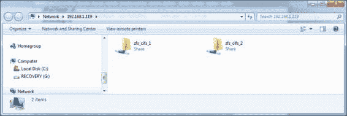
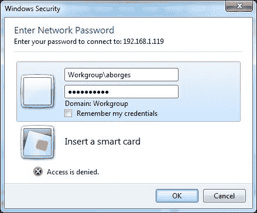
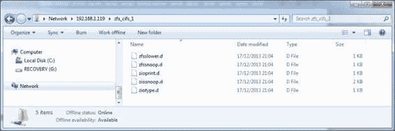

# 第二章：ZFS

在本章中，我们将覆盖以下内容：

+   创建 ZFS 存储池和文件系统

+   玩转 ZFS 故障和属性

+   创建 ZFS 快照和克隆

+   在 ZFS 文件系统中执行备份

+   处理日志和缓存

+   管理存储池中的设备

+   配置备用磁盘

+   处理 ZFS 快照和克隆

+   玩转 COMSTAR

+   镜像根池

+   ZFS 阴影

+   使用 SMB 共享配置 ZFS 共享

+   设置和获取其他 ZFS 属性

+   玩转 ZFS 交换空间

# 引言

ZFS 是 Oracle Solaris 11 提供的 128 位事务文件系统，它支持 256 万亿个目录条目，没有文件数量的上限，并且始终在磁盘上保持一致性。Oracle Solaris 11 将 ZFS 作为默认文件系统，提供一些功能，如存储池、快照、克隆和卷。在管理 ZFS 对象时，第一步是创建一个 ZFS 存储池。存储池可以由整个磁盘、文件和切片组成，考虑到任何提到的块设备的最小大小是 128 MB。此外，在创建 ZFS 存储池时，可用的 RAID 配置包括条带（RAID 0）、镜像（RAID 1）和 RAID-Z（类似于 RAID-5）。镜像和 RAID-Z 配置都支持一个名为自愈数据的功能，通过保护数据来工作。在这种情况下，当磁盘上出现坏块时，ZFS 框架会从另一个复制的磁盘中获取相同的块来修复原始坏块。RAID-Z 提供三种变体：raidz1（类似于 RAID-5），使用至少三个磁盘（两个数据磁盘和一个奇偶校验磁盘）；raidz2（类似于 RAID-6），使用至少五个磁盘（3D 和 2P）；以及 raidz3（类似于 RAID-6，但具有额外的奇偶校验级别），使用至少八个磁盘（5D 和 3P）。

# 创建 ZFS 存储池和文件系统

要开始玩转 ZFS，第一步是创建一个存储池，之后所有的文件系统都会在这些存储池中创建。为了完成存储池的创建，我们需要决定使用哪种 RAID 配置（条带、镜像或 RAID-Z）来创建存储池，然后再在其上创建文件系统。

## 准备工作

要遵循此步骤，必须使用一台运行 Oracle Solaris 11 的虚拟机（VMware 或 VirtualBox），并且该虚拟机需要有 4 GB 的内存和八个 4 GB 的磁盘。虚拟机启动并运行后，作为 root 用户登录并打开终端。

## 如何做…

存储池是一个逻辑对象，它代表存储的物理特性，必须在其他任何操作之前创建。创建存储池的第一步是列出系统中所有可用的磁盘，并选择将要使用的磁盘，可以通过以 root 角色运行以下命令来完成：

```
root@solaris11-1:~# format
Searching for disks...done

AVAILABLE DISK SELECTIONS:
       0\. c8t0d0 <VBOX-HARDDISK-1.0-80.00GB>
          /pci@0,0/pci1000,8000@14/sd@0,0
       1\. c8t1d0 <VBOX-HARDDISK-1.0-16.00GB>
          /pci@0,0/pci1000,8000@14/sd@1,0
       2\. c8t2d0 <VBOX-HARDDISK-1.0-4.00GB>
          /pci@0,0/pci1000,8000@14/sd@2,0
       3\. c8t3d0 <VBOX-HARDDISK-1.0 cyl 2046 alt 2 hd 128 sec 32>
          /pci@0,0/pci1000,8000@14/sd@3,0
       4\. c8t4d0 <VBOX-HARDDISK-1.0 cyl 2046 alt 2 hd 128 sec 32>
          /pci@0,0/pci1000,8000@14/sd@4,0
       5\. c8t5d0 <VBOX-HARDDISK-1.0 cyl 2046 alt 2 hd 128 sec 32>
          /pci@0,0/pci1000,8000@14/sd@5,0
       6\. c8t6d0 <VBOX-HARDDISK-1.0 cyl 2046 alt 2 hd 128 sec 32>
          /pci@0,0/pci1000,8000@14/sd@6,0
       7\. c8t8d0 <VBOX-HARDDISK-1.0 cyl 2046 alt 2 hd 128 sec 32>
          /pci@0,0/pci1000,8000@14/sd@8,0
       8\. c8t9d0 <VBOX-HARDDISK-1.0 cyl 2046 alt 2 hd 128 sec 32>
          /pci@0,0/pci1000,8000@14/sd@9,0
       9\. c8t10d0 <VBOX-HARDDISK-1.0 cyl 2046 alt 2 hd 128 sec 32>
          /pci@0,0/pci1000,8000@14/sd@a,0
      10\. c8t11d0 <VBOX-HARDDISK-1.0 cyl 2046 alt 2 hd 128 sec 32>
          /pci@0,0/pci1000,8000@14/sd@b,0
Specify disk (enter its number):
```

在选择磁盘后，创建一个`zpool create`存储池，并使用`zpool list`和`zpool status`命令验证此池的信息。在这些步骤之前，我们必须决定池的配置：stripe（默认），mirror，raidz，raidz2 或 raidz3。如果没有指定配置，默认假设为 stripe（raid0）。然后，通过运行以下命令创建池：

```
root@solaris11-1:~# zpool create oracle_stripe_1 c8t3d0 c8t4d0
'oracle_stripe_1' successfully created, but with no redundancy; failure of one device will cause loss of the pool
```

要列出池，请执行以下命令：

```
root@solaris11-1:~# zpool list oracle_stripe_1
NAME              SIZE   ALLOC  FREE   CAP  DEDUP  HEALTH  ALTROOT
oracle_stripe_1   7.94G  122K   7.94G  0%   1.00x  ONLINE  -
```

要验证池的状态，请运行以下命令：

```
root@solaris11-1:~# zpool status oracle_stripe_1
  pool: oracle_stripe_1
 state: ONLINE
  scan: none requested
config:

  NAME             STATE     READ WRITE CKSUM
  oracle_stripe_1  ONLINE       0     0     0
  c8t3d0           ONLINE       0     0     0
  c8t4d0           ONLINE       0     0     0

errors: No known data errors
```

尽管这超出了本章的范围，但我们可以通过运行以下命令列出一些相关的性能信息：

```
root@solaris11-1:~# zpool iostat -v oracle_stripe_1
                  capacity       operations    bandwidth
pool              alloc   free   read  write   read  write
----------------  -----  -----  -----  -----  -----  -----
oracle_stripe_1   128K    7.94G    0      0    794     56
  c8t3d0          53K     3.97G    0      0    391     24
  c8t4d0          74.5K   3.97G    0      0    402     32
----------------  -----  -----  -----  -----  -----  -----
```

如果需要，可以使用相同的命令创建第二个和第三个存储池，但要使用不同的磁盘，并分别切换到`mirror`和`raidz`配置。此任务可以通过运行以下命令来完成：

```
root@solaris11-1:~# zpool create oracle_mirror_1 mirror c8t5d0 c8t6d0
root@solaris11-1:~# zpool list oracle_mirror_1
NAME              SIZE   ALLOC  FREE   CAP  DEDUP  HEALTH  ALTROOT
oracle_mirror_1   3.97G  85K    3.97G  0%   1.00x  ONLINE  -
root@solaris11-1:~# zpool status oracle_mirror_1
  pool: oracle_mirror_1
 state: ONLINE
  scan: none requested
config:
  NAME             STATE      READ  WRITE  CKSUM
  oracle_mirror_1  ONLINE       0     0      0
  mirror-0         ONLINE       0     0      0
  c8t5d0           ONLINE       0     0      0
  c8t6d0           ONLINE       0     0      0

errors: No known data errors
root@solaris11-1:~# zpool create oracle_raidz_1 raidz c8t8d0 c8t9d0 c8t10d0
root@solaris11-1:~# zpool list oracle_raidz_1
NAME             SIZE  ALLOC   FREE  CAP  DEDUP  HEALTH  ALTROOT
oracle_raidz_1  11.9G   176K  11.9G   0%  1.00x  ONLINE  -
root@solaris11-1:~# zpool status oracle_raidz_1
pool: oracle_raidz_1
 state: ONLINE
  scan: none requested
config:

  NAME            STATE     READ WRITE CKSUM
  oracle_raidz_1  ONLINE       0     0     0
  raidz1-0        ONLINE       0     0     0
  c8t8d0          ONLINE       0     0     0
  c8t9d0          ONLINE       0     0     0
  c8t10d0         ONLINE       0     0     0

errors: No known data errors
```

存储池创建完成后，是时候在这些池中创建文件系统了。首先，让我们在`oracle_stripe_1`池中创建一个名为`zfs_stripe_1`的文件系统。执行以下命令：

```
root@solaris11-1:~# zfs create oracle_stripe_1/zfs_stripe_1

```

使用相同的语法，很容易在`oracle_mirror_1`和`oracle_raidz_1`中分别创建名为`zfs_mirror_1`和`zfs_raidz_1`的两个新文件系统：

```
root@solaris11-1:~# zfs create oracle_mirror_1/zfs_mirror_1
root@solaris11-1:~# zfs create oracle_raidz_1/zfs_raidz_1

```

最近创建的文件系统列表可以通过运行以下命令获取：

```
root@solaris11-1:~# zfs list
NAME                            USED   AVAIL  REFER  MOUNTPOINT
(truncated output)
oracle_mirror_1                 124K   3.91G  32K    /oracle_mirror_1
oracle_mirror_1/zfs_mirror_1    31K    3.91G  31K  /oracle_mirror_1/zfs_mirror_1
oracle_raidz_1                  165K   7.83G  36.0K  /oracle_raidz_1
oracle_raidz_1/zfs_raidz_1      34.6K  7.83G  34.6K  /oracle_raidz_1/zfs_raidz_1
oracle_stripe_1                 128K   7.81G  32K    /oracle_stripe_1
oracle_stripe_1/zfs_stripe_1    31K    7.81G  31K  /oracle_stripe_1/zfs_stripe_1
(truncated output)
root@solaris11-1:~# zfs list oracle_stripe_1 oracle_mirror_1 oracle_raidz_1
NAME             USED  AVAIL  REFER  MOUNTPOINT
oracle_mirror_1  124K  3.91G    32K  /oracle_mirror_1
oracle_raidz_1   165K  7.83G  36.0K  /oracle_raidz_1
oracle_stripe_1  128K  7.81G    32K  /oracle_stripe_1
```

ZFS 引擎已经为所有创建的文件系统自动创建了挂载点目录，并且已将其挂载。也可以通过执行以下命令来验证这一点：

```
root@solaris11-1:~# zfs mount
rpool/ROOT/solaris              /
rpool/ROOT/solaris/var          /var
rpool/VARSHARE                  /var/share
rpool/export                    /export
rpool/export/home               /export/home
oracle_mirror_1                 /oracle_mirror_1
oracle_mirror_1/zfs_mirror_1    /oracle_mirror_1/zfs_mirror_1
oracle_stripe_1                 /oracle_stripe_1
oracle_stripe_1/zfs_stripe_1    /oracle_stripe_1/zfs_stripe_1
rpool                           /rpool
oracle_raidz_1                  /oracle_raidz_1
oracle_raidz_1/zfs_raidz_1      /oracle_raidz_1/zfs_raidz_1
```

最后的两行确认我们创建的 ZFS 文件系统已经挂载并准备好使用。

### 本教程概览

本教程教我们如何创建具有不同配置的存储池，如 stripe，mirror 和 raidz。此外，我们还学习了如何在这些池中创建文件系统。

# 操作 ZFS 故障和属性

ZFS 完全基于可以改变存储池和文件系统行为的属性。本教程将涉及 ZFS 中的一些重要属性，我们将学习如何处理这些属性。

## 准备工作

为了跟随本教程，需要使用一个虚拟机（VMware 或 VirtualBox），该虚拟机运行 Oracle Solaris 11，具有 4 GB RAM 和八个 4 GB 磁盘。虚拟机启动并运行后，作为 root 用户登录并打开终端。

## 如何操作……

每个 ZFS 对象都有可以访问且大多数情况下可以更改的属性。例如，要获取池的属性，我们必须执行以下命令：

```
root@solaris11-1:~# zpool get all oracle_mirror_1
NAME                PROPERTY       VALUE               SOURCE
(truncated output)
oracle_mirror_1     bootfs         -                   default
oracle_mirror_1     cachefile      -                   default
oracle_mirror_1     capacity       0%                  -
oracle_mirror_1     dedupditto     0                   default
oracle_mirror_1     dedupratio     1.00x               -
oracle_mirror_1     delegation     on                  default
oracle_mirror_1     failmode       wait                default
oracle_mirror_1     free           3.97G               -
oracle_mirror_1     guid           730796695846862911  -
(truncated output)

```

从先前输出的一些有用信息中，我们可以看到空闲空间为 3.97 GB（`free`属性），池处于在线状态（`health`属性），并且总容量的`0%`已被使用（`capacity`属性）。如果我们需要了解与池相关的任何问题（参考`health`属性），建议通过运行以下命令获取此信息：

```
root@solaris11-1:~# zpool status -x 
all pools are health
root@solaris11-1:~# zpool status -x oracle_mirror_1
pool 'oracle_mirror_1' is healthy
root@solaris11-1:~# zpool status oracle_mirror_1
  pool: oracle_mirror_1
 state: ONLINE
  scan: none requested
config:

    NAME             STATE     READ WRITE CKSUM
    oracle_mirror_1  ONLINE       0     0     0
    mirror-0         ONLINE       0     0     0
    c8t5d0           ONLINE       0     0     0
    c8t6d0           ONLINE       0     0     0
```

另一种检查指定存储池中所有数据是否正常的绝佳方法是使用 `zpool scrub` 命令，它检查校验和是否正确，并且对于复制设备（例如镜像和 raidz 配置），`zpool scrub` 命令会修复发现的问题。为了跟踪 `zpool scrub` 结果，可以使用 `zpool status` 命令，方法如下：

```
root@solaris11-1:~# zpool scrub oracle_mirror_1
root@solaris11-1:~# zpool status oracle_mirror_1
  pool: oracle_mirror_1
 state: ONLINE
scan: scrub in progress since Tue Jun 10 04:04:56 2014
    2.53G scanned out of 3.91G at 24.0M/s, 0h1m to go
    0 repaired, 64.71% done
config:

    NAME             STATE     READ WRITE CKSUM
    oracle_mirror_1  ONLINE       0     0     0
    mirror-0         ONLINE       0     0     0
    c8t5d0           ONLINE       0     0     0
    c8t6d0           ONLINE       0     0     0
```

一段时间后，如果一切顺利，同样的 `zpool` 状态命令应显示以下输出：

```
root@solaris11-1:~# zpool status oracle_mirror_1
  pool: oracle_mirror_1
 state: ONLINE
scan: scrub repaired 0 in 0h4m with 0 errors on Tue Jun 10 04:09:48 2014
config:

    NAME             STATE     READ WRITE CKSUM
    oracle_mirror_1  ONLINE    0     0     0
        mirror-0  ONLINE       0     0     0
          c8t5d0  ONLINE       0     0     0
          c8t6d0  ONLINE       0     0     0
```

在分析可能的磁盘错误时，以下 `zpool history` 命令可能非常有用，能够显示池上发生的所有事件：

```
root@solaris11-1:~# zpool history oracle_mirror_1
History for 'oracle_mirror_1':
2013-11-27.19:14:15 zpool create oracle_mirror_1 mirror c8t5d0 c8t6d0
2013-11-27.19:57:31 zfs create oracle_mirror_1/zfs_mirror_1
(truncated output)

```

Oracle Solaris 故障管理器通过其 `fmd` 守护进程提供了一个框架，接收系统检测到的潜在问题信息，对这些问题进行诊断，并最终采取主动措施以保持系统完整性，例如禁用内存模块。因此，该框架提供了以下 `fmadm` 命令，当与 `faulty` 参数一起使用时，显示 Oracle Solaris 故障管理器认为有故障的资源信息：

```
root@solaris11-1:~# fmadm faulty

```

以下 `dmesg` 命令确认任何可疑的硬件错误：

```
root@solaris11-1:~# dmesg

```

从 `zpool status` 命令中，可以看到 `status` 字段的一些可能值：

+   `ONLINE`：这意味着池是正常的

+   `FAULTED`：这意味着池存在故障

+   `OFFLINE`：这意味着池被管理员禁用

+   `DEGRADED`：这意味着某些东西（很可能是磁盘）出现了故障，但池仍在工作

+   `REMOVED`：这意味着磁盘进行了热插拔

+   `UNAVAIL`：这意味着设备或虚拟设备无法打开

回到 ZFS 属性，可以通过运行以下命令轻松获取 ZFS 文件系统的属性信息：

```
root@solaris11-1:~# zfs list -r oracle_mirror_1
NAME                          USED  AVAIL  REFER  MOUNTPOINT
oracle_mirror_1               124K  3.91G    32K  /oracle_mirror_1
oracle_mirror_1/zfs_mirror_1   31K  3.91G    31K  /oracle_mirror_1/zfs_mirror_1
root@solaris11-1:~# zfs get all oracle_mirror_1/zfs_mirror_1
NAME                          PROPERTY          VALUE         SOURCE
oracle_mirror_1/zfs_mirror_1  aclinherit        restricted    default
oracle_mirror_1/zfs_mirror_1  aclmode           discard       default
oracle_mirror_1/zfs_mirror_1  atime             on            default
oracle_mirror_1/zfs_mirror_1  available         3.91G         -
oracle_mirror_1/zfs_mirror_1  canmount          on            default
oracle_mirror_1/zfs_mirror_1  casesensitivity   mixed         -
oracle_mirror_1/zfs_mirror_1  checksum          on            default
(truncated output)

```

前两条命令需要做一些解释——`zfs list –r` 显示了 `oracle_mirror_1` 存储池下的所有数据集（文件系统、快照、克隆等）。此外，`zfs get all oracle_mirror_1/zfs_mirror_1` 显示了 `zfs_mirror_1` 文件系统的所有属性。

文件系统有许多属性（其中一些是只读的，其他是读写的），建议了解其中的一些属性。几乎所有属性都是可继承的——子对象（例如快照或克隆对象）会继承父对象（例如文件系统）配置的值。

设置属性值的方法是执行以下命令：

```
root@solaris11-1:~# zfs set mountpoint=/oracle_mirror_1/another_point oracle_mirror_1/zfs_mirror_1
root@solaris11-1:~# zfs list -r oracle_mirror_1
NAME                          USED  AVAIL  REFER  MOUNTPOINT
oracle_mirror_1               134K  3.91G    32K  /oracle_mirror_1
oracle_mirror_1/zfs_mirror_1   31K  3.91G    31K  /oracle_mirror_1/another_point
```

旧的挂载点被重命名为 `/oracle_mirror_1/another_point` 目录，并重新挂载。稍后我们将回到这一点并查看一些属性。

当有需要时，可以通过运行以下命令重命名 ZFS 文件系统：

```
root@solaris11-1:~# zfs rename oracle_stripe_1/zfs_stripe_1 oracle_stripe_1/zfs_test_1
root@solaris11-1:~# zfs list -r oracle_stripe_1
NAME                         USED  AVAIL  REFER  MOUNTPOINT
oracle_stripe_1              128K  7.81G    32K  /oracle_stripe_1
oracle_stripe_1/zfs_test_1   31K   7.81G    31K  /oracle_stripe_1/zfs_test_1
root@solaris11-1:~# df -h /oracle_stripe_1/*
Filesystem             Size   Used  Available Capacity  Mounted on
oracle_stripe_1/zfs_test_1
                       7.8G    31K       7.8G     1%    /oracle_stripe_1/zfs_test_1
```

Oracle Solaris 11 自动更改了重命名的文件系统的挂载点，并重新挂载了该文件系统。

要销毁 ZFS 文件系统或存储池，不能有任何访问数据集的进程。例如，如果我们尝试在某个进程正在使用该目录时删除`zfs_test`文件系统，就会收到错误：

```
root@solaris11-1:~# cd /oracle_stripe_1/zfs_test_1
root@solaris11-1:~# zfs list -r oracle_stripe_1
NAME                          USED  AVAIL  REFER  MOUNTPOINT
oracle_stripe_1               128K  7.81G    32K  /oracle_stripe_1
oracle_stripe_1/zfs_test_1  31.5K  7.81G  31.5K  /oracle_stripe_1/zfs_test_1
root@solaris11-1:~# zfs destroy oracle_stripe_1/zfs_test_1
cannot unmount '/oracle_stripe_1/zfs_test_1': Device busy
```

本案例提供了几种可能性——首先（也是最推荐的）是了解哪些进程或应用程序正在使用提到的文件系统。一旦找到有罪的进程或应用程序，下一步就是停止它们。因此，可以在不丢失任何数据的情况下解决所有问题。然而，如果找不到有罪的进程的可能性，那么杀死有问题的进程将是一个可行且不可预测的选项，其中可能会发生数据丢失。最后，使用`-f`选项会引起*强制销毁*，显然这是不可取的，可能会导致数据丢失。以下是通过运行以下命令的第二个过程（杀死有问题的进程）：

```
root@solaris11-1:~# fuser -cu /oracle_stripe_1/zfs_test_1
/oracle_stripe_1/zfs_test_1:     1977c(root)
root@solaris11-1:~# ps -ef | grep 1977
    root  1977  1975   0 07:03:14 pts/1       0:00 bash
```

我们使用了`fuser`命令，它使我们能够查找访问特定文件或目录的进程。因此，根据前两个输出，有一个进程正在使用`/oracle_stripe_1/zfs_test_1`文件系统，而`ps –ef`命令显示`bash`进程是罪魁祸首，这是正确的，因为在尝试删除之前我们已经更改了挂载点。要解决这个问题，只需保留`/oracle_stripe_1/zfs_test_1`目录即可。不过，如果我们不知道如何解决这个问题，最后的办法就是运行以下命令杀死有问题的进程：

```
root@solaris11-1:~# kill -9 1977

```

此时，没有进程访问文件系统，因此可能会将其销毁：

```
root@solaris11-1:~# zfs destroy oracle_stripe_1/zfs_test_1

```

要验证文件系统是否正确销毁，请执行以下命令：

```
root@solaris11-1:~# zfs list -r oracle_stripe_1
NAME              USED   AVAIL  REFER  MOUNTPOINT
oracle_stripe_1   89.5K  7.81G    31K  /oracle_stripe_1
```

一切顺利进行，文件系统被销毁。然而，如果在此文件系统下存在快照或克隆（我们将在下一个操作步骤中查看和学习它们），我们将无法删除文件系统，并且应该使用相同的命令并加上`–r`选项（用于快照内部）或`–R`选项（用于快照和克隆内部）。从这里开始，还可以使用`zpool destroy`命令销毁整个池。然而，我们应该注意一个细节——如果没有任何进程使用要销毁池中任何文件系统，Oracle Solaris 11 在销毁池时不会询问任何关于销毁池的问题。池中的所有内容都将被销毁，不会有任何提示（这与 Windows 系统不同，在执行危险操作前会提示警告）。为了证明这个说法，在下一个示例中，我们将在`oracle_stripe_1`池中创建一个文件系统，向其中放入一些信息，最后将销毁所有池：

```
root@solaris11-1:~# zfs list -r oracle_stripe_1
NAME              USED  AVAIL  REFER  MOUNTPOINT
oracle_stripe_1  89.5K  7.81G    31K  /oracle_stripe_1
root@solaris11-1:~# zfs create oracle_stripe_1/fs_1
root@solaris11-1:~# cp /etc/[a-e]* /oracle_stripe_1/fs_1
root@solaris11-1:~# zfs list -r oracle_stripe_1     
NAME                   USED  AVAIL  REFER  MOUNTPOINT
oracle_stripe_1       4.01M  7.81G    35K  /oracle_stripe_1
oracle_stripe_1/fs_1  82.5K  7.81G  82.5K  /oracle_stripe_1/fs_1
root@solaris11-1:~# zpool list oracle_stripe_1
NAME              SIZE  ALLOC   FREE  CAP  DEDUP  HEALTH  ALTROOT
oracle_stripe_1  7.94G  4.01M  7.93G   0%  1.00x  ONLINE  -
root@solaris11-1:~# zpool destroy oracle_stripe_1
root@solaris11-1:~# zpool list
NAME              SIZE  ALLOC   FREE  CAP  DEDUP  HEALTH  ALTROOT
iscsi_pool       3.97G  2.62M  3.97G   0%  1.00x  ONLINE  -
oracle_mirror_1  3.97G   134K  3.97G   0%  1.00x  ONLINE  -
oracle_raidz_1   11.9G   248K  11.9G   0%  1.00x  ONLINE  -
repo_pool        15.9G  7.64G  8.24G  48%  1.00x  ONLINE  -
rpool            79.5G  31.8G
```

### 配方概述

通过使用`zpool`和`zfs`命令，我们创建、列出、重命名和销毁了池和文件系统。此外，我们还学习了如何查看和修改属性，特别是对日常 ZFS 管理至关重要的挂载点属性。我们还学习了如何查看池历史、监控池并收集关于相关池故障的重要信息。

# 创建 ZFS 快照和克隆

ZFS 快照和克隆在 ZFS 框架和 Oracle Solaris 11 中扮演着重要角色，因为这些功能有许多用途，其中之一就是执行备份和从 ZFS 文件系统恢复文件。例如，当 ZFS 文件系统出现损坏或用户丢失特定文件时，快照可能非常有用。使用 ZFS 快照可以将 ZFS 文件系统完全回滚到某个特定的时间点或日期。

## 准备工作

要遵循这个步骤，需要使用一台虚拟机（VMware 或 VirtualBox），运行 Oracle Solaris 11，配置 4 GB 的内存和 8 块 4 GB 的磁盘。一旦虚拟机启动并运行，作为 root 用户登录并打开终端。

## 如何操作…

创建快照是一个基本任务，可以通过运行以下命令来执行：

```
root@solaris11-1:~# zpool create pool_1 c8t3d0
root@solaris11-1:~# zfs create pool_1/fs_1

```

在继续之前，我建议我们将一些大文件复制到`pool_1/fs_1`文件系统中。在这个例子中，我使用了系统中已有的文件，但你可以将任何文件复制到文件系统中。运行以下命令：

```
root@solaris11-1:~# cp -r mh* jo* /pool_1/fs_1/
root@solaris11-1:~# zfs list -r pool_1/fs_1 
NAME          USED  AVAIL  REFER  MOUNTPOINT
pool_1/fs_1  63.1M  3.85G  63.1M  /pool_1/fs_1
```

最后，我们通过运行以下命令来创建快照：

```
root@solaris11-1:~# zfs snapshot pool_1/fs_1@snap1

```

默认情况下，即使使用`zfs list -r`命令，快照也不会显示：

```
root@solaris11-1:~# zfs list -r pool_1
NAME          USED  AVAIL  REFER  MOUNTPOINT
pool_1       63.2M  3.85G    32K  /pool_1
pool_1/fs_1  63.1M  3.85G  63.1M  /pool_1/fs_1
```

这种行为由池的`listsnapshots`属性控制（其默认值为`off`）：

```
root@solaris11-1:~# zpool get listsnapshots pool_1
NAME    PROPERTY       VALUE  SOURCE
pool_1  listsnapshots  off    local
```

需要将`listsnapshots`修改为`on`，以更改此行为：

```
root@solaris11-1:~# zpool set listsnapshots=on pool_1
root@solaris11-1:~# zfs list -r pool_1
NAME                USED  AVAIL  REFER  MOUNTPOINT
pool_1             63.2M  3.85G    32K  /pool_1
pool_1/fs_1        63.1M  3.85G  63.1M  /pool_1/fs_1
pool_1/fs_1@snap1      0      -  63.1M  -
```

一切按计划进行。然而，当执行前面的命令时，所有数据集（文件系统和快照）都会被列出。为了仅列出快照，需要使用`–t`选项指定过滤器，如下所示：

```
root@solaris11-1:~# zfs list -t snapshot
NAME                                         USED  AVAIL  REFER  MOUNTPOINT
pool_1/fs_1@snap1                               0      -  63.1M  -
rpool/ROOT/solaris@install                   106M      -  3.52G  -
rpool/ROOT/solaris@2013-10-10-22:27:20       219M      -  3.77G  -
rpool/ROOT/solaris@2013-11-26-08:38:27      1.96G      -  24.2G  -
rpool/ROOT/solaris/var@install              63.0M      -   189M  -
rpool/ROOT/solaris/var@2013-10-10-22:27:20  66.5M      -   200M  -
rpool/ROOT/solaris/var@2013-11-26-08:38:27   143M      -   291M  -
```

之前的命令如预期地仅显示了现有的快照。一个有趣的事实是，快照存在于文件系统内部，最初它们不会占用磁盘空间。然而，随着文件系统的更改，快照会占用空闲空间，这可能是一个大问题。考虑到这一点，`SIZE`属性的值为零，而`REFER`为`63.1M`，这正是`pool_1/fs_1`文件系统的确切大小。

`REFER`字段值得解释——当在任何 IT 领域解释快照时，分类都是一样的。快照有物理快照和逻辑快照。物理快照占用与参考文件系统相同的空间，并且在读/写操作期间两者不会相互影响。创建快照需要较长时间，因为它是参考文件系统中所有内容的“复制”。在这种情况下，快照是一个静态图像，表示创建快照时文件系统的确切状态。此后，快照将不再与参考文件系统同步。如果管理员希望两者保持同步，必须手动操作。

另一种分类，逻辑快照，与物理快照完全不同。当创建逻辑快照时，只会创建指向参考文件系统数据的指针，但快照内部没有数据。这个过程非常快，且占用的磁盘空间很小。缺点是任何读操作都会影响参考文件系统。还有两个附加效果——当参考文件系统中的某些数据发生变化时，操作系统会将要修改的数据复制到快照中，再进行修改（这个过程叫做**写时复制**（**COW**））。为什么？因为我们之前解释过，快照是参考文件系统在某一时刻的静态图像。如果某些数据发生变化，快照必须保持不变，并且必须包含创建时的相同数据。第二个更严重的后果是，如果参考文件系统丢失，所有快照都会失效。为什么？因为参考文件系统不再存在，所有的指针都会变得无效。

回到`REFER`字段的解释；它表示在快照中，指针引用了参考文件系统中的多少数据。克隆是文件系统的一个副本，并且是基于快照的，因此创建克隆之前，必须先创建快照。然而，克隆和快照之间有一个根本性的区别——快照是只读对象，而克隆是读/写对象。因此，我们可以像写入文件系统一样在克隆中进行写操作。另一个有趣的事实是，由于在创建克隆之前必须存在快照，克隆依赖于快照，且两者必须在同一个池中创建。通过执行以下命令可以创建一个池：

```
root@solaris11-1:~# zfs clone pool_1/fs_1@snap1 pool_1/clone_1 
root@solaris11-1:~# zfs list -r pool_1
NAME                USED  AVAIL  REFER  MOUNTPOINT
pool_1             63.2M  3.85G    33K  /pool_1
pool_1/clone_1       25K  3.85G  63.1M  /pool_1/clone_1
pool_1/fs_1        63.1M  3.85G  63.1M  /pool_1/fs_1
pool_1/fs_1@snap1      0      -  63.1M  -
```

如果我们看一下这个输出，区分克隆和文件系统是比较复杂的。然而，我们可以收集足够的细节来区分这些数据集：

```
root@solaris11-1:~# zfs get origin pool_1/fs_1
NAME         PROPERTY  VALUE  SOURCE
pool_1/fs_1  origin    -      -
root@solaris11-1:~# zfs get origin pool_1/fs_1@snap1
NAME               PROPERTY  VALUE  SOURCE
pool_1/fs_1@snap1  origin    -      -
root@solaris11-1:~# zfs get origin pool_1/clone_1   
NAME            PROPERTY  VALUE              SOURCE
pool_1/clone_1  origin    pool_1/fs_1@snap1  -
```

`origin`属性与池和快照无关，但当在克隆上下文中分析此属性时，它会告诉我们克隆来源于`pool1_/fs_1@snap1`快照。因此，通过运行以下命令，我们可以确认`pool_1/fs_1@snap1`确实是一个快照：

```
root@solaris11-1:~# zfs get type pool_1/fs_1@snap1
NAME               PROPERTY  VALUE     SOURCE
pool_1/fs_1@snap1  type      snapshot  -
```

在 ZFS 中，对象创建顺序是`pool` | `filesystem` | `snapshot` | `clone`。因此，销毁顺序应为相反顺序：`clone` | `snapshot` | `filesystem` | `pool`。通过使用特别选项，我们可以跳过某些步骤，这些选项将在稍后介绍。

例如，如果我们尝试销毁包含快照的文件系统，将显示以下错误：

```
root@solaris11-1:~# zfs destroy pool_1/fs_1
cannot destroy 'pool_1/fs_1': 
filesystem has children
use '-r' to destroy the following datasets:
pool_1/fs_1@snap1
```

同样地，如果我们在没有先移除克隆的情况下尝试销毁快照，将显示以下信息：

```
root@solaris11-1:~# zfs destroy pool_1/fs_1@snap1
cannot destroy 'pool_1/fs_1@snap1': 
snapshot has dependent clones
use '-R' to destroy the following datasets:
pool_1/clone_1
```

最后两个案例表明，必须按照正确的顺序销毁 ZFS 中的数据集。请执行以下命令：

```
root@solaris11-1:~# zfs list -r pool_1
NAME                USED  AVAIL  REFER  MOUNTPOINT
pool_1             63.2M  3.85G    33K  /pool_1
pool_1/clone_1       25K  3.85G  63.1M  /pool_1/clone_1
pool_1/fs_1        63.1M  3.85G  63.1M  /pool_1/fs_1
pool_1/fs_1@snap1      0      -  63.1M  -
root@solaris11-1:~# zfs destroy pool_1/clone_1
root@solaris11-1:~# zfs destroy pool_1/fs_1@snap1
root@solaris11-1:~# zfs destroy pool_1/fs_1
root@solaris11-1:~# zfs list -r pool_1 
NAME     USED  AVAIL  REFER  MOUNTPOINT
pool_1  98.5K  3.91G    31K  /pool_1
```

当按照正确的顺序执行时，您可以逐个销毁每个数据集，尽管正如我们之前提到的，实际上可以跳过某些步骤。接下来的步骤展示了如何做到这一点。请执行以下命令：

```
root@solaris11-1:~# zfs destroy -R pool_1/fs_1
root@solaris11-1:~# zfs list -r pool_1
NAME    USED  AVAIL  REFER  MOUNTPOINT
pool_1   91K  3.91G    31K  /pool_1
root@solaris11-1:~#
```

最后，我们使用了`-R`选项，一切都被销毁了——包括克隆、快照和文件系统。

### 本教程概述

我们学习了如何管理快照和克隆，包括如何创建、列出、区分和销毁它们。最后，这就结束了我们关于 ZFS 基础的复习。

# 在 ZFS 文件系统中执行备份

十年前，我从未考虑过学习如何使用任何备份软件，老实说，我不喜欢这类软件，因为我觉得它们太简单了。如今，我明白自己当时是多么错误。

管理和操作备份软件是 IT 中最基本的活动，它是抵御黑客攻击的最后防线。顺便说一下，黑客正在利用各种资源——恶意软件、木马、病毒、蠕虫和间谍软件来赢得这场战争，只有文件服务器和应用程序的备份才能挽救公司。

Oracle Solaris 11 提供了一种简单的解决方案，由两个命令（`zfs send`和`zfs recv`）组成，用于备份 ZFS 文件系统数据。在备份操作中，数据以流的形式生成，并通过网络（使用`zfs send`命令）发送到另一个 Oracle Solaris 11 系统，该系统接收该流（使用`zfs recv`）。

Oracle Solaris 11 能够生成两种类型的流：复制流，它包括文件系统及其所有依赖的数据集（快照和克隆）；递归流，它包括文件系统和克隆，但不包括快照。默认的流类型是复制流。

本教程将向您展示如何执行备份和恢复操作。

## 准备工作

要跟随本教程，您需要两台运行 Oracle Solaris 11 的虚拟机（VMware 或 VirtualBox），每台虚拟机需要 4 GB 内存和 8 块 4 GB 的硬盘。教程中使用的系统名为`solaris11-1`和`solaris11-2`。

## 如何执行…

所有 ZFS 备份操作都基于快照。本过程将从头开始执行——创建池、文件系统和快照，然后执行备份。请执行以下命令：

```
root@solaris11-1:~# zpool create backuptest_pool c8t5d0
root@solaris11-1:~# zfs create backuptest_pool/zfs1
root@solaris11-1:~# cp /etc/[a-p]* /backuptest_pool/zfs1
root@solaris11-1:/# ls -l /backuptest_pool/zfs1/
total 399
-rw-r--r--   1 root     root        1436 Dec 13 03:30 aliases
-rw-r--r--   1 root     root         182 Dec 13 03:30 auto_home
-rw-r--r--   1 root     root         220 Dec 13 03:30 auto_master
-rw-r--r--   1 root     root        1931 Dec 13 03:30 dacf.conf
(truncated output)
root@solaris11-1:/# zfs list backuptest_pool/zfs1 
NAME                  USED  AVAIL  REFER  MOUNTPOINT
backuptest_pool/zfs1  214K  3.91G   214K  /backuptest_pool/zfs1
root@solaris11-1:/# zfs snapshot backuptest_pool/zfs1@backup1
root@solaris11-1:/# zpool listsnapshots=on backuptest_pool 
root@solaris11-1:/# zfs list -r backuptest_pool
NAME                          USED  AVAIL  REFER  MOUNTPOINT
backuptest_pool               312K  3.91G    32K  /backuptest_pool
backuptest_pool/zfs1          214K  3.91G   214K  /backuptest_pool/zfs1
backuptest_pool/zfs1@backup1     0      -   214K  -
```

以下命令会从 `backuptest_pool/zfs1` 文件系统中删除一些文件：

```
root@solaris11-1:/# cd /backuptest_pool/zfs1/
root@solaris11-1:/backuptest_pool/zfs1# rm [a-k]*
root@solaris11-1:/backuptest_pool/zfs1# ls -l
total 125
-rw-r--r--   1 root     root        2986 Dec 13 03:30 name_to_major
-rw-r--r--   1 root     root        3090 Dec 13 03:30 name_to_sysnum
-rw-r--r--   1 root     root        7846 Dec 13 03:30 nanorc
-rw-r--r--   1 root     root        1321 Dec 13 03:30 netconfig
-rw-r--r--   1 root     root         487 Dec 13 03:30 netmasks
-rw-r--r--   1 root     root         462 Dec 13 03:30 networks
-rw-r--r--   1 root     root        1065 Dec 13 03:30 nfssec.conf
……….
(truncated output)

```

我们遗漏了一个关于快照的非常有趣的事实——当文件从文件系统中删除时，它并不会永远消失。每个文件系统中都有一个名为 `.zfs` 的隐藏目录；它包含快照，所有删除的文件都会进入这个隐藏目录下的一个子目录。我们来看以下命令：

```
root@solaris11-1:~# cd /backuptest_pool/zfs1/.zfs
root@solaris11-1:/backuptest_pool/zfs1/.zfs# ls
shares    snapshot
root@solaris11-1:/backuptest_pool/zfs1/.zfs# cd snapshot/
root@solaris11-1:/backuptest_pool/zfs1/.zfs/snapshot# ls
backup1
root@solaris11-1:/backuptest_pool/zfs1/.zfs/snapshot# cd backup1/
root@solaris11-1:/backuptest_pool/zfs1/.zfs/snapshot/backup1# ls -l
total 399
-rw-r--r--   1 root     root        1436 Dec 13 03:30 aliases
-rw-r--r--   1 root     root         182 Dec 13 03:30 auto_home
-rw-r--r--   1 root     root         220 Dec 13 03:30 auto_master
-rw-r--r--   1 root     root        1931 Dec 13 03:30 dacf.conf
-r--r--r--   1 root     root         516 Dec 13 03:30 datemsk
-rw-r--r--   1 root     root        2670 Dec 13 03:30 devlink.tab
-rw-r--r--   1 root     root       38237 Dec 13 03:30 driver_aliases
………
(truncated output)

root@solaris11-1:/backuptest_pool/zfs1/.zfs/snapshot/backup1# cd

```

利用关于已删除文件定位的信息，任何文件都可以恢复，更好的是，可以将文件系统恢复到快照拍摄时的内容。这个操作被称为 `rollback`，可以通过以下命令执行：

```
root@solaris11-1:~# zfs rollback backuptest_pool/zfs1@backup1
root@solaris11-1:~# cd /backuptest_pool/zfs1/
root@solaris11-1:/backuptest_pool/zfs1# ls -l    
total 399
-rw-r--r--   1 root     root        1436 Dec 13 03:30 aliases
-rw-r--r--   1 root     root         182 Dec 13 03:30 auto_home
-rw-r--r--   1 root     root         220 Dec 13 03:30 auto_master
-rw-r--r--   1 root     root        1931 Dec 13 03:30 dacf.conf
-r--r--r--   1 root     root         516
 Dec 13 03:30 datemsk
-rw-r--r--   1 root     root        2670 Dec 13 03:30 devlink.tab
-rw-r--r--   1 root     root       38237 Dec 13 03:30 driver_aliases
(truncated output)

```

每个文件都被恢复到文件系统中，仿佛什么都没有发生。

进一步来看，让我们看看如何将文件系统数据备份到运行 Oracle Solaris 11 的另一台系统。第一步是连接到另一台系统（`solaris 11-2`），并通过运行以下命令创建并准备一个池，用于接收来自 `solaris11-1` 源系统的备份流：

```
root@solaris11-1:~# ssh solaris11-2
Password: 
Last login: Fri Dec 13 04:29:41 2013
Oracle Corporation      SunOS 5.11      11.1    September 2012
root@solaris11-2:~# zpool create away_backup c8t3d0
root@solaris11-2:~# zpool set readonly=on away_backup
root@solaris11-2:~# zfs list away_backup
NAME         USED  AVAIL  REFER  MOUNTPOINT
away_backup   85K  3.91G    31K  /away_backup
```

我们启用了 `away_pool` 的 `readonly` 属性。为什么？因为我们必须在从另一台主机接收数据时保持元数据的一致性，之后也需要这样做。

继续这个过程，下一步是从 `solaris11-1` 源机器执行远程备份，将所有文件系统数据发送到 `solaris11-2` 目标机器：

```
root@solaris11-1:~# zfs send backuptest_pool/zfs1@backup1 | ssh solaris11-2 zfs recv -F away_backup/saved_backup
Password:
```

我们使用了 `ssh` 命令通过安全通道发送所有数据，但如果安全性不是要求，我们本可以使用 `netcat` 命令（它包含在 Oracle Solaris 中，更多信息可以在 [`netcat.sourceforge.net/`](http://netcat.sourceforge.net/) 上找到）。

你可以通过执行以下命令来验证目标机器上所有数据是否存在：

```
root@solaris11-2:~# zfs list -r away_backup
NAME                      USED  AVAIL  REFER  MOUNTPOINT
away_backup               311K  3.91G    32K  /away_backup
away_backup/saved_backup  214K  3.91G   214K  /away_backup/saved_backup
root@solaris11-2:~# ls -l /away_backup/saved_backup/
total 399
-rw-r--r--   1 root     root        1436 Dec 13 03:30 aliases
-rw-r--r--   1 root     root         182 Dec 13 03:30 auto_home
-rw-r--r--   1 root     root         220 Dec 13 03:30 auto_master
-rw-r--r--   1 root     root        1931 Dec 13 03:30 dacf.conf
-r--r--r--   1 root     root         516 Dec 13 03:30 datemsk
-rw-r--r--   1 root     root        2670 Dec 13 03:30 devlink.tab
-rw-r--r--   1 root     root       38237 Dec 13 03:30 driver_aliases
-rw-r--r--   1 root     root         557 Dec 13 03:30 driver_classes
-rwxr--r--   1 root     root        1661 Dec 13 03:30 dscfg_format
……..
(truncated output)

```

根据这个输出，使用 `zfs send` 和 `zfs recv` 命令的远程备份工作如预期般顺利。恢复操作类似，因此我们也可以通过运行以下命令销毁 `backuptest_pool/zfs1` 文件系统中的所有文件以及它的快照，这样就能在第一台系统（`solaris11-1`）中实现：

```
root@solaris11-1:~# cd /backuptest_pool/zfs1/
root@solaris11-1:/backuptest_pool/zfs1# rm *
root@solaris11-1:/backuptest_pool/zfs1# cd
root@solaris11-1:~# zfs destroy backuptest_pool/zfs1@backup1
root@solaris11-1:~# zfs list -r backuptest_pool/zfs1
NAME                  USED  AVAIL  REFER  MOUNTPOINT
backuptest_pool/zfs1   31K  3.91G    31K  /backuptest_pool/zfs1
root@solaris11-1:~# 
```

从第二台机器（`solaris11-2`），可以通过运行以下命令执行恢复过程：

```
root@solaris11-2:~# zpool set listsnapshots=on away_backup
root@solaris11-2:~# zfs list -r away_backup
NAME                              USED  AVAIL  REFER  MOUNTPOINT
away_backup                       312K  3.91G    32K  /away_backup
away_backup/saved_backup          214K  3.91G   214K  /away_backup/saved_backup
away_backup/saved_backup@backup1     0      -   214K  -
```

恢复操作类似于我们在备份过程中所做的，但我们必须改变命令的方向，`solaris11-1` 系统是目标，而 `solaris11-2` 是源系统：

```
root@solaris11-2:~# zfs send -Rv away_backup/saved_backup@backup1 | ssh solaris11-1 zfs recv -F backuptest_pool/zfs1
sending from @ to away_backup/saved_backup@backup1
Password:
root@solaris11-2:~#
```

你可以看到我们使用了 `ssh` 命令来在系统之间进行安全传输。再次强调，我们也可以使用其他工具，比如 `netcat`，方法是一样的。

返回到 `solaris11-1` 系统，运行以下命令验证所有数据是否已恢复：

```
root@solaris11-1:~# zfs list -r backuptest_pool/zfs1
NAME                          USED  AVAIL  REFER  MOUNTPOINT
backuptest_pool/zfs1          214K  3.91G   214K  /backuptest_pool/zfs1
backuptest_pool/zfs1@backup1     0      -   214K  -
root@solaris11-1:~# cd /backuptest_pool/zfs1/
root@solaris11-1:/backuptest_pool/zfs1# ls -al
total 407
drwxr-xr-x   2 root     root          64 Dec 13 03:30 .
drwxr-xr-x   3 root     root           3 Dec 13 05:12 ..
-rw-r--r--   1 root     root        1436 Dec 13 03:30 aliases
-rw-r--r--   1 root     root         182 Dec 13 03:30 auto_home
-rw-r--r--   1 root     root         220 Dec 13 03:30 auto_master
-rw-r--r--   1 root     root        1931 Dec 13 03:30 dacf.conf
………
(truncated output)

```

ZFS 真是太棒了。备份和恢复操作执行起来很简单，一切都顺利进行。删除的文件已经恢复。

### 操作步骤概览

在 ZFS 中，恢复和备份操作是通过两个命令完成的：`zfs send` 和 `zfs recv`。这两个操作都基于快照，并且可以将数据保存在同一台机器或另一台机器上。在解释过程中，我们还学习了快照回滚的过程。

# 处理日志和缓存

ZFS 拥有一些非常有趣的内部结构，可以极大地提高池和文件系统的性能。其中之一是 **ZFS 意图日志** (**ZIL**)，它的创建旨在提升更密集和顺序的写入请求性能，从而实现更多的 **每秒输入/输出操作数** (**IOPS**)，并将任何事务记录保存在内存中，直到事务组（称为 TXG）被刷新到磁盘或接收到请求。当使用 ZIL 时，所有的写入操作都会先写入 ZIL，然后再提交到文件系统，帮助防止数据丢失。

通常，ZIL 空间是从主存储池中分配的，但这可能会导致数据碎片化。Oracle Solaris 11 允许我们决定 ZIL 存放的位置。大多数实现将 ZIL 放在专用磁盘上，或者更好的是，使用 SSD 磁盘或闪存设备配置镜像存储，特别指出 ZIL 的日志设备不应与数据库日志文件的磁盘混淆。通常，ZIL 设备日志的大小不会超过 RAM 大小的一半，但在确定其大小时，必须考虑其他方面，以提供一致的指南。

另一种非常流行的 ZFS 结构是 **自适应替换缓存** (**ARC**)，它会增加并占用几乎所有的空闲内存（RAM 减去 1 GB），但不会将应用程序数据推出内存。ARC 的一个非常积极的方面是，它大大提高了读取性能，因为如果数据可以在内存（ARC）中找到，就无需从磁盘读取任何信息。

除了 ARC，还有另一种类型的缓存，称为 L2ARC，它类似于主内存和磁盘之间的二级缓存。L2ARC 补充了 ARC，使用 SSD 磁盘非常适合这种类型的缓存，因为其中一个高效的场景是将 L2ARC 部署为随机读加速器。这里有一个非常重要的事实需要记住——L2ARC 以异步方式将数据写入缓存设备（SSD 磁盘），因此不建议将 L2ARC 用于密集（顺序）写入操作。

## 准备工作

这个方案将使用一台虚拟机（来自 VirtualBox 或 VMware），配置 4 GB 内存、已安装的 Oracle Solaris 11 和至少八个 4 GB 的磁盘。

## 如何操作…

配置池中的日志对象有两种方法——要么在创建池时同时配置日志设备，要么在池创建后添加日志设备。后一种方法使用得更为频繁，因此以下步骤采用这种方法：

```
root@solaris11-1:~# zpool create raid1_pool mirror c8t3d0 c8t4d0

```

在下一个命令中，我们将以镜像模式添加一个日志，这是非常合适的，可以防止单点故障。因此，执行以下命令：

```
root@solaris11-1:~# zpool add raid1_pool log mirror c8t5d0 c8t6d0
root@solaris11-1:~# zpool status raid1_pool
  pool: raid1_pool
 state: ONLINE
  scan: none requested
config:

  NAME        STATE     READ WRITE CKSUM
  raid1_pool  ONLINE       0     0     0
    mirror-0  ONLINE       0     0     0
      c8t3d0  ONLINE       0     0     0
      c8t4d0  ONLINE       0     0     0
  logs
    mirror-1  ONLINE       0     0     0
      c8t5d0  ONLINE       0     0     0
      c8t6d0  ONLINE       0     0     0

errors: No known data errors
```

完美！镜像日志已按预期添加。接下来很有必要解释一下`zpool status`中的`mirror-0`和`mirror-1`对象。这两个对象是虚拟设备。当创建池时，所选的磁盘会在一个名为虚拟设备（`vdev`）的结构下进行组织，然后，这个`vdev`对象会被呈现给池。粗略地说，池由虚拟设备组成，而每个虚拟设备则由磁盘、分区、文件或其他软件或存储呈现的任何卷组成。虚拟设备在创建`stripe`、`mirror`和`raidz`池时生成。此外，在将日志和缓存插入池时，它们也会被创建。

如果需要移除磁盘日志，请执行以下命令：

```
root@solaris11-1:~# zpool detach raid1_pool c8t6d0
root@solaris11-1:~# zpool status raid1_pool
  pool: raid1_pool
 state: ONLINE
  scan: none requested
config:

    NAME        STATE     READ WRITE CKSUM
  raid1_pool    ONLINE       0     0     0
      mirror-0  ONLINE       0     0     0
        c8t3d0  ONLINE       0     0     0
        c8t4d0  ONLINE       0     0     0
    logs
      c8t5d0    ONLINE       0     0     0

errors: No known data errors
```

可以通过指定`mirror-1`（虚拟设备）来一次性移除两个日志磁盘，这代表了日志：

```
root@solaris11-1:~# zpool remove raid1_pool mirror-1
root@solaris11-1:~# zpool status raid1_pool
  pool: raid1_pool
 state: ONLINE
  scan: none requested
config:

    NAME        STATE     READ WRITE CKSUM
  raid1_pool    ONLINE       0     0     0
      mirror-0  ONLINE       0     0     0
        c8t3d0  ONLINE       0     0     0
        c8t4d0  ONLINE       0     0     0

errors: No known data errors
root@solaris11-1:~#
```

正如我们在本过程开始时所解释的，通常是在创建池后添加日志，但也可以通过执行以下命令，在创建池的同时将日志设备包含在内，这样做既简单又便捷：

```
root@solaris11-1:~# zpool create mir_pool mirror c8t3d0 c8t4d0 log mirror c8t5d0 c8t6d0
root@solaris11-1:~# zpool status mir_pool
  pool: mir_pool
 state: ONLINE
  scan: none requested
config:

  NAME        STATE     READ WRITE CKSUM
  mir_pool    ONLINE       0     0     0
    mirror-0  ONLINE       0     0     0
      c8t3d0  ONLINE       0     0     0
      c8t4d0  ONLINE       0     0     0
  logs
    mirror-1  ONLINE       0     0     0
      c8t5d0  ONLINE       0     0     0
      c8t6d0  ONLINE       0     0     0

errors: No known data errors
root@solaris11-1:~#
```

根据食谱开头对 L2ARC 缓存的解释，还可以通过运行以下命令，使用类似于添加日志对象的语法将缓存对象（L2ARC）添加到 ZFS 池中：

```
root@solaris11-1:~# zpool create mircache_pool mirror c8t3d0 c8t4d0 cache c8t5d0 c8t6d0
root@solaris11-1:~# zpool status mircache_pool
  pool: mircache_pool
 state: ONLINE
  scan: none requested
config:

  NAME           STATE     READ WRITE CKSUM
  mircache_pool  ONLINE       0     0     0
       mirror-0  ONLINE       0     0     0
         c8t3d0  ONLINE       0     0     0
         c8t4d0  ONLINE       0     0     0
  cache
       c8t5d0    ONLINE       0     0     0
       c8t6d0    ONLINE       0     0     0
errors: No known data errors
```

类似地，像日志设备一样，可以通过一步操作创建一个包含缓存设备的池：

```
root@solaris11-1:~# zpool create mircache_pool mirror c8t3d0 c8t4d0 cache c8t5d0 c8t6d0
root@solaris11-1:~# zpool status mircache_pool
  pool: mircache_pool
 state: ONLINE
  scan: none requested
config:

     NAME        STATE     READ WRITE CKSUM
  mircache_pool  ONLINE       0     0     0
       mirror-0  ONLINE       0     0     0
         c8t3d0  ONLINE       0     0     0
         c8t4d0  ONLINE       0     0     0
  cache
       c8t5d0    ONLINE       0     0     0
       c8t6d0    ONLINE       0     0     0

errors: No known data errors
```

它如预期般工作！然而，需要注意的是，缓存对象不能像添加日志设备时那样进行镜像，也不能成为 RAID-Z 配置的一部分。

从池中移除缓存设备的操作是通过执行以下命令完成的：

```
root@solaris11-1:~# zpool remove mircache_pool c8t5d0

```

最后一个重要的警告——每次将`cache`对象添加到池中时，请等到数据进入缓存（预热阶段）。这通常需要大约 2 小时。

### 食谱概述

ARC、L2ARC 和 ZIL 是 ZFS 管理中常见的结构，我们已经学会了如何创建和移除 ZFS 池中的日志和缓存。关于这些对象的性能和调优方面，有很多有趣的程序和建议，但这超出了本书的范围。

# 管理存储池中的设备

操作和管理设备是使用 ZFS 存储池时常见的任务，更多的维护活动包括添加、删除、附加和分离磁盘。根据 Oracle 的说法，ZFS 支持 raid0（`stripe`）、raid1（`mirror`）、raidz（类似于 raid5，带有一个校验磁盘）、raidz2（类似于 raid6，但使用两个校验磁盘）和 raidz3（三个校验磁盘），此外，还可以有像 raid 0+1 或 raid 1+0 这样的组合。

## 准备就绪

这个例子将使用一台虚拟机（来自 VirtualBox 或 VMware），配备 4 GB 内存，运行 Oracle Solaris 11 安装，并至少有八个 4 GB 磁盘。

## 如何操作…

根据之前的示例，镜像池的结构是 `pool` | `vdev` | `disks`，接下来的命令对我们来说应该并不陌生：

```
root@solaris11-1:~# zpool create mir_pool2 mirror c8t3d0 c8t4d0
root@solaris11-1:~# zpool status mir_pool2
  pool: mir_pool2
 state: ONLINE
  scan: none requested
config:

  NAME        STATE     READ WRITE CKSUM
  mir_pool2   ONLINE       0     0     0
    mirror-0  ONLINE       0     0     0
      c8t3d0  ONLINE       0     0     0
      c8t4d0  ONLINE       0     0     0

errors: No known data errors
```

最终，在一个关键环境中，可能需要增加池的大小，因为有些方法可以实现这一点。然而，并非所有方法都是正确的，因为此过程必须小心操作，以保持冗余性。例如，以下命令由于只添加了一个磁盘，导致增加冗余失败，在这种情况下，我们将会有两个 vdev，第一个是 `vdev`（`mirror-0`）包含两个串联的磁盘，第二个 vdev 则没有冗余性。如果第二个 vdev 失败，整个池将会丢失。当我们尝试这种错误配置时，Oracle Solaris 会提醒我们问题所在：

```
root@solaris11-1:~# zpool add mir_pool2 c8t5d0
vdev verification failed: use -f to override the following errors:
mismatched replication level: pool uses mirror and new vdev is disk
Unable to build pool from specified devices: invalid vdev configuration
```

如果我们希望即使在收到此通知的情况下继续操作，只需添加 `-f` 选项，但不推荐这样做。

第二个示例与第一个非常相似，只是我们尝试添加了两个磁盘，而不是一个：

```
root@solaris11-1:~# zpool add mir_pool2 c8t5d0 c8t6d0
vdev verification failed: use -f to override the following errors:
mismatched replication level: pool uses mirror and new vdev is disk
Unable to build pool from specified devices: invalid vdev configuration
```

同样，由于我们添加了两个磁盘，但没有将它们镜像，因此错误依然存在。在这种情况下，解释是相同的，如果我们继续操作，将会有单点故障。

因此，扩展池并保持容错能力的正确方法是执行以下命令：

```
root@solaris11-1:~# zpool add mir_pool2 mirror c8t5d0 c8t6d0
root@solaris11-1:~# zpool status mir_pool2
  pool: mir_pool2
 state: ONLINE
  scan: none requested
config:

     NAME        STATE     READ WRITE CKSUM
    mir_pool2   ONLINE       0     0     0
      mirror-0  ONLINE       0     0     0
        c8t3d0  ONLINE       0     0     0
        c8t4d0  ONLINE       0     0     0
      mirror-1  ONLINE       0     0     0
        c8t5d0  ONLINE       0     0     0
        c8t6d0  ONLINE       0     0     0

errors: No known data errors
```

成功了！最终的配置类似于 RAID 1+0，其中有两个镜像 vdev，所有数据都分布在它们之间。在这种情况下，如果池中任何 vdev 出现故障，数据仍然得以保存。此外，池中有两个 vdev：`mirror-0` 和 `mirror-1`。如果我们希望从镜像中移除一个磁盘，可以通过执行以下命令来完成：

```
root@solaris11-1:~# zpool detach mir_pool3 c8t6d0

```

如果计划是删除整个镜像（`vdev`），可以执行以下命令：

```
root@solaris11-1:~# zpool remove mir_pool3 mirror-1

```

所有删除操作已成功完成。

一个包含两个磁盘的镜像池是完全可以的，而且这种配置非常常见，但有些公司要求使用更具韧性的配置，比如三个磁盘。为了使用更实际的案例，我们来创建一个包含两个磁盘的镜像池，在其中创建一个文件系统，将一些随机数据复制到该文件系统中（读者可以选择任何数据），最后添加第三个磁盘。执行以下命令：

```
root@solaris11-1:~# zpool create mir_pool3  mirror c8t8d0 c8t9d0
root@solaris11-1:~# zfs create mir_pool3/zfs1
root@solaris11-1:~# cp -r mhvtl-* DTraceToolkit-0.99* dtbook_scripts* john* /mir_pool3/zfs1/

```

同样，在之前的命令中，我们可以复制任何数据。最后，执行我们任务的命令如下：

```
root@solaris11-1:~# zpool attach mir_pool3 c8t9d0 c8t10d0

```

在之前的命令中，我们将一个新磁盘（`c8t10d0`）附加到镜像池，并指定当前数据的复制来源（`c8t9d0`）。重新同步（resilvering）后，池的组织结构如下：

```
root@solaris11-1:~# zpool status mir_pool3
  pool: mir_pool3
 state: ONLINE
  scan: resilvered 70.7M in 0h0m with 0 errors on Sat Dec 14 02:49:08 2013
config:

    NAME         STATE     READ WRITE CKSUM
   mir_pool3    ONLINE       0     0     0
     mirror-0   ONLINE       0     0     0
       c8t8d0   ONLINE       0     0     0
       c8t9d0   ONLINE       0     0     0
       c8t10d0  ONLINE       0     0     0

errors: No known data errors
```

现在，`mir_pool3` 池已经是一个三路镜像池，所有数据已经重新同步（resilvered）。

一些维护程序要求我们禁用磁盘，以防止对该设备进行任何读取或写入操作。因此，当该磁盘进入`offline`状态时，即使重启后，它仍将保持`offline`状态。考虑到我们现有的三路镜像池，最后一个设备可以被设置为`offline`：

```
root@solaris11-1:~# zpool offline mir_pool3 c8t10d0
root@solaris11-1:~# zpool status mir_pool3
  pool: mir_pool3
 state: DEGRADED
status: One or more devices has been taken offline by the administrator.
  Sufficient replicas exist for the pool to continue functioning in a
  degraded state.
action: Online the device using 'zpool online' or replace the device with 'zpool replace'.
  scan: resilvered 70.7M in 0h0m with 0 errors on Sat Dec 14 02:49:08 2013
config:

   NAME         STATE     READ WRITE CKSUM
  mir_pool3    DEGRADED     0     0     0
    mirror-0   DEGRADED     0     0     0
      c8t8d0   ONLINE       0     0     0
      c8t9d0   ONLINE       0     0     0
      c8t10d0  OFFLINE      0     0     0

errors: No known data errors
```

有一些有趣的发现——`c8t10d0`磁盘处于`OFFLINE`状态，`vdev`（`mirror-0`）处于`DEGRADED`状态，而`mir_pool3`池也处于`DEGRADED`状态。

将磁盘状态更改为`ONLINE`的操作非常简单，而且在池正在进行恢复操作时，它的状态将为`DEGRADED`：

```
root@solaris11-1:~# zpool online mir_pool3 c8t10d0
warning: device 'c8t10d0' onlined, but remains in degraded state
root@solaris11-1:~# zpool status mir_pool3
  pool: mir_pool3
 state: ONLINE
  scan: resilvered 18K in 0h0m with 0 errors on Sat Dec 14 04:50:03 2013
config:
(truncated output)

```

管理池时最有用和最有趣的任务之一就是磁盘替换，这只在使用以下配置之一的池中发生：`raid1`、`raidz`、`raidz2`或`raid3`。为什么？因为磁盘替换不会影响数据可用性，只有这些配置能够确保这一前提。

存在两种替换方式：

+   用另一个设备替换同一槽位中的故障设备

+   用来自其他槽位的设备替换故障设备

两种方法都非常直接且易于执行。例如，在这个示例中，我们使用 VirtualBox，并且为了模拟第一种情况，我们将关闭 Oracle Solaris 11（`solaris11-1`），移除要替换的磁盘（`c8t10d0`），在相同的槽位中创建一个新的磁盘，然后再次启动虚拟机（`solaris11-1`）。

在执行所有这些步骤之前，我们将复制更多的数据（这里可以是任何你选择的数据）到`mir_pool3`池中的`zfs1`文件系统：

```
root@solaris11-1:~# cp -r /root/SFHA601/ /mir_pool3/zfs1/
root@solaris11-1:~# zpool list mir_pool3
NAME        SIZE  ALLOC   FREE  CAP  DEDUP  HEALTH  ALTROOT
mir_pool3  3.97G  2.09G  1.88G  52%  1.00x  ONLINE  -
root@solaris11-1:~# shutdown –y –g0

```

在 VirtualBox 管理器中，点击虚拟机`solaris11-1`，进入**设置**，然后进入**存储**。在这里，移除槽位 10 中的磁盘，并在同一位置（槽位 10）创建另一个磁盘。物理更换完成后，再次启动虚拟机（`solaris11-1`）。登录后，打开终端并执行以下命令：

```
root@solaris11-1:~# zpool status mir_pool3
  pool: mir_pool3
 state: DEGRADED
status: One or more devices are unavailable in response to persistent errors.
  Sufficient replicas exist for the pool to continue functioning in a
  degraded state.
action: Determine if the device needs to be replaced, and clear the errors
  using 'zpool clear' or 'fmadm repaired', or replace the device
  with 'zpool replace'.
  Run 'zpool status -v' to see device specific details.
  scan: resilvered 18K in 0h0m with 0 errors on Sat Dec 14 04:50:03 2013
config:

   NAME         STATE     READ WRITE CKSUM
   mir_pool3    DEGRADED     0     0     0
     mirror-0   DEGRADED     0     0     0
       c8t8d0   ONLINE       0     0     0
       c8t9d0   ONLINE       0     0     0
       c8t10d0  UNAVAIL      0     0     0

errors: No known data errors
root@solaris11-1:~#
```

由于`c8t10d0`设备被更换为新设备，`zpool status mir_pool3`命令显示它不可用（`UNAVAIL`）。这是预期的状态。根据前面的解释，目的是将故障磁盘替换为同一槽位中的另一个磁盘。执行以下命令：

```
root@solaris11-1:~# zpool replace mir_pool3 c8t10d0
root@solaris11-1:~# zpool status mir_pool3 
  pool: mir_pool3
 state: DEGRADED
status: One or more devices is currently being resilvered.  The pool will
  scan: resilver in progress since Sat Dec 14 05:56:15 2013
    139M scanned out of 2.09G at 3.98M/s, 0h8m to go
    136M resilvered, 6.51% done
config:

   NAME               STATE     READ WRITE CKSUM
   mir_pool3          DEGRADED     0     0     0
     mirror-0         DEGRADED     0     0     0
       c8t8d0         ONLINE       0     0     0
       c8t9d0         ONLINE       0     0     0
       replacing-2    DEGRADED     0     0     0
         c8t10d0/old  UNAVAIL      0     0     0
         c8t10d0      DEGRADED     0     0     0  (resilvering)

errors: No known data errors
root@solaris11-1:~#
```

`c8t10d0`磁盘已被替换，并正在进行重同步操作。现在，我们需要等待重同步完成。

如果我们是对来自另一个槽位的磁盘进行替换，过程会更简单。例如，在以下步骤中，我们将`c8t9d0`磁盘替换为`c8t3d0`，执行以下步骤：

```
root@solaris11-1:~# zpool replace mir_pool3 c8t9d0 c8t3d0
root@solaris11-1:~# zpool status mir_pool3
  pool: mir_pool3
 state: DEGRADED
status: One or more devices is currently being resilvered.  The pool will
  continue to function in a degraded state.
    576M scanned out of 2.09G at 4.36M/s, 0h5m to go
    572M resilvered, 26.92% done
config:

   NAME             STATE     READ WRITE CKSUM
   mir_pool3        DEGRADED     0     0     0
     mirror-0       DEGRADED     0     0     0
       c8t8d0       ONLINE       0     0     0
       replacing-1  DEGRADED     0     0     0
         c8t9d0     ONLINE       0     0     0
         c8t3d0     DEGRADED     0     0     0  (resilvering)
       c8t10d0      ONLINE       0     0     0
```

同样，在重同步过程完成后，一切将恢复正常。

### 操作概述

管理磁盘是使用 ZFS 时最重要的任务。在本节中，我们学习了如何添加、移除、附加、分离和更换磁盘。所有这些过程在日常操作中会耗费大量时间。

# 配置备用磁盘

在大型公司环境中，有一百块磁盘 24/7 工作，实际上，无法预测什么时候磁盘会故障。想象一下，白天大量磁盘故障，替换操作将花费多长时间。这个场景有助于展示备用磁盘的重要性。在系统中为池部署备用磁盘时，如果某个磁盘发生故障，备用磁盘会自动替代它，数据的可用性不会受到影响。

在 ZFS 框架中，备用磁盘是按存储池配置的，经过适当配置后，即使某个磁盘发生故障，也不需要任何操作。ZFS 会自动完成整个替换过程。

## 准备工作

此操作需要一个运行 Oracle Solaris 11、4 GB 内存并且至少有八块 4 GB 磁盘的虚拟机（VirtualBox 或 VMware）。

## 如何操作…

使用备用磁盘的真实场景是有一个镜像池，因此，为了模拟这个场景，我们执行以下命令：

```
root@solaris11-1:~# zpool create mir_pool4 mirror c8t3d0 c8t4d0

```

在此池中添加备用磁盘通过执行以下命令完成：

```
root@solaris11-1:~# zpool add mir_pool4 spare c8t5d0 c8t6d0
root@solaris11-1:~# zpool status mir_pool4
  pool: mir_pool4
 state: ONLINE
  scan: none requested
config:

   NAME        STATE     READ WRITE CKSUM
   mir_pool4   ONLINE       0     0     0
     mirror-0  ONLINE       0     0     0
       c8t3d0  ONLINE       0     0     0
       c8t4d0  ONLINE       0     0     0
   spares
     c8t5d0    AVAIL   
     c8t6d0    AVAIL   
```

如前所述，备用磁盘只有在磁盘出现故障时才会使用。为了使用备用磁盘测试环境，一个好的做法是关闭 Oracle Solaris 11（`shutdown –y –g0`），从虚拟机配置中移除 `c8t3d0` 磁盘（SCSI 插槽 3），然后重新启动虚拟机。Oracle Solaris 11 展示的 `mir_pool4` 状态如下：

```
root@solaris11-1:~# zpool status mir_pool4
  pool: mir_pool4
 state: DEGRADED
status: One or more devices are unavailable in response to persistent errors.
  Sufficient replicas exist for the pool to continue functioning in a
  degraded state.
action: Determine if the device needs to be replaced, and clear the errors
  using 'zpool clear' or 'fmadm repaired', or replace the device
  with 'zpool replace'.
  Run 'zpool status -v' to see device specific details.
  scan: resilvered 94K in 0h0m with 0 errors on Sat Dec 14 18:00:26 2013
config:

   NAME          STATE     READ WRITE CKSUM
   mir_pool4     DEGRADED     0     0     0
     mirror-0    DEGRADED     0     0     0
       spare-0   DEGRADED     0     0     0
         c8t3d0  UNAVAIL      0     0     0
         c8t5d0  ONLINE       0     0     0
       c8t4d0    ONLINE       0     0     0
   spares
     c8t5d0      INUSE   
     c8t6d0      AVAIL   

errors: No known data errors
```

完美！被移除的磁盘显示为不可用（`UNAVAIL`），而 `c8t5d0` 备用磁盘已取而代之（`INUSE`）。池显示为 `DEGRADED`，通知管理员主磁盘出现问题。

最后，返回配置—关闭虚拟机，将移除的磁盘重新插入同一 SCSI 插槽 3，并重新启动虚拟机。完成所有步骤后，运行以下命令：

```
root@solaris11-1:~# zpool status mir_pool4
  pool: mir_pool4
 state: ONLINE
  scan: resilvered 27K in 0h0m with 0 errors on Sat Dec 14 16:49:29 2013
config:

   NAME          STATE     READ WRITE CKSUM
   mir_pool4     ONLINE       0     0     0
     mirror-0    ONLINE       0     0     0
       spare-0   ONLINE       0     0     0
         c8t3d0  ONLINE       0     0     0
         c8t5d0  ONLINE       0     0     0
       c8t4d0    ONLINE       0     0     0
   spares
     c8t5d0      INUSE   
     c8t6d0      AVAIL   

errors: No known data errors
```

根据输出，当 `c8t3d0` 磁盘重新上线时，`c8d5d0` 备用磁盘仍然显示其状态为 `INUSE`。为了在 Oracle Solaris 更新之前通知备用磁盘 `c8t3d0` 已经重新上线，执行以下命令：

```
root@solaris11-1:~# zpool online mir_pool4 c8t3d0
root@solaris11-1:~# zpool status mir_pool4
  pool: mir_pool4
 state: ONLINE
  scan: resilvered 27K in 0h0m with 0 errors on Sat Dec 14 16:49:29 2013
config:

   NAME        STATE     READ WRITE CKSUM
   mir_pool4   ONLINE       0     0     0
     mirror-0  ONLINE       0     0     0
       c8t3d0  ONLINE       0     0     0
       c8t4d0  ONLINE       0     0     0
   spares
     c8t5d0    AVAIL   
     c8t6d0    AVAIL   

errors: No known data errors
```

ZFS 真是太棒了。最初，`c8t3d0` 磁盘已经重新上线，但 `c8t5d0` 备用磁盘仍处于使用中（`INUSE`）。之后，我们运行了 `zpool online mir_pool4 c8t3d0` 命令来确认 `c8t3d0` 的在线状态，备用磁盘（`c8t5d0`）变为可用并开始作为备用磁盘工作。

最后，通过执行以下命令移除备用磁盘：

```
root@solaris11-1:~# zpool remove mir_pool4 c8t5d0
root@solaris11-1:~# zpool status mir_pool4
  pool: mir_pool4
 state: ONLINE
  scan: resilvered 27K in 0h0m with 0 errors on Sat Dec 14 16:49:29 2013
config:

   NAME        STATE     READ WRITE CKSUM
   mir_pool4   ONLINE       0     0     0
     mirror-0  ONLINE       0     0     0
       c8t3d0  ONLINE       0     0     0
       c8t4d0  ONLINE       0     0     0
   spares
     c8t6d0    AVAIL   
```

### 配方概述

在本节中，您看到了如何配置备用磁盘，并进行了实验以解释其确切的工作原理。

# 处理 ZFS 快照和克隆

ZFS 快照是一个复杂的主题，可以通过使用挂起和释放操作来扩展其功能。此外，其他任务，如重命名快照、提升克隆和执行差异快照，在日常管理中也至关重要。所有这些内容将在本食谱中涵盖。

## 准备工作

本食谱可以通过一个虚拟机（VirtualBox 或 VMware）来执行，要求有 4 GB 的内存、运行中的 Oracle Solaris 11 应用程序，至少八个每个 4 GB 的磁盘。

## 如何操作…

从我们在前面的食谱中学到的内容来看，让我们创建一个池和一个文件系统，并通过执行以下命令将任何数据填充到该文件系统中（读者可以将任何数据复制到该文件系统），同时创建两个快照：

```
root@solaris11-1:~# zpool create simple_pool_1 c8t3d0
root@solaris11-1:~# zfs create simple_pool_1/zfs1
root@solaris11-1:~# cp -r /root/mhvtl-* /root/john* /simple_pool_1/zfs1 
root@solaris11-1:~# zpool list simple_pool_1
NAME            SIZE  ALLOC   FREE  CAP  DEDUP  HEALTH  ALTROOT
simple_pool_1  3.97G  63.1M  3.91G   1%  1.00x  ONLINE  -

root@solaris11-1:~# zfs snapshot simple_pool_1/zfs1@today
root@solaris11-1:~# zfs snapshot simple_pool_1/zfs1@today_2
root@solaris11-1:~# zpool set listsnapshots=on simple_pool_1
root@solaris11-1:~# zfs list -r simple_pool_1
NAME                         USED  AVAIL  REFER  MOUNTPOINT
simple_pool_1               63.2M  3.85G    32K  /simple_pool_1
simple_pool_1/zfs1          63.1M  3.85G  63.1M  /simple_pool_1/zfs1
simple_pool_1/zfs1@today        0      -  63.1M  -
simple_pool_1/zfs1@today_2      0      -  63.1M  -
```

删除快照很简单，正如我们在本章前面看到的那样，如果有必要，可以通过执行以下命令来完成：

```
root@solaris11-1:~# zfs destroy simple_pool_1/zfs1@today_2

```

与删除快照的操作类似，重命名快照是通过运行以下命令完成的：

```
root@solaris11-1:~# zfs rename simple_pool_1/zfs1@today simple_pool_1/zfs1@today_2

```

两个操作（重命名和销毁）是处理快照时常见的操作。然而，出现的一个大问题是，是否可以防止删除一个快照。这时，一个名为`hold`的新快照操作可以帮助我们。当一个快照处于`hold`状态时，它无法被删除。这种行为可以通过运行以下命令来配置：

```
root@solaris11-1:~# zfs list -r simple_pool_1
NAME                         USED  AVAIL  REFER  MOUNTPOINT
simple_pool_1               63.1M  3.85G    32K  /simple_pool_1
simple_pool_1/zfs1          63.1M  3.85G  63.1M  /simple_pool_1/zfs1
simple_pool_1/zfs1@today_2      0      -  63.1M  -
root@solaris11-1:~# zfs hold keep simple_pool_1/zfs1@today_2

```

要列出挂起的快照，请执行以下命令：

```
root@solaris11-1:~# zfs holds simple_pool_1/zfs1@today_2
NAME                        TAG   TIMESTAMP                 
simple_pool_1/zfs1@today_2  keep  Sat Dec 14 21:51:26 2013  
root@solaris11-1:~# zfs destroy simple_pool_1/zfs1@today_2
cannot destroy 'simple_pool_1/zfs1@today_2': snapshot is busy
root@solaris11-1:~#
```

通过`zfs hold keep`命令，快照被挂起，之后我们尝试删除它，但由于挂起状态未能成功删除。如果`simple_pool/zfs1`文件系统有其他后代，我们可以通过执行以下命令挂起它们所有：

```
root@solaris11-1:~# zfs hold –r keep simple_pool_1/zfs1@today_2

```

需要强调一个重要的细节——只有在释放后，快照才能被销毁，并且有一个名为`userrefs`的属性，它告诉我们快照是否处于挂起状态。使用这些信息，释放和销毁操作可以通过运行以下命令依次执行：

```
root@solaris11-1:~# zfs get userrefs simple_pool_1/zfs1@today_2
NAME                        PROPERTY  VALUE  SOURCE
simple_pool_1/zfs1@today_2  userrefs  1   
root@solaris11-1:~# zfs release keep simple_pool_1/zfs1@today_2
root@solaris11-1:~# zfs get userrefs simple_pool_1/zfs1@today_2
NAME                        PROPERTY  VALUE  SOURCE
simple_pool_1/zfs1@today_2  userrefs  0      -
root@solaris11-1:~# zfs destroy simple_pool_1/zfs1@today_2
root@solaris11-1:~# zfs list -r simple_pool_1             
NAME                 USED  AVAIL  REFER  MOUNTPOINT
simple_pool_1       63.2M  3.85G    32K  /simple_pool_1
simple_pool_1/zfs1  63.1M  3.85G  63.1M  /simple_pool_1/zfs1
```

更进一步，Oracle Solaris 11 允许我们在比较两个快照时，确定文件系统中发生了哪些变化。要理解它是如何工作的，第一步是创建一个名为`snap_1`的新快照。之后，我们需要更改`simple_pool/zfs1`文件系统的内容，创建一个新的快照（`snap_2`），并确定文件系统中发生了哪些变化。整个过程可以通过执行以下命令完成：

```
root@solaris11-1:~# zfs list -r simple_pool_1
NAME                 USED  AVAIL  REFER  MOUNTPOINT
simple_pool_1       63.2M  3.85G    32K  /simple_pool_1
simple_pool_1/zfs1  63.1M  3.85G  63.1M  /simple_pool_1/zfs1
root@solaris11-1:~# zfs snapshot simple_pool_1/zfs1@snap1
root@solaris11-1:~# cp /etc/hosts /simple_pool_1/zfs1/
root@solaris11-1:~# zfs snapshot simple_pool_1/zfs1@snap2
root@solaris11-1:~# zfs list -r simple_pool_1
NAME                       USED  AVAIL  REFER  MOUNTPOINT
simple_pool_1             63.4M  3.84G    32K  /simple_pool_1
simple_pool_1/zfs1        63.1M  3.84G  63.1M  /simple_pool_1/zfs1
simple_pool_1/zfs1@snap1    32K      -  63.1M  -
simple_pool_1/zfs1@snap2      0      -  63.1M  -
```

以下命令是这个过程中的最重要的一条，因为它用于执行差异快照：

```
root@solaris11-1:~# zfs diff simple_pool_1/zfs1@snap1 simple_pool_1/zfs1@snap2
M  /simple_pool_1/zfs1/
+  /simple_pool_1/zfs1/hosts
root@solaris11-1:~#
```

前面的命令显示，在`/simple_pool_1/zfs1`中的新文件是`hosts`文件，并且这是根据我们之前的设置所期望的。`+`标识符表示文件或目录被添加，`-`标识符表示文件或目录被删除，`M`标识符表示文件或目录被修改，`R`标识符表示文件或目录被重命名。

现在我们已经接近本节的结尾，我们应该记得，在本章的早些时候，我们回顾了如何从快照中创建克隆，但并未展示所有的操作。关于克隆的事实是，它可以被提升为一个正常的文件系统，并最终删除原始的文件系统（如果需要），因为克隆不再是任何后代。让我们通过运行以下命令来验证前面的句子：

```
root@solaris11-1:~# zfs snapshot simple_pool_1/zfs1@snap3
root@solaris11-1:~# zfs clone simple_pool_1/zfs1@snap3 simple_pool_1/zfs1_clone1
root@solaris11-1:~# zfs list -r simple_pool_1
NAME                        USED  AVAIL  REFER  MOUNTPOINT
simple_pool_1              63.3M  3.84G    33K  /simple_pool_1
simple_pool_1/zfs1         63.1M  3.84G  63.1M  /simple_pool_1/zfs1
simple_pool_1/zfs1@snap1     32K      -  63.1M  -
simple_pool_1/zfs1@snap2       0      -  63.1M  -
simple_pool_1/zfs1@snap3       0      -  63.1M  -
simple_pool_1/zfs1_clone1    25K  3.84G  63.1M  /simple_pool_1/zfs1_clone1
```

到目前为止，一切正常。下一条命令向我们展示，`simple_pool_1/zfs1_clone`确实是一个克隆：

```
root@solaris11-1:~# zfs get origin simple_pool_1/zfs1_clone1
NAME                       PROPERTY  VALUE                     SOURCE
simple_pool_1/zfs1_clone1  origin    simple_pool_1/zfs1@snap3  -
```

下一条命令将现有的克隆提升为独立的文件系统：

```
root@solaris11-1:~# zfs promote simple_pool_1/zfs1_clone1
root@solaris11-1:~# zfs list -r simple_pool_1
NAME                              USED  AVAIL  REFER  MOUNTPOINT
simple_pool_1                    63.3M  3.84G    33K  /simple_pool_1
simple_pool_1/zfs1                   0  3.84G  63.1M  /simple_pool_1/zfs1
simple_pool_1/zfs1_clone1        63.1M  3.84G  63.1M  /simple_pool_1/zfs1_clone1
simple_pool_1/zfs1_clone1@snap1    32K      -  63.1M  -
simple_pool_1/zfs1_clone1@snap2      0      -  63.1M  -
simple_pool_1/zfs1_clone1@snap3      0      -  63.1M  -
root@solaris11-1:~# zfs get origin simple_pool_1/zfs1_clone1
NAME                       PROPERTY  VALUE  SOURCE
simple_pool_1/zfs1_clone1  origin    -      -
root@solaris11-1:~#
```

我们能够证明`simple_pool_1/zfs1_clone1`是一个新的文件系统，因为该克隆没有占用任何空间（大小为`25K`），而最近提升为文件系统的克隆现在占用了 63.1M。此外，`origin`属性不再指向快照对象。

### 配方概述

本节已经解释了如何创建、销毁、保持和释放快照，以及如何将克隆提升为真正的文件系统。此外，您还看到如何确定两个快照之间的差异。

# 玩转 COMSTAR

**常见协议 SCSI 目标**（**COMSTAR**）是 Oracle Solaris 11 中引入的一个框架；它使得 Oracle Solaris 11 能够通过网络访问运行任何操作系统（如 Oracle Solaris、Oracle Enterprise Linux 等）的另一台系统上的磁盘。这种访问通过网络使用诸如**iSCSI**、**以太网光纤通道**（**FCoE**）或**光纤通道**（**FC**）等协议进行。

使用 COMSTAR 的一个大优点是，Oracle Solaris 11 能够在不使用 HBA 卡（非常昂贵）的情况下，访问另一台机器上的磁盘，避免了 FC 通道访问。也有一些缺点，比如转储设备不支持 COMSTAR 提供的 iSCSI 磁盘，网络基础设施可能会变得过载。

## 准备工作

本节需要两台运行 Oracle Solaris 11 的虚拟机，每台虚拟机有 4 GB 内存和八个 4 GB 的磁盘。此外，这两台虚拟机必须在同一网络中，并且能够互相访问。

## 如何操作…

配置 iSCSI 时，一个好的方法是有一个初步计划，列出将通过 iSCSI 访问的磁盘，并确定哪个系统将是发起者（`solaris11-2`）和目标（`solaris11-1`）。因此，让我们通过执行以下命令来列出现有的磁盘：

```
root@solaris11-1:~# format
AVAILABLE DISK SELECTIONS:
       0\. c8t0d0 <VBOX-HARDDISK-1.0-80.00GB>
          /pci@0,0/pci1000,8000@14/sd@0,0
       1\. c8t1d0 <VBOX-HARDDISK-1.0-16.00GB>
          /pci@0,0/pci1000,8000@14/sd@1,0
       2\. c8t2d0 <VBOX-HARDDISK-1.0-4.00GB>
          /pci@0,0/pci1000,8000@14/sd@2,0
       3\. c8t3d0 <VBOX-HARDDISK-1.0-4.00GB>
          /pci@0,0/pci1000,8000@14/sd@3,0
       4\. c8t4d0 <VBOX-HARDDISK-1.0-4.00GB>
          /pci@0,0/pci1000,8000@14/sd@4,0
       5\. c8t5d0 <VBOX-HARDDISK-1.0-4.00GB>
          /pci@0,0/pci1000,8000@14/sd@5,0
       6\. c8t6d0 <VBOX-HARDDISK-1.0-4.00GB>
          /pci@0,0/pci1000,8000@14/sd@6,0
       7\. c8t8d0 <VBOX-HARDDISK-1.0-4.00GB>
          /pci@0,0/pci1000,8000@14/sd@8,0
       8\. c8t9d0 <VBOX-HARDDISK-1.0-4.00GB>
          /pci@0,0/pci1000,8000@14/sd@9,0
       9\. c8t10d0 <VBOX-HARDDISK-1.0-4.00GB>
          /pci@0,0/pci1000,8000@14/sd@a,0
      10\. c8t11d0 <VBOX-HARDDISK-1.0-4.00GB>
          /pci@0,0/pci1000,8000@14/sd@b,0
      11\. c8t12d0 <VBOX-HARDDISK-1.0 cyl 2045 alt 2 hd 128 sec 32>
          /pci@0,0/pci1000,8000@14/sd@c,0
   root@solaris11-1:~# zpool status | grep d0
    c8t2d0  ONLINE       0     0     0
    c8t1d0  ONLINE       0     0     0
    c8t0d0  ONLINE       0     0     0
```

根据前两个命令，`c8t3d0`和`c8t12d0`磁盘可以使用。然而，不幸的是，COMSTAR 软件在 Oracle Solaris 11 中默认未安装；我们必须安装它才能在`solaris11-1`系统上使用 iSCSI 协议。因此，通过使用在第一章中配置的 IPS 框架，*IPS 和启动环境*，我们可以通过运行以下命令确认系统上是否安装了适当的包：

```
root@solaris11-1:~# pkg search storage-server
INDEX       ACTION VALUE                                PACKAGE
incorporate depend pkg:/storage-server@0.1,5.11-0.133   pkg:/consolidation/osnet/osnet-incorporation@0.5.11-0.175.1.0.0.24.2
pkg.fmri    set    solaris/storage-server               pkg:/storage-server@0.1-0.133
pkg.fmri    set    solaris/storage/storage-server       pkg:/storage/storage-server@0.1-0.173.0.0.0.1.0
pkg.fmri    set    solaris/group/feature/storage-server pkg:/group/feature/storage-server@0.5.11-0.175.1.0.0.24.2
root@solaris11-1:~# pkg install storage-server
root@solaris11-1:~# pkg list storage-server
NAME (PUBLISHER)                       VERSION                    IFO
group/feature/storage-server           0.5.11-0.175.1.0.0.24.2    i—
root@solaris11-1:~# pkg info storage-server

```

iSCSI 目标功能是通过一个名为`storage-server`的软件包安装的，但只有当`stmf`服务也启用时，功能才会被启用。因此，让我们通过执行以下命令启用该服务：

```
root@solaris11-1:~# svcs -a | grep stmf
disabled        09:11:13 svc:/system/stmf:default
root@solaris11-1:~# svcadm enable svc:/system/stmf:default
root@solaris11-1:~# svcs -a | grep stmf
online          09:14:19 svc:/system/stmf:default
```

此时，系统已经准备好配置为 iSCSI 目标。在继续之前，让我们学习一个关于 ZFS 的新概念。

ZFS 有一个很好的功能，叫做 ZFS 卷，它代表并作为块设备工作。ZFS 卷在`/dev/zvol/dsk/rdsk/pool/[volume_name]`中作为设备标识。ZFS 卷的另一个优点是，当它们创建后，卷的大小会在池中保留。

有必要从 ZFS 卷中创建一个 ZFS 卷和一个**逻辑单元**（**LUN**），以便在 Oracle Solaris 11 中使用 iSCSI。最终，经验较少的管理员可能不知道 LUN 概念来源于存储领域（如 Oracle、EMC 和日立）。一个存储设备向操作系统呈现一个卷（配置为 raid0、raid1、raid5 等），这个卷被称为 LUN，但从操作系统的角度来看，它只是一个普通的磁盘。

因此，让我们创建一个 ZFS 卷。第一步是创建一个池：

```
root@solaris11-1:~# zpool create mypool_iscsi c8t5d0

```

现在，是时候创建一个卷了（在本例中，使用 2 GB 的大小），通过运行以下命令：

```
root@solaris11-1:~# zfs create -V 2Gb mypool_iscsi/myvolume
root@solaris11-1:~# zfs list mypool_iscsi/myvolume
NAME                    USED  AVAIL  REFER  MOUNTPOINT
mypool_iscsi/myvolume  2.06G  3.91G    16K  -
```

接下来，作为通过网络使用 iSCSI 呈现卷的要求，必须从`mypool_iscsi/myvolume`卷创建 LUN：

```
root@solaris11-1:~# stmfadm create-lu /dev/zvol/rdsk/mypool_iscsi/myvolume
Logical unit created: 600144F0991C8E00000052ADD63B0001

root@solaris11-1:~# stmfadm list-lu
LU Name: 600144F0991C8E00000052ADD63B0001
```

我们的主要关注点是使最近创建的 LUN 可以被任何需要访问它的主机查看。因此，让我们通过运行以下命令来配置允许并允许所有主机访问：

```
root@solaris11-1:~# stmfadm add-view 600144F0991C8E00000052ADD63B0001
root@solaris11-1:~# stmfadm list-view -l 600144F0991C8E00000052ADD63B0001
View Entry: 0
    Host group   : All
    Target Group : All
    LUN          : Auto
```

当前，iSCSI 目标服务可以禁用；现在，必须检查并在必要时启用它：

```
root@solaris11-1:~# svcs -a | grep target
disabled       16:48:34 svc:/system/fcoe_target:default
disabled       16:48:34 svc:/system/ibsrp/target:default
disabled       14:30:51 svc:/network/iscsi/target:default
root@solaris11-1:~# svcadm enable svc:/network/iscsi/target:default
root@solaris11-1:~# svcs svc:/network/iscsi/target:default
STATE          STIME    FMRI
online         14:31:47 svc:/network/iscsi/target:default
```

执行以下命令以意识到此服务的依赖关系非常重要：

```
root@solaris11-1:~# svcs -l svc:/network/iscsi/target:default
fmri         svc:/network/iscsi/target:default
name         iscsi target
enabled      true
state        online
next_state   none
state_time   Sun Dec 15 14:31:47 2013
logfile      /var/svc/log/network-iscsi-target:default.log
restarter    svc:/system/svc/restarter:default
manifest     /lib/svc/manifest/network/iscsi/iscsi-target.xml
dependency   require_any/error svc:/milestone/network (online)
dependency   require_all/none svc:/system/stmf:default (online)
```

现在 iSCSI 目标服务已启用，让我们创建一个新的 iSCSI 目标。请记住，为了通过网络访问可用的磁盘并使用 iSCSI，我们必须创建一个目标（类似于一个访问端口或 iSCSI 服务器）来启用这种访问。然后，为了在`solaris11-1`机器上创建目标，请执行以下命令：

```
root@solaris11-1:~# itadm create-target
Target iqn.1986-03.com.sun:02:51d113f3-39a0-cead-e602-ea9aafdaad3d successfully created
root@solaris11-1:~# itadm list-target -v
TARGET NAME                                                  STATE    SESSIONS 
iqn.1986-03.com.sun:02:51d113f3-39a0-cead-e602-ea9aafdaad3d  online   0        
  alias:                -
  auth:                 none (defaults)
  targetchapuser:       -
  targetchapsecret:     unset
  tpg-tags:             default
```

iSCSI 目标具有一些重要的默认属性，其中之一确定是否需要身份验证方案。以下输出确认身份验证（`auth`）未启用：

```
root@solaris11-1:~# itadm list-defaults
iSCSI Target Default Properties:
alias:           <none>
auth:            <none>
radiusserver:    <none>
radiussecret:    unset
isns:            disabled
isnsserver:      <none>
```

在这里，我们处理的是两个系统——`solaris11-1`（`192.168.1.106`），它已配置为 iSCSI 目标，以及`solaris11-2`（`192.168.1.109`），它将作为发起器使用。顺便提一下，我们应该记住，iSCSI 发起器是一种 iSCSI 客户端，必须用来访问其他系统提供的 iSCSI 磁盘。

配置发起器的第一步是通过执行以下命令验证 iSCSI 发起器服务及其依赖项是否已启用：

```
root@solaris11-1:~# ssh solaris11-2
Password: 
Last login: Sun Dec 15 14:13:08 2013
Oracle Corporation      SunOS 5.11      11.1    September 2012
root@solaris11-2:~# svcs -a | grep initiator
online         12:10:22 svc:/system/fcoe_initiator:default
online         12:10:25 svc:/network/iscsi/initiator:default
root@solaris11-2:~# svcs -l svc:/network/iscsi/initiator:default
fmri         svc:/network/iscsi/initiator:default
name         iSCSI initiator daemon
enabled      true
state        online
next_state   none
state_time   Sun Dec 15 12:10:25 2013
logfile      /var/svc/log/network-iscsi-initiator:default.log
restarter    svc:/system/svc/restarter:default
contract_id  89 
manifest     /lib/svc/manifest/network/iscsi/iscsi-initiator.xml
dependency   require_any/error svc:/milestone/network (online)
dependency   require_all/none svc:/network/service (online)
dependency   require_any/error svc:/network/loopback (online)
```

配置的发起器具有一些非常有趣的属性：

```
root@solaris11-2:~# iscsiadm list initiator-node 
Initiator node name: iqn.1986-03.com.sun:01:e00000000000.5250ac8e
Initiator node alias: solaris11
        Login Parameters (Default/Configured):
                Header Digest: NONE/-
                Data Digest: NONE/-
                Max Connections: 65535/-
        Authentication Type: NONE
        RADIUS Server: NONE
        RADIUS Access: disabled
        Tunable Parameters (Default/Configured):
                Session Login Response Time: 60/-
                Maximum Connection Retry Time: 180/-
                Login Retry Time Interval: 60/-
        Configured Sessions: 1
```

根据前面的输出，`Authentication Type`被配置为`NONE`；这是目标的相同配置。现在，这样的配置是适当的，因为两个系统必须使用相同的认证方案。

在 iSCSI 配置程序之前，有三种方法可以在另一个系统上找到 iSCSI 磁盘：静态、发送目标和 iSNS。然而，虽然它们在不同场景中各有其特定用途，但对这些方法的详细解释超出了本文的范围。因此，我们将选择*发送目标*方法，这是一种自动机制，用于在内部网络中查找 iSCSI 磁盘。

要验证已配置的方法并启用发送目标方法，请执行以下命令：

```
root@solaris11-2:~# iscsiadm list discovery
Discovery:
        Static: disabled
        Send Targets: disabled
        iSNS: disabled
root@solaris11-2:~# iscsiadm modify discovery --sendtargets enable 
root@solaris11-2:~# iscsiadm list discovery
Discovery:
        Static: disabled
        Send Targets: enabled
        iSNS: disabled
```

`solaris11-1`系统已配置为 iSCSI 目标，并且我们在此系统中创建了一个 LUN，以便通过网络访问。在`solaris11-2`系统（iSCSI 发起器）中，我们必须注册 iSCSI 目标系统（`solaris11-1`），以便发现可访问的 LUN。要完成这些任务，请执行以下命令：

```
root@solaris11-2:~# iscsiadm add discovery-address 192.168.1.106
root@solaris11-2:~# iscsiadm list discovery-address
Discovery Address: 192.168.1.106:3260
root@solaris11-2:~# iscsiadm list target
Target: iqn.1986-03.com.sun:02:51d113f3-39a0-cead-e602-ea9aafdaad3d
  Alias: -
  TPGT: 1
  ISID: 4000002a0000
  Connections: 1
```

上述命令显示了在`solaris11-1`系统上配置的目标（输出的第一行）。

要确认成功添加的目标，可以通过以下命令查看来自 iSCSI 目标（`solaris11-1`）的可用 iSCSI LUN：

```
root@solaris11-2:~# devfsadm
root@solaris11-2:~# format
Searching for disks...done

AVAILABLE DISK SELECTIONS:
       0\. c0t600144F0991C8E00000052ADD63B0001d0 <SUN-COMSTAR-1.0 cyl 1022 alt 2 hd 128 sec 32>
          /scsi_vhci/disk@g600144f0991c8e00000052add63b0001
       1\. c8t0d0 <VBOX-HARDDISK-1.0-80.00GB>
          /pci@0,0/pci1000,8000@14/sd@0,0

(truncated output)

```

在`solaris11-1`系统中找到了 iSCSI 卷（作为 iSCSI 发起器呈现为磁盘），并且由于它是本地设备，所以可以正常使用。要进行测试，请执行以下命令：

```
root@solaris11-2:~# zpool create new_iscsi c0t600144F0991C8E00000052ADD63B0001d0
root@solaris11-2:~# zfs create new_iscsi/fs_iscsi
root@solaris11-2:~# zfs list -r new_iscsi
NAME                USED  AVAIL  REFER  MOUNTPOINT
new_iscsi           124K  1.95G    32K  /new_iscsi
new_iscsi/fs_iscsi   31K  1.95G    31K  /new_iscsi/fs_iscsi
root@solaris11-2:~# zpool status new_iscsi
  pool: new_iscsi
 state: ONLINE
  scan: none requested
config:

  NAME                                     STATE     READ WRITE CKSUM
  new_iscsi                                ONLINE       0     0     0
    c0t600144F0991C8E00000052ADD63B0001d0  ONLINE       0     0     0
```

通常，这种配置（没有认证）是大多数公司会看到的配置，尽管不推荐这样做。

一些企业要求所有数据通信都必须经过认证，因此需要同时在 iSCSI 目标和发起器上配置认证方案，在 iSCSI 目标（`solaris11-1`）上设置密码，并强制在 iSCSI 发起器（`solaris11-2`）上设置相同的凭据。

在管理身份验证时，可以使用 CHAP 方法（单向或双向）或甚至 RADIUS 配置 iSCSI 身份验证方案。作为示例，我们将使用单向 CHAP，其中客户端（`solaris 11-2`，iSCSI 发起端）执行登录操作以访问服务器（`solaris11-1`，iSCSI 目标），从而访问 iSCSI 目标设备（LUNs 或最终的 ZFS 卷）。然而，如果使用双向身份验证，目标和发起端都需要提供一个 CHAP 密码来相互验证。

在`solaris11-1`系统上，通过执行以下命令列出当前目标的配置：

```
root@solaris11-1:~# itadm list-target
TARGET NAME                                                  STATE    SESSIONS 
iqn.1986-03.com.sun:02:51d113f3-39a0-cead-e602-ea9aafdaad3d  online   1    
root@solaris11-1:~# itadm list-target iqn.1986-03.com.sun:02:51d113f3-39a0-cead-e602-ea9aafdaad3d –v
TARGET NAME                                                  STATE    SESSIONS 
iqn.1986-03.com.sun:02:51d113f3-39a0-cead-e602-ea9aafdaad3d  online   1        
  alias:                -
  auth:                 none (defaults)
  targetchapuser:       -
  targetchapsecret:     unset
  tpg-tags:             default
```

根据输出，目前身份验证尚未配置为使用 CHAP 身份验证。因此，可以通过执行以下命令来完成：

```
root@solaris11-1:~# itadm modify-target -a chap iqn.1986-03.com.sun:02:51d113f3-39a0-cead-e602-ea9aafdaad3d
Target iqn.1986-03.com.sun:02:51d113f3-39a0-cead-e602-ea9aafdaad3d successfully modified
```

这很好，但没有启用的密码来进行身份验证。因此，我们必须设置一个密码（`packt1234567`）来完成目标配置。顺便提一下，密码较长是因为 CHAP 密码必须至少包含 12 个字符：

```
root@solaris11-1:~# itadm modify-target -s iqn.1986-03.com.sun:02:51d113f3-39a0-cead-e602-ea9aafdaad3d
Enter CHAP secret: packt1234567
Re-enter secret: packt1234567
Target iqn.1986-03.com.sun:02:51d113f3-39a0-cead-e602-ea9aafdaad3d successfully modified
```

在`solaris11-2`系统上，必须设置 CHAP 身份验证，以使发起端能够登录到目标；现在，执行以下命令：

```
root@solaris11-2:~# iscsiadm list initiator-node
Initiator node name: iqn.1986-03.com.sun:01:e00000000000.5250ac8e
Initiator node alias: solaris11
        Login Parameters (Default/Configured):
                Header Digest: NONE/-
                Data Digest: NONE/-
                Max Connections: 65535/-
        Authentication Type: NONE
        RADIUS Server: NONE
        RADIUS Access: disabled
        Tunable Parameters (Default/Configured):
                Session Login Response Time: 60/-
                Maximum Connection Retry Time: 180/-
                Login Retry Time Interval: 60/-
        Configured Sessions: 1
```

在`solaris11-2`系统（发起端），我们必须确认它继续使用 iSCSI 动态发现（`sendtargets`）：

```
root@solaris11-2:~# iscsiadm list discovery
Discovery:
  Static: disabled
  Send Targets: enabled
  iSNS: disabled
```

目标（`packt1234567`）的相同密码必须在`solaris11-2`系统（发起端）上设置。此外，还必须通过运行以下命令配置 CHAP 身份验证：

```
root@solaris11-2:~# iscsiadm modify initiator-node --CHAP-secret
Enter secret: packt1234567
Re-enter secret: packt1234567
root@solaris11-2:~# iscsiadm modify initiator-node --authentication CHAP

```

通过执行以下命令，可以验证从发起端节点和可用目标的身份验证配置：

```
root@solaris11-2:~# iscsiadm list initiator-node
Initiator node name: iqn.1986-03.com.sun:01:e00000000000.5250ac8e
Initiator node alias: solaris11
        Login Parameters (Default/Configured):
                Header Digest: NONE/-
                Data Digest: NONE/-
                Max Connections: 65535/-
        Authentication Type: CHAP
                CHAP Name: iqn.1986-03.com.sun:01:e00000000000.5250ac8e
        RADIUS Server: NONE
        RADIUS Access: disabled
        Tunable Parameters (Default/Configured):
                Session Login Response Time: 60/-
                Maximum Connection Retry Time: 180/-
                Login Retry Time Interval: 60/-
        Configured Sessions: 1

root@solaris11-2:~# iscsiadm list discovery-address
Discovery Address: 192.168.1.106:3260
root@solaris11-2:~# iscsiadm list target 
Target: iqn.1986-03.com.sun:02:51d113f3-39a0-cead-e602-ea9aafdaad3d
        Alias: -
        TPGT: 1
        ISID: 4000002a0000
        Connections: 1
```

最后，我们必须使用`devfsadm`命令更新设备树配置，以确认目标对发起端（`solaris11-2`）的访问是否可用。如果一切顺利，iSCSI 磁盘将通过`format`命令可见：

```
root@solaris11-2:~# devfsadm
root@solaris11-2:~# format
Searching for disks...done

AVAILABLE DISK SELECTIONS:
       0\. c0t600144F0991C8E00000052ADD63B0001d0 <SUN-COMSTAR-1.0-2.00GB>
          /scsi_vhci/disk@g600144f0991c8e00000052add63b0001
       1\. c8t0d0 <VBOX-HARDDISK-1.0-80.00GB>
          /pci@0,0/pci1000,8000@14/sd@0,0
(truncated output)

```

作为一个简单的示例，以下命令使用在前面的步骤中发现并配置的 iSCSI 磁盘创建一个池和文件系统：

```
root@solaris11-2:~# zpool create new_iscsi_chap c0t600144F0991C8E00000052ADD63B0001d0
root@solaris11-2:~# zfs create new_iscsi_chap/zfs1
root@solaris11-2:~# zfs list -r new_iscsi_chap 
NAME                 USED  AVAIL  REFER  MOUNTPOINT
new_iscsi_chap       124K  1.95G    32K  /new_iscsi_chap
new_iscsi_chap/zfs1   31K  1.95G    31K  /new_iscsi_chap/zfs1
root@solaris11-2:~# zpool list new_iscsi_chap
NAME             SIZE  ALLOC   FREE  CAP  DEDUP  HEALTH  ALTROOT
new_iscsi_chap  1.98G   124K  1.98G   0%  1.00x  ONLINE  -
root@solaris11-2:~# zpool status new_iscsi_chap
  pool: new_iscsi_chap
 state: ONLINE
  scan: none requested
config:

  NAME                                   STATE     READ WRITE CKSUM
  new_iscsi_chap                         ONLINE       0     0     0
  c0t600144F0991C8E00000052ADD63B0001d0  ONLINE       0     0     0
```

太好了！带有 CHAP 身份验证的 iSCSI 配置运行得非常顺利。现在，为了巩固所有学到的知识，以下命令会撤销所有 iSCSI 配置，首先在发起端（`solaris11-2`），然后在目标（`solaris11-1`）上，具体如下：

```
root@solaris11-2:~# zpool destroy new_iscsi_chap
root@solaris11-2:~# iscsiadm list initiator-node
Initiator node name: iqn.1986-03.com.sun:01:e00000000000.5250ac8e
Initiator node alias: solaris11
        Login Parameters (Default/Configured):
                Header Digest: NONE/-
                Data Digest: NONE/-
                Max Connections: 65535/-
        Authentication Type: CHAP
                CHAP Name: iqn.1986-03.com.sun:01:e00000000000.5250ac8e
        RADIUS Server: NONE
        RADIUS Access: disabled
        Tunable Parameters (Default/Configured):
                Session Login Response Time: 60/-
                Maximum Connection Retry Time: 180/-
                Login Retry Time Interval: 60/-
        Configured Sessions: 1

root@solaris11-2:~# iscsiadm remove discovery-address 192.168.1.106
root@solaris11-2:~# iscsiadm modify initiator-node --authentication none
root@solaris11-2:~# iscsiadm list initiator-node
Initiator node name: iqn.1986-03.com.sun:01:e00000000000.5250ac8e
Initiator node alias: solaris11
        Login Parameters (Default/Configured):
                Header Digest: NONE/-
                Data Digest: NONE/-
                Max Connections: 65535/-
        Authentication Type: NONE
        RADIUS Server: NONE
        RADIUS Access: disabled
        Tunable Parameters (Default/Configured):
                Session Login Response Time: 60/-
                Maximum Connection Retry Time: 180/-
                Login Retry Time Interval: 60/-
        Configured Sessions: 1
```

通过更新设备树（`devfsadm`和`format`命令），我们可以看到 iSCSI 磁盘已经消失：

```
root@solaris11-2:~# devfsadm
root@solaris11-2:~# format
Searching for disks...done

AVAILABLE DISK SELECTIONS:
       0\. c8t0d0 <VBOX-HARDDISK-1.0-80.00GB>
          /pci@0,0/pci1000,8000@14/sd@0,0

(truncated output)

```

现在，必须在目标（`solaris11-2`）上进行取消配置的操作。首先，列出现有的 LUN：

```
root@solaris11-1:~# stmfadm list-lu
LU Name: 600144F0991C8E00000052ADD63B0001
```

删除现有的 LUN：

```
root@solaris11-1:~# stmfadm delete-lu 600144F0991C8E00000052ADD63B0001

```

列出当前配置的目标：

```
root@solaris11-1:~# itadm list-target -v
TARGET NAME                                                  STATE    SESSIONS 
iqn.1986-03.com.sun:02:51d113f3-39a0-cead-e602-ea9aafdaad3d  online   0        
  alias:                -
  auth:                 chap 
  targetchapuser:       -
  targetchapsecret:     set
  tpg-tags:             default
```

删除现有的目标：

```
root@solaris11-1:~# itadm delete-target -f iqn.1986-03.com.sun:02:51d113f3-39a0-cead-e602-ea9aafdaad3d
root@solaris11-1:~# itadm list-target –v

```

销毁包含 iSCSI 磁盘的池：

```
root@solaris11-1:~# zpool destroy mypool_iscsi

```

最终，我们做到了。现在没有 iSCSI 配置了。

几个月前，我写了一篇教程，解释了如何配置一个免费的 VTL 软件，它模拟了一个磁带机器人，在文档的末尾，我解释了如何通过 iSCSI 协议从 Oracle Solaris 11 连接到这个 VTL。从实际案例中了解如何使用 iSCSI 发起器访问外部应用程序是非常有趣的。请参考本章末尾的参考资料，了解更多关于这个 VTL 文档的内容。

### 该过程概述

在本节中，你了解了使用 COMSTAR 进行的所有 iSCSI 配置，无论是否使用 CHAP 身份验证。此外，还提供了撤销配置步骤。

# 镜像根池

目前，运行非常关键应用程序的系统没有可用的镜像启动磁盘是不可想象的。然而，在使用 ZFS 时，启动磁盘的镜像过程非常顺利，只需要几个步骤即可完成。

## 准备工作

为了跟随这个过程，你需要一台运行 Oracle Solaris 11 的虚拟机（VirtualBox 或 VMware），并且该虚拟机需要 4 GB 的 RAM 和一个与现有启动磁盘大小相同的磁盘。这个例子使用的是一个 80 GB 的磁盘。

## 如何操作…

在考虑启动磁盘镜像之前，首先需要检查的是`rpool`的健康状况：

```
root@solaris11-1:~# zpool status rpool
  pool: rpool
 state: ONLINE
  scan: none requested
config:

  NAME      STATE     READ WRITE CKSUM
  rpool     ONLINE       0     0     0
    c8t0d0  ONLINE       0     0     0
```

根据这个输出，`rpool`是健康的，所以下一步是选择一个与原始`rpool`磁盘大小相等或更大的磁盘。然后，我们需要调用`format`工具，并准备好接收来自原始磁盘的数据，如下所示：

```
root@solaris11-1:~# format
Searching for disks...done

AVAILABLE DISK SELECTIONS:
       0\. c8t0d0 <VBOX-HARDDISK-1.0-80.00GB>
          /pci@0,0/pci1000,8000@14/sd@0,0
       1\. c8t1d0 <VBOX-HARDDISK-1.0-16.00GB>
          /pci@0,0/pci1000,8000@14/sd@1,0
       2\. c8t2d0 <VBOX-HARDDISK-1.0-4.00GB>
          /pci@0,0/pci1000,8000@14/sd@2,0
       3\. c8t3d0 <VBOX-HARDDISK-1.0 cyl 10441 alt 2 hd 255 sec 63>
          /pci@0,0/pci1000,8000@14/sd@3,0
…..(truncated)

Specify disk (enter its number): 3
selecting c8t3d0
[disk formatted]
No Solaris fdisk partition found.

format> fdisk
No fdisk table exists. The default partition for the disk is:

  a 100% "SOLARIS System" partition

Type "y" to accept the default partition,  otherwise type "n" to edit the
 partition table.
y
format> p
partition> p

Current partition table (default):
Total disk cylinders available: 10440 + 2 (reserved cylinders)

Part      Tag   Flag    Cylinders    Size            Blocks
  0 unassigned   wm     0            0         (0/0/0)             0
  1 unassigned   wm     0            0         (0/0/0)             0
  2     backup   wu     0 - 10439   79.97GB    (10440/0/0) 167718600

(truncated output)
partition> q

root@solaris11-1:~#
```

一旦我们选择了要镜像的磁盘，第二个磁盘必须连接到现有的根池（`rpool`）中，以镜像启动和系统文件。记住，镜像过程将包括`rpool`磁盘下所有的文件系统快照。镜像过程是通过运行以下命令启动的：

```
root@solaris11-1:~# zpool attach rpool c8t0d0 c8t3d0

```

### 注意

确保在重启之前等待数据恢复完成。

要执行镜像过程，请执行以下命令：

```
root@solaris11-1:~# zpool status rpool
  pool: rpool
 state: DEGRADED
status: One or more devices is currently being resilvered.  The pool will
  continue to function in a degraded state.
action: Wait for the resilver to complete.
  Run 'zpool status -v' to see device specific details.
  scan: resilver in progress since Tue Dec 10 02:32:22 2013
    4.19M scanned out of 38.2G at 82.0K/s, 30h42m to go
    4.15M resilvered, 0.02% done
config:

  NAME        STATE     READ WRITE CKSUM
  rpool       DEGRADED     0     0     0
    mirror-0  DEGRADED     0     0     0
      c8t0d0  ONLINE       0     0     0
      c8t3d0  DEGRADED     0     0     0  (resilvering)

errors: No known data errors
```

为了避免多次执行之前的命令，创建一个脚本如下会更简单：

```
root@solaris11-1:~# while true
> do
> zpool status | grep done
> sleep 2
> done
    2.15G resilvered, 5.54% done
    2.19G resilvered, 5.70% done

…………
(truncated output)
………..
    38.1G resilvered, 99.95% done
    38.2G resilvered, 100.00% done
```

最后，`rpool`池被完全镜像，如下所示：

```
root@solaris11-1:~# zpool status rpool
  pool: rpool
 state: ONLINE
  scan: resilvered 38.2G in 1h59m with 0 errors on Mon Dec 16 08:37:11 2013
config:

  NAME        STATE     READ WRITE CKSUM
  rpool       ONLINE       0     0     0
    mirror-0  ONLINE       0     0     0
      c8t0d0  ONLINE       0     0     0
      c8t3d0  ONLINE       0     0     0
```

### 该过程概述

在将第二个磁盘（镜像磁盘）添加到`rpool`池并完成整个镜像过程后，系统可以通过备用磁盘启动（通过 BIOS，我们可以从镜像磁盘初始化系统）。例如，这个例子是在 VirtualBox 中完成的，因此可以使用*F12*键选择备用磁盘。

# ZFS 影像

大多数公司都有非常异构的环境，其中一些机器较旧，另一些机器较新。通常，需要将数据从旧机器复制到运行 Oracle Solaris 11 的新机器上，这时使用一个名为影像迁移的优秀功能非常合适。这个功能可以通过 NFS 或本地方式（两台机器之间）复制（迁移）数据，作为源文件系统的可用类型有 UFS、VxFS（来自 Symantec）以及令人赞叹的 ZFS。

这个功能的一个附加且非常有吸引力的特点是，客户端应用程序无需等待数据迁移到目标完成，即可访问已迁移的数据。如果在访问过程中，所需的数据尚未复制到新机器（目标机器），则 ZFS 会回退到源（原始数据）进行访问。

## 准备工作

这个过程需要两台虚拟机（`solaris11-1`和`solaris11-2`），每台安装 Oracle Solaris 11 且内存为 4GB。此外，示例将展示如何将数据从`solaris11-2`系统（源系统）中现有的文件系统（`/shadowing_pool/origin_filesystem`）迁移到`solaris11-1`系统（目标或目的地）。

## 如何操作…

请记住，源机器是`solaris11-2`系统（数据将从此处迁移），`solaris11-1`系统是目标机器或目的地。因此，处理影像的第一步是通过执行以下命令，在目标机器上安装`shadow-migration`包，该目标机器将接收迁移的数据：

```
root@solaris11-1:~# pkg install shadow-migration

```

安装包后，建议通过执行以下命令检查影像服务是否已启用：

```
root@solaris11-1:~# svcs -a | grep shadow
disabled       18:35:00 svc:/system/filesystem/shadowd:default
```

由于影像服务未启用，请运行以下命令启用它：

```
root@solaris11-1:~# svcadm enable
svc:/system/filesystem/shadowd:default
```

在第二台机器（`solaris11-2`，源主机）上，待迁移的文件系统必须以只读模式通过 NFS 共享。为什么必须是只读？因为在迁移过程中，内容不能发生变化。

让我们设置一个用于迁移的测试 ZFS 文件系统，并将其设为只读：

```
root@solaris11-2:~# zpool create shadowing_pool c8t3d0
root@solaris11-2:~# zfs create shadowing_pool/origin_filesystem
root@solaris11-2:~# zfs list -r shadowing_pool
NAME                              USED  AVAIL  REFER  MOUNTPOINT
shadowing_pool                    124K  3.91G    32K  /shadowing_pool
shadowing_pool/origin_filesystem   31K  3.91G    31K  /shadowing_pool/origin_filesystem
```

以下命令将一些数据（读者可以复制任何数据）从`solaris11-2`的`shadowing_pool/origin_filesystem`文件系统复制，以模拟一个实际的迁移案例：

```
root@solaris11-2:~# cp -r * /shadowing_pool/origin_filesystem/

```

使用 NFS 服务通过执行以下命令将源文件系统共享为只读数据（`-o ro`）：

```
root@solaris11-2:~# share -F nfs -o ro /shadowing_pool/origin_filesystem 
root@solaris11-2:~# share
shadowing_pool_origin_filesystem  /shadowing_pool/origin_filesystem  nfs  sec=sys,ro
```

在第一台机器（`solaris11-1`）上，即数据将迁移到的目标系统，检查 NFS 共享是否正常并可访问，通过运行以下命令：

```
root@solaris11-1:~# dfshares solaris11-2
RESOURCE                                   SERVER ACCESS    TRANSPORT
solaris11-2:/shadowing_pool/origin_filesystem  solaris11-2  -
```

系统一切就绪。影像过程准备从第二台系统（`solaris11-2`）开始到第一台系统（`solaris11-1`）。该过程将通过执行以下命令创建`shadowed_pool/shad_filesystem`文件系统：

```
root@solaris11-1:~# zpool create shadowed_pool c8t3d0
root@solaris11-1:~# zfs create -o shadow=nfs://solaris11-2/shadowing_pool/origin_filesystem shadowed_pool/shad_filesystem

```

可以通过运行`shadowstat`命令来跟踪影像过程：

```
root@solaris11-1:~/Desktop# shadowstat
                               EST
                        BYTES  BYTES    ELAPSED
DATASET                        XFRD    LEFT  ERRORS  TIME
shadowed_pool/shad_filesystem   -       -     -      00:00:13
shadowed_pool/shad_filesystem   -       -     -      00:00:23
shadowed_pool/shad_filesystem   -       -     -      00:00:33
shadowed_pool/shad_filesystem   -       -     -      00:00:43
shadowed_pool/shad_filesystem   -       -     -      00:00:53
shadowed_pool/shad_filesystem   -       -     -      00:01:03
(truncated output)
shadowed_pool/shad_filesystem   -       -     -      00:07:33
shadowed_pool/shad_filesystem   -       -     -      00:07:43
shadowed_pool/shad_filesystem   -       -     -      00:07:53
shadowed_pool/shad_filesystem   1.57G   -     -      00:08:03
No migrations in progress
```

完成的影像任务通过执行以下命令进行验证：

```
root@solaris11-1:~/Desktop# zfs list -r shadowed_pool 
NAME                            USED  AVAIL  REFER  MOUNTPOINT
shadowed_pool                  1.58G  2.33G    32K  /shadowed_pool
shadowed_pool/shad_filesystem  1.58G  2.33G  1.58G  /shadowed_pool/shad_filesystem
root@solaris11-1:~/Desktop# zfs get -r shadow shadowed_pool/shad_filesystem
NAME                           PROPERTY  VALUE  SOURCE
shadowed_pool/shad_filesystem  shadow    none   -
```

影像过程成功完成！此外，同样的操作也可以通过两个本地 ZFS 文件系统来完成（之前的过程是通过 NFS 在`solaris11-2`和`solaris11-1`系统之间完成的）。因此，整个方案可以重复执行，向源文件系统复制一些文件（可以是我们需要的任何数据），并通过运行以下命令启动影像活动：

```
root@solaris11-1:~# zfs create rpool/shad_source
root@solaris11-1:~# cp /root/kali-linux-1.0.5-amd64.iso /root/john* /root/mh* /rpool/shad_source/
root@solaris11-1:~# zfs set readonly=on rpool/shad_source
root@solaris11-1:~# zfs create -o shadow=file:///rpool/shad_source rpool/shad_target
root@solaris11-1:~# shadowstat
                              EST
        BYTES                 BYTES       ELAPSED
DATASET                       XFRD  LEFT  ERRORS  TIME
rpool/shad_target               -      -      -  00:00:08
rpool/shad_target               -      -      -  00:00:18
rpool/shad_target               -      -      -  00:00:28
rpool/shad_target               -      -      -  00:00:38
rpool/shad_target               -      -      -  00:00:48
rpool/shad_target               -      -      -  00:00:58
rpool/shad_target               -      -      -  00:01:08
rpool/shad_target               -      -      -  00:01:18
rpool/shad_target               -      -      -  00:01:28
rpool/shad_target               -      -      -  00:01:38
rpool/shad_target               -      -      -  00:01:48
rpool/shad_target               -      -      -  00:01:58
rpool/shad_target               -      -      -  00:02:08
rpool/shad_target               -      -      -  00:02:18
rpool/shad_target               -      -      -  00:02:28
rpool/shad_target               1.58G  2.51G  -  00:02:38
rpool/shad_target               1.59G  150M   -  00:02:48
rpool/shad_target               1.59G  8E     -  00:02:58
No migrations in progress
```

一切都按照预期完美地工作了，但在这种情况下，我们使用了两个本地 ZFS 文件系统，而不是使用 NFS 服务。因此，通过执行以下命令，可以检查并完成已完成的过程：

```
root@solaris11-1:~# zfs get shadow rpool/shad_source
NAME               PROPERTY  VALUE  SOURCE
rpool/shad_source  shadow    none   -
root@solaris11-1:~# zfs set readonly=off rpool/shad_source

```

### 方案概述

影像迁移过程在两种情况下进行了说明——通过 NFS 使用远程文件系统和使用本地文件系统。在这两种情况下，都需要为源文件系统设置只读模式。此外，你还学会了如何使用`shadowstat`监控影像，甚至使用`shadow`属性。

# 使用 SMB 共享配置 ZFS

Oracle Solaris 11 引入了一项新功能，使系统能够通过**服务器消息块**（**SMB**）和**通用互联网文件系统**（**CIFS**）协议共享其文件系统，这两种协议在 Windows 环境中非常常见。在本节中，我们将配置两个文件系统，并使用 CIFS 访问它们。

## 准备工作

这个方案需要两台虚拟机（VMware 或 VirtualBox），每台虚拟机运行 Oracle Solaris 11，内存为 4GB，并且需要一些 4GB 的测试磁盘。此外，我们还需要一台运行 Windows（例如，Windows 7）的额外机器，用于测试 Oracle Solaris 11 提供的 CIFS 共享。

## 如何操作…

为了开始该方案，需要通过执行以下命令来安装 smb 服务：

```
root@solaris11-1:~# pkg install service/file-system/smb

```

通过执行以下命令，我们来创建一个池并在其中创建两个文件系统：

```
root@solaris11-1:~# zpool create cifs_pool c8t4d0
root@solaris11-1:~# zfs create cifs_pool/zfs_cifs_1
root@solaris11-1:~# zfs create cifs_pool/zfs_cifs_2
root@solaris11-1:~# zfs list -r cifs_pool
NAME                  USED  AVAIL  REFER  MOUNTPOINT
cifs_pool             162K  3.91G    33K  /cifs_pool
cifs_pool/zfs_cifs_1   31K  3.91G    31K  /cifs_pool/zfs_cifs_1
cifs_pool/zfs_cifs_2   31K  3.91G    31K  /cifs_pool/zfs_cifs_2
```

另一个重要的配置是为每个文件系统设置强制锁定（`nbmand`属性），这将通过 CIFS 提供，因为 Unix 通常使用建议锁定，而 SMB 使用强制锁定。关于这些锁的快速解释是，建议锁定不会阻止非合作客户端（或进程）对共享文件进行读写访问。另一方面，强制锁定会阻止任何非合作客户端（或进程）对共享文件进行读写访问。

我们可以通过运行以下命令来完成这项任务：

```
root@solaris11-1:~# zfs set nbmand=on cifs_pool/zfs_cifs_1
root@solaris11-1:~# zfs set nbmand=on cifs_pool/zfs_cifs_2

```

我们的初始设置已经完成。接下来的步骤是通过 SMB 协议共享`cifs_pool/zfs_cifs_1`和`cifs_pool/zfs_cifs_2`文件系统，并配置共享名称（`name`）、协议（`prot`）和路径（`file system path`）。此外，还配置了缓存客户端（`csc`），以便在文件系统被过度使用时平滑性能：

```
root@solaris11-1:~# zfs set share=name=zfs_cifs_1,path=/cifs_pool/zfs_cifs_1,prot=smb,csc=auto cifs_pool/zfs_cifs_1
name=zfs_cifs_1,path=/cifs_pool/zfs_cifs_1,prot=smb,csc=auto
root@solaris11-1:~# zfs set share=name=zfs_cifs_2,path=/cifs_pool/zfs_cifs_2,prot=smb,csc=auto cifs_pool/zfs_cifs_2
name=zfs_cifs_2,path=/cifs_pool/zfs_cifs_2,prot=smb,csc=auto
```

最后，为了启用每个文件系统的 SMB 共享功能，我们必须将`sharesmb`属性设置为`on`：

```
root@solaris11-1:~# zfs set sharesmb=on cifs_pool/zfs_cifs_1
root@solaris11-1:~# zfs set sharesmb=on cifs_pool/zfs_cifs_2
root@solaris11-1:~# zfs get sharesmb  cifs_pool/zfs_cifs_1
NAME                  PROPERTY   VALUE  SOURCE
cifs_pool/zfs_cifs_1  share.smb  on     local
root@solaris11-1:~# zfs get sharesmb  cifs_pool/zfs_cifs_2
NAME                  PROPERTY   VALUE  SOURCE
cifs_pool/zfs_cifs_2  share.smb  on     local
```

SMB 服务器服务默认未启用。顺便提一下，**服务管理设施**（**SMF**）尚未引入，但 `svcs –a` 命令可以列出所有已安装的服务，并显示哪些服务是在线、离线或禁用的。由于我们只关心 `smb/server` 服务，可以使用 `grep` 命令过滤出目标服务，执行以下命令：

```
root@solaris11-1:~# svcs -a | grep smb/server
disabled          7:13:51 svc:/network/smb/server:default
```

`smb/server` 服务默认是禁用的，要启用它，需要执行以下命令：

```
root@solaris11-1:~# svcadm enable -r smb/server
root@solaris11-1:~# svcs -a | grep smb       
online          7:12:50 svc:/network/smb:default
online          7:13:47 svc:/network/smb/client:default
online          7:13:51 svc:/network/smb/server:default
```

适当的测试方法是通过获取 `share` 文件系统属性的值，或者通过执行如下 `share` 命令来列出 SMB 服务器提供的共享：

```
root@solaris11-1:~# zfs get share
NAME                                        PROPERTY  VALUE  SOURCE
cifs_pool/zfs_cifs_1                        share     name=zfs_cifs_1,path=/cifs_pool/zfs_cifs_1,prot=smb,csc=auto  local
cifs_pool/zfs_cifs_2                        share     name=zfs_cifs_2,path=/cifs_pool/zfs_cifs_2,prot=smb,csc=auto  local

root@solaris11-1:~# share
IPC$    smb  -  Remote IPC
c$  /var/smb/cvol  smb  -  Default Share
zfs_cifs_1  /cifs_pool/zfs_cifs_1  smb  csc=auto
zfs_cifs_2  /cifs_pool/zfs_cifs_2  smb  csc=auto
root@solaris11-1:~#
```

为了进行实际测试并访问 SMB 共享，接下来让我们创建一个名为 `aborges` 的常规用户，并通过运行以下命令为其分配密码：

```
root@solaris11-1:~# useradd aborges  
root@solaris11-1:~# passwd aborges
New Password: 
Re-enter new Password: 
passwd: password successfully changed for aborges
```

用户 `aborges` 需要在 SMB 服务中启用，因此执行以下命令：

```
root@solaris11-1:~# smbadm enable-user aborges
aborges is enabled.
root@solaris11-1:~#
```

要确认用户 `aborges` 已创建并为 SMB 服务启用，请运行以下命令：

```
root@solaris11-1:~# smbadm lookup-user aborges
aborges: S-1-5-21-3351362105-248310137-3301682468-1104
```

根据先前的输出，已为用户 `aborges` 分配了 **安全标识符**（**SID**）。下一步是通过执行以下命令，在认证方案中添加新的库（`pam_smb_passwd.so.1`）来启用 SMB 身份验证：

```
root@solaris11-1:~# vi /etc/pam.d/other 
……………………..
(truncated)
……………………….
password include  pam_authtok_common
password required  pam_authtok_store.so.1
password required  pam_smb_passwd.so.1  nowarn
```

到目前为止，最好的测试方法是通过运行以下命令，验证共享是否正被提供给另一台机器（`solaris11-2`）：

```
root@solaris11-2:~# smbadm lookup-server //solaris11-1
Workgroup: WORKGROUP
Server: SOLARIS11-1
IP address: 192.168.1.119
```

要查看来自 `solaris11-1` 主机的共享，请运行以下命令：

```
root@solaris11-2:~# smbadm show-shares -u aborges solaris11-1
Enter password:
c$                  Default Share
IPC$                Remote IPC
zfs_cifs_1          
zfs_cifs_2          
4 shares (total=4, read=4)
```

要使用 `solaris11-2` 上的 SMB 服务从 `solaris11-1` 挂载第一个 ZFS 共享（`zfs_cifs_1`），请执行以下命令：

```
root@solaris11-2:~# mount -o user=aborges -F smbfs //solaris11-1/zfs_cifs_1 /mnt

```

挂载的文件系统是 SMB 文件系统（`-F smbfs`），通过执行以下命令可以轻松检查其内容：

```
root@solaris11-2:~# df -h /mnt
Filesystem             Size   Used  Available Capacity  Mounted on
//solaris11-1/zfs_cifs_1
                       3.9G    40K       3.9G     1%    /mnt
root@solaris11-2:~# ls -l /mnt
total 10
-rwxr-x---+  1 2147483649 2147483650     893 Dec 17 21:04 zfsslower.d
-rwxr-x---+  1 2147483649 2147483650     956 Dec 17 21:04 zfssnoop.d
-rwxr-x---+  1 2147483649 2147483650     466 Dec 17 21:04 zioprint.d
-rwxr-x---+  1 2147483649 2147483650    1255 Dec 17 21:04 ziosnoop.d
-rwxr-x---+  1 2147483649 2147483650     650 Dec 17 21:04 ziotype.d
```

SMB 在 Windows 环境中非常常见，接下来，我们可以通过从 Windows 机器（此处以 Windows 7 为例）访问网络共享，进入 **开始** 菜单并输入 `\\192.168.1.119`，正如下面的截图所示：



从前面的截图可以看到，系统向我们提供了两个共享：`zfs_cifs_1` 和 `zfs_cifs_2`。因此，我们可以通过双击其中一个并填写凭据，按照下图所示进行访问：



如预期的那样，用户名和密码是必需的，遵循 Windows 系统强制的 `[Workgroup][Domain]\[user]` 语法。因此，在填写文本框后，`zfs_cifs_1 文件系统` 的内容如下面的截图所示：



一切如我们预期的那样正常工作，如果我们需要撤销 `solaris11-1` 系统提供的 SMB 共享，只需执行以下命令即可：

```
root@solaris11-2:~# umount /mnt
root@solaris11-1:~# zfs set -c share=name=zfs_cifs_1 cifs_pool/zfs_cifs_1
share 'zfs_cifs_1' was removed.
root@solaris11-1:~# zfs set -c share=name=zfs_cifs_2 cifs_pool/zfs_cifs_2
share 'zfs_cifs_2' was removed.
root@solaris11-1:~# share
IPC$            smb     -       Remote IPC
c$      /var/smb/cvol   smb     -       Default Share
root@solaris11-1:~# zfs get share
root@solaris11-1:~#
```

### 配方概述

在本节中，Oracle Solaris 11 中的 CIFS 共享也通过一步步的过程进行了说明，展示了如何配置和访问 CIFS 共享。

# 设置和获取其他 ZFS 属性

管理 ZFS 属性是我们在使用 ZFS 文件系统时的一项重要技巧，这也是为什么理解继承概念非常重要的原因。

ZFS 属性通常有三种来源：`local`（属性值是本地设置的）、`default`（属性既未本地设置也未继承）和`inherited`（属性是从祖先继承的）。此外，还有两种其他可能的值：`temporary`（值不是持久的）和`none`（属性为只读，其值由 ZFS 生成）。基于这些关键概念，本节将展示不同且有趣的日常管理属性。

## 准备工作

该操作可以通过两台虚拟机（VirtualBox 或 VMware）完成，要求安装 Oracle Solaris 11，配置 4 GB 内存，并且至少有 8 个 4 GB 的磁盘。

## 如何操作…

作为简要回顾，数据集如池、文件系统、快照和克隆有多个属性，管理员可以列出、管理和配置这些属性。因此，以下命令将创建一个池并在此池下创建三个文件系统。此外，我们还将把一些数据（再次提醒——可以使用任何数据）复制到第一个文件系统中，如下所示：

```
root@solaris11-1:~# zpool create prop_pool c8t5d0
root@solaris11-1:~# zfs create prop_pool/zfs_1
root@solaris11-1:~# zfs create prop_pool/zfs_2
root@solaris11-1:~# zfs create prop_pool/zfs_3
root@solaris11-1:~# cp -r socat-2.0.0-b6.tar.gz dtbook_scripts* /prop_pool/zfs_1

```

要获取池和文件系统的所有属性，请执行以下命令：

```
root@solaris11-1:~# zpool get all prop_pool
NAME       PROPERTY       VALUE                 SOURCE
prop_pool  allocated      1.13M                 -
prop_pool  altroot        -                     default
prop_pool  autoexpand     off                   default
prop_pool  autoreplace    off                   default
prop_pool  bootfs         -                     default
prop_pool  cachefile      -                     default
prop_pool  capacity       0%                    -
prop_pool  dedupditto     0                     default
prop_pool  dedupratio     1.00x                 -
prop_pool  delegation     on                    default
prop_pool  failmode       wait                  default
prop_pool  free           3.97G                 -
prop_pool  guid           10747479388132741479  -
prop_pool  health         ONLINE                -
prop_pool  listshares     off                   default
prop_pool  listsnapshots  off                   default
prop_pool  readonly       off                   -
prop_pool  size           3.97G                 -
prop_pool  version        34                    default
root@solaris11-1:~# zfs get all prop_pool/zfs_1
NAME             PROPERTY              VALUE                  SOURCE
prop_pool/zfs_1  aclinherit            restricted             default
prop_pool/zfs_1  aclmode               discard                default
prop_pool/zfs_1  atime                 on                     default
prop_pool/zfs_1  available             3.91G   
(truncated output)

```

两个命令的语法相似，我们从`prop_pool`池和`prop_pool/zfs_1`文件系统中获取了所有属性。

在*ZFS 影像*部分，我们提到了 NFS 主题，并且使用`share`命令共享了一些文件系统。然而，它们也可以通过 ZFS 属性共享，例如`sharenfs`，其默认值为`off`（当我们使用该值时，它不受 ZFS 管理，仍然使用`/etc/dfs/dfstab`）。让我们以`sharenfs`属性为例，来突出展示一些关于属性的基本概念。

如常，属性列表过长，通过执行以下命令仅获取单个属性的值会更快：

```
root@solaris11-1:~# zfs get sharenfs prop_pool
NAME       PROPERTY   VALUE  SOURCE
prop_pool  share.nfs  off    default
root@solaris11-1:~# zfs get sharenfs prop_pool/zfs_1
NAME             PROPERTY   VALUE  SOURCE
prop_pool/zfs_1  share.nfs  off    default
```

此外，可以通过运行以下命令递归地获取相同的属性：

```
root@solaris11-1:~# zfs get -r sharenfs prop_pool      
NAME             PROPERTY   VALUE  SOURCE
prop_pool        share.nfs  off    default
prop_pool/zfs_1  share.nfs  off    default
prop_pool/zfs_2  share.nfs  off    default
prop_pool/zfs_3  share.nfs  off    default 
```

从最后三个输出中，我们注意到`sharenfs`属性在池和文件系统中被禁用，这是 Oracle Solaris 11 设置的默认值。

`sharenfs`属性可以通过执行以下命令启用：

```
root@solaris11-1:~# zfs set sharenfs=on prop_pool/zfs_1
root@solaris11-1:~# zfs get -r sharenfs prop_pool/zfs_1
NAME              PROPERTY   VALUE  SOURCE
prop_pool/zfs_1   share.nfs  on     local
prop_pool/zfs_1%  share.nfs  on     inherited from prop_pool/zfs_1
```

由于`sharenfs`已为`prop_pool/zfs_1`设置为`on`，源值已更改为`local`，表明此值未继承，而是本地设置的。因此，请执行以下命令：

```
root@solaris11-1:~# zfs get -s local all prop_pool/zfs_1
NAME             PROPERTY     VALUE  SOURCE
prop_pool/zfs_1  share.*      ...    local
root@solaris11-1:~# zfs get -r sharenfs prop_pool
NAME              PROPERTY   VALUE  SOURCE
prop_pool         share.nfs  off    default
prop_pool/zfs_1   share.nfs  on     local
prop_pool/zfs_1%  share.nfs  on     inherited from prop_pool/zfs_1
prop_pool/zfs_2   share.nfs  off    default
prop_pool/zfs_3   share.nfs  off    default
```

NFS 共享可以通过运行以下命令进行确认：

```
root@solaris11-1:~# share
IPC$    smb  -  Remote IPC
c$  /var/smb/cvol  smb  -  Default Share
prop_pool_zfs_1  /prop_pool/zfs_1  nfs  sec=sys,rw
```

在`zfs_1`下创建一个新的文件系统展示了一个有趣的特性。请执行以下命令：

```
root@solaris11-1:~# zfs create prop_pool/zfs_1/zfs_4
root@solaris11-1:~# zfs get -r sharenfs prop_pool
NAME                    PROPERTY   VALUE  SOURCE
prop_pool               share.nfs  off    default
prop_pool/zfs_1         share.nfs  on     local
prop_pool/zfs_1%        share.nfs  on     inherited from prop_pool/zfs_1
prop_pool/zfs_1/zfs_4   share.nfs  on     inherited from prop_pool/zfs_1
prop_pool/zfs_1/zfs_4%  share.nfs  on     inherited from prop_pool/zfs_1
prop_pool/zfs_2         share.nfs  off    default
prop_pool/zfs_3         share.nfs  off    default
```

新的 `zfs_4` 文件系统继承了 `upper zfs_1` 文件系统的 `sharenfs` 属性；现在执行以下命令列出所有继承的属性：

```
root@solaris11-1:~# zfs get -s inherited all prop_pool/zfs_1/zfs_4
NAME                   PROPERTY     VALUE  SOURCE
prop_pool/zfs_1/zfs_4  share.*      ...    inherited
root@solaris11-1:~# share
IPC$    smb  -  Remote IPC
c$  /var/smb/cvol  smb  -  Default Share
prop_pool_zfs_1  /prop_pool/zfs_1  nfs  sec=sys,rw
prop_pool_zfs_1_zfs_4  /prop_pool/zfs_1/zfs_4  nfs  sec=sys,rw
```

太棒了！新的 `zfs_4` 文件系统已经继承了 `sharenfs` 属性，并且可以在 `share` 输出命令中看到。

一个好问题是，文件系统是否能够填满池的所有空间？答案是，当然可以！现在，这就是 ZFS 有多个与磁盘空间相关属性的原因。其中第一个属性是 `quota` 属性，这是一个众所周知的属性，用于限制数据集（在此例中为文件系统）在池中能够占用的空间量。我们来看一个例子：

```
root@solaris11-1:~# zfs list -r prop_pool
NAME                    USED  AVAIL  REFER  MOUNTPOINT
prop_pool               399M  3.52G   391M  /prop_pool
prop_pool/zfs_1        8.09M  3.52G  8.06M  /prop_pool/zfs_1
prop_pool/zfs_1/zfs_4    31K  3.52G    31K  /prop_pool/zfs_1/zfs_4
prop_pool/zfs_2          31K  3.52G    31K  /prop_pool/zfs_2
prop_pool/zfs_3          31K  3.52G    31K  /prop_pool/zfs_3
```

所有文件系统都在争夺相同的空间（`3.52G`），其中一个可能会占用比其他文件系统更多的空间（或者占用所有的空闲空间），所以有可能出现文件系统“空间用尽”错误。一个解决方法是通过执行以下命令来限制文件系统能够占用的空间：

```
root@solaris11-1:~# zfs quota=1G prop_pool/zfs_3
root@solaris11-1:~# zfs list -r prop_pool      
NAME                    USED  AVAIL  REFER  MOUNTPOINT
prop_pool               399M  3.52G   391M  /prop_pool
prop_pool/zfs_1        8.09M  3.52G  8.06M  /prop_pool/zfs_1
prop_pool/zfs_1/zfs_4    31K  3.52G    31K  /prop_pool/zfs_1/zfs_4
prop_pool/zfs_2          31K  3.52G    31K  /prop_pool/zfs_2
prop_pool/zfs_3          31K  1024M    31K  /prop_pool/zfs_3
```

`zfs_3` 文件系统的空间被限制为 1 GB，不能超过这个阈值。然而，并没有额外的保证说明它有 1 GB 的空间可用。这一点很微妙——它不能超过 1 GB，但也没有保证即使是 1 GB 也足够填满。另一个重要的细节是——这个配额空间是由文件系统及其所有后代（如快照和克隆）共享的。最后，很显然，不能设置低于数据集当前已用空间的配额值。

解决这个明显问题的方法是 `reservation` 属性。使用 `reservation` 时，空间会为文件系统保留，其他任何东西都无法占用这部分空间。当然，不能预定超过配额或最大空闲空间的空间，同样的规则适用——保留空间是为文件系统及其后代设置的。

当 `reservation` 属性设置为某个值时，该值会从池的总可用空间中扣除，并且已用池空间增加相应的数值：

```
root@solaris11-1:~# zfs list -r prop_pool
NAME                    USED  AVAIL  REFER  MOUNTPOINT
prop_pool               399M  3.52G   391M  /prop_pool
prop_pool/zfs_1        8.09M  3.52G  8.06M  /prop_pool/zfs_1
prop_pool/zfs_1/zfs_4    31K  3.52G    31K  /prop_pool/zfs_1/zfs_4
prop_pool/zfs_2          31K  3.52G    31K  /prop_pool/zfs_2
prop_pool/zfs_3          31K  1024M    31K  /prop_pool/zfs_3
```

`prop_pool` 下的每个数据集都有其 `reservation` 属性：

```
root@solaris11-1:~# zfs get -r reservation prop_pool
NAME                    PROPERTY     VALUE  SOURCE
prop_pool               reservation  none   default
prop_pool/zfs_1         reservation  none   default
prop_pool/zfs_1%        reservation  -      -
prop_pool/zfs_1/zfs_4   reservation  none   default
prop_pool/zfs_1/zfs_4%  reservation  -      -
prop_pool/zfs_2         reservation  none   default
prop_pool/zfs_3         reservation  none   default
```

`reservation` 属性被配置为一个特定的值（例如，512 MB），因为该值会从池的可用空间中扣除，并被加入到已用空间中。现在，执行以下命令：

```
root@solaris11-1:~# zfs set reservation=512M prop_pool/zfs_3
root@solaris11-1:~# zfs list -r prop_pool
NAME                    USED  AVAIL  REFER  MOUNTPOINT
prop_pool               911M  3.02G   391M  /prop_pool
prop_pool/zfs_1        8.09M  3.02G  8.06M  /prop_pool/zfs_1
prop_pool/zfs_1/zfs_4    31K  3.02G    31K  /prop_pool/zfs_1/zfs_4
prop_pool/zfs_2          31K  3.02G    31K  /prop_pool/zfs_2
prop_pool/zfs_3          31K  1024M    31K  /prop_pool/zfs_3
root@solaris11-1:~# zfs get -r reservation prop_pool
NAME                    PROPERTY     VALUE  SOURCE
prop_pool               reservation  none   default
prop_pool/zfs_1         reservation  none   default
prop_pool/zfs_1%        reservation  -      -
prop_pool/zfs_1/zfs_4   reservation  none   default
prop_pool/zfs_1/zfs_4%  reservation  -      -
prop_pool/zfs_2         reservation  none   default
prop_pool/zfs_3         reservation  512M   local
```

空间的关注点通常集中在整个池的总空间值上，但也可以限制个别用户或组可用的空间。

为用户设置配额是通过 `userquota` 属性完成的，为组设置配额是通过 `groupquota` 属性完成的：

```
root@solaris11-1:~# zfs set userquota@aborges=750M 
prop_pool/zfs_3
root@solaris11-1:~# zfs set userquota@alexandre=1.5G prop_pool/zfs_3
root@solaris11-1:~# zfs get userquota@aborges prop_pool/zfs_3
NAME             PROPERTY           VALUE  SOURCE
prop_pool/zfs_3  userquota@aborges  750M   local
root@solaris11-1:~# zfs get userquota@alexandre prop_pool/zfs_3
NAME             PROPERTY             VALUE  SOURCE
prop_pool/zfs_3  userquota@alexandre  1.50G  local
root@solaris11-1:~# zfs set groupquota@staff=1G prop_pool/zfs_3 
root@solaris11-1:~# zfs get groupquota@staff prop_pool/zfs_3
NAME             PROPERTY          VALUE  SOURCE
prop_pool/zfs_3  groupquota@staff  1G     local
```

获取用户和组的已用空间和配额空间，可以通过执行以下命令完成：

```
root@solaris11-1:~# zfs userspace prop_pool/zfs_3
TYPE        NAME       USED  QUOTA  
POSIX User  aborges       0   750M  
POSIX User  alexandre     0     1G  
POSIX User  root         3K   none  
root@solaris11-1:~# zfs groupspace prop_pool/zfs_3
TYPE         NAME   USED  QUOTA  
POSIX Group  root     3K   none  
POSIX Group  staff     0     1G
```

通过以下序列可以移除直到现在为止设置的所有配额值：

```
root@solaris11-1:~# zfs set quota=none prop_pool/zfs_3
root@solaris11-1:~# zfs set userquota@aborges=none prop_pool/zfs_3
root@solaris11-1:~# zfs set userquota@alexandre=none prop_pool/zfs_3
root@solaris11-1:~# zfs set groupquota@staff=none prop_pool/zfs_3
root@solaris11-1:~# zfs userspace prop_pool/zfs_3
TYPE        NAME  USED  QUOTA  
POSIX User  root    3K   none  
root@solaris11-1:~# zfs groupspace prop_pool/zfs_3
TYPE         NAME  USED  QUOTA
POSIX Group  root    3K   none
```

### 配方概览

在本节中，您看到了诸如 `sharenfs`、`quota`、`reservation`、`userquota` 和 `groupquota` 等属性。所有这些属性都会改变 ZFS 池、文件系统、快照和克隆的行为。此外，还有其他一些附加属性可以提高 ZFS 的功能，建议读者在 *ZFS 管理指南* 中查找所有这些属性。

# 操作 ZFS 交换

在 Oracle Solaris 11 中，最困难的任务之一就是计算交换区的最佳大小。大致而言，操作系统的虚拟内存由 RAM 和交换空间的总和组成，正确的配置有助于应用程序的性能。不幸的是，在初次安装 Oracle Solaris 11 时，交换区的正确大小可能被低估或高估，不过任何潜在的错误都可以很容易地纠正。本节将向您展示如何管理这个问题。

## 准备工作

本教程要求安装了 Oracle Solaris 11 并且有 4 GB RAM 的虚拟机（VMware 或 VirtualBox）。另外，还需要访问八个 4 GB 的磁盘。

## 如何操作…

根据 Oracle 的说法，在安装过程中估算 Solaris 需要大约四分之一的 RAM 空间作为交换区。然而，出于历史原因，管理员们仍然相信一种误区，即交换空间应该至少是 RAM 大小的两倍，适用于所有情况。当然，这样的配置应该是可行的，但并不是必要的。通常（这不是规则，但已被多次观察到），交换空间应介于 0.5 倍 RAM 和 1.5 倍 RAM 之间，排除像数据库安装预测等特殊情况。记住，交换区可以是一个专用分区或一个文件；列出交换区（及其可用空间）的最佳方式是执行以下命令：

```
root@solaris11-1:~# swap -l
swapfile             dev    swaplo   blocks     free
/dev/zvol/dsk/rpool/swap 285,2         8  4194296  4194296
/dev/zvol/dsk/rpool/newswap 285,3         8  4194296  4194296
```

从之前的输出中，每一列的含义如下：

+   `swapfile`：显示交换区来自两个 ZFS 卷 `(/dev/zvol/dsk/rpool/swap` 和 `/dev/zvol/dsk/rpool/newswap`)。

+   `dev`：显示交换设备的主次设备号

+   `swaplo`：显示最小可能的交换空间，其大小限制为内存页面大小，通常通过执行 `pagesize` 命令获得其对应的值，单位为扇区（512 字节）

+   `blocks`：这是以扇区为单位的总交换空间

+   `free`：这是空闲的交换空间（4 GB）

收集交换区信息的另一种方法是使用相同的 `swap` 命令并添加 `–s` 选项，如以下命令所示：

```
root@solaris11-1:~# swap –s
total: 519668k bytes allocated + 400928k reserved = 920596k used, 4260372k available
```

从这个命令输出中，我们可以得到：

+   `519668k bytes allocated`：这表示已经使用过的交换空间，但不一定是当前正在使用的，因此它是被保留的，当需要时可以使用。

+   `400928k reserved`：这是为未来使用而保留的虚拟交换空间（堆段和匿名内存），此时尚未分配。通常，当为进程创建虚拟内存时，会保留交换空间。匿名内存是指没有在磁盘（任何文件系统）中有对应项的页面。由于堆栈、共享内存和进程堆的总和通常大于可用的物理内存，RAM（物理内存）不足时，这些页面会被移到交换区。

+   `946696k used`：这是已保留或已分配的交换空间总量。

+   `4260372k available`：这是可用于未来分配的交换空间量。

到目前为止，你已经学习了如何监控交换区。从现在起，我们来看一下如何通过执行以下命令在 Oracle Solaris 11 中添加和删除交换空间：

```
root@solaris11-1:~# zfs list -r rpool
NAME                              USED  AVAIL  REFER  MOUNTPOINT
rpool                            37.0G  41.3G  4.91M  /rpool
rpool/ROOT                       26.7G  41.3G    31K  legacy
(truncated output)
rpool/newswap                    2.06G  41.3G  2.00G  -
rpool/shad_source                2.38G  41.3G  2.38G  /rpool/shad_source
rpool/shad_target                1.60G  41.3G  1.60G  /rpool/shad_target
rpool/swap                       2.06G  41.3G  2.00G  -
```

两行（`rpool/newswap` 和 `rpool/swap`）证明交换空间的大小为 4 GB（2 GB + 2 GB），且这两个数据集都是 ZFS 卷，可以通过执行以下命令验证：

```
root@solaris11-1:~# ls -ls /dev/zvol/rdsk/rpool/swap 
   0 lrwxrwxrwx   1 root     root           0 Dec 17 20:35 /dev/zvol/rdsk/rpool/swap -> ../../../..//devices/pseudo/zfs@0:2,raw
root@solaris11-1:~# ls -ls /dev/zvol/rdsk/rpool/newswap 
   0 lrwxrwxrwx   1 root     root           0 Dec 20 19:04 /dev/zvol/rdsk/rpool/newswap -> ../../../..//devices/pseudo/zfs@0:3,raw
```

从上一节（获取和设置属性）继续，如果池有空闲空间，可以通过更改 `volsize` 属性来更改交换空间。然后，运行以下命令：

```
root@solaris11-1:~# zfs get volsize rpool/swap
NAME        PROPERTY  VALUE  SOURCE
rpool/swap  volsize   2G     local

root@solaris11-1:~# zfs get volsize rpool/newswap
NAME           PROPERTY  VALUE  SOURCE
rpool/newswap  volsize   2G     local
```

增加交换空间的一种简单方法是通过更改 `volsize` 值。然后，执行以下命令：

```
root@solaris11-1:~# zfs set volsize=3G rpool/newswap
root@solaris11-1:~# zfs get volsize rpool/newswap
NAME           PROPERTY  VALUE  SOURCE

rpool/newswap  volsize   3G     local
root@solaris11-1:~# swap –l
swapfile             dev    swaplo   blocks     free
/dev/zvol/dsk/rpool/swap 285,2         8  4194296  4194296
/dev/zvol/dsk/rpool/newswap 285,3         8  4194296  4194296
/dev/zvol/dsk/rpool/newswap 285,3   4194312  2097144  2097144
root@solaris11-1:~# swap -s
total: 451556k bytes allocated + 267760k reserved = 719316k used, 5359332k available
root@solaris11-1:~# zfs list -r rpool/swap
NAME         USED  AVAIL  REFER  MOUNTPOINT
rpool/swap  2.00G  40.4G  2.00G  -
root@solaris11-1:~# zfs list -r rpool/newswap
NAME            USED  AVAIL  REFER  MOUNTPOINT
rpool/newswap  3.00G  40.4G  3.00G  -
```

最终，必须添加一个新卷，因为池中的空闲空间不足，所以可以通过执行以下命令来实现：

```
root@solaris11-1:~# zpool create swap_pool c8t12d0
root@solaris11-1:~# zpool list swap_pool
NAME        SIZE  ALLOC   FREE  CAP  DEDUP  HEALTH  ALTROOT
swap_pool  3.97G    85K  3.97G   0%  1.00x  ONLINE  -
root@solaris11-1:~# zfs create -V 1G swap_pool/vol_swap_1 
root@solaris11-1:~# zfs list -r swap_pool
NAME                   USED  AVAIL  REFER  MOUNTPOINT
swap_pool             1.03G  2.87G    31K  /swap_pool
swap_pool/vol_swap_1  1.03G  3.91G    16K  -
```

一旦交换卷创建完成，下一步是通过运行以下命令将其添加为交换设备：

```
root@solaris11-1:~# swap -a /dev/zvol/dsk/swap_pool/vol_swap_1 
root@solaris11-1:~# swap -l
swapfile             dev    swaplo   blocks     free
/dev/zvol/dsk/rpool/swap 285,2         8  4194296  4194296
/dev/zvol/dsk/rpool/newswap 285,3         8  4194296  4194296
/dev/zvol/dsk/rpool/newswap 285,3   4194312  2097144  2097144
/dev/zvol/dsk/swap_pool/vol_swap_1 285,4         8  2097144  2097144
root@solaris11-1:~# swap -s
total: 456308k bytes allocated + 268024k reserved = 724332k used, 6361756k available
root@solaris11-1:~# zfs list -r swap_pool
NAME                   USED  AVAIL  REFER  MOUNTPOINT
swap_pool             1.03G  2.87G    31K  /swap_pool
swap_pool/vol_swap_1  1.03G  2.91G  1.00G  -
root@solaris11-1:~# zfs list -r rpool | grep swap
rpool/newswap                    3.00G  40.4G  3.00G  -
rpool/swap                       2.00G  40.4G  2.00G  -
```

最后，新的交换设备必须包含在 `etc` 目录下的 `vfstab` 文件中，以便在 Oracle Solaris 11 启动时挂载：

```
root@solaris11-1:~# more /etc/vfstab 
#device    device    mount    FS  fsck  mount  mount
#to mount  to fsck    point    type  pass  at boot  options
#
/devices  -    /devices  devfs  -  no  -
/proc     -     /proc      proc  -  no  -
(truncated output)
swap                                -    /tmp    tmpfs  -  yes  -

/dev/zvol/dsk/rpool/swap            -    -       swap   -  no   -
/dev/zvol/dsk/rpool/newswap         -    -       swap   -  no   -
/dev/zvol/dsk/swap_pool/vol_swap_1  -    -       swap   -  no   -
```

最后但同样重要的是，移除交换区的任务非常简单。首先，需要删除 `/etc/vfstab` 中的条目。在删除交换区之前，需要列出它们，方法如下：

```
root@solaris11-1:~# swap -l
swapfile             dev    swaplo   blocks     free
/dev/zvol/dsk/rpool/swap 285,2         8  4194296  4194296
/dev/zvol/dsk/rpool/newswap 285,3         8  4194296  4194296
/dev/zvol/dsk/rpool/newswap 285,3   4194312  2097144  2097144
/dev/zvol/dsk/swap_pool/vol_swap_1 285,4         8  2097144  2097144
```

其次，必须通过运行以下命令将交换卷从系统中注销：

```
root@solaris11-1:~# swap -d /dev/zvol/dsk/swap_pool/vol_swap_1
root@solaris11-1:~# zpool destroy swap_pool
root@solaris11-1:~# swap -d /dev/zvol/dsk/rpool/newswap
root@solaris11-1:~# swap -l
swapfile             dev    swaplo   blocks     free
/dev/zvol/dsk/rpool/swap 285,2         8  4194296  4194296
/dev/zvol/dsk/rpool/newswap 285,3   4194312  2097144  2097144
```

之前，`rpool/newswap` 卷已被扩展。然而，无法减少它，因为 `rpool/newswap` 正在使用中（忙碌）。现在，由于此卷中的前 2 GB 空间已被移除，这部分 2 GB 目前不在使用中，因此总卷（3 GB）可以减少。执行以下命令：

```
root@solaris11-1:~# zfs get volsize rpool/newswap
NAME           PROPERTY  VALUE  SOURCE
rpool/newswap  volsize   3G     local
root@solaris11-1:~# zfs set volsize=1G rpool/newswap
root@solaris11-1:~# zfs get volsize rpool/newswap
NAME           PROPERTY  VALUE  SOURCE
rpool/newswap  volsize   1G     local
root@solaris11-1:~# swap -l
swapfile             dev    swaplo   blocks     free
/dev/zvol/dsk/rpool/swap 285,2         8  4194296  4194296
/dev/zvol/dsk/rpool/newswap 285,3   4194312  2097144  2097144
root@solaris11-1:~# swap -s
total: 456836k bytes allocated + 267580k reserved = 724416k used, 3203464k available
```

### 方案概述

你已经学习了如何使用 ZFS 框架添加、删除和监控交换空间。此外，你还学到了许多非常重要的概念，例如保留、分配和空闲交换空间。

# 参考资料

+   *Oracle Solaris 管理 -* *ZFS 文件系统*，[`docs.oracle.com/cd/E23824_01/html/821-1448/preface-1.html#scrolltoc`](http://docs.oracle.com/cd/E23824_01/html/821-1448/preface-1.html#scrolltoc)

+   *如何配置一个* *免费的 VTL（虚拟磁带库）*，链接：[`alexandreborgesbrazil.files.wordpress.com/2013/09/how-to-configure-a-free-vtl1.pdf`](http://alexandreborgesbrazil.files.wordpress.com/2013/09/how-to-configure-a-free-vtl1.pdf)

+   *Oracle Solaris* *可调参数参考手册*，链接：[`docs.oracle.com/cd/E23823_01/html/817-0404/preface-1.html#scrolltoc`](http://docs.oracle.com/cd/E23823_01/html/817-0404/preface-1.html#scrolltoc)

+   *Oracle Solaris* *管理：SMB 和 Windows 互操作性*，链接：[`docs.oracle.com/cd/E23824_01/html/821-1449/toc.html`](http://docs.oracle.com/cd/E23824_01/html/821-1449/toc.html)

+   *玩转交换监控和使用 ZFS 卷增加交换空间* *在 Oracle Solaris 11.1 中*（作者：Alexandre Borges），链接：[`www.oracle.com/technetwork/articles/servers-storage-admin/monitor-swap-solaris-zfs-2216650.html`](http://www.oracle.com/technetwork/articles/servers-storage-admin/monitor-swap-solaris-zfs-2216650.html)

+   *玩转 ZFS 加密* *在 Oracle Solaris 11 中*（作者：Alexandre Borges），链接：[`www.oracle.com/technetwork/articles/servers-storage-admin/solaris-zfs-encryption-2242161.html`](http://www.oracle.com/technetwork/articles/servers-storage-admin/solaris-zfs-encryption-2242161.html)
