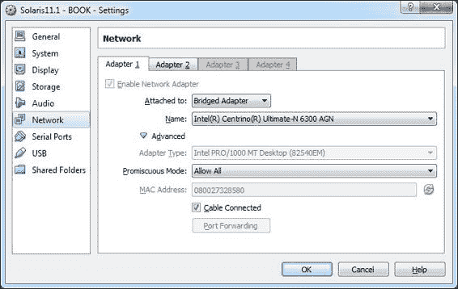

# 第三章：网络

在本章中，我们将涵盖以下内容：

+   玩转响应式网络配置

+   互联网协议多路径

+   设置链路聚合

+   配置网络桥接

+   配置链路保护和 DNS 客户端服务

+   配置 DHCP 服务器

+   配置集成负载均衡器

# 介绍

不用多说，网络卡及其相应的网络配置对于操作系统如 Oracle Solaris 11 至关重要。我自从版本 7 起就开始使用 Oracle Solaris，它的网络设置一直都非常简单，使用了像 `/etc/hostname.<interface>`、`/etc/hosts`、`/etc/defaultrouter`、`/etc/resolv.conf` 和 `/etc/hostname` 等文件。当时，除了这些文件外没有其他配置，这非常适合，因为配置网络只需要几分钟时间。另一方面，当需要更改网络配置时，并没有太多的灵活性。此外，当时便携式计算机上没有无线接口，并且 Oracle Solaris 仅支持 SPARC 处理器。那段时光已经过去了。

这种网络架构一直保持到 Oracle Solaris 10，尽管在 Oracle Solaris 10 中引入了数百项修改和新特性。但在 Oracle Solaris 11 中，现在有了新的命令和不同的设置网络方法。此外，自前一版本的 Oracle Solaris 以来，许多有趣的技术已经得到了改进，其中一些技术被包含在 Oracle Solaris 11 中。

在本章中，我们将学习许多与 Oracle Solaris 11 相关的材料，以及高级管理内容。

### 注意

一个关键点必须强调——在这里展示的所有示例中，我假设网络中有一个 DHCP 服务器。在我的例子中，DHCP 服务器是由 D-Link 无线路由器提供的。不要忘记这个警告！

# 玩转响应式网络配置

这个讨论可能是 Oracle Solaris 11 中最有趣的话题之一，也是最复杂的话题之一。

几年前，Oracle Solaris 只有 SPARC 版本，且无线网络要么不存在，要么很少见。自从 Oracle Solaris 10 发布以来，Oracle Solaris 在笔记本上的使用逐年增长。与此同时，无线网络变得流行，一切都发生了变化。然而，这种移动性带来了一些关于网络配置的小问题。例如，假设我们有一台安装了 Oracle Solaris 11 的笔记本电脑，并且某天我们需要连接到四个不同的网络——home1、home2、work 和 university，以便阅读电子邮件或访问互联网。这样就很麻烦，因为每个网络环境都需要修改网络配置才能连接到数据网络。更糟的是，如果四个网络中有三个需要手动配置网络（IP 地址、子网掩码、网关、名称服务器、域名等），我们将浪费大量时间在手动配置上。

Oracle Solaris 11 有一个非常出色的功能，管理**反应式网络配置**（**RNC**）。基本上，使用 RNC，用户可以创建不同的网络配置，并且通过用户请求或事件（开启或关闭无线网卡、租赁和更新 DHCP 设置、连接或断开电缆等），可以快速地更改网络配置。所有这些都仅仅因为 RNC 是基于一个名为配置文件的关键概念来实现的，配置文件可以分为固定的或反应式的，并且它们具有许多属性，有助于我们配置适当的网络。

有两种类型的配置文件——**网络配置文件**（**NCP**）和**位置配置文件**（**Location Profiles**），它们是互补的。NCP（某种容器）由**网络配置单元**（**NCU**）组成，NCU 是配置对象，它们都有配置网络所需的属性。此外，还有第三种类型的配置文件，名为**外部网络修饰符**（**ENM**），它们用于 VPN，需要一种能够创建自身配置的特殊配置文件。

到目前为止有很多术语或简短概念，我们可以做个总结：

+   **RNC**：这代表反应式网络配置（Reactive Network Configuration）。

+   **配置文件**：有两类：固定的或反应式的。

+   **NCP**：这代表网络配置文件（Network Configuration Profile）。

+   **位置配置文件**：这是一个提供补充信息给 NCP 的配置文件。

+   **NCU**：这代表网络配置单元（Network Configuration Unit），是组成 NCP 配置文件的元素。

+   **EMN**：这代表外部网络修饰符（External Network Modifier），是一种配置文件类型。

回到两个主要的配置文件（**NCP** 和 **位置配置文件**），NCP 的作用是为接口提供基本的网络配置，而位置配置文件的作用是补充 NCP 提供的信息和配置。

位置配置提供的一些有用配置包括**IP 过滤**设置、域名、DNS 配置等。当系统没有有效 IP 地址时，默认使用名为**NoNet**的位置配置。当一个网络接口获得有效 IP 地址时，将使用**Automatic Location**配置。

有两种类型的**NCP**配置。第一种类型是`Automatic`配置，是只读的，在添加或移除网络设备时会自动更改您的配置（稍后详述），使用 DHCP 服务，始终优先使用以太网卡而不是无线网卡，包含一个**Link NCU**（提供多种风格：物理链路、聚合、虚拟网卡、vlan 等），并且其中有一个**Interface NCU**。

第二种类型是用户定义的配置，必须根据用户的目标进行手动设置（因此可以进行编辑）。

## 准备工作

要按照此方法操作，您需要安装有 Oracle Solaris 11 的两台虚拟机（VirtualBox 或 VMware），每台机器都有 4 GB RAM 和四个网络接口。

## 如何操作...

与 RNC 相关的两个关键服务是`svc:/network/netcfg:default`和`svc:/network/location:default`。这两个服务必须启用且正常工作，我们必须注意`svc:/network/location:default`的依赖关系：

```
root@solaris11-1:~# svcs -a | grep netcfg
online         18:07:01 svc:/network/netcfg:default
root@solaris11-1:~# svcs -a | grep location:default
online         18:12:22 svc:/network/location:default
root@solaris11-1:~# svcs -l netcfg
fmri         svc:/network/netcfg:default
name         Network configuration data management
enabled      true
state        online
next_state   none
state_time   January  6, 2014 06:07:01 PM BRST
alt_logfile  /system/volatile/network-netcfg:default.log
restarter    svc:/system/svc/restarter:default
contract_id  7
manifest     /lib/svc/manifest/network/network-netcfg.xml
root@solaris11-1:~# svcs -l svc:/network/location:default
fmri         svc:/network/location:default
name         network interface configuration
enabled      true
state        online
next_state   none
state_time   January  6, 2014 06:12:22 PM BRST
logfile      /var/svc/log/network-location:default.log
restarter    svc:/system/svc/restarter:default
manifest     /lib/svc/manifest/network/network-location.xml
dependency   require_all/none svc:/network/location:upgrade (online)
dependency   require_all/none svc:/network/physical:default (online)
dependency   require_all/none svc:/system/manifest-import:default (online)
dependency   require_all/none svc:/network/netcfg:default (online)
dependency   require_all/none svc:/system/filesystem/usr (online)

```

使用`netcfg`命令列出所有配置：

```
root@solaris11-1:~# netcfg list
NCPs:
  Automatic
  DefaultFixed
Locations:
  Automatic
  NoNet
```

这是对本节介绍中所见内容的确认。有一个名为`Automatic`的 NCP 配置，与 DHCP 服务相关联，以及另一个关联到用户定义的 NCP 配置`DefaultFixed`的 NCP 配置。此外，还有两个位置配置——当至少一个网络接口具有有效 IP 地址时应用的`Automatic`配置，以及在没有任何网络卡接收到有效 IP 地址时强制应用的`NoNet`配置。

尽管如此，通过执行以下命令，我们可以从每个配置中获取大量额外信息：

```
root@solaris11-1:~# netcfg list -a ncp Automatic
ncp:Automatic
  management-type   reactive
NCUs:
  phys  net0
  phys  net1
  phys  net2
  phys  net3
  ip    net0
  ip    net1
  ip    net3
  ip    net2
```

所有网络接口及其各自的 IP 地址对象都绑定到`Automatic` NCP 配置，而未分配给`DefaultFixed` NCP 配置：

```
root@solaris11-1:~# netcfg list -a ncp DefaultFixed
ncp:DefaultFixed
  management-type   fixed
```

同样，通过运行以下命令，可以从位置配置中获取大量信息：

```
root@solaris11-1:~# netcfg list -a loc Automatic
loc:Automatic
  activation-mode            system
  conditions                 
  enabled                    false
  nameservices               dns
  nameservices-config-file   "/etc/nsswitch.dns"
  dns-nameservice-configsrc  dhcp
  dns-nameservice-domain     
  dns-nameservice-servers    
  dns-nameservice-search     
  dns-nameservice-sortlist   
  dns-nameservice-options    
  nis-nameservice-configsrc  
  nis-nameservice-servers    
  ldap-nameservice-configsrc 
  ldap-nameservice-servers   
  default-domain             
  nfsv4-domain               
  ipfilter-config-file       
  ipfilter-v6-config-file    
  ipnat-config-file          
  ippool-config-file         
  ike-config-file            
  ipsecpolicy-config-file    

root@solaris11-1:~# netcfg list -a loc NoNet
loc:NoNet
  activation-mode            system
  conditions                 
  enabled                    false
  nameservices               files
  nameservices-config-file   "/etc/nsswitch.files"
  dns-nameservice-configsrc  dhcp
  dns-nameservice-domain     
  dns-nameservice-servers    
  dns-nameservice-search     
  dns-nameservice-sortlist   
  dns-nameservice-options    
  nis-nameservice-configsrc  
  nis-nameservice-servers    
  ldap-nameservice-configsrc  
  ldap-nameservice-servers   
  default-domain             
  nfsv4-domain               
  ipfilter-config-file       "/etc/nwam/loc/NoNet/ipf.conf"
  ipfilter-v6-config-file    "/etc/nwam/loc/NoNet/ipf6.conf"
  ipnat-config-file          
  ippool-config-file         
  ike-config-file            
  ipsecpolicy-config-file    
root@solaris11-1:~#
```

尽管如此，有时交互式地执行操作可能更容易：

```
root@solaris11-1:~# netcfg
netcfg> select ncp Automatic
netcfg:ncp:Automatic> list
ncp:Automatic
  management-type   reactive
NCUs:
  phys  net0
  phys  net1
  phys  net2
  phys  net3
  ip  net0
  ip  net1
  ip  net3
  ip  net2
netcfg:ncp:Automatic> select ncu phys net0
netcfg:ncp:Automatic:ncu:net0> list
ncu:net0
  type              link
  class             phys
  parent            "Automatic"
  activation-mode   prioritized
  enabled           true
  priority-group    0
  priority-mode     shared
netcfg:ncp:Automatic:ncu:net0> end
netcfg:ncp:Automatic> select ncu ip net0
netcfg:ncp:Automatic:ncu:net0> list
ncu:net0
  type              interface
  class             ip
  parent            "Automatic"
  enabled           true
  ip-version        ipv4,ipv6
  ipv4-addrsrc      dhcp
  ipv6-addrsrc      dhcp,autoconf
netcfg:ncp:Automatic:ncu:net0> end
netcfg:ncp:Automatic> end
netcfg> select loc Automatic
netcfg:loc:Automatic> list
loc:Automatic
  activation-mode            system
  enabled                    false
  nameservices               dns
  nameservices-config-file   "/etc/nsswitch.dns"
  dns-nameservice-configsrc  dhcp
netcfg:loc:Automatic> end
netcfg> exit

```

如我们所知，许多属性可以设置以定制我们的系统。同样，执行以下命令列出所有 NCP 和 NCU：

```
root@solaris11-1:~# netadm list
TYPE        PROFILE        STATE
ncp         Automatic      online
ncu:phys    net0           online
ncu:phys    net1           online
ncu:phys    net2           online
ncu:phys    net3           online
ncu:ip      net0           online
ncu:ip      net1           online
ncu:ip      net3           online
ncu:ip      net2           online
ncp         DefaultFixed   disabled
loc         Automatic      online
loc         NoNet          offline
```

如果需要更多详细信息，可以通过运行以下命令获取：

```
root@solaris11-1:~# netadm list -x
TYPE      PROFILE       STATE     AUXILIARY STATE
ncp       Automatic     online    active
ncu:phys  net0          online    interface/link is up
ncu:phys  net1          online    interface/link is up
ncu:phys  net2          online    interface/link is up
ncu:phys  net3          online    interface/link is up
ncu:ip    net0          online    interface/link is up
ncu:ip    net1          online    interface/link is up
ncu:ip    net3          online    interface/link is up
ncu:ip    net2          online    interface/link is up
ncp       DefaultFixed  disabled  disabled by administrator
loc       Automatic     online    active
loc       NoNet         offline   conditions for activation are unmet
```

不必列出所有配置（NCP 和位置），可以仅通过运行以下命令列出其中一类配置：

```
root@solaris11-1:~# netadm list -p ncp
TYPE        PROFILE        STATE
ncp         Automatic      online
ncu:phys    net0           online
ncu:phys    net1           online
ncu:phys    net2           online
ncu:phys    net3           online
ncu:ip      net0           online
ncu:ip      net1           online
ncu:ip      net3           online
ncu:ip      net2           online
ncp         DefaultFixed   disabled
root@solaris11-1:~# netadm list -p loc
TYPE        PROFILE        STATE
loc         Automatic      online
loc         NoNet          offline
```

很好！到目前为止，所有命令都运行得非常顺利。因此，现在是使用 `netcfg` 命令创建新配置文件的时候了。为了完成这个任务，我们将创建一个名为 `hacker_profile` 的 NCP，并在其中添加两个 NCU，接着创建一个名为 `work` 的 LOC 配置文件。因此，请执行以下命令：

```
root@solaris11-1:~# netcfg
netcfg> create ncp hacker_profile
netcfg:ncp:hacker_profile> create ncu phys net2
Created ncu 'net2'.  Walking properties ...
activation-mode (manual) [manual|prioritized]> manual
mac-address> [ENTER]
autopush> [ENTER]
mtu> [ENTER]
netcfg:ncp:hacker_profile:ncu:net2> list
ncu:net2
  type              link
  class             phys
  parent            "hacker_profile"
  activation-mode   manual
  enabled           true
netcfg:ncp:hacker_profile:ncu:net2> end
Committed changes
netcfg:ncp:hacker_profile> list
ncp:hacker_profile
  management-type   reactive
NCUs:
  phys  net2
netcfg:ncp:hacker_profile> create ncu ip net2
Created ncu 'net2'.  Walking properties ...
ip-version (ipv4,ipv6) [ipv4|ipv6]> ipv4
ipv4-addrsrc [dhcp|static]> static
ipv4-addr> 192.168.1.99
ipv4-default-route> 192.168.1.1
netcfg:ncp:hacker_profile:ncu:net2> list
ncu:net2
  type              interface
  class             ip
  parent            "hacker_profile"
  enabled           true
  ip-version        ipv4
  ipv4-addrsrc      static
  ipv4-addr         "192.168.1.99"
  ipv4-default-route  "192.168.1.1"
netcfg:ncp:hacker_profile:ncu:net2> commit
Committed changes
netcfg:ncp:hacker_profile:ncu:net2> end
netcfg:ncp:hacker_profile> list ncu ip net2
ncu:net2
  type              interface
  class             ip
  parent            "hacker_profile"
  enabled           true
  ip-version        ipv4
  ipv4-addrsrc      static
  ipv4-addr         "192.168.1.99"
  ipv4-default-route  "192.168.1.1"
netcfg:ncp:hacker_profile> end
netcfg> create loc work
Created loc 'work'.  Walking properties ...
activation-mode (manual) [manual|conditional-any|conditional-all]> manual
nameservices (dns) [dns|files|nis|ldap]> dns
nameservices-config-file ("/etc/nsswitch.dns")> [ENTER]
dns-nameservice-configsrc (dhcp) [manual|dhcp]> manual
dns-nameservice-domain> alexandreborges.org
dns-nameservice-servers> 192.0.80.93
dns-nameservice-search> [ENTER]
dns-nameservice-sortlist> [ENTER]
dns-nameservice-options> [ENTER]
nfsv4-domain> [ENTER]
ipfilter-config-file> [ENTER]
ipfilter-v6-config-file> [ENTER]
ipnat-config-file> [ENTER]
ippool-config-file> [ENTER]
ike-config-file> [ENTER]
ipsecpolicy-config-file> [ENTER]
netcfg:loc:work> list
loc:work
  activation-mode            manual
  enabled                    false
  nameservices               dns
  nameservices-config-file   "/etc/nsswitch.dns"
  dns-nameservice-configsrc  manual
  dns-nameservice-domain     "alexandreborges.org"
  dns-nameservice-servers    "192.0.80.93"  
netcfg:loc:work> end
Committed changes
netcfg> exit
root@solaris11-1:~#
```

执行以下命令列出当前配置：

```
root@solaris11-1:~# netadm list
TYPE        PROFILE        STATE
ncp         Automatic      online
ncu:phys    net0           online
ncu:phys    net1           online
ncu:phys    net2           online
ncu:phys    net3           online
ncu:ip      net0           online
ncu:ip      net1           online
ncu:ip      net3           online
ncu:ip      net2           online
ncp         DefaultFixed   disabled
ncp         hacker_profile     disabled
loc         Automatic      online
loc         NoNet          offline
loc         work           disabled
root@solaris11-1:~# netcfg list
NCPs:
  Automatic
  DefaultFixed
  hacker_profile
Locations:
  Automatic
  NoNet
  work
root@solaris11-1:~#
root@solaris11-1:~# ipadm show-addr | grep v4
ADDROBJ           TYPE     STATE        ADDR
lo0/v4            static   ok           127.0.0.1/8
net0/v4           dhcp     ok           192.168.1.106/24
net1/v4           dhcp     ok           192.168.1.107/24
net2/v4           dhcp     ok           192.168.1.105/24
net3/v4           static   ok           192.168.1.140/24
```

当新的 NCP 和 LOC 配置文件启用时，一切都会发生变化。我们可以通过执行以下命令来验证这一点：

```
root@solaris11-1:~# netadm enable work
Enabling loc 'work'
root@solaris11-1:~# netadm enable hacker_profile
Enabling ncp 'hacker_profile'
root@solaris11-1:~# netadm list
TYPE        PROFILE        STATE
ncp         Automatic      disabled
ncp         DefaultFixed   disabled
ncp         hacker_profile     online
ncu:phys    net2           online
ncu:ip      net2           online
loc         Automatic      offline
loc         NoNet          offline
loc         work           online
root@solaris11-1:~# ipadm show-addr | grep v4
lo0/v4            static   ok           127.0.0.1/8
net2/v4           static   ok           192.168.1.99/24
```

`Automatic` NCP 配置文件已被禁用，LOC 配置文件 `Automatic` 已离线。接着，`hacker_profile` NCP 配置文件已变为 `online` 状态，`work` LOC 配置文件也变为 `online` 状态。此外，除了 `net2`，所有网络接口都消失了，因为在 `hacker_profile` NCP 配置文件中仅配置了一个网络接口 NCU（`net2`）。另一个好消息是，这个配置是持久的，我们可以重启机器（`init 6`），一切将按照我们配置的方式继续运行。

如果我们通过为某个属性分配错误的值而犯了任何错误，那么修正起来会非常简单。例如，可以通过执行以下命令来更改名称服务器（`dns-nameservice-servers`属性）：

```
root@solaris11-1:~# netcfg
netcfg> select loc work
netcfg:loc:work> set dns-nameservice-servers="8.8.8.8,8.8.4.4"
netcfg:loc:work> list
loc:work
  activation-mode            manual
  enabled                    true
  nameservices               dns
  nameservices-config-file   "/etc/nsswitch.dns"
  dns-nameservice-configsrc  manual
  dns-nameservice-domain     "alexandreborges.org"
  dns-nameservice-servers    "8.8.8.8","8.8.4.4"
netcfg:loc:work> commit
Committed changes
netcfg:loc:work> verify
All properties verified
netcfg:loc:work> end
netcfg> end
root@solaris11-1:~#
```

完成了所有这些长时间的任务后，建议你保存新的配置文件，`hacker_profile` 和 `work`。因此，要备份它们，请执行以下命令：

```
root@solaris11-1:~# mkdir /backup
root@solaris11-1:~# netcfg export -f /backup/hacker_profile_bkp ncp hacker_profile
root@solaris11-1:~# netcfg export -f /backup/work_bkp loc work
@solaris11-1:~# more /backup/hacker_profile_bkp
create ncp "hacker_profile"
create ncu phys "net2"
set activation-mode=manual
end
create ncu ip "net2"
set ip-version=ipv4
set ipv4-addrsrc=static
set ipv4-addr="192.168.1.99/24"
set ipv4-default-route="192.168.1.1"
end
end
root@solaris11-1:~# more /backup/work_bkp
create loc "work"
set activation-mode=manual
set nameservices=dns
set nameservices-config-file="/etc/nsswitch.dns"
set dns-nameservice-configsrc=manual
set dns-nameservice-domain="alexandreborges.org"
set dns-nameservice-servers="8.8.8.8","8.8.4.4"
end
root@solaris11-1:~#
```

通过运行以下命令，可以将系统恢复到旧的 `Automatic` 配置文件（NCP 和 Loc）：

```
root@solaris11-1:~# netadm enable -p ncp Automatic
Enabling ncp 'Automatic'
root@solaris11-1:~# netadm enable -p loc Automatic
Enabling loc 'Automatic'
root@solaris11-1:~# netadm list | grep Automatic
ncp         Automatic      online
loc         Automatic      online
root@solaris11-1:~#
```

最后，适当的做法是通过执行以下命令销毁创建的 NCP 和 LOC 配置文件：

```
root@solaris11-1:~# netcfg destroy loc work
root@solaris11-1:~# netcfg destroy ncp hacker_profile

```

Oracle Solaris 11 真棒！

### 配方概述

毫无疑问，RNC 使管理员的生活更加轻松。管理、配置和监控都通过命令行完成，且所有配置都只使用两条命令：`netadm` 和 `netcfg`。`netadm` 命令的作用是启用、禁用和列出配置文件，而 `netcfg` 命令的作用是创建配置文件配置。

# 互联网协议多路径

**互联网协议多路径**（**IPMP**）是一项很棒的技术，它很久以前就被引入（最早在 Oracle Solaris 8 中），从那时起，它已经有了很多改进，直到当前的 Oracle Solaris 11。总体来说，IPMP 为网络接口方案提供了容错性，从而消除了任何单点故障。此外，它通过将负载分布到同一组中的所有活动接口上，增加了外发流量的网络带宽。这是我们的起点；要使用 IPMP，必须创建一个 IPMP 组接口，并将所有的数据 IP 地址分配给该 IPMP 组接口。因此，最终，所有将与 IPMP 一起使用的网络接口都必须分配一个 IPMP 组。

为了继续说明，以下是一个快速示例：

+   组接口：`hacker_ipmp0`

    +   接口 1：`net0`

        测试 IP（`test_net0`）：`192.168.1.61`

    +   接口 2：`net1`

        测试 IP（`test_net1`）：`192.168.1.71`

在前面的示例中，我们有两个接口（`net0`和`net1`），它们通常用于发送/接收正常的应用数据。然而，数据的 IP 地址并没有分配给`net0`或`net1`接口，而是分配给包含两个物理网络接口的 IPMP 组接口。来自`net0`和`net1`接口的测试 IP 地址（分别为`192.168.1.61`和`192.168.1.71`）被`in.mpathd` IPMP 守护进程用来检查接口是否正常。

部署 IPMP 时有两种可能的配置：活动-活动和活动-备用。前者配置下所有接口都会传输数据，后者配置下至少有一个备用接口。大多数情况下，公司会使用活动-活动配置。

IPMP 的基本概念是什么？如果一个接口发生故障（或电缆断开），系统仍然能够继续正常传输和接收数据。为什么？因为在 IPMP 组中，至少有一个接口承担着网络任务，如果其中任何一个接口失败，其他接口会继续工作。

IPMP 能否使用分配的数据信息 IP 地址来监控接口？不能；因为如果`in.mpathd`使用数据 IP 地址来监控接口，监控过程中可能会有延迟。顺便问一下，测试 IP 地址是否必要？其实并不必要。IPMP 有两种监控方式：基于探测的检测（使用测试 IP 地址）和基于链路的检测（如果接口支持）。就个人而言，我更喜欢基于探测的监控（使用测试 IP 地址），因为我曾遇到过链路检测方式的一些问题，我认为基于探测的监控更可靠。然而，如果接口支持基于链路的方式，那么两种方式都会被使用。无论如何，当使用探测式监控时，`in.mpathd`守护进程会继续监控故障接口，以检查它何时恢复正常。

讲完理论后，活动-备用配置与活动-活动配置非常相似，但备用接口在活动网络接口正常工作的情况下不会发送任何数据包。如果任何活动网络接口进入`失败`状态，备用网络接口将被激活，并开始发送数据包。

## 准备工作

本例需要两台安装了 Oracle Solaris 11 的虚拟机（VirtualBox 或 VMware Workstation），每台虚拟机内存 4GB，并且第一台虚拟机需要四个网络接口。第二台虚拟机只需要一个接口。

## 如何实现……

本例将基于之前展示的类似场景，但将使用四个接口，所有接口都是活动的：

+   组：`hacker_ipmp0`

    +   数据 IP 地址：`192.168.1.50`，`192.168.1.60`，`192.168.1.70`，和`192.168.1.80`

    +   接口 1: `net0`

        测试 IP（`test_net0`）: `192.168.1.51`

    +   接口 2: `net1`

        测试 IP（`test_net1`）: `192.168.1.61`

    +   接口 3: `net2`

        测试 IP（`test_net2`）: `192.168.1.71`

    +   接口 4: `net3`

        测试 IP（`test_net3`）: `192.168.1.81`

和 Oracle Solaris 11 中的每个功能一样，IPMP 基于 **服务管理设施**（**SMF**）服务，该服务必须在线（默认为在线），并且可以通过运行以下命令进行验证：

```
root@solaris11-1:~# svcs -a | grep ipmp
online         23:38:50 svc:/network/ipmp:default
root@solaris11-1:~# svcs -l ipmp
fmri         svc:/network/ipmp:default
name         IP Multipathing
enabled      true
state        online
next_state   none
state_time   January  9, 2014 11:38:50 PM BRST
alt_logfile  /system/volatile/network-ipmp:default.log
restarter    svc:/system/svc/restarter:default
contract_id  19
manifest     /lib/svc/manifest/network/network-ipmp.xml
dependency   require_all/none svc:/network/loopback (online)
```

此外，IPMP 守护进程的行为基于 `/etc/` 下 `default` 目录中的 `mpathd` 配置文件。此外，该配置文件具有默认内容，适用于任何不需要特别注意响应延迟的常规环境。执行以下命令：

```
root@solaris11-1:~# more /etc/default/mpathd
#
# Copyright 2000 Sun Microsystems, Inc.  All rights reserved.
# Use is subject to license terms.
#
# ident  "%Z%%M%  %I%  %E% SMI"
#
# Time taken by mpathd to detect a NIC failure in ms. The minimum time
# that can be specified is 100 ms.
#
FAILURE_DETECTION_TIME=10000
#
# Failback is enabled by default. To disable failback turn off this option
#
FAILBACK=yes
#
# By default only interfaces configured as part of multipathing groups
# are tracked. Turn off this option to track all network interfaces
# on the system
#
TRACK_INTERFACES_ONLY_WITH_GROUPS=yes
root@solaris11-1:~#
```

好的，现在是时候继续前进了。首先，执行以下命令列出可用的接口及其各自的状态：

```
root@solaris11-1:~# ipadm show-addr
ADDROBJ           TYPE     STATE        ADDR
lo0/v4            static   ok           127.0.0.1/8
net0/v4           dhcp     ok           192.168.1.106/24
net1/v4           dhcp     ok           192.168.1.107/24
net2/v4           dhcp     ok           192.168.1.99/24
net3/v4           dhcp     ok           192.168.1.140/24
lo0/v6            static   ok           ::1/128
root@solaris11-1:~# ipadm show-if
IFNAME     CLASS    STATE    ACTIVE OVER
lo0        loopback ok       yes    --
net0       ip       ok       yes    --
net1       ip       ok       yes    --
net2       ip       ok       yes    --
net3       ip       ok       yes    --
root@solaris11-1:~# dladm show-link
LINK                CLASS     MTU    STATE    OVER
net0                phys      1500   up       --
net1                phys      1500   up       --
net2                phys      1500   up       --
net3                phys      1500   up       --
```

在接下来的步骤中，将删除所有 IP 地址对象：

```
root@solaris11-1:~# ipadm delete-ip net0
root@solaris11-1:~# ipadm delete-ip net1
root@solaris11-1:~# ipadm delete-ip net2
root@solaris11-1:~# ipadm delete-ip net3

```

返回到监控命令，我们应该不再看到这些 IP 地址对象：

```
root@solaris11-1:~# ipadm show-addr
ADDROBJ           TYPE     STATE        ADDR
lo0/v4            static   ok           127.0.0.1/8
lo0/v6            static   ok           ::1/128
root@solaris11-1:~# ipadm show-if
IFNAME     CLASS    STATE    ACTIVE OVER
lo0        loopback ok       yes    --
root@solaris11-1:~# dladm show-link
LINK                CLASS     MTU    STATE    OVER
net0                phys      1500   up       --
net1                phys      1500   up       --
net2                phys      1500   up       --
net3                phys      1500   up       --
```

到目前为止一切正常。因此，在开始配置 IPMP 之前，最好将 NCP 配置文件从 `Automatic` 更改为 `DefaultFixed`，因为 IPMP 设置将使用固定 IP 地址：

```
root@solaris11-1:~# netadm list
TYPE        PROFILE        STATE
ncp         Automatic      online
ncu:phys    net0           online
ncu:phys    net1           online
ncu:phys    net2           online
ncu:phys    net3           online
ncp         my_profile     disabled
ncp         DefaultFixed   disabled
loc         NoNet          online
loc         work           disabled
loc         Automatic      offline
root@solaris11-1:~# netadm enable -p ncp DefaultFixed
Enabling ncp 'DefaultFixed'
```

太棒了！很有意思的是，现在系统中没有任何 IP 地址对象：

```
root@solaris11-1:~# ipadm show-addr
ADDROBJ           TYPE     STATE        ADDR
lo0/v4            static   ok           127.0.0.1/8
lo0/v6            static   ok           ::1/128
```

游戏开始了。为了使管理更加方便，所有网络链路将重新命名，以便更容易识别，并且很快会创建新的 IP 地址对象（暂时没有任何 IP 地址值）：

```
root@solaris11-1:~# dladm rename-link net0 net0_myipmp0
root@solaris11-1:~# dladm rename-link net1 net1_myipmp1
root@solaris11-1:~# dladm rename-link net2 net2_myipmp2
root@solaris11-1:~# dladm rename-link net3 net3_myipmp3
root@solaris11-1:~# dladm show-link
LINK                CLASS     MTU    STATE    OVER
net0_myipmp0        phys      1500   unknown  --
net1_myipmp1        phys      1500   unknown  --
net2_myipmp2        phys      1500   unknown  --
net3_myipmp3        phys      1500   unknown  --
root@solaris11-1:~# ipadm create-ip net0_myipmp0
root@solaris11-1:~# ipadm create-ip net1_myipmp1
root@solaris11-1:~# ipadm create-ip net2_myipmp2
root@solaris11-1:~# ipadm create-ip net3_myipmp3
root@solaris11-1:~# ipadm show-if
IFNAME     CLASS    STATE    ACTIVE OVER
lo0        loopback ok       yes    --
net0_myipmp0 ip     down     no     --
net1_myipmp1 ip     down     no     --
net2_myipmp2 ip     down     no     --
net3_myipmp3 ip     down     no     --
root@solaris11-1:~# ipadm show-addr
ADDROBJ           TYPE     STATE        ADDR
lo0/v4            static   ok           127.0.0.1/8
lo0/v6            static   ok           ::1/128
```

现在是时候创建 IPMP 接口组（`hacker_ipmp0`）并将所有接口分配到该组了。请注意，目前任何网络接口上都没有 IP 地址：

```
root@solaris11-1:~# ipadm create-ipmp hacker_ipmp0
root@solaris11-1:~# ipadm add-ipmp -i net0_myipmp0 -i net1_myipmp1 -i net2_myipmp2 -i net3_myipmp3  hacker_ipmp0

```

```
down (see the ipadm show-if and ipmpstat -a commands in the following snippet) for now (wait for more steps):
```

```
root@solaris11-1:~# ipadm show-if
IFNAME     CLASS    STATE    ACTIVE OVER
lo0        loopback ok       yes    --
net0_myipmp0 ip     ok       yes    --
net1_myipmp1 ip     ok       yes    --
net2_myipmp2 ip     ok       yes    --
net3_myipmp3 ip     ok       yes    --
hacker_ipmp0 ipmp   down     no     net0_myipmp0 net1_myipmp1 net2_myipmp2 net3_myipmp3
root@solaris11-1:~# ipmpstat –g
GROUP       GROUPNAME   STATE     FDT       INTERFACES
hacker_ipmp0 hacker_ipmp0 ok      --        net3_myipmp3 net2_myipmp2 net1_myipmp1 net0_myipmp0
root@solaris11-1:~# ipmpstat -a
ADDRESS                  STATE  GROUP        INBOUND     OUTBOUND
::                       down   hacker_ipmp0  --         --
0.0.0.0                  down   hacker_ipmp0  --         --
```

因为还没有数据或测试 IP 地址，所以所有探测操作都被禁用：

```
root@solaris11-1:~# ipmpstat -i
INTERFACE   ACTIVE  GROUP       FLAGS     LINK      PROBE     STATE
net3_myipmp3 yes    hacker_ipmp0 -------  up        disabled  ok
net2_myipmp2 yes    hacker_ipmp0 -------  up        disabled  ok
net1_myipmp1 yes    hacker_ipmp0 -------  up        disabled  ok
net0_myipmp0 yes    hacker_ipmp0 --mbM--  up        disabled  ok
root@solaris11-1:~# ipmpstat -p
ipmpstat: probe-based failure detection is disabled
```

最后，将通过执行以下命令将所有主要数据 IP 地址和测试 IP 地址添加到 IPMP 配置中：

```
root@solaris11-1:~# ipadm create-addr -T static -a 192.168.1.50/24 hacker_ipmp0/v4addr1
root@solaris11-1:~# ipadm create-addr -T static -a 192.168.1.60/24 hacker_ipmp0/v4addr2
root@solaris11-1:~# ipadm create-addr -T static -a 192.168.1.70/24 hacker_ipmp0/v4addr3
root@solaris11-1:~# ipadm create-addr -T static -a 192.168.1.80/24 hacker_ipmp0/v4addr4
root@solaris11-1:~# ipadm create-addr -T static -a 192.168.1.51/24 net0_myipmp0/test
root@solaris11-1:~# ipadm create-addr -T static -a 192.168.1.61/24 net1_myipmp1/test
root@solaris11-1:~# ipadm create-addr -T static -a 192.168.1.71/24 net2_myipmp2/test
root@solaris11-1:~# ipadm create-addr -T static -a 192.168.1.81/24 net3_myipmp3/test

```

为了检查我们之前的 `ipadm` 命令是否有效，请执行以下命令：

```
root@solaris11-1:~# ipadm show-addr
ADDROBJ           TYPE     STATE        ADDR
lo0/v4            static   ok           127.0.0.1/8
net0_myipmp0/test static   ok           192.168.1.51/24
net1_myipmp1/test static   ok           192.168.1.61/24
net2_myipmp2/test static   ok           192.168.1.71/24
net3_myipmp3/test static   ok           192.168.1.81/24
hacker_ipmp0/v4addr1 static ok          192.168.1.50/24
hacker_ipmp0/v4addr2 static ok          192.168.1.60/24
hacker_ipmp0/v4addr3 static ok          192.168.1.70/24
hacker_ipmp0/v4addr4 static ok          192.168.1.80/24
lo0/v6            static   ok           ::1/128
root@solaris11-1:~# ipadm show-if
IFNAME     CLASS    STATE    ACTIVE OVER
lo0        loopback ok       yes    --
net0_myipmp0 ip     ok       yes    --
net1_myipmp1 ip     ok       yes    --
net2_myipmp2 ip     ok       yes    --
net3_myipmp3 ip     ok       yes    --
hacker_ipmp0 ipmp   ok       yes    net0_myipmp0 net1_myipmp1 net2_myipmp2 net3_myipmp3
root@solaris11-1:~# dladm show-link
LINK                CLASS     MTU    STATE    OVER
net0_myipmp0        phys      1500   up       --
net1_myipmp1        phys      1500   up       --
net2_myipmp2        phys      1500   up       --
net3_myipmp3        phys      1500   up       --
```

如果一切顺利，IPMP 接口组和所有 IP 地址应该是 `ok` 并且 `up` 状态：

```
root@solaris11-1:~# ipmpstat -g
GROUP       GROUPNAME   STATE     FDT       INTERFACES
hacker_ipmp0 hacker_ipmp0 ok      10.00s    net3_myipmp3 net2_myipmp2 net1_myipmp1 net0_myipmp0
root@solaris11-1:~# ipmpstat -a
ADDRESS                   STATE  GROUP       INBOUND     OUTBOUND
::                        down   hacker_ipmp0 --         --
192.168.1.80              up     hacker_ipmp0 net0_myipmp0 net3_myipmp3 net2_myipmp2 net1_myipmp1 net0_myipmp0
192.168.1.70              up     hacker_ipmp0 net1_myipmp1 net3_myipmp3 net2_myipmp2 net1_myipmp1 net0_myipmp0
192.168.1.60              up     hacker_ipmp0 net2_myipmp2 net3_myipmp3 net2_myipmp2 net1_myipmp1 net0_myipmp0
192.168.1.50              up     hacker_ipmp0 net3_myipmp3 net3_myipmp3 net2_myipmp2 net1_myipmp1 net0_myipmp0
```

多亏了每个测试 IP 地址，所有接口应该都在 `in.mpathd` 守护进程（来自 IPMP 服务）的监控下，并且通过执行以下命令可以显示该探测信息：

```
root@solaris11-1:~# ipmpstat -p
TIME     INTERFACE   PROBE  NETRTT    RTT      RTTAVG   TARGET
0.21s    net0_myipmp0 i1411 0.66ms    0.85ms   0.70ms   192.168.1.113
0.47s    net3_myipmp3 i1411 0.55ms    7.57ms   2.31ms   192.168.1.113
0.70s    net2_myipmp2 i1411 0.67ms    0.77ms   0.72ms   192.168.1.112
1.13s    net1_myipmp1 i1412 0.43ms    0.60ms   0.73ms   192.168.1.112
1.78s    net0_myipmp0 i1412 0.63ms    0.74ms   1.00ms   192.168.1.112
2.17s    net3_myipmp3 i1412 0.68ms    0.82ms   0.65ms   192.168.1.112
2.43s    net2_myipmp2 i1412 0.31ms    0.36ms   0.67ms   192.168.1.113
2.94s    net0_myipmp0 i1413 7.17ms    8.03ms   11.05ms  192.168.1.188
2.99s    net1_myipmp1 i1413 0.27ms    0.31ms   1.11ms   192.168.1.113
3.54s    net3_myipmp3 i1413 0.57ms    0.69ms   2.10ms   192.168.1.113
3.69s    net2_myipmp2 i1413 0.61ms    0.72ms   0.72ms   192.168.1.112
^C
```

你可能会注意到一些奇怪的 IP 地址：`192.168.1.112`、`192.168.1.113` 和 `192.168.1.188`。这些地址来自哪里？IPMP 服务使用多播协议进行测试和检查（探测），以确保数据 IP 正常工作，并记录一个数据包从发现的主机往返的 RTT（往返时间）。在这个特定的例子中，IPMP 已经连接到我私人本地网络上的一些机器和一台打印机。

因此，根据之前的命令，可以通过执行以下命令来确认所有 IPMP 网络接口是否正常：

```
root@solaris11-1:~# ipmpstat -i
INTERFACE   ACTIVE  GROUP       FLAGS     LINK      PROBE     STATE
net3_myipmp3 yes    hacker_ipmp0 -------  up        ok        ok
net2_myipmp2 yes    hacker_ipmp0 -------  up        ok        ok
net1_myipmp1 yes    hacker_ipmp0 -------  up        ok        ok
net0_myipmp0 yes    hacker_ipmp0 --mbM--  up        ok        ok
```

`ipmpstat –i`命令的这些标志需要简要解释一下：

+   `m`：此选项用于发送和/或接收 IPv4 多播包

+   `M`：此选项用于发送和/或接收 IPv6 多播包

+   `b`：此选项用于发送和/或接收 IPv4 广播包

+   `i`：表示未激活

+   `s`：表示待命

+   `d`：表示已关闭

同样，关于测试 IP 地址和用于发送多播包的主机信息也以简单的方式呈现如下：

```
root@solaris11-1:~# ipmpstat -t
INTERFACE   MODE       TESTADDR            TARGETS
net3_myipmp3 multicast 192.168.1.81        192.168.1.113 192.168.1.112
net2_myipmp2 multicast 192.168.1.71        192.168.1.112 192.168.1.113
net1_myipmp1 multicast 192.168.1.61        192.168.1.113 192.168.1.112
net0_myipmp0 multicast 192.168.1.51        192.168.1.112 192.168.1.188 192.168.1.113
```

很好！结束了吗？不。我们如何知道 IPMP 配置是否有效？最好的方法是让网络发生故障。为了模拟这种情况，我们必须先通过执行以下命令关闭 Oracle Solaris 11：

```
root@solaris11-1:~# shutdown –y –g0

```

在下一步中，我们需要选择我们的虚拟机，点击**设置**按钮，然后进入**网络**。在那里，对于**附加到**选项，将第一个接口更改为**未附加**。


这个技巧将模拟接口故障，接口将不会在 Oracle Solaris 11 中出现。接着，虚拟机（`solaris11-1`）必须再次启动，正如预期的那样，系统运行得非常顺畅。可以通过使用所有先前的网络和 IPMP 命令来确认这一点：

```
root@solaris11-1:~# ipmpstat -pn
TIME     INTERFACE   PROBE  NETRTT   RTT      RTTAVG    TARGET
0.08s    net2_myipmp2 i761  0.22ms   0.31ms   0.56ms    192.168.1.113
1.31s    net1_myipmp1 i762  3.90ms   4.02ms   9.35ms    192.168.1.188
1.37s    net3_myipmp3 i761  0.48ms   0.57ms   0.83ms    192.168.1.113
1.57s    net2_myipmp2 i762  0.32ms   0.38ms   0.61ms    192.168.1.113
2.79s    net1_myipmp1 i763  0.63ms   0.73ms   0.78ms    192.168.1.113
2.85s    net3_myipmp3 i762  0.66ms   0.78ms   0.72ms    192.168.1.113
1.11s    net0_myipmp0 i763  --       --       --        192.168.1.113
-0.03s   net0_myipmp0 i762  --       --       --        192.168.1.188
3.08s    net2_myipmp2 i763  0.57ms   0.70ms   0.57ms    192.168.1.113
4.02s    net3_myipmp3 i763  0.58ms   0.69ms   0.82ms    192.168.1.113
```

正如预期的那样，第一次接口（`net0_myipmp0`）在探测测试中失败。接下来，在其他命令中也会显示相同的故障：

```
root@solaris11-1:~# ipadm show-if
IFNAME     CLASS    STATE    ACTIVE OVER
lo0        loopback ok       yes    --
net0_myipmp0 ip     failed   no     --
net1_myipmp1 ip     ok       yes    --
net2_myipmp2 ip     ok       yes    --
hacker_ipmp0 ipmp   ok       yes    net0_myipmp0 net1_myipmp1 net2_myipmp2 net3_myipmp3
net3_myipmp3 ip     ok       yes    --
root@solaris11-1:~# ipmpstat -g
GROUP       GROUPNAME   STATE     FDT       INTERFACES
hacker_ipmp0 hacker_ipmp0 degraded 10.00s   net3_myipmp3 net2_myipmp2 net1_myipmp1 [net0_myipmp0]

```

IPMP 组状态已降级，因为其中一个接口（`net0_myipmp0`）丢失。其他 IPMP 命令可以确认这一点：

```
root@solaris11-1:~# ipmpstat -i
INTERFACE   ACTIVE  GROUP       FLAGS     LINK      PROBE     STATE
net3_myipmp3 yes    hacker_ipmp0 -------  up        ok        ok
net2_myipmp2 yes    hacker_ipmp0 -------  up        ok        ok
net1_myipmp1 yes    hacker_ipmp0 --mbM--  up        ok        ok
net0_myipmp0 no     hacker_ipmp0 -------  up        failed    failed
root@solaris11-1:~# ipmpstat -a
ADDRESS                   STATE  GROUP       INBOUND     OUTBOUND
::                        down   hacker_ipmp0 --         --
192.168.1.80              up     hacker_ipmp0 net1_myipmp1 net3_myipmp3 net2_myipmp2 net1_myipmp1
192.168.1.70              up     hacker_ipmp0 net3_myipmp3 net3_myipmp3 net2_myipmp2 net1_myipmp1
192.168.1.60              up     hacker_ipmp0 net2_myipmp2 net3_myipmp3 net2_myipmp2 net1_myipmp1
192.168.1.50              up     hacker_ipmp0 net1_myipmp1 net3_myipmp3 net2_myipmp2 net1_myipmp1
```

小心——乍一看，可能会觉得有些不对劲，但实际上并没有。很多人会猜测 IP 地址绑定到某个特定的接口，但事实并非如此。所有数据 IP 地址都分配给 IPMP 组接口，IPMP 会尝试使用最佳接口进行外部连接。然而，最好的测试方法是使用另一台机器（`solaris11-2`），然后从该机器尝试 ping 所有数据 IP 地址（来自第一台机器`solaris11-1`）：

```
root@solaris11-2:~# ping 192.168.1.50
192.168.1.50 is alive
root@solaris11-2:~# ping 192.168.1.60
192.168.1.60 is alive
root@solaris11-2:~# ping 192.168.1.70
192.168.1.70 is alive
root@solaris11-2:~# ping 192.168.1.80
192.168.1.80 is alive
```

太神奇了！Oracle Solaris 11 再次获胜！如果我们再次关闭第一台虚拟机（`shutdown –y –g0` 或 `poweroff`），将接口恢复到旧配置（**设置** | **网络** | **适配器 1** | **附加到：桥接网络**），然后重新启动`solaris11-1`虚拟机；我们将确认一切`ok`：

```
root@solaris11-1:~# ipmpstat -i
INTERFACE   ACTIVE  GROUP       FLAGS     LINK      PROBE     STATE
net3_myipmp3 yes    hacker_ipmp0 -------  up        ok        ok
net2_myipmp2 yes    hacker_ipmp0 -------  up        ok        ok
net1_myipmp1 yes    hacker_ipmp0 -------  up        ok        ok
net0_myipmp0 yes    hacker_ipmp0 --mbM--  up        ok        ok
root@solaris11-1:~# ipmpstat -g
GROUP       GROUPNAME   STATE     FDT       INTERFACES
hacker_ipmp0 hacker_ipmp0 ok      10.00s    net3_myipmp3 net2_myipmp2 net1_myipmp1 net0_myipmp0
root@solaris11-1:~# ipmpstat -a
ADDRESS                   STATE  GROUP       INBOUND     OUTBOUND
::                        down   hacker_ipmp0 --         --
192.168.1.80              up     hacker_ipmp0 net1_myipmp1 net3_myipmp3 net2_myipmp2 net1_myipmp1 net0_myipmp0
192.168.1.70              up     hacker_ipmp0 net3_myipmp3 net3_myipmp3 net2_myipmp2 net1_myipmp1 net0_myipmp0
192.168.1.60              up     hacker_ipmp0 net2_myipmp2 net3_myipmp3 net2_myipmp2 net1_myipmp1 net0_myipmp0
192.168.1.50              up     hacker_ipmp0 net0_myipmp0 net3_myipmp3 net2_myipmp2 net1_myipmp1 net0_myipmp0
```

太棒了！不过，让我们执行另一个测试。目标是将一个活动接口转换为备用接口（即活动-待命配置）。因此，要继续操作，我们需要删除一个携带数据并分配给备用网络接口的 IP 地址。如果不删除，也不会有任何区别。放心！以下过程轻松搞定。

第一步是通过运行以下命令将接口的`standby`属性从`off`改为`on`：

```
root@solaris11-1:~# ipadm set-ifprop -p standby=on -m ip net3_myipmp3

```

通过执行以下命令检查上一个命令是否按预期工作：

```
root@solaris11-1:~# ipadm show-ifprop -p standby net3_myipmp3
IFNAME       PROPERTY  PROTO PERM CURRENT PERSISTENT DEFAULT POSSIBLE
net3_myipmp3 standby   ip    rw   on      on         off      on,off
```

正如我们所提到的，通过运行以下命令将删除一个数据 IP 地址对象（第四个）：

```
root@solaris11-1:~# ipadm delete-addr hacker_ipmp0/v4addr4

```

`net3_myipmp3`接口被标记为已删除（其相应的接口被放入括号中）：

```
root@solaris11-1:~# ipmpstat -g
GROUP       GROUPNAME   STATE     FDT       INTERFACES
hacker_ipmp0 hacker_ipmp0 ok      10.00s    net2_myipmp2 net1_myipmp1 net0_myipmp0 (net3_myipmp3)
```

通过运行以下三个命令检查`net3_myipmp3`接口是否已经不再显示：

```
root@solaris11-1:~# ipmpstat -a
ADDRESS                   STATE  GROUP       INBOUND     OUTBOUND
::                        down   hacker_ipmp0 --         --
192.168.1.80              up     hacker_ipmp0 net1_myipmp1 net2_myipmp2 net1_myipmp1 net0_myipmp0
192.168.1.70              up     hacker_ipmp0 net0_myipmp0 net2_myipmp2 net1_myipmp1 net0_myipmp0
192.168.1.60              up     hacker_ipmp0 net2_myipmp2 net2_myipmp2 net1_myipmp1 net0_myipmp0
192.168.1.50              up     hacker_ipmp0 net0_myipmp0 net2_myipmp2 net1_myipmp1 net0_myipmp0
root@solaris11-1:~# ipadm show-if
IFNAME     CLASS    STATE    ACTIVE OVER
lo0        loopback ok       yes    --
net0_myipmp0 ip     ok       yes    --
net1_myipmp1 ip     ok       yes    --
net2_myipmp2 ip     ok       yes    --
hacker_ipmp0 ipmp   ok       yes    net0_myipmp0 net1_myipmp1 net2_myipmp2 net3_myipmp3
net3_myipmp3 ip     ok       no     --
root@solaris11-1:~# ipmpstat -i

INTERFACE   ACTIVE  GROUP       FLAGS     LINK      PROBE     STATE
net3_myipmp3 no     hacker_ipmp0 is-----  up        ok        ok
net2_myipmp2 yes    hacker_ipmp0 -------  up        ok        ok
net1_myipmp1 yes    hacker_ipmp0 -------  up        ok        ok
net0_myipmp0 yes    hacker_ipmp0 --mbM--  up        ok        ok
```

请注意，`net3_myipmp3`上的`is`标志描述了该接口为非活动状态，并在备用模式下工作。所有的测试都可以在这种主动-被动场景下以相同方式进行。

最后但同样重要的是，我们需要将一切恢复到这一节之前的状态，以便为下一节做准备，下一节将解释如何设置链路聚合：

```
root@solaris11-1:~# ipadm remove-ipmp hacker_ipmp0 -i net0_myipmp0 -i net1_myipmp1 -i net2_myipmp2 -i net3_myipmp3
root@solaris11-1:~# ipadm delete-ipmp hacker_ipmp0
root@solaris11-1:~# ipadm show-addr
ADDROBJ           TYPE     STATE        ADDR
lo0/v4            static   ok           127.0.0.1/8
net0_myipmp0/test static   ok           192.168.1.51/24
net1_myipmp1/test static   ok           192.168.1.61/24
net2_myipmp2/test static   ok           192.168.1.71/24
net3_myipmp3/test static   ok           192.168.1.81/24
lo0/v6            static   ok           ::1/128
root@solaris11-1:~# ipadm delete-addr net0_myipmp0/test
root@solaris11-1:~# ipadm delete-addr net1_myipmp1/test
root@solaris11-1:~# ipadm delete-addr net2_myipmp2/test
root@solaris11-1:~# ipadm delete-addr net3_myipmp3/test
root@solaris11-1:~# ipadm show-if
IFNAME     CLASS    STATE    ACTIVE OVER
lo0        loopback ok       yes    --
net0_myipmp0 ip     down     no     --
net1_myipmp1 ip     down     no     --
net2_myipmp2 ip     down     no     --
net3_myipmp3 ip     down     no     --
root@solaris11-1:~# ipadm delete-ip net0_myipmp0
root@solaris11-1:~# ipadm delete-ip net1_myipmp1
root@solaris11-1:~# ipadm delete-ip net2_myipmp2
root@solaris11-1:~# ipadm delete-ip net3_myipmp3
root@solaris11-1:~# dladm show-link
LINK                CLASS     MTU    STATE    OVER
net0_myipmp0        phys      1500   unknown  --
net1_myipmp1        phys      1500   unknown  --
net2_myipmp2        phys      1500   unknown  --
net3_myipmp3        phys      1500   unknown  --
root@solaris11-1:~# dladm rename-link net0_myipmp0 net0
root@solaris11-1:~# dladm rename-link net1_myipmp1 net1
root@solaris11-1:~# dladm rename-link net2_myipmp2 net2
root@solaris11-1:~# dladm rename-link net3_myipmp3 net3
root@solaris11-1:~# dladm show-link
LINK                CLASS     MTU    STATE    OVER
net0                phys      1500   unknown  --
net1                phys      1500   unknown  --
net2                phys      1500   unknown  --
net3                phys      1500   unknown  --
root@solaris11-1:~# netadm enable -p ncp Automatic
Enabling ncp 'Automatic'
root@solaris11-1:~# ipadm show-addr | grep v4
lo0/v4            static   ok           127.0.0.1/8
net0/v4           dhcp     ok           192.168.1.108/24
net1/v4           dhcp     ok           192.168.1.106/24
net2/v4           dhcp     ok           192.168.1.109/24
net3/v4           dhcp     ok           192.168.1.107/24
```

我们已经完成了 IPMP 的设置！Oracle Solaris 11 是世界上最好的操作系统！

### 方案概述

必须始终记住的主要概念是，IPMP 框架适用于消除单点故障。尽管它能够创建外向负载均衡，但真正的目标是高可用性网络。

# 设置链路聚合

作为一个粗略的对比，我们可以将链路聚合（802.3ad LACP）看作是网络技术第二层（数据链路层），它的作用相当于 IPMP（网络技术第三层：IP）的逆操作。虽然 IPMP 关注于提供网络接口故障容错——消除单点故障并提供更高的外部吞吐量作为附加功能——链路聚合则类似于 Oracle Solaris 早期版本中的“trunk”产品，它为网络流量提供高吞吐量，并且作为附加功能也提供了故障容错功能，使得如果某个网络接口故障，流量不会中断。

总结事实：

+   IPMP 建议用于故障容忍，但它也提供一定的输出负载均衡功能

+   链路聚合建议用于增加吞吐量，但它也提供故障容忍功能。

链路聚合功能将两个或更多网络接口结合在一起，并将它们作为一个单一单元进行管理。基本上，链路聚合带来了性能优势，但所有链路必须具有相同的速度，工作在全双工和点对点模式下。聚合的一个例子是**Aggregation_1** | net0、net1、net2 和 net3。

最终，只创建了一个逻辑对象（Aggregation_1），该对象基于四个网络接口（net0、net1、net2 和 net3）。这些接口显示为一个单一接口，合并了它们的优势（例如高吞吐量），并将它们隐藏起来。然而，仍然存在一个问题：如何将传出的数据包通过接口进行传递和负载均衡？

对这个问题的答案被称为聚合与负载均衡策略，它们通过哈希一些值（属性）来决定传出的链路，具体策略列举如下：

+   **L2（网络）**：在此，外发接口是通过哈希每个数据包的 MAC 头部来选择的。

+   **L3（寻址）**：在此，外发接口是通过哈希每个数据包的 IP 头部来选择的。

+   **L4（通信）**：在此，外发接口是通过哈希每个数据包的 UDP 和 TCP 头部来选择的。这是默认策略。一个非常重要的说明是，这个策略提供最佳的性能，但并不是所有系统都支持，且在交换机设备可能成为限制因素的情况下，并不完全符合 802.3ad 标准。此外，如果聚合方案连接到交换机，则物理交换机和聚合必须支持**链路聚合控制协议**（**LACP**），因为聚合可以配置以下值：

    +   **关闭模式**：这是聚合的默认模式。

    +   **主动模式**：这是聚合配置模式，在此模式下，聚合会定期生成 LACP 数据单元。

    +   **被动模式**：这是聚合配置模式，仅在接收到交换机发来的 LACP 数据单元时生成 LACP 数据单元，要求两端（聚合和交换机）都必须以被动模式进行配置。

普通链路聚合（即 trunk 链路聚合）唯一的缺点是它无法跨多个交换机工作，且仅限于与一个交换机配合使用。为了克服这个问题，有一种名为**数据链路多路径**（**DLMP**）聚合的技术，它可以跨多个交换机工作。为了理解 DLMP 聚合，假设在同一系统中有以下设置：

+   区域 1 包含 vnicA、vnicB 和 vnicC 虚拟接口，连接到 NIC1

+   区域 2 包含 vnicD 和 vnicE 虚拟接口，它们都连接到 NIC2

+   NIC1 连接到**交换机 1**（**SW1**）

+   NIC2 连接到**交换机 2**（**SW2**）

以下是另一种表示方式：

+   区域 1 | vnicA, vnicB, vnicC | NIC1 | SW1

+   区域 2 | vnicD, vnicE | NIC2 | SW2

使用 trunk 链路聚合，如果 NIC1 网络接口变为`down`，系统仍然可以将所有流量切换到 NIC2，并且如果 NIC1 和 NIC2 都连接到同一交换机，则不会出现任何问题（但这不是本例）。

然而，在这种情况下，情况变得更糟，因为有两个交换机连接到同一系统。如果交换机 1 出现故障，会发生什么情况？这可能会是一个大问题，因为区域 1 将会被隔离。Trunk 链路聚合不支持跨交换机扩展，因此无法切换到另一个交换机（交换机 2）。简而言之，区域 1 将失去网络访问。

这是使用 DLMP 聚合的完美场景，因为它能够跨越多个交换机而无需在交换机上进行任何特殊配置（只有在两个交换机处于同一广播域时才需要）。即使 **Switch1**（**SW1**）端口出现 `down`，Oracle Solaris 11 也能够将 Zone1 中的所有 vnicA、vnicB 和 vnicC 流量切换到使用不同交换机（SW2）端口的 NIC2。简而言之，Zone1 不会失去对网络的访问。

## 准备就绪

要按照这个步骤操作，你必须有两台安装了 Oracle Solaris 11 的虚拟机（VirtualBox 或 VMware），第一台虚拟机需要有 4 GB 内存和四个网络接口，第二台机器只需一个网络接口。

## 如何操作…

让我们通过执行以下命令看看系统中有哪些内容：

```
root@solaris11-1:~# ipadm show-if
IFNAME     CLASS    STATE    ACTIVE OVER
lo0        loopback ok       yes    --
net0       ip       ok       yes    --
net1       ip       ok       yes    --
net2       ip       ok       yes    --
net3       ip       ok       yes    --
root@solaris11-1:~# ipadm show-addr| grep v4
ADDROBJ           TYPE     STATE        ADDR
lo0/v4            static   ok           127.0.0.1/8
net0/v4           dhcp     ok           192.168.1.108/24
net1/v4           dhcp     ok           192.168.1.106/24
net2/v4           dhcp     ok           192.168.1.109/24
net3/v4           dhcp     ok           192.168.1.107/24
```

有四个接口通过本地 DHCP 服务获取其 IP 地址。因此，要配置链路聚合，必须删除所有接口上的 IP 对象地址，并通过执行以下命令验证其状态：

```
root@solaris11-1:~# ipadm delete-ip net0
root@solaris11-1:~# ipadm delete-ip net1
root@solaris11-1:~# ipadm delete-ip net2
root@solaris11-1:~# ipadm delete-ip net3
root@solaris11-1:~# ipadm show-addr | grep v4
ADDROBJ           TYPE     STATE        ADDR
lo0/v4            static   ok           127.0.0.1/8
root@solaris11-1:~# ipadm show-if
IFNAME     CLASS    STATE    ACTIVE OVER
lo0        loopback ok       yes    --
root@solaris11-1:~# dladm show-link
LINK                CLASS     MTU    STATE    OVER
net0                phys      1500   up       --
net1                phys      1500   up       --
net2                phys      1500   up       --
net3                phys      1500   up       --
```

很好。一切正常。这时可以设置链路聚合（干道链路聚合）。让我们通过运行以下命令，使用所有接口来创建聚合：

root@solaris11-1:~# **dladm create-aggr -l net0 -l net1 -l net2 -l net3 super_aggr_0**

要检查聚合是否创建成功，可以执行以下命令：

```
root@solaris11-1:~# dladm show-link
LINK                CLASS     MTU    STATE    OVER
net0                phys      1500   up       --
net1                phys      1500   up       --
net2                phys      1500   up       --
net3                phys      1500   up       --
super_aggr_0         aggr      1500   up       net0 net1 net2 net3

```

可以通过执行以下命令收集更多关于聚合的信息：

```
root@solaris11-1:~# dladm show-aggr
LINK            MODE  POLICY   ADDRPOLICY      LACPACTIVITY LACPTIMER
super_aggr_0    trunk L4       auto            off          short
```

`super_aggr_0` 聚合已经创建，并且像一个单独的网络接口一样工作。如前所述，默认的聚合类型是 `trunk`，默认策略是 L4（通信）。出于好奇，如果我们想创建一个 DMLP 链路聚合，命令如下：

```
root@solaris11-1:~# dladm create-aggr –m dlmp -l net0 -l net1 -l net2 -l net3 super_aggr_0

```

现在，是时候在其上创建一个 IP 对象了：

```
root@solaris11-1:~# ipadm create-ip super_aggr_0
root@solaris11-1:~# ipadm show-addr | grep v4
ADDROBJ           TYPE     STATE        ADDR
lo0/v4            static   ok           127.0.0.1/8
```

`super_aggr_0` 聚合仍然处于关闭状态，因为没有为其分配 IP 地址：

```
root@solaris11-1:~# ipadm show-if
IFNAME     CLASS    STATE    ACTIVE OVER
lo0        loopback ok       yes    --
super_aggr_0 ip     down     no     --

```

然而，在第 2 层（数据链路层）一切都是 `ok`：

```
root@solaris11-1:~# dladm show-link
LINK                CLASS     MTU    STATE    OVER
net0                phys      1500   up       --
net1                phys      1500   up       --
net2                phys      1500   up       --
net3                phys      1500   up       --
super_aggr_0         aggr      1500   up       net0 net1 net2 net3

```

很好！关键的步骤是为聚合对象分配一个 IP 地址，即 `super_aggr_0`：

```
root@solaris11-1:~# ipadm create-addr -T static -a 192.168.1.166/24 super_aggr_0/v4
root@solaris11-1:~# ipadm show-if
IFNAME       CLASS    STATE    ACTIVE OVER
lo0          loopback ok       yes    --
super_aggr_0 ip       ok       yes    --
```

如我们之前所学，所有接口都被隐藏，只有链路聚合接口会显示并呈现给外部网络。要收集有关聚合的更多信息，请运行以下命令：

```
root@solaris11-1:~# dladm show-aggr
LINK            MODE  POLICY   ADDRPOLICY      LACPACTIVITY LACPTIMER
super_aggr_0    trunk L4       auto            off          short
root@solaris11-1:~# ipadm show-addr | grep v4
ADDROBJ           TYPE     STATE        ADDR
lo0/v4            static   ok           127.0.0.1/8
super_aggr_0/v4   static   ok           192.168.1.166/24
```

验证一切是否正常工作的推荐方法是尝试发送和接收数据包：

```
root@solaris11-1:~# ping 192.168.1.1
192.168.1.1 is alive
```

我们还可以通过使用 `netstat` 命令来监视链路聚合活动：

```
root@solaris11-1:~# netstat -i -I super_aggr_0 -f inet
Name  Mtu  Net/Dest      Address        Ipkts  Ierrs Opkts  Oerrs Collis Queue
super_aggr_0 1500 192.168.1.0   192.168.1.166  32745  0     243    0     0      0  
root@solaris11-1:~# netstat -rn -f inet
Routing Table: IPv4
Destination        Gateway           Flags  Ref     Use     Interface
------------------ ----------------- ------ ------- ------- ---------
127.0.0.1          127.0.0.1         UH     2       8066    lo0       
192.168.1.0        192.168.1.166     U      3       28   super_aggr_0

```

我们差不多完成了学习（还没！）。要更改链路聚合策略（例如，从 L4 到 L2），我们执行以下命令：

```
root@solaris11-1:~# dladm show-aggr
LINK            MODE  POLICY  ADDRPOLICY       LACPACTIVITY LACPTIMER
super_aggr_0    trunk L4      auto             off          short
root@solaris11-1:~# dladm modify-aggr --policy=L2 super_aggr_0
root@solaris11-1:~# dladm show-aggr
LINK          MODE  POLICY   ADDRPOLICY        LACPACTIVITY LACPTIMER
super_aggr_0  trunk L2       auto              off          short
```

我们的链路聚合示例是使用四个接口创建的。然而，接口可以随时插入或删除。首先，我们需要知道哪些接口是聚合的一部分，可以通过执行以下命令来查看：

```
root@solaris11-1:~# dladm show-link
LINK                CLASS     MTU    STATE    OVER
net0                phys      1500   up       --
net1                phys      1500   up       --
net2                phys      1500   up       --
net3                phys      1500   up       --
super_aggr_0        aggr      1500   up       net0 net1 net2 net3

```

现在，通过执行以下命令，可以轻松从聚合中删除一个接口：

```
root@solaris11-1:~# dladm remove-aggr -l net3 super_aggr_0

```

为了确认之前的命令是否有效，运行以下命令：

```
root@solaris11-1:~# dladm show-link
LINK                CLASS     MTU    STATE    OVER
net0                phys      1500   up       --
net1                phys      1500   up       --
net2                phys      1500   up       --
net3                phys      1500   up       --
super_aggr_0        aggr      1500   up       net0 net1 net2

```

添加接口几乎遵循相同的语法，如下所示：

```
root@solaris11-1:~# dladm add-aggr -l net3 super_aggr_0
root@solaris11-1:~# dladm show-link
LINK                CLASS     MTU    STATE    OVER
net0                phys      1500   up       --
net1                phys      1500   up       --
net2                phys      1500   up       --
net3                phys      1500   up       --
super_aggr_0        aggr      1500   up       net0 net1 net2 net3
root@solaris11-1:~#
```

最后，我们可以删除聚合，以便为下一节做准备：

```
root@solaris11-1:~# ipadm show-if
IFNAME     CLASS    STATE    ACTIVE OVER
lo0        loopback ok       yes    --
super_aggr_0 ip     ok       yes    --
root@solaris11-1:~# ipadm delete-ip super_aggr_0
root@solaris11-1:~# ipadm show-if
IFNAME     CLASS    STATE    ACTIVE OVER
lo0        loopback ok       yes    --
root@solaris11-1:~# ipadm show-addr
ADDROBJ           TYPE     STATE        ADDR
lo0/v4            static   ok           127.0.0.1/8
lo0/v6            static   ok           ::1/128
root@solaris11-1:~# dladm show-link
LINK                CLASS     MTU    STATE    OVER
net0                phys      1500   up       --
net1                phys      1500   up       --
net2                phys      1500   up       --
net3                phys      1500   up       --
super_aggr_0        aggr      1500   up       net0 net1 net2 net3
root@solaris11-1:~# dladm delete-aggr super_aggr_0
root@solaris11-1:~# dladm show-link
LINK                CLASS     MTU    STATE    OVER
net0                phys      1500   up       --
net1                phys      1500   up       --
net2                phys      1500   up       --
net3                phys      1500   up       --
root@solaris11-1:~# ipadm show-addr
ADDROBJ           TYPE     STATE        ADDR
lo0/v4            static   ok           127.0.0.1/8
lo0/v6            static   ok           ::1/128
root@solaris11-1:~#
root@solaris11-1:~# ipadm create-ip net0
root@solaris11-1:~# ipadm create-ip net1
root@solaris11-1:~# ipadm create-ip net2
root@solaris11-1:~# ipadm create-ip net3
root@solaris11-1:~# ipadm show-addr
ADDROBJ           TYPE     STATE        ADDR
lo0/v4            static   ok           127.0.0.1/8
lo0/v6            static   ok           ::1/128
root@solaris11-1:~# ipadm create-addr -T dhcp net0
net0/v4
root@solaris11-1:~# ipadm create-addr -T dhcp net1
net1/v4
root@solaris11-1:~# ipadm create-addr -T dhcp net2
net2/v4
root@solaris11-1:~# ipadm create-addr -T dhcp net3
net3/v4
root@solaris11-1:~# ipadm show-addr | grep v4
ADDROBJ           TYPE     STATE        ADDR
lo0/v4            static   ok           127.0.0.1/8
net0/v4           dhcp     ok           192.168.1.108/24
net1/v4           dhcp     ok           192.168.1.106/24
net2/v4           dhcp     ok           192.168.1.109/24
net3/v4           dhcp     ok           192.168.1.107/24
root@solaris11-1:~#
```

很好！我们已完成链路聚合的学习。

### 配方概览

在本节中，我们学习了两种链路聚合方式。其主要优势在于性能，因为它将所有接口汇聚在一起，隐藏它们，并只呈现最终的逻辑对象：链路聚合对象。对于外部主机来说，这就像系统上只有一个接口一样。此外，我们还了解了如何监控、修改和删除聚合。

# 配置网络桥接

Oracle Solaris 11 提供了一项出色的功能，能够部署连接分离网络段并共享广播域的网络桥接（第二层，数据链路），无需路由器，采用数据包转发机制：网络 1 | 桥接 | 网络 2。

配置并使用网络桥接的实际效果是，所有机器能够像在同一网络中一样相互通信。然而，由于桥接工作在混杂模式下，它使用一些技术来防止产生环路，如 **生成树协议**（**STP**），该协议用于交换机，还有 **大量链路透明互连**（**TRILL**），与 STP 相比，TRILL 有一点优势，因为它始终使用最短路径来转发数据包，而不会像 STP 那样关闭物理链接。

## 准备就绪

要按照此步骤操作，需要创建一个复杂的配置。我们必须有三台虚拟机（VirtualBox 或 VMware，这里以 VirtualBox 为例），每台虚拟机的 Oracle Solaris 11 系统配置为 2GB。第一台虚拟机必须具备两个网络接口，而另外两台则只有一个接口。对于第一台虚拟机（`solaris11-1`），网络适配器需要按以下配置：

+   **适配器 1** 应该设置为 **附加到** **桥接适配器**

+   **适配器 2** 应该设置为 **附加到** **内部网络**

第二台虚拟机（`solaris11-2`）必须具备以下网络配置：

+   **适配器 1** 应该设置为 **附加到** **内部网络**

第三台虚拟机必须具备以下网络配置：

+   **适配器 1** 应该设置为 **附加到** **桥接适配器**

首先，在 VirtualBox 环境中，选择 `solaris11-1` 虚拟机，进入 **机器** 菜单，选择 **设置**。当配置屏幕出现时，转到 **网络**，在 **适配器 1** 标签中，将 **附加到** 配置更改为 **桥接适配器**。



在同一屏幕上，转到 **适配器 2**，并将 **附加到** 属性配置为 **内部网络**，如下面的屏幕截图所示：


现在，在 VirtualBox 的第一个屏幕上，选择`solaris11-2`虚拟机，进入**机器**菜单，选择**设置**。当配置屏幕出现时，进入**网络**，在**适配器 1**标签下，将**连接方式**配置为**内部网络**，如下图所示：


对于第三个系统，重复执行之前对第二个虚拟机所做的步骤，并将**连接方式**值更改为**桥接适配器**，如下图所示：


## 怎么做呢……

本食谱的结构是`solaris11-2` | `solaris11-1` | `solaris11-3`。我们来配置桥接（`solaris11-1`）。在`solaris11-1`虚拟机中，列出当前的网络配置：

```
root@solaris11-1:~# netadm list | grep ncp
ncp         Automatic      online
ncp         my_profile     disabled
ncp         DefaultFixed   disabled
root@solaris11-1:~# dladm show-phys
LINK           MEDIA              STATE      SPEED  DUPLEX    DEVICE
net0           Ethernet           up         1000   full      e1000g0
net1           Ethernet           up         1000   full      e1000g1
root@solaris11-1:~# dladm show-link
LINK                CLASS     MTU    STATE    OVER
net0                phys      1500   up       --
net1                phys      1500   up       --
root@solaris11-1:~# ipadm show-if
IFNAME     CLASS    STATE    ACTIVE OVER
lo0        loopback ok       yes    --
net0       ip       ok       yes    --
root@solaris11-1:~# ipadm show-addr
ADDROBJ           TYPE     STATE        ADDR
lo0/v4            static   ok           127.0.0.1/8
net0/v4           static   ok           192.168.1.40/24
lo0/v6            static   ok           ::1/128
```

到目前为止，我们知道这台机器有两个网络接口；它们都处于`up`状态，并且其中一个有 IP 地址。由于这个 IP 地址来自上一节食谱，以下命令将用于删除现有的 IP 地址，并为`net0`和`net1`网络接口创建一个新的 IP 地址：

```
root@solaris11-1:~# ipadm delete-ip net0
root@solaris11-1:~# ipadm create-ip net0
root@solaris11-1:~# ipadm create-ip net1
root@solaris11-1:~# ipadm show-if
IFNAME     CLASS    STATE    ACTIVE OVER
lo0        loopback ok       yes    --
net0       ip       down     no     --
net1       ip       down     no     --
root@solaris11-1:~# ipadm show-addr
ADDROBJ           TYPE     STATE        ADDR
lo0/v4            static   ok           127.0.0.1/8
lo0/v6            static   ok           ::1/128
```

通过执行以下命令，为每个网络接口（`net0`和`net1`）分配 IP 地址：

```
root@solaris11-1:~# ipadm create-addr -T static -a 192.168.1.65/24 net0/v4
root@solaris11-1:~# ipadm create-addr -T static -a 192.168.10.38/24 net1/v4

```

要验证 IP 分配是否正常工作，运行以下命令：

```
root@solaris11-1:~# ipadm show-addr
ADDROBJ           TYPE     STATE        ADDR
lo0/v4            static   ok           127.0.0.1/8
net0/v4           static   ok           192.168.1.65/24
net1/v4           static   ok           192.168.10.38/24
lo0/v6            static   ok           ::1/128
root@solaris11-1:~# ipadm show-if
IFNAME     CLASS    STATE    ACTIVE OVER
lo0        loopback ok       yes    --
net0       ip       ok       yes    --
net1       ip       ok       yes    --
root@solaris11-1:~#
```

很好！我们为`net0/24`网络接口分配了一个 IP 地址（`192.168.1.65/24`），为`net1`网络接口分配了另一个 IP 地址（`192.168.10.38/24`）。如我们所见，这两个接口处于不同的网络中，因此无法互相通信。

在`solaris11-3`虚拟机中，我们也列出当前的网络配置，删除它，并创建一个新的配置：

```
root@solaris11-3:~# ipadm show-addr | grep v4
ADDROBJ           TYPE     STATE        ADDR
lo0/v4            static   ok           127.0.0.1/8
net0/v4           dhcp     ok           192.168.1.103/24
root@solaris11-3:~# ipadm delete-ip net0
root@solaris11-3:~# ipadm create-ip net0
root@solaris11-3:~# ipadm show-if
IFNAME     CLASS    STATE    ACTIVE OVER
lo0        loopback ok       yes    --
net0       ip       down     no     --
root@solaris11-3:~# ipadm show-addr
ADDROBJ           TYPE     STATE        ADDR
lo0/v4            static   ok           127.0.0.1/8
lo0/v6            static   ok           ::1/128
root@solaris11-3:~# dladm show-phys
LINK            MEDIA             STATE      SPEED  DUPLEX    DEVICE
net0            Ethernet          up         1000   full      e1000g0
root@solaris11-3:~# ipadm create-addr -T static -a 192.168.1.77/24 net0/v4
root@solaris11-3:~# ipadm show-addr | grep v4
ADDROBJ           TYPE     STATE        ADDR
lo0/v4            static   ok           127.0.0.1/8
net0/v4           static   ok           192.168.1.77/24
root@solaris11-3:~# ipadm show-if
IFNAME     CLASS    STATE    ACTIVE OVER
lo0        loopback ok       yes    --
net0       ip       ok       yes    --
root@solaris11-3:~# ping 192.168.1.65
192.168.1.65 is alive
root@solaris11-3:~#
```

很好！这个虚拟机能够访问第一个虚拟机（`solaris11-1`），因为它们都处于同一个网络中。

在`solaris11-2`虚拟机上，将执行相同的步骤，删除当前的网络配置并创建一个新的配置：

```
root@solaris11-2:~# ipadm show-addr
ADDROBJ           TYPE     STATE        ADDR
lo0/v4            static   ok           127.0.0.1/8
net0/v4           dhcp     ok           192.168.1.113/24
lo0/v6            static   ok           ::1/128
root@solaris11-2:~# dladm show-phys
LINK            MEDIA             STATE      SPEED  DUPLEX    DEVICE
net0            Ethernet          up         1000   full      e1000g0

root@solaris11-2:~# ipadm delete-ip net0
root@solaris11-2:~# ipadm show-addr
ADDROBJ           TYPE     STATE        ADDR
lo0/v4            static   ok           127.0.0.1/8
lo0/v6            static   ok           ::1/128
root@solaris11-2:~# ipadm create-ip net0
root@solaris11-2:~# ipadm create-addr -T static -a 192.168.1.55 net0/v4
root@solaris11-2:~# ipadm show-addr
ADDROBJ           TYPE     STATE        ADDR
lo0/v4            static   ok           127.0.0.1/8
net0/v4           static   ok           192.168.1.55/24
lo0/v6            static   ok           ::1/128
root@solaris11-2:~# ipadm show-if
IFNAME     CLASS    STATE    ACTIVE OVER
lo0        loopback ok       yes    --
net0       ip       ok       yes    --
root@solaris11-2:~# ping 192.168.1.65
ping: sendto No route to host
root@solaris11-2:~# ping 192.168.1.77
ping: sendto No route to host
```

这非常好。这个虚拟机（`solaris11-2`）处于一个与另外两个虚拟机不同的网络（**内部网络**）上，并且有一个路由器无法访问它们。我们预期的正是这种行为！

现在是时候了！返回到`solaris11-1`虚拟机，按照以下步骤在`net0`和`net1`网络接口之间创建一个桥接（第 2 层）。首先，执行以下两个命令以验证系统中是否存在桥接：

```
root@solaris11-1:~# dladm show-bridge
root@solaris11-1:~# dladm show-phys
LINK            MEDIA             STATE      SPEED  DUPLEX    DEVICE
net0            Ethernet          up         1000   full      e1000g0
net1            Ethernet          up         1000   full      e1000g1
```

没有桥接，所以是时候通过执行以下命令创建桥接（在`net0`和`net1`网络接口之间）：

```
root@solaris11-1:~# dladm create-bridge -l net0 -l net1 baybridge

```

要验证桥接是否成功创建，执行以下命令：

```
root@solaris11-1:~# dladm show-bridge
BRIDGE      PROTECT ADDRESS            PRIORITY DESROOT
baybridge   stp     32768/8:0:27:32:85:80 32768 32768/8:0:27:32:85:80
```

通过执行以下命令，从`baybridge`收集一些详细信息：

```
root@solaris11-1:~# dladm show-bridge baybridge -l
LINK        STATE       UPTIME  DESROOT
net0        forwarding  38      32768/8:0:27:32:85:80
net1        forwarding  38      32768/8:0:27:32:85:80
```

听起来不错。`solaris11-1`虚拟机的两个网络接口都在转发，并使用 STP 来防止环路。接下来的命令确认它们正在使用 STP：

```
root@solaris11-1:~# dladm show-bridge baybridge -t
dladm: bridge baybridge is not running TRILL
```

为了验证桥接配置是否成功，执行以下最重要的步骤，该步骤需要从`solaris11-2`虚拟机中执行：

```
root@solaris11-2:~# ping 192.168.1.65
192.168.1.65 is alive
root@solaris11-2:~# ping 192.168.1.77
192.168.1.77 is alive
root@solaris11-2:~#
```

真不可思议！之前，我们尝试连接`192.168.1.0`网络时未能成功。然而，现在情况不同了，因为在`solaris11-1`上配置的桥接（`baybridge`）使这一切成为可能。而且，还有一个大细节——没有路由器，只有一个桥接。

要撤销桥接并将环境恢复到初始配置，请执行以下命令：

```
root@solaris11-1:~# dladm show-bridge
BRIDGE      PROTECT ADDRESS            PRIORITY DESROOT
baybridge   stp     32768/8:0:27:32:85:80 32768 32768/8:0:27:32:85:80
root@solaris11-1:~# dladm show-bridge -l baybridge
LINK        STATE       UPTIME  DESROOT
net0        forwarding  325     32768/8:0:27:32:85:80
net1        forwarding  1262    32768/8:0:27:32:85:80
root@solaris11-1:~# dladm remove-bridge -l net0 baybridge
root@solaris11-1:~# dladm remove-bridge -l net1 baybridge
root@solaris11-1:~# dladm delete-bridge baybridge
root@solaris11-1:~# dladm show-bridge
root@solaris11-1:~# ipadm show-addr
ADDROBJ           TYPE     STATE        ADDR
lo0/v4            static   ok           127.0.0.1/8
net0/v4           static   ok           192.168.1.65/24
net1/v4           static   ok           192.168.10.38/24
lo0/v6            static   ok           ::1/128
root@solaris11-1:~# ipadm delete-ip net0
root@solaris11-1:~# ipadm delete-ip net1
root@solaris11-1:~# ipadm show-addr
ADDROBJ           TYPE     STATE        ADDR
lo0/v4            static   ok           127.0.0.1/8
lo0/v6            static   ok           ::1/128
root@solaris11-1:~# ipadm show-if
IFNAME     CLASS    STATE    ACTIVE OVER
lo0        loopback ok       yes    --
root@solaris11-1:~#
```

从逻辑上讲，我们已经撤销了所有操作，现在需要将网络配置从`solaris11-2`虚拟机切换回**网络桥接**模式。

### 配方概述

在这一部分，我们学习了如何配置、监控和取消配置桥接，桥接是一个二层技术，可以在不使用路由器的情况下将数据包从一个网络传输到另一个网络。

# 配置链接保护和 DNS 客户端服务

如今，虚拟化系统正在快速发展和普及，通常，虚拟机或虚拟环境（例如区域）具有完全的物理网络访问权限。不幸的是，如果这些虚拟环境中发起恶意数据包，所授予的网络访问权限可能会危及系统和整个网络。在这个时候，Oracle Solaris 11 的链接保护可以防止这些来自虚拟环境的有害数据包造成任何损害。

Oracle Solaris 11 引入了链接保护功能，旨在防止几种类型的欺骗攻击，如 IP 欺骗（当某人伪装其系统的 IP 地址，用伪造的 IP 地址冒充另一个系统，通常发生在拒绝服务攻击中）、DHCP 欺骗（当一个非法的 DHCP 服务器接入网络，提供错误的信息如网关地址，导致所有网络数据流通过黑客机器，从而引发经典的中间人攻击）和 MAC 欺骗（这是一种致命的攻击，攻击者通过操控 MAC 地址，使其能够执行中间人攻击，甚至访问控制使用 MAC 地址的系统或网络设备）。所有这些攻击都有可能危及网络，甚至整个公司。

为了有效防护这些攻击，链接保护功能提供了一个名为`protection`的网络接口属性，该属性有一些可能的值来确定安全级别。例如，在防止 MAC 欺骗的情况下（`protection`属性值等于`mac-nospoof`），任何出站的 MAC 地址数据包（离开系统的数据包）必须与源网络的 MAC 地址相同；否则，数据包肯定会被丢弃。

在应用 IP 欺骗保护（`ip-nospoof`）时，任何发出的数据包（例如，ARP 或 IP）必须具有与 DHCP 服务提供的地址相等的源地址，或者与在`allow-ips`属性中配置的 IP 列表相等。否则，Oracle Solaris 11 将丢弃该数据包。

`protection`属性的其他两个可能值是`dhcp-nonspoof`和`restricted`（它限制发出的数据包仅为 IPv4、IPv6 和 ARP）。

另一个相关的话题是如何在 Oracle Solaris 11 中设置 DNS 客户端。在 Oracle Solaris 10 之前，这个过程并没有与**服务管理设施**（**SMF**）框架集成。这个情况在 Oracle Solaris 11 中发生了变化。

## 准备工作

这个过程需要一台安装了 Oracle Solaris 11 的虚拟机（VirtualBox 或 VMware），4GB 内存，一张网络接口卡，并能够访问互联网。可选地，如果环境中已配置了一些 Oracle Solaris 区域，那么测试会更加真实。

## 如何执行…

链接保护必须在全局区域中配置。如果保护应用于物理网络接口，则所有连接到物理网络接口的虚拟网卡（vnic）都会受到保护，但以下步骤只会对一个 vnic 执行。

链接保护配置是通过重置（禁用并重置保护到默认值）开始的：

```
root@solaris11-1:~# dladm reset-linkprop -p protection net0
root@solaris11-1:~# dladm reset-linkprop -p protection net1

```

要列出链接保护状态，请执行以下命令：

```
root@solaris11-1:~# dladm show-linkprop -p protection,allowed-ips
LINK     PROPERTY            PERM VALUE        DEFAULT   POSSIBLE
net0     protection          rw   --           --        mac-nospoof,
                                                         restricted,
                                                         ip-nospoof,
                                                         dhcp-nospoof 
net0     allowed-ips         rw   --           --        -- 
vswitch1 protection          rw   --           --        mac-nospoof,
                                                         restricted,
                                                         ip-nospoof,
                                                         dhcp-nospoof 
vswitch1 allowed-ips         rw   --           --        -- 
vnic0    protection          rw   --           --        mac-nospoof,
                                                         restricted,
                                                         ip-nospoof,
                                                         dhcp-nospoof 
vnic0    allowed-ips         rw   --           --        -- 
vnic1    protection          rw   --           --        mac-nospoof,
                                                         restricted,
                                                         ip-nospoof,
                                                         dhcp-nospoof 
vnic1    allowed-ips         rw   --           --        -- 
vnic2    protection          rw   --           --        mac-nospoof,
                                                         restricted,
                                                         ip-nospoof,
                                                         dhcp-nospoof 
vnic2    allowed-ips         rw   --           --        -- 
```

链接保护仍未应用。因此，要启用针对 IP 欺骗的网络接口`net0`的链接保护，请执行以下命令：

```
root@solaris11-1:~# dladm set-linkprop -p protection=ip-nospoof net0
root@solaris11-1:~# dladm show-linkprop -p protection,allowed-ips
LINK     PROPERTY            PERM VALUE        DEFAULT   POSSIBLE
net0     protection          rw   ip-nospoof   --        mac-nospoof,
                                                         restricted,
                                                         ip-nospoof,
                                                         dhcp-nospoof 
net0     allowed-ips         rw   --           --        -- 
(truncated output)

```

此外，系统中配置的两个区域的 IP 地址分别是`192.168.1.55`和`192.168.1.66`，它们都有虚拟接口（`vnic0`和`vnic1`）连接到`net0`接口。然后，为了允许这些区域通过物理网络进行通信，请执行以下命令：

```
root@solaris11-1:~# dladm set-linkprop -p allowed-ips=192.168.1.55,192.168.1.66 net0

```

要验证并检查前一个命令，请执行以下命令：

```
root@solaris11-1:~# dladm show-linkprop -p protection,allowed-ips
LINK     PROPERTY           PERM VALUE         DEFAULT   POSSIBLE
net0     protection         rw   ip-nospoof    --        mac-nospoof,
                                                        restricted,
                                                        ip-nospoof,
                                                        dhcp-nospoof 
net0     allowed-ips        rw   192.168.1.55, --       -- 
                                 192.168.1.66              
(truncated output)

```

也可以获取一些关于链接数据保护的统计信息，以便完整性验证，但我们在这里不深入探讨：

```
root@solaris11-1:~# dlstat -A | more
net0
  mac_rx_local
         ipackets                  0
           rbytes                  0
          rxlocal                  0
     rxlocalbytes                  0
            intrs                  0
        intrbytes                  0
            polls                  0
        pollbytes                  0
           idrops                  0
       idropbytes                  0
  mac_rx_other
         ipackets                  0
           rbytes                  0
(truncated)

```

要禁用链接数据保护，请执行以下命令：

```
root@solaris11-1:~# dladm reset-linkprop -p protection net0
root@solaris11-1:~# dladm reset-linkprop -p protection net1

```

转到另一个话题，DNS 客户端的配置自 Oracle Solaris 10 以来发生了很大变化。然而，配置起来并不困难，只是有所不同。

通常，这种需要我们手动修改一些配置的任务会在使用 NCP 配置文件`DefaultFixed`和本地配置文件`DefaultFixed`的环境中执行，因为当两个配置文件都设置为`Automatic`时，DHCP 提供了名称服务器配置和其他设置。因此，为了使下一个过程更具真实性，NCP 和本地配置文件将更改为`DefaultFixed`，在这种情况下，所有网络配置必须手动完成：

```
root@solaris11-1:~# dladm show-phys
LINK          MEDIA               STATE      SPEED  DUPLEX    DEVICE
net0          Ethernet            up         1000   full      e1000g0
root@solaris11-1:~# netadm list
TYPE        PROFILE        STATE
ncp         Automatic      online
ncu:phys    net0           online
ncu:ip      net0           online
ncp         my_profile     disabled
ncp         DefaultFixed   disabled
loc         NoNet          offline
loc         work           disabled
loc         Automatic      online
loc         DefaultFixed   offline
root@solaris11-1:~# netadm enable -p ncp DefaultFixed
Enabling ncp 'DefaultFixed'
root@solaris11-1:~# dladm show-phys
LINK            MEDIA             STATE      SPEED  DUPLEX    DEVICE
net0            Ethernet          unknown    1000   full      e1000g0
root@solaris11-1:~# ipadm show-addr
ADDROBJ           TYPE     STATE        ADDR
lo0/v4            static   ok           127.0.0.1/8
lo0/v6            static   ok           ::1/128
```

由于我们启用了`DefaultFixed`配置，现在需要创建 IP 对象并为其分配一个 IP 地址：

```
root@solaris11-1:~# ipadm create-ip net0
root@solaris11-1:~# ipadm create-addr -T static -a 192.168.1.144/24 net0/v4

```

要确认上述命令是否有效，请执行以下命令：

```
root@solaris11-1:~# ipadm show-addr
ADDROBJ           TYPE     STATE        ADDR
lo0/v4            static   ok           127.0.0.1/8
net0/v4           static   ok           192.168.1.144/24
lo0/v6            static   ok           ::1/128
root@solaris11-1:~# ipadm show-if
IFNAME     CLASS    STATE    ACTIVE OVER
lo0        loopback ok       yes    --
net0       ip       ok       yes    --
root@solaris11-1:~# netadm list
TYPE        PROFILE        STATE
ncp         Automatic      disabled
ncp         my_profile     disabled
ncp         DefaultFixed   online
loc         NoNet          offline
loc         work           offline
loc         Automatic      offline
loc         DefaultFixed   online
root@solaris11-1:~#
```

很好！现在，为了更改系统用于查找主机名和 IP 地址的 DNS 服务器，执行以下命令：

```
root@solaris11-1:~# svccfg -s svc:/network/dns/client setprop config/nameserver=net_address:"(8.8.8.8 8.8.4.4)"

```

设置 DNS 域（`example.com`）和域搜索列表（`example.com`）通过运行以下命令完成：

```
root@solaris11-1:~# svccfg -s svc:/network/dns/client setprop config/domain=astring:'("example.com")'
root@solaris11-1:~# svccfg -s svc:/network/dns/client setprop config/search=astring:'("example.com")'

```

分别执行以下命令设置 IPv4 和 IPv6 解析顺序（首先尝试通过查看 `/etc/host` 文件解析主机名，如果没有成功，则尝试在 DNS 服务上解析主机名）：

```
root@solaris11-1:~# svccfg -s svc:/system/name-service/switch setprop config/host=astring:'("files dns")'
root@solaris11-1:~# svccfg -s svc:/system/name-service/switch setprop config/ipnodes=astring:'("files dns")'

```

可以通过执行以下命令来验证所有已配置的内容：

```
root@solaris11-1:~# svccfg -s svc:/system/name-service/switch listprop config
config                     application
config/default             astring     files
config/value_authorization astring     solaris.smf.value.name-service.switch
config/printer             astring     "user files"
config/host                astring     "files dns"
config/ipnodes             astring     "files dns"
root@solaris11-1:~# svccfg -s svc:/network/dns/client listprop config
config                      application        
config/value_authorization astring     solaris.smf.value.name-service.dns.client
config/nameserver          net_address 8.8.8.8 8.8.4.4
config/domain              astring     example.com
config/search              astring     example.com
root@solaris11-2:~#
```

执行了步骤是有效的，这很好；但是，这还不够。到目前为止所有的 DNS 配置都不是持久的，也不会立即或在下次系统启动时生效。因此，必须刷新 DNS 客户端服务（重新读取其关联的配置文件或服务配置）以使其立即生效，并重新启动以使配置持久化（保存在磁盘上）并在下次系统初始化时有效。可以通过执行以下命令完成此任务：

```
root@solaris11-1:~# svcadm refresh svc:/network/dns/client
root@solaris11-1:~# svcadm restart svc:/network/dns/client

```

最终，由于任何先前的随机事件，`dns/client` 服务可能被禁用，在这种情况下，必须通过执行以下命令启用它：

```
root@solaris11-1:~# svcadm enable svc:/network/dns/client:default
root@solaris11-1:~# svcs dns/client
STATE          STIME    FMRI
online          5:34:07 svc:/network/dns/client:default
root@solaris11-1:~# svcs -l svc:/network/dns/client:default
fmri         svc:/network/dns/client:default
name         DNS resolver
enabled      true
state        online
next_state   none
state_time   January 12, 2014 05:34:07 AM BRST
logfile      /var/svc/log/network-dns-client:default.log
restarter    svc:/system/svc/restarter:default
manifest     /etc/svc/profile/generic.xml
manifest     /lib/svc/manifest/network/dns/client.xml
manifest     /lib/svc/manifest/milestone/config.xml
manifest     /lib/svc/manifest/network/network-location.xml
manifest     /lib/svc/manifest/system/name-service/upgrade.xml
dependency   optional_all/none svc:/milestone/config (online)
dependency   optional_all/none svc:/network/location:default (online)
dependency   require_all/none svc:/system/filesystem/root (online) svc:/system/filesystem/usr (online) svc:/system/filesystem/minimal (online)
dependency   require_any/error svc:/network/loopback (online)
dependency   optional_all/error svc:/milestone/network (online)
dependency   optional_all/none svc:/system/manifest-import (online)
dependency   require_all/none svc:/milestone/unconfig (online)
dependency   optional_all/none svc:/system/name-service/upgrade (online)
```

一个非常有趣的点是 `etc` 下的 `resolv.conf` 文件（直到 Oracle Solaris 10 之前是唯一的配置点）在每次重新启动 DNS 客户端服务时都会重新生成。如果管理员手动修改此文件，则设置将立即生效，但文件内容将在下次系统重启时从服务配置中恢复。

```
root@solaris11-1:~# more /etc/resolv.conf
#
# _AUTOGENERATED_FROM_SMF_V1_
#
# WARNING: THIS FILE GENERATED FROM SMF DATA.
#   DO NOT EDIT THIS FILE.  EDITS WILL BE LOST.
# See resolv.conf(4) for details.

domain  example.com
search  example.com
nameserver  8.8.8.8
nameserver  8.8.4.4
root@solaris11-2:~#
```

最后，只有执行以下命令才会使名称服务器解析生效：

```
root@solaris11-1:~# svcadm refresh svc:/system/name-service/switch:default
root@solaris11-1:~# svcadm restart svc:/system/name-service/switch:default

```

适用于 `etc` 下的 `resolv.conf` 文件的相同规则也适用于 `etc` 下的 `nsswitch.conf` 文件（配置名称解析顺序的文件），它在每次系统启动时也会重新生成：

```
root@solaris11-1:~# more /etc/nsswitch.conf
#
# _AUTOGENERATED_FROM_SMF_V1_
#
# WARNING: THIS FILE GENERATED FROM SMF DATA.
#   DO NOT EDIT THIS FILE.  EDITS WILL BE LOST.
# See nsswitch.conf(4) for details.

passwd:  files
group:  files
hosts:  files dns
ipnodes:  files dns
networks:  files
protocols:  files
rpc:  files
ethers:  files
netmasks:  files
bootparams:  files
publickey:  files
netgroup:  files
automount:  files
aliases:  files
services:  files
printers:  user files
project:  files
auth_attr:  files
prof_attr:  files
tnrhtp:  files
tnrhdb:  files
sudoers:  files
```

最后的测试是执行以下操作来 ping 一个网站：

```
root@solaris11-1:~# ping www.oracle.com
www.oracle.com is alive
```

要为系统配置默认网关（`192.168.1.1`），并防止像 DNS 客户端配置案例中的持久性相同效果（即仅在下次重新启动之前有效的设置），请执行以下命令：

```
root@solaris11-1:~# route -p add default 192.168.1.1

```

要验证上述命令并确认网关配置，请执行以下命令：

```
root@solaris11-1:~# netstat -rn -f inet
Routing Table: IPv4
Destination         Gateway          Flags  Ref     Use     Interface
------------------- ---------------- ------ ------- ------- ---------
default             192.168.1.1      UG        2         46   
127.0.0.1           127.0.0.1        UH        2        500 lo0
192.168.1.0         192.168.1.144    U         3          4 net0
```

### 配方概述

在本节中，我们了解了链路保护来防范 DNS、DHCP 和 IP 欺骗。此外，还介绍了 DNS 客户端服务配置。

# 配置 DHCP 服务器

Oracle Solaris 11 包含了一个名为**互联网系统联盟动态主机配置协议**（**ISC DHCP**）的开源版本，这是一个广泛应用的客户端-服务器服务，许多 IT 管理员都会使用它。这使得网络和 IP 地址配置变得更加容易，尤其是在需要管理大量网络机器时。如果没有 DHCP 服务器，管理员必须手动为每台网络机器配置 IP 地址、子网掩码、网关、服务器名称等设置，这将使得管理工作变得非常耗时。使用 DHCP 服务时，大部分网络设置都在一个集中点进行，并且可以为选定的机器执行特定的配置。

Oracle Solaris 11 中没有预安装 DHCP 服务器，但它可以从 DVD 或 Oracle 仓库中获取，而 DHCP 客户端（`dhcpagent`）则会在每个默认的 Oracle Solaris 11 及更高版本的安装中运行并包含。

所有 DHCP 操作基于广播服务并且限制在本地网络内，每个网络段应当拥有自己的 DHCP 服务器。当网络段（例如，A 段）上的主机与另一个网络段（例如，B 段）上只有一个 DHCP 服务器时，可以通过路由器使用 DHCP 中继实现从 B 段的 DHCP 服务器获取服务。Oracle Solaris 11 也支持配置 DHCP 中继，但这里不展示，因为在 Oracle Solaris 11 中使用 DHCP 中继是一个罕见的配置。

## 准备工作

本教程需要三台虚拟机（VirtualBox 或 VMware），运行 Oracle Solaris 11，内存为 4GB。建议所有机器都在一个隔离的网络上，以防外部 DHCP 服务器干扰我们的测试。

## 如何操作…

如前所述，DHCP 服务器默认没有安装；我们必须在第一台机器（`solaris11-1`）上安装它：

```
root@solaris11-1:~# pkg publisher
PUBLISHER           TYPE     STATUS P LOCATION
solaris             origin   online F http://solaris11-1.example.com/
root@solaris11-1:~# pkg install dhcp/isc-dhcp
           Packages to install:  1
       Create boot environment: No
Create backup boot environment: No
            Services to change:  2
(truncated output)

```

由于所需的软件包已经安装，现在是时候配置 DHCP 服务器了。

我们的子网是`192.168.1.0/24`，因此需要配置 DHCP 服务器以支持这个网络段。将`etc/inet`下的`dhcpd.conf.example`模板复制到`/etc/inet/dhcpd4.conf`，并进行一些更改，包括网络段、默认租约时间、域名服务器名称和默认网关配置行，如下所示：

```
root@solaris11-1:~# cp /etc/inet/dhcpd.conf.example /etc/inet/dhcpd4.conf
root@solaris11-1:~# more /etc/inet/dhcpd4.conf
option domain-name "example.com";
option domain-name-servers 8.8.8.8, 8.8.4.4;

default-lease-time 600;
max-lease-time 7200;

# This is a very basic subnet declaration.

subnet 192.168.1.0 netmask 255.255.255.0 {
  range 192.168.1.10 192.168.1.15 ;
  option routers 192.168.1.1 ;
}
root@solaris11-1:~#
```

要使`/etc/inet/`下的`dhcp4.conf`文件中的更改生效，请执行以下命令：

```
root@solaris11-1:~# svcs -a | grep dhcp
disabled        7:23:22 svc:/network/dhcp/server:ipv6
disabled        7:23:22 svc:/network/dhcp/server:ipv4
disabled        7:23:24 svc:/network/dhcp/relay:ipv6
disabled        7:23:24 svc:/network/dhcp/relay:ipv4
root@solaris11-1:~# svcadm enable svc:/network/dhcp/server:ipv4
root@solaris11-1:~# svcs -a | grep dhcp
disabled        7:23:22 svc:/network/dhcp/server:ipv6
disabled        7:23:24 svc:/network/dhcp/relay:ipv6
disabled        7:23:24 svc:/network/dhcp/relay:ipv4
online          7:58:21 svc:/network/dhcp/server:ipv4
root@solaris11-1:~#
```

我们已经完成了 DHCP 服务器的配置；现在，转到`solaris11-2`系统上配置 DHCP 客户端。为了将网络接口设置为从我们的 DHCP 服务器获取网络配置，请执行以下命令：

```
root@solaris11-2:~# ipadm show-addr
ADDROBJ           TYPE     STATE        ADDR
lo0/v4            static   ok           127.0.0.1/8
net0/v4           static   ok           192.168.1.55/24
lo0/v6            static   ok           ::1/128
root@solaris11-2:~# ipadm delete-ip net0
root@solaris11-2:~# ipadm create-ip net0
root@solaris11-2:~# ipadm create-addr -T dhcp net0/v4
root@solaris11-2:~# ipadm show-addr
ADDROBJ           TYPE     STATE        ADDR
lo0/v4            static   ok           127.0.0.1/8
net0/v4           dhcp     ok           192.168.1.10/24
lo0/v6            static   ok           ::1/128
```

太棒了！客户端机器（`solaris11-2`）已成功接收到 IP 地址，这个地址位于 DHCP 服务器提供的地址范围内（`192.168.1.10`到`192.168.1.15`）。最重要的命令是`ipadm create-addr -T dhcp net0/v4`，该命令从 DHCP 服务器分配一个 IP 地址。

在 DHCP 服务器机器上，有一个名为 `dhcp4.leases` 的文件，显示了 DHCP 客户端的租约信息：

```
root@solaris11-1:~# more /var/db/isc-dhcp/dhcpd4.leases
# The format of this file is documented in the dhcpd.leases(5) manual page.
# This lease file was written by isc-dhcp-4.1-ESV-R6

lease 192.168.1.10 {
  starts 6 2014/01/18 20:16:07;
  ends 6 2014/01/18 22:16:07;
  cltt 6 2014/01/18 20:16:07;
  binding state active;
  next binding state free;
  hardware ethernet 08:00:27:96:46:f0;
}
server-duid "\000\001\000\001\032k\273=\010\000'2\205\200";
```

根据前面的命令，它为持有 MAC 地址 `08:00:27:96:46:f0` 的客户端分配了一个 IP 地址（`192.168.1.10`）。返回到 `solaris11-2` 机器（即 DHCP 客户端机器），可以确认我们正在讨论的是同一台虚拟机：

```
root@solaris11-2:~# dladm show-linkprop net0 | grep mac-address
net0     mac-address         rw   8:0:27:96:46:f0 8:0:27:96:46:f0 –
```

在 DHCP 客户端上，执行以下命令以续租 IP 地址：

```
root@solaris11-2:~# ipadm show-addr
ADDROBJ           TYPE     STATE        ADDR
lo0/v4            static   ok           127.0.0.1/8
net0/v4           dhcp     ok           192.168.1.10/24
lo0/v6            static   ok           ::1/128
root@solaris11-2:~# ipadm refresh-addr net0/v4

```

在 `solaris11-1` 服务器中，续租事件显示在 `/var/db/isc-dhcp/dhcp4.leases` 文件中：

```
root@solaris11-1:~# more /var/db/isc-dhcp/dhcpd4.leases
# The format of this file is documented in the dhcpd.leases(5) manual page.
# This lease file was written by isc-dhcp-4.1-ESV-R6

lease 192.168.1.10 {
  starts 6 2014/01/18 20:16:07;
  ends 6 2014/01/18 22:16:07;
  cltt 6 2014/01/18 20:16:07;
  binding state active;
  next binding state free;
  hardware ethernet 08:00:27:96:46:f0;
}
server-duid "\000\001\000\001\032k\273=\010\000'2\205\200";

lease 192.168.1.10 {
  starts 6 2014/01/18 20:19:02;
  ends 6 2014/01/18 22:19:02;
  cltt 6 2014/01/18 20:19:02;
  binding state active;
  next binding state free;
  hardware ethernet 08:00:27:96:46:f0;
}
```

让我们再测试一次续租过程，通过执行以下命令释放并租用一个新的 IP 地址：

```
root@solaris11-2:~# ipadm delete-addr -r net0/v4
root@solaris11-2:~# ipadm show-addr
ADDROBJ           TYPE     STATE        ADDR
lo0/v4            static   ok           127.0.0.1/8
lo0/v6            static   ok           ::1/128
root@solaris11-2:~# ipadm create-addr -T dhcp net0
net0/v4
root@solaris11-2:~# ipadm show-addr
ADDROBJ           TYPE     STATE        ADDR
lo0/v4            static   ok           127.0.0.1/8
net0/v4           dhcp     ok           192.168.1.10/24
lo0/v6            static   ok           ::1/128
root@solaris11-2:~#
```

一切正常运作！

### 配方概览

DHCP 服务器是一项非常常见的服务，配置和维护都很简单。这个 DHCP 示例将在后续章节中作为 **自动安装**（**AI**）服务的支持服务。

# 配置集成负载均衡器

当然，**集成负载均衡器**（**ILB**）是 Oracle Solaris 11 最具吸引力的功能之一，因为它为网络层 3 和 4 提供了负载均衡服务。基本上，当客户端需要一个应用程序的资源（例如，Web 服务器）时，ILB 框架决定哪个后端主机（例如，Web 服务器 A 或 B）将处理该请求。因此，ILB 的主要作用是决定将请求转发到哪个后端服务器（例如，Apache Web 服务器）。ILB 在 Oracle Solaris 11 中支持两种工作方式：**直接服务器返回**（**DSR**）和 **网络地址转换**（**NAT**）。在这两种情况下，ILB 框架使用以下四种算法之一：

+   **轮询**：这尝试在所有后端服务器之间保持均等的统计分布

+   **源 IP 哈希**：在这种方式中，目的后端服务器的选择是通过对客户端的源 IP 地址进行哈希计算来决定的

+   **源 IP 端口哈希**：在这种方式中，目的后端服务器的选择是通过对客户端的源 IP 和端口地址进行哈希计算来决定的

+   **源 IP VIP 哈希**：在这种方式中，目的后端服务器的选择是通过对客户端的源 IP 和目的 IP 地址进行哈希计算来决定的

DSR 方法允许 ILB 接收请求，以决定将请求转发到哪个后端服务器（例如，Apache 服务器），并使来自后端服务器的回答直接返回给客户端。然而，如果 ILB 服务器配置为路由器，则所有来自后端服务器的回答可以通过 ILB 路由到客户端。

当 ILB 配置为使用 DSR 方法时，它的性能优于 NAT，并且具有更好的透明性，因为只有目的 MAC 地址发生变化，返回客户端的回答可以绕过 ILB 服务器，正如我们之前提到的那样。不幸的是，如果我们尝试添加一个新的后端服务器，连接将会中断，因为连接是无状态的。

到目前为止我们提到的内容的示意图如下所示：

+   **请求**：客户端 | ILB 服务器 | 后端服务器（A 或 B）

+   **回答**：后端服务器 | 客户端

+   **回答（ILB 作为路由器）**：后端服务器 | ILB（路由器） | 客户端

以下图像（图中的 IP 地址仅为示例）也描述了该过程：


NAT 方法（半 NAT 或全 NAT）允许 ILB 通过更改目标 IP 地址来重写所有请求——当 ILB 使用全 NAT 模式时，还会通过将真实的 IP 客户端地址用 ILB 的 IP 地址进行掩码来更改源地址。后端服务器认为请求来自 ILB 服务器，而不是客户端。

以下是解释此过程的示意图：

+   **请求**：客户端 | ILB 服务器（NAT） | 后端服务器（A 或 B）

+   **回答**：后端服务器（A 或 B） | ILB 服务器（NAT） | 客户端

为了简化操作，以下图表说明了该过程：


与 DSR 不同，ILB NAT 模型要求 ILB 服务器作为默认网关。

## 准备就绪

为了执行此步骤，我们必须安装四台虚拟机（VirtualBox 或 VMware），并且每台虚拟机都安装 Oracle Solaris 11 和 4GB 的内存。

就个人而言，我在 VirtualBox 中安装了所有这些虚拟机，并将它们的网络适配器配置为**附加到：内部网络**。该场景的设计是`solaris11-2` | `solaris11-1` | `solaris11-3`/`solaris11-4`：

+   `solaris11-2`（`net0`）：`192.168.1.155`

+   `solaris11-1`（`net0`）：`192.168.1.144`

+   `solaris11-1`（`net1`）：`192.168.5.77`

+   `solaris11-3`（`net0`）：`192.168.5.88`

+   `solaris11-4`（`net0`）：`192.168.5.99`

例如，`/etc/hosts`应如下所示：

```
root@solaris11-1:~# more /etc/hosts | grep -v '#'
::1 solaris11-1 localhost
127.0.0.1 solaris11-1 localhost loghost
192.168.1.144  solaris11-1  solaris11-1.example.com
192.168.1.155  solaris11-2  solaris11-2.example.com
192.168.5.77  solaris11-1b  solaris11-1b.example.com
192.168.5.88  solaris11-3  solaris11-3.example.com
192.168.5.99  solaris11-4  solaris11-4.example.com
```

## 如何操作…

在启动 NAT 或 DSR 示例之前，必须按照之前显示的 IP 地址配置配置基础设施并设置所有虚拟机：

在`solaris11-1`中，执行以下命令：

```
root@solaris11-1:~# ipadm delete-ip net0
root@solaris11-1:~# ipadm delete-ip net1
root@solaris11-1:~# ipadm create-ip net0
root@solaris11-1:~# ipadm create-ip net0
root@solaris11-1:~# ipadm create-addr –T static –a 192.168.1.144/24 net0/v4
root@solaris11-1:~# ipadm create-addr –T static –a 192.168.5.77/24  net1/v4
root@solaris11-1:~# ipadm show-addr | grep v4
lo0/v4            static   ok           127.0.0.1/8
net0/v4           static   ok           192.168.1.144/24
net1/v4           static   ok           192.168.5.77/24
root@solaris11-1:~#
```

在`solaris11-2`中，执行以下命令：

```
root@solaris11-2:~# ipadm delete-ip net0
root@solaris11-2:~# ipadm create-ip net0
root@solaris11-2:~# ipadm create-addr –T static –a 192.168.1.155/24 net0/v4
root@solaris11-2:~# ipadm show-addr | grep v4
lo0/v4            static   ok           127.0.0.1/8
net0/v4           static   ok           192.168.1.155/24
root@solaris11-2:~#
```

在`solaris11-3`中，执行以下命令：

```
root@solaris11-3:~# ipadm delete-ip net0
root@solaris11-3:~# ipadm create-ip net0
root@solaris11-3:~# ipadm create-addr –T static –a 192.168.5.88/24 net0/v4
root@solaris11-3:~# ipadm show-addr | grep v4
lo0/v4            static   ok           127.0.0.1/8
net0/v4           static   ok           192.168.5.88/24
root@solaris11-3:~#
```

在`solaris11-4`中，执行以下命令：

```
root@solaris11-4:~# ipadm delete-ip net0
root@solaris11-4:~# ipadm create-ip net0
root@solaris11-4:~# ipadm create-addr –T static –a 192.168.5.99/24 net0/v4
root@solaris11-4:~# ipadm show-addr | grep v4
lo0/v4            static   ok           127.0.0.1/8
net0/v4           static   ok           192.168.5.99/24
root@solaris11-4:~#
```

下一阶段是通过执行以下命令配置两个 Apache 服务器（`solaris11-3`和`solaris11-4`）：

```
root@solaris11-3:~# pkg install apache
root@solaris11-3:~# cd /var/apache2/2.2/htdocs
root@solaris11-3:/var/apache2/2.2/htdocs# cp index.html index.html.backup
root@solaris11-3:/var/apache2/2.2/htdocs# vi index.html
root@solaris11-3:/var/apache2/2.2/htdocs# more index.html

```


```
root@solaris11-3:/var/apache2/2.2/htdocs# svcs -a | grep apache22
disabled        1:21:53 svc:/network/http:apache22
root@solaris11-3:/var/apache2/2.2/htdocs# svcadm enable svc:/network/http:apache22
root@solaris11-3:~# svcs -a | grep apache22
online          4:31:59 svc:/network/http:apache22
root@solaris11-4:~# cd /var/apache2/2.2/htdocs
root@solaris11-4:/var/apache2/2.2/htdocs# cp index.html index.html.backup
root@solaris11-4:/var/apache2/2.2/htdocs# vi index.html
root@solaris11-4:/var/apache2/2.2/htdocs# more index.html

```


```
root@solaris11-4:/var/apache2/2.2/htdocs# svcs -a | grep apache22
disabled        1:21:53 svc:/network/http:apache22
root@solaris11-4:/var/apache2/2.2/htdocs# svcadm enable svc:/network/http:apache22
root@solaris11-4:/var/apache2/2.2/htdocs# svcs -a | grep apache22
online          4:43:58 svc:/network/http:apache22
```

所需的基础设施已经准备好，因此将在配置半 NAT 场景的`solaris11-1`虚拟机中执行 ILB 设置：

```
root@solaris11-1:~# ping solaris11-2
solaris11-2 is alive
root@solaris11-1:~# ping solaris11-3
solaris11-3 is alive
root@solaris11-1:~# ping solaris11-4
solaris11-4 is alive
```

为了验证路由和转发配置，请运行以下命令：

```
root@solaris11-1:~# routeadm
             Configuration   Current              Current
                    Option   Configuration        System State
---------------------------------------------------------------
              IPv4 routing   disabled             disabled
              IPv6 routing   disabled             disabled
           IPv4 forwarding   disabled             disabled
           IPv6 forwarding   disabled             disabled

          Routing services   "route:default ripng:default"

Routing daemons:

                     STATE   FMRI
                  disabled   svc:/network/routing/rdisc:default
                  disabled   svc:/network/routing/route:default
                  disabled   svc:/network/routing/ripng:default
                    online   svc:/network/routing/ndp:default
                  disabled   svc:/network/routing/legacy-routing:ipv4
                  disabled   svc:/network/routing/legacy-routing:ipv6
```

要启用系统中网络接口卡之间的 IPv4 转发，请执行以下命令：

```
root@solaris11-1:~# routeadm -e ipv4-forwarding
root@solaris11-1:~# ipadm set-prop -p forwarding=on ipv4
root@solaris11-1:~# routeadm
             Configuration   Current              Current
                    Option   Configuration        System State
---------------------------------------------------------------
              IPv4 routing   disabled             disabled
              IPv6 routing   disabled             disabled
            IPv4 forwarding   enabled              enabled
           IPv6 forwarding   disabled             disabled

          Routing services   "route:default ripng:default"

Routing daemons:

                     STATE   FMRI
                  disabled   svc:/network/routing/rdisc:default
                  disabled   svc:/network/routing/route:default
                  disabled   svc:/network/routing/ripng:default
                    online   svc:/network/routing/ndp:default
                  disabled   svc:/network/routing/legacy-routing:ipv4
                  disabled   svc:/network/routing/legacy-routing:ipv6
root@solaris11-1:~#
root@solaris11-1:~# svcs -a | grep ilb
disabled        5:03:26 svc:/network/loadbalancer/ilb:default
```

此时，我们需要通过执行以下命令启用 ILB 服务：

```
root@solaris11-1:~# svcadm enable svc:/network/loadbalancer/ilb:default
root@solaris11-1:~# svcs -a | grep ilb
online          5:08:42 svc:/network/loadbalancer/ilb:default
```

在使用 ILB 时，我们必须创建一个服务器组，指向在后端服务器中运行的应用程序（在我们的案例中是 Apache）：

```
root@solaris11-1:~# ilbadm create-servergroup -s servers=solaris11-3:80,solaris11-4:80 apachegroup
root@solaris11-1:~# ilbadm show-servergroup
SGNAME         SERVERID            MINPORT MAXPORT IP_ADDRESS
apachegroup    _apachegroup.0      80      80      192.168.5.88
apachegroup    _apachegroup.1      80      80      192.168.5.99
```

下一步是创建一个**虚拟 IP 地址**（**VIP 地址**），这使得负载均衡成为可能，并且客户端可以通过任何网络接口访问应用程序：

```
root@solaris11-1:~# ipadm create-addr -d -a 192.168.1.220/24 net0
net0/v4a
root@solaris11-1:~# ipadm show-addr
ADDROBJ           TYPE     STATE        ADDR
lo0/v4            static   ok           127.0.0.1/8
net0/v4           static   ok           192.168.1.144/24
net0/v4a          static   down         192.168.1.220/24
net1/v4           static   ok           192.168.5.77/24
lo0/v6            static   ok           ::1/128
root@solaris11-1:~# ipadm up-addr net0/v4a
root@solaris11-1:~# ipadm show-addr
ADDROBJ           TYPE     STATE        ADDR
lo0/v4            static   ok           127.0.0.1/8
net0/v4           static   ok           192.168.1.144/24
net0/v4a          static   ok           192.168.1.220/24
net1/v4           static   ok           192.168.5.77/24
lo0/v6            static   ok           ::1/128
```

最后，我们将通过运行以下命令配置 ILB，使用轮询算法：

```
root@solaris11-1:~# ilbadm create-rule -ep -i vip=192.168.1.220,port=8080 -m lbalg=roundrobin,type=HALF-NAT,pmask=24 -o servergroup=apachegroup rule_one

```

此命令的一些选项如下：

+   `-e`：此选项启用规则

+   `-p`：此选项使得规则在重启后仍然有效

+   `-i`：此选项指定传入数据包

+   `vip`：这是虚拟 IP 地址（连接点）

+   `port`：这是虚拟 IP 地址端口

+   `-m`：此选项指定描述如何处理数据包的关键字

+   `lbalg`：这是负载均衡算法

+   `type`：这是 ILB 拓扑

该配方不使用动态路由；因此，必须手动在每个后端服务器中添加静态路由，以便将所有响应返回给 ILB 服务器：

```
root@solaris11-3:~# route add net 192.168.1.0/24 192.168.5.77
add net 192.168.1.0/24: gateway 192.168.5.77
root@solaris11-3:~# ping 192.168.1.144
192.168.1.144 is alive
root@solaris11-3:~#
root@solaris11-4:~# route add net 192.168.1.0/24 192.168.5.77
add net 192.168.1.0/24: gateway 192.168.5.77
root@solaris11-4:~# ping 192.168.1.144
192.168.1.144 is alive
root@solaris11-4:~#
```

ILB 设置的测试是通过浏览器访问 ILB 服务器（`http://192.168.1.220:8080`）进行的，并确认该配方的结果如以下截图所示：


在短暂的时间（60 秒）后，我们再次尝试访问相同的地址：


太棒了！ILB 配方完美运行！

这里还有其他的教育细节。例如，通过执行以下命令可以在命令行中获取规则的详细信息：

```
root@solaris11-1:~# ilbadm show-rule
RULENAME         STATUS LBALG       TYPE    PROTOCOL VIP        PORT
rule_one         E      roundrobin  HALF-NAT TCP 192.168.1.220   8080
root@solaris11-1:~# ilbadm show-rule -f
       RULENAME: rule_one
         STATUS: E
           PORT: 8080
       PROTOCOL: TCP
          LBALG: roundrobin
           TYPE: HALF-NAT
      PROXY-SRC: --
          PMASK: /24
        HC-NAME: --
        HC-PORT: --
     CONN-DRAIN: 0
    NAT-TIMEOUT: 120
PERSIST-TIMEOUT: 60
    SERVERGROUP: apachegroup
            VIP: 192.168.1.220
        SERVERS: _apachegroup.0,_apachegroup.1
```

统计信息（每两秒采样一次）可以通过执行以下命令来显示：

```
root@solaris11-1:~# ilbadm show-statistics 2
PKT_P   BYTES_P   PKT_U   BYTES_U   PKT_D   BYTES_D
189     33813     0       0         0       0
0       0         0       0         0       0
0       0         0       0         0       0
0       0         0       0         0       0
0       0         0       0         0       0
^C
root@solaris11-1:~#
```

在这里，请注意以下几点：

+   `PKT_P`：这些是已处理的数据包

+   `BYTES_P`：这些是已处理的字节

+   `PKT_U`：这些是未处理的数据包

+   `BYTES_U`：这些是未处理的字节

+   `PKT_D`：这些是丢弃的数据包

+   `BYTES_D`：这些是丢弃的字节

很棒！尽管 ILB 配置已完成，但我们可以随时通过`ilbadm add-server`和`ilbadm remove-server`命令添加或删除新的后端服务器，而无需停止 ILB 或中断任何连接。此功能仅在配置 NAT ILB 时可用。此外，另一种选择是使用`–p`选项并通过指定`pmask`子选项来将来自同一客户端的连接绑定到同一服务器（会话保持）。

半 NAT ILB 设置使您能够在计划对禁用的服务器进行维护时，防止新的连接在该服务器禁用时完成。一个非常好的细节是我们部署了一个端口（`8080`）来接收对 VIP 地址的新连接。不过，实际上可以使用多个端口（例如`8080`-`8089`）来通过 TCP 或 UDP 在它们之间平衡连接。

还有一些值得一提的其他选择：

+   `conn-drain`：这是在 NAT ILB 场景中使用的，它是一种超时设置。经过此时间后，服务器的连接状态会被移除，以及相应的规则。TCP 的默认行为是连接保持到终止，而 UDP 连接则会保持直到空闲超时。

+   `nat-timeout`：此值设定了连接的最大超时时间（UDP 为 60 秒，TCP 为 120 秒），当超时后，连接会被终止并移除。

+   `persist-timeout`：此项仅在启用持久映射时使用，它类似于时间限制（默认值为 60 秒），用于删除映射。最终，持久映射将在超时后丢失。

为了展示这些选项的使用方法，请禁用并移除现有规则，然后创建一个带有一些附加参数的新规则：

```
root@solaris11-1:~# ilbadm disable-rule rule_one
root@solaris11-1:~# ilbadm delete-rule rule_one
root@solaris11-1:~# ilbadm show-rule
root@solaris11-1:~# ilbadm create-rule -ep -i vip=192.168.1.220,port=8080-8099,protocol=tcp -m lbalg=roundrobin,type=HALF-NAT,pmask=24 -t conn-drain=30,nat-timeout=30,persist-timeout=30 -o servergroup=apachegroup rule_two
root@solaris11-1:~# ilbadm show-rule
RULENAME    STATUS LBALG       TYPE    PROTOCOL VIP         PORT
rule_two    E      roundrobin  HALF-NAT TCP 192.168.1.220   8080-8099
root@solaris11-1:~# ilbadm show-rule -f
       RULENAME: rule_two
         STATUS: E
           PORT: 8080-8099
       PROTOCOL: TCP
          LBALG: roundrobin
           TYPE: HALF-NAT
      PROXY-SRC: --
          PMASK: /24
        HC-NAME: --
        HC-PORT: --
     CONN-DRAIN: 30
    NAT-TIMEOUT: 30
PERSIST-TIMEOUT: 30
    SERVERGROUP: apachegroup
            VIP: 192.168.1.220
        SERVERS: _apachegroup.0,_apachegroup.1
```

本示例使用端口范围（`8080` 到 `8099`），允许任何使用 TCP 的客户端连接到该范围内的任意端口，并设置了之前解释的控制超时值的特定参数。任何设置都应根据后台服务器中运行的应用程序来执行。

可以通过执行以下命令来删除所有 ILB 配置：

```
root@solaris11-1:~# ilbadm disable-rule rule_two
root@solaris11-1:~# ilbadm show-rule -f
       RULENAME: rule_two
         STATUS: D
           PORT: 8080-8099
       PROTOCOL: TCP
          LBALG: roundrobin
           TYPE: HALF-NAT
      PROXY-SRC: --
          PMASK: /24
        HC-NAME: --
        HC-PORT: --
     CONN-DRAIN: 30
    NAT-TIMEOUT: 30
PERSIST-TIMEOUT: 30
    SERVERGROUP: apachegroup
            VIP: 192.168.1.220
        SERVERS: _apachegroup.0,_apachegroup.1
root@solaris11-1:~# ilbadm delete-rule rule_two
root@solaris11-1:~# ilbadm show-servergroup
SGNAME         SERVERID            MINPORT MAXPORT IP_ADDRESS
apachegroup    _apachegroup.0      80      80      192.168.5.88
apachegroup    _apachegroup.1      80      80      192.168.5.99
root@solaris11-1:~# ilbadm delete-servergroup apachegroup
root@solaris11-1:~# ilbadm show-servergroup
root@solaris11-1:~#
```

### 配方概览

ILB 是 Oracle Solaris 11 的一项极佳功能，它在第 3 层和第 4 层创建负载均衡，并帮助将客户端请求分发到后台服务器。

# 参考文献

+   *管理 Oracle Solaris 11.1 网络性能* 参见 [`docs.oracle.com/cd/E26502_01/html/E28993/preface-1.html#scrolltoc`](http://docs.oracle.com/cd/E26502_01/html/E28993/preface-1.html#scrolltoc)

+   *Oracle Solaris 管理：网络接口与网络虚拟化* 参见 [`docs.oracle.com/cd/E23824_01/html/821-1458/docinfo.html#scrolltoc`](http://docs.oracle.com/cd/E23824_01/html/821-1458/docinfo.html#scrolltoc)

+   *在 Oracle Solaris 11.1 中使用 DHCP* 参见 [`docs.oracle.com/cd/E26502_01/html/E28991/dhcp-overview-1.html#scrolltoc`](http://docs.oracle.com/cd/E26502_01/html/E28991/dhcp-overview-1.html#scrolltoc)

+   *Oracle Solaris 管理：IP 服务* 参见 [`docs.oracle.com/cd/E23824_01/html/821-1453/toc.html`](http://docs.oracle.com/cd/E23824_01/html/821-1453/toc.html)

+   *集成负载均衡器概览* 参见 [`docs.oracle.com/cd/E23824_01/html/821-1453/gijjm.html#scrolltoc`](http://docs.oracle.com/cd/E23824_01/html/821-1453/gijjm.html#scrolltoc)

+   *系统管理命令* 参见 [`docs.oracle.com/cd/E26502_01/html/E29031/ilbadm-1m.html#REFMAN1Milbadm-1m`](http://docs.oracle.com/cd/E26502_01/html/E29031/ilbadm-1m.html#REFMAN1Milbadm-1m)

+   *集成负载均衡器的配置* 参见 [`docs.oracle.com/cd/E23824_01/html/821-1453/gijgr.html#scrolltoc`](http://docs.oracle.com/cd/E23824_01/html/821-1453/gijgr.html#scrolltoc)
