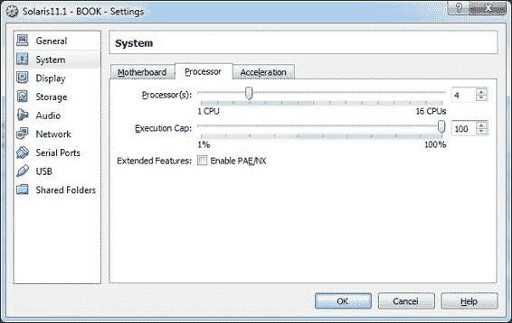

# 第四章. Zones

在本章中，我们将涵盖以下内容：

+   在 zone 中创建、管理和使用虚拟网络

+   使用资源管理器管理 zone

+   实现流量控制

+   从物理 Oracle Solaris 10 主机迁移到 Oracle Solaris 11 Zones

# 介绍

Oracle Solaris 11 Zones 是一个出色的框架，它虚拟化并整合了一个系统环境，在该环境中有许多应用程序和物理机器运行 Oracle Solaris。用一个粗略的比较，Oracle Solaris 11 zone 类似于 VMware ESX、Linux LXC 和 FreeBSD Jails 提供的其他虚拟化选项，但它具有一些重要的不同之处，例如不允许执行硬件仿真或运行除 Oracle Solaris 11 或之前版本的 Oracle Solaris 之外的任何其他操作系统。

在 Oracle Solaris Zones 中，基本的概念是通过共享或划分（使用资源管理器）现有资源，在主操作系统（父操作系统）内部创建不同的小型操作系统安装（子操作系统）。每个安装将有自己的 init 文件和进程，尽管它与父操作系统共享内核，从而导致比之前提到的解决方案更少的开销。使用 Oracle Solaris 11 的术语，父操作系统是全球 zone，子操作系统是非全球 zone，正如我们稍后将看到的。

Oracle Solaris zone 提供了应用程序隔离、额外的安全层和降低的功耗要求。这种对安全性的关注是必要的，以防止在一个 zone 内运行的应用程序崩溃其他 zone 中的应用程序。这也是非全球 zone 无法查看其他非全球 zone、可以包含额外软件包并具有独立产品数据库来控制其自身安装软件的原因。

进一步讨论前面提到的特点，zone 使得多个应用程序能够共享主机资源，从而降低部署成本。这种资源管理允许我们为非全球 zone 分配特定资源，以创建资源消耗的限制（例如 CPU 和内存），并控制进程、任务或项目使用多少资源。此外，这种资源控制利用了 Oracle Solaris 调度器类 **公平共享调度器**（**FSS**），以对 CPU（使用共享）和内存（使用 `rcapd` 守护进程限制物理内存量）进行控制。

Zone 在 Oracle Solaris 版本 10 中引入，可以分为全球 zone（物理机器安装，即之前提到的父操作系统）和非全球 zone（非正式称为 *本地 zone* 或简单地称为 *zone*，即之前提到的子操作系统），在这些 zone 中可以安装和管理应用程序，并进行正确的资源配置。

全球区域（父区域）是一个可启动的区域，直接来自物理硬件，它使得配置、安装、管理和删除非全球区域（子区域）成为可能，因为它也是唯一了解所有现有区域的区域。通常，非全球区域运行与全球区域相同的操作系统，但 Oracle Solaris 11 提供了另一种区域类型，称为**品牌化区域**，它使得创建和安装一个运行 Oracle Solaris 10 的非全球区域成为可能。

简而言之，在安装非全球区域时，需要提供输入目录以指定区域安装位置、网络接口以及如 IP 地址和网络掩码等网络信息。此外，还需要指定在非全球区域中与网络接口一起使用的 IP 类型。共有两种选择：共享 IP（当网络接口与全球区域共享时使用）和专用 IP（当网络接口专用于非全球区域时使用）。

一旦区域配置完成，下一步就是安装并管理该区域。需要了解的是，非全球区域可以有以下区域状态：

+   **undefined**：表示区域配置是否未完成或已删除

+   **incomplete**：表示区域安装在中途被中止

+   **configured**：表示区域配置是否完成

+   **installed**：表示区域包和操作系统已安装

+   **ready**：表示几乎可以运行的区域，并带有相关的区域 ID

+   **running**：表示一切正常，正在执行中

+   **down**：表示区域已停止

说实话，日常工作中更常见的状态是`configured`、`installed`、`running`和`down`。其他状态都是临时状态，我们很少需要关心它们。

因此，状态的顺序是`undefined` | `configured` | `incomplete` | `installed` | `ready` | `running` | `down`。

通常有专业人士问我：“Oracle Solaris 11 和 Oracle Solaris 10 之间有什么区别？”确实存在一些相关差异。现在，`var`目录是一个独立的文件系统，默认区域品牌是 Solaris（之前是 native），不再存在稀疏区域的概念，而默认文件系统是 ZFS，并使用 IPS 作为包管理器。然而，在 Oracle Solaris 11 中最重要的区域差异是引入了网络虚拟化，它允许我们使用至少一个网络接口——**虚拟网络接口** (**VNICs**)——和虚拟交换机的概念来控制网络区域资源。例如，一台物理机器可以在全局区域中运行 Oracle Solaris 11，并且有五个非全局区域（z1、z2、z3、z4 和 z5），每个区域都有一个专用的 VNIC 连接到一个虚拟交换机（`etherstub`），最后一个连接到真实网络接口卡。此外，可以强制执行网络流控制，并配置特定的链路属性以增加带宽控制和效率，从而可以在不同的 VNICs 之间共享网络资源。

可以根据每个 VNIC 创建可能的网络流，并具有特定的属性，隔离和分类类似的数据包，并带有相关联的绑定资源。可能的流属性包括`maxbw`（定义流的带宽）和优先级（定义流中数据包的优先级为低、中和高）。

所有提到的资源控制（CPU、内存和网络）默认情况下都是禁用的，并由两个资源服务控制：默认资源池服务（`svc:/system/pools:default`）和动态资源池服务（`svc:/system/pools/dynamic:default`）。名为`pooladm.conf`的配置文件位于`etc`目录下，帮助我们定义池的创建和资源管理行为，它由一个名为`poold`的守护程序控制整个分配控制和限制，在将创建的池与非全局区域关联后。

现在，我们准备学习关于 Oracle Solaris 11 区域的下一个配方。

# 创建、管理和使用区域内的虚拟网络

我喜欢这个配方，因为在这里，我们将使用 Oracle Solaris 11 虚拟网络区域的主要功能。简而言之，我们将创建和配置以下场景：

+   `zone1` | `vnic1` (`192.168.1.51`) | `vswitch1` (`etherstub`) | `net0` (`192.168.1.144`)

+   `zone2` | `vnic2` (`192.168.1.52`) | `vswitch1` (`etherstub`) | `net0` (`192.168.1.144`)

每个区域连接到其相应的**虚拟网络接口** (**VNIC**)，两个 VNIC 都连接到同一个`etherstub`（一种虚拟交换机）。因此，`etherstub`需要一个虚拟接口（`vnic0`）。最后，`etherstub`连接到一个真实接口（`net0`）。每个区域的`zonepath`属性和其他属性如下：

+   zonepath zone1: `/myzones/zone1`

+   zonepath zone2: `/myzones/zone2`

+   IP 类型：专用 IP

## 准备就绪

本教程需要一台运行 Oracle Solaris 11 的虚拟机（VirtualBox 或 VMware），至少需要 4 GB 的内存（推荐 8 GB），一个额外的 80 GB 磁盘，以及为该虚拟机配置的双核或更多核心的处理器，以下截图是从我的 VirtualBox 环境中提取的：



## 如何操作…

要开始此过程，我们需要通过执行以下命令收集所有当前和相关的系统信息：

```
root@solaris11-1:~# dladm show-link
LINK                CLASS     MTU    STATE    OVER
net1                phys      1500   up       --
net0                phys      1500   up       --
root@solaris11-1:~# ipadm show-if
IFNAME     CLASS    STATE    ACTIVE OVER
lo0        loopback ok       yes    --
net0       ip       ok       yes    --
net1       ip       ok       yes    --
root@solaris11-1:~# ipadm show-addr
ADDROBJ           TYPE     STATE        ADDR
lo0/v4            static   ok           127.0.0.1/8
net0/v4           static   ok           192.168.1.144/24
net1/v4           static   ok           192.168.5.77/24
lo0/v6            static   ok           ::1/128
root@solaris11-1:~# zpool list
NAME      SIZE  ALLOC   FREE  CAP  DEDUP  HEALTH  ALTROOT
myzones  79.5G   544K  79.5G   0%  1.00x  ONLINE  -
rpool    79.5G  21.2G  58.3G  26%  1.00x  ONLINE  -
root@solaris11-1:~# zfs list | grep myzones
myzones                  494K  78.3G    31K  /myzones
root@solaris11-1:~# 
```

系统有两个网络接口（`net0`和`net1`），但只会考虑`net0`。此外，池（`myzones`）有大约 80 GB 的可用空间（你可以使用`zpool create myzones <磁盘>`创建 myzones 池），并且没有文件系统。然后，第一步是创建池并为每个 zone（`zone1`和`zone2`）创建一个文件系统，执行以下命令：

```
root@solaris11-1:~# zpool create myzones c7t2d0
root@solaris11-1:~# zfs create myzones/zone1
root@solaris11-1:~# zfs list myzones/zone1
root@solaris11-1:/myzones# zfs create myzones/zone1
root@solaris11-1:/myzones# zfs create myzones/zone2
root@solaris11-1:/myzones# zfs list | grep zone
myzones                  314K  78.3G    33K  /myzones
myzones/zone1             31K  78.3G    31K  /myzones/zone1
myzones/zone2             31K  78.3G    31K  /myzones/zone2
```

存储需求已满足，接下来，本教程的关键部分是准备所有网络基础设施。为此，必须创建`etherstub`（`vswitch1`）和三个 VNIC：`vnic0`（`etherstub`），`vnic1`（`zone1`），以及`vnic2`（`zone2`）。此外，我们需要将所有 VNIC 连接到`etherstub`（`vswitch1`）。所有这些任务都可以通过执行以下命令完成：

```
root@solaris11-1:~# dladm create-etherstub vswitch1
root@solaris11-1:~# dladm show-link
LINK                CLASS     MTU    STATE    OVER
net1                phys      1500   up       --
net0                phys      1500   up       --
vswitch1            etherstub 9000   unknown  --
root@solaris11-1:~# dladm create-vnic -l vswitch1 vnic0
root@solaris11-1:~# dladm create-vnic -l vswitch1 vnic1
root@solaris11-1:~# dladm create-vnic -l vswitch1 vnic2
root@solaris11-1:~# dladm show-link
LINK                CLASS     MTU    STATE    OVER
net1                phys      1500   up       --
net0                phys      1500   up       --
vswitch1            etherstub 9000   unknown  --
vnic0               vnic      9000   up       vswitch1
vnic1               vnic      9000   up       vswitch1
vnic2               vnic      9000   up       vswitch1
root@solaris11-1:~# dladm show-vnic
LINK          OVER         SPEED  MACADDRESS        MACADDRTYPE   VID
vnic0         vswitch1     40000  2:8:20:d:b:3b     random        0
vnic1         vswitch1     40000  2:8:20:ef:b6:63   random        0
vnic2         vswitch1     40000  2:8:20:ce:b0:da   random        0
```

现在，是时候创建第一个 zone（`zone1`），使用`ip-type=exclusive`（这是默认值）并将`vnic1`作为物理网络接口：

```
root@solaris11-1:~# zonecfg -z zone1
Use 'create' to begin configuring a new zone.
zonecfg:zone1> create
create: Using system default template 'SYSdefault'
zonecfg:zone1> set autoboot=true
zonecfg:zone1> set zonepath=/myzones/zone1
zonecfg:zone1> add net
zonecfg:zone1:net> set physical=vnic1
zonecfg:zone1:net> end
zonecfg:zone1> info
zonename: zone1
zonepath: /myzones/zone1
brand: solaris
autoboot: true
bootargs: 
file-mac-profile: 
pool: 
limitpriv: 
scheduling-class: 
ip-type: exclusive
hostid: 
fs-allowed: 
net:
  address not specified
  allowed-address not specified
  configure-allowed-address: true
  physical: vnic1
  defrouter not specified
anet:
  linkname: net0
  lower-link: auto
 allowed-address not specified
  configure-allowed-address: true
  defrouter not specified
  allowed-dhcp-cids not specified
  link-protection: mac-nospoof
  mac-address: random
  mac-prefix not specified
  mac-slot not specified
  vlan-id not specified
  priority not specified
  rxrings not specified
  txrings not specified
  mtu not specified
  maxbw not specified
  rxfanout not specified
  vsi-typeid not specified
  vsi-vers not specified
  vsi-mgrid not specified
  etsbw-lcl not specified
  cos not specified
  pkey not specified
  linkmode not specified
zonecfg:zone1> verify
zonecfg:zone1> commit
zonecfg:zone1> exit
root@solaris11-1:~#
```

要配置`zone2`，需要执行几乎相同的步骤（省略了 zone 信息的详细内容），执行以下命令：

```
root@solaris11-1:~# zonecfg -z zone2
Use 'create' to begin configuring a new zone.
zonecfg:zone2> create
create: Using system default template 'SYSdefault'
zonecfg:zone2> set autoboot=true
zonecfg:zone2> set zonepath=/myzones/zone2
zonecfg:zone2> add net
zonecfg:zone2:net> set physical=vnic2
zonecfg:zone2:net> end
zonecfg:zone2> verify
zonecfg:zone2> commit
zonecfg:zone2> exit

```

要列出最近配置的 zone，执行以下命令：

```
root@solaris11-1:~# zoneadm list -cv
ID NAME           STATUS     PATH                     BRAND    IP    
 0 global         running    /                        solaris  shared
 - zone1          configured /myzones/zone1           solaris  excl  
 - zone2          configured /myzones/zone2           solaris  excl  
```

根据之前的教程，在安装 zone 后第一次登录时，需要通过 11 个屏幕交互式地提供系统配置信息。为了自动化并简化此过程，可以为每个 zone 创建一个系统配置文件，并在每次安装 zone 时提供它。为完成此任务，需要从中获取一些信息：

对于`zone1`，信息如下：

+   计算机名称：`zone1`

+   以太网网络配置：`手动`

+   网络接口：`vnic1`

+   IP 地址：`192.168.1.51`

+   DNS：`不配置 DNS`

+   备用名称服务器：`无`

+   时区：`(你的时区)`

+   日期和时间：`(当前日期和时间)`

+   根密码：`(你的选择)`

+   你的真实姓名：`Alexandre Borges`

+   用户名：`aborges1`

+   密码：`hacker123!`

+   电子邮件：`anonymous@oracle.com`

+   互联网访问方式：`无代理`

对于`zone2`，信息如下：

+   计算机名称：`zone2`

+   以太网网络配置：`手动`

+   网络接口：`vnic2`

+   IP 地址：`192.168.1.52`

+   DNS：`不配置 DNS`

+   备用名称服务器：`无`

+   时区：`(你的时区)`

+   日期和时间：`(当前日期和时间)`

+   根密码：`(你的选择)`

+   你的真实姓名：`Alexandre Borges`

+   用户名：`aborges2`

+   密码：`hacker123!`

+   电子邮件：`anonymous@oracle.com`

+   网络访问方式：`No proxy`

创建一个目录来存放区域配置文件，方法如下：

```
root@solaris11-1:~# mkdir /zone_profiles

```

通过执行以下命令为 `zone1` 创建配置文件：

```
root@solaris11-1:~# sysconfig create-profile -o /zone_profiles/zone1.xml

```

使用几乎相同的命令，通过执行以下命令为 `zone2` 创建一个配置文件：

```
root@solaris11-1:~# sysconfig create-profile -o /zone_profiles/zone2.xml

```

要可视化系统配置内容，请执行以下命令：

```
root@solaris11-1:~# more /zone_profiles/zone1.xml 
<!DOCTYPE service_bundle SYSTEM "/usr/share/lib/xml/dtd/service_bundle.dtd.1">
<service_bundle type="profile" name="sysconfig">
  <service version="1" type="service" name="system/config-user">
    <instance enabled="true" name="default">
      <property_group type="application" name="root_account">
        <propval type="astring" name="login" value="root"/>
        <propval type="astring" name="password" value="$5$Iabvrv4s$wAqPBNvP7QBZ12ocIdDp/TzNP8Gyv5PBvkTk1QTUEeA"/>
        <propval type="astring" name="type" value="role"/>
      </property_group>
      <property_group type="application" name="user_account">
        <propval type="astring" name="login" value="aborges1"/>
        <propval type="astring" name="password" value="$5$XfpOXWq9$1roklDSW7LW1Iq0pdpxq5Js16/d4DszHHlZB2AvYRL7"/>
        <propval type="astring" name="type" value="normal"/>
        <propval type="astring" name="description" value="Alexandre Borges"/>
        <propval type="count" name="gid" value="10"/>
        <propval type="astring" name="shell" value="/usr/bin/bash"/>
        <propval type="astring" name="roles" value="root"/>
        <propval type="astring" name="profiles" value="System Administrator"/>
        <propval type="astring" name="sudoers" value="ALL=(ALL) ALL"/>
(truncated output)

```

现在，是时候使用之前配置的系统配置文件安装 `zone1` 和 `zone2` 了。因此，为了执行此任务，我们将使用本地仓库（如在第一章，*IPS 和启动环境*中所学）并执行以下命令：

```
root@solaris11-1:~# pkg publisher
PUBLISHER           TYPE     STATUS P LOCATION
solaris             origin   online F http://solaris11-1.example.com/
root@solaris11-1:~# zoneadm -z zone1 install -c /zone_profiles/zone1.xml
root@solaris11-1:~# zoneadm -z zone2 install -c /zone_profiles/zone2.xml
root@solaris11-1:~# zoneadm list -iv
  ID NAME        STATUS     PATH                      BRAND    IP    
   0 global      running    /                         solaris  shared
   - zone1       installed  /myzones/zone1            solaris  excl  
   - zone2       installed  /myzones/zone2            solaris  excl  
root@solaris11-1:~#
```

通过执行以下命令启动这两个区域：

```
root@solaris11-1:~# zoneadm list -iv
ID NAME         STATUS     PATH                       BRAND    IP    
 0 global       running    /                          solaris  shared
 - zone1        installed  /myzones/zone1             solaris  excl  
 - zone2        installed  /myzones/zone2             solaris  excl  
root@solaris11-1:~# zoneadm -z zone1 boot
root@solaris11-1:~# zoneadm -z zone2 boot

```

在登录到区域之前，检查网络信息是很合适的，可以通过执行以下命令来实现：

```
root@solaris11-1:~# dladm show-link
LINK                CLASS     MTU    STATE    OVER
net1                phys      1500   up       --
net0                phys      1500   up       --
vswitch1            etherstub 9000   unknown  --
vnic0               vnic      9000   up       vswitch1
vnic1               vnic      9000   up       vswitch1
zone1/vnic1         vnic      9000   up       vswitch1
vnic2               vnic      9000   up       vswitch1
zone2/vnic2         vnic      9000   up       vswitch1
zone1/net0          vnic      1500   up       net0
zone2/net0          vnic      1500   up       net0
root@solaris11-1:~# dladm show-vnic
LINK          OVER        SPEED  MACADDRESS        MACADDRTYPE    VID
vnic0         vswitch1    40000  2:8:20:d:b:3b     rand           0
vnic1         vswitch1    40000  2:8:20:ef:b6:63   random         0
zone1/vnic1   vswitch1    40000  2:8:20:ef:b6:63   random         0
vnic2         vswitch1    40000  2:8:20:ce:b0:da   random         0
zone2/vnic2   vswitch1    40000  2:8:20:ce:b0:da   random         0
zone1/net0    net0        1000   2:8:20:ac:7d:b1   random         0
zone2/net0    net0        1000   2:8:20:f3:29:68   random         0
root@solaris11-1:~# ipadm show-addr
ADDROBJ           TYPE     STATE        ADDR
lo0/v4            static   ok           127.0.0.1/8
net0/v4           static   ok           192.168.1.144/24
net1/v4           static   ok           192.168.5.77/24
lo0/v6            static   ok           ::1/128
```

现在，我们可以登录到区域并通过执行以下命令进行测试：

```
root@solaris11-1:~# zlogin zone1
[Connected to zone 'zone1' pts/5]
Oracle Corporation  SunOS 5.11  11.1  September 2012
root@zone1:~# ping 192.168.1.52
192.168.1.52 is alive
root@zone1:~# exit
logout
[Connection to zone 'zone1' pts/5 closed]

root@solaris11-1:~# zlogin zone2
[Connected to zone 'zone2' pts/5]
Oracle Corporation  SunOS 5.11  11.1  September 2012
root@zone2:~# ping 192.168.1.51
192.168.1.51 is alive
root@zone2:~# exit
logout
[Connection to zone 'zone2' pts/5 closed]
root@solaris11-1:~#
```

一切正常。区域真是太棒了！

### 该教程概述

这个教程的好消息是我们配置了一个虚拟交换机（`etherstub`）和三个虚拟网络接口。之后，我们使用这些对象创建了两个区域，并应用了虚拟网络的概念。

# 使用资源管理器管理区域

安装和配置 Oracle Solaris 11 非全球区域非常棒，正如我们之前提到的，它是一项出色的技术，可以在不干扰其他应用程序的情况下隔离并运行应用程序，如果出现问题，其他应用程序不受影响。然而，仍然存在一个问题。每个非全球区域都在全球区域中运行，仿佛它单独运行一样，但如果其中一个区域独占所有资源（处理器和内存），并且几乎不给其他区域留下任何资源，就会出现不方便的效果。基于这种情况，可以部署一个名为资源管理器的解决方案，以控制每个区域消耗多少资源。

集中关注资源管理器（不考虑区域），在 Oracle Solaris 11 中，有许多形式可以强制实施资源控制。例如，我们可以使用一个项目（`/etc/project`），该项目由任务组成，每个任务包含一个或多个进程。通过 `projadd` 命令可以创建一个新项目，可以通过 **服务管理工具**（**SMF**）或甚至在打开会话时使用 `newtask` 命令来创建新任务。启用资源管理器服务并将处理器和内存等资源分配给该项目，有助于为该项目绑定的进程设定一个上限，限制它们可以使用多少资源（处理器和内存）。无论如何，可以通过运行 `projects -l` 命令列出 Oracle Solaris 11 中现有的项目。

有几种方法可以将资源与项目关联。第一种方法是使用资源控制（`rctladm`和`prctl`命令）来管理和查看分配给项目的控制。此方法的缺点是，它通过进程限制使用的资源，防止它们占用更多的处理器或内存（如果需要）。另一个相关且可能的问题是，管理员必须精确知道应用程序使用了多少资源，才能合理地分配资源，因为如果分配给项目或应用程序的资源不足，它可能会停止工作。

控制应用程序能够使用多少资源的第二种有效方法是使用**公平共享调度器**（**FSS**）类，它帮助我们根据资源需求调节资源分配（处理器时间）。一个真实的优势是，如果某个应用程序没有使用分配的所有资源（处理器时间），其他应用程序可以使用该应用程序释放出来的空闲资源。因此，这种资源共享就像是一个动态资源控制系统，按照计划分配资源（应用程序分配了份额），并根据需求变化调整其分配。例如，当我个人使用 FSS 时，我会将可用的份额归一化为 100 点，以便于与百分比进行比较。对于项目 A，我分配 30 个份额；对于项目 B，我分配 50 个份额；对于项目 C，我分配 20 个份额。最终，时间处理器的分配是：应用程序 A 得到 30％，应用程序 B 得到 50％，应用程序 C 得到 20％。这很简单，不是吗？

部署资源管理器的第三种方式是使用资源池。基本思想是将资源分配给资源组（或池），然后将该池与项目或应用程序关联。类似于我们为 FSS 解释的内容，处理器集（处理器组）通常分配给资源池，而资源池再分配给项目。资源池提供了更好的灵活性，因为它允许我们根据需求设置应用程序使用的处理器的最小和最大数量。例如，可以将一个到八个核心（或处理器）分配给项目，根据资源需求，使用更少或更多的处理器。此外，特定的处理器（或核心）可以专门分配给处理器集，若需要的话。使用资源池的一个小缺点是，处理器被限制在池内，即使有空闲资源（处理器），也不能被其他应用程序使用。就个人而言，我更喜欢管理和使用 FSS，因为其灵活性和可重用性让你有机会释放资源，供其他应用程序或项目使用。尽管如此，将资源池与 FSS 和项目混合使用并实施受控环境，依然是可行的。

最终，所有这些控制资源的技术都可以在区域上下文中部署，以通过运行的应用程序限制使用的资源，正如我们在这个方案中将要学习的那样。

## 准备工作

这个方案需要一台虚拟机（VirtualBox 或 VMware），其运行在具有两个或更多核心的处理器上，配备 8GB RAM 和 80GB 硬盘。为了简化以下步骤，我们将使用在之前方案中使用的区域，读者可以认为这个方案是一个简单的延续。

## 如何进行…

基本上，这个方案由两部分组成。在第一部分，配置资源池；在第二部分，将现有资源池绑定到区域。

首先，我们需要通过运行以下命令收集关于现有区域的信息：

```
root@solaris11-1:~# zoneadm list -iv
ID NAME          STATUS     PATH                      BRAND    IP    
 0 global        running    /                         solaris  shared
 1 zone2         running    /myzones/zone2            solaris  excl  
 2 zone1         running    /myzones/zone1            solaris  excl  
root@solaris11-1:~#
```

资源池服务可能已经停止。我们可以通过执行以下命令来验证它们：

```
root@solaris11-1:~# svcs -a | grep pool
disabled       12:23:27 svc:/system/pools:default
disabled       12:23:35 svc:/system/pools/dynamic:default
```

通过执行以下命令检查每个服务的依赖关系：

```
root@solaris11-1:~# svcs -d svc:/system/pools:default
STATE          STIME    FMRI
online         12:23:42 svc:/system/filesystem/minimal:default
root@solaris11-1:~# svcs -d svc:/system/pools/dynamic:default
STATE          STIME    FMRI
disabled       12:23:27 svc:/system/pools:default
online         12:24:08 svc:/system/filesystem/local:default
```

由于`svc:/system/pools/dynamic:default`服务依赖于`svc:/system/pools:default`，建议通过运行以下命令启用它们：

```
root@solaris11-1:~# svcadm enable -r svc:/system/pools/dynamic:default
root@solaris11-1:~# svcs -a | grep pool
online         14:30:31 svc:/system/pools:default
online         14:30:37 svc:/system/pools/dynamic:default
root@solaris11-1:~# svcs -p svc:/system/pools/dynamic:default
STATE          STIME    FMRI
online         14:30:37 svc:/system/pools/dynamic:default
               14:30:37     5443 poold
```

当启用资源池控制时，会创建一个默认池（`pool_default`）和一个默认处理器集（`default_pset`），包括系统中的所有资源，可以通过执行以下命令来验证：

```
root@solaris11-1:~# pooladm
system default
  string  system.comment 
  int  system.version 1
  boolean  system.bind-default true
  string  system.poold.objectives wt-load

  pool pool_default
    int  pool.sys_id 0
    boolean  pool.active true
    boolean  pool.default true
    int  pool.importance 1
    string  pool.comment 
    pset  pset_default

  pset pset_default
    int  pset.sys_id -1
    boolean  pset.default true
    uint  pset.min 1
    uint  pset.max 65536
    string  pset.units population
    uint  pset.load 211
    uint  pset.size 4
    string  pset.comment 

    cpu
      int  cpu.sys_id 1
      string  cpu.comment 
      string  cpu.status on-line

    cpu
      int  cpu.sys_id 3
      string  cpu.comment 
      string  cpu.status on-line

    cpu
      int  cpu.sys_id 0
      string  cpu.comment 
      string  cpu.status on-line

    cpu
      int  cpu.sys_id 2
      string  cpu.comment 
      string  cpu.status on-line
```

根据此输出，存在一个默认池（`pool_default`）；真实处理器有四个核心（范围 0 到 3），它们都组成了一个处理器集（`pset`）。然而，这个资源池配置只存在于内存中，并且不在磁盘上持久化。因此，要将其保存到配置文件中，请执行以下命令：

```
root@solaris11-1:~# pooladm -s
root@solaris11-1:~# more /etc/pooladm.conf 
<?xml version="1.0"?>
<!DOCTYPE system PUBLIC "-//Sun Microsystems Inc//DTD Resource Management All//EN" "file:///usr/share/lib/xml/dtd/rm_pool.dtd.1">
<!--
Configuration for pools facility. Do NOT edit this file by hand - use poolcfg(1) or libpool(3POOL) instead.
-->
<system ref_id="dummy" name="default" comment="" version="1" bind-default="true">
  <property name="system.poold.objectives" type="string">wt-load</property>
  <pool name="pool_default" active="true" default="true" importance="1" comment="" res="pset_-1" ref_id="pool_0">
    <property name="pool.sys_id" type="int">0</property>
  </pool>
  <res_comp type="pset" sys_id="-1" name="pset_default" default="true" min="1" max="65536" units="population" comment="" ref_id="pset_-1">
    <property name="pset.load" type="uint">176</property>
    <property name="pset.size" type="uint">4</property>
    <comp type="cpu" sys_id="1" comment="" ref_id="cpu_1">
      <property name="cpu.status" type="string">on-line</property>
    </comp>
    <comp type="cpu" sys_id="3" comment="" ref_id="cpu_3">
      <property name="cpu.status" type="string">on-line</property>
    </comp>
    <comp type="cpu" sys_id="0" comment="" ref_id="cpu_0">
      <property name="cpu.status" type="string">on-line</property>
    </comp>
    <comp type="cpu" sys_id="2" comment="" ref_id="cpu_2">
      <property name="cpu.status" type="string">on-line</property>
    </comp>
  </res_comp>
</system>
```

从这一点开始，以下步骤会创建一个包含两个核心的处理器集（`pset`），创建一个池，并将该处理器集与池关联。稍后，这个池将分配给区域配置，可以显示为：处理器集 | 池 | 区域。

因此，要创建一个包含一个核心最小（`pset.min=1`）和两个核心最大（`pset.max=2`）的处理器集（`first_pset`），请执行以下命令：

```
root@solaris11-1:~# poolcfg -c 'create pset first_pset (uint pset.min = 1; uint pset.max = 2)'
root@solaris11-1:~# poolcfg -c 'info pset first_pset'

pset first_pset
  int  pset.sys_id -2
  boolean  pset.default false
  uint  pset.min 1
  uint  pset.max 2
  string  pset.units population
  uint  pset.load 0
  uint  pset.size 0
  string  pset.comment
```

现在，我们可以创建一个名为`first_pool`的池，初始时将所有资源（四个核心处理器）绑定到该池中，方法是运行以下命令：

```
root@solaris11-1:~# poolcfg -c 'create pool first_pool'
root@solaris11-1:~# poolcfg -c 'info pool first_pool'

pool first_pool
  boolean  pool.active true
  boolean  pool.default false
  int  pool.importance 1
  string  pool.comment 
  pset  pset_default

 pset pset_default
    int  pset.sys_id -1
 boolean  pset.default true
    uint  pset.min 1
    uint  pset.max 65536
    string  pset.units population
    uint  pset.load 176
    uint  pset.size 4
    string  pset.comment 

    cpu
      int  cpu.sys_id 1
      string  cpu.comment 
      string  cpu.status on-line

    cpu
      int  cpu.sys_id 3
      string  cpu.comment 
      string  cpu.status on-line

    cpu
      int  cpu.sys_id 0
      string  cpu.comment 
      string  cpu.status on-line

    cpu
      int  cpu.sys_id 2
      string  cpu.comment 
      string  cpu.status on-line

root@solaris11-1:~#
```

然后，通过执行以下命令将`first_pool`池分配给`first_pset`处理器集：

```
root@solaris11-1:~# poolcfg -c 'associate pool first_pool (pset first_pset)'
root@solaris11-1:~# poolcfg -c 'info pool first_pool'
pool first_pool
  boolean  pool.active true
  boolean  pool.default false
  int  pool.importance 1
  string  pool.comment 
   pset  first_pset

  pset first_pset
    int  pset.sys_id -2
    boolean  pset.default false
    uint  pset.min 1
    uint  pset.max 2
    string  pset.units population
    uint  pset.load 0
    uint  pset.size 0
    string  pset.comment 

root@solaris11-1:~#
```

到目前为止，一切正常。现在，我们需要通过执行以下命令检查新池是否已经出现在资源内存配置中：

```
root@solaris11-1:~# poolcfg -c info
system default
  string   system.comment 
  int      system.version 1
  boolean  system.bind-default true
  string   system.poold.objectives wt-load

  pool pool_default
    int      pool.sys_id 0
    boolean  pool.active true
    boolean  pool.default true
    int      pool.importance 1
    string   pool.comment 
    pset     pset_default

 pool first_pool
 boolean  pool.active true
 boolean  pool.default false
 int      pool.importance 1
 string   pool.comment 
 pset     first_pset

  pset pset_default
    int      pset.sys_id -1
    boolean  pset.default true
    uint     pset.min 1
    uint     pset.max 65536
    string   pset.units population
    uint     pset.load 176
    uint     pset.size 4
    string   pset.comment 

    cpu
      int     cpu.sys_id 1
      string  cpu.comment 
      string  cpu.status on-line

    cpu
      int     cpu.sys_id 3
      string  cpu.comment 
      string  cpu.status on-line

    cpu
      int     cpu.sys_id 0
      string  cpu.comment 
      string  cpu.status on-line

    cpu
      int     cpu.sys_id 2
      string  cpu.comment 
      string  cpu.status on-line

  pset first_pset
    int      pset.sys_id -2
    boolean  pset.default false
    uint     pset.min 1
    uint     pset.max 2
    string   pset.units population
    uint     pset.load 0
    uint     pset.size 0
    string   pset.comment 
```

我们已经意识到，`first_pset`配置仍未在池配置文件中持久化。要验证（`-n -c`选项）并提交（`-c`选项）新配置，请执行以下命令：

```
root@solaris11-1:~# pooladm -n -c
root@solaris11-1:~# pooladm -c
root@solaris11-1:~# more /etc/pooladm.conf
<?xml version="1.0" encoding="UTF-8"?>
<!DOCTYPE system PUBLIC "-//Sun Microsystems Inc//DTD Resource Management All//EN" "file:///usr/share/lib/xml/dtd/rm_pool.dtd.1">
<!--
Configuration for pools facility. Do NOT edit this file by hand - use poolcfg(1) or libpool(3POOL) instead.
-->
<system ref_id="dummy" name="default" comment="" version="1" bind-default="true">
  <property name="system.poold.objectives" type="string">wt-load</property>
  <pool name="pool_default" active="true" default="true" importance="1" comment="" res="pset_-1" ref_id="pool_0">
    <property name="pool.sys_id" type="int">0</property>
  </pool>
  <res_comp type="pset" sys_id="-1" name="pset_default" default="true" min="1" max="65536" units="population" comment="" ref_id="pset_-1">
    <property name="pset.load" type="uint">176</property>
    <property name="pset.size" type="uint">4</property>
    <comp type="cpu" sys_id="1" comment="" ref_id="cpu_1">
      <property name="cpu.status" type="string">on-line</property>
    </comp>
    <comp type="cpu" sys_id="3" comment="" ref_id="cpu_3">
      <property name="cpu.status" type="string">on-line</property>
    </comp>
    <comp type="cpu" sys_id="0" comment="" ref_id="cpu_0">
      <property name="cpu.status" type="string">on-line</property>
    </comp>
    <comp type="cpu" sys_id="2" comment="" ref_id="cpu_2">
      <property name="cpu.status" type="string">on-line</property>
    </comp>
  </res_comp>
  <res_comp ref_id="id_0" sys_id="-2" type="pset" name="first_pset" min="1" max="2" units="population" comment="">
    <property name="pset.load" type="uint">0</property>
    <property name="pset.size" type="uint">0</property>
  </res_comp>
  <property name="system._next_id" type="uint">2</property>
  <pool ref_id="id_1" res="id_0" name="first_pool" active="true" importance="1" comment=""/>
</system>
root@solaris11-1:~#
```

一切准备就绪。不过，使用`-dc`选项可以很容易验证该配置仅在内存中（内核状态）是活动的，但它并没有保存在资源池配置文件中（选项`-c`），如下所示：

```
root@solaris11-1:~# poolcfg -dc info
system default
  string   system.comment 
  int      system.version 1
  boolean  system.bind-default true
  string   system.poold.objectives wt-load

  pool first_pool
    int      pool.sys_id 1
    boolean  pool.active true
    boolean  pool.default false
    int      pool.importance 1
    string   pool.comment 
 pset     first_pset

  pool pool_default
    int      pool.sys_id 0
    boolean  pool.active true
    boolean  pool.default true
    int      pool.importance 1
    string   pool.comment 
    pset     pset_default

 pset first_pset
 int      pset.sys_id 1
 boolean  pset.default false
 uint     pset.min 1
 uint     pset.max 2
 string   pset.units population
 uint     pset.load 0
 uint     pset.size 2
 string   pset.comment 

 cpu
 int     cpu.sys_id 1
 string  cpu.comment 
 string  cpu.status on-line

 cpu
 int  cpu.sys_id 0
 string  cpu.comment 
 string  cpu.status on-line

 pset pset_default
 int      pset.sys_id -1
 boolean  pset.default true
 uint     pset.min 1
 uint     pset.max 65536
 string   pset.units population
 uint     pset.load 151
 uint     pset.size 2
 string   pset.comment 

 cpu
 int     cpu.sys_id 3
 string  cpu.comment 
 string  cpu.status on-line

 cpu
 int     cpu.sys_id 2
 string  cpu.comment 
 string  cpu.status on-line

root@solaris11-1:~# poolcfg -c info
system default
  string   system.comment 
  int      system.version 1
  boolean  system.bind-default true
  string   system.poold.objectives wt-load

  pool pool_default
    int  pool.sys_id 0
    boolean  pool.active true
    boolean  pool.default true
    int      pool.importance 1
    string   pool.comment 
    pset     pset_default

  pool first_pool
    boolean  pool.active true
    boolean  pool.default false
    int      pool.importance 1
    string   pool.comment 
 pset     first_pset

 pset pset_default
    int  pset.sys_id -1
    boolean  pset.default true
    uint     pset.min 1
    uint     pset.max 65536
    string   pset.units population
    uint     pset.load 176
    uint     pset.size 4
    string   pset.comment 

 cpu
 int     cpu.sys_id 1
 string  cpu.comment 
 string  cpu.status on-line

 cpu
 int     cpu.sys_id 3
 string  cpu.comment 
 string  cpu.status on-line

 cpu
 int     cpu.sys_id 0
 string  cpu.comment 
 string  cpu.status on-line

 cpu
 int     cpu.sys_id 2
 string  cpu.comment 
 string  cpu.status on-line

 pset first_pset
 int      pset.sys_id -2
 boolean  pset.default false
 uint     pset.min 1
 uint     pset.max 2
 string   pset.units population
 uint     pset.load 0
 uint     pset.size 0
    string   pset.comment 
```

为了解决将资源池配置从内存保存到磁盘的问题，我们可以通过运行以下命令使用`-s`选项：

```
root@solaris11-1:~# pooladm -s
root@solaris11-1:~# poolcfg -c info
system default
  string   system.comment 
  int      system.version 1
  boolean  system.bind-default true
  string   system.poold.objectives wt-load

  pool first_pool
    int      pool.sys_id 1
    boolean  pool.active true
    boolean  pool.default false
    int      pool.importance 1
    string   pool.comment 
    pset     first_pset

  pool pool_default
    int      pool.sys_id 0
    boolean  pool.active true
    boolean  pool.default true
    int      pool.importance 1
    string   pool.comment 
    pset     pset_default

 pset first_pset
    int      pset.sys_id 1
    boolean  pset.default false
    uint     pset.min 1
    uint     pset.max 2
    string   pset.units population
    uint     pset.load 0
    uint     pset.size 2
    string   pset.comment 

 cpu
 int     cpu.sys_id 1
 string  cpu.comment 
 string  cpu.status on-line

 cpu
 int     cpu.sys_id 0
 string  cpu.comment 
 string  cpu.status on-line

 pset pset_default
    int      pset.sys_id -1
    boolean  pset.default true
    uint     pset.min 1
    uint     pset.max 65536
    string   pset.units population
    uint     pset.load 201
    uint     pset.size 2
    string   pset.comment 

 cpu
 int     cpu.sys_id 3
 string  cpu.comment 
 string  cpu.status on-line

 cpu
 int     cpu.sys_id 2
 string  cpu.comment 
      string  cpu.status on-line
```

太棒了！通过执行以下`poolstat`命令列出活动的资源池：

```
root@solaris11-1:~# poolstat
                              pset
 id pool                 size used load
  1 first_pool              2 0.00 0.00
  0 pool_default            2 0.00 0.17
root@solaris11-1:~# poolstat -r all
id pool              type rid rset           min  max size used load
  1 first_pool        pset   1 first_pset     1    2    2   0.00 0.00
  0 pool_default      pset  -1 pset_default   1    66K  2   0.00 0.17
```

将最近创建的池（`first_pool`）关联到非全局的`zone1`，可以通过执行以下命令来完成：

```
root@solaris11-1:~# zonecfg -z zone1 info | grep pool
pool: 

root@solaris11-1:~# zonecfg -z zone1 set pool=first_pool
root@solaris11-1:~# zonecfg -z zone1 info | grep pool
pool: first_pool
```

无法在不重启`zone1`的情况下激活绑定的资源池，因此执行以下命令：

```
root@solaris11-1:~# zoneadm -z zone1 shutdown -r
root@solaris11-1:~# zoneadm list -iv
ID NAME          STATUS     PATH                      BRAND    IP    
 0 global        running    /                         solaris  shared
 1 zone2         running    /myzones/zone2            solaris  excl  
 3 zone1         running    /myzones/zone1            solaris  excl  
```

现在，登录到`zone1`，并通过运行以下命令检查`first_pool`池是否已激活：

```
root@solaris11-1:~# zlogin zone1
[Connected to zone 'zone1' pts/3]
Oracle Corporation  SunOS 5.11  11.1  September 2012
root@zone1:~# poolcfg -dc info
system default
  string   system.comment 
  int      system.version 1
  boolean  system.bind-default true
  string   system.poold.objectives wt-load

  pool first_pool
    int      pool.sys_id 1
    boolean  pool.active true
    boolean  pool.default false
    int      pool.importance 1
    string   pool.comment 
    pset     first_pset

  pset first_pset
    int      pset.sys_id 1
    boolean  pset.default false
    uint     pset.min 1
    uint     pset.max 2
    string   pset.units population
    uint     pset.load 540
    uint     pset.size 2
    string   pset.comment 

    cpu
      int     cpu.sys_id 1
      string  cpu.comment 
      string  cpu.status on-line

    cpu
      int     cpu.sys_id 0
      string  cpu.comment 
      string  cpu.status on-line
root@zone1:~# psrinfo
0  on-line   since 02/01/2014 12:23:05
1  on-line   since 02/01/2014 12:23:07
root@zone1:~# psrinfo -v
Status of virtual processor 0 as of: 02/01/2014 15:52:47
  on-line since 02/01/2014 12:23:05.
  The i386 processor operates at 2470 MHz,
    and has an i387 compatible floating point processor.
Status of virtual processor 1 as of: 02/01/2014 15:52:47
  on-line since 02/01/2014 12:23:07.
  The i386 processor operates at 2470 MHz,
    and has an i387 compatible floating point processor.
```

完美！两个核心已与`zone1`关联，任何在此区域内运行的应用程序都可以使用这些核心处理器。

要改变资源类型的焦点，有一个非常有趣的方法是限制使用的内存，称为资源限制，这有助于我们限制物理内存、交换内存和锁定内存。

例如，使用相同的`zone1`，通过执行以下命令来更改其配置：

```
root@solaris11-1:~# zonecfg -z zone1
zonecfg:zone1> add capped-memory
zonecfg:zone1:capped-memory> set physical=1G
zonecfg:zone1:capped-memory> set swap=500M
zonecfg:zone1:capped-memory> end
zonecfg:zone1> verify
zonecfg:zone1> commit
zonecfg:zone1> exit
root@solaris11-1:~# zonecfg -z zone1 info
zonename: zone1
zonepath: /myzones/zone1
brand: solaris
autoboot: true
(truncated)

capped-memory:
  physical: 1G
  [swap: 500M]
rctl:
  name: zone.max-swap
  value: (priv=privileged,limit=524288000,action=deny)
root@solaris11-1:~#
```

根据之前的输出，`zone1`的物理内存限制为 1GB，已使用的交换空间限制为 500MB。此外，还存在一个关于最大交换空间的奇怪行：

```
value: (priv=privileged,limit=524288000,action=deny)

```

该行的解释如下：

+   `privileged`：只有特权用户（root）才能修改。另一个可能的值是 `basic`（仅所有者可以修改）。

+   `deny`：此设置可以拒绝任何超过限制值（500 MB）的资源请求。其他选项包括 `none`（即使请求的资源超过限制，也不采取任何行动）和 `signal`（当超过阈值时发送信号）。

资源限制是由 `rcapd` 守护进程实现的服务，可以通过以下命令启用此服务：

```
root@solaris11-1:~# svcs -a | grep rcap
disabled       21:56:20 svc:/system/rcap:default

root@solaris11-1:~# svcs  -d svc:/system/rcap:default
STATE          STIME    FMRI
online         21:56:31 svc:/system/filesystem/minimal:default
online         21:56:33 svc:/system/resource-mgmt:default
online         21:56:35 svc:/system/manifest-import:default
root@solaris11-1:~# svcadm enable svc:/system/rcap:default
root@solaris11-1:~# svcs -	a | grep rcap
online         22:52:06 svc:/system/rcap:default
root@solaris11-1:~# svcs -p svc:/system/rcap:default
STATE          STIME    FMRI
online         22:52:06 svc:/system/rcap:default
               22:52:06     5849 rcapd
```

重启 `zone1` 以使内存限制生效。现在可以通过运行以下命令启用资源限制守护进程，而无需重启：

```
root@solaris11-1:~# rcapadm -E -n

```

要监控 `rcap` 守护进程（`rcapd`）的操作，请执行以下命令：

```
root@solaris11-1:~# zoneadm -z zone1 shutdown -r
root@solaris11-1:~# zoneadm list -iv
ID NAME             STATUS     PATH                 BRAND    IP    
 0 global           running    /                    solaris  shared
 1 zone2            running    /myzones/zone2       solaris  excl  
 3 zone1            running    /myzones/zone1       solaris  excl  
root@solaris11-1:~# rcapstat -z
id zone            nproc    vm   rss   cap    at avgat    pg avgpg
 3 zone1               -   26M   38M 1024M    0K    0K    0K    0K
 3 zone1               -   31M   44M 1024M    0K    0K    0K    0K
 3 zone1               -   31M   44M 1024M    0K    0K    0K    0K
```

已使用的物理内存（RSS）低于内存限制值（1024 MB）。如果物理内存增加，则其限制为 1024 MB。好极了！

为了使这个示例更具吸引力，可以进行一些修改。我们从 `zone1` 中移除 `first_pool` 资源池（以及任何其他现有池）。另外，`first_pool` 池将通过 `pooladm -x` 命令被删除。显然，新的池配置必须通过 `pooladm -s` 命令保存。以下是步骤：

```
root@solaris11-1:~# zonecfg -z zone1 clear pool
root@solaris11-1:~# zoneadm -z zone1 shutdown -r
root@solaris11-1:~# pooladm -x
root@solaris11-1:~# pooladm -s
root@solaris11-1:~# pooladm 
system default
  string   system.comment 
  int      system.version 1
  boolean  system.bind-default true
  string   system.poold.objectives wt-load

  pool pool_default
    int      pool.sys_id 0
    boolean  pool.active true
    boolean  pool.default true
    int      pool.importance 1
    string   pool.comment 
    pset     pset_default

  pset pset_default
    int      pset.sys_id -1
    boolean  pset.default true
    uint     pset.min 1
    uint     pset.max 65536
    string   pset.units population
    uint     pset.load 15511
    uint     pset.size 4
    string   pset.comment 

    cpu
      int     cpu.sys_id 1
      string  cpu.comment 
      string  cpu.status on-line

    cpu
      int     cpu.sys_id 3
      string  cpu.comment 
      string  cpu.status on-line

    cpu
      int     cpu.sys_id 0
      string  cpu.comment 
      string  cpu.status on-line

    cpu
      int     cpu.sys_id 2
      string  cpu.comment 
      string  cpu.status on-line
```

一切已恢复到默认状态，从此以后，`zone1` 不再有特定关联的资源池。这使得我们可以从现在开始专注于 FSS。

以下命令检查当前的默认内核调度类是什么：

```
root@solaris11-1:~# dispadmin -d
dispadmin: Default scheduling class is not set
```

没有默认的调度类。如果我们想使用 FSS，那么最好在全局区域配置它，因为这个设置会被所有非全局区域继承。按照上述说明配置 FSS，执行以下命令：

```
root@solaris11-1:~# dispadmin -d FSS
root@solaris11-1:~# dispadmin -d
FSS  (Fair Share)
```

此设置仅在系统重启后生效。系统重新启动后，所有进程将被归类为 FSS。然而，如果不重启也要立即生效，请执行以下命令：

```
root@solaris11-1:~# priocntl -s -c FSS

```

不幸的是，所有当前进程仍然在其他调度类下运行，只有新进程会采用 FSS 设置。可以通过运行以下命令来验证这一点：

```
root@solaris11-1:~# ps -efcZ | more
  ZONE     UID   PID  PPID  CLS PRI    STIME TTY    TIME CMD
global    root     0     0  SYS  96 00:04:41 ?      0:01 sched
global    root     5     0  SDC  99 00:04:38 ?      0:07 zpool-rpool
global    root     6     0  SDC  99 00:04:42 ?      0:01 kmem_task
global    root     1     0   TS  59 00:04:42 ?      0:00 /usr/sbin/init
global    root     2     0  SYS  98 00:04:42 ?      0:00 pageout
global    root     3     0  SYS  60 00:04:42 ?      0:00 fsflush
global    root     7     0  SYS  60 00:04:42 ?      0:00 intrd
global    root     8     0  SYS  60 00:04:42 ?      0:00 vmtasks
global    root   115     1   TS  59 00:05:09 ?      0:00 /usr/lib/pfexecd
global    root    11     1   TS  59 00:04:48 ?      0:13 /lib/svc/bin/svc.startd
global    root    13     1   TS  59 00:04:48 ?      0:33 /lib/svc/bin/svc.configd
global    root   911     1   TS  59 02:05:55 ?      0:00 
(truncated output)

```

同样，也不需要等到下一次重启。因此，可以通过执行以下命令将所有进程从当前的调度类移动到 FSS：

```
root@solaris11-1:~# priocntl -s -c FSS -i all
root@solaris11-1:~# ps -efcZ | more
  ZONE      UID   PID  PPID  CLS PRI    STIME TTY    TIME CMD
global     root     0     0  SYS  96 00:04:41 ?      0:01 sched
global     root     5     0  SDC  99 00:04:38 ?      0:12 zpool-rpool
global     root     6     0  SDC  99 00:04:42 ?      0:02 kmem_task
global     root     1     0  FSS  29 00:04:42 ?      0:00 /usr/sbin/init
global     root     2     0  SYS  98 00:04:42 ?      0:00 pageout
global     root     3     0  SYS  60 00:04:42 ?      0:01 fsflush
global     root     7     0  SYS  60 00:04:42 ?      0:00 intrd
global     root     8     0  SYS  60 00:04:42 ?      0:00 vmtasks
global     root   115     1  FSS  29 00:05:09 ?      0:00 /usr/lib/pfexecd
global     root    11     1  FSS  29 00:04:48 ?      0:13 /lib/svc/bin/svc.startd
global     root    13     1  FSS  29 00:04:48 ?      0:33 /lib/svc/bin/svc.configd
(truncated output)

```

当 FSS 设置为全局区域的默认调度类时，所有非全局区域都会自动采用此配置。验证此配置，请运行以下命令：

```
root@solaris11-1:~# zlogin zone1
 [Connected to zone 'zone1' pts/4]
Oracle Corporation  SunOS 5.11  11.1  September 2012
root@zone1:~# ps -efcZ | more
 ZONE      UID   PID  PPID  CLS PRI    STIME TTY         TIME CMD
zone1     root  3944  2454  FSS  29 02:06:47 ?           0:00 /usr/sbin/init
zone1     root  4284  2454  FSS  29 02:06:58 ?           0:06 /lib/svc/bin/svc.startd
zone1     root  2454  2454  SYS  60 02:06:29 ?           0:00 zsched
zone1     root  5479  2454  FSS  59 02:48:52 pts/4       0:00 /usr/bin/login -z global -f root
zone1     root  4287  2454  FSS  29 02:07:00 ?           0:21 /lib/svc/bin/svc.configd
zone1   netcfg  4448  2454  FSS  29 02:07:27 ?           0:00 /lib/inet/netcfgd
zone1     root  4922  2454  FSS  29 02:08:21 ?           0:00 
(truncated output)

```

我们可以意识到，`zone1` 中的所有主进程都处于 FSS 类中。无论如何，建议在非全局设置中显式配置 FSS 类，以防止将来可能的错误。因此，执行以下命令：

```
root@solaris11-1:~# zonecfg -z zone1
zonecfg:zone1> set scheduling-class=FSS
zonecfg:zone1> verify
zonecfg:zone1> commit
zonecfg:zone1> exit
root@solaris11-1:~#
root@solaris11-1:~# zonecfg -z zone2
zonecfg:zone2> set scheduling-class=FSS
zonecfg:zone2> verify
zonecfg:zone2> commit
zonecfg:zone2> exit
root@solaris11-1:~# 
```

最后，现在是使用 FSS 类来为每个区域（`zone1` 和 `zone2`）配置共享资源的正确时机。这样，就可以将 CPU 处理的 70% 分配给 `zone1`，将剩余的 30% 分配给 `zone2`。以下是操作步骤：

```
root@solaris11-1:~# zonecfg -z zone1
zonecfg:zone1> add rctl 
zonecfg:zone1:rctl> set name=zone.cpu-shares
zonecfg:zone1:rctl> add value (priv=privileged, limit=70,action=none)
zonecfg:zone1:rctl> end
zonecfg:zone1> verify
zonecfg:zone1> commit
zonecfg:zone1> exit
root@solaris11-1:~# zonecfg -z zone2
zonecfg:zone2> add rctl
zonecfg:zone2:rctl> set name=zone.cpu-shares
zonecfg:zone2:rctl> add value (priv=privileged,limit=30,action=none)
zonecfg:zone2:rctl> end
zonecfg:zone2> verify
zonecfg:zone2> commit
zonecfg:zone2> exit

```

这太棒了！通过`zonecfg`命令，以持久的方式将共享分配给了`zone1`（70 个共享）和`zone2`（30 个共享）。要使这两个区域生效，请执行以下命令：

```
root@solaris11-1:~# zoneadm -z zone1 shutdown -r
root@solaris11-1:~# zoneadm -z zone2 shutdown -r

```

可以通过以下命令跟踪和监控处理器的使用时间：

```
root@solaris11-1:~# prstat -Z
  PID USERNAME  SIZE   RSS STATE   PRI NICE      TIME  CPU PROCESS/NLWP      
  4466 root      216M   98M sleep    59    0   0:00:41 0.7% java/25
  4702 root      129M   19M sleep    59    0   0:00:06 0.5% gnome-terminal/2
rcapd/1
     5 root        0K    0K sleep    99  -20   0:00:19 0.2% zpool-rpool/138
   898 root       53M   18M sleep    53    0   0:00:06 0.1% poold/9
  (omitted output)
 automountd/2
   198 root     1780K  788K sleep    29    0   0:00:00 0.0% utmpd/1
   945 root     2392K 1552K sleep    59    0   0:00:00 0.0% ttymon/1
ZONEID    NPROC  SWAP   RSS MEMORY      TIME  CPU ZONE      
     0      117 2885M  794M   9.5%   0:03:28 2.5% global    
     2       28  230M   62M   0.7%   0:00:30 0.1% zone1     
     1       28  230M   64M   0.7%   0:00:29 0.1% zone2      
```

令人惊讶的是，能够动态地更改`zone.cpu-shares`属性，而无需重新启动区域，但这种更改是非持久性的（所有更改在重启后会丢失）。可以通过运行以下命令来完成：

```
root@solaris11-1:~# prctl -n zone.cpu-shares -v 60 -r -i zone zone1
root@solaris11-1:~# prctl -n zone.cpu-shares -P -i zone zone1
zone: 3: zone1
zone.cpu-shares usage 60 - - -
zone.cpu-shares privileged 60 - none -
zone.cpu-shares system 65535 max none -
root@solaris11-1:~# prctl -n zone.cpu-shares -v 40 -r -i zone zone2
root@solaris11-1:~# prctl -n zone.cpu-shares -P -i zone zone2
zone: 4: zone2
zone.cpu-shares usage 40 - - -
zone.cpu-shares privileged 40 - none -
zone.cpu-shares system 65535 max none -
root@solaris11-1:~#
```

为了在 5 秒钟的间隔内收集来自两个区域的内存和 CPU 信息，请执行以下命令：

```
root@solaris11-1:~#  zonestat -z zone1,zone2 -r physical-memory 5
Collecting data for first interval...
Interval: 1, Duration: 0:00:05
PHYSICAL-MEMORY              SYSTEM MEMORY
mem_default                          8191M
                                ZONE  USED %USED   CAP  %CAP
                             [total] 1464M 17.8%     -     -
                            [system]  624M 7.62%     -     -
                               zone2 63.9M 0.78%     -     -
                               zone1 3561K 0.04% 1024M 0.33%

Interval: 2, Duration: 0:00:10
PHYSICAL-MEMORY              SYSTEM MEMORY
mem_default                          8191M
                                ZONE  USED %USED   CAP  %CAP
                             [total] 1464M 17.8%     -     -
                            [system]  624M 7.62%     -     -
                               zone2 63.9M 0.78%     -     -
                               zone1 3485K 0.04% 1024M 0.33%
Removing all configured shares is quickly executed by running:
root@solaris11-1:~# zonecfg -z zone1 clear cpu-shares
root@solaris11-1:~# zonecfg -z zone2 clear cpu-shares
root@solaris11-1:~# zoneadm -z zone1 shutdown -r
root@solaris11-1:~# zoneadm -z zone2 shutdown -r

```

根据我们对资源管理器的讨论，存在一个名为`dedicated-cpu`的区域资源，在该资源中，可以为非全局区域指定一组处理器（或核心）。例如，以下示例向我们展示了`zone1`可以根据需求使用一个到四个处理器（`ncpus=1-4`），当与其他区域或配置竞争资源时，该设置的`importance`值为`8`。这个智能的设置会创建一个临时池，包含其中所需的处理器。以下是步骤：

```
root@solaris11-1:~# zonecfg -z zone1
zonecfg:zone1> add dedicated-cpu
zonecfg:zone1:dedicated-cpu> set ncpus=1-4
zonecfg:zone1:dedicated-cpu> set importance=8
zonecfg:zone1:dedicated-cpu> end
zonecfg:zone1> verify
zonecfg:zone1> commit
zonecfg:zone1> exit
root@solaris11-1:~# zoneadm -z zone1 shutdown -r
root@solaris11-1:~# zlogin zone1
[Connected to zone 'zone1' pts/2]
Oracle Corporation  SunOS 5.11  11.1  September 2012
root@zone1:~# pooladm
system default
  string   system.comment 
  int      system.version 1
  boolean  system.bind-default true
  string   system.poold.objectives wt-load

  pool SUNWtmp_zone1
    int  pool.sys_id 1
    boolean  pool.active true
    boolean  pool.default false
    int      pool.importance 8
    string   pool.comment 
    boolean  pool.temporary true
    pset     SUNWtmp_zone1

  pset SUNWtmp_zone1
    int      pset.sys_id 1
    boolean  pset.default false
    uint     pset.min 1
    uint     pset.max 4
    string   pset.units population
    uint     pset.load 4
    uint     pset.size 2
    string   pset.comment 
    boolean  pset.temporary true

    cpu
      int     cpu.sys_id 1
      string  cpu.comment 
      string  cpu.status on-line

    cpu
      int     cpu.sys_id 0
      string  cpu.comment 
      string  cpu.status on-line
```

真棒！要从 `zone1` 移除 `dedicated-cpu` 资源，请执行以下命令：

```
root@solaris11-1:~# zonecfg -z zone1
zonecfg:zone1> remove dedicated-cpu
zonecfg:zone1> verify
zonecfg:zone1> commit
zonecfg:zone1> exit

```

在继续之前，我们必须通过执行以下命令重新启动该区域：

```
root@solaris11-1:~# zoneadm -z zone1 shutdown -r

```

另一种控制区域资源的好方法是使用`capped-cpu`资源，这允许我们指定区域可以使用 CPU 的百分比。要指定的值表示 CPU 的百分比，可以通过执行以下步骤来实现：

```
root@solaris11-1:~# zonecfg -z zone1
zonecfg:zone1> add capped-cpu
zonecfg:zone1:capped-cpu> set ncpus=2.5
zonecfg:zone1:capped-cpu> end
zonecfg:zone1> verify
zonecfg:zone1> commit
zonecfg:zone1> exit
root@solaris11-1:~# zoneadm -z zone1 shutdown -r

```

根据先前的配置，`ncpus=2.5`属性意味着 250% 的 CPU 或 2.5 个 CPU。要移除最近添加的资源，请执行以下命令：

```
root@solaris11-1:~# zonecfg -z zone1
zonecfg:zone1> remove capped-cpu
zonecfg:zone1:capped-cpu> end
zonecfg:zone1> verify
zonecfg:zone1> commit
zonecfg:zone1> exit

```

在所有更改之后，我们必须通过执行以下命令来重新启动该区域：

```
root@solaris11-1:~# zoneadm -z zone1 shutdown -r

```

这真是太棒了！我们已经进行了许多资源管理的试验，所有的试验都成功了！由于`zone1`仍然存在资源限制（内存），现在是时候将其移除：

```
root@solaris11-1:~# zonecfg -z zone1
zonecfg:zone1> remove capped-memory
zonecfg:zone1> verify
zonecfg:zone1> commit
zonecfg:zone1> exit
root@solaris11-1:~# zoneadm -z zone1 shutdown -r

```

最后，可以通过执行以下命令来禁用资源限制功能：

```
root@solaris11-1:~# svcs -a | grep rcap
online         18:49:28 svc:/system/rcap:default
root@solaris11-1:~# rcapadm -D
                                      state: disabled
           memory cap enforcement threshold: 0%
                    process scan rate (sec): 15
                 reconfiguration rate (sec): 60
                          report rate (sec): 5
                    RSS sampling rate (sec): 5
root@solaris11-1:~# svcs -a | grep rcap
disabled       19:28:33 svc:/system/rcap:default
```

禁用资源限制功能的另一种方法是执行以下命令：

```
root@solaris11-1:~# svcadm disable svc:/system/rcap:default

```

完美！一切已经恢复到最初的设置。

### 配方概览

这一部分内容非常长，我们可以学习到很多关于资源管理控制的细节，以及如何限制处理器和内存。在下一章中，我们将讨论网络资源控制。

# 实施流量控制

在上一小节中，我们处理了处理器和内存的资源控制。在 Oracle Solaris 11 中，网络控制变得越来越重要和相关，使我们能够根据 TCP/IP 服务和端口设置网络流量控制。请继续阅读下一页了解更多信息。

## 准备工作

本食谱要求一个运行 Oracle Solaris 11 的虚拟机（VMware 或 VirtualBox），配置为一个处理器，4 GB RAM 和一个物理网络接口。为了简化操作，我们将重用与之前食谱相同的环境。

## 如何操作……

为了能够遵循本节中的步骤，您需要检查当前的环境设置。因此，可以通过运行以下命令收集有关现有虚拟接口、虚拟交换机和网络接口的信息：

```
root@solaris11-1:~# dladm show-vnic
LINK           OVER        SPEED  MACADDRESS        MACADDRTYPE  VID
vnic0          vswitch1    40000  2:8:20:d:b:3b     random       0
vnic1          vswitch1    40000  2:8:20:ef:b6:63   random       0
zone1/vnic1    vswitch1    40000  2:8:20:ef:b6:63   random       0
vnic2          vswitch1    40000  2:8:20:ce:b0:da   random       0
zone2/vnic2    vswitch1    40000  2:8:20:ce:b0:da   random       0
zone2/net0     net0        1000   2:8:20:f3:29:68   random       0
zone1/net0     net0        1000   2:8:20:ac:7d:b1   random       0
root@solaris11-1:~# dladm show-link
LINK                CLASS     MTU    STATE    OVER
net1                phys      1500   up       --
net0                phys      1500   up       --
vswitch1            etherstub 9000   unknown  --
vnic0               vnic      9000   up       vswitch1
vnic1               vnic      9000   up       vswitch1
zone1/vnic1         vnic      9000   up       vswitch1
vnic2               vnic      9000   up       vswitch1
zone2/vnic2         vnic      9000   up       vswitch1
zone2/net0          vnic      1500   up       net0
zone1/net0          vnic      1500   up       net0
```

由于现有的虚拟接口当前分配给非全局区域，请创建一个新的**虚拟接口**（**VNIC**），并通过执行以下命令将其与`vswitch`虚拟交换机关联：

```
root@solaris11-1:~# dladm create-vnic -l vswitch1 vnic5
root@solaris11-1:~# dladm show-vnic
LINK          OVER         SPEED  MACADDRESS        MACADDRTYPE   VID
vnic0         vswitch1     40000  2:8:20:d:b:3b     random        0
vnic1         vswitch1     40000  2:8:20:ef:b6:63   random        0
zone1/vnic    vswitch1     40000  2:8:20:ef:b6:63   random        0
vnic2         vswitch1     40000  2:8:20:ce:b0:da   random        0
zone2/vnic2   vswitch1     40000  2:8:20:ce:b0:da   random        0
zone2/net0    net0         1000   2:8:20:f3:29:68   random        0
zone1/net0    net0         1000   2:8:20:ac:7d:b1   random        0
vnic5         vswitch1     40000  2:8:20:c0:9a:f7   random        0
```

在`vnic5`上创建两个流量控制：第一个控制端口`80`的 TCP 流，第二个控制相同端口`80`的 UDP 流，通过执行以下命令：

```
root@solaris11-1:~# flowadm show-flow
root@solaris11-1:~# flowadm add-flow -l vnic5 -a transport=tcp,local_port=80 http_tcp_1
root@solaris11-1:~# flowadm add-flow -l vnic5 -a transport=udp,local_port=80 http_udp_1
root@solaris11-1:~# flowadm show-flow
FLOW        LINK          IPADDR         PROTO  LPORT   RPORT   DSFLD
http_tcp_1  vnic5         --             tcp    80      --      --
http_udp_1  vnic5         --             udp    80      --      --
```

根据之前的输出，我们将流量控制命名为`http_tcp_1`和`http_udp_1`；两者都控制 HTTP 数据，并分别使用 TCP 和 UDP 作为传输协议。因此，适合为此 HTTP 流绑定一个新属性，控制最大带宽并将其限制为 50 MBps。为此，请执行以下命令：

```
root@solaris11-1:~# flowadm set-flowprop -p maxbw=50M http_tcp_1
root@solaris11-1:~# flowadm set-flowprop -p maxbw=50M http_udp_1
root@solaris11-1:~# flowadm show-flowprop 
FLOW         PROPERTY        VALUE          DEFAULT        POSSIBLE
http_tcp_1   maxbw              50          --             -- 
http_udp_1   maxbw              50          --             -- 
root@solaris11-1:~#
```

我们已将端口`80`（TCP 和 UDP）的带宽限制设置为最大 50 MBps。可以通过执行以下命令，在两秒的间隔内监控接收的包（如本食谱所示）：

```
root@solaris11-1:~# flowstat -r http_tcp_1 -i 2
           FLOW    IPKTS   RBYTES   IDROPS
     http_tcp_1        0        0        0
     http_tcp_1        0        0        0
     http_tcp_1        0        0        0
     http_tcp_1        0        0        0
```

此外，建议您通过运行以下命令分析更完整的视图，包括发送和接收的包：

```
root@solaris11-1:~# flowstat -i 2
           FLOW    IPKTS   RBYTES   IDROPS    OPKTS   OBYTES   ODROPS
     http_tcp_1        0        0        0        0        0        0
     http_udp_1        0        0        0        0        0        0
     http_tcp_1        0        0        0        0        0        0
     http_udp_1        0        0        0        0        0        0
     http_tcp_1        0        0        0        0        0        0
     http_udp_1        0        0        0        0        0        0
```

最后，要从系统和`vnic5`接口中移除这两个流量控制，请执行以下命令：

```
root@solaris11-1:~# flowadm
FLOW        LINK          IPADDR         PROTO  LPORT   RPORT   DSFLD
http_tcp_1  vnic5         --             tcp    80      --      --
http_udp_1  vnic5         --             udp    80      --      --
root@solaris11-1:~# flowadm remove-flow http_tcp_1
root@solaris11-1:~# flowadm remove-flow http_udp_1
root@solaris11-1:~# flowadm show-flow
root@solaris11-1:~# dladm delete-vnic vnic5
root@solaris11-1:~# dladm show-vnic
LINK           OVER       SPEED  MACADDRESS        MACADDRTYPE    VID
vnic0          vswitch1   40000  2:8:20:d:b:3b     random         0
vnic1          vswitch1   40000  2:8:20:ef:b6:63   random         0
zone1/vnic1    vswitch1   40000  2:8:20:ef:b6:63   random         0
vnic2          vswitch1   40000  2:8:20:ce:b0:da   random         0
zone2/vnic2    vswitch1   40000  2:8:20:ce:b0:da   random         0
zone2/net0     net0       1000   2:8:20:f3:29:68   random         0
zone1/net0     net0       1000   2:8:20:ac:7d:b1   random         0
```

### 食谱概览

本食谱展示了如何在**虚拟网络接口**（**VNICs**）上实施、监控和取消配置流量，并将 TCP 和 UDP 协议在端口`80`上的带宽限制为 50 MBps。

# 从物理 Oracle Solaris 10 主机迁移到 Oracle Solaris 11 Zones

在考虑如何部署 Oracle Solaris 11 时，会出现两个常见问题。首先，我们该如何处理之前的 Oracle Solaris 10 安装？其次（更糟糕的是），Oracle Solaris 10 Zones 能做什么？

幸运的是，Oracle Solaris 11 为这两种情况提供了最佳解决方案：**物理到虚拟**（**P2V**）迁移，将物理的 Oracle Solaris 10 安装迁移到 Oracle Solaris 11 Zone，以及**虚拟到虚拟**（**V2V**）迁移，将 Oracle Solaris 10 本地区域迁移到 Oracle Solaris 11 中的 Solaris 10 品牌区域。

## 准备工作

本教程需要一台虚拟机（VirtualBox 或 VMware）并安装有 Oracle Solaris 11，8 GB 内存，以及足够的磁盘空间（大约 10 GB）。为了简化操作，将使用之前教程中的 myzone 池，如果您已删除它，应该使用 `zpool create myzone <disks>` 命令重新创建它。此外，必须有一台 Oracle Solaris 10 虚拟机（至少 2 GB 内存和一个至少 15 GB 的虚拟磁盘），用于本次迁移示例。本教程将不展示如何安装这台 Oracle Solaris 10 虚拟机。您可以从 [`www.oracle.com/technetwork/server-storage/solaris10/downloads/index.html?ssSourceSiteId=ocomau`](http://www.oracle.com/technetwork/server-storage/solaris10/downloads/index.html?ssSourceSiteId=ocomau) 下载 Oracle Solaris 10 DVD，用于安装和部署。

我们的任务是将一个物理的（全局区域）Oracle Solaris 10 主机（没有任何非全局区域）迁移到 Oracle Solaris 11 区域。将一个 Oracle Solaris 10 原生区域迁移到 Oracle Solaris 11 品牌 10 区域的步骤非常相似，这里不再展示。

## 如何操作…

为了将一个物理的 Oracle Solaris 10（全局区域）迁移到 Oracle Solaris 11 的 Solaris 10 品牌区域，建议在执行迁移步骤之前收集关于 Oracle Solaris 10 的信息（例如主机名、主机 ID、内存大小、操作系统版本、可用磁盘等）。从现在开始，每次看到 `bash-3.2#` 提示符时，意味着我们正在处理 Oracle Solaris 10。这些信息可以通过执行以下简单命令收集：

```
# bash
bash-3.2# uname -a
SunOS solaris10 5.10 Generic_147148-26 i86pc i386 i86pc
bash-3.2# hostname
solaris10
bash-3.2# ping 192.168.1.1
192.168.1.1 is alive
bash-3.2# hostid
37e12f92
bash-3.2# prtconf | grep -i memory
Memory size: 2048 Megabytes
bash-3.2# more /etc/release
                    Oracle Solaris 10 1/13 s10x_u11wos_24a X86
  Copyright (c) 1983, 2013, Oracle and/or its affiliates. All rights reserved.
                            Assembled 17 January 2013
bash-3.2# ifconfig -a
lo0: flags=2001000849<UP,LOOPBACK,RUNNING,MULTICAST,IPv4,VIRTUAL> mtu 8232 index 1
        inet 127.0.0.1 netmask ff000000
e1000g0: flags=1004843<UP,BROADCAST,RUNNING,MULTICAST,DHCP,IPv4> mtu 1500 index 2
        inet 192.168.1.108 netmask ffffff00 broadcast 192.168.1.255
        ether 8:0:27:49:c4:39
bash-3.2#
bash-3.2# zpool list
no pools available
bash-3.2# df -h
Filesystem             size   used  avail capacity  Mounted on
/dev/dsk/c0t0d0s0       37G   4.2G    33G    12%    /
/devices                 0K     0K     0K     0%    /devices
ctfs                     0K     0K     0K     0%    /system/contract
proc                     0K     0K     0K     0%    /proc
mnttab                   0K     0K     0K     0%    /etc/mnttab
swap                   3.1G   992K   3.1G     1%    /etc/svc/volatile
objfs                    0K     0K     0K     0%    /system/object
sharefs                  0K     0K     0K     0%    /etc/dfs/sharetab
/usr/lib/libc/libc_hwcap1.so.1
                        37G   4.2G    33G    12%    /lib/libc.so.1
fd                       0K     0K     0K     0%    /dev/fd
swap                   3.1G    72K   3.1G     1%    /tmp
swap                   3.1G    32K   3.1G     1%    /var/run
bash-3.2# format
Searching for disks...done

AVAILABLE DISK SELECTIONS:
       0\. c0t0d0 <ATA    -VBOX HARDDISK  -1.0  cyl 5218 alt 2 hd 255 sec 63>
          /pci@0,0/pci8086,2829@d/disk@0,0
Specify disk (enter its number): ^D
bash-3.2#
```

既然我们已经收集了所有来自 Oracle Solaris 10 虚拟机的必要信息，接下来执行 `zonep2vchk` 命令，以验证 P2V 迁移的兼容性以及此操作是否可行：

```
bash-3.2# zonep2vchk -b
--Executing Version: 5.10.1.1

  - Source System: solaris10
      Solaris Version: Oracle Solaris 10 1/13 s10x_u11wos_24a X86
      Solaris Kernel:  5.10 Generic_147148-26
      Platform:        i86pc i86pc

  - Target System:
      Solaris Version: Solaris 10
      Zone Brand:      native (default)
      IP type:         shared

--Executing basic checks

  - The following SMF services will not work in a zone:

        svc:/network/iscsi/initiator:default
        svc:/system/iscsitgt:default

  - The following SMF services require ip-type "exclusive" to work in
    a zone. If they are needed to support communication after migrating
    to a shared-IP zone, configure them in the destination system's global
    zone instead:

        svc:/network/ipsec/ipsecalgs:default
        svc:/network/ipsec/policy:default
        svc:/network/routing-setup:default

  - When migrating to an exclusive-IP zone, the target system must have an
    available physical interface for each of the following source system
    interfaces:

        e1000g0

  - When migrating to an exclusive-IP zone, interface name changes may
    impact the following configuration files:

        /etc/hostname.e1000g0
        /etc/dhcp.e1000g0

  - Dynamically assigned IP addresses are configured on the following
    interfaces. These addresses are not supported with shared-IP zones.
    Use an exclusive-IP zone or replace any dynamically assigned addresses
    with statically assigned addresses. These IP addresses could change
    as a result of MAC address changes. You may need to modify this
    system's address information on the DHCP server and on the DNS,
    LDAP, or NIS name servers:

        DHCP assigned address on: e1000g0

  Basic checks complete. Issue(s) detected: 9

--Total issue(s) detected: 9
```

没有发现关键性问题（建议您逐行检查此报告），所以我们可以继续执行迁移操作，通过执行以下一系列命令来创建一个区域配置文件：

```
bash-3.2# mkdir /migration
bash-3.2# zonep2vchk -c > /migration/solaris10.cfg
bash-3.2# vi /migration/solaris10.cfg
bash-3.2# more /migration/solaris10.cfg
create -b
set zonepath=/zones/solaris10
add attr
        set name="zonep2vchk-info"
        set type=string
        set value="p2v of host solaris10"
        end
set ip-type=shared
# Uncomment the following to retain original host hostid:
# set hostid=37e12f92
# maximum lwps based on max_uproc/v_proc
set max-lwps=57140
add attr
        set name=num-cpus
        set type=string
        set value="original system had 1 cpus"
        end
# Only one of dedicated or capped CPU can be used.
# Uncomment the following to use capped CPU:
# add capped-cpu
#       set ncpus=1.0
#       end
# Uncomment the following to use dedicated CPU:
# add dedicated-cpu
#       set ncpus=1
#       end
# Uncomment the following to use memory caps.
# Values based on physical memory plus swap devices:
# add capped-memory
#       set physical=2048M
#       set swap=6142M
#       end
# Original configuration for interface: e1000g0:
#    Statically defined ip address: 192.168.1.108 (solaris10)
#  * DHCP assigned ip address: 192.168.1.108/24 (solaris10)
#    MAC address: Factory assigned: 8:0:27:49:c4:39
#    Unable to migrate addresses marked with "*".
#    Shared IP zones require statically assigned addresses.
add net
        set address=solaris10
        set physical=change-me
        end
exit
bash-3.2#
```

从这个文件中，进行了一些修改，具体变化请参见以下命令行（加粗部分，易于理解）。新的迁移配置文件看起来如下输出：

```
bash-3.2# vi /migration/solaris10.cfg

#create -b
create -t SYSsolaris10

#set zonepath=/zones/solaris10
set zonepath=/myzones/solaris10
add attr
        set name="zonep2vchk-info"
        set type=string
        set value="p2v of host solaris10"
        end
set ip-type=shared
remove anet
# Uncomment the following to retain original host hostid:
set hostid=37e12f92
# maximum lwps based on max_uproc/v_proc
set max-lwps=57140
add attr
        set name=num-cpus
        set type=string
        set value="original system had 1 cpus"
        end
# Only one of dedicated or capped CPU can be used.
# Uncomment the following to use capped CPU:
# add capped-cpu
#       set ncpus=1.0
#       end
# Uncomment the following to use dedicated CPU:
# add dedicated-cpu
#       set ncpus=1
#       end
# Uncomment the following to use memory caps.
# Values based on physical memory plus swap devices:
# add capped-memory
#       set physical=2048M
#       set swap=1024M
#       end
# Original configuration for interface: e1000g0:
#    Statically defined ip address: 192.168.1.108 (solaris10)
#  * DHCP assigned ip address: 192.168.1.108/24 (solaris10)
#    MAC address: Factory assigned: 8:0:27:49:c4:39
#    Unable to migrate addresses marked with "*".
#    Shared IP zones require statically assigned addresses.
add net
        set address=192.168.1.124
        set physical=net0
        end
exit
```

在继续操作之前，我们需要通过运行以下命令验证是否只有一个全局区域（我们的初衷是迁移一个没有包含内部区域的 Oracle Solaris 10 主机）：

```
bash-3.2# zoneadm list -iv
ID NAME           STATUS     PATH                     BRAND    IP
 0 global         running    /                        native   shared
```

很棒！现在，是时候从原始的 Oracle Solaris 10 全局区域创建一个镜像（`solaris10.flar`），并排除保存镜像的目录（`-x /migration`），以防止递归效应，通过执行以下命令：

```
bash-3.2# flarcreate -S -n solaris10 -x /migration /migration/solaris10.flar
Full Flash
Checking integrity...
Integrity OK.
Running precreation scripts...
Precreation scripts done.
Creating the archive...
8417435 blocks
Archive creation complete.
Running postcreation scripts...
Postcreation scripts done.

Running pre-exit scripts...
Pre-exit scripts done.
```

等待一段时间后，通过运行以下命令检查已创建的文件：

```
bash-3.2# ls -lh /migration/solaris10.flar
-rw-r--r--   1 root     root        4.0G Feb 11 17:32 /migration/solaris10.flar
```

这个 FLAR 镜像将在后续步骤中从 Oracle Solaris 11 机器中使用，且重要的是通过执行以下命令共享其目录：

```
bash-3.2# share /migration
bash-3.2# share
-               /migration   rw   ""
```

切换到另一台机器（`solaris11-1`），该机器运行的是 Oracle Solaris 11，需要创建一个 ZFS 文件系统，将 Oracle Solaris 10 安装迁移到该文件系统作为非全局区域。因此，请执行以下命令：

```
root@solaris11-1:~# zfs create myzones/solaris10
root@solaris11-1:~# zfs list myzones/solaris10
NAME               USED  AVAIL  REFER  MOUNTPOINT
myzones/solaris10   31K  77.4G    31K  /myzones/solaris10
```

由于 `solaris10.flar` 镜像将被访问，以便将 Oracle Solaris 10 内容从 Oracle Solaris 10 物理主机传输过来，因此必须通过执行以下命令，验证从 Oracle Solaris 11 主机（`solaris11-1`）连接到 NFS 共享（`/migration`）：

```
root@solaris11-1:~# showmount -e 192.168.1.108
export list for 192.168.1.108:
/migration (everyone)

root@solaris11-1:~#
```

是时候执行迁移步骤了。通过运行以下命令，将 NFS 共享挂载到 `/mnt`：

```
root@solaris11-1:~# mount -F nfs 192.168.1.108:/migration /mnt
root@solaris11-1:~# df -h | grep migration
192.168.1.108:/migration    37G   8.2G        29G    23%    /mnt
```

使用之前步骤中创建的保存的 Solaris 10 配置文件（`solaris10.cfg`），在 Oracle Solaris 11 主机（`solaris11-1`）中创建非全局区域，命令如下：

```
root@solaris11-1:~# zonecfg -z solaris10 -f /mnt/solaris10.cfg 
root@solaris11-1:~# zonecfg -z solaris10 info
zonename: solaris10
zonepath: /myzones/solaris10
brand: solaris10
autoboot: false
bootargs: 
pool: 
limitpriv: 
scheduling-class: 
ip-type: shared
hostid: 37e12f92
fs-allowed: 
[max-lwps: 57140]
net:
  address: 192.168.1.124
  allowed-address not specified
  configure-allowed-address: true
  physical: net0
  defrouter not specified
attr:
  name: zonep2vchk-info
  type: string
  value: "p2v of host solaris10"
attr:
  name: num-cpus
  type: string
  value: "original system had 1 cpus"
rctl:
  name: zone.max-lwps
  value: (priv=privileged,limit=57140,action=deny)
```

最后，我们通过运行以下命令，使用 `solaris10.flar` 镜像安装该区域：

```
root@solaris11-1:~# zoneadm -z solaris10 install -a /mnt/solaris10.flar -u
/myzones/solaris10 must not be group readable.
/myzones/solaris10 must not be group executable.
/myzones/solaris10 must not be world readable.
/myzones/solaris10 must not be world executable.
changing zonepath permissions to 0700.
Progress being logged to /var/log/zones/zoneadm.20140212T033711Z.solaris10.install
    Installing: This may take several minutes...
Postprocessing: This may take a while...
   Postprocess: Updating the image to run within a zone

        Result: Installation completed successfully.
Log saved in non-global zone as /myzones/solaris10/root/var/log/zones/zoneadm.20140212T033711Z.solaris10.install
```

在上一步之后，建议您通过执行以下命令验证 `solaris10` 区域是否已正确安装和配置：

```
root@solaris11-1:~# zoneadm list -cv
ID NAME        STATUS     PATH                      BRAND     IP    
 0 global      running    /                         solaris   shared
 1 zone1       running    /myzones/zone1            solaris   excl  
 2 zone2       running    /myzones/zone2            solaris   excl  
 - solaris10   installed  /myzones/solaris10        solaris10 shared
root@solaris11-1:~# zoneadm -z solaris10 boot
zone 'solaris10': WARNING: net0: no matching subnet found in netmasks(4): 192.168.1.124; using default of 255.255.255.0.
zone 'solaris10': Warning: "/usr/lib/netsvc/rstat/rpc.rstatd" is not installed in the global zone
```

启动区域后，请再次运行以下命令检查其状态：

```
root@solaris11-1:~# zoneadm list -cv
 ID NAME         STATUS     PATH                     BRAND    IP    
 0 global        running    /                        solaris  shared
 1 zone1         running    /myzones/zone1           solaris  excl  
 2 zone2         running    /myzones/zone2           solaris  excl  
 4 solaris10     running    /myzones/solaris10       solaris10 shared
```

登录到新区域并验证它是一个 Oracle Solaris 10 安装，如下所示：

```
root@solaris11-1:~# zlogin solaris10
[Connected to zone 'solaris10' pts/2]
Last login: Tue Feb 11 16:04:11 on console
Oracle Corporation  SunOS 5.10  Generic Patch  January 2005

# bash
bash-3.2# uname -a
SunOS solaris10 5.10 Generic_Virtual i86pc i386 i86pc

bash-3.2# more /etc/release
                    Oracle Solaris 10 1/13 s10x_u11wos_24a X86
  Copyright (c) 1983, 2013, Oracle and/or its affiliates. All rights reserved.
                            Assembled 17 January 2013

bash-3.2# ping 192.168.1.1
192.168.1.1 is alive
bash-3.2#
```

这真是太棒了！我们已经成功将 Oracle Solaris 10 主机迁移到 Oracle Solaris 11 主机中的 solaris10 品牌区域。

### 过程概述

我们没有使用额外或外部工具，学会了如何通过使用 `zonep2vchk`、`flarcreate` 和 `zonecfg` 命令将 Oracle Solaris 10 物理主机迁移到 Oracle Solaris 11 非全局区域。

# 参考资料

+   *Oracle Solaris SDN 和* *网络虚拟化* 可参考 [`www.oracle.com/technetwork/server-storage/solaris11/technologies/networkvirtualization-312278.html`](http://www.oracle.com/technetwork/server-storage/solaris11/technologies/networkvirtualization-312278.html)

+   *Oracle Solaris 11.1 管理：Oracle Solaris 区域、Oracle Solaris 10 区域及资源管理* （[`docs.oracle.com/cd/E26502_01/html/E29024/toc.html`](http://docs.oracle.com/cd/E26502_01/html/E29024/toc.html)）可参考 [`docs.oracle.com/cd/E26502_01/html/E29024/z.conf.start-2.html#scrolltoc`](http://docs.oracle.com/cd/E26502_01/html/E29024/z.conf.start-2.html#scrolltoc)

+   *在 Oracle Solaris 11.1 中使用虚拟网络* （[`docs.oracle.com/cd/E26502_01/html/E28992/toc.html`](http://docs.oracle.com/cd/E26502_01/html/E28992/toc.html)）可参考 [`docs.oracle.com/cd/E26502_01/html/E28992/gdyss.html#scrolltoc`](http://docs.oracle.com/cd/E26502_01/html/E28992/gdyss.html#scrolltoc)
