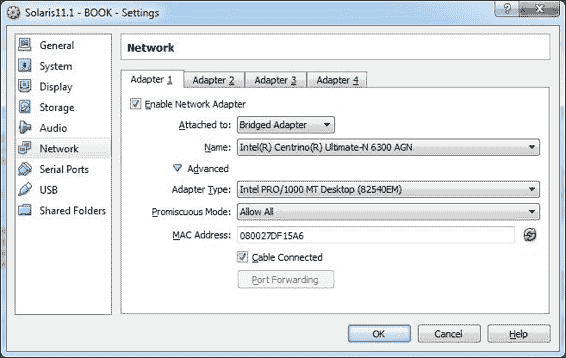
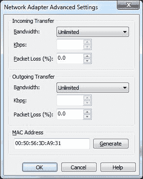
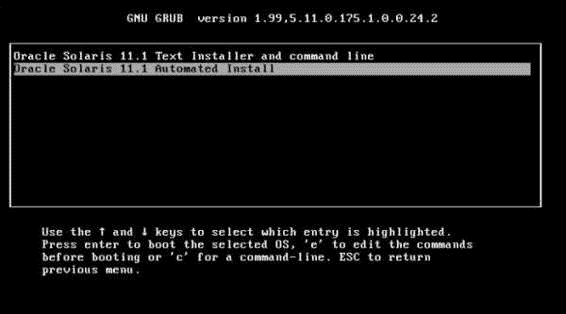
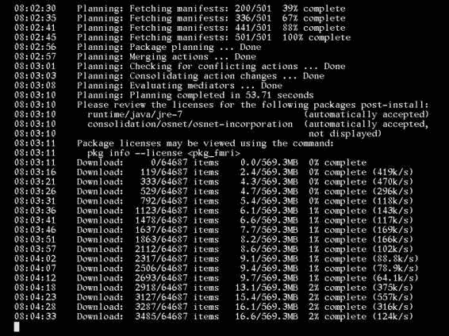

# 第六章：配置和使用自动化安装器（AI）服务器

在本章中，我们将涵盖以下主题：

+   配置一个 AI 服务器，并从该服务器安装系统

# 引言

从 DVD 安装 Oracle Solaris 11 是一项简单直接的任务，通常只需要几屏操作和输入即可完成。然而，当需要安装许多主机时，这种方法可能已经不再足够。在 Oracle Solaris 的早期版本中，有一个名为 JumpStart 的功能，它使得在多台机器上安装变得非常简单。正如我们所知，随着时间的推移，Oracle 引入了一种新的方法，称为 **自动化安装器** (**AI**)，它可以安装任何机器（SPARC 或 x86 平台）。

简要地说，AI 配置要求包括以下内容：

+   配置提供安装服务的 AI 服务器；这是进行所有配置的系统

+   配置一个提供 IP 地址和其他网络设置的 **DHCP** 服务器

+   配置一个包含所有安装 Oracle Solaris 11 主机所需的必要包的 **IPS** 仓库

+   获取一台客户端，Oracle Solaris 11 将在该客户端上安装，客户端通过 DHCP 服务器租用一个 DHCP IP 地址

通过 AI 安装客户端并不复杂。最初，客户端通过网络启动，并需要从 DHCP 服务器获取 IP 地址。然后，它从 AI 服务器获取启动归档，并加载自己的内核。内核加载完毕后，客户端通过 HTTP 协议下载安装程序，识别安装服务，并下载安装清单。最后，客户端使用 IPS 仓库进行安装，清单作为指南，以适当的方式配置系统。安装完成后，主机重启，并应用 **系统配置** (**SC**) 配置文件，以便配置整台机器的标识信息，如时区、DNS、键盘等。

如果一切正常，Oracle Solaris 11 将安装并开始工作。

# 配置一个 AI 服务器，并从该服务器安装系统

安装和配置 AI 服务器的过程非常有趣，稍微复杂，且时间较长。让我们开始吧！

## 准备工作

本教程需要一台虚拟机（VirtualBox 或 VMware），其运行 Oracle Solaris 11，配置 4 GB 内存、静态 IP 地址，并在同一台服务器上配置一个 IPS 仓库，同时也可以在同一主机上安装 DHCP 服务器。简而言之，AI、DHCP 和 IPS 服务器将安装在这台虚拟机上。

此外，还需要一台第二虚拟机，配置 2 GB 内存、一个网络接口和一个 20 GB 空间的磁盘，因为它将作为客户端，安装 Oracle Solaris 11。

另一个重要的点是，我们必须从 Oracle 网站下载针对 x86 的 Oracle Solaris 11 自动化安装程序（也称为 AI 启动映像），网址为 [`www.oracle.com/technetwork/server-storage/solaris11/downloads/index.html?ssSourceSiteId=ocomen`](http://www.oracle.com/technetwork/server-storage/solaris11/downloads/index.html?ssSourceSiteId=ocomen)。该 ISO 镜像将保存在 `/root` 目录下，并且其版本必须与我们要在客户端上安装的 Oracle Solaris 主机版本相同（在本例中为版本 11）。

在这个例子中，AI 服务器将命名为 `solaris11-1`，而客户端机器将命名为 `solaris11-2ai`。

### 注意

如果你使用的是 VirtualBox，我建议你下载最新版的 VirtualBox 及其对应的**扩展包**，该扩展包为英特尔网络接口启用了 PXE 支持。如果不安装扩展包，这个过程将无法工作！

## 如何操作…

配置 AI 服务是一个两阶段的过程：我们必须检查先决条件并创建其逐步配置。如前所示，我们需要通过运行以下命令确保 AI 服务器上配置了静态 IP 地址：

```
root@solaris11-1:~# ipadm show-addr
ADDROBJ           TYPE     STATE        ADDR
lo0/v4            static   ok           127.0.0.1/8
lo0/zoneadmd.v4   static   ok           127.0.0.1/8
net0/v4           static   ok           192.168.1.144/24
net0/zoneadmd.v4  static   ok           192.168.1.125/24
lo0/v6            static   ok           ::1/128
lo0/zoneadmd.v6   static   ok           ::1/128
```

如前所示，网络接口（`net0`）已配置静态 IP 地址（`ipadm create-addr -T static -a 192.168.1.144/24 net0/v4`），并且应验证你是否可以访问互联网，以及 DNS 客户端配置是否正常工作。顺便提一下，DNS 客户端配置将在接下来的步骤中进行更改。因此，为了检查互联网访问和当前的 DNS 客户端配置，请执行以下命令：

```
root@solaris11-1:~# ping www.oracle.com
www.oracle.com is alive
root@solaris11-1:~# nslookup 
> server
Default server: 8.8.8.8
Address: 8.8.8.8#53
Default server: 8.8.4.4
Address: 8.8.4.4#53
> exit

```

一个非常重要的步骤是编辑 `/etc/netmask` 文件并插入将要使用的网络掩码：

```
root@solaris11-1:~# vi /etc/netmasks 
(truncated output)
# Both the network-number and the netmasks are specified in
# "decimal dot" notation, e.g:
#
#     128.32.0.0 255.255.255.0
#
192.168.1.0  255.255.255.0

```

要验证此配置是否正在使用并且处于激活状态，请执行以下命令：

```
root@solaris11-1:~# getent netmasks 192.168.1.0
192.168.1.0          255.255.255.0
```

在安装过程中，客户端将从同一系统上安装的 IPS 仓库中接收软件包，因此我们需要通过执行以下命令确认该 IPS 仓库是否在线并正常工作：

```
root@solaris11-1:~# pkg publisher
PUBLISHER               TYPE     STATUS P LOCATION
solaris                 origin   online F http://solaris11-1.example.com/
root@solaris11-1:~# svcs application/pkg/server
STATE          STIME    FMRI
online          1:09:30 svc:/application/pkg/server:default
root@solaris11-1:~# uname -a
SunOS solaris11-1 5.11 11.1 i86pc i386 i86pc
```

为了测试 IPS 仓库是否真正有效，我们可以通过运行以下命令搜索一个包：

```
root@solaris11-1:~# pkg search -p stunnel
PACKAGE                                            PUBLISHER
pkg:/service/security/stunnel@4.29-0.175.0.0.0.0.0 solaris
```

下一步需要特别注意，因为 `/etc/inet` 目录下不能有任何现存的 DHCP 配置文件（`dhcp4.conf`），并且必须禁用 DHCP 服务器，如以下命令所示：

```
root@solaris11-1:~# svcs -a | grep dhcp
disabled       22:08:49 svc:/network/dhcp/server:ipv6
disabled       22:08:49 svc:/network/dhcp/relay:ipv4
disabled       22:08:49 svc:/network/dhcp/relay:ipv6
disabled       1:09:34 svc:/network/dhcp/server:ipv4

```

此外，当我们准备 AI 服务器时，必须配置一个 DNS 服务器，并且该服务器应能够解析 AI 安装的服务器 IP 地址。因此，让我们配置 DNS 服务器和 DNS 客户端，但我们这里不会深入探讨 DNS 服务器和客户端的配置。

首先，客户端将遵循 DNS 服务器，我们需要通过运行以下命令安装 DNS 服务器包：

```
root@solaris11-1:~# pkg install service/network/dns/bind

```

在下一步中，我们需要配置主 DNS 配置文件，以使 DNS 服务器能够将主机名解析为 IP 地址，反之亦然：

```
root@solaris11-1:~# vi /etc/named.conf
options {
        directory       "/etc/dnsdb/config";
        pid-file        "/var/run/named/pid";
        dump-file       "/var/dump/dns_dump.db";
        statistics-file "/var/stats/named.stats";
        forwarders { 8.8.8.8; 8.8.4.4; };
};
zone "example.com" {
        type master;
        file "/etc/dnsdb/master/example.db";
};
zone "1.168.192.in-addr.arpa" {
        type master;
        file "/etc/dnsdb/master/1.168.192.db";
};
```

根据`/etc/named.conf`文件中使用的目录，现在是时候通过执行以下命令创建这些目录：

```
root@solaris11-1:~# mkdir /var/dump
root@solaris11-1:~# mkdir /var/stats
root@solaris11-1:~# mkdir -p /var/run/named
root@solaris11-1:~# mkdir -p /etc/dnsdb/master
root@solaris11-1:~# mkdir -p /etc/dnsdb/config

```

设置 DNS 服务器时最重要的步骤之一是创建一个用于直连解析（主机名到 IP 地址）的数据库文件，以及一个用于反向解析（IP 地址到主机名）的数据库文件。因此，第一步是通过执行以下命令创建直连数据库：

```
root@solaris11-1:~# vi /etc/dnsdb/master/example.db
$TTL 3h
@  IN      SOA     solaris11-1.example.com. root.solaris11-1.example.com. (
        20140326 ;serial 
        3600 ;refresh (1 hour)
        3600 ;retry (1 hour)
        604800 ;expire (1 week)
        38400 ;minimum (1 day)
)
example.com.     IN      NS      solaris11-1.example.com.
gateway        IN      A       192.168.1.1   ; Router
solaris11-1            IN      A       192.168.1.144 ;
```

现在，使用以下命令创建反向数据库文件（IP 地址到主机名）：

```
root@solaris11-1:~# vi /etc/dnsdb/master/1.168.192.db
$TTL 3h
@       IN      SOA     solaris11-1.example.com. root.solaris11-1.example.com. (
        20140326 ;serial
        3600 ;refresh (1 hour)
        3600 ;retry (1 hour)
        604800 ;expire (1 week)
        38400 ;minimum (1 day)
)
        IN      NS      solaris11-1.example.com.
1       IN      PTR     gateway.example.com.   
144     IN      PTR     solaris11-1.example.com
```

最后，DNS 服务器已准备好，并且必须通过执行以下命令启用其服务：

```
root@solaris11-1:~# svcs -a | grep dns/server
disabled       18:46:05 svc:/network/dns/server:default
root@solaris11-1:~# svcadm enable svc:/network/dns/server:default
root@solaris11-1:~# svcs -a | grep dns/server
online          7:09:05 svc:/network/dns/server:default
```

DNS 客户端是我们方案中的一个非常重要的步骤，可以通过执行以下命令来配置：

```
root@solaris11-1:~# svccfg -s svc:/network/dns/client setprop config/nameserver = net_address: "(192.168.1.144)"
root@solaris11-1:~# svccfg -s svc:/network/dns/client setprop config/domain = astring: '("example.com")'
root@solaris11-1:~# svccfg -s svc:/network/dns/client setprop config/search = astring: '("example.com")'
root@solaris11-1:~# svccfg -s svc:/system/name-service/switch setprop config/ipnodes = astring: '("files dns")'
root@solaris11-1:~# svccfg -s svc:/system/name-service/switch setprop config/host = astring: '("files dns")'
root@solaris11-1:~# svccfg -s svc:/network/dns/client listprop config
config                      application        
config/value_authorization astring     solaris.smf.value.name-service.dns.client
config/nameserver          net_address 192.168.1.144
config/domain              astring     example.com
config/search              astring     example.com
root@solaris11-1:~# svccfg -s svc:/system/name-service/switch listprop config
config                      application        
config/default             astring     files
config/value_authorization astring     solaris.smf.value.name-service.switch
config/printer             astring     "user files"
config/ipnodes             astring     "files dns"
config/host                astring     "files dns"
root@solaris11-1:~# svcadm refresh svc:/network/dns/client
root@solaris11-1:~# svcadm restart svc:/network/dns/client
root@solaris11-1:~# svcadm refresh svc:/system/name-service/switch:default
root@solaris11-1:~# svcadm restart svc:/system/name-service/switch:default

```

为了测试我们的 DNS 服务器配置和 DNS 客户端配置是否有效，我们可以使用`nslookup`工具进行验证，如以下命令所示：

```
root@solaris11-1:~# nslookup 
> server
Default server: 192.168.1.144
Address: 192.168.1.144#53
> solaris11-1.example.com
Server:    192.168.1.144
Address:  192.168.1.144#53
Name:  solaris11-1.example.com
Address: 192.168.1.144
> 192.168.1.144
Server:    192.168.1.144
Address:  192.168.1.144#53
144.1.168.192.in-addr.arpa  name = solaris11-1.example.com.
> exit

```

完美！DNS 服务器和客户端现在都已在 AI 安装服务器上配置完成。

从此时起，我们可以开始配置 AI 服务器本身，它需要启用多播服务，可以通过执行以下命令来完成：

```
root@solaris11-1:~# svcs -a | grep  multicast
disabled       22:08:43 svc:/network/dns/multicast:default
root@solaris11-1:~# svcadm enable svc:/network/dns/multicast:default
root@solaris11-1:~# svcs -a | grep  multicast
online          2:38:35 svc:/network/dns/multicast:default
```

此外，AI 服务器还需要配置一系列工具，我们必须通过执行以下命令安装相关软件包：

```
root@solaris11-1:~# pkg install installadm

```

现在游戏开始了！我们必须配置一个与安装镜像相关联的 AI 安装服务名称。以后，安装服务名称将由客户端用来访问和部署安装镜像。从此时起，安装服务名称将作为索引，用于查找正确的安装镜像。如果我们想安装 SPARC 和 x86 客户端，我们应该有两个安装服务：第一个与 SPARC 安装镜像相关联，第二个与 x86 安装镜像相关联。

要创建一个 AI 安装服务，请执行以下命令：

```
root@solaris11-1:~# installadm create-service -n borges_ai -s /root/sol-11_1-ai-x86.iso -i 192.168.1.20 -c 10 -d /export/borges_ai
Creating service from: /root/sol-11_1-ai-x86.iso
Setting up the image ...
Creating i386 service: borges_ai
Image path: /export/borges_ai
Starting DHCP server...
Adding IP range to local DHCP configuration
Refreshing install services
Creating default-i386 alias
Setting the default PXE bootfile(s) in the local DHCP configuration
to:
bios clients (arch 00:00):  default-i386/boot/grub/pxegrub2
uefi clients (arch 00:07):  default-i386/boot/grub/grub2netx64.efi
Refreshing install services
```

从之前的命令中，我们得到了以下内容：

+   `-n`：这是服务名称

+   `-s`：这是 AI ISO 镜像的路径

+   `-i`：这将更新从 192.168.1.20 开始的 DHCP 服务器

+   `-c`：此安装服务将提供十个 IP 地址

+   `-d`：这是 AI ISO 镜像将被解压的目录

在创建`borges_ai`安装服务后，DHCP 会显示以下配置文件：

```
root@solaris11-1:~# more /etc/inet/dhcpd4.conf 
# dhcpd.conf
#
# Configuration file for ISC dhcpd
# (created by installadm(1M))
#
default-lease-time 900;
max-lease-time 86400;
# If this DHCP server is the official DHCP server for the local
# network, the authoritative directive should be uncommented.
authoritative;

# arch option for PXEClient
option arch code 93 = unsigned integer 16;

# Set logging facility (accompanies setting in syslog.conf)
log-facility local7;

# Global name services
option domain-name-servers 8.8.8.8, 8.8.4.4;
option domain-name "example.com";
option domain-search "example.com";
subnet 192.168.1.0 netmask 255.255.255.0 {
  range 192.168.1.20 192.168.1.29;
  option broadcast-address 192.168.1.255;
  option routers 192.168.1.1;
  next-server 192.168.1.144;
}

class "PXEBoot" {
  match if (substring(option vendor-class-identifier, 0, 9) = "PXEClient");
  if option arch = 00:00 {
    filename "default-i386/boot/grub/pxegrub2";
  } else if option arch = 00:07 {
    filename "default-i386/boot/grub/grub2netx64.efi";
  }
}
```

我们可能会多次遇到问题，如果我们能从头开始重新开始整个过程会很好。因此，如果出现问题，可以撤销上一步，通过执行`installadm install-service`命令并重新执行之前的步骤：

```
root@solaris11-1:~# installadm delete-service default-i386
WARNING: The service you are deleting, or a dependent alias, is
the alias for the default i386 service. Without the 'default-i386'
service, i386 clients will fail to boot unless explicitly
assigned to a service using the create-client command.
Are you sure you want to delete this alias? [y/N]: y
Removing this service's bootfile(s) from local DHCP configuration
Stopping the service default-i386

root@solaris11-1:~# installadm delete-service -r borges_ai
WARNING: The service you are deleting, or a dependent alias, is
the alias for the default i386 service. Without the 'default-i386'
service, i386 clients will fail to boot unless explicitly
assigned to a service using the create-client command.

Are you sure you want to delete this alias? [y/N]: Y
Removing this service's bootfile(s) from local DHCP configuration
Stopping the service default-i386
Removing host entry '08:00:27:DF:15:A6' from local DHCP configuration.
Stopping the service borges_ai
The installadm SMF service is being taken offline.
The installadm SMF service is no longer online because the last
install service has been disabled or deleted.
```

删除 AI 服务器配置后，建议您还删除`/etc/inet/dhcpd4.conf`文件，并通过执行以下命令禁用 DHCP 服务器服务：

```
root@solaris11-1:~# svcadm disable svc:/network/dhcp/server:ipv4

```

回到配置步骤，AI 安装服务器及其安装服务由 SMF 服务表示，如下命令所示：

```
root@solaris11-1:~# svcs -a | grep install/server
online          4:53:41 svc:/system/install/server:default
root@solaris11-1:~# svcs -l svc:/system/install/server:default
fmri         svc:/system/install/server:default
name         Installadm Utility
enabled      true
state        online
next_state   none
state_time   March 23, 2014 04:53:41 AM BRT
logfile      /var/svc/log/system-install-server:default.log
restarter    svc:/system/svc/restarter:default
contract_id  472 
manifest     /lib/svc/manifest/system/install/server.xml
dependency   optional_all/restart svc:/network/dns/multicast:default (online)
dependency   optional_all/none svc:/network/tftp/udp6:default (online)
dependency   optional_all/none svc:/network/dhcp-server:default (uninitialized)
```

要列出现有的 AI 安装服务，请执行以下命令：

```
root@solaris11-1:~# installadm list
Service Name Alias Of  Status  Arch   Image Path 
------------ --------  ------  ----   ---------- 
borges_ai    -         on      i386   /root/borges_ai
default-i386 borges_ai on      i386   /root/borges_ai
```

命令输出显示，Oracle Solaris 11 默认创建了一个名为 `default-i386` 的 AI 安装服务，这是我们名为 `borges_ai` 的 AI 安装服务的别名。

到目前为止，系统已经创建了一个 AI 安装服务（`borges_ai`），然后我们需要将其与一个或多个将通过 AI 服务器安装的客户端关联。在完成此任务之前，必须收集这些客户端的 MAC 地址信息。所以，既然我们使用另一个虚拟机作为客户端（`solaris11-2ai`），那么可以很容易地从虚拟机属性中获取 MAC 信息（无论是 VirtualBox 还是 VMware）。

例如，在使用 VirtualBox 时，你可以通过导航到 **设置** | **网络** | **高级** 来选择虚拟机（Solaris11-1）。

以下截图显示了 VirtualBox 的 MAC 地址属性：



如果我们使用 VMware Workstation，可以通过导航到 **虚拟机（Solaris11-1）** | **VM** | **设置** | **网络适配器** | **高级** 来获取虚拟机的 MAC 地址，如下截图所示：



一旦我们获得了 MAC 地址，我们可以通过执行以下命令来添加客户端（将通过 AI 安装的主机）：

```
root@solaris11-1:~# installadm create-client -e 08:00:27:DF:15:A6 -n borges_ai
Adding host entry for 08:00:27:DF:15:A6 to local DHCP configuration.
root@solaris11-1:~# installadm list -c 
Service Name Client Address     Arch   Image Path 
------------ --------------     ----   ---------- 
borges_ai    08:00:27:DF:15:A6  i386   /export/borges_ai
```

前面的输出显示了一个 MAC 地址为 `08:00:27:DF:15:A6` 的客户端，它已绑定到名为 `borges_ai` 的 AI 安装服务。

由于客户端（MAC `08:00:27:DF:15:A6`）已经分配给了一个 AI 安装服务，下一步将是创建一个 AI 清单。什么是 AI 清单？AI 清单是一个包含安装和配置将通过 AI 服务安装的客户端的指令的文件。由于这个清单是一个 XML 文件，为每个需要使用 AI 安装服务的客户端创建清单会非常困难，因此每个启动映像都会提供一个默认清单，供任何需要使用该启动映像的安装服务的客户端使用。

在 AI 框架中，有两种类型的清单，如下所示：

+   **默认**：适用于所有没有自定义清单的客户端。默认清单名为 `default.xml`。

+   **自定义**：这是一个特定的清单，关联了一个安装映像，可以将一个或多个客户端分配给它。

选择自定义清单还是默认清单的决策因素是什么？这就是名为 `criteria` 文件的作用，它通过客户端的属性或特征将客户端与特定的清单或默认清单关联起来。

以下是运行`installadm create-service`命令时安装在`/export/borges_ai/auto_install`目录中的默认清单（`default.xml`）示例：

```
root@solaris11-1:~# cat /export/borges_ai/auto_install/default.xml
<?xml version="1.0" encoding="UTF-8"?>
<!--

 Copyright (c) 2008, 2012, Oracle and/or its affiliates. All rights reserved.

-->
<!DOCTYPE auto_install SYSTEM "file:///usr/share/install/ai.dtd.1">
<auto_install>
  <ai_instance name="default">
    <target>
      <logical>
        <zpool name="rpool" is_root="true">
          <!--
            Subsequent <filesystem> entries instruct an installer to create
            following ZFS datasets:

                <root_pool>/export         (mounted on /export)
                <root_pool>/export/home    (mounted on /export/home)

            Those datasets are part of standard environment and should be
            always created.

            In rare cases, if there is a need to deploy an installed system
            without these datasets, either comment out or remove <filesystem>
            entries. In such scenario, it has to be also assured that
            in case of non-interactive post-install configuration, creation
            of initial user account is disabled in related system
            configuration profile. Otherwise the installed system would fail
            to boot.
          -->
          <filesystem name="export" mountpoint="/export"/>
          <filesystem name="export/home"/>
          <be name="solaris"/>
        </zpool>
      </logical>
    </target>
    <software type="IPS">
      <destination>
        <image>
          <!-- Specify locales to install -->
          <facet set="false">facet.locale.*</facet>
          <facet set="true">facet.locale.de</facet>
          <facet set="true">facet.locale.de_DE</facet>
          <facet set="true">facet.locale.en</facet>
          <facet set="true">facet.locale.en_US</facet>
          <facet set="true">facet.locale.es</facet>
          <facet set="true">facet.locale.es_ES</facet>
          <facet set="true">facet.locale.fr</facet>
          <facet set="true">facet.locale.fr_FR</facet>
          <facet set="true">facet.locale.it</facet>
          <facet set="true">facet.locale.it_IT</facet>
          <facet set="true">facet.locale.ja</facet>
          <facet set="true">facet.locale.ja_*</facet>
          <facet set="true">facet.locale.ko</facet>
          <facet set="true">facet.locale.ko_*</facet>
          <facet set="true">facet.locale.pt</facet>
          <facet set="true">facet.locale.pt_BR</facet>
          <facet set="true">facet.locale.zh</facet>
          <facet set="true">facet.locale.zh_CN</facet>
          <facet set="true">facet.locale.zh_TW</facet>
        </image>
      </destination>
      <source>
        <publisher name="solaris">
          <origin name="http://pkg.oracle.com/solaris/release"/>
        </publisher>
      </source>
      <!--
        The version specified by the "entire" package below, is
        installed from the specified IPS repository.  If another build
        is required, the build number should be appended to the
        'entire' package in the following form:

            <name>pkg:/entire@0.5.11-0.build#</name>
      -->
      <software_data action="install">
        <name>pkg:/entire@0.5.11-0.175.1</name>
        <name>pkg:/group/system/solaris-large-server</name>
      </software_data>
    </software>
  </ai_instance>
</auto_install>
```

`default.xml`文件非常简单，且有一些值得提及的优点，如下所示：

+   `<ai_instance name="default">`: 这个元素显示了 AI 实例的名称

+   `<software type="IPS">`: 所有这些包来自 IPS 服务器

+   `<publisher name="solaris">`: 这是 IPS 发布者名称

+   `<origin name="http://pkg.oracle.com/solaris/release"/>`: 这是由发布者（Solaris）提供的存储库的源 URI

+   `<name>pkg:/entire@0.5.11-0.build#</name>` 和 `<name>pkg:/entire@0.5.11-0.175.1</name>`：这些基本上是整个 IPS 包，并告诉我们提供的 Oracle Solaris 版本，这些信息将用于安装补丁或升级

+   `<name>pkg:/group/system/solaris-large-server</name>`：这是一个包含多个工具和重要文件（如库、驱动程序和 Python）的包组，这些文件应当被安装

有趣的是，我自己系统中没有安装`solaris-large-server`包，正如以下命令所示：

```
root@solaris11-1:~# pkg search solaris-large-server
INDEX      ACTION VALUE                                     PACKAGE
pkg.fmri   set    solaris/group/system/solaris-large-server pkg:/group/system/solaris-large-server@0.5.11-0.175.1.0.0.24.3
root@solaris11-1:~# pkg info -r solaris pkg:/group/system/solaris-large-server@0.5.11-0.175.1.0.0.24.3

          Name: group/system/solaris-large-server
       Summary: Oracle Solaris Large Server
   Description: Provides an Oracle Solaris large server environment
      Category: Meta Packages/Group Packages
         State: Not installed
     Publisher: solaris
       Version: 0.5.11
 Build Release: 5.11
        Branch: 0.175.1.0.0.24.3
Packaging Date: September 19, 2012 06:53:18 PM 
          Size: 5.46 kB
          FMRI: pkg://solaris/group/system/solaris-large-server@0.5.11,5.11-0.175.1.0.0.24.3:20120919T185318Z

          Name: system/zones/brand/solaris
       Summary: 
         State: Not installed (Renamed)
    Renamed to: pkg:/system/zones/brand/brand-solaris@0.5.11,5.11-0.173.0.0.0.0.0
                consolidation/osnet/osnet-incorporation
     Publisher: solaris
       Version: 0.5.11
 Build Release: 5.11
        Branch: 0.173.0.0.0.1.0
Packaging Date: August 26, 2011 07:00:28 PM 
          Size: 5.45 kB
          FMRI: pkg://solaris/system/zones/brand/solaris@0.5.11,5.11-0.173.0.0.0.1.0:20110826T190028Z
```

因此，根据之前的`default.xml`文件（虽然通常不需要），我们必须执行以下命令来安装缺失的包：

```
root@solaris11-1:~# pkg install pkg:/group/system/solaris-large-server@0.5.11-0.175.1.0.0.24.3

```

回到默认清单（`default.xml`）的解释，我们需要备份并修改它，以适应我们具有以下特征的环境：

+   AI 实例名称（`borges_ai`）

+   IPS 源 URI—`http://solaris11-1.example.com/`—（来自`pkg publisher`命令）

+   自动重启（`auto_reboot`）设置为 true

上一个任务的代码如下：

```
root@solaris11-1:~# mkdir /backup
root@solaris11-1:~# cp /export/borges_ai/auto_install/manifest/default.xml /export/borges_ai/auto_install/borges_ai.xml
root@solaris11-1:~# vi /export/borges_ai/auto_install/borges_ai.xml
root@solaris11-1:~# grep borges_ai /export/borges_ai/auto_install/borges_ai.xml
 <ai_instance name="borges_ai" auto_reboot="true">
root@solaris11-1:~# grep solaris11-1 /export/borges_ai/auto_install/borges_ai.xml
<origin name="http://solaris11-1.example.com"/>
```

我们创建了一个名为`borges_ai.xml`的新清单文件，但我们必须创建一个`criteria`文件，以便将客户端（solaris11-2ai）与此清单关联起来。通常，`criteria`文件中可以使用一些良好的属性：MAC 地址、IPv4、平台、架构（arch）、内存（mem）、主机名等。因此，在创建标准文件后，规则是，如果客户端匹配这些标准文件中的任何一个，相关联的清单将被使用（在我们的例子中，自定义清单是`borges_ai.xml`）。如果不匹配，则使用`default.xml`文件清单。

要创建一个包含客户端机器 MAC 地址（solaris11-2ai）的标准文件，我们可以执行以下命令：

```
root@solaris11-1:~# vi /export/borges_ai/auto_install/borges_criteria_ai.xml
<ai_criteria_manifest>
  <ai_criteria name="mac"> 
    <value>08:00:27:DF:15:A6</value>
  </ai_criteria>
</ai_criteria_manifest>
```

最后，我们能够将此标准文件（`borges_criteria_ai.xml`）和自定义清单文件（`borges_ai.xml`）与 AI 安装服务（`borges_ai`）关联起来：

```
root@solaris11-1:~# installadm create-manifest -n borges_ai -f /export/borges_ai/auto_install/borges_ai.xml -C /export/borges_ai/auto_install/borges_criteria_ai.xml

```

从之前的命令中，我们注意到以下内容：

+   `-n`: 这是 AI 安装服务名称

+   `-f`: 这是自定义清单文件

+   `-C`: 这是标准文件

创建`criteria`文件的另一种更简单的方式是将客户端与该`criteria`文件关联，并通过运行以下命令进行必要的定制，将客户端的 MAC 地址作为标准：

```
root@solaris11-1:~# installadm create-manifest -n borges_ai -f /export/borges_ai/auto_install/borges_ai.xml
root@solaris11-1:~#  installadm set-criteria –n borges_ai -m borges_ai –c mac="08:00:27:XX::YY:ZZ"

```

要验证到目前为止的 AI 配置，请执行以下命令：

```
root@solaris11-1:/backup# installadm list 
Service Name Alias Of  Status  Arch   Image Path 
------------ --------  ------  ----   ---------- 
borges_ai    -         on      i386   /export/borges_ai
default-i386 borges_ai on      i386   /export/borges_ai
root@solaris11-1:~# installadm list -m
Service/Manifest Name  Status   Criteria
---------------------  ------   --------
borges_ai
   borges_ai                    mac  = 08:00:27:DF:15:A6
   orig_default        Default  None
default-i386
   orig_default        Default  None
```

那很好！下一步很有趣，因为通常在安装 Oracle Solaris 11 时，我们会被提示输入许多内容，比如初始用户账户、root 密码、时区、键盘等。一次性回答这些问题很简单，但当需要安装 100 台机器时，这将成为一个严重的问题。

为了自动化此过程，存在一个名为**系统配置文件**（**SC**）的配置文件，在 Oracle Solaris 11 安装后的第一次启动时提供任何必要的答案。

为了帮助我们创建 SC 配置文件，Oracle Solaris 11 在`/export/borges_ai/auto_install/sc_profiles`目录中提供了一些该配置文件的模板。在修改之前，我们将从该目录复制一个模板，并突出显示一些有趣的行，如以下命令所示：

```
root@solaris11-1:~# cp /export/borges_ai/auto_install/sc_profiles/sc_sample.xml /export/borges_ai/auto_install/sc_borges_ai.xml
root@solaris11-1:~# cat /export/borges_ai/auto_install/sc_borges_ai.xml
<?xml version="1.0"?>
<!--
Copyright (c) 2011, 2012, Oracle and/or its affiliates. All rights reserved.
-->
<!--
Sample system configuration profile for use with Automated Installer

Configures the following:
* User account name 'jack', password 'jack', GID 10, UID 101, root role, bash shell
* 'root' role with password 'solaris'
* Keyboard mappings set to US-English
* Timezone set to UTC
* Network configuration is automated with Network Auto-magic
* DNS name service client is enabled

See installadm(1M) for usage of 'create-profile' subcommand.
-->

<!DOCTYPE service_bundle SYSTEM "/usr/share/lib/xml/dtd/service_bundle.dtd.1">
<service_bundle type="profile" name="system configuration">
    <service name="system/config-user" version="1">
      <instance name="default" enabled="true">
        <property_group name="user_account">
          <propval name="login" value="jack"/>
          <propval name="password" value="9Nd/cwBcNWFZg"/>
          <propval name="description" value="default_user"/>
          <propval name="shell" value="/usr/bin/bash"/>
          <propval name="gid" value="10"/>
          <propval name="uid" value="101"/>
          <propval name="type" value="normal"/>
          <propval name="roles" value="root"/>
          <propval name="profiles" value="System Administrator"/>
        </property_group>
        <property_group name="root_account">
            <propval name="password" value="$5$dnRfcZse$Hx4aBQ161Uvn9ZxJFKMdRiy8tCf4gMT2s2rtkFba2y4"/>
            <propval name="type" value="role"/>
        </property_group>
      </instance>
    </service>

    <service version="1" name="system/identity">
      <instance enabled="true" name="node">
        <property_group name="config">
           <propval name="nodename" value="solaris"/>
        </property_group>
      </instance>
    </service>

    <service name="system/console-login" version="1">
      <instance name="default" enabled="true">
        <property_group name="ttymon">
          <propval name="terminal_type" value="sun"/>
        </property_group>
      </instance>
    </service>

    <service name="system/keymap" version="1">
      <instance name="default" enabled="true">
        <property_group name="keymap">
          <propval name="layout" value="US-English"/>
        </property_group>
      </instance>
    </service>

    <service name="system/timezone" version="1">
      <instance name="default" enabled="true">
        <property_group name="timezone">
          <propval name="localtime" value="UTC"/>
        </property_group>
      </instance>
    </service>

    <service name="system/environment" version="1">
      <instance name="init" enabled="true">
        <property_group name="environment">
          <propval name="LANG" value="en_US.UTF-8"/>
        </property_group>
      </instance>
    </service>

    <service name="network/physical" version="1">
      <instance name="default" enabled="true">
          <property_group name="netcfg" type="application">
              <propval name="active_ncp" type="astring" value="Automatic"/>
          </property_group>
      </instance>
    </service>
</service_bundle>
```

在仔细阅读此文件后，我们得出以下结论：

+   初始默认用户名是`jack`，密码是`jack`

+   root 是一个角色（这不是一个普通账户），其密码是`solaris`

+   机器名称是`solaris`

+   活动的 NCP 是`自动的`

为了将此文件调整为我们的目的，需要将初始默认用户名更改为`borges`，密码更改为`oracle123!`（`$5$VPcyGvgl$bt4cybd8cpZdHKWF2tvBn.SPFeJ8YdgvQUqHzWkNLl1`）。此外，主机名将更改为`solaris11-2ai`。可以通过运行以下命令来验证每个更改：

```
root@solaris11-1:/export/borges_ai/auto_install# cat sc_borges_ai.xml 
(truncated output)
See installadm(1M) for usage of 'create-profile' subcommand.
-->
<!DOCTYPE service_bundle SYSTEM "/usr/share/lib/xml/dtd/service_bundle.dtd.1">
<service_bundle type="profile" name="system configuration">
    <service name="system/config-user" version="1">
      <instance name="default" enabled="true">
        <property_group name="user_account">
          <propval name="login" value="borges"/>
          <propval name="password" value="$5$VPcyGvgl$bt4cybd8cpZdHKWF2tvBn.SPFeJ8YdgvQUqHzWkNLl1"/>
          <propval name="description" value="default_user"/>
          <propval name="shell" value="/usr/bin/bash"/>
          <propval name="gid" value="10"/>
          <propval name="uid" value="101"/>
          <propval name="type" value="normal"/>
          <propval name="roles" value="root"/>
          <propval name="profiles" value="System Administrator"/>
        </property_group>
        <property_group name="root_account">
            <propval name="password" value="$5$dnRfcZse$Hx4aBQ161Uvn9ZxJFKMdRiy8tCf4gMT2s2rtkFba2y4"/>
            <propval name="type" value="role"/>
        </property_group>
      </instance>
    </service>

    <service version="1" name="system/identity">
      <instance enabled="true" name="node">
        <property_group name="config">
           <propval name="nodename" value="solaris11-2ai"/>
        </property_group>
      </instance>
    </service>

(truncated output)

```

现在，`sc_borges_ai.xml`的 SC 配置文件已经修改完毕，是时候在 AI 服务数据库中创建它，验证其语法并列出结果，如以下命令所示：

```
root@solaris11-1:~# installadm create-profile -n borges_ai -f /export/borges_ai/auto_install/sc_borges_ai.xml -c mac=08:00:27:DF:15:A6
Profile sc_borges_ai.xml added to database.

root@solaris11-1:~# installadm validate -n borges_ai -p sc_borges_ai.xml 
Validating static profile sc_borges_ai.xml...
 Passed
root@solaris11-1:~# installadm list -p 
Service/Profile Name  Criteria
--------------------  --------
borges_ai
   sc_borges_ai.xml   mac = 08:00:27:DF:15:A6
```

这真是太好了！我们已经配置好了 AI 服务器。`sc_borges_ai.xml`的 SC 配置文件将根据已建立的标准（MAC = `08:00:27:DF:15:A6`）由我们的客户端（solaris11-2ai）使用。

最后，展示时间到了！为了测试整个 AI 服务器配置是否工作，我们需要打开客户端（solaris11-2ai 虚拟机），然后等待整个安装过程。如果一切正常，我们将看到以下截图：



在选择**Oracle Solaris 11.1 自动安装**后，Oracle Solaris 11 的安装应该开始。



这真是太棒了！

### 方案概览

这一部分令人印象深刻！我们学会了如何配置一个 AI 安装服务器，从而实现远程安装客户端而无需任何交互。在本章中，我们还学习了如何配置 DNS 服务器和客户端。

# 参考资料

+   *安装 Oracle Solaris 11 系统*，见[`docs.oracle.com/cd/E23824_01/html/E21798/docinfo.html#scrolltoc`](http://docs.oracle.com/cd/E23824_01/html/E21798/docinfo.html#scrolltoc)

+   *启动和关闭* *Oracle Solaris 11.1 系统*，见[`docs.oracle.com/cd/E26502_01/html/E28983/docinfo.html#scrolltoc`](http://docs.oracle.com/cd/E26502_01/html/E28983/docinfo.html#scrolltoc)

+   *在 Solaris 11 中配置基本 DNS 服务器和客户端*，*Paul Johnson*，见[`www.oracle.com/technetwork/articles/servers-storage-admin/solaris11-net-svcs-ips-2086656.html`](http://www.oracle.com/technetwork/articles/servers-storage-admin/solaris11-net-svcs-ips-2086656.html)

+   *在 Oracle Solaris 11 中探索网络、服务和新的映像打包系统*，*Alexandre Borges*，见[`www.oracle.com/technetwork/articles/servers-storage-admin/solaris11-net-svcs-ips-2086656.html`](http://www.oracle.com/technetwork/articles/servers-storage-admin/solaris11-net-svcs-ips-2086656.html)
