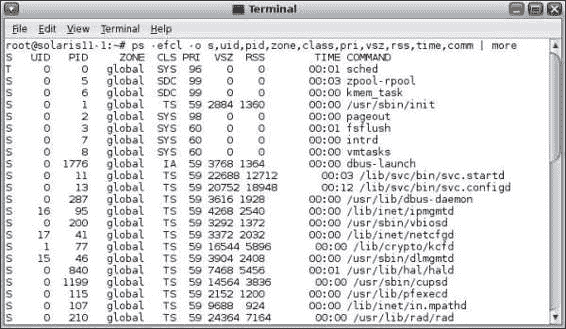
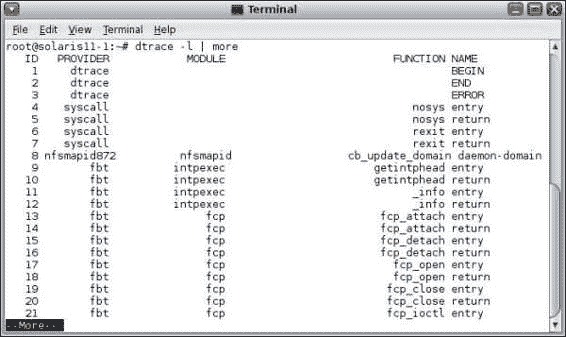

# 第八章 管理和监控进程

本章将涵盖以下主题：

+   监控和处理进程执行

+   管理 Solaris 11 中的进程优先级

+   配置 FSS 并应用于项目

# 介绍

在使用 Oracle Solaris 11 时，许多执行中的进程组成了应用程序，甚至操作系统本身也运行着许多其他进程和线程，确保环境的平稳运行。因此，管理员每天都需要监控整个系统，并在必要时做出一些艰难的决策。此外，并非所有进程的优先级和紧迫性都相同，某些情况下需要给某个进程更高的优先级（例如，渲染图像）。在这里，我们引入了一个关键概念：调度类。

Oracle Solaris 11 有一个默认的进程调度器（`svc:/system/scheduler:default`），它根据每个进程的调度类来控制 CPU 的分配。以下是六个重要的调度类：

+   **时间共享**（**TS**）：默认情况下，所有进程或线程（非 GUI）都分配到此类别，其优先级值是动态的，并且可以根据系统负载进行调整（范围为-60 到 60）。此外，系统调度程序会将优先级较低的进程/线程从处理器切换到优先级较高的另一个进程/线程。

+   **交互式**（**IA**）：此类的行为与 TS 类相同（动态的，优先级值范围为-60 到 60），但 IA 类适用于具有相关窗口的 GUI 进程/线程。此外，当鼠标聚焦在窗口上时，绑定的进程或线程的优先级会增加 10 分。当鼠标焦点移开窗口时，绑定的进程会失去这 10 分。

+   **固定**（**FX**）：此类的行为与 TS 类相同，不同之处在于与此类相关联的任何进程或线程都有固定的优先级值。值范围为 0 到 59，但进程或线程的初始优先级从开始到结束都保持不变。

+   **系统**（**SYS**）：此类用于内核进程或线程，其优先级范围为 60 到 99。然而，一旦内核进程或线程开始处理，它会被绑定到 CPU 直到其生命周期结束（系统调度器不会将其移出处理器）。

+   **实时**（**RT**）：此类的进程和线程具有固定的优先级，范围为 100 到 159。此类的任何进程或线程优先级都高于其他任何类。

+   **公平共享调度器**（**FSS**）：由此类管理的任何进程或线程根据其共享值进行调度（而非优先级值），并根据处理器的使用情况来安排。优先级范围为-60 到 60。

通常，当管理员希望使用处理器集来控制系统上的资源分配或在部署 Oracle 区域时，会使用 FSS 类。可以更改任何进程或线程的优先级和类（系统类除外），但这种情况并不常见，例如使用 FSS。处理器集（处理器组）在处理时，绑定到该组的进程必须仅属于一个调度类（FSS 或 FX，但不能同时是两者）。除非必要，否则不建议使用 RT 类，因为 RT 进程绑定到处理器（或核心），直到其结束，并且只有在处理器空闲时才允许其他进程执行。

FSS 类是基于份额的，个人来说，我建立了总共 100 份，并将这些份额分配给进程、线程，甚至是 Oracle 区域。这是一种简单的资源分配方式，可以将 CPU 资源看作百分比（例如，10 份 = 10%）。

# 监控和处理进程执行

Oracle Solaris 11 提供了多种方法来监控和控制进程执行，没有一个最好的工具，因为每种方法都有其优点。

## 准备就绪

本教程需要一台运行 Oracle Solaris 11 的虚拟机（VirtualBox 或 VMware），并且至少安装了 2GB 的内存。建议系统具有多个处理器或核心。

## 如何操作……

在 Oracle Solaris 11 中，监控进程的常用方法是使用传统的 `ps` 命令：

```
root@solaris11-1:~# ps -efcl -o s,uid,pid,zone,class,pri,vsz,rss,time,comm | more

```



根据前面截图中显示的输出，我们有：

+   **S**（状态）

+   **UID**（用户 ID）

+   **PID**（进程 ID）

+   **ZsONE**（区域）

+   **CLS**（调度类）

+   **PRI**（优先级）

+   **VSZ**（虚拟内存大小）

+   **RSS**（常驻集大小）

+   **TIME**（进程在 CPU 上运行的时间）

+   **COMMAND**（启动进程的命令）

此外，可能的进程状态如下：

+   O（正在处理器上运行）

+   S（睡眠——等待事件完成）

+   R（可运行——进程在队列中）

+   T（进程被停止，可能是由于作业控制信号或正在被追踪）

+   Z（僵尸——进程已完成且父进程未等待）

+   W（等待——进程正在等待 CPU 使用率降至执行的 CPU 限制）

### 注意

不要将**虚拟内存大小**（**VSZ**）与**常驻集大小**（**RSS**）混淆。进程的 VSZ 包括所有物理内存（RAM）上的信息，以及所有映射的文件和设备（交换区）。另一方面，RSS 值仅包括内存（RAM）中的信息。

监控 Oracle Solaris 11 进程的另一个重要命令是 `prstat` 工具。例如，可以通过执行以下命令列出每个进程的线程：

```
root@solaris11-1:~# prstat –L
PID USERNAME  SIZE   RSS STATE   PRI NICE      TIME  CPU PROCESS/LWPID   
  2609 root      129M   18M sleep    15    0   0:00:24 1.1% gnome-terminal/1
  1238 root       88M   74M sleep    59    0   0:00:41 0.5% Xorg/1
  2549 root      217M   99M sleep     1    0   0:00:45 0.3% java/22
  2549 root      217M   99M sleep     1    0   0:00:30 0.2% java/21
  2581 root       13M 2160K sleep    59    0   0:00:24 0.2% VBoxClient/3
  1840 root       37M 7660K sleep     1    0   0:00:26 0.2% pkg.depotd/2
(truncated output)

```

`LWPID` 列显示每个进程的线程数量。

其他不错的选项有`–J`（按项目汇总）、`-Z`（按区域汇总）和`–mL`（包括线程微状态信息）。要收集有关进程和项目的一些信息，请执行以下命令：

```
root@solaris11-1:~# prstat –J 
   PID USERNAME  SIZE   RSS STATE   PRI NICE      TIME  CPU PROCESS/NLWP      
  2549 root      217M   99M sleep    55    0   0:01:56 0.8% java/25
  1238 root       88M   74M sleep    59    0   0:00:44 0.4% Xorg/3
  1840 root       37M 7660K sleep     1    0   0:00:55 0.4% pkg.depotd/64
(truncated output)
PROJID    NPROC  SWAP   RSS MEMORY      TIME  CPU PROJECT                     
     1       43 2264M  530M    13%   0:03:46 1.9% user.root                   
     0       79  844M  254M   6.1%   0:03:12 0.9% system                      
     3        2   11M 5544K   0.1%   0:00:55 0.0% default                     

Total: 124 processes, 839 lwps, load averages: 0.23, 0.22, 0.22
```

注意输出第二部分的最后一列（`PROJECT`）。很有趣的是，Oracle Solaris 已经通过项目来工作，并且一些项目是默认创建的。顺便提一句，记住项目的结构是：项目 | 任务 | 进程。

收集有关进程和区域的信息是通过执行以下命令完成的：

```
root@solaris11-1:~# prstat -Z 
   PID USERNAME  SIZE   RSS STATE   PRI NICE      TIME  CPU PROCESS/NLWP      
  3735 root       13M   12M sleep    59    0   0:00:13 4.2% svc.configd/17
  3733 root       17M 8676K sleep    59    0   0:00:05 2.0% svc.startd/15
  2532 root      219M   83M sleep    47    0   0:00:15 0.8% java/25
  1214 root       88M   74M sleep     1    0   0:00:09 0.6% Xorg/3
   746 root        0K    0K sleep    99  -20   0:00:02 0.5% zpool-myzones/138
  (truncated output)

ZONEID    NPROC  SWAP   RSS MEMORY      TIME  CPU ZONE
     1       11   92M   36M   0.9%   0:00:18 6.7% zone1
     0      129 3222M  830M    20%   0:02:09 4.8% global
     2        5   18M 6668K   0.2%   0:00:00 0.2% zone2
```

根据输出，该系统中有一个`global`区域和另外两个非全局区域（`zone1`和`zone2`）。

最后，要收集有关进程及其相应微状态信息，请执行以下命令：

```
root@solaris11-1:~# prstat –mL 
   PID USERNAME USR SYS TRP TFL DFL LCK SLP LAT VCX ICX SCL SIG PROCESS/LWPID 
  1925 pkg5srv  0.8 5.9 0.0 0.0 0.0 0.0  91 2.1 286   2  2K   0 htcacheclean/1
  1214 root     1.6 3.4 0.0 0.0 0.0 0.0  92 2.7 279  24  3K   0 Xorg/1
  2592 root     2.2 2.1 0.0 0.0 0.0 0.0  94 1.7 202   9  1K   0 gnome-termin/1
  2532 root     0.9 1.4 0.0 0.0 0.0  97 0.0 1.2 202   4 304   0 java/22
  5809 root     0.1 1.2 0.0 0.0 0.0 0.0  99 0.0  55   1  1K   0 prstat/1
  2532 root     0.6 0.5 0.0 0.0 0.0  98 0.0 1.3 102   6 203   0 java/21
(truncated output)

```

来自`prtstat –mL`（收集微状态信息）的输出非常有趣，因为它可以给我们一些关于性能问题的线索。例如，`LAT`列（延迟）指示等待 CPU 的时间百分比（可能是 CPU 问题），在这种情况下，常量值大于零可能表示 CPU 性能问题。

继续解释，可能的内存问题可以通过`TFL`（进程处理文本页面故障的时间百分比）和`DFL`（进程处理数据页面故障的时间百分比）列来突出显示，显示线程是否以及多少次（以百分比表示）等待内存分页。

以互补的方式，在处理进程时，有几个有用的命令，如下表所示：

| 目标 | 命令 |
| --- | --- |
| 显示堆栈进程 |

```
pstack <pid>
```

|

| 杀死一个进程 |
| --- |

```
pkill <process name>
```

|

| 获取进程的进程 ID |
| --- |

```
pgrep –l <pid>
```

|

| 列出进程打开的文件 |
| --- |

```
pfiles <pid>
```

|

| 获取进程的内存映射 |
| --- |

```
pmap –x <pid>
```

|

| 列出进程的共享库 |
| --- |

```
pldd <pid>
```

|

| 显示进程的所有参数 |
| --- |

```
pargs –ea <pid>
```

|

| 跟踪一个进程 |
| --- |

```
truss –p <pid>
```

|

| 收割僵尸进程 |
| --- |

```
preap <pid>
```

|

例如，要查找`top`命令使用的共享库，请执行以下命令序列：

```
root@solaris11-1:~# top
root@solaris11-1:~# ps -efcl | grep top
 0 S     root  2672  2649   IA  59        ?   1112        ? 05:32:53 pts/3       0:00 top
 0 S     root  2674  2606   IA  54        ?   2149        ? 05:33:01 pts/2       0:00 grep top
root@solaris11-1:~# pldd 2672
2672:  top
/lib/amd64/libc.so.1
/usr/lib/amd64/libkvm.so.1
/lib/amd64/libelf.so.1
/lib/amd64/libkstat.so.1
/lib/amd64/libm.so.2
/lib/amd64/libcurses.so.1
/lib/amd64/libthread.so.1
```

要查找最上层的堆栈，请执行以下命令：

```
root@solaris11-1:~# pstack 2672
2672:  top
 ffff80ffbf54a66a pollsys  (ffff80ffbfffd070, 1, ffff80ffbfffd1f0, 0)
 ffff80ffbf4f1995 pselect () + 181
 ffff80ffbf4f1e14 select () + 68
 000000000041a7d1 do_command () + ed
 000000000041b5b3 main () + ab7
 000000000040930c ???????? ()
```

要验证一个应用程序（如 Firefox 浏览器）打开了哪些文件，我们必须执行以下命令：

```
root@solaris11-1:~# firefox &
root@solaris11-1:~# ps -efcl | grep firefox
 0 S     root  2600  2599   IA  59        ?  61589        ? 13:50:14 pts/1       0:07 firefox
 0 S     root  2616  2601   IA  58        ?   2149        ? 13:51:18 pts/2       0:00 grep firefox
root@solaris11-1:~# pfiles 2600
2600:  firefox
  Current rlimit: 1024 file descriptors
   0: S_IFCHR mode:0620 dev:563,0 ino:45703982 uid:0 gid:7 rdev:195,1
      O_RDWR
      /dev/pts/1
      offset:997
   1: S_IFCHR mode:0620 dev:563,0 ino:45703982 uid:0 gid:7 rdev:195,1
      O_RDWR
      /dev/pts/1
      offset:997
   2: S_IFCHR mode:0620 dev:563,0 ino:45703982 uid:0 gid:7 rdev:195,1
      O_RDWR
      /dev/pts/1
      offset:997
(truncated output)

```

另一个来自前表的优秀命令是`pmap`，它显示关于进程地址空间的信息。例如，要查看当前 shell 的地址空间，执行以下命令：

```
root@solaris11-1:~# pmap -x $$
2675:  bash
 Address  Kbytes     RSS    Anon  Locked Mode   Mapped File
08050000    1208    1184       -       - r-x--  bash
0818E000      24      24       8       - rw---  bash
08194000     188     188      32       - rw---    [ heap ]
EF470000      56      52       -       - r-x--  methods_unicode.so.3
EF48D000       8       8       -       - rwx--  methods_unicode.so.3
EF490000    6744     248       -       - r-x--  en_US.UTF-8.so.3
EFB36000       4       4       -       - rw---  en_US.UTF-8.so.3
FE550000     184     148       -       - r-x--  libcurses.so.1
FE58E000      16      16       -       - rw---  libcurses.so.1
FE592000       8       8       -       - rw---  libcurses.so.1
FE5A0000       4       4       4       - rw---    [ anon ]
FE5B0000      24      24       -       - r-x--  libgen.so.1
FE5C6000       4       4       -       - rw---  libgen.so.1
FE5D0000      64      16       -       - rwx--    [ anon ]
FE5EC000       4       4       -       - rwxs-    [ anon ]
FE5F0000       4       4       4       - rw---    [ anon ]
FE600000      24      12       4       - rwx--    [ anon ]
FE610000    1352    1072       -       - r-x--  libc_hwcap1.so.1
FE772000      44      44      16       - rwx--  libc_hwcap1.so.1
FE77D000       4       4       -       - rwx--  libc_hwcap1.so.1
FE780000       4       4       4       - rw---    [ anon ]
FE790000       4       4       4       - rw---    [ anon ]
FE7A0000       4       4       -       - rw---    [ anon ]
FE7A8000       4       4       -       - r--s-    [ anon ]
FE7B4000     220     220       -       - r-x--  ld.so.1
FE7FB000       8       8       4       - rwx--  ld.so.1
FE7FD000       4       4       -       - rwx--  ld.so.1
FEFFB000      16      16       4       - rw---    [ stack ]
-------- ------- ------- ------- -------
total Kb   10232    3332      84       -
```

`pmap`输出向我们展示了以下关键信息：

+   `Address`：这是每个映射的起始虚拟地址

+   `Kbytes`：这是每个映射的虚拟大小

+   `RSS`：每个映射的内存占用量（以 KB 为单位），包括共享内存

+   `Anon`：匿名内存的页面数量，通常大致定义为堆和栈页面的总和，这些页面在磁盘上没有对应的副本（不包括与其他地址空间共享的内存）。

+   `Lock`：映射中锁定的页面数量。

+   权限：每个映射的虚拟内存权限。有效权限如下：

    +   `x` 该映射中的任何指令都可以由进程执行。

    +   `w` 该映射可以被进程写入。

    +   `r` 该映射可以被进程读取。

    +   `s` 该映射与其他进程共享。

    +   `R` 该进程没有预留交换空间。

+   映射文件：每个映射的名称，如可执行文件、库文件和匿名页面（堆和栈）。

最后，有一个非常优秀的框架，DTrace，可以让你获取有关进程及其他与 Oracle Solaris 11 相关的信息。

什么是 DTrace？它是一个巧妙的仪器工具，用于故障排除，主要作为性能分析的合适框架。DTrace 由成千上万的探针（传感器）组成，这些探针分布在 Oracle Solaris 内核中。简而言之，当程序运行时，内存、CPU 或 I/O 中的任何触发的探针都会激活并收集相关活动的信息，从而让我们洞察系统在哪些地方花费了更多时间，并能够生成报告。

DTrace 是非侵入式的（不会对系统增加性能负担），并且是安全的（默认情况下，只有 root 用户具有足够的权限使用 DTrace），它使用 Dscript 语言（类似 AWK）。与其他工具（如 `truss`、`apptrace`、`sar`、`prex`、`tnf`、`lockstat`、`mdb`）不同，这些工具只能让你知道问题区域，DTrace 则提供了问题的准确位置。

DTrace 探针的基本结构如下：

```
provider:module:function:name
```

上一个探针的解释如下：

+   `provider`：这些是系统的仪器库，如 `syscall`（系统调用）、`proc`（进程）、`fbt`（函数边界跟踪）、`lockstat` 等。

+   `module`：表示创建探针的共享库或内核模块。

+   `function`：这是包含探针的程序、进程或线程函数。

+   `name`：这是探针的名称。

使用 DTrace 时，可以为每个探针关联一个操作，当该探针被触发时，操作会被执行。默认情况下，所有探针都被禁用，并且不会消耗 CPU 处理能力。

DTrace 探针可以通过执行以下命令列出：

```
root@solaris11-1:~# dtrace -l | more

```

上一个命令的输出如下所示：



在 Oracle Solaris 11 中，以下命令会报告可用探针的数量：

```
root@solaris11-1:~# dtrace -l | wc –l
   75899
```

DTrace 是一个非常有趣且庞大的主题。当然，我们可以专门 dedicate 整个章节甚至一本书来解释 DTrace 的世界。

在简短介绍 DTrace 之后，我们可以使用它来列出任何新进程（包括其相应的参数），只需运行以下命令：

```
root@solaris11-1:~# dtrace -n 'proc:::exec-success { trace(curpsinfo->pr_psargs); }'
dtrace: description 'proc:::exec-success ' matched 1 probe
 CPU     ID                    FUNCTION:NAME
   3   7639         exec_common:exec-success   bash                             
   2   7639         exec_common:exec-success   /usr/bin/firefox                 
   0   7639         exec_common:exec-success   sh -c ps -e -o 'pid tty time comm'> /var/tmp/aaacLaiDl
   0   7639         exec_common:exec-success   ps -e -o pid tty time comm       
   0   7639         exec_common:exec-success   ps -e -o pid tty time comm       
   1   7639         exec_common:exec-success   sh -c ps -e -o 'pid tty time comm'> /var/tmp/caaeLaiDl
   2   7639         exec_common:exec-success   sh -c ps -e -o 'pid tty time comm'> /var/tmp/baadLaiDl
   2   7639         exec_common:exec-success   ps -e -o pid tty (truncated output)

```

有许多非常有用的单行追踪器，如之前所示，可从 Brendan Gregg 的网站[`www.brendangregg.com/DTrace/dtrace_oneliners.txt`](http://www.brendangregg.com/DTrace/dtrace_oneliners.txt)下载。

使用 DTrace 获取任何种类的信息都是可行的。例如，通过执行以下命令获取每个程序的系统调用计数：

```
root@solaris11-1:~# dtrace -n 'syscall:::entry { @num[pid,execname] = count(); }'
dtrace: description 'syscall:::entry ' matched 213 probes
^C
       11  svc.startd                                           2
       13  svc.configd                                          2
       42  netcfgd                                              2
(truncated output)
     2610  gnome-terminal                                     1624
     2549  java                                               2464
     1221  Xorg                                               5246
     2613  dtrace                                             5528
     2054  htcacheclean                                       9503
```

要获取每个进程读取字节的总数，执行以下命令：

```
root@solaris11-1:~# dtrace -n 'sysinfo:::readch { @bytes[execname] = sum(arg0); }'
dtrace: description 'sysinfo:::readch ' matched 4 probes
^C
  in.mpathd                                                      1
  named                                                         56
  sed                                                          100
  wnck-applet                                                  157
 (truncated output)
  VBoxService                                                20460
  svc.startd                                                 40320
  Xorg                                                       65294
  ps                                                       1096780
  thunderbird-bin                                          3191863
```

要获取按进程写入字节的数量，运行以下命令：

```
root@solaris11-1:~# dtrace -n 'sysinfo:::writech { @bytes[execname] = sum(arg0); }'
dtrace: description 'sysinfo:::writech ' matched 4 probes
^C
  dtrace                                                         1
  gnome-power-mana                                               8
  xscreensaver                                                  36
  gnome-session                                                367
  clock-applet                                                 404
  named                                                        528
  gvfsd                                                        748
  (truncated output)
  metacity                                                   24616
  ps                                                         59590
  wnck-applet                                                65523
  gconfd-2                                                   83234
  Xorg                                                      184712
  firefox                                                   403682
```

要知道按进程换入的页面数量，执行以下命令：

```
root@solaris11-1:~# dtrace -n 'vminfo:::pgpgin { @pg[execname] = sum(arg0); }'
dtrace: description 'vminfo:::pgpgin ' matched 1 probe
^C
(no output)
```

要列出按进程划分的磁盘大小，运行以下命令：

```
root@solaris11-1:~# dtrace -n 'io:::start { printf("%d %s %d",pid,execname,args[0]->b_bcount); }'
dtrace: description 'io:::start ' matched 3 probes
 CPU     ID                    FUNCTION:NAME
   1   6962              bdev_strategy:start 5 zpool-rpool 4096
   1   6962              bdev_strategy:start 5 zpool-rpool 4096
   2   6962              bdev_strategy:start 5 zpool-rpool 4096
   2   6962              bdev_strategy:start 2663 firefox 3584
   2   6962              bdev_strategy:start 2663 firefox 3584
   2   6962              bdev_strategy:start 2663 firefox 3072
   2   6962              bdev_strategy:start 2663 firefox 4096
^C
(truncated output)

```

从 Brendan Gregg 的网站([`www.brendangregg.com/dtrace.html`](http://www.brendangregg.com/dtrace.html))，我们还可以找到其他优秀的脚本。例如，`prustat.d`（我们可以将其保存在主目录中）就是其中之一，其输出不言自明；可以通过以下命令获得：

```
root@solaris11-1:~# chmod u+x prustat.d 
root@solaris11-1:~# ./prustat.d 
  PID   %CPU   %Mem  %Disk   %Net  COMM
 2537   0.91   2.38   0.00   0.00  java
 1218   0.70   1.81   0.00   0.00  Xorg
 2610   0.51   0.47   0.00   0.00  gnome-terminal
 2522   0.00   0.96   0.00   0.00  nautilus
 2523   0.01   0.78   0.00   0.00  updatemanagerno
 2519   0.00   0.72   0.00   0.00  gnome-panel
 1212   0.42   0.20   0.00   0.00  pkg.depotd
  819   0.00   0.53   0.00   0.00  named
  943   0.17   0.36   0.00   0.00  poold
   13   0.01   0.47   0.00   0.00  svc.configd
 (truncated output)

```

从 DTraceToolkit 网站([`www.brendangregg.com/dtracetoolkit.html`](http://www.brendangregg.com/dtracetoolkit.html))，我们可以下载并将`topsysproc.d`脚本保存在主目录中。然后，通过执行它，我们可以找出哪些进程执行更多的系统调用，正如以下命令所示：

```
root@solaris11-1:~/DTraceToolkit-0.99/Proc# ./topsysproc  10
2014 May  4 19:25:10, load average: 0.38, 0.30, 0.28   syscalls: 12648
   PROCESS                          COUNT
   isapython2.6                        20
   sendmail                            20
   dhcpd                               24
   httpd.worker                        30
   updatemanagernot                    40
   nautilus                            42
   xscreensaver                        50
   tput                                59
   gnome-settings-d                    62
   metacity                            75
   VBoxService                         81
   ksh93                              118
   clear                              163
   poold                              201
   pkg.depotd                         615
   VBoxClient                         781
   java                              1249
   gnome-terminal                    2224
   dtrace                            2712
   Xorg                              3965
```

### 配方概述

你已经学会了如何使用多个工具（如`prstat`、`ps`和`dtrace`）来监控进程。此外，你还看到了几个命令，解释了如何控制和分析一个进程。

# 管理 Solaris 11 中的进程优先级

Oracle Solaris 11 允许我们使用`priocntl`命令更改进程的优先级，无论是在进程启动时还是进程运行后。

## 准备就绪

本配方要求至少有 2GB RAM 的虚拟机（如 VirtualBox 或 VMware）运行 Oracle Solaris 11。建议系统有多个处理器或核心。

## 如何操作…

在*引言*部分，我们讨论了调度类，这次我们将看到关于这个主题的更多信息。首先，通过执行以下命令列出现有的和活动的类：

```
root@solaris11-1:~# priocntl -l
CONFIGURED CLASSES
==================
SYS (System Class)

TS (Time Sharing)
  Configured TS User Priority Range: -60 through 60

SDC (System Duty-Cycle Class)

FSS (Fair Share)
  Configured FSS User Priority Range: -60 through 60

FX (Fixed priority)
  Configured FX User Priority Range: 0 through 60

IA (Interactive)
  Configured IA User Priority Range: -60 through 60

RT (Real Time)
  Configured RT User Priority Range: 0 through 59
```

在处理优先级时，我们在本章中学到的，只有正值部分是重要的，我们需要小心，因为前面输出中的值有它们自己的类别作为参考。因此，它们不是绝对值。

为了展示一个简单的例子，通过执行以下命令，启动一个具有特定类别（FX）和优先级（55）的进程：

```
root@solaris11-1:~# priocntl -e -c FX -m 60 -p 55 gcalctool
root@solaris11-1:~# ps -efcl | grep gcalctool
 0 S     root  2660  2646   FX  55        ?  33241        ? 04:48:52 pts/1       0:01 gcalctool
 0 S     root  2664  2661  FSS  22        ?   2149        ? 04:50:09 pts/2       0:00 grep gcalctool
```

如前所见，过程正在使用我们选择的确切类和优先级。此外，适当地解释一些选项，如`-e`（执行指定命令）、`-c`（设置类）、`-p`（类内选择的优先级）和`-m`（进程优先级可以提升到的最大限制）。

下一个练习是改变进程启动后的优先级。例如，通过执行以下命令，`top` 工具将以 FX 类运行，分配的优先级为 40，如下所示：

```
root@solaris11-1:~# priocntl -e -c FX -m 60 -p 40 top
root@solaris11-1:~# ps -efcl | grep top
 0 S     root  2662  2649   FX  40        ?   1112        ? 05:16:21 pts/3       0:00 top
 0 S     root  2664  2606   IA  33        ?   2149        ? 05:16:28 pts/2       0:00 grep top
```

然后，为了更改正在运行的优先级，执行以下命令：

```
root@solaris11-1:~# priocntl -s -p 50 2662
root@solaris11-1:~# ps -efcl | grep top
 0 S     root  2662  2649   FX  50        ?   1112        ? 05:16:21 pts/3       0:00 top
 0 S     root  2667  2606   IA  55        ?   2149        ? 05:17:00 pts/2       0:00 grep top
```

这很完美！`-s`选项用于更改优先级的参数，`–p`选项将新的优先级分配给进程。

如果我们尝试使用 TS 类，结果就不会一样，因为该测试系统没有严重的负载（几乎是空闲的），在这种情况下，优先级会自动提高到大约 59。

### 配方概述

你已经学习了如何配置进程类，以及如何使用 `priocntl` 命令在启动时和执行过程中更改进程的优先级。

# 配置 FSS 并将其应用到项目中

FSS 类是管理 Oracle Solaris 11 中资源分配（例如，CPU）的最佳选择。在本节中，我们将学习如何使用它。

## 准备就绪

本配方需要一台运行 Oracle Solaris 11 的虚拟机（VirtualBox 或 VMware），并且至少需要 4 GB 的内存。建议系统只有一个处理器或核心。

## 如何操作…

在 Oracle Solaris 11 中，默认的调度程序类是 TS，如以下命令所示：

```
root@solaris11-1:~# dispadmin -d
TS  (Time Sharing)
```

这个默认配置来自 `/etc/dispadmin.conf` 文件：

```
root@solaris11-1:~# more /etc/dispadmin.conf
#
# /etc/dispadmin.conf
#
# Do NOT edit this file by hand -- use dispadmin(1m) instead.
#
DEFAULT_SCHEDULER=TS
```

如果需要验证和更改默认的调度程序，我们可以通过运行以下命令来完成此任务：

```
root@solaris11-1:~# dispadmin -d FSS
root@solaris11-1:~# dispadmin -d 
FSS  (Fair Share)

root@solaris11-1:~# more /etc/dispadmin.conf 
#
# /etc/dispadmin.conf
#
# Do NOT edit this file by hand -- use dispadmin(1m) instead.
#
DEFAULT_SCHEDULER=FSS 

```

不幸的是，这个新设置只对在命令执行后新创建的进程生效，但当前的进程仍然使用先前配置的类（TS 和 IA），如下所示：

```
root@solaris11-1:~# ps -efcl -o s,uid,pid,zone,class,pri,comm | more
S   UID   PID     ZONE  CLS PRI COMMAND
T     0     0   global  SYS  96 sched
S     0     5   global  SDC  99 zpool-rpool
S     0     6   global  SDC  99 kmem_task
S     0     1   global   TS  59 /usr/sbin/init
S     0     2   global  SYS  98 pageout
S     0     3   global  SYS  60 fsflush
S     0     7   global  SYS  60 intrd
S     0     8   global  SYS  60 vmtasks
S 60002  1173   global   TS  59 /usr/lib/fm/notify/smtp-notify
S     0    11   global   TS  59 /lib/svc/bin/svc.startd
S     0    13   global   TS  59 /lib/svc/bin/svc.configd
S    16    99   global   TS  59 /lib/inet/ipmgmtd
S     0   108   global   TS  59 /lib/inet/in.mpathd
S    17    40   global   TS  59 /lib/inet/netcfgd
S     0   199   global   TS  59 /usr/sbin/vbiosd
S     0   907   global   TS  59 /usr/lib/fm/fmd/fmd
(truncated output)

```

要更改所有当前进程的设置（`-i` 选项）以使用 FSS（`-c` 选项），并且无需重启系统，执行以下命令：

```
root@solaris11-1:~# priocntl -s -c FSS -i all
root@solaris11-1:~# ps -efcl -o s,uid,pid,zone,class,pri,comm | more
S   UID   PID     ZONE  CLS PRI COMMAND
T     0     0   global  SYS  96 sched
S     0     5   global  SDC  99 zpool-rpool
S     0     6   global  SDC  99 kmem_task
S     0     1   global   TS  59 /usr/sbin/init
S     0     2   global  SYS  98 pageout
S     0     3   global  SYS  60 fsflush
S     0     7   global  SYS  60 intrd
S     0     8   global  SYS  60 vmtasks
S 60002  1173   global  FSS  29 /usr/lib/fm/notify/smtp-notify
S     0    11   global  FSS  29 /lib/svc/bin/svc.startd
S     0    13   global  FSS  29 /lib/svc/bin/svc.configd
S    16    99   global  FSS  29 /lib/inet/ipmgmtd
S     0   108   global  FSS  29 /lib/inet/in.mpathd
S    17    40   global  FSS  29 /lib/inet/netcfgd
S     0   199   global  FSS  29 /usr/sbin/vbiosd
S     0   907   global  FSS  29 /usr/lib/fm/fmd/fmd
S     0  2459   global  FSS  29 gnome-session
S    15    66   global  FSS  29 /usr/sbin/dlmgmtd
S     1    88   global  FSS  29 /lib/crypto/kcfd
S     0   980   global  FSS  29 /usr/lib/devchassis/devchassisd
S     0   138   global  FSS  29 /usr/lib/pfexecd
S     0   277   global  FSS  29 /usr/lib/zones/zonestatd
O     0  2657   global  FSS   1 more
S    16   638   global  FSS  29 /lib/inet/nwamd
S    50  1963   global  FSS  29 /usr/bin/dbus-launch
S     0   291   global  FSS  29 /usr/lib/dbus-daemon
S     0   665   global  FSS  29 /usr/lib/picl/picld
 (truncated output)

```

快完成了，但不幸的是，`init` 进程（PID 等于 1）没有被更改为 FSS 类。这个更改操作是手动进行的，通过执行以下命令：

```
root@solaris11-1:~# priocntl -s -c FSS -i pid 1
root@solaris11-1:~# ps -efcl -o s,uid,pid,zone,class,pri,comm | more
S   UID   PID     ZONE  CLS PRI COMMAND
T     0     0   global  SYS  96 sched
S     0     5   global  SDC  99 zpool-rpool
S     0     6   global  SDC  99 kmem_task
S     0     1   global  FSS  29 /usr/sbin/init
S     0     2   global  SYS  98 pageout
S     0     3   global  SYS  60 fsflush
S     0     7   global  SYS  60 intrd
S     0     8   global  SYS  60 vmtasks
S 60002  1173   global  FSS  29 /usr/lib/fm/notify/smtp-notify
S     0    11   global  FSS  29 /lib/svc/bin/svc.startd
S     0    13   global  FSS  29 /lib/svc/bin/svc.configd
S    16    99   global  FSS  29 /lib/inet/ipmgmtd
S     0   108   global  FSS  29 /lib/inet/in.mpathd
(truncated output)

```

从这里开始，可以使用项目（Oracle Solaris 的一个非常好的概念）、任务和 FSS 来创建一个有吸引力的示例。接下来是一个快速演示。

你应该知道，一个项目可以有一个或多个任务，每个任务可以有一个或多个进程（如本章前面所示）。从初始安装开始，Oracle Solaris 11 已经有一些默认项目，如以下命令所示：

```
root@solaris11-1:~# projects 
user.root default 
root@solaris11-1:~# projects -l
system
  projid : 0
  comment: ""
  users  : (none)
  groups : (none)
  attribs: 
user.root
  projid : 1
  comment: ""
  users  : (none)
  groups : (none)
  attribs: 
(truncated output)
root@solaris11-1:~# more /etc/project 
system:0::::
user.root:1::::
noproject:2::::
default:3::::
group.staff:10::::  
```

在这个练习中，我们将创建四个新的项目：`ace_proj_1`、`ace_proj_2`、`ace_proj_3` 和 `ace_proj_4`。每个项目将关联一定数量的份额（分别为 40、30、20 和 10）。此外，它还将通过启动 Firefox 实例来创建一些无用但占用 CPU 的任务。

因此，执行以下命令来执行这些任务：

```
root@solaris11-1:~# projadd -U root -K "project.cpu-shares=(priv,40,none)" ace_proj_1
root@solaris11-1:~# projadd -U root -K "project.cpu-shares=(priv,30,none)" ace_proj_2
root@solaris11-1:~# projadd -U root -K "project.cpu-shares=(priv,20,none)" ace_proj_3
root@solaris11-1:~# projadd -U root -K "project.cpu-shares=(priv,10,none)" ace_proj_4
root@solaris11-1:~# projects 
user.root default ace_proj_1 ace_proj_2 ace_proj_3 ace_proj_4

```

这里是技巧的关键。FSS 类只有在以下情况下才开始起作用：

+   所有进程的 CPU 总消耗超过 100%

+   定义项目的所有进程的总和超过当前的 CPU 数量

因此，为了能够看到 FSS 效果，如前所述，我们必须重复执行以下四个命令几次（使用 Bash 历史命令在这里非常合适），命令如下：

```
root@solaris11-1:~# newtask -p ace_proj_1 firefox &
[1] 3016
root@solaris11-1:~# newtask -p ace_proj_2 firefox &
[2] 3032
root@solaris11-1:~# newtask -p ace_proj_3 firefox &
[3] 3037
root@solaris11-1:~# newtask -p ace_proj_4 firefox &
[4] 3039
```

随着时间的推移和任务数量的增加，每个项目将接近 FSS 份额的限制（分别为 40%、30%、20% 和 10% 的处理器）。我们可以通过执行以下命令来跟踪这一趋势：

```
root@solaris11-1:~# prstat -JR
PID USERNAME  SIZE   RSS STATE   PRI NICE      TIME  CPU PROCESS/NLWP
  3516 root     8552K 1064K cpu1     49    0   0:01:25  25% dd/1
  3515 root     8552K 1064K run       1    0   0:01:29 7.8% dd/1
  1215 root       89M   29M run      46    0   0:00:56 0.0% Xorg/3
  2661 root       13M  292K sleep    59    0   0:00:28 0.0% VBoxClient/3
   750 root       13M 2296K sleep    55    0   0:00:02 0.0% nscd/32
  3518 root       11M 3636K cpu0     59    0   0:00:00 0.0% 

(truncated output)

PROJID    NPROC  SWAP   RSS MEMORY      TIME  CPU PROJECT
   100        4   33M 4212K   0.1%   0:01:49  35% ace_proj_1
   101        4   33M 4392K   0.1%   0:01:14  28% ace_proj_2
   102        4   33M 4204K   0.1%   0:00:53  20% ace_proj_3
   103        4   33M 4396K   0.1%   0:00:30  11% ace_proj_4
     3        2   10M 4608K   0.1%   0:00:06 0.8% default
     1       41 2105M  489M    12%   0:00:09 0.7% user.root
     0       78  780M  241M   5.8%   0:00:20 0.3% system
```

带有 `–J` 选项的 `prstat` 命令显示现有项目的摘要，`–R` 选项要求内核在 RT 调度类中执行 `prstat` 命令。如果读者遇到无法获得预期结果的问题，可以将 `firefox` 命令替换为 `dd if=/dev/zero of=/dev/null &` 命令来获得相同的结果。

需要特别强调的是，虽然并非所有项目都使用其完整的 CPU 份额，但其他项目可以借用一些份额（百分比）。这就是为什么 `ace_proj_4` 使用了 11% 的原因，因为 `ace_proj_1` 仅使用了 35%（最大为 40%）。

### 方案概述

在本节中，您学会了如何以临时和持久的方式将默认调度器从 TS 更改为 FSS。最后，您看到了一个使用项目、任务和 FSS 的完整示例。

# 参考资料

+   *《Solaris 性能与工具：DTrace 和 MDB 技术用于 Solaris 10 和 OpenSolaris》*；*Brendan Gregg*，*Jim Mauro*，*Richard McDougall*；*Prentice Hall*；ISBN-13：978-0131568198

+   DTraceToolkit 网站在 [`www.brendangregg.com/dtracetoolkit.html`](http://www.brendangregg.com/dtracetoolkit.html)

+   Dtrace.org 网站在 [`dtrace.org/blogs/`](http://dtrace.org/blogs/)
