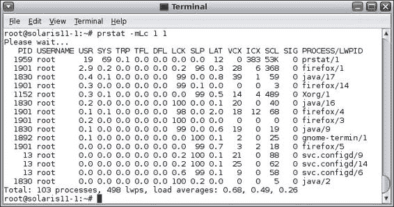
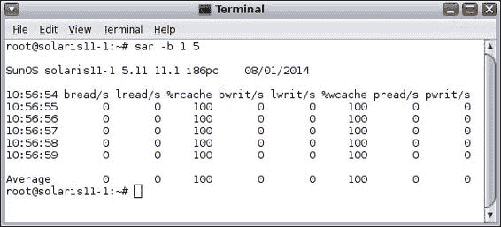

# 第九章：配置 Syslog 和监控性能

在本章中，我们将讨论以下主题：

+   配置 syslog

+   监控 Oracle Solaris 11 的性能

# 简介

在本章中，我们将学习两个重要主题：syslog 和性能监控。前者是日常管理的基本任务，非常适合解决在 Oracle Solaris 11 中可能发生的以下事件和问题。配置 syslog 与其他 UNIX 系统非常相似，但会有一些特别的细节是专门与 Oracle Solaris 相关的。

讨论 syslog 框架意味着讨论系统中一个非常重要的部分，它负责事件消息的记录。任何安全问题、硬件变更和故障、内核事件或一般问题都会记录在日志文件中。此外，应用程序也会将它们的消息记录到日志文件中。syslog 框架在我们进行取证分析时发挥着特别的作用。syslog 框架具有核心作用。当我们调查恶意软件攻击时，日志也很重要。如果我们需要创建故障排除过程，那么 syslog 框架保存和管理的记录是至关重要的。这就是 syslog 框架的真正重要性，因为它的责任是将任何类型的消息转发到日志文件中，依据消息的类别和严重性。

后者的主题，性能监控，向我们介绍了一个完整的新世界，我们甚至可以为这个主题写一本完整的书。这里的想法是学习一些基本的原则和命令，帮助发现系统中的性能问题。收集到的指标可以用于调优任务，主要目标是提高性能并尽可能保持相同的硬件配置。这非常有用，因为管理人员不希望在没有必要的情况下购买昂贵的硬件，而实际上，可能只需对系统做一些修改就能达到预期效果。

# 配置 syslog

syslog 框架是 Oracle Solaris 11 最重要的特性之一，因为它的目标是记录每秒钟发生的所有事件。这些记录可以用于调查系统中的任何可疑行为。像大多数书籍一样，我们不会深入探讨关于 syslog 的不必要的细节和理论。这里的主要目的是展示如何配置、监控和使用 syslog。

## 准备工作

本教程需要两台虚拟机（VirtualBox 或 VMware），分别命名为 `solaris11-1` 和 `solaris11-2`，这两台虚拟机均运行 Oracle Solaris 11，内存至少为 2 GB，并且具备一个网络接口。

## 如何做到这一点……

syslog 框架由一个主守护进程（`syslogd`）和它相应的配置文件（`/etc/syslog.conf`）组成。要获取与 syslog 服务相关的详细信息，我们必须执行以下 SMF 管理命令：

```
root@solaris11-1:~# svcs -l svc:/system/system-log:default
fmri         svc:/system/system-log:default
name         system log
enabled      true
state        online
next_state   none
state_time   May 19, 2014 01:29:14 AM BRT
logfile      /var/svc/log/system-system-log:default.log
restarter    svc:/system/svc/restarter:default
contract_id  117 
manifest     /root/chapter5/myprofile.xml
manifest     /etc/svc/profile/generic.xml
manifest     /lib/svc/manifest/system/system-log.xml
dependency   require_all/none svc:/milestone/self-assembly-complete (online)
dependency   require_all/none svc:/system/filesystem/local (online)
dependency   optional_all/none svc:/system/filesystem/autofs (online)
dependency   require_all/none svc:/milestone/name-services (online)
root@solaris11-1:~# svcs -x svc:/system/system-log:default
svc:/system/system-log:default (system log)
 State: online since May 19, 2014 01:29:14 AM BRT
   See: syslogd(1M)
   See: /var/svc/log/system-system-log:default.log
Impact: None.
```

正如我们提到的 syslog 服务，它有一个配置文件，名为 `/etc/syslog.conf`，如下所示：

```
root@solaris11-1:~# more /etc/syslog.conf 
#
#ident  "%Z%%M%  %I%  %E% SMI"  /* SunOS 5.0 */
#
# Copyright (c) 1991-1998 by Sun Microsystems, Inc.
# All rights reserved.
#
# syslog configuration file.
#
# This file is processed by m4 so be careful to quote (`') names
# that match m4 reserved words.  Also, within ifdef's, arguments
# containing commas must be quoted.
#
*.err;kern.notice;auth.notice      /dev/sysmsg
*.err;kern.debug;daemon.notice;mail.crit  /var/adm/messages

*.alert;kern.err;daemon.err      alexandre
*.alert            root

*.emerg            *

# if a non-loghost machine chooses to have authentication messages
# sent to the loghost machine, un-comment out the following line:
#auth.notice      ifdef(`LOGHOST', /var/log/authlog, @loghost)

mail.debug      ifdef(`LOGHOST', /var/log/syslog, @loghost)

#
# non-loghost machines will use the following lines to cause "user"
# log messages to be logged locally.
#
ifdef(`LOGHOST', ,
user.err          /dev/sysmsg
user.err          /var/adm/messages
user.alert          `root, operator'
user.emerg          *
)
```

该配置文件简单，只有两列，选择器和目标，且两者由**制表符**（而不是空格）分隔。

选择器列由`facility.level`格式的两个组件组成，语法定义如下：

```
<facility>.<level>        <target>
```

`facility`组件确定消息的类别或类型（KERN、USER、MAIL、DAEMON、AUTH、NEWS、UUCP、CRON、AUDIT、LOCAL 0-7 和*），`level`组件表示优先级（EMERG、ALERT、CRIT、ERROR、WARNING、NOTICE、INFO 和 DEBUG，按降序排列）。此外，目标列是消息的目的地，目标可以是设备文件、文件、用户或主机。

现在我们将看到一些`/etc/syslog.conf`配置文件的实际示例及其相应的语法：

+   `*.err;kern.notice;auth.notice /dev/sysmsg`：所有优先级为错误（`err`）的消息（设施无关），任何`kernel`设施的优先级为`notice`（`notice`、`warning`、`error`、`critical`、`alert`、`emergency`）或更高的消息，以及任何`auth`设施的优先级为`notice`或更高的消息都将发送到`/dev/sysmsg`。

+   `*.err;kern.debug;daemon.notice;mail.crit /var/adm/messages`：所有优先级为`debug`的消息（设施无关），任何`kernel`设施的`debug`优先级或更高的消息，任何`daemon`设施的`notice`优先级或更高的消息，以及所有`mail`设施的`critical`优先级或更高的消息都将发送到`/var/adm/messages`文件。

+   `*.alert;kern.err;daemon.err alexandre`：在这个例子中，所有优先级为`alert`或更高的消息，所有`kernel`设施的错误（`err`）或更高优先级的消息，以及所有`daemon`设施的错误（`err`）或更高优先级的消息都将发送到`alexandre`用户。

+   `*.emerg *`：在这一行，所有优先级为`emerg`或更高的消息将发送到所有已登录的用户。

+   `local7.alert @solaris11-2`：任何`local7`设施的优先级为`alert`或更高的消息将被发送到另一个主机（`solaris11-2`）。

+   ``mail.debug ifdef(`LOGHOST', /var/log/syslog, @loghost)``：这是一个很好的示例，因为任何优先级为`debug`或更高的`mail`设施的消息都可以发送到`/etc/hosts`文件中指定的两个不同目标。

如果`LOGHOST`变量（如前所示）被设置（在同一行定义）为 localhost，`mail.debug`消息将被发送到`/var/log/syslog`文件。然而，如果`LOGHOST`关键字被设置为另一个主机（例如，`solaris11-2 machine`），则`mail.debug`消息将被发送到`solaris11-2`主机。

由于`/etc/hosts`文件用于指定这些特殊的主机名，我们可以验证以下示例：

```
root@solaris11-1:~# more /etc/hosts
#
# Copyright 2009 Sun Microsystems, Inc.  All rights reserved.
# Use is subject to license terms.
#
# Internet host table
#
::1 solaris11-1 localhost 
127.0.0.1 solaris11-1 localhost loghost 
192.168.1.144  solaris11-1  solaris11-1.example.com
192.168.1.155  solaris11-2  solaris11-2.example.com
```

在这种情况下，`loghost` 被配置为本地主机（`solaris11-1`），因此任何具有 `mail` 服务并且优先级为 `debug` 的消息必须发送到 `/var/adm/message` 文件。

从这些示例中，你可以注意到以下几点：

+   消息可以发送到两个或更多不同的地方，正如前两个示例所示。

+   如果消息被发送到另一个主机，例如最后一个配置行中的示例，则目标主机必须有类似的行来处理接收到的消息。

+   对 `/etc/syslog.conf` 文件的任何更改都需要重新启动 syslog 服务（`svcadm restart svc:/system/system-log:default` 和 `svcadm restart svc:/system/system-log:default`）。

让我们进行一个真实的测试。在 `solaris11-1` 系统中，编辑 `/etc/syslog.conf` 文件并添加以下行：

```
local7.emerg          @solaris11-2
```

在 `solaris11-1` 机器的 `/etc/hosts` 文件中添加 `solaris11-2` 系统，并确保可以从 `solaris11-1` 系统访问，如以下命令所示：

```
root@solaris11-1:~# ping solaris11-2
solaris11-2 is alive
root@solaris11-1:~# more /etc/syslog.conf 
(truncated output)
# non-loghost machines will use the following lines to cause "user"
# log messages to be logged locally.
#
ifdef(`LOGHOST', ,
user.err          /dev/sysmsg
user.err          /var/adm/messages
user.alert          `root, operator'
user.emerg          *
)
local7.emerg          @solaris11-2
```

在 `solaris11-1` 系统中，通过执行以下命令刷新 syslog 服务：

```
root@solaris11-1:~# svcadm refresh svc:/system/system-log:default

```

如果由于某种原因 syslog 配置没有生效，可以通过运行以下命令来重新启动它：

```
root@solaris11-1:~# svcadm restart svc:/system/system-log:default
root@solaris11-1:~# svcs svc:/system/system-log:default
STATE          STIME    FMRI
online          4:58:45 svc:/system/system-log:default
```

在另一个系统（`solaris11-2`）上，我们需要在 `/etc/syslog.conf` 文件的末尾添加以下行：

```
local7.emerg          /var/adm/new_messages
```

由于此文件不存在，我们可以按以下命令创建它：

```
root@solaris11-2:~# touch /var/adm/new_messages

```

`system-log:default` 服务中有一个名为 `log_from_remote` 的属性，它应该设置为 `true`，以允许远程主机（`solaris11-1`）将任何消息记录到 `solaris11-2` 系统中。然而，问题在于这个参数通常配置为 `false`。此外，一个配置文件（`/etc/default/syslog`）也控制远程日志记录行为，如以下命令所示：

```
root@solaris11-2:~# more /etc/default/syslogd 
#ident  "%Z%%M%  %I%  %E% SMI"
#
# Copyright 2006 Sun Microsystems, Inc.  All rights reserved.
# Use is subject to license terms.
#
# /etc/default/syslogd
#
# Legacy configuration file for syslogd(1M). See syslogd(1M).
#
# This file should no longer be directly used to configure syslogd. 
# These settings are kept here for backwards compatibility only. 
# Please use svccfg(1M) to modify the properties of syslogd(1M).
#
# The LOG_FROM_REMOTE setting used to affect the logging of remote
# messages. Its definition here will override the svccfg(1M) settings
# for log_from_remote.
#
#LOG_FROM_REMOTE=YES

```

现在，让我们详细看看。如果 `LOG_FROM_REMOTE` 变量（来自 `/etc/default/syslogd` 文件）设置为 `YES` 或 `NO`，则 `log_from_remote` 属性（来自 `system-log:default` 服务）分别启用或禁用。然而，如果 `LOG_FROM_REMOTE` 变量被注释掉（如前面的文件所示），则 `log_from_remote` 属性（来自 `system-log:default` 服务）的值生效。

因此，为了简化我们的工作，我们将启用 `log_from_remote` 属性，而不更改 `/etc/default/syslogd` 配置文件，并重新启动服务，如以下命令所示：

```
root@solaris11-2:~# svccfg -s svc:/system/system-log setprop config/log_from_remote = true
root@solaris11-2:~# svcadm restart svc:/system/system-log:default
root@solaris11-2:~# svcs svc:/system/system-log:default
STATE          STIME    FMRI
online         13:38:17 svc:/system/system-log:default
```

在同一个 `solaris11-2` 系统中，我们需要跟踪 `/var/adm/new_messages` 以确认 `solaris11-1` 的消息是否到达，使用以下命令：

```
root@solaris11-2:~# tail -f /var/adm/new_messages

```

在 `solaris11-1` 系统上，是时候测试配置了，我们可以使用 `logger` 命令来生成一个具有指定设施和级别的消息，使用 `-p` 选项。在这种情况下，我们将生成 `Alexandre Borges` 消息，它将被归类为 `local7` 并具有 `emerg` 优先级。根据 `/etc/syslog.conf` 配置文件，消息将发送到 `solaris11-2` 主机。一旦消息到达，它将被发送到 `/var/adm/new_messages` 文件，如以下命令所示：

```
root@solaris11-1:~# logger -p local7.emerg Alexandre Borges

```

完成了！返回到 `solaris11-2` 主机，我们可以通过执行以下命令确认消息是否已经到达：

```
root@solaris11-2:~# tail -f /var/adm/new_messages
May 19 13:41:44 solaris11-1.example.com root: [ID 702911 local7.emerg] Alexandre Borges

```

完美！一切如预期那样工作！

在继续讲解日志记录的内容时，一些网络服务有自己的日志配置，理解这一点的最佳方法是通过查看另一个实际示例。例如，选择 telnet 服务并使用以下命令检查其配置：

```
root@solaris11-1:~# inetadm -l telnet
SCOPE    NAME=VALUE
         name="telnet"
         endpoint_type="stream"
         proto="tcp6"
         isrpc=FALSE
         wait=FALSE
         exec="/usr/sbin/in.telnetd"
         user="root"
default  bind_addr=""
default  bind_fail_max=-1
default  bind_fail_interval=-1
default  max_con_rate=-1
default  max_copies=-1
default  con_rate_offline=-1
default  failrate_cnt=40
default  failrate_interval=60
default  inherit_env=TRUE
         tcp_trace=FALSE
default  tcp_wrappers=FALSE
default  connection_backlog=10
default  tcp_keepalive=FALSE
```

正如我们在之前的输出中看到的，`tcp_trace` 属性被设置为 `false`，这样就不会将任何 telnet 消息发送到 syslog 服务。可以通过运行以下命令来更改此默认行为：

```
root@solaris11-1:~# inetadm -m telnet tcp_trace=true 
root@solaris11-1:~# inetadm -l telnet | grep tcp_trace
tcp_trace=TRUE

root@solaris11-1:~# inetadm | grep telnet
enabled   online         svc:/network/telnet:default
```

要验证 telnet 事件，我们必须从 `solaris11-2` 系统执行一次 telnet 操作，并检查 `solaris11-1` 主机上的 `/var/adm/messages` 文件，如以下命令所示：

```
root@solaris11-2:~# telnet solaris11-1
Trying 192.168.1.144...
Connected to solaris11-1.example.com.
Escape character is '^]'.
login: borges
Password: hacker123!
Oracle Corporation      SunOS 5.11      11.1    September 2012
-bash-4.1$
```

在 `solaris11-1` 主机上，通过执行以下命令来验证 `/var/adm/` 消息日志文件的内容：

```
root@solaris11-1:~# tail -3 /var/adm/messages
May 19 15:03:44 solaris11-1 mDNSResponder: [ID 702911 daemon.warning] SendResponses: No active interface to send:   33 _OSInstall._tcp.local. PTR borges_ai._OSInstall._tcp.local.

May 19 15:03:44 solaris11-1 mDNSResponder: [ID 702911 daemon.warning] SendResponses: No active interface to send:   36 _OSInstall._tcp.local. PTR default-i386._OSInstall._tcp.local.

May 19 15:15:02 solaris11-1 inetd[829]: [ID 317013 daemon.notice] telnet[2677] from 192.168.1.155 40498

```

成功了！然而，为什么使用 `tcp_trace=true` 配置的服务的消息会进入 `/var/adm/message` 文件呢？因为所有来自此属性的消息都被归类为 `daemon.notice`（记住 `facility.severity` 语法），根据 `/etc/syslog.conf` 文件，我们有如下命令：

```
root@solaris11-1:~# cat /etc/syslog.conf | grep /var/adm/messages
*.err;kern.debug;daemon.notice;mail.crit  /var/adm/messages
user.err          /var/adm/messages
```

我们可以通过一个简单的命令配置所有网络服务的日志记录功能，而不是为每个网络服务单独配置日志功能：

```
root@solaris11-1:~# inetadm -M tcp_trace=true

```

现在，所有通过 `inetadm` 框架控制的网络服务都已配置为根据 `/etc/syslog.conf` 配置文件将日志记录到 `system-log:default` 服务。

### 配方概述

我们已经学习了如何使用 `system-log:default` 服务（即 `syslogd` 守护进程）和其相关的配置文件（`/etc/syslog.conf`）来配置 Oracle Solaris 11 中的日志服务。此外，我们还了解了如何为通过 `inetadm` 框架控制的网络服务配置日志功能。

# 监控 Oracle Solaris 11 的性能

当我们在资源丰富的环境中工作时，毫无疑问，管理所有系统变得更加容易。然而，如何处理那些运行 Oracle Solaris 11 且资源有限的关键系统呢？我们如何在 Oracle Solaris 11 上找到并监控这些稀缺资源？

关于 Oracle Solaris 性能和调优的主题是一个非常长且复杂的话题，无法完全讲解；它值得一本书来专门探讨所有细节。然而，我们将学习足够的监控细节和命令，足以激励你深入研究这一主题。

## 准备就绪

本食谱需要一台运行 Oracle Solaris 11 的虚拟机（VirtualBox 或 VMware），至少配置 2 GB RAM。建议系统配置两个或更多处理器或核心。

## 如何操作……

从根本上讲，Oracle Solaris 11 由 CPU、RAM 和 I/O 设备组成，并且有许多方法可以监控系统。此外，有一些非常重要的参数，因此从检查内存子系统开始我们的学习是非常合适的。

第一步是启用系统收集 `sar` 统计数据，如下命令所示：

```
root@solaris11-1:~# svcs -a | grep sar
disabled        0:37:02 svc:/system/sar:default
root@solaris11-1:~# svcadm enable svc:/system/sar:default
root@solaris11-1:~# svcs -a | grep sar
online          4:34:57 svc:/system/sar:default
```

通过使用 `prtconf` 或 `lgrpinfo` 命令，我们可以找到总安装内存。另外，执行 `pagesize` 命令可以查找内存中页面的大小，最后，使用 `sar –r` 可以获取空闲内存和交换空间，如下命令所示：

```
root@solaris11-1:~# prtconf | grep -i memory
Memory size: 4096 Megabytes
root@solaris11-1:~# lgrpinfo 
lgroup 0 (root):
  Children: none
  CPU: 0
  Memory: installed 4.0G, allocated 1.3G, free 2.7G
  Lgroup resources: 0 (CPU); 0 (memory)
  Load: 0.297
  Latency: 0
root@solaris11-1:~# pagesize
4096
root@solaris11-1:~# sar -r 1 3
SunOS solaris11-1 5.11 11.1 i86pc    05/21/2014
01:45:09 freemem freeswap
01:45:10  632394  5876128
01:45:11  632439  5877184
01:45:12  632476  5876128

Average   632436  5876480
```

在上述命令中，`freemem` 列表示平均可用页面数（此处为 4K），`freeswap` 列表示用于页面交换的磁盘块的平均数量。

也可以使用非常智能的命令获取空闲内存（以 4 KB 页面为单位）：

```
root@solaris11-1:~# kstat -p unix:0:system_pages:freemem
unix:0:system_pages:freemem  632476
```

获取空闲交换空间的典型方法是使用以下命令：

```
root@solaris11-1:~# swap –l
swapfile                 dev    swaplo   blocks     free
/dev/zvol/dsk/rpool/swap 285,2     8    2097144  2097144

```

在这种情况下，我们应该记住，空闲空间以扇区（512 字节）为单位显示。

通过另一种方式，可以从 **模块化调试器**（**MDB**）获取空闲交换信息：

```
root@solaris11-1:~# echo ::swapinfo | mdb –k
            ADDR            VNODE     PAGES      FREE NAME
ffffc1000743e378 ffffc10007df3d00    262143    262143 /dev/zvol/dsk/rpool/swap
```

此外，同一个 MDB 还可以通过执行以下命令为我们提供大量有关内存状态的信息：

```
root@solaris11-1:~# echo ::memstat | mdb –k
Page Summary                Pages                MB  %Tot
------------     ----------------  ----------------  ----
Kernel                     215458               841   21%
ZFS File Data              132510               517   13%
Anon                       101485               396   10%
Exec and libs                4105                16    0%
Page cache                  17361                67    2%
Free (cachelist)            14411                56    1%
Free (freelist)            563133              2199   54%
Total                     1048463              4095
```

该输出显示了内核（`Kernel`）使用的内存量、**ZFS** **文件数据**（**ZFS**）使用的内存量，以及内存中匿名页面的数量（堆、栈、共享内存和写时复制页面的总和）。

页面缓存（存储在虚拟内存中）由所有最近读取和写入的常规文件系统数据（文件和目录数据）构成，ZFS 数据除外（ZFS 数据存储在 **自适应替换** **缓存**（**ARC**）中）。正如我们之前提到的，常规 ZFS 文件系统数据存储在页面缓存中，因为 mmap ZFS 数据也存储在那里。

空闲（`freelist`）是指与进程和文件无关的实际空闲内存量。缓存列表是指空闲列表中未映射文件页的数量。

页面缓存的基本和粗略工作原理是，任何必要的文件系统数据都会被提取到 `segmap` 缓存中。

`Segmap` 缓存是一种一级缓存或暂存区，用于存储最近从文件系统（`UFS`、`VxFS`、`NFS` 和 `QFS`）读取的页面，并将其保存在内核虚拟内存中的页面中，以便复制到用户空间缓冲区。然而，如果在 `segmap` 缓存中找不到信息，内核会尝试在 `cachelist`（未映射的文件系统页面）中查找请求的数据。此外，`segmap` 缓存不被 ZFS 文件系统使用。一个有趣的概念是，`freelist` 与 `cachelist` 相关联，这表明当需要一些空闲内存页面时，内核首先尝试从 `freelist` 中获取页面，但如果无法获得，内核将从 `cachelist` 中获取页面。

顺便说一句，为了完整性，`segmap` 缓存统计信息可以通过运行以下命令找到：

```
root@solaris11-1:~# kstat -n segmap
module: unix                            instance: 0     
name:   segmap                          class:    vm
  crtime                          0
  fault                           69
  faulta                          0
  free                            0
  free_dirty                      0
(truncated output)

```

`kstat` 命令也适合显示补充的页面系统信息。请记住，内存中的页面大小为 4 KB，可以通过执行以下命令来查找：

```
root@solaris11-1:~# kstat -n system_pages
module: unix                            instance: 0     
name:   system_pages                    class:    pages
  availrmem                       696041
  crtime                          0
  desfree                         8159
  desscan                         25
  econtig                         4229439488
  fastscan                        473831
  freemem                         585862
  kernelbase                      0
  lotsfree                        16318
  minfree                         4079
  nalloc                          44993593
  nalloc_calls                    19577
  nfree                           42000307
  nfree_calls                     13223
  nscan                           0
  pagesfree                       585862
  pageslocked                     348325
  pagestotal                      1044366
  physmem                         1044366
  pp_kernel                       362807
  slowscan                        100
  snaptime                        6181.186029253
```

另一个有趣的附注是：`availrmem` 是可用于分配的未锁定内存量。此外，如果我们执行相同的 `kstat` 命令，还可以获得系统范围的页面统计信息，如下所示：

```
root@solaris11-1:~# kstat -n vm
module: cpu                             instance: 0     
name:   vm                              class:    misc
  anonfree                        0
  anonpgin                        0
  anonpgout                       0
  as_fault                        941681
  cow_fault                       151186
  crtime                          42.291984164
  dfree                           0
  execfree                        0
  execpgin                        0
  execpgout                       0
  fsfree                          0
  fspgin                          32
  fspgout                         0
  hat_fault                       0
  kernel_asflt                    0
  maj_fault                       5
  pgfrec                          149071
  pgin                            6
  pgout                           0
  pgpgin                          32
  pgpgout                         0
  pgrec                           149071
  pgrrun                          4
  pgswapin                        0
  pgswapout                       0
  prot_fault                      162132
  rev                             0
  scan                            97276
  snaptime                        6715.331061273
  softlock                        17396
  swapin                          0
  swapout                         0
  zfod                            399824
```

从这庞大的输出中，有一些参数特别引人注目：

+   `anonfree`：定义了在页面被交换到磁盘后释放的堆和栈页面

+   `anopgin`：定义了从磁盘交换进来的堆和栈页面

+   `anonpgout`：定义了从交换区交换出去的堆和栈页面

+   `maj_fault`：定义了因页面不在内存中而需要从磁盘查找页面的操作数

+   `pgswapin`：定义了交换进来的页面数

+   `pgswapout`：定义了交换出去的页面数

返回到一般的内存统计信息，有一个已知的命令 `vmstat`（使用 `-p` 选项来报告分页活动），它可以披露有用的细节，如下所示：

```
root@solaris11-1:~# vmstat -p 1 5
     memory           page          executable      anonymous      filesystem 
   swap  free  re  mf  fr  de  sr  epi  epo  epf  api  apo  apf  fpi  fpo  fpf
 3243004 2845352 237 1317 0 0 266    0    0    0    0    0    0    0    0    0
 2844188 2438808 14 57  0   0   0    0    0    0    0    0    0    0    0    0
 2843132 2438060 0  2   0   0   0    0    0    0    0    0    0    0    0    0
 2843132 2437664 0  2   0   0   0    0    0    0    0    0    0    0    0    0
 2842604 2437128 0 25   0   0   0    0    0    0    0    0    0    0    0    0
```

该输出带给我们一些有关 `swap`（可用交换空间，单位为 KB）和 `free`（空闲内存量）有趣的信息。还有其他关键参数，如 `sr`（每秒扫描的页面数，目的是找到足够的空闲内存）、`api`（匿名页面输入）和 `apo`（匿名页面输出）。通常，`sr` 值（扫描率）大于零表示存在内存不足的问题，而 `api` 或 `apo` 的高值则表示内存不足，且往返交换区的操作次数较多。此外，由于匿名页面输入操作会对系统性能产生不利影响，我们可以使用 DTrace 工具通过运行以下命令之一来查找所有执行大量页面输入操作的可执行文件：

+   root@solaris11-1:~# **dtrace -n 'vminfo:::anonpgin { @[pid, execname] = count(); }'**

+   root@solaris11-1:~# **dtrace -n 'vminfo:::pgpgin { @pg[execname] = sum(arg0); }'**

找到导致性能问题的可执行文件后，就该决定我们能做些什么了。最终，可能需要将有问题的应用程序迁移到其他系统。

有一种有趣的方法可以验证一个进程是否遇到内存问题，使用 `prstat` 命令，如下所示：

```
root@solaris11-1:~# prstat -mLc 1 1

```

上述命令的输出如下所示：



首先，我们使用的选项如下：

+   `-m`：此选项报告微观状态进程的统计信息。

+   `-c`：此选项将新报告打印在前一个报告下方，而不是覆盖它们。

+   `-L`：此选项报告每个**轻量级进程**（**LWP**）的统计信息。默认情况下，`prstat` 命令仅报告每个进程的 LWP 数量。

DFL 列表示进程处理数据页面缺失的时间百分比，换句话说，就是内存不足。理想情况下，这个值应该为零。

对于日常管理，我们习惯执行 `vmstat` 命令来收集关于虚拟内存的信息，如以下命令所示：

```
root@solaris11-1:~# vmstat 1 5
 kthr      memory            page            disk          faults      cpu
 r b w   swap  free  re  mf pi po fr de sr s0 s1 s2 --   in   sy   cs us sy id
 0 0 0 2855860 2439648 28 159 0 0  0  0 19 12  0  0  0  568 2519  741  2  4 94
 0 0 0 2773564 2364844 14 57 0  0  0  0  0  0  0  0  0  552  793  587  1  3 96
 1 0 0 2773564 2364764 0  0  0  0  0  0  0  0  0  0  0  583  677  590  1  2 97
 0 0 0 2773564 2364764 0  0  0  0  0  0  0  0  0  0  0  548  662  567  1  4 95
 0 0 0 2773564 2364764 0  0  0  0  0  0  0  0  0  0  0  566  655  574  2  2 96
```

一些有用的列包括 `w`（被交换出的线程数量）、`swap`（空闲交换空间的 KB 数）、`free`（空闲内存，包括页面缓存和空闲列表的 KB 数）、`re`（从页面缓存中回收的页面数量）、`pi` 和 `po`（分别为分页进和分页出的 KB 数），以及 `sr`（扫描内存中可用页面的页数）。

从前面的命令中有一个很好的变化是 `vmstat –s`（显示自启动以来各种系统事件的总数），如以下命令所示：

```
root@solaris11-1:~# vmstat –s
        0 swap ins
        0 swap outs
        0 pages swapped in
        0 pages swapped out
   762167 total address trans. faults taken
        7 page ins
        0 page outs
        7 pages paged in
        0 pages paged out
   135490 total reclaims
   135490 reclaims from free list
        0 micro (hat) faults
   762167 minor (as) faults
        7 major faults
   148638 copy-on-write faults
   257547 zero fill page faults
   148476 pages examined by the clock daemon
        0 revolutions of the clock hand
        0 pages freed by the clock daemon
      967 forks
     1670 vforks
     2876 execs
  2840211 cpu context switches
  1877292 device interrupts
   925020 traps
  8412869 system calls
  2901338 total name lookups (cache hits 86%)
     9114 user   cpu
    16207 system cpu
   298592 idle   cpu
        0 wait   cpu
```

我已经突出显示了从 `vmstat –s` 输出中提取的主要统计信息，如下所示：

+   `pages swapped in`：指的是被交换进来的页面数量（从交换空间到内存）。理想值为零。

+   `pages swapped out`：指的是被交换出去的页面数量（从内存到交换空间）。理想值为零。

+   `reclaims from free list`：指的是从空闲列表中的空闲页缓存回收的页面总数。回收的页面是因为空间不足而释放的内存页面，但它们还没有被其他进程使用，也没有被换出到交换空间。较高的值可能表示内存不足。

+   `major faults`：指的是未在物理内存中找到的页面数量；这些页面是从磁盘中读取的。理想值接近零。

+   `total name lookups`：每当一个文件被打开时，它的路径名会存储在一个名为 **目录名称查找缓存**（**DNLC**）的特殊位置。该统计信息显示了内核在缓存（DNLC）中找到目录路径的次数，而无需从磁盘上读取这些信息。大于 90% 的值非常好！获取 DNLC 信息的另一种方式是使用 `kstat`。

可以通过执行以下命令收集专门的 DNLC 缓存信息：

```
root@solaris11-1:~# kstat -n dnlcstats
module: unix                            instance: 0     
name:   dnlcstats                       class:    misc
  crtime                          38.737278004
  dir_add_abort                   0
  dir_add_max                     0
  dir_add_no_memory               0
  dir_cached_current              0
  dir_cached_total                0
  dir_entries_cached_current      0
  dir_fini_purge                  0
  dir_hits                        0
  dir_misses                      0
  dir_reclaim_any                 0
  dir_reclaim_last                0
  dir_remove_entry_fail           0
  dir_remove_space_fail           0
  dir_start_no_memory             0
  dir_update_fail                 0
  double_enters                   40
  enters                          112579
  hits                            2439710
  misses                          408555
  negative_cache_hits             89113
  pick_free                       0
  pick_heuristic                  0
  pick_last                       0
  purge_all                       0
  purge_fs1                       0
  purge_total_entries             60
  purge_vfs                       10
  purge_vp                        40
  snaptime                        1136.042407346
```

可以计算 DNLC 的效率，计算公式为 (*hits/(hits + misses)) * 100。因此，根据前面的输出，我们得出以下结论：

DNLC 的效率 = (2439710 / (2439710 + 408555)) * 100 = 85.67%

从之前的输出中可以得出一个有趣的解释：每当我们开始在磁盘上查找目录路径信息时，85 次该信息会在 DNLC 缓存中找到。

获取 DNLC 统计信息的另一个巧妙方法是使用 `sar` 命令，如下所示：

```
root@solaris11-1:~# sar -a 1 5
SunOS solaris11-1 5.11 11.1 i86pc    05/21/2014
04:37:12  iget/s namei/s dirbk/s
04:37:13       19       14       6
04:37:14       5       14       4
04:37:15       10       18       9
04:37:16       13       10       11
04:37:17       8       13       12

Average        11       14       8
```

`iget/s` 列显示了在 `DNLC` 上未找到的 `inode` 目录路径请求的次数。该列的理想值是零。然而，如果 `iget/s` 的值不等于零，我们可以通过修改 `/etc/system` 文件并更改 `ncsize` 参数来改善这一统计数据，如以下命令所示：

```
set ncsize = value
```

`ncsize` 参数定义了目录名称查找缓存（DNLC）中的条目数量，这个参数被 UFS、NFS 和 ZFS 用来缓存已解析的路径名元素。

默认情况下，值是通过公式 *(4 * (v.v_proc + maxusers) + 320) + (4 * (v.v_proc + maxusers) + 320) / 100* 动态计算的。此外，可以通过执行以下命令找到当前值：

```
root@solaris11-1:~# echo ncsize/D | mdb -k
ncsize:
ncsize:         129797
```

在谈论 DNLC 时，另一个热门话题是缓冲区缓存。缓冲区缓存存储着 inode 的元数据，这些元数据包含 DNLC 上的目录路径信息。缓冲区缓存的统计信息可以通过运行以下命令获得，如下截图所示：



`%rcache` 和 `%wcache` 列分别告诉我们元数据在读取/写入操作中被找到的次数百分比。非常好的值是 `%rcache`，应当超过 90%，以及 `%wcache`，应当超过 70%。

在管理内存性能时，一个关键问题是要知道是否发生了物理错误，比如故障内存或 ECC 错误。在这种情况下，我们可以通过运行以下命令来验证系统中的内存和所有其他硬件组件是否正常工作：

```
root@solaris11-1:~# fmadm faulty
root@solaris11-1:~# fmstat -s -m cpumem-retire
NAME                                  >N     T CNT                    DELTA STAT
```

幸运的是，我的机器上没有错误。

在尝试调整 Oracle Solaris 11 性能时，一个巨大的关注点是 CPU。最终，系统中的潜在性能问题是 CPU 无法及时处理所有请求。例如，`vmstat` 命令可以帮助我们识别操作系统是否显示 CPU 瓶颈，执行以下命令：

```
root@solaris11-1:~# vmstat 1 5 
 kthr      memory            page            disk          faults      cpu
 r b w   swap  free  re  mf pi po fr de sr s0 s1 s2 --   in   sy   cs us sy id
 5 3 0 2876068 2470716 77 324 0 0  0  0 89 21  0  1  0  580 2862  904  3  5 92
 3 3 0 2764212 2357504 14 58 0  0  0  0  56  14  0  0  0  547  758  582  2  3 95
 7 4 0 2763576 2357380 67  88  0  0  0  0  72  13  0  0  0  601 1445  691  4  4 92
 2 4 0 2763576 2357380 34  65  0  0  0  0  72  16  0  0  0  586 1595  700  4  5 91
 5 2 0 2763576 2357380 25  64  0  0  0  68  65  11  0  0  0  614 1904  752  5  5 90
```

`kthr:r` 列表示在运行队列（调度队列的总和）中等待 CPU 的就绪线程总数。超过核心处理器或 CPU 数量的常量值可能表示处理器瓶颈，除以 `kthr:r`/CPU 或核心数是比较服务器 CPU 性能的一个好方法。

使用 DTraceToolkit，我们有一个 `dispqlen.d` 脚本，显示每个 CPU 或核心调度队列，指示任何 CPU 饱和的情况。幸运的是，在以下命令中并没有出现这种情况：

```
root@solaris11-1:~/DTraceToolkit-0.99/Bin# ./dispqlen.d 
Sampling... Hit Ctrl-C to end.
^C^C
 CPU 2
           value  ------------- Distribution ------------- count    
             < 0 |                                         0        
               0 |@@@@@@@@@@@@@@@@@@@@@@@@@@@@@@@@@@@@@@@  75201    
               1 |@                                        2380     
               2 |                                         59       
               3 |                                         0        

 CPU 0
           value  ------------- Distribution ------------- count    
             < 0 |                                         0        
               0 |@@@@@@@@@@@@@@@@@@@@@@@@@@@@@@@@@@@@@@@  75157    
               1 |@                                        2431     
               2 |                                         52       
               3 |                                         0        

 CPU 1
           value  ------------- Distribution ------------- count    
             < 0 |                                         0        
               0 |@@@@@@@@@@@@@@@@@@@@@@@@@@@@@@@@@@@@@@@  75097    
               1 |@                                        2467     
               2 |                                         67       
               3 |                                         8        
               4 |                                         1        
               5 |                                         0        

 CPU 3
           value  ------------- Distribution ------------- count    
             < 0 |                                         0        
               0 |@@@@@@@@@@@@@@@@@@@@@@@@@@@@@@@@@@@@@@@  75051    
               1 |@                                        2540     
               2 |                                         49       
               3 |                                         0   
```

一个与 `vmstat` 中的 `kthr:r` 列输出类似的命令是 `sar –q` 中的 `runq-sz` 列：

```
root@solaris11-1:~# sar -q 1 4
SunOS solaris11-1 5.11 11.1 i86pc    05/21/2014
21:52:45 runq-sz %runocc swpq-sz %swpocc
21:52:46     0.0       0     0.0       0
21:52:47     2.0     100     0.0       0
21:52:48     1.0     100     0.0       0
21:52:49     1.0     100     0.0       0
Average      1.3      75     0.0       0
```

`%runocc` 文件解释了平均运行队列占用情况，帮助我们识别运行队列中的突发情况。

回到 `vmstat` 的输出，其他有用的字段包括 `cpu: us`（用户时间——CPU 花费多少时间处理用户线程）、`cpu: sy`（系统时间——CPU 花费多少时间处理内核线程和系统调用）、`cpu: id`（空闲时间——CPU 等待可运行线程的时间百分比）。评估潜在 CPU 问题的一个实际方法是考虑用户时间（`cpu: us`）和系统时间（`cpu: sy`）的良好平衡，大约是 90/10（具体取决于系统中运行的应用程序）。此外，最大上限为 70/30。任何显示不同于这些范围的系统都值得调查。

可以通过执行类似以下的命令以相似的方式查看大部分前面提到的列：

```
root@solaris11-1:~# sar 1 3
SunOS solaris11-1 5.11 11.1 i86pc    05/21/2014
20:39:05    %usr    %sys    %wio   %idle
20:39:06       3       5       0      92
20:39:07       2       2       0      96
20:39:08       3       3       0      94

Average        3       3       0      94
```

集中关注系统时间和用户时间，接下来的命令将追踪哪些进程正在占用 CPU，正在运行什么用户代码，以及哪些内核函数正在运行在 CPU 上（系统时间）。因此，如果我们需要知道哪些进程正在 CPU 上运行，可以执行以下命令：

```
root@solaris11-1:~# dtrace -n 'profile-993Hz {@[pid,execname] = count (); }'
dtrace: description 'profile-993Hz ' matched 1 probe
^C

       13  svc.configd                                  1
      928  fmd                                          1
     1817  gnome-settings-d                             1
     1824  nautilus                                     1
     1847  updatemanagernot                             1
     1854  xscreensaver                                 1
     1858  nwam-manager                                 1
     1839  gnome-power-mana                             2
      849  VBoxService                                  3
     1899  dtrace                                       3
     1820  metacity                                     4
     1829  wnck-applet                                  4
     1821  gnome-panel                                  5
        6  kmem_task                                    7
     1873  clock-applet                                 7
        3  fsflush                                     12
     1896  gnome-terminal                              25
     1162  Xorg                                        27
     1840  java                                        94
        0  sched                                    14985
```

在这种情况下，`sched` 进程（Oracle Solaris 调度程序）占用了大部分 CPU 时间。此外，`Java` 和 `Xorg` 进程也占用了相当多的 CPU 时间。

要查找哪些进程占用了更多的用户时间（即运行用户代码），可以执行以下命令：

```
root@solaris11-1:~# dtrace -n 'profile-993hz /arg1/ { @[pid,execname] = count(); }'
dtrace: description 'profile-993hz ' matched 1 probe
^C
     1919  dtrace                                      1
     1152  Xorg                                        6
     1892  gnome-terminal                              9
     1830  java                                       34
     1901  firefox                                    49
```

根据输出，`firefox` 进程占用了更多的 CPU 时间。

按照同样的思路，可以通过执行以下命令获取正在占用 CPU 的顶级内核函数（`%sys` 时间）：

```
root@solaris11-1:~# dtrace -n 'profile-993hz /arg0/ { @[func(arg0)] = count() ;}'
dtrace: description 'profile-993hz ' matched 1 probe
(truncated output)
genunix`fsflush_do_pages                        14
  unix`ddi_get32                                31
  unix`i86_monito                               76
  unix`cpu_idle_enter                          125
  unix`tsc_read                                152
  unix`dispatch_softint                        263
  unix`i86_mwait                             24424
```

在通过 `prstat` 命令管理处理时，也会检查 CPU 饱和度：

```
root@solaris11-1:~# prstat -mLc 1 1
Please wait...
   PID USERNAME USR SYS TRP TFL DFL LCK SLP LAT VCX ICX SCL SIG PROCESS/LWPID 
  2618 root      15  84 0.0 0.0 0.0 0.0 0.0 0.3   0  13  8K   0 prstat/1
  1953 pkg5srv  0.2 1.4 0.0 0.0 0.0 0.0  98 0.4  19   0 147   0 htcacheclean/1
  2530 root     0.6 0.6 0.0 0.0 0.0  98 0.0 0.7  39   0  60   0 java/22
  2530 root     0.4 0.4 0.0 0.0 0.0  99 0.0 0.6  20   0  40   0 java/21
  2563 root     0.2 0.5 0.0 0.0 0.0 0.0  99 0.4  38   0  76   0 
(truncated output)

```

在前面的命令中，我们可以看到总共 120 个进程；830 个 LWP；以及 0.12、0.11、0.13 的负载平均值。`LAT`（延迟）列表示进程等待 CPU 的时间量，常数值超过 1 时需要进行详细调查。如果某个进程或线程的值不正常，Oracle Solaris 提供了深入调查问题的方式。例如，`java` 进程的延迟（`LAT`）值为 0.7（这是一个非常低的值，在实际情况中不值得调查），但是如果我们想要收集所有线程的详细信息，可以执行以下命令：

```
root@solaris11-1:~# prstat -mL -p 2530
PID USERNAME USR SYS TRP TFL DFL LCK SLP LAT VCX ICX SCL SIG PROCESS/LWPID 
  2530 root     0.5 0.5 0.0 0.0 0.0  98 0.0 0.9 201   0 300   0 java/22
  2530 root     0.4 0.4 0.0 0.0 0.0  99 0.0 0.5 100   0 201   0 java/21
  2530 root     0.2 0.2 0.0 0.0 0.0 100 0.0 0.1  99   0  99   0 java/14
  2530 root     0.0 0.0 0.0 0.0 0.0 0.0 100 0.0  10   0  30   0 java/17
(truncated output)

```

可以通过执行以下命令验证特定线程的堆栈：

```
root@solaris11-1:~# pstack 2530/22
2530:  java -Djava.security.policy=/usr/share/vpanels/java.policy com.oracle.
-----------------  lwp# 22 / thread# 22  --------------------
 fe6893a5 lwp_cond_wait (8966640, 8966628, f527e9d8, 0)
 fe65e2a4 _lwp_cond_timedwait (8966640, 8966628, f527ea20, fe10f9f1) + 37
 fe10fd2d __1cGParkerEpark6Mbx_v_ (8966628) + 34d
 fe272980 Unsafe_Park (8965d28, f527eab4, 0, 2e95966, 0, af8a18f0) + 208
 fa2ce072 * *sun/misc/Unsafe.park(ZJ)V [compiled] 
 fa330790 * *java/util/concurrent/locks/LockSupport.parkNanos(Ljava/lang/Object;J)V [compiled] +21 (line 449)
 fa330790 * *java/util/concurrent/locks/AbstractQueuedSynchronizer$ConditionObject.awaitNanos(J)J+69 (line 4153)
 fa330790 * *java/util/concurrent/DelayQueue.take()Ljava/util/concurrent/Delayed;+133 (line 484)
 00000000 ???????? (da647c20, da647c20, af8ac070, 0, 2d, ab5463b8) + ffffffff01d8d888
 ab7a4350 ???????? () + ffffffffad531bd8
```

`lwp_cond_wait` 和 `_lwp_cond_timedwait` 函数通常等待由 LWP 条件变量表示的条件的发生。在这种情况下，两个函数都在等待 CPU。

最终，`mpstat` 命令可以帮助我们区分各 CPU 之间的负载，如下所示：

```
root@solaris11-1:~# mpstat 1 1
 CPU minf mjf xcal  intr ithr  csw icsw migr smtx  srw syscl  usr sys  wt idl
   0  331   0   21   490  127  714   10   66   39    1  2286    5  12   0  84
   1  386   0   17   236   36  609    9   60   38    1  1988    4   9   0  86
   2  264   0   22   281  114  566    9   58   35    1  1817    4  11   0  85
   3  299   0   16   227   37  669    9   65   37    1  1930    4   9   0  87
```

这里，`minf`（小错误—未在缓存中找到的页面，已从内存中获取）、`mjf`（大错误—未在内存中找到的页面，已从磁盘中获取）、`xcal`（跨调用）和`intr`（CPU 接收到的中断数量）。可以说，`cross-calls`是执行特定低级功能的 CPU 或核心之间的调用。此外，`cross-calls`还需要保持缓存的一致性，因为 CPU 的缓存中存在过时的条目。通常，`cross-calls`源于释放内存的需求，这些功能如`kmen_free()`会执行该操作。中断（`intr`列）由内核使用，当它需要另一个处理器代表其执行工作时，例如抢占调度程序（线程信号，一个在另一个处理器上运行的线程进入内核模式）以向另一个处理器上的线程发送信号并启动/停止不同处理器上的`/proc`线程。`mpstat`命令本身不会直接显示性能瓶颈，但它有助于我们对系统有一个总体的了解，正如前面所示。例如，继续前面的例子，可以通过运行以下命令列出一个进程执行的跨调用次数：

```
root@solaris11-1:~# dtrace -n 'sysinfo:::xcalls { @[execname] = count(); }'
dtrace: description 'sysinfo:::xcalls ' matched 1 probe
^C
  pargs                                                            36
  sched                                                          2156
  dtrace                                                         2607
```

执行常见监控命令如`mpstat`、`sar`、`vmstat`和`iostat`，然后进行详细的 DTrace 调查，是找出导致问题的应用程序或进程的典型方法。

现在，我们将重点转向 I/O 性能。也许分析 I/O 潜在问题的最基本命令是`iostat`命令：

```
root@solaris11-1:~# iostat -xnze 1
                            extended device statistics       ---- errors --- 
    r/s    w/s   kr/s   kw/s wait actv wsvc_t asvc_t  %w  %b s/w h/w trn tot device
    1.7    0.4   18.2    5.1  0.0  0.0   12.7   11.7   1   2   0   0   0   0 c7t0d0
    0.0    0.0    0.1    0.0  0.0  0.0    0.1    9.2   0   0   0   0   0   0 c7t1d0
    0.1    0.0    0.4    0.1  0.0  0.0    7.1   14.9   0   0   0   0   0   0 c7t2d0
 (truncated output)

```

输出显示每个磁盘的统计信息。使用的选项包括`–n`（使用逻辑名称）、`-x`（显示扩展统计信息）、`-e`（显示错误统计信息）和`–z`（不显示没有活动的行）。此外，一些列非常重要，比如`wait`（队列中等待磁盘的事务的平均数量）、`actv`（正在处理的事务数量）、`wsvc_t`（事务在 I/O 等待队列中花费的平均时间）和`%b`（磁盘处于活动状态的时间百分比）。从这个解释来看，`wait`列值得关注，因为它是磁盘饱和度的一个度量，理想情况下，它应该始终为零。

一个非常好的工具（来自 DTraceToolkit）是`iotop.d`脚本，它按照进程排序打印 I/O 详细信息，并显示 I/O 大小（`BYTES`列），如下命令所示：

```
root@solaris11-1:~# cd /usr/dtrace/DTT/Bin/
root@solaris11-1:/usr/dtrace/DTT/Bin# ./iotop -PC
2014 May 22 05:18:15,  load: 0.38,  disk_r:    559 KB,  disk_w:   4053 KB

  UID    PID   PPID CMD              DEVICE  MAJ MIN D            BYTES
    0   2768      1 firefox          sd0     217   1 R           572928
    0      5      0 zpool-rpool      sd0     217   1 W          4282880
(truncated output)

```

我们可以去掉`–P`选项，以防止输出滚动并刷新屏幕。

最后，我们需要监控网络接口并寻找网络瓶颈，因此有一些好的工具可以完成这项任务。例如，`netstat`命令是一个简单有效的命令，用于收集网络信息并分析是否发生碰撞，如下命令所示：

```
root@solaris11-1:~# netstat -i 1
    input   net0      output     input  (Total)    output
packets errs  packets errs  colls  packets errs  packets errs  colls 
338712  0     180791  0     0      339832  0     181911  0     0     
4       0     1       0     0      4       0     1       0     0     
5       0     1       0     0      5       0     1       0     0     
6       0     1       0     0      6       0     1       0     0     
4       0     1       0     0      4       0     1       0     0     
4       0     1       0     0      4       0     1       0     0     
(truncated output)

```

还有一个非常棒的工具，叫做`nicstat`，它可以帮助我们找出网络中的潜在瓶颈。然而，它是一个外部工具，安装起来稍微有些复杂。不过，必须从[`sourceforge.net/projects/nicstat/files/`](http://sourceforge.net/projects/nicstat/files/)下载`nicstat`工具。此外，最好下载最新版本（包含更多功能），但我们需要编译它。

在本次演示中，我使用的是[`sourceforge.net/projects/nicstat/files/latest/download?source=files`](http://sourceforge.net/projects/nicstat/files/latest/download?source=files)中的版本（nicstat-src-1.95.tar.gz）。

下载完包之后，我们需要通过执行以下命令打开它：

```
root@solaris11-1:~/Downloads# tar zxvf nicstat-src-1.95.tar.gz

```

然而，这次我们遇到了一个问题；需要一个编译器来创建`nicstat`二进制文件！请访问[`www.oracle.com/technetwork/server-storage/solarisstudio/downloads/index-jsp-141149.html`](http://www.oracle.com/technetwork/server-storage/solarisstudio/downloads/index-jsp-141149.html)下载 Oracle Solaris Studio 12.3，并点击[`pkg-register.oracle.com`](http://pkg-register.oracle.com)下载适用于 Oracle Solaris 11 x86 的版本。之后，我们需要创建个人 SSL 证书，以便访问包含 Oracle Solaris Studio 和 Oracle Solaris Cluster 等软件包的受限仓库。因此，请点击**Request Certificate**链接。系统将引导你到一个页面，下载密钥和证书。建议将这两者保存在`/root/Downloads`目录中。

### 注意

Oracle Solaris Studio 安装了一个非常有趣的工具，叫做`er_kernel`，它用于仅对内核或同时对内核和我们运行的负载进行分析。关于`er_kernel`工具的更多信息（包括示例），可以查看[`docs.oracle.com/cd/E18659_01/html/821-1379/afahw.html`](http://docs.oracle.com/cd/E18659_01/html/821-1379/afahw.html)。

以下步骤是必要的，用于安装密钥和证书，将新的发布者（`solarisstudio`）添加到系统中，测试我们是否能够列出 Oracle Solaris Studio 文件，并随后安装 Oracle Solaris Studio，具体命令如下：

```
root@solaris11-1:~# mkdir -m 0755 -p /var/pkg/ssl
root@solaris11-1:~# cp ~/Downloads/Oracle_Solaris_Studio.key.pem /var/pkg/ssl
root@solaris11-1:~# cp ~/Downloads/Oracle_Solaris_Studio.certificate.pem /var/pkg/ssl
root@solaris11-1:~# pkg set-publisher -k /var/pkg/ssl/Oracle_Solaris_Studio.key.pem -c /var/pkg/ssl/Oracle_Solaris_Studio.certificate.pem -G '*' -g https://pkg.oracle.com/solarisstudio/release solarisstudio
root@solaris11-1:~# pkg list -a pkg://solarisstudio/*
NAME (PUBLISHER)                                  VERSION                    IFO
developer/solarisstudio-122 (solarisstudio)       12.2-1.0.0.0               ---
developer/solarisstudio-122/analyzer (solarisstudio) 12.2-1.0.0.0               ---
(truncated output)
root@solaris11-1:~# pkg install solarisstudio-123
           Packages to install: 24
       Create boot environment: No
Create backup boot environment: No
(truncated output)
DOWNLOAD                                PKGS         FILES    XFER (MB)   SPEED
Completed                              24/24     9913/9913  457.1/457.1  301k/s

PHASE                                          ITEMS
Installing new actions                   15563/15563
Updating package state database                 Done 
Updating image state                            Done 
Creating fast lookup database                   Done 
```

这很好！由于 Oracle Solaris Studio 是安装在系统的可执行路径之外，我们必须通过执行以下命令将其包含在`PATH`变量中：

```
root@solaris11-1:~/Downloads# cd
root@solaris11-1:~# echo PATH=$PATH:/opt/solarisstudio12.3/bin >> /root/.profile 
root@solaris11-1:~# echo export PATH >> /root/.profile 
root@solaris11-1:~# . ./.profile

```

返回到`nicstat`目录并执行以下命令进行编译：

```
root@solaris11-1:~# cd /root/Downloads/nicstat-src-1.95
root@solaris11-1:~/Downloads/nicstat-src-1.95# cp Makefile.Solaris Makefile
root@solaris11-1:~/Downloads/nicstat-src-1.95# make
root@solaris11-1:/tmp/nicstat-src-1.95# cp .nicstat.Solaris_11_i386 nicstat
root@solaris11-1:~/Downloads/nicstat-src-1.95# file nicstat
nicstat:  ELF 32-bit LSB executable 80386 Version 1 [FPU], dynamically linked, not stripped
```

最后，我们可以使用这个超棒的`nicstat`工具！首先，使用`nicstat`工具列出可用的接口，命令如下：

```
root@solaris11-1:~/Downloads/nicstat-src-1.95# ./nicstat –l
Int      Loopback   Mbit/s Duplex State
lo0           Yes        -   unkn    up
net0           No     1000   full    up
vswitch1       No        0   unkn  down
vnic0          No    40000   unkn    up
vnic1          No    40000   unkn    up
vnic2          No    40000   unkn    up
```

`nicstat`工具有多个选项，可以通过执行以下命令查看：

```
root@solaris11-1:~/Downloads/nicstat-src-1.95# ./nicstat -h
USAGE: nicstat [-hvnsxpztualMU] [-i int[,int...]]
   [interval [count]]
         -h                 # help
         -v                 # show version (1.95)
         -i interface       # track interface only
         -n                 # show non-local interfaces only (exclude lo0)
         -s                 # summary output
         -x                 # extended output
         -p                 # parseable output
         -z                 # skip zero value lines
         -t                 # show TCP statistics
         -u                 # show UDP statistics
         -a                 # equivalent to "-x -u -t"
         -l                 # list interface(s)
         -M                 # output in Mbits/sec
         -U                 # separate %rUtil and %wUtil
    eg,
       nicstat              # print summary since boot only
       nicstat 1            # print every 1 second
       nicstat 1 5          # print 5 times only
       nicstat -z 1         # print every 1 second, skip zero lines
       nicstat -i hme0 1    # print hme0 only every 1 second
```

基于可用的选项，以下命令可以为我们提供扩展的输出，去除了零值行，并且将`%rUtil`和`%wUtil`列分开：

```
root@solaris11-1:~/Downloads/nicstat-src-1.95# ./nicstat -zUx 1
14:41:16      RdKB    WrKB   RdPkt   WrPkt   IErr  OErr  Coll  NoCP Defer %rUtil %wUtil
lo0           0.00    0.00    0.00    0.00   0.00  0.00  0.00  0.00  0.00   0.00   0.00
net0          0.00    0.00    0.00    0.00   0.00  0.00  0.00  0.00  0.00   0.00   0.00
14:41:17      RdKB    WrKB   RdPkt   WrPkt   IErr  OErr  Coll  NoCP Defer %rUtil %wUtil
net0          0.22    0.10    3.00    1.00   0.00  0.00  0.00  0.00  0.00   0.00   0.00
14:41:18      RdKB    WrKB   RdPkt   WrPkt   IErr  OErr  Coll  NoCP Defer %rUtil %wUtil
net0          0.28    0.09    3.96    0.99   0.00  0.00  0.00  0.00  0.00   0.00   0.00
^C
```

`nicstat` 工具中最重要的列是 `rAvs`（接收数据包的平均大小）、`wAvs`（传输数据包的平均大小）、`%Util`（接口的最大利用率）和 `Sat`（接口每秒的错误数，若出现这种情况，可能是接口接近饱和的迹象）。

最后，管理员可以通过运行以下命令来收集特定网络接口的统计数据：

```
root@solaris11-1:~# dladm show-link -s -i 1 net0
LINK                IPACKETS  RBYTES  IERRORS   OPACKETS    OBYTES      OERRORS
net0                365079    488320923 0       190053      16047649    0
net0                9         1044    0         4           591         0
net0                6         446     0         3           278         0
net0                7         538     0         1           98          0
(truncated output)

```

在前面的命令中，各列的含义如下：

+   `LINK`：指数据链路的名称

+   `IPACKETS`：通过该链路接收的包的数量

+   `RBYTES`：通过该链路接收的字节数

+   `IERRORS`：输入错误的数量

+   `OPACKETS`：通过该链路发送的包的数量

+   `OBYTES`：通过该链路发送的字节数

+   `OERRORS`：输出错误的数量

### 该配方的概述

本章介绍了如何配置 syslog 框架以记录系统的消息和事件。此外，我们简要介绍了如何使用多个命令（如 `vmstat`、`sar`、`prstat`、`kstat`、`mdb`、`iostat` 等）监控 Oracle Solaris 11 系统的性能。我们还使用了其他工具，如 DTrace 和 DTraceToolkit 脚本，来衡量 Oracle Solaris 11 系统的性能。

# 参考文献

+   *Solaris 性能与工具：DTrace 和 MDB 技术用于 Solaris 10 和 OpenSolaris*；*理查德·麦克杜戈尔*，*吉姆·毛罗*，*布伦丹·格雷格*；*普伦蒂斯·霍尔*

+   *Solaris* *内部原理: Solaris 10 和 OpenSolaris 内核架构（第二版）*；*理查德·麦克杜戈尔*，*吉姆·毛罗*；*普伦蒂斯·霍尔*

+   [`solarisinternals.com/wiki/index.php/Solaris_Internals_and_Performance_FAQ`](http://solarisinternals.com/wiki/index.php/Solaris_Internals_and_Performance_FAQ)

+   *系统性能：企业与云*；*布伦丹·格雷格*；*普伦蒂斯·霍尔*

+   [`www.brendangregg.com/sysperfbook.html`](http://www.brendangregg.com/sysperfbook.html)

+   DTraceToolkit 网站：[`www.brendangregg.com/dtracetoolkit.html`](http://www.brendangregg.com/dtracetoolkit.html)

+   Brendan Gregg 网站：[`www.brendangregg.com/`](http://www.brendangregg.com/)

+   Dtrace.org 网站：[`dtrace.org/blogs/`](http://dtrace.org/blogs/)
