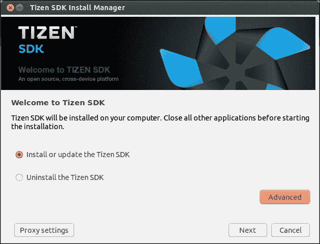

# 第一部分：开始使用 Tizen

*Tizen SDK*

*Tizen 生态系统介绍*

# 第一章 Tizen SDK

本章将覆盖以下食谱：

+   安装 Tizen SDK

+   在 Windows 上安装 Tizen SDK

+   在 Mac OS 上安装 Tizen SDK

+   在 Ubuntu 上安装 Tizen SDK

+   管理扩展包

+   自定义 Tizen IDE

+   设置活动安全配置文件

+   Tizen Web 模拟器

+   Tizen 模拟器

+   开始使用智能开发桥

+   使用智能开发桥

# 介绍

本章介绍了开发 Tizen 应用所需的工具。详细描述了在三种支持的操作系统（GNU/Linux、Windows 和 Mac OS）上安装 SDK 的步骤。此外，本章还概述了开发环境、Web 模拟器、设备模拟器以及**智能开发桥**（**SDB**）的用户手册。

对于那些急于开始编码的你们来说，可能会有些失望，因为本章没有包含任何代码片段。然而，请保持冷静，仔细探索所有食谱，它们将帮助你了解工具的工作原理。等你完成这些步骤后，你将能够更高效地开发 Tizen 应用程序。

# 安装 Tizen SDK

启动 Tizen 应用程序开发的第一步是下载并安装 Tizen SDK。所有支持的操作系统上安装过程相似。本食谱解释了 Tizen SDK 2.2.1 的基本安装过程。每个支持的操作系统的详细信息和注意事项将在本章节的后续食谱中讨论。

## 准备就绪

SDK 包含开发原生和 Web Tizen 应用所需的所有工具。它由基于 Eclipse 的 IDE、模拟器、Web 应用模拟器、工具链、几个示例应用程序和完整的文档组成。Tizen SDK 兼容以下平台：

+   Ubuntu（32 位和 64 位）

+   Windows 7（32 位和 64 位）

+   Mac OS X

开发系统的最低硬件要求如下：

+   双核 2 GHz CPU

+   至少 2 GB 的 RAM

+   至少 6 GB 的空闲磁盘空间

### 注意

Tizen SDK 可以从 Tizen 项目官网免费下载，网址为[`developer.tizen.org/downloads/tizen-sdk`](https://developer.tizen.org/downloads/tizen-sdk)。

Tizen SDK 的硬件要求的更多细节可在[`developer.tizen.org/downloads/sdk/installing-sdk/prerequisites-tizen-sdk`](https://developer.tizen.org/downloads/sdk/installing-sdk/prerequisites-tizen-sdk)中找到。

尽管官方只支持 Ubuntu 这一 Linux 发行版，但一些用户已成功在其他发行版如 Fedora 和 Arch Linux 上使其工作。

提供了多个 Tizen SDK 安装选项。你可以选择网络安装、镜像安装或无 GUI 的命令行安装。

## 如何操作...

对于网络安装，请执行以下步骤：

1.  首先，下载 **Tizen SDK 安装管理器**。

1.  启动下载的文件，然后在第一个屏幕上点击 **下一步**，如下面的截图所示：

    Tizen SDK 安装管理器界面

1.  在第二个屏幕上，接受条款和条件后再次点击 **下一步**。

1.  选择要安装的组件并点击 **下一步**。最后，指定 SDK 安装的目录并点击 **安装** 按钮。

    ### 注意

    在安装过程中，可能会要求提供管理员权限。安装管理器将下载大约 1.5 GB 的文件。

如果你更倾向于离线安装，请按照以下步骤进行：

1.  下载 SDK 安装管理器。

1.  下载完成后，启动下载的文件。

1.  选择 **高级**。

1.  进入 **高级配置** 窗口。点击对应的单选按钮选择 **SDK 镜像**。

1.  浏览到 SDK 镜像文件，点击 **确定**，然后点击 **下一步**。

1.  在下一个屏幕上，将显示条款和条件。接受后点击 **下一步**。

1.  选择要安装的组件并点击 **下一步**。

1.  最后，选择 SDK 存储的目录并点击 **安装** 按钮。

## 它是如何工作的…

Tizen IDE 基于 Eclipse。Eclipse 的大部分源代码是使用 Java 编程语言编写的。一般来说，使用 Java 创建的应用程序的主要优点是它们能够兼容不同的平台，这也是 Tizen IDE 和 SDK 能够在多个桌面操作系统上正常工作的主要原因。

## 另见

+   关于在 Windows、Mac OS 和 Ubuntu 上安装的详细信息，请参考本章后续的教程。

# 在 Windows 上安装 Tizen SDK

尽管 Tizen 是基于 Linux 的操作系统，但可以在 Microsoft Windows 上开发 Tizen 应用程序。本教程将详细介绍在 Windows 上安装 SDK 的过程。

## 准备工作

建议在开始安装前，确保你的开发系统符合 Tizen SDK 的要求。Tizen SDK 兼容 32 位和 64 位的 Windows 7 版本，以及 32 位的 Windows XP 版本。尽管 Windows 8 未在官方支持的平台列表中，但 Windows 7 的版本应该与其兼容。

### 注意

请注意，即使已经安装了 32 位版本，64 位版本的 Windows 仍然需要 64 位的 JRE。

## 如何操作...

在 Windows 上安装 Tizen SDK 是直接的。完成安装的最简单方法是依赖于前面教程中描述的网络安装程序。

## 另见

+   安装完成后，可以将 Tizen SDK 安装目录注册到 Windows 的环境路径中，这样就可以直接从任何位置运行 SDB。请参考与 SDB 相关的教程了解如何操作。

# 在 Mac OS 上安装 Tizen SDK

许多移动应用开发者使用 Mac OS 的原因之一是它是开发 iOS 应用所必需的。与 iOS 不同，Tizen 的开发工具没有这样的限制，可以在 Mac OS 以及其他流行的桌面操作系统上安装。

## 准备工作

Tizen SDK 的 Mac OS 网络安装管理器以标准磁盘镜像文件形式分发，扩展名为 `dmg`。

## 如何操作...

下载 `.dmg` 文件，并按照提供的教程*安装 Tizen SDK*进行操作。

如果你计划在 Mac OS X 上开发原生 Tizen 应用，请根据你所使用的 Mac OS X 版本，按照 Apple 指南安装命令行工具 ([`developer.apple.com/library/ios/technotes/tn2339/_index.html`](https://developer.apple.com/library/ios/technotes/tn2339/_index.html))。

在 Mac OS X 10.7.5（也称为 Mac OS X Lion）或更高版本上，安装管理器可能因操作系统的安全设置而失败。必须修改这些设置，暂时防止 Mac OS X Gatekeeper 阻止安装管理器，从而继续 Tizen SDK 的安装。请执行以下步骤来配置 Mac OS X 上的 Gatekeeper，并解决该问题：

1.  点击 Mac OS X 界面左上角的**苹果菜单**按钮。

1.  选择**系统偏好设置**。

1.  点击**安全性与隐私**。

1.  选择**常规**标签。

1.  要配置设置，请点击右下角的锁定图标，输入管理员用户密码，然后点击**解锁**。

1.  将**允许从任何地方下载应用**设置为**任何地方**并确认更改。

1.  再次启动**Tizen 安装管理器**并完成安装。

### 注意

安装成功后，安全设置可以恢复到之前的配置。或者，你也可以将安装程序作为单一应用从 Gatekeeper 中豁免。有关详细信息，请访问 Apple 的支持页面 [`support.apple.com/kb/HT5290`](http://support.apple.com/kb/HT5290)。

## 另见

+   如果你有兴趣在成功安装 Tizen SDK 后将 SDB 添加到环境路径中，请参考与 SDB 相关的教程。

# 在 Ubuntu 上安装 Tizen SDK

Ubuntu 是唯一推荐并且完全支持的 Tizen SDK 的 Linux 发行版。在 Ubuntu 上启动 Tizen SDK 安装管理器之前，需要安装额外的软件。

本食谱包含四个主要步骤，用于安装所有必需的软件组件并成功完成 SDK 在 Ubuntu 上的安装。开始之前，请确保计算机上有至少 6 GB 的可用空间。

## 准备就绪

官方上，Tizen SDK 2.2.1 只与两个版本的 Ubuntu 兼容：12.04 和 12.10。尽管如此，完全可以在更新版本上安装并运行 SDK。这适用于以下版本的 Ubuntu：

+   12.10 32 位

+   13.04 32 位

+   13.10 64 位

尽管 Ubuntu 13.10 没有官方支持，但 Tizen SDK 仍然可以成功安装。不过，运行 SDB 时需要应用与 `libudev.so.1` 相关的解决方法。有关如何修复 Ubuntu 13.10 上 SDB 的更多信息，请查看食谱中的故障排除部分。

## 如何操作...

完整的安装过程可以分为四个里程碑：

1.  下载 Tizen SDK。

1.  安装 Oracle Java Runtime Environment (JRE)。

1.  安装依赖项。

1.  安装 Tizen SDK。

访问 [tizen.org](http://tizen.org) 获取 Tizen SDK，或者执行以下命令，通过你的 Web 浏览器或命令行工具（如 `wget`）下载 Tizen SDK 2.2.1。例如，如果你使用的是 32 位版本的 Ubuntu，可以在终端运行以下命令：

```
wget https://cdn.download.tizen.org/sdk/InstallManager/tizen-sdk-2.2.1/tizen-sdk-ubuntu32-v2.2.71.bin

```

64 位版本的安装文件的 URL 稍有不同，可以通过执行以下命令进行下载：

```
wget https://cdn.download.tizen.org/sdk/InstallManager/tizen-sdk-2.2.1/tizen-sdk-ubuntu64-v2.2.71.bin

```

### 注意

这些 URL 可能会随时间变化。要下载 Tizen SDK 的另一个版本，请访问 [`developer.tizen.org/downloads/tizen-sdk`](https://developer.tizen.org/downloads/tizen-sdk) 查看可用的链接。

在启动 Tizen SDK 之前，必须安装 Oracle JRE。请确保 OpenJDK 不被支持。如果你还没有安装 Oracle JRE，请按照以下步骤操作：

1.  访问 Oracle 网站，根据你使用的 Ubuntu 版本，下载适用于 Linux 的 32 位或 64 位 JRE 7，并以 `tar` 压缩包格式提供，下载链接为 [`www.oracle.com/technetwork/java/javase/downloads/jre7-downloads-1880261.html`](http://www.oracle.com/technetwork/java/javase/downloads/jre7-downloads-1880261.html)。

1.  解压下载的 `archive.tar -xzf jre-*.tar.gz` 文件中的所有文件。

1.  为 JRE 文件创建一个目录。然后，执行以下命令将提取的文件移动到该目录中：

    ```
    sudo mkdir -p /usr/lib/jvm/jre1.7.0sudo mv jre1.7.0_45/* /usr/lib/jvm/jre1.7.0/.

    ```

    ### 注意

    JRE 文件和目录的名称可能会因你下载的版本而有所不同。

1.  如果系统中没有 Java，请安装它。否则，建议使用以下命令进行更新：

    ```
    sudo update-alternatives --install /usr/bin/java java /usr/lib/jvm/jre1.7.0/bin/java 0

    ```

此外，Java 还可以在默认的 Ubuntu 网络浏览器 Mozilla Firefox 中启用。需要执行一些额外的步骤：

1.  执行以下命令为当前用户创建一个目录，用来存储 Mozilla 插件：

    ```
    mkdir ~/.mozilla/plugins

    ```

1.  创建指向上一步所创建目录的 Java 符号链接：

    ```
    ln -s /usr/lib/jvm/jre1.7.0/lib/i386/libnpjp2.so ~/.mozilla/plugins/

    ```

    ### 提示

    创建插件的符号链接到`/usr/lib/firefox/plugins/`，或者对于 Ubuntu 13.10，创建符号链接到`/usr/lib/firefox/browser/plugins/`，以便为系统的所有用户启用它。启用 Java 后，必须重新启动 web 浏览器。

我们即将启动 Tizen SDK 安装程序，但在此之前，必须先安装一些依赖项。

确保安装以下软件包：

+   `expect`

+   `gtk2-engines-pixbuf`

+   `libgnome2-0`

+   `qemu-user-static`

+   `gettext`

+   `module-init-tools`

+   `gksudo`

+   `libwebkitgtk-1.0-0`

如果你不确定某个软件包是否已经在开发平台上安装，请执行命令 `dpkg -s` 后跟软件包名称或软件包列表进行检查。要安装前述列表中的任何软件包，请打开终端并执行 `sudo apt-get install`，后跟软件包名称，格式如下：

```
sudo apt-get install expect gtk2-engines-pixbuf libgnome2-0 qemu-user-static libwebkitgtk-1.0-0 gettext module-init-tools libudev-dev

```

Ubuntu 12.10 或更早版本的用户应通过执行以下命令安装 `gksudo` 软件包：

```
sudo apt-get install gksudo

```

请注意，如果你使用的是 Ubuntu 13.04 或更高版本，你将无法安装此软件包，因为它不再提供。相反，你应执行以下命令安装软件包 `gksu`：

```
sudo apt-get install gksu

```

最后，继续安装 Tizen SDK。确保安装管理器的二进制文件具有可执行权限并启动它。请注意，`<version>` 和 `<bits>` 必须替换为与教程开始时下载的文件匹配的值：

```
chmod +x tizen-sdk-ubuntu<bits>-v<version>.bin
./tizen-sdk-ubuntu<bits>-v<version>.bin

```

启动安装管理器时，按照 *安装 Tizen SDK* 过程中的说明完成安装。

如果你不确定哪种安装类型适合你的需求，建议选择**典型安装**。

## 还有更多…

在本节中，你将学习如何排查 Tizen 在 GNU/Linux 上的安装问题。

+   无法启动 Tizen IDE，因为缺少或 JRE 版本不兼容（**SDK 运行在 Eclipse 上，要求 JRE，需 JRE 6 或更新的版本**）。

    如果遇到此问题，请在启动 Tizen SDK 安装程序之前，确保开发系统上已经安装了合适的 JRE 版本。

+   无法运行安装程序，因为缺少软件包（**缺少 "expect" "gtk2-engines-pixbuf" "libgnome2-0" "qemu-user-static" "libwebkitgtk-1.0-0" 软件包**）。

    如果遇到此问题，请使用 shell 命令 `apt-get` 安装缺少的软件包。

+   在 Ubuntu 机器上安装 Oracle Java 时出现问题。

    如果遇到此问题，请安装 `java-package`。然后，将下载的 Oracle JDK/JRE 压缩包转换为 `.deb` 文件。

+   启动 Eclipse 时出现异常（**线程 "main" org.eclipse.swt.SWTError: 没有更多句柄 [未知的 Mozilla 路径 (MOZILLA_FIVE_HOME 未设置)] 错误弹出**）。

    如果遇到此问题，请使用 `apt-get` 安装 `libwebkitgtk-1.0-0` 包。

+   Tizen IDE 未显示 **事件注入器**。

    如果遇到此问题，请确保已安装 Eclipse 的 **Ajax 工具框架** 插件。

+   垂直滚动条显示不正常。

    要在最新版本的 Ubuntu 中禁用叠加滚动条，请执行以下命令：

    ```
    >gsettings set com.canonical.desktop.interface scrollbar-mode normal

    ```

+   SDB 在 Ubuntu 13.10 64 位上无法工作（**sdb: 加载共享库时出错: libudev.so.0: 无法打开共享对象文件: 没有此文件或目录**）。

    如果遇到此问题，请对 Ubuntu 13.10 64 位系统应用以下解决方法，*自担风险*，以便在 SDK 更新发布之前暂时解决该问题：

    ```
    sudo ln -s /lib/x86_64-linux-gnu/libudev.so.1.3.5 /lib/x86_64-linux-gnu/libudev.so.0

    ```

### 注意

请注意，`libudev.so.1` 对 Ubuntu 13.10 至关重要，如果不小心删除它或修改其文件权限，操作系统在重启后将无法正常启动！

## 另见

+   如果你有兴趣将 SDB 注册为全局命令，请参阅 *Smart Development Bridge 入门* 相关的 SDB 文章。

+   有关最新信息，请参阅 Tizen wiki 文章 *在 Ubuntu 上安装 Tizen SDK*，该文章自 2013 年 3 月 26 日起由本书的作者维护，地址为 [`wiki.tizen.org/wiki/Install_Tizen_SDK_on_Ubuntu`](https://wiki.tizen.org/wiki/Install_Tizen_SDK_on_Ubuntu)。

# 管理扩展包

Tizen 是一个开源软件平台，具有很高的灵活性。第三方开发者或公司可以为 Tizen SDK 开发扩展包。其他开发者可以通过使用特定仓库，在他们的应用程序中使用或滥用这些第三方包。一些 Tizen SDK 的扩展包可以在 [`developer.tizen.org/downloads/add-on-sdks`](https://developer.tizen.org/downloads/add-on-sdks) 上找到。

## 如何操作...

请执行以下步骤以添加额外的仓库并安装附加的包：

1.  启动 Tizen SDK 安装管理器。

1.  点击 **下一步** 继续。

1.  选择 **额外仓库** 打开对话框。

1.  点击 **添加**。

1.  设置外部服务器以及仓库名称，然后点击 **确定**。仓库信息将在上一个窗口显示。再次点击 **确定**。

1.  选择所需的包并点击 **安装**。

执行以下操作以删除额外的仓库及其安装的所有包：

1.  启动 Tizen SDK 安装管理器。

1.  选择 **安装或更新 Tizen SDK** 并点击 **下一步**。

1.  点击 **额外仓库**。

1.  选择要删除的仓库，然后点击 **移除**。

## 它是如何工作的…

每个仓库包含一些额外的包，这些包是可选的，开发者可以随时添加或删除。仓库通过 URL 指定，因此必须连接到仓库服务器才能下载任何包。如果你在使用**HTTP 安全协议**（**HTTPS**）连接仓库时遇到问题，可以尝试使用相同的 URL，通过 HTTP 进行连接。

如果你想从防火墙后的计算机访问仓库，必须使用代理。要配置代理，请启动安装管理器并点击**代理设置**按钮。

# 自定义 Tizen IDE

Tizen SDK 中包含的默认 IDE 基于 Eclipse。Eclipse 是一个开源软件，多年来它已成为移动平台应用开发的事实标准。具有 Android、Bada、Symbian 和 BlackBerry 10 开发经验的开发者已经熟悉 Eclipse，因为它或基于 Eclipse 的 IDE 被用于这些平台的应用开发。

### 注意

Android 开发者应注意，Tizen 提供的 Eclipse 与 Android 中的 Eclipse 使用方式有所不同。**Android 开发工具**（**ADT**）是一个可以下载并安装的 Eclipse 插件。而与 ADT 不同，Tizen IDE 是通过 Tizen SDK 包提供的，目前没有单独的插件可用。

## 准备工作

Tizen 应用开发之旅的第一步是启动 Tizen IDE。它基于 Eclipse，因此 Tizen IDE 也会要求你选择一个工作区，这并不令人惊讶。如果你不希望每次启动 IDE 时都被要求选择工作区，只需勾选选项**将此设置为默认并且不再询问**。如果要在运行 Tizen IDE 时更改工作区，只需导航到**文件** | **切换工作区**。

在 Tizen IDE 的第一次启动屏幕上会显示一个欢迎界面。点击**工作台**以打开 Tizen Web 视图并开始开发应用程序。如果你想查看文档，可以选择其他三个选项中的任何一个。你可以随时通过导航到**帮助** | **欢迎**返回到首页。如果你在寻找 Tizen 的官方开发文档，只需导航到**帮助** | **帮助内容**。

## 如何操作…

对于很多开发者来说，IDE 的外观和体验是提高生产力的关键因素。Tizen IDE 支持 Eclipse 提供的所有自定义选项。本节仅包含一些关于背景和文本颜色自定义的提示。有关更多信息，请查看 Tizen IDE 和 Eclipse 文档，或深入研究偏好设置。

执行以下操作以更改文本编辑器的背景颜色：

1.  导航到**窗口** | **首选项**，会弹出一个对话框。

1.  导航到**常规** | **编辑器** | **文本编辑器**。

1.  从**外观颜色**选项列表中调整背景颜色。

1.  更改文本颜色。

文本颜色取决于编程语言的语法着色。Tizen Web 应用程序使用 HTML、CSS 和 JavaScript 开发，而本地移动应用程序的开发依赖于 C++。按照以下简单步骤更改语法着色：

1.  导航至**窗口** | **首选项**，一个对话框将出现。

1.  选择所需的编程语言并导航至**编辑器** | **语法着色**。

1.  调整颜色。

如果你想更改字体，请执行以下步骤：

1.  导航至**窗口** | **首选项**，一个对话框将出现。

1.  导航至**常规** | **外观** | **颜色和字体**。

1.  从列表中选择一种编程语言并点击**编辑**。

## 还有更多...

这些是 Tizen IDE 中最流行和最重要的视图：

+   **项目资源管理器视图**：该视图显示当前工作区中的所有资源。在**项目资源管理器视图**中，你可以管理项目、打开和编辑文件，以及执行构建、打包、签名和验证小部件或应用程序等操作。右键单击该视图内的内容，打开包含所有选项的上下文菜单。如果当前 Tizen IDE 视图中缺少**项目资源管理器视图**，你可以通过选择**窗口** | **显示视图** | **其他...** | **常规** | **项目资源管理器**来添加它。

+   **属性视图**：该视图显示所选资源的名称和基本属性。要查看资源的更多详细信息，请右键单击该资源并选择**属性**。要将其添加到当前 Tizen IDE 视图中，请导航至**窗口** | **显示视图** | **其他...** | **常规** | **属性**。

+   **日志视图**：这是一个重要的工具，用于跟踪错误并调查在 Tizen 模拟器或连接到开发系统的设备上运行的应用程序的行为。应用程序运行时，日志消息会显示在**日志视图**中。支持以下消息类型：`verbose`、`debug`、`info`、`warning`、`error`和`fatal`。可以配置日志输出，以便仅过滤特定的消息类型，使用*V*、*D*、*Z*、*I*、*W*、*E*和*F*软件按钮。按钮旁边是附加选项卡按钮，可以添加、编辑和删除更多过滤选项。还可以选择导出日志。如果**日志视图**不可见，通过启用以下选项来显示它，**窗口** | **显示视图** | **日志**。

+   **控制台视图**：该视图提供了多种控制台类型，这些控制台在 Tizen 应用程序的部署和调试过程中非常有用。如果控制台不可见，请导航至**窗口** | **显示视图** | **控制台**，将其添加到当前 Tizen IDE 视图中。要更改控制台的设置，请转到**窗口** | **首选项** | **运行/调试** | **控制台**。

+   **连接资源管理器视图**：该视图显示连接的设备和模拟器列表，并提供浏览其文件系统和传输文件的选项。选择列表中的一个项目，右键点击该项目以查看所有可用操作的菜单。要将连接资源管理器添加到当前的 Tizen IDE 视图中，导航到**窗口** | **显示视图** | **其他...** | **Tizen**。

# 设置活动安全配置文件

必须创建并设置**安全配置文件**，才能成功在 Tizen 设备上部署和调试应用程序。根据我的个人观察，很多开发者在首次将应用程序部署到设备时，由于缺少安全配置文件而遇到问题。这个教程解释了几种生成证书并在 Tizen IDE 中设置的方法。

## 准备中

如果没有设置活动安全配置文件，当你尝试从 Tizen IDE 在设备或模拟器上运行应用程序时，屏幕上会显示以下错误信息：


因缺少活动安全配置文件而导致的签名问题

在从 Tizen IDE 启动任何应用程序之前，请先设置安全配置文件，以避免出现这个烦人的警告。

## 如何操作...

活动安全配置文件可以通过命令行手动创建，或通过 Tizen IDE 中集成的图形用户界面创建。

推荐的方式是通过 Tizen IDE 生成证书。步骤如下：

1.  启动 Tizen IDE。

1.  导航到**窗口** | **首选项**。

1.  导航到**Tizen SDK** | **安全配置文件**。

1.  点击**添加**按钮。

1.  输入配置文件的名称。

1.  点击**生成**按钮填写作者信息。

1.  点击**确定**以保存配置文件设置。

另一种方法是通过命令行创建证书并将其设置为 Tizen IDE 中的**安全配置文件**。如果你更喜欢使用终端，可以按照以下步骤操作：

1.  启动终端并导航到目录`<Tizen SDK 安装目录>/tools/certificate-generator/`。

1.  如果你正在使用类似 Unix 的操作系统，如 Mac OS 或 Linux，执行 `certificate-generator.sh`。如果你使用的是 Windows，应该运行 `certificate-generator.bat`。

1.  系统会提示你输入证书信息。填写所有信息后，证书将被生成。

1.  启动 Tizen IDE，因为生成的证书必须在其中设置。

1.  导航到**窗口** | **首选项**。

1.  导航到**Tizen SDK** | **安全配置文件**。

1.  点击**添加**按钮。

1.  输入配置文件的名称。

1.  输入证书文件的路径。

1.  最后，点击**确定**按钮保存所有设置。

## 操作原理…

创建证书的过程无论你选择哪种方法或操作系统都是类似的。Windows 的批处理文件以及 Linux 和 Mac OS 的 bash 脚本都通过 `java -jar` 命令运行 `CertificateGenerator.jar`。此工具使用 Java 编写，文件格式为 **Java 档案**（**JAR**）。使用 Java 进行这类应用程序的开发具有跨平台兼容性的优势，因为相同的代码可以在 Tizen SDK 支持的所有操作系统上运行：Linux、Mac OS 和 Windows。

# Tizen Web Simulator

**Tizen Web Simulator** 是一个简化的工具，用于测试和调试网页应用程序。它包含在 Tizen SDK 中。Web Simulator 基于 **Ripple-UI Framework**，该框架最初由 BlackBerry（曾称为 *research in motion*）开发，用于测试 BB10 HTML5 WebWorks 应用程序，因此 Web Simulator 根据 Apache 软件许可证 v.2.0 发布。Web Simulator 提供以下功能：

+   来宾修改提供了一个 JavaScript 后端，用于模拟 Tizen Web API

+   配置面板用于触发与 Tizen 软件平台的地理位置、传感器、加速度和消息传递功能相关的事件和消息

+   通过各种首选项自定义模拟器的行为

必须安装 Google Chrome 浏览器，因为它是 Tizen Web Simulator 的运行基础。这实际上意味着在 Google Chrome 上运行的 HTML5 应用程序也将在 Tizen 上运行。另一个好处是，Google Chrome 浏览器的所有开发功能都可以在模拟器中使用，包括可以通过按 *F12* 访问的远程检查工具。

## 准备工作

如果你打算在 Tizen Web Simulator 上测试应用程序，必须在开发系统上下载并安装 Google Chrome 浏览器。Google Chrome 浏览器的安装路径可以在模拟器的 **Preferences** 中指定。

## 如何操作...

有三种方式可以在 Web Simulator 中启动应用程序：

1.  单击 Tizen IDE 工具栏上的 **Run** 按钮。

1.  从 Tizen IDE 的菜单中导航到 **Run** | **Run Configurations**，并点击 **Tizen Web Simulator Application**。

1.  在 **Project Explorer View** 中选择一个项目，并右键单击它。然后，导航到 **Run As** | **Tizen** **Web Simulator Application**。

## 它是如何工作的...

Google Chrome 将自动启动 Web Simulator。通过编辑浏览器左侧面板中的配置来调整模拟器的方向和缩放。

请注意，Web Simulator 仅与 HTML5 网页应用程序兼容，对于原生应用程序无效。当启动网页应用程序时，模拟器会加载在 `config.xml` 中指定的 HTML 文件。默认情况下，该文件的名称为 `index.html`。

## 另见

+   请参考 第十一章，*Tizen 应用调试* 中的食谱，学习如何使用 Web 模拟器模拟事件并调试应用程序。

# Tizen 模拟器

尽管强烈推荐直接在真实的 Tizen 设备上部署和调试应用程序，但开发应用程序并不强制要求拥有 Tizen 设备。Tizen SDK 随附了一个虚拟设备模拟器，开发人员可以创建与其测试需求匹配的自定义硬件规格的虚拟机。

设备模拟器是一个基于开源项目 **Quick Emulator**（**QEMU**）的虚拟机。它提供了完整的 Tizen 平台堆栈。**模拟器管理器** 和 **事件注入器** 也是 SDK 中模拟器工具的一部分。与模拟器不同，模拟器严格执行设备规格，没有任何来宾修改。请注意，Tizen SDK 2.2.1 仅支持 x86 机器架构的来宾。

QEMU，Tizen 模拟器背后的引擎，是一个开源项目，用于可视化机器，允许你在开发机器的桌面上将另一个操作系统作为任务运行。Android 模拟器也基于 QEMU。有关 QEMU 和其许可证的更多信息，请访问 [`wiki.qemu.org/`](http://wiki.qemu.org/)。

Tizen 模拟器支持多种功能，最重要的功能如下：

+   完整的系统仿真，包括 CPU、RAM 和外围设备（如摄像头）

+   事件注入器用于事件模拟

+   硬件加速的 3D 渲染支持的动画和 OpenGL ES

+   电话功能

当然，模拟器与真实的 Tizen 设备相比有一些限制。这些差异影响功能的行为：

+   **输入系统**：模拟器提供虚拟触摸屏，其驱动程序与物理设备的驱动程序不同。

+   **虚拟传感器**：通过事件注入器接收与加速度、光线、陀螺仪、接近、运动、位置和电池相关的值。

+   **电话功能**：语音电话、呼叫等待、外呼限制和消息功能通过事件注入器支持。视频通话、呼叫转移、来电限制、模拟器间通话和短信功能不受支持。

+   **电源管理**：模拟器提供内部实现来开启和关闭显示屏。

+   **支持的媒体格式和编码**：模拟器不支持 H.264 编码和 AAC+、增强 AAC+ 以及 FLAC 解码。

## 准备就绪

请确保你在屏幕分辨率至少为 1280 x 1024 像素并且图形驱动程序支持 OpenGL 的计算机上运行 Tizen 模拟器。推荐使用支持**虚拟化技术**（**VTx**）的 Intel CPU。模拟器的性能取决于计算机的硬件，在资源较低的计算机上可能会运行缓慢。关于 Tizen 模拟器的要求，请参见[`developer.tizen.org/downloads/sdk/installing-sdk/prerequisites-tizen-sdk`](https://developer.tizen.org/downloads/sdk/installing-sdk/prerequisites-tizen-sdk)。

## 如何操作...

要创建新的 Tizen 模拟器实例，请启动模拟器管理器并点击标有**创建新虚拟机**按钮。

选择模拟器的名称、显示分辨率、密度、皮肤和 RAM 大小。然后，启用或禁用 GPU 和 CPU 的硬件虚拟化。当所有配置设置完毕后，点击**确认**，如下图所示：


Tizen 模拟器

模拟器将在模拟器管理器的窗口中出现。点击播放按钮启动模拟器。Tizen 在虚拟机上的加载时间可能会根据开发系统的硬件不同而有所变化。请等待 Tizen 完全加载后再使用。

作为替代方法，高级用户可以通过终端使用以下语法的命令启动模拟器：

```
/emulator-x86 --skin-args <skin options> --qemu-args <QEMU options>

```

可以将分辨率的高度和宽度等皮肤选项以及各种 QEMU 选项作为命令的参数进行指定。有关支持的选项的详细信息，请查看官方 Tizen SDK 2.2.1 开发文档中的用户手册：

[`developer.tizen.org/dev-guide/2.2.1/org.tizen.gettingstarted/html/dev_env/emulator_startup_options.htm`](https://developer.tizen.org/dev-guide/2.2.1/org.tizen.gettingstarted/html/dev_env/emulator_startup_options.htm)

## 另见

+   你可以通过智能开发桥（Smart Development Bridge，SDB）与正在运行的 Tizen 模拟器进行通信。有关更多信息和详细内容，请查看下一个配方。关于在模拟器上部署和运行应用程序的描述以及使用事件注入器（Event Injector）模拟事件的示例，请参见第十一章，*在 Tizen 中调试应用程序*。

# 开始使用智能开发桥

智能开发桥（SDB）是一个用于与 Tizen 模拟器或连接的 Tizen 设备进行通信的命令行工具。它在 Tizen 中的作用与**Android 调试桥**（**ADB**）在 Android 中的作用相同。SDB 是 Tizen SDK 的一个重要组成部分，并随 SDK 一起安装。SDB 管理多个设备连接，并提供应用开发和调试的基本命令。SDB 的主要功能如下：

+   管理与设备和/或模拟器的连接

+   开发系统与连接的 Tizen 模拟器/设备之间的文件传输

+   远程 Shell 用于在 Tizen 仿真器/设备上执行命令

+   从主机到 Tizen 仿真器/设备的端口转发

+   调试应用程序

SDB 作为典型的客户端-服务器应用程序工作，由三个主要组件组成：

+   一个在开发系统上运行的客户端，可以通过命令行使用 SDB 命令来调用。

+   一个管理与 Tizen 仿真器和设备连接及通信的服务器，它作为后台进程在开发系统上运行。

+   一个在每个 Tizen 仿真器或设备上运行的守护进程。

尽管不是强制性的，但将 SDB 添加到环境路径中是很方便的。为了做到这一点，请根据开发机器的操作系统，按照此文档中的步骤操作。

### 注意

SDB 也作为标准包提供给 Linux 发行版。如果您有兴趣仅安装 SDB，请从 [`download.tizen.org/tools/`](http://download.tizen.org/tools/) 下载适合您 Linux 发行版的相应包。

## 准备工作

在成功安装 Tizen SDK 后，SDB 位于 `tizen_sdk/SDK/sdb` 目录下。要使用客户端，必须在该目录下执行 SDB 命令，除非 `sdb` 的位置已被添加到环境路径变量中。

## 如何操作...

要将 SDB 添加到 Windows 7 的环境路径中，请执行以下步骤：

1.  右键点击桌面上的 **计算机** 图标。

1.  选择 **高级系统** 设置。

1.  在 **系统属性** 的 **高级** 选项卡中点击 **环境变量** 按钮。

1.  小心地将 SDB 的位置添加到 `Path` 变量中。

如果您使用的是 Windows XP，以下步骤将帮助您将 SDB 添加到环境路径中：

1.  右键点击桌面上的 **计算机** 图标。

1.  点击 **属性**。

1.  选择 **系统属性** 的 **高级** 选项卡。

1.  点击 **环境变量** 按钮。

1.  小心地将 SDB 的位置添加到 `Path` 变量中。

    ### 注意

    在 Windows 上，修改的设置只有在重新启动后才会生效。

要将 SDB 添加到所有用户的环境路径中，请在 Ubuntu 中将 SDB 目录添加到 `/etc/environment` 文件中定义的路径。注销并重新登录，或者直接重启以应用更改。

要将 SDB 添加到所有用户的环境路径中，在 Mac OS X Leopard 及以上版本上，请在 `/etc/paths.d/` 目录下创建一个文本文件，并使用 root 权限设置 SDB 的位置，例如，`sudo -s 'echo "<tizen_sdk>/sdb" > /etc/paths.d/sdb'`。

在类 UNIX 操作系统（如 Linux 和 Mac OS）上，可以通过一个快捷且简单的替代方法，使用 root 权限在 `bin` 目录中创建指向 SDB 的符号链接，从而实现类似效果，而无需修改 `/etc/environment` 或在 `/etc/paths.d` 创建文件。例如，可以使用 `sudo ln –s <tizen_sdk>/sdb /bin/sdb`。

请注意，两个示例中的 `<tizen_sdk>` 必须替换为实际的路径，具体取决于安装位置。

## 另见

+   请查看下一个教程，了解如何使用 SDB 的完整功能。

# 使用智能开发桥（Smart Development Bridge）

SDB 是一款功能强大的工具，具有众多功能和特性。尽管您可以在不理解 SDB 的情况下使用 Tizen IDE 成功开发应用程序，但建议您探索该工具的各种选项。SDB 是开发者管理连接设备、传输文件和调试应用程序时最好的伙伴。

## 如何操作...

执行以下步骤以启用并使用 SDB：

1.  请确保设备上的日期和时间是正确的。

1.  通过导航至 **设置** | **开发者选项** | **USB 调试**，启用 Tizen 设备的开发者模式和 USB 调试。

1.  将 Tizen 设备连接到计算机。

1.  在控制台中使用以下语法运行 SDB 命令：

    ```
    sdb [option] <command> [parameters]
    ```

根据 Tizen 2.2.1 官方开发指南，前述命令中的 `option` 参数可以是：

+   `-d`: 选择设备。此选项将指定的命令发送到连接的 USB 设备。请注意，如果有多个 Tizen 设备通过 USB 连接，此选项将失败。

+   `-e`: 此选项用于控制模拟器。错误处理方式与 `-d` 选项类似。如果运行多个模拟器，则该命令会失败并返回错误。请将命令指向唯一运行的模拟器，如果存在多个模拟器，则会返回错误。

+   `-s <serial number>`: 连接到开发者计算机的 Tizen 设备或模拟器通过其序列号进行标识。`-s` 选项后应跟设备的序列号，SDB 将确保仅将命令发送到指定设备。

以下是所有支持的 SDB 命令列表，并附带一些简要信息：

| 命令 | 详细信息 |
| --- | --- |
| `devices` | 提供已连接设备的列表。 |
| `connect <host>[:<port>]` | 通过 TCP/IP 连接设备。 |
| `disconnect <host>[:<port>]` | 断开设备连接。主机和端口参数是可选的。如果未指定，它将断开所有设备。 |
| `push <local> <remote> [-with-utf8]` | 将文件从开发系统传输到连接的 Tizen 设备。 |
| `pull <remote> [<local>]` | 将文件从连接的 Tizen 设备传输到开发系统。 |
| `shell` | 访问连接的 Tizen 设备或模拟器的远程 shell。 |
| `shell <command>` | 在连接的 Tizen 设备或模拟器上远程执行单个 shell 命令。允许执行以下命令：`ls`、`rm`、`mv`、`cd`、`mkdir`、`cp`、`touch`、`echo`、`tar`、`grep`、`cat`、`chmod`、`rpm`、`find`、`uname`、`netstat` 和 `killall`。 |
| `dlog [option] [<filter-spec>]` | 打印连接的设备或模拟器中的当前日志。 |
| `install <path_to_tpk>` | 安装 `tpk` 包。 |
| `uninstall <appid>` | 使用应用的 ID 卸载应用。 |
| `forward <local> <remote>` | 配置端口转发的 `local` 和 `remote` 套接字。 |
| `help` | 显示 SDB 帮助信息和使用指南。 |
| `version` | 打印 SDB 版本号。 |
| `start-server` | 如果 SDB 服务器未运行，启动 SDB 服务器。 |
| `kill-server` | 如果 SDB 服务器正在运行，终止该服务器。 |
| `get-state` | 显示与设备连接的状态。 |
| `get-serialno` | 显示连接的 Tizen 设备的序列号。 |
| `status-window` | 显示连接设备的状态，直到开发者手动终止命令。 |
| `root <on&#124;off>` | 启用或禁用 root 账户模式。 |

### 注意

如果同时运行并连接多个 Tizen 模拟器和/或设备，必须在 SDB 命令中指定目标设备，否则命令执行将失败。

Android 开发者会发现 Tizen Smart Development Bridge 和 Android Debug Bridge 之间有很多相似之处。这两个工具名称相似并非偶然。两个工具有共同的目的，大多数命令在两个平台上使用相同的关键字执行，并且行为相似。

以下是 SDB 命令的几个使用场景：

+   列出已连接的设备：

    ```
    >sdb devices

    ```

+   运行特定设备的 shell：

    ```
    >sdb emulator-2610 shell

    ```

+   在 Tizen 设备上运行单个 shell 命令：

    ```
    >sdb emulator-2610 ls

    ```

## 另见

+   设备的日志缓冲区提供的信息在调试 Tizen 应用时可能非常有价值。更多详细信息和 `sdb dlog` 的高级用法示例，请参见 第十一章，*在 Tizen 中调试应用*。

+   Tizen SDK 2.2.1 版本支持的 SDB 命令完整列表可在 [`developer.tizen.org/dev-guide/2.2.1/org.tizen.gettingstarted/html/dev_env/commands.htm`](https://developer.tizen.org/dev-guide/2.2.1/org.tizen.gettingstarted/html/dev_env/commands.htm) 获取。

# 第二章：Tizen 生态系统介绍

在本章中，我们将介绍：

+   Tizen 应用生命周期

+   Tizen Web 应用编程

+   Tizen Web API

+   本地化 Tizen Web 应用

+   打包 Tizen Web 应用

+   Tizen 本地应用编程

+   打包 Tizen 本地应用

+   成为 Tizen Store 卖家

+   发布应用到 Tizen Store

# 介绍

生态系统和社区对于每个开源项目至关重要，Tizen 也不例外。Tizen 是万物操作系统。它面向不同的设备、形态和 CPU 架构，因此它是一个灵活的软件平台，可以用于多种用途。

Tizen 可以在 ARM 或 i586 兼容处理器的设备上运行。第一款商用 Tizen 设备是三星的 NX300 相机。2014 年，三星还推出了几款搭载 Tizen 的智能手表，英特尔制造了迷你电脑 NUC。如果你对在各种硬件设备上启动 Tizen 或甚至构建自己的设备感兴趣，请查阅本书的最后一章。

Tizen 支持三种可安装的应用类型：

+   网页应用使用 HTML5、JavaScript 和 CSS 开发。这是推荐的类型，因为这些应用支持所有 Tizen 配置文件（如 IVI、移动、可穿戴等）。

+   本地应用是使用 C++ 和 Tizen 本地 API 开发的。它们速度较快，但更复杂，且难以移植。

+   混合应用结合了网页应用和本地应用。一个混合应用包含一个具有用户界面的单一网页应用和一个或多个相互通信的本地服务应用。

本章包含有关 Tizen 应用生命周期的信息，开发工具和技术的概述，以及通过 Tizen Store 发布和销售应用的指南。这是一本出色的入门指南，帮助你发布你的第一个 Tizen 应用。

# Tizen 应用生命周期

Tizen SDK 提供了将好点子转化为优秀应用并发布到 Tizen Store 的工具。Tizen 应用的生命周期类似于 Android 和 iOS 移动应用的生命周期，包括以下部分描述的步骤。

## 准备工作

Tizen 应用的生命周期可以分为六个主要步骤，如下图所示：


Tizen 应用生命周期

应用开发是一个持续的过程。你必须定期提供新的功能和改进的更新。要有耐心。有些步骤可能比预期的花费更多时间。有时，你可能还需要返回到之前的步骤，例如，如果 Tizen Store 的质量审核拒绝了应用。

在开始之前，请确保已经成功安装了 Tizen 开发环境。调试应用程序需要一个 Tizen 设备或模拟器。如果没有设备，可以使用 Tizen **模拟器管理器**创建一个模拟器。

## 如何做到这一点...

1.  想出一个好点子。

    每个伟大移动应用背后都有一个好点子。你只需要灵感，但不幸的是，据我所知，并没有严格的规则、标准或算法，所以你必须跳出框框思考。

1.  设计应用的用户界面（UI）并实现后端。

    用户界面和用户体验是将一个好点子转化为一个拥有大量下载量的卓越应用程序的关键因素。仔细规划应用程序的开发路线图，并选择最佳的实现方式。如果你的应用程序与 Web 服务进行通信，合理地分配移动应用程序和服务器之间的负载，以实现最佳性能。UML 图可能有助于你在开始编码之前做好充分准备。始终记住，一个好的计划可以在开发过程中为你节省大量时间。

1.  构建 Tizen 应用程序。

    Tizen IDE 提供了构建 Tizen 应用程序所需的工具，只需单击一下即可轻松构建应用程序。在开始构建之前，你需要配置其设置。导航到 **Project** | **Build Configuration** 以管理可用的构建设置。之后，你可以随时通过点击 *F10* 或导航到 **Project** | **Build Project** 来构建应用程序。

1.  调试 Tizen 应用程序。

    在 Tizen 设备和模拟器上试用应用程序，验证其是否按预期工作。测试非常重要，因为即使是一个小的错误也可能会激怒用户，导致他们停止使用你的应用程序。

1.  打包应用程序。

    应用程序的所有文件必须打包成一个可以安装在 Tizen 设备上的包。原生应用程序的包文件扩展名是 `.tpk`，Web 应用程序的扩展名是 `.wgt`。

1.  认证应用并将其发布到 Tizen Store。

    最终步骤是将你的应用发布到市场。通过应用商店（例如官方 Tizen Store）分发应用程序是接触全球数百万用户的最简便方式。

Tizen 是开放的，它的生态系统也是开放的。Tizen Store 是由三星维护的官方商店，但你也可以将应用发布到其他商店。如果你愿意，你甚至可以创建自己的商店。

## 另见

+   关于 Tizen Web 应用程序的教程和示例可以在本书的第二部分找到。查阅 第十一章，*在 Tizen 中调试应用*，了解有关 Tizen 应用调试的详细信息。关于打包、认证和发布到 Tizen Store 的更多信息可以在本章的其他食谱中找到。

# Tizen Web 应用编程

自 Tizen 初始发布以来，Web 应用程序开发一直是 Tizen 项目的一部分。这是平台上推荐的应用开发方法。数百万开发者已经熟悉了 Web 开发的基础知识，因此他们可以轻松地开始为 Tizen 开发应用程序。

Tizen SDK 提供了开发 Tizen Web 和混合应用程序所需的所有工具。Web 应用程序包含 HTML、CSS 和 JavaScript 文件，这些文件与扩展名 `.wgt` 的包一起打包。混合应用程序将 Web 应用程序与一个或多个原生服务应用程序结合起来。

## 准备就绪

Web 应用程序作为独立应用程序在 Tizen 上安装和执行，得益于**Web 运行时**（**WRT**）引擎。所有标准的 HTML5 API 都得到支持。有些功能不被这些 API 覆盖，因此 Tizen Web 运行时通过提供额外的 JavaScript 函数来填补空白。

本食谱通过创建一个简单的 Hello World Web 应用并在 Tizen 设备或模拟器上运行它，演示了 WRT 的实际应用。

## 如何操作...

1.  启动 Tizen IDE，并在提示时选择一个工作区。

1.  进入**文件** | **新建** | **Tizen Web 项目**。

1.  将会出现一个向导，用于创建 Tizen Web 应用程序项目。在**模板**中选择**Tizen Web UI 框架**和**单页面应用**。输入项目名称，例如 `hello`。准备好后，点击**完成**。

1.  从**项目资源管理器**中导航到 `config.xml`，并使用**小部件配置编辑器**打开它。默认情况下，双击应该会在**小部件配置编辑器**中打开该文件。如果没有，请将鼠标悬停在文件上，右键点击，选择**用以下方式打开**选项。

1.  打开**概览**标签，将名称更改为 `HelloWorld`。这样，应用程序的名称将与项目的名称不同。

1.  在**项目资源管理器**中，打开 `index.html`，将其内容替换为以下源代码，并保存更改：

    ```
    <!DOCTYPE html>
    <html>
    <head>
        <meta charset="utf-8"/>
        <meta name="description" content="Hello World!"/>
        <meta name="viewport" content="width=device-width,user-scalable=no"/>
        <title>Hello World!</title>
        <link rel="stylesheet" href="tizen-web-ui-fw/latest/themes/tizen-white/tizen-web-ui-fw-theme.css" name="tizen-theme"/>
        <script src="img/jquery.js"></script>
        <script src="img/tizen-web-ui-fw-libs.js"></script>
        <script src="img/tizen-web-ui-fw.js"
            data-framework-theme="tizen-white"></script>
        <script type="text/javascript" src="img/main.js"></script>
        <link rel="stylesheet" type="text/css" href="./css/style.css"/>
    </head>
    <body>
        <div data-role="page">
            <div data-role="header" data-position="fixed">
                <h1>Tizen Cookbook</h1>
            </div>

            <div data-role="content">
              <p>Hello World!</p>
            </div>
            <div data-role="footer" data-position="fixed">
                <h4>Packt Publishing</h4>
            </div>
        </div>
    </body>
    </html>
    ```

    ### 提示

    **下载示例代码**

    你可以从你在 [`www.packtpub.com`](http://www.packtpub.com) 账户下载你购买的所有 Packt 书籍的示例代码文件。如果你在其他地方购买了本书，可以访问 [`www.packtpub.com/support`](http://www.packtpub.com/support) 注册并直接将文件通过电子邮件发送给你。

1.  保存所有文件。

1.  确保已经连接启用了开发者模式的 Tizen 设备，或者模拟器正在运行。如果不确定如何启用开发者模式，可以查看上一章的食谱 *使用智能开发桥*。

1.  从**项目视图**中选择应用程序的项目，右键单击它，并在出现的菜单中选择**以 Tizen Web 应用程序运行**。作为替代方法，你也可以直接点击运行按钮来部署并启动应用程序。

## 如何工作…

创建新项目时，Tizen IDE 会自动生成目录结构，并在选择模板时创建文件。

应用程序的所有配置和权限都在 XML 文件 `config.xml` 中设置。Tizen IDE 提供了简化该文件编辑过程的方法。文件中存储的配置包括名称、标识符、版本、图标文件以及默认的入口文件 `index.html`。如果应用程序使用了敏感 API，还需要在此文件中描述权限来设置对敏感 API 的访问。

使用以下 HTML 代码包含了若干 JavaScript 和 CSS，以确保应用程序与 Tizen WRT 兼容，并使用标准的 Tizen 风格：

```
<link rel="stylesheet" href="tizen-web-ui-fw/latest/themes/tizen-white/tizen-web-ui-fw-theme.css" name="tizen-theme"/>
<script src="img/jquery.js"></script>
<script src="img/tizen-web-ui-fw-libs.js"></script>
<script src="img/tizen-web-ui-fw.js" data-framework-theme="tizen-white"></script>
<script type="text/javascript" src="img/main.js"></script>
```

文件 `js/main.js` 将由 IDE 生成，并且它将包含初始化应用程序和处理后退硬件按钮的 JavaScript 源代码。请注意，jQuery 也被包括在内，因为 Tizen Web UI 框架基于 jQuery Mobile。

如果你在从头创建 Hello World 应用程序时遇到任何问题，请使用书中提供的示例。

## 另请参见

+   更多有关 Tizen Web 应用程序的示例和高级教程，请参阅本书第二部分的章节。

# Tizen Web API

Tizen 提供了一系列符合 W3C/HTML5 规范的 API，并且与非盈利行业联盟 Khronos 一起创建开放标准。此外，还提供了一组额外的 API，用于访问设备的特定硬件和软件功能。这些 API 基于 JavaScript，必须使用此编程语言才能充分利用这些 API。

### 注意

本食谱仅简要概述了 Tizen API。有关更多信息和详细内容，请查看 SDK 帮助中提供的文档，网址为 [`developer.tizen.org/dev-guide/2.2.1/org.tizen.web.appprogramming/html/api_reference/api_reference.htm`](https://developer.tizen.org/dev-guide/2.2.1/org.tizen.web.appprogramming/html/api_reference/api_reference.htm)。

## 准备就绪

Tizen 平台提供以下基于 JavaScript 的 API，用于开发 Web 应用程序：

+   **闹钟**：该 API 通过提供的方法添加或删除日期和时间事件

+   **应用程序**：此 API 管理已安装和正在运行的应用程序

+   **数据控制**：该 API 帮助访问和控制其他应用程序的可用共享数据

+   **包**：该 API 帮助安装和卸载包，或者检索已安装包的详细信息

+   **蓝牙**：该 API 提供对短距离通信协议蓝牙的控制

+   **消息**：该 API 提供通过不同流行通信渠道的消息传递功能：SMS、MMS 和电子邮件

+   **网络承载选择**：该 API 控制和选择网络承载

+   **NFC**：此 API 提供与其他近距离设备的连接，使用 NFC

+   **推送**：该 API 帮助接收和处理来自 izen 远程服务器的推送通知

+   **安全元件**：该 API 访问安全智能卡芯片上的数据

+   **内容**：该 API 发现和探索多媒体内容，如视频或音乐

+   **下载**：该 API 提供通过 HTTP/HTTPS 下载文件的方法

+   **文件系统**：该 API 提供访问文件系统、创建、读取和写入文件的方法

+   **消息端口**：该 API 提供不同应用程序之间的通信功能

+   **书签**：该 API 访问和管理书签

+   **日历**：这个 API 用于访问和管理日历

+   **通话记录**：这个 API 提供有关进出电话的信息

+   **联系人**：这个 API 用于管理通讯录

+   **数据同步**：这个 API 提供设备数据同步的接口

+   **电源**：这个 API 用于电源管理

+   **系统信息**：这个 API 提供有关电池、CPU、存储、WiFi、蜂窝网络等的信息

+   **系统设置**：这个 API 提供对平台各类设置的访问

+   **时间**：这个 API 用于获取日期和时间信息

+   **Web 设置**：这个 API 控制的是 Tizen Web 应用程序的 Web 视图相关设置

+   **通知**：这个 API 用于通知用户与应用程序相关的事件

## 如何实现…

启动 Tizen IDE，创建一个新的 Tizen Web 应用程序项目，并为你计划使用的 API 在 `config.xml` 中添加所需的权限，例如 [`tizen.org/privilege/alarm`](http://tizen.org/privilege/alarm)。

例如，以下 JavaScript 代码演示了如何简单使用 Alarm 和 Application API：

```
// Get the ID of the current application
var sAppId = tizen.application.getCurrentApplication().appInfo.id;

// Set an alarm which will occur after couple of hours
var myAlarm = new tizen.AlarmRelative(2 * tizen.alarm.PERIOD_HOUR);
if (null != myAlarm) {
  tizen.alarm.add(myAlarm, sAppId);
}
```

## 如何实现…

所有用于 Tizen Web 应用程序的额外设备 API 都是通过 `tizen` JavaScript 对象访问的。该对象还提供了一组通用函数，包括错误处理和过滤器。

Application API 用于获取当前应用程序的 ID，并将其赋值给 JavaScript 变量 `sAppId`。然后，使用 Alarm API 创建一个将在几个小时后发生的相对报警，并将其赋值给变量 `myAlarm`。最后，在代码片段的最后一行，报警被添加到当前应用程序的报警存储中。

如你所见，代码片段中使用的两个 API 都是通过 `tizen` JavaScript 对象访问的。

## 另见

+   本章仅包含可用 API 的简要概述。大部分 API 的教程和示例可以在书籍第二部分的章节中找到。

# Tizen Web 应用的本地化

应用程序的国际化和本地化到不同语言是成功的关键因素。本地化内容能够吸引更广泛的观众，这将带来更多的下载量，当然，也能带来更好的收入。

国际化是设计应用程序的过程，使其能够支持多种语言。 本地化是将特定的本地资源（例如翻译成不同语言的文本）添加到应用程序中的过程。

在这个教程中，你将学习如何使用基于文件夹的本地化技术在 Tizen Web 应用程序中支持多语言。

## 如何实现...

执行以下步骤以本地化 Tizen 应用程序：

1.  打开应用程序的项目，并在 **项目视图** 中选择其根文件夹。

1.  从 Tizen IDE 的主菜单中，导航至**项目** | **本地化** | **本地化向导...**，如以下截图所示：

    启动本地化向导

1.  在**本地化向导**的第一个屏幕上，选择将要本地化的文件，然后点击**下一步**。

1.  从**可用语言**列表中选择语言，并将其添加到**已选择语言**列表中。之后，点击**下一步**。

1.  通过检查文件名选择需要翻译成所选语言的文件，然后点击**完成**。

    ### 提示

    要在测试应用本地化期间更改 Tizen 设备或模拟器的全局语言，请导航至**设置** | **语言和键盘** | **显示语言**。

## 它是如何工作的…

**本地化向导**会在应用包的根目录下创建一个名为`locales`的文件夹，并为每个选定的语言创建单独的文件夹。所有已选择进行本地化的文件将包含在其相应的文件夹中。例如，如果我们决定为`index.html`创建法语本地化，则会创建`/locales/fr`文件夹，并将该文件复制到其中。

如果没有选择某个文件进行本地化，它将不会出现在`locales`文件夹中，且会自动加载位于包根目录下的原始版本。

当网页应用启动时，Tizen 会尝试使用当前语言环境加载内容，该语言环境由用户在平台设置中配置。如果该语言环境不存在，则应用将使用其默认的本地化版本加载。

## 还有更多…

在 Tizen 网页应用中，通过 JavaScript 进行动态字符串本地化也是可能的，这得益于开源库`Globalize`。按照以下步骤启用并使用此库：

1.  为每种支持的语言定义翻译表。例如，以下代码片段定义了默认语言（英语）和法语：

    ```
    Globalize.addCultureInfo("default", {
      messages: {
        "hello" : "Hello"
      }
    });

    Globalize.addCultureInfo("fr", {
      messages: {
        "hello" : "Bonjour"
      }
    });
    ```

1.  使用以下方式的翻译字符串进行自动或手动语言选择：

    ```
    console.log(Globalize.localize("hello"));
    console.log(Globalize.localize("hello", "fr"));
    ```

请注意，消息是区分大小写的。在将显示语言设置为英语的 Tizen 设备或模拟器上的输出将如下所示：

```
Hello
Bonjour
```

了解更多关于开源库`Globalize`的信息，请访问[`github.com/jquery/globalize`](https://github.com/jquery/globalize)。

# 打包 Tizen 网页应用

在成功开发和测试完网页应用后，所有的文件必须捆绑成一个名为`package`的单一文件，扩展名为`.wgt`。该包包含应用的所有 HTML、CSS、JavaScript 以及其他资源文件。`.wgt`文件用于在 Tizen 设备上安装网页应用，发布应用时应上传至 Tizen Store。

## 准备就绪

构建 Tizen 应用程序的工具已集成在 Tizen IDE 中。构建过程简单且完全自动化。在继续之前，请确保已正确安装 Tizen SDK 和 IDE。

### 注意

在开始打包 Web 应用程序之前，确保已设置活动的安全配置文件。如需更多信息，请阅读 第一章 中的配方 *设置活动安全配置文件*。

## 如何操作...

执行以下操作以从 Tizen IDE 构建 Tizen Web 应用程序：

1.  启动 Tizen IDE，进入**项目资源管理器**视图。选择应用程序的项目。

1.  右键点击项目，选择**项目** | **构建包**。

    ### 注意

    通过检查项目文件夹的内容，确保包已成功创建。

## 工作原理...

Tizen IDE 创建的包是根据 W3C 对 Web 应用程序的推荐规范生成的。如需了解更多信息，请访问 [`www.w3.org/TR/widgets/`](http://www.w3.org/TR/widgets/)。

包的内容使用 ZIP 压缩算法进行压缩，文件扩展名必须为 `.wgt`。其 MIME 类型为 `application/widget`。

以下表格显示的若干保留名称的文件和文件夹必须包含在 Tizen Web 应用程序的包中。成功安装后，在 `/opt/usr/apps` 下将创建一个与包 ID 匹配的目录。目录层次结构还包括文件夹 `bin`（用于应用程序的二进制文件）、`data` 和 `res`。

| 名称 | 描述 |
| --- | --- |
| `config.xml` | Web 小部件的配置。 |
| `icon.gif` | 支持多种文件类型作为 `icon`。 |
| `icon.ico` |
| `icon.jpg` |
| `icon``.``png` |
| `icon.svg` |
| `index.html` | 支持几种文件类型作为主入口页面。默认情况下文件名为`index`。 |
| `index.htm` |
| `index.svg` |
| `index.xhtml` |
| `index.htt` |
| `locales` | 包含本地化数据的目录。 |

> Web 应用程序的保留目录和文件名

如果启用了开发者模式，可以通过 Tizen IDE 或命令行界面通过 SDB 安装 Web 应用程序。应用程序发布后，用户可以从**Tizen Store**或其他商店下载应用。

设备上的操作系统包管理器负责安装和管理已安装的应用程序。要查看所有已安装应用程序的列表，请启动**设置**并选择**管理应用程序**。单击应用程序以将其删除或停止正在运行的应用程序。

### 参见

+   查看配方 *Tizen 原生应用程序编程*，了解如何创建多项目应用程序以及如何捆绑混合应用程序。

## Tizen 原生应用程序编程

自 Tizen 2.0 以来，已经可以使用 C/C++ 编程语言开发移动应用程序。虽然在大多数情况下，应该优先选择并推荐使用 Web 应用程序，但本地编程对于更快的性能、低级别设备功能访问、与现有 Bada 应用程序的兼容性以及支持 Qt for Tizen 等第三方库和框架非常有用。Tizen 的本地编程同时支持服务应用程序和具有 GUI 的应用程序。

### 准备中

Tizen 的本地开发框架相当复杂。与标准 C++ 最显著的不同之处在于异常处理机制和两阶段构造函数。虽然 Tizen 不使用 C++ 异常，但您可以使用 try-catch 语句来处理您自己应用程序中的 C++ 异常。

Tizen 本地应用程序针对移动设备基于 Bada 的图形堆栈，这被称为本地框架或**OSP**（开放服务平台）。在将现有的 Bada C++ 应用程序移植时，`OSP` 命名空间应重命名为 `Tizen`。这个移植过程可以通过 Tizen IDE 很容易地完成。有关 Tizen 本地框架中可用命名空间的完整列表，请访问[`developer.tizen.org/dev-guide/2.2.1/org.tizen.native.apireference/namespaces.html`](https://developer.tizen.org/dev-guide/2.2.1/org.tizen.native.apireference/namespaces.html)。

此外，Tizen 本地框架包含一些隐藏的宝藏，例如本地应用程序的特定生命周期和用于日志记录的宏。

如果您计划开发复杂的 Tizen 本地移动应用程序，请详细阅读本地开发文档。

### 如何操作...

按照以下指南创建一个简单的 Tizen 本地应用程序：

1.  启动 Tizen IDE，如果出现提示，选择一个工作区。强烈建议将 IDE 切换为本地视图。

1.  导航至**文件** | **新建** | **项目...**。

1.  创建项目的向导将出现。在不同项目类型的列表中，选择**Tizen** | **本地 Tizen 项目**，然后点击**下一步**。

1.  在**模板**中，选择**Tizen 表单应用程序**和**无 SceneManager**。输入项目名称，例如`helloWorldNative`。然后，点击**完成**。

1.  从**项目视图**中选择项目，并右键点击以打开包含附加选项的上下文菜单。选择**运行本地 UI 构建器**。

1.  等待 Tizen **本地 UI 构建器**完全加载。选择**大纲**视图中的`IDL_FORM`的`Header`。

1.  转到**本地 UI 构建器**的**属性**视图，并展开所有属性。将**标题文本**更改为`Hello World`。

    从 Tizen 本地 UI 构建器更改标题文本

1.  保存更改并关闭本地 UI 构建器。

1.  使用**Tizen Manifest 编辑器**打开`manifest.xml`，并选择**功能**选项卡。

1.  点击 **添加**，选择 [`tizen.org/feature/screen.size.all`](http://tizen.org/feature/screen.size.all) 以支持所有屏幕尺寸，并确认你的选择。

1.  确保连接了启用开发者模式的 Tizen 设备，或者模拟器正在运行。再次在 Tizen IDE 的**项目视图**中选择应用程序的项目，右键点击打开上下文菜单。导航至 **作为运行** | **Tizen 原生应用程序**。另一种方式是直接点击**运行**按钮来部署并启动应用程序。

### 注意

第 9 步和第 10 步是可选的，但强烈建议执行，因为如果未指定屏幕尺寸特性，Tizen Store 可能会拒绝应用程序，并且在打包过程中会显示警告。

### 工作原理

按照此过程，Tizen IDE 将自动创建项目的文件系统以及 C++ 和资源文件。

原生 Tizen 移动应用程序的主类必须继承 `Tizen::App::UiApp` 类或 `Tizen::App::ServiceApp` 类。我们的示例继承了 `Tizen::App::UiApp`，并重载了多个方法，包括 `OnAppInitializing()` 和 `OnAppInitialized()`。

在原生应用启动后，首先调用的方法是 `OnAppInitializing()`。之后，`OnAppInitialized()` 也会被调用，并使用 `AddFrame()` 方法创建我们的示例应用程序的框架：

```
helloWorldFrame* phelloWorldFrame = new (std::nothrow) helloWorldFrame;
TryReturn(phelloWorldFrame != null, false, "The memory is insufficient.");
phelloWorldFrame->Construct();
phelloWorldFrame->SetName(L"helloWorldNative");
AddFrame(*phelloWorldFrame);
```

### 注意

每个具有 GUI 的 Tizen 原生应用程序必须至少有一个框架。

`nothrow` 语句作为 new 操作符的参数，用于创建 `helloWorldFrame`，以确保不会抛出异常。还要注意名称的硬编码字符串前缀 `L`。它表示该文本是 Unicode 字符串。

当应用程序运行时，每一帧可能处于以下三种状态之一：激活、停用或最小化。应用程序终止时，`OnAppTerminating()` 方法会被调用，所有资源必须释放。

通过 Tizen Native UI Builder 所做的头文件修改被保存为 XML 文件 `IDL_FORM.xml`。Native UI Builder 简化了这一过程，但如果手动编辑 XML 文件，也能达到相同效果。

### 另见

+   要了解有关原生应用程序开发和 C++ API 参考的详细信息，请查看 SDK 提供的示例原生应用程序，并访问 Tizen 官方文档 [`developer.tizen.org/documentation/dev-guide/2.2.1`](https://developer.tizen.org/documentation/dev-guide/2.2.1)。

## 打包 Tizen 原生应用程序

成功开发和测试原生应用程序后，所有文件必须打包到一个单独的安装文件中，其扩展名为`.tpk`。此文件称为`package`。它听起来类似于**Android 应用程序包**文件（**APK**），并具有相同的目的。`.tpk`文件用于在 Tizen 设备上安装原生应用程序，并在应用程序发布时应上传到 Tizen Store。

### 准备工作

Tizen 还支持由 GUI 项目与一个或多个不具有 GUI 的服务应用程序项目组成的原生移动应用程序。这种类型的应用程序结合了多个项目的配置。

### 注意

在开始打包原生应用程序之前，请确保已设置活动的安全配置文件。有关详细信息，请参阅《第一章》的*Setting Active Secure Profile*配方从 ch01.html，《Tizen SDK》。

### 如何做到……

执行以下步骤以从单个项目创建 Tizen 原生移动应用程序的包。

1.  在 Tizen IDE 的**Project Explorer**中定位应用程序项目，并选择它。

1.  单击项目，然后从上下文菜单中选择**Project > Build Package > TPK**。

1.  最后，单击**OK**。

### 注意

通过检查项目文件夹的内容来确保已成功创建包。

执行以下步骤以从多个项目创建 Tizen 原生移动应用程序的包。

1.  在 Tizen IDE 的**Project Explorer**视图中打开应包含在包中的所有项目。

1.  在**Project Explorer**中选择具有 GUI 的项目，右键单击它。

1.  转到**Properties** | **Project References**。

1.  检查与 GUI 项目相关的服务应用程序项目。

1.  单击**OK**，然后继续打包 GUI 项目。

### 注意

从多个项目创建的应用程序包含所有相关项目的二进制文件、资源和数据文件。该应用程序具有单个`manifest.xml`文件，并合并所有项目的配置。

### 工作原理……

Tizen 原生移动应用和 Tizen Web 应用程序均采用 ZIP 算法进行压缩。与 Web 应用程序不同，原生移动应用的扩展名为`.tpk`。包的 MIME 类型为`application/x-tizen.package-archive`。包的内容分布在以下目录中，这些目录的名称是保留的：

| 目录名称 | 描述 |
| --- | --- |
| `bin` | 应用程序的二进制文件 |
| `data` | 私有数据 |
| `info` | 元数据（包括`manifest.xml`） |
| `lib` | 库 |
| `res` | 资源 |
| `settings` | 设置 |
| `shared` | 共享资源 |

> 原生移动应用程序的保留目录

Tizen 包管理器负责安装、更新和卸载本地和 Web 应用的包。成功安装后，包会被提取到 `/opt/usr/apps` 目录中，但该目录结构与 Web 应用的结构略有不同。

要查看 Tizen 设备或模拟器上所有已安装的应用，请启动 **设置**，并进入 **管理应用**。要删除应用，请从列表中选择该应用，点击 **卸载**，并确认卸载。如果启用了开发者模式，还可以使用 **SDB** 删除应用。

### 成为 Tizen Store 卖家

Tizen Store 是 Tizen 平台的官方第一个应用市场。你可以在 Tizen Store 注册并发布你的应用，以触及用户并增加你的评价。

### 注意

作为一个开源平台，Tizen 也允许从其他商店安装应用。与 iOS 不同，Tizen 生态系统中支持多个商店的存在。

#### 准备工作

在 Tizen Store 注册是免费的，不需要特别的准备。如果你计划申请商业状态并发布付费应用，请准备好扫描版的商业注册证书和银行账户详情。

#### 如何操作...

要注册为 Tizen Store 卖家，你需要执行以下简单的操作：

1.  启动你喜欢的网页浏览器，访问 [`seller.tizenstore.com`](http://seller.tizenstore.com)。

1.  点击 **立即注册**。

1.  如果你是独立开发者，选择 **作为私人卖家注册**。如果你代表公司，选择 **作为企业卖家注册**。

1.  按照屏幕上的指示（四个步骤），并提供所需的信息，成功完成注册。

1.  要发布付费应用，你需要获得商业状态。在注册的最后一步，点击 **申请商业卖家状态** 按钮，或者登录后访问你的个人资料页面。

#### 它是如何工作的...

Tizen Store 由三星运营，注册免费。注册后，卖家必须申请商业状态，才能提供付费应用。

付费应用的收入分配为三星获得 30%，卖家获得 70%。顺便提一下，这是行业标准的收入分配，因为许多其他操作系统的应用商店也为发布者保留相同的分成比例。

卖家每月收到支付，如果到期金额至少为 $150。支持的支付方式有通过银行转账到注册的银行账户或通过 PayPal。

#### 另见

+   请参考下一个步骤了解如何将应用发布到 Tizen Store。欲了解更多详情，请查阅 Tizen Store 的条款和条件，网址为 [`seller.tizenstore.com/help/termsAndConditions.as`](http://seller.tizenstore.com/help/termsAndConditions.as)。

### 发布应用到 Tizen Store

在完成开发、测试和打包应用程序后，您可以开始将其发布到市场。注册 Tizen Store，发布您的 Web 或原生应用程序，可以选择免费或付费内容。

#### 准备就绪

在开始之前，强烈建议您查看 Tizen Store 的**验证指南**，该指南可以在卖家网站的**指南**部分找到。

应用程序验证过程非常严格。Tizen Store 的质量保证团队检查每个提交的应用程序，确保它正常工作。应用程序被拒绝会导致开发者的延误和损失，因此最好在开始开发之前就了解验证标准。

#### 如何操作...

将您的 Tizen 应用程序上传并发布到 Tizen Store，五个简单步骤：

1.  启动您最喜欢的网页浏览器，访问[`seller.tizenstore.com`](http://seller.tizenstore.com)。

1.  点击**添加新应用**。

1.  填写基本信息，上传应用程序包，然后点击**下一步**继续。

1.  在**显示信息**页面，填写描述，添加标签等。准备好后，点击**下一步**。

1.  在**最终审核**页面验证您输入的信息，如果一切正常，点击**确认**。

### 提示

如果您有任何问题，并且希望直接联系 Tizen Store 的代表，请前往**支持** | **我的问答**，点击**写信**以开始新的讨论。

#### 工作原理...

上传的应用程序经过 QA 团队的验证，如果批准，它将可以从 Tizen Store 下载。验证过程大约需要三天时间，分为两个阶段：**初步检查**和**动态分析**，以及**审核和最终确认**。第一阶段检查 API 权限、安全问题、恶意软件等，自动完成。第二阶段是手动进行的。如果应用程序成功通过两个阶段的验证，其状态将更改为**准备销售**。否则，如果应用程序未能通过验证，将向卖家提供包含详细信息的报告。

#### 另见

+   有关应用程序提交过程的详细信息，请登录 Tizen Store 卖家网站，点击**指南**按钮进入用户手册。
