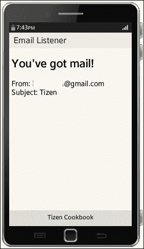

# 第二部分：创建 Tizen Web 应用程序

*构建用户界面*

*存储数据*

*创建多媒体应用*

*开发社交网络应用*

*管理通讯录和日历*

*通信*

*使用传感器*

# 第三章. 构建用户界面

本章将涵盖：

+   小部件概述

+   创建按钮

+   创建列表视图

+   显示弹出窗口

+   使用 Tizen 通知 API

+   自定义外观和感觉

+   在画布上绘制和书写文本

+   使用 WebGL 创建 3D 对象

# 简介

本书的这一章专注于图形用户界面。它包含了使用 Tizen Web UI 框架和 jQuery Mobile 创建按钮、列表、弹出窗口和通知的教程。我们还将介绍一些提高用户友好性的提示，并分享如何更容易地定制应用程序设计。此外，还包括了在 HTML5 画布上绘制 2D 和 3D 对象的参考指南。

# 小部件概述

Tizen Web UI 框架基于多个开源 JavaScript 库和框架：jQuery、jQuery Mobile 和 Globalize。

如今，jQuery Mobile 是最受欢迎的移动设备优化 Web 应用框架之一，Tizen 依赖于它也不足为奇。该框架基于流行的 JavaScript 库 jQuery。jQuery Mobile 是 jQuery 基金会的开源项目，且在 MIT 许可下发布。

## 准备工作

使用 Tizen Web UI 框架构建的 Tizen Web 应用程序的页面结构与 jQuery Mobile 类似。一个典型页面包含：

+   页头

+   内容

+   页脚

Tizen UI 框架提供的大多数小部件基于 jQuery Mobile。还有一些新设计的小部件，以与 Tizen 本地 UI 匹配的方式提供。

以下表格按字母顺序列出了截至 Tizen SDK 2.2.1 版本，Tizen UI 框架提供的所有小部件：

| 小部件 | 简要描述 |
| --- | --- |
| 自动分隔符 | 在列表项之间自动添加分隔符。jQuery Mobile 的列表也有类似的选项。 |
| 按钮 | 基本的推送按钮，继承自 jQuery Mobile。 |
| 复选框 | 显示标准复选框，用户可以选择是否选中。通常，多个复选框会被分组在一起，用户可以同时选择多个选项。此组件也来自 jQuery Mobile。 |
| 日期、时间或日期时间选择器 | 简化日期和/或时间输入的小部件。 |
| 可扩展列表 | 提供可扩展的列表视图。 |
| 快速滚动 | 简化滚动并加快滚动速度。 |
| 翻转开关 | 类似于单选按钮，显示一个带有两个选项的开关。例如：开/关。这个小部件在 jQuery Mobile 中也有类似的实现。 |
| 底部 | 从 jQuery Mobile 继承的一个基本小部件。它位于页面的底部。 |
| 画廊 | 用于显示图片的小部件。 |
| 3D 画廊 | 一个允许显示图片进行 3D 排列的小部件。 |
| 处理程序 | 为触摸屏设备优化的滚动条。 |
| 头部 | jQuery Mobile 中的另一个基本小部件。它位于页面的顶部。 |
| HTML 块 | 一个包含自定义 HTML 代码的小部件。 |
| 列表 | 具有多个项的列表视图，可以自定义外观。这个小部件与 jQuery Mobile 中的相同。 |
| 列表分隔符 | 列表中的一个特殊项，充当分隔符。它方便进行分组，同时也来自 jQuery Mobile。 |
| 多媒体视图 | 一个提供音频和视频播放器的小部件。 |
| 通知 | 当事件发生时显示的信息小部件。 |
| 弹出窗口 | 一个可自定义的小部件，用于在单独的窗口中显示信息。它具有与同名 jQuery Mobile 小部件相同的方法和事件。 |
| 进度 | 表示当前有一个操作正在进行。 |
| 进度条 | 使用百分比指示正在进行的操作的进度。这个小部件取自 jQuery UI。 |
| 搜索过滤栏 | 一个过滤器，简化了在大量文本数据中搜索的过程。这个小部件在 jQuery Mobile 中也存在。 |
| 滑块 | 另一个来自 jQuery Mobile 的小部件。它收集用户在开发者定义的范围内选择的值。 |
| 拆分视图 | 将内容拆分成多个不同的视图显示在屏幕上。 |
| 滑动 | 一个高级列表小部件，列表项可以滑动，并且按钮可以出现在每个项的位置。 |
| 标签栏 | 将按钮捆绑成一个组。建议将其放置在页面的头部或底部。 |
| 令牌文本区域 | 一个复杂的小部件，将用户输入的文本转换为按钮。 |
| 虚拟网格 | 一个优化加载和显示大量数据的表格小部件。 |
| 虚拟列表 | 一个优化加载和显示大量数据的列表小部件。 |

## 如何做到…

使用以下 HTML5 源代码创建一个页面，页面包含一个带有标题和按钮的头部，一个包含列表的内容和一个底部：

```
<div data-role="page">
  <div data-role="header" data-position="fixed">
    <h1>Tizen</h1>
    <div data-role="button" data-icon="plus" class="naviframe-edit">Add</div>
    </div>
  <div data-role="content">
    <ul data-role="listview">
      <li data-role="list-divider">Chapter 3</li>
      <li>Building UI</li>
      <li>Creating Buttons</li>
      <li>Creating List Views</li>
    </ul>
    </div>
    <div data-role="footer" data-position="fixed">
    <h4>Packt Publishing</h4>
  </div>
</div>
```

## 它是如何工作的…

HTML5 代码示例演示了基于 jQuery Mobile 的 Tizen UI Web 框架的使用方法。

一个页面是通过带有`data-role`属性和值“page”的`div`标签创建的。在 HTML 中，带有`div`关键字的标签用于定义文档的一个部分。头部和底部是以类似的方式创建的。头部包含一个标记为`h1`的标题和一个按钮，按钮的图标通过`data-icon`属性设置。`data-icon`的值应该与 jQuery Mobile 提供的可用图标集中的选项匹配。此示例使用的是`plus`。

页面中的主要组件位于一个`div`元素中，该元素位于页头和页脚之间，并且该部分标记为`data-role="content"`。本食谱上一节的示例展示了列表和列表分隔符小部件的用法。

## 另请参见

+   请参考 Tizen Web 应用编程的食谱，*Tizen 生态系统介绍*，来创建一个 Web 应用程序。用前面的示例替换`index.html`的主体部分来试试。

+   关于 Tizen UI 框架中小部件的更多信息，请参考官方文档：[`developer.tizen.org/dev-guide/2.2.1/org.tizen.web.uiwidget.apireference/html/widgets/widget_reference.htm`](https://developer.tizen.org/dev-guide/2.2.1/org.tizen.web.uiwidget.apireference/html/widgets/widget_reference.htm)。

# 创建按钮

本食谱展示了如何创建一个 Tizen Web 应用程序并创建按钮，如何处理用户点击这些按钮时的事件。

## 准备工作

Tizen UI Web 框架中的按钮可以通过以下三种方式中的任何一种来创建：

+   使用 HTML5 元素，如`anchor`或`div`，并添加属性`data-role="button"`

+   使用 HTML5 的`button`元素

+   使用 HTML5 的`input`元素

### 注意

Tizen UI Web 框架基于 jQuery Mobile，类似的规则也适用于按钮。详细信息请访问[`developer.tizen.org/dev-guide/2.2.1/org.tizen.web.uiwidget.apireference/html/widgets/widget_button.htm`](https://developer.tizen.org/dev-guide/2.2.1/org.tizen.web.uiwidget.apireference/html/widgets/widget_button.htm)。

根据情况，您可以自由选择最适合您的方式来创建按钮。

现在我们准备好创建按钮了，让我们继续开发整个应用程序。

## 如何做...

1.  启动 Tizen IDE，并启动一个新的 Tizen Web 项目。

1.  使用 Tizen Web UI 框架创建单页面应用程序。

1.  打开`index.html`，并用以下源代码替换`body`元素的内容：

    ```
    <div data-role="page">
      <div data-role="header" data-position="fixed">
        <h1>Buttons </h1>
      </div><!-- /header -->
      <div data-role="content">
        <p id="label">Please click a button.</p>
        <a id="btn1" href="#" data-role="button">Button 1</a>
        <button id="btn2">Button 2</button>
        <input type="button" id="btn3" value="Button 3" />
      </div>
      <div data-role="footer" data-position="fixed">
        <h4>Tizen Cookbook</h4>
      </div><!-- /footer -->
    </div><!-- /page -->
    ```

1.  打开`js/main.js`，并将以下源代码附加到分配给变量`init`的 JavaScript 匿名（lambda）函数中：

    ```
    $('#btn1').bind( "click", function(event, ui) {
      $('#label').text('Button 1 clicked.');
    });

    $('#btn2').bind( "click", function(event, ui) {
      $('#label').text('Button 2 clicked.');
    });

    $('#btn3').bind( "click", function(event, ui) {
      $('#label').text('Button 3 clicked.');
    });
    ```

1.  保存所有更改，并在真实设备、模拟器或仿真器上运行该应用程序。如果一切正常，当点击按钮时，带有`id`标签的段落文本将会被更改。

## 工作原理…

插入到`index.html`中的 HTML5 源代码创建了一个包含页头、页脚、带有`id`标签的单一段落和三个 ID 为`btn1`、`btn2`和`btn3`的按钮的页面。每个按钮都使用框架提供的不同选项之一创建，但视觉上它们看起来相同。

插入到 JavaScript 文件中的源代码基于 jQuery 库。第一行将 ID 为`btn1`的按钮的点击事件绑定到一个处理该事件的函数上。请看以下代码行：

```
$('#btn1').bind( "click", function(event, ui) {
```

美元符号是`jQuery()`的别名。这个函数根据提供的选择器返回 HTML 文档中元素的集合。此教程中的代码片段使用了 ID 选择器。jQuery 以其强大的 DOM 元素访问工具而著名。支持的选择器的完整列表可以在[`api.jquery.com/category/selectors/`](http://api.jquery.com/category/selectors/)上找到。

下一行使用 jQuery 提供的`text()`方法来更改段落标签的文本。请看下面的代码行：

```
$('#label').text('Button 1 clicked.');
```

### 注意

需要注意的是，根据包含在 Tizen SDK 2.2.1 中的 jQuery Mobile 1.3.2 的文档，必须使用`$(document).bind('pageinit')`而不是`$(document).ready()`。请注意，在 jQuery Mobile 1.4 中，`pageinit`事件已被`pagecreate`替代。

如果事件处理程序没有绑定到按钮的适当位置，它们很可能无法正常工作。请注意，它们必须作为匿名函数实现，并分配给变量`init`。之后，`init`会绑定到`pageinit`事件，因此匿名函数将在页面初始化时执行。请看下面的代码行：

```
$(document).bind( 'pageinit', init );
```

匿名函数是 JavaScript 的第一类公民。它们最常用于回调函数——即在事件发生或稍后某个时间异步执行的函数。虽然这种使用匿名函数通常非常方便，但你需要注意它；否则，可能会陷入所谓的回调地狱。关于如何编写和维护易于阅读的 JavaScript 回调函数的良好建议，可以参考[`callbackhell.com/`](http://callbackhell.com/)。

## 另见

+   本教程中示例应用程序的项目文件已经包含在书籍的源代码中。如果你在实现示例时遇到困难，请查阅其源代码。

# 创建列表视图

开发者中有一个流行的老笑话，认为没有列表的移动应用程序就不算好。这个控件对于存储大量数据非常方便，尤其是在屏幕较小的设备上，如智能手机或智能手表。

本教程解释了如何创建一个包含多个项目、项目分隔符和搜索过滤器的列表视图的多页面应用程序。

尽管多页面应用程序听起来很炫，但实际上它只是包含两个或更多 Tizen UI Web 框架页面的应用程序，而且创建这样的应用程序非常简单。

## 准备工作

Tizen UI Web 框架中的列表使用 HTML5 元素创建，分别是有序列表`ol`和无序列表`ul`，并结合`data-role="listview"`。

## 如何做到……

1.  创建一个新的项目，使用**Tizen Web UI Framework**的**多页面应用程序**模板。

1.  从**项目资源管理器**中创建一个新的文件夹`images`。

1.  使用您的绘图应用程序创建一个简单的图标，并将其保存在 `images` 文件夹中，文件名为 `smile``.``png`。

1.  打开 Tizen IDE 中的 `index.html`，并用以下源代码替换 `body` 元素的内容：

    ```
    <div data-role="page" id="pageMain">
      <div data-role="header" data-position="fixed">
        <h1>List View</h1>
      </div><!-- /header -->

      <div data-role="content">
        <ul data-role="listview">
          <li data-role="list-divider">Samples</li>
          <li><a href="#pageInfo">Foo</a></li>
          <li><a href="#pageInfo">Bar <span data-role="button" data-inline="true" data-icon="arrow-r"></span></a></li>
            <li class="ui-li-has-multiline"><a href="#pageInfo">
    Foo
    <span class="ui-li-text-sub">Bar</span><span data-role="button" data-inline="true" data-icon="info"
    data-style="circle"></span></a></li>
        </ul>
      </div><!-- /content -->
      <div data-role="footer" data-position="fixed">
        <h4>Tizen Cookbook</h4>
      </div><!-- /footer -->
    </div><!-- /pageMain -->
    <div data-role="page" id="pageInfo" data-add-back-btn="true">
      <div data-role="header" data-position="fixed">
        <h1>Read-only List</h1>
      </div><!-- /header -->
      <div data-role="content">
        <ul data-role="listview">
          <li>baz</li>
          <li>qux</li>
        </ul>
      </div><!-- /content -->
      <div data-role="footer" data-position="fixed">
        <h4>Tizen Cookbook</h4>
      </div><!-- /footer -->
    </div><!-- /pageInfo -->
    ```

1.  保存所有更改，并在模拟器或设备上运行应用。应用应显示如下：

    列表视图

## 它是如何工作的...

前面示例应用中的 `body` 元素源代码只包含 HTML5 和 CSS。

两个页面被创建在两个不同的 `div` 元素中，每个页面都包含 `data-role="page"`。两个页面都包含页头、页脚和列表。

第一个页面的 `id` 标签为 `pageMain`。列表中的每个项是通过 `li` 元素创建的。该列表包含以下项：

+   使用属性 `data-role` 的值为 `list-divider` 创建的列表分隔符。请查看以下代码行：

    ```
    <li data-role="list-divider">Samples</li>
    ```

+   一个简单的项。请查看以下代码行：

    ```
    <li><a href="#pageInfo">Foo</a></li>
    ```

+   一个在文本右侧带按钮的项。按钮是通过 `span` 元素创建的，具有默认样式，并通过属性 `data-icon` 设置了右箭头图标。请查看以下代码片段：

    ```
    <li><a href="#pageInfo">Bar <span data-role="button" data-inline="true" data-icon="arrow-r"></span></a></li>
    ```

+   一个包含左侧图片（`img`）和右侧按钮的两行项。按钮的样式为 `circle`，图标为 `info`。CSS 类 `ui-li-as-multiline` 用于启用多行显示，`ui-li-text-sub` 类则标记第二行：

    ```
    <li class="ui-li-has-multiline"><a href="#pageInfo">
    Foo
    <span class="ui-li-text-sub">Bar</span><span data-role="button" data-inline="true" data-icon="info"
    data-style="circle"></span></a></li>
    ```

第二页显示了一个简单的只读列表，`id` 为 `pageInfo`。显示在页脚的返回按钮实际上是通过 `data-add-back-btn="true"` 设置在页面的 `div` 元素上的：

```
<div data-role="page" id="pageInfo" data-add-back-btn="true">
```

## 另见

+   请查看 Tizen 文档，查看支持的列表小部件样式的完整列表，网址为[`developer.tizen.org/dev-guide/2.2.1/org.tizen.web.uiwidget.apireference/html/widgets/widget_list.htm`](https://developer.tizen.org/dev-guide/2.2.1/org.tizen.web.uiwidget.apireference/html/widgets/widget_list.htm)。

# 显示弹出窗口

你还记得那种丑陋的 JavaScript 内建函数 `alert()` 和 `confirm()` 吗？虽然它们很有用，但它们的设计停留在 1990 年代，需要现代移动应用的替代品。

Tizen Web UI 框架提供了外观更好、设计可定制的弹出窗口，能够满足您的应用需求。在本教程中，我们将创建一个包含按钮的单页面应用，按钮点击后会弹出窗口。

## 如何实现...

1.  启动 Tizen IDE，创建一个新的 Tizen Web 项目。

1.  使用 Tizen Web UI 框架创建一个单页面应用。

1.  打开 `index.html`，并用以下源代码替换 `body` 元素的内容：

    ```
    <div id="popupConfirm" data-role="popup" class="center_title_2btn">
      <div class="ui-popup-title">
        <h1>Mathematical Joke</h1>
      </div>
      <div class="ui-popup-text">There are only 10 types of people in the world: those who understand binary, and those who don't. Right?</div>
      <div class="ui-popup-button-bg">
      <a id="btnConfirmYes" href="#" data-rel="back" data-role="button" data-inline="true">Yes</a>
      <a id="btnConfirmNo" href="#" data-rel="back" data-role="button" data-inline="true">No</a>
       </div>
    </div>
    <div data-role="page">
      <div data-role="header" data-position="fixed">
        <h1>Showing Pop-ups</h1>
      </div><!-- /header -->
      <div data-role="content">
        <p id="label">Click the button below to open a pop-up.</p>
        <a href="#popupConfirm" id="btnConfirm" data-role="button">Push Me!</a>
      </div><!-- /content -->
      <div data-role="footer" data-position="fixed">
        <h4>Tizen Cookbook</h4>
      </div><!-- /footer -->
    </div><!-- /page 
    ```

1.  打开 `js/main.js`，将以下源代码插入到分配给变量 `init` 的匿名 JavaScript 函数中。请查看以下代码：

    ```
    $('#btnConfirmYes').bind( "click", function(event, ui) {
      $('#label').text('Absolutely!');
    });
    $('#btnConfirmNo').bind( "click", function(event, ui) {
      $('#label').text('Sorry! It seems that you didn\'t get the binary joke.');
    });
    ```

1.  运行应用，享受这段旧但经典的二进制笑话。

## 它是如何工作的...

第三步附加到`index.html`的 HTML5 代码包含一个页面和一个带有两个按钮的弹出窗口。该弹出窗口由具有`id popupConfirm`和`data-role="popup"`的`div`元素表示。CSS 类`center_title_2btn`定义了它的类型。其他可用的类型如下：

+   `center_info`

+   `center_title`

+   `center_basic_1btn`

+   `center_title_1btn`

+   `center_title_2btn`

+   `center_title_3btn`

+   `center_button_vertical`

+   `center_checkbox`

+   `center_liststyle_1btn`

+   `center_liststyle_2btn`

+   `center_liststyle_3btn`

### 注意

除了`center_button_vertical`外，所有有多个按钮的类型中，按钮都会水平排列在一起。

附加到`main.js`中的 JavaScript 将处理程序绑定到弹出窗口的按钮上。根据用户的选择，具有`id`标签的段落文本内容会发生变化。

Tizen Web UI 框架和 jQuery Mobile 不支持弹出窗口的链式调用。这意味着无法从一个弹出窗口调用另一个弹出窗口。从设计角度来看，也不建议使用弹出窗口链式调用，因为它会对用户体验产生负面影响。不过，如果你坚持使用，可以通过在`popupafterclose`事件之后实现`setTimeout()`，在关闭第一个弹出窗口后，使用最短的超时来打开下一个弹出窗口。

## 另见

+   请参考 Tizen Web UI 和 jQuery Mobile 文档，查看所有事件和方法的完整列表，以及有关弹出窗口类型的详细信息，网址：[`developer.tizen.org/dev-guide/2.2.1/org.tizen.web.uiwidget.apireference/html/widgets/widget_popup.htm`](https://developer.tizen.org/dev-guide/2.2.1/org.tizen.web.uiwidget.apireference/html/widgets/widget_popup.htm)。

# 使用 Tizen 通知 API

通知 API 允许开发者向用户显示应用外的消息。当用户需要了解事件或正在进行的过程的状态时，通知就很有用。它们显示在一个共享的位置，供各个应用程序和系统的通知使用。

按照本教程中的步骤，学习如何使用 Tizen 通知 API 在 Tizen 中显示`SIMPLE`和`PROGRESS`通知。

## 准备工作

Tizen 中存在几种不同类型的通知：

+   `SIMPLE`：这是一种`基本文本`通知

+   `THUMBNAIL`：该通知包含文本和缩略图

+   `ONGOING`：这是一种通知，告知用户应用程序是否正在运行

+   `PROGRESS`：这提供了关于任务当前状态及其进度的信息

前两种类型的通知可以由用户移除。其他类型的通知则无法由用户移除，应用程序应负责移除这些通知。通知 API 非常灵活，作为开发者，你可以选择完全符合应用需求的通知类型。

## 如何操作...

1.  启动 Tizen IDE，创建一个新的 Tizen Web 项目。

1.  使用 Tizen Web UI 框架创建单页应用程序。

1.  将以下 HTML 代码插入到`index.html`的 body 中，以创建两个按钮：

    ```
    <div data-role="page">
     <div data-role="header" data-position="fixed">
     <h1>Using Tizen Notification API</h1>
     </div><!-- /header -->

     <div data-role="content">
     <button id="btnSimpleNotification">Simple Notification</button>
     <button id="btnProgressNotification">Progress Notification</button>
     </div><!-- /content -->

     <div data-role="footer" data-position="fixed">
     <h4>Tizen Cookbook</h4>
     </div><!-- /footer -->
    </div><!-- /page -->

    ```

1.  将以下 JavaScript 函数粘贴到`main.js`中：

    ```
    function postSimpleNotification()
      {
        try {
          var notificationDict = {
            content: "Hello World."
          };
            simpleNotification = new tizen.StatusNotification("SIMPLE",
              "Notification", notificationDict);
              tizen.notification.post(simpleNotification);
        } catch (err) {
          console.log("Unable to post simple notification.");
        }
    }

    function postProgressNotification()
      {
        try {
          var notificationDict = {
            content: "Please wait..."
            };
            progressNotification = new tizen.StatusNotification("PROGRESS",
              "Progess", notificationDict);
              tizen.notification.post(progressNotification);
        } catch (err) {
          console.log("Unable to post progress notification.");
        }
    }

    function updateProgressNotification()
     {
    ```

    这个函数以及此处其他函数使用了 try-catch 块来处理异常，比如`WebAPIException`。如果发生错误，Notification API 的方法会抛出这些异常。

    `try`语句定义了一个代码块，在该块中应测试源代码是否有错误。必须使用关键字`throw`来抛出异常。异常终止了`try`块中源代码的执行，控制权传递给`catch`块。处理被拦截的异常的规则和命令在其中定义：

    ```
        try {
            progressNotification.content = "Almost done!";
            tizen.notification.update(progressNotification);
        } catch (err) {
            console.log("Unable to update progress notification.");
        }
    }

    function removeProgressNotification()
     {
      try {
        tizen.notification.remove(progressNotification.id);
      } catch (err) {
        console.log("unable to remove progress notification.");
      }
    }

    function runProgressDemo()
     {
      postProgressNotification();
    ```

    函数`setTimeout()`的第二个参数是延迟时间，单位为毫秒。6000 毫秒等于 6 秒，10000 毫秒等于 10 秒。请看以下代码：

    ```
    setTimeout(updateProgressNotification,6000);
    setTimeout(removeProgressNotification,10000);
    }
    ```

1.  通过将以下代码片段插入分配给变量`init`的匿名 JavaScript 函数中，绑定两个按钮的点击事件到上一阶段的 JavaScript 函数：

    ```
    $('#btnSimpleNotification').bind( "click", function(event, ui) {
      postSimpleNotification();
    });

    $('#btnProgressNotification').bind( "click", function(event, ui) {
      runProgressDemo();
    });
    ```

1.  将通知权限添加到`config.xml`：

    ```
    <tizen:privilege name="http://tizen.org/privilege/notification"/>
    ```

1.  保存所有修改过的文件，并运行应用程序。

## 它是如何工作的…

该应用程序包含一个单一应用和两个按钮。ID 为`btnSimpleNotification`的按钮的点击事件与 JavaScript 函数`postSimpleNotification()`绑定。当执行该函数时，屏幕上将显示一个标题为**Notification**，文本为**Hello World**的简单通知，如下所示：


简单通知

点击 ID 为`btnProgressNotification`的按钮将执行函数`runProgressDemo()`。一个标题为**Progress**，文本为**Please wait...**的进度通知被发布。6 秒后，它将被更新，文本更改为**Almost done!**。该通知在发生后 10 秒被移除。函数`updateProgressNotification()`负责更新，函数`removeProgressNotification()`负责移除通知。这两个函数的执行延迟通过使用 JavaScript 内置函数`setTimeout()`来实现。你可以查看添加到`main.js`的所有函数实现，以了解 Notification API 的使用方式。请看以下截图：


更新前后的进度通知

### 提示

可选地，通过在为通知创建的 JavaScript 对象中指定图像和/或音频文件的路径，可以添加图标和/或声音。

必须按照第 6 步所述添加权限，否则应用程序将无法正常工作，因为它将无法发布任何通知。使用设备或模拟器来测试和调试发布通知的应用程序。

## 另见

+   如果你有兴趣从服务器向 Tizen 设备推送通知，请查看第八章中的食谱*接收推送通知*，该章节属于*通信*部分。

+   要探索通知 API 的全部功能，请访问[`developer.tizen.org/dev-guide/2.2.1/org.tizen.web.device.apireference/tizen/notification.html`](https://developer.tizen.org/dev-guide/2.2.1/org.tizen.web.device.apireference/tizen/notification.html)。

# 自定义外观和样式

你是否曾经遇到过这样的情况：客户在项目进行中间改变了需求，你不得不修改整个应用程序的设计？或者，你是否曾经遇到过需要将相同的应用程序交付给不同的客户，但他们有不同的主题和图片的情况？

CSS 是用于描述 Web 应用程序外观和格式的语言。每个 Web 开发人员都应该熟悉它。不幸的是，复杂的 CSS 文件的维护和修改可能会很困难。你总是可以在 Tizen Web 应用中使用 CSS，但在描述的这种情况中，最简单的解决方案是依赖于 CSS 预处理器，比如**LESS**或**Sass**。

这个教程演示了 LESS 在 Tizen Web 应用中的基本用法。我希望通过这里获得的经验，你应该能够通过 LESS 生成复杂的 CSS。

## 准备工作

LESS 是一种开源的动态语言，它为 CSS 带来了变量、混合、操作和函数。LESS 可以通过 JavaScript 在客户端执行，也可以在服务器上执行。

### 注意

有效的 CSS 代码也是有效的 LESS 代码。

## 如何实现…

执行以下步骤从 LESS 在线生成 CSS。这个简单的示例更改了文本标题的字体和颜色：

1.  使用你喜欢的网页浏览器加载网站[`less2css.org/`](http://less2css.org/)。

1.  插入自定义颜色和字体的 LESS 源代码：

    ```
    @color1: #c0c0c0;
    @color2: #880000;
    @font: Arial, Helvetica, sans-serif;
    h1, h2, h3 {
      font-family: @font;
    }
    h1 {
      color: @color1;
      background-color: @color2;
    }
    h2 {
      color: @color2;
      background-color: @color2;
    }
    h3 {
      color: @color2;
    }
    ```

    ### 提示

    请随意通过修改 LESS 变量的值来更改颜色。

1.  将生成的 CSS 复制到剪贴板。CSS 应该类似于以下示例：

    ```
    h1, h2, h3 {
      font-family: Arial, Helvetica, sans-serif;
    }
    h1 {
      color: #c0c0c0;
      background-color: #880000;
    }
    h2 {
      color: #880000;
      background-color: #880000;
    }
    h3 {
      color: #880000;
    }
    ```

1.  在 Tizen IDE 的**项目资源管理器**视图中选择一个项目，右键单击它，然后选择**新建** | **CSS 文件**。按照屏幕上的指示完成文件的创建，文件名为`myHeadings.css`。

1.  将复制的内容粘贴到新创建的 CSS 文件中，并保存。

1.  在`index.html`中添加以下 HTML 代码，将 CSS 文件作为外部样式表加载到应用程序中：

    ```
    <link rel="stylesheet" type="text/css" href="myHeadings.css">
    ```

### 注意

这个示例的优势在于，只需要修改变量的值，就可以改变所有标题的颜色。LESS 的真正威力可以在包含大量样式表的大型项目中体现出来。

## 它是如何工作的…

LESS 通过由开源项目 less-preview 提供的在线工具编译为 CSS。该项目的源代码可以在 GitHub 上找到，并且使用 MIT 许可证，维护者是 Brian Frichette。有关详细信息，请访问 [`github.com/brian-frichette/less-preview/`](https://github.com/brian-frichette/less-preview/)。

上述示例中的 LESS 代码片段非常简单。前面三行声明并初始化了 LESS 变量。根据规则，变量以前缀 `@` 开头，后跟变量名。使用冒号来初始化其值。

字体系列通过 LESS 变量 `@font` 设置，其值在 `h1`、`h2` 和 `h3` 的 CSS 分组中设置：

```
h1, h2, h3 {
  font-family: @font;
}
```

其他 LESS 变量 `@color1` 和 `@color2` 用于设置标题的字体和背景颜色。

成功执行 LESS 源代码的输出是有效的 CSS。当 CSS 准备好后，必须按照步骤 3 至 6 中的说明将其加载到 Tizen Web 应用中。

## 另见

+   如果你有兴趣了解更多关于 CSS 预处理器的知识，可以通过 Alex Libby 编写的几本书来扩展你的知识：*Instant SASS CSS How-to* 和 *Instant LESS CSS Preprocessor How-to*。

# 在 canvas 上绘制和写入文本

HTML5 的主要优势之一是它可以替代 Adobe Flash 来进行绘图。HTML5 canvas 元素为在 Web 和移动应用程序或游戏中创建前沿动画开辟了新的视野。

本教程展示了在 Tizen Web 应用中使用 JavaScript 在 HTML5 canvas 上绘制和写入文本。按照本教程中的步骤创建一个包含两个按钮的单页面 Tizen Web 应用。第一个按钮写入文本 **Hello Tizen**，并绘制一个蓝色方块和一个橙色圆圈。第二个按钮清除屏幕。


在 Tizen Web 应用中绘制图形

## 准备工作

Canvas 是 HTML5 中引入的新元素。可以指定 canvas 的属性 `id`、`width` 和 `height`。默认情况下，canvas 是空的，应该使用 JavaScript 来创建和控制其内容。

## 如何操作...

1.  启动 Tizen IDE，并创建一个新的 **Tizen Web 项目**。

1.  使用 Tizen Web UI 框架创建 **单页面应用程序**。

1.  在项目资源管理器视图中右击项目，选择 **新建** | **其他** | **JavaScript** | **JavaScript 源文件** 来创建 `draw.js` 文件。

1.  将以下 JavaScript 代码保存到 `draw.js` 文件中：

    ```
    function draw()
    {
      var drawer = $('#pic')[0].getContext("2d");
      //write text
      drawer.fillStyle= '#000000';
      var nTextHeight = 20;
    ```

    HTML5 canvas 中的 `font` 属性支持与 CSS 字体相同的语法。Tizen 提供了一种专用的字体系列，称为 TizenSans，但在此应用程序中使用了流行的 Arial 字体。有关 Tizen 排版指南的更多信息，请访问 [`developer.tizen.org/documentation/ux-guide/visual-style/typography`](https://developer.tizen.org/documentation/ux-guide/visual-style/typography)。

    ```
      drawer.font= nTextHeight + "px Arial";
      drawer.fillText('Hello Tizen',0 , nTextHeight);
      //draw a blue square
      drawer.fillStyle= '#3366CC';
      var nSquareSide = 50;
      drawer.fillRect(0, nTextHeight+10, nSquareSide, nSquareSide);
      //draw an orange circle
      drawer.fillStyle='#FF6600';
      drawer.beginPath();
      var nRadius = 25;
      var nCenterX = nSquareSide + nRadius + 10;
      var nCenterY = nTextHeight + 10 + nRadius;
      drawer.arc(nCenterX, nCenterY, nRadius, 0, 2*Math.PI);
      drawer.fill();
    }

    function clear()
    {
      var canvas = $('#pic')[0];
      var drawer = canvas.getContext("2d");
      drawer.clearRect(0, 0, canvas.width, canvas.height );
    }
    ```

1.  在`index.html`中，在加载`main.js`之前包含新的 JavaScript 文件。请查看以下代码：

    ```
    <script type="text/javascript" src="img/draw.js"></script>
    ```

1.  在 `index.html` 的 body 部分插入以下 HTML 来创建画布和几个按钮：

    ```
    <div data-role="page">
      <div data-role="header" data-position="fixed">
        <h1>Drawing Demo</h1>
      </div><!-- /header -->

      <div data-role="content">
        <canvas id="pic" width="200" height="200"></canvas>
        <button id="btnDraw">Draw</button>
        <button id="btnClear">Clear</button>
      </div><!-- /content -->

      <div data-role="footer" data-position="fixed">
        <h4>Tizen Cookbook</h4>
      </div><!-- /footer -->
    </div><!-- /page -->
    ```

1.  通过向分配给`main.js`中`init`变量的匿名 JavaScript 函数添加以下源代码来处理按钮点击事件：

    ```
    $('#btnDraw').bind( "click", function(event, ui) {
      draw();
    });
    $('#btnClear').bind( "click", function(event, ui) {
      clear();
    });
    ```

1.  保存所有文件，并在设备或模拟器上运行应用程序。

## 工作原理……

在`index.html`中创建了一个 ID 为`pic`、宽度和高度均为 200 px 的画布，代码如下：

```
<canvas id="pic" width="200" height="200"></canvas>
```

ID 为`btnDraw`和`bntClear`的按钮的点击事件分别调用 JavaScript 函数`draw()`和`clear()`。这两个函数都在文件`draw.js`中实现。

### 注意

在`index.html`文件的`head`部分，必须在加载`main.js`之前加载`draw.js`，否则应用程序将无法正常工作。

JavaScript 函数`draw()`使用画布对象上的`fillText()`在屏幕上写入文本。之后，它调用画布对象的函数`fillRect()`并绘制一个边长为 25 px 的蓝色正方形。最后，执行函数`arc()`和`fill()`来绘制一个半径为 25 px 的橙色圆圈。

### 提示

坐标 (0, 0) 对应绘图区域的左上角。

## 另见

+   所有在 HTML5 画布上绘制的技巧都应该适用于 Tizen Web 应用程序。更多关于绘图和动画的 HTML5 示例可以在 Eric Rowell 的书《*HTML5 Canvas Cookbook*》中找到。

# 使用 WebGL 创建 3D 对象

二十年前，3D 图形和 OpenGL 主要仅限于 CAD 软件和游戏。那时的网站非常简单。时代变了，Web 技术有了显著发展。如今，得益于 WebGL，可以通过 JavaScript API 在 HTML5 画布中直接创建复杂的跨平台 3D 动画和游戏。

WebGL 的故事始于 2006 年，但它首次正式发布是在 2011 年。今天，一个名为 Khronos Group 的非盈利组织负责 WebGL 的标准。WebGL 基于 OpenGL ES，OpenGL 是一个高性能的 2D 和 3D 图形 API，而 ES 是它针对嵌入式设备的版本。WebGL 由 Khronos Group 发起的工作组维护，Apple、Google、Mozilla 等领先厂商的员工都是该工作组的成员。

这个高级示例演示了如何通过绘制一个在 Tizen Web 应用程序中顺时针旋转的立方体来创建 3D 动画。在启动应用程序后，用户必须点击**播放**按钮才能开始动画，如下图所示：


WebGL 在 Tizen 上的演示

## 准备工作

此应用程序基于可在 Khronos Group 的公共 GitHub 存储库上找到的旋转 WebGL 盒子示例。根据其版权声明，本示例使用了由 Apple、Google 和 Khronos Group 版权所有的几个外部 JavaScript 文件。有关其许可证和使用条款的详细信息，请阅读每个文件开头的注释。

## 如何做...

1.  启动 Tizen IDE，并开始一个新的 Tizen Web 项目。

1.  使用 Tizen Web UI Framework 创建一个单页应用程序。

1.  访问 Khronos Group 的 WebGL GitHub 存储库，网址为 [`github.com/KhronosGroup/WebGL`](https://github.com/KhronosGroup/WebGL)，以查找、下载并保存以下文件到项目的 `js` 目录中：

    +   `webgl-utils.js`

    +   `webgl-debug.js`

    +   `J3DI.js`

    +   `J3DIMath.js`

1.  在 **Project Explorer** 视图中项目上右键单击，导航到 **New** | **Other** | **JavaScript** | **JavaScript Source File**，创建文件 `draw.js`。

1.  将以下 JavaScript 源代码插入到新创建的文件 `draw.js` 中。查看下面的代码：

    ```
    var g_nCurrentRotation = 360;
    var g_nRotationAngle = 1.0;
    var global = {};
    var g_nRequestId = 0;

    function setupColors(webGL)
    {
      var colors = new Uint8Array(
            [  0, 1, 0, 1,   0, 1, 0, 1,   0, 1, 0, 1,   0, 1, 0, 1, //main - green
               0, 0, 1, 1,   0, 0, 1, 1,   0, 0, 1, 1,   0, 0, 1, 1, // right - blue
               1, 0, 0, 1,   1, 0, 0, 1,   1, 0, 0, 1,   1, 0, 0, 1, //top - red
               1, 1, 0, 1,   1, 1, 0, 1,   1, 1, 0, 1,   1, 1, 0, 1, //left - yellow
               0, 0, 0, 1,   0, 0, 0, 1,   0, 0, 0, 1,   0, 0, 0, 1, // bottom - black
               0, 0, 0, 1,   0, 0, 0, 1,   0, 0, 0, 1,   0, 0, 0, 1 ]// back - black
                                                );
        // Set up the vertex buffer for the colors
        global.box.colorObject = webGL.createBuffer();
        webGL.bindBuffer(webGL.ARRAY_BUFFER, global.box.colorObject);
        webGL.bufferData(webGL.ARRAY_BUFFER, colors, webGL.STATIC_DRAW);
    }
    ```

    前面的代码片段声明了几个全局变量，并将它们初始化为默认值。它还包括一个名为 `setupColors()` 的函数，用于设置立方体每一面的颜色。下面的源代码实现了名为 `init()` 的函数，用于准备绘图区域，必须插入到同一文件中：

    ```
    function init()
    {
        var canvas = document.getElementById('screen');
        var webGL = WebGLUtils.setupWebGL(canvas);
        if (!webGL) {
          return;
        }
        global.program = simpleSetup(
            webGL, "vshader", "fshader",
            [ "vNormal", "vColor", "vPosition"], [ 1, 1, 1, 1 ], 10000);
    ```

    下面这行代码为着色器设置一个统一变量，它接受形状数据并将其转换为屏幕上的像素：

    ```
        webGL.uniform3f(webGL.getUniformLocation(global.program, "lightDir"), 0, 0, 1);

        global.box = makeBox(webGL);

        setupColors(webGL);
    ```

    将从类 `J3DIMatrix4` 创建的多个 4 x 4 矩阵用于 `draw()` 函数中的向量变换：

    ```
        global.mvMatrix = new J3DIMatrix4();
        global.u_normalMatrixLoc = webGL.getUniformLocation(global.program, "u_normalMatrix");
        global.normalMatrix = new J3DIMatrix4();
        global.u_modelViewProjMatrixLoc = webGL.getUniformLocation(global.program, "u_modelViewProjMatrix");
        global.mvpMatrix = new J3DIMatrix4();

        webGL.enableVertexAttribArray(0);
        webGL.enableVertexAttribArray(1);
        webGL.enableVertexAttribArray(2);

        webGL.bindBuffer(webGL.ARRAY_BUFFER, global.box.vertexObject);
        webGL.vertexAttribPointer(2, 3, webGL.FLOAT, false, 0, 0);

        webGL.bindBuffer(webGL.ARRAY_BUFFER, global.box.normalObject);
        webGL.vertexAttribPointer(0, 3, webGL.FLOAT, false, 0, 0);
        webGL.bindBuffer(webGL.ARRAY_BUFFER, global.box.colorObject);
        webGL.vertexAttribPointer(1, 4, webGL.UNSIGNED_BYTE, false, 0, 0);

        webGL.bindBuffer(webGL.ELEMENT_ARRAY_BUFFER, global.box.indexObject);

        return webGL;
    }
    ```

    下一个函数设置视口。最初，对象用建模坐标表示，然后转换为世界坐标，再转换为视图坐标，最终转换为视口坐标。因此，3D 场景被转换为在设备屏幕上显示的 2D 投影：

    ```
    function setupView(webGL)
    {
        var canvas = document.getElementById('screen');
        webGL.viewport(0, 0, canvas.width, canvas.height);
        global.perspectiveMatrix = new J3DIMatrix4();
        global.perspectiveMatrix.perspective(30, 1, 1, 10000);
        global.perspectiveMatrix.lookat(0, 0, 7, 0, 0, 0, 0, 1, 0);
    }
    ```

    现在是实现这些示例中最重要功能 `draw()` 的时候了。它负责绘制动画的每一帧。请将以下源代码附加到 `draw.js` 文件中：

    ```
    function draw(webGL)
    {
        setupView(webGL);
    ```

    在绘制任何东西之前，请确保画布是干净的。看看下面的代码片段：

    ```
        webGL.clear(webGL.COLOR_BUFFER_BIT | webGL.DEPTH_BUFFER_BIT);

        global.mvMatrix.makeIdentity();
        global.mvMatrix.rotate(20, 1,0,0);
        global.mvMatrix.rotate(g_nCurrentRotation, 0,1,0);

        global.normalMatrix.load(global.mvMatrix);
        global.normalMatrix.invert();
        global.normalMatrix.transpose();
        global.normalMatrix.setUniform(webGL, global.u_normalMatrixLoc, false);

        global.mvpMatrix.load(global.perspectiveMatrix);
        global.mvpMatrix.multiply(global.mvMatrix);
        global.mvpMatrix.setUniform(webGL, global.u_modelViewProjMatrixLoc, false);

        webGL.drawElements(webGL.TRIANGLES, global.box.numIndices, webGL.UNSIGNED_BYTE, 0);

        //Enable clockwise rotation
        g_nCurrentRotation -= g_nRotationAngle;
        if (0 > g_nCurrentRotation) {
            g_nCurrentRotation = 360;
        }
    }

    function pause(event) {
      event.preventDefault();
        if (undefined !== g_nRequestId) {
            window.cancelAnimFrame(g_nRequestId);
            g_nRequestId = undefined;
        }
    }

    function resume() {
        init();
        animate();
    }

    function run() {
        var canvas = document.getElementById('screen');
        canvas.addEventListener('webglcontextlost', pause, false);
        canvas.addEventListener('webglcontextrestored', resume, false);

        var webGL = init();
        if (!webGL) {
          return;
        }

        var animate = function() {
            draw(webGL);
            g_nRequestId = window.requestAnimFrame(animate, canvas);
        };
        animate();
    }
    ```

1.  打开 `index.html`，并用以下代码替换它的内容：

    ```
    <!DOCTYPE html>
    <html>

    <head>
        <meta charset="utf-8"/>
        <meta name="description" content="WebGL 3D demonstration app for Tizen"/>
        <meta name="viewport" content="width=device-width,user-scalable=no"/>

        <link rel="stylesheet" href="tizen-web-ui-fw/latest/themes/tizen-white/tizen-web-ui-fw-theme.css" name="tizen-theme"/>
        <title>WebGL 3D</title>
        <script src="img/jquery.js"></script>
        <script src="img/tizen-web-ui-fw-libs.js"></script>
        <script src="img/tizen-web-ui-fw.js"
            data-framework-theme="tizen-white"></script>
        <script type="text/javascript" src="img/webgl-utils.js"></script>
        <script type="text/javascript" src="img/webgl-debug.js"></script>

        <script type="text/javascript" src="img/J3DI.js"></script>
        <script type="text/javascript" src="img/J3DIMath.js"></script>

        <script type="text/javascript" src="img/main.js"></script>
        <link rel="stylesheet" type="text/css" href="./css/style.css"/>
    ```

    在 HTML `head` 中插入以下两个脚本以实现一个顶点着色器，负责处理每个渲染三角形的每个角落：

    ```
        <script id="vshader" type="x-shader/x-vertex">
        uniform mat4 u_modelViewProjMatrix;
        uniform mat4 u_normalMatrix;
        uniform vec3 lightDir;

        attribute vec3 vNormal;
        attribute vec4 vColor;
        attribute vec4 vPosition;

        varying float v_Dot;
        varying vec4 v_Color;

        void main()
        {
            gl_Position = u_modelViewProjMatrix * vPosition;
            v_Color = vColor;
            vec4 transNormal = u_normalMatrix * vec4(vNormal, 1);
            v_Dot = max(dot(transNormal.xyz, lightDir), 0.0);
        }
        </script>
    ```

    下面的源代码实现了一个片段着色器。它在每个转换三角形的每个像素上应用纹理和光照：

    ```
        <script id="fshader" type="x-shader/x-fragment">
        precision mediump float;

        varying float v_Dot;
        varying vec4 v_Color;

        void main()
        {
            gl_FragColor = vec4(v_Color.xyz * v_Dot, v_Color.a);
        }

        </script>

        <script type="text/javascript" src="img/draw.js"></script>

    </head>
    ```

    继续通过附加 HTML `body` 的源代码如下。这将创建一个用户界面，通过几个按钮来控制动画：

    ```
    <body>
        <div data-role="page">
            <div data-role="header" data-position="fixed">
                <h1>WebGL 3D</h1>
            </div><!-- /header -->

            <div data-role="content" style="background-color: #FFFFFF;">
                <button id="btnPlay">Play</button>
                <canvas id="screen" width="200" height="200"></canvas>
            </div><!-- /content -->

            <div data-role="footer" data-position="fixed">
                <h4>Tizen Cookbook</h4>
            </div><!-- /footer -->
        </div><!-- /page -->
    </body>
    </html>
    ```

1.  打开 `main.js` 并将函数 `run()` 注册为按钮 **Play** 的处理程序，如下所示：

    ```
    $('#btnPlay').bind( "click", function(event, ui) {
        run();
        $('#btnPlay').button( "disable" );
    });
    ```

1.  保存所有更改，并在 Tizen 设备或模拟器上运行应用程序。

### 注意

本项目的完整源代码随书提供。该应用已在 Tizen 2.2.1 版本的设备上成功测试。

## 它是如何工作的…

所有外部 JavaScript 文件都在`index.html`的头部加载。步骤 3 中下载的文件提供了基本功能，简化了 WebGL 的常见使用。顶点和片段着色器的脚本也在`index.html`中，ID 分别为`vshareds`和`fshaders`。

页面主内容的`div`元素上放置了 ID 为`btnPlay`的按钮和 ID 为`screen`的画布。画布用作绘图区域，其宽度和高度均为 200 px。

动画在点击`btnPlay`按钮时开始，按钮随之变为禁用。动画的入口点是 JavaScript 函数`run()`，它在`draw.js`文件中实现。通过同一文件中的`init()`函数初始化 WebGL 上下文。此外，`pause()`和`resume()`函数分别绑定到画布的`webglcontextlost`和`webglcontextrestored`事件。

当前的旋转状态存储在全局 JavaScript 变量`g_nCurrentRotation`中，初始值为 360。每次动画的旋转角度由另一个全局 JavaScript 变量`g_nRotationAngle`定义。

### 提示

增加`g_nRotationAngle`的值以加快旋转速度，减少该值则会减慢旋转速度。

通过函数`makeBox()`创建立方体，并通过 JavaScript 函数`draw()`在屏幕上绘制它。它按顺时针方向旋转，因此每次执行`draw()`时，角度会从当前状态中减去。当`g_nCurrentRotation`的值低于 0 时，会重新设置为 360，动画重新开始。在`draw()`的开始部分，通过函数`clear()`清除画布，立方体则通过`drawElements()`函数显示。

立方体各面的颜色在`setupColors()`函数中设置。如果你想更改颜色，可以编辑数组`colors`中的值。前面的示例使用了纯色，如果你愿意，也可以为每一面设置不同的渐变。背景色是白色，它被设置为页面内容 HTML `div`元素的样式，并作为`simpleSetup()`函数的参数，该函数由`init()`函数调用。

## 另见

+   Khronos Group 的演示仓库包含了多种不同的 WebGL 应用程序列表。可以随意在 Tizen 上尝试这些应用，访问链接：[`www.khronos.org/webgl/wiki/Demo_Repository`](http://www.khronos.org/webgl/wiki/Demo_Repository)。

# 第四章 存储数据

本章将涵盖：

+   写入文件

+   读取文件

+   创建一个简单的文本编辑器

+   下载文件

+   使用 Web 存储

+   创建 Web SQL 数据库

+   在 Web SQL 数据库中执行查询

+   从 Web SQL 数据库中检索数据

+   使用 IndexedDB

# 介绍

数据管理在现代世界中变得越来越重要。市场上已经存在数十亿互联网连接的移动设备和可穿戴设备。现在，下一大挑战是改善这些设备之间的通信和数据同步，同时提供更好的用户体验。每一代新的移动设备都有更大的内存，同时云服务的普及度也在不断增加。如今，存储和管理信息比以往任何时候都更为重要。

本章提供了关于在 Tizen 设备上存储和访问数据的技术细节。内容包括文件管理、Web 存储和 Web SQL 数据库 API 文章，以及关于通过互联网下载文件的教程。

# 正在写入文件

可以通过**文件系统 API**访问 Tizen 设备上的文件。平台的文件系统被划分为多个虚拟根目录：

+   `documents`

+   `images`

+   `videos`

+   `music`

+   `ringtones`

+   `wgt-package`

+   `wgt-private`

+   `wgt-private-tmp`

位于前面列表中的任何虚拟路径之外的文件仍然可以通过它们的 URI 从实际根目录访问。例如，目录 `/etc/` 的 URI 是 `file:///etc`。

API 支持四种模式来打开文件：

+   `r`：此模式仅以读取方式打开文件。

+   `rw`：此模式以读写方式打开文件。

+   `w`：此模式仅以写入方式打开文件。

+   `a`：此模式以写入方式打开文件，并将光标定位到文件末尾。新数据将追加到文件的现有内容后面。

本配方中的代码示例展示了如何创建文本文件并保存数据。由于在这些特定情况下不会读取文件内容，因此仅使用 `w` 和 `a` 模式是合适的。

## 正在准备

使用文件系统 API 保存数据到文件需要权限。在开始之前，请确保已将以下权限添加到项目的 `config.xml` 文件中：

[`tizen.org/privilege/filesystem.write`](http://tizen.org/privilege/filesystem.write)

## 如何操作……

按照这些说明，使用 Tizen 文件系统 API 将文本保存到文件：

1.  使用以下代码片段，通过获取与 `documents` 虚拟路径相关联的对象来准备文件操作：

    ```
    var documentsDir;

    function onError(e) {
      console.log('error: ' + e.message);
    }

    function onResolveSuccess(dir) {
      documentsDir = dir;
    }

    tizen.filesystem.resolve('documents', onResolveSuccess, onError, 'w');
    ```

1.  执行函数 `createFile()` 来创建一个空文件。文件名必须作为参数传递给该函数，例如 `foo.txt`：

    ```
    try {
      documentsDir.createFile('foo.txt');
    }
    catch (err) {
      console.log('Unable to create file: '+err);
    }
    ```

1.  实现一个回调函数，将文本 `bar` 写入与文件相关联的流：

    ```
    function write(fileStream) {
      try {
        fileStream.write('bar');
        fileStream.close();
      } catch (err) {
        console.log('Unable to save file: ' + err.message);
      }
    }
    ```

1.  打开在第二步创建的文件，通过前一步实现的回调函数写入并保存数据，如下所示：

    ```
    try {
      file = documentsDir.resolve('foo.txt');
      file.openStream('w', write, onError);
    } catch (errWrite) {
      console.log('Unable to open file for writing: ' + errWrite.message);
    }
    ```

## 它是如何工作的……

Tizen 文件系统 API 是异步工作的，因此许多函数通过回调执行。成功的情况以及错误的情况都通过回调来处理。不要假设一切都会按预期工作，必须小心处理错误。

一个全局的 JavaScript 对象 `documentsDir` 在回调函数 `onResolveSuccess()` 中被初始化。之后，剩余的文件操作通过调用与该对象相关的函数完成。如果在执行过程中出现任何错误，函数 `createFile()`、`resolve()` 和 `openStream()` 都会抛出异常。重要的是要添加 try-catch 块，并正确处理潜在的异常。请注意，在这个示例中，任何可能发生的异常都会记录到控制台。在实际应用中，您应将错误报告与用户界面集成，并使其更加友好。

函数 `write()` 将数据保存到文件流中，然后关闭它。该函数是异步执行的，成功执行 `openStream()` 后会作为回调被调用。

# 读取文件

Tizen 文件系统 API 提供了几种不同的方式来读取文件。主要选项是使用文件流，另一种方式是通过函数 `readAsText()` 获取文件的全部内容作为字符串。两种方法都是异步的，并且都需要一个回调函数来成功完成，以及另一个函数来处理潜在的错误。

请记住，文件系统 API 是特定于 Tizen 的，其功能必须通过 JavaScript 对象 `tizen.filesystem` 来访问。

## 准备工作

在开始编码之前，请确保已将读取文件的权限添加到项目的 `config.xml` 文件中，如下所示：

[`tizen.org/privilege/filesystem.read`](http://tizen.org/privilege/filesystem.read)

## 如何操作...

请按照以下两个步骤使用流从文件中读取文本：

1.  准备一个表示 `documents` 目录的对象：

    ```
    var documentsDir;

    function onError(e) {
      console.log('error: ' + e.message);
    }

    function onResolveSuccess(dir) {
      documentsDir = dir;
    }
    tizen.filesystem.resolve('documents', onResolveSuccess, onError, 'w');
    ```

1.  使用以下代码片段通过流读取文件内容。这种方法允许我们分块读取文件，并且比一次性读取整个文件消耗更少的内存：

    ```
    function read(fileStream) {
      try {
        var sFileContent = fileStream.read(fileStream.bytesAvailable);
        console.log('file content: ' + sFileContent);
        fileStream.close();
      } catch (err) {
        console.log('Unable to read file: ' + err.message);
      }
    }

    function readFile()
    {
      try {
        file = documentsDir.resolve('foo.txt');
      } 
      catch (exc) {
        return;
      }

      try {
        file.openStream('r', read, onError);
      } catch (err) {
        console.log('Unable to open file for reading: ' + err.message);
      }
    }
    ```

如果你更喜欢不使用流而直接读取整个文本文件的内容，你应该使用函数 `readAsText()`，如下示例所示：

```
function showFileContent(data) {
  console.log(data);
}

function readFileWithoutStream() {

  var file;
  try {
    file = documentsDir.resolve('foo.txt');
  } 
  catch (err) {
    return;
  }

  try {
    file.readAsText(showFileContent, onError);
  } catch (err) {
    console.log('Error reading file without a stream:' + err.message);
  }
}
```

## 它是如何工作的...

你可能已经注意到，读写文件的第一个步骤是创建一个表示工作目录的对象。在这个示例中，所使用的目录的虚拟根是 `documents`。

读取文件的第一种方法依赖于流。Tizen 提供了一个叫做 `FileStream` 的接口，用于读写操作。

最重要的函数是 `openStream()`。必须将几个回调函数作为它的参数传递。第一个函数会在文件内容成功读取时被调用。在前面的示例中，这个函数的名称是 `readFile()`。第二个参数是一个函数，它会在出现错误时被调用。

函数 `readFile()` 接收文件流作为参数，尝试了解可用数据的大小，然后尝试使用 `FileStream` 接口的 `read()` 函数读取数据。

另一种方法不依赖于流，但仍然使用作为参数传递给 `readAsText()` 的回调函数。执行成功时，所有数据会传递给一个回调函数，在我们的示例中，该函数名为 `showFileContent()`。

如果你愿意，也可以实现匿名的 JavaScript 回调函数。

读取文件的代码片段（包括使用流和不使用流的）都在失败时调用相同的函数 `onError()`。在本教程中，这个回调函数的实现非常简单，它只是将错误信息打印到 Web 控制台。

### 注意

无论你更倾向于哪种读取文件的方法，必须包含读取文件的权限。

## 另请参见

+   下一个教程将介绍如何创建一个简单的文本编辑器，并一步步指导你在应用程序中实现使用流的文本文件读取和写入。

# 创建一个简单的文本编辑器

本教程提供了如何基于前面教程中关于文件读取和写入的知识创建一个简单文本编辑器的指南。示例应用程序的源代码简单易懂。

文本文件的内容在应用程序启动时加载到 `textarea` 中。用户可以修改文本，然后点击屏幕顶部的 **保存** 按钮，将其保存到相同的文件中。

## 如何操作...

按照以下步骤创建一个简单的 Tizen 文本编辑器：

1.  启动 Tizen IDE 并开始一个新的 Tizen Web 项目。

1.  使用 **Tizen Web UI Framework** 创建单页应用程序。

1.  使用 Widget 配置编辑器打开 `config.xml` 文件，并选择 **权限** 选项卡。点击 **添加** 按钮并选择以下内部权限：

    [`tizen.org/privilege/filesystem.read`](http://tizen.org/privilege/filesystem.read)

    [`tizen.org/privilege/filesystem.write`](http://tizen.org/privilege/filesystem.write)

1.  更新 `index.html` 文件的内容，使其与以下代码匹配：

    ```
    <!DOCTYPE html>
    <html>

    <head>
      <meta charset="utf-8"/>
      <meta name="description" content="Simple text editor for Tizen."/>
      <meta name="viewport" content="width=device-width,user-scalable=no"/>

      <link rel="stylesheet" href="tizen-web-ui-fw/latest/themes/tizen-white/tizen-web-ui-fw-theme.css" name="tizen-theme"/>
      <title>Simple Text Editor</title>
      <script src="img/jquery.js"></script>
      <script src="img/tizen-web-ui-fw-libs.js"></script>
      <script src="img/tizen-web-ui-fw.js"
     data-framework-theme="tizen-white"></script>
      <script type="text/javascript" src="img/file.js"></script>
      <script type="text/javascript" src="img/main.js"></script>
      <link rel="stylesheet" type="text/css" href="./css/style.css"/>
    </head>

    <body>
      <div data-role="page">
        <div data-role="header" data-position="fixed">
          <h1>Simple Text Editor</h1>
        </div><!-- /header -->

        <div data-role="content">
          <a href="#" id="btnSave" data-role="button" data-icon="check">Save</a>  
          <textarea id="textbox"></textarea>  
        </div><!-- /content -->

        <div data-role="footer" data-position="fixed">
         <h4>Tizen Cookbook</h4>
        </div><!-- /footer -->
      </div><!-- /page -->
    </body>
    </html>
    ```

1.  右键点击 **项目浏览器** 视图中的项目，依次选择 **新建** | **其他** | **JavaScript** | **JavaScript 源文件**，然后创建 `file.js` 文件。

1.  打开 `file.js` 并插入以下源代码：

    ```
    var documentsDir;

    var sTxtFile = 'simpleTextFile.txt';

    function onError(e) {
      console.log('error: ' + e.message);
    }
    ```

1.  在同一个源文件中实现 JavaScript 函数，以通过文件流读取和写入数据。请查看以下代码：

    ```
    function read(fileStream) {
      try {
      $('#textbox').val(fileStream.read(fileStream.bytesAvailable));
        fileStream.close();
      } catch (err) {
        console.log('Unable to read file: ' + err.message);
      }
    }

    function write(fileStream) {
      try {
        fileStream.write($('#textbox').val());
        fileStream.close();
      } catch (err) {
        console.log('Unable to save file: ' + err.message);
      }
    }
    ```

1.  声明一个函数 `loadFile()`，如果文件存在，它会将文件内容加载到文本区域中，代码如下：

    ```
    function loadFile()
     {
      try {
        file = documentsDir.resolve(sTxtFile);
      } 
      catch (exc) {
        return;
      }

      try {
        file.openStream('r', read, onError);
      } catch (err) {
        console.log('Unable to open file for reading: ' + err.message);
      }
    }

    function onResolveSuccess(dir) {
      documentsDir = dir;
      loadFile();
    }
    ```

1.  将 JavaScript 函数 `createFile()` 和 `saveFile()` 附加到文本文件中，通过这些函数可以保存内容，代码如下：

    ```
    function createFile()
     {
      try {
        documentsDir.createFile(sTxtFile);
        file = documentsDir.resolve(sTxtFile);
    }
      catch (err) {
        console.log('Unable to create file: '+err.message);
        return false;
      }
      return true;
    }

    function saveFile()
     {
      var bFileExists = true;
      try {
        file = documentsDir.resolve(sTxtFile);
      } 
      catch (errFile) {
        if (false == createFile()) {
          return;
        }
      }

      try {
        file.openStream('w', write, onError);
      } catch (errWrite) {
        console.log('Unable to open file for writing: ' + errWrite.message);
      }
    }
    ```

1.  将以下代码片段附加到 `main.js` 文件中的初始化函数：

    ```
      tizen.filesystem.resolve('documents', onResolveSuccess, onError, 'rw');

      $('#btnSave').bind( "click", function(event, ui) {
        saveFile();
      });
    ```

1.  保存所有更改，构建应用程序，并在 Tizen 模拟器或设备上运行它。

### 注意

这个示例使用 `console.log()` 打印在应用执行过程中可能发生的错误。这些信息仅在控制台输出，目的是简化调试。请注意，不建议在生产代码中保留 `console.log()`。它仅作为一个简单的错误处理技巧，在这个示例中使用。你可以通过弹出框或通知来显示错误信息。

## 它是如何工作的...

该示例依赖于 Tizen 文件系统 API 来创建、读取和写入文件。第三步中设置的权限是强制性的。没有这些权限，将会抛出 `WebAPIException` 异常，错误类型为 `SecurityError`，应用程序将无法按预期工作。

简单文本编辑器的用户界面有一个按钮和一个输入框。如果文档目录成功解析，`loadFile()` 函数将在应用启动时被调用。它以只读方式打开 `simpleTextFile.txt`，异步获取其内容，并加载到文本区域。

每次点击 **保存** 按钮时，都会调用 `saveFile()` 函数。它打开 `simpleTextFile.txt` 进行写入，并将其数据替换为 HTML5 `textarea` 中 ID 为 `textbox` 的内容。如果文件不存在，则 `saveFile()` 会通过执行 `createFile()` 函数尝试创建文件。

文件的读取和写入是通过文件流和回调函数异步实现的。操作成功完成后，文件流会被关闭。

文本文件的名称存储在全局变量 `sTxtFile` 中，该变量由所有函数使用。该文件位于文档的虚拟根目录。请查看下面的截图：


一个用于 Tizen 的简单文本编辑器

## 另请参见

+   请参考官方文档，以获取关于 Tizen 文件系统 API 的详细信息，访问 [`developer.tizen.org/dev-guide/2.2.1/org.tizen.web.device.apireference/tizen/filesystem.html`](https://developer.tizen.org/dev-guide/2.2.1/org.tizen.web.device.apireference/tizen/filesystem.html)。

# 下载文件

Tizen 提供了一个 **下载 API**，专门用于从远程服务器的 URL 异步传输数据到设备的存储。这一 API 非常灵活，但仍然易于使用。例如，开发者可以明确指定是否为特定下载使用蜂窝数据或 Wi-Fi 连接。在下载过程中，文件具有以下状态之一：`QUEUED`、`DOWNLOADING`、`PAUSED`、`CANCELED`、`COMPLETED` 和 `FAILED`。

这个 API 的使用将通过一个示例应用程序演示，该应用程序下载 PNG 和 JPEG 图像并将其保存到为图像定义的文件系统位置。

## 准备工作

必须在 Tizen 应用程序中授予权限[`tizen.org/privilege/download`](http://tizen.org/privilege/download)才能使用下载 API。如果应用没有所需的权限，执行接口`DownloadManager`的`start()`函数时会抛出异常。

## 如何操作……

通过执行以下步骤创建一个 Tizen Web 应用来下载图片：

1.  启动 Tizen IDE 并创建一个新的 Tizen Web 项目。

1.  从向导的可用选项中选择**Tizen Web UI 框架**和**单页面应用**。

1.  使用小部件配置编辑器打开`config.xml`文件，选择**权限**选项卡，点击**添加**按钮。插入以下内部权限：

    [`tizen.org/privilege/download`](http://tizen.org/privilege/download)

1.  用以下源代码替换`index.html`的内容：

    ```
    <!DOCTYPE html>
    <html>

    <head>
        <meta charset="utf-8"/>
        <meta name="description" content="Tizen application for downloading PNG and JPEG images."/>
        <meta name="viewport" content="width=device-width,user-scalable=no"/>

        <link rel="stylesheet" href="tizen-web-ui-fw/latest/themes/tizen-white/tizen-web-ui-fw-theme.css" name="tizen-theme"/>
        <title>Image Download</title>

        <script src="img/jquery.js"></script>
        <script src="img/tizen-web-ui-fw-libs.js"></script>
        <script src="img/tizen-web-ui-fw.js"
            data-framework-theme="tizen-white"></script>

        <script type="text/javascript" src="img/download.js"></script>
        <script type="text/javascript" src="img/main.js"></script>
        <link rel="stylesheet" type="text/css" href="./css/style.css"/>
    </head>

    <body>
        <div data-role="page">
            <div data-role="header" data-position="fixed">
                <h1>Image Download</h1>
            </div><!-- /header -->

            <div data-role="content">
            <label for="inputImageURL">Image URL:</label>
            <input type="text" name="inputImageURL" id="inputImageURL" value="" />  
          <a href="#" id="btnDownload" data-role="button">Download</a>
          <p id="label"></p>
            </div><!-- /content -->

            <div data-role="footer" data-position="fixed">
                <h4>Tizen Cookbook</h4>
            </div><!-- /footer -->
        </div><!-- /page -->
    </body>
    </html>
    ```

1.  通过右键点击**项目资源管理器**视图，打开上下文菜单，导航至**新建** | **其他** | **JavaScript** | **JavaScript 源文件**，并创建文件`download.js`。

1.  打开`download.js`并将以下代码附加到其中：

    ```
    var nDownloadImageId = 0;
    var bIsPause = false;

    function checkFileExtension(sFilename) {
      sFileExtension = sFilename.split('.').pop().toLowerCase();
      var extensions = ['png', 'jpg', 'jpeg'];
      if ( -1 == extensions.indexOf(sFileExtension) )
      {
        return false;
      }
      return true;
    }

    function reset() {
      bIsPause = false;
      nDownloadImageId = 0;
      $('#btnDownload').text('Download');
    }
    ```

1.  实现一个监听器来处理下载事件：

    ```
    var listener = 
    {
      onprogress: function(id, receivedSize, totalSize) 
      {
        var nDownloadProgress = Math.round( (receivedSize / totalSize) * 100);
        $('#label').text(nDownloadProgress+'% completed');
      },

      onpaused: function(id) 
      {
        bIsPause = true;
        $('#btnDownload').text('Resume');
      },

      oncanceled: function(id) 
      {
      },

      oncompleted: function(id, sFullPath) 
      {
        $('#label').text('Image saved as: ' + sFullPath);
        nDownloadImageId = 0;
        $('#btnDownload').text('Download');
      },

      onfailed: function(id, error) 
      {
        $('#label').text('Download failed: ' + error.name);
        reset();
      }
    };

    function handleButton() {
      if (0 == nDownloadImageId) {
        var sURL = $('#inputImageURL').val();
        if (false == checkFileExtension(sURL)) {
          throw "PNG and JPG files allowed only.";
        }
        var downloadRequest = new tizen.DownloadRequest(sURL, "images");
        nDownloadImageId = tizen.download.start(downloadRequest, listener);

        $('#btnDownload').text('Pause');
      }
      else if (true == bIsPause) {
        tizen.download.resume(nDownloadImageId);
        bIsPause = false;
        $('#btnDownload').text('Resume');
      }
      else {
        tizen.download.pause(nDownloadImageId);
        $('#btnDownload').text('Pause');
      }
    }
    ```

1.  将以下代码片段附加到`main.js`文件中的初始化函数：

    ```
    $('#btnDownload').on( "click", function(event, ui) {
      try {
        handleButton();
      }
      catch(err){
        $('#label').text(err);
        reset();
      }
    });
    ```

1.  保存所有更改。在 Tizen 模拟器或设备上构建并运行应用。

## 它是如何工作的……

当应用启动时，用户必须输入图片的 URL 并点击**下载**按钮。允许的文件扩展名有`png`、`jpg`和`jpeg`。其他扩展名不允许启动下载。用户可以在下载过程中通过点击**下载**按钮暂停和恢复下载。

成功下载的图片会存储在图片虚拟根目录中，可以直接从 Tizen 默认的**画廊**应用访问。

在这个简单示例中，唯一按钮的 ID 是`btnDownload`。在`main.js`文件中，它的点击事件与一个匿名函数关联，该函数调用`handleButton()`。被调用的函数在`download.js`文件中实现，并且根据应用的状态有不同的行为。

全局变量`nDownloadImageId`存储正在进行的下载的 ID。如果没有下载进行中，其值为零。全局布尔变量`bIsPause`表示当前下载是否已被暂停。

下载从函数`handleButton()`中的以下两行代码开始，其标识符存储为`nDownloadImageId`：

```
var downloadRequest = new tizen.DownloadRequest(sURL, "images");
nDownloadImageId = tizen.download.start(downloadRequest, listener);
```

`start()` 函数接受一个对象作为参数，其中包含下载请求的详细信息以及一个可选的下载回调函数。`DownloadRequest` 接口构造函数的唯一必需参数是 URL；其他参数（如目标位置、保存文件的名称和网络连接类型）是可选的。下载回调处理 `onprogress()`、`onpaused()`、`oncanceled()`、`oncompleted()` 和 `onfailed()` 事件。有关更多详细信息，请参考 `DownloadCallback` 接口的文档 [`developer.tizen.org/dev-guide/2.2.1/org.tizen.web.device.apireference/tizen/download.html#::Download::DownloadCallback`](https://developer.tizen.org/dev-guide/2.2.1/org.tizen.web.device.apireference/tizen/download.html#::Download::DownloadCallback)。

## 另请参阅

+   请查看文件系统 API 的文档，了解最合适的虚拟路径以存储下载的文件。将文件存储在合适的位置有助于提升用户体验，因为这些文件不仅可以方便地通过系统应用访问，而且能够轻松定位。例如，照片共享或图形编辑应用会在图像目录中查找文件。

+   有关 Tizen SDK 2.2.1 中下载 API 的更多信息和详细内容，请访问 [`developer.tizen.org/dev-guide/2.2.1/org.tizen.web.device.apireference/tizen/download.html`](https://developer.tizen.org/dev-guide/2.2.1/org.tizen.web.device.apireference/tizen/download.html)。

# 使用 Web 存储

Tizen Web 应用程序可以充分利用 HTML5 Web 存储。保存在 `localStorage` 中的数据会永久存储在设备的内存中，而保存在 `sessionStorage` 中的数据则会在应用程序运行期间临时保存。在 Tizen 中，sessionStorage 的大小是无限的，而本地存储（localStorage）最多可以存储 5 MB 的数据。这两种存储类型都实现了 storage 接口，因此可以使用相同的数据操作方法，具体如下：

+   `key(n)`：此方法返回与提供的参数中指定数字位置相匹配的存储数据项的名称。

+   `getItem(key)`：此方法返回与提供的键相对应的值。

+   `setItem(key, value)`：此方法将一个键值对保存到存储中。

+   `removeItem(key)`：此方法根据提供的键查找并删除存储中的元素。

+   `clear()`：此方法删除存储对象中的所有键值对。

### 注意

请注意，Web 存储是 HTML5 中的一个标准 API，因此在 Tizen 应用程序中使用它不需要任何特权。

本教程演示了如何创建一个使用 `localStorage` 永久存储文本笔记的应用程序，并且如何利用 `sessionStorage` 提供撤销功能。

## 如何实现...

按照此指南创建一个使用 Web 存储的 Tizen Web 应用程序：

1.  启动 Tizen IDE 并开始一个新的 Tizen Web 项目。

1.  在新项目向导中，首先选择 **Tizen Web UI Framework**，然后选择 **单页面应用程序**。

1.  打开 `index.html` 并将其源代码替换为以下 HTML5 代码：

    ```
    <!DOCTYPE html>
    <html>

    <head>
        <meta charset="utf-8"/>
        <meta name="description" content="Web storage demo app."/>
        <meta name="viewport" content="width=device-width,user-scalable=no"/>

        <link rel="stylesheet" href="tizen-web-ui-fw/latest/themes/tizen-white/tizen-web-ui-fw-theme.css" name="tizen-theme"/>
        <title>NoteApp</title>
        <script src="img/jquery.js"></script>
        <script src="img/tizen-web-ui-fw-libs.js"></script>
        <script src="img/tizen-web-ui-fw.js"
            data-framework-theme="tizen-white"></script>
        <script type="text/javascript" src="img/storage.js"></script>
        <script type="text/javascript" src="img/main.js"></script>
        <link rel="stylesheet" type="text/css" href="./css/style.css"/>
    </head>

    <body>
        <div data-role="page">
            <div data-role="header" data-position="fixed">
                <h1>NoteApp</h1>
            </div><!-- /header -->

            <div data-role="content">
          <textarea id="textbox"></textarea>
          <a href="#" id="btnUndo" data-role="button" data-icon="refresh">Undo</a>  
            </div><!-- /content -->

            <div data-role="footer" data-position="fixed">
                <h4>Tizen Cookbook</h4>
            </div><!-- /footer -->
        </div><!-- /page -->
    </body>
    </html>
    ```

1.  通过右键点击 **项目资源管理器** 视图，选择 **新建** | **其他** | **JavaScript** | **JavaScript 源文件** 来添加一个名为 `storage.js` 的新 JavaScript 文件。

1.  将以下 JavaScript 函数插入到 `storage.js` 中：

    ```
    function load() {
      var content = localStorage.getItem('note');
      if (null != content) {
        $('#textbox').val(content);
      }
      $('#btnUndo').hide();
    }

    function save() {
      var sContent = $('#textbox').val();
      var previousVersion = localStorage.getItem('note');
      if (sContent != previousVersion) {
        sessionStorage.setItem('undo', previousVersion);
        $('#btnUndo').show();
      }
      localStorage.setItem('note', sContent);
    }

    function undo() {
      var content = sessionStorage.getItem('undo');
      if (null != content) {
        $('#textbox').val(content);
        localStorage.setItem('note', content);
        $('#btnUndo').hide();
      }
    }
    ```

1.  打开 `main.js` 并将以下代码附加到初始化函数中：

    ```
    load();
    $('#textbox').bind('input propertychange', function() {
      save();
    });
    $('#btnUndo').on( "click", function(event, ui) {
      undo();
    });
    ```

1.  保存所有修改过的文件，构建应用程序并运行它。

## 它是如何工作的...

应用程序使用 `localStorage` 存储单个笔记的数据。在应用程序启动时，`load()` 函数从持久化网页存储中获取键为 `note` 的数据，并将其设置为 ID 为 `textbox` 的 `textarea` 内容。

每次用户更改 `textarea` 内容时，都会执行 `save()` 函数。它将文本的上一个版本保存在 `sessionStorage` 中，键名为 `undo`，当前版本则保存到 `localStorage`。

当用户点击 **撤销** 按钮时，`undo()` 函数会加载 `sessionStorage` 中键为 `undo` 的值。该应用程序只支持一个先前的状态，因此 **撤销** 按钮只能点击一次。此按钮在应用启动时默认隐藏，仅在可以返回时显示。请看以下截图：


使用网页存储保存笔记的 Tizen web 应用程序

# 创建 Web SQL 数据库

在本章之前，我们讨论了如何将数据存储在文本文件和网页存储中。现在是时候关注关系型数据库了。Tizen web 应用程序支持**Web SQL 数据库**。HTML5 中 Web SQL 数据库 API 的底层实现依赖于**SQLite**数据库。

SQLite 是用 C 语言编写的，其源代码属于公共领域。根据其开发者的说法，SQLite 可能是全球最流行的 SQL 数据库，因为它随大多数现代智能手机和网页浏览器一起提供，且它也被内置在 PHP 中。

需要提到的是，W3C 工作组已于 2010 年停止了 Web SQL 数据库 API 的开发，因为所有相关方都在使用 SQLite 以及该 API 的底层引擎。从那时起，W3C 工作组转而专注于替代 API 的标准化，如网页存储和 **Indexed Database**。在我看来，这不应该让你太担心，因为 Tizen 支持 Web SQL 数据库 API，而且事实上，它非常方便。

## 准备工作

Web SQL 数据库 API 支持异步和同步操作。请注意，本食谱中的所有示例以及随后的两个食谱均与相同的 API 相关，并且仅包含异步操作。

## 操作步骤...

以下代码片段建立了与数据库 `simpleTextEditor` 的连接：

```
var db = null;
var dbVersion = 1.0;
var dbName = "simpleTextEditor";
var dbDesc = "Database for a simple text editor";
var dbSize = 1024 * 1024; //1MB
try {
  db = openDatabase(dbName, dbVersion, dbDesc, dbSize);
}
catch(err) {
  console.log(err.message);
}
```

### 注意

应使用函数`openDatabaseSync()`同步地创建一个新数据库或打开一个现有的数据库。它需要与`openDatabase()`相同的参数。

## 它是如何工作的...

上面的代码片段尝试使用函数`openDatabase()`异步打开一个数据库。如果数据库不存在，函数会尝试创建它。`openDatabase()`的必需参数包括名称、版本、完整显示名称（描述）以及估算的数据库大小（字节）。版本可以传递一个空字符串，若如此，数据库将会被打开，不管它的版本是什么。

可以指定一个回调函数作为可选的最后一个参数。如果数据库成功打开，将调用该函数。在前面的示例中，已经实现了一个匿名函数，它将消息记录到控制台。

如果发生错误，例如数据库版本不匹配或安全问题，可能会抛出异常。

## 另见

+   请在接下来的两个示例中查找如何执行 SQL 语句以及如何处理通过 Web SQL 数据库 API 检索到的数据的教程和示例。如果您对 W3C 规范的更多信息感兴趣，请访问[`www.w3.org/TR/webdatabase/`](http://www.w3.org/TR/webdatabase/)。

# 在 Web SQL 数据库中执行查询

与任何数据库相关的最重要操作之一就是执行 SQL 查询。最常用的 SQL 语句有`CREATE TABLE`、`INSERT`、`UPDATE`和`SELECT`。当然，Web SQL 数据库背后的引擎 SQLite 支持多种其他 SQL 语句。在 Tizen Web 应用程序中应该能够使用它们中的每一个。关于每个语句的完整列表和语法细节可以在[`sqlite.org/lang.html`](http://sqlite.org/lang.html)的文档中找到。

本食谱解释了如何在 HTML5 中使用 Web SQL 数据库 API 执行 SQL 查询。

## 如何做到...

以下示例展示了如何执行 SQL 语句来创建一个新表以及如何插入数据：

1.  使用以下示例中的源代码来执行单个 SQL 语句：

    ```
    function createTable() {
      db.transaction(function (transaction) {
        transaction.executeSql("CREATE TABLE IF NOT EXISTS tizenSimpleTextEditor (id INTEGER PRIMARY KEY, content TEXT)");
      });
    }
    ```

1.  使用以下源代码执行一系列动态传递值的 SQL 语句：

    ```
    function insertData() {
      db.transaction(function (transaction) {
        transaction.executeSql("INSERT INTO tizenSimpleTextEditor(id, content) VALUES (?, ?)", [1, 'foo']);
        transaction.executeSql("INSERT INTO tizenSimpleTextEditor(id, content) VALUES (?, ?)", [2,   'bar']);
      });
    }
    ```

## 它是如何工作的...

查询可以使用数据库对象及其函数`transaction()`、`readTransaction()`和`changeVersion()`来执行。它们都会调用一个回调函数，在该函数中通过`executeSql()`来执行数据库操作。该函数最多接受四个参数，但第一个参数（SQL 语句）是必须的。可选参数包括一个包含 SQL 语句值的数组、一个用于处理查询结果的回调函数和一个用于处理错误的回调函数。

注意 SQL 语句中的问号，例如下面的示例：

```
transaction.executeSql("INSERT INTO tizenSimpleTextEditor(id, content) VALUES (?, ?)", [1, 'foo']);
```

它们将自动被替换为作为数组传入的值。每个值中的特殊符号也将被自动转义。这是一种方便且安全的方法，可以防止 SQL 错误和注入攻击。

在发生数据库错误时会抛出异常，这意味着之前示例中的`createTable()`和`insertData()`函数必须在 try-catch 块中调用。

## 另请参阅

+   关于如何创建一个创建 Web SQL 数据库 API 的应用程序以及如何执行 SQL 查询的说明将包含在下一个配方中。

# 从 Web SQL 数据库中检索数据

让我们开发一个应用程序，将上一个配方中与 Web SQL 数据库 API 相关的所有内容结合起来，并进一步演示如何检索数据。

该应用程序基于之前配方中探讨的简单文本编辑器。它有相同的用户界面，但与读取和写入文件不同，它的后端使用 Web SQL 数据库。

## 如何操作……

按照此教程创建一个由 Web SQL 数据库驱动的 Tizen Web 应用程序：

1.  启动 Tizen IDE 并开始一个新的 Tizen Web 项目。

1.  从用于创建新项目的向导中，选择**Tizen Web UI 框架**和**单页应用程序**。

1.  更新`index.html`的内容，以匹配以下代码：

    ```
    <!DOCTYPE html>
    <html>

    <head>
      <meta charset="utf-8"/>
      <meta name="description" content="Simple text editor for Tizen powered by Web SQL database."/>
      <meta name="viewport" content="width=device-width,user-scalable=no"/>

      <link rel="stylesheet" href="tizen-web-ui-fw/latest/themes/tizen-white/tizen-web-ui-fw-theme.css" name="tizen-theme"/>
      <title>Web SQL Database Demo</title>
      <script src="img/jquery.js"></script>
      <script src="img/tizen-web-ui-fw-libs.js"></script>
      <script src="img/tizen-web-ui-fw.js"
     data-framework-theme="tizen-white"></script>
      <script type="text/javascript" src="img/db.js"></script>
      <script type="text/javascript" src="img/main.js"></script>
      <link rel="stylesheet" type="text/css" href="./css/style.css"/>
    </head>

    <body>
      <div data-role="page">
        <div data-role="header" data-position="fixed">
          <h1>Web SQL Database Demo</h1>
        </div><!-- /header -->

        <div data-role="content">
          <a href="#" id="btnSave" data-role="button" data-icon="check">Save</a>  
          <textarea id="textbox"></textarea>  
        </div><!-- /content -->

        <div data-role="footer" data-position="fixed">
          <h4>Tizen Cookbook</h4>
        </div><!-- /footer -->
      </div><!-- /page -->
    </body>
    </html>
    ```

1.  转到**项目资源管理器**视图，选择项目，然后右键单击它以打开上下文菜单。导航到**新建** | **其他** | **JavaScript** | **JavaScript 源文件**，向项目添加一个新的文件`db.js`。

1.  之后，打开文件`db.js`并插入以下 JavaScript 代码：

    ```
    var db = null;
    var dbTable = 'tizenSimpleTextEditor';

    function openDb() {
      var dbVersion = 1.0;
      var dbName = "simpleTextEditor";
      var dbDesc = "Database for a simple text editor";
      var dbSize = 1024 * 1024; //1MB
      db = openDatabase(dbName, dbVersion, dbDesc, dbSize);
    }

    function retrieveData() {
      db.transaction(function (transaction) {
        transaction.executeSql("CREATE TABLE IF NOT EXISTS "+dbTable+" (id INTEGER PRIMARY KEY, content TEXT)");
        transaction.executeSql("SELECT content FROM "+dbTable+" WHERE id = ?", [1],
        function (sqlTransaction, sqlResult) {
          if (0 < sqlResult.rows.length) {
            $('#textbox').val(sqlResult.rows.item(0).content);
          }
        });
      });
    }
    ```

    `load()`和`save()`函数的实现也应放在同一文件中，如下所示：

    ```
    function load() {
      try {
        openDb();
        retrieveData();
      }
      catch(err) {
        alert('Unable to load data!');
        console.log('Unable to load data: '+err.message);
      }
    }

    function save() {
      try {
        if (null == db) {
          throw {message:"Database has not been opened."};
        }

        db.transaction(function (transaction) {
          var sTxt = $('#textbox').val();
          transaction.executeSql("REPLACE INTO "+dbTable+"(id, content) VALUES (?, ?)", [1, sTxt]);
        });
      }
      catch(err) {
        alert('Unable to save data!');
        console.log('Unable to save data: '+err.message);
      }
    }
    ```

1.  将以下源代码插入到文件`main.js`中的初始化函数中：

    ```
    load();

    $('#btnSave').bind( "click", function(event, ui) {
      save();
    });
    ```

1.  保存所有更改，构建应用程序，并在 Tizen 模拟器或设备上运行它。

## 它是如何工作的……

该应用程序与配方*创建一个简单文本编辑器*中开发的应用程序具有完全相同的用户界面和用户体验。唯一的区别是文本是加载并保存在 Web SQL 数据库的`tizenSimpleTextEditor`表中的`simpleTextEditor`。

数据库表有两列：`id`和`content`。`id`列的类型是`INT`，并且是主键。另一个列的类型是`TEXT`。请注意，SQLite 中所有数据类型的完整列表可见于[`www.sqlite.org/datatype3.html`](http://www.sqlite.org/datatype3.html)。

`load()`函数在应用程序启动后由文件`main.js`中的初始化函数立即调用。它通过执行`openDb()`和`retrieveData()`函数来尝试打开数据库并检索保存的文本值。如果数据库不存在，将由`openDb()`函数创建。

函数 `retrieveData()` 创建一个名为 `tizenSimpleTextEditor` 的表（如果该表不存在），通过执行 `SELECT` 语句来检索数据，并在以下的匿名回调函数中处理其结果：

```
function (sqlTransaction, sqlResult) {
  if (0 < sqlResult.rows.length) {
    $('#textbox').val(sqlResult.rows.item(0).content);
  }
}
```

变量 `sqlResult` 是一个对象，其中包含有关最后插入行的信息（如果有）在属性 `insertId` 中，受影响的行数在属性 `rowsAffected` 中，以及所有返回行的 `rows` 数组。在此案例中，没有插入或受影响的行，因为执行的是 SQL `SELECT` 语句。表 `tizenSimpleTextEditor` 的结构只允许返回一行或没有行。如果结果包含一行，则其属性 `content` 的值将在 ID 为 `textbox` 的 HTML5 `textarea` 中显示。在其他可能返回多行的情况中，应该使用循环遍历返回的数组。

函数 `save()` 执行一个事务，执行 SQL `REPLACE` 查询，将 `textbox` 的值存储到数据库表 `simpleTextEditor` 中，ID 为 `1`。请注意，这个表只有一行，因为这是一个示例应用程序。在实际应用中，只有在表中有大量记录时，才应该使用数据库。

## 另见

+   请参考 SQLite 文档，了解支持的 SQL 命令的语法：[`sqlite.org/docs.html`](http://sqlite.org/docs.html)。

+   有关 Web SQL 数据库 API 的详细信息，可以在 W3C 工作组于 2010 年 11 月 18 日发布的最新版本标准文档中找到：[`www.w3.org/TR/webdatabase/`](http://www.w3.org/TR/webdatabase/)。

# 使用 IndexedDB

本章的最后一个配方专门介绍了 IndexedDB。这些数据库在 JavaScript 中自然集成，其规范由 W3C 标准化。这意味着 IndexedDB 的源代码将在支持 HTML5 的其他网页浏览器和平台上运行。

## 如何实现...

以下代码片段展示了如何使用 JavaScript 在索引数据库中存储和操作 2014 年 FIFA 世界杯的最佳射手数据：

1.  创建并打开一个数据库：

    ```
    window.indexedDB = window.indexedDB || window.webkitIndexedDB;

    window.IDBTransaction = window.IDBTransaction || window.webkitIDBTransaction;
    window.IDBKeyRange = window.IDBKeyRange || window.webkitIDBKeyRange;

    var db;
    var request = window.indexedDB.open("FIFA2014", 1);

    request.onerror = function(event) {
      console.log("error");
    };

    request.onsuccess = function(event) {
      db = request.result;
    };
    ```

1.  向数据库中插入初始数据：

    ```
    request.onupgradeneeded = function(event) {
      var db = event.target.result;
      var objectStore = db.createObjectStore("goalscorers", {keyPath: "id"});
      objectStore.add({id: "1", name: "James Rodriguez", country: "Columbia", goals: 6});
      objectStore.add({id: "2", name: "Thomas Muller", country: "Germany", goals: 5});
    }
    ```

    创建一个向数据库中插入对象的函数：

    ```
    function addGoalscorer(nId, sName, sCountry, nGoals) {
      var req = db.transaction(["goalscorers"], "readwrite").objectStore("goalscorers").add({ id: nId, name: sName, country: sCountry, score: nGoals});
      req.onsuccess = function(event) {
        console.log("Goalscorer added.");
      };

      req.onerror = function(event) {
        alert("Unable to add a goalscorer.");
      }
    }
    ```

    创建一个从数据库中删除对象的函数：

    ```
    function removeGoalscorer(key) {
      var req = db.transaction(["goalscorers"], "readwrite").objectStore("goalscorers").delete(key);

      req.onsuccess = function(event) {
        console.log("The selected goalscorer has been removed.");
      };

      req.onerror = function(event){
        console.log("Unable to remove the selected goalscorer.");
      };
    }
    ```

1.  创建一个读取存储在索引数据库中的所有对象的函数：

    ```
    function readGoalscorers() {

    ```

    ```
      var objectStore = db.transaction("goalscorers").objectStore("goalscorers");

      objectStore.openCursor().onsuccess = function(event) {
        var cursor = event.target.result;
        if (cursor) {
          console.log("id:" + cursor.key + " Name: " + cursor.value.name + "(" + cursor.value.country + "), goals: " + cursor.value.goals);
          cursor.continue();
        }
      };
    }
    ```

## 它是如何工作的...

IndexedDB 存储对象。本配方中的代码片段插入、删除并读取代表 2014 年 FIFA 世界杯最佳射手的对象。

数据通过 JavaScript 对象`db`进行操作。使用`window.indexedDB.open()`打开数据库。如果数据库不存在，函数将在打开之前创建它。第一个参数是数据库的名称。第二个参数是可选的。如果提供，它必须是一个与数据库版本匹配的整数值。例如，在第一步的代码片段中，数据库版本设置为`1`。

如果创建或更新数据库，将触发`onupgradeneeded`事件。根据第二步实现的代码片段，数据库创建后，将立即插入前两名顶级进球者。

函数`addGoalscorer()`和`removeGoalScorer()`在`readwrite`模式下执行事务，以修改存储的数据。函数`readGoalscorers()`中的事务模式没有显式指定，默认值`readonly`被赋给它。此函数仅检索数据，不对数据库进行任何修改，因此默认模式对它来说足够了。

本食谱中的代码片段将在控制台中打印所有检索到的数据以及可能发生的错误。请注意，这是一个简单的示例，用于演示 IndexedDB 的使用。在实际应用中，这些源代码应与 GUI 集成。

还需注意，最后三步中实现的任何函数必须在`db`对象成功初始化后执行。

## 另见

+   浏览 W3C 规范，了解更多关于 IndexedDB 完整功能的信息，网址：[`www.w3.org/TR/IndexedDB/`](http://www.w3.org/TR/IndexedDB/)。

# 第五章 创建多媒体应用

本章将介绍以下食谱：

+   播放本地音频文件

+   播放本地视频文件

+   在外部播放器中启动视频

+   拍照

+   生成线性条形码

+   扫描线性条形码

+   生成二维码

+   扫描二维码

# 介绍

多媒体功能始终是智能设备中最重要且最容易区分的特点之一。无论 Tizen 设备的外形或用途如何，只要具备图形用户界面，它就能够运行多媒体应用程序。

本章将介绍最常见的多媒体任务：播放音频和视频文件、在线视频流、使用摄像头和处理条形码。

# 播放本地音频文件

几年前，在不同浏览器和平台上播放声音或视频是一个真正的挑战。如今，HTML5 为我们提供了播放音频和视频文件的标准方式，让开发者的生活变得更加轻松。

本章的第一个食谱将开发一个仅使用 HTML5 播放音频文件的 Tizen Web 应用程序。

## 准备工作

在开始之前，确保 Tizen 设备和模拟器上存在 MP3 文件。使用`sdb push`命令将 MP3 文件从开发计算机传输到 Tizen 设备或模拟器，例如：

```
sdb push happy.mp3 /opt/usr/media/Sounds/
```

## 如何做…

执行以下步骤，创建一个 Tizen Web 应用程序，播放已复制到 Tizen 设备或模拟器的文件：

1.  启动 Tizen IDE 并创建 Tizen Web 项目。

1.  从向导中选择**Tizen Web UI Framework**，然后选择**单页面应用程序**以创建项目。

1.  将`index.html`的内容替换为以下源代码：

    ```
    <!DOCTYPE html>  
    <html>

    <head>
        <meta charset="utf-8"/>
        <meta name="description" content="Simple audio player for Tizen"/>
        <meta name="viewport" content="width=device-width,user-scalable=no"/>

        <link rel="stylesheet" href="tizen-web-ui-fw/latest/themes/tizen-white/tizen-web-ui-fw-theme.css" name="tizen-theme"/>
        <title>Simple Audio Player</title>
        <script src="img/jquery.js"></script>
        <script src="img/tizen-web-ui-fw-libs.js"></script>
        <script src="img/tizen-web-ui-fw.js"
            data-framework-theme="tizen-white"></script>
        <script type="text/javascript" src="img/main.js"></script>
        <link rel="stylesheet" type="text/css" href="./css/style.css"/>
    </head>

    <body>
        <div data-role="page">
            <div data-role="header" data-position="fixed">
                <h1>Simple Audio Player</h1>
            </div><!-- /header -->
    ```

    请注意，音频文件的 URI 应更改为与您的 Tizen 设备或模拟器上的声音文件匹配。

    ```
            <div data-role="content">
          <audio src="img/happy.mp3" controls autoplay></audio>
            </div><!-- /content -->

            <div data-role="footer" data-position="fixed">
                <h4>Tizen Cookbook</h4>
            </div><!-- /footer -->
        </div><!-- /page -->
    </body>
    </html>
    ```

1.  保存所有更改。

1.  构建应用程序后，在 Tizen 模拟器或设备上运行它。

## 工作原理

标准 W3C HTML5 `audio`元素负责播放 MP3 文件。根据 Tizen 文件系统规则设置 URI 作为`src`属性的值。`controls`属性添加了用于控制声音播放过程的按钮。最后的属性`autoplay`用于在启动应用程序时自动播放声音。

可与`audio`标签一起使用的其他可用属性包括`loop`、`muted`和`preload`。支持的音频格式包括 MP3、Ogg Vorbis 和 WAV。


用于播放本地音频文件的 Tizen Web 应用程序

## 另请参阅

+   关于标准 HTML5 音频元素的详细信息，请参阅[`www.w3.org/TR/html5/embedded-content-0.html#the-audio-element`](http://www.w3.org/TR/html5/embedded-content-0.html#the-audio-element)。

+   也可以从 Tizen Web 应用程序启动外部播放器来播放音频文件。查看*在外部播放器中启动视频*的示例，并尝试加载音频文件而不是视频文件。

# 播放本地视频文件

Tizen 提供了一个 API，用于从设备本地存储中检索多媒体文件。在此示例中，将创建一个使用 Content API 检索视频文件并使用 HTML5 `video`元素播放它们的应用程序。

`Content` API 负责发现诸如视频、音频文件、照片和其他图像等媒体文件。Tizen Web 应用程序支持以下视频格式：3GP、AVI、ASF、OGV、MP4、MKV 和 WMV。

## 准备工作

在开始之前，确保设备上有视频文件。最简单的方法是使用 SDB 及其`push`命令，将若干视频从计算机复制到 Tizen 设备或模拟器。

例如，以下命令将文件`happy.mp4`从计算机当前目录传输到附加的 Tizen 设备或模拟器的目录`/opt/usr/media/Videos/`：

```
sdb push happy.mp4 /opt/usr/media/Videos/

```

请注意，使用 SDB 上传到设备的新视频可能不会出现在内容数据库中，除非重新启动设备或使用内容 API 创建它们。

## 如何操作...

执行以下步骤，创建一个 Tizen Web 应用程序来获取并播放视频文件：

1.  启动 Tizen IDE。

1.  使用**Tizen Web UI Framework**创建一个新的 Tizen Web 项目，目标是**多页面应用程序**。

1.  使用小部件配置编辑器打开 `config.xml` 文件并转到 **权限** 标签。点击 **添加** 按钮，选择 **http://tizen.org/privilege/content.read** 来使用此权限。

1.  将 `index.html` 的内容替换为以下源代码：

    ```
    <!DOCTYPE html>
    <html>
    <head>
        <meta charset="utf-8"/>
        <meta name="description" content="Simple video player for Tizen"/>
        <meta name="viewport" content="width=device-width,user-scalable=no"/>
        <link rel="stylesheet" href="tizen-web-ui-fw/latest/themes/tizen-white/tizen-web-ui-fw-theme.css" name="tizen-theme"/>
        <title>Simple Video Player</title>
        <script src="img/jquery.js"></script>
        <script src="img/tizen-web-ui-fw-libs.js"></script>
        <script src="img/tizen-web-ui-fw.js"
            data-framework-theme="tizen-white"></script>
      <script type="text/javascript" src="img/videoManager.js"></script>
        <script type="text/javascript" src="img/main.js"></script>
        <link rel="stylesheet" type="text/css" href="./css/style.css"/>
    </head>
    <body>
    ```

1.  接下来，请附加以下源代码来完成第一个页面：

    ```
        <div data-role="page" id="videoManager">
            <div data-role="header" data-position="fixed">
                <h1>Simple Video Player</h1>
            </div><!-- /header -->
            <div data-role="content">
                <h2>Videos</h2>
                <ul id="listVideos" data-role="listview"></ul>
            </div><!-- /content -->
            <div data-role="footer" data-position="fixed">
                <h4>Tizen Cookbook</h4>
            </div><!-- /footer -->
        </div><!-- /page one -->
    ```

1.  在同一文件中插入第二个页面，如下所示：

    ```
        <div data-role="page" id="videoPlayer">
            <div data-role="header" data-position="fixed">
                <h1>Simple Video Player</h1>
            </div><!-- /header -->
            <div data-role="content">
                <h2>Video Player</h2>
                <video id="player" width="320" height="240" src="" controls></video>
                <p><a href="#videoManager" data-role="button">Back</a></p>
            </div><!-- /content -->
            <div data-role="footer" data-position="fixed">
                <h4>Tizen Cookbook</h4>
            </div><!-- /footer -->
        </div><!-- /page two -->
    </body>
    </html>
    ```

1.  在 `js` 目录中添加一个新的 JavaScript 文件 `videoManager.js`，并在其中放入以下源代码：

    ```
    function onError(response) {
      console.log( "Error: " + response.name);
    }

    function selectVideo(sContentURI) {
      $("#player").attr("src",sContentURI);
      $.mobile.changePage("#videoPlayer");
    }

    function bindClick(item, sContentURI) {
      item.bind("click", function(event) {
        selectVideo(sContentURI);
      });
    }

    function createListItem(sText) {
      return $('<li>').append($('<a/>', {
        'href': '#',
        'text': sText
      }));  
    }

    function mediaItems (media) {
      if (0 == media.length) {
        $('#listVideos').append(createListItem('No data'));
      }
      else {
        for(var nVideoIter in media) {
          var listItem = createListItem(media[nVideoIter].title);    
          bindClick(listItem, media[nVideoIter].contentURI);
          $('#listVideos').append(listItem);
        }
      }
      $('#listVideos').listview('refresh');
    }

    function loadVideos() {
      var filter = new tizen.AttributeFilter("type", "EXACTLY", "VIDEO");
      tizen.content.find(mediaItems, onError, null, filter);
    }
    ```

1.  打开 `main.js` 文件，并将初始化函数中自动生成的硬件返回按钮处理代码替换为以下代码：

    ```
    loadVideos();

    var backEvent = function(e) {
      if ( e.keyName == "back" ) {
        unregister();
      }
    };
    ```

1.  保存所有更改，构建并在 Tizen 模拟器或设备上运行应用程序。

## 工作原理

该应用程序包含两个页面。第一个页面显示所有存储在本地存储中的视频文件的列表。用户可以点击每个视频并转到第二个页面，在那里视频被加载并可以播放。如果没有找到视频，将在第一个页面显示消息 **没有数据**。

`loadVideos()` 函数通过 Tizen 内容 API 中的 `find()` 函数来查找可用的视频文件。成功后，`mediaItems()` 函数创建一个列表并加载所有检索到的视频的标题。当点击列表中的某个项时，`selectVideo()` 函数将用户转到第二页并加载视频。

请注意，在本教程倒数第二步中硬件返回按钮的处理。每个 Tizen 移动设备上都应该有菜单和返回硬件按钮。需要使用字符串 `back` 和 `menu` 来识别哪个硬件按钮被点击。

## 另请参阅

+   同样的方法也可以用来获取音频文件。如果需要播放音频文件，则应使用前一教程中提到的 HTML5 音频元素。如果您有兴趣以编程方式启动外部应用程序来播放视频，请查看下一个教程。

+   关于标准 HTML5 视频标签的详细信息请参见 [`www.w3.org/TR/html5/embedded-content-0.html#the-video-element`](http://www.w3.org/TR/html5/embedded-content-0.html#the-video-element)。

+   更多关于 Tizen 内容 API 的信息请参见 [`developer.tizen.org/dev-guide/2.2.1/org.tizen.web.device.apireference/tizen/content.html`](https://developer.tizen.org/dev-guide/2.2.1/org.tizen.web.device.apireference/tizen/content.html)。

# 在外部播放器中启动视频

在本教程中，您将学习另一种播放视频文件的方法。这次，视频不会在当前应用程序内播放，而是会加载到外部播放器中，外部播放器将通过 Tizen 应用程序 API 启动。

## 准备工作

与前面的示例一样，必须在用于测试的 Tizen 设备或模拟器上存在视频文件。确保文件存在，可以使用 SDB 复制视频文件。例如，以下命令将 `happy.mp4` 文件从计算机传输到目标 Tizen 设备：

```
sdb push happy.mp4 /opt/usr/media/Videos/

```

## 如何执行...

执行以下步骤以创建一个在外部应用程序中播放视频文件的应用程序：

1.  启动 Tizen IDE 并创建一个新的 Tizen Web 项目。

1.  从向导中创建新项目，选择 **Tizen Web UI 框架**，然后选择 **单页面应用程序**。

1.  使用小部件配置编辑器打开 `config.xml` 文件，转到 **权限** 标签。点击 **添加** 按钮，选择 **http://tizen.org/privilege/application.launch** 以使用此权限。

1.  用以下源代码替换 `index.html` 的内容：

    ```
    <!DOCTYPE html>
    <html>

    <head>
        <meta charset="utf-8"/>
        <meta name="description" content="Play video file in external player"/>
        <meta name="viewport" content="width=device-width,user-scalable=no"/>

        <link rel="stylesheet" href="tizen-web-ui-fw/latest/themes/tizen-white/tizen-web-ui-fw-theme.css" name="tizen-theme"/>
        <title>Play Video in External Player</title>
        <script src="img/jquery.js"></script>
        <script src="img/tizen-web-ui-fw-libs.js"></script>
        <script src="img/tizen-web-ui-fw.js"
            data-framework-theme="tizen-white"></script>
      <script type="text/javascript" src="img/videoManager.js"></script>
        <script type="text/javascript" src="img/main.js"></script>
        <link rel="stylesheet" type="text/css" href="./css/style.css"/>
    </head>

    <body>
        <div data-role="page">
            <div data-role="header" data-position="fixed">
                <h1>Launch External Video Player</h1>
            </div><!-- /header -->

            <div data-role="content">
          <a href="#" id="btnPlay" data-role="button">Play Video</a>
            </div><!-- /content -->

            <div data-role="footer" data-position="fixed">
                <h4>Tizen Cookbook</h4>
            </div><!-- /footer -->
        </div><!-- /page -->
    </body>
    </html>
    ```

1.  右键点击 **项目资源管理器**，选择 **新建**，然后选择 **其他**，接着选择 **JavaScript**，然后选择 **JavaScript 源文件**，以添加名为 `videoManager.js` 的新 JavaScript 文件。

1.  将以下 JavaScript 函数插入到 `videoManager.js` 文件中：

    ```
    function onSuccess() {
    }

    function onError(err) {
      console.log("Error: " + err.name);
    }

    function launchVideoPlayer() {
      var appControl = new tizen.ApplicationControl("http://tizen.org/appcontrol/operation/view", "file:///opt/usr/media/Videos/happy.mp4");
      tizen.application.launchAppControl(appControl, null, onSuccess, onError);
    }
    ```

1.  将以下源代码附加到 `main.js` 文件的初始化函数中：

    ```
    $('#btnPlay').on( "click", function(event, ui) {
      launchVideoPlayer();
    });
    ```

1.  保存所有更改。构建应用程序，然后在 Tizen 模拟器或设备上启动该应用程序。

## 它是如何工作的

上面的示例使用了应用程序 API。`launchVideoPlayer()` 函数启动外部应用程序以播放由 URI 指定的视频文件。请注意，文件名应与设备或模拟器上存在的视频文件名称匹配。

## 还有更多...

本示例中的操作使用 `http://tizen.org/appcontrol/operation/view` 操作 ID 打开视频播放器。操作 ID 的其他可用选项如下：

+   `http://tizen.org/appcontrol/operation/call` 操作拨打指定号码的电话，使用 `tel` 方案

+   `http://tizen.org/appcontrol/operation/dial` 操作启动拨号盘，并输入由 `tel` 方案指定的电话号码

+   `http://tizen.org/appcontrol/operation/create_content` 操作创建内容，如照片

+   `http://tizen.org/appcontrol/operation/compose` 操作用于编写信息，例如短信或电子邮件

+   `http://tizen.org/appcontrol/operation/pick` 显示项目列表，并返回用户选择的项目

+   `http://tizen.org/appcontrol/operation/share` 操作将数据与其他应用程序共享

+   `http://tizen.org/appcontrol/operation/multi_share` 操作将多个项目与其他应用程序共享

## 另见

+   请参阅 Tizen 应用程序 API 的官方文档，获取更多详情：[`developer.tizen.org/dev-guide/2.2.1/org.tizen.web.device.apireference/tizen/application.html`](https://developer.tizen.org/dev-guide/2.2.1/org.tizen.web.device.apireference/tizen/application.html)

# 拍照

所有现代移动设备都配备了高质量的摄像头，具有出色的视频录制和拍照能力。在本教程中，您将学习如何创建一个 Tizen Web 应用程序，用于利用设备摄像头捕获和显示图像。

## 如何操作……

执行以下步骤来创建一个新项目，并构建一个能够拍摄照片的 Tizen Web 应用程序：

1.  启动 Tizen IDE，并创建一个使用 Tizen Web UI 框架的新 Tizen Web 项目，用于 **单页面应用程序**。

1.  使用 Widget 配置编辑器打开 `config.xml` 文件，选择 **权限** 选项卡。点击 **添加** 按钮，并插入 **http://tizen.org/privilege/content.read** 权限。

1.  通过替换以下 HTML5 来编辑 `index.html`：

    ```
    <!DOCTYPE html>
    <html>
    <head>
      <meta charset="utf-8"/>
      <meta name="description" content="Simple Tizen web application for taking photos."/>
      <meta name="viewport" content="width=device-width,user-scalable=no"/>

      <link rel="stylesheet" href="tizen-web-ui-fw/latest/themes/tizen-white/tizen-web-ui-fw-theme.css" name="tizen-theme"/>
      <title>Photographer</title>
      <script src="img/jquery.js"></script>
      <script src="img/tizen-web-ui-fw-libs.js"></script>
      <script src="img/tizen-web-ui-fw.js" data-framework-theme="tizen-white"></script>
      <script type="text/javascript" src="img/photographer.js"></script>
      <script type="text/javascript" src="img/main.js"></script>
      <link rel="stylesheet" type="text/css" href="./css/style.css"/>
    </head>

    <body>
    ```

    以下 HTML 创建一个单页面，其中包含一个用于捕获照片的元素和一个用于显示照片的图像占位符：

    ```
      <div data-role="page">
        <div data-role="header" data-position="fixed">
        <h1>Photographer</h1>
      </div><!-- /header -->

      <div data-role="content">
          <p><label id="labelPhoto" for="photo">Take a photo</label>
          <input id="photo" type="file" accept="image/*" capture="camera" name="file" style="display:none;">
          </p>
          <p></p>
      </div><!-- /content -->

      <div data-role="footer" data-position="fixed">
        <h4>Footer content</h4>
        </div><!-- /footer -->
      </div><!-- /page -->
    </body>
    </html>
    ```

1.  转到 **项目资源管理器**，点击鼠标右键，选择 **新建**，然后 **其他**，然后 **JavaScript**，接着选择 **JavaScript 源文件**。创建一个名为 `photographer.js` 的新文件。

1.  将以下 JavaScript 源代码插入到 `photographer.js` 文件中：

    ```
    function onError(response) {
      console.log( "Error: " + response.name);
    }

    function loadImage(media) {
      if (0 < media.length) {
        $("#photoFrame").attr("src",media[0].contentURI);
        $('#photoFrame').show();
      }
    }

    function findImages() {
      var filterBy = new tizen.AttributeFilter("type", "EXACTLY", "IMAGE");
      var orderBy = new tizen.SortMode("modifiedDate", "DESC");
      tizen.content.find(loadImage, onError, null, filterBy,orderBy);
    }
    Modify main.js by inserting the source code below into the initialization function:
    $('#photoFrame').hide();

    $('#photo').change(function() {
      console.log( "images saved." );
      findImages();
    });
    ```

1.  将所有文件保存、构建，并在 Tizen 模拟器或设备上运行应用程序。

### 注意

如果在开发计算机上有可用的网络摄像头，Tizen 模拟器将尝试使用它来捕获图像。

## 工作原理

当用户点击 **拍照** 标签时，摄像头将被激活。之后，如果用户决定点击返回按钮而不拍照，则不会发生任何事情，但如果拍摄了照片，则隐藏输入字段的内容将被更改，并触发 `findImages()` 函数。该函数的目的是检索所有图片，并按修改日期降序排序。在提供的结果集中，第一张图片是用户拍摄的最新照片。`loadImage()` 函数处理结果，并在具有 `photoFrame` ID 的 HTML5 图像元素中加载这些图像。

`photographer.js` 文件中的 JavaScript 使用 Tizen Content API 获取最新图片，必须设置权限 `content.read`，否则会抛出 `WebAPIException` 错误，类型为 `SecurityError`。

## 还有更多内容……

可以通过类似的方式在 Tizen Web 应用程序中录制视频和音频文件。HTML5 输入元素的属性 `accept` 应设置为 `video/*` 以录制视频。要捕获声音，其值应设置为 `audio/*`。

`<input>` 标签中属性 `capture` 的值应与以下选项之一匹配：`camera`、`camcorder`、`microphone` 和 `filesystem`。请注意，其默认值为 `filesystem`，在此模式下，用户将被要求从本地存储中选择文件。

## 另请参阅

+   探索随 Tizen SDK 提供的 `SelfCamera` 示例应用程序，了解如何创建能够显示前置摄像头视频流并捕获照片的更高级别 Web 应用程序。

# 生成线性条形码

本章的其余食谱都专注于条形码。有两大类条形码，分别是：

+   **一维**（**1D**）条形码，仅包含相同高度、不同宽度的条形线。常见的一维条形码类型有 Code 39、Code 128、Code 25 Interleaved 2 of 5、UPS、EAN-8 和 EAN-13。

+   **二维**（**2D**）条形码，根据其类型可能包含不同的几何图形和模式。最常见的 2D 条形码类型有 QR Code、DataMatrix 和 Aztec Code。

条形码的生成和扫描是复杂且具体的操作，具体取决于条形码的类型。推荐且最简单的实现方式是使用经过验证的第三方开源库。

在本食谱中，你将学习如何在 Tizen Web 应用程序中使用 JavaScript 生成一维 Code 39 和 Code 25 Interleaved 2 of 5 条形码。将使用开源项目 jquery-barcode，因为它可以轻松集成到使用 Tizen UI 框架（基于 jQuery Mobile 和 jQuery）创建的应用程序中。该项目采用 MIT 许可协议，并可以从[`code.google.com/p/jquery-barcode/`](https://code.google.com/p/jquery-barcode/)下载。

## 如何操作...

执行以下步骤，创建一个能够生成线性条形码的 Tizen Web 应用程序：

1.  启动 Tizen IDE，使用**Tizen Web UI Framework**创建一个新的 Tizen Web 项目，用于**单页应用程序**。

1.  将以下 CSS 类附加到`styles.css`文件中，该文件位于`css`目录下：

    ```
    .barcodeImg {
      display: none;
      width:200px;
      height:50px;
      border:1px solid #003366;
    }
    ```

1.  下载`jquery-barcode`库并将其保存到`js`目录。

1.  将`index.html`的内容替换为以下源代码：

    ```
    <!DOCTYPE html>
    <html>
    <head>
        <meta charset="utf-8"/>
        <meta name="description" content="Generate one-dimensional Code 39 and Code 25 Interleaved 2of 5 barcodes"/>
        <meta name="viewport" content="width=device-width,user-scalable=no"/>

        <link rel="stylesheet" href="tizen-web-ui-fw/latest/themes/tizen-white/tizen-web-ui-fw-theme.css" name="tizen-theme"/>
        <title>Linear Barcode Generator</title>
        <script src="img/jquery.js"></script>
        <script src="img/tizen-web-ui-fw-libs.js"></script>
        <script src="img/tizen-web-ui-fw.js"
            data-framework-theme="tizen-white"></script>
      <script src="img/jquery.barcode.0.3.js"></script>   
        <script type="text/javascript" src="img/main.js"></script>
        <link rel="stylesheet" type="text/css" href="./css/style.css"/>
    </head>
    <body>
        <div data-role="page">
            <div data-role="header" data-position="fixed">
                <h1>Linear Barcode Generator</h1>
            </div><!-- /header -->
            <div data-role="content">
        <a href="#" id="btnCode39" data-role="button" data-icon="check">Code39</a>  
        <div id="barcode39" class="barcodeImg">1234</div>
        <br />
        <a href="#" id="btnI25" data-role="button" data-icon="check">Code 25 Interleaved 2of 5</a>  
        <div id="barcodeI25" class="barcodeImg">1234</div>
            </div><!-- /content -->
            <div data-role="footer" data-position="fixed">
                <h4>Tizen Cookbook</h4>
            </div><!-- /footer -->
        </div><!-- /page -->
    </body>
    </html>
    Insert the source code below into to initialization function at main.js:
    $('#btnCode39').bind( "click", function(event, ui) {
      $('#barcode39').barcode({code:'code39'});
      $('#barcode39').show();
      $('#btnCode39').hide();
    });

    $('#btnI25').bind( "click", function(event, ui) {
      $('#barcodeI25').barcode({code:'I25'});
      $('#barcodeI25').show();
      $('#btnI25').hide();
    });
    ```

1.  保存所有更改并在 Tizen 模拟器或设备上运行应用程序。

## 工作原理

该应用程序包含两个按钮。点击按钮后会生成条形码，且点击的按钮会消失。条形码的高度、宽度和边框在`barcodeImg` CSS 类中进行设置。

jquery-barcode 库获取元素的 HTML 内容，基于此内容生成条形码，并将其替换为生成的条形码图像。此示例应用程序中的两个按钮会根据`1234`的输入数据生成条形码。在实际应用中，建议在条形码生成时显示加载标签。

## 还有更多……

另一个用于生成 Code 39 条形码的有用开源 JavaScript 库名为`barcode-39.js`。该库采用 MIT 许可协议，由 Erik Zettersten 开发。源代码可在 GitHub 上找到，网址为[`github.com/erik5388/barcode-39.js`](https://github.com/erik5388/barcode-39.js)。

## 另见

+   查看下一个食谱，了解如何读取线性条形码并从中获取数据

# 扫描线性条形码

本配方将展示如何在 Tizen Web 应用程序中读取线性 Code 39 条形码。此时，GitHub 上最流行的开源 JavaScript 库 `BarcodeReader` 将被使用。它由 Eddie Larsson 开发，支持识别 Code 39、Code 128、Code 93 和 EAN-13 条形码。

## 准备工作

在项目的根目录中插入一个适当的条形码图像。例如，可以使用前一个配方中的示例生成图像。

从 GitHub 下载 `BarcodeReader` 并将其文件插入到项目的 `js` 目录中。有关 BarcodeReader 的更多信息，请参考 [`github.com/EddieLa/BarcodeReader`](https://github.com/EddieLa/BarcodeReader)。

## 如何做...

执行以下三个简单步骤，在 Tizen Web 应用程序中基于 BarcodeReader 实现线性条形码扫描功能，该应用程序使用 Tizen Web UI 框架：

1.  插入一个条形码图像的 HTML（例如，名为 `code39``.``png`）以及一个段落和一个按钮，如以下代码所示：

    ```
    
    <p id="labelResult"></p>
    <a href="#" id="btnScan" data-role="button">Scan</a>
    ```

1.  在应用程序的 `initialization` 函数之前放置以下代码：

    ```
    barcodeScanner = new Worker("js/DecoderWorker.js");
    barcodeScanner.onmessage = function(e) {
      if (false == e.data.success) {
        $('#labelResult').html("Error");
        return;
      }
      var tempArray = e.data.result;
      for (var nIter = 0; nIter < tempArray.length; nIter++) {
        if(-1 == resultArray.indexOf(tempArray[nIter])) {
          console.log(tempArray[nIter]);
          resultArray.push(tempArray[nIter]);
        }
      }
      $('#labelResult').html(resultArray.join("<br />"));
    };

    function scanBarcode() {
      $('#labelResult').html('Please wait...');
      ctx.drawImage(document.querySelector('#imgBarcode'),0,0,Canvas.width,Canvas.height);
      resultArray = [];
      barcodeScanner.postMessage({pixels: ctx.getImageData(0,0,Canvas.width,Canvas.height).data, width: Canvas.width, height: Canvas.height, cmd: "normal"});
    }
    ```

1.  将以下源代码附加到初始化函数中：

    ```
    Canvas = document.createElement("canvas");
    Canvas.width=320;
    Canvas.height=240;
    ctx = Canvas.getContext("2d");
    var resultArray = [];

    $('#btnScan').bind( "click", function(event, ui) {
      scanBarcode();
    });
    ```

## 它是如何工作的

当用户点击 ID 为 `btnScan` 的按钮时，条形码会从 ID 为 `imgBarcode` 的图像中读取。图像处理由 `scanBarcode` 函数启动，工作结果由 JavaScript 对象 `barcodeScanner` 和 `BarcodeReader` 库完成。Web Worker 用于在后台运行脚本 `js/DecoderWorker.js`，而不会影响应用程序的整体性能。最终结果显示在 HTML 中 ID 为 `labelResult` 的 `p` 标签中。如果条形码无法识别，`labelResult` 显示的值将为 **错误**。


一个用于扫描线性条形码的示例 Tizen Web 应用程序

## 另见

+   如需更多详细信息，请探索应用程序的源代码，它与本书的其他示例应用程序一起提供。

# 生成 QR 代码

**快速响应** (**QR**) 是当今最流行的条形码类型，属于 2D 条形码。

QR 代码由日本公司 **DENSO** 发明，DENSO 是丰田集团的一部分。它们最初用于汽车制造中的零件追踪。由于该格式在存储数据方面的优异能力，QR 代码迅速扩展到其他行业。随着高分辨率相机智能手机的崛起，QR 代码的流行度进一步增加。

在下一个配方中，我们将讨论在 Tizen Web 应用程序中使用第三方开源 JavaScript 库生成 QR 代码。

## 准备工作

本配方将使用一个第三方开源 JavaScript 库，它是项目 qrcode-generator 的一部分。源代码可以在 GitHub 上获取。

将 `qrcode.js` 文件添加到 Tizen Web 应用项目的 `js` 目录中。该文件可以在 [`github.com/kazuhikoarase/qrcode-generator/tree/master/js`](https://github.com/kazuhikoarase/qrcode-generator/tree/master/js) 获取。

## 如何操作...

执行以下步骤，在您的 Tizen Web 应用中使用 JavaScript 生成二维码：

1.  在 HTML 文件的头部包含 JavaScript 文件，如以下代码所示：

    ```
    <script type="text/javascript" src="img/qrcode.js"></script>
    ```

1.  使用 HTML 创建用户界面：

    ```
    <label for="basic">Text:</label>
    <input type="text" name="name" id="inputText" value=""  />
    <a href="#" id="btnGenerateQR" data-role="button">Generate QR Code</a>
    <div id="barcode"></div>
    ```

1.  实现一个 JavaScript 函数，根据用户输入的文本生成二维码：

    ```
    function generateQrCode() {
      var sInput = $('#inputText').val().replace(/^[\s\u3000]+|[\s\u3000]+$/g, '');
      try {
        var barcodeQR = qrcode(4, 'M');
        barcodeQR.addData(sInput);
        barcodeQR.make();
        $('#barcode').html(barcodeQR.createImgTag(8));
      }
      catch (err){
        $('#barcode').html(err.name + ": " + err.message);
      }
    }
    ```

1.  创建一个按钮处理程序来执行 JavaScript 函数。建议将此代码放在 `main.js` 的初始化函数中：

    ```
    $('#btnGenerateQR').bind( "click", function(event, ui) {
      generateQrCode();
    });
    ```

## 工作原理

`generateQrCode()` 函数从 `inputText` 获取用户输入，生成二维码，并将其放置在具有 `barcode` ID 的 `div` 中。请注意，已使用正则表达式去除无效字符。根据第三方库的文档，二维码的类型可能在 1 到 10 之间变化。遮罩模式和 BCH 码（循环冗余检查类）取决于指定的类型。允许的错误校正级别值包括：

+   低 (L)：最多可恢复 7% 的编码数据

+   中等 (M)：最多可恢复 15% 的编码数据

+   四分位 (Q)：最多可恢复 25% 的编码数据

+   高 (H)：最多可恢复 30% 的编码数据

错误校正级别的目的是定义应添加到条形码中的备份数据量。前一个示例使用了中等错误校正。

条形码图像使用 `createImgTag()` 函数创建并显示。可选地，可以将单元格大小和边距作为参数传入。默认单元格大小为 2，默认边距为 4 倍。


展示二维码生成的 Tizen Web 应用程序

## 还有更多...

编码为二维码的数据格式取决于其目的。前面的示例仅编码纯文本。如果您想序列化一个网站，应该添加前缀 `URL`。如果要将电话号码存储在条形码中，请添加前缀 `TEL`。如果要创建一个存储联系信息的二维码，强烈建议遵循 `vcard` 格式。

## 另请参见

+   本书提供了一个基于前述教程的 Tizen Web 应用程序示例，供您参考。如果在实现过程中遇到任何问题，请使用该示例作为参考。

# 扫描二维码

库 `ZXing`（发音为 *Zebra Crossing*）因其在 Android 应用中的广泛使用，已成为扫描条形码的事实标准。它是用 Java 创建的，并已移植到其他多个语言和平台。Lazar Laszlo 发布的 ZXing JavaScript 移植版本命名为 `jsqrcode`，并在 GitHub 上公开。该项目和 JavaScript 移植的源代码都可在 Apache 许可证 2.0 下使用。

## 准备工作

获取 `jsqrcode` 的源代码，并将所有 JavaScript 文件复制到项目的 `js` 目录中。从 [`github.com/LazarSoft/jsqrcode`](https://github.com/LazarSoft/jsqrcode) 下载 `jsqrcode`。

下一个示例解码图像中名为 `qr``.``png` 的二维码。确保该图像位于项目的根目录中，或者在图像的 HTML 属性 `src` 中设置其他位置。

## 如何操作...

执行以下步骤以在 Tizen Web 应用中集成二维码扫描功能：

1.  按以下顺序包含 `jsqrcode` 的 JavaScript 文件：

    ```
    <script type="text/javascript" src="img/grid.js"></script>
    <script type="text/javascript" src="img/version.js"></script>
    <script type="text/javascript" src="img/detector.js"></script>
    <script type="text/javascript" src="img/formatinf.js"></script>
    <script type="text/javascript" src="img/errorlevel.js"></script>
    <script type="text/javascript" src="img/bitmat.js"></script>
    <script type="text/javascript" src="img/datablock.js"></script>
    <script type="text/javascript" src="img/bmparser.js"></script>
    <script type="text/javascript" src="img/datamask.js"></script>
    <script type="text/javascript" src="img/rsdecoder.js"></script>
    <script type="text/javascript" src="img/gf256poly.js"></script>
    <script type="text/javascript" src="img/gf256.js"></script>
    <script type="text/javascript" src="img/decoder.js"></script>
    <script type="text/javascript" src="img/qrcode.js"></script>
    <script type="text/javascript" src="img/findpat.js"></script>
    <script type="text/javascript" src="img/alignpat.js"></script>
    <script type="text/javascript" src="img/databr.js"></script>
    ```

1.  使用 HTML 创建一个简单的用户界面，例如以下代码：

    ```
    
    <p id="labelResult"></p>
    <a href="#" id="btnScan" data-role="button">Scan</a>
    ```

1.  在初始化函数中创建一个按钮处理程序。默认情况下，此函数位于 `main.js` 文件中：

    ```
    qrcode.callback = function(data) { $('#labelResult').html('Result: '+data); };

    $('#btnScan').bind( "click", function(event, ui) {
      var sImgSrc = $('#imgBarcode').attr("src");
      qrcode.decode(sImgSrc);
    });
    ```

### 注意

请注意，在编写本食谱时，最新版本的 `jsqrcode` 存在一些小的 JavaScript 错误。当构建书中提供的二维码扫描示例应用时，这些错误也会出现。尽管存在这些问题，仍然可以继续进行应用的打包和测试，因为这些错误不会影响二维码扫描。

## 它是如何工作的

使用 `jsqrcode` 扫描图像中的二维码非常简单。该教程的用户界面包含以下三个组件：

+   加载将被扫描的条形码的图像

+   一个显示从二维码读取的数据的标签

+   启动扫描过程的按钮

一个用于处理读取数据的匿名函数作为回调函数设置到 JavaScript 对象 `qrcode` 中。调用该对象的 `decode()` 方法来扫描图像。条形码的文件路径和名称来自图像 ID 为 `imgBarcode` 的 `src` 属性，并作为参数传递给 `decode()`。


一个用于从图像中扫描二维码的 Tizen Web 应用

## 另见

+   你可以通过将本食谱中的源代码与拍照功能结合，创建一个扫描来自相机捕获的二维码的 Tizen Web 应用

# 第六章：开发社交网络应用

在本章中，我们将涵盖以下内容：

+   在 Tizen 中开发 Facebook 应用

+   获取 Facebook 新闻源

+   获取 Facebook 好友列表

+   访问 Facebook 个人资料信息

+   阅读 Facebook 消息

+   获取 Facebook 通知

+   更新 Facebook 状态

+   从 Twitter 中筛选 Tizen 新闻源

+   在 Tizen 中开发 LinkedIn 应用

+   获取 LinkedIn 更新

# 介绍

在不到十年的时间里，社交网络已成为现代生活的重要组成部分。大多数人喜欢社交网络，尽管必须说也有一些人讨厌它们。如今，社交网络已经如此流行，无论你喜欢与否，迟早你都必须开发一个社交 Tizen 应用程序。

新的社交网络每天都在发展，但本章将仅关注最受欢迎的社交网络：Facebook、Twitter 和 LinkedIn。同时，虽然我们不会详细讨论，但值得一提的是开源社交引擎 [pump.io](http://pump.io)，它为 [Identi.ca](http://Identi.ca) 提供支持。

在开发 Tizen 应用程序时，请记住，不同地区主导的社交网络有所不同。很多具有区域性影响的社交网络，如 **俄罗斯 VK (Вконтакте)**，都存在，并且对于面向特定国家/地区用户的应用程序，集成这些社交网络需要谨慎考虑。同时，也要注意一些社交网络在某些地区无法使用。例如，中国自 2008 年起 Facebook 无法使用，Twitter 也在一年后被封锁。

本章中的示例基于社交网络直接提供的公共 API。如果您对更简单的身份验证解决方案感兴趣，可以尝试使用第三方服务，例如 [`oauth.io/`](https://oauth.io/)。

# 在 Tizen 中开发 Facebook 应用

Facebook 提供了一个强大的 API，用于浏览和管理数据。授权基于 OAuth 2.0。开发者必须创建一个 Facebook 应用程序，并在用户同意授权后获得访问令牌，才能访问和使用他们的敏感信息。每个 API 功能都需要特定的权限；当用户开始使用应用程序时，必须授予应用程序相应的权限，否则 API 将无法正常工作。

在本教程中，您将学习如何创建一个 Facebook 应用程序，并使用 JavaScript 实现最简单的授权流程来获取访问令牌。

## 准备工作

Facebook 开发者门户要求您使用现有的 Facebook 用户凭证登录。没有注册社交网络账户，就无法开发 Facebook 应用程序。在继续之前，请确保您拥有一个 Facebook 账户。

## 如何操作...

执行以下步骤以创建新的 Facebook 应用程序：

1.  访问 [`developers.facebook.com/`](https://developers.facebook.com/) 并使用您的 Facebook 凭证登录。

1.  选择 **应用**，然后选择 **创建新应用**，如下图所示：

    创建一个新的 Facebook 应用程序。

1.  输入 **显示名称** 和 **命名空间**，然后选择一个类别并点击 **创建应用**，如下图所示：

    输入您的 Facebook 应用程序的详细信息。

1.  转到 **设置** 并设置 **应用程序域**，选择一个联系电子邮件并选择平台。

1.  当您准备好将 Facebook 应用程序发布给公众时，转到 **状态与审核**，选择 **开启** 按钮并确认您的选择，如下图所示：

    将 Facebook 应用程序发布给所有人

下一步是从用户处获取访问令牌，这将在 Tizen Web 应用程序中使用。通过放置在 Facebook 应用程序设置配置域上的 JavaScript 获取访问令牌的最简单方法只需要三个步骤，如下所示：

1.  创建一个包含以下源代码的 HTML 文件：

    ```
    <!DOCTYPE html>
    <html lang="en">
      <head>
        <meta charset="utf-8">
        <title>Facebook Authentication</title>
        <script src="img/jquery.min.js"></script>
        <script>
    $( document ).ready(function() {
      var sDelimiter = '#access_token=';
      var nDelimiterPos = document.URL.indexOf(sDelimiter);
      var sAccessToken = 'unknown';
      if (-1 != nDelimiterPos) {
        sAccessToken = document.URL.substring(nDelimiterPos+sDelimiter.length);
      }
      $('#token').text('Facebook access token: ' + sAccessToken);
    });
        </script>
      </head>
      <body>
        <p id="token"></p>
      </body>
    </html>
    ```

1.  提供 [`graph.facebook.com/oauth/authorize?type=user_agent&client_id=<Facebook app ID>&redirect_uri=<Web site>&scope=<Facebook application permissions>`](https://graph.facebook.com/oauth/authorize?type=user_agent&client_id=<Facebook%20app%20ID>&redirect_uri=<Web%20site>&scope=<Facebook%20application%20permissions>) URL 给 Facebook 用户，这将把他们重定向到您的网页。

1.  根据应用程序的设置和需求，将 `<Facebook app ID>`、`<Web site>` 和 `<Facebook application permissions>` 替换为相应的值。所有应用程序使用的 API 所需的权限应列为 `scope` 参数的值。例如，`scope=read_stream,read_mailbox`。

## 它是如何工作的

OAuth 2.0 是一种领先的行业标准授权框架。经过多年的努力和大量讨论，规范的最终版本于 2012 年 10 月发布，网址为 [`tools.ietf.org/html/rfc6749`](http://tools.ietf.org/html/rfc6749)。

OAuth 允许第三方应用程序，如 Tizen Web 应用程序，通过 Web 服务代表其所有者访问有限的资源。Facebook Graph API 实现了 OAuth 2.0 标准，通过它，Tizen Web 应用程序可以代表 Facebook 用户发布状态更新。例如，Tizen Web 应用程序必须注册为 Facebook 应用程序，并且必须拥有由用户授予的访问令牌，并具有适当的权限。

Facebook 仍然没有提供 SDK，特别是针对 Tizen。因此，本教程中演示的登录流程是手动构建的。严格遵循 OAuth 2.0，Facebook Graph API 提供了几种不同的方式来创建适用于 Tizen Web 应用程序的授权授权，如下所示：

+   **授权码**：在这种情况下，Facebook 应用程序接收到一个代码，然后将其交换为访问令牌。有关此类型授权授权的详细信息，请参见 OAuth 2.0 规范的 1.3.1 节以及使用 Facebook Graph API 的示例实现，网址：[`developers.facebook.com/docs/facebook-login/manually-build-a-login-flow/`](https://developers.facebook.com/docs/facebook-login/manually-build-a-login-flow/)。

+   **隐式授权**：隐式授权流程较简单，但安全性较差。访问令牌通过 HTTP 重定向直接颁发并提供给 Facebook 应用程序。此方法特别适用于 JavaScript 和类似的脚本语言，因为 Facebook 应用程序不需要共享其密钥。有关更多信息，请参考 OAuth 2.0 规范的第 1.3.2 节。

本教程中的示例依赖于隐式授权授予，因为它是使用 JavaScript 实现的。只有客户端 ID、重定向 URL 和一系列所需权限被提供给 Facebook Graph API。成功后，API 会将用户代理重定向回配置的目标，JavaScript 从 URL 中解析出授予的访问令牌。成功后，访问令牌将显示在屏幕上。如果发生错误，则会显示 **Facebook 访问令牌：未知** 的消息。

本教程中的示例假设 JavaScript 将被放置在网站上。然而，值得一提的是，Facebook 提供了一个替代方案。桌面应用程序可以设置 [`www.facebook.com/connect/login_success.html`](https://www.facebook.com/connect/login_success.html) 重定向 URL，因此可以直接在 Tizen 应用程序中实现获取访问令牌的解决方案。

## 另请参阅

+   获得访问令牌后，请参考后续教程，了解如何在 Tizen Web 应用程序中使用 Graph API 的常见功能。

+   如果你需要更多关于 Facebook 登录流程的信息，请随时阅读开发者门户上的文档，网址为 [`developers.facebook.com/docs/facebook-login`](https://developers.facebook.com/docs/facebook-login)

+   可用权限列表和关于 Facebook 权限的详细信息可以在 [`developers.facebook.com/docs/facebook-login/permissions/`](https://developers.facebook.com/docs/facebook-login/permissions/) 查阅。

# 获取 Facebook 新闻源

Facebook 最著名且最易识别的功能之一就是其新闻源。每个社交网络用户都熟悉 Facebook 新闻源，因为它包含来自朋友、页面和小组的最新信息。

在本教程中，你将学习如何使用 Graph API 在 Tizen Web 应用程序中检索和显示新闻源。

## 准备工作

在开始之前，确保你拥有有效的 Facebook 访问令牌。在此示例中，用户必须已经授予应用程序 `read_stream` 权限。

## 如何操作...

执行以下步骤，将 Facebook 新闻源集成到 Tizen Web 应用程序中：

1.  通过将以下行添加到 `config.xml` 中，允许应用程序访问网站：

    ```
    <access origin="*" subdomains="true"></access>
    ```

1.  使用 Facebook 访问令牌初始化 JavaScript 变量 `sAccessToken`，该令牌应按照前一个教程中的说明获取。

1.  在应用程序的 HTML 中插入 ID 为 `listFb` 的无序列表：

    ```
    <ul id="listFb" data-role="listview"></ul>
    ```

    实现以下 JavaScript 函数，执行对 Facebook Graph API 的 AJAX 请求：

    ```
    function getFacebookNewsFeed(){
      $.ajax({
        type : "GET",
        url  :'https://graph.facebook.com/me/home?access_token=' +sAccessToken,
        success : function(data) {
          for (var nIter in data.data) {
            var sMessage = data.data[nIter].message;
            if (undefined !== sMessage) {
                var sImgSrc = 'http://graph.facebook.com/' + data.data[nIter].from.id + '/picture?type=square';
                var img = $( '', {'src' : sImgSrc, 'style':'float: left; padding-right: 4px;' } );
                var title = $( '<h2>' ).html(data.data[nIter].from.name);
                var text = $('<span>').html(sMessage);
                var listItem = $('<li>').append($( '<p>' ).append(img, title, text));
              $('#listFb').append(listItem);
            }
          }
          $('#listFb').listview('refresh');
        },
        error : function() {
          var listItem = $('<li>').html("Access denied");
          $('#listFb').append(listItem);
          $('#listFb').listview('refresh');
        }
      });
    }
    ```

## 它是如何工作的

应用程序使用 Graph API 获取 Facebook 动态，并仅显示包含文本消息的新闻。用户、页面或小组的头像和名称将显示在他们的状态旁边。


一个获取 Facebook 新闻动态的 Tizen 应用程序

如果访问令牌文本有问题，屏幕上将显示**访问被拒绝**。

URL 请求使用 jQuery 函数`$.ajax()`异步发送到 Facebook 服务器。如果成功检索到新闻动态，将收到 JSON，并由与`success`相关联的函数处理。为每个包含文本消息的页面创建一个无序列表项`listFb`。将图像、用`h2`标签标记的标题以及消息的纯文本作为段落添加到列表项中。根据状态作者的唯一 ID，获取 Facebook 个人资料图片。

## 参见

+   浏览 Facebook Graph API 文档，了解有关每个用户新闻动态中提供的所有数据，链接：[`developers.facebook.com/docs/graph-api/reference/user/home/`](https://developers.facebook.com/docs/graph-api/reference/user/home/)

# 获取 Facebook 好友列表

友谊是最宝贵的财富，尤其是在 Facebook 上。在本教程中，您将学习如何使用异步 HTTP 请求通过 Facebook Graph API 获取用户的好友列表。每个用户的好友总数、个人头像和全名将显示在示例 Tizen 应用程序的前端界面上。

## 准备工作

在进行下一个示例之前，请获取一个有效的 Facebook 访问令牌。请求用户好友的 Graph API 时需要权限`user_friends`。

## 如何做…

执行以下步骤，将获取 Facebook 好友列表的算法集成到 Tizen Web 应用程序中：

1.  通过将以下行添加到`config.xml`来启用对网站的访问：

    ```
    <access origin="*" subdomains="true"></access>
    ```

1.  声明 JavaScript 变量`sAccessToken`，并将其初始化为用户授予应用程序的 Facebook 访问令牌。

1.  使用 Tizen Web UI Framework 创建一个 HTML5 文档，其中包含以下代码：

    ```
    <div data-role="page">
      <div data-role="header" data-position="fixed">
        <h1>Facebook Friends <span id="labelFbFriendsCount"></span></h1>
      </div><!-- /header -->

      <div data-role="content">
         <ul id="listFbFriends" data-role="listview"></ul>
      </div><!-- /content -->

      <div data-role="footer" data-position="fixed">
        <h4>Tizen Cookbook</h4>
      </div><!-- /footer -->
    </div><!-- /page
    ```

1.  创建以下 JavaScript 函数以获取并排序当前用户的所有好友：

    ```
    function compareName(objA, objB) {
      var textA = objA.name.toLowerCase();
      var textB = objB.name.toLowerCase();
      return ((textA < textB) ? -1 : ((textA > textB) ? 1 : 0));  
    }

    function getFacebookFriends(){
      $.ajax({
        type : "GET",
        dataType : 'json',
        url : 'https://graph.facebook.com/me/friends?fields=name,picture&access_token='+sAccessToken,
        success : function(data) {
          var friends = data.data.sort(compareName);
          for (var nIter in friends) {  
            var sImg = friends[nIter].picture.data.url;    
            var img = $( '', {'src' : sImg, 'style':'float: left; padding-right: 4px;' } );
            var name = $( '<h2>' ).html(friends[nIter].name);
            var listItem = $('<li>').append($( '<p>' ).append(img, name));
            $('#listFbFriends').append(listItem);
          }
          $('#labelFbFriendsCount').text(' ('+friends.length+')');
          $('#listFbFriends').listview('refresh');
        },
        error : function() {
            var listItem = $('<li>').html("Error");
          $('#listFbFriends').append(listItem);
          $('#listFbFriends').listview('refresh');
        }
      });
    }
    ```

1.  执行`getFacebookFriends()`以请求好友列表。

## 它是如何工作的

应用程序检索一个人的好友，并按字母顺序显示它们。`getFacebookFriends()` 函数使用 jQuery 执行一个 AJAX 请求，访问 Facebook Graph API 的`/me/friends`。每个用户仅请求`name`和`picture`字段。

如果 AJAX 请求顺利完成，结果将通过 `success` 方法进行处理。朋友列表将通过 JavaScript 函数 `sort()` 按字母顺序排序，并使用 `compareName()` 函数作为比较器。每个用户的头像和名字将作为一行添加到 ID 为 `listFbFriends` 的 HTML5 列表中。最后，朋友总数将被添加到页面头部 ID 为 `labelFbFriendsCount` 的 span 中。

请注意，如果对 Facebook Graph API 的异步请求失败，**错误**消息将显示在屏幕上。请求失败的原因可能有很多，例如无效的访问令牌或缺少 `user_friends` 权限。

## 另请参见

+   关于获取 Facebook 朋友的 API 详情，请查看 [`developers.facebook.com/docs/graph-api/reference/user/friends/`](https://developers.facebook.com/docs/graph-api/reference/user/friends/) 上的 Graph API 文档。

+   访问 [`developers.facebook.com/docs/graph-api/reference/user/friends/`](https://developers.facebook.com/docs/graph-api/reference/user/friends/) 查看每个用户可用字段的完整列表。

# 访问 Facebook 个人资料信息

在这个示例中，我们将创建一个应用程序，读取 Linux Foundation 页面上的公开信息。该信息通过 Facebook Graph API 获取。

## 如何实现...

按照以下步骤使用 Facebook Graph API 检索个人资料信息，并在 Tizen Web 应用程序中显示：

1.  通过在 `config.xml` 中添加以下行，允许应用程序访问网站：

    ```
    <access origin="*" subdomains="true"></access>
    ```

1.  创建一个 ID 为 `info` 的 HTML `div` 元素。

1.  创建一个执行请求到 Facebook 的 JavaScript 函数：

    ```
    function getFacebookInfo(sId)

    {
      $.ajax({
        type : "GET",
        dataType : 'json',
        url : 'https://graph.facebook.com/'+sId+'?fields=name,about,picture',
        success : function(data) {
          var img = $('',{ 'src': data.picture.data.url, 'style':'float: left; padding: 5px;' });
          var header = $('<h1>').text(data.name);
          var about = $('<p>').text(data.about);
          $('#info').append(img, header, about);
        },
        error : function() {
          $('#info').html('Error');
        }
      });
    }
    ```

1.  在源码中的适当位置调用该函数，并传入页面或 Facebook 用户的 ID。例如：

    ```
    getFacebookInfo('41911143546');
    ```

## 它是如何工作的

该应用程序使用 Facebook 用户 ID 执行异步请求。请求仅检索所选用户的姓名、基本信息和照片。这些字段是公开的，不需要任何权限。如果出现问题，屏幕上将显示带有 **错误** 文本的标签。

上述示例源代码通过其 ID `41911143546` 获取 Linux Foundation 的 Facebook 页面信息。要查找其他页面或个人资料的 ID，请从其 URL 中提取名称，将其附加到 [`graph.facebook.com/`](http://graph.facebook.com/) 的末尾，并从返回的 JSON 中检索 ID。例如，Linux Foundation 的 Facebook 页面是 [`www.facebook.com/TheLinuxFoundation`](https://www.facebook.com/TheLinuxFoundation)；因此，其名称是 `TheLinuxFoundation`，在这种情况下，Graph API 的 URL 应为 [`graph.facebook.com/TheLinuxFoundation`](http://graph.facebook.com/TheLinuxFoundation)。

如果你希望获取当前用户的信息，请在 URL 中使用`me`而不是用户 ID，并提供一个访问令牌。例如，[`graph.facebook.com/me?fields=name&access_token=`](https://graph.facebook.com/me?fields=name&access_token=)URL 可以获取由访问令牌标识的用户的全名，访问令牌应附加在其末尾。


Linux 基金会的 Facebook 页面信息

## 另请参见

+   请阅读 Facebook 提供的文档，了解有关权限以及个人资料其他可用字段的详细信息，链接地址为：[`developers.facebook.com/docs/graph-api/reference/user/`](https://developers.facebook.com/docs/graph-api/reference/user/)

# 阅读 Facebook 消息

消息是 Facebook 的另一个关键功能，迅速成为全球所有用户流行的功能。在本食谱中，我们将创建一个示例 Tizen 应用程序，用于浏览使用 Facebook Graph API 的对话。

## 准备就绪

在开始开发以下示例之前，请确保你已获得 Facebook 用户授予的有效访问令牌。执行此操作所需的权限是`read_mailbox`。

## 操作步骤...

按照以下说明创建一个简单的 Tizen Web 应用程序来浏览 Facebook 消息：

1.  启动 Tizen IDE 并开始一个新的 Tizen Web 项目。

1.  从向导的可选项中选择**Tizen Web UI Framework**和**Single Page Application**。

1.  将以下行附加到`config.xml`中，以允许访问互联网网站：

    ```
    <access origin="*" subdomains="true"></access>
    ```

1.  将`index.html`的内容替换为以下源代码：

    ```
    <!DOCTYPE html>
    <html>

    <head>
        <meta charset="utf-8"/>
        <meta name="description" content="Sample application for browsing facebook inbox."/>
        <meta name="viewport" content="width=device-width,user-scalable=no"/>

        <link rel="stylesheet" href="tizen-web-ui-fw/latest/themes/tizen-white/tizen-web-ui-fw-theme.css" name="tizen-theme"/>
        <title>Facebook Messages</title>

        <script src="img/jquery.js"></script>
        <script src="img/tizen-web-ui-fw-libs.js"></script>
        <script src="img/tizen-web-ui-fw.js"
            data-framework-theme="tizen-white"></script>
    ```

1.  包含一个与 Facebook Graph API 相关的外部 JavaScript 文件：

    ```
      <script type="text/javascript" src="img/facebook.js"></script>
        <script type="text/javascript" src="img/main.js"></script>
        <link rel="stylesheet" type="text/css" href="./css/style.css"/>
    </head>

    <body>
        <div data-role="page">
            <div data-role="header" data-position="fixed">
                <h1>Facebook Messages</h1>
            </div><!-- /header -->

            <div data-role="content">
    ```

1.  在页面的内容中插入一个列表视图和一个按钮：

    ```
          <ul id="listFbMessages" data-role="listview"></ul>
          <a href="#" id="btnBack" data-role="button" style="display: none">Back</a>
            </div><!-- /content -->

            <div data-role="footer" data-position="fixed">
                <h4>Tizen Cookbook</h4>
            </div><!-- /footer -->
        </div><!-- /page -->
    </body>
    </html>
    ```

1.  在`js`目录下创建一个名为`facebook.js`的新文件，并将以下代码保存到该文件中：

    ```
    var sAccessToken = '';
    ```

1.  将`sAccessToken`变量的值替换为 Facebook 用户授予的访问令牌：

    ```
    var messages = null;

    function bindListItem(obj, nIndex) {
      obj.bind("click", function(event) {
        showFacebookThread(nIndex);
      });
    }

    function showFacebookThread(nThreadIndex) {
      var thread = messages[nThreadIndex].comments.data;
      $('#listFbMessages').empty();
      for (var nIter in thread) {  
        var name = $( '<h2>' ).html(thread[nIter].from.name);
        var message = $('<p>').html(thread[nIter].message);
        var listItem = $('<li>').append($( '<div>' ).append(name, message));
        $('#listFbMessages').append(listItem);
      }
      $('#listFbMessages').listview('refresh');
      $('#btnBack').show();
    }

    function showMessages() {
      $('#btnBack').hide();
      $('#listFbMessages').empty();
      for (var nIter in messages) {  
        var listItem = $('<li>').append($( '<p>' ).append(messages[nIter].to.data[1].name));
        bindListItem(listItem, nIter);
        $('#listFbMessages').append(listItem);
      }
      $('#listFbMessages').listview('refresh');
    }
    ```

1.  继续实现一个 JavaScript 函数，该函数向 Facebook 服务器发出异步请求：

    ```
    function getFacebookMessages() {
      $.ajax({
        type : "GET",
        url :'https://graph.facebook.com/me/inbox?access_token=' +sAccessToken,
        success : function(data) {
          messages = data.data;
          showMessages();
        },
        error : function() {
          var listItem = $('<li>').html("Error");
          $('#listFbMessages').append(listItem);
          $('#listFbMessages').listview('refresh');
        }
      });
    }
    ```

1.  将以下代码片段附加到`main.js`文件中的初始化函数：

    ```
    getFacebookMessages();

    $('#btnBack').bind("click", function(event) {
      showMessages();
    });
    ```

1.  保存所有更改并在 Tizen 模拟器或设备上运行该应用程序。

## 工作原理

该应用程序使用`jQuery.ajax()`向 Facebook 服务器执行异步 HTTP 请求。因此，应用程序的配置文件中应添加一个访问网站的规则，如步骤 3 所示。

应用程序的用户界面由一个列表和一个返回按钮组成，这些是通过`index.html`中的 HTML5 创建的。最初，列表是空的，返回按钮是隐藏的。

`getFacebookMessages()` 函数在应用程序启动时执行。它向 Facebook 服务器发送 HTTP 请求，成功后将接收到的数据存储在变量 messages 中。然后，它调用 `showMessages()` 函数，显示用户与之通信的人员列表。`bindListItem()` 函数将这些人的点击与 `showThread()` 函数关联。Facebook 对话被组织成线程；因此，`showThread()` 函数的目的是显示选定线程中的所有消息。

后退按钮的 ID 为 `btnBack`，并在最后一条消息后显示。请注意，按钮仅在用户选择了一个消息线程时才显示。点击按钮时，将调用 `showMessages()` 函数来隐藏后退按钮，并重新显示联系人的列表。

## 另见

+   请查看官方文档，了解如何使用 Facebook Graph API 访问某人的收件箱 [`developers.facebook.com/docs/graph-api/reference/user/inbox/`](https://developers.facebook.com/docs/graph-api/reference/user/inbox/)

+   如果你对在应用程序中集成聊天功能感兴趣，请参考 Facebook 聊天 API 的文档 [`developers.facebook.com/docs/chat/`](https://developers.facebook.com/docs/chat/)

# 获取 Facebook 通知

Facebook Graph API 还提供了通过 HTTP 请求管理通知的接口。在本食谱中，你将学习如何检索和处理 Facebook 通知。

## 准备中

本食谱中的源代码需要 `manage_notifications` 权限。请从 Facebook 用户获取访问令牌，以授予应用程序此权限。

## 如何操作...

执行以下步骤将 Graph API 集成到 Tizen Web 应用程序中以获取通知：

1.  确保通过将以下行添加到 `config.xml` 来允许访问网站：

    ```
    <access origin="*" subdomains="true"></access>
    ```

1.  使用有效的 Facebook 访问令牌初始化 JavaScript 变量 `sAccessToken`。

1.  创建一个 ID 为 `listNotifications` 的无序 HTML5 列表：

    ```
    <ul id="listNotifications" data-role="listview"></ul>
    ```

1.  创建一个 JavaScript 函数，发送异步 HTTP 请求到 Facebook 服务器以获取通知：

    ```
    function getFacebookNotifications()
    {
      $.ajax({
        type: "GET",
        url: 'https://graph.facebook.com/me/notifications?access_token='+sAccessToken,
        success: function(data) {
          for(var nIter in data.data) {
            var sImgSrc = 'http://graph.facebook.com/' + data.data[nIter].from.id + '/picture?type=square';
            var img = $( '', {'src' : sImgSrc, 'style':'float: left; padding-right: 4px;' } );
            var name = $( '<h2>' ).html(data.data[nIter].from.name);
            var text = $('<span>').html(data.data[nIter].title);
            var listItem = $('<li>').append($( '<p>' ).append(img, name, text));
            $('#listNotifications').append(listItem);
          }
          $('#listNotifications').listview('refresh');
        },
        error: function() {
          $('#listNotifications').append($('<li>').html("Error"));
          $('#listNotifications').listview('refresh');
        }
      });
    }
    ```

1.  当你想获取通知并将其加载到列表中时，调用 `getFacebookNotifications()` 函数。

## 工作原理

获取通知的 HTTP 请求和 Facebook Graph API 的响应与新闻提要 API 类似。你会注意到，本食谱中的源代码几乎与 *获取 Facebook 新闻提要* 食谱相同。

`getFacebookNotifications()` 函数通过 `jQuery.ajax()` 发起异步 HTTP 请求。成功时，结果会加载到带有 ID 的 HTML 列表中。如果发生错误，**错误**文本将显示在同一列表中。

## 另见

+   查看 Facebook Graph API 文档，了解有关通知的更多详细信息：[`developers.facebook.com/docs/graph-api/reference/user/notifications/`](https://developers.facebook.com/docs/graph-api/reference/user/notifications/)

# 更新 Facebook 状态

到目前为止，在本章节中，我们已经讨论了如何获取新闻订阅、朋友列表、个人资料信息、消息和通知。现在，是时候做一些更有趣的事情了。让我们来发布一个 Facebook 状态。

## 准备工作

通过 Facebook Graph API 代表用户发布内容需要一个有效的访问令牌。根据 Facebook 开发者文档，在向 Facebook 页面发布消息时，必须使用权限 `publish_stream`。要在用户的时间线发布，必须使用权限 `publish_actions`。

## 如何做到…

执行以下步骤，创建一个 JavaScript 函数来更新 Tizen Web 应用程序中的 Facebook 状态：

1.  通过将以下行插入 `config.xml` 来启用对网站的访问：

    ```
    <access origin="*" subdomains="true"></access>
    ```

1.  声明一个全局作用域的 JavaScript 变量 `sAccessToken`，并用有效的访问令牌进行初始化。

1.  创建一个执行请求到 Facebook 的 JavaScript 函数：

    ```
    function updateFacebookStatus(sMessage) {
      $.ajax( {
        url : "https://graph.facebook.com/me/feed",
        type : "POST",
        crossDomain: true,
        data: { access_token: sAccessToken, message: sMessage },
        cache : false,
        success : function(data) {
          if ( (undefined == data) || (undefined != data.error)) {
            console.log('Unable to update status');
          } else {
            console.log("Status updated");
          }
        },
        error : function(error, sStatus, exception) {
          console.log('Error: ' + error.responseText);
        }
      });
    }
    ```

### 注意

这只是一个示例。如果你计划在生产代码中使用 `updateFacebookStatus()` 函数，请将所有 `console.log()` 执行替换为适当的处理程序。

## 工作原理

`updateFacebookStatus()` 函数执行一个异步的 HTTP POST 请求，代表用户通过 Graph API 发布 Facebook 状态。状态的文本作为函数的参数提供。例如，以下代码将尝试将消息 Tizen 发布到用户的时间线：

```
updateFacebookStatus('Tizen');
```

本食谱中的示例实现连接了图形用户界面（GUI）；因此，操作状态将直接打印到控制台。在成功时，**状态已更新**的消息将出现在日志中。

## 另请参见

+   有关使用 Facebook Graph API 发布内容的更多信息，请访问 [`developers.facebook.com/docs/graph-api/using-graph-api/#publishing`](https://developers.facebook.com/docs/graph-api/using-graph-api/#publishing)

# 从 Twitter 中筛选 Tizen 新闻订阅

在本食谱中，我们将征服另一个流行的社交网络。Twitter 于 2006 年推出，作为一个微博平台，并且以每条消息 140 个字符的限制而闻名。这个字符限制是为了与 SMS 短信兼容。

由于安全问题，最近在自定义网站和移动应用程序中使用 Twitter API 变得有些困难。在本食谱中，我们将通过服务器端脚本对用户进行身份验证，然后将获取的数据传递给 Tizen Web 应用程序，该应用程序将使用 JavaScript 处理数据。

## 准备工作

你需要一个 Twitter 账户来创建应用程序。在继续操作之前，请确保你已经注册了 Twitter。

## 如何做到…

执行以下步骤，在五分钟内创建一个 Twitter 应用程序：

1.  访问网站[`dev.twitter.com/apps/`](https://dev.twitter.com/apps/)，并使用您的 Twitter 凭据登录。

1.  点击 **创建新应用**。

1.  输入 **应用程序详情**，同意开发者规则，然后点击 **创建您的 Twitter 应用程序**。

    ### 注意

    请注意，在我们的案例中，回调 URL 可以留空。

1.  点击应用程序的 **API 密钥** 标签，然后点击 **创建我的访问令牌**。

成功创建 Twitter 应用程序后，您可以继续开发一个服务器端应用程序，将 Twitter 数据传输到移动设备上的 Tizen 应用程序。执行以下步骤创建一个非常简单的 PHP 脚本，用于筛选出关于 #tizen 的 10 条最新推文：

1.  从 GitHub 下载开源库 `TwitterOAuth`，并将其放置在服务器上，网址为[`github.com/abraham/twitteroauth`](https://github.com/abraham/twitteroauth)。

1.  创建一个 PHP 脚本，并将以下源代码插入其中：

    ```
    <?php
    $sApiKey = '';
    $sApiSecret = '';
    $sAccessToken = '';
    $sAccessTokenSecret = '';

    session_start();
    ```

    使用 PHP 内建函数 `require_once()` 引入 TwitterOAuth。如果您将库安装在不同的路径中，请更改路径。

    ```
    require_once("twitteroauth/twitteroauth/twitteroauth.php");

    $twitter = new TwitterOAuth($sApiKey, $sApiSecret, $sAccessToken, $sAccessTokenSecret);
    $result = $twitter->get('https://api.twitter.com/1.1/search/tweets.json?q=%23tizen&count=10&result_type=recent');
    print json_encode($result);
    ?>
    ```

1.  在脚本的前几行，将 API 密钥、密钥，以及访问令牌和其密钥赋值给 PHP 变量。

最后，开始开发一个 Tizen 应用程序，它将从 PHP 脚本读取 Twitter 数据并显示给用户。启动 Tizen IDE，并通过以下步骤创建或更新一个新的 Tizen Web 应用程序，或者更新一个现有的应用程序：

1.  通过将以下行插入 `config.xml` 来启用服务器访问：

    ```
    <access origin="*" subdomains="true"></access>
    ```

1.  创建一个 HTML5 无序列表来展示推文：

    ```
    <ul id="listTweets" data-role="listview"></ul>
    ```

1.  创建一个 JavaScript 函数，从服务器获取数据：

    ```
    function getTweets() {
      $.ajax({
        type : 'GET',
    ```

1.  将 `url` 的值替换为您 Twitter 应用程序的 URL：

    ```
        url : 'http://anavi.org/twitter.php',
        success : function(data) {
          var tweets = jQuery.parseJSON( data );
          for(var nIter in tweets.statuses) {
            var img = $( '', {'src' : tweets.statuses[nIter].user.profile_image_url, 'style':'float: left; padding-right: 4px;' } );
            var title = $( '<h2>' ).html('@'+tweets.statuses[nIter].user.screen_name);
            var text = $('<span>').html(tweets.statuses[nIter].text);
            var listItem = $('<li>').append($( '<p>' ).append(img, title, text));
            	$('#listTweets').append(listItem);
          }
          $('#listTweets').listview('refresh');
        },
        error : function() {
          var listItem = $('<li>').html("Error");
          $('#listTweets').append(listItem);
          $('#listTweets').listview('refresh');
        }
      });
    }
    ```

1.  执行 JavaScript 函数以填充 HTML5 列表：

    ```
    getTweets();
    ```

## 工作原理

部署在服务器上的 PHP 脚本通过 Twitter REST API v1.1 和开源 PHP 库 `TwitterOAuth` 获取关于 #tizen 的推文。Tizen Web 应用程序从 PHP 脚本接收数据并将其以列表形式显示，如下图所示。如果失败，用户将看到一个 **错误** 信息。


一个展示关于 #tizen 最新推文的 Tizen Web 应用程序

Twitter REST API v1.1 版本提供了多种方法来管理 Twitter 数据。在这个示例中，使用了 `search/tweets` 来返回关于 #tizen 的 10 条最近的推文。根据 API 文档，返回的推文数量和哈希标签由 URL 中的 GET 参数 count 和 `q` 定义：

```
https://api.twitter.com/1.1/search/tweets.json?q=%23tizen&count=10&result_type=recent

```

Tizen Web 应用程序使用`jQuery.ajax()`抓取数据，遍历推文集合，并显示每条推文的文本、用户名和作者的个人资料图片。

## 另请参见

+   探索官方文档，使用 Twitter RESP API v1.1 的完整功能：[`dev.twitter.com/docs/api/1.1`](https://dev.twitter.com/docs/api/1.1)

+   使用 API 搜索推文的详细信息可以在[`dev.twitter.com/docs/using-search`](https://dev.twitter.com/docs/using-search)和[`dev.twitter.com/docs/api/1.1/get/search/tweets`](https://dev.twitter.com/docs/api/1.1/get/search/tweets)中找到。

# 在 Tizen 中开发 LinkedIn 应用程序

LinkedIn 是最受欢迎的职业社交网络。它是保持职业联系的绝佳工具。尽管人们在 LinkedIn 上花费的时间不如在 Facebook 或 Twitter 上多，但它依然非常有用。

本教程包含了如何创建 LinkedIn 应用程序、如何使用 REST API 以及如何开发服务器端脚本来管理访问令牌。

## 准备工作

LinkedIn API 的身份验证基于 OAuth 2.0，并且与 Facebook 非常相似。创建 LinkedIn 应用程序的唯一要求是拥有 LinkedIn 账户；因此，在继续之前，请确保您已注册该专业社交网络。

## 如何操作...

请按照以下简单步骤创建一个 LinkedIn 应用程序：

1.  访问[`www.linkedin.com/secure/developer`](https://www.linkedin.com/secure/developer)。

1.  点击**添加新应用**。

1.  输入公司信息和应用程序详细信息。

1.  配置 OAuth 权限并设置重定向 URL。

1.  点击**保存**。

创建一个网站用于获取访问令牌。尽管由于安全原因可以通过 JavaScript 实现，但推荐使用服务器端脚本语言，因为 API 密钥必须包含在源代码中。以下教程展示了使用 PHP 的简单实现方法：

1.  创建一个与重定向 URL 指向位置相对应的 PHP 脚本，并在其中放入以下源代码：

    ```
    <?php
    $sApiKey = '';
    $sApiSecret = '';
    $sAppState = '';
    $sAppRedirectUri = '';
    ```

1.  将前四个 PHP 变量的值替换为 API 密钥和密钥、一个唯一的长字符串用于 state，以及配置的重定向 URI：

    ```
    $sAuthoricationCode = (isset($_GET['code'])) ? $_GET['code'] : '';
    $sState = (isset($_GET['state'])) ? $_GET['state'] : '';
    if ($sAppState != $sState) {
      die('Cross-site request forgery detected.');
    }
    $sUrl = "https://www.linkedin.com/uas/oauth2/accessToken?grant_type=authorization_code&redirect_uri={$sAppRedirectUri}&client_id={$sApiKey}&client_secret={$sApiSecret}&code={$sAuthoricationCode}";
    $data = file_get_contents($sUrl);
    if (FALSE === $data) {
      die('Unable to retrieve access token');
    }
    $data = json_decode($data);
    echo 'Access token: '.$data->access_token;
    ?>
    ```

1.  提供以下 URL 给用户进行身份验证：

    +   [`www.linkedin.com/uas/oauth2/authorization?response_type=code&client_id=<API key>&scope=<application's permissions>&state=<state>&redirect_uri=<redirect URI>`](https://www.linkedin.com/uas/oauth2/authorization?response_type=code&client_id=<API%20key>&scope=<application's%20permissions>&state=<state>&redirect_uri=<redirect%20URI>)

1.  替换`<API key>`和`<redirect URI>`为生成的密钥，设置重定向 URI，并为`<state>`设置一个唯一的长字符串。提供应用程序所需权限的列表，作为`<application permission>`的值。权限之间用逗号分隔，例如，`scope=r_basicprofile,rw_nus`。

## 它的工作原理

LinkedIn 认证基于 OAuth 2.0，因此，生成访问令牌的流程包含两个步骤。在第一步中，PHP 脚本获取授权码。然后，在第二步中，授权码被交换为访问令牌。

### 注意

请注意，Facebook 也支持类似的认证流程，尽管我们在*开发 Tizen 平台上的 Facebook 应用*的示例中使用的是一种更简单但不太安全的解决方案——隐式授权许可。Facebook 也可以应用通过交换代码获得访问令牌的认证。

隐式授权方式不太安全，因为访问令牌直接颁发给客户端。该解决方案针对在 Web 浏览器中使用 JavaScript 或其他脚本语言实现的客户端进行了优化。有关授权许可的更多信息，请查看提议的 OAuth 2.0 标准中的以下部分：[`tools.ietf.org/html/rfc6749#section-1.3`](http://tools.ietf.org/html/rfc6749#section-1.3)。

该示例仅依赖于 PHP，这是因为作者的个人偏好。如果您愿意，可以使用任何其他服务器端编程语言实现类似的解决方案。请将此示例中的代码作为概念验证，并在计划在生产环境中使用时进行改进。

OAuth 2.0 会将 URL 重定向到应用程序设置中保存的地址，该地址必须与服务器端脚本的位置匹配。初始 URL 的 state 参数是必需的。它充当跨站请求伪造的保护机制。其值应该是一个很长的文本字符串，难以猜测。如果 state 值不匹配，PHP 脚本将退出并显示**检测到跨站请求伪造**的消息。

成功时，PHP 脚本会在屏幕上打印获取的访问令牌。如果出现错误，则显示**无法获取访问令牌**的消息。

如下图所示，用户在开始使用 LinkedIn 应用程序时必须授予权限。用户将被告知该应用程序所需的所有权限：


授权访问 LinkedIn 应用程序的对话框

权限取决于应用程序将使用的 API。有关可用编程接口及其所需权限的完整列表，可以在[`developer.linkedin.com/apis`](https://developer.linkedin.com/apis)查看。

## 另见

+   LinkedIn 提供了非常好的指南和关于如何使用 OAuth 2.0 进行 API 认证的许多示例。强烈建议您通过浏览[`developer.linkedin.com/documents/authentication`](https://developer.linkedin.com/documents/authentication)文档，进一步扩展您从本示例中获得的知识。

# 获取 LinkedIn 更新

本配方包含了使用 LinkedIn REST API 检索用户联系人共享内容的示例用法。包括如何将 API 集成到 Tizen Web 应用程序中并获取最近二十条共享更新的说明。

## 准备工作

在继续执行此配方之前，必须创建一个 LinkedIn 应用程序并获得访问令牌。如果你还没有创建 LinkedIn 应用程序，请阅读前一个配方进行准备。

## 如何实现...

LinkedIn API 可以集成到 Tizen Web 应用程序中。例如，以下教程说明了如何显示共享的 LinkedIn 更新列表：

1.  通过在 `config.xml` 中插入以下行，允许访问网站：

    ```
    <access origin="*" subdomains="true"></access>
    ```

1.  在应用程序的 HTML5 内容中插入一个无序列表，以显示 LinkedIn 更新：

    ```
    <ul id="listUpdates" data-role="listview"></ul>
    ```

1.  实现以下 JavaScript 代码，用于通过 LinkedIn API 检索数据：

    ```
    var sAccessToken = '';
    ```

    将之前 JavaScript 变量的值替换为用户的访问令牌：

    ```
    function showLinkedInUpdates() {
      $.ajax({
        type : 'GET',
        url : 'https://api.linkedin.com/v1/people/~/network/updates?type=SHAR&count=20&oauth2_access_token='+sAccessToken,
        headers : { 'x-li-format': 'json' },
        success : function(data) {
          for(var nIter in  data.values) {
            var person =  data.values[nIter].updateContent.person;
           if (undefined != person.currentShare.content) {
              var img = $( '', {'src' : person.pictureUrl, 'style':'float: left; padding-right: 4px;' } );
              var name = $( '<h2>' ).html(person.firstName + ' ' + person.lastName);
              var text = $('<span>').html(person.currentShare.content.title+'<br />'+person.currentShare.content.description+'<br />'+person.currentShare.content.shortenedUrl);
              var listItem = $('<li>').append($( '<p>' ).append(img, name, text));
              $('#listUpdates').append(listItem);
            }
          }
          $('#listUpdates').listview('refresh');
        },
        error : function(data, textStatus) {
          var listItem = $('<li>').html("Error");
          $('#listUpdates').append(listItem);
          $('#listUpdates').listview('refresh');
        }
      });
    }
    ```

## 它是如何工作的

使用 `jQuery.ajax()` 对 LinkedIn 服务器执行异步 HTTPS 请求。URL 根据 LinkedIn API 文档格式化，旨在获取共享和网络更新。访问令牌会附加到以下 URL 的末尾：

'[`api.linkedin.com/v1/people/~/network/updates?type=SHAR&count=20&oauth2_access_token=`](https://api.linkedin.com/v1/people/~/network/updates?type=SHAR&count=20&oauth2_access_token=)'

返回结果的数量被设置为 `count` 参数的值。参数类型定义了更新的过滤条件。在此案例中，仅选择共享更新。支持的类型完整列表可在 [`developer.linkedin.com/documents/network-update-types`](https://developer.linkedin.com/documents/network-update-types) 查阅。

在 HTTPS 请求中添加 `x-li-format` 头部，将 JSON 设置为响应的期望格式。如果数据成功检索，它将加载到 ID 为 `listUpdates` 的无序 HTML5 列表中。每个共享项的标题、描述和短 URL 将显示出来。更新作者的姓名以及他们的个人资料图片也将显示在列表中。否则，将在屏幕上显示错误消息。

## 参见

+   有关 LinkedIn API 完整功能（包括网络更新和统计信息）的所有详细信息，请查阅官方文档：[`developer.linkedin.com/documents/get-network-updates-and-statistics-api`](https://developer.linkedin.com/documents/get-network-updates-and-statistics-api)

# 第七章：管理通讯录和日历

本章将介绍以下配方：

+   检索所有联系人

+   添加新联系人

+   删除联系人

+   导出联系人为 vCard

+   检索所有任务

+   创建新任务

+   删除任务

+   创建新事件

+   删除事件

+   检索所有事件

+   设置闹钟

# 介绍

地址簿和日历是功能手机和智能手机上广为人知的应用程序。当然，Tizen 也不例外，这些功能和应用程序已经内置到平台中。通过几个 API，Tizen Web 应用程序可以完全访问这些重要应用程序的数据。

Tizen SDK 带来了 Contacts 和 Calendar API，通过 JavaScript 控制地址簿和日历的内容。这两个 API 都能够创建、更新、删除和读取项目。尽管接口及其方法功能强大，但使用起来非常简单，并将在接下来的 11 个教程中通过大量示例进行解释。

# 检索所有联系人

本教程提供了如何使用 Tizen Contacts API 检索和显示联系人及其电话号码的教程。

## 如何实现...

执行以下步骤，将 Contacts API 集成到 Tizen Web 应用程序中，并将所有联系人及其电话号码加载到 HTML5 列表中：

1.  将以下权限添加到 `config.xml` 文件中，以允许使用 Contacts API：

    +   **http://tizen.org/privilege/contact.read**

1.  修改应用程序的适当 HTML 文件，例如 `index.html`，并向其中添加内容和无序列表：

    ```
    <ul id="listContacts" data-role="listview"></ul>
    ```

1.  将以下源代码放入现有文件中，或创建一个新的 JavaScript 文件：

    ```
    function error(err) {
      var listItem = $('<li>').html('Error: '+ err.name + ':' + err.message);
      $('#listContacts').append(listItem);
      $('#listContacts').listview('refresh');
    }

    function showContacts(contacts) {
      $('#listContacts').empty();
      var addressBook = tizen.contact.getUnifiedAddressBook();

      for (var nIter in contacts) {
        var name = $( '<h2>' ).html(contacts[nIter].displayName);
        var contact = addressBook.get(contacts[nIter].displayContactId);
        var sPhones = '';
        for (var nPhoneIter in contact.phoneNumbers) {
          sPhones += contact.phoneNumbers[nPhoneIter].number + '<br />';
        }
        var phones = $( '<div>' ).html(sPhones);
        var listItem = $('<li>').append($( '<p>' ).append(name, phones));
        $('#listContacts').append(listItem);
      }
      $('#listContacts').listview('refresh');
    }

    function retrieveContacts() {
      try {
        tizen.contact.find(showContacts, error);
      } catch (err) {
        error(err);
      }
    }
    ```

1.  在应用程序的适当状态下，调用 JavaScript 函数以用数据初始化列表，如下代码所示：

    ```
    retrieveContacts();
    ```

## 它是如何工作的

JavaScript 函数 `retrieveContacts()` 调用 Tizen Contacts API 的 `find()` 方法，并向其传递回调函数，在操作成功或失败时触发。由于没有 `contact.read` 权限，操作将无法成功完成。如果发生问题，前面的示例实现将在 ID 为 `listContacts` 的 HTML5 元素中显示错误消息。


列出地址簿中的所有联系人

## 另见

+   请参阅后续教程，了解如何从地址簿中添加、更新、删除和导出联系人。本书附带了一个用于管理地址簿中联系人信息的 Tizen Web 应用程序的源代码项目。

+   请参阅 [`developer.tizen.org/dev-guide/2.2.1/org.tizen.web.device.apireference/tizen/contact.html`](https://developer.tizen.org/dev-guide/2.2.1/org.tizen.web.device.apireference/tizen/contact.html) 以获取有关 Contacts API 的更多详细信息。

# 添加新联系人

Tizen Contacts API 提供了几种不同的方法来向地址簿中添加新联系人或更新现有联系人。本教程将带你了解如何收集用户详情并将其保存为新联系人。使用 HTML5 创建简单界面，使用 JavaScript 验证用户输入并将数据存储到地址簿中。

## 准备工作

在开始教程之前，请确保已将以下权限添加到 Tizen Web 应用程序的 `config.xml` 中，以便向通讯录添加新内容：

**http://tizen.org/privilege/contact.write**

`add()` 方法需要此权限，该方法属于 `AddressBook` 接口，用于将联系人保存到通讯录中。

## 如何操作...

按照以下步骤使用 HTML5 创建一个用户界面来收集联系人信息，并使用 JavaScript 保存它们：

1.  使用 Tizen Web UI Framework 创建页面，通过插入以下 HTML：

    ```
    <div data-role="page" id="add">
      <div data-role="header" data-position="fixed">
        <h1>Add New Contact</h1>
      </div><!-- /header -->

      <div data-role="content">
        <div data-role="fieldcontain">
          <label for="contactFirstName">First name:</label>
          <input type="text" name="contactFirstName" id="contactFirstName" value=""  />
        </div>
        <div data-role="fieldcontain">
          <label for="contactLastName">Last name:</label>
          <input type="text" name="contactLastName" id="contactLastName" value=""  />
        </div>
        <div data-role="fieldcontain">
          <label for="contactPhone">Phone:</label>
          <input type="tel" name="contactPhone" id="contactPhone" value=""  />
        </div>
        <a href="#" id="buttonSaveContact" data-role="button">Save</a>
        <a href="#list" data-direction="reverse" data-role="button">Back</a>
      </div><!-- /content -->

      <div data-role="footer" data-position="fixed">
        <h4>Tizen Cookbook</h4>
      </div><!-- /footer -->
    </div>
    ```

1.  创建一个对话框，当发生错误时显示：

    ```
    <div id="contactError" data-role="popup" class="center_info">
      <div class="ui-popup-text"> 
        <p id="dialogErrorText"></p>
      </div>
    </div>
    ```

1.  实现一个显示带有适当文本的对话框的函数：

    ```
    function showErrorPopup(sMsg) {
      $('#popErrorText').text(sMsg);
      $('#contactError').popup('open');
    }
    ```

1.  创建一个 JavaScript 函数，用于保存新联系人姓名和电话号码：

    ```
    function saveContact(sFirstName, sLastName, sTel) {
      var contact = new tizen.Contact(
        {name: new tizen.ContactName({firstName:sFirstName,
        lastName:sLastName}),
        phoneNumbers:[new tizen.ContactPhoneNumber(sTel)]});
      tizen.contact.getUnifiedAddressBook().add(contact);
    }
    ```

1.  在应用程序初始化的函数中，附加以下源代码：

    ```
    $('#contactError').popup();

    $('#buttonSaveContact').bind( "click", function(event, ui) {
      var sFirstName = $('#contactFirstName').val();
      var sLastName = $('#contactLastName').val();
      var sPhone = $('#contactPhone').val();
      try {
        if ( (0 == sFirstName.length) || (0 == sLastName.length) || (0 == sPhone.length) ) {
          throw new Error('Please enter a name and a phone.');
        }
        saveContact(sFirstName, sLastName, sPhone);
        $.mobile.changePage("#list");
      } catch(err) {
        showErrorPopup(err.message);
      }
    });
    ```

### 注意

本食谱中创建的页面可以轻松集成到一个 Tizen Web 应用程序中，该应用程序还包含一个显示所有联系人的页面。请查看随书提供的示例联系人应用程序的源代码。

## 工作原理

用户界面实现包含在教程第一步中创建的两个组件：一个页面和一个弹出对话框。页面上包含输入框，用于填写新联系人的名字、姓氏以及电话号码。电话号码的输入框类型设置为 `tel`，这样用户在此字段输入信息时，会自动提供一个便捷的数字键盘。请看下面的截图。这是从随书提供的示例应用程序源代码中截取的截图。


用于向 Tizen 通讯录添加新联系人的用户界面

`saveContact()` 函数从 `Contact` 接口创建一个 JavaScript 对象，并通过 `AddressBook` 接口的 `add()` 方法将其保存到通讯录中。在教程的最后一步，实施了一个处理按钮和初始化对话框的代码。一个验证数据并调用 `saveContact()` 的函数被绑定到一个文本为 `Save` 的按钮上。相同的函数会捕捉所有可能发生的异常，并在对话框中将错误信息显示给用户。成功后，以下代码片段会将用户转到之前食谱中创建的 `#list` 页面：

```
$.mobile.changePage("#list");
```

因此，jQuery Mobile 事件 `show` 会为 `#list` 页面生成。建议在应用程序初始化时，将此事件绑定到一个重新加载联系人列表的函数上，例如：

```
$('#list').bind('pageshow', retrieveContacts);
```

## 还有更多内容

添加新联系人的另一种方法是通过使用 vCard 格式指定联系人的详细信息，创建一个来自`Contact`接口的 JavaScript 对象。例如，以下代码片段通过提供的 vCard 3.0 格式的数据，为名为`Indiana Jones`、电话号码为`12345678`的人创建一个对象：

```
var contact = new tizen.Contact(
      "BEGIN:VCARD\n"+
      "VERSION:3.0\n"+
      "N:Jones;Indiana\n"+
      "FN:Indiana Jones\n"+
      "TEL;WORK:12345678\n"+
      "END:VCARD");
```

如果您想修改通讯录中某人的联系方式，请使用`AddressBook`接口中的`update()`函数。其使用方法与`add()`函数相同，并且必须提供来自`Contact`接口的 JavaScript 对象作为参数。

## 另见

+   本食谱中的示例仅保存联系人的姓名和一个电话号码，但 Tizen Contact API 并不只限于这些信息。请参考以下文档，探索可以保存到通讯录中的`Contact`接口的所有可用属性：[`developer.tizen.org/dev-guide/2.2.1/org.tizen.web.device.apireference/tizen/contact.html#::Contact::Contact`](https://developer.tizen.org/dev-guide/2.2.1/org.tizen.web.device.apireference/tizen/contact.html#::Contact::Contact)。

# 删除联系人

一个好的应用程序必须为可能发生的任何灾难做好准备。请记住，任何事情都可能发生，例如，用户可能决定删除前妻的联系方式。幸运的是，Tizen Contact API 非常易于使用。本食谱解释了如何删除单个联系人，甚至删除一批联系人。它还包括如何将联系人删除功能集成到根据本章第一个食谱*检索所有联系人*开发的应用程序中的教程。

## 准备工作

具有从通讯录中删除联系人功能的 Tizen Web 应用程序，必须在其`config.xml`文件中设置以下权限：

**http://tizen.org/privilege/contact.write**

删除单个联系人所需的权限与`remove()`函数相同，而`removeBatch()`函数则用于同时删除多个联系人。

## 如何实现...

执行以下步骤，以改进前一个食谱中关于检索所有联系人并通过单击删除某人所有联系方式的示例应用：

1.  启动 Tizen IDE 并加载 Tizen Web 应用程序，以检索所有联系人。

1.  编辑`config.xml`并附加删除联系人的所需权限。该文件的源代码中应包含以下行：

    ```
    <tizen:privilege name="http://tizen.org/privilege/contact.write"/>
    ```

1.  创建一个 JavaScript 函数，从通讯录中删除联系人：

    ```
    function deleteContact(contactId) {
      tizen.contact.getUnifiedAddressBook().remove(contactId);
    }
    ```

1.  实现一个 JavaScript 函数，处理用户选择并调用上一步创建的函数，传入所选联系人的 ID：

    ```
    function bindClick(item, contactId) {
      item.bind("click", function(event) {
        try {
          deleteContact(contactId);
          retrieveContacts();
        } catch(err) {
          showErrorPopup(err.message);
        }
      });
    }
    ```

1.  修改`retrieveContacts()`函数，并将列表项的点击事件绑定到处理程序以删除联系人：

    ```
    bindClick(listItem, contact.id);
    ```

## 工作原理

`bindClick()`函数将点击事件绑定到一个匿名函数，该函数会根据联系人 ID 尝试从通讯录中删除某人及其所有联系人。成功时，会调用`retrieveContacts()`函数重新加载所有联系人列表。如果捕获到异常，错误信息将以弹窗形式显示。

要在应用程序的用户界面中包含删除功能，你必须按照配方第五步中的描述编辑`retrieveContacts()`函数。`bindClick()`函数需要两个参数：表示列表项的对象和联系人 ID。它必须在列表项创建后立即调用：

```
var listItem = $('<li>').append($( '<p>' ).append(name, phones));
bindClick(listItem, contact.id);
$('#listContacts').append(listItem);
```

Tizen 联系人 API 提供了`remove()`函数来自`AddressBook`接口，用于删除联系人。联系人的标识符是此函数的唯一参数。如果未找到联系人或发生其他错误，函数将抛出`WebAPIException`。记住，每次使用`remove()`时都要添加异常处理程序，如前面的示例所示。

## 还有更多

也可以同时删除多个联系人。结合使用`find()`和`removeBatch()`函数，你可以根据特定的过滤条件删除所有联系人。以下代码示例演示了如何删除所有具有指定名字的联系人：

```
function printError(err) {
  console.log('Error: '+err.message);
}

function contactsRemoved() {
  console.log('Contacts were removed');
}

function contactsFound(contacts) {
  try {
    var contactsToRemove = new Array();
    for (var nIter in contacts) {
      contactsToRemove.push(contacts[nIter].id);
    }
    addressbook.removeBatch(contactsToRemove, contactsRemoved, printError);
  } catch (err) {
    printError(err);
  }
}

function removeAllContactsWithFirstName(sName) { 
  addressbook = tizen.contact.getDefaultAddressBook();

  var filter = new tizen.AttributeFilter('name.firstName', 'CONTAINS', sName);
  try {
    addressbook.find(contactsFound, printError, filter);
  } catch (err) {
    printError(err);
  }
}
```

以下示例执行该函数并删除所有名为`John`的人的联系人：

```
removeAllContactsWithFirstName('John');
```

`contactsRemoved()`函数执行成功。所有可能发生的错误都由`printError()`函数处理。

应用的`AttributeFilter`实例使用匹配标志`CONTAINS`，这确保了对名字进行不区分大小写的字符串比较。该过滤器将选择所有名字为`John`的联系人以及所有包含"John"的其他名字，例如 Johnny。你可以通过官方文档了解更多关于过滤器和其他可用匹配标志的信息，[`developer.tizen.org/dev-guide/2.2.1/org.tizen.web.device.apireference/tizen/tizen.html#::Tizen::FilterMatchFlag`](https://developer.tizen.org/dev-guide/2.2.1/org.tizen.web.device.apireference/tizen/tizen.html#::Tizen::FilterMatchFlag)。

## 另见

+   本配方中的示例依赖于前几个配方*获取所有联系人*和*添加新联系人*中的源代码。本书附带了一个结合了这三个配方的示例应用程序的源代码。

# 将联系人导出到 vCard

你是否已将联系人转移到另一台设备？是否已将手机联系人与电脑或云端同步？是否已将联系人通过电子邮件或 MMS 发送给别人？所有这些操作对于所有智能手机来说都是基本的，它们都需要从通讯录中导出。

本配方将指导你如何使用 Tizen Web 应用程序的联系人 API 序列化并导出通讯录中的数据。

## 准备工作

本食谱的关键字是 vCard。这是一种用于存储名片信息的标准文件格式，最早出现在 90 年代中期，最初主要用于电子邮件中。如今，vCard 也用于移动设备上的联系人数据序列化和条形码。此格式的几个版本已经被标准化：2.1、3.0 和 4.0。

每个 vCard 都有一个前缀`BEGIN:VCARD`和后缀`END:VCARD`。vCard 的版本也应在 vCard 文本的开头指定。标准定义了一组预定义的类型，如`FN`、`TITLE`、`ADR`和`TEL`，以及更多用于描述完整联系人信息的类型。vCard 最常见的文件扩展名是`.vcf`。

## 如何操作...

从 Tizen 的通讯录中检索一个联系人，并使用`convertToString()`函数将其导出，如下所示的代码片段：

```
try {
  var vCard = contact.convertToString('VCARD_30');
  console.log(vCard);
} catch(err) {
  console.log('Error: '+err.message);
}
```

请注意，在这种情况下，`console.log`仅作为一个简单示例。在实际应用中，您可以对 vCard 执行多种操作。例如，您可以使用 Tizen 操作 ID[`tizen.org/appcontrol/operation/share`](http://tizen.org/appcontrol/operation/share)与另一个应用程序共享它。此操作的使用类似于第五章中*在外部播放器中启动视频*食谱的操作。

## 它是如何工作的

`Contact`接口的`convertToString()`方法有一个参数，指定所需的导出格式。此参数是可选的。自 Tizen 2.2.1 SDK 起，Tizen Contacts API 仅支持 vCard 3.0 版本的导出格式，可以使用字符串`VCARD_30`进行设置。

从**约翰·史密斯**（John Smith）导出的联系人示例输出，包含电话号码**12345678**如下：

```
BEGIN:VCARD
VERSION:3.0
N;CHARSET=UTF-8:Smith;John;;;
FN;CHARSET=UTF-8:John Smith
TEL;TYPE=VOICE;PREF;CHARSET=UTF-8:12345678
END:VCARD
```

### 注意

请注意，`convertToString()`函数在较早版本的 Tizen 平台（如 Tizen 2.0 Magnolia）提供的 Tizen 模拟器中不受支持。如果您的目标是较旧的 Tizen 版本，请在真实设备上测试您的应用程序。

## 另见

+   如果您对标准 vCard 格式有更多兴趣，可以参考由互联网工程任务组（IETF）提供的文档：[`tools.ietf.org/html/rfc6868`](http://tools.ietf.org/html/rfc6868)

# 检索所有任务

Tizen 日历可以存储任务和事件。这个食谱以及接下来的两个食谱专注于任务。通过这三篇教程（关于查找所有任务、添加任务和删除任务）的结合，最终的结果是一个`TO-DO`列表的 Tizen Web 应用程序，书中提供了源代码。

## 准备工作

Tizen SDK 提供了 Tizen Calendar API 来管理任务和事件。两者都是日历项，共享许多属性。本配方不会修改任何数据，因此只需要`calendar.read`权限。需要向应用程序添加`calendar.write`权限，才能添加、更改或删除任务和/或事件。

## 如何实现...

执行以下步骤，将 Calendar API 集成到 Tizen Web 应用程序中，并显示所有任务的列表：

1.  将**http://tizen.org/privilege/calendar.read**权限添加到 Tizen Web 应用程序的`config.xml`文件中，以读取日历项。

1.  创建一个 HTML 列表来显示任务：

    ```
    <ul id="listTasks" data-role="listview"></ul>
    ```

1.  实现以下 JavaScript 函数来检索并显示所有任务：

    ```
    function error(err) {
        var listItem = $('<li>').html('Error: '+ err.message);
      $('#listTasks').append(listItem);
      $('#listTasks').listview('refresh');
    }
    function showTasks(tasks) {
      $('#listTasks').empty();
      for (var nIter in tasks) {
        var taskDesc = $( '<h2>' ).html(tasks[nIter].description);
        var taskSummary = $( '<p>' ).html(tasks[nIter].summary);
        var listItem = $('<li>').append($( '<p>' ).append(taskDesc, taskSummary));
        $('#listTasks').append(listItem);
      }
      $('#listTasks').listview('refresh');
    }

    function retrieveTasks() {
      try {
        tizen.calendar.getUnifiedCalendar("TASK").find(showTasks, error);
      } catch (err) {
        error(err);
      }
    }
    ```

1.  调用`retrieveTasks()`函数来加载待办事项列表。

## 工作原理

`retrieveTasks()`函数通过操作系统中的 Calendar API 的`getUnifiedCalendar()`函数获取所有日历的集合，确保可以访问所有可用的任务。随后，`retrieveTasks()`调用`find()`函数，并提供`showTasks()`和`error()`作为回调函数。成功时，`showTasks()`遍历获取的任务数组，并将其以图形方式呈现在 HTML 无序列表中，列表 ID 为`listTasks`，该列表在第 2 步中创建。使用本配方源代码创建的 Tizen Web 应用程序文件应该如下截图所示：


显示所有任务

## 另见

+   许多与日历相关的不同功能可以集成到 Tizen Web 应用程序中。请参考`Calendar`接口及其`find()`方法的文档，查看所有可用的选项，通过`AbstractFilter`实例定义自定义筛选器，或通过`SortMode`实例设置排序规则，网址：[`developer.tizen.org/dev-guide/2.2.1/org.tizen.web.device.apireference/tizen/calendar.html#findidp349704`](https://developer.tizen.org/dev-guide/2.2.1/org.tizen.web.device.apireference/tizen/calendar.html#findidp349704)。

# 创建新任务

本章节提供的教程描述了如何向日历中添加新任务。将使用 Tizen Web UI 框架创建一个简单的用户界面，目的是提示输入任务的详细信息。本配方中的源代码使用 Calendar API 访问日历并将数据存储其中。

## 如何实现...

执行以下步骤，创建一个用户界面以收集任务详细信息并创建新任务：

1.  在应用程序的`config.xml`中添加编辑日历事件和任务的权限**http://tizen.org/privilege/calendar.write**。

1.  使用 HTML5 开发用户界面，收集关于任务的信息。以下源代码展示了一个单页应用，使用 Tizen Web UI 框架提供的小部件创建：

    ```
    <div data-role="page" id="add">
      <div data-role="header" data-position="fixed">
        <h1>Add New Task</h1>
      </div><!-- /header -->

      <div data-role="content">
        <div data-role="fieldcontain">
          <label for="taskDesc">Description:</label>
          <input type="text" name="taskDesc" id="taskDesc" 
            value=""  />
        </div>
      <div data-role="fieldcontain">
        <label for="taskSummary">Summary:</label>
        <input type="text" name="taskSummary" id="
          taskSummary" value=""  />
      </div>
      <div data-role="fieldcontain">
        <label for="taskDueDate">Due date:</label>
        <input type="date" name="taskDueDate" id="
          taskDueDate" value="" data-format="MMM dd yyyy hh:mm
            tt" value="2012-06-30T00:00:00+09:00"  />
      </div>

        <a href="#" id="buttonSaveTask" data-role="button">Save</a>
        <a href="#list" data-direction="reverse" data-role="button">Back</a>
      </div><!-- /content -->

      <div data-role="footer" data-position="fixed">
        <h4>Tizen Cookbook</h4>
      </div><!-- /footer -->
    </div>
    ```

1.  实现一个用于存储任务的 JavaScript 函数：

    ```
    function showErrorPopup(sMsg) {
      $('#dialogErrorText').text(sMsg);
      $('#contactError').popup('open');
    }

    function saveTask(sTitle, sSummary, taskDate) {
      var task = new tizen.CalendarTask({description: sTitle, 
                summary: sSummary,
                dueDate: taskDate });
      tizen.calendar.getUnifiedCalendar("TASK").add(task);
    }

    function clearForm() {
      $('#taskDesc').val('');
      $('#taskSummary').val('');
    }
    ```

1.  将以下源代码附加到应用程序的初始化函数中：

    ```
    $('#add').bind( "pageshow", clearForm);

    $('#contactError').popup();
    $("#taskDueDate").datetimepicker(); 

    $('#buttonSaveTask').bind( "click", function(event, ui) {
      var sTaskDesc = $('#taskDesc').val();
      var sTaskSummary = $('#taskSummary').val();

      var dueDateRaw = $("#taskDueDate").datetimepicker("value");
      var dueDate = new tizen.TZDate(Date.parse(dueDateRaw));

      try {
        if ( (0 == sTaskDesc.length) || (0 == sTaskSummary.length) ) {
          throw new Error('Please set task details.');
        }
        saveTask(sTaskDesc, sTaskSummary, dueDate);
      } catch(err) {
        showErrorPopup(err.message);
      }
    });
    ```

## 工作原理

在第 2 步中创建的用户界面应如下所示：


向 Tizen 日历添加新任务

**保存** 按钮的点击事件由一个 JavaScript 匿名函数处理，该函数在教程的最后一步中实现。此函数收集有关任务摘要、描述和日期的输入信息的值。收集的数据将进行验证，并根据日期的值构造一个 `TZDate` 对象。如果摘要或描述为空，将显示包含错误信息 **请设置任务详细信息** 的对话框。

`saveTask()` 函数被调用来创建新的任务。它获取一个 JavaScript 对象，该对象用于聚合所有日历，并将一个类型为 `CalendarTask` 的对象传递给其 `add()` 方法。

请注意，根据文档，`add()` 方法期望作为参数传入 `CalendarItem` 的实例。`CalendarTask` 和 `CalendarEvent` 两个接口都实现了 `CalendarItem`，因此它们的实例可以像代码片段中演示的那样传递给 `add()` 方法。

## 还有更多...

Tizen 日历中任务项的类型由 `VTODO` 格式定义。也可以创建一个表示任务的对象，该对象使用遵循 `VTODO` 规则格式化的字符串。例如：

```
var task = new tizen.CalendarTask("BEGIN:VCALENDAR\r\n" +
        "BEGIN:VTODO\r\n" +
        "DESCRIPTION:Champions league\r\n" +
        "SUMMARY:Buy tickets\r\n" +
        "DUE:20140130T134500Z\r\n" +
        "END:VTODO\r\n" +
        "END:VCALENDAR\r\n", "ICALENDAR_20");
```

## 另见

+   如果需要更改现有任务的详细信息，请使用 `Calendar` 接口的 `update()` 方法，并提供需要修改的任务对象作为参数。用于同时创建或编辑多个日历项的其他有用函数是 `addBatch()` 和 `updateBatch()`。有关这些函数的详细信息，请查阅文档：[`developer.tizen.org/dev-guide/2.2.1/org.tizen.web.device.apireference/tizen/calendar.html#::Calendar::Calendar`](https://developer.tizen.org/dev-guide/2.2.1/org.tizen.web.device.apireference/tizen/calendar.html#::Calendar::Calendar)。

# 删除任务

本章关于日历任务的第三个也是最后一个配方，讲解了如何删除现有任务。

## 如何做到这一点...

执行以下步骤，在应用程序中实现点击后删除任务，应用程序是按照 *检索所有任务* 配方中的指示开发的：

1.  编辑 Tizen Web 应用程序的 `config.xml` 文件，并添加 **http://tizen.org/privilege/calendar.write** 权限，以允许修改日历事件。

1.  实现一个 JavaScript 函数，根据任务名称删除任务：

    ```
    function deleteTask(taskId) {
      tizen.calendar.getUnifiedCalendar("TASK").remove(taskId);
    }

    function bindClick(item, taskId) {
      item.bind("click", function(event) {
        try {
          deleteTask(taskId);
          retrieveTasks();
        } catch(err) {
          showErrorPopup(err.message);
        }
      });
    }

    function showErrorPopup(sMsg) {
      $('#dialogErrorText').text(sMsg);
      $('#contactError').popup('open');
    }
    ```

1.  在 `showTasks()` 函数中创建列表项后，附加以下代码行，以便将任务的点击事件与 `delete` 函数连接：

    ```
    bindClick(listItem, tasks[nIter].id);
    ```

## 工作原理

`remove()` 函数是 Calendar API 中 `Calendar` 接口的一部分，用于从日历中完全删除任务或事件。如代码片段所示，`deleteTask()` 函数是所有可用日历的聚合实例，首先检索设备上的所有日历，之后执行 `remove()` 函数。任务的 ID 被指定为其参数。

在这个示例中，`bindClick()` 函数被用来通过 jQuery 提供的 `.bind()` 方法将列表中任何项目的点击事件与 `deleteTask()` 函数连接起来。

## 另请参见

+   上一个示例中使用 Calendar API 删除任务的 JavaScript 源代码已与在 *检索所有任务* 示例中创建的用户界面集成。熟悉与日历任务管理相关的其他示例以及 `CalendarTask` 接口的官方文档，地址：[`developer.tizen.org/dev-guide/2.2.1/org.tizen.web.device.apireference/tizen/calendar.html#::Calendar::CalendarTask`](https://developer.tizen.org/dev-guide/2.2.1/org.tizen.web.device.apireference/tizen/calendar.html#::Calendar::CalendarTask)。

# 创建新事件

本示例提供了一些使用 Tizen Calendar API 添加新事件的代码片段。事件由 `CalendarEvent` 接口描述。该接口包含 `CalendarItem` 接口的所有属性，并且具有额外的属性 `endDate`、`availability` 和 `recurrenceRule`。

## 准备工作

Calendar API 的相同函数用于添加或更新事件和任务。如预期的那样，无论应用程序是修改事件还是任务，都必须将相同的权限添加到 Tizen Web 应用程序的 `config.xml` 文件中。

## 如何做...

Tizen Calendar API 提供了两种添加新事件的方式。第一种方法是使用 JSON 设置事件详情，如以下代码片段所示：

```
var calendar = tizen.calendar.getUnifiedCalendar("EVENT");
var event = new tizen.CalendarEvent({description:'TuxCon',
  summary:'Conference about free and open source software', 
  startDate: new tizen.TZDate(2014, 6, 28, 10, 0), 
  duration: new tizen.TimeDuration(8, "HOURS"),
  location:'Plovdiv, Bulgaria'});
calendar.add(event);
```

第二种方法依赖于 `VEVENT` 格式。实现并运行以下源代码，从按照 `VEVENT` 规则格式化的字符串创建一个事件：

```
var calendar = tizen.calendar.getUnifiedCalendar("EVENT");
var event = new tizen.CalendarEvent("BEGIN:VCALENDAR\r\n" +
    "BEGIN:VEVENT\r\n" +
    "DTSTAMP:20140422T1000Z\r\n" +
    "DTSTART:20140627T1900Z\r\n" +
    "DTEND:20140627T2330Z\r\n" +
    "SUMMARY:Friday beer event\r\n" +
    "CATEGORIES:MEETING\r\n" +
    "END:VEVENT\r\n" +
    "END:VCALENDAR", "ICALENDAR_20");
calendar.add(event);
```

## 另请参见

+   有关 `Calendar` 接口的 `add()` 和 `update()` 函数的更多信息和示例用法，请参见 *创建新任务* 示例

# 删除事件

这个示例展示了如何使用 Calendar API 提供的 `remove()` 方法来删除一个事件。

## 准备工作

用于从 Tizen 日历中删除事件的函数需要以下权限：

[`tizen.org/privilege/calendar.write`](http://tizen.org/privilege/calendar.write)

如果应用程序需要删除事件，请确保此权限已被添加到应用程序的配置文件中。

## 如何做...

以下是 `deleteEvent()` 函数的示例实现，演示了如何从 Tizen 的统一日历中删除一个事件：

```
function deleteEvent(nEventId) {
  try {
    var calendar = tizen.calendar.getUnifiedCalendar("EVENT");
    calendar.remove(nEventId);
  } catch (err) {
    console.log('Error: '+err.message);
  }
}
```

## 它是如何工作的

`remove()`函数在处理事件时的使用方法与处理任务时相同。根据文档，函数期望接收类型为`CalendarItemId`的参数，该参数可以是`CalendarEventId`或`CalendarTaskId`。在此特定情况下，它必须是`CalendarEventId`，因为`deleteEvent()`函数移除的是事件。由于参数类型错误、无效的标识符、安全问题、事件丢失或其他未知错误，`remove()`函数可能会失败。对于这些错误，每个都会抛出一个异常，并在附带的代码片段中捕获并打印在控制台上。

## 另见

+   再次查看*删除任务*的配方，了解如何将`remove()`函数集成到 Tizen Web 应用程序的用户界面中

# 检索所有事件

本配方提供了如何在 Tizen Web 应用程序中使用日历 API 查找所有事件的说明。提供的示例代码片段与检索所有任务的配方中的代码相似。它展示了如何按事件摘要的字母顺序列出所有事件。

## 如何实现...

执行以下步骤以查找 Tizen Web 应用程序中所有可用的事件：

1.  确保应用程序拥有读取日历事件的权限，通过在配置文件`config.xml`中添加**http://tizen.org/privilege/calendar.read**权限。

1.  在应用程序的 HTML5 内容中插入一个无序列表：

    ```
    <ul id="listEvents" data-role="listview"></ul>
    ```

1.  实现 JavaScript 函数以检索和显示事件的基本信息，如以下代码所示：

    ```
    function error(err) {
      var listItem = $('<li>').html('Error: '+ err.message);
      $('#listTasks').append(listItem);
      $('#listTasks').listview('refresh');
    }
    function showEvents(events) {
      $('#listEvents').empty();
      for (var nIter in events) {
        var taskDesc = $( '<h2>' ).html(events[nIter].description);
        var taskSummary = $( '<p>' ).html(events[nIter].summary);
        var listItem = $('<li>').append($( '<p>' ).append(taskDesc, taskSummary));
        $('#listEvents').append(listItem);
        deleteEvent(events[nIter].id);
      }
      $('#listEvents').listview('refresh');
    }

    function retrieveEvents() {
      try {
        var sort = new tizen.SortMode('summary', 'ASC');
        tizen.calendar.getUnifiedCalendar("EVENT").find(showEvents, error, null, sort);
      } catch (err) {
        error(err);
      }
    }
    ```

1.  在合适的时机执行该函数，例如，在应用启动时使用以下单行代码：

    ```
    retrieveEvents();
    ```

## 工作原理

日历 API 检索事件的行为几乎与检索任务时相同。如您所见，本配方中的函数和变量名称与*检索所有任务*配方中的名称相似。

`retrieveEvents()`函数获取统一的日历并按摘要升序排序事件。回调函数`showEvents()`和`error()`作为第一个和第二个参数传递给`find()`函数。其他两个参数是可选的。第三个参数传递`null`，因为应该检索所有事件。如果您希望根据某种标准检索部分事件，请提供`AbstractFilter`接口的实例，而不是`null`。此外，通过`SortMode`接口构造的对象定义了排序属性。

当操作成功时，检索到的日历事件数组会传递给`showEvents()`函数，该函数将其描述和摘要加载到具有 ID 为`listEvents`的 HTML5 无序列表中。如果发生问题，`error()`函数将在相同的列表中显示相关细节。

## 另见

+   查看官方文档，学习 `CalendarEvent` 接口及其继承的 `CalendarItem` 接口中所有可用的事件属性，链接：[`developer.tizen.org/dev-guide/2.2.1/org.tizen.web.device.apireference/tizen/calendar.html`](https://developer.tizen.org/dev-guide/2.2.1/org.tizen.web.device.apireference/tizen/calendar.html)

# 设置提醒

Tizen 日历 API 允许开发者为任务和事件设置提醒。在这个教程中，你将学习如何构造 `CalendarAlarm` 接口的对象，以及如何

使用它们。

## 准备工作

设置提醒的 Tizen Web 应用需要拥有 `calendar.write` 权限。如果应用需要查找现有的日历项并更新其提醒，则还需要 `calendar.read` 权限。在这种情况下，编辑 `config.xml` 并添加以下权限，以确保应用程序正常工作：

+   [`tizen.org/privilege/calendar.read`](http://tizen.org/privilege/calendar.read)

+   [`tizen.org/privilege/calendar.write`](http://tizen.org/privilege/calendar.write)

## 如何实现...

使用以下代码片段，通过绝对日期和时间来创建一个提醒：

```
var alarmDate = new tizen.TZDate(2014, 9, 24, 8, 0, 0);
var alarm = new tizen.CalendarAlarm(alarmDate, "SOUND", "Reminder: Buy gifts!");
```

或者，你可以在事件发生之前，或者任务的到期日前创建一个提醒，使用相对时间持续量，例如：

```
var alarm = new tizen.CalendarAlarm(new tizen.TimeDuration(2, "HOURS"), "DISPLAY", "Reminder: meeting in two hour!");
```

提醒必须附加到事件或任务的属性上。例如，可以将一个名为 `alarm` 的 `CalendarAlarm` 实例分配给一个名为 `event` 的 `CalendarEvent` 实例，如以下代码所示：

```
event.alarms = [alarm];
calendar.update(event);
```

## 工作原理

如本教程所示，日历 API 提供了两种不同的方式来创建 `CalendarAlarm` 接口的实例。在第一个示例中，通过 `TZDate` 对象提供日期和时间的绝对值，并将其传递给 `alarmDate` 对象的构造函数。第二个示例通过使用 `TimeDuration` 接口的实例，定义事件发生前的时间持续量，以触发提醒。

通知方式必须作为 `CalendarAlarm` 构造函数的一个参数显式指定。可用的选项如下：

+   `SOUND`：用户通过声音提醒来接收通知

+   `DISPLAY`：此选项会在设备屏幕上显示消息，而不播放任何声音

可以在创建提醒时提供带有描述的字符串作为可选参数。

## 参见

+   建议查看本章中的 *创建新任务* 和 *创建新事件* 教程。一个不错的实践练习是开发 Tizen Web 应用，它在创建日历项的同时设置一个提醒。

+   要查看 `CalendarAlarm` 接口的完整规格，请查看 [`developer.tizen.org/dev-guide/2.2.1/org.tizen.web.device.apireference/tizen/calendar.html#::Calendar::CalendarAlarm`](https://developer.tizen.org/dev-guide/2.2.1/org.tizen.web.device.apireference/tizen/calendar.html#::Calendar::CalendarAlarm)。

# 第八章 通信

在本章中，我们将涵盖以下食谱：

+   发送短信

+   发送电子邮件

+   接收和显示电子邮件

+   浏览通话历史

+   使用蓝牙

+   使用 NFC 并检测其他设备

+   发送 NDEF 消息

+   接收 NDEF 消息

+   接收推送通知

# 简介

现代电信技术提供了一套丰富的无线数据交换标准。本章中的食谱将指导您如何利用 Tizen API 创建能够通过不同通信通道使用多种网络承载体进行通信的 Tizen Web 应用程序。

每个食谱都提供了简单的示例。没有包含任何复杂用户界面的源代码，重点放在 API 的使用上。

# 发送短信

第一条短信于 1992 年 12 月 3 日由软件程序员 Neil Papworth 在英国发送。从那时起，短信（SMS）成为了最受欢迎的短信服务，现在，无论是功能手机还是智能手机都可以使用短信服务。

由于历史原因，我认为短信应该获得本书本章中第一个讨论的通信通道的荣誉。在这个食谱中，您将学习如何在 Tizen Web 应用程序中使用 Messaging API 发送短信。

## 准备工作

Messaging API 提供了管理电子邮件以及通过电信协议（如短信和多媒体短信）传输的消息的工具。使用它的 Tizen Web 应用程序根据使用的方法需要额外的权限。根据 API 方法执行的操作，已经定义了两种类型的权限：[`tizen.org/privilege/messaging.read`](http://tizen.org/privilege/messaging.read)用于查找消息和对话以及与消息相关的监听器设置，[`tizen.org/privilege/messaging.write`](http://tizen.org/privilege/messaging.write)则用于执行其他操作，如同步、发送、删除消息等。

## 如何操作……

执行以下步骤以实现发送短信的 JavaScript 函数：

1.  编辑`config.xml`文件，并附加以下权限：

    [`tizen.org/privilege/messaging.write`](http://tizen.org/privilege/messaging.write)

1.  创建一个全局的 JavaScript 对象来存储消息的详细信息，如下所示：

    ```
    var message = { plainBody: "", to: [] };
    ```

1.  创建以下回调函数：

    ```
    function logError(err) {
       console.log("Error: " + err.message);
    }

    function sentOK(recipients)
    {
      for (var nIter in recipients) {
        console.log("Message sent to " + recipients[nIter]);
      }
    }

    function retrieveServices(services) {
      var msg = new tizen.Message("messaging.sms",message);
      services[0].sendMessage(msg, sentOK, logError);
    }
    ```

1.  实现一个函数，以发送短信到一个电话号码，如下所示：

    ```
    function sendSMS(sTxt, sPhone) {
      message.plainBody = sTxt;
      message.to.push(sPhone);
      tizen.messaging.getMessageServices("messaging.sms", retrieveServices, logError);
    }
    ```

1.  当您想通过指定接收者的电话号码发送短信时，执行`sendSMS()`函数：

    ```
    sendSMS("Hello", "12345678");
    ```

## 它是如何工作的……

函数`sendSMS()`接收文本消息和电话号码作为参数，并将其存储在全局 JavaScript 对象`message`中。消息的文本通过对象`message`的属性`plainBody`进行设置，电话号码则作为该属性的第一个元素存储在数组中。然后，`sendSMS()`调用消息 API 的`getMessageServices()`方法，并设置函数`retrieveServices()`和`logError()`，分别在操作成功或失败时调用。

### 注意

如果要将相同的消息发送给多个收件人，可以将更多的电话号码添加到该属性中。

有关消息所有属性的更多详细信息，请参阅`MessageInit`接口的文档，地址为[`developer.tizen.org/dev-guide/2.2.1/org.tizen.web.device.apireference/tizen/messaging.html#::Messaging::MessageInit`](https://developer.tizen.org/dev-guide/2.2.1/org.tizen.web.device.apireference/tizen/messaging.html#::Messaging::MessageInit)。

函数`retrieveServices()`构建 SMS 消息，并使用`sendMessage()`方法发送它们。该方法需要在教程的第一步设置的[`tizen.org/privilege/messaging.write`](http://tizen.org/privilege/messaging.write)权限。

执行错误代码时可能发生的任何问题都会由函数`logError()`处理，该函数会在控制台中打印**错误**并跟踪问题的详细信息。

请注意，依据您的订阅计划，移动网络运营商会对每条发送的短信收取标准的短信费用。如果没有网络覆盖或设备启用了飞行模式，您将无法成功发送短信。

## 另见

+   请参考下一个教程，了解如何使用相同的消息 API 方法发送电子邮件。

# 发送电子邮件消息

使用消息 API 发送电子邮件的方式类似于发送短信。这个教程将演示如何发送电子邮件，并讨论发送短信和电子邮件之间的差异。

## 准备就绪

从 Tizen 版本 2.2.1 开始，消息 API 能够发送 SMS、MMS 和电子邮件。这三种选项在枚举类型`MessageServiceTag`中定义，该枚举由 API 定义。与 SMS 方法一样，必须使用`sendMessage()`方法发送电子邮件，它也需要[`tizen.org/privilege/messaging.write`](http://tizen.org/privilege/messaging.write)权限。

在继续之前，请确保设备和模拟器已连接到互联网，并且已设置电子邮件帐户。

要设置电子邮件，请启动设备主屏幕上的**电子邮件**应用程序，或者导航到**设置** | **帐户** | **添加** | **电子邮件**，并按照屏幕上的说明操作。请查看以下截图：


在 Tizen 设备上设置电子邮件

## 操作步骤...

执行以下步骤，从 Tizen 网络应用程序发送电子邮件：

1.  编辑 `config.xml` 文件，并附加以下权限：

    [`tizen.org/privilege/messaging.write`](http://tizen.org/privilege/messaging.write)

1.  创建一个全局 JavaScript 对象，能够存储消息中的所有信息，如下所示：

    ```
    var msgEmail = { subject: "", plainBody: "", to: [], cc: [] };
    ```

1.  实现回调函数，如下代码所示：

    ```
    function logError(err) {
       console.log("Error: " + err.message);
    }

    function sentOK(recipients)
    {
      for (var nIter in recipients) {
        console.log("Message sent to " + recipients[nIter]);
      }
    }

    function retrieveServices(services) {
      var msg = new tizen.Message("messaging.email",msgEmail);
      services[0].sendMessage(msg, sentOK, logError);
    }
    ```

1.  创建一个 JavaScript 函数来发送电子邮件：

    ```
    function sendEmail(sSubject, sTxt, sTo, sCC) {
      msgEmail.subject = sSubject;
      msgEmail.plainBody = sTxt;
      msgEmail.to.push(sTo);
      msgEmail.cc.push(sCC);
      tizen.messaging.getMessageServices("messaging.email", retrieveServices, logError);
    }
    ```

1.  指定所需的参数，并在应用程序的适当位置调用 `sendEmail()` 函数，例如：

    ```
    sendEmail("Hello", "Hello World", "foo@example.com", "bar@example.com");
    ```

## 工作原理...

前面的示例将带有主题 **Hello** 和内容 **Hello World** 的电子邮件发送到 `<foo@example.com>`，并将抄送发送到 `<bar@example.com>`。如你所见，源代码与之前发送短信的指南非常相似。主要的区别在于 JavaScript 对象 `msgEmail` 的属性、方法 `getMessageServices()` 的第一个参数的值，以及 `Message` 构造函数，它已被设置为 `message.email`。

对象 `msgEmail` 的结构遵循 `MessageInit` 接口所描述的属性。还可以使用 `bcc` 属性指定密件抄送电子邮件，或者使用 `htmlBody` 属性为电子邮件设置 HTML 内容。所有的属性，to、cc 和 bcc，都是数组，任何一个属性都可以存储多个电子邮件。

API 还支持附件。所有附加的文件必须提供给 `Message` 接口实例的 `attachments` 属性，例如：

```
var msg = new tizen.Message("messaging.email",msgEmail);
msg.attachments = [new tizen.MessageAttachment("image.png", "image/png"), new tizen.MessageAttachment("note.txt", "text/plain")];
```

每个附件都会创建一个 `MessageAttachment` 实例。文件通过其文件名和 MIME 类型来描述。

## 另见

+   探索消息 API 的文档，了解更多关于所有接口、其属性和方法的详细信息，网址：[`developer.tizen.org/dev-guide/2.2.1/org.tizen.web.device.apireference/tizen/messaging.html`](https://developer.tizen.org/dev-guide/2.2.1/org.tizen.web.device.apireference/tizen/messaging.html)

# 接收和显示电子邮件消息

通过消息 API 的功能，可以在 Tizen 网络应用程序中监控和检测消息、对话以及消息文件夹的变化。在本指南中，你将找到创建一个应用程序来检测新电子邮件的相关指南。

## 准备工作

必须提供互联网连接，并且在 Tizen 设备上配置电子邮件帐户，才能测试和验证本指南中创建的应用程序是否正常工作。如果你还没有设置电子邮件，请根据之前指南中的说明进行设置。

## 如何实现...

按照以下教程中的步骤，实施一个监听器来接收 Tizen 网络应用程序中的新电子邮件：

1.  编辑应用程序的 `config.xml` 文件，并添加以下权限以读取消息：

    [`tizen.org/privilege/messaging.read`](http://tizen.org/privilege/messaging.read)

1.  声明以下全局 JavaScript 变量：

    ```
    var gEmailListenerId, gEmailService;
    ```

1.  创建 JavaScript 函数，以显示检索到的电子邮件或发生的错误，如下所示：

    ```
    function showError(err) {
      console.log("Error: " + err.message);
    }

    function displayMessages(messages) {
      for (var nIter in messages) {
        var message = messages[nIter];
        console.log("From: " + message.from + " Subject: " + message.subject);
      }
    }
    ```

1.  实现初始化电子邮件服务并监听消息的 JavaScript 函数，如下所示：

    ```
    function registerEmailListener() {
      var messagesListener = {
        messagesadded : displayMessages,
        messagesupdated : function(messages) {},
        messagesremoved : function(messages) {},
      };
      gEmailListenerId = gEmailService.messageStorage.addMessagesChangeListener(messagesListener);
    }

    function retrieveServices(services) {
      try
      {
        if (0 == services.length) {
          throw new Error("Email service not found.");
        }
        gEmailService = services[0];
        registerEmailListener();
      } catch (err) {
        showError(err);
      }
    }

    function initEmailService() {
      try {
        tizen.messaging.getMessageServices("messaging.email", retrieveServices);
      } catch (err) {
        showError(err);
      }
    }
    ```

1.  实现一个函数，注销电子邮件监听器：

    ```
    function unregisterEmailListener() {
      try {
        gEmailService.messageStorage.removeChangeListener(gEmailListe nerId);
      } catch (err) {
        showError(err);
      }
    }
    ```

1.  在应用程序的源代码中适当位置开始监听电子邮件，如下所示：

    ```
    initEmailService();
    ```

### 注意

提供的代码片段是简单的示例，它们与任何图形用户界面无关。接收到的电子邮件信息或任何错误会打印在控制台上。

## 它是如何工作的...

监控电子邮件需要三个阶段，如下所示：

+   获取电子邮件消息服务

+   监听消息变化

+   显示消息

第一阶段由函数`initEmailService()`执行。如果成功，算法的下一步是执行函数`registerEmailListener()`。最终阶段由函数`displayMessages()`执行，它作为回调由接口`MessageStorage`的方法`addMessagesChangeListener()`调用。请注意，教程第四步的代码片段仅显示已添加到`MessageStorage`中的消息。

## 还有更多内容...

Tizen 的 Messaging API 还提供了监听与会话和消息文件夹相关变化的方法。请注意，会话可以表示电子邮件通信或聊天。它们通过电子邮件的主题和聊天的发送者及接收者进行分组。

接口`MessageStorage`的`addConversationsChangeListener()`和`addFoldersChangeListener()`方法应被用来检测与会话和文件夹相关的变化。它们的用法与在本教程中代码片段中使用的`addMessagesChangeListener()`方法类似。

## 另见

+   本书随附一个基于教程的 Tizen Web 应用程序示例。它具有一个简单的用户界面，显示收到的电子邮件的发件人和主题，如下图所示。你可以查看应用程序的源代码以了解更多细节。

    显示收到的电子邮件的示例应用程序

# 浏览通话历史

在本教程中，你将学习如何使用 Tizen 的 Call History API 来访问和浏览你的通话记录。一本示例应用程序也提供了，能够检索最近拨打的电话列表。

## 如何做到这一点...

执行以下步骤以在 Tizen Web 应用程序中实现 CallHistory API，并检索拨打的电话号码：

1.  在`config.xml`中添加以下权限以读取通话记录：

    [`tizen.org/privilege/callhistory.read`](http://tizen.org/privilege/callhistory.read)

1.  实现 JavaScript 函数以显示通话记录并处理错误，如下所示：

    ```
    function showError(err) {
      console.log("Error: " + err.message);
    }

    function showCalls(calls) {
      try {
        for (var nIter in calls) {
          var call = calls[nIter];
          var sTel = (undefined != call.remoteParties[0]) ? call.remoteParties[0].remoteParty : '';
          console.log('TEL: ' + sTel + ' Date: ' + call.startTime.toLocaleTimeString() + " " + call.startTime.toLocaleDateString());
        }
      } catch (err) {
        showError(err);
      }
    }
    ```

1.  创建函数来检索外拨电话，如下所示：

    ```
    function getOutgoingCalls() {
      try {
        var filter = new tizen.AttributeFilter("direction", "EXACTLY", "DIALED");
        var order = new tizen.SortMode("startTime", "DESC");
        tizen.callhistory.find(showCalls, showError, filter, order, 10);
      } catch(err) {
        showError(err);
      }
    }
    ```

1.  在应用程序启动时或任何其他适当的地方调用函数 `getOutgoingCalls()`：

    ```
    getOutgoingCalls();
    ```

## 如何工作...

函数 `getOutgoingCalls()` 使用接口 `CallHistory` 的 `find` 方法来检索前十个外拨电话。结果按日期和时间降序排列。创建一个 `AttributeFilter` 实例，只选择 `DIALED` 的号码。方向属性允许的其他选项有：

+   `RECEIVED`：这是用于接听来电

+   `MISSEDNEW`：这是指尚未查看的未接来电

+   `MISSED`：这是指所有未接来电

+   `BLOCKED`：这是指被阻止的通话

+   `REJECTED`：这是指用户已拒绝的通话

在前面的示例中，函数 `showCalls()` 成功时作为回调执行。否则，在失败时，问题由函数 `showError()` 处理。

本书提供了一个基于此配方的示例 Tizen 网页应用程序，集成了 HTML5 用户界面。以下屏幕截图来自此应用程序。你可以通过将其与上一章分析过的 Contacts API 结合来改进示例应用程序。


最近拨出的电话号码列表

## 还有更多...

一些 Tizen 网页应用程序可能需要具有监控通话的能力。在这种情况下，你可以使用接口 `CallHistory` 的方法 `addChangeListener()` 和 `removeChangeListener()`。必须为函数 `addChangeListener()` 提供一个观察者。成功时，此函数返回一个标识符，该标识符在需要移除监听器时作为参数传递给 `removeChangeListener()` 函数。

## 另见

+   有关更多详细信息以及所有相关接口的信息，请参阅 [`developer.tizen.org/dev-guide/2.2.1/org.tizen.web.device.apireference/tizen/callhistory.html`](https://developer.tizen.org/dev-guide/2.2.1/org.tizen.web.device.apireference/tizen/callhistory.html) 中的 CallHistory API 文档

# 使用蓝牙

蓝牙是一种流行的无线标准，用于近距离设备之间的数据传输。该标准的名称来源于中世纪丹麦和挪威国王 Harald "Bluetooth" Gormsson 的昵称。

本配方提供了关于 Tizen 网页应用程序的蓝牙 API 的详细信息，并解释了如何在以下情况下使用它：

+   发现蓝牙设备

+   连接到另一个蓝牙设备

+   连接并通过蓝牙传输数据

## 准备工作

本配方中使用的蓝牙 API 方法需要以下权限：

+   [`tizen.org/privilege/bluetooth.admin`](http://tizen.org/privilege/bluetooth.admin)

+   [`tizen.org/privilege/bluetooth.gap`](http://tizen.org/privilege/bluetooth.gap)

+   [`tizen.org/privilege/bluetooth.spp`](http://tizen.org/privilege/bluetooth.spp)

在继续进行下一部分之前，请将所有权限添加到您的 Tizen web 应用程序的 `config.xml` 文件中。

## 如何操作...

执行以下步骤，以便在 Tizen web 应用程序中发现、连接并通过蓝牙交换数据：

1.  声明并初始化全局 JavaScript 变量，代码如下：

    ```
    var g_bluetoothAdapter = null;
    var g_bIsServer = false;
    ```

    变量 `bIsServer` 仅用于确定应用程序是作为服务器还是客户端运行。请查看以下代码：

    ```
    var g_sUUID = '6BEE80ED-D05C-4B44-A329-E7441FEE9154';
    ```

    蓝牙**服务发现协议**（**SDP**）定义了一系列可用的 UUID。使用 GNU/Linux 或 OS X 操作系统的 Tizen 开发人员可以在控制台中执行命令 `uuidgen` 来生成**全局唯一标识符**（**UUID**）。

    如果您的应用程序需要连接并与蓝牙串口板通信，您可以尝试使用 SDP 定义的基本 UUID，`00000000-0000-1000-8000-00805F9B34FB`。

1.  创建一个简单的函数来记录错误，代码如下：

    ```
    function showError(err) {
      console.log("Error: " + err.message);
    }
    ```

1.  打开蓝牙并按照以下示例代码片段检索蓝牙设备：

    ```
    function initBluetooth() {
      g_bluetoothAdapter = tizen.bluetooth.getDefaultAdapter();
      if(false == g_bluetoothAdapter.powered) {
        g_bluetoothAdapter.setPowered(true, run);
      }
      else
      {
    ```

    此时，将调用 JavaScript 函数 `run()`。其实现将在本食谱的下一步骤中提供：

    ```
        run();
      }
    }
    ```

    您还可以创建一个关闭蓝牙的函数。以下是实现该功能的示例：

    ```
    function shutDownBluetooth() {
      if(true == g_bluetoothAdapter.powered) {
        g_bluetoothAdapter.setPowered(false);
      }
    }
    ```

1.  创建 JavaScript 数据来读取从蓝牙套接字接收到的数据。它将在服务器和客户端模式下使用。请查看以下代码：

    ```
    function readMessage(socket) {
      var data = socket.readData();
      var sResult = '';
      for (var nIter = 0; nIter < data.length; nIter++) {
        sResult += String.fromCharCode(data[nIter]);
      }
      $('#labelInfo').text(sResult);
    }
    ```

1.  实现 JavaScript 函数，注册服务、与客户端建立连接，并在应用程序以服务器模式运行时接收数据，代码如下：

    ```
    function registerServer(recordHandler) {
      console.log("Bluetooth services registered!");
      recordHandler.onconnect = function(socket) {
        console.log("Client connected: " + socket.peer.name + "," + socket.peer.address);

        socket.onmessage = function() {
          readMessage(socket);
        };

        socket.onclose = function() {
          console.log('The socket was closed.');
        };
      };
    }

    function startService() {
      if (true == g_bIsServer) {
        g_bluetoothAdapter.registerRFCOMMServiceByUUID(g_sUUID, "TizenCookbook",
            registerServer, showError);
      }
    }
    ```

1.  实现扫描和配对设备的 JavaScript 函数。这些函数将在应用程序以客户端模式运行时使用。请查看以下代码：

    ```
    function paired(device) {
      try {
        console.log('Paired with device ' + device.name + ' (address: ' + device.address + ')');
    ```

    请注意，如果找到的设备没有提供具有预期 UUID 的服务，则会抛出异常。如果一切正常，回调函数 `onSocketConnected()` 将被调用，如以下代码所示：

    ```
        if (-1 == device.uuids.indexOf(g_sUUID)) {
          throw new Error('UUID not found');
        }

        if (false == g_bIsServer) {
          device.connectToServiceByUUID(g_sUUID, onSocketConnected, showError);
        }
      } catch (err) {
        showError(err);
      }
    }
    ```

    以下函数尝试在两台设备之间建立配对，如果成功，则调用回调函数 `paired()`：

    ```
    function pairDevices(sAddress) {
      g_bluetoothAdapter.createBonding(sAddress, paired, showError);
    }

    function discoverBluetoothDevices() {
      try {
        console.log('searching...');
        var bluetoothDevices =
        {
          ondevicefound: function(device) {
            console.log('Bluetooth device: ' + device.name + ' address: ' + device.address);
            pairDevices(device.address);
          }
        };  
        g_bluetoothAdapter.discoverDevices(bluetoothDevices, showError);
      } catch (err) {
        showError(err);
      }
    }
    ```

1.  创建一个回调函数，将数据从客户端发送到服务器，代码如下：

    ```
    function onSocketConnected(socket) {
      console.log("Bluetooth socket created successfully.");
      socket.onmessage = function () { readMessage(socket); };
      socket.onclose = function() { };
      if ( (null != socket) && ("OPEN" == socket.state) ) {
        console.log('sending data to the server');
        var sMessage = 'Hello World';
        var sendData = [];
        for (var nIter = 0; nIter < sMessage.length; nIter++)
        {
          sendData[nIter] = sMessage.charCodeAt(nIter);
        }
        socket.writeData(sendData);
      }
    }
    ```

1.  实现一个函数，根据用户设置的首选项以服务器模式或客户端模式运行应用程序，代码如下：

    ```
    function run() {
      if (true == g_bIsServer) {
        console.log('running as a server...');
        startService();
      } else {
        console.log('running as a client...');
        discoverBluetoothDevices();
      }
    }
    ```

1.  在两台不同的 Tizen 设备上构建并运行应用程序。将其在第一台设备上以服务器模式启动，在第二台设备上以客户端模式启动。

## 它是如何工作的...

根据本食谱中提供的说明，可以创建一个使用蓝牙 API 的 Tizen web 应用程序，该应用程序可以同时作为服务器和客户端运行。以下截图来自与本书一起提供的示例应用程序：


简单的 Tizen 蓝牙应用程序

在服务器模式下，应用程序通过函数`startService()`注册一个具有唯一 UUID 的服务，接收来自客户端的文本消息，并使用回调执行的函数`readMessage()`将其显示在屏幕上。

当应用程序处于客户端模式时，它使用接口`BluetoothAdapter`的`discoverDevices()`方法开始搜索附近的蓝牙设备。相同的接口还提供了`getKnownDevices()`方法，能够检索已知设备的列表。

函数`paired()`将两个设备绑定在一起，只有当找到的设备提供与配方第一步中配置的 UUID 相匹配的服务时，才会建立连接。

接口`BluetoothSocket`的`readData()`和`writeData()`方法用于通过已打开的蓝牙套接字发送和接收数据。发送文本消息之前，必须将其转换为字节数组，如函数`onSocketConnected()`中所示。接收到消息时，需要进行相反的操作。例如，函数`readMessage()`中的代码片段将字节数组转换为字符串。

在此示例中，客户端仅发送一条消息，其内容硬编码为`Hello World`。

本配方中的代码片段可以轻松改进并调整以适应其他用例，例如通过蓝牙进行聊天。请注意，示例应用程序的源代码并未准备好用于生产环境，其主要目的是演示如何简单地使用蓝牙 API。

## 另见

+   查看本书随附的示例蓝牙应用程序，并访问[`developer.tizen.org/dev-guide/2.2.1/org.tizen.web.device.apireference/tizen/bluetooth.html`](https://developer.tizen.org/dev-guide/2.2.1/org.tizen.web.device.apireference/tizen/bluetooth.html)了解更多蓝牙 API 文档详情。

+   蓝牙规范和有关该标准的各种其他文档可以在[`www.bluetooth.org/en-us/specification`](https://www.bluetooth.org/en-us/specification)找到

+   有关 Tizen 中蓝牙支持的更多技术信息，请访问 Tizen 维基的以下页面：[`wiki.tizen.org/wiki/Bluetooth`](https://wiki.tizen.org/wiki/Bluetooth)

# 使用 NFC 并检测其他设备

**近场通信**（**NFC**）是一种基于**射频识别**（**RFID**）的短程无线通信标准。与其他通信技术（如蓝牙）相比，NFC 具有几个独特的优势。NFC 不需要任何设置即可连接设备，建立连接的唯一要求是设备距离大约 4 厘米（或更短）。NFC 的另一个重要优势是对无源标签不需要任何电源供应。

NFC 标签也被称为智能标签或信息标签。它们存储的数据可以轻松被用户读取。在许多情况下，它们的使用方式类似于二维码和其他类型的条形码。任何人都可以购买空白 NFC 标签并将自定义信息保存到其中。

根据标准，NFC 的使用可以根据模式分为三大类，具体如下：

+   读写器模式，适用于与被动 NFC 兼容标签交换数据。例如，海报、贴纸和其他促销商品上的二维码可以用被动 NFC 标签替代。

+   点对点模式，允许设备之间进行数据交换。

+   卡模拟模式，允许 NFC 设备作为卡片被外部读卡器访问。例如，这一功能在非接触式支付中可能非常方便。

在本配方中，你将学习如何打开 NFC 设备以及如何搜索近距离内的其他设备。随后的两个配方将专注于发送和接收数据。

## 准备就绪

使用本配方中展示的 NFC 功能的 Tizen Web 应用程序，必须在其`config.xml`文件中具有以下权限：

+   [`tizen.org/privilege/nfc.common`](http://tizen.org/privilege/nfc.common)

+   [`tizen.org/privilege/nfc.admin`](http://tizen.org/privilege/nfc.admin)

对于在点对点模式下工作的应用程序，还需要以下权限：

+   [`tizen.org/privilege/nfc.p2p`](http://tizen.org/privilege/nfc.p2p)

使用读写器模式的应用程序还应包含以下权限：

+   [`tizen.org/privilege/nfc.tag`](http://tizen.org/privilege/nfc.tag)

## 如何操作...

执行以下步骤，以使用 NFC API 在 Tizen Web 应用程序中建立两个支持 NFC 的设备之间的点对点连接：

1.  声明并初始化全局 JavaScript 变量，用于获取 NFC 适配器和 NFC 设备：

    ```
    var g_nfcAdapter = null;
    var g_nfcDevice = null;
    ```

1.  创建`NFCPeerDetectCallback`接口的实例，该实例实现`onattach()`和`ondetach()`方法，如下所示：

    ```
    var peerFound = {
        onattach : function(nfcPeer) {
              console.log("NFC Target found");
              },

        ondetach : function() {
            console.log("NFC Target is detached");
        }
    };
    ```

1.  开发 JavaScript 函数来处理错误，例如：

    ```
    function showError(err) {
      console.log("Error: " + err.message);
    }
    ```

1.  创建 JavaScript 函数以打开 NFC 设备并搜索附近的其他 NFC 设备：

    ```
    function findTarget() {
      try {
        g_nfcAdapter.setPeerListener(peerFound, showError);
      } catch (e) {
        showError(err);
      }
    }

    function initNFC() {
      try {
        g_nfcAdapter = tizen.nfc.getDefaultAdapter();
        g_nfcAdapter.setPowered(true, findTarget, showError);
      } catch (err){
        showError(err);
      }
    }
    ```

1.  调用以下函数以启动建立 NFC 连接的过程：

    ```
    initNFC();
    ```

### 注意

调试利用 NFC API 的 Tizen 应用程序的最简单方法是使用**事件注入器**。通过导航至 Tizen IDE 中的**窗口** | **显示视图** | **事件注入器**，并选择**Nfc**标签来启用它。

## 它是如何工作的...

本配方中实现的算法获取`NFCAdapter`接口的实例，使用`setPeerListener()`方法搜索其他 NFC 设备，并通过`peerFound`中实现的回调函数与检测到的设备建立连接。

顺便提一下，这个 JavaScript 对象是接口`NFCPeerDetectCallback`的实例。`onattach()`方法在检测到另一个 NFC 设备时调用，并接收接口`NFCPeer`的实例作为参数。

## 还有更多...

必须连接到 NFC 标签的 Tizen Web 应用程序必须采用类似的方法。唯一的区别是应该使用`setTagListener()`方法，而不是`setPeerListener()`，成功回调由接口`NFCTagDetectCallback`描述。请注意，此接口的方法名称与`NFCPeerDetectCallback`相同。然而，在这种情况下，`onattach()`的参数是接口`NFCTag`的实例。

## 参见

+   请查看接下来的示例，以了解如何发送和接收 NDEF 消息。同时，别忘了浏览 NFC API 的文档，获取更多细节：[`developer.tizen.org/dev-guide/2.2.1/org.tizen.web.device.apireference/tizen/nfc.html`](https://developer.tizen.org/dev-guide/2.2.1/org.tizen.web.device.apireference/tizen/nfc.html)

# 发送 NDEF 消息

**NFC 数据交换格式**（**NDEF**）是一种用于通过 NFC 传输数据的二进制格式。本示例演示了如何创建一个 NDEF 消息，将其以点对点模式与另一个 NFC 设备共享，或将其写入一个被动 NFC 标签。

## 准备工作

如果你计划在点对点模式下进行通信，请包含权限[`tizen.org/privilege/nfc.p2p`](http://tizen.org/privilege/nfc.p2p)，如果计划写入 NFC 标签，则包含权限[`tizen.org/privilege/nfc.tag`](http://tizen.org/privilege/nfc.tag)。

## 如何执行...

执行以下步骤来发送 NDEF 消息：

1.  创建一个 NDEF 消息。例如，以下函数使用接口`NDEFMessage`和`NDEFRecordText`的实例创建一个 UTF-16 字符编码的文本 NDEF 消息：

    ```
    function createNDEFMessage(sTxt) {
      var ndefRecord = new tizen.NDEFRecordText(sTxt, 'en-US', 'UTF16');
      var records = [ndefRecord];
      return new tizen.NDEFMessage(records);
    }
    ```

    ### 注意

    Tizen NFC API 支持三种不同类型的 NDEF 记录：文本、URI 和 MIME。为每种支持的类型提供了一个单独的接口。接口`NDEFRecordText`、`NDEFRecordURI`和`NDEFRecordMedia`实现了基础接口`NDEFRecord`。

1.  写入或发送消息。使用接口的`writeNDEF()`方法将信息存储到 NFC 标签中，如下代码所示：

    ```
    tag.writeNDEF(createNDEFMessage('foo'));
    ```

1.  使用接口的`sendNDEF()`方法将信息以点对点模式传输到另一个设备。请查看以下示例：

    ```
    nfcPeer.sendNDEF(createNDEFMessage('bar'));
    ```

请注意，成功或失败时将调用的回调函数可以选择作为`writeNDEF()`和`sendNDEF()`的参数指定。这两个方法在出错时都会抛出异常，因此调用时必须加入 try/catch 块。

## 参见

+   有关接口`NDEFRecordText`和`NDEFMessage`属性的更多细节，请参阅以下链接：

    +   [`developer.tizen.org/dev-guide/2.2.1/org.tizen.web.device.apireference/tizen/nfc.html#::NFC::NDEFRecordText`](https://developer.tizen.org/dev-guide/2.2.1/org.tizen.web.device.apireference/tizen/nfc.html#::NFC::NDEFRecordText)

    +   [`developer.tizen.org/dev-guide/2.2.1/org.tizen.web.device.apireference/tizen/nfc.html#::NFC::NDEFMessage`](https://developer.tizen.org/dev-guide/2.2.1/org.tizen.web.device.apireference/tizen/nfc.html#::NFC::NDEFMessage)

+   NDEF 技术规范以及与 NFC 相关的其他文档可以在 NFC 论坛的[`members.nfc-forum.org/specs/spec_list/`](http://members.nfc-forum.org/specs/spec_list/)下载。

# 接收 NDEF 消息

前面的两个食谱演示了如何与 NFC 建立连接以及如何写入/发送数据。下一步是探索 Tizen NFC API 的能力，以读取/接收数据。

## 准备工作

当在 NFC 的点对点模式中接收到 NDEF 消息时，需要使用权限[`tizen.org/privilege/nfc.p2p`](http://tizen.org/privilege/nfc.p2p)。如果你计划实现从被动 NFC 标签读取数据的功能，则必须在`config.xml`文件中包含权限[`tizen.org/privilege/nfc.tag`](http://tizen.org/privilege/nfc.tag)。请注意，如前面的食谱中所述，发送消息和写入标签信息也需要相同的权限。

## 操作方法...

请使用接口`NFCTag`提供的`readNDEF()`方法读取来自被动 NFC 标签的数据，如以下示例所示：

1.  创建一个函数，如果找到支持的 NDEF，将作为回调函数被调用，如下所示：

    ```
    function readMessage(message)
    {
      console.log("Number of retrieved records: " + message.recordCount);
    }
    ```

1.  实现一个函数来处理可能发生的任何错误，如下所示：

    ```
    function printError(err) {
      console.log("Error: " + err.message);
    }
    ```

1.  使用以下代码片段读取标签的内容：

    ```
    try {
      if (tag.isSupportedNDEF) {
        tag.readNDEF(readMessage, printError);
      }
    } catch (err) {
      printError(err);
    }
    ```

在 Tizen Web 应用程序中，如果在 NFC 点对点模式下进行通信，则可以监听传入的 NDEF 消息。例如，以下代码片段扩展了*使用 NFC 并检测其他设备*食谱中的第二步源代码：

```
var peerFound = {
    onattach : function(nfcPeer) {
      console.log("NFC Target found");
      nfcPeer.setReceiveNDEFListener({
        onsuccess: function(message) {
          console.log("Number of retrieved records: " + message.recordCount);
        }
      });
    },

    ondetach : function() {
      console.log("NFC Target is detached");
    }
};
```

新添加的代码行以**加粗**形式显示。方法`setReceiveNDEFListener()`用于监听传入的 NDEF 消息。一个匿名 JavaScript 函数，该函数接收`NDEFMessage`接口的实例作为参数，被赋值给`onsuccess`方法。

## 工作原理...

`readNDEF()`的第二个参数是可选的，但建议提供以处理执行过程中可能发生的错误。还建议将方法包围在 try/catch 块中，因为它可能抛出异常。

在读取被动 NFC 标签的示例中，`NDEFMessage`的一个实例将作为`readMessage()`函数的参数提供。成功时调用的函数也会提供该类的一个实例。在点对点模式下调用的函数也会提供相同的实例。`NDEFMessage`的属性记录包含一个数组，其中包含`NDEFRecord`的实例。可以通过属性`tnf`检查每个记录的指定类型，`tnf`存储了**类型名称字段**（**TNF**）的 3 位值。根据文档，至少支持以下值：

+   `NFC_RECORD_TNF_EMPTY`

+   `NFC_RECORD_TNF_WELL_KNOWN`

+   `NFC_RECORD_TNF_MIME_MEDIA`

+   `NFC_RECORD_TNF_URI`

+   `NFC_RECORD_TNF_EXTERNAL_RTD`

+   `NFC_RECORD_TNF_UNKNOWN`

+   `NFC_RECORD_TNF_UNCHANGED`

## 另请参见

+   请通过以下链接查看有关接口`NDEFRecord`的更多信息：[`developer.tizen.org/dev-guide/2.2.1/org.tizen.web.device.apireference/tizen/nfc.html#::NFC::NDEFRecord`](https://developer.tizen.org/dev-guide/2.2.1/org.tizen.web.device.apireference/tizen/nfc.html#::NFC::NDEFRecord)

# 接收推送通知

Tizen 提供了一种机制，可以从应用服务器触发事件，并将这些事件传递到 Tizen 设备上。需要接收这些事件通知的 Tizen Web 应用程序必须使用并利用 Push API。

例如，如果您希望从您的网站向运行在用户设备上的 Tizen Web 应用程序发送通知，您必须将通知发送到推送服务，推送服务将其转发到 Tizen 设备。一旦设备收到通知，您的 Tizen 应用程序应处理该消息。

## 准备工作

Tizen 中的推送服务由三星提供。在开始应用程序开发之前，您必须申请访问该服务。

根据*Push Service Request*的流程，开发者必须发送电子邮件至`<push.tizen@samsung.com>`。请求应包含开发者和应用程序信息。请阅读文档中关于 Tizen Web 应用程序的最新信息和请求表单详细内容：[`developer.tizen.org/dev-guide/2.2.1/org.tizen.native.appprogramming/html/guide/messaging/push_service_request.htm`](https://developer.tizen.org/dev-guide/2.2.1/org.tizen.native.appprogramming/html/guide/messaging/push_service_request.htm)

## 如何操作...

按照以下步骤将 Push API 集成到 Tizen Web 应用程序中：

1.  在`config.xml`中添加权限 [`tizen.org/privilege/push`](http://tizen.org/privilege/push)，并允许从推送服务器的域名访问，如下所示：

    ```
    <tizen:privilege name="http://tizen.org/privilege/push"/>
    <access origin="https://{region}.push.samsungosp.com:8088" subdomains="true"/>
    ```

    ### 注意

    替换 `{region}` 并设置一个与所使用服务器位置相对应的值，具体取决于 `regID` 的前两位数字。有关更多详情，请访问 [`developer.tizen.org/dev-guide/2.2.1/org.tizen.native.appprogramming/html/guide/messaging/push_server_api.htm`](https://developer.tizen.org/dev-guide/2.2.1/org.tizen.native.appprogramming/html/guide/messaging/push_server_api.htm)。

1.  创建一个 JavaScript 函数来处理错误和异常，代码如下：

    ```
    function printError(err) {
      console.log("Error: " + err.message);
    }
    ```

1.  创建一个 JavaScript 函数来处理推送服务注册成功的情况，代码如下：

    ```
    function registerServiceOK(id)
    {
      console.log('Service with id: ' + id + ' registered.');
    }
    ```

1.  使用以下代码注册服务：

    ```
    var service = null;
    try {
      service = new tizen.ApplicationControl("http://tizen.org/appcontrol/operation/push_test");
      tizen.push.registerService(service, registerServiceOK, printError);
    } catch (err) {
      printError(err);
    }
    ```

1.  创建一个 JavaScript 函数来处理传入的通知，代码如下：

    ```
    function notificationReceived(notification)
    {
      console.log("Notification received: " + notification.alertMessage);
    }
    ```

1.  连接到推送服务并接收消息，代码如下：

    ```
    try {
      tizen.push.connectService(notificationReceived, printError);
    } catch (err) {
      printError(err);
    }
    ```

## 工作原理

如果在应用程序运行时收到通知，它会立即处理。如果应用程序未运行或在后台运行，则会显示一个通知标记，并在应用程序图标旁显示未读通知的数量。

要利用 Push API 并接收推送通知，您必须首先使用 `PushManager` 接口的 `registerService()` 方法，在 Tizen Web 应用程序的设备上注册推送服务。

此后，应用程序必须使用相同接口的 `connectService()` 方法连接到服务。在之前的代码片段中，每收到一条消息，都会将 `PushMessage` 的实例传递给 `notificationReceived()` 函数。`notificationReceived()` 函数作为回调由 `connectService().connectiService()` 调用。

## 还有更多...

要将网站或服务的通知发送到 Push API 的服务器，请执行 HTTPS POST 请求到 `https://{region}.push.samsungosp.com:8088/spp/pns/api/push`。请按照食谱第一步中的指南，替换 `{region}`。请求的头部应包含应用程序的 ID (`appID`) 和密钥 (`appSecret`) 信息。请求体必须包含 `regID`、`requestID`、`message` 和 `appData`。

例如，以下代码片段演示了如何使用 JavaScript 和 jQuery 向推送服务器发送 HTTPS POST 请求：

```
jQuery.ajax({
  type: 'POST',
  contentType: 'json',
  url: 'https://euwest.push.samsungosp.com:8088/spp/pns/api/push',
  headers: { "appID": sAppId, "appSecret": sAppSecret },
  data: JSON.stringify({ "regID": sRegId, "requestID":"000001", "message":"badgeOption=SET&badgeNumber=10&action=ALERT&alertMessage=Foo", "appData":"Bar" }),
  dataType: 'json',
})
```

通知发送到位于欧盟西部地区的 Tizen 服务器，通知包含文本 **Bar** 和通知标记 **Foo**。应用程序的 ID 和密钥通过 JavaScript 变量 `sAppId` 和 `sAppSecret` 提供。变量 `sRegId` 存储应用程序的注册 ID。

有关将网站和服务与推送服务器集成的更多细节，请访问 [`developer.tizen.org/dev-guide/2.2.1/org.tizen.native.appprogramming/html/guide/messaging/push_server_api.htm`](https://developer.tizen.org/dev-guide/2.2.1/org.tizen.native.appprogramming/html/guide/messaging/push_server_api.htm)。

### 注意

顺便提一下，Tizen 推送 API 使用的服务器与 Bada 中的推送消息服务相同。这一巧合并不令人惊讶，因为在 2013 年，三星将其 Bada 操作系统合并到了开源平台 Tizen 的第二个主要版本中。

## 另见

+   请查阅推送 API 文档，了解更多关于提供的接口、方法和属性的详细信息：[`developer.tizen.org/dev-guide/2.2.1/org.tizen.web.device.apireference/tizen/push.html`](https://developer.tizen.org/dev-guide/2.2.1/org.tizen.web.device.apireference/tizen/push.html)

# 第九章：使用传感器

在本章中，我们将涵盖以下主题：

+   使用基于位置的服务来显示当前位置

+   获取路线

+   地理编码

+   逆地理编码

+   计算距离

+   检测设备运动

+   检测设备方向

+   使用振动 API

# 介绍

Tizen 设备的硬件传感器提供的数据对于许多移动应用非常有用。在本章中，你将学习如何使用辅助 GPS 获取 Tizen 设备的地理位置，如何检测设备的方向和运动变化，以及如何将地图服务集成到 Tizen Web 应用中。

大多数与地图和导航相关的示例使用 Google API。其他服务提供商，如**诺基亚 HERE**、**OpenStreetMap** 和 **Yandex**，也提供具有类似功能的 API，可以作为在 Tizen Web 应用中替代 Google 的选择。

本书撰写时，诺基亚 HERE 宣布加入 Tizen 联盟。一些 Tizen 设备将预装由诺基亚 HERE 提供的导航应用。智能手表 Gear S 是三星首款内置诺基亚 HERE 开发的 Navigator 应用的 Tizen 可穿戴设备。如果你有兴趣将其集成到 Tizen Web 应用中，可以探索诺基亚 HERE JavaScript API 的全部功能：[`developer.here.com/javascript-apis`](https://developer.here.com/javascript-apis)

OpenStreetMap 也值得特别关注，因为它是一个高质量平台，且成功的社区驱动项目。OpenStreetMap 的主要优势在于其使用完全免费。本章中的逆地理编码配方演示了通过 Google 和 OpenStreetMap API 两种不同方式进行地址查询。

# 使用基于位置的服务来显示当前位置

通过遵循本配方中提供的示例，你将掌握 HTML5 地理定位 API，并学习如何在 Tizen Web 应用中获取设备当前定位的坐标。

## 准备工作

确保开启定位功能。在 Tizen 设备或模拟器上，打开**设置**，选择**位置**，并打开**GPS**（如果可用）和**网络定位**，如下所示的截图：


启用 Tizen 设置中的 GPS 和网络定位

## 如何操作...

按照以下步骤在 Tizen Web 应用程序中获取位置：

1.  实现 JavaScript 来处理错误：

    ```
    function showError(err) {
      console.log('Error ' + err.code + ': ' + err.message);
    }
    ```

1.  实现 JavaScript 来处理获取到的位置：

    ```
    function showLocation(location) {
      console.log('latitude: ' + location.coords.longitude + ' longitude: ' + location.coords.longitude);
    }
    ```

1.  实现一个 JavaScript 函数，使用 HTML5 地理位置 API 搜索当前位置：

    ```
    function retrieveLocation() {
      if (navigator.geolocation) {
        navigator.geolocation.getCurrentPosition(showLocation, showError);
      }
    }
    ```

1.  在应用程序源代码的适当位置，调用前一步创建的函数：

    ```
    retrieveLocation();
    ```

## 工作原理

HTML5 地理位置 API 的`getCurrentPosition()`方法在`retrieveLocation()`函数中用于获取设备当前位置信息的坐标。`showLocation()`和`showError()`函数作为回调函数提供，在成功或失败时调用。`Position`接口的一个实例作为参数传递给`showLocation()`。该接口有两个属性：

+   `coords`：指定一个定义获取到的位置的对象

+   `timestamp`：指定获取位置时的日期和时间

`getCurrentPosition()`方法接受一个`PositionOptions`接口的实例作为第三个可选参数。此参数用于设置特定选项，如`enableHighAccuracy`、`timeout`和`maximumAge`。如果你想了解更多关于该接口属性的细节，可以查看[Geolocation API 规范](http://www.w3.org/TR/geolocation-API/#position-options)。

无需在`config.xml`中显式添加任何特定权限。当实现了本食谱代码的应用程序首次启动时，它将请求访问位置的权限，如以下截图所示：


在 Tizen Web 应用程序中请求访问位置

如果你正在开发基于位置的应用程序并希望使用 Tizen 模拟器进行调试，请使用事件注入器设置位置。

## 还有更多内容...

Google Maps JavaScript API v3 提供的地图视图可以轻松嵌入到 Tizen Web 应用程序中。使用该 API 需要互联网连接，但无需从 Google 安装额外的 SDK 或工具。按照以下说明显示地图和标记：

1.  确保应用程序可以访问 Google API。例如，可以通过向`config.xml`添加以下行来启用对任何网站的访问：

    ```
    <access origin="*" subdomains="true"></access>
    ```

1.  访问[`code.google.com/apis/console`](https://code.google.com/apis/console)获取 API 密钥。

1.  点击**服务**并激活**Google Maps API v3**。

1.  然后，点击**API**并复制**浏览器应用程序的密钥**。其值将在应用程序的源代码中使用。

1.  实现以下源代码，在 ID 为`map-canvas`的`div`中显示地图：

    ```
    <style type="text/css">
      #map-canvas { width: 320px; height: 425px; }
    </style>
    <script type="text/javascript" src="img/strong>&sensor=false"></script>Replace <API Key> in the line above with the value of the key obtained on the previous step.

    <script type="text/javascript">
    function initialize(nLatitude, nLongitude) {
      var mapOptions = {
        center: new google.maps.LatLng(nLatitude, nLongitude),
        zoom: 14
      };
      var map = new google.maps.Map(document.getElementById("map-canvas"), mapOptions);

      var marker = new google.maps.Marker({
        position: new google.maps.LatLng(nLatitude, nLongitude),
        map: map
      });
    }
    </script>
    ```

1.  在应用程序的 HTML 中，创建以下`div`元素：

    ```
    <div id="map-canvas"></div>
    ```

1.  向该函数提供纬度和经度，并在适当的位置执行它。例如，这是伦敦威斯敏斯特的一个位置的坐标：

    ```
    initialize(51.501725, -0.126109);
    ```

以下截图演示了按照前述指南创建的 Tizen Web 应用程序：


在 Tizen Web 应用中使用 Google Maps

将本食谱中 *How to do it* 部分的教程与这些指令结合，显示带有当前位置的地图。

## 另见

+   本书提供了一个简单的 Tizen Web 应用的源代码，跟随本食谱中的教程创建。可以随意使用它。

+   更多详细信息请参见 W3C 的 HTML5 地理定位 API 规范，网址是 [`www.w3.org/TR/geolocation-API/`](http://www.w3.org/TR/geolocation-API/)。

+   要了解更多详细信息并探索 Google Maps JavaScript API v3 的全部功能，请访问 [`developers.google.com/maps/documentation/javascript/tutorial`](https://developers.google.com/maps/documentation/javascript/tutorial)。

# 获取路线

导航是移动应用中的另一个常见任务。Google Directions API 允许 Web 和移动开发人员通过发送 HTTP 请求来获取位置之间的路线。必须指定起点和终点，但也可以设置途经点。所有位置可以通过精确的坐标或地址提供。本食谱演示了如何获取路线并步行到达目的地的示例。

## 准备工作

在开始开发之前，注册一个应用并获取 API 密钥：

1.  登录 Google 开发者控制台，网址是 [`code.google.com/apis/console`](https://code.google.com/apis/console)。

1.  点击 **服务** 并启用 **Directions API**。

1.  点击 **API 访问** 并获取 **服务器应用的密钥**，该密钥应在您的 Tizen Web 应用程序向 API 发送的所有请求中使用。

有关 Directions API 的 API 密钥的更多信息，请访问 [`developers.google.com/maps/documentation/directions/#api_key`](https://developers.google.com/maps/documentation/directions/#api_key)。

## 如何操作...

使用以下源代码来获取并显示如何通过 Google Directions API 从一个位置步行到另一个位置的逐步指令：

1.  通过在 `config.xml` 中添加以下行来允许应用访问网站：

    ```
    <access origin="*" subdomains="true"></access>
    ```

1.  创建一个 HTML 无序列表：

    ```
    <ul id="directions" data-role="listview"></ul>
    ```

1.  创建一些 JavaScript 来加载获取的路线：

    ```
    function showDirections(data) {
      if (!data || !data.routes || (0 == data.routes.length)) {
        console.log('Unable to provide directions.');
        return;
      }
      var directions = data.routes[0].legs[0].steps;
      for (nStep = 0; nStep < directions.length; nStep++) {	
        var listItem = $('<li>').append($( '<p>' ).append(directions[nStep].html_instructions));
        $('#directions').append(listItem);
      }
      $('#directions').listview('refresh');
    }
    ```

1.  创建一个 JavaScript 函数，向 Google Maps API 发送异步 HTTP（**AJAX**）请求以获取路线：

    ```
    function retrieveDirection(sLocationStart, sLocationEnd){
      $.ajax({
        type: 'GET',
        url: 'https://maps.googleapis.com/maps/api/directions/json?',
        data: { origin: sLocationStart,
            destination: sLocationEnd,
            mode: 'walking',
            sensor: 'true',
            key: '<API key>' },
    ```

    不要忘记用 Google 为 Directions API 提供的 **服务器应用的密钥** 值替换 `<API key>`。请注意，类似的密钥也必须在后续使用 Google APIs 的源代码中设置：

    ```
        success : showDirections,
        error : function (request, status, message) {
        console.log('Error');
        }
      });
    }
    ```

1.  提供起点和终点位置作为参数，并执行`retrieveDirection()`函数。例如：

    ```
    retrieveDirection('Times Square, New York, NY, USA', 'Empire State Building, 350 5th Avenue, New York, NY 10118, USA');
    ```

## 工作原理

第一步是允许 Tizen Web 应用访问 Google 服务器。之后，构造一个 ID 为 directions 的 HTML 无序列表。起点和终点传递给 JavaScript 函数`retrieveDirections()`。成功后，回调函数`showDirections()`会被调用，并加载从起点到终点的逐步指示。以下截图显示了一个 Tizen Web 应用，指导如何从纽约的时代广场步行到帝国大厦：


Directions API 是相当灵活的。必选参数包括`origin`（起点）、`destination`（终点）和`sensor`。还可以通过不同的参数在 HTTP 请求中配置许多其他选项。要设置所需的交通方式，请使用参数`mode`，其有以下选项：

+   `driving`（驾车）

+   `walking`（步行）

+   `bicycling`（骑行）

+   `transit`（通过公共交通获取路线）

默认情况下，如果没有指定模式，其值将设置为`driving`（驾车）。

单位制可以通过参数`unit`进行配置。提供`metric`（公制）和`imperial`（英制）两种选项。开发者还可以使用参数`avoid`定义限制条件，并通过`waypoints`参数提供一个或多个方向点的地址。如果提供多个地址，使用管道符号（`|`）分隔。

## 还有更多…

也可以使用 Nokia HERE 的服务创建具有类似功能的路线规划应用。REST API 可以像 Google Maps API 一样使用。首先在[`developer.here.com/get-started`](http://developer.here.com/get-started)获取凭证。

应发送一个异步 HTTP 请求来获取路线。如何构造向 REST API 发送请求的说明，请参考其文档：[`developer.here.com/rest-apis/documentation/routing/topics/request-constructing.html`](https://developer.here.com/rest-apis/documentation/routing/topics/request-constructing.html)。

Nokia HERE JavaScript API 是另一种优秀的路线规划解决方案。通过该 API 提供的`Display`和`Manager`类实例化，创建地图和路线管理器。然后，创建一个包含路径点的列表，路径点的坐标由`Coordinate`类的实例定义。请参考 API 用户手册中提供的以下示例，了解详情：[`developer.here.com/javascript-apis/documentation/maps/topics/routing.html`](https://developer.here.com/javascript-apis/documentation/maps/topics/routing.html)。

关于类`Display`、`Manager`和`Coordinate`的完整规格说明可以在以下链接查看：

+   [`developer.here.com/javascript-apis/documentation/maps/topics_api_pub/nokia.maps.map.Display.html`](https://developer.here.com/javascript-apis/documentation/maps/topics_api_pub/nokia.maps.map.Display.html)

+   [`developer.here.com/javascript-apis/documentation/maps/topics_api_pub/nokia.maps.routing.Manager.html`](https://developer.here.com/javascript-apis/documentation/maps/topics_api_pub/nokia.maps.routing.Manager.html)

+   [`developer.here.com/javascript-apis/documentation/maps/topics_api_pub/nokia.maps.geo.Coordinate.html`](https://developer.here.com/javascript-apis/documentation/maps/topics_api_pub/nokia.maps.geo.Coordinate.html)

## 另见

+   所有详细信息、选项和 Google Directions API 返回的结果，可以在 [`developers.google.com/maps/documentation/directions/`](https://developers.google.com/maps/documentation/directions/) 中找到。

# 地理编码

**地理编码** 是检索与地址相关的地理坐标的过程。它通常用于需要地图和提供导航的移动应用程序。在本步骤中，你将学习如何通过 JavaScript 和 AJAX 请求调用 Google Geocoding API，将地址转换为经度和纬度。

## 准备工作

在使用 Tizen Web 应用程序中的 Geocoding API 之前，你必须获取 API 密钥：

1.  访问 Google Developers Console：[`code.google.com/apis/console`](https://code.google.com/apis/console)。

1.  点击 **服务** 并开启 **Geocoding API**。

1.  点击 **API 访问** 获取 **服务器应用密钥** 的值。然后在所有来自你 Tizen Web 应用程序的请求中使用该密钥。

有关 Geocoding API 的 API 密钥的更多详细信息，请访问 [`developers.google.com/maps/documentation/geocoding/#api_key`](https://developers.google.com/maps/documentation/geocoding/#api_key)。

## 如何操作...

按照以下步骤，在 Tizen Web 应用程序中使用 Google Geocoding API 获取地址的地理坐标：

1.  通过将以下行添加到 `config.xml` 文件中，允许应用程序访问网站：

    ```
    <access origin="*" subdomains="true"></access>
    ```

1.  创建一个 JavaScript 函数来处理 API 提供的结果：

    ```
    function retrieveCoordinates(data) {
      if (!data || !data.results || (0 == data.results.length)) {
        console.log('Unable to retrieve coordinates');
        return;
      }
      var latitude = data.results[0].geometry.location.lat;
      var longitude = data.results[0].geometry.location.lng;
      console.log('latitude: ' + latitude + ' longitude: ' + longitude);
    }
    ```

1.  创建一个 JavaScript 函数，向 API 发送请求：

    ```
    function geocoding(address) {
      $.ajax({
        type: 'GET',
        url: 'https://maps.googleapis.com/maps/api/geocode/json?',
        data: { address: address,
          sensor: 'true',
          key: '<API key>' },
    ```

    如同之前的步骤，你需要再次将 `<API key>` 替换为 Google 提供的 **服务器应用密钥**，该密钥用于 Geocoding API。

    ```
        success : retrieveCoordinates,
        error : function (request, status, message) {
        console.log('Error: ' + message);
        }
      });
    }
    ```

1.  将地址作为参数传递给 `geocoding()` 函数并调用它。例如：

    ```
    geocoding('350 5th Avenue, New York, NY 10118, USA');
    ```

## 工作原理

地址作为参数传递给 `geocoding()` 函数，后者将向 Google Geocoding API 的 URL 发送请求。该 URL 指定返回的结果应以 JSON 格式序列化。URL 中的参数包含关于地址和 API 密钥的信息。此外，还有一个参数指示设备是否具有传感器。一般来说，Tizen 移动设备配备有 GPS，因此传感器参数设置为 `true`。

API 返回成功响应后，由`retrieveCoordinates()`函数处理，该函数作为回调函数执行。处理完数据后，本示例中的代码片段会在控制台打印出检索到的坐标。例如，如果我们将帝国大厦的地址提供给`geocoding()`函数，在成功时，控制台将打印以下文本：**纬度：40.7481829 经度：-73.9850635**。

## 另见

+   查阅 Google 地理编码 API 文档，了解更多关于如何使用该 API 及其所有参数的细节，网址为[`developers.google.com/maps/documentation/geocoding/#GeocodingRequests`](https://developers.google.com/maps/documentation/geocoding/#GeocodingRequests)。

+   Nokia HERE 提供类似的功能。请参考其 Geocoder API 文档，了解如何构造请求的 URL，网址为[`developer.here.com/rest-apis/documentation/geocoder/topics/request-constructing.html`](https://developer.here.com/rest-apis/documentation/geocoder/topics/request-constructing.html)。

# 逆向地理编码

逆向地理编码，也称为地址查询，是通过地理坐标描述的位置来检索对应地址的过程。

Google 地理编码 API 提供了地理编码和逆向地理编码的方法。在本教程中，你将学习如何使用 Google API 和 OpenStreetMap 提供的 API，根据坐标查找位置的地址。

## 准备工作

地理编码和逆向地理编码需要相同的密钥。如果你已经获得了前面教程中的密钥，可以直接在这里使用。如果没有，你可以执行以下步骤：

1.  访问 Google 开发者控制台，网址为[`code.google.com/apis/console`](https://code.google.com/apis/console)。

1.  前往**服务**并启用**地理编码 API**。

1.  选择**API 访问**，找到**服务器应用密钥**的值，并在所有来自 Tizen Web 应用程序对 API 的请求中使用它。

如果你需要更多关于地理编码 API 密钥的信息，请访问[`developers.google.com/maps/documentation/geocoding/#api_key`](https://developers.google.com/maps/documentation/geocoding/#api_key)。

## 如何操作...

按照所描述的算法，使用 Google Maps 地理编码 API 根据地理坐标检索地址：

1.  允许应用程序访问网站，可以在`config.xml`中添加以下行：

    ```
    <access origin="*" subdomains="true"></access>
    ```

1.  创建一个 JavaScript 函数来处理检索到的地址数据：

    ```
    function retrieveAddress(data) {
      if (!data || !data.results || (0 == data.results.length)) {
        console.log('Unable to retrieve address');
        return;
      }
      var sAddress = data.results[0].formatted_address;
      console.log('Address: ' + sAddress);
    }
    ```

1.  实现一个函数，通过向 Google 服务器发出请求来根据纬度和经度检索地址：

    ```
    function reverseGeocoding(latitude, longitude) {
      $.ajax({
        type: 'GET',
        url: 'https://maps.googleapis.com/maps/api/geocode/json?',
        data: { latlng: latitude+','+longitude,
            sensor: 'true',
            key: '<API key>' },
    ```

    注意，`<API key>`必须替换为 Google 为地理编码 API 提供的**服务器应用密钥**：

    ```
        success : retrieveAddress,
        error : function (request, status, message) {
        console.log('Error: ' + message);
        }
      });
    }
    ```

1.  提供坐标作为函数的参数并执行，例如：

    ```
    reverseGeocoding('40.748183', '-73.985064');
    ```

## 它是如何工作的

如果使用之前的源代码开发的应用调用 `reverseGeocoding()` 函数，传入纬度 40.748183 和经度 -73.985064，控制台打印的结果将是 **350 5th Avenue, New York, NY 10118, USA**。顺便提一下，和之前的配方一样，这个地址对应的是位于纽约的帝国大厦。

`reverseGeocoding()` 函数向 API 发送 AJAX 请求。URL 中的参数指定响应必须以 JSON 格式返回。位置的经度和纬度由逗号分隔，并设置为 URL 中 `latlng` 参数的值。

## 还有更多...

OpenStreetMap 还提供反向地理编码服务。例如，以下 URL 将返回一个纬度为 40.7481829、经度为 -73.9850635 的位置的 JSON 结果：

[`nominatim.openstreetmap.org/reverse?format=json&lat=40.7481829&lon=-73.9850635`](http://nominatim.openstreetmap.org/reverse?format=json&lat=40.7481829&lon=-73.9850635)

OpenStreetMap 的主要优势在于它是一个开源项目，并且拥有一个庞大的社区。它的反向地理编码 API 不需要任何密钥，且可以免费使用。

Leaflet 是一个基于 OpenStreetMap 的流行开源 JavaScript 库，专为移动设备优化。它得到了良好的支持且易于使用，因此你可以考虑将其集成到 Tizen 网络应用程序中。可以在 [`leafletjs.com/features.html`](http://leafletjs.com/features.html) 探索它的功能。

## 另见

+   关于 Google 地理编码 API 的所有详细信息，请访问 [`developers.google.com/maps/documentation/geocoding/#ReverseGeocoding`](https://developers.google.com/maps/documentation/geocoding/#ReverseGeocoding)

+   如果你更喜欢使用 OpenStreetMap 提供的 API，可以查看 [`wiki.openstreetmap.org/wiki/Nominatim#Reverse_Geocoding_.2F_Address_lookup`](http://wiki.openstreetmap.org/wiki/Nominatim#Reverse_Geocoding_.2F_Address_lookup)

# 计算距离

本配方专注于计算两个位置之间距离的方法。将再次使用 Google Directions API。与*获取方向*配方不同，这次只会处理关于距离的信息。

## 准备工作

就像与 Google API 相关的其他配方一样，在这种情况下，开发者必须在开发开始前获取 API 密钥。请按照以下说明进行注册并获取适当的 API 密钥：

1.  访问 Google 开发者控制台 [`code.google.com/apis/console`](https://code.google.com/apis/console)。

1.  点击**服务**并开启**地理编码 API**。

1.  点击**API 访问**并保存**服务器应用的密钥**。在所有来自 Tizen 网络应用程序的 API 请求中使用该密钥。

如果你需要关于方向 API 的更多信息，请访问 [`developers.google.com/maps/documentation/directions/#api_key`](https://developers.google.com/maps/documentation/directions/#api_key)。

## 如何做...

按照以下步骤计算两个位置之间的距离：

1.  通过将以下行添加到`config.xml`，允许应用程序访问网站：

    ```
    <access origin="*" subdomains="true"></access>
    ```

1.  实现一个 JavaScript 函数，用于处理获取到的数据：

    ```
    function retrieveDistance(data) {
      if (!data || !data.routes || (0 == data.routes.length)) {
        console.log('Unable to retrieve distance');
        return;
      }
      var sLocationStart = data.routes[0].legs[0].start_address;
      var sLocationEnd = data.routes[0].legs[0].end_address;
      var sDistance = data.routes[0].legs[0].distance.text;
      console.log('The distance between ' + sLocationStart + ' and ' + sLocationEnd + ' is: ' + data.routes[0].legs[0].distance.text);
    }
    ```

1.  创建一个 JavaScript 函数，使用 Google Maps API 请求路线：

    ```
    function checkDistance(sStart, sEnd) {
      $.ajax({
        type: 'GET',
        url: 'https://maps.googleapis.com/maps/api/directions/json?',
        data: { origin: sStart,
            destination: sEnd,
            sensor: 'true',
            units: 'metric',
            key: '<API key>' },
    ```

1.  请记住，用 Google 提供的**服务器应用的密钥**替换`<API key>`，该密钥用于方向 API：

    ```
            success : retrieveDistance,
            error : function (request, status, message) {
            console.log('Error: ' + message);
            }
        });
    }
    ```

1.  执行`checkDistance()`函数，并将起点和终点作为参数提供，例如：

    ```
    checkDistance('Plovdiv', 'Burgas');
    ```

地理坐标也可以作为参数传递给`checkDistance()`函数。例如，下面我们通过提供保加利亚城市普罗夫迪夫和布尔加斯的经纬度来计算相同的距离：

```
checkDistance('42.135408,24.74529', '42.504793,27.462636');
```

## 它是如何工作的

`checkDistance()`函数将数据发送到 Google Directions API。它将起点、终点、传感器、单位系统和 API 密钥作为 URL 的参数。API 返回的结果以 JSON 格式提供，并在`retrieveDistance()`函数中处理。

上一个示例的输出，在控制台中显示计算保加利亚城市普罗夫迪夫和布尔加斯之间的距离为`普罗夫迪夫（保加利亚）和布尔加斯（保加利亚）之间的距离是：253 公里。`

## 参见

+   获取有关 Directions API 的所有详细信息以及返回响应的完整描述，请访问[`developers.google.com/maps/documentation/directions/`](https://developers.google.com/maps/documentation/directions/)。

# 检测设备运动

本教程介绍了如何在 Tizen Web 应用程序中检测和处理设备运动。不会使用特定的 Tizen API。本教程中的源代码依赖于标准的 W3C `DeviceMotionEvent`，该事件在 Tizen Web 应用程序以及任何现代 Web 浏览器中均得到支持。

## 如何操作

请按照以下步骤在 Tizen Web 应用程序中检测设备运动并显示其加速度：

1.  创建一些 HTML 组件来显示设备加速度，例如：

    ```
    <p>X: <span id="labelX"></span></p>
    <p>Y: <span id="labelY"></span></p>
    <p>Z: <span id="labelZ"></span></p>
    ```

1.  创建一个 JavaScript 函数来处理错误：

    ```
    function showError(err) {
      console.log('Error: ' + err.message);
    }
    ```

1.  创建一个 JavaScript 函数，处理运动事件：

    ```
    function motionDetected(event) {
      var acc = event.accelerationIncludingGravity;
      var sDeviceX = (acc.x) ? acc.x.toFixed(2) : '?';
      var sDeviceY = (acc.y) ? acc.y.toFixed(2) : '?';
      var sDeviceZ = (acc.z) ? acc.z.toFixed(2) : '?';

      $('#labelX').text(sDeviceX);
      $('#labelY').text(sDeviceY);
      $('#labelZ').text(sDeviceZ);
    }
    ```

1.  创建一个 JavaScript 函数，开始监听运动事件：

    ```
    function deviceMotion() {
      try {
        if (!window.DeviceMotionEvent) {
          throw new Error('device motion not supported.');
        }
        window.addEventListener('devicemotion', motionDetected, false);
      } catch (err) {
        showError(err);
      }
    }
    ```

1.  在应用程序源代码的适当位置调用一个函数：

    ```
    deviceMotion();
    ```

## 它是如何工作的

`deviceMotion()` 函数注册一个事件监听器，当设备运动事件被检测到时，它会调用 `motionDetected()` 函数作为回调。所有错误，包括 `DeviceMotionEvent` 不被支持的错误，都会在 `showError()` 函数中处理。如下面的截图所示，`motionDetected()` 函数将 `DeviceMotionEvent` 属性的数据加载到在第一步中创建的 HTML5 标签中。结果使用国际单位制 (**SI**) 标准单位——每秒平方米（m/s²）来显示加速度。JavaScript 方法 `toFixed()` 被调用，将结果转换为一个包含两位小数的字符串：


一个能够检测设备运动的 Tizen web 应用

## 另见

+   请注意，设备运动事件规范是 `DeviceOrientationEvent` 规范的一部分，两者仍处于草案阶段。最新发布的版本可以在 [`www.w3.org/TR/orientation-event/`](http://www.w3.org/TR/orientation-event/) 查阅。

+   本书提供了一个示例 Tizen web 应用的源代码，该应用能够检测设备运动。你可以将应用的项目导入 Tizen IDE 并进行探索。

# 检测设备方向

在这个实例中，你将学习如何使用 HTML5 `DeviceOrientation` 事件监控设备方向的变化，并通过 Tizen SystemInfo API 获取设备方向。这两种获取设备方向的方法都有其优点，并且都可以在 Tizen web 应用中使用。开发者可以根据自己的应用选择更合适的方法。

## 如何实现...

执行以下步骤以在 Tizen web 应用中注册监听器并处理设备方向事件：

1.  创建一个 JavaScript 函数来处理错误：

    ```
    function showError(err) {
      console.log('Error: ' + err.message);
    }
    ```

1.  创建一个 JavaScript 函数来处理方向的变化：

    ```
    function orientationDetected(event) {
      console.log('absolute: ' + event.absolute);
      console.log('alpha: ' + event.alpha);
      console.log('beta: ' + event.beta);
      console.log('gamma: ' + event.gamma);
    }
    ```

1.  创建一个 JavaScript 函数，添加设备方向的监听器：

    ```
    function deviceOrientation() {
      try {
        if (!window.DeviceOrientationEvent) {
          throw new Error('device motion not supported.');
        }
        window.addEventListener('deviceorientation', orientationDetected, false);
      } catch (err) {
        showError(err);
      }
    }
    ```

1.  执行 JavaScript 函数以开始监听设备方向事件：

    ```
    deviceOrientation();
    ```

## 工作原理

如果支持 `DeviceOrientationEvent`，`deviceOrientation()` 函数会将事件绑定到 `orientationDetected()` 函数，只有在成功时才会作为回调被调用。`showError()` 函数只有在出现问题时才会执行。

`DeviceOrientationEvent` 接口的实例作为参数传递给 `orientationDetected()` 函数。在前面的代码片段中，它的四个只读属性的值：`absolute`（一个布尔值，如果设备提供绝对方向数据，则为 `true`），`alpha`（围绕 *z* 轴的运动），`beta`（围绕 *x* 轴的运动）和 `gamma`（围绕 *y* 轴的运动）会在控制台中打印出来。

## 还有更多...

有一种更简单的方法可以判断 Tizen 设备是处于横屏还是竖屏模式。在 Tizen web 应用中，建议在这种情况下使用 SystemInfo API。

以下代码片段获取设备的方向：

```
function onSuccessCallback(orientation) {
  console.log("Device orientation: " + orientation.status);
}

function onErrorCallback(error) {
  console.log("Error: " + error.message);
}

tizen.systeminfo.getPropertyValue("DEVICE_ORIENTATION", onSuccessCallback, onErrorCallback);
```

方向的状态可以是以下几种值之一：

+   `PORTRAIT_PRIMARY`

+   `PORTRAIT_SECONDARY`

+   `LANDSCAPE_PRIMARY`

+   `LANDSCAPE_SECONDARY`

## 另见

+   `DeviceOrientationEvent` 规范仍处于草案阶段。最新发布的版本可通过 [`www.w3.org/TR/orientation-event/`](http://www.w3.org/TR/orientation-event/) 获取。

+   如需了解 Tizen SystemInfo API 的更多信息，请访问 [`developer.tizen.org/dev-guide/2.2.1/org.tizen.web.device.apireference/tizen/systeminfo.html`](https://developer.tizen.org/dev-guide/2.2.1/org.tizen.web.device.apireference/tizen/systeminfo.html)。

# 使用振动 API

Tizen 以其对 HTML5 和 W3C API 的卓越支持而闻名。标准振动 API 也得到了支持，并且可以在 Tizen 网页应用程序中使用。本篇提供了如何在 Tizen 设备上激活振动的代码片段。

## 如何操作...

1.  使用以下代码片段可以激活设备的振动，持续 3 秒：

    ```
    if (navigator.vibrate) {
      navigator.vibrate(3000);
    }
    ```

1.  若要取消正在进行的振动，只需再次调用 `vibrate()` 方法，并将其参数值设为零：

    ```
    if (navigator.vibrate) {
      navigator.vibrate(0);
    }
    ```

1.  或者，通过传递一个空数组给相同的方法，可以取消振动：

    ```
    navigator.vibrate([]);
    ```

## 工作原理

W3C 振动 API 是通过 JavaScript 对象 `navigator` 使用的。其 `vibrate()` 方法期望接收单个值或值的数组。所有值必须以毫秒为单位指定。前面示例中传递给 `vibrate()` 方法的值为 `3000`，因为 3 秒等于 3000 毫秒。

## 还有更多...

W3C 振动 API 允许对设备的振动进行高级调节。可以通过 `vibrate()` 方法的参数指定一个时间间隔列表（单位为毫秒），在这些时间内设备将会振动。例如，以下代码片段将使设备振动 100 毫秒，静止 3 秒钟，然后再次振动，但这次仅为 50 毫秒：

```
if (navigator.vibrate) {
  navigator.vibrate([100, 3000, 50]);
}
```

## 另见

+   如需了解振动功能和 API 使用的更多信息，请访问 [`www.w3.org/TR/vibration/`](http://www.w3.org/TR/vibration/)。

+   Tizen 移动配置文件的本地应用程序可以访问额外的 C++ 编写的 API，用于光线和接近传感器。可以探索与 Tizen SDK 一起提供的示例本地应用程序 SensorApp 的源代码，以了解如何使用这些传感器。关于它们的更多信息，请访问 [`developer.tizen.org/dev-guide/2.2.1/org.tizen.native.appprogramming/html/guide/uix/light_sensor.htm`](http://ttps://developer.tizen.org/dev-guide/2.2.1/org.tizen.native.appprogramming/html/guide/uix/light_sensor.htm) 和 [`developer.tizen.org/dev-guide/2.2.1/org.tizen.native.appprogramming/html/guide/uix/proximity_sensor.htm`](https://developer.tizen.org/dev-guide/2.2.1/org.tizen.native.appprogramming/html/guide/uix/proximity_sensor.htm)。
