# 第三部分. 移植与调试

*将应用移植到 Tizen*

*在 Tizen 中调试应用*

*将 Tizen 移植到硬件设备*

# 第十章. 将应用移植到 Tizen

在本章中，我们将涵盖以下主题：

+   移植 web 应用

+   安装 PhoneGap 或 Cordova SDK

+   使用 PhoneGap 或 Cordova 创建 Tizen web 应用

+   将 Cordova 和 PhoneGap 应用部署到 Tizen 设备或模拟器

+   将 Android 应用带到 Tizen

+   将 Android UI 移植到 Tizen UI 框架

+   为 Tizen 设置 Qt

+   在 Tizen 上部署 Qt 应用

# 介绍

本章提供了将现有的 Web（Firefox OS、Chrome OS、webOS 等）、Android 或 Qt 应用移植到 Tizen 的选项和提示。教程包括如何使用兼容性层在 Tizen 上运行 Android 应用以及如何将 Android 应用完全移植到 HTML5。

本章还将介绍社区移植的 Qt for Tizen，它允许将现有的 Qt 移动应用程序部署到 Android、iOS、MeeGo/Harmattan、Symbian、SailfishOS 和 BlackBerry 10 设备上。

Tizen 是领先开发工具厂商（如 Marmalade、Appcelerator Titanium、Intel XDK、Project Anarchy、Sencha Touch 等）支持的平台之一。这些厂商提供的工具和技术简化了开发过程，并支持跨平台兼容性。关于 Tizen 合作伙伴工具的最新信息，请访问 [`www.tizen.org/about/partner-tools`](https://www.tizen.org/about/partner-tools)。

# 移植 web 应用

Web 应用在 Tizen 中是一级公民，同样在 Firefox OS、webOS、Chrome 和 BlackBerry 10 等多个流行的移动平台上也具有重要地位。虽然需要明确的是，在 BlackBerry 10 上，本地应用是使用 C++ 和 Qt/QML 创建的。尽管如此，BlackBerry WebWorks 仍然提供了所有必要的工具，用于在 BlackBerry 10 设备上开发和部署具有原生外观和感觉的 HTML5 应用。

另一方面，Android 和 iOS 并未提供用于通过应用商店分发 HTML5 应用的通用工具。可以使用 Cordova 或 PhoneGap 等第三方软件来创建混合应用，并将 HTML5 项目部署为 Android 和 iOS（iPhone，iPad）设备上的独立应用。

根据技术和开发工具的不同，我们可以将移动设备上的 web 应用分为三类：打包 web 应用、托管 web 应用和混合 web 应用。

本教程的主要重点是托管的 Web 应用程序。我们将讨论当一个为其他平台构建的 HTML5 应用移植到 Tizen 时，最常见的挑战。在接下来的两个教程中，您可以详细了解将混合（Cordova 和 PhoneGap）Web 应用移植到 Tizen 的过程。

## 准备就绪

在开始将 Web 应用移植到 Tizen 之前，请花些时间查看您现有应用的结构和源代码。开始时的良好分析可以节省大量时间，并帮助您在移植过程中轻松解决问题。

正如您所知道的，Tizen Web 应用安装包的扩展名为 `wgt`。不同平台有不同的包格式和文件扩展名，具体见下表：

+   `xpi` 用于 Mozilla 的 FirefoxOS

+   `crx` 用于 Google 的 Chrome OS

+   `ipk` 用于 webOS

+   `bar` 用于 BlackBerry 10

+   `xap` 用于 Windows Phone 的 Web 应用

每个 Tizen Web 应用都有两个必需的组件：一个配置文件和一个主文件（`index.html`）。可选地，还可以设置图标，推荐的文件名为 `icon``.``png`，以及以下目录：

+   `js` 用于字符串 JavaScript 文件

+   `css` 用于存储 CSS 文件

+   `img` 用于存储图片

配置在 XML 文件中描述，该文件必须命名为 `config.xml`。可以在配置文件中设置所有可选资源的自定义名称。

如果您使用的是 Cordova 或 PhoneGap，您不需要担心，因为这些工具会在启用 Tizen 支持时自动生成适当的打包结构。否则，请查看您现有应用程序的结构，并找到相应的文件。您可能需要手动修改它们，以满足打包 Tizen Web 应用的要求。

## 如何操作...

以下指南指定了将现有独立 Web 应用移植到 Tizen 的必需操作：

1.  创建一个 `config.xml` 文件并设置所有设置以及应用程序在 Tizen 设备上运行所需的任何权限。

    ### 注意

    如果您正在将应用从 Firefox OS 移植，则 `config.xml` 相当于 `manifest.webapp`。Chrome 应用的配置文件名称为 `manifest.json`。在 webOS 上为 `appinfo.json`，Windows Phone 应用为 `package.appxmanifest`，BlackBerry WebWorks 应用为 `config.xml`。

1.  如果您的应用程序与服务器通信，请在配置文件中指定其域名。例如，以下设置允许 Tizen Web 应用访问 [www.google.com](http://www.google.com)：

    ```
    <access origin="http://google.com" subdomains="true"></access>
    ```

    尽管不推荐，但出于安全原因，您也可以通过添加以下行来允许访问任何服务器：

    ```
    <access origin="*" subdomains="true"></access>
    ```

1.  在 `config.xml` 中添加您的应用程序所需的任何权限。

1.  按照 Tizen 图标指南 [`developer.tizen.org/documentation/ux-guide/visual-style/icons`](https://developer.tizen.org/documentation/ux-guide/visual-style/icons) 创建一个图标。

1.  在 Tizen 设备或模拟器上构建并运行你的应用程序。请记住，用户界面中可能会出现不一致的行为和错误。请仔细测试应用程序。你可能需要调试并调整 HTML、CSS 和 JavaScript 文件。

## 另见

+   一般来说，强烈建议仅依赖平台文档中的 HTML5 规范。然而，在某些情况下，尤其是对于托管 Web 应用程序，你可能会觉得比较不同平台及其浏览器的 HTML5 规范有用，具体可以参考 [`html5test.com/`](http://html5test.com/)。

# 安装 PhoneGap 或 Cordova SDK

PhoneGap 和 Cordova 是用于开发跨平台 HTML5 移动应用程序的流行工具。其主要优点是通过单一的代码库即可面向多个移动平台。所有最流行的移动操作系统都受到支持：Android、iOS、Windows Phone、BlackBerry 10，当然还有 Tizen。即使是如今不再流行的老旧平台，如 Symbian 和 webOS，也受到支持。

此外，PhoneGap 和 Cordova 允许 Web 开发人员利用他们现有的知识，开发高质量的移动应用程序，而无需学习 Java、Objective C 或 C++。

Cordova 和 PhoneGap 都是开源项目。Cordova 在 Apache 2.0 许可下发布。PhoneGap 是 Cordova 的一个分支，自 2011 年起，由 Adobe 拥有和维护。因此，有时 Cordova 被称为 PhoneGap 背后的引擎，或作为 Adobe 发行版的 Cordova。

使用 PhoneGap 和 Cordova 的移动应用程序开发人员将其捆绑为标准安装包，这些安装包会部署到移动设备上。例如，Android 的安装文件扩展名为 `.apk`，而 Tizen 的扩展名为 `.wgt`。

在本食谱中，你将学习如何安装 PhoneGap 或 Cordova，在随后的食谱中，你将学习如何为 Tizen 设置和部署应用程序。

## 准备工作

确保你已经按照第一章中的说明成功安装了 Tizen SDK。PhoneGap 和 Cordova 都依赖其工具来为 Tizen 构建和打包应用程序。在继续之前，还需要确保你已经安装了**npm**（Node 包管理器）。

如果你使用的是 Ubuntu，请运行以下命令添加 Cordova 的软件库，并确保所有软件库的信息是最新的：

```
sudo apt-add-repository ppa:cordova-ubuntu/ppa 
sudo apt-get update 
sudo apt-get install cordova-cli

```

## 如何做...

安装 Cordova 和 PhoneGap 非常简单。打开终端并执行以下命令来安装最新版本的 Cordova：

```
npm install -g cordovaRun the command below to install the latest version of PhoneGap:
npm install -g phonegap

```

正如你可能已经注意到的，两个命令都包含一个参数`-g`。它指定这是一个全局安装。

## 它是如何工作的

Cordova 和 PhoneGap 的安装是通过 Node 包管理器完成的，Node 包管理器是用于管理 Node.js 包的软件。它完全使用 JavaScript 和 Node.js 平台编写。

### 注意

Node.js 和 npm 是开源项目。Node.js 在 MIT 许可证下提供，但它与其他开源许可证下的组件一起捆绑提供。Node 包管理器的源代码可以在 Apache 许可证 2.0 下获取。

## 另请参阅

+   以下食谱提供了如何将 PhoneGap 和/或 Cordova 与 Tizen SDK 集成的说明，并介绍了如何创建和部署应用程序到 Tizen。

# 使用 PhoneGap 或 Cordova 创建 Tizen Web 应用程序

在本食谱中，您将学习如何通过 Tizen IDE 使用 PhoneGap 和 Cordova 创建 Tizen 的 Web 应用程序。

## 准备工作

请确保您已经安装了 Tizen SDK 以及 Cordova 或 PhoneGap。有关 Tizen SDK 安装的说明请参见本书的第一章。关于设置 Cordova 和 PhoneGap 的教程，请参考之前的食谱。

Cordova 和 PhoneGap 版本 3.5 或更早的版本不支持 Tizen 的命令行界面（CLI）。通过 Cordova 和 PhoneGap 提供的一些示例应用程序被用作模板来创建 Tizen 项目。请确保您在计算机上拥有这些示例。您可以从 Apache 公共 Git 服务器获取它们的最新版本。输入以下命令将它们克隆到您的计算机上：

```
git clone git://git.apache.org/cordova-tizen.git
```

## 如何操作...

按照以下步骤，使用 Tizen IDE 为 Tizen 创建 Cordova 或 PhoneGap 应用程序：

1.  启动 Tizen IDE。

1.  导航到 **文件 | 导入 | Tizen Web 项目**，然后点击 **下一步**。

1.  点击 **浏览...** 浏览示例 Cordova 项目的根目录。

1.  选择 **将项目复制到工作区**：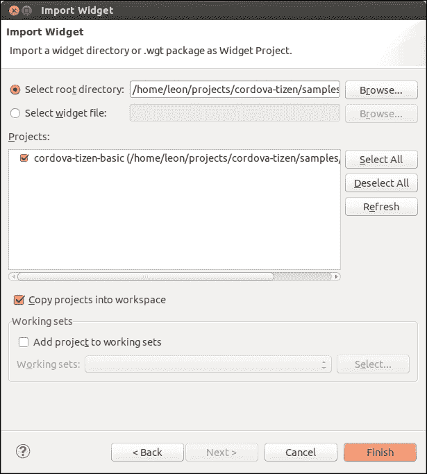

    将 Cordova 示例应用程序导入 Tizen IDE

1.  点击 **完成**。

## 工作原理

Cordova 和 PhoneGap 等项目的主要目的是提供易于使用的工具，以使用 Web 技术 HTML、CSS 和 JavaScript 开发移动应用程序。Web 应用程序是 Tizen 中的第一类公民，因此它是一个非常适合 Cordova 和 PhoneGap 项目的平台。

Tizen IDE 可以直接用于导入、开发、调试和部署 Cordova 或 PhoneGap 应用程序。在前面教程的第三步中，示例 Cordova 应用程序被用作模板。重要的是要确保在第四步中所述的 **将项目复制到工作区** 选项已被勾选。IDE 将复制该应用程序并将其保存在当前工作区。

## 另请参阅

+   查看下一个配方，了解如何将使用 Cordova 或 PhoneGap 创建的应用程序部署到 Tizen 设备或模拟器。查看 PhoneGap 的官方文档，了解更多关于 Tizen 应用程序的详细信息，[`docs.phonegap.com/en/edge/guide_platforms_tizen_index.md.html#Tizen%2520Platform%2520Guide`](http://docs.phonegap.com/en/edge/guide_platforms_tizen_index.md.html#Tizen%2520Platform%2520Guide)。

# 将 Cordova 和 PhoneGap 应用程序部署到 Tizen 设备或模拟器

在 Tizen IDE 工作空间中创建或导入新的或现有的 Cordova/PhoneGap 应用程序后，是时候部署它了。在本配方中，你将学习如何使用 Tizen IDE 的选项将 Cordova 或 PhoneGap 应用程序部署到 Tizen 设备或模拟器。

## 准备工作

我首选的在 Android 设备或模拟器上构建和部署 Cordova 应用程序的方法是通过控制台输入以下命令：

```
Cordova run android

```

不幸的是，在写这本书时，Tizen 的命令行界面（CLI）在 PhoneGap 和 Cordova 中都不可用。如你所见，考虑到这些情况，开发和部署 Cordova 或 PhoneGap 应用程序到 Tizen 设备或模拟器的最简单方法是通过 IDE 的用户界面。

在继续之前，确保你已将 Tizen 设备连接到计算机，或者在计算机上启动了 Tizen 模拟器。

## 如何操作...

按照这些简单的指示，将 Cordova 或 PhoneGap 应用程序部署并运行在 Tizen 模拟器上：

1.  在 Tizen IDE 中导航到 **项目资源管理器** 视图。

1.  右键点击项目。

1.  导航至 **以此方式运行** | **Tizen Web 模拟器应用程序**。

在真实设备上部署应用程序的过程几乎相同。确保 Tizen 设备已成功连接到计算机，然后执行以下操作以运行应用程序：

1.  在 Tizen IDE 中导航到 **项目资源管理器** 视图。

1.  在项目上右键点击鼠标右键。

1.  导航至 **以此方式运行** | **Tizen Web 应用程序**。

## 工作原理

Tizen IDE 适合手动操作，但如果你想创建持续集成并测试使用 Cordova 和 PhoneGap 创建的 Tizen Web 应用程序，它可能会成为障碍。Tizen IDE 依赖于以 Tizen 为中心的工具，如 SDB 来部署应用程序。在极少数情况下，当你需要通过控制台而不是输入 `cordova run` 来部署应用程序时，使用 `sdb install`，然后输入应用程序 `wgt` 文件的完整名称。

## 另见

+   如果你正在寻找如何通过控制台将 Cordova 或 PhoneGap 应用程序部署到 Tizen 设备和模拟器的选项，请参阅本书第一章中的 Smart Development Bridge 配方，以了解更多关于 SDB 使用的细节。

# 将 Android 应用程序移植到 Tizen

Tizen 智能手机的功能和硬件按钮与安卓设备相似。由三星制造的 Tizen 智能手机的用户界面与 TouchWiz 相似——这是现有三星安卓设备的前端触摸界面。

安卓已经在智能手机市场占据主导地位多年，数以百万计的安卓应用存在。像 BlackBerry 10 和 SailfishOS 这样的替代平台提供了运行安卓应用的运行时环境。相同的方式也能让我们在 Tizen 上运行安卓应用。Tizen 生态系统中最流行的解决方案是 OpenMobile 提供的**应用兼容层**（**ACL**）。在本教程中，将揭示开始使用 ACL 所需的基本步骤。

## 准备就绪

请准备好您的安卓应用的`APK`（应用程序包文件）。如果您计划提交付费应用，请确保您拥有有效的银行账户或 PayPal 账户。

## 如何操作...

按照以下说明注册 OpenMobile 开发者计划，并通过他们的服务将您的安卓应用移植到 Tizen：

1.  访问 OpenMobile 网站并注册成为 AppMall 内容提供商：[`www.openmobileww.com/#!content-provider-registration/cuwc`](http://www.openmobileww.com/#!content-provider-registration/cuwc)。

1.  您将在 24 小时内收到包含用户名和密码的电子邮件。

1.  收到电子邮件后，登录到[`manager.openmobileappmall.com`](http://manager.openmobileappmall.com)。

1.  点击**个人资料**表单，输入您偏好的支付方式。支持通过 PayPal 和银行转账进行支付。

1.  进入**我的应用**并点击**添加应用**：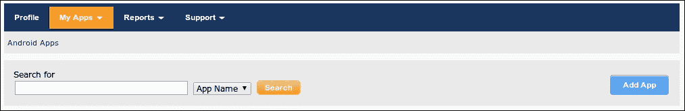

    向 OpenMobile AppMall 添加新应用

1.  在**概述**标签页中填写所有详细信息。

1.  进入**版本 / 文件**标签页，上传您的安卓应用程序：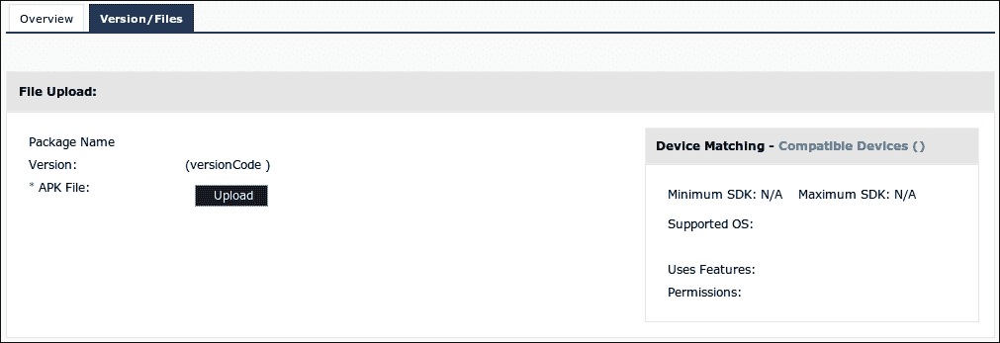

    上传 APK 文件

## 它是如何工作的

OpenMobile 的应用兼容层基于 Google 的**Android 开源项目**（**AOSP**）。基于此，ACL 集成了安卓应用的图形堆栈、媒体、**进程间通信**（**IPC**）和通知系统与 Tizen 的兼容性。通过使用 ACL，安卓应用可以像其他 Tizen 的网页或本地应用一样从 Tizen 桌面启动。与其他应用一样，Tizen 上的安卓应用也会显示在操作系统的任务管理器中。

OpenMobile 会将您的`apk`转换为`tpk`，进行验证，并发布到 Tizen 商店。OpenMobile 还会对`tpk`进行签名，并在 Tizen 商店卖家办公室处理应用程序的全部管理工作。应用下载报告以及收入将定期与开发者共享。

## 参见

+   更多有关 OpenMobile 使用条款的信息和详情请访问[`www.openmobileww.com/`](http://www.openmobileww.com/)。

# 将 Android UI 移植到 Tizen UI 框架

本文提供的信息在你决定将 Android 应用移植到 Tizen Web 应用时会非常有用。请注意，由于你需要将 Java 代码重写为 HTML5 和 JavaScript，因此需要大量开发工作。本章概述并比较了 Android 和 Tizen 组件，应该是计划移植 Android 应用程序的开发人员的一个良好起点。

## 如何操作...

将使用 Android SDK 开发的应用完全移植到 HTML5 需要大量的工作，必须执行以下操作：

1.  完全使用 HTML5 重写用户界面。

1.  将现有的 Java 源代码移植到 JavaScript。

在 Tizen 设备或模拟器上构建和调试应用。以下是 Android UI 组件（来自 Java 包 `android.widget`）的常见组件列表，以及如何在 Tizen Web 应用中使用 Tizen Web UI Framework 替代它们的简要说明：

+   `Button`：Tizen Web UI Framework 提供了一个同名且具有相同行为的组件。创建它有几种方法。以下是使用 `a` 元素和 `data-role="button"` 的一种方法：

    ```
    <a id="myBtn" href="#" data-role="button">Button 1</a>
    ```

+   `EditText`：这是一个可编辑的文本框。在 Tizen Web 应用中，收集用户信息时可以通过文本输入字段获得相同的用户体验，例如：

    ```
    <div data-role="fieldcontain">
      <label for="name">Text:</label>
      <input type="text" name="txt" id="txt" value=""  />
    </div>
    ```

+   `CheckBox`：Tizen UI 框架和 jQuery Mobile 都提供了 `Checkbox` 组件，可以在 HTML5 应用中替代 Android 组件。

+   `ToggleButton`：这种按钮允许用户快速在两种状态之间切换。请注意，只允许两种状态。Tizen Web UI Framework 提供了一个相同功能的组件——Flip Toggle Switch。它可以通过以下代码片段创建：

    ```
    <select id="SwitchBtn" data-role="slider">
      <option value="off">Off</option>
      <option value="on">On</option>
    </select>
    ```

+   `Spinner`：这个 Java 类提供了一个组件，用于在 Android 中快速从列表中选择一个值。在 HTML5 应用中，可以用 `select` 组件和多个选项来替代它。

+   `DatePicker` 和 `TimePicker`：Tizen Web UI Framework 提供了以下组件，用于收集用户关于日期和时间的输入：日期选择器、时间选择器和日期时间选择器。例如，Tizen 的日期选择组件可以通过以下 HTML 实现：

    ```
    <div>
      <input type="date" name="datePicker" id="datePicker" data-format="dd MMM yyyy" />
    </div>
    ```

    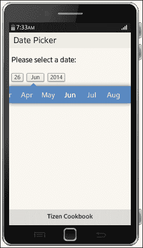

    一个带有日期选择器的示例 Tizen Web 应用

+   `Toast`：在 Android 中，这个组件用于向用户展示消息，以小弹窗的形式，不需要任何交互。在 Tizen Web 应用程序中，可以用 `Notification` 组件来替代它。

+   `AlertDialog`：这个弹出组件应该在 Tizen Web 应用程序中用来替代 Android 中的 `AlertDialog`。使用带有属性 `data-role="popup"` 的 `div` 元素来创建它。

## 它是如何工作的

在使用 HTML 创建用户界面后，你需要重写应用程序的逻辑。以下是一个对比，展示了在 Android 应用中处理按钮点击的 Java 代码片段与在 Tizen Web 应用中处理相同用例的 JavaScript 代码。

来自 Android 应用的示例 Java 源代码处理 ID 为 `myBtn` 的按钮点击事件：

```
final Button button = (Button) findViewById(R.id.myBtn);
button.setOnClickListener(new View.OnClickListener() {
  public void onClick(View v) {
    //do something
  }
});
```

以下 JavaScript 代码处理 ID 为 `myBtn` 的按钮的 `click` 事件：

```
$('#myBtn').bind( "click", function(event, ui) {
  //do something
});
```

如你所见，概念是相同的，但由于 Java 和 JavaScript 编程语言的特性，语法上有很大的差异。在这两种情况下，按钮的 ID 都是 myBtn，从用户的角度看，点击 Tizen Web 应用中的按钮与点击 Android 应用中的按钮效果是一样的。

## 另见

+   请参阅 第三章，*构建用户界面*，以及官方 Tizen 文档，探索 Tizen Web UI 框架提供的小部件。所有可用小部件的列表可以在 [`developer.tizen.org/dev-guide/2.2.1/org.tizen.web.uiwidget.apireference/html/widgets/widget_reference.htm`](https://developer.tizen.org/dev-guide/2.2.1/org.tizen.web.uiwidget.apireference/html/widgets/widget_reference.htm) 找到。

# 设置 Qt for Tizen

**Qt** 是一个流行的跨平台应用程序开发框架，主要用于开发迷人的图形用户界面。主要的编程语言是 C++ 和 QML，但通过语言绑定也可以使用其他编程语言，如 Python。

Qt 项目有着悠久的历史。它的开发始于 1991 年的瑞典，直到 2008 年，该框架由 Trolltech 开发。之后，诺基亚收购了 Qt。最初，Qt 仅提供商业和 GPL 许可。2009 年，Qt 也开始提供 LGPL 许可。两年后，诺基亚将 Qt 的商业许可业务出售给了 Digia。

项目的最新主要版本是 Qt 5，它于 2012 年底发布。一年后，Tomasz Olszak 和 Jarosław Staniek 创建了一个开源项目，旨在将 Qt 5 移植到 Tizen。我很自豪，作为本书的评审，**Philippe Coval** 和我也是该项目的首批贡献者之一，我们能够帮助项目的主要开发者 Tomasz Olszak 在不同的参考设备上进行 Qt for Tizen 的测试以及代码审查。

本教程中，你将学习如何安装和配置开发环境，以便为 Tizen 移动设备构建 Qt 应用程序。

## 准备工作

本教程仅在 Ubuntu 上进行过测试。在继续下一个部分之前，请确保你已经满足以下四个要求。

+   确保你已成功安装 Tizen SDK。设置 Qt for Tizen 需要从源代码构建 Qt，并安装 Qt Creator，因此请确保至少有 5 GB 的空闲磁盘空间。

+   运行 `apt-get` 并确保安装了以下长列表中的所有软件包，因为它们是构建 Qt 所需的：

    ```
    sudo apt-get install perl python git build-essential libqt4-dev "^libxcb.*" libx11-xcb-dev libxkbcommon-dev libglu1-mesa-dev libxrender-dev libdbus-1-dev libfontconfig1-dev libfreetype6-dev libatspi2.0-dev flex bison gperf libicu-dev libcups2-dev libxslt-dev ruby libsqlite3-dev libgstreamer0.10-dev libgstreamer-plugins-base0.10-dev libssl-dev libpulse-dev libasound2-dev libgtk2.0-dev libpng12-dev libjpeg8-dev libjpeg-dev chrpath
    ```

+   安装 GBS。首先，应该将与您的发行版对应的 Tizen 仓库添加到 `/etc/apt/sources.list`。然后，运行以下命令：

    ```
    sudo apt-get update
    sudo apt-get install gbs
    ```

    ### 注意

    有关 Tizen 开发工具的最新安装指南，请访问 [`source.tizen.org/documentation/developer-guide/getting-started-guide/installing-development-tools`](https://source.tizen.org/documentation/developer-guide/getting-started-guide/installing-development-tools)。

+   确保你有有效的作者证书。请参考第一章中的配方 *设置活动安全配置文件* 获取更多细节。

## 如何操作...

以下说明将解释如何安装 Tizen 开发工具、从源代码构建 Qt、安装 Qt Creator，并为其设置 Tizen 插件。

1.  创建一个目录来存储 Qt 的源代码。

1.  通过从项目的 Git 仓库克隆源代码，将源代码下载到计算机：

    ```
    git clone -b alpha6 git://gitorious.org/tizenbuildtools/tizenbuildtools.git
    cd tizenbuildtools
    git checkout v_alpha6.2
    ```

1.  进入桌面目录并构建 Qt：

    ```
    cd desktop
    MAKE_THREADS=4 ./downloadAndBuildAll.sh
    ```

    ### 注意

    将线程数替换为与处理器核心数量相匹配的数字。

    或者，你可以使用以下命令，这些命令会自动获取核心数量：

    `MAX_THREAD=$(grep 'Core' /proc/cpuinfo | wc -l ) ./downloadAndBuildAll.sh`

1.  进入 `emulator` 目录，准备 Tizen 的 Qt 模拟器：

    ```
    cd ../emulator
    ./prepare_developer_tools.sh
    ```

1.  再次更改当前目录，这次进入 `mobile` 目录。准备 Qt 使 Tizen 在设备上运行：

    ```
    cd ../mobile
    ./prepare_developer_tools.sh
    ```

1.  访问 [`qt-project.org/downloads#qt-creator`](http://qt-project.org/downloads#qt-creator) 并下载 Qt Creator。

1.  安装 Qt Creator。在 Linux 上，可以通过命令行使用以下命令启动安装：

    ```
    chmod u+x ./qt-creator-linux-...run
    ./qt-creator-linux-...run
    ```

1.  构建 Qt Creator 的 Tizen 插件：

    ```
    cd ../qtcreator
    export PATH=$HOME/dev/src/tizenbuildtools/desktop/qt5hostInstall/bin:$PATH
    QTC_BUILD=$HOME/qtcreator-3.0.1 ./build_and_deploy_tizen_plugin.sh
    ```

## 还有更多...

按照以下步骤将 Tizen SDK 集成到 Qt Creator 中：

1.  启动 Tizen **模拟器管理器**。

1.  启动 Qt Creator。

1.  导航到 **工具** | **选项**。

1.  选择 **Tizen**。

1.  导航到 **Tizen SDK 路径**，点击 **浏览** 查找 Tizen SDK 安装目录，然后点击 **确定**。

1.  导航到 **作者证书**，然后再次点击 **浏览** 以选择证书。在 Linux 上，作者证书的默认存储路径为 `$HOME/tizen-sdk-data/keystore/author/`。

1.  输入证书的密码。

几乎完成了。现在，你需要为 Qt Creator 配置 Tizen 模拟器：

1.  在 **选项** 对话框中，进入 **设备**，选择 **tizen**。

1.  输入一个名称，方便将来区分这就是 Tizen 模拟器。

1.  从 **选项** 进入 **构建与运行**，选择 **Qt 版本** 标签并点击 **添加**。

1.  选择 **qmake** 用于 Tizen 模拟器构建，并点击 **应用**。默认路径应为 `$HOME/dev/src/tizenbuildtools/emulator/qt5CrossCompileTools/bin/qmake`。

1.  转到 **工具** 标签，点击 **添加**，并输入适当的名称，例如 `Tizen 模拟器`。

1.  点击 **添加**。

1.  选择 **Tizen 设备** 作为 **设备类型**，选择 **Tizen GCC (x86)** 作为 **编译器**，并在 **Qt 版本** 字段中选择用于模拟器的 Qt 版本。

1.  点击 **应用**。

## 另见

+   为 Tizen 开发 Qt 完全是透明的。如果你想联系 Tomasz、Jarosław 或其他贡献者，请使用 [`qt-project.org/wiki/Tizen`](http://qt-project.org/wiki/Tizen) 上描述的沟通渠道。

+   有关如何为 Tizen 构建 Qt 的更多信息，请参考 Qt 官方指南的最新版本，网址为 [`qt-project.org/wiki/Build-Qt-for-Tizen`](http://qt-project.org/wiki/Build-Qt-for-Tizen)。

# 在 Tizen 上部署 Qt 应用程序

这个食谱将解释如何在 Tizen 模拟器或设备上准备、构建和部署 Qt 应用程序。

## 准备工作

在开始之前，确保你已经在计算机上成功设置了 Qt for Tizen。正如我们在书籍开头讨论的那样，Tizen 智能手机既支持使用 C++ 创建的原生应用程序及其 `.tpk` 扩展，也支持使用 `.wgt` 扩展的 Web 应用程序。Qt 是一个基于 C++ 的框架，因此 Tizen 的移植依赖于 `.tpk` 文件的工具。

## 如何实现…

按照这些逐步说明使用 Qt Creator 开发新的或移植现有的 Qt 应用程序到 Tizen：

1.  在 Qt 应用程序项目中创建一个名为 `tizen` 的目录。

1.  将 `helloworld` 项目中的 `manifest.xml` 文件（该项目与 `qtquickcontrols-tizen` 一同提供）复制到你在上一步中创建的目录中。

1.  编辑`manifest.xml`并在其中设置应用程序 ID。

1.  打开应用程序的 `.pro` 文件，通过添加以下规则来启用 Tizen 支持：

    ```
    tizen {
      tizen_shared.files = shared/res
      CONFIG += TIZEN_STANDALONE_PACKAGE
      TIZEN_BUNDLED_QT_LIBS=Qt5Core Qt5DBus Qt5Qml Qt5Quick Qt5Widgets Qt5Gui Qt5Network
      load(tizen_app)
    }
    ```

1.  打开`main.cpp`并实现以下源代码，为 `OspMain()` 方法编写代码，这是 Tizen 原生应用程序的入口点：

    ```
    extern "C" int OspMain(int argc, char *argv[]) {
      return main(argc, argv);
    }
    ```

    ### 注意

    这个食谱已经在 Tizen 移动配置文件上进行了测试。它不能在 Tizen IVI 或其他不支持原生应用程序开发的配置文件上使用。

1.  构建应用程序，并通过 Qt Creator 将其部署到 Tizen 模拟器或设备上。

## 它是如何工作的

提供的 `helloworld` 应用程序（与 `qtquickcontrols-tizen` 一起提供）作为模板使用。实际上，这个食谱的第一步几乎与使用 Cordova 或 PhoneGap 创建 Tizen 应用程序的第一步相同。尽管这些技术创建的是 Web 应用程序，但它们的第一步是导入并使用一个示例应用程序作为模板。

第二步和第三步专注于`manifest.xml`。这是一个配置文件。每个 Tizen 原生应用程序必须有一个符合 XML 标准的单一 manifest 文件。

下一步仍然是编辑配置文件。`.pro` 扩展名是 Qt 应用程序项目文件的特定扩展名。此文件必须包含 **qmake** 构建应用程序所需的所有信息。

在第五步中，作为 Tizen 原生应用程序入口点的方法被指示运行 Qt 应用程序的主方法。传递给 `OspMain()` 的所有参数都被传递给 `main()`。`OspMain()` 的前缀代表开放服务平台（Open Service Platform），其来源可追溯至与 Tizen 2 合并的 Bada。

## 另见

+   Tomasz Olszak，Qt for Tizen 的联合创始人兼主要开发者，在 Qt wiki 上维护了一篇关于为 Tizen 开发 Qt 应用程序的文章。欲了解更多信息，请访问 [`qt-project.org/wiki/Creating-Hello-World-Application`](http://qt-project.org/wiki/Creating-Hello-World-Application)。

+   相关 Qt 5 的教程和文档可在 [`qt-project.org/`](http://qt-project.org/) 上获取。

+   如果您不熟悉 QML，可以参考 [`qt-project.org/doc/qt-5/qml-tutorial.html`](http://qt-project.org/doc/qt-5/qml-tutorial.html) 作为一个很好的起点。

# 第十一章：在 Tizen 中调试应用程序

本章将涵盖以下主题：

+   在 Tizen Web 模拟器中运行应用程序

+   在 Tizen 模拟器中运行应用程序

+   在设备上运行应用程序

+   在 Tizen Web 模拟器中调试

+   在 Tizen 模拟器中调试

+   在设备上调试

+   使用三星远程测试实验室

+   跟踪 JavaScript 错误

+   使用 QUnit 进行单元测试

# 介绍

质量保证是应用程序开发过程中最重要的流程之一，因为它确保减少问题并为最终用户提供更好的体验。许多优秀的移动应用程序因存在缺陷而未能取得商业成功。即使一款应用具有出色的用户界面并提供良好的用户体验，仍然不足以确保它会成功。

一般来说，用户对错误的容忍度很低。如果应用程序崩溃一次，用户可能再也不会打开它。

本章的内容提供了如何测试应用程序并提供良好质量的思路和教程。在本章中，您将了解如何运行和调试 Tizen 应用程序，并探索 Web 应用程序的 JavaScript 单元测试。

本章还包括一个关于三星 **远程测试实验室** (**RTL**) 的食谱，并提供了如何在远程物理 Tizen 设备上部署和测试应用程序的教程。尽管没有单独的食谱介绍 Selenium，您可以考虑使用该工具进行 Web 应用程序的功能性和用户验收测试，这些应用程序与 Tizen 兼容。欲开始使用该工具，请访问 [`www.seleniumhq.org/`](http://www.seleniumhq.org/)。

# 在 Tizen Web 模拟器中运行应用程序

您应该已经熟悉第一章中介绍的 Tizen Web 模拟器，用于 Web 应用程序。在本食谱中，您将详细了解如何使用它。

## 准备工作

可以通过 Tizen IDE 在模拟器中启动 Tizen Web 应用程序。所有操作步骤已在本书的第一章中详细说明，以下是简要总结：

+   在 **项目资源管理器** 视图中选择项目。右键点击项目以激活上下文菜单，并导航到 **运行方式** | **Tizen Web 模拟器应用程序**。

+   转到 Tizen IDE 的 **运行** 菜单，导航到 **运行方式** | **Tizen Web 模拟器应用程序**。

+   或者，直接点击 Tizen IDE 工具栏中的 **运行** 按钮。

## 如何操作...

可以配置模拟器的设备信息和系统设置。请按照以下说明配置模拟器：

1.  使用三种可用选项之一启动模拟器。

1.  点击模拟器右上角的 **配置** 按钮。

1.  调整设备、系统和网络设置，如下图所示：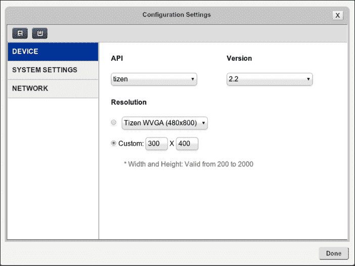

    Tizen Web 模拟器的配置设置

此外，您还可以通过点击位于 **配置** 按钮旁边的 **面板设置** 按钮来调整可见面板。

## 还有更多内容

Tizen Web 模拟器提供了多个面板来模拟各种事件。以下是按出现顺序列出的可用面板：

+   **方向与缩放**：此面板允许您将模拟器的方向从竖屏切换为横屏，反之亦然。作为附加功能，您还可以从同一面板调整缩放级别。

+   **系统摘要**：此面板提供有关系统和应用程序的基本信息。

+   **通知**：此面板显示接收到的通知列表。

+   **传感器**：此面板对于模拟与加速度计和陀螺仪相关的事件非常有用。它提供了调整设备位置以及模拟器设置的选项。

+   **地理定位**：此面板用于设置当前时区、位置和路线。它对于在模拟器中测试基于位置的 Tizen Web 应用程序非常有用，无需真实的 GPS 设备。

+   **应用配置**：此面板显示有关应用程序配置及其安装包的信息。基本上，它显示的是 `config.xml` 文件的内容。

+   **通信**：开发人员可以通过此面板模拟接听电话和处理消息，以及接收推送通知。

+   **电池管理**：此面板可调整电池电量并模拟低电量状态。

+   **网络管理**：此面板控制模拟器的网络单元：NFC、蓝牙、Wi-Fi 和蜂窝网络。

+   **下载**：此面板管理模拟器的下载资源。

+   **包和应用**：此面板显示模拟器上安装的包和应用程序的列表。此外，您可以通过此面板删除已安装的包或应用程序。

## 另请参阅

+   所有可用模拟器功能的规格可以在[`developer.tizen.org/dev-guide/2.2.1/org.tizen.web.appprogramming/html/ide_sdk_tools/simulator_features.htm`](https://developer.tizen.org/dev-guide/2.2.1/org.tizen.web.appprogramming/html/ide_sdk_tools/simulator_features.htm)中找到。

# 在 Tizen 模拟器中运行应用程序。

使用此方法，你将回顾如何启动 Tizen 模拟器，并学习如何运行应用程序以及如何使用**事件注入器**模拟事件。

## 如何操作...

有几种启动 Tizen 模拟器的选项。它们都已在本书的第一章中介绍过，并提供了如何创建虚拟 Tizen 设备的说明。在继续之前，请确保你已经设置了虚拟机。

从用户的角度来看，启动 Tizen 模拟器的最简单方法是使用模拟器管理器。以下是所需操作的快速回顾：

1.  启动 Tizen 模拟器，它随着 Tizen SDK 的安装而提供。

1.  选择所需的配置，并点击**播放**按钮启动它。

启动 Tizen 模拟器的另一种选择是，在终端中键入以下命令：

```
./emulator-x86 --skin-args <skin options> --qemu-args <QEMU options>
```

一旦模拟器启动，你可以直接从 Tizen IDE 安装并启动 Tizen 应用程序。有三种方法可以做到这一点，选择最适合你的方法：

+   转到**项目资源管理器**视图，打开一个项目，右键点击该项目，选择**运行方式 | Tizen Web 应用程序**

+   在 Tizen IDE 中，导航至**运行**菜单，并选择**运行方式** | **Tizen Web 应用程序**

+   点击 Tizen IDE 工具栏中的**运行**按钮。

在应用程序运行于模拟器时，你可以使用事件注入器模拟各种事件来测试它。以下事件可以通过 Tizen IDE 中的事件注入器视图或通过控制台创建并发送到模拟器：

+   **传感器**：此事件指示与以下任一传感器相关的值：加速度、磁场、陀螺仪、接近或光线。

+   **运动**：此事件模拟摇晃等运动事件。

+   **电池**：此事件调整当前电池电量以及充电器的状态。

+   **耳机插孔**：此事件控制耳机的状态。

+   **USB**：此事件管理虚拟设备的 USB 连接器状态。

+   **RSSI（接收信号强度指示）**：此事件模拟不同的信号强度。请注意，如果将 RSSI 设置为`0`，则文本消息和呼叫事件将无法工作。

+   **SD 卡**：此事件设置 SD 卡指示器的状态。

+   **位置**：此事件模拟设备的虚拟位置，用于测试目的。

+   **短信**：此事件模拟发送短信。

+   **呼叫**：此事件处理模拟呼叫。

+   **NFC**：此事件管理 NFC 标签，例如 NDEF 消息、NFC 标签等。

## 另见

+   SDK 附带的官方文档揭示了事件注入器的所有功能，详见[`developer.tizen.org/dev-guide/2.2.1/org.tizen.gettingstarted/html/dev_env/event_injec.htm`](https://developer.tizen.org/dev-guide/2.2.1/org.tizen.gettingstarted/html/dev_env/event_injec.htm)。

+   也可以通过控制台注入事件。这个功能对于用于自动化测试的脚本非常有价值。有关该控制台工具的用户指南，请访问[`developer.tizen.org/dev-guide/2.2.1/org.tizen.gettingstarted/html/dev_env/using_event_injector.htm`](https://developer.tizen.org/dev-guide/2.2.1/org.tizen.gettingstarted/html/dev_env/using_event_injector.htm)。

+   当然，官方文档提供了在模拟器上运行应用程序的基本指南，详见[`developer.tizen.org/dev-guide/2.2.1/org.tizen.web.appprogramming/html/app_dev_process/running_widget_emulator.htm`](https://developer.tizen.org/dev-guide/2.2.1/org.tizen.web.appprogramming/html/app_dev_process/running_widget_emulator.htm)。

# 在设备上运行应用程序

在本书的前几章中，我们已经讨论了 SDB 以及如何在模拟器或设备上运行应用程序。本节的目的是巩固这些知识。

## 准备就绪

执行以下操作以设置连接设备的运行配置：

1.  确保 Tizen 设备已成功连接到计算机，并且可以在 Tizen IDE 的**连接资源管理器**中识别到该设备。

1.  在首次启动应用程序之前，使用以下任一方法调整配置：

    +   从 Tizen IDE 的主菜单中选择**运行** | **运行配置**。

    +   在**项目资源管理器**视图中找到项目，右键点击该项目，在上下文菜单中选择**以...运行** | **运行配置**。

## 如何操作...

确保你已经调整了运行配置，并使用以下任意方法将应用程序运行在连接的 Tizen 设备上：

1.  导航到**项目资源管理器**视图，选中项目并右键点击它。将出现一个上下文菜单。选择**以...运行** | **Tizen Web 应用程序**。

1.  在 Tizen IDE 菜单中，转到**运行** | **以...运行** | **Tizen Web 应用程序**。

1.  点击 Tizen IDE 工具栏中的**运行**按钮。

无论你选择哪种方法，最终结果都会相同。使用最适合你的方法。

## 工作原理

在 Tizen 设备上运行应用程序的算法包括五个主要步骤。第一步是构建应用程序。之后，如果是 Web 应用程序，必须将其打包为`.wgt`，如果是原生应用程序，则打包为`.tpk`。第三步是将包传输到连接的设备。接下来的步骤是安装该包，最后在设备上启动应用程序。

## 另见

+   连接 Tizen 设备并通过 Tizen IDE 在其上运行应用程序的完整指南，请参考 SDK 的官方文档：[`developer.tizen.org/dev-guide/2.2.1/org.tizen.web.appprogramming/html/app_dev_process/running_widget_target.htm`](https://developer.tizen.org/dev-guide/2.2.1/org.tizen.web.appprogramming/html/app_dev_process/running_widget_target.htm)

# 在 Tizen Web 模拟器中调试

本教程提供了使用 Web 模拟器及其 Web 检查器运行和调试 Tizen Web 应用程序的指南。

## 如何操作...

按照以下说明，在 Web 模拟器中运行 Tizen Web 应用程序并进行调试：

1.  根据本教程《在模拟器中运行应用程序》中的任一方法启动模拟器中的应用程序。

1.  按*F12*打开 Web 检查器。

1.  点击**Console**查看日志信息。

1.  点击**Sources**，选择一些 JavaScript，并设置和控制断点以调试应用程序。

## 它是如何工作的

Tizen Web 模拟器在 Google Chrome 浏览器中运行。当你从 Tizen IDE 启动它时，它会自动启动一个新的 Chrome 窗口并加载一个本地 URL。所有 Chrome 的调试工具都可以在模拟器中使用。

## 另见

+   有关模拟器及其使用的更多信息，请访问[`developer.tizen.org/dev-guide/2.2.1/org.tizen.web.appprogramming/html/app_dev_process/running_widget_simulator.htm`](https://developer.tizen.org/dev-guide/2.2.1/org.tizen.web.appprogramming/html/app_dev_process/running_widget_simulator.htm)

# 在 Tizen 模拟器中调试

在本教程中，你将学习如何在模拟器上安装和运行 Tizen 应用程序的调试模式，并使用**远程检查器**进行调试。

## 准备工作

用于调试模拟器中应用程序的工具叫做远程检查器（Remote Inspector），它需要 Google Chrome 浏览器。请确保在开发用的电脑上已成功安装 Chrome，然后再继续操作。

## 如何操作...

按照以下步骤，使用模拟器调试 Tizen 应用程序：

1.  启动 Tizen IDE 和 Tizen 模拟器。

1.  从**Project Explorer**中选择应用程序，并使用以下任一方法将其启动到模拟器中：

    +   右键单击项目，选择**Debug as** | **Tizen Web Application**

    +   在 Tizen IDE 的工具箱中点击**Debug**按钮

    +   从 Tizen IDE 的菜单中选择**Run** | **Debug As** | **Tizen Web Application**

## 它是如何工作的

模拟器提供了完整的操作平台堆栈，方便测试 Tizen 本地应用和 Web 应用。它与 Tizen IDE 良好集成。应用程序会被复制到模拟器中，之后会自动安装并启动。一个新的 Chrome 窗口将为远程检查器打开。

## 另见

+   关于使用远程检查器的教程可以在后续的关于跟踪 JavaScript 错误的食谱中找到。有关在模拟器上启动应用程序的过程的更多信息，也可以在前面的食谱中以及官方文档中找到，文档地址为[`developer.tizen.org/dev-guide/2.2.1/org.tizen.web.appprogramming/html/app_dev_process/running_widget_emulator.htm`](https://developer.tizen.org/dev-guide/2.2.1/org.tizen.web.appprogramming/html/app_dev_process/running_widget_emulator.htm)。

# 在设备上调试

在真实的 Tizen 设备上调试几乎与在模拟器上相同。本食谱仅会揭示在设备上执行过程时的细微差异。

## 准备工作

在真实设备上调试 Tizen 应用程序的要求与在模拟器上相同。必须在你的开发机器上安装 Google Chrome，因为远程检查器需要它。

## 如何操作……

按照以下说明，通过 Tizen IDE 安装和调试应用程序到 Tizen 设备：

1.  启动 Tizen IDE。

1.  连接设备，并确保设备在 Tizen IDE 的 **Connection Explorer** 中被识别并显示。

1.  使用以下任一方法，在设备上以调试模式启动应用程序：

    +   右键单击项目，选择 **Debug as** | **Tizen web application**

    +   点击 Tizen IDE 工具箱中的 **Debug** 按钮

    +   从 Tizen IDE 的菜单中，导航至 **Run** | **Debug As** | **Tizen Web Application**

正如从前面的教程中看到的，步骤几乎与在 Tizen 模拟器上调试应用程序时相同。

## 还有更多内容

将应用程序构建、复制并安装到 Tizen 设备上可能是一个烦人的过程，尤其是每天需要做几百次。你想节省开发时间，加速调试过程吗？

Tizen **快速开发支持**（**RDS**）来拯救你！使用它，应用程序仅在首次运行时进行完整打包、复制并安装到设备上。之后，打包步骤将被跳过，只有修改过的文件才会被传输到设备。RDS 内置了看门狗功能，监控过程，如果出现失败，则会执行应用程序的正常安装。

默认情况下，RDS 是启用的。如果你需要禁用它，请前往 Tizen IDE 的 **Windows** 菜单，选择 **Preferences** | **Tizen SDK** | **Rapid Development Support**：

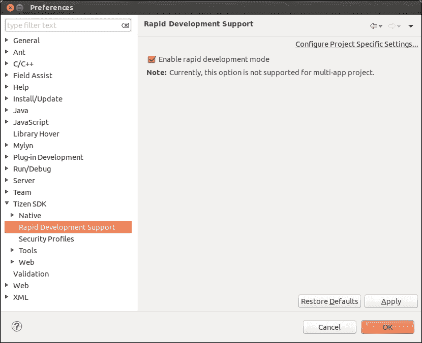

启用或禁用快速开发支持

## 另见

+   关于 RDS 的更多信息，请参见 [`developer.tizen.org/dev-guide/2.2.1/org.tizen.web.appprogramming/html/app_dev_process/rapid_dev_support.htm`](https://developer.tizen.org/dev-guide/2.2.1/org.tizen.web.appprogramming/html/app_dev_process/rapid_dev_support.htm)

+   探索下一篇教程，了解如何利用远程检查器，或查看官方文档：[`developer.tizen.org/dev-guide/2.2.1/org.tizen.web.appprogramming/html/app_dev_process/debugging_widget.htm`](https://developer.tizen.org/dev-guide/2.2.1/org.tizen.web.appprogramming/html/app_dev_process/debugging_widget.htm)

# 使用三星远程测试实验室

三星提供了一项免费的服务，允许在 Android 和 Tizen 系统的移动设备及可穿戴设备上进行应用程序的远程测试。这项服务被称为三星 **远程测试实验室**（**RTL**）。它是一种方便且实惠的方式，可以在没有实际操作的情况下，在物理设备上试用应用程序。

## 准备工作

你需要是注册的三星开发者才能使用 RTL。如果你没有账户，可以在 [`developer.samsung.com/signup`](http://developer.samsung.com/signup) 上免费注册。

RTL 有一些技术要求，你必须满足：

+   现代网页浏览器（Firefox v2+、Internet Explorer v7+、Opera v9.6+、Chrome 7+ 或 Safari v3+）

+   在网页浏览器中启用 JavaScript

+   Java Web 启动

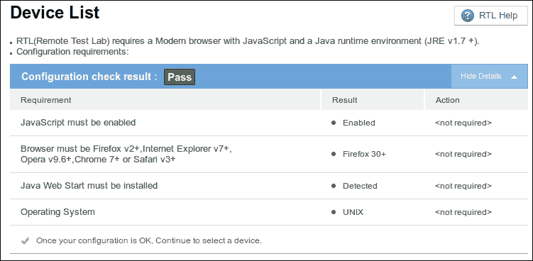

远程测试实验室的要求

该服务可以在 GNU/Linux、Mac OS X 和 Microsoft Windows 的计算机上使用。你还应该准备好应用程序的安装文件。

## 如何操作...

按照以下分步指南，通过 RTL 访问 Tizen 设备并在其上启动你的应用程序：

1.  使用你的三星开发者账户登录：[`account.samsung.com/account/check.do`](https://account.samsung.com/account/check.do)。

1.  访问三星远程测试实验室：[`developer.samsung.com/remotetestlab/rtlDeviceList.action`](http://developer.samsung.com/remotetestlab/rtlDeviceList.action)。

1.  进入 **Tizen** 标签，选择设备、操作系统版本和预定时长。

1.  点击 **开始**，等待 RTL 客户端加载。

1.  右键点击 RTL 客户端的顶部，导航到 **测试** | **安装应用程序**，如下面的截图所示：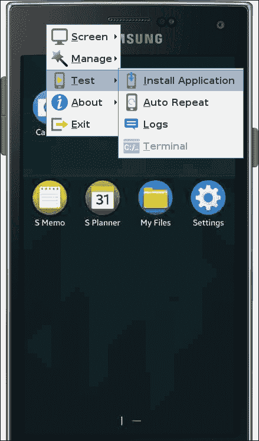

    安装 Tizen 应用程序

1.  上传你的应用程序安装文件并点击 **安装**。

1.  成功后，将显示以下消息：**应用程序已成功安装**。

## 工作原理

RTL 客户端应用程序已安装在你的计算机上，并提供了一个环境和连接到物理 Tizen 设备的方式，可以远程使用。这些设备分布在世界各地：韩国、波兰、印度、英国、美国和俄罗斯。

如果有空闲设备，你可以立即使用它。或者，你也可以进行预定，稍后使用它。虽然该服务是免费的，但有一些限制，你需要积分才能使用设备。每个三星开发者每天获得 20 个积分。每个积分可以使用设备 15 分钟，最短预定时间为半小时（2 个积分）。

你应该将设备保持与发现时相同的状态，因此请记住你必须移除所有已安装的应用程序。你可以选择屏幕质量：**低**、**普通**和**高**。如果你的网络连接较慢，建议使用低质量。RTL 客户端还允许你通过其上下文菜单更改设备方向。其他有用的功能包括捕捉屏幕截图和录制视频。

## 另请参阅

+   欲了解更多信息，请使用您的 Samsung 开发者帐户登录并参考以下文章：

+   [`developer.samsung.com/remotetestlab/rtlHelpDevice.action`](http://developer.samsung.com/remotetestlab/rtlHelpDevice.action)

# 追踪 JavaScript 错误

在这篇文章中，我们将讨论两种不同的追踪 JavaScript 错误的技术。关于 JavaScript 日志控制台和 Remote Inspector 中断点调试的教程将逐步揭示。

## 操作方法...

最原始和简单的调试方法是在控制台中写入消息。可以使用 JavaScript 对象 `console` 的以下方法：

+   `console.log`

+   `console.info`

+   `console.warn`

+   `console.error`

+   `console.debug`

使用上述任何方法记录的消息将显示在 Tizen IDE 的 JavaScript 日志控制台中。它在启动 Tizen web 应用程序时自动启动。

通过在控制台中记录日志的方式来调试代码并非在所有情况下都有效。在许多情况下，使用断点调试代码更为有用。

按照以下说明启动 Remote Inspector 并通过在源代码中设置断点来追踪 JavaScript 错误：

1.  启动运行在 Tizen 模拟器和设备上的 Tizen web 应用程序的 Remote Inspector。关于如何执行此步骤的详细说明，请参考前文中的教程。

1.  点击主工具栏中的 **Sources** 按钮：

    Remote Inspector 中的 Sources 按钮

1.  点击主工具栏左上角按钮显示导航器。

1.  选择并打开 JavaScript 文件。

1.  点击行号设置断点。可以定义多个断点。

1.  使用控制按钮导航应用程序的断点和源代码：

    按钮用于管理和移动 Remote Inspector 中的断点

例如，请看下面这张截图，它是在 Tizen 模拟器中调试 Hello World 应用程序时拍摄的。在 `main.js` 文件中设置了三个断点，用于追踪硬件返回按钮的行为，如下图所示：

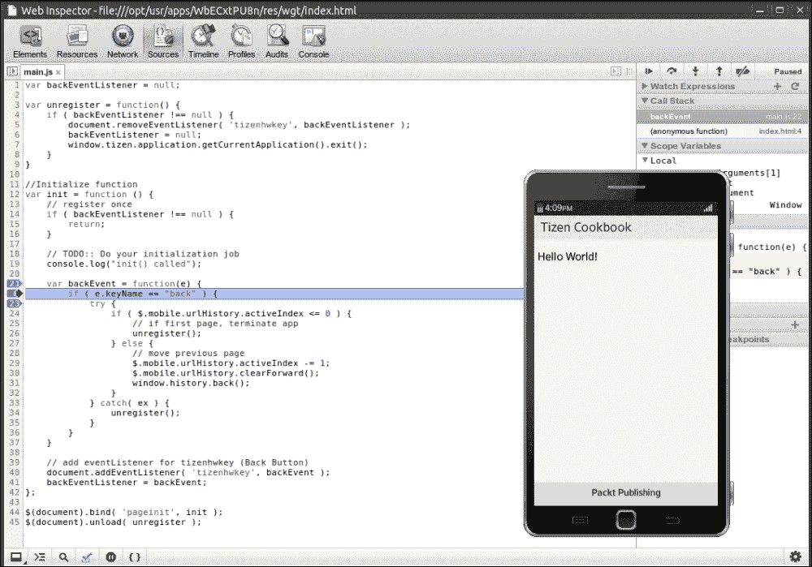

使用 Tizen 模拟器和 Remote Inspector 追踪 JavaScript 错误

## 工作原理

远程调试器集成在 Tizen IDE 中。如您所见，它提供了强大的工具来调试在 Tizen 模拟器和设备上运行的 Tizen Web 应用程序。使用此工具，您不仅可以调试 JavaScript，还可以检查 HTML 文件的资源、样式和 DOM 结构。

远程调试器基于 WebKit Web Inspector，但它包含了用于远程调试的附加功能。当启动远程调试器时，Chrome 浏览器的一个单独窗口会自动打开。Tizen 模拟器和远程调试器之间通过 HTTP 进行通信，以调试 Tizen Web 应用程序。

## 另见

获取更多信息，请访问以下链接并查看以下页面：

+   [`developer.tizen.org/dev-guide/2.2.1/org.tizen.web.appprogramming/html/ide_sdk_tools/javascript_log_console.htm`](https://developer.tizen.org/dev-guide/2.2.1/org.tizen.web.appprogramming/html/ide_sdk_tools/javascript_log_console.htm)

+   [`developer.tizen.org/dev-guide/2.2.1/org.tizen.web.appprogramming/html/app_dev_process/debugging_widget.htm`](https://developer.tizen.org/dev-guide/2.2.1/org.tizen.web.appprogramming/html/app_dev_process/debugging_widget.htm)

# 使用 QUnit 进行单元测试

单元测试是一种通过测试软件的各个单元来自动验证软件的方式。单元测试是测试驱动开发概念的支柱，根据该概念，必须在编写应用程序源代码之前编写测试。

很多用于单元测试的 JavaScript 框架都可以在开源许可下使用，但在本教程中，我们将重点介绍 QUnit。它是一个 jQuery 单元测试框架，非常适用于使用 Tizen Web UI Framework 或 jQuery Mobile 构建的 Tizen Web 应用程序。QUnit 的另一个优点是其许可，因为它在 MIT 许可下发布。

本教程揭示了将 QUnit 集成到 Tizen Web 应用程序中的必要步骤，并创建了几个基本测试。

## 准备就绪

访问并获取 QUnit 的最新版本。在编写本书时，最新版本是 1.14.0 版。

## 如何操作...

按照这些说明，从头开始创建一个新的 Tizen Web 应用程序，并将 QUnit 集成到其中。之后，基于本教程中获得的知识，您将能够在任何其他 Tizen Web 应用程序中进行单元测试。

1.  启动 Tizen IDE 并创建一个新的 Tizen Web 应用程序。

1.  在**项目资源管理器**中找到应用程序并右键单击它。从弹出的上下文菜单中，导航到**新建** | **文件夹**。

1.  输入`tests`作为新文件夹的名称，然后单击**完成**。

1.  将下载的 QUnit 文件复制到新文件夹中。

1.  再次在**项目资源管理器**视图中右键单击项目名称，这次导航到**新建** | **文件**。

1.  将文件`tests.js`保存在`tests`文件夹中。

1.  打开`tests.js`并插入几个测试用例：

    ```
    QUnit.test( "Tizen Test 1", function( assert ) {
      assert.ok( 1 == "1", "1 is 1" );
    });

    QUnit.test( "Tizen Test 2", function( assert ) {
      assert.equal( 0, 0, "0 is 0" );
      assert.notEqual( 2, 1, "2 is not 1" );
    });
    ```

1.  按照相同的步骤，创建另一个名为 `tests.html` 的文件，并将其放在项目的根目录中。

1.  打开 `tests.html` 文件并插入以下代码：

    ```
    <!DOCTYPE html>
    <html>
    <head>
      <meta charset="utf-8">
        <title>QUnit Tests</title>
    ```

    以下代码行必须包含在前端的源代码中，以确保测试结果能够适应 Tizen 模拟器或设备屏幕的大小。

    ```
      <meta name="viewport" content="width=device-width,user-scalable=no"/>
      <link rel="stylesheet" href="tests/qunit-1.14.0.css">
    </head>
    <body>
      <div id="qunit"></div>
      <div id="qunit-fixture"></div>
      <script src="img/qunit-1.14.0.js"></script>
      <script src="img/tests.js"></script>
    </body>
    </html>
    ```

1.  编辑 `config.xml` 文件，并通过更改 `content` 标签的值，将 `tests.html` 设置为主页：

    ```
    <content src="img/tests.html"/>
    ```

1.  在模拟器或设备中启动应用程序，以查看测试结果。

## 工作原理

测试结果会直接显示在设备或模拟器的屏幕上，当应用程序启动时即会显示。这是由于教程第十步中的 HTML 更改所导致的。

我们在 `tests.js` 中仅创建了两个基本的测试用例。第一个测试用例验证了 `1` 与 `"1"` 在 JavaScript 中值是否相等。第二个测试用例展示了 `equal()` 断言方法的使用。这两个单元测试都会成功通过；因此，屏幕上将显示类似于以下截图的报告：

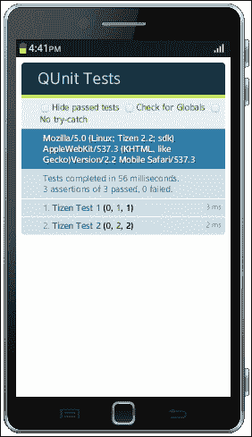

Tizen 模拟器上显示的 QUnit 报告，表示测试成功完成

让我们对第一个测试用例进行一些小的修改，展示包含失败测试的 QUnit 报告。通过将 `==` 替换为 `===` 来修改测试，这样它的代码将变成：

```
QUnit.test( "Tizen Test 1", function( assert ) {
  assert.ok( 1 === "1", "1 is 1" );
});
```

这个小修改完全改变了比较关系。在 JavaScript 中，比较运算符 `===` 不仅检查值，还检查类型。这次测试将失败，因为左侧的操作数是数字，而右侧是字符串。看看下面的截图，了解失败的测试用例是如何报告的：

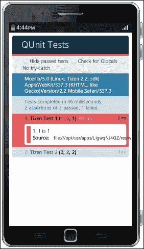

Tizen 模拟器上显示的 QUnit 报告，表示测试失败

在本食谱中，仅使用了两种断言方法。所有断言方法的完整列表可以在以下地址查看：[`api.qunitjs.com/category/assert/`](http://api.qunitjs.com/category/assert/)。

与本书一起，你可以找到一个示例 Tizen Web 应用程序，其中集成了使用 QUnit 的单元测试。它是按照本食谱中提供的教程创建的。将其导入 Tizen IDE 并运行，以查看你模拟器或设备屏幕上的测试结果。

## 参见

+   通过本食谱中的示例，你已经初步了解了 QUnit；接下来，你可以继续通过其 API 文档中的资源进行深入探索，地址：[`api.qunitjs.com/`](http://api.qunitjs.com/)。

+   此外，QUnit 食谱是一本很好的入门文章。它可以在线访问：[`qunitjs.com/cookbook/`](http://qunitjs.com/cookbook/)。

+   请记住，市面上还有很多其他优秀的 JavaScript 单元测试工具。Facebook 最近在 GitHub 上发布了他们的产品源代码——一个名为 Jest 的工具，它可以让单元测试变得轻松无痛，访问地址：[`facebook.github.io/jest/`](http://facebook.github.io/jest/)。

# 第十二章。将 Tizen 移植到硬件设备

在本章中，我们将讨论：

+   设置平台开发环境

+   在 Ubuntu 或 Debian 中安装开发工具

+   在 openSUSE 中安装开发工具

+   在 Fedora 和 CentOS 中安装开发工具

+   构建 Tizen 平台镜像

+   将 Tizen 镜像刷入移动设备

+   启用 3D 加速和 OpenGL

+   在 Intel NUC 上启动 Tizen

+   在 Allwinner 设备上启动 Tizen

+   破解平板电脑并在其上启动 Tizen

# 介绍

恭喜！你已经到达本书的最后一章！到目前为止，我们已经涵盖了 Tizen 应用开发，并专注于 Web 应用程序。希望你玩得开心。现在是时候迈向下一个层次——Tizen 平台开发。

本章只是 Tizen 平台开发为个人开发者和公司提供的巨大可能性的简要预览。我希望你的 Tizen 之旅不会在本章的最后一个配方中结束，而是继续在平台上进行实验。

这绝对是本书中最先进和最复杂的一章。它提供了构建基于 Tizen 的嵌入式控制系统的指南。包括如何构建 Tizen 平台镜像并将其启动在 ARM 和 x86 设备上的简要教程。这些信息对开发或移植新嵌入式控制系统（如 IVI 或智能家居）到 Tizen 软件平台非常有用。根据本章中的所有配方，你应该能够开始开发自己基于 Tizen 的可穿戴设备和物联网。

# 设置平台开发环境

Tizen 项目使用在线代码审查系统 Gerrit 和版本控制系统 Git。本配方介绍如何获得访问并配置这两个系统。

## 准备工作

如果你还没有 [`www.tizen.org/`](https://www.tizen.org/) 的用户帐户，请在 [`www.tizen.org/user/register`](https://www.tizen.org/user/register) 上填写注册表单。此配方还需要一个互联网连接和一台 Linux 计算机。Tizen 是一个基于 Linux 的平台，平台开发工具与流行的 Linux 发行版兼容。

确保已经安装了 Git。如果系统中没有安装，可以使用以下命令来安装：

+   在 Ubuntu 或 Debian 上，使用以下命令：

    ```
    sudo apt-get update
    sudo apt-get install git

    ```

+   在 Fedora 或 CentOS 上，使用以下命令：

    ```
    yum install git-core

    ```

+   在 OpenSUSE 上，使用以下命令：

    ```
    zypper install git

    ```

## 如何做到……

按照以下说明配置 SSH 以访问 Gerrit：

1.  通过在终端运行以下命令并按照屏幕上的指示生成 RSA 密钥：

    ```
    ssh-keygen

    ```

1.  使用你喜欢的文本编辑器，例如 vim，在 `~/.ssh/config` 中创建一个 SSH 配置文件，并将以下设置放入其中：

    ```
    Host tizen review.tizen.org
    Hostname review.tizen.org
    IdentityFile ~/.ssh/id_rsa
    User <username>
    Port 29418
    ```

    ### 注意

    别忘了将 `<username>` 替换为你的 Gerrit 帐户名。

1.  将上一步生成的文件的全部内容复制到剪贴板。默认情况下，文件存储在 `~/.ssh/id_rsa.pub`。

1.  打开网页浏览器，登录到 [`review.tizen.org/gerrit/`](http://review.tizen.org/gerrit/)。

1.  单击网页右上角的用户名，然后选择**设置**。

1.  在**设置**页面的菜单中单击**SSH 公钥**，如下所示：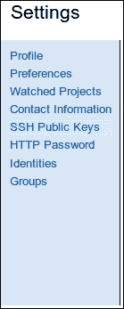

    Gerrit 设置

1.  将 `~/.ssh/id_rsa.pub` 的内容从剪贴板粘贴到标有**添加 SSH 公钥**的输入框中，并单击**添加**按钮，如下所示：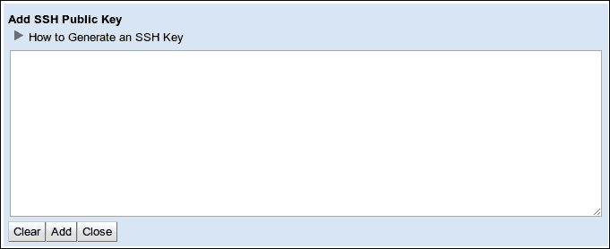

1.  通过在终端中运行以下命令验证您已成功配置 SSH 以访问 Gerrit：

    ```
    ssh tizen

    ```

1.  成功访问后，您应该看到以下欢迎消息：

    ```
    **** Welcome to Gerrit Code Review ****

    ```

然后，继续本教程的下一部分，并通过以下步骤配置 Git 以访问 Gerrit：

1.  请将以下命令中显示的 `First_Name` 和 `Last_Name` 替换，并执行它以配置 Git 用户名：

    ```
    git config --global user.name <First_Name Last_Name>

    ```

1.  将 `<Email>` 替换为您在 [tizen.org](http://tizen.org) 注册时使用的电子邮件，并运行以下命令以设置 Git 的电子邮件：

    ```
    git config --global user.email "<Email>"

    ```

## 工作原理

Tizen 项目的源代码使用分布式版本控制系统 Git 托管。这是一个由 Linux Torvalds 在 2005 年创建的开源解决方案，最初作为 Linux 内核开发工具。它迅速流行，并在大多数开源项目中得到广泛应用。GitHub 和 Gitorious 提供的服务在 Git 的普及中发挥了重要作用。

本教程的最后两步专门讲解了 Git 的全局选项。`git config` 命令有两个参数。第一个参数是要更新的设置，第二个参数是新值。

本教程中配置的另一个系统是 Gerrit。这是另一个开源工具，是一个与 Git 紧密集成的基于 Web 的代码审查系统。Gerrit 对于大型项目非常方便，因为它能更集中地使用 Git。其他一些知名的大型开源项目，如 Qt、Android、CyanogenMod、Eclipse、LibreOffice 和 MediaWiki，也依赖于 Git 和 Gerrit。

## 另请参阅

+   有关更多信息以及如何通过代理配置工作环境的说明，请查看 [`source.tizen.org/documentation/developer-guide/environment-setup`](https://source.tizen.org/documentation/developer-guide/environment-setup)。

# 在 Ubuntu 或 Debian 中安装开发工具

Tizen 平台开发工具适用于几种 Linux 发行版。它们的安装方法因每个发行版而异，但都使用它们的标准安装机制。本教程为在 Ubuntu 和 Debian 上使用 `apt-get` 提供了逐步安装指南。

## 如何操作...

如果您使用的是 Ubuntu 或 Debian，请按照以下说明操作：

1.  使用适当权限的文本编辑器打开文件`/etc/apt/sources.list`，例如：

    ```
    sudo vim /etc/apt/sources.list

    ```

1.  添加与您正在使用的 Ubuntu 或 Debian 版本对应的 Tizen 开发工具仓库。例如，Ubuntu 14.04 的仓库为：

    ```
    deb http://download.tizen.org/tools/latest-release/Ubuntu_14.04/ /

    ```

    ### 注意

    请注意行末的斜杠，指定仓库时不要忘记写上它。可以在[`download.tizen.org/tools/latest-release/`](http://download.tizen.org/tools/latest-release/)查看适用于不同 Linux 发行版的可用仓库完整列表。

1.  执行以下命令更新软件包的索引，并与前一步添加的仓库同步：

    ```
    sudo apt-get update

    ```

1.  使用以下命令安装必需的开发工具，GBS 和 MIC：

    ```
    sudo apt-get install gbs mic

    ```

## 工作原理

Debian 被认为是一个稳定的发行版，拥有庞大的支持软件包数据库。Ubuntu 是基于 Debian 构建的，最近已成为第三大使用平台（在操作系统方面，仅次于 Mac OS X 和 Microsoft Windows）。

强大的命令行工具`apt-get`用于 Debian 和 Ubuntu 的软件包管理。可以用它来安装、升级或删除软件包。本食谱中的整个过程是标准的，因为它遵循了在 Ubuntu 和 Debian 上安装软件包的常见工作流。第一和第二步是 Tizen 特有的，因为必须设置相应开发工具仓库的 URL。

## 还有更多...

强烈建议保持 Tizen 开发工具的版本最新。在 Ubuntu 和 Debian 中，可以通过执行带有以下参数的`apt-get`命令来获取所有软件包的最新版本：

```
sudo apt-get update
sudo apt-get upgrade

```

或者，可以使用以下命令将单个软件包或软件包列表升级到最新版本：

```
sudo apt-get install <package>Replace <package> with the name of the package or the list of packages separated by space if you want to upgrade more than one package. For example, if you have already installed GBS run sudo apt-get install gbs to get its version up to date.

```

## 另见

+   本文基于来自[tizen.org](http://tizen.org)开发者指南的信息。欲了解更多信息，请访问以下链接：

+   [`source.tizen.org/documentation/developer-guide/getting-started-guide/installing-development-tools`](https://source.tizen.org/documentation/developer-guide/getting-started-guide/installing-development-tools)

# 在 openSUSE 中安装开发工具

OpenSUSE 是一个免费的、基于 Linux 的通用操作系统。这个发行版的开发由一个同名的社区项目推动，该项目由 SUSE 赞助。这个食谱的目的是帮助 openSUSE 用户安装 Tizen 开发工具。

## 如何操作...

按照以下步骤在 openSUSE 上安装 GBS 和 MIC：

1.  添加与您的 openSUSE 版本匹配的 Tizen 开发工具仓库。例如，以下命令会添加与 openSUSE 13.1 兼容的仓库：

    ```
    sudo zypper addrepo http://download.tizen.org/tools/latest-release/openSUSE_13.1/ tools

    ```

    ### 注意

    如果你使用的是不同版本的 openSUSE，请在 [`download.tizen.org/tools/latest-release/`](http://download.tizen.org/tools/latest-release/) 浏览并找到适合该版本的 Tizen 开发工具仓库。

1.  按如下方式下载刚刚添加的仓库的元数据：

    ```
    sudo zypper refresh

    ```

1.  使用以下命令下载并安装 GBS 和 MIC：

    ```
    sudo zypper install gbs mic

    ```

## 它是如何工作的

在 openSUSE 上的安装过程与 Ubuntu 和 Debian 上的类似，但命令不同。在 openSUSE 中，包管理的命令行工具是 Zypper。安装的算法仍然与之前的食谱相同，但需要更少的手动操作。第一步是添加仓库，第二步是更新新仓库的元数据，最后一步是安装 GBS、MIC 或其他任何工具。

## 还有更多...

如果你计算机上的 Tizen 开发工具已经过时，并且想要获取最新版本，请运行以下命令：

```
sudo zypper refresh
sudo zypper update <package>

```

将 `<package>` 替换为你想要升级的软件包名称。例如，`gbs` 或 `mic`。

## 另请参见

+   Tizen 开发工具也可以在 Ubuntu、Debian、Fedora 和 CentOS 上安装。如果你想在其他发行版上安装这些工具，或者查看官方指南，请访问 [`source.tizen.org/documentation/developer-guide/getting-started-guide/installing-development-tools`](http://https://source.tizen.org/documentation/developer-guide/getting-started-guide/installing-development-tools)。

# 在 Fedora 和 CentOS 上安装开发工具

你已经在前面的食谱中看到如何在 Ubuntu、Debian 和 openSUSE 上安装 Tizen 开发工具。现在是时候讨论 Fedora 和 CentOS 了。这些 Linux 发行版的安装过程是相同的，因为 Fedora 和 CentOS 都基于 **Red Hat 企业版 Linux** (**RHEL**)。这两个发行版都使用 RPM 包，且由命令行工具 **YUM**（Yellowdog Updater, Modified）管理。

Fedora 由 Red Hat 拥有，但该项目由社区支持，许多志愿者参与了源代码的开发和维护。Fedora 每六个月发布一个新版本。

与 Fedora 不同，CentOS 的治理结构独立于 Red Hat，尽管该公司赞助了它。CentOS 的第一个版本于 2004 年 5 月发布。

## 如何操作...

请按照以下教程中的步骤，通过 YUM 在 Fedora 或 CentOS 上安装 Tizen 开发工具：

1.  通过 `wget` 将 Tizen 开发工具的仓库下载到 `/etc/yum.repos.d`，添加该仓库。以 Fedora 20 为例：

    ```
    sudo wget -O /etc/yum.repos.d/tools.repo http://download.tizen.org/tools/latest-release/Fedora_20/tools.repo

    ```

    ### 注意

    如果你使用的是 CentOS 或其他版本的 Fedora，请在以下网址浏览并获取与你的操作系统匹配的仓库文件：[`download.tizen.org/tools/latest-release/`](http://download.tizen.org/tools/latest-release/)

1.  执行以下命令以更新仓库的元数据：

    ```
    sudo yum makecache

    ```

1.  按照以下步骤安装 GBS 和 MIC：

    ```
    sudo yum install gbs mic

    ```

## 工作原理

如果您已经阅读了前两个食谱，那么您已经熟悉了安装的算法。不同的工具有不同的具体程序，Fedora 和 CentOS 有各自特定的程序。

就像在 Ubuntu、Debian 和 openSUSE 中一样，第一步仍然是添加 Tizen 开发工具的仓库。之后，必须下载新仓库的元数据。最后，使用`yum`下载来自该仓库的包。

## 还有更多内容…

为了保持 Tizen 开发工具的最新版本并进行升级，请运行以下命令：

```
sudo yum makecache
sudo yum update <Package>

```

将`<Package>`替换为需要升级的软件包的确切名称，例如`gbs`或`mic`。

## 另见

+   Tizen 开发工具安装的官方指南可以在[`source.tizen.org/documentation/developer-guide/getting-started-guide/installing-development-tools`](https://source.tizen.org/documentation/developer-guide/getting-started-guide/installing-development-tools)找到。

# 构建 Tizen 平台镜像

本食谱展示了制作 Tizen 平台镜像所需的配料和步骤。提供了逐步教程以及许多外部链接。根据这些信息，您将能够构建 Tizen 平台镜像，并在兼容设备上启动它们，接下来，您需要按照以下食谱中的说明进行操作。

## 准备工作

您即将开始一个耗时的过程。确保您有一台强力计算机来构建 Tizen 平台镜像，否则请准备好等待较长时间。尽管在配置较低的系统上也可以构建 Tizen 平台镜像，但根据我的个人经验，推荐的系统配置是全新 Intel Core i7 处理器和 8GB RAM。

应该设置平台开发环境，并按照前面食谱中的说明正确安装平台开发工具。

## 如何操作…

按照这些指南从头开始构建 Tizen 平台镜像：

1.  创建一个目录`~/bin/`，并将其包含在`PATH`中，如下所示：

    ```
    mkdir ~/bin/
    PATH=~/bin:$PATH

    ```

1.  下载 repo 脚本，并通过运行以下命令为其添加执行权限：

    ```
    cd ~/bin/
    wget http://commondatastorage.googleapis.com/git-repo-downloads/repo
    sudo chmod a+x ~/bin/repo

    ```

1.  创建一个新目录，Tizen 源代码将下载到该目录，操作如下：

    ```
    mkdir ~/tizen
    cd ~/tizen

    ```

    ### 注意

    上述示例中的目录名称是`tizen`。请根据需要设置一个适合您的目录名称。

1.  将`<user>`替换为您的 Gerrit 用户名，然后执行以下两个命令通过 SSH 下载 Tizen Common 的源代码：

    ```
    repo init -u ssh://<user>@review.tizen.org:29418/scm/manifest -b tizen -m common.xml
    repo sync

    ```

    ### 注意

    将清单更改为`ivi.xml`以下载 IVI 配置文件的源代码，或者更改为`mobile.xml`以下载移动配置文件的源代码。可用的分支和远程仓库的完整列表可以在[`source.tizen.org/documentation/developer-guide/getting-started-guide/building-packages-locally-gbs#available-branches-and-the-corresponding-remote-repos`](https://source.tizen.org/documentation/developer-guide/getting-started-guide/building-packages-locally-gbs#available-branches-and-the-corresponding-remote-repos)找到。

1.  打开`.gbs.conf`文件并进行配置。例如，这是 Tizen Common 的默认配置：

    ```
    [general]
    tmpdir=/var/tmp/
    profile = profile.tizen3.0_common
    work_dir=.

    [repo.tizen3.0_x86]
    url=${work_dir}/pre-built/toolchain-x86/

    [repo.tizen3.0_arm]
    url=${work_dir}/pre-built/toolchain-arm/

    [profile.tizen3.0_common]
    repos=repo.tizen3.0_x86,repo.tizen3.0_arm
    buildconf=${work_dir}/scm/meta/build-config/build.conf
    ```

    选择以下选项之一，并去掉行首的`#`以启用它：

    ```
    # For wayland ia32
    # buildconf=${work_dir}/scm/meta/build-config/build-ia32-wayland.conf
    # For emulator32 wayland
    # buildconf=${work_dir}/scm/meta/build-config/build-emulator32-wayland.conf
    # For wayland x86_64
    # buildconf=${work_dir}/scm/meta/build-config/build-x86_64-wayland.conf
    # For wayland arm32
    # buildconf=${work_dir}/scm/meta/build-config/build-arm-wayland.conf
    # For wayland arm64
    # buildconf=${work_dir}/scm/meta/build-config/build-arm64-wayland.conf
    ```

    ### 注意

    IVI 和移动配置文件的默认配置可以在[`source.tizen.org/documentation/developer-guide/getting-started-guide/building-packages-locally-gbs`](https://source.tizen.org/documentation/developer-guide/getting-started-guide/building-packages-locally-gbs)查看。

1.  使用 GBS 和与目标 CPU 架构匹配的命令构建所有包，如下所示：

    +   对于 i586，使用以下命令：

        ```
        gbs build -A i586 --threads=4 --clean-once
        ```

        ### 注意

        如果你正在构建 Tizen 2 平台镜像，请在之前的命令中附加`--exclude=gcc,cmake,filesystem,aul,libmm-sound,libtool`。

    +   对于 armv7l，使用以下命令：

        ```
        accel_pkgs="bash,bzip2-libs,c-ares,cmake,coreutils,diffutils,eglibc,elfutils-libelf,elfutils-libs,elfutils,fdupes,file,findutils,gawk,gmp,gzip,libacl,libattr,libcap,libcurl,libfile,libgcc,liblua,libstdc++,make,mpc,mpfr,ncurses-libs,nodejs,nspr,nss-softokn-freebl,nss,openssl,patch,popt,rpm-build,rpm-libs,rpm,sed,sqlite,tar,xz-libs,zlib,binutils,gcc"
        gbs build -A armv7l --threads=4 --clean-once --exclude=${accel_pkgs},filesystem,aul,libmm-sound,libtool

        ```

1.  从[`download.tizen.org`](http://download.tizen.org)下载适当的 kickstart 文件。例如，以下命令将下载用于构建 Tizen 2.2.1 的 kickstart 文件，以用于 RD-PQ：

    ```
    wget http://download.tizen.org/releases/2.2.1/tizen-2.2.1/builddata/image-configs/RD-PQ-REF.ks

    ```

1.  编辑 repo 部分，并将`--baseurl`参数的值更改为指向本地构建。此时，值必须以`file://`为前缀，并跟随绝对路径。

1.  最后，运行以下命令来使用 kickstart 文件创建 Tizen 镜像：

    ```
    gbs createimage –ks-file=RD-PQ-REF.ks

    ```

    ### 注意

    如果系统有超过 4GB 的 RAM，可以将`--tmpfs`作为额外的参数附加。

## 工作原理

Tizen 是一个开源软件平台，任何人都可以免费下载其源代码并从头开始构建。这个过程虽然费时，但并不难。

主要使用的工具是**Git 构建系统**（**GBS**）和**MeeGo 镜像创建器**（**MIC**）。GBS 是一个命令行工具，用于构建 Tizen 包。MIC 是继承自 MeeGo 的工具，用于创建镜像。现在，它的功能已经嵌入到 GBS 中，镜像可以通过运行`gbs createimage`命令直接创建。或者，你仍然可以通过`create`参数直接调用 MIC。

这个流程的步骤非常直观。首先，你需要获取源代码，然后构建包，最后使用 MIC 和适当的 kickstart 文件准备一个 Tizen 镜像。

Tizen 镜像可以为 ARMv7 和 i586 兼容的处理器构建。根据目标设备，你需要使用适当的配置，如第六步所示。

## 另见

+   Tizen 平台开发包含许多隐藏的宝藏。为了构建 Tizen 平台镜像，本文仅涵盖基础知识。有关更多信息和高级教程，请访问 [`source.tizen.org/`](https://source.tizen.org/)。

+   克隆不同 Tizen 版本和配置文件的源代码的详细说明可在 [`source.tizen.org/documentation/developer-guide/getting-started-guide/cloning-tizen-source`](https://source.tizen.org/documentation/developer-guide/getting-started-guide/cloning-tizen-source) 找到。

+   访问以下链接，了解如何在计算机上使用 GBS 构建软件包：[`source.tizen.org/documentation/developer-guide/getting-started-guide/building-packages-locally-gbs`](https://source.tizen.org/documentation/developer-guide/getting-started-guide/building-packages-locally-gbs)。

+   有关使用 GBS 构建本地软件包后创建镜像的最后步骤的详细信息，请访问：[`source.tizen.org/documentation/developer-guide/getting-started-guide/creating-tizen-images-mic`](https://source.tizen.org/documentation/developer-guide/getting-started-guide/creating-tizen-images-mic)。

+   Tizen 打包指南的信息可在 [`wiki.tizen.org/wiki/Packaging/Guidelines`](https://wiki.tizen.org/wiki/Packaging/Guidelines) 找到。

# 将 Tizen 镜像刷入移动设备

第一个 Tizen 参考设备是 RD-210，于 2012 年在 Tizen 开发者大会上宣布。如今已经过时，并且不再发布适用于其的新版本 Tizen 移动配置文件。其后继者在一年后以 RD-PQ 代号发布，截至本文撰写时，仍兼容所有最新的 Tizen 发布版本。RD-PQ 基于三星 Galaxy S3，具有类似的硬件规格。

本文提供了关于刷写这两款 Tizen 参考设备的指导方针。请注意，刷机过程虽然简单，但潜在风险较高。在执行任何设备操作之前，请仔细阅读所有说明以及提供链接中的信息。

## 准备工作

刷机过程非常精细。请做好准备，因为即使是小小的错误也可能导致永久性的不良结果，甚至最糟糕的情况下可能会砖化设备。

确保您拥有一台兼容 Tizen 的设备，并且其电池已充电。此外，您需要一根 USB 数据线，用于将设备连接到计算机。

需要使用 Linux 发行版的个人计算机。刷机过程依赖于一个称为 `lthor` 的工具。确保您可以成功设置 Tizen 开发工具存储库，并运行以下命令安装 `lthor`：

```
sudo apt-get update
sudo apt-get install lthor

```

作为预防措施，强烈建议您使用备用电源供应的计算机，例如充电电池充足的笔记本电脑，在刷机过程中最大程度地减少电力中断的风险。

## 如何做…

以下教程描述了 Tizen 参考设备（如 RD-PQ 和 RD-210）的刷机过程：

1.  为你的设备构建适当的 Tizen 映像，或者从 [`download.tizen.org/releases/`](http://download.tizen.org/releases/) 下载。

1.  关闭设备。

1.  同时按下音量减和电源硬件按钮，将设备引导至下载模式。

1.  通过 USB 电缆将设备连接到计算机。

1.  通过替换以下命令中的 `<Tizen image>` 为下载文件的名称，并执行该命令，来将映像刷入设备：

    ```
    sudo ./lthor <Tizen image>

    ```

    ### 注意

    如果你打算将 RD-210 从 Tizen 1.0 Larkspur 更新到更高版本，则需要进行额外操作。更多信息请参考以下链接：[`source.tizen.org/documentation/reference/flash-device#RD-PQ_RD-210`](https://source.tizen.org/documentation/reference/flash-device#RD-PQ_RD-210)。

## 还有更多内容...

在 Ubuntu 上，刷机过程的最后一步可能会因以下任何错误而失败：

+   握手失败错误：

    ```
    USB port is detected: /dev/ttyACM0

    line 328: failed to read signature bytes
    line 603: handshake failed
    line 922: failed to open port (null)

    ```

+   端口打开错误：

    ```
    USB port is detected : /dev/ttyACM0

    port open error!!
    : Device or resource busy
    line 954: failed to open port (null)

    ```

这两个问题已经在 Tizen 邮件列表中多次讨论过。它们是由 `modemmanager` 引起的，`modemmanager` 尝试通过 USB 端口与附加设备通信，从而阻止了 `lthor` 的正常工作。

如果你遇到上述任何错误，请使用以下命令卸载 `modemmanager`，然后重新运行 `lthor`：

```
sudo apt-get purge modemmanager

```

另外，如果你希望保留 `modemmanager`，请执行以下操作：

1.  移除或将 `modemmanager` 的 D-BUS 服务配置文件移到其他位置，具体操作如下：

    ```
    sudo mv /usr/share/dbus-1/system-services/org.freedesktop.ModemManager.service ~/org.freedesktop.ModemManager.service

    ```

1.  通过以下命令终止当前正在运行的所有 `modemmanager` 实例：

    ```
    sudo stop modemmanager
    sudo killall modem-manager

    ```

欲获取更多关于 `lthor` 的故障排除技巧，请访问 [`wiki.tizen.org/wiki/Troubleshooting_lthor_on_Ubuntu`](https://wiki.tizen.org/wiki/Troubleshooting_lthor_on_Ubuntu)。

## 另请参见

+   关于刷机 Tizen 参考移动设备的最新信息和详细信息，请访问 [`source.tizen.org/documentation/reference/flash-device#RD-PQ_RD-210`](https://source.tizen.org/documentation/reference/flash-device#RD-PQ_RD-210)。

# 启用 3D 加速和 OpenGL

本教程将指导你如何在为 Tizen 设备刷机后，立即启用 3D 加速和 OpenGL，适用于搭载 Mali GPU 的设备。

## 准备就绪

如果你已经刷入 Tizen 参考设备，例如 RD-PQ，在按照前述步骤操作后，你会在平台启动后立即注意到一个警告，如下所示：

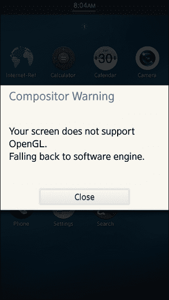

在 RD-PQ 上首次启动 Tizen 2 时，合成器警告

由于缺少 3D 加速和 OpenGL 的驱动程序，系统会显示警告。该问题影响许多内置应用程序，并干扰它们的正常运行。必须安装适用于 Mali DDK 的第三方驱动程序以解决该问题。

安装过程相当简单。它需要一台安装了 Tizen SDB 的计算机、一个互联网连接，当然，还需要 Tizen 设备。

## 如何操作...

安装 Mali DDK 有多种方式。无论选择哪种方式，最终结果都是相同的。启用硬件加速的以下方法非常简单：

1.  下载与已刷入设备上的 Tizen 版本兼容的 Mali DDK。以下是适用于 Tizen 2 的 Mali DDK 版本：

    +   Tizen 2.0 ([`source.tizen.org/mali-ddk`](https://source.tizen.org/mali-ddk))

    +   Tizen 2.1 ([`source.tizen.org/mali-ddk-2.1`](http://source.tizen.org/mali-ddk-2.1))

    +   Tizen 2.2 ([`source.tizen.org/mali-ddk-2.2`](http://source.tizen.org/mali-ddk-2.2))

    ### 注意

    Mali DDK 的源代码并不开放。请访问 [`source.tizen.org/`](https://source.tizen.org/) 查找最新版本的二进制文件。

1.  在计算机上提取下载的文件，例如：

    ```
    tar -xvzf hw_accel.tar.gz

    ```

1.  将 Tizen 设备连接到计算机，并使用 SDB 将提取的文件复制到设备中。以下示例中的命令将文件复制到 `/home/` 目录：

    ```
    sdb -d root on
    sdb -d push libdrm-exynos-gem-*.rpm /home/
    sdb -d push libump-*.rpm /home/
    sdb -d push opengl-es-mali400mp-*.rpm /home/

    ```

1.  登录设备，并进入你已复制文件的目录，例如`/home/`，如下所示：

    ```
    sdb -d shell
    cd /home/

    ```

1.  按如下方式删除旧软件包：

    ```
    rpm -e --nodeps opengl-es-virtual-drv

    ```

1.  按如下方式安装新软件包以启用硬件加速：

    ```
    rpm -ivh --force *.rpm

    ```

1.  最后，通过执行以下命令刷新文件系统缓存，并重启 Tizen 设备：

    ```
    sync
    reboot

    ```

或者，你可以通过首先将下载的 tarball 复制到设备上并直接提取它，来减少该过程的手动操作。

## 工作原理

Tizen 参考设备 RD-PQ 配备 Mali 400-MP4 GPU。其驱动程序作为 RPM 文件的 tarball 提供，因为 Tizen 作为平台使用 RMP 包管理器。需要使用 SDB 将文件复制到设备上，然后安装软件包。更改只有在设备重启后才会生效。

## 另见

+   关于在 Tizen 设备上启用 3D 加速和 OpenGL 的更多信息，请访问 Tizen 维基页面：[`wiki.tizen.org/wiki/Enable_3D_Acceleration_on_Tizen`](https://wiki.tizen.org/wiki/Enable_3D_Acceleration_on_Tizen)

# 在 Intel NUC 上启动 Tizen

Tizen 是一个支持 ARM 和 x86 架构的软件平台。英特尔作为 Tizen 项目的主要贡献者之一，正在为支持英特尔处理器的 x86 架构投入大量精力。这一架构在 40 多年前的 70 年代末首次推出，64 位版本的 x86 于 2003 年发布。

本教程专门介绍如何在搭载英特尔处理器的设备上刷写兼容 x86 架构的 Tizen 镜像。目前市场上有许多兼容设备，但本教程的重点是基于英特尔 Atom 处理器 E3815 型号的 Intel NUC。

## 准备工作

本教程需要一个用来刷写 Tizen 镜像的工具。它由 `bmap-tools` 包提供。按照 Tizen 开发工具的安装指南进行安装。例如，在 Ubuntu 上，可以使用以下命令安装：

```
sudo apt-get install bmap-tools

```

你还需要一个至少 4 GB 磁盘空间的 USB 存储棒和一台兼容的计算机，如 Intel NUC。Tizen 镜像将被刷入 USB 存储棒，其他所有数据将被完全擦除。为了防止数据丢失，请确保在继续操作之前已备份 USB 存储棒中的数据。

## 如何执行...

执行描述的操作以创建带有 Tizen 系统的可启动 USB 存储棒：

1.  将 USB 存储棒插入计算机。

1.  使用 `fdisk -l` 或查看 `dmesg` 的日志来识别设备。

1.  卸载设备。在基于 Unix 的系统上，可以按如下方式进行。将 `X` 替换为 USB 存储设备的 ID：

    ```
    umount /dev/sdX*

    ```

1.  使用 `bmaptool` 下载 Tizen 镜像，并将其复制到 USB 驱动器。如果不确定下载哪个镜像，建议下载里程碑版本，如下所示：

    ```
    bmaptool <Tizen> /dev/sdX

    ```

将 `<Tizen>` 替换为你本地磁盘上的镜像或镜像的 URL。

一旦你有了带有 Tizen 的可启动 USB 存储棒，你可以继续在具有 Intel 处理器的兼容设备上启动它：

1.  将 USB 存储棒插入 Intel NUC。

1.  打开设备。

1.  通过按 *F2* 进入 BIOS。

1.  修改启动顺序，并将 USB 存储棒设置为最高优先级。

1.  保存更改并继续。如果一切正常，Tizen 会很快启动。

## 工作原理

Tizen 被划分为多个配置文件。Tizen IVI 和 Common 更适合 Intel 架构。在本教程中，我们使用了 Tizen Common 的里程碑版本。这种版本应当稳定，建议如果不确定选择哪个版本时，可以依赖这个版本。

## 更多内容...

按照前述过程，你已经创建了一个带有 Tizen 系统的可启动 USB 存储棒，你可以将其复制到设备的持久存储中。

以下教程描述了将 Tizen 复制到 Intel NUC 内置存储的其中一种方法。需要第二个 USB 存储棒。

1.  将第二个 USB 存储棒插入计算机，并将相同的 Tizen 镜像作为原始文件复制到其中。之后，拔掉这个 USB 存储棒。

1.  当 Tizen 从第一个 USB 存储棒运行时，将第二个 USB 存储棒插入 Intel NUC。

1.  启动 Tizen 终端并以 root 用户登录。

1.  使用 `fdisk –l` 检测第二个 USB 存储棒和内部 eMMC 存储。

1.  使用 `umount` 卸载内部 eMMC 存储。

1.  将第二个 USB 存储棒中的 Tizen 镜像复制到 eMMC。使用以下命令，替换 `<Tizen image>` 为第二个 USB 存储棒中的文件，替换 `<storage>` 为 eMMC，例如 `/dev/mmcblk0`：

    ```
    bzcat <Tizen image> | dd of=<storage> bs=512k oflag=sync conv=sparse

    ```

1.  关闭设备，拔掉所有 USB 存储棒，然后重新启动设备。

1.  请确保设备从内部存储启动，如果一切正常，Tizen 将很快启动。

作为替代方案，您可以选择不使用第二个 USB 存储设备，而是在 Intel NUC 上启动 Tizen 并启用网络连接。之后，您可以将 Tizen 镜像复制到运行操作系统的 USB 存储设备中。

## 另见

+   欲了解更多关于在 Intel 设备上启动 Tizen 的信息，您可以访问 [`source.tizen.org/documentation/reference/flash-device#intel`](https://source.tizen.org/documentation/reference/flash-device#intel)

# 在 Allwinner 设备上启动 Tizen

Allwinner 是一家中国公司，其核心业务与 SoC 的开发相关。该公司成立于 2007 年，并于 2010 年凭借其搭载 Cortex-A8 处理器的 SoC（即 A10）在全球广受欢迎。2013 年，Allwinner 发布了 A20，搭载双核 Cortex-A7 ARM 处理器。

2013 年 4 月，Allwinner 因其在全球 Android 平板 AP 出货量中的领先地位获得 ARM 奖。许多受欢迎的单板计算机，如 OLinuXino、Cubieboard 和 Banana Pi 也使用 Allwinner 处理器，具有 ARMv7 兼容架构。所有搭载 Allwinner 处理器的设备也被称为 Sunxi。

由于其低价格，搭载 Android 的 Sunxi 设备在市场上具有极好的渗透率。它们对于 Tizen 生态系统也非常重要，因为它们为大量 Sunxi 设备的拥有者打开了大门。此外，搭载 Allwinner 处理器的开源硬件设备，如 OLinuXino 系列板卡，为初创公司和预算有限的爱好者提供了出色的创新机会。

本教程提供了将 Tizen 移植到 Sunxi 设备的完整指南。请注意，市面上有成千上万款搭载 Allwinner SoC 的设备。每款设备的规格不同，因此您需要根据您的设备以及所使用的 Tizen 版本调整教程。

## 准备工作

为本书中的最先进教程做准备。所提供的说明适用于通用的 Sunxi 设备，请根据您目标设备厂商的具体规格进行调整。

本教程按原样提供，不提供任何形式的保证。操作风险自负。请仔细阅读所有说明，并遵循硬件厂商的建议和指导。请注意，任何错误可能会导致设备损坏或其他不良行为。

为了顺利完成此教程，您需要一台 Linux 计算机、一台带有 microSD 卡槽的 Sunxi 设备，并且必须具备以下条件：

+   Tizen 平台开发环境设置

+   安装了 Tizen 平台开发工具

+   适用于 ARMv7 兼容设备的 Tizen 镜像

如果未能遵守上述任何要求，请参考前面的教程。

## 如何操作...

以下教程内容包括构建 Linux-sunxi 内核、U-Boot 加载程序、将 Tizen 刷入 microSD 卡以及在 Sunxi 设备上启动：

1.  通过运行以下命令设置工具链来构建内核和引导加载器：

    ```
    sudo apt-get update
    sudo apt-get install gcc-4.7-arm-linux-gnueabihf ncurses-dev uboot-mkimage build-essential git

    ```

    ### 注意

    Debian 用户可能需要将 [`www.emdebian.org/debian`](http://www.emdebian.org/debian) 的仓库添加到 `/etc/apt/sources.list` 中。

1.  创建一个目录，并使用 Git 下载 U-Boot 引导加载器的源代码到该目录：

    ```
    mkdir sunxi/
    cd sunxi/
    git clone -b sunxi https://github.com/linux-sunxi/u-boot-sunxi.git

    ```

    ### 注意

    强烈建议你使用设备供应商验证过的源代码版本。

1.  进入通过 `git clone` 创建的目录：

    ```
    cd u-boot-sunxi/

    ```

1.  使用 GNU `make` 工具从头开始构建 U-Boot 引导加载器。例如，以下命令将使用 **makefile** 为开源硬件开发板 A20-OLinuXino-MICRO 构建 U-Boot：

    ```
    make a20-olinuxino_micro CROSS_COMPILE=arm-linux-gnueabihf-

    ```

1.  检查文件 `spl/sunxi-spl.bin u-boot.bin u-boot-sunxi-with-spl.bin` 是否存在，以验证 U-Boot 引导加载器的构建是否成功。

1.  返回到主目录，并准备通过下载其源代码来构建 Linux-sunxi 内核。

    ```
    cd ..
    git clone https://github.com/linux-sunxi/linux-sunxi

    ```

1.  进入目录 `linux-sunxi`，并使用以下命令，结合适当的 `<defconfig>` 为目标平台构建内核：

    ```
    cd linux-sunxi/
    make ARCH=arm <defconfig>

    ```

    ### 注意

    项目中包含的所有 defconfig 文件位于目录 `linux-sunxi/arch/arm/configs/`。建议将任何第三方 defconfig 文件放置在相同的目录中。某些供应商（例如 Olimex）提供他们自己的 defconfig 文件。

1.  可选地，你可以使用以下命令构建内核模块：

    ```
    make ARCH=arm CROSS_COMPILE=arm-linux-gnueabihf- -j4 INSTALL_MOD_PATH=out modules
    make ARCH=arm CROSS_COMPILE=arm-linux-gnueabihf- -j4 INSTALL_MOD_PATH=out modules_install

    ```

1.  将 microSD 卡插入计算机并识别它。请注意，microSD 卡上的所有信息将被完全清除，Tizen 系统将被覆盖。

1.  将 `<X>` 替换为 microSD 卡的 ID，并启动 `fdisk`：

    ```
    sudo fdisk /dev/sd<X>

    ```

1.  通过在 `fdisk` 中运行 `p` 命令来获取 microSD 卡的总大小。这是一个 4 GB microSD 卡的示例输出：

    ```
    Command (m for help): p 

    Disk /dev/sdc: 4026 MB, 4026531840 bytes

    ```

1.  通过将上一步获取的大小除以单个柱面的大小来计算柱面数量，单个柱面的大小等于头数乘以扇区数再乘以单个扇区的大小。

    ### 注意

    单个柱面的大小为 255 个头、63 个扇区、每个扇区 512 字节，总大小为 8225280 字节。所以，如果例如 microSD 卡的总大小为 4026531840 字节，那么柱面的数量就是 489。

1.  使用 `fdisk` 中的 `d` 命令删除现有分区，如下所示。重复此操作，直到删除所有分区：

    ```
    Command (m for help):  d
    Partition number (1-4): 1

    ```

1.  配置 microSD 卡的头、扇区和柱面，按照如下方式；将 `<cylinders>` 替换为第 12 步计算出的值：

    ```
    Command (m for help): x
    Expert command (m for help): h
    Number of heads (1-256, default 30): 255
    Expert command (m for help): s
    Number of sectors (1-63, default 29): 63
    Warning: setting sector offset for DOS compatibility
    Expert command (m for help): c
    Number of cylinders (1-1048576, default 2286): <cylinders> 

    ```

1.  创建一个引导分区，其余部分留给 Linux 分区：

    ```
    Expert command (m for help): r
    Command (m for help): n
    Command action
    e extended
    p primary partition (1-4)
    p
    Partition number (1-4): 1
    First cylinder (1-123, default 1):
    Using default value 1
    Last cylinder or +size or +sizeM or +sizeK (1-123, default 123): +64M (see note above)
    Command (m for help): n
    Command action
    e extended
    p primary partition (1-4)
    p
    Partition number (1-4): 
    2
    First cylinder (10-123, default 10):
    Using default value 10
    Last cylinder or +size or +sizeM or +sizeK (10-123, default 123):
    Using default value 123

    ```

1.  为引导分区设置 FAT32 文件系统：

    ```
    Command (m for help): t
    Partition number (1-4): 1
    Hex code (type L to list codes): c
    Changed system type of partition 1 to c (W95 FAT32 (LBA))
    * You have to format 1st partitions with vfat32 filesystem.
    Command (m for help): a
    Partition number (1-4): 1

    ```

1.  通过再次运行 `p` 命令验证分区是否正确。

1.  使用 `w` 命令保存所有更改：

    ```
    Command (m for help): w
    The partition table has been altered!

    Calling ioctl() to re-read partition table.

    ```

1.  将 `<X>` 替换为 microSD 卡的标识符，并按如下方式格式化分区：

    ```
    sudo mkfs.vfat -F 32 -n boot /dev/sd<X>1
    sudo mkfs.ext4 -L rootfs /dev/sd<X>2
    sudo mkfs.ext4 -L data /dev/sd<X>3
    sudo mkfs.ext4 -L UMS /dev/sd<X>4

    ```

1.  卸载 microSD 卡并按如下方式写入引导加载器：

    ```
    umount /dev/sd
    <X>*
    dd if=u-boot-sunxi/u-boot-sunxi-with-spl.bin of=/dev/sd<X> bs=1024 seek=8

    ```

1.  完成后，挂载 microSD 卡，并将 Linux-sunxi 内核和配置文件（例如 `script.bin`）复制到启动分区，这些文件通常由硬件厂商提供。下面是一个示例：

    ```
    mkdir /mnt/sd1
    mount /dev/sd<X>1 /mnt/sd1
    cp linux-sunxi/arch/arm/boot/uImage /mnt/sd1
    cp script.bin /mnt/sd1
    sync
    umount /dev/sd<X>1

    ```

1.  确保以如下方式卸载所有 microSD 卡的分区：

    ```
    umount /dev/sd<X>*

    ```

1.  将每个 Tizen 镜像复制到相应的分区。在以下命令中，将 `<image>` 替换为 Tizen 镜像，将 `<X>` 替换为 microSD 卡的标识符，将 `<N>` 替换为分区号：

    ```
    sudo dd if=/dev/<image> of=/dev/sd<X><N> bs=1024 count=1

    ```

1.  可选地，你可以重新挂载启动（FAT32）分区，并创建 `uEnv.txt`，这允许热插拔某些配置项，如显示输出。将 `disp.screen0_output_type` 改为 `1` 以启用 LCD 显示，`3` 以启用 HDMI，`4` 以启用 VGA。下面是一个示例配置，用于在 `uEnv.txt` 中启用 HDMI 显示：

    ```
    console=tty0
    loglevel=5
    extraargs=console=ttyS0,115200 disp.screen0_output_type=3 disp.screen0_output_mode=EDID:800x480p33 hdmi.audio=EDID:0

    ```

1.  卸载并拔下 microSD 卡，然后将其插入 Sunxi 设备，启动设备以启动 Tizen。

## 它是如何工作的

这个教程包含了三个主要的组成部分：引导加载程序、内核和 Tizen 镜像。

U-Boot 是一个适用于 ARM、PowerPC、MIPS 和其他处理器的嵌入式设备通用引导加载程序。它被广泛应用于 Sunxi 设备，针对这些设备的一个分支托管在 GitHub 上。在教程的第二步中，U-Boot 的源代码从 GitHub 克隆，并在后续步骤中进行构建。

Linux-sunxi 是 Linux 内核的一个分支，托管在 GitHub 上。它专门为带有 Allwinner SoC 的设备进行了适配。其构建过程在步骤 6 到步骤 8 的说明中有详细介绍。

该教程的最后一个也是最复杂的部分是设置可引导的 microSD 卡。这部分从第 9 步开始。第一个分区采用 FAT32 文件系统，这意味着它可以很容易地在不同操作系统的计算机上挂载和编辑。这非常方便，因为你可能需要在 Microsoft Windows 计算机上更改一个二进制文件或编辑 `uEnv.txt`。

本教程包含了许多 Linux 命令。如果你不确定它们的工作原理，或者仅仅想查看它们的详细信息，请查阅相应的 Linux 手册页。例如，键入 `man dd` 以了解该命令的更多信息。

## 另请参见

+   该教程基于多个重要的资源。有关 microSD 卡分区的信息类似于在 PandaBoard 上启动 Tizen 的过程，更多详情可参考 Tizen Wiki，网址为 [`wiki.tizen.org/wiki/Tizen_IVI_Getting_Started_Guide_For_PandaBoard`](https://wiki.tizen.org/wiki/Tizen_IVI_Getting_Started_Guide_For_PandaBoard)。

+   Linux-sunxi 项目托管在 GitHub 上，网址为 [`github.com/linux-sunxi/`](https://github.com/linux-sunxi/)，更多信息也可以在 Wiki 上找到，网址为 [`linux-sunxi.org/Main_Page`](http://linux-sunxi.org/Main_Page)。

+   有一个由社区驱动的项目，旨在将 Tizen 移植到 Allwinner 设备，所有项目资源也都存储在 GitHub 上，网址为 [`github.com/leon-anavi/tizen-sunxi`](https://github.com/leon-anavi/tizen-sunxi)。

+   Tizen-sunxi 主要在由 Olimex 制造的开源硬件设备上进行开发和测试。关于为其最流行的单板计算机（配有 Allwinner 处理器）构建 Linux 内核和 U-Boot 引导程序的信息，可以在他们的博客中找到。以下链接对以下内容非常有用：

    +   A20-OLinuXino-MICRO ([`olimex.wordpress.com/2013/11/05/building-the-ultimate-debian-sd-card-for-linux-with-kernel-3-4-for-a20-olinuxino-micro/`](http://olimex.wordpress.com/2013/11/05/building-the-ultimate-debian-sd-card-for-linux-with-kernel-3-4-for-a20-olinuxino-micro/))

    +   A10-OLinuXino-LIME ([`olimex.wordpress.com/2014/06/23/a10-olinuxino-lime-debian-build-with-kernel-3-4-90/`](http://olimex.wordpress.com/2014/06/23/a10-olinuxino-lime-debian-build-with-kernel-3-4-90/))

    +   A13-OLinuXino ([`olimex.wordpress.com/2014/07/18/a13-olinuxino-wifi-debian-build-with-kernel-3-4-90/`](http://olimex.wordpress.com/2014/07/18/a13-olinuxino-wifi-debian-build-with-kernel-3-4-90/))

    +   A10S-OLinuXino-MICRO ([`olimex.wordpress.com/2013/10/28/building-debian-sd-card-for-linux-with-kernel-3-4-from-scratch-for-a10s-olinuxino-micro/`](http://olimex.wordpress.com/2013/10/28/building-debian-sd-card-for-linux-with-kernel-3-4-from-scratch-for-a10s-olinuxino-micro/))

+   关于 Tizen、ARM 设备和移植指南的更多信息可以在 Tizen Wiki 中找到。一个好的起点是[`wiki.tizen.org/wiki/ARM`](https://wiki.tizen.org/wiki/ARM)。

# 破解平板并在其上启动 Tizen

Allwinner 处理器可以在市场上找到许多设备中。根据其产品目录，Allwinner 在 2013 年为 Android 平板出货了最多的 ARM 处理器。

前面的步骤已经证明 Tizen 可以在配有 Allwinner 处理器的开发板上运行，接下来的步骤是如何在现有的 Android 平板上启动 Tizen。本步骤提供了如何通过逆向工程提取平板的二进制配置文件的指南。

## 准备工作

请确保满足以下前提条件：

+   一台 Android 平板（或最终智能手机），需要有 microSD 卡插槽，并且配备 Allwinner ARMv7 兼容处理器，如 A20、A13、A10、A10 等。

+   一台安装了**Android 调试桥**（**ADB**）的计算机，带有 Android SDK。

+   按照前面的步骤准备好 Tizen 镜像的可启动 microSD 卡。

## 如何操作...

按照这些指南提取平板的二进制配置文件，将其放入 Tizen 镜像中，并通过 microSD 卡从平板启动 Tizen。请注意，提供的说明是按原样给出的。过程复杂，操作需自行承担风险。

1.  打开平板，等待其 Android 系统启动图像加载完成，然后在**设置** | **开发者选项**中启用**USB 调试**。

1.  将平板连接到计算机并进入开发者模式。

1.  执行以下命令以进入平板的远程 Shell：

    ```
    adb shell

    ```

1.  挂载并访问平板的 NAND 内存，方法如下：

    ```
    mkdir /sdcard/nanda
    mount -t vfat /dev/block/nanda /sdcard/nanda

    ```

1.  退出 Shell，并使用`adb`将`script.bin`复制到计算机，方法如下：

    ```
    adb pull /sdcard/nanda/script.bin .

    ```

1.  将 microSD 卡插入计算机。

1.  在 microSD 卡的 FAT32 分区上覆盖`script.bin`，并删除`uEnv.txt`（如果存在的话）。

1.  从计算机中弹出 microSD 卡。

1.  关闭平板。

1.  将 microSD 卡插入平板。

1.  再次开启平板。如果一切按预期工作，Tizen 将直接从 microSD 卡启动。

## 它是如何工作的

这个命令行工具 Android 调试桥（ADB）用于连接 Allwinner 的 Android 平板，并复制其二进制配置文件。它是一个客户端-服务器程序，其目的与 SDB 完全相同，但适用于 Android 设备。

Sunxi 平板的内部存储，也就是它们的 NAND 闪存，作为可以挂载的设备，正如步骤 4 所示。之后，可以直接访问文件，并将其传输到计算机。这一技巧使得配置文件的逆向工程变得简单，并简化了其他平台（如 Tizen）和 Linux 发行版（如 Debian）的启动过程。

ADB 命令`pull`用于将`script.bin`从 Android 平板下载到计算机。`pull`命令的第一个参数是文件在设备上的位置，第二个参数是计算机中必须保存该文件的目的地。

## 还有更多…

要读取其配置文件，必须将从 Android 复制过来的二进制文件转换为`fex`文件。开源项目 Linux-sunxi，托管在 GitHub 上，提供了一个简单的命令行工具来完成这项工作。执行以下简单操作将`script.bin`转换为`fex`文件：

1.  使用`git`下载 sunxi-tools 的源代码，方法如下：

    ```
    git clone https://github.com/linux-sunxi/sunxi-tools.git

    ```

1.  从源代码构建`bin2fex`，方法如下：

    ```
    make bin2fex

    ```

1.  运行`bin2fex`将`script.bin`转换为`script.fex`，例如：

    ```
    ./bin2fex script.bin > script.fex

    ```

## 另见

+   这个方法的灵感来自于关于 A10 设备的文章，文章地址为[`elinux.org/Hack_A10_devices`](http://elinux.org/Hack_A10_devices)

+   关于 Android 调试桥和其命令的更多信息，请访问[`developer.android.com/tools/help/adb.html`](http://developer.android.com/tools/help/adb.html)
