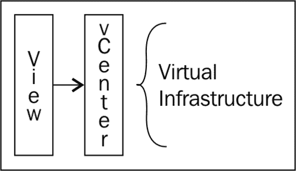
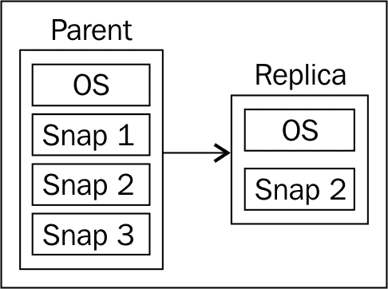
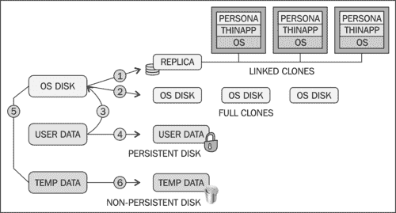
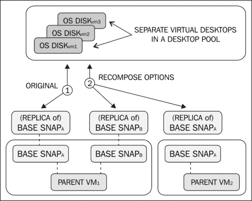
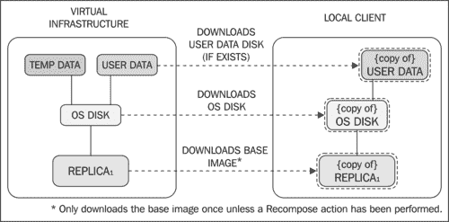
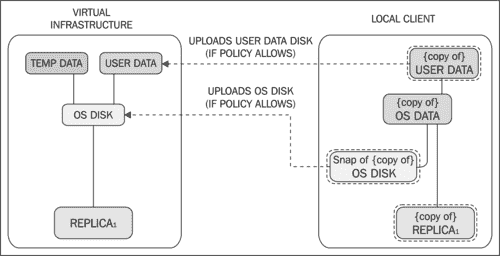
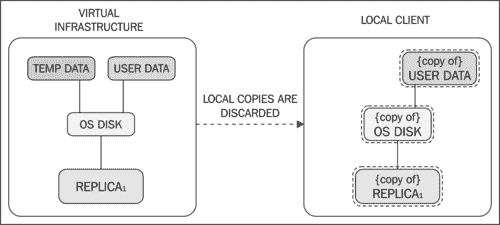

# 第一章. VMware View 的组成部分

**虚拟化**，即将操作系统与底层物理服务器组件进行抽象的技术，已经成为数据中心架构的基石。虚拟化使得组织能够在数据中心的单台物理服务器上运行多个操作系统，不仅仅是一个，而是几十个，甚至上百个。虚拟化的好处有很多，包括减少硬件、能源和冷却成本。此外，虚拟化还可以应用新的分布式和弹性技术，如**VMware 分布式资源调度器 (DRS)**和**VMware 高可用性 (HA)**。服务器虚拟化，即在服务器硬件上虚拟化服务器操作系统，已经成为一种主流技术，全球各地的组织都在广泛接受、采用和实施。

**虚拟桌面基础架构 (VDI)**，即在服务器硬件上虚拟化桌面操作系统，是另一个话题。

虚拟桌面推广较慢的原因最初是由于多种因素，包括技术尚不成熟、缺乏对全面解决方案的普遍理解、缺乏经过验证的交付方法以及对虚拟桌面项目成功标准的明确理解。

如今，许多障碍已经被消除。从通信协议到计算密度、平台稳定性以及理想的终端设备，相关的支持技术现已存在。全球一些最大的集成商已经建立了设计方法；然而，虚拟桌面项目仍然面临失败、停滞或受阻的情况。

本书将为架构师、工程师、项目经理、自由顾问或承包商提供一套经过验证的成功蓝图。更重要的是，本书将教授关键的成功标准，帮助读者衡量最重要的设计考虑因素，并如何提高项目成功率并确保顺利通过验收。

在深入讨论这些概念之前，理解**虚拟桌面 (vDesktop)** 解决方案的组成部分是非常重要的。本书中的技术重点是 VMware View，它是 VDI 领域的市场领导者。虽然本书中的一些概念专门适用于基于 VMware View 的解决方案，但许多话题将帮助任何技术的 VDI 架构师规划并构建成功的解决方案。

# VMware View 的核心组件

本书假设读者已经熟悉服务器虚拟化，特别是 VMware vSphere（行业内一些资深人士有时称之为 ESX）。因此，本章将重点讨论：

+   VMware vCenter Server

+   View 连接服务器的类型

+   代理和客户端软件

## vCenter Server

VMware vCenter 是 VMware View 解决方案的必需组件。这是因为 View Connection Server 通过 vCenter Web Service（通常通过 443 端口）与底层的**虚拟基础架构（VI）**进行交互。vCenter 还负责 VMware vSphere 提供的 VMware View 解决方案的补充组件，包括 VMotion 和 DRS（用于平衡物理主机上的虚拟桌面负载）。当最终客户购买 VMware View 套件时，VMware vCenter 会自动包含在内，无需单独通过**库存单位（SKU）**购买。在利用 vSphere 进行服务器虚拟化的环境中，vCenter Server 很可能已经存在。为了确保了解 VMware vCenter Server 提供的功能，以下列出了关键术语：

+   **vMotion：** 它是将运行中的虚拟机从一台物理服务器迁移到另一台物理服务器的能力，且没有停机时间。

+   **DRS：** 它是 vCenter Server 的功能，可以在参与同一 vCenter Server 集群的物理服务器之间平衡虚拟机负载。

+   **集群：** 它是一个物理服务器的集合，这些服务器可以访问相同的网络和共享存储。参与 vCenter 集群的物理服务器将它们的资源（例如 CPU、内存等）逻辑地汇集起来，以供虚拟机使用。

+   **HA：** 它是 vCenter Server 的功能，旨在防止物理服务器故障。HA 会在同一集群中的可用物理服务器上启动驻留在故障物理服务器上的虚拟机。

+   **文件夹：** 它是虚拟机的逻辑分组，在 vSphere 客户端中显示。

+   **vSphere 客户端：** 它是客户端软件，用于连接到 vCenter Servers（或运行 vSphere 的物理服务器）进行管理、监控、配置及其他相关任务。

+   **资源池：** 它是资源的逻辑池（例如 CPU、内存等）。位于同一资源池中的虚拟机（或虚拟机组）将共享预定的资源量。

设计 VMware View 解决方案时，通常会涉及到典型的服务器虚拟化设计概念，例如正确的集群设计。由于服务器虚拟化和 VDI 之间设计概念的重叠，许多服务器虚拟化工程师将相同的原则从一个解决方案应用到另一个解决方案中。

VDI 架构师常犯的第一个错误是将 VDI 视为服务器虚拟化并以相同的方式对待它。服务器虚拟化是对服务器操作系统的虚拟化。虽然 VDI 确实使用一些服务器虚拟化技术（例如用于连接基础设施），但有许多新概念对于成功至关重要，需要理解清楚。

VDI 架构师可能犯的第二个错误是未能理解某些 VDI 解决方案的真正规模。对于没有 VDI 环境的普通服务器虚拟化管理员来说，他/她可能只需要管理十几台物理服务器和几百台虚拟机。本书的作者曾参与过涉及数万台 vDesktops 的 VDI 解决方案，远远超出了传统 VMware vSphere 设计的限制。

VDI 通常在不同的规模上进行。架构扩展的概念将在本书后面讨论，但许多扩展概念围绕着 VMware vCenter Server 的限制。需要注意的是，VMware vCenter Server 最初是为了作为企业服务器虚拟化环境的中央管理点而设计的。虽然 VMware 持续改进其扩展能力，但围绕 VMware vCenter Server 进行设计仍然非常重要。

那么，VDI 架构师为什么一开始就需要 VMware vCenter 呢？

VMware vCenter 是 VMware View 解决方案中所有虚拟机任务的网关。包括以下任务：

+   创建虚拟机文件夹以组织 vDesktops

+   创建资源池，将物理资源为不同组的 vDesktops 进行隔离

+   vDesktops 的创建

+   快照的创建

VMware vCenter 不用于管理终端设备与 vDesktop 之间的连接。因此，VMware vCenter 的故障不应影响已配置的 vDesktops 的入站连接，因为它只会阻止新的 vDesktops 的创建、刷新或删除。

由于 vCenter Server 在 VDI 解决方案中的重要性，通常会采取额外的步骤来确保其可用性，甚至超出典型服务器虚拟化解决方案中的考虑事项。

本书后面有一个问题，询问是否应该使用现有的 vCenter Server 为组织的 VDI 提供服务，还是应该构建一个新的 vCenter Server 基础设施。

## View Connection Server

View Connection Server 是 VMware View 解决方案的核心组件；如果 VMware vCenter Server 是虚拟基础设施和底层物理服务器管理通信的网关，那么 VMware View Connection Server 就是终端用户连接到其 vDesktop 的网关。用传统的 VDI 术语来说，它是 VMware 的代理，连接终端用户与工作空间（无论是物理还是虚拟）。View Connection Server 是 VDI 解决方案的管理中心点，用于管理几乎整个解决方案的基础设施。然而，架构师在设计时有时需要考虑 vCenter 集群配置，如本书后面所讨论的那样。此外，VMware View 管理员有时也需要访问 vCenter Server。

### VMware View Connection Servers 的类型

安装 VMware View Connection Server 时有多种选项可供选择。因此，理解不同类型的 View Connection Server 及其在给定 VDI 解决方案中的作用至关重要。

以下是 View Connection Server 可以安装的三种配置：

+   **完全安装：** 此选项安装所有 View Connection Server 组件，包括一个新的 **轻量级目录访问协议（LDAP）** 实例。

+   **安全性：** 此选项仅安装 View Connection 门户所需的组件。View 安全服务器无需属于 Active Directory 域（与 View Connection Server 不同），因为它们不访问任何身份验证组件（例如，Active Directory）。

+   **副本：** 此选项为现有的 View Connection Server 实例创建副本，用于负载均衡或高可用性目的。认证/LDAP 配置将从现有的 View Connection Server 复制。

    ### 注意

    我们的目标是设计对最终客户高度可用的解决方案。因此，所有设计将利用两个或更多的 View Connection Server（例如，一个完全安装和一个副本）。

在完全安装 View Connection Server 时，将安装以下服务：

+   VMware View Connection Server

+   VMware View 框架组件

+   VMware View 消息总线组件

+   VMware View 脚本主机

+   VMware View 安全网关组件

+   VMware View Web 组件

+   VMware VDMDS

VMware VDMDS 提供 LDAP 目录服务。

## View Agent

View Agent 是安装在目标桌面上的组件，无论是物理的（很少）还是虚拟的（几乎总是）。View Agent 使 View Connection Server 能够与桌面建立连接。View Agent 还提供以下功能：

+   **USB 重定向：** 它被定义为使一个本地连接的 USB 设备显示为连接到 vDesktop。

+   **单点登录（SSO）：** 通过智能凭证处理来完成，要求只进行一次安全和成功的身份验证登录请求，而不是多次登录（例如，在连接服务器、vDesktop 等处）。

+   **通过 ThinPrint 技术的虚拟打印：** 它通过使用 ThinPrint（OEM）来简化打印机驱动程序的管理。

+   **PCoIP 连接性：** 这是由 Teradici 制作并在 VMware View 解决方案中使用的专用 VDI 协议。

+   **个人管理：** 它是在整个桌面环境中管理用户配置文件的能力；该技术通过 VMware 收购的 **恢复时间目标（RTO）** 实现。

+   **View Composer 支持：** 它是使用链接克隆和精简配置的功能，能够大幅减少在管理中到大型 VMware View 环境中的操作工作量。

## View 客户端

View Client 是安装在终端设备上的组件（例如，用户的笔记本电脑）。View Client 允许设备连接到 View Connection Server，然后将设备引导到可用的桌面资源。以下是两种类型的 View Client：

+   View Client

+   带本地模式的 View Client

这些独立版本有各自独特的安装文件（每次只能安装一个）。View Client 提供了在线连接工作的所有功能。如果解决方案中需要使用本地模式，则应安装带有本地模式的 View Client。

VMware View 本地模式是能够将 vDesktop 安全地检查到本地设备中，以便在断开连接的场景下使用（例如，在丛林中）。

安装包的大小差异约为 80 MB（带本地模式的 View Client 较大）。对于大多数场景来说，80 MB 的磁盘空间不会影响解决方案的可行性，因为即使是闪存驱动器也远超过 80 MB 的阈值。

除了提供能够连接到桌面的功能外，View Client 还与 View Agent 通信，以执行以下任务：

+   USB 重定向

+   单点登录

# 可选组件 — VMware View Composer

本章之前介绍的组件属于 VMware View 解决方案中的必需组件。VMware View 解决方案中唯一可选的主要组件是 View Composer。需要注意的是，当一些第三方解决方案（如 Unidesk 或基于存储的克隆）与 VMware View 一起使用时，View Composer 并不被使用。这是因为像 Unidesk 或基于存储的克隆等解决方案有自己的方式来处理 vDesktops 的大规模配置。

View Composer 在当前大多数基于视图的解决方案中都被使用，但也有一些非常有效的场景和解决方案不需要使用 View Composer。由于本书专注于 VMware View 解决方案，而不是 VMware View 与第三方组件的结合，View Composer 将在全书中进行详细讨论。

## View Composer 介绍

View Composer 是管理链接克隆部署的组件，稍后将在本章中介绍，旨在通过单一基准快照为桌面虚拟机部署克隆。

### 注意

View Composer 仅安装在 vCenter 服务器上。

View Composer 还使用一个独立的数据库来存储有关链接克隆桌面的映射、部署等信息。该数据库可以与现有的 vCenter 数据库位于同一数据库服务器上，前提是它是受支持的平台。然而，数据库本身必须是专用于 View Composer 的。这意味着 View Composer 数据库不能使用现有的 vCenter Server 数据库（但可以使用同一服务器上的独立数据库实例）。

此外，必须在 vCenter 服务器上设置一个单独的 **开放数据库连接（ODBC）** 连接，并提供适当的 View Composer 数据库连接信息。

### 注意

如果使用 View Composer，则仅支持自动池类型。此外，数据库实例必须是专用于 View Composer 的。

### 使用 vCenter 的 SQL Express 安装进行 View Composer 配置

小型**概念验证（PoC）**环境可能希望利用其 VMware vCenter Server 上的现有 SQL Express 安装。只要创建一个单独的数据库，就可以利用相同的 SQL Express 实例。要创建单独的数据库，请执行以下步骤：

1.  下载并安装 SQL Server Management Studio Express。

1.  连接到 SQL Express 的 vCenter Server 实例。

1.  右键点击实例名称，添加一个新数据库（例如，`View_Composer`）。

1.  配置 ODBC 连接，并使用`<vCenter Server>/SQLEXP_VIM`作为连接字符串。将`<vCenter Server>`替换为适合你环境的相关信息。

### 快照与链接克隆

快照保存了给定虚拟机的某一时刻的状态。超出该时刻快照的变化将写入增量磁盘，而原始虚拟磁盘（`.vmdk`）则被标记为只读。这样可以保持虚拟机的时刻状态，直到管理员删除快照为止。可以为给定虚拟机拍摄多个快照，这些时刻快照作为 VMware View Composer 链接克隆的基础。

### 链接克隆

**链接克隆**是基于虚拟机的特定快照（称为**父虚拟机**）创建的虚拟机副本。当创建链接克隆池时，VMware View Composer 会创建一个副本。

**副本**是原始只读基础虚拟机磁盘与特定时刻快照合并后的结果，该快照被选为给定 VMware View 桌面池的部署时刻。副本始终是精简配置的。

一个 View 桌面池一次只能指向一个特定的快照，但可以通过本书后面讨论的技术轻松更改。一个虚拟机可以有多个快照，因此单个虚拟机与多个快照可以作为环境中所有 View 桌面池的基础。这允许每个池基于自己的（或相同的）时刻快照。这是可能的，因为使用链接克隆技术的 View 桌面池并不直接使用基础虚拟机快照，而是使用副本（基础虚拟机+快照）。

虽然链接克隆是基于原始父虚拟机创建的，但每个链接克隆仍然具有唯一的**媒体访问控制（MAC）**地址和虚拟机**通用唯一标识符（UUID）**。

上图展示了一个包含三个快照（Snap1、Snap2 和 Snap3）的父虚拟机。每个快照表示虚拟机的不同时间点。例如，Snap1 快照可能安装了 Office 2007，Snap2 快照可能安装了 Office 2010，Snap3 快照可能安装了 Office 2010 和 Visio 2010。在这个例子中，Snap2 快照被选中用于虚拟桌面部署。一旦选择了该快照并启用了桌面池的配置，就会创建一个副本。这个副本不会复制其他 Snap1 或 Snap3 快照的状态。

使用副本可以保持原始父虚拟桌面的快照状态，从而允许父虚拟桌面在不影响使用副本的虚拟桌面状态的情况下进行开机、打补丁或修改。原因是副本是父虚拟桌面快照的副本，而不是实际的父虚拟桌面本身。

### 模板

**模板**是通过将虚拟机标记为只读并将其转换为模板而创建的虚拟机。模板只是一个虚拟机，它的 `.vmx` 配置文件被转换为 `.vmxt` 配置文件。虚拟机是只读虚拟机，之后用于克隆目的。从虚拟机模板创建的虚拟机是原始模板的直接副本。然而，可以使用自定义规范来更改新创建的虚拟机的某些方面（例如，SID、主机名、IP 地址等）。自定义规范是通过在连接到 vCenter Server 的 vSphere 客户端中使用自定义规范向导创建的。

### 完全配置与链接克隆的区别

VMware View 可以同时使用完全克隆和链接克隆。**完全克隆**是现有虚拟机模板的 1:1 独立副本。这与从 VMware vCenter 中部署虚拟机模板的过程相同。选择一个模板作为虚拟桌面的基础，并（可能）选择自定义规范。

使用完全配置（例如，虚拟机模板）部署的虚拟桌面在构建完成后不再需要访问原始模板。

链接克隆使用一个主虚拟机，然后为每个额外的虚拟机创建一个增量磁盘。额外的虚拟机在需要访问其基础镜像时（例如，访问核心 Windows 操作系统组件）会指向主虚拟机，但对于该特定虚拟机或用户的任何独特数据（例如，`...\Documents and Settings\`）则使用其增量磁盘。使用 View Composer 技术构建的桌面将对副本虚拟机具有只读访问权限，并对其增量磁盘具有读写权限。

### 注意

完全克隆是基于虚拟机模板创建的，而链接克隆是基于虚拟机快照创建的。

## 磁盘类型

有三种类型的磁盘——操作系统磁盘、用户数据磁盘和临时数据磁盘。

### 操作系统磁盘

操作系统磁盘存储系统数据（例如 Windows 7），并为功能齐全的桌面提供基础。

#### 次要操作系统磁盘

次要操作系统磁盘存储必须在某些 View Composer 活动（如刷新或重新组合）期间保留的操作系统数据。每个虚拟桌面都将有一个次要操作系统磁盘。这些磁盘通常为 10 MB 大小，且不可配置。

次要操作系统磁盘只能存储在与操作系统磁盘相同的数据存储中。

### 用户数据磁盘

持久用户数据磁盘是 VMware View 虚拟桌面的一个可选组件。用户数据磁盘用于存储用户配置文件信息。通过将这些信息存储在持久磁盘上，View Composer 的操作（如刷新和重新组合）将不会影响用户配置文件数据。另一种方式是将这些信息存储在操作系统磁盘内，这将导致在刷新或重新组合任务期间丢失用户配置文件数据。

用户数据磁盘的大小是可配置的。此外，持久用户数据磁盘可以存储在与操作系统磁盘相同的数据存储中，或存储在单独的数据存储中。

### 临时数据磁盘

非持久临时数据磁盘是 VMware View 虚拟桌面的一个可选组件，也称为**一次性磁盘**。临时数据磁盘用于存储操作系统交换文件以及在用户会话期间创建的临时数据。通过将这些信息存储在非持久磁盘上，每当虚拟桌面关闭时，VMware View 将删除存储在磁盘上的所有数据。这有助于减少虚拟桌面的增长（以 MB 为单位），因为一次性用户交互会被丢弃，并且不会成为每个用户标准操作系统磁盘的一部分。

临时数据磁盘的大小是可配置的。临时数据磁盘只能存储在与操作系统磁盘相同的数据存储中。

## 多种磁盘类型和重定向选项

以下是可用的磁盘类型和重定向选项列表：

+   操作系统磁盘

    +   链接克隆 (1)

    +   完全克隆 (2)

+   用户数据

    +   操作系统磁盘 (3)

    +   持久磁盘 (4)

+   临时数据

    +   操作系统磁盘 (5)

    +   非持久磁盘 (6)

下图说明了前述的磁盘类型及其重定向：

在前面的图示中，未显示次要操作系统磁盘，因为它不是 VMware View 中的可配置选项。

### 精简配置与厚配置

当使用**精简配置**创建虚拟磁盘时，磁盘只占用磁盘上实际的数据大小。例如，一个大小为 20 GB 但仅包含 8 GB 数据的虚拟磁盘（`.vmdk`）将只占用数据存储中的 8 GB。如果有两个虚拟桌面，每个桌面都有一个 20 GB 的虚拟磁盘，但每个磁盘只有 8 GB 的数据，这样它们将一起占用数据存储中的 16 GB。

当使用精简配置的虚拟机需要将新数据写入虚拟磁盘（从而增加虚拟磁盘的大小）时，它会在数据存储的块大小所定义的块中进行操作。数据存储的块大小是在格式化为**虚拟机文件系统（VMFS）**格式之前定义的。在 VMware vSphere 5 中，新的（与从 vSphere 升级的不同）数据存储使用统一的 1 MB 块大小。

例如，如果虚拟机位于一个 500 GB 的 VMFS-3 数据存储上，并且该数据存储是使用 2 MB 的块大小进行格式化的，那么一个 10 MB 的新写入操作将需要写入 5 个块（10 MB 文件/2 MB 块大小），这导致整体存储空间的使用效率较低。

### 注意

精简配置使得可以超额分配可用存储，并且如果没有适当的监控和管理，可能会引入严重问题。

当使用**厚配置**（默认）创建虚拟磁盘时，磁盘占据其在磁盘上分配的整个大小。例如，一个大小为 20 GB 的虚拟磁盘，尽管只有 8 GB 的数据，但会在数据存储上占用 20 GB。如果有两个虚拟桌面，每个虚拟桌面都有一个 20 GB 的虚拟磁盘，但每个磁盘只有 8 GB 的数据，它们将占用数据存储上的 40 GB。

View Composer 使用链接克隆技术。使用该技术的虚拟桌面包含一个指向原始金色快照副本的指针。需要澄清的是，该指针指向的不是原始（父）虚拟桌面本身，而是从某个特定时间点开始的父虚拟桌面的精确副本（副本）。View Composer 使用此技术，以便每个虚拟桌面不需要自己的完整虚拟磁盘。指针仅对副本进行只读访问，并将所有更改写入一个辅助磁盘，称为增量磁盘。

增量磁盘可以看作是变更记录。与修改金色快照不同，所有对原始磁盘的更改（增量）都会记录在金色快照之外，存储到增量磁盘中。这使得原始金色快照保持完好无损，同时仍然允许可用的操作系统接受用户和其他应用程序所做的更改。

#### 链接克隆的重置、刷新、重组和再平衡操作

使用链接克隆时，可以对克隆本身执行几个操作。这些操作如下：

##### **重置**

重置操作相当于按下虚拟机的**重置**按钮。这是一个非优雅的虚拟机重启，相当于拔掉桌面电源线然后重新插入。

##### **刷新**

刷新操作是将增量磁盘重置回其原始状态的操作。随着用户不断将更改写入其增量磁盘，操作系统增量磁盘可能会膨胀。刷新操作会导致操作系统增量磁盘中的数据丢失。

### 注意

刷新选项仅在使用持久化和自动化链接克隆桌面池时可用。在此操作期间，如果数据（例如用户数据）未重定向到其他位置（例如非持久磁盘），可能会丢失。

##### **重新合成**

重新合成操作是用于更改桌面池所使用的快照和/或父虚拟机的操作：

在前面的图像中，1 号是原始映射到基础快照，2 号表示在重新合成操作期间可用的选项。

管理员可以在以下场景中使用重新合成操作：

+   要更改链接克隆池以使用原始父虚拟机（例如 ParentVM_1）的不同快照（例如 Snapshot_B），而不是当前使用的快照

+   要更改链接克隆池以使用不同父虚拟机（例如 ParentVM_2）的快照（例如 Snapshot_A），而不是当前正在使用的父虚拟机

    ### 注释

    重新合成选项仅在使用持久化和自动化链接克隆桌面池时可用。

##### **重新平衡**

Rebalance 动作是一种将桌面均匀分配到桌面池中所有可用数据存储的操作。桌面必须处于就绪、错误或自定义状态（且没有待处理任务或取消）才能进行重新平衡。

Rebalance 操作还会自动执行桌面的刷新操作，这将把操作系统磁盘重置为其原始状态。

在进行重新平衡操作时，管理员可以设置是否在用户注销桌面后重新平衡桌面，或者强制所有活跃用户注销。

Rebalance 操作也是将链接克隆移至新数据存储的唯一支持方式。

## 可选组件 — VMware View 传输服务器

VMware View 传输服务器是自版本 4.5 以来 VMware View 中的新组件。传输服务器的主要作用是将桌面虚拟机从数据中心传输到最终本地设备，以便在离线场景中使用。在最终设备上本地运行虚拟桌面被称为 VMware View 中的本地模式。

传输服务器还管理虚拟桌面的存储库，这些虚拟桌面将在本地模式下使用，并提供本地镜像与数据中心中桌面镜像之间的同步功能。

### 注释

传输服务器不能与其他任何 VMware View 组件一起安装。

传输服务器的存储库可以存在于以下位置：

+   本地驱动器上的本地目录

+   通过 **通用命名约定 (UNC)** 的共享访问

确保传输服务器的存储库没有用完空间非常重要。作为参考，平均签出的 Windows XP 镜像将占用大约 3 GB 的存储空间。

此外，传输服务器必须使用以下组件：

+   静态 IP 地址

+   LSI 并行 SCSI 控制器

### 签出

检查虚拟桌面可能是 VMware 传输服务器执行的最密集的操作。签出操作涉及将整个发布的虚拟桌面镜像从 View 传输服务器下载到本地客户端，并在本地模式下运行；本地镜像以加密格式存储，并与镜像关联一个生命周期。签出操作还会在虚拟桌面上设置一个锁，确保禁止未来任何来自虚拟基础设施内连接的桌面请求：

由于使用了网络带宽（复制大量数据），签出过程应在最终设备与 VDI 位于同一局域网时进行。通过 3G 热点执行签出过程可能需要几个小时，甚至整整一天，具体取决于 vDesktop 基础设施的大小。

### 检查中

检查虚拟桌面时，涉及将增量数据和配置上传到 VMware View vDesktop，通过 View 传输服务器传输。这些数据存储在操作系统磁盘和用户数据磁盘（如果存在）上。未更改的基础镜像不会被上传。虚拟桌面上的锁定在虚拟基础设施内被释放，未来对该桌面的任何入站连接都将指向数据中心内运行的虚拟机（而不是再次重定向到本地模式）。

### 复制

复制是将本地虚拟桌面与其数据中心对等体同步的过程。复制仅传输增量数据（由用户生成的更改）。复制由复制策略管理，该策略配置如频率和用户推迟等设置：

如果本地模式虚拟桌面中的更改用户数据被视为有价值的数据，则需要在 View 管理控制台中定义复制策略。否则，如果没有强制复制，最终设备出现故障时，宝贵的数据可能会丢失。

VDI 的一个主要优势是将数据保存在数据中心的概念。本地模式有几个使用场景（本书后续会讨论），但它将数据带回边缘，即使是加密的。本地模式应仅在特定的使用场景下使用，不能将其视为典型的 VMware View 解决方案。

### 回滚

回滚是一种移除已签出的本地桌面访问权限的方法（另一种方法是移除所有权）。如果视图中的策略设置允许，最终用户也可以执行回滚操作：

回滚执行以下操作：

+   如果用户当前登录的是已签出的本地桌面，则该会话将被终止，且用户不能再次登录本地桌面。必须执行新的签出任务来恢复本地模式功能。

+   如果用户没有登录到已签出的本地桌面，所有后续的登录请求将被发送到数据中心运行的实例。必须执行一个新的签出任务才能恢复本地模式功能。

# 总结

本章提供了对 VMware View VDI 解决方案组件的一个坚实的介绍，包括 VMware vSphere 的基本知识。如果没有理解 VMware View 架构的基本概念以及底层 VMware vSphere 架构的基础，构建一个合适的 VMware View 解决方案将会非常困难。如需进一步阅读关于 VMware View 或 VMware vSphere 的内容，请参考 VMware 的管理、评估和安装指南，选择你需要的产品套件。

下一章将讲解如何收集组织的输入，以确保 VMware View 设计满足成功的要求。收集需求是许多 VDI 架构师跳过或匆忙完成的阶段，导致最终产品不尽如人意。一旦 VDI 架构师与一个组织进行了多次发现性接洽，他很可能只会问一些常见的陷阱问题（例如，“你们会使用双向音频吗？”），但在达到这种舒适度之前，建议进行全面的发现工作。

本书后续章节将使用第二章收集的输入，*解决方案方法论*，来为一个组织制定出有效的设计。
