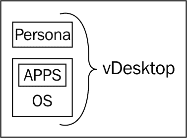

# 第二章：解决方案方法论

本章将重点介绍设计成功的 VMware View 环境所需的解决方案方法，包括收集输入、分析这些输入以及生成 VMware View 设计或项目输出。

**虚拟桌面基础架构（VDI）** 实施可能有多种项目驱动因素，包括降低成本、提高安全性或终端设备灵活性。在参与 VDI 项目时，定义项目成功标准非常重要。例如，如果一个组织希望减少流动医师的登录时间，那么将简化的登录过程（例如，单点登录）纳入整体解决方案中非常重要。

### 注释

一个没有解决组织关键标准的强大 VDI 解决方案，可能仍然会被评为中等成功，而不是被视为对最终用户工作环境的显著改善。

此外，对于为多个组织设计 VMware View 解决方案的解决方案提供商和架构师来说，采取科学和有组织的方法来设计 View 解决方案非常重要。并行设计不同组织的解决方案可能会非常混乱。通过对每个项目采取相同的方法，VDI 架构师可以减少错误，更重要的是，简化生产设计所需的工作量。

设计 VMware View 解决方案的关键阶段是：

+   评估

+   用例定义

+   设计

+   验证

+   交接/管理

正如在第一章 *VMware View 组件*中所述，本书侧重于基于 VMware View 5 设计解决方案。在完整的解决方案中，将有一个实施阶段，该阶段将跟随验证阶段。这些阶段将包括子主题，如定义项目时间表、关键里程碑、交接和操作准备等内容，这些内容也会被纳入其中。然而，这些主题超出了本书的范围。

本书是为架构师提供的指南，旨在设计最有可能成功的解决方案。

# 评估

VMware View 解决方案可能会替代现有的物理桌面，并需要迁移阶段，或者它可能是一个全新的解决方案，面向组织。无论哪种情况，都需要进行适当的评估，以了解如何确定硬件需求、存储需求以及可能需要的额外解决方案（例如，配置文件管理解决方案）。

评估用于收集必要的信息，以便正确设计解决方案。评估是收集技术信息和组织信息的过程。通常，评估有三个组成部分：

+   问卷

+   度量收集

+   讨论

## 问卷

**问卷**，无论是手动填写还是电子填写，都是开始收集必要数据以制定稳固 VMware View 设计的宝贵工具。问卷也是帮助组织感受到参与设计的有效工具，这有助于提高成功的机会。

积极参与 VDI 设计的组织会更加关注其成功。而那些仅被交付了 VDI 解决方案但未参与其中的组织，很可能会怀疑解决方案的效果。

本书作者制作的 VDI Fox™工具提供了一个可通过 iPhone 或 iPad 使用的问卷，适用于现场实时填写。问卷也可以在下一节中找到，可以打印出来现场填写，或者使用 VDI Fox 工具进行填写。有关 VDI Fox 应用程序的更多信息，请访问[`www.redfoxllc.com/`](http://www.redfoxllc.com/)。

### VMware View 5 桌面虚拟化解决方案的评估工作表

以下表格显示了 VMware View 5 桌面虚拟化解决方案的评估工作表：

| 问题 | 值 | 描述 |
| --- | --- | --- |
| 桌面池输入 |   |   |
| --- | --- | --- |
| 此解决方案将支持多少个自助服务终端（在此表格之后进行说明）？ |   | 它提供了将被配置为自助服务终端的 vDesktops 总数，并可能包含自动登录功能。 |
| 环境中最多支持多少个 vDesktop 用户？ |   | 它提供了一个持久性 vDesktop 解决方案的 vDesktops 总数。 |
| 在任何给定时间内，最多会有多少并发用户连接？ |   | 它提供了一个非持久性 vDesktop 解决方案的 vDesktops 总数。 |
| VDI 所需的桌面操作系统是什么？ |   | 它确定了 vDesktops 所需的内存和 vCPU 的基线。 |
| 现有桌面映像的总大小是多少？ |   | 它决定了需要多少磁盘空间。 |
| 你希望多久刷新一次 vDesktops？ |   | 它决定桌面池设置（立即刷新、*n*分钟后刷新、在*n*百分比磁盘膨胀时刷新等）。 |
| 需要维护多少个时间点快照以保持基础映像？ |   | 它决定了需要多少磁盘空间。 |
| 完全高可用解决方案？ |   | 它决定是否将使用冗余的 View 连接服务器、vCenter 服务器等。 |
| 是否支持远程工作人员？ |   | 它决定是否需要 View 安全服务器。 |
| 用户是否会根据连接位置进行分类？ |   | 它决定是否需要 View 连接服务器标签。 |
| 外部用户是否应该连接到与内部用户不同的 VDI？ |   | 它决定是否应使用 View 连接服务器标签。 |
| 是否会使用智能卡、CAC 卡、接近徽章等进行身份验证？ |   | 它决定了 View 客户端、View 代理和所需证书的设置。 |
| 您是否遵守 FIPS 140-2 合规要求？ |   | 它决定了 View 环境的高级设置。 |
| 您是否使用双因素 RSA 身份验证？ |   | 它用于配置高级身份验证选项。 |
| 您的远程用户主要处于连接状态吗？ |   | 它决定了解决方案是否需要 VMware View 本地模式。 |
| 是否允许使用 USB 驱动器？ |   | 它决定了高级 View 配置设置。 |
| 环境中是否有轮班工作者？ |   | 它决定了桌面池设置。 |
| 员工的平均工作日时长是多少？ |   | 它决定了桌面池设置。 |
| 存储输入 |   |   |
| 桌面镜像中可用空间是多少？ |   | 它决定了镜像的瘦化大小（总空间 - 空闲空间 = 瘦化大小）。 |
| 目前环境中有多少台桌面基础镜像？ |   | 它作为桌面池数量的输入，帮助解决方案配置。 |
| 环境输入 |   |   |
| 当前桌面是如何打补丁的？ |   | 它决定了 vDesktops 的打补丁方案。 |
| 您现有的服务器基础设施是什么？ |   | 它用于了解技术环境。 |
| 您现有的存储基础设施是什么？ |   | 它用于了解技术环境。 |
| 您的交换基础设施是什么？ |   | 它用于了解技术环境。 |
| 哪个团队管理您的虚拟服务器环境？ |   | 它用于了解政治环境。 |
| 哪个团队管理您的物理桌面环境？ |   | 它用于了解政治环境。 |
| 您预计谁将负责管理您的 VDI？ |   | 它用于了解政治环境。 |
| 实施后，谁将负责管理该解决方案？ |   | 它用于了解需要进行的操作准备水平。 |
| 当前的 Microsoft 桌面许可协议是什么？ |   | 它决定了是否有必要的 Microsoft 许可。 |
| 当前物理桌面的资产追踪方案是什么？ |   | 它决定了现有的技术环境。 |
| 是否会为该解决方案购买新的终端设备？ |   | 它决定了是否可以使用新设备（例如零客户端）或是否会重新利用现有硬件。 |
| 网络输入 |   |   |
| 是否会使用 CD 或 DVD 刻录机？ |   | 它用于了解 PCoIP 带宽的考虑因素。 |
| 是否会使用麦克风插孔耳机？ |   | 它用于了解 PCoIP 带宽的考虑因素。 |
| 是否会使用 Dragon Naturally Speaking 或 Dragon Medical？ |   | 它用于了解 PCoIP 带宽和存储 IOPS 的考虑因素。 |
| 是否会使用 USB 电话、录音机等设备？ |   | 它用于了解 PCoIP 带宽的考虑因素。 |
| 是否会定期进行视频流播放？ |   | 用于了解 PCoIP 带宽的考虑因素。 |
| 是否需要 VOIP 解决方案？ |   | 用于了解 PCoIP 带宽和终端设备的考虑因素。 |
| 大多数用户会远离 VDI 多远？ |   | 用于了解网络需求和拓扑结构。 |
| 解决方案会部署在敏感或机密网络中吗？ |   | 用于了解整体解决方案的高级配置。 |
| 目前你的物理桌面网络环境中使用了多少个 VLAN？ |   | 用于了解现有的网络布局。 |
| 是否支持远程办公地点？ |   | 确定是否需要整合远程办公地点解决方案。 |
| 目前桌面设备可用的**动态主机配置协议（DHCP）**范围（及其大小）是多少？ |   | 它决定了现有的网络拓扑结构。 |
| 配置文件管理输入 |   |   |
| 你今天使用什么进行配置文件管理？ |   | 它决定是否需要配置文件管理，和/或是否已经有现成的解决方案。 |
| 用户的主目录存放在哪里？ |   | 它决定了现有的配置文件管理解决方案。 |
| 成功标准 |   |   |
| 解决方案上线三个月后，如何确定你选择了正确的解决方案？ |   | 它引出了 VDI 项目的成功标准。 |
| 你实施 VDI 解决方案的主要动机是什么？ |   | 它引出了 VDI 项目的成功标准。 |

### 注意事项

**自助服务终端**用于标识将被配置为自动连接到 VMware View 环境中的虚拟桌面的终端设备。

## 指标收集

完成问卷后，便可以开始收集来自组织现有物理环境的实际数据。通过在收集使用数据之前完成问卷调查，指标收集阶段可以集中在关注的领域。

例如，如果在问卷调查中发现，VMware View 解决方案将支持工作 10 小时且经常使用双向音频（例如，Dragon Medical）的外科医生，那么收集这些外科医生的数据（如 CPU、内存和网络使用情况）会是有益的，即使他们只是整体最终用户群体中的一小部分。

可以在现有的物理桌面基础设施和现有的 VDI 解决方案上执行评估（例如，对于打算从 Citrix XenDesktop 迁移到 VMware View 的组织）。 

有多种方式可以收集评估数据，包括使用 Liquidware Labs Stratusphere Fit™。Fit 使用运行在桌面上的软件，并将数据报告回一个中央位置（Stratusphere Hub）。以下是收集的一些关键指标：

+   CPU 和内存使用情况（总量及每个应用的使用情况）

+   平均登录延迟

+   平均**输入/输出操作每秒（IOPS）**

+   网络延迟

+   外设

除了指标和库存收集外，Fit 还可以用于评估用户是否适合 vDesktop 解决方案。

### 注意

有许多成功的 VDI 解决方案在没有经过指标收集阶段的情况下实现；然而，这些解决方案很可能是由非常资深的 VDI 专业人员实施的。如果可能的话，建议执行指标收集阶段，因为这将大大提高项目的成功机会，并为项目进展过程中的好坏结果提供数据支持。

指标收集阶段的目标如下：

+   建立基准的平均用户

+   确定环境中使用最频繁的十个应用程序

+   识别当前点

+   识别 VDI 潜在的陷阱

+   将用户分类到不同的使用案例中

Fit 还可以用于将未来的 vDesktop 用户按使用类型进行组织，这些使用类型会转化为 View 基础架构中的桌面池。

例如，如果 Stratusphere Fit 确定绝大多数用户在其物理桌面上分配了 2 GB 的内存（并使用了 80%的分配内存），但一小部分用户有 4 GB 的内存（并使用了 80%的分配内存），则很可能需要两个不同的链接克隆桌面池（至少）。第一个池将有一个基本的桌面映像，内存为 2 GB，而第二个池将有一个基本的桌面映像，内存为 4 GB：

上述图示说明了数据必须先收集，然后进行分析。分析后可以开始设计。

为了正确确定需要采购多少物理硬件以及如何在桌面池中进行用户群体的合理分配，收集基于真实用户活动的信息至关重要。需要收集的一些关键指标包括如下的平均值和峰值：

+   内存使用率

+   CPU 使用率

+   CPU 准备/等待时间

+   网络吞吐量

+   网络延迟

+   磁盘吞吐量（MBps）

+   磁盘活动（IOPS）

+   磁盘读写百分比

+   使用频率最高的应用程序

+   显示器数量

+   独特的外设需求

+   未使用的应用程序

+   图形密集度

使用大多数收集工具时，必须在待调查的桌面上安装代理。安装该代理的最有效方式通常是通过现有的机制，如组策略对象、Microsoft System Center Configuration Manager、登录脚本或其他多种方法。

### 注意

虽然数据收集工具在敏感或机密网络上通常是禁止使用的，但 Liquidware Labs 已经采取了必要的措施和认证，使其能够在许多敏感网络上运行这些工具。

Fit from Liquidware Labs 生成的独特报告帮助 VDI 架构师正确理解现有的物理桌面环境，从而设计和实施一个强大的 VMware View 解决方案：

您可以在[`www.liquidwarelabs.com/images/Bubble_Graphs.png`](http://www.liquidwarelabs.com/images/Bubble_Graphs.png)找到前面的截图。

推荐收集数据的时间为两到四周，以确保足够的时间捕捉到最典型的业务周期。如果被评估的组织有已知的高峰工作期（例如，季度末结算），在此期间收集数据可能会有帮助。然而，建议不要让收集异常数据拖慢整体项目进度。仔细分析是重要的，但就像过长的容量规划评估可能使服务器虚拟化项目陷入困境一样，过长的 VDI 评估也可能带来同样的问题。

### 数据处理

一旦收集了终端用户的数据，重要的是要正确理解和分析从客户环境中获得的信息，如下所示：

+   内存使用量（以 MB 为单位）

    +   **输入：** 它是终端用户消耗的总内存（包括活动内存和峰值内存）。此指标的总和并不能得出 VDI 解决方案所需的总内存。

    +   **输出：** 它有助于确定物理环境所需的总内存量。公式如下：

        vDesktops 所需的 MB + 支撑基础设施所需的 MB + 虚拟机管理程序的 MB 开销 + 交换空间所需的 MB = 总所需的 MB。

+   CPU 使用量（以 GHz 为单位）

    +   **输入：** 它是终端用户消耗的总 CPU 使用量（包括活动和峰值）。在 VDI 环境中，总 CPU 使用量可能不如每核心的用户数那么重要。

    +   **输出：** 这有助于确定物理环境所需的总 CPU 使用量，并用于确定哪些用户可能需要多个 vCPU。

        ### 注意

        **为什么是每核心的用户数？**

        计算每个核心的用户数比尝试确定每个用户所需的总 MHz 更为重要。两个与 CPU 相关的关键指标是 CPU Ready 和 CPU Wait。**CPU Ready**是指一台机器在等待 CPU 变得可用时所花费的时间（单位：毫秒）。如果设计中每个核心实现了过多的虚拟桌面（vDesktops），最终用户将会经历较高的 CPU Ready 时间，且他们的虚拟桌面会变得缓慢，因为虚拟桌面需要等待彼此释放 CPU 时间以满足自己的处理需求。**CPU Wait**是指 CPU 等待 I/O 完成时所花费的时间（单位：毫秒）。较高的 CPU Wait 通常表明存在磁盘或网络瓶颈。例如，某个特定的虚拟桌面可能正在运行一个过程，该过程需要读取和写入大量数据到本地文件系统。如果底层存储无法满足虚拟桌面进程的性能需求，就可能会出现较高的 CPU Wait 时间。

+   网络吞吐量（单位：KBps）

    +   **输入：** 用于确定现场和/或远程解决方案中的潜在瓶颈。由于 VDI 解决方案通常在一个集中位置实施，网络吞吐量可用于确定远程办公地点与 VDI 位置之间所需的带宽。

    +   **输出：** 例如，远程站点的最终用户与集中位置 VDI 之间的网络吞吐量较低时，可能会选择在远程办公室实施 VDI，并从中心位置进行管理（这是一种解决有限网络吞吐量的方案）。理解 VDI 用户可能有的任何特殊网络带宽需求也是非常重要的。

+   网络延迟（单位：毫秒）

    +   **输入：** 用于确定现场和/或远程解决方案中的潜在瓶颈。由于**Microsoft 远程桌面协议（RDP）**和 VMware 的 PCoIP 协议对延迟敏感，因此理解最终用户与 VDI 位置之间的数据传输的往返时间非常重要。

    +   **输出：** 例如，具有高网络延迟的环境可能会选择在终端设备和虚拟桌面内实施优化 PCoIP 协议的策略。这些策略可能限制高级图形功能并使用压缩来最大化最终用户的体验。

+   磁盘吞吐量（单位：MBps）

    +   **输入：** 用于从带宽角度确定支持 VDI 的底层存储环境中潜在的瓶颈。

    +   **输出：** 例如，某些需要大量磁盘吞吐量的用户（如录音）可能需要将其虚拟桌面存放在与其他虚拟桌面用户不同的数据存储上。这不仅暗示并促进了存储平台的分层，还防止了低磁盘吞吐量的用户受到高吞吐量用户的影响。

+   磁盘活动（单位：IOPS）

    +   **输入：** 用于从性能角度确定支撑 VDI 的底层存储环境可能存在的瓶颈。

    +   **输出：** 磁盘 IOPS 是 VDI 设计中最重要的指标之一，因此，本书后续章节将专门讨论 VDI 解决方案中存储的基本概念。在迁移到 VMware View 解决方案之前，收集终端用户消耗的磁盘 IOPS 可以为需要在解决方案中支持的总体磁盘 IOPS 数量提供参考。然而，正如本书稍后讨论的那样，存储设计在 VMware View 解决方案的整体成功中起着至关重要的作用。

+   磁盘读/写百分比

    +   **输入：** 用于帮助确定适合 VDI 的存储环境。

    +   **输出：** 关于为 VDI 设计合适存储环境的更多信息可以在本书后续部分找到。

+   最常用的应用程序

    +   **输入：** 列出大多数用户在特定用户群体中日常使用的常见应用程序。

    +   **输出：** 了解最常用的应用程序有助于确定给定应用虚拟化（AppVirt）解决方案的候选列表，例如，VMware ThinApp。最常用的应用程序列表还可能有助于确定哪些应用程序将包含在桌面池的父镜像中。

+   显示器数量

    +   **输入：** 用于确定给定用户正在使用多少个显示器。

    +   **输出：** 由于支持额外的显示器将改变 vDesktop 的内存设置（如果使用链接克隆，则影响到给定池中的所有 vDesktop），因此，将多显示器用户与单显示器用户区分开来可能会有益。随着环境数量的增加，双显示器已成为标准，而四显示器则属于异常情况。在这种情况下，将四显示器用户单独区分可能会有所帮助：

+   独特的外设要求

    +   **输入：** 用于确定与 VMware View 解决方案可能存在的兼容性问题。

    +   **输出：** 例如，一个用户群体可能需要使用网络摄像头进行协作。在撰写本文时，VMware View 5 尚不支持网络摄像头。

+   未使用的应用程序

    +   **输入：** 用于确定在桌面环境中从不使用或很少使用的应用程序。

    +   **输出：** 例如，一个环境中可能包含多个当前金镜像中的应用程序。然而，从实际角度考虑，可能不需要将这些应用程序包括在 VMware View vDesktop 部署的基础镜像中。

+   图形强度

    +   **输入：** 用于从带宽角度确定支撑 VDI 的底层存储环境可能存在的瓶颈。

    +   **输出：** 例如，用于确定哪些用户可能需要额外的硬件（例如，刀片 PC）来提供终端用户所需的图形水平。在某些环境中，vDesktop 的能力无法提供某些用户群体所需的图形能力。在这些环境中，将刀片 PC 解决方案集成到 VDI 中的解决方案（例如 ClearCube 的解决方案）将是理想的。

# 使用场景定义

一旦在评估阶段收集了足够的数据，就可以分析这些数据以确定具体的使用场景。

**使用场景**是一个集合，涵盖连接、性能、外设和其他特征，适用于一组 vDesktop 用户。在定义环境的主要使用场景时，重要的是使用评估阶段收集的数据以及（如果可能）观察到的用户实际操作情况。

例如，通过仔细的评估阶段，可以确定如下内容：

+   总计 300 个 vDesktop 用户

+   其中 50 个需要支持 2 个显示器

+   其中 25 个具有高性能需求，配置为 2 个 vCPU 和 6 GB 内存

+   其中 200 个满足平均需求，配置为 2 个 vCPU 和 1.5 GB 内存

+   其中 25 个需要支持 4 个显示器

如果设计尝试在单一桌面池中支持所有前述需求，则该桌面池将支持 4 个显示器和配置为 6 GB 内存的 vDesktops。此类设计将浪费大量物理资源（例如，175 个 vDesktop 额外需要 4 GB 内存，总共浪费 700 GB）。

因此，正确的设计应如下所示：

+   基于 2 个 vCPU 和 6 GB 内存的金图像的 25 个桌面池

+   一个桌面池，包含 50 个桌面，支持最多 2 个显示器

+   一个桌面池，包含 25 个桌面，支持最多 4 个显示器

+   一个包含 200 个桌面的桌面池，支持大部分用户环境；基于 2 个 vCPU 和 1.5 GB 内存的金图像

一些关键问题可以帮助确定使用场景，具体如下：

+   提供良好 vDesktop 体验所需的最小性能要求是什么？

+   是否有双向音频需求？

+   必须支持多少个显示器？

+   桌面是否是一次性（非持久）？

+   用户配置文件将如何管理（如果适用）？

+   是否有任何独特的安全或合规需求？

通过确定 VDI 解决方案支持的各种使用场景，最终设计不仅可以支持所需的使用场景，还能确保底层物理基础设施的优化。

在使用场景定义阶段结束时，已收集并与组织讨论并达成一致的设计解决方案所需输入。

# 设计概述

VDI 解决方案是在典型服务器虚拟化解决方案的基础上增加了连接基础设施、角色管理（如果适用）、桌面池基础设施、终端设备等要求，如下图所示，展示了 VMware View 解决方案栈：

此外，对于经验丰富的服务器虚拟化架构师而言，VDI 解决方案的要求通常与典型的服务器虚拟化解决方案有显著不同（例如，vSphere 集群的设计方式），因此在认识到 VMware View 解决方案的新影响时，必须尊重 VMware vSphere 设计的重要性。例如，VDI 解决方案可能比经典服务器虚拟化解决方案拥有更高的虚拟机到物理机的密度。此外，计算和存储需求可能呈现更强的波动性，具有更高的峰值和更短的持续时间，而不是经典服务器虚拟化解决方案。

尽管以下许多小节（例如存储、用户角色管理）将在本书后面更详细地讨论，但在以下章节中，针对每个设计所使用的方法论会提供简要概述。

## 存储

**存储**是影响整体 VMware View 解决方案的重要领域。如果存储基础设施设计不当，整个解决方案可能最终失败。

本书主要关注利用 VMware View Composer 提供的链接克隆技术的 VMware View 解决方案。在使用链接克隆的设计中，所有 vDesktop 都共享一个副本磁盘。因此，存储考虑因素，例如读 I/O 操作每秒（IOPS），在设计 VDI 解决方案的存储子系统时至关重要：

在前面的图示中，重读负载被描绘为每个用户在给定桌面池中都从同一个副本磁盘读取。然而，每个用户将写入他/她自己的操作系统磁盘（以及持久用户数据磁盘和/或非持久临时数据磁盘，如果适用的话）。

此外，了解终端用户的应用环境也很重要，因为像 Nuance 的 Dragon Medical 这样的应用程序在执行转录任务时可能会对磁盘造成较大的负载。对于需要高存储 I/O 的用户，建议将其放入独立的桌面池：

如前图所示，链接克隆允许使用存储分层。在前面的示例中，副本磁盘（一个高读 I/O 负载）被放置在**企业闪存驱动器（EFDs）**上，并通过 RAID 10 保护。用户数据虚拟磁盘被放置在通过 RAID 5 保护的 SCSI 10K 驱动器上。链接克隆使得存储子系统能够在经济性、技术性和功能性上量体裁衣，以匹配 VDI 的需求。

### 数据存储级别的隔离

在设计 VMware View 解决方案时，尤其是利用链接克隆技术时，理解能够将桌面池、用户类别和性能需求分开存放在不同数据存储上的内在优势是非常重要的。

在下图中，Pool 1 支持需要 I/O 密集型应用的重负载用户，Pool 2 支持一般用户群体，而 Pool 3 支持为上门客户提供的自助服务终端：

例如，在 Pool 1 中，副本磁盘可以存放在性能优化的 EFD 上（支持极高的 IOPS），用户的写入活动（例如，操作系统磁盘）发生在 SCSI 15K 硬盘的 RAID 10 集合中（支持高 IOPS），而用户的非持久性数据存放在 SATA RAID 5（支持低 IOPS）的硬盘上。

此外，对于 Pool 2，副本磁盘可以位于一个基于 EFD 的单独数据存储上，用户的写入活动发生在一个单独的 SCSI 10K RAID 5 数据存储上。Pool 2 也可以使用相同的数据存储来存放非持久性的临时数据，假如需要的话。

最后，Pool 3 还可以使用与 Pool 1 和 Pool 2 分开的数据存储来存放其副本磁盘和用户的操作系统磁盘。

#### 为什么这是有益的？

这样做有以下好处：

+   **节省成本：** 在此解决方案中，不需要为整个存储阵列配置昂贵的 EFD，而只需购买足够的 EFD 来支持所需的副本磁盘。相反，对于非持久性和性能不敏感的数据，可以使用便宜的 SATA 硬盘。

+   **性能调优：** 在此解决方案中，使用了适当的技术（例如，EFD）来提供优化的终端用户体验。通过使用分层存储，只有在必要时才使用针对高 I/O 优化的磁盘，而不是将其用于所有磁盘活动。

+   **性能隔离：** 在此示例中，Pool 1 中的极高负载使用（例如，登录风暴、应用程序批处理等）不应影响 Pool 2 中的终端用户（假设存储阵列网络不是瓶颈）。因此，可以将高 I/O 用户（例如，双向音频医生）与中等 I/O 用户（例如，行政人员）隔离开来。

+   **服务级别协议：** 在此示例中，每个池使用自己的数据存储来存放副本磁盘。然而，如果每个池使用相同的数据存储来存放副本磁盘，可能会导致一个桌面池的操作和活动影响到另一个桌面池，从而使遵守和执行**服务级别协议（SLA）**变得非常困难。

## 网络

在设计 VDI 时，必须考虑几个核心网络组件，包括**动态主机配置协议（DHCP）**租约、**域名系统（DNS）**解析、负载均衡和虚拟交换机技术。本书稍后会详细介绍这些内容，但值得注意的是，建议尽早与组织的网络团队进行沟通。

## 计算

正如在第一章中提到的，*VMware View 组件*，每个核心的用户数量是 VMware View 解决方案计算层的主要衡量标准。随着处理能力和处理密度的不断提高，计算层变得越来越不需要过多关注，特别是在使用六核或更多核心的处理器时。

## VMware vSphere 和 View 桌面池基础架构

正如本书后续章节中更详细讨论的那样，健全的 VMware vSphere 基础架构对强大的 VMware View 解决方案至关重要。对于经验丰富的 vSphere 架构师来说，健全的 vSphere 基础架构的许多概念将是熟悉并且已经实践过的。然而，VMware View 解决方案可能会超出 VMware 定义的某些最大值。例如，在当前版本的 VMware vCenter 中，启动的虚拟机的最大数量为 10,000。对于一些大规模的 VDI 实施，这个数字很容易被超越。无论如何，理解从管理层的角度来看，10,000 个虚拟桌面可能不是一个可以接受的数字是很重要的。本书将介绍如何为大规模 VMware View 解决方案正确设计 VMware vSphere 基础架构。

### Pod 架构

如前所述，VMware View 解决方案可能会超出 VMware vSphere（底层虚拟基础架构平台）允许的最大值。因此，多个 VMware vSphere 环境集合，称为 pod，被用来为 VDI 提供模块化的构建块。**pod** 是一组运行 VMware ESX 的物理服务器，包含一个或多个 VMware vCenter 服务器，以及支持存储和网络基础架构，以提供 *n* 数量的虚拟桌面。这个数量会根据设计、独特的客户需求以及评估阶段收集的数据而有所不同：

在上面的图示中，pod 由一个 VMware vCenter 环境组成，该环境管理两个集群，每个集群有八个主机。每个集群八个主机的配置是 VMware View 支持的最大配置。因此，在大多数 VMware View pod 中，一个集群通常包含六到八个主机（通常是八个）。

## 应用分发基础架构

无论是使用 VMware ThinApp、Citrix XenApp、Microsoft App-V 还是其他解决方案来交付应用程序到桌面环境，了解环境的运行位置、使用方式以及它对整体解决方案的影响（例如，网络影响）都至关重要。本书将涵盖与 VMware View 解决方案相关的应用虚拟化的关键概念。然而，本书并不深入探讨应用虚拟化的技术组件。

## 用户画像管理

在 VDI 解决方案中，管理用户画像有很多选择，例如 Microsoft 文件夹重定向和用户状态迁移工具（User State Migration Tool）、Liquidware Labs ProfileUnity 和 AppSense。

VMware 收购了 **RTO**，现在提供与 VMware View 5 集成的用户画像管理解决方案。然而，在写作时，VMware View 架构师社区在大规模解决方案中尚未充分利用内置的这一功能。不管怎样，用户画像管理将在本书后续部分中讨论，因为理解它们如何集成（尤其是在非持久性桌面池中的集成方式）以及用户画像可能带来的潜在网络影响是非常重要的。

### 什么是用户画像？

**用户画像**是与特定用户相关的一组设置，包括设置、收藏夹、快捷方式、壁纸、自定义、桌面图标、打印机和其他独特的设置。

如前所述，vDesktop 由三个抽象层组成，这些层是操作系统层、应用层和用户画像层。

操作系统层是 vDesktops 的执行环境，主要是 Microsoft Windows XP 或 Microsoft Windows 7（或计划为 Microsoft Windows 7）。

应用程序（Apps）层可以通过使用应用虚拟化解决方案（例如，VMware ThinApp）作为单独的层，或者可以包含在操作系统层中：

在前面的图示中，应用层并不独立，而是嵌套在操作系统层内。这意味着，要更新桌面池中的单个应用程序，必须更新整个父镜像：

在前面的图示中，应用层独立于操作系统层，因此可以独立更新。这使得管理员能够更新单个应用程序，而无需对 VMware View 桌面池的组成进行大规模更改。在大多数情况下，使用应用虚拟化（AppVirt）解决方案来管理 VDI 中的某些或所有应用程序具有显著优势。应用程序的用户群体和性能特点可能会影响你关于如何交付应用程序的整体决策。

## 连接基础设施

连接基础设施包括代理服务器或 VMware View 连接服务器、可选的负载均衡器、最佳 WAN 优化器、DNS 解决方案以及任何高级路由功能（例如，思科全球站点选择器）。

由于所有传入的连接最终都将首先路由到 VMware View 连接服务器，因此必须确保至少有一个 VMware View 连接服务器始终可供终端用户使用。

一旦连接成功认证，VMware View 客户端会直接连接到 vDesktop 中的 VMware View 代理；这被称为**直接连接**。对于直接连接，一旦用户已连接到桌面，VMware View 连接服务器的故障不会影响现有连接，但会影响未来的连接请求。

可以使用 Microsoft 协议与 VMware View 进行配合。Microsoft RDP 使用隧道连接。这种隧道连接会与 View 连接服务器或 View 安全服务器打开第二个 HTTPS 连接。在这种情况下，如果提供次要 HTTPS 连接的 View 连接服务器或 View 安全服务器出现故障，会导致终端用户断开连接。

## 终端设备

如本书后续所详细介绍，有各种终端设备提供不同的好处（和权衡）。了解市场上众多设备是很重要的，这有助于理解它们如何融入 VMware View 解决方案。本书将介绍主要的终端设备类别，包括厚客户端、薄客户端、零客户端、Apple iPad 以及前瞻性的终端设备。

## 人员

人员是任何 VDI 解决方案中最重要的层面。VDI 架构师必须始终明白，项目的成功往往会根据使用该解决方案的人、他们的体验、他们的感知以及他们过渡到虚拟桌面环境的情况来衡量。

如果不将人们置于解决方案的核心位置，可能会带来灾难性的后果。从终端设备到桌面池配置的选择，都应该考虑最终用户的幸福感。

# 验证

一旦设计方案已制定、审核并批准，就进入验证阶段。验证通常在全规模解决方案的代表性子集上进行。例如，在一个利用两台完全配置的 HP c7000 Blade 机箱的解决方案中，可以使用一个半配置的机箱来测试配置、基本功能和基础存储性能。在某些场景下，可能会使用一次性硬件来测试软件组件。

利用经济可扩展的硬件平台，如 Nutanix 融合虚拟化设备（[`www.nutanix.com/`](http://www.nutanix.com/)）或 Pivot3 vSTAC（[`pivot3.com/`](http://pivot3.com/)），不仅可以以较低的入门成本验证设计，还可以支持未来的生产解决方案。

验证解决方案的最佳方法之一是根据设计文档中详细的规格构建一个试点环境。试点环境搭建完成后，可以招募一个试点用户组来测试用户体验、功能性，并对底层硬件施加负载。

## VMware View Planner 工具（前身为 VMware RAWC）

VMware View Planner 工具，前身为**参考架构工作负载模拟器（RAWC）**工具，是在 VMware View 环境中模拟终端用户连接和活动的最佳方式。对于希望并行对 VMware 及其他竞争解决方案进行压力测试的组织，Login VSI 工具（[`www.loginvsi.com/`](http://www.loginvsi.com/)）将支持对比测试。VMware View Planner 工具仅适用于 VMware View 环境。

VMware View Planner 工具包含以下内容：

+   **会话启动器虚拟机：** 此虚拟机启动实际的 vDesktop 会话。每个会话启动器虚拟机最多可支持 20 个并发会话。

+   **控制器虚拟机：** 此虚拟机托管 View Planner 界面和用于配置及日志文件的网络共享。

+   **目标 vDesktops：** 用于压力测试的 vDesktops 上安装了 View Planner 代码（或作为父镜像的一部分）。

+   **电子邮件服务器虚拟机（可选）：** 如果将使用 Microsoft Outlook 进行 View Planner 测试，并且没有可用的 Microsoft Exchange 服务器进行测试，则此虚拟机是必需的。

View Planner 可以根据需要执行以下终端用户任务：

+   **Microsoft Word：** 插入文本，保存修改，调整窗口大小，关闭应用程序

+   **Microsoft Excel：** 插入数字，插入和删除列和行，复制和粘贴公式，保存修改，调整窗口大小，关闭应用程序

+   **Microsoft PowerPoint：** 打开演示文稿，进行幻灯片演示，调整窗口大小，关闭应用程序

+   **Microsoft Outlook：** 设置邮箱，发送电子邮件，执行发送/接收，调整窗口大小，关闭应用程序

+   **Internet Explorer：** 浏览网页，调整窗口大小，关闭应用程序

+   **Windows Media Player：** 查看视频，关闭应用程序

+   **Adobe Acrobat Reader：** 打开 PDF 文档，滚动浏览文档，调整窗口大小，关闭应用程序

+   **Java Runtime：** 运行 Java 应用程序，关闭应用程序

+   **McAfee AntiVirus：** 执行实时病毒扫描，关闭应用程序

+   **7-Zip：** 压缩文件，关闭应用程序

通过这份功能全面的清单，可以执行多种测试，以测试整体 VDI 性能、登录风暴、启动风暴、存储性能等。

### 注

**启动风暴与登录风暴**

在研究、设计、讨论和规划 VDI 解决方案时，启动风暴和登录风暴这两个术语将经常出现；然而，这两个术语不能互换使用。

**启动风暴**是指足够多的虚拟桌面启动（或从挂起状态恢复），导致整体 VDI 性能下降。这可能是由于一个或多个数据存储无法承受 I/O 负载，虚拟桌面/数据存储过多导致文件锁冲突，DHCP 租约请求洪水等原因造成的。

**登录风暴**是指足够多的终端用户登录虚拟桌面，导致整体 VDI 性能下降。这可能是由于创建初始配置文件、流式传输用户的个人信息、Active Directory 性能缓慢、磁盘未对齐（例如，Windows XP 未正确设置偏移量）等原因造成的。

将 RAWC 与像 Liquidware Labs Stratusphere UX（用户体验）或 RTO PinPoint 等监控解决方案结合使用，可以让 VMware View 架构师在验证阶段识别瓶颈，而不是在实施阶段。

### 比较存储平台

由于 RAWC View Planner 提供了对一系列定制测试（无论是固定的还是随机的）进行科学测试的方法，这些测试可以成为实验中的控制变量，而存储平台则是实验的变量。

例如，如果需要量化 RAID 10 中 EFD 相较于 SCSI 15K RAID 10 的真正优势，可以在第一轮使用 EFD，在第二轮使用 SCSI 15K，针对桌面池运行保存的 RAWC 测试。

该技术不仅可以用来测试、量化和优化存储阵列及其配置，还可以用来比较来自多个供应商的存储阵列。

非常感谢 Fred Schmischeimer 对 RAWC 工具的帮助，以及他提供的信息指南《虚拟桌面参考架构的工作负载考虑因素》。

# 总结

VDI 解决方案设计复杂；通过采取一种结合硬数据（指标收集）以及组织输入（问卷）的有针对性方法，适当设计的可能性大大增加。本章讨论了 VMware View 解决方案中的各个层次，需注意的一些陷阱，以及可以帮助支持整体设计和验证过程的一些行业工具。

下一章讨论了 VDI 架构师可以做出的最重要的设计考虑之一，*持久性还是非持久性？* 这个问题的答案是 VMware View 设计的基石，因此需要充分理解，以确保最佳的设计结果。
