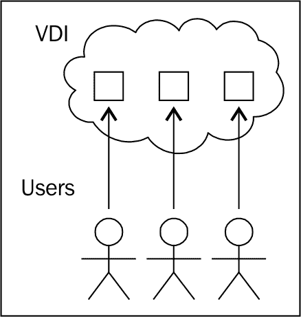
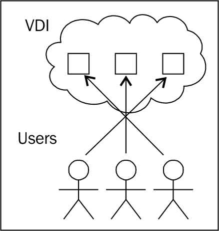
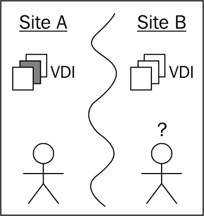
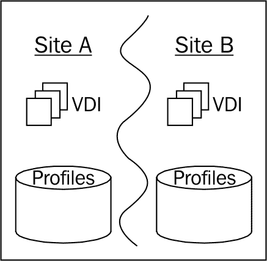
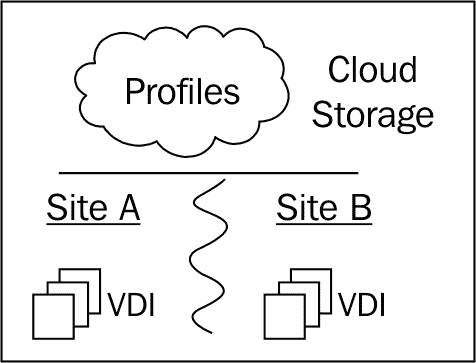

# 第三章 持久或非持久 vDesktop

在设计过程中必须尽早做出的一个基本决策是选择使用持久还是非持久 vDesktop。这个决定可能会影响到整个 VDI 的多个领域，包括存储、桌面池和管理。

本章内容将涵盖：

+   持久桌面

+   非持久桌面

+   多站点解决方案

+   如何为您的组织选择

**持久桌面**是分配给特定终端用户并且在注销后会保存其状态的 vDesktop：

例如，在上面的图示中，如果 User_1 第一次登录到 VMware View 环境并自动分配到 vDesktop_7，他今天、明天以及直到分配被移除之前，都会连接到 vDesktop_7。如果 vDesktop_7 出现问题并不可用，User_1 将无法获得一个正常的工作环境，也无法进行有效的工作。

使用持久桌面时，如果分配的 vDesktop 不可用，VMware View 不会自动重新分配终端用户到一个可用的 vDesktop。

持久 vDesktop 会保留持久数据，直到：

+   vDesktop 已从特定用户解除分配

+   vDesktop 所在的桌面池被刷新（链接克隆）

+   vDesktop 所在的桌面池被重新组合（链接克隆）

**非持久桌面**是一种未分配给特定终端用户的 vDesktop，而是提供给终端用户群体使用：

例如，在上面的图示中，如果 User_1 登录到 VMware View 环境，他会被分配一个可用的 vDesktop（例如，vDesktop_9）。当他/她注销后再次登录到 VMware View 环境时，系统会随机分配一个来自池中的其他可用 vDesktop。

每个 vDesktop 在任何给定时间只能有一个所有者。

有几个设置可以从 VMware View 管理员控制台进行调整，决定在用户执行注销时，非持久 vDesktop 从用户解除分配的速度。

# 持久桌面

从历史上看，持久 vDesktop 在 VDI 实现中得到了广泛使用，因为持久 vDesktop 最接近物理世界，能够让终端用户和 IT 管理员更容易理解虚拟世界。这种 1:1 的关系（终端用户与 vDesktop 之间的关系）可能是最简化的部署选项，但其设计和成本考虑需要被充分理解。

持久 vDesktop 通常在组织中更容易进行政治上的推销，因为每个用户仍然拥有一个独立的（虚拟）桌面资产。下表解释了与持久 vDesktop 相关的领域：

| 区域 | 影响 |
| --- | --- |
| 桌面池大小 | 每个终端用户都需要一个 vDesktop。 |
| 可用性 | 如果用户分配的 vDesktop 不可用，用户将无法连接。 |
| 操作系统故障的可恢复性 | 可以使用 VMware HA 监控 vDesktop 对基本 ping 命令的响应。如果 vDesktop 没有响应，它可以通过 VMware vSphere 自动重启。 |
| 站点故障的可恢复性 | 无法轻松恢复站点故障。 |
| 成本 | VDI 必须支持整个目标用户群体的 vDesktop，包括计算和存储要求。 |

## 示例场景

以此为例，假设 Customer_A 有 6,000 个终端用户。他们计划转向 VMware View 解决方案。Customer_A 每天运行三班制，每班有 2,000 个终端用户工作。

客户请求帮助以确定解决方案所需的硬件范围（例如，提供物料清单或材料清单）。

平台将使用 Windows 7，配置 1 个 vCPU、2GB 的 RAM 和 50GB 的`C:\`驱动器。

硬件平台决定为每台服务器配置 2U 机架服务器，每台服务器配备两个 6 核处理器（每台服务器总共 12 个核心）。

使用每核心 10 个虚拟机的平均保守估算，得到每台服务器可支持 120 个 vDesktop。每个 vDesktop 需要 2GB 的 RAM，因此需要 240GB 的 RAM 来支持 120 个 vDesktop。加上操作系统开销以及可以轻松从任何供应商处订购的数量后，将 240GB 的 RAM 上调至每台服务器 256GB。

因此，针对该解决方案所使用的服务器规格包括一台 2U 服务器，配有两个 6 核处理器和 256GB 的 RAM。以下表格解释了服务器规格和与持久 vDesktop 相关的成本：

| 区域 | 描述 |
| --- | --- |
| 物理服务器规格 | 一台 2U 服务器，配有两个 6 核处理器和 256GB 的 RAM |
| 每台物理服务器上的 vDesktop 数量 | 120 |
| 终端用户总数 | 6,000 |
| 在任何给定时刻需要 vDesktop 的终端用户总数 | 2,000 |
| 必须配置并可用的 vDesktop 总数 | 6,000 |
| 不考虑 *n* + 1 情况下所需的物理服务器总数 | 50 |
| 估算所需机架数量 | 3 |
| 每台物理服务器的成本 | $40,000 |
| 物理服务器成本小计 | $2,000,000 |
| 处理器总数 | 100 |
| 每个 vDesktop 的 VMware vSphere View Premier 估算费用 | $250 |
| VMware View 许可小计 | $1,500,000 |
| **总成本** | **$3,500,000** |

尽管 Customer_A 在任何给定时刻只有 2,000 个终端用户在线，但由于 Customer_A 有 6,000 个独立终端用户，为了支持这个环境下的持久性 vDesktop，VDI 必须提供 6,000 个 vDesktop。可以使用非常严格的超时值和注销参数来减少支持的 vDesktop 总数（可能从 6,000 减少到 5,000），但这会增加整体解决方案的风险，并且在某些环境中可能不可行。

以每台物理服务器 40,000 美元的粗略估算，估计的总成本，包括服务器费用以及 VMware vSphere 和 VMware View Premiere 的粗略估算（不包括捆绑或附加定价），为 3,500,000 美元。

该估算未包括端口费用的财务考虑。例如，如果每台服务器只需要两个网络连接（例如，使用 10GbE），那么生产网络连接还需要额外的 99 个交换机端口，以及一个单独的带外管理连接（例如，HP ILO）。

该估算未包括保护 VMware vCenter 服务器的 VMware vCenter Server Heartbeat 所需的额外 VMware vCenter Server 数量的财务考虑。因为大型 VMware View 解决方案可能需要额外的 VMware vCenter 服务器，并且这些服务器可能会受到 VMware vCenter Server Heartbeat 的保护（每个 vCenter Server 约 15,000 美元）。

该估算未包括与服务器相关的冷却和电力成本的财务考虑。

从人力资源管理的角度来看，操作上也更加困难。随着人员的进出，vDesktop 可能会扩展并消耗资源，因为没有简单的方法来跟踪和维护与用户帐户相关的用户数据磁盘。

最后需要考虑的是持久解决方案所需的物理 U 空间。对于需要最小占用空间的环境（例如，战术安装），每一个 U 都具有重要意义。

总结来说，持久桌面对于大多数环境，特别是大规模环境，可能是一种低效的解决方案。

# 非持久桌面

非持久 vDesktop 解决方案随着 VDI 在行业中越来越广泛应用，并且实施规模越来越大，已经变得越来越普遍。由于持久 vDesktop 通常需要大量的额外资源，即技术、人力和财力，本书将主要关注利用非持久 vDesktop 的解决方案。

虽然大多数人在想到 VDI 时仍然会想到持久 vDesktop，但展示在某些情况下利用非持久解决方案所带来的优势和成本节省是非常重要的。

VDI 更关注的是在需要时提供桌面资源，而不是数据中心中某台特定虚拟机的拥有权，且这些资源是根据用户的特定配置文件进行定制的。虽然有很多解决方案不需要定制 vDesktop（例如，酒店中的自助服务终端解决方案），但大部分 VDI 实施将针对具有独特桌面需求的用户。以下表格解释了与非持久 vDesktop 相关的领域：

| 区域 | 含义 |
| --- | --- |
| 桌面池大小 | 需要为最大数量的并发用户配置一个 vDesktop。 |
| 可用性 | 只要池中有可用的 vDesktop，用户就可以连接到 vDesktop。 |
| 可恢复性操作系统故障 | 只要池中有可用的 vDesktop，用户就可以连接到 vDesktop。 |
| 可恢复性站点故障 | 尽管从站点故障中恢复尚未“开箱即用”，但非持久性 vDesktop 强制用户的个人配置文件存储在 vDesktop 外部，从而使得 vDesktop 环境的复制和恢复变得更加容易。 |
| 成本 | VDI 必须支持目标最大并发用户数的 vDesktop；这包括针对峰值负载的计算和存储需求，而不是基于用户总数的理论最大值。 |

## 示例场景

为了继续本章之前的示例，Customer_A 有 6,000 名最终用户。他们计划迁移到 VMware View 解决方案。Customer_A 每天运营三班制，在任何给定时间，2,000 名最终用户正在工作。下表解释了与非持久性 vDesktop 相关的服务器规格和成本：

| 区域 | 描述 |
| --- | --- |
| 物理服务器规格 | 一台 2U 服务器，配备两颗 6 核处理器和 256 GB 内存 |
| 每台物理服务器的 vDesktop 数量 | 120 |
| 最终用户总人数 | 6,000 |
| 在任何给定时间需要 vDesktop 的最终用户总数 | 2,000 |
| 可恢复性站点故障 | 2,000 |
| 在不考虑*n* + 1 的情况下所需的物理服务器总数 | 17 |
| 估算所需机架数量 | 1 |
| 单台物理服务器成本 | $40,000 |
| 物理服务器成本小计 | $680,000 |
| 处理器总数 | 34 |
| 估算的 VMware vSphere View Premier 每 vDesktop 成本 | $250 |
| VMware View 许可证小计 | $500,000 |
| **总成本** | **$1,180,000** |

非持久性解决方案的优势显而易见。例如，在持久性解决方案中，需要 50 台物理服务器（而非持久性解决方案只需 17 台）以满足用户负载的需求。通过节省大量物理服务器（以及相关的软件许可证）的采购成本，整体 VDI 解决方案所需的资金减少了三分之一。这些节省的费用来源于仅支持最大并发用户负载，而不是为每个将连接到 VDI 的用户配置一个固定的 vDesktop。

# 其他非持久性注意事项和考虑因素

非持久性 vDesktop 解决方案应被视为易变的。这意味着，当用户注销时，写入 vDesktop 本地磁盘的任何数据都将无法访问，甚至可能被销毁。 

因此，对于要求用户保持个人资料、定制应用程序、独特设备映射等的解决方案，必须使用个人资料管理解决方案作为整体 VDI 的一部分。个人资料管理将在本书后续部分详细介绍。

非持久性 vDesktops 的另一个潜在好处（如果设计得当）是，它们可能会减少帮助台的支持请求。这是因为该解决方案更注重虚拟桌面资源池中一定数量的 vDesktops 可用性，而非单个用户 vDesktop 的可用性。重点放在桌面池健康（以及可能的用户角色健康）上，因此无需过多担心特定用户的 vDesktop，因为在每次登录时，资源会随机分配给每个最终用户。

潜在的缺点是，支持角色管理层的工作量可能增加，这取决于所选方案的设计和实施。

# 多站点解决方案

跨多个站点的 VMware View 解决方案并不特别罕见。大学校园、大型公司甚至小型企业可能需要从多个物理位置提供 vDesktops。

在这些场景中，有一些关键问题需要向组织提出。问题如下：

1.  每个最终用户的桌面体验是否应该是独特的？

    +   本质上，是否应该将最终用户角色保存以包括对桌面环境的更改、应用程序的自定义等？

1.  如果前面问题的答案是“是”，那么用户角色是否应该在所有站点之间保持一致？

    +   例如，如果 Liliana 登录到 Site_A 并对她的桌面进行修改，如果她稍后登录到 Site_B 的 VDI，这些设置是否应该被反映出来？

    

上述图示展示了一个多站点的 VDI 解决方案，采用 VMware View 持久性虚拟桌面（vDesktops），并基于真实世界的场景。在这个例子中，Site_A 和 Site_B 属于同一组织——Acme Corp。Acme 必须支持员工流动性，因为其两个位置（Site_A 和 Site_B）被其所有员工使用。

用户可能早上在 Site_A 工作，下午则在 Site_B 开会。

如前所示，用户在早上连接到 Site_A 的 VDI，并且由于使用了持久性 vDesktops，他会获得分配的 vDesktop。请记住，在使用持久性 vDesktops 时，用户会被分配一个特定的 vDesktop，并且在 VMware View 管理员取消分配之前，他会保持这个分配。

当用户离开 Site_A 驱车前往 Site_B 时，可能出现以下两种情况：

1.  他没有被分配 vDesktop。

1.  他在 Site_B 运行的完全独立的 VDI 中被分配了第二个 vDesktop。

为什么 Site_A 中的用户 vDesktop 没有复制到 Site_B？

这是因为 VMware View 持久性 vDesktops 是分配给单个用户的独立虚拟机。

如果使用 VMware View 持久性 vDesktops，将一个站点（例如 Site_A）中的持久性 vDesktop 的更改复制到另一个站点（例如 Site_B）并不是一个开箱即用的受支持用例。使持久性 VMware View vDesktops 表现出这种行为需要大量脚本、深入理解底层存储平台、深入理解 VMware View ADAM 数据库，并且可能需要了解如何使用 PowerCLI 操作对象。

这也会增加过多的变量，导致其无法成为一个可持续的 VDI 模型，无法得到有效支持。

作者的经验是，给足够的时间、深入了解 VMware vSphere 和 VMware View，并且有充足的测试时间，几乎任何事情都可以在 VMware View 上实现。然而，VMware View 并没有设计来支持多站点持久性 vDesktops。

第三方附加解决方案（例如，Unidesk）在这些场景中可能会有所帮助。

## 为什么非持久性 vDesktop 最适合多站点？

下图显示了使用 VMware View 非持久性 vDesktops 和个性化复制的多站点 VDI 结构：

想象一下前面提到的场景。一家组织有两个站点，Site_A 和 Site_B。用户在早上工作时，连接到位于 Site_A 的 VDI 上的 vDesktop，然后前往 Site_B 参加下午的会议。当用户在 Site_B 时，他/她会连接到该站点本地的 VDI。

VDI 架构师如何在两个站点之间保持 VDI 体验的一致性？

通过使用非持久性 vDesktop，用户的个性化配置自然与底层的桌面操作环境分离。通过使用 VMware View 配置文件管理，或第三方解决方案如 AppSense 或 Liquidware Labs ProfileUnity，非持久性 vDesktop 可以拥有与持久性桌面相同的外观和体验（例如，定制设置得以保留），同时提供非持久性 vDesktops 的优势（例如，更大的灵活性）。

在上图中，用户配置文件存储在一个文件共享中，该共享在两个站点之间进行复制。

无论最终用户连接到哪个站点的 VDI，只要他的/她的配置文件已被复制，都是没有问题的。如果实施了具有复制配置文件的非持久性 vDesktop 解决方案，确保用户配置中没有不必要的文件就显得至关重要。适当的过滤技术可以确保像 GB 级的 MP3 文件或下载的电影不会被视为用户个性化的一部分，从而避免它们在复制传输中造成拥堵。

## 为什么距离很重要

复制是物理学的一个功能。站点之间连接的大小（吞吐量）、速度（延迟）和完整性（丢包）以及需要复制的数据量，有助于确定复制一组用户资料所需的总时间。如果目标是用户在登录 Site_A 或 Site_B 时没有感知差异，那么必须确保给定用户的 Persona 的复制副本。

只有当底层网络、存储和复制解决方案能够满足要求时，才能提供此保证。

通常情况下，两个站点距离越近，复制的数据集越小，越容易满足这些要求。

尽管如此，如果要实施多站点 VDI 解决方案，执行基本的网络调查以识别潜在的障碍是非常重要的，尤其是在实际实施开始之前。

## 云中的用户资料

带有本地用户资料副本的多站点 VDI 解决方案可能是最常见的多站点 VDI 解决方案。这是因为 VDI 架构师很可能已经熟悉这些技术，而支持技术人员也对类似的解决方案有所了解，即使这些解决方案与 VDI 完全无关。

然而，如果复制过程中出现中断或拥塞，用户可能会在一个站点登录时无法获得最新的用户 Persona。更糟糕的是，可能会陷入“分脑”情景，导致由于存在两个主副本，用户 Persona 的更改丢失或损坏。

虽然这种情况较为少见，并且可以通过适当的复制设计和复制健康监控来应对，但它仍然是可能发生的。

另一种多站点 VDI 解决方案仍然利用非持久的 VMware View vDesktops 和 Persona 管理，但它将用户 Persona 的本地复制副本存储在云中。

以下图示展示了一个带有 VMware View 非持久 vDesktops 和基于云的 Persona 存储的多站点 VDI：

**云**在此意义上是指任何存储用户资料的外部存储平台。这可以是基于亚马逊的解决方案、本地云服务提供商，或者是同行的社区云服务，只举几个例子。

在这种情况下，由于用户资料始终是读取和写入云存储平台，因此没有站点间复制。

优势是复制问题不再是问题，但缺点是加载用户资料需要连接到云（如互联网、VPN 等）。如果无法连接到云存储，则无法读取或保存用户资料。

此外，大多数云服务提供商对进出流量收取费用。不过，也有例外情况（例如，Amazon Direct Connect），在决定选择托管伙伴时可能会发挥作用。

# 混合：持久与非持久混合

尽管通常情况下，组织中首个 VDI 使用案例会明确是持久性或非持久性，但随着 VDI 被越来越多地采用，支持的使用案例数量也会增加。

例如，一个组织最初可以实施 VMware View 解决方案来支持其 250 座位的教室环境。这很可能是一个非持久性的解决方案。然而，在看到 VMware View 为教室带来的好处后，该组织可能决定在更大范围内推广 VDI。现在，除了支持教室，执行团队也决定采用 VDI 来支持其移动化生活方式。此外，CEO 还要求能够通过他的 Apple iPad 使用 VDI。

在这种情况下，持久性虚拟桌面可以使工作变得更加简单。实际上，不需要担心用户配置文件，应用程序分发的概念与物理世界中的分发类似。对于执行团队来说，这也可能是最容易进行故障排除的方式，因为你很容易就能知道每位高管使用的是哪台桌面。

VMware View 本地支持同时拥有持久性和非持久性桌面池。除了各自解决方案中的设计要求外，实际上没有其他需要考虑的设计因素。配置文件管理可以在非持久性和持久性虚拟桌面之间统一应用。需要考虑的一点是，在前面的示例中，课堂和执行团队可能会有不同的支持人员负责各自的组。如果确实如此，则需要在 VMware View 管理控制台中定义适当的权限。

# 如何选择

幸运的是，使用 VMware View，持久性和非持久性虚拟桌面可以并排测试，以查看哪种方式最适合组织的需求。然而，在为组织设计解决方案时，可以遵循一些指导原则来帮助选择持久性或非持久性虚拟桌面。以下是一些问题及其建议的（但不一定唯一的）解决方案类型。这些建议假设读者会回答*是*：

+   用户是否会安装自己的本地应用程序？持久性。

+   环境是否支持大量的轮班工人？非持久性。

+   是否会使用应用虚拟化？非持久性。

+   是否会使用漫游配置文件解决方案？非持久性。

+   该解决方案是否支持灾难恢复事件？非持久性。

+   用户是否会因应用程序或操作系统许可限制而被分配专用桌面？持久性。

这些高层次的问题将帮助架构师将解决方案引导到正确的方向。需要记住的是，前面的建议并不是绝对的答案。最后，重要的是要记住，持久性和非持久性解决方案可以在同一 VMware View 环境中共存。

# 总结

持久性问题是任何 VDI 设计中的核心决策之一。持久性定义了虚拟桌面的波动性、应用程序的分发方式以及所需的底层硬件量。对于 VDI 架构师来说，构建一套经过验证的设计组合非常重要。VDI 是一项复杂的技术，因为它涉及很多动态组件。减少每个项目的变量数量非常重要，这可以通过建立一些松散的参数来实现。以下是来自真实场景的一个示例任务声明：

“我是 Acme 的 IT 总监，我需要支持一个有 2,000 个席位的课堂环境，并且经常有人员流动。”

在这种情况下，VDI 架构师的公式可能是：

+   VMware View 非持久性虚拟桌面 + VMware ThinApp + 零客户端

通过事先了解解决方案应该是什么样的，架构师可以集中精力关注一些关键变量，如下所示：

+   桌面镜像有多大？

+   应用程序将如何管理？

从头开始为每个项目构建 VMware View 解决方案既不高效，也比从几个稳定的 VMware View 设计中构建一个更容易出错。

下一章讨论了用于连接 VMware View 解决方案的终端设备。终端设备是 VDI 解决方案中的另一个重要部分，因为选择正确的终端设备可以大大提高成功的可能性。理解每种终端设备类型的局限性对于选择适合特定组织的设备至关重要，下一章将讨论这个问题。
