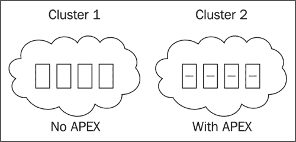

# 第五章：PCoIP 协议

PCoIP 协议由 Teradici 开发，并由 VMware 授权，是专为局域网（LAN）和广域网（WAN）连接的虚拟桌面解决方案设计的协议。PCoIP 是一种内容感知协议，这意味着它具有区分文本和高分辨率图片等内容的算法，并根据实时网络特性进行传输优化。

VMware 自己的测试表明，与 **Microsoft 的远程桌面协议（RDP）** 相比，PCoIP 能够在常见操作中将显示延迟减少超过 50%（VMware View PCoIP 网络大小指南）。

本章将涵盖以下内容：

+   为什么无损质量很重要

+   各种 PCoIP 网络基础知识

+   多媒体重定向

+   Teradici APEX 卸载卡

与其他竞争的 VDI 解决方案中的协议相比，PCoIP 有许多独特的差异化特点；其中一个特点就是 PCoIP 是一种主机渲染技术。主机渲染意味着所有像素都在数据中心渲染，然后简单地广播到终端设备。这意味着终端设备不需要安装任何编解码器。

PCoIP 最常被宣传的特点之一就是该协议能够构建到无损质量。

假设终端用户正在通过延迟连接连接到他们的虚拟桌面，并试图渲染一个网页。该网页既包含高分辨率图形，也包含文本。注意，最初文本非常清晰，而图形则被大幅压缩以节省带宽。

假设用户没有通过浏览其他网页等方式更改显示内容，那么视觉效果将逐渐呈现为感知上的无损质量。这意味着人眼无法分辨显示内容与由 VDI 渲染的原始版本（具有更高像素数）之间的差异。如果用户在更改显示内容之前还有时间，PCoIP 最终会构建到完全无损的质量。

# 为什么无损质量很重要

为了理解为什么无损表示很重要，让我们用一个例子来说明。Whitney 是一名安全人员，负责筛查进入大楼的包裹。她的组织已经在她的主工作站上实施了 VDI 解决方案。当包裹进入 X 射线机，内容显示在她的显示器上时，根据机构的政策，她有两秒钟的时间来判断是否为威胁。如果 Whitney 的机构使用的解决方案是基于无法保证在终端设备上呈现无损图像的协议，那么她屏幕上的视觉效果可能不完全准确。在这种情况下，PCoIP 提供的无损图像要比使用可能存在显著压缩、且可能无法精确呈现虚拟桌面图像的解决方案和协议更有价值。

另一个对无损图像至关重要的例子是在医疗环境中。例如，如果在医院实施了 VDI，临床医生通过笔记本电脑、Apple iPad 和其他终端设备访问他们的 vDesktop，确保传输的图像无损非常重要。如果没有能够提供无损渲染的解决方案，临床医生可能无法从**正电子发射断层扫描（PET）**图像中确定是否有某种特定的诊断，例如癌症。

# PCoIP 网络基础

为了了解如何为 PCoIP 会话交付调整网络大小，重要的是了解 PCoIP 的一些关键配置和概念。例如，PCoIP 协议增加的开销非常小，标准 1500 字节的以太网数据包只增加 85 字节的开销。

要建立一个 PCoIP 会话，终端设备上必须运行支持 PCoIP 的客户端，且目标必须是支持 PCoIP 的主机。

支持 PCoIP 的客户端包括：

+   适用于 64 位 Windows 的 VMware View 客户端

+   适用于 Linux 的 VMware View 客户端

+   适用于 Mac 的 VMware View 客户端

+   适用于 Apple iPad 的 VMware View 客户端

+   适用于 Android 的 VMware View 客户端

支持 PCoIP 的主机包括：

+   运行 VMware View 代理软件的 Windows 桌面操作系统（物理或虚拟）

+   具有 PCoIP 硬件主机卡（物理）的 Windows 桌面操作系统

虽然可以使用 PCoIP 连接到基于 Windows 的服务器操作系统，但目前 VMware 不支持该功能。不过，以下 URL 提供了启用此解决方案的说明：

[`myvirtualcloud.net/?p=2811`](http://myvirtualcloud.net/?p=2811)。

## 两种 PCoIP 连接类型

有两种类型的 PCoIP 连接——软连接和硬连接。

当连接到 VMware View vDesktops 时，使用软 PCoIP。由于 vDesktop 无法安装 PCoIP 主机卡，因此它使用 PCoIP 的软实现，称为**PCoIP 软件主机**。软 PCoIP 可以容忍最高 250 毫秒的往返延迟，并能够以每秒 30 帧（**FPS**）显示视频。

硬 PCoIP 用于连接到带有 Teradici PCoIP 主机卡的物理设备。由于连接终止在 PCoIP 主机卡设备上，因此称为**硬 PCoIP 主机**。硬 PCoIP 可以容忍最高 150 毫秒的往返延迟，并能够以每秒 60 帧（FPS）显示视频。

| PCoIP 类型 | 往返延迟容忍度 | 视频的最大帧率 |
| --- | --- | --- |
| 软 PCoIP | 250 | 30 |
| 硬 PCoIP | 150 | 60 |

### 注意

测试网络延迟时，使用`ping l 1400 <destination_ip>`，其中`<destination_ip>`是远程位置的 IP 地址。`l 1400`开关强制 ping 测试使用 1400 字节的包大小，这是 Teradici 推荐用于测试 PCoIP 网络延迟的大小。

无论是软 PCoIP 还是硬 PCoIP，都利用了本地光标技术，这确保了即使在高延迟情况下，最终用户的光标功能仍然良好。

# 多媒体重定向

**多媒体重定向（MMR）**是将媒体文件从 PCoIP 主机（通常是 VMware View vDesktop）重定向到终端设备的过程。更常见的方法是**主机视频解码**，这是 VMware View 解决方案中的常规做法。

只有当终端设备是 x86 客户端时，MMR 才可用。

此外，x86 终端设备还必须安装适当的编解码器，以支持重定向的媒体文件类型。MMR 是一种最初在多年以前推出的技术，旨在支持终端服务。多年前，瘦客户端的受欢迎程度逐渐上升，主要是通过像 Wyse 这样的公司的努力。如第四章中所学，*终端设备*，瘦客户端通常配有经过锁定的操作系统版本，例如 Windows XPe。

MMR 通过 PCoIP 支持的媒体文件类型包括：

+   MPEG-1

+   MPEG-2

+   MPEG-4

+   WMA

+   MP3

+   AC3

+   WMV

PCoIP MMR 不支持重定向 Adobe Flash 或 Apple QuickTime。通过将媒体渲染任务交由一个或多个终端设备的 CPU 来完成，MMR 在降低主机 CPU 负载方面具有优势，因为不再由服务器 CPU 渲染媒体内容。此外，MMR 还可能减少网络带宽需求，因为已经渲染的视觉数据不需要发送到终端设备，而是发送待渲染的媒体文件。

MMR 有许多缺点。例如，要使用 MMR，必须使用 x86 终端设备。如本书前面所讨论，使用 PCoIP 零客户端在 VMware View 解决方案中有许多优势（例如价格和安全性）。通过在解决方案中使用 MMR，瘦客户端或厚客户端成为唯一可用的选项。

对于需要支持视频编辑器或视频编辑软件的解决方案，硬 PCoIP 解决方案很可能是最佳（也是唯一）可行的解决方案。尽管 PCoIP 协议自初次发布以来已做出显著改进，但基于硬件的 PCoIP 解决方案仍是最佳选择。

### 注意

PCoIP 是一种独特的桌面交付协议，不仅可以通过软件（软）提供，还能够利用硬件优势，例如主机卡。

以下表格摘自 Teradici 虚拟桌面主机演示文稿：

| 描述 | MMR | 主机视频解码 |
| --- | --- | --- |
| 服务器 CPU 负载 | 中等 | 中到高 |
| 支持任何视频编码 | 否 | 是 |
| 支持 PCoIP 零客户端 | 否 | 是 |
| 需要应用程序和补丁管理 | 是 | 否 |
| 需要编解码器和补丁管理 | 是 | 否 |
| WAN 性能 | 差 | 好 |
| 操作低于原生视频比特率 | 视频卡顿 | 平滑播放 |

随着服务器 CPU 功率和密度的增加，主机视频解码将变得不那么令人担忧，因为随着技术进步，给定物理服务器的可用处理能力也在增加。

## MMR 完美风暴

在 VMware View 解决方案中，使用 MMR 的唯一合理原因之一是当需要频繁使用视频并且有特定的编解码器要求时。例如，如果一个公关公司频繁观看客户的视频，并且这些视频采用特定的编解码器（例如，使用 DivX 编解码器的 **音频视频交错（AVI）** 文件），那么将视频传输到已安装 DivX 编解码器的瘦客户端或厚客户端可能会优于仅依赖 PCoIP 的解决方案。

大多数组织不再依赖诸如 AVI（带 DivX 编解码器）的文件，而更多地依赖 Adobe Flash 和 Apple QuickTime，这些在主机视频解码下能获得最佳表现。

# Teradici APEX 卸载卡

2011 年，Teradici 宣布推出 Teradici APEX 2800 卸载卡。APEX 卡是一个 PCIe 卡，用于将 PCoIP 协议编码从物理服务器的 CPU（在虚拟桌面中抽象为 vCPU）卸载到卸载卡。这种卸载仅限于视频，并不涉及 PCoIP 的音频通道。APEX 卸载卡是与 VMware View 集成的解决方案。

正如本书早些时候提到的，VMware View 能够利用硬件解决方案（例如，PCoIP 零客户端和 PCoIP 主机卡）为市场提供独特的能力。

在许多 VMware View 解决方案中，如果不是大多数，APEX 卸载卡可以有效地增加在物理服务器上运行的虚拟桌面数量。提高每核心的用户密度应显著降低 VMware View 解决方案的整体成本，即使将卸载卡的价格算在内。

Teradici APEX 卸载卡解决方案有三个组成部分：

1.  Teradici APEX 卸载卡本身

1.  ESXi 的 APEX 驱动程序

1.  Windows vDesktop 的 APEX 驱动程序

如果没有正确安装和配置这三种组件，硬件卸载将无法实现。以下图示展示了支持 PCoIP 卸载所需的 ESXi 驱动程序和 Windows 驱动程序：

硬件加速的 PCoIP 协议编码用于增加每核心的用户数量。即使在那些内存资源可能比 CPU 更受限的 VMware View 解决方案中（例如，内存管理差的 Java 应用程序较多的环境），使用 APEX 卡仍然可以带来显著的好处。作为一般经验法则，其好处如下：

+   任务工作负载 = 每核心 1.15 倍用户

+   知识工作者 = 每核心 1.5 倍用户

+   视频工作负载 = 每核心 1.75 倍用户

例如，如果一个没有使用 APEX 卡的 VMware View 设计每个 CPU 核心可以支持 10 个知识工作者，那么使用 APEX 卡后每个 CPU 大约可以支持 15 个知识工作者。下图为展示 Windows 7 桌面使用 PCoIP 编码和不使用编码的插图：

在前面的插图中，Windows 7 桌面的显示是使用 VMware View Agent 进行编码的，完全通过软件和虚拟桌面的虚拟 CPU 完成。编码后的显示器随后会被安全地发送到正在使用的终端设备。使用 PCoIP 时，只有编码后的显示器被发送到设备，而不包含桌面本身的任何实际数据。下图为展示使用 PCoIP 卸载编码的 Windows 7 桌面编码插图：

在前面的插图中，Windows 7 桌面的显示是使用 APEX 卸载卡进行编码的。编码后的显示器随后会被安全地发送到正在使用的终端设备。卸载卡并不执行渲染操作，它仅执行编码。渲染操作由 VMware View 虚拟图形驱动程序或虚拟 GPU 完成。

当前版本的 APEX 卸载卡可以支持最多同时对 64 个活跃显示器进行编码。这并不意味着物理服务器不能拥有超过 64 个显示器的虚拟桌面，而是指在任一时刻只能对 64 个显示器进行卸载。

## 卸载过程

APEX 2800 ESXi 驱动程序监控所有虚拟桌面是否有图像活动，无论虚拟桌面是否使用硬件卸载。APEX 解决方案使用多个因素来确定虚拟桌面的显示是否应卸载。具体如下：

+   **资格：**该虚拟桌面是否有资格将其显示卸载？

+   **图像活动：**虚拟桌面的图像活动是否超过最低阈值？

+   **优先级：**该虚拟桌面当前是否在其同类中具有优先级？

下图展示了 Teradici PCoIP APEX 卸载决策树：

软件和硬件编码之间的切换是一个无缝的过程。在当前版本的解决方案中，显示器的左上角会出现一个小红点（可以禁用），以便让最终用户知道正在使用硬件编码。这通常只应在测试和试点阶段使用，而不是在实际的生产环境中。

## 定义卸载层级

Teradici APEX 卸载卡将优先级作为确定虚拟桌面的显示是否卸载到硬件卡的因素之一。每个桌面池的优先级在 VMware View Admin 控制台中的“策略”下定义。卸载优先级列为 PCoIP 硬件加速优先级。共有五个优先级设置，具体如下：

+   最低

+   较低

+   中等（默认）

+   较高

+   最高

在许多设计中，只会使用一个或两个卸载优先级设置。例如，一个设计可能会将终端用户群体与高管团队分开。高管们可能会获得“更高”优先级设置，而其他所有人则配置为“中等”。

如果某一解决方案定义了多个优先级组，最佳实践是仅使用“最高”和“最低”优先级设置。通过将“最高”设置为可用选项，如果有需要，桌面池可以在紧急情况下立即获得优先权，优先级高于其他所有人。

## 设计考虑事项

APEX 卸载卡的实现相当简单；驱动程序的安装文档齐全，并且从 View 管理控制台启用和配置卸载也非常简便。使用 PCoIP 硬件卸载时，主要需要考虑的是它在支持给定桌面池的集群中的能力。

如果桌面池所在的 vCenter 集群中有些主机安装了 APEX 卡，有些则没有，那么 vMotion（无论是手动触发还是由 DRS 触发）可能需要断开并重新连接，以便 PCoIP 能够启动。以下图示展示了一个没有 APEX 卡的集群和一个有 APEX 卡的集群：

由于 vMotion 任务可能会阻止 PCoIP 卸载的启动，建议在给定集群的所有主机上使用 Teradici APEX 卸载卡。这并不是说在给定的 VMware View 解决方案中所有主机都需要 Teradici APEX 卡，但如果需要使用该卡，它应当在集群范围内使用。

# 摘要

正如本章所述，Teradici PCoIP 协议是将桌面传输到终端设备的技术。无论终端设备是 Apple iPad 还是 IBM 笔记本电脑，PCoIP 利用其智能确保提供最佳的用户体验。理解 Teradici PCoIP 协议的工作原理，对于理解给定 VDI 解决方案的网络要求至关重要。在下一章中，将讨论如何进行网络容量规划，其中包括 PCoIP 相关的考虑因素。对于任何设计 VMware View 解决方案的人来说，了解 Teradici PCoIP 协议的基本知识是必不可少的，否则，网络可能会成为限制一个设计良好的解决方案的瓶颈。
