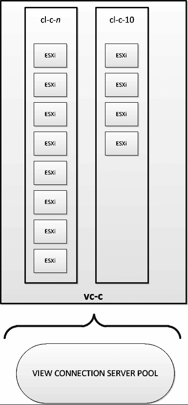

# 第六章：VDI 大小配置

**大小配置**是确定 VDI 解决方案中每个组件所需计算能力的过程，理想情况下应基于评估阶段收集的度量数据。在大多数情况下，挑战不在于处理平均日常 VDI 工作负载，而在于处理高峰负载。VDI 环境中的峰值负载通常持续时间较短，可能无法通过传统技术（如 **VMware 分布式资源调度器（DRS）** 或手动 vMotion 平衡）来缓解。

本书前几章讨论的组件，例如 VMware View 连接服务器，与必须进行配置大小调整的硬件组件相比，其大小调整的考虑因素较少。原因在于，软件组件主要执行相对轻量的工作，仅仅是代理连接或执行配置任务，这些任务可能不会持续进行。

以下图表展示了 VDI 解决方案的大小配置层次：

例如，拥有适当大小和性能的数据库基础设施非常重要，因为数据库响应时间缓慢可能会影响 View Composer 任务以及 vCenter 中的任务。此外，确保 View 连接服务器具有足够的虚拟或物理资源，如 CPU 和内存，也非常重要。然而，本章的主要关注点是 VDI 物理组件的大小配置。

要正确理解如何调整 VDI 的大小，重要的是在评估阶段收集正确的度量数据，这部分内容在第二章，*解决方案方法论* 中有详细介绍。此类度量数据包括以下内容：

+   同时在线的用户数量

+   用户类别以及每个用户类别所需的 vCPU 数量、内存等

+   网络需求

+   USB 重定向频率

本章将重点讨论从大小调整角度看待的以下组件，而不一定从冗余角度进行分析。本章属于 *n* 中的 *n* + 1。具体组件包括：

+   VMware View 连接服务器

+   VMware vCenter 服务器

+   服务器硬件

+   网络基础设施

### 注意事项

存储大小配置在第八章，*存储大小配置* 中有详细介绍。

配置不当的 VDI 可能会遇到以下问题：

+   登录缓慢

+   较差的 PCoIP 性能

+   无法启动 vDesktops，因为达到了 vCenter 的最大限制

+   无法登录 VDI

+   认证错误

+   随机故障

# 网络考虑事项

在远程场景下，理解最终用户与 VDI 之间的网络连接相当显而易见（例如，用户在家工作，地理位置远离 VDI），但在本地场景下则不太明显。虽然本地场景可能不会明显导致 VDI 架构师考虑网络规模问题，但即使所有组件都位于**局域网（LAN）**上，分析和调整 VDI 解决方案的网络组件仍然至关重要。这是确保最终用户体验尽可能积极的唯一途径。

## 网络规模调整

一般来说，一个典型的任务工作者需要大约 250 Kbps 的网络吞吐量才能获得良好的最终用户体验。根据行业普遍接受的术语，任务工作者是指具有以下特点的用户：

+   他使用典型的办公应用程序或终端窗口

+   他不需要多媒体

+   他不需要 3D 图形

+   他不需要双向音频

然而，任务工作者在使用 USB 外设时，可能会产生显著的网络带宽需求。如果任务工作者需要 USB 外设来完成工作，那么在全面实施之前，必须对具体 USB 外设的使用进行网络分析。

以下是消耗品（Kbps）列表：

+   PCoIP 基线 = 250 Kbps

+   PCoIP 突发余量 = 500 Kbps

+   多媒体视频 = 1,024 Kbps

+   3D 图形 = 10,240 Kbps

+   480p 视频 = 1,024 Kbps

+   720p 视频 = 4,096 Kbps

+   1080p 视频 = 6,144 Kbps

+   双向音频 = 500 Kbps

+   USB 外设 = 500 Kbps

+   立体声音频 = 500 Kbps

+   CD 质量音频 = 2,048 Kbps

网络清单请参考[`techsupport.teradici.com/ics/support/default.asp?deptID=15164`](http://techsupport.teradici.com/ics/support/default.asp?deptID=15164)。但在此之前，您需要在此网站创建一个账户：[`techsupport.teradici.com`](http://techsupport.teradici.com)。

其他权重如下：

+   缓冲区 = 80%

+   带宽偏移 = 105%

提供可接受性能所需的最小带宽由用户会话的活动和要求决定。以下是不同用户类型所需最小带宽的一些基准数字：

| 描述 | Kbps |
| --- | --- |
| 不带多媒体的低端办公人员 | 250 |
| 不带多媒体的高端办公人员 | 315 |
| 带多媒体的低端办公人员 | 340 |
| 带多媒体的高端办公人员 | 375 |

下图展示了给定网络连接的带宽配置示意图：

在大多数环境中，唯一应该比 PCoIP 拥有更高网络优先级的网络流量是与 **IP 语音（VoIP）** 通信相关的流量。给 PCoIP 设置比 VoIP 更高的优先级可能会导致某些网络不合适的环境中出现差的质量或连接丢失。因此，建议给 VoIP 流量分配更高的优先级（大约占总连接的 20%），给 PCoIP 流量第二高的优先级，并适当分类其余流量。

### 网络连接特性

Teradici 在处理高延迟和/或低带宽场景时，显著提升了 PCoIP 协议的能力。Teradici 的 PCoIP 协议是一种专门为提供原生桌面体验而设计的协议。为了提供最佳的最终用户体验，PCoIP 会尽可能多地使用可用带宽，直到能够提供理想的用户体验为止。PCoIP 是动态的，随着可用带宽的变化，PCoIP 尝试消耗的带宽量也会相应变化。PCoIP 最初使用 **传输控制协议（TCP）** 来建立连接，然后使用 **用户数据报协议（UDP）** 来传输桌面体验。

PCoIP 还具有两个主要设置，应该了解它们，分别是 PCoIP 最大带宽和 PCoIP 带宽底线。

PCoIP 最大带宽是指某个 PCoIP 会话允许消耗的最大带宽量。配置此设置可以确保最终用户永远不会超过某个带宽限制。此外，正确配置 PCoIP 最大带宽可以为解决方案提供一种保障。如果没有限制每个会话的带宽消耗（即使最大带宽配置得非常宽松），也可能出现 PCoIP 会话过度消耗可用带宽的情况，从而对共享同一网络连接的其他用户产生负面影响。

以下图表展示了带宽底线和带宽最大值：

PCoIP 带宽底线是 PCoIP 用于控制数据流的带宽最低阈值。以下是一个示例：

一家组织有 500 名任务工作人员，想了解为他们的 VMware View 解决方案提供多大网络带宽。VDI 用户仅使用基本的办公应用程序，并不需要其他功能。

平均带宽消耗 = (总用户数 * 250 Kbps) + (特殊需求 * 带宽惩罚) * 带宽外部 * 缓冲区

因此，将前面示例中给定的值代入公式，我们得到以下输出：

平均带宽消耗 = (500 * 250 Kbps) + 0 * 80% = 100,000 KBps（约为 97 Mbps）

## DHCP 考虑事项

尽管可以拼凑出一个使用静态 **互联网协议（IP）** 地址的 VDI 解决方案，但强烈不推荐这样做。由于 VDI 的潜在波动性以及管理的方便性，**动态主机配置协议（DHCP）** 是管理 vDesktops IP 地址分配的首选方法。使用 DHCP 时，vDesktops 并不拥有特定的 IP 地址，而是从 DHCP 服务器租用它。

单一的 DHCP 范围由特定子网上的 IP 地址池组成。一个 DHCP 超范围允许 DHCP 服务器将多个范围中的 IP 地址分发到单一物理网络上的设备。适当的子网划分可以确保在特定范围内有足够的 IP 租约来满足需要 IP 地址的终端设备数量。下图展示了 DHCP 工作流程：

DHCP 租约分配的工作流程如下：

1.  客户端在其物理子网中广播 DHCPDISCOVER 消息。

1.  子网上可用的 DHCP 服务器通过发送 DHCPOFFER 包向客户端回复一个 IP 地址。

1.  客户端通过 DHCPREQUEST 消息回复，以指示他/她接受来自哪个 DHCP 服务器的 DHCPOFFER 包。其他 DHCP 服务器会撤回它们的 DHCP 租约提议。

1.  DHCP 服务器在客户端的 DHCPREQUEST 消息中回复一个 DHCPACK 包，以确认租约交易的完成。

当一个已经有有效租约到期窗口内的地址的客户端重启或在关闭后启动时，发生 DHCP 重新分配。它重新启动时，会联系之前通过 DHCPACK 包确认的 DHCP 服务器，以验证租约并获取任何必要的参数。

在原始租约分配后经过一段时间（T1），客户端会尝试续租。如果客户端无法成功续租，则会进入重新绑定阶段（从 T2 开始）。在重新绑定阶段，它会尝试从任何可用的 DHCP 服务器获取租约。

在前面的图中，**T[1]** 被定义为租约时长的 50%，**T[2]** 被定义为租约时长的 90%。

假设本示例的租约时长为 120 分钟（两个小时）。

vDesktop 启动并成功从 DHCP_SERVER_01 获得了一个 120 分钟的 DHCP 租约。在 T1 时（120 分钟的一半，即 60 分钟），vDesktop 尝试从 DHCP_SERVER_01 续租。在续租期间，vDesktop 成功续租了 DHCP 租约。由于续租成功，租约时钟会被重置为完整的 120 分钟。

这次 vDesktop 在续租期间未成功，进入了重新绑定阶段。vDesktop 成功从 DHCP_SERVER_03 获得了一个新的 DHCP 租约，租期为 120 分钟。

在大多数 VDI 场景中，1 小时的 DHCP 租约时间已足够。通常，这比大多数组织默认范围内的 DHCP 租约时间要短得多。

如果桌面池设置为在用户注销后删除虚拟桌面，则可能会导致显著的 DHCP 租约波动，并应考虑设置一个非常短的 DHCP 租约时间（具体取决于虚拟桌面删除的频率）。

VMware View Composer 任务（如重新组合和刷新）应在整个过程中保持相同的 MAC 地址，因为与 vNIC 相关的 VMX 设置不应被更改。因此，在启动过程中，原始的租约将尝试重新分配。

## 虚拟交换机注意事项

设计 VDI 环境中的虚拟交换机是另一个可能对不熟悉大规模虚拟基础设施或习惯于设计具有高虚拟机波动性的解决方案的人来说具有挑战性的组成部分。

上面的图示以高层次展示了 VDI 环境中的网络组件。未显示的是由虚拟化管理程序（hypervisor）执行的抽象（位于物理交换机和虚拟交换机之间）。

创建标准 vSwitch 时，默认有 120 个端口。此参数是在内核（虚拟化管理程序）层定义的，任何更改标准交换机端口数量的操作都需要重启物理主机。

当创建一个分布式 vSwitch（也称为**dvSwitch**）时，默认有 128 个端口。此参数可以动态更改，并且无需重启物理主机即可更改端口数量（从默认的 128 开始）。

### 标准交换机与分布式交换机

标准 vSwitch 不受 VMware vCenter Server 丧失的影响，最好用于像服务控制台、vMotion 和存储连接等功能，因为这些都可以通过命令行轻松管理。然而，在利用多个**虚拟局域网（VLAN）**的大型 VDI 解决方案中，数十台或数百台物理主机的 dvSwitch 帮助大大简化了虚拟基础设施中的虚拟网络管理。

VMware vSphere 主机会在 VMware vCenter Server 无法使用时，保持一个 dvSwitch、dvPortGroup 和 dvPort 信息的本地缓存。该本地缓存配置副本是只读的，管理员无法对其进行操作。

### 端口绑定

**端口绑定**是将特定端口（也称为**dvPort**）分配给特定虚拟机上的特定**网络接口控制器（NIC）**的过程。可以将这种分配类比为将一根补丁电缆的一端插入物理桌面上的 NIC，另一端插入可用的交换机。dvPorts 决定了虚拟机的网络流量如何映射到特定的分布式端口组或**dvPortGroup**。

dvSwitch 使用三种类型的端口绑定，具体如下：

+   静态绑定

+   动态绑定

+   临时绑定

#### 静态绑定

当向虚拟机添加 vNIC 时，静态绑定会在 dvSwitch 的 dvPortGroup 上分配一个可用端口。例如，如果 VM009 是已关机的 Windows 2008 虚拟机，并且管理员进入“编辑设置”并在 dvPortGroup VLAN 71 上添加一个 NIC，则会分配 VLAN 71 dvPortGroup 上的一个 dvPort 给该 NIC，前提是有可用的 dvPort。无论虚拟机 VM009 是否已开启，它仍会被分配一个 dvPort，并且该 dvPort 对其他虚拟机不可用。

仅当虚拟机已从 dvPortGroup 中移除时，分配的 dvPort 才会释放。只能通过 vCenter Server 将使用静态绑定的虚拟机连接到 dvPortGroup。

**优势：** 静态绑定的优势在于，即使 vCenter Server 不可用，虚拟机也可以启动。此外，在 vMotion 事件和虚拟机电源周期后仍然保留网络统计信息。

**劣势：** 静态绑定的劣势在于，dvPortGroup 无法过度使用。在使用非持久桌面的易失性 VDI 环境中，这可能会导致 dvPortGroup 上的可用 dvPort 不足。在利用 VMware View Composer 的环境中，强烈不建议使用静态绑定。

#### 动态绑定

当虚拟机开启并且其 NIC 处于连接状态时，动态绑定会在 dvPortGroup 上分配一个可用的 dvPort。例如，如果 VM009 是 Windows 2008 虚拟机，并且管理员进入“编辑设置”并在 dvPortGroup VLAN 71 上添加一个 NIC，则 VLAN 71 dvPortGroup 上的 dvPort 尚未分配。一旦虚拟机 VM009 开启，它将在 dvPortGroup 上分配一个 dvPort，该特定 dvPort 将对其他虚拟机不可用。

当虚拟机已经关机或者 NIC 处于断开状态时，分配的 dvPort 会被释放。只能通过 vCenter Server 将使用动态绑定的虚拟机连接到 dvPortGroup。

动态绑定适用于虚拟机数量超过给定 dvPortGroup 上可用 dvPort 的环境；但是，已开启的虚拟机数量不会超过给定 dvPortGroup 上的可用 dvPort 数量。

**优势：** 动态绑定的优势在于，由于虚拟机在开启之前不占用 dvPort，因此可以在给定的 dvPortGroup 上过度使用端口。此外，在 vMotion 事件后仍然保留网络统计信息。

**缺点：** 动态绑定的缺点在于，虚拟机直到启动后才会分配 dvPort，因此它必须由 vCenter Server 启动。如果 vCenter Server 不可用，虚拟机将无法启动。由于 dvPort 是在启动时分配的，因此在虚拟机电源循环后，网络统计信息不会被保留。

#### 短暂绑定

短暂绑定在虚拟机启动并且其 NIC 处于连接状态时，会在 dvPortGroup 上创建并分配一个 dvPort。例如，如果 VM009 是一个 Windows 2008 虚拟机，管理员进入编辑设置并添加一个在 dvPortGroup VLAN 71 上的 NIC，那么 VLAN71 dvPortGroup 尚未分配 dvPort。一旦虚拟机 VM009 启动，首先会创建一个 dvPort，并将其分配到 dvPortGroup 上，这个特定的 dvPort 将无法被其他虚拟机使用。

一旦虚拟机关闭或其 NIC 处于断开连接状态，分配的 dvPort 将被释放。使用短暂绑定的虚拟机可以通过 vCenter Server 或从 ESX/ESXi 连接到 dvPortGroup。因此，即使 vCenter Server 不可用，虚拟机的网络连接仍然可以被管理。

当虚拟机进行 vMotion 时，原有的 dvPort 会从源 dvPortGroup 中删除，并且在目标 dvPortGroup 上创建一个新的 dvPort。

短暂绑定在高波动性的环境中非常有用，例如非持久的 VDI 解决方案，在这些环境中，虚拟机经常被创建和删除。dvPortGroup 上的端口数量由 dvSwitch 上可用的端口数量定义和限制。

**优点：** 短暂绑定的优点在于，虚拟机在启动之前不会占用 dvPort，因此可以在给定的 dvPortGroup 上进行端口过度分配。

**缺点：** 网络统计信息在虚拟机电源循环后或 vMotion 事件发生后不会被保留，因为 dvPort 是在启动时或 vMotion 时创建并分配的。

### 端口绑定与 VMware View Composer

对于利用 View Composer 的 VDI 解决方案，重要的是要认识到，诸如重组（Recompose）、负载均衡（Rebalance）和刷新（Refresh）等任务会尝试使用已经分配给副本镜像的端口。

因此，如果要使用 VMware View Composer，建议使用动态绑定或短暂绑定（推荐）。

# 计算考虑事项

在大多数 VDI 项目中，计算通常不是失败的领域，但在实施最终设计之前，了解组织的计算需求仍然非常重要。可能会导致计算方面预料之外故障的程序如下：

+   Dragon Medical/Dragon Naturally Speaking

+   Defense Connect Online

+   AutoCAD

+   Eclipse IDE

对于基于 Windows XP 的 VDI 解决方案，一个 vCPU 很可能能满足大多数基本计算需求。然而，对于基于 Windows Vista 或更重要的 Windows 7 的 VDI 解决方案，可能需要两个 vCPU，以确保提供良好的最终用户体验。

为了最准确地计算 CPU 需求，应对环境进行适当评估。这将帮助识别潜在的陷阱，比如之前列出的一些应用程序问题，以便在部署前处理。

虽然基于 AMD 和 Intel 的 x86 服务器都能满足 VDI 解决方案的需求，但在大规模和/或高需求环境中，基于 Intel 的解决方案在密度（每个核心的 vDesktop 数量）方面始终优于基于 AMD 的解决方案。

在 VDI 解决方案中，还可能由于杀毒扫描、调优不当的应用程序、单线程进程、增加的视觉效果、以及视频或音频处理的影响而导致不必要的 CPU 负载。

上图展示了一个 6 核处理器的示例。作为一个安全的基准，设计时每个核心使用 10 个 vDesktop。对于基本任务工作者，这个数字可以显著更高，且有多个参考架构验证了每个核心 15 到 18 个 vDesktop 的情况。使用 Teradici APEX 卸载卡也可能增加每个核心的用户密度。

继续使用每个核心 10 个 vDesktop 作为基准，并假设服务器有 2 个处理器（每个 6 核），那么每台物理服务器的总核心数为 12 核。每台服务器有 12 个核心，每个核心 10 个用户，那么每台物理服务器的用户数为 120 个（每个处理器 6 核 * 每台服务器 2 个处理器 * 每个核心 10 个用户）。如果每个 vDesktop 使用 1.5 GB RAM（这是对 64 位 Windows 7 的最低建议配置），那么同一台物理服务器需要 180 GB 的内存（1.5 GB * 120 个用户）。这是一个相对的内存最佳点，因为大多数服务器的出厂配置内存为 256 GB。

以下两张表格摘自 *Configuration Maximums, VMware vSphere 5.0* 指南，链接在[这里](http://www.vmware.com/pdf/vsphere5/r50/vsphere-50-configuration-maximums.pdf)。这些表格解释了计算的最大值：

| 主机 CPU 最大值 | 最大值 |
| --- | --- |
| 每个主机的逻辑 CPU 数量 | 160 |
| 虚拟机最大值 | 最大值 |
| --- | --- |
| 每个主机的虚拟机数量 | 512 |
| 每个主机的虚拟 CPU 数量 | 2048 |
| 每个核心的虚拟 CPU 数量 | 25 |

根据前面的信息，我们知道，选择每个处理器有显著更多核心（例如每个处理器 24 核或 32 核）的处理器并不会帮助提高某个物理服务器上 vDesktop 的密度。

以下表格解释了内存的最大值：

| 主机内存最大值 | 最大值 |
| --- | --- |
| 每个主机的 RAM | 2 TB |
| 分配给服务控制台的最大 RAM | 800 MB |
| 分配给服务控制台的最小内存 | 272 MB |

增加密度未能实现（或更准确地说，未能最大化）的原因，部分是由于内存限制，也由于现有的 VMware vSphere 限制。假设为了论证的目的，选择了一个 32 核物理服务器作为给定 VDI 解决方案的标准，并且它配备了最大支持的 2 TB 内存。

使用保守的基准，即每个核心 10 个虚拟桌面，这将产生每个主机 320 个虚拟桌面，需要 640 GB 内存。

以下表格说明了集群最大值：

| 集群最大值 | 最大 |
| --- | --- |
| 每个集群的主机数 | 32 |
| 每个集群的虚拟机数 | 3,000 |
| 每个主机的虚拟机数 | 512 |

将每个主机上的 320 个虚拟桌面与 VMware 定义的集群最大值进行比较时，每个主机的虚拟机数量将达到最大值。

进一步分析来自*配置最大值，VMware vSphere*指南中描述的内容：“如果超过一个配置选项（例如虚拟机数量、LUN 数量、vDS 端口数量等）达到其最大限制，主机上运行的一些进程可能会耗尽内存。”因此，建议尽可能避免达到配置最大值。

与 VDI 设计的所有部分一样，重要的是尽可能利用真实世界的度量数据，了解虚拟桌面将如何使用，并了解它们如何影响底层的物理基础设施。

根据前述计算，建议节省资本支出，不购买高核心数的处理器，而应将资金集中在其他地方。在大多数环境中，六核、八核或十二核处理器在性能方面已足够，并且能够确保不达到 vSphere 的最大限制。

# 使用 VMware vSphere 最大值

可以强烈主张，尽管 VMware vSphere 迄今为止是业界领先的服务器虚拟化平台，其当前的最大值可能在超大规模 VDI 环境中存在限制。以下是来自*配置最大值，VMware vSphere*指南中与 VMware View 解决方案最相关的 vCenter 最大值列表：

| vCenter Server 的可扩展性 | 最大 |
| --- | --- |
| 每个 vCenter Server 上的主机数 | 1,000 |
| 每个 vCenter Server 上的虚拟机开机数 | 10,000 |
| 每个 vCenter Server 注册的虚拟机数 | 15,000 |
| 链接的 vCenter Servers（Pod） | 10 |
| 链接的 vCenter Servers 中的主机数 | 3,000 |
| 链接的 vCenter Servers 中的虚拟机开机数 | 30,000 |
| 在链接的 vCenter Servers 中注册的虚拟机数 | 50,000 |

上述限制将在下一部分通过一个解决方案示例进行分析。

## 解决方案示例——25,000 个 VMware View 座席

一位 VDI 架构师已被公司聘请，负责为单栋建筑中的 25,000 名任务型员工设计解决方案。在这种情况下，将提供网络和存储，并满足 VDI 解决方案的必要要求；因此，重点是物理服务器规格和 VMware vSphere 及 VMware View 环境的逻辑设计。

公司正在寻找以下信息：

+   **物料清单 (BOM)** 用于物理服务器

+   vSphere 基础设施的逻辑设计

+   View 基础设施的逻辑设计

通过快速查看需求，架构师已确定以下内容：

+   每个 vCenter 服务器的开机虚拟机将超出限制（限制为 10,000）

+   每个 vCenter 服务器注册的虚拟机将超出限制（限制为 15,000）

+   链接的 vCenter 服务器中的开机虚拟机将不会超出限制（限制为 30,000）

+   在链接的 vCenter 服务器中注册的虚拟机将不会超出限制（限制为 50,000）

+   每个 vCenter 服务器的最大主机数不会超出限制（限制为 1,000）

+   每个主机的最大虚拟机数量不会超过限制（限制为 320）

### 解决方案设计 — 物理服务器要求

为了支持运行 Windows 7 vDesktops 的 25,000 名任务型员工，必须确定物理服务器的大小。通过初步测试，每个核心 10 个 vDesktops 是一个保守估计。由于 4 核处理器正在逐步淘汰，选择了 6 核处理器，因为它们在价格和可用性方面更合适。因此，每个物理主机配备 2 个 6 核处理器，总计每个主机 12 个核心。使用每个核心 10 个 vDesktops 和每个主机 12 个核心，得出每个主机 120 个 vDesktops。每个 vDesktop 使用 1.5 GB 内存环境，需要 180 GB 的 RAM 来支持 vDesktops。通过为服务控制台分配最大支持的 800 MB RAM，总共需要 181 GB 的 RAM。因此，配备 192 GB RAM 的服务器将很好地支持该环境。此外，以下是 vNetwork 最大值：

| vNetwork 标准 & 分布式交换机 | 最大值 |
| --- | --- |
| 每个主机的总虚拟网络端口数量 | 4,096 |
| 每个主机的最大活动端口 | 1,016 |
| 每个 vCenter 的分布式交换机数量 | 32 |

根据前述最大值，采用了以下物理主机设计：

| 描述 | 值 |
| --- | --- |
| 每个处理器的核心数 | 6 |
| 每个主机的处理器 | 2 |
| 每个主机的网卡数量 | 8 |
| 每个主机的内存（GB） | 192 |
| 每个核心的约 vDesktops 数量 | 10 |
| 每个主机的约 vDesktops 数量 | 120 |
| 标准 vSwitches | 2 |
| 分布式 vSwitches | 1 |

网络配置如下：

前述图表展示了两个 vNetwork 标准交换机和一个 vNetwork 分布式交换机。第一个标准 vSwitch，vS1，用于服务控制台和 vMotion。第二个标准 vSwitch，vS2，用于基于网络的存储。唯一的分布式 vSwitch，vD1，用于虚拟机。

### 解决方案设计 — Pod 概念

Pod 的概念是为架构师提供一种创建构建模块的方法，以简化大规模环境设计的可扩展性。它还为解决方案架构提供了一个概念框架。

VMware View Pod 的主要组成部分如下：

+   **物理网络：** 包括支持 VDI 所需的交换机、VLAN、网络策略以及其他网络基础设施。

+   **vCenter 块：** 包括主机、vCenter 集群设计、vCenter 链接模式配置等。

+   **View 连接服务器池：** 包括 View 连接服务器和（如果适用）View 安全服务器。

这种 Pod 的概念可以通过以下架构类型来实现：

+   传统架构

+   模块化形式的传统架构

+   融合虚拟化设备

**传统**架构类型涉及使用服务器（机架式或刀片服务器）、网络交换机、存储网络交换机（如果适用）和存储阵列。传统架构方法通常足够满足初始构建需求，但可能无法提供其他方法的扩展能力。以下图示展示了一个典型的传统架构方法，其中存在不成比例的资源：

例如，使用前面的图示，可能拥有足够的计算、网络和存储资源来支持 400 个 VMware View 用户的初始部署。在这个例子中，存储容量过剩。

以下图示展示了典型传统架构扩展挑战的插图：

当组织决定添加 500 个 VMware View 用户时，遇到了问题。在第一阶段的部署中，存储容量过剩。然而，为了以模块化的方式添加容量，计算和网络仍然需要额外的存储模块。因此，每次添加都会产生一定程度的冗余，这由于架构效率低下导致每个虚拟桌面的成本上升。

组织可能不愿意接受这些低效，所以它会在每一步重新设计需求。为 VDI 解决方案的每个额外阶段设计扩展也会通过增加复杂性和人力成本推高总成本。

此外，每次扩展阶段重新架构时，错误的发生概率会更大。

**传统模块化架构**类型涉及使用服务器（机架式或刀片服务器）、网络交换机、存储网络交换机（如果适用）和存储阵列。而传统架构通常无法按比例扩展，而传统模块化架构则设计为可以按模块扩展。这种方法不需要在每次扩展时进行重新设计，组织可以依赖这种传统的但模块化的架构来实现可预测的扩展设计。

下图展示了典型的传统模块化架构方法的示意图，其中包含了按比例分配的资源：

实施传统模块化架构通常有两种方式。第一种是花时间为客户设计和测试架构，其中计算（例如，戴尔刀片服务器）与网络交换机（例如，思科）和存储阵列（例如，NetApp）结合使用。采用这种方法的风险在于，如果设计解决方案的团队从未设计过 VDI 解决方案，他们可能会在过程中吸取一些经验教训，最终得出一个不太优化的解决方案。这并不是说这种方法不适用或不应该采取，但需要特别注意确保架构的可靠性和可扩展性。一位经验丰富的 VDI 架构师可以使用任何现成的硬件来构建一个可持续的 VDI 架构。

第二种实现传统模块化架构的方法是采用品牌解决方案，如 VCE Vblock（思科服务器 + 思科交换机 + EMC 存储）或 FlexPod（思科服务器 + 思科交换机 + NetApp 存储）等。这些解决方案是经过验证的，可以按可预测的方式进行扩展，并为 VDI 提供已知的架构。这些解决方案的缺点是，它们通常在成本和大规模模块化扩展（例如一次扩展 1,000 个用户）方面存在较高的门槛。

第三种架构类型使用 **融合虚拟化设备**。融合虚拟化设备通常是 2U 到 6U 的设备，包含一个或多个 ESXi 服务器，并且设备内的本地存储通常在这些 ESXi 服务器之间共享。存储通常通过虚拟存储设备模型共享，其中本地存储作为 iSCSI 或 NFS 存储呈现给设备中的一个或多个 ESXi 服务器。融合虚拟化设备模型对于 VDI 市场来说相对较新。

#### 连接的 vCenter 服务器

随着每个 vCenter Server 虚拟机数量的超出，解决方案将需要多个 vCenter Server。

下表展示了 vCenter 的最大值：

| vCenter Server 可扩展性 | 最大 |
| --- | --- |
| 每个 vCenter Server 启动的虚拟机 | 10,000 |
| 每个 vCenter Server 注册的虚拟机 | 15,000 |
| 已链接的 vCenter 服务器 | 10 |
| 在已链接的 vCenter 服务器中启动的虚拟机 | 30,000 |
| 在已链接的 vCenter 服务器中注册的虚拟机 | 50,000 |

vCenter 链接模式有一些基本的先决条件，具体如下：

+   两个 vCenter 服务器必须位于功能正常的 DNS 环境中，在该环境下，能够正确解析每个 vCenter 服务器的 **完全限定域名（FQDN）**

+   任何参与链接模式的 vCenter 服务器必须位于一个活动目录域中

+   如果 vCenter 服务器位于不同的活动目录域中，则相应的域之间必须建立双向信任关系

+   两个 vCenter 服务器必须位于功能正常的 **网络时间协议（NTP）** 环境中，在该环境下，两个 vCenter 服务器的时间同步误差不得超过 5 分钟

+   必须允许 Windows RPC 端口映射器打开 **远程过程调用（RPC）** 端口以支持复制；有关详细信息，请参考 [`support.microsoft.com/kb/154596`](http://support.microsoft.com/kb/154596)

+   两个 VMware vCenter 服务器均拥有 VMware vCenter 标准版许可证（例如，与基础版相比）

+   每个 VMware vCenter 服务器使用独立的数据库

VMware vCenter 链接模式通过 ADAM 数据库复制将两个或多个 vCenter 服务器连接在一起，存储有关用户角色以及 VMware 许可的信息。VMware vCenter 链接模式不进行任何形式的数据库复制。如果 VMware vCenter 链接模式因任何原因失败，两个（或更多）vCenter 服务器仍然可以作为独立实例正常运行。

如前图所示，在两个独立的 vCenter 服务器实例（vCenter1 和 vCenter2）之间，虚拟数据中心、集群、资源池和虚拟机是各自 vCenter 实例独有的。

将多个 vCenter 通过 vCenter 链接模式连接在一起，形成所谓的 pod。一个 pod 最多可以包含 10 个通过链接模式连接的 vCenter 服务器。

#### vCenter 服务器

根据前面的计算，本解决方案预计每台主机大约支持 120 个 vDesktops；这意味着需要 209 台物理主机来支持该解决方案中的 vDesktop 部分（不考虑虚拟化的 vCenter、数据库等）。

由于最终用户群体的特点、他们的登录时间，以及原始评估的保守性（例如，每个核心支持 10 个 vDesktops），决定了不需要为支持 vDesktops 的 vSphere 服务器配置高可用性（HA）。

还已确定，管理基础设施，包括 View 连接服务器、vCenter 服务器、数据库服务器以及其他几个组件，要求三台物理主机。为了提供一定的保护级别，决定采用 *n* + 1 解决方案，并使用四台物理主机。

之前已经确定，任何给定的 vCenter 在任何时刻最多只能拥有 10,000 个打开的虚拟机。此解决方案需要支持超过 25,000 个打开的虚拟机；因此，这个解决方案将需要 3 个 vCenter 服务器。

为了平衡负载，vCenter 服务器之间的集群已经尽可能均匀地分配。

请注意，本例中使用的集群命名约定为：

+   vCenter 服务器命名格式：vc-{字母}，例如 vc-b

+   集群命名格式：cl-{vCenter 字母}-{编号}，例如 cl-c-6

这些 vCenter 服务器分别命名为 vc-a、vc-b、vc-c。它们的详细信息及图表如下：

上述图表解释了 vCenter 服务器 **vc-a**。以下是关于 vc-a 的详细信息：

+   9 个每个包含 8 个主机的集群 (cl-a-1, cl-a-2, ..., cl-a-9)

    +   共 72 个主机

    +   共 8,640 个 vDesktops（每个主机 120 个 vDesktops，72 个主机）

上述图表解释了 vCenter 服务器 **vc-b**。以下是关于 vc-b 的详细信息：

+   9 个每个包含 8 个主机的集群 (cl-b-1, cl-b-2, ..., cl-b-9)

    +   共 72 个主机

    +   共 8,640 个 vDesktops（每个主机 120 个 vDesktops，72 个主机）

上述图表解释了 vCenter 服务器 **vc-c**。以下是关于 vc-c 的详细信息：

+   7 个每个包含 8 个主机的集群

+   1 个包含 5 个主机的集群

+   1 个包含 4 个主机的集群

+   1 个由 4 个主机构成的集群，专门用于管理

    +   共 69 个主机

    +   共 7,800 个 vDesktops 和约 30 个 vServers（View Connection Server、数据库服务器、vCenter 服务器等）

vCenter vc-c 拥有一个集群 (cl-c-10)，专门用于托管基础设施虚拟机。这些虚拟机包括：

+   3 个 VMware vCenter 服务器 (vc-a, vc-b, vc-c)

+   15 个 View Connection 服务器

+   支持基础设施（如有需要），例如数据库服务器、Liquidware Labs TM 等

#### VMware 更新管理服务器

VMware 更新管理器是一种自动化应用程序，用于为 vSphere 服务器和虚拟机应用补丁。它最常用于大型环境中为 vSphere 服务器打补丁，因为它能够自动执行将主机置于维护模式、迁移虚拟机、应用补丁、重启以及最小化用户交互的任务。

VMware 更新管理器服务器一次只能与一个 VMware vCenter 服务器实例配对。因此，此解决方案需要 3 个 VMware 更新管理器服务器（每个 vCenter 服务器实例一个）。

##### VMware vCenter 服务器心跳

在本节中，我们添加了关于 VMware vCenter Server Heartbeat 的说明。在大多数 VMware View 解决方案中，要求有一个或多个高可用的 VMware vCenter Server。vCenter Server 至关重要，因为如果 vCenter 无法使用，将会面临以下问题：

+   新的 vDesktops 无法被配置

+   vDesktops 无法被重新组合、刷新或重新平衡

+   vDesktops 无法从 View 管理控制台删除

因此，vCenter Server Heartbeat 通常是 VDI 解决方案中 vCenter Server 的一个经济有效的保险措施。

如前所述，VMware Update Manager 只能与一个 VMware vCenter Server 实例关联。然而，值得注意的是，通过 VMware vCenter Server Heartbeat 连接的一对 vCenter Server 被视为一个实例。

因此，解决方案并不要求仅仅因为 VMware vCenter Server Heartbeat 被使用，就需要额外的 VMware Update Manager 服务器。

### 解决方案设计 — 池

在这里，我们将介绍 View Connection Servers。

#### View Connection Servers

如下所示，VMware View 基础设施在 VMware vSphere 基础设施已施加的最大值之外，还引入了自己的最大值。View Connection 的最大值见下表：

| 每个部署的连接服务器 | 最大 |
| --- | --- |
| 1 个连接服务器支持直接 RDP 或 PCoIP | 2,000 |
| 7 个连接服务器（5 个热备 + 2 个备用）支持直接 RDP 或 PCoIP | 10,000 |
| 不使用 View Composer 时，集群中最大主机数 | 32 |
| 使用 View Composer 时，集群中最大主机数 | 8 |

如果使用像 Unidesk TM 这样的解决方案替代 View Composer，则最终设计可能支持每个集群更多的主机。

对于必须支持 25,000 个 vDesktops 的解决方案示例，了解任何时候有多少终端用户将登录是非常重要的。一个 VMware View Connection Server 可以支持每次最多 2,000 个直接的 PCoIP 连接。在此示例中，所有 25,000 个终端用户可能会同时登录。因此，至少需要 13 个 View Connection Server（2,000 * 13 = 26,000 个同时直接 PCoIP 连接支持）。

为了在 View Connection Server 故障时提供一定的冗余，建议添加 *n* + 2（或更多）个解决方案。例如，增加所需的 View Connection Server 数量，即将 13 增加到 15 个 View Connection Server，提供支持最多 30,000 个同时 PCoIP 连接的能力。因此，即使两个 View Connection Server 故障，所有 25,000 个用户仍然可以顺利登录到 VDI。

这 15 台 View Connection Server 应该部署在冗余的负载均衡解决方案后，并配置为通过简单的 ping（如果允许 **互联网控制报文协议（ICMP）**）和 HTTP GET 命令检查 View Connection Server 是否在线，且检查其 URL。整个 View Connection Server 池应通过一个单一的名称进行访问，例如 `view.customer.com`，最终用户可以通过 `https://view.customer.com` 来访问 View 环境。

通过利用 HTTP GET 来验证 View Connection Server 的功能，当一个服务器的相关服务停止时，它将无法成功响应 GET 命令，因此会被从负载均衡池中移除。

### 解决方案设计 — 公式

以下是一些公式，用于计算最小 vCenter 服务器数、连接服务器数和 Pod 数：

+   vCenter 服务器的最小数量 = 桌面数 / 10,000

+   View Connection Server 的最小数量 = 同时连接数 / 2,000

+   vCenter Pod 的最小数量 = vCenter 服务器数 / 10

# 总结

如本章所述，设计中需要考虑许多因素，如 DHCP 租约时间、最小 vCenter 数量以及服务器平台中需要购买的核心数。对于大规模环境（如成千上万的 vDesktops），最简单的方法可能是从 vSphere 的最大值开始，逐步调整。对于小型环境或不需要大规模虚拟基础设施的 PoC，尽管本章所涵盖的概念仍然适用，因为一个成功的 PoC 可以快速扩展。最后，Pod 架构的概念，或 vCenter 服务器的集合，对于只熟悉 VMware vSphere 平台虚拟服务器解决方案设计的人来说通常是新的。他们可能需要一些时间来理解这些新概念，并了解如何与 vSphere 和 vCenter 的最大值相对接。
