# 第七章：冗余

在构建合适的 VDI 时，必须理解解决方案中的所有可能故障点，以便可以构建冗余来缓解任何故障。虽然不正确地调整 VDI 的规模会导致响应时间慢或最终用户体验差，但如果未能构建适当的冗余，可能会导致解决方案无法访问。在 VDI 解决方案中，需要考虑物理故障点，如网络交换机、电源和硬盘。还需要考虑软件故障点，如 VMware vCenter Server、VMware View Connection Server 和数据库服务器。

本章分析了 VDI 中可能出现的故障点，并提供了针对每个组件的冗余建议。

# 物理基础设施

本书的范围不涉及高可用虚拟基础设施设计的深入内容。然而，理解并利用以下 VMware vSphere 功能对于实施稳健的 VDI（虚拟桌面基础设施）非常重要。

## VMware 高可用性

**VMware 高可用性（HA）**可用于监控和防止物理主机故障，也可以用于监控和保护 vDesktops 本身。VMware HA 通过监控给定集群中的物理主机来工作。如果主机无法在服务控制台接口上与特定默认网关通信超过 15 秒，HA 故障转移事件将被触发。vSphere 5 还引入了数据存储心跳（Datastore Heartbeating），当发生网络心跳故障时使用。数据存储心跳提供了额外的主机隔离验证层次。

有关 VMware HA 的更多信息，请参阅 Duncan Epping 的 *HA Deepdive* 文章，链接：[`www.yellow-bricks.com/vmware-high-availability-deepdiv/`](http://www.yellow-bricks.com/vmware-high-availability-deepdiv/)。你还可以在他的书籍 *vSphere 5 Clustering Technical Deepdive* 中查看相关内容。

当主机停止接收来自集群中其他主机的心跳信号且无法 ping 通指定的隔离地址时，该主机被认为是隔离的。

如果 HA 集群的隔离响应设置为**保持开机**，则主机上的 vDesktops 和其他虚拟机将继续保持开机状态。仅仅因为主机在服务控制台接口上丧失了网络连接，并不意味着 vDesktops 也丧失了网络连接。

如果 HA 集群的隔离响应设置为**关机**，则主机上的 vDesktops 和其他虚拟机将会关闭电源。这个设置避免了可能出现的脑裂（split-brain）情况。

随着 vSphere 5 的进步，主机隔离事件经过高度验证且准确无误，极有可能指示实际的主机问题。因此，在 VMware View 解决方案中，推荐将隔离响应设置为**关机**。

如果包含 vDesktops 的特定主机已从集群中隔离，它将执行以下操作：

+   所有虚拟机和 vDesktops 将被关闭。

+   有活动连接的用户将会断开与其 vDesktops 的连接。

    +   如果 vDesktop 是持久桌面池的一部分，用户将在其特定的 vDesktop 启动并上线后重新登录。预计停机时间为 2 分钟。

    +   如果 vDesktop 是非持久桌面池的一部分，用户可以立即重新登录到 vDesktop，前提是当前在线的主机上池中有可用的 vDesktop。预计停机时间不超过 30 秒。

### 你真的需要 VMware HA 吗？

VMware HA 提供了一定的主机故障保护，当托管 vDesktops 的主机发生故障时，vDesktops 会在无需虚拟基础设施管理员干预的情况下自动启动。

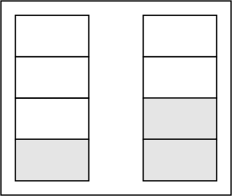

如果入场控制设置为**严格**，只有当集群中另一主机上有可用资源时，vDesktops 才会启动。

VMware HA 的工作原理是通过确定插槽大小，或支持最密集虚拟机（或 vDesktop）故障切换所需的最小 CPU 和内存量。

例如，如果 vDesktop_A 拥有 4 GHz 的 CPU 和 2 GB 的内存，而 vDesktop_B 拥有 1 GHz 的 CPU 和 6 GB 的内存，则插槽大小将为 4 GHz 的 CPU 和 6 GB 的内存（考虑到内存开销，还需进行额外计算）。

在 VMware View 环境中，通常会有大量具有相同规格的 vDesktops（例如，具有 2 GHz CPU 和 2 GB 内存的 Windows XP vDesktop），因此主要避免了一个名为**插槽碎片化**的概念。插槽碎片化要求集群中必须有足够的资源以支持在 HA 事件中启动虚拟机，但单个物理主机上没有足够的资源来支持虚拟机的需求。

欲了解有关插槽碎片化的更多信息，请参阅 Duncan Epping 的非常详细的文章，网址如下：[`www.yellow-bricks.com/vmware-high-availability-deepdiv/`](http://www.yellow-bricks.com/vmware-high-availability-deepdiv/)，如前所述。

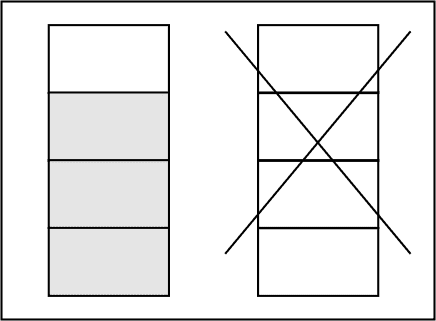

从 vSphere 4.1 起，HA 还与 DRS 配合工作，当集群内出现插槽碎片化时，释放资源插槽。这将涉及到一个故障的服务器必须等待虚拟机在集群中的主机之间进行 vMotion，直到有足够的插槽可用于启动必要的虚拟机。

基于持久 vDesktops 的 VMware View 解决方案应该使用 HA。

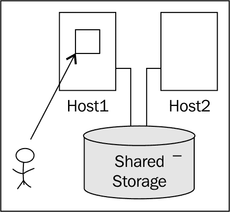

在前面的图示中，最终用户连接到了 Host1 上的 vDesktop。Host1 和 Host2 都是同一集群的一部分，并且可以访问相同的共享存储。正如图中所示，vDesktop 的实际虚拟磁盘文件存储在共享存储中，而不是 Host1 的本地存储上。

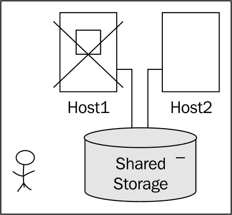

如前图所示，当 Host1 故障时，最终用户与 vDesktop 的连接会断开。在持久性 vDesktop 解决方案中，最终用户会被分配到特定的 vDesktop。在这种情况下，由于 vDesktop 存储在 Host1 上，而 Host1 刚刚发生故障，因此 vDesktop 无法使用。

最终用户将无法工作，直到 vDesktop 恢复在线，或者最终用户被手动分配到另一个（可用的）vDesktop 资源。

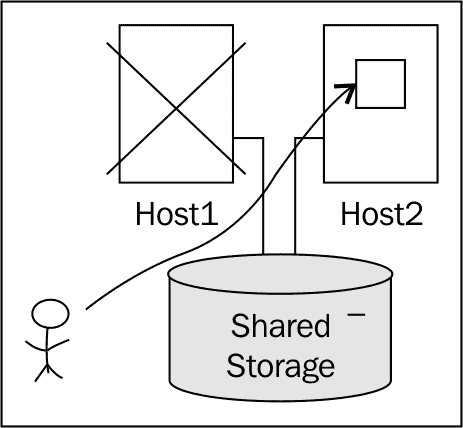

如前图所示，VMware HA 已在 Host2 上启动了最终用户的 vDesktop，Host2 是集群中的可用主机。默认情况下，不会通知最终用户他的 vDesktop 现在已可用，因此最终用户需要反复尝试，直到 vDesktop 在 Host2 上上线。这通常需要 1 到 3 分钟。

### 注意

对于持久性 vDesktop 环境的高级解决方案概念是监控单个 vDesktop 的故障。如果发现某个用户的持久性 vDesktop 离线，可以向该用户发送电子邮件（用户可能会在手机上收到），告知其 vDesktop 当前不可用，但问题正在解决中。然后，可以使用相同的概念检测 vDesktop 恢复在线并可用（例如，通过在 vDesktop 进入 VMware Tool 的 OK 状态时添加 2 分钟的等待时间），并通知用户他的 vDesktop 已经可用。

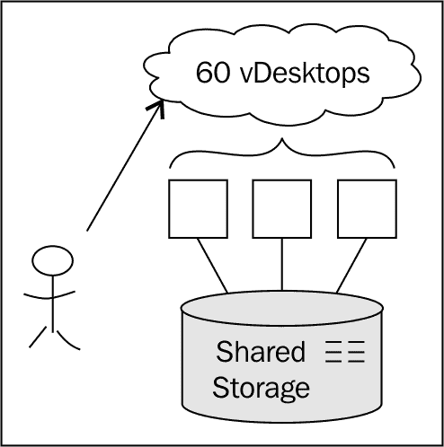

对于使用非持久性 vDesktop 的解决方案，VMware HA 的使用问题引起了更广泛的争议。虽然非持久性解决方案依赖于分布在集群中多个主机上的 vDesktop 池，但最终用户并没有被分配到特定的 vDesktop。当主机在非持久性解决方案中发生故障时，任何连接到该特定主机上 vDesktop 的最终用户都会失去连接。此时，最终用户可以重新连接到 VMware View 环境，只要有另一个 vDesktop 可用，用户将成功连接到资源。这是因为在使用非持久性 vDesktop 时，vDesktop 分配是在登录时随机完成的。

#### 非持久性示例

在此示例中，Company_A 有 60 个最终用户，并创建了一个非持久性 vDesktop 池，设置如下：

+   最终用户数量 = 60

+   桌面池大小（最大桌面数量） = 60

+   备用（已开机）桌面数量 = 0

+   电源设置 = 始终开启

+   提前配置所有桌面

采用这些设置时，当池首次建立时，它将自动配置 60 个 vDesktop 并启动它们。

该数量由 VMware View 在 ADAM 数据库中权威管理。如果池的电源设置为 **始终开启**，VMware View 将创建一个包含 60 个 vDesktops 的池，并立即将其全部启动。无论最终用户社区的负载如何，60 个 vDesktops 总是会保持开启。如果 61 个最终用户尝试同时登录，1 个最终用户将无法访问资源。

假设有这样一种场景，Host1 托管着 30 个 vDesktops，而 Host2 托管着 30 个 vDesktops。桌面池配置为托管 60 个 vDesktops。

在这种环境中，如果 Host1 突然故障，托管在 Host1 上的 30 个 vDesktops 将进入“Agent Unreachable”状态。尽管 VMware View 连接服务器已识别出现在有 30 个 vDesktops 无法访问，但它不会在集群中的可用主机（例如 Host2）上预配新的 30 个 vDesktops。

因此，如果没有使用 HA 将 vDesktops 在另一主机上重新启动，池中 vDesktops 的总数将会减少。通过使用 VMware HA，池中的 vDesktops 总数将不会减少，尽管整体性能可能会下降（如果允许超出可用资源的能力）。

对于非持久性 vDesktop 解决方案，有两条设计路径。第一种是简单地使用 VMware HA 来确保任何位于故障主机上的 vDesktops 能在集群中的另一个可用主机上重新启动。这可能是最简单的配置，通常会导致 5 到 10 分钟的停机时间（因为 vDesktops 需要启动并进入可用状态）。

第二种设计路径是为桌面池设计足够的 vDesktops，以应对主机故障。必须确保使用中的 vDesktops 数量不超过 VMware 授权的法定数量。然而，通过构建一个具有额外容量的桌面池（例如，额外的 30 个 vDesktops），一个主机的停机对最终用户环境的影响将降至最低。对于那些连接到故障主机上 vDesktop 的用户，他们只需重新登录 VMware View 环境，连接到已预配好的、可用的额外 vDesktops。

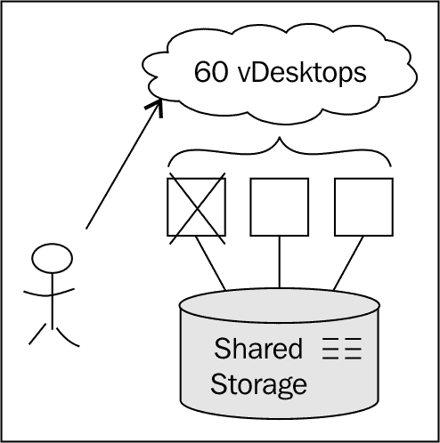

#### 使用本地存储

本节中我们添加了关于使用本地存储的说明。如本书后续将讨论的，本地存储是某些 VDI 解决方案的可行选项。如果最终用户的 vDesktop 存储在 Host1 的本地存储上，在主机故障时，VMware HA 将无法将 vDesktop 启动到另一台主机上（例如 Host2），因为其他主机无法访问存储在 Host1 本地存储上的虚拟磁盘文件。

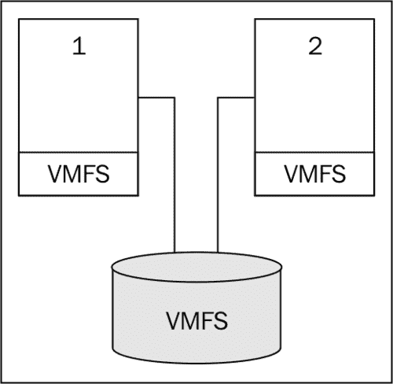

如前面的示例图所示，Host1 和 Host2 都有本地 **虚拟机文件系统（VMFS）** 数据存储，并且能够访问 **存储区域网络（SAN）** 上的共享 VMFS 数据存储。如果 Host1 发生故障，任何存储在 Host1 本地 VMFS 数据存储上的 vDesktop 或模板将无法使用。

如果使用的是持久性解决方案，并且 vDesktop 被放置在本地 VMFS 数据存储中，那么在主机发生故障时，最终用户将无法访问他们的 vDesktop。VMware HA 将不起作用，因为 vDesktop 并未存储在共享存储上，而是存储在主机的本地 VMFS 数据存储中。

因此，当将 vDesktop 的核心虚拟磁盘放置在本地存储时，必须使用非持久性解决方案，因为最终用户并未专门分配到特定的 vDesktop。如果托管 vDesktop_17 的物理服务器发生故障，而该 vDesktop 是分配给员工 User_LL 的持久性 vDesktop，User_LL 将无法连接到桌面资源。

## VMware 分布式资源调度（DRS）

虽然 **VMware 分布式资源调度 (DRS)** 不提供弹性，但它确实可以最小化在物理主机故障时的潜在影响。通过在集群中所有可用主机之间平衡处理负载，物理主机故障将会带来最小的影响。这对于运行服务器操作系统的虚拟机和 vDesktop 都适用。在虚拟化的 VMware vCenter Server(s) 和/或 VMware View Connection Server(s) 的 VMware View 解决方案中，使用 VMware DRS 来平衡集群中的负载并最小化影响是明智的。有关更多考虑事项，请参阅下文解释的 *反亲和性* 部分。

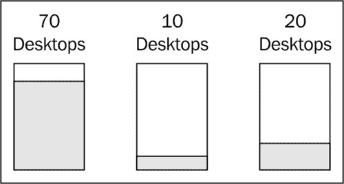

在前面的示例图中，集群中有三台主机，并且没有启用 VMware DRS。在集群的第一台主机上，有 70 个 vDesktop；在第二台主机上，有 10 个 vDesktop；而在第三台主机上，有 20 个 vDesktop。由于没有启用 VMware DRS，负载（因此 vDesktop 的数量）在集群中所有可用主机之间并未均衡分配。

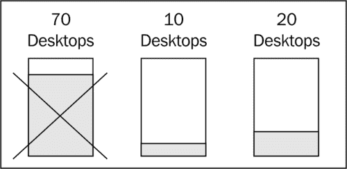

继续前面的示例，如果第一台主机发生了预料之外的故障，将有 70 个 vDesktop 受到影响。如果启用了 DRS，并且所有 vDesktop 的 CPU 使用情况大致相同，那么每台主机上大约会分配 34 个 vDesktop。这将大大减少因物理主机故障而导致的最终用户受影响的数量。

### 反亲和性

**亲和性**（Affinity）和 **反亲和性**（Anti-affinity）是 VMware DRS 中的设置，用于确定给定集群中虚拟机之间的相互关系。

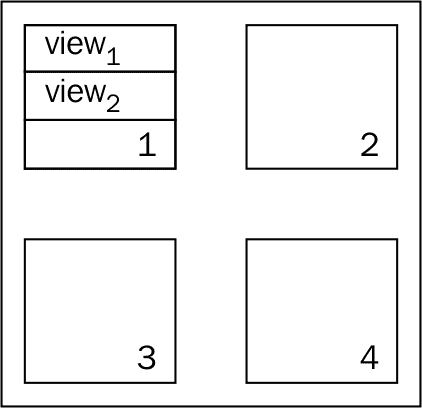

在前面的图示中，DRS 已启用并设置为**自动**模式，适用于四主机集群。没有设置亲和性或反亲和性规则。VMware View 解决方案需要两个 View 连接服务器，这两个服务器都已虚拟化并放置在前述集群中。

通过正常的 DRS 操作，两个 View 连接服务器都被放置在 Host1 上。如果 Host1 发生故障，则不允许有新的连接进入 VDI。

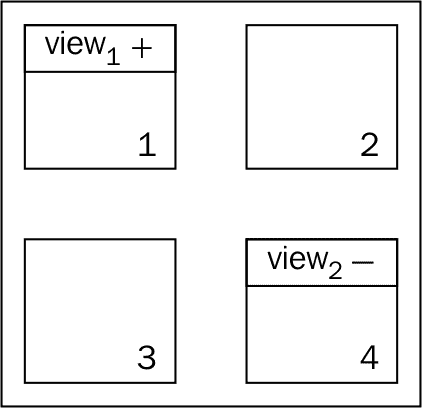

在前面的示意图中，两个 View 连接服务器 View1 和 View2 已经设置了反亲和性规则，并且它们具有相反的极性。该规则表示，在集群中有可用主机时，两个 View 连接服务器不能位于同一台主机上。

配置反亲和性后，单一主机故障不会导致整个 VMware View 连接服务器环境崩溃。

# VMware vCenter Server

VMware View 使用 VMware vCenter 执行所有的配置任务。没有功能正常的 VMware vCenter Server，就无法创建、刷新、重新组合、重新平衡或删除 vDesktops。因此，必须高度重视保护解决方案中使用的 VMware vCenter Server。

VMware vCenter Server 服务有两个主要组件，具体如下：

+   VMware vCenter Server 服务

+   后端数据库

VMware vCenter Server 服务应以一种消除停机时间或提供少于一分钟恢复时间目标（RTO）的方式进行保护。对于极为活跃的 VDI，长期停机可能导致无法向请求的终端用户提供桌面资源。保护 VMware vCenter Server 服务的最强方法是 VMware vCenter Server Heartbeat（下面会进一步讨论）。

VMware vCenter 使用的后端数据库可以驻留在同一台服务器（物理或虚拟）上，也可以驻留在独立的数据库服务器上。

| 组件 | 选项 1 | 选项 2 |
| --- | --- | --- |
| vCenter Server | **虚拟** | 物理 |
| 数据库位置 | 在 vCenter Server 上 | **在一个或多个独立的服务器上** |
| 数据库保护 | 备份解决方案 | **集群解决方案** |

### 注意

在前述表格中，出现粗体字的部分是建议项。

在 VMware View 解决方案中，来自组织数据库团队的合作非常重要，因为 vCenter 故障（通常与数据库相关）可能会对 VDI 造成严重影响。因此，建议在设计过程中与组织的数据库团队进行沟通。

## VMware vCenter Server Heartbeat

**VMware vCenter Server Heartbeat (vCSH)** 是 VMware 的一款产品，由 Neverfail 提供支持。vCSH 监控并保护 VMware vCenter Server 基础架构中所有必要的组件，包括：

+   **服务器：** vCSH 保护物理或虚拟服务器故障或操作系统故障（例如，蓝屏死机）

+   **网络：** vCSH 保护网络身份，包括 vCenter Server 的 IP 地址和 DNS 名称。

+   **应用：** vCSH 保护与 VMware vCenter Server 服务相关的应用环境，以及所需的文件和注册表项。

+   **性能：** vCSH 监控底层物理或虚拟服务器的性能。

+   **数据：** vCSH 监控所有数据和相关应用，并保持数据副本，包括数据库（如果是本地的）。

VMware vCenter Server 心跳需要两个 VMware vCenter Server 实例，这两个实例会合并成一个 vCSH 配对。vCSH 配对作为单一的 VMware vCenter Server 实例工作，共享主机名、IP 地址以及其他相关信息和配置。

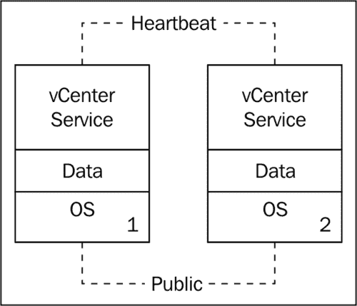

vCSH 以异步方式将数据从配对中的主 vCenter Server 复制到次 vCenter Server。VMware vCenter 还会识别 VMware View Composer 服务，以确保它也受到保护。

### 为什么应该使用 VMware vCenter Server 心跳

对于生产环境、大型部署或具有高关键性的解决方案，应该始终使用 VMware vCenter Server 心跳，因为它保护了 VDI 中最脆弱的组件。

存储阵列通常具有内建的高可用性，支持 RAID、多存储处理器、电源供应、风扇、额外磁盘等。

物理主机通过多个网卡、多重电源供应和 VMware 功能（如 VMware HA）来进行保护。

网络层通过硬件和网络路径的冗余来进行保护。

View 连接服务器通过重复实例、负载均衡，以及可能通过 VMware 故障容错来保护。

然而，由于单个 VMware vCenter Server 实例可能负责超过十台物理主机，并且可能管理数百个 vDesktops，因此保护其状态至关重要。

VMware vCenter Server 心跳不仅能够保护 VMware vCenter Server 服务，还能保护 vCenter 数据库（如果是本地的）和 VMware View Composer 服务。

# VMware View

VMware View 负责处理来自 vDesktops 的请求，与 VMware vCenter Server 交互以配置、重组和删除 vDesktops；以及执行其他各种必要任务，以确保 VDI 正常运行。

## 复制

安装 VMware View 连接服务器时，有四种安装类型。具体如下：

+   标准

+   复制

+   安全

+   传输

对于 View Connection Server 池中的第一个 VMware View 连接服务器实例，应选择标准安装。然而，为了消除 View 连接服务器作为单点故障的风险，可以安装第二个（以及其他）View 连接服务器。一旦 View 连接服务器存在于基础设施中，可以将额外的 View 连接服务器加入到原来的服务器，形成 View 连接服务器池。要将新的 View 连接服务器加入现有的 View 连接服务器或 View 连接服务器池，请选择 **副本** 安装模式。

当创建副本 View 连接服务器实例时，它会从现有的 View 连接服务器实例复制 VMware View LDAP 配置。

## 负载均衡

VMware View 连接服务器负责在授权的最终用户与 VDI 中的 vDesktop 之间建立连接。因此，如果没有可用的 VMware View 连接服务器，就无法建立新的连接到 VDI。然而，如果没有可用的 VMware View 连接服务器，现有的连接将不受影响。

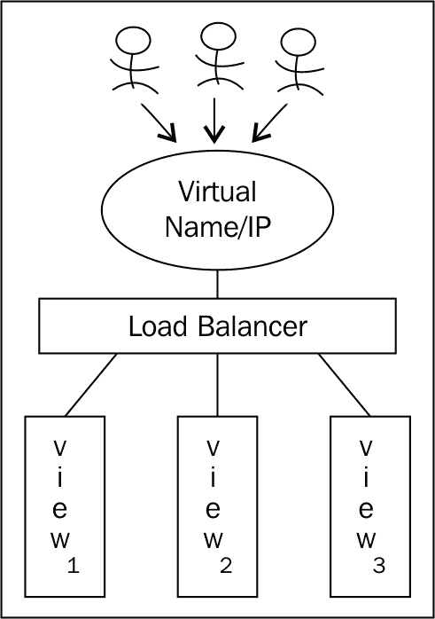

因此，保护 VDI 中可用的 View 连接服务器非常重要。最佳做法是至少有两个 VMware View 连接服务器（或可能有一个通过 VMware 容错保护的服务器）。实现 VMware View 连接服务器的弹性最简单的方法是使用负载均衡解决方案。市场上有多种负载均衡解决方案，包括 **Microsoft 网络负载均衡器 (NLB)** 和来自 F5 等公司提供的硬件设备（首选）。

负载均衡解决方案将创建一个虚拟 IP 地址，最终用户将通过该虚拟 IP 地址连接到 VDI。在虚拟 IP 地址背后，将是负载均衡池中所有 VMware View 连接服务器的实际 IP 地址。如果某个 VMware View 连接服务器没有响应 ping 请求（例如），它将被从负载均衡池中移除，以确保传入的最终用户请求不会被路由到不可用的 View 连接服务器。

许多负载均衡解决方案还提供通过 HTTP GET 和类似命令监控可用性的功能，确保服务器不仅在线，而且对基于 Web 的请求做出响应。

## VMware 容错

**VMware 容错 (FT)** 可以作为 VMware View 连接服务器的额外保护层。VMware FT 通过创建并维护一个与主虚拟机完全相同的副本虚拟机来保护虚拟机。副本虚拟机会持续可用，以便在主虚拟机所在主机发生故障时替代主虚拟机。

在 VMware 容错中，不会有停机时间（与 VMware HA 不同）。但 VMware FT 确实有一些限制，包括支持的硬件、vCPU 数量（目前为 1）等。

VMware FT 会将主虚拟机上的输入和事件传递到副虚拟机，副虚拟机在集群中的另一台主机上运行。

VMware FT 确实会影响虚拟基础架构设计，因为它需要为 FT 日志记录配置单独的专用 NIC。FT 日志记录和 vMotion NIC 必须位于不同的子网中。此外，任何单一的 ESX 主机上最多只能容纳四个启用 VMware FT 的虚拟机主虚拟机或副虚拟机。

### 使用 VMware FT 时的设计影响

为了正确说明使用 VMware FT 的设计影响，将使用以下示例。

经过深入分析，已确定 CustomerA 需要四个 VMware View Connection Servers，以满足进入请求的需求。

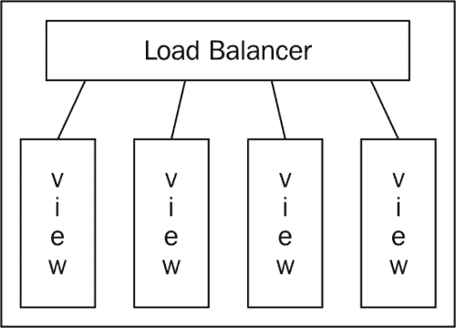

作为解决方案的一部分，安装并配置了四个 VMware View Connection Servers，并将其放置在负载均衡器后面。

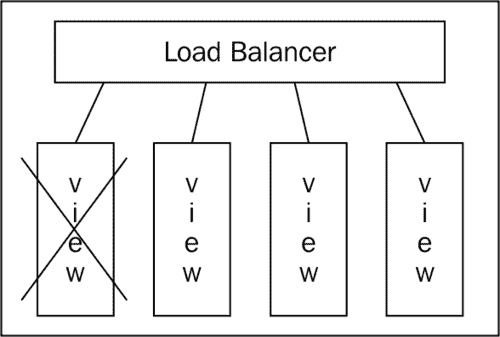

如果某个 VMware View Connection Server 发生严重故障（例如，蓝屏死机），则仅剩三个连接服务器可供最终用户使用。剩余的三个连接服务器可能无法处理负载，导致部分最终用户无法连接到 VDI。

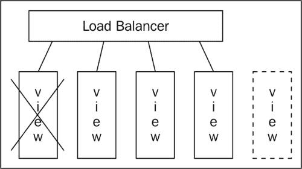

恢复因故障导致的 View Connection Server 连接的唯一方法是从以前的备份中恢复，或者构建新的 View Connection Server，并将其添加到负载均衡池中，如前图所示。

如果某个 VMware View Connection Server 所在主机发生故障，VMware HA 将在集群中的可用主机上启动该虚拟机。部分最终用户可能会经历几分钟的停机时间（如果剩余的三个 View Connection Servers 无法处理负载）。然而，3 到 5 分钟后，完整的连接应该恢复。

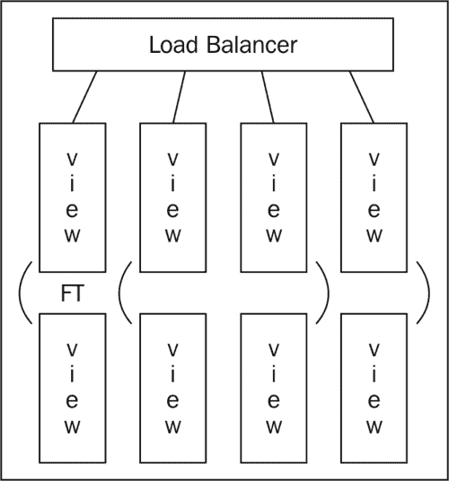

通过利用 VMware FT 保护 View Connection Servers，如果发生物理主机故障，这种解决方案将不会受到任何影响（假设反亲和性已将主虚拟机和副虚拟机分开）。

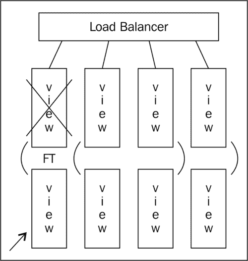

如果发生影响 View Connection Server 的物理主机故障，VMware FT 会立即使副虚拟机（如前图底行所示）变为活动状态。通过 VMware vLockstep 技术，副虚拟机是主虚拟机的完全副本，主虚拟机原本驻留在故障主机上。故障切换成功后，副虚拟机会被标记为主虚拟机。此外，将从新指定的主虚拟机创建新的副虚拟机。

### 注意

然而，VMware FT 并不防护来宾操作系统故障（例如，蓝屏死机）。因此，将 VMware FT 与 VMware HA 结合使用 VM 监控，是最强大的解决方案。

虽然 VMware FT 是保护 VMware View 连接服务器的有用技术，但大多数虚拟化架构师更倾向于仅仅向原设计中添加一个额外的 View 连接服务器，而不是增加 VMware FT 的复杂性。

# 父 vDesktop 和模板

VMware View 在部署选择了**完整虚拟机**选项的 vDesktops 时使用虚拟机模板。在选择了**View Composer 链接克隆**选项时，VMware View 使用标准虚拟机（而不是模板）部署 vDesktops。为了使虚拟机被 View Composer 识别，它必须至少有一个快照。View Composer 从选定的快照部署池中的所有 vDesktops。

重要的是要理解，如果父 vDesktop（对于 Linked Clone 池）或黄金 vDesktop 模板（对于 Full Desktop 池）不可用，则无法配置新的 vDesktops。

## 模板

虚拟机模板的保护稍显复杂。当创建虚拟机模板或将虚拟机模板添加到库存中时，管理员必须在集群中选择一个特定的主机。根据**图形用户界面（GUI）**，"选择集群中的特定主机。在高可用性集群和完全手动的动态工作负载管理集群中，每个模板必须分配给特定的主机。"

因此，如果 vDesktops 的黄金模板存储在 Host1 上，且 Host1 出现故障，VMware HA 将无法恢复该模板。相反，原始模板将在 vCenter 中显示为不可用。从此时起，vCenter 中原始模板的库存条目可以被删除，然后模板可以重新添加。这是可能的，因为虽然主机不可用，但虚拟机模板实际上存储在共享存储中（假设遵循了最佳实践）。

在协助组织进行操作准备时，前述的恢复过程应列入标准操作程序手册中。

## 带有快照的父 vDesktops

要保护父 vDesktop 及其快照，仅仅执行一个简单的克隆虚拟机任务是不够的。这是因为克隆任务会合并快照树，从而删除所有与基础虚拟机相关的快照。

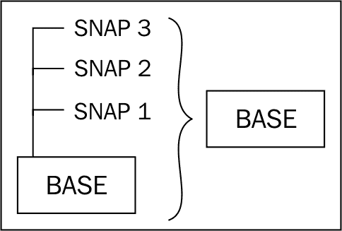

因此，必须使用 VMware HA 来保护父 vDesktop。由于父 vDesktop 仅仅是一个带有快照的虚拟机（而不是前述场景中的虚拟机模板），在主机故障时，VMware HA 会将父 vDesktop 的所有权转移到集群中可用的主机上。

# 用户角色

对于使用用户角色解决方案的环境，例如 Liquidware Labs ProfileUnity™，将用户角色放置在高可用的网络共享上对于确保终端用户数据始终可用至关重要。通过使用**分布式文件系统 (DFS)** 服务或**分布式文件系统复制 (DFS-R)** 服务，存储用户角色的文件共享即使在文件服务器发生故障时仍然可用。此外，使用 DFS-R，用户角色可以在同一站点或其他站点的其他服务器之间进行复制。DFS-R 通过确保存储用户角色的文件共享将数据复制到异地，从而实现 VDI 的**持续运营 (COOP)**。

微软 DFS 还利用 Active Directory 站点来确保终端用户从参与 DFS/DFS-R 组的最近服务器中获取他们的角色。此外，站点成本可以用于确定哪个是终端用户尝试从网络共享获取其用户角色时最便宜的目标选择。

以下表格展示了所有组件故障类型的汇总：

| 组件 | 故障类型 | 保护方式 | 停机时间 | 备注 |
| --- | --- | --- | --- | --- |
| vCenter 服务器 | 底层物理主机 | VMware HA | 大约 10 分钟 | 在故障期间，vDesktop 任务（如创建、重新合成等）将无法使用。由于在初始服务启动期间执行的数据库操作，vCenter 可能需要更长时间才能启动（与 View 连接服务器不同）。 |
| vCenter 服务器 | 底层物理主机 | vCenter 服务器心跳 | 少于 1 分钟 | 需要第二个 vCenter 服务器实例。 |
| vCenter 服务器 | 操作系统（蓝屏死机） | vCenter 服务器心跳 | 少于 1 分钟 | 需要第二个 vCenter 服务器实例。 |
| vCenter 数据库 | 任何 | 集群解决方案 | 少于 1 分钟 | 需要两台数据库服务器。 |
| vCenter 数据库 | 数据库损坏 | 备份/恢复/快照 | 变化 | 恢复时间取决于所使用的解决方案、媒体速度和可用的吞吐量。 |
| View 连接服务器 | 底层物理主机 | VMware HA | 大约 5 分钟 | 需要多个 View 连接服务器位于负载均衡器后，以减轻对终端用户的影响。 |
| View 连接服务器 | 底层物理主机 | 负载均衡器 | 0 分钟 | 需要多个 View 连接服务器位于负载均衡器后，以减轻对终端用户的影响。如果没有 VMware HA，可能会影响总的入站连接数。 |
| View 连接服务器 | 底层物理主机 | VMware FT | 0 分钟 | 它不能保护客操作系统故障（参见 VMware HA 的虚拟机监控）。 |
| View 连接服务器 | View 连接服务器服务 | 负载均衡器 | 0 分钟 | 需要多个 View 连接服务器位于负载均衡器后，以减轻对终端用户的影响。 |
| 视图连接服务器 | 操作系统（蓝屏死机） | VMware HA 的虚拟机监控 | 大约 5 分钟 | 需要多个视图连接服务器位于负载均衡器后，以减少对终端用户的影响。 |
| 视图编排器 | 底层物理主机 | VMware HA | 大约 10 分钟 | 在停机期间，vDesktop 任务（如配置、重组等）不可用。vCenter 可能需要更长时间启动（与视图连接服务器不同），因为在初始服务启动过程中会执行数据库操作。 |
| 视图编排器 | 底层物理主机 | vCenter 服务器心跳 | 少于 1 分钟 | 需要第二个 vCenter 服务器实例。 |
| 视图编排器 | 操作系统（蓝屏死机） | vCenter 服务器心跳 | 少于 1 分钟 | 需要第二个 vCenter 服务器实例。 |

# 总结

到目前为止，已经解决了一些最重要的设计考虑因素（例如，持久性或非持久性），以及整体 VDI 的适当大小。设计一个高度可靠的 VMware View 解决方案对于生产质量的解决方案至关重要。在下一章中，将讨论最后一个主要难题——存储设计。一个大小不当的 VDI 可能会导致用户体验不佳。没有冗余的 VDI 可能会导致意外的停机和停机时间。一个存储设计不当的 VDI 不仅会导致用户体验差，还可能大大增加 VDI 解决方案的整体成本。由于存储通常是 VDI 解决方案中最昂贵的组件之一（如果不是最昂贵的组件），因此合理的尺寸规划至关重要，必须在满足需求的前提下进行。
