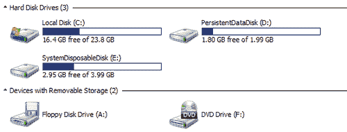
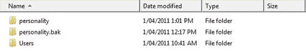

# 第八章 存储规模规划

存储层可能是 VMware View 设计中最关键的组件之一。对于许多 VDI 专业人士来说，这可能是当需要进行性能故障排除时面临的主要问题。通常，存储层是性能问题的根本原因。为什么存储如此关键？要回答这个问题，我们首先需要了解基于英特尔®的桌面如何工作并与 Windows 操作系统交互，然后再深入了解 VDI 的存储世界。

物理桌面一直依赖专用硬盘，并且只有一个 Windows 内核可以访问该磁盘，从而造成单一的 I/O 流。尽管该设备专用，但它也面临磁盘争用。这种争用可能是由于过多的磁盘 I/O 操作或 I/O 块大小引起的。重要的是，不论是哪种类型的操作导致争用，最终结果都是高响应时间，也称为**延迟**。

最近的磁盘技术进展，如**固态硬盘（SSD）**，大幅减少了延迟的影响，从而提升了终端用户体验。最先进的 SSD 可以处理并提供大量的 I/O 和吞吐量。

随着使用更快磁盘的能力，用户习惯了提升的性能。然而，微处理器和 RAM 技术也在快速发展，像英特尔 Core i7 和 DDR3 等技术很快使即便是最先进的 SSD 也再次成为性能瓶颈。

除少数例外，VDI 实现并未使用单一的专用磁盘。相反，VDI 使用磁盘池来提供存储容量、I/O 和吞吐量给 vDesktops。

大多数 VDI 实现需要共享存储，以便为多个服务器提供共享数据存储。共享存储也是 VMware vSphere 功能（如 vMotion、DRS 和容错）的关键支持者。采用浮动池和漫游配置文件组合的实现可能会选择存储设备解决方案，其中没有持久数据存储在这些设备上。

本地磁盘、**专用附加存储（DAS）**，甚至无盘解决方案都可以在 VDI 部署中使用。了解每种方法背后的使用场景和影响非常重要。

在 VDI 设计阶段做出的存储架构决策将深刻影响基础设施的性能和操作方式。所选的存储类型和传输协议将决定 VMware View 和 vSphere 如何运行。然而，存储类型和协议也会决定数据存储的设计方式或每个数据存储上应使用多少桌面。

# VMware View Composer

VMware View 基础架构包括 VMware View Composer 作为可选组件。View Composer 作为 Windows 服务在 vCenter Server 上运行，允许 View Manager 从单个集中化的标准基础镜像快速克隆和部署多个虚拟桌面。View Composer 最初设计用于减少 VDI 部署中所需的总存储；然而，今天，View Composer 还提供了重要的管理功能，如刷新和重组操作。

View Composer 使用链接克隆技术。与传统的虚拟机模型不同，在传统模型中，每个虚拟机作为一个独立的实体存在，具有专用的虚拟磁盘，而 View Composer 创建的虚拟机都依赖于一个主虚拟机。这种主虚拟机在 VMware 术语中被称为**父虚拟机**。

父虚拟机作为基础镜像使用，从父虚拟机拍摄快照并复制，创建复制镜像，这将作为所有链接克隆桌面池中虚拟机的主磁盘。

复制磁盘是作为只读的精简配置实体从父虚拟机创建的，以确保对父虚拟机的任何后续更改不会影响链接克隆桌面。如前所述，复制是精简配置的，这意味着只有父虚拟机中的数据才会被复制到复制镜像中。例如，如果父虚拟机创建时有 40 GB 的磁盘，但在客户的 Windows NTFS 卷中只显示 20 GB，那么复制镜像将是 20 GB。

复制镜像是通过**VM LockStatus**参数在 vCenter Server 中受保护的实体，该参数添加到虚拟机注释中，如下图所示。如果复制镜像因任何原因需要删除，必须按照 KB1008704 中概述的流程操作。该过程的链接如下：

[`kb.vmware.com/selfservice/microsites/search.do?language=zh_CN&cmd=displayKC&externalId=1008704`](http://kb.vmware.com/selfservice/microsites/search.do?language=zh_CN&cmd=displayKC&externalId=1008704).

以下截图显示了**VM LockStatus**参数：

一个父虚拟机可能包含多个快照，这些快照代表了对基础镜像所做的更改。这些差异可能是由于 Windows 客户操作系统所需的修复、补丁和升级。将新应用程序部署到基础镜像、应用程序升级，甚至是 Windows 配置更改，都可以添加到快照中。

每次修改后，必须由管理员关闭父虚拟机，并拍摄新的快照。

在桌面池配置过程中选择将要使用的快照。整个桌面池分配一个快照。然而，也可以使用来自同一或不同父虚拟机的不同快照，单独重组虚拟桌面。

以下截图演示了 VMware vCenter Server 快照管理器，已经拍摄了一些快照。推荐在描述字段中标注对父虚拟机所做的更改：

桌面池配置过程中可以看到 VMware View 快照选择，以下截图展示了在 View 管理员控制台中的快照选择：

在 VMware View 4.5 之前的版本中，每个托管虚拟桌面的存储区会为桌面池创建一个唯一的副本磁盘。此外，对于桌面池使用的每个不同的快照，曾经会为每个使用的存储区创建一个新的副本磁盘。

每次只能为桌面池分配一个快照。然而，在为桌面池选择了不同的快照并触发重组操作后，会在每个存储区中创建一个表示新快照的第二个副本磁盘，这些存储区由使用副本磁盘的虚拟桌面共享。在这种情况下，每个存储区可能会包含桌面池的两个副本。

在重组操作中，原始副本镜像仅在所有桌面池中的桌面都使用新的基础副本磁盘重新组合，并且不再需要旧副本时才会被删除。因此，确保用于存储副本的存储区上有充足的空间非常重要。

如果管理员在选择存储区时没有选择可选的专用副本存储区功能，那么这个场景在 VMware View 5.0 中依然适用。

VMware View 4.5 及以后的版本实现了为整个桌面池指定唯一存储区以托管副本磁盘的功能。这部分是 VMware View 分层存储功能的一部分。

以下截图展示了在 View 管理员控制台中的存储区选择：

如果桌面池很大，并且最终使用整个 vSphere 集群资源，可能会导致整个集群只使用一个副本磁盘。对于 VMware View 5.0，单个桌面池中支持的最大虚拟桌面数量为 1,000 个。虽然可以超过 1,000 个桌面，但不建议也不支持这样做。

在某些情况下，如果使用了多个快照，那么在池配置期间选择的单个存储区中会创建多个副本。以下图示展示了在 VMware View 4.5 及以上版本中，使用和不使用专用副本存储区选项的区别：

在以下示例场景中，VMware View 在两个桌面池中运行 256 个虚拟桌面，每个池使用 2 个快照。如果副本磁盘大小为 20 GB，则副本磁盘的总存储分配将为 320 GB，每个存储区为 80 GB。

桌面池数量 * 使用中的副本数 * 数据存储数量 * 副本大小 = 2 * 2 * 4 * 20 GB = 160 GB。

使用相同的示例场景，若使用专用副本数据存储，则副本磁盘的总存储分配将在单个数据存储中为 80 GB。

桌面池数量 * 使用中的副本数 * 副本大小 = 2 * 2 * 20 GB = 80 GB

以下图示展示了这两种场景。它展示了在使用多个快照和专用副本磁盘数据存储的情况下，副本磁盘放置的差异，适用于 View 4.5 及以上版本：

对于前述场景，运行相同的计算，若有 2000 个虚拟桌面，View Composer 技术提供的存储节省可能高达 6.3 TB。环境中虚拟机和桌面池的数量越多，当没有选择专用副本数据存储选项时，每个数据存储上的副本数量就会越大。

如果没有为每个桌面池选择所有数据存储，可以分解副本磁盘和存储消耗的量，从而限制虚拟桌面在数据存储之间的分布。

数据存储的数量和数据存储的大小必须满足为所需数量的桌面分配存储容量和性能要求。这个概念假设管理员会仔细管理和选择桌面池使用的数据存储，避免让所有数据存储被所有桌面池使用。

以下截图展示了没有使用专用副本数据存储选项的解决方案：

链接克隆磁盘也叫做 **增量磁盘**，因为它积累了增量变化。在副本磁盘创建后，View Composer 开始创建链接克隆虚拟桌面。每个链接克隆都有一个唯一的增量磁盘，并与副本磁盘相关联。

增量磁盘仅包含与原只读副本磁盘的差异，这些差异是克隆虚拟桌面特有的，从而节省了大量存储。链接克隆磁盘将根据客户操作系统请求的块写入更改而逐渐增长，可能会增长到父虚拟机的最大大小。

以一个例子说明，如果管理员最初为父虚拟机配置了一个 30 GB 的平面磁盘，那么这将是增量磁盘的最大大小。

View Composer 可以大幅节省存储；然而，可能会有数十个或数百个链接克隆虚拟桌面使用同一数据存储来读取该单一现有的副本磁盘。如果没有使用专用副本数据存储选项，则副本仅被同一数据存储中托管的桌面使用。

所有访问副本磁盘的虚拟桌面将对 LUN、RAID 组和磁盘造成 I/O 压力，并可能导致 I/O 争用。I/O 争用是由于多个虚拟桌面和用户同时访问同一数据存储所引起的。

每个数据存储通常由一个 LUN（逻辑单元号）提供支持（如果使用**光纤通道协议 (FCP)**）或由一个导出提供支持（如果使用 NFS）。LUN 和导出都由 RAID 组配置支持，RAID 组包含配置以支持工作负载的磁盘池。这些磁盘和 LUN 必须能够满足副本磁盘所需的性能规格。这些规格包括**每秒输入/输出操作次数 (IOPS)** 和吞吐量。

如果在设计阶段决定使用专用副本数据存储，建议分配 Tier 1 存储，例如，使用 SSD 来承载副本磁盘。

下图展示了一个典型的虚拟磁盘与驱动器类型关联示意图：

存储供应商有不同的解决方案和架构来解决响应时间和延迟问题。一些可用的解决方案包括自动存储分级、存储池、无磁盘环境、内联 I/O 去重和本地主机缓存。

# VMware vSphere 文件

下表列出了通过 VMware View 提供的虚拟桌面所创建的文件和磁盘，这些文件是任何在 vSphere 虚拟化平台上创建的虚拟机的标准文件：

| 文件类型 | 描述 |
| --- | --- |
| `.vmx` | `.vmx`文件是虚拟机的主要配置文件，包含操作系统、磁盘大小、网络等信息。 |
| `.vmsd` | 关于快照的信息和元数据。 |
| `.vmxf` | 虚拟机在团队中时的补充配置文件。注意，虚拟机从团队中移除时，`.vmxf`文件仍然保留。 |
| `.vswp` | `.vswp`文件是为每个虚拟机创建的交换文件，用于在 ESXi 主机上实现虚拟机内存超分配。当虚拟机启动时会创建此文件，大小与虚拟机未预留的内存大小相等。虚拟机创建时，默认的内存预留为 0 MB，因此`.vswp`文件的大小等于分配给虚拟机的内存量。如果虚拟机配置了 1024 MB 的内存预留，则`.vswp`文件的大小将等于分配给虚拟机的内存减去 1024 MB 的预留。 |
| `.vmss` | `.vmss`文件是在虚拟机挂起时创建的，用于保存挂起状态。本质上，这是虚拟机内存的副本，大小始终与分配的总 RAM 大小相同。需要注意的是，`.vmss`文件是在虚拟机进入挂起状态时创建的，但当虚拟机从挂起状态恢复时，该文件不会被删除。`.vmss`文件只有在虚拟机关机时才会被删除。如果虚拟机配置了 2048 MB 的内存，`.vmss`文件的大小将为 2048 MB。 |
| `.nvram` | 此文件存储虚拟机 BIOS 的状态。 |
| `.vmsn` | 快照状态文件，存储在拍摄快照时虚拟机的运行状态。 |
| `-flat.vmdk` | `-flat.vmdk` 是一个原始磁盘文件，为分配给特定虚拟机的每个虚拟磁盘创建，并且其大小与创建虚拟机时添加的虚拟磁盘大小相同。这是一个预分配的磁盘文件，仅适用于完整克隆虚拟机。 |
| `.log` | VM 日志文件相对较小。 |

# VMware View 特定文件

以下表格列出了通过 VMware View 配置的虚拟桌面创建的文件和磁盘。某些磁盘仅在使用 View Composer 或为桌面池分配持久或一次性磁盘时创建：

| 文件类型 | Composer | 描述 |
| --- | --- | --- |
| `replica-GUID.vmdk` | 是 | 副本虚拟机用于启动链接克隆虚拟机。 |
| `-internal.vmdk` | 是 | Quick Prep/Sysprep 的数据配置。 |
| `VM-s000[n].vmdk` | 是 | 当虚拟机有快照时创建。此文件存储虚拟机运行时对虚拟磁盘所做的更改。可能会有多个此类文件。字母后的三位数字（此例中 s 后的 000）表示一个唯一的后缀，用于避免文件名重复。 |
| `VDM-disposable-GUID.vmdk` | 是 | 重定向的 Windows 操作系统页面文件和临时文件。 |
| `.log` | 否 | VM 日志文件。 |

# 分层存储

VMware View 4.5 及以上版本允许管理员选择不同的存储区来托管不同类型的虚拟磁盘（副本、链接克隆和持久磁盘）。数据性能分类是存储分层实施的重要部分，允许管理员根据性能、成本和容量为每种类型的磁盘选择提供最合适存储层的存储区。

### 注意

重要提示：不要将 VMware View 提供的存储分层功能与存储供应商提供的自动存储分层混淆。VMware View 提供的解决方案是静态的，无法自动移动数据以实现最佳性能。两者是互补的解决方案。

随着存储分层的引入以及将工作负载分段到不同存储区和磁盘类型的能力，了解每个虚拟桌面创建的磁盘和数据类型非常重要。每个实施方案中创建的磁盘类型可能不同。使用链接克隆技术的桌面池可能会有额外的虚拟磁盘，而在使用传统完整克隆配置时不会创建这些磁盘。

以下图表展示了 VMware View 使用的多种类型的虚拟磁盘：

## 副本磁盘

`replica-GUID.vmdk` 文件夹包含运行虚拟机所需的所有文件，但它将专门用作只读并作为链接克隆虚拟桌面的基础。以下截图展示了用于托管副本磁盘的文件夹和文件。

尽管在以下示例中磁盘的配置大小设置为 30 GB（31,457,280 KB），实际上只使用了 8 GB。这是因为 View Composer 利用了 vSphere VMFS 薄配置技术来创建副本磁盘。这是一个自动设置，无法通过 View Manager UI 更改，并且会独立于父虚拟机是否为薄或厚配置工作。对于 NFS 部署，薄配置也是唯一的配置机制。

## 内部磁盘

`internal.vmdk`磁盘是一个小磁盘，包含 Quick Prep/Sysprep 的配置数据。在以前的 VMware View 版本中，操作（例如刷新）会导致完全删除桌面，然后为新的虚拟桌面进行配置和定制。这个过程过去需要很长时间才能完成，并且通常会消耗大量的计算和存储资源。

VMware View 4.5 及以后版本开始实现一种不同的虚拟桌面刷新技术，利用了 vSphere 快照技术。

刷新操作仅仅是一个快照恢复操作。内部磁盘用于存储 Windows 根据默认的 AD 策略设置周期性地进行的 Active Directory 计算机账户密码变更。计算机账户密码在存储到内部磁盘之前会被加密。

每当域计算机账户密码发生更改时，VMware View Agent 会将密码的另一个加密副本存储到磁盘中。这确保了在刷新桌面时，域连接得以保持。

内部磁盘连接到桌面，但不会分配驱动器字母。

以下截图显示了来自客户虚拟桌面内部的内部磁盘截图：

内部磁盘是 VMware View 创建的唯一一个非薄配置磁盘。其大小非常小，因此即使是厚配置，也不会改变解决方案的容量需求。

## Delta/差异磁盘

以下截图演示了在虚拟机文件夹中创建的文件夹和文件，用于托管链接克隆桌面。在以下示例中，差异磁盘是`VMView-7-D-01-000001.vmdk`。

自定义过程完成后，虚拟机会被关闭，View Composer 会对链接克隆拍摄一个快照。

以下截图显示了在各自虚拟机文件夹中创建的文件夹和文件：

在创建快照后，数据不再写入基础`.vmdk`文件。相反，变更会写入差异磁盘。每次创建快照时都会创建一个差异磁盘。在定义数据存储大小需求时，必须考虑到使用快照的任何需求。

## 临时磁盘

VMware View 允许为每个虚拟桌面创建一个可选的固定大小的非持久性磁盘。当将可丢弃磁盘分配给桌面池时，VMware View 会将 Windows 临时系统文件和文件夹重定向到可丢弃磁盘。

当虚拟桌面关闭、电源重启或重新组成时，可丢弃磁盘会被自动删除，这意味着在这些操作期间临时文件也会被删除。

可丢弃磁盘也是薄配置的，并将在桌面池配置期间设置的最大大小范围内逐渐增长。

以下截图显示了 View 管理控制台中的**可丢弃文件重定向**配置：

可丢弃磁盘被硬编码为在 Windows 桌面上注册为第一个可用驱动器。这种行为在尝试在 Windows 虚拟桌面中映射网络驱动器时可能会带来一些影响。即使 CD-ROM 没有使用，第一个可用驱动器字母也会是`E:`，因为 `C:` 被操作系统占用，`D:` 被可丢弃磁盘占用。

常常被卸载到可丢弃磁盘的文件包括 Windows 页面文件、VMware 日志文件和临时 Internet 文件。

### Windows 页面文件

当 Windows 不断耗尽物理内存时，它将开始将内存分页到磁盘。这一分页过程会导致块写入，从而增加可丢弃磁盘的大小。作为一种推荐方法，管理员应确保虚拟桌面有足够的虚拟内存以避免磁盘分页。磁盘分页会对性能产生负面影响。

### 临时 Internet 文件

用户临时文件保存在系统或持久数据磁盘上，这可能包括写入`%USERPROFILE%\AppData\Local\Temp`和`Temporary Internet Files`的文件。这些是可能快速增长并占用磁盘空间的临时文件。

由于临时文件被卸载到可丢弃磁盘，增量文件的稳定增长得以减少。View Composer 不再使用根据块更改增长的增量磁盘，而是使用可丢弃磁盘。然而，根据虚拟桌面和工作负载要求对可丢弃磁盘进行合理大小设置非常重要。一旦分配给虚拟桌面池，该设置不能通过 View 管理器更改。

以下截图显示了包含 Windows 临时文件的可丢弃磁盘：

### 注意

配置链接克隆池时，确保可丢弃磁盘大于 Windows 页面文件大小加上临时文件的开销。

## 持久磁盘

持久数据磁盘是 VMware View 早期版本中称为**用户数据磁盘（UDD）**的新名称，并且保持与 UDD 相似的特性。持久磁盘的创建旨在维持用户与虚拟桌面之间的一对一关系。

在桌面池配置时选择该选项时，会创建持久磁盘，并且 VMware View Agent 会对 Windows 客户操作系统进行修改，以便将用户配置文件重定向到该磁盘。

在 VMware View 4.5 及更高版本中，可以管理持久磁盘。可以将磁盘从虚拟桌面上分离并重新附加。请注意，这仅适用于在 VMware View 4.5 或更高版本中创建的磁盘。如果 VMware View 环境是从早期版本升级的，则无法执行这些操作。

与一次性磁盘一样，一旦配置了桌面池，持久磁盘无法禁用或启用。在初始配置之后，也无法通过 View Manager 图形用户界面更改其大小。但是，如果管理员更改了桌面池设置，则可以更改新配置虚拟桌面上的持久磁盘大小。

配置持久磁盘时，应确保磁盘大小足以满足用户的需求。如果未使用 Active Directory 文件夹重定向或 VMware View 用户配置管理，用户配置文件的大小可能会达到几个 GB。

一般来说，如果使用了用户配置管理或 Windows 漫游配置文件，请确保磁盘足够大，以容纳用户的漫游配置文件，或者为漫游配置文件应用配额。

以下截图展示了桌面池配置过程中持久磁盘选择界面。它显示了 View 管理控制台中持久磁盘的配置：

在 Windows 操作系统中，持久磁盘和一次性磁盘可以在 Windows 资源管理器中看到。重要的文件夹会被锁定，用户无法删除它们。但是，通过使用 Windows 组策略，仍然可以隐藏驱动器，同时使其可用。

以下截图展示了在客户端虚拟桌面中看到的各种磁盘：

持久磁盘的驱动器字母在桌面池配置过程中选择，其内容与以下截图类似。在**用户**文件夹中，可以找到配置文件文件夹和设置：

# 存储超额承诺

随着链接克隆技术的引入以及能够指定每个虚拟桌面刷新或重建的时间，提供了一个机会，可以指定应过度分配多少存储，以帮助减少存储消耗。

假设并非每个虚拟桌面都会同时使用全部分配的存储空间，从而为存储利用率和过度分配（超额承诺）留下空隙。

在桌面池配置过程中，管理员可以选择“注销后刷新操作系统磁盘”，并提供以下选项之一：

+   **从不：** 如果选择了**从不**选项，则虚拟桌面将永远不会执行增量磁盘刷新操作。增量磁盘将随着每个块的变化增长，直到达到磁盘本身的限制。如果为虚拟桌面定义的磁盘大小为 40 GB，则这是限制。当达到 40 GB 时，vSphere VMFS 将开始重新利用块，就像它对全克隆一样。在这种情况下，你不会耗尽磁盘空间。

+   **始终：** 如果使用**始终**选项，那么每次用户从桌面注销时，虚拟桌面都会被刷新。假设在使用过程中，增量磁盘只增加了几 GB，它们将在虚拟桌面刷新时被恢复。

+   **每 x 天：** 如果选择了**每 x 天**选项，则虚拟桌面将在定义的天数内刷新，无论增量磁盘的利用率如何。增量文件会随着时间的推移而增长，基于包括 Windows 和应用程序在内的多个因素。因此，在选择此选项时，了解增量在此期间可能达到的大小非常重要，以便能够相应地调整数据存储的大小。

+   **在 y 百分比的磁盘利用率下：** 如果选择了**在 y 百分比的磁盘利用率下**选项，且 *y* 设置为 50%，则当增量占用的存储空间达到总分配存储的 50% 时，虚拟桌面将会刷新。此计算不包括额外的磁盘，如持久磁盘或一次性磁盘。如果虚拟桌面的总磁盘大小为 40 GB，则当用户注销时，且增量磁盘利用率达到或超过 20 GB 时，刷新操作将会执行。

一个重要的方面需要记住的是，链接克隆在启动时只有其完整配置大小的一小部分。通过刷新操作，VMware View Composer 提供的存储容量节省使管理员能够决定在存储完全占用之前，如何利用可用的存储容量。举个例子，选择了**始终**选项的管理员知道，在业务时间段内，增量文件平均将增长至 300 MB。

基于存储利用率，可以强制每个数据存储上放置更多的虚拟桌面，相较于全克隆虚拟桌面，这样做是可行的。这被称为**存储超额提交级别**。

### 注意

VMware View 不允许管理员配置每个数据存储的最大链接克隆数量，桌面数量的限制来自于数据存储的大小。为支持所需的桌面数量，同时符合 VMware View 和 View Composer 的最大值和限制，正确设置数据存储的大小至关重要。

通常，超额分配级别是根据虚拟桌面的使用方式来定义的。如果具有浮动分配的桌面池中的桌面在注销后设置为**始终**刷新，存储消耗将较低，您可以将超额分配设置为**激进**。然而，如果虚拟桌面不经常刷新，您可能更倾向于将其设置为**保守**。

## 存储超额分配级别选项

可以为不同类型的存储池定义不同的超额分配级别，以应对提供的容量、性能或可用性不同的需求。例如，NAS 存储池的超额分配级别可能与 SAN 存储池不同；同样，SSD 存储池的超额分配级别可能与 FC 存储池不同。

| 选项 | 存储超额分配级别 |
| --- | --- |
| 无 | 存储没有超额分配。 |
| 保守 | 存储池大小的四倍。这是默认级别。 |
| 中等 | 存储池大小的七倍。 |
| 激进 | 存储池大小的十五倍。 |

### 注意

推荐的做法是始终将 vSphere 存储池与 LUN 或导出进行一一对应。管理员应避免使用由多个存储池支持的大型存储 LUN。

根据存储超额分配级别，每个存储池中链接克隆的数量是基于父虚拟机的大小。以一个 30 GB 的虚拟机和 200 GB 的存储池为例，VMware View 大约可以容纳 6 个完全克隆的虚拟桌面。然而，如果使用超额分配级别为 7（中等），VMware View 大约可以容纳 42 个桌面。

| 虚拟机大小 (GB) | 存储池大小 (GB) | 超额分配级别 | 完全克隆虚拟机数量 | 链接克隆虚拟机数量 |
| --- | --- | --- | --- | --- |
| 30 | 200 | 4 | 6 | 24 |
| 30 | 200 | 7 | 6 | 42 |
| 30 | 200 | 15 | 6 | 90 |

### 注意

可能会耗尽存储容量。当存储池中的可用存储空间不足时，VMware View 将无法提供新的桌面，然而，现有的链接克隆桌面会继续增长，最终填满存储池。此情况在超额分配级别设置为**激进**时更为常见。

为确保链接克隆不会耗尽磁盘空间，管理员应定期刷新或重新平衡桌面池，将链接克隆的占用空间减少到原始大小。

以下截图演示了桌面池配置或配置过程中存储超额分配的选择：

# 存储协议

VMware View 由 VMware vSphere 支持，因此支持多种存储协议来存储数据。VMware vSphere 可以使用光纤通道（Fiber Channel）、iSCSI、**以太网光纤通道（FCoE）**和 NFS。

VMware View 协议选择的主要考虑因素包括最大吞吐量、VMDK 行为以及重新使用现有存储基础设施与采购新存储基础设施的成本。这些因素会影响网络设计和性能。

本节的目的不是涵盖每种协议或它们在 VDI 环境中的表现。以下表格中的数字基于 VMware View 5 和 vSphere 5，旨在帮助决策使用的存储协议：

|   | 光纤通道 | iSCSI | FCoE | NFS |
| --- | --- | --- | --- | --- |
| 类型 | 块 | 块 | 块 | 文件 |
| VAAI | 是 | 是 | 是 | 是 |
| 传输速率 | 4 Gbps 或 8 Gbps | 多条 10 Gbps | 多条 10 Gbps | 多条 10 Gbps |
| 每个主机的最大数量 | 8 | 8 | 8 | 8 |
| 每个主机的 LUN/导出数量 | 256 | 256 | 256 | 256 |
| 每个数据存储的克隆数量 | 64 至 140 | 64 至 140 | 64 至 140 | 未验证 |

# 最大值和限制

设计大规模 VMware View 解决方案是一项复杂的任务。如果未遵循 VMware 验证的最大值和限制，小规模部署可能也会面临与大规模部署相同的挑战。

### 注意

在规划 VDI 环境时，建议采取保守的方式。

有一些工具可以帮助管理员从图形、CPU、内存和存储的角度了解需求和限制。其他工具则有助于根据虚拟桌面数量、平均 IOPS、内存大小、共享内存百分比、已用内存百分比、读写 IOPS 百分比等来计算基础设施的规模。

无论这些工具提供什么结果，VDI 架构师应始终确保这些数字在 VMware vSphere 和 VMware View 的最大值和限制范围内。

## 每个数据存储（VMFS）最多可链接 64 至 140 个克隆

对于支持 **vStorage API 用于阵列集成（VAAI）** 的 FC 阵列，每个数据存储最多可链接 140 个克隆。增加每个数据存储中虚拟桌面数量的 VAAI 原语称为 **硬件辅助锁定** 或 **原子测试与设置（ATS）**。

vSphere VMkernel 必须为涉及存储在 VMFS 中的虚拟桌面的操作更新 VMFS 元数据。元数据的更新发生在启动/关闭虚拟桌面、挂起/恢复虚拟桌面以及其他各种操作时。

在 VDI 环境中，这意味着 VMkernel 可能需要为数百个虚拟桌面更新元数据，因此必须锁定整个 VMFS 才能更新其元数据，即使只为启动一个虚拟桌面。这一操作所需的时间通常不超过几毫秒，但在同时启动多个虚拟桌面时就会变得有问题。

硬件辅助锁定（vSphere 4.1 及兼容的供应商阵列代码提供）允许 VMkernel 在存储阵列上的 VMFS 中按块级别锁定元数据，并允许在 VMFS 内同时进行多个操作，这反过来允许多个桌面虚拟机同时启动。

## 每个数据存储（NFS）支持 250 个关联克隆。

对于由**网络文件系统（NFS）**支持的数据存储，每个数据存储上的虚拟桌面数量没有限制，因为 NFS 不涉及相同的 SCSI 预留问题。然而，至今没有来自 VMware 的官方验证，说明单个由 NFS 支持的数据存储可以托管的最大虚拟桌面数量。目前的建议是将每个 NFS 数据存储上的虚拟桌面数量保持在 250 个以下。

## 每个数据存储（VMFS）可支持 32 个完整克隆桌面。

如果能回答每个文档中最大值和限制的“为什么”问题，那就好了。某些广为人知的限制要么基于质量保证测试，要么基于现场经验。其他一些限制则基于以前技术设定的最佳实践，但由于缺乏额外的测试，这些限制仍然有效。

我们试图理解使用完整克隆时 32 个虚拟桌面限制的来源，VMware 给出的回答是没有明确的答案，除了说明这个限制基于服务器工作负载、SCSI 预留以及存储管理员未能做好基础设施规划。

如果这个限制是针对虚拟服务器工作负载设定的，它可能是在存储架构没有像高级缓存和 VAAI 支持等功能的年代设定的。

### 使用 View Composer 的每个 vSphere 集群最多支持 8 个主机。

如果集群中使用 View Composer 的主机数超过 8 台，VMware View 将停止提供新的虚拟桌面。这个行为是硬编码到 View Composer 中的。然而，限制的根源在于 VMFS 层。

VMFS 结构仅允许最多 8 个主机访问单个 VMDK 文件进行读写。在关联克隆实现中，集群中的所有主机可能都在读取来自同一副本磁盘的存储块。

### 注

在撰写本文时，VMware 正在验证每个 vSphere 集群最多支持 16 个主机与 View Composer 配合使用。

### 每个副本支持 1,000 个克隆。

每个副本的克隆数量还决定了单个桌面池中可以共存的关联克隆数量。这个数字来源于 VMware 的质量保证验证实验室，然而这是一个软性限制，尽管不推荐，但可以增加。

在以前的版本中，VMware View 验证的限制是每个副本或桌面池支持 512 个虚拟桌面。这个限制是由于每个数据存储最大支持 64 个关联克隆，再乘以每个 vSphere 集群支持 8 个主机得出的（64 * 8 = 512）。

# 存储 I/O 配置文件

每个虚拟桌面产生的 I/O 存储配置完全依赖于所使用的 Windows 操作系统类型、部署的应用程序，甚至每个用户如何单独与环境进行交互。

IOPS（发音为**eye-ops**）是用于衡量计算机存储设备（如**硬盘驱动器（HDD）**、**固态硬盘（SSD）**和**存储区域网络（SAN）**）性能的常见指标。与任何基准测试一样，存储设备制造商发布的 IOPS 数字并不能保证实际应用性能。

根据 Wikipedia，预测平均虚拟桌面 I/O 配置可能会是什么是设计 VDI 解决方案时最困难的任务之一。原因在于缺乏关于在设计时每个虚拟桌面上运行的工作负载的信息。

可以使用预设的趋势数字作为基准；然而，尽管这些数字表明工作负载可能是什么，在某些情况下，它们可能会偏离曲线。

在理想的情况下，VDI 试点项目已经运行了一段时间，可以适当收集和趋势化数据。

几个指标必须考虑进去，以正确配置存储。它们如下：

+   **存储大小：** 需要多少存储容量？

+   **LUN 大小：** 需要多少个 LUN 和/或数据存储？

+   **层级类型：** 需要什么类型的磁盘以及磁盘的放置位置？

+   **IOPS（cmd/s）：** 每秒 I/O 命令的数量是多少？

+   **读写比例：** 读写比例是多少？

列表中的前三项可以在无需深入了解 I/O 工作负载的情况下进行计算；然而，这需要了解虚拟桌面存储容量的利用情况。

实际问题在于每秒 I/O 量和读/写 I/O 模式。如果没有这些数值，存储架构师/管理员可能无法为虚拟桌面基础设施提供所需的性能存储。

IOPS，也被称为**磁盘 I/O 配置**，对于每种 Windows 操作系统类型来说是不同的。这个配置还依赖于部署的应用程序的类型和数量，包括操作系统中运行的服务。I/O 配置还与用户如何与虚拟桌面进行交互有关。VMware 和合作伙伴已验证可用作基准的 I/O 配置。强烈建议你找出适合你的特定 VDI 环境的正确 I/O 配置。

VMware View 文档确立了一些 I/O 基准：

+   **轻度（5 IOPS）：** 轻度用户通常在正常工作日使用电子邮件（Outlook）、Excel、Word 和网页浏览器（Internet Explorer 或 Firefox）。这些工作者通常是数据输入操作员或文职人员。

+   **重度用户（15 IOPS）：** 重度用户是全职知识工作者，使用所有轻度工作者的工具（Outlook, Excel, Word, Internet Explorer 和 Firefox），同时还处理大型 PowerPoint 演示文稿和执行其他大文件操作。这些工作者包括商业经理、主管和营销团队成员。

由 PQR 顾问公司（Herco van Brug）进行的另一项研究展示了 I/O 配置文件，如下所示：

|   | Windows XP | Windows 7 |
| --- | --- | --- |
| 轻度 | 3 到 4 | 4 到 5 |
| 中度 | 6 到 8 | 8 到 10 |
| 重度 | 12 到 16 | 14 到 20 |

*VDI & Storage Deep Impact v1-25 hot!* 文章可以在[`www.virtuall.nl/whitepapers/solutions`](http://www.virtuall.nl/whitepapers/solutions)找到。

通常会讨论每个虚拟桌面的平均 IOPS；然而，在规划 VDI 解决方案时，至关重要的是也要考虑到性能高峰。否则，存储基础设施将承受巨大的压力，无法提供所需的 IOPS 和吞吐量。

在启动和登录风暴等常见场景中，需要高性能和高吞吐量。例如，Windows 7 桌面在启动时可以产生高达 700 IOPS。另一个很好的例子是，如果“注销时刷新”选项与浮动池结合使用，当商业用户开始注销时，在工作班次结束时常常会出现利用率的高峰。

现在，我们有一个现有的范式，从成本角度来看，存储基础设施应该根据时间的平均性能需求来规划，但从性能角度来看，它应该根据这些高峰来规划。因此，存储供应商实施了他们自己的专有缓存解决方案，以优化存储阵列以应对高峰但波动的 VDI I/O 需求。

大多数发布的架构文档或白皮书会展示这些数字的差异。如果你想在试点阶段进行自己的 I/O 基准测试，可以使用存储阵列管理工具、VMware vCenter 客户端或工具，例如 vscsiStats，这将为你提供更详细的概览。

# 读写 I/O 比率

读写 I/O 比率将决定支持 VDI 工作负载所需的磁盘数量，特别是在 RAID 配置中。现在我们将了解，理解读写 I/O 比率对管理员合理规划存储阵列至关重要，既从前端（存储处理器）角度，也从后端（磁盘）角度。

在上一个话题中，我们讨论了虚拟桌面在启动、登录和稳定状态下产生的总 IOPS。IOPS 可以是读取或写入。每次读取磁盘块时，我们就有一个读 I/O，每次写入磁盘块时，我们就有一个写 I/O。

Windows 操作系统本身就非常依赖 I/O，而且大多数 I/O 都是写入 I/O。这其实是一个非常有趣的主题。在工作负载模拟过程中，可以发现 Windows 总是发出更多的写入而不是读取 I/O。然而，最有趣的事实是，即使 Windows 处于空闲状态，它仍然会产生更多的写入而非读取 I/O。

由 PQR 咨询公司（Herco van Brug）进行的同一项研究指出：

> “客户端产生的 IOPS 数量很大程度上取决于用户和他们的应用程序。但平均而言，所需的 IOPS 数量大约是每个客户端 8 到 10 次，在 40/60% 到 20/80% 的读写比例下。对于 XP，平均值接近 8；对于 Windows 7，接近 10，假设基本映像已经优化到尽可能少地依赖自身，所有 I/O 都来自应用程序，而非操作系统。”

在 Andre Leibovici 进行的一项实验中，他在他的博客 [`myvirtualcloud.net/?p=2138`](http://myvirtualcloud.net/?p=2138) 中发布了实验结果，可以清晰地识别出与登录 VSI 工作负载生成过程中的读取 I/O 相对的高强度写入 I/O 模式。

以下屏幕截图展示了在 [`myvirtualcloud.net/`](http://myvirtualcloud.net/) 进行的 I/O 测试：

VMware View 参考架构文档为我们提供了以下的读写比例：70/30、60/40 和 50/50。然而，VDI 工作负载中看到 10% 读取和 90% 写入的情况并不罕见。

下图展示了来自真实生产数据的读写比例示意图：

我们如此关注 I/O 模式的原因是它决定了支持 VDI 工作负载所需的磁盘数量。虽然有许多专有技术能够减少 I/O 对物理磁盘的影响，但计算所需每秒输入输出次数（IOPS）的方法不会改变。

在许多情况下，架构师会被要求设计一个解决方案，而不知道 I/O 配置会是什么样子。对于大多数情况，都会有一个持续进行的试点。组织通常在进行试点之前就想了解成本，这也是为什么猜测 IOPS 会成为一个困难任务的原因。如果所有组织首先进行一个小型试点，然后决定购买支持 VDI 解决方案的整个基础设施，那我们将生活在一个理想的世界里。

如果你在没有 I/O 配置知识的情况下设计 VDI 架构，你应该非常保守，以避免存储方案不足。如果是这种情况，你应该为所有虚拟桌面使用重型 I/O 配置，读写比例为 20 次读取和 80 次写入。希望你不会遇到这种情况。

选择的 RAID 类型将根据 IOPS 和读/写比率决定支持工作负载所需的性能和硬盘数量。在确定存储基础设施的规模时，选择的 RAID 组会因需要对数据进行条带化并在磁盘驱动器上记录奇偶校验而增加写入性能损失。不同类型的 RAID 组对读取 I/O 没有性能损失。

在 VDI 工作负载中最常用的 RAID 类型是 RAID 5、6 和 10：

+   RAID 10 增加了 2 倍的写入性能损失

+   RAID 5 增加了 4 倍的写入性能损失

+   RAID 6 增加了 6 倍的写入性能损失

前述数字可以按如下方式表格化：

|   | **I/O 影响** |   |
| --- | --- | --- |
| **RAID 级别** | **读取** | **写入** |
| **RAID 0** | 1 | 1 |
| **RAID 1 (和 10)** | 1 | 2 |
| **RAID 5** | 1 | 4 |
| **RAID 6** | 1 | 6 |

### 注意

可以说，对于 RAID 10，读取的影响为 0.5，因为 Windows 操作系统能够同时从两个磁盘读取相同的块，或者读取一个磁盘的一半和另一个磁盘的一半。因此，我们可以获得两倍的读取性能。

计算这些性能损失时常用的公式如下：

虚拟机 I/O = 虚拟机读取 I/O + （虚拟机写入 I/O * RAID 性能损失）

架构 VDI 解决方案时的另一个重要信息是，Windows 操作系统主要有小的随机 I/O。Jim Moyle 在他的论文*Windows 7 IOPS for VDI: Deep Dive*中，提供了 Windows 生成小 I/O 的特性，地址为[`jimmoyle.com/wordpress/wp-content/uploads/downloads/2011/05/Windows_7_IOPS_for_VDI_a_Deep_Dive_1_0.pdf`](http://jimmoyle.com/wordpress/wp-content/uploads/downloads/2011/05/Windows_7_IOPS_for_VDI_a_Deep_Dive_1_0.pdf)：

> “这是由于 Windows 内存的工作原理，内存页的大小为 4K，因此 Windows 会将文件以 4K 块加载到内存中，这意味着大多数读取和写入活动具有 4K 的块大小。Windows 7 确实尝试将顺序写入聚合到较大的块大小，以使写入过程更加高效。它会尝试将写入合并为最多 1MB 的大小。这样做的原因是，Windows 期待一个本地的专用磁盘，旋转磁盘在写入大块时表现得非常好。”

Windows 操作系统不断以不同的磁盘布局读取和写入信息，而本地用户交互也是造成这种行为的另一个原因。随机访问小块对于机械硬盘来说是一个费时的任务，每个硬盘每秒的操作次数（IOPS）非常有限。因此，使用 RAID 组来实现所需的 I/O 吞吐量非常重要。

SSD 提供了卓越的读取性能，但也在小的随机写入 I/O 上存在局限性。尽管如此，它们相较于磁盘驱动器提供了更好的性能，代价则高得多。

以下图示展示了顺序访问和随机访问之间的区别：

# 存储分层和 I/O 分配

在本章之前，我们讨论了 VMware View 分层存储及将不同的存储数据存储或导出分配到不同类型磁盘的功能。现在，我们将从 I/O 角度讨论这些存储层如何与存储基础设施进行交互。

VMware View 4.5 引入了选择专用数据存储的功能，其中存储副本磁盘。VMware View 架构指南建议，该数据存储应由一组 SSD 提供支持。SSD 通常提供更高的每秒输入/输出次数和更高的吞吐量。

如前所述，需要高性能和高吞吐量的常见场景包括启动和登录风暴，以及大规模应用程序部署或 AV 更新。例如，Windows 7 在启动时可能会生成多达 700 IOPS。另一个好例子是，如果在浮动池中使用“注销时刷新”选项，通常可以看到在工作班次结束时，业务用户开始注销时，资源利用率会出现高峰。

虚拟桌面生成的总 IOPS 量是由副本磁盘中的读 I/O 数量加上所有其他磁盘上的读写 I/O 数量组成的。在不同的使用阶段，虚拟桌面的表现不同，并且每个独立存储层所需的 I/O 数量和读写 I/O 模式也各不相同。

了解开机、定制化和首次启动所需的 I/O 数量的最佳方式是找到每个数据存储的平均最大 I/O。原因是每个存储层的性能要求不同。

下图是一个示例，展示了 IOPS 分解。它演示了虚拟桌面从第一次开机到首次启动所生成的 IOPS 数量。涉及的操作如下：

1.  开机。

1.  自定义。

1.  首次启动。

前述图表中的相同数字可以按每个存储层的百分比样式进行展示。下图显示了一个表格，可以清晰地展示虚拟桌面在创建过程中的运行情况：

### 注意

重要提示：请记住，这些数字在您的 VDI 环境中可能完全不同。

了解有多少虚拟桌面将同时启动、登录或工作，对正确设计支持副本磁盘的存储层至关重要。如果选择了专用副本数据存储选项，则更为关键的是，支持副本磁盘的这一单一磁盘存储层能有效提供所需的性能，考虑到最多有 1,000 个虚拟桌面可能同时使用该单一副本磁盘。

下图是一个示例，展示了使用专用副本数据存储选项的情况：

获取每个存储解决方案层级所需的精确 IOPS 数量可能是一项繁重的任务。为了让你了解这项工作可能有多复杂，假设一个链接克隆虚拟桌面使用了一个一次性磁盘和一个持久磁盘。假设复制磁盘托管在专用的复制数据存储区，链接克隆和一次性磁盘托管在另一个数据存储区，而持久磁盘托管在另一个数据存储区。以下图示展示了这一场景。这是一个展示在使用 VMware View 各种虚拟磁盘时 I/O 分解的示意图：

如前图所示，在这个场景中，虚拟桌面生成了 30% 的读取 I/O 和 70% 的写入 I/O。假设虚拟桌面的总 I/O 为 20，那么我们有 6 个读取 I/O 和 14 个写入 I/O。

我们知道复制磁盘是 100% 读取的；然而，除非仔细检查复制磁盘，否则无法知道 14 个读取 I/O 中有多少实际上是对磁盘发出的。读取 I/O 也可能是发往链接克隆、一次性磁盘或持久磁盘的。

对于支持链接克隆和一次性磁盘的层级，以及支持持久磁盘的层级，我们也会有不同数量的读取和写入 I/O，这些 I/O 仅占虚拟桌面生成的 6 个读取 I/O 和 14 个写入 I/O 的小部分。

如你所见，虚拟桌面产生的总操作次数通常会分布在多个层级和数据存储区之间。收集这些数据的最佳时机是 VDI 测试阶段。VMware 提供了完成这项工作的理想工具：esxtop 和 vscsiStats。

事实是，除了分析现有环境的使用模式之外，没有什么神奇的公式可以帮助你得到精确的 I/O 配置。规划你的存储时要关注性能，并在可能的情况下利用实际的工作负载数据来计算环境。来自白皮书和参考架构指南的预趋势数据可能会为你提供一个基准；然而，它们可能并不适用于你的工作负载，最终你可能会得到一个过小或过大的基础设施。

计算 IOPS 的最常见公式如下：

复制层级（仅读取 I/O）= (并发启动虚拟机数 * 峰值启动 IOPS) + (并发虚拟机数 - 并发启动虚拟机数) * (复制稳态 IOPS)

所有其他层级 = (VM 读取 I/O + (VM 写入 I/O * RAID 惩罚) * 并发虚拟机数)

来自 Citrix 的 Paul Wilson 创建了一个引人注目的复杂模型，基于峰值 IOPS、稳态 IOPS 和估算的启动 IOPS，这个模型考虑了启动速率和桌面登录时间。他的文章可以在 [`blogs.citrix.com/2010/10/31/finding-a-better-way-to-estimate-iops-for-vdi`](http://blogs.citrix.com/2010/10/31/finding-a-better-way-to-estimate-iops-for-vdi) 中找到。

# 磁盘类型

一个常见的问题是关于应该为每个存储层使用哪种类型的磁盘。这是一个复杂的问题，您需要与存储管理员或供应商讨论。大多数智能存储阵列提供某种加速或缓存机制，这可能会减少存储后端的要求。随着要求的降低，可以使用容量更大、性能较低的磁盘。

以下图表展示了存储提供商通常使用的虚拟磁盘与磁盘类型之间的关系：

VMware View 部署中最常用的磁盘类型如下：

+   **固态硬盘（SSD）：** 它们提供最佳的吞吐量性能，可用于需要在启动和登录风暴期间进行爆发性扩展的副本层。

+   **光纤通道和 SAS：** 它们提供了最佳的成本与性能关系。如今，光纤通道和 SAS 磁盘可能是企业环境中最常见的磁盘类型，并且可以用于托管链接克隆磁盘。

+   **串行先进技术附件（SATA）：** 它们提供了最高的容量和最低的成本，但性能最差。SATA 磁盘的常见用途是持久存储或用户配置文件磁盘的放置。

需要注意的是，这些只是常规建议，您的环境可能会面临不同的挑战或具有不同的特性。例如，一些扩展型 NAS 设备可能使用非常大的 SATA 磁盘池，并且在吞吐量方面与光纤通道磁盘表现相当。

# 容量配置练习

正确配置存储基础设施可能是 VDI 部署成功或失败的关键。许多在试点和初始生产阶段表现出色的部署，随着时间的推移，因为对存储层理解不足，迅速遇到存储竞争问题。

在下一节中，我们展示了一些适用于不同 VMware View 实现的配置练习。

## 配置完整克隆

让我们看两个完整克隆配置的场景。

### 场景 1

以下是参数：

+   **桌面：** 1,000

+   **池类型：** 专用（完整克隆）

+   **客户操作系统：** Windows 7

+   **内存：** 2 GB

+   **磁盘大小：** 40 GB

+   **已使用磁盘：** 22 GB

+   **开销：** 10%

#### 父虚拟机

父虚拟机可以是精简配置或厚配置，通常在关闭状态。如果父虚拟机是厚配置，则其大小类似于创建磁盘时加上日志文件的大小。例如，如果父虚拟机的磁盘大小设置为 40 GB，则这是父虚拟机的近似大小。

如果父虚拟机是使用精简配置创建的，则其大小等于 Windows 操作系统在 NTFS 文件系统和日志文件中所占用的存储空间。例如，如果父虚拟机的磁盘大小设置为 40 GB，但只使用了 10 GB，则父虚拟机的总大小大约为 10 GB 加上日志文件。

对于父虚拟机，使用厚配置比薄配置没有显著的性能提升，因为这些是母盘镜像，除非需要新的副本磁盘，否则不会被使用。

#### 开销

VMware 关于每个数据存储开销的建议是至少 10%。

以下表格解释了特性和要求：

| 特性 | 要求 | 理由 |
| --- | --- | --- |
| 每个数据存储的虚拟机数量 | 32 VMFS | 每个数据存储的完整克隆推荐限制 |
| 虚拟机数据存储大小 |   | 基于以下计算的大小： |
|   |   | 原始文件大小 | 40,960 MB |
|   |   | 日志文件大小 | 100 MB |
|   |   | 交换文件大小 | 2,048 MB |
|   |   | 空闲空间分配 | 10%的开销 |
|   |   | 最小分配的数据存储大小 = (虚拟机数量 * (原始文件 + 交换文件 + 日志文件 + 开销)) = (32 * (40,960 MB + 2,048 MB + 100 MB) + 137 GB) = 1.44 TB |
| 数据存储数量 | 每 32 个虚拟桌面 1 个 | 每个数据存储的虚拟机/虚拟机数量 = 1,000/32 = 32 |
| 总存储 |   | 数据存储数量 * 数据存储大小 = 32 * 1.44 TB = 46 TB |

#### 评论

以下是评论列表：

+   作为安全数值，假设所有完整克隆原始文件最终将达到完整大小（40 GB）。一些管理员可能会选择使用较小的存储大小来降低计算时的存储成本。

+   除了支持所有完整克隆虚拟桌面所需的存储分配外，重要的是每个 VMware View 集群至少预留一个数据存储，用于托管父虚拟机和 ISO 镜像。

### 场景 2

这是参数：

+   **桌面数量：** 2,000

+   **池类型：** 专用（完整克隆）

+   **客户操作系统：** Windows 7

+   **RAM：** 2 GB

+   **磁盘大小：** 32 GB

+   **磁盘消耗：** 22 GB

+   **虚拟机内存保留：** 50%（1,024 MB）

+   **开销：** 10%

以下表格展示了特性和要求：

| 特性 | 要求 | 理由 |
| --- | --- | --- |
| 每个数据存储的虚拟机数量 | 32 VMFS | 每个数据存储的完整克隆推荐限制 |
| 虚拟机数据存储大小 |   | 基于以下计算的大小： |
|   |   | 原始文件大小 | 32,768 MB |
|   |   | 日志文件大小 | 100 MB |
|   |   | 交换文件大小 | 1,024 MB |
|   |   | 空闲空间分配 | 10%的开销 |
|   |   | 最小分配的数据存储大小 = (虚拟机数量 * (原始文件 + 交换文件 + 日志文件 + 开销)) = (32 * (40,960 MB + 1,024 MB + 100 MB) + 108 GB) = 1.13 TB |
| 数据存储数量 | 每 32 个虚拟桌面 1 个 | 每个数据存储的虚拟机/虚拟机数量 = 2,000/32 = 33 |
| 总存储 |   | 数据存储数量 * 数据存储大小 = 32 * 1.12 TB = 36 TB |

#### 评论

以下是评论列表：

+   本场景的磁盘大小已更改为 32 GB，从而减少了所需的整体存储占用。为虚拟桌面选择合适的大小非常重要，确保满足用户需求，而不是为基础设施添加额外的负担。

+   此场景引入了 50% 的虚拟机内存保留，从而将 `.vswp` 文件的大小减少为虚拟桌面内存的一半。在此场景下，`.vswp` 文件大小为 1,024 MB。

## 链接克隆大小计算

链接克隆虚拟桌面的大小计算在某种程度上比全克隆更复杂，因为涉及的变量较多。正如本章之前所提到的，链接克隆虚拟桌面引入了新的文件，并且在选择“专用副本数据存储”选项时可能会有不同的工作方式。

### 母体虚拟机

与全克隆使用的母体虚拟机类似，链接克隆所用的母体虚拟机也包括了由 View Composer 用来确定用于创建副本磁盘的基准映像的虚拟机快照。

### 副本

副本磁盘是从母体虚拟机创建的精简配置克隆。如果母体虚拟机的磁盘大小设置为 40 GB，则副本的大小等于 Windows 操作系统在 NTFS 上使用的存储量，再加上所选择的快照大小。例如，如果母体虚拟机的磁盘大小设置为 40 GB，但仅使用了 10 GB，则副本的总大小大约为 10 GB。

如果不使用“专用副本数据存储”选项，对于任何桌面池，都会在分配给池的每个数据存储中创建一个独立的副本。如果在桌面池中使用了多个快照，VMware View 可能会决定使用数据存储，并在每个数据存储中创建多个副本。在一个数据存储中同时使用两个或更多快照是常见的，尤其是在重新组合操作期间。

桌面池 * 快照 * 数据存储 = 副本数量

2 * 1 * 32 = 64 个副本（每个数据存储 2 个）

2 * 2 * 32 = 128 个副本（每个数据存储 4 个）

如果启用了“专用副本数据存储”选项，VMware View 将使用一个单独的数据存储来为桌面池创建所有副本。副本数量的计算还受到同时使用的快照数量的影响。

桌面池 * 快照 * 数据存储 = 副本数量

2 * 1 * 1 = 2 个副本

2 * 2 * 1 = 4 个副本

### 场景 1

以下是参数：

+   **桌面数量：** 5,000

+   **池类型：** 浮动（链接克隆）

+   **客户操作系统：** Windows 7

+   **内存：** 2 GB

+   **磁盘大小：** 32 GB

+   **磁盘消耗：** 22 GB

+   **注销时刷新：** 10%

+   **开销：** 10%

+   **VAAI：** 已启用

下表解释了特性和要求：

| 特性 | 要求 | 理由 |
| --- | --- | --- |
| 每个数据存储的虚拟机数量 | 140 VMFS (VAAI) | 每个数据存储的全克隆推荐限制 |
| VM 数据存储大小 |   | 基于以下计算的大小： |
|   |   | 原始文件大小 | 3,277 MB |
|   |   | 日志文件大小 | 100 MB |
|   |   | 交换文件大小 | 1,024 MB |
|   |   | 空闲空间分配 | 10% 开销 |
|   |   | 最小分配的数据存储大小 = (虚拟机 * (原始 + 交换 + 日志) + 开销) = (140 * (3,277 MB + 1,024 MB + 100 MB) + 60 GB) = 661 GB |
| 数据存储数量 | 每 140 个虚拟桌面 1 个数据存储 | 每个数据存储的虚拟机数量 = 5,000/140 = 36 |
| 总存储 |   | 数据存储数量 * 数据存储大小 = 36 * 661 GB = 23 TB |

#### 注释

以下是注释列表：

+   桌面池类型为浮动，这意味着每当用户注销时，虚拟桌面将会被刷新。这里重要的信息是，平均来说，用户会在虚拟桌面上保持连接多长时间，以及在使用过程中增量磁盘上会产生多少数据。

    如果桌面被分配给持续 45 分钟的课程，增量磁盘的增长可能非常有限。然而，如果虚拟桌面整天使用，增量磁盘的大小可能会增长到几百兆字节。

    对于这个练习，我们假设增量磁盘将增长到父虚拟机最大大小的 10%，即 3,277 MB。

+   在此场景中启用了 VAAI，这将提高每个数据存储的虚拟桌面整合度。支持 VAAI 的每个数据存储最大可支持 140 个虚拟桌面。

### 场景 2

以下是参数：

+   **桌面：** 10,000

+   **池类型：** 持久性（链接克隆）

+   **客户操作系统：** Windows 7 (64 位)

+   **RAM：** 4 GB

+   **磁盘大小：** 32 GB

+   **磁盘占用：** 22 GB

+   **刷新：** 永不

+   **开销：** 10%

以下表格解释了功能和要求：

| 功能 | 要求 | 解释 |
| --- | --- | --- |
| 每个数据存储的虚拟机数量 | 100 VMFS | 推荐的每个数据存储的完整克隆数量限制 |
|   |   | 基于以下计算的大小： |
|   |   | 原始文件大小 | 32,768 MB |
|   |   | 日志文件大小 | 100 MB |
|   |   | 交换文件大小 | 4,096 MB |
| VM 数据存储大小 |   | 空闲空间分配 | 10% 的开销 |
|   |   | 最小分配的数据存储大小 = （虚拟机 * （原始 + 交换 + 日志）+ 开销）= （100 * （32,768 MB + 4,096 MB + 100 MB）+ 360 GB）= 3.9 TB |
| 数据存储数量 | 每 100 个虚拟桌面 1 个数据存储 | 每个数据存储的虚拟机数量 = 10,000/100 = 100 |
| 总存储 |   | 数据存储数量 * 数据存储大小 = 100 * 3.9 TB = 390 TB |

#### 注释

这个场景探讨了使用链接克隆，但没有内部策略来频繁刷新虚拟桌面。结果类似于实现完整克隆，因为增量磁盘将增长到其最大容量，在这种情况下为 32 GB。

使用 64 位 Windows 7 和 4 GB 内存，并且没有虚拟机内存预留时，交换文件会消耗每个虚拟桌面 4 GB 的存储容量。总的来说，`.vswap` 文件将占用 40 TB 存储空间；然而，如果内存预留仅为 20%，则总存储使用量将降至大约 31 TB。

# vSphere 5.0 视频交换

VMware View 一直会根据分辨率和颜色深度自动计算视频内存。直到 VMware View 4.6 版本，仅支持 24 位颜色深度，并且 VMware 发布了每种分辨率类型所需的 vRAM 开销。vRAM 开销是运行在 ESXi 上的虚拟机的 VM 内存开销的一部分。另一个开销部分来自 vCPU 的数量和 RAM 的数量。

VMware View 5.0 引入了 32 位颜色深度，并将其设置为默认选项。除此之外，为了支持 3D，VMware 在 View 5.0 中引入了一个新功能，允许管理员选择应该为虚拟桌面分配多少视频内存。

以下截图展示了需要 3D 功能的虚拟桌面 vRAM 的配置：

VMware View 关于如何配置 vRAM 以支持 3D 的解释并不十分有用，本质上说的是：vRAM 越多，虚拟桌面能够提供的 3D 性能就越高。

为了支持新的 3D 选项，vSphere 5.0 为每个使用硬件版本 7 或 8 创建的虚拟桌面实现了第二个`.vswp`文件。这个第二个`.vswp`文件专门用于视频内存开销，当虚拟桌面在视频资源受限时将使用该文件。

以下截图展示了第二个`.vswp`文件；该文件用于视频内存：

总内存开销由以下因素定义：

+   虚拟 CPU 数量

+   RAM 数量

+   vRAM 数量（由显示器数量、屏幕分辨率和颜色深度定义）

+   3D 支持

内存开销对 VMware 管理员来说并不新鲜，因为他们过去会根据 vCPU、RAM 和 vRAM 来计算开销。然而，随着视频内存计算器的引入，vSphere Client 5.0 提供了一种简便的方法来定义给定视频配置所需的 vRAM 数量。

以下截图展示了高级**视频内存计算器**：

新的视频开销`.vswp`文件将影响存储占用和数据存储的大小。为了理解其实际影响，我们对新的视频支持选项进行了逆向工程。**swap (MB)**列展示了视频交换文件所使用的总存储空间，而**overhead (MB)**列展示了每个 vCPU、vRAM 和颜色深度组合所使用的内存开销：

### 注意

当启用 3D 支持时，会向第二个`.vswp`文件中添加 256 MB 的开销。因此，如果计划使用 3D，应该适当地调整数据存储，以适应这一差异。这个额外的 256 MB 将帮助虚拟桌面在执行 3D 显示操作时避免出现视频性能问题。256 MB 的开销与在 VMware View 5.0 中分配给虚拟桌面的 vRAM 数量无关。

启用 3D 支持后，包含 100 个桌面的数据存储将需要额外 25 GB 的空间：

100 台虚拟机 * 256 MB = 25 GB

以下截图展示了启用 3D 支持后 `.vswp` 文件（交换文件）的表格：

在进行 3D 支持的容量规划时，你需要确保数据存储空间足够大，能够容纳所有虚拟桌面，以及任何额外的 3D 交换空间开销。

# 总结

虚拟化环境的存储从设计角度已经具有相当的复杂性。通过在传统的服务器虚拟化解决方案上增加 VDI，可能会使用的额外存储技术（例如，View Composer），使得存储设计的复杂度呈指数级增加。本章涵盖了 VMware View 解决方案存储设计的高层次方面，以及那些常常决定一个解决方案成败的细微差别。存储设计，特别是针对那些打算随着时间推移扩展的解决方案，可能需要大量的努力。在开始 VMware View 存储设计之前，理解基本的存储原则非常重要，同时还需要理解各种类型的虚拟磁盘，以及底层虚拟机如何使用其磁盘。

现在所有主要的设计概念已经覆盖，下一章将重点讨论备份和恢复。虽然一个强健的 VMware View 解决方案应该能够减轻大多数停机场景，但也有可能在某些情况下需要采取恢复措施；因此，在设计实施并交接给运营团队时，从备份角度理解相关要点以及恢复过程非常重要。
