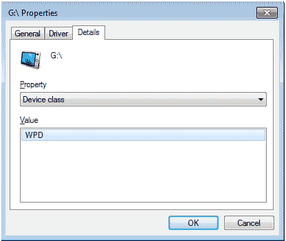
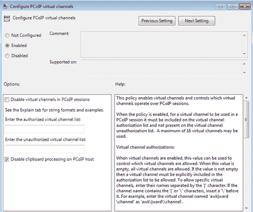
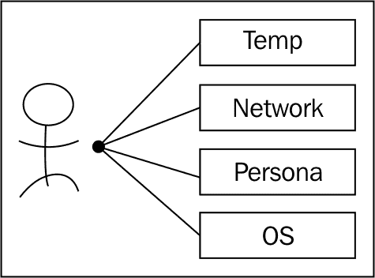

# 第九章：安全

无论是部署在医院、大学、公司、联邦机构还是非营利组织，终端设备的安全性已成为任何组织的数据丢失防护和信息保障政策的关键组成部分。例如，像维基解密事件或像美国人口普查局、爱尔兰社会与家庭事务部、安海斯·布希等组织丢失带有社会安全号码的笔记本电脑等数据丢失事件，确保敏感数据始终处于公司基础设施的范围内已经引起了广泛关注。

在传统的物理桌面模型中，终端用户会配发包含可写介质（硬盘）的桌面或笔记本电脑。这些终端设备存储如用户的个人资料、文件共享的数据副本、浏览器缓存、纯文本文件、图像、电子表格以及其他商业和个人数据。

即使在终端设备上对硬盘进行加密，敏感数据仍然可能存储在笔记本电脑（例如）中。由于高性能计算实例的可用性，它们的处理能力非常适合密码破解算法，如亚马逊 EC2 GPU 实例，破解密码和加密算法可以被转移到公共云中。因此，最安全的终端设备是不存储任何敏感信息的设备，无论是否加密。基于这个原因，PCoIP 零客户端（具有 Teradici 的 PCoIP 芯片的终端设备）可以说比薄客户端（具有锁定操作系统的设备）更加安全。两者都比厚客户端（传统的笔记本电脑或台式机）安全得多。

# VDI 的固有安全性

使用适当设计的 VDI 解决方案，所有敏感数据都存储在安全的数据中心，而不是存储在如笔记本电脑和台式机等设备的硬盘中。虽然可以将数据从 vDesktop 复制到例如插入到终端设备中的 USB 闪存驱动器，但也可以阻止这种设备的 USB 重定向。

在安全的 VDI 实现中，通常传输的唯一数据是视觉和音频流，用以将桌面体验传输到终端设备。这意味着，如果终端用户在连接到其 vDesktop 时使用 Microsoft Word 操作文档，那么该文档不会存储在他的终端设备（例如笔记本电脑）上。相反，它完全存储在 vDesktop 中，理想情况下，这个 vDesktop 运行在数据中心内。桌面的视觉表现，包括 Microsoft Word 的视觉显示和文档，都会通过安全的 PCoIP 协议流式传输到终端设备。

在一个设计得当的 VDI 解决方案中，如果终端设备损坏、被盗、丢失或遗失，最终用户只需更换一个新的终端设备即可重新连接到他们的 vDesktop。例如，如果 Lily 的 PCoIP 零客户端无法使用，她可以领取一台新的零客户端，并能立即恢复在 VDI 中的工作。零客户端无需重新映像，Lily 可以快速恢复生产任务。

如果没有 VDI，她可能需要等待几天才能让终端设备重新利用、采购或配置，才能恢复生产工作。

此外，不需要执行数据恢复操作，因为终端设备上不存在数据。在使用热桌面技术的环境中，或者在办公环境中提供不需要预约的未分配工作区的做法下，Lily 只需走到一个可用的工作区，登录并重新连接到 VDI。同样，Lily 的所有数据都存储在数据中心。

# 防火墙、区域和防病毒

VMware View 环境安全的基本原则包括仅允许那些对功能性 VDI 至关重要的特定端口和协议。此外，当可用时，还需要使用**安全套接字层（SSL）**（与通过端口 80 的未加密流量相对）。另外，要求使用 PCoIP，而不是同时允许 RDP 连接，也可以进一步提高环境的安全性。

在给定的 VDI 解决方案中，可能会有多个生效的防火墙。这些防火墙包括：

+   **Windows 操作系统防火墙：** 此防火墙用于限制操作系统层的进出流量

+   **网络防火墙（内部）：** 这些防火墙用于限制内部局域网环境内的流量

+   **网络防火墙（外部/DMZ）：** 这些防火墙用于限制通常来自互联网的流量

+   **虚拟防火墙：** 这些防火墙用于限制虚拟基础设施中虚拟端口组和虚拟交换机之间的流量

精心计算使用防火墙有助于创建被称为**区域**的物理和虚拟安全隔离区。虚拟安全区是一组网络配置、安全策略、虚拟机及其他虚拟基础设施组件，根据定义的策略允许彼此自由通信。

虚拟安全区有以下几种跨区通信的可能性：

+   **允许的：** Zone_A 和 Zone_B 中的虚拟机可以基于互相信任关系自由地相互通信（不要与像 Active Directory 信任和关系这样的技术混淆）

+   **受限的：** Zone_A 和 Zone_B 中的虚拟机只能通过预定义的端口和协议相互通信

+   **禁止的：** Zone_A 和 Zone_B 中的虚拟机不允许相互通信

安全矩阵的最后一个重要组成部分是 vDesktops 的防病毒保护。防病毒保护确保恶意软件不会渗透并传播到物理和/或虚拟桌面环境中。

## 基本的防火墙规则

如需更详细的端口和协议列表，请参阅 Christoph Harding 的优秀文章 *VMware View 环境的防火墙设置*，文章可以在 `ThatsMyView.net` 网站上找到：[`www.thatsmyview.net/2011/04/24/firewall-settings-for-a-vmware-view-environment/`](http://www.thatsmyview.net/2011/04/24/firewall-settings-for-a-vmware-view-environment/)。

| 源 IP | 方向 | 目标 IP | 传输协议 | 端口 | 应用协议 | 描述 |
| --- | --- | --- | --- | --- | --- | --- |
| 终端用户设备 | 入站 | 查看安全服务器 | TCP | 443 | HTTPS | 身份验证及其他通信 |
| 终端用户设备 | 双向 | 查看安全服务器 | TCP 和 UDP | 4172 | PCoIP | PCoIP 握手和数据传输 |
| 查看安全服务器 | 入站 | 查看连接服务器 | TCP | 8009 | AJP13 | AJP-数据流量 |
| 查看安全服务器 | 入站 | 查看连接服务器 | TCP | 4001 | JMS | Java |
| 查看安全服务器 | 入站 | 查看传输服务器 | TCP | 443 | HTTPS | 与查看传输服务器的通信 |
| 查看安全服务器 | 双向 | 查看代理 | TCP 和 UDP | 4172 | PCoIP | PCoIP 握手和数据传输 |
| 查看安全服务器 | 双向 | 查看代理 | TCP | 32111 |   | USB 重定向（如适用） |
| 查看连接服务器 | 出站 | Active Directory | TCP 和 UDP | 389 | LDAP | Active Directory 身份验证和 ADAM |
| 查看连接服务器 | 双向 | 查看连接服务器 | TCP | 4100 | JMSIR | 内部查看连接服务器通信 |
| 查看连接服务器 | 双向 | 查看连接服务器 | TCP | 636 | LDAPS | AD LDS |
| 查看连接服务器 | 双向 | 查看连接服务器 | TCP | 1515 |   | Microsoft 端点映射器 |
| 查看连接服务器 | 双向 | 查看连接服务器 | TCP | 4001 | JMS | Java |
| 查看连接服务器 | 双向 | 查看连接服务器 | TCP | 8009 | AJP13 | AJP-数据流量 |
| 查看连接服务器 | 双向 | 查看传输服务器 | TCP | 8009 | AJP13 | AJP-数据流量 |
| 查看连接服务器 | 出站 | 查看传输服务器 | TCP | 443 | HTTPS | 与查看传输服务器的通信 |
| 查看连接服务器 | 出站 | 查看传输服务器 | TCP | 4001 | JMS | Java |
| 查看连接服务器 | 出站 | 查看传输服务器 | TCP | 4100 | JMSIR | 内部通信 |
| 查看连接服务器 | 出站 | vCenter 服务器 | TCP | 18443 | SOAP | 查看 Composer 通信 |
| 查看连接服务器 | 出站 | vCenter 服务器 | TCP | 443 | HTTPS | vCenter 通信 |
| 查看连接服务器 | 双向 | 查看代理 | TCP | 4001 | JMS | Java |
| 终端用户设备 | 出站 | 查看连接服务器 | TCP | 443 | SSL | 与查看连接服务器的通信（用于身份验证及其他活动） |
| View Security Server | 入站 | View Connection Server | TCP | 8009 | AJP13 | AJP-数据流量 |
| View Security Server | 入站 | View Connection Server | TCP | 4001 | JMS | Java |
| 终端设备 | 入站 | View Transfer Server | TCP | 443 | HTTPS | 与 View Transfer Server 的通信 |
| View Security Server | 入站 | View Transfer Server | TCP | 443 | HTTPS | 与 View Transfer Server 的通信 |
| View Security Server | 入站 | View Transfer Server | TCP | 8009 | AJP13 | AJP-数据流量 |
| View Security Server | 入站 | View Transfer Server | TCP | 4100 | JMSIR | 内部通信 |
| View Security Server | 入站 | View Transfer Server | TCP | 4001 | JMS | Java |
| View Connection Server | 入站 | View Transfer Server | TCP | 8009 | AJP13 | AJP-数据流量 |
| 终端设备 | 双向 | View Agent | TCP 和 UDP | 4172 | PCoIP | PCoIP 连接和数据 |
| 终端设备 | 双向 | View Agent | TCP | 32111 |   | USB 重定向（如适用） |
| View Agent | 出站 | View Connection Server | TCP | 4001 | JMS | Java |
| 终端设备 | 双向 | View Agent | TCP 和 UDP | 4172 | PCoIP | PCoIP 连接和数据 |
| 终端设备 | 入站 | View Agent | TCP | 32111 |   | USB 重定向（如适用） |
| 终端设备 | 入站 | View Connection Server | TCP | 443 | HTTPS |   |
| 终端设备 | 入站 | View Connection Server | TCP | 443 | HTTPS |   |
| 终端设备 | 双向 | View Connection Server | TCP 和 UDP | 4172 | PCoIP | PCoIP 连接和数据 |

# 虚拟隔离区

**虚拟隔离区**是由虚拟机、虚拟端口组、资源（如果使用资源池）以及可能的底层数据存储组成的一个定义好的组。虚拟隔离区的概念是提供 VDI 内部的分段，将一个组与另一个组分隔开。

下图展示了三个独立的隔离区：


在前面的图示中，三个类别的 vDesktops 存在于整个虚拟基础设施中。这些类别由同名的桌面池组成，具体如下：

+   **培训：**该隔离区由培训室使用，为培训提供虚拟桌面

+   **教职工：**该隔离区由组织内的教职工用于其主要虚拟桌面

+   **服务器：**该隔离区由所有运行服务器操作系统的虚拟机使用

在虚拟基础设施中，有以下方法可以隔离这三个隔离区：

+   VLAN 标签

+   独立的 vSwitch/vDSwitch 上行链路

+   启用 vSwitch/vDSwitch 安全设置

+   使用资源池来隔离计算消耗

+   使用独立的数据存储来隔离数据和 I/O

+   使用独立集群

所有前述方法均可在 VMware vSphere 中使用，无需额外的软件组件。

然而，使用诸如 VMware vShield TM、Reflex Systems vTrust TM 配合 vmTagging TM 和其他安全产品的解决方案，可以从虚拟基础设施内部提供虚拟气隙。

以下图示展示了 VMware 虚拟网络的不同分段选项：


上面的图示展示了几种虚拟网络技术：

+   虚拟分布式交换机（vDSwitch）

+   三个独立的虚拟分布式端口组

+   两个独立的软件防火墙（通过 VMware vShield 技术或 Reflex Systems vTrust 技术提供）

+   提供商网络连接；该连接可以直接访问互联网（在本例中）

+   三个独立的 vDesktop 组

红色隔离区包含一个组织内需要直接访问互联网以支持外部客户的 vDesktops。

该隔离区的 vDesktops 连接到提供商端口组，该端口组可以直接从虚拟基础设施访问互联网。然而，该连接可以在物理层进一步过滤。

蓝色隔离区包含一个组织内大多数工作员工使用的 vDesktops。

该隔离区的 vDesktops 连接到一个可以访问提供商网络的端口组；然而，它不是直接访问提供商网络，而是使用**网络地址转换（NAT）**来隐藏蓝色隔离区内 vDesktops 的实际 IP 地址。

绿色隔离区包含一个组织内培训室使用的 vDesktops。

该隔离区的 vDesktops 连接到一个没有访问提供商网络的端口组（注意连接在离开防火墙时终止）。它的虚拟隔离区允许绿色隔离区内的 vDesktops 和资源自由通信。然而，绿色隔离区内的虚拟机无法与隔离区外的资源通信。这个隔离区被描述为隔离的。

除了执行网络分段，VMware vShield 和 Reflex Systems 解决方案还可以在不同的隔离区之间提供基于软件的防火墙保护。

例如，蓝色隔离区中的 vDesktops 可能仅允许通过端口 443（HTTPS）与绿色隔离区中的 vDesktops 进行通信。

## 越狱场景

**越狱场景**，摘自一个实际的解决方案，涉及防止同一桌面池内的 vDesktops 之间的通信。桌面池用于定义所有 vDesktops 的几个关键设置；其中一个设置是分配给一个或多个 vDesktop 虚拟网卡的特定端口组（标准或分布式）。此设置是在桌面池级别定义的；因此，给定桌面池中的所有 vDesktops 都将位于同一端口组中。

在越狱场景中，拘留中心的 IT 人员实施了 VDI，以便让囚犯进行各种训练。尽管 vDesktops 已被锁定以防止连接到互联网，但所有 vDesktops 处于同一端口组中这一事实可能会带来威胁。


越狱场景中的最大威胁是，虽然各个 vDesktop 用户与其他网络连接（包括互联网或拘留中心的生产网络）被隔离，但他们仍然可以相互发送数据。威胁在于，多个 vDesktop 用户将利用所有 vDesktop 虚拟机都在同一端口组中的事实，发送消息以协调在特定时间对监狱工作人员发起起义。

例如，如果三十个囚犯登录 VDI 并开始互相发送离散消息，计划在上午 11 点袭击监狱工作人员，那么这可能会对监狱工作人员的个人安全、设施的安全以及周围社区的安全构成巨大风险。

尽管没有现成的解决方案可以防止这种类型的通信（可以说，内置的 Windows 防火墙在这种情况下可能会有所帮助），Reflex Systems 确实提供了将虚拟机彼此隔离的能力。此外，VMware vShield 也可能被用来提供这种虚拟分段。对于具有高度波动性的环境（例如扩展、收缩、View Composer 刷新等），无论是使用 VMware、Reflex Systems 还是其他安全解决方案，这种解决方案都需要大量的定制、脚本编写和集成工作。

# USB 重定向与过滤

在越来越多的组织中，USB 硬盘被禁止使用。这是因为终端用户将敏感数据复制到 USB 硬盘上，并可能滥用该设备或恶意使用 USB 硬盘的数据，导致数据泄露的巨大风险。然而，简单地禁止所有 USB 设备可能会阻止以下完全可以接受的 USB 设备，如：

+   指示设备

+   音频耳机

+   转录播放踏板

+   医疗设备，例如病人监测设备

+   科学设备，例如测量仪器

+   摄影设备，例如录像机

+   音频设备，例如 USB MIDI 接口

+   身份验证设备，例如读卡器

因此，重要的是不要简单地禁止所有设备，而是建立一个允许的 USB 设备白名单。这就是所谓的**USB 过滤**。

下图展示了可用于 USB 过滤的三个主要级别：


USB 过滤可以应用的三个集成点如下：

+   终端设备

+   查看连接服务器

+   Windows 桌面操作系统

此外，USB 过滤可以应用于：

+   整个 ClassID，以允许或禁止某一类设备（例如，USB 大容量存储设备）

+   **供应商 ID (VID)** 和 **产品 ID (PID)** 以允许或拒绝特定设备（例如，金士顿大容量存储设备）

## 在终端设备上进行 USB 过滤

使用 PCoIP 零客户机的一个好处是可以创建设备配置文件并将其应用于环境中的所有零客户机。通过这种方式，可以创建一个 USB 过滤设备配置文件，并将其应用于环境中所有的零客户机。通过设置复杂的密码锁定设备，设备的配置文件仅能由例如 Teradici 管理控制台控制。因此，任何定义 USB 过滤的策略都无法被覆盖。通过在终端设备上管理 USB 过滤，例如使用 Teradici 管理控制台，可以基于设备 ID 或设备类别授予权限，从而实现灵活的管理（例如，除非是由 IronKey TM 制造的，否则不允许使用 USB 闪存驱动器）。

在设备级别应用 USB 设备过滤的缺点是，它强烈限制了 **自带设备（BYOD）** 计划。这些计划鼓励最终用户使用他们最熟悉的设备；因为设备最终会连接到组织拥有的 vDesktop，并且所有工作将在 vDesktop 上进行，所以终端设备在这种情况下的性质并不重要。

使用设备配置文件进行 USB 过滤意味着必须为每个设备创建一个配置文件，并且每个设备都必须进行管理。

在许多组织中，转向 VDI 解决方案的目的是摆脱管理终端设备的工作，而是允许最终用户使用他们首选的计算方式。

## 通过视图连接服务器进行 USB 过滤

VMware View 连接服务器还提供了执行 USB 过滤的机制。

下图显示了 View 管理控制台中的 USB 访问策略设置：


在 View 管理控制台的 **策略** | **全局策略** 部分，可以将 **USB 访问** 设置为全面的 **允许** 或 **拒绝**。这不允许对仅授予特定设备访问权限进行精细管理。相反，它允许或禁止所有设备的 USB 重定向。

另一种类似于全有或全无的方法，是不从 vDesktop 模板或父虚拟机中安装 VMware View Agent 的 USB 重定向组件。这种方法不推荐使用，因为它会限制环境中的未来功能。

## 通过 Windows 操作系统进行 USB 过滤

例如，IronKey 加密 USB 驱动器的设备类别是 **Windows 便携设备 (WPD)**。

下图显示了来自来宾操作系统的 USB 设备：



通过在 **设备管理器**中选中相应设备并打开**属性**选项卡，可以找到此信息。

以下截图具体显示了一个 USB 设备 ID：


在给定设备的**硬件 ID**下（例如，IronKey U 盘），可以找到 PID 和 **固件版本（REV）**。在前面的示例中，**VID** 为 **1953**，**PID** 为 **0201**，**REV** 为 **0208**。

NirSoft 提供了一款免费的产品 USBDeview©，它是一个便捷的工具，可以快速查找特定 USB 设备的 PID、VID、序列号以及其他信息。它还以更友好的方式展示这些信息。

以下截图显示了使用 USBDeview 来识别 USB 产品 ID：


在前面的示例中，IronKey U 盘的**供应商 ID（VendorID）**为 **1953**，**产品 ID（ProductID）**为 **0201**。

配置 USB 过滤还需要 DeviceClassGUID。它也可以在 **设备管理器**的**属性**选项卡下找到。

以下截图显示了硬件过滤的注册表键：


例如，要禁止所有 IronKey 加密 U 盘（供应商 ID 1958，产品 ID 0201），可以将 **VID_1958&PID_0201** 添加到 **HardwareIDFilters** 键，路径为 **Computer\HKEY_LOCAL_MACHINE\SOFTWARE\VMware, Inc.\VMware VDM\USB\**。

注册表更改会立即生效，无需重新启动。现在，当最终用户尝试连接他们的 IronKey 加密 U 盘时，将会收到错误消息。以下截图展示了在禁止某个 USB 设备的环境中，用户尝试使用 USB 设备时可能收到的错误信息：


有多种方法可以允许或禁止 USB 设备（特别是大容量存储设备）。然而，本节中概述的技术基本适用于所有设备，应该作为最佳实践来使用。

执行 USB 过滤的最安全方法是阻止所有设备，除非它们被定义在白名单中。

# 智能卡身份验证

**智能卡身份验证**是一种机制，通过该机制，通常带有金属触点的塑料卡片用于存储由最终用户使用的证书进行身份验证。智能卡在许多行业中都有使用，包括军事、医疗保健、教育、零售和科学界。智能卡身份验证的优点如下：

+   它要求最终用户随身携带身份验证机制

+   它要求最终用户成功地提供挑战（PIN）的答案

智能卡身份验证是一种双因素授权机制，要求最终用户不仅必须物理持有智能卡，还需要成功输入 PIN 码。PIN 码并不用于验证用户对域的身份；而是用来验证用户对智能卡上证书的身份。智能卡上的证书随后用于验证最终用户对域的身份。

智能卡身份验证已经成为医院、教育机构、科学界和军事组织中的标准做法。

智能卡身份验证需要以下内容：

+   一个或多个证书

+   中间件（例如来自 ActivIdentity 的 ActivClient）

    ### 注意

    中间件应在 VMware View Agent 之前安装，以避免任何 GINA 链接问题；正确的安装顺序是 VMware Tools、然后是智能卡中间件，最后是 VMware View Agent。

    设置智能卡移除行为为锁定工作站（对于持久解决方案）或注销（对于非持久解决方案）可能会有所帮助。

+   智能卡

+   智能卡读卡器（例如 SCR331）

此外，必须满足以下先决条件：

+   在 VMware View Connection Server 安装过程中安装了智能卡选项

+   VMware View Connection Server 已配置为允许智能卡身份验证

+   中间件（例如 ActivClient）正常运行并配置了必要的证书

+   所有 VMware View Connection 和安全服务器上的 `locked.properties` 文件已配置为使用包含一个或多个 **证书颁发机构（CA）** 证书的主密钥库，这些证书用于智能卡上使用的用户证书

智能卡配置对于任何组织应该几乎相同（只有证书是区分的因素）。需要注意的是，尽管大多数智能卡可能看起来相同，但市场上大约有十几种智能卡型号。

智能卡的品牌和型号通常可以通过正在使用的智能卡中间件（例如 ActivClient）发现。

以下截图显示了在 ActivClient 控制台中看到的某智能卡：


在前面的截图中，卡片已插入到经过批准的读卡器中（例如 SCR331）。在 ActivClient 的主屏幕上有三个选项。点击 **我的证书** 文件夹可以打开存储在智能卡上的用户证书。点击 **CA 证书** 可以打开存储在智能卡上的 CA 证书，这些证书用于验证用户证书。

打开 **智能卡信息** 对象会弹出以下截图，显示 ActivClient 中的智能卡信息：


如上图所示，相关智能卡的**制造商**是**Gemalto**，**型号**是**Cyberflex Access 64K V2c**。此外，用户名（通常与相同名称的 Active Directory 用户账户关联）也显示在**用户名**字段中。

以下截图显示了给定智能卡上的证书：


尽管前面的截图中只显示了一个用户证书，但智能卡上可能存储多个用户证书。VMware View 将筛选用户证书并提示最终用户选择使用哪个证书进行认证。仅显示具有客户端认证和智能卡登录角色的有效证书。

以下截图显示了通过 ActivClient 查看智能卡的证书详细信息：


上面的截图显示了 ActivClient 中的**我的证书**屏幕。用户证书的颁发 CA 的主体名称（例如`thinkvirt.demo.local`）已显示。确保对颁发 CA 的名称解析功能正常非常重要。DNS 解析故障可能会影响智能卡认证的时间。

来自 VMware 的附加智能卡信息可以在*《VMware View 4.5/4.6 的智能卡证书认证》*白皮书中找到。

## 为 VMware View 连接服务器配置智能卡认证

智能卡认证受到 PCoIP 零客户端、瘦客户端和厚客户端的支持。重要的是要验证正在使用的卡读卡器型号、卡型号和证书是否在 VMware View/Teradici PCoIP 支持矩阵中得到支持。这些文档可以在[`www.vmware.com/`](http://www.vmware.com/)和[`www.teradici.com/`](http://www.teradici.com/)找到。

此外，智能卡通常用于提供单点登录的安全机制，即用户只需一次登录 VMware View 环境（而不是每次会话连接或重新连接到 vDesktop 时）。

要强制使用智能卡认证，请转到**编辑视图连接服务器设置**选项卡，路径为**视图配置** | **服务器**。

以下截图显示了高级智能卡配置选项：


**智能卡认证**可以设置为**不允许、可选**或**必需**。此外，通过勾选**在智能卡移除时断开用户会话**复选框，可以设置会话在移除智能卡时断开连接。

在许多安全环境中，必需选项将被配置为强制任何请求访问 VDI 中 vDesktop 的传入请求，都必须通过用户的智能卡进行身份验证。

除了在 VMware View 管理控制台中配置智能卡认证外，还有一个在配置过程中非常重要的主文件 `locked.properties`。

`settings.properties` 文件也位于 `\sslgateway\conf` 子目录中，包含 VMware View 管理控制台用于 HTTPS 加密的证书配置；用于选择证书的值存储在 `keyfile` 字符串中。此外，`settings.properties` 文件还包含使用该证书所需的哈希密码；密码的值存储在 `keypass` 字符串中。

### 为智能卡认证准备环境

为准备智能卡认证环境，请执行以下步骤：

1.  第一步是验证 DNS 和 NTP 环境是否完全正常，因为基于证书的认证对时间漂移或在**公钥基础设施（PKI）**中解析服务器的困难非常敏感。

1.  接下来，必须下载 CA 证书。可以通过打开浏览器并指向 `http://<CA_SERVER>/certsrv` 来完成此操作，其中 `<CA_SERVER>` 是 CA 服务器的**完全限定域名（FQDN）**或 IP 地址。

1.  选择**下载 CA 证书**链接，默认选择**DER 编码**。将证书保存到 VMware View 连接服务器的 `\VMware View\Server\jre\bin` 目录中。

1.  以管理员权限启动命令提示符（例如，右键单击**命令提示符**图标并选择**以管理员身份运行**）。导航到 `\VMware View\Server\jre\bin`。

1.  接下来，输入以下命令以生成密钥库：

    ```
    keytool import alias view4ca file certnew.cer keystore trust.key 

    ```

1.  `certnew.cer` 文件是前一步下载的 CA 证书。`trust.key` 文件是生成的密钥库，将由 VMware View 连接服务器用于验证存储在智能卡上的最终用户证书。

1.  然后，keytool 工具将提示输入 CA 证书的密码，并询问是否信任该证书。

1.  一旦密钥库成功生成，将文件（例如 `trust.key`）复制到 `\VMware View\Server\sslgateway\conf` 子目录中。

1.  接下来，在 `\VMware View\Server\sslgateway\conf` 子目录中使用记事本（或类似工具）创建名为 `locked.properties` 的文本文件。

1.  输入以下文本：

    ```
    trustKeyFile=trust.key
    trustStoreType=JKS
    UseCertAuth=true

    ```

1.  重启 VMware View 连接服务器服务。

## 配置 VMware View 安全服务器的智能卡认证

对于利用一个或多个 VMware View 安全服务器的环境，配置 View 安全服务器以使用智能卡认证（以及配置适当的证书）非常重要。否则，只有内部用户或绕过 VMware View 安全服务器的用户才能使用智能卡进行认证。

这些步骤与*配置 VMware View 连接服务器的智能卡认证*部分中列出的步骤相同。

以下图示显示了`locked.properties`文件的位置：


因此，配置 VMware View 安全服务器（在前述图示中显示为 VSS）最简单的方法如下：

1.  将`trust.key`文件（或其他适当的密钥存储文件）复制到`\VMware View\Server\sslgateway\conf`子目录中。

1.  将`locked.properties`文件复制到`\VMware View\Server\sslgateway\conf`子目录中。

1.  重启 VMware View 安全服务器服务。

如果 VMware View 环境利用相同的 PKI 和相同的密钥存储用于 CA 证书，则前述步骤非常简洁，这几乎适用于所有使用智能卡的 VMware View 解决方案。因此，完全有可能脚本化文件从一个服务器到另一个服务器的复制，以及在必要时重启相关服务（例如，VMware View 安全服务器服务）。

## 配置美国国防部 CAC 认证

**美国国防部通用接入卡（DoD CAC）**（智能卡）认证是**国土安全总统指令 12 号（HSPD-12）**批准的机制，供美国军事设施用于身份认证访问 IT 资产。CAC 卡还根据《日内瓦公约》作为通用身份证明卡。

用户通过将 CAC 插入 USB 智能卡读卡器、笔记本电脑智能卡读卡器、集成卡读卡器的瘦客户端或零客户端、或带集成卡读卡器的键盘来登录其物理桌面。一旦卡被读取，终端用户会被提示输入其 PIN。

完全可以在 vDesktop 内部使用 CAC 认证，而无需将其配置为访问 vDesktop 的可接受认证机制。

例如，如果在 vDesktop 中已正确安装和配置了 ActivClient，但在 View 连接服务器环境中尚未配置智能卡认证，则无法使用智能卡连接到 vDesktop。然而，一旦连接到 vDesktop，智能卡可以成功用于 VDI 中的身份认证（例如，RDP 连接）。在正常的智能卡操作中，使用智能卡进行身份认证时，系统会提示终端用户输入其 PIN。虽然这种情况是可能的，但远非首选解决方案，因为 VDI 连接不是通过智能卡认证完成的。

配置 CAC 认证包括在标准智能卡认证配置中使用的技术，并添加了一些细小的注意事项。

配置 CAC 认证的过程如下所示：

1.  在 VMware View 连接服务器上，导航到`\VMware View Server\Server\sslgateway\conf`子目录。

1.  创建一个名为`certexport`的子目录。在`\certexport`中放置所有适用的`.cer`文件。该目录用于生成当前或未来的`主密钥存储`。

1.  配置 CAC 认证的下一步是生成或获取一个`master keystore`，该文件包含所有美国国防部和中间 CA 证书。`master keystore`文件应放置在`VMware View 安装`目录中的`\sslgateway\conf`子目录下，View Connection Server 所在的位置。如何生成`master keystore`的详细说明将在本章后面进行说明。

1.  将`truststore`文件复制到`\sslgateway\conf`子目录下。

    上面的截图是配置了 CAC 认证的工作 VMware View Connection Server 的`\\sslgateway\conf`子目录的典型屏幕截图。

1.  现在所有证书都已放置在正确的位置，必须配置 VMware View Connection Server 以使用这些证书。

1.  接下来，打开`locked.properties`文件，该文件也可以在`\sslgateway\conf`子目录中找到。如果该文件不存在，则应使用记事本或类似工具创建它。

1.  `locked.properties`文件的内容应类似于：

    ```
    trustKeyFile=masterkeystore
    trustStoreType=JKS
    useCertAuth=true

    ```

上述文本假设`master keystore`文件实际命名为`masterkeystore`。`trustStoreType`=`JKS`定义了信任库为使用**Java 运行时环境（JRE）** `keytool.exe`或类似工具生成的 Java 密钥库。`useCertAuth`=`true`启用了证书的使用。

一旦设置完成，重新启动 VMware View Connection Server 服务或 VMware View Security Server 服务。此时，还需要验证 View Admin 控制台是否仍然可用，因为格式错误的`locked.properties`文件可能会导致 View Admin 控制台无法正常加载。

## 证书撤销配置

**证书撤销列表（CRL）**用于防止那些证书已被撤销的用户（例如，已经被解雇的员工）成功地进行环境认证。VMware View 支持 CRL 和**在线证书状态协议（OCSP）**，用于检查给定证书的撤销状态。如果在 VMware View Connection Server 或 VMware View Security Server 上配置了 OCSP 和 CRL，VMware View 会首先尝试使用 OCSP，如果 OCSP 失败，则会回退到使用 CRL。VMware View 不会从 CRL 回退到 OCSP，如果 CRL 检查失败。

### 配置 CRL 的使用

通过编辑`locked.properties`文件并添加以下行来配置 CRL 的使用：

```
enableRevocationchecking=true
allowCertCRLs=true
crlLocation=<URL_OF_CRL>

```

`enableRevocationchecking`和`allowCertCRLs`字符串启用了 VMware View 执行证书撤销检查。`crlLocation`字符串用于定义 CRL 的位置。

`crlLocation`的一个示例值是`http://cert.demo.local/certEnroll/ocsp-ROOT_CA.crl`。

### 配置 OCSP 的使用

使用 OCSP 可以通过编辑 `locked.properties` 文件并添加以下行来进行配置：

```
enableRevocationchecking=true
enableOCSP=true
allowCertCRLs=true
ocspSigningCert=<OCSP_Signing_Cert>
ocspURL=<URL_OCSP>

```

`enableRevocationchecking` 和 `allowCertCRLs` 字符串使 VMware View 执行证书撤销检查。`enableOCSP` 字符串启用 OCSP。`ocspSigningCert` 用于定义 OCSP 授权机构使用的证书，而 `ocspURL` 用于定义 OCSP 响应者的位置。

### 配置同时使用 CRL 和 OCSP

要配置同时使用 CRL 和 OCSP，请将所有前述字段及其适当的值插入到 `locked.properties` 文件中。请注意，`allowCertCRLs=true` 字符串只需列出一次。

此外，还应将以下内容添加到 `locked.properties` 文件中：

```
ocspCRLFailover=true

```

`ocspCRLFailover` 字符串允许 VMware View 连接服务器或 VMware View 安全服务器在 OCSP 失败时使用 CRL。

# 禁止使用复制和粘贴功能

在某些环境中，管理员可能希望防止最终用户在其虚拟桌面与厚客户端或瘦客户端之间进行复制和粘贴。防止复制和粘贴功能的正确方法是通过虚拟桌面的组策略进行配置。

这在 `\extras` 子目录下任何 View 连接服务器上的 `PCOIP.ADM` 模板中定义。该设置可以在 `计算机配置\管理模板\PCoIP 会话变量\不可覆盖的管理员设置\配置 PCoIP 虚拟通道` 中找到。

在此设置中，有一个允许列表和一个不允许列表。如果虚拟通道同时出现在允许列表和不允许列表中，它将被禁止。在 View 4.6 及更高版本中，负责剪贴板的虚拟通道（mksvchan）不再需要明确提及。管理员只需勾选“禁用 PCoIP 主机上的剪贴板处理”并启用该策略即可。

以下截图展示了剪贴板处理的设置：



**禁用 PCoIP 主机的剪贴板处理** 设置在连接或重新连接时读取。因此，将设置从 **未配置** 更改为 **启用**（例如）将会在下次登录时生效，而不是在当前会话中生效。

# View 连接服务器标签

VMware View 连接服务器使用标签来控制在多台 View 连接服务器环境中对特定桌面池的访问。任何给定的 VMware View 连接服务器可以没有标签、一个标签或多个标签。标签在 View 管理控制台的 **View 配置** | **服务器** | **编辑 View 连接服务器设置** 下定义。

以下截图展示了使用连接服务器标签（在本例中为 thinkvirt）：


在上述示例中，已为特定的 VMware View 连接服务器分配了 **thinkvirt** 标签。要为 VMware View 连接服务器分配多个标签，可以使用分号或逗号分隔标签。

然后，在桌面池的配置中，选择 **池设置** 选项卡，点击 **浏览** 进行配置标签。

下图显示了限制标签的使用：


上述截图会显示多个标签（如果使用了多个标签），并允许管理员选择一个、一些或所有可用的标签。

### 注

**标签**字段仅会在环境中至少一个 View 连接服务器具有定义标签时填充。

在 **连接服务器限制** 对话框中，有两个选项：

+   **没有限制：** 此池可以从任何 VMware View 连接服务器进行访问

+   **限制为这些标签：** 此池只能从具有定义标签的一个或多个 VMware View 连接服务器访问

以下是标签连接权限的矩阵：

| 连接服务器是否已定义标签？ | 桌面池是否配置为使用标签？ | 结果 |
| --- | --- | --- |
| 没有 | 没有 | 可连接 |
| 没有 | 一个或多个 | 无法连接 |
| 一个或多个 | 没有 | 可连接 |
| 一个或多个 | 一个或多个 | 仅在一个或多个标签匹配时才可连接 |

这种情况的一个例子是，如果一个组织有两个独立的入站 VPN 环境。VPN_A 供顾问和访客使用，VPN_B 供员工使用。如果该组织希望将 VPN_A 的用户限制为一个具有有限功能和最少应用程序安装的桌面，可以分别为 VPN_A 和 VPN_B 设置多个独立的 View 连接服务器。然后，View 连接服务器将分别标记为 VPNA 和 VPNB。此时，有限功能的桌面池将只允许 VPNA 连接，而完全功能的桌面池将只允许 VPNB 连接。

需要注意的是，VMware View 解决方案可以利用多个 vCenter 服务器。因此，标签不仅可能限制传入用户可以访问的池，还可能使后端桌面池存在于完全独立的虚拟基础架构中。

此外，您还可以使用 View 连接服务器标签来识别哪些用户被强制使用双重身份验证，哪些没有。


在前面的示例中，最终用户可以访问多个 View Connection Server（VCS）。绿色 VCS 要求智能卡认证。例如，该 VCS 可能用于军事人员或医生，他们已获得通用访问卡（CAC），而蓝色 VCS 则可供平民、实习生或临时员工（未发放智能卡的人员）使用。在 VDI 环境中，存在一个桌面池，其中包括多个敏感的财务应用程序作为基础镜像。通过使用 VMware View Connection Server 标记，财务桌面池可以被配置为只允许来自绿色 VCS 的连接，从而强制要求来访用户使用智能卡认证。

# 法医学

**法医学**，在信息技术领域，通常指从计算机系统中提取法律证据，以支持法律事件。法医学包括识别、保存、恢复、分析和呈现从计算机环境中收集的数据。法医学也是许多敏感计算环境在寻求使用 VDI 解决方案时所需的组件。



要了解法医学如何受到 VDI 的影响，首先需要理解用户创作或用户操控的数据可能存放在哪里。

用户创作或用户操控数据的主要位置如下：

+   **操作系统：** 对于不使用 View Composer 或不使用重定向用户人物配置文件的 VMware View 解决方案，用户数据将位于操作系统分区中。

+   **人物层：** 对于使用 Microsoft 漫游配置文件的 VMware View 解决方案，或者使用例如 Liquidware Labs ProfileUnity TM 的个人管理解决方案，或 VMware View 的持久性用户数据驱动器，用户数据将位于人物分区中。对于 Microsoft 漫游配置文件、AppSense 或 ProfileUnity，用户数据将存储在网络共享中。因此，确保存储用户数据的网络共享根据组织政策进行备份是至关重要的，因为法医学分析将在此位置进行。

    对于使用持久性用户数据驱动器的解决方案，保存这些虚拟磁盘文件至关重要，以便在需要进行法医学分析时，它们可以附加到其他虚拟机上。当用户数据位于人物层时，虚拟机的不稳定性就不再是一个大问题。

+   **网络资源：** 对于网络资源，例如文件共享、基于 Web 的协作资源，保留这些数据点的范围超出了本书的讨论范围，更依赖于理解各种平台以及它们如何提供审计和数据恢复能力。

+   **临时位置：** 对于那些利用重定向用户配置文件的解决方案，可能由于配置错误导致用户数据未被正确捕捉，因此在 vDesktop 或桌面池的 View Composer 过程中可能会被丢弃。

对于需要取证能力的 VDI（虚拟桌面基础设施）最大的挑战是使用非持久性桌面池。持久性桌面池会自动分配一次，因此能够保持数据、版本、状态等信息。

# 总结

虽然 VDI 解决方案本质上是安全的，因为最终用户的数据通常存储在安全的数据中心，但了解组织的安全态势、政策和攻击向量，并在必要时采取适当的措施仍然至关重要。由于最终用户可以从任何位置连接，例如咖啡店的非安全 Wi-Fi、通过 AT&T 3G 网络的 Apple iPad、公司局域网或家庭有线 ISP，因此保护公司数据和知识产权非常重要。使用智能卡身份验证（这一解决方案正在迅速普及）是保护身份验证入口的一种有效方法。合理的网络策略，限制流量到定义的端口、协议、来源和目的地，是确保 VDI 安全的另一个关键组成部分。

最后，了解数据取证的基本原理，以确保合规性（如果需要），是 VDI 解决方案团队必须具备的重要技能。虽然大多数 VDI 解决方案可能不需要深入的取证能力，但理解需要保留、监控和收集的数据点非常重要。

下一章将重点介绍从物理桌面解决方案迁移到虚拟桌面解决方案的过程。可以采取许多不同的方法，每种方法的优缺点将进行详细讨论。
