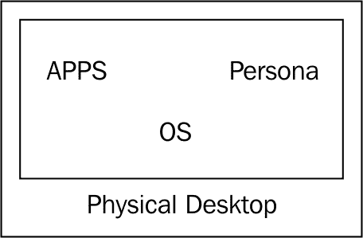
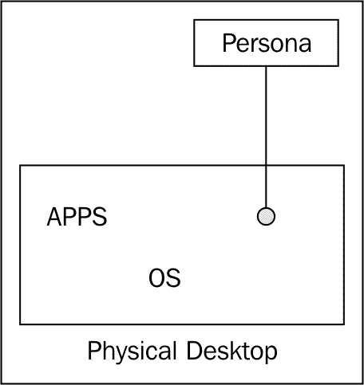
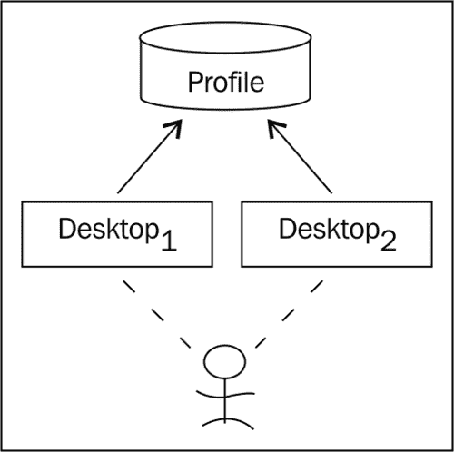
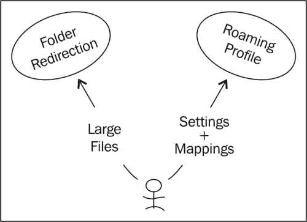
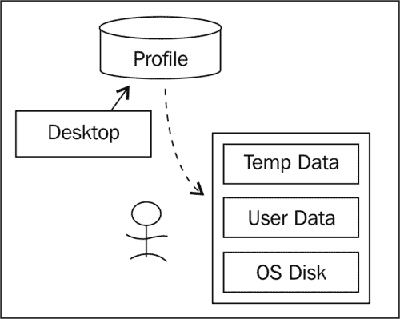
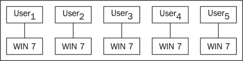
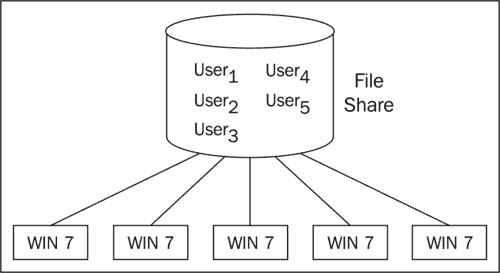

# 第十章：从物理桌面迁移到虚拟桌面

本章分析了将用户从物理桌面环境迁移到虚拟桌面解决方案的策略和技术。虽然许多 VDI 解决方案是全新构建，不涉及用户迁移，但大多数要实施的 VDI 解决方案都会涉及用户迁移的某个环节。

为了确保 VDI 项目的整体成功，重要的是尽量减少过渡过程中对最终用户的感知影响。减少这种影响的一部分是了解如何正确迁移用户特定的数据，也就是用户的个人资料。

用户的个人资料包含用户偏好、应用设置、主题、快捷方式、收藏夹、打印机以及其他独特配置。为了将用户的个人资料从桌面中解耦，个人资料最终必须位于桌面操作系统之外。通常，用户个人资料存储在经典的网络文件共享或分布式文件系统共享中。通过将个人资料存储在网络共享中，无论用户连接到哪个虚拟桌面资源，都能提供一致的终端用户体验，因为个人资料不绑定到特定的虚拟桌面。

市场上有多种解决方案可以帮助迁移用户的个人资料，包括微软的漫游配置文件和文件夹重定向、AppSense、以及 Liquidware Labs 的 ProfileUnity 等。

# 用户个人资料的迁移

为了迁移用户的个人资料，首先必须将其与桌面操作系统解耦。在完全耦合的情况下，用户的个人资料位于物理桌面的操作环境中。

以下图示展示了物理桌面的特点：

在前面的图示中，操作系统、应用程序和用户个人资料都位于同一环境中。没有应用程序虚拟化（例如，VMware ThinApp）或个人资料管理解决方案（例如，ProfileUnity）。成功将前述物理桌面迁移到完全功能的虚拟桌面（vDesktop）的第一步，是将个人资料与操作环境分离。

## 将个人资料与操作环境分离

通过将用户的个人资料与底层桌面分离，可以将其自由地迁移到另一个物理桌面，或者理想情况下，迁移到虚拟桌面。这与应用程序虚拟化的方式相同，例如，某个应用程序通过 ThinApp 进行打包，并且不再与底层操作系统绑定。

以下图示展示了用户个人资料与物理桌面解耦的过程：

解耦用户个人资料与物理桌面操作环境的三种最简单的方式如下：

+   微软漫游配置文件 + 文件夹重定向

+   Liquidware Labs ProfileUnity

+   AppSense

在这种状态下，物理桌面仍包含已安装的应用程序，但用户的定制设置和其他组成用户个人资料的详细信息则存储在客体操作系统之外。

### 文件夹重定向

文件夹重定向通过将文件夹的路径（例如，`\My Documents`）重定向到新位置，通常是网络共享，用户对此一无所知。将`\My Documents`重定向到网络共享的最终用户，依然会在其`\My Documents`中打开、保存和操作文件，但实际上操作的是网络共享上的文件，而非本地驱动器。文件夹重定向的优点如下：

+   用户的数据可以通过任何桌面资源访问，只要有适当的网络连接。

+   组策略可以用来强制执行磁盘配额，以最小化用户个人资料的空间。

+   用户的数据如果已经被重定向，通常在桌面发生故障时更容易恢复，因为生产网络共享通常比桌面更频繁地备份。

使用微软本地解决方案时，`我的文档`、`应用数据`、`桌面`和`开始菜单`父文件夹可以被重定向。上述父文件夹的子文件夹也会被重定向。

`我的文档`是一个用户拥有读/写权限的文件夹，用于保存文档、图片、媒体和其他数据。`我的文档`是许多 Microsoft 应用程序的默认保存位置。

`应用数据`文件夹是应用程序用来保存与特定应用程序相关的用户定制设置的文件夹。

`桌面`文件夹是包含用户桌面上所有项目的文件夹。

`开始菜单`文件夹包含桌面开始菜单列表中的项目。

### 配置文件

为了理解漫游配置文件的工作原理，了解 Windows 环境中配置文件的组成非常重要。在 Windows 中，配置文件由以下内容组成：

+   **注册表根：** 存储为`NTuser.dat`的注册表根存储着 HKEY_CURRENT_USER 的内容。

+   **配置文件夹：**（例如，`C:\Users\User4`）

在注册表根和配置文件夹中，存储着与映射的打印机、桌面快捷方式、驱动器映射、独特进程和日志记录等配置设置。

在 Windows 中，有几种类型的配置文件，如下所示：

+   **本地配置文件：** 这是最常用的配置文件类型，用户第一次登录桌面时创建。

+   **漫游配置文件：** 这种类型的配置文件在登录时会创建网络主副本的本地副本；登出时，所做的更改会被复制回网络主副本。

+   **强制性个人资料:** 这种类型的个人资料由管理员使用，以指定用户的设置；用户所做的更改将在注销时丢失。

在许多虚拟桌面基础设施（VDI）解决方案中，尤其是那些非持久性的解决方案中，通常会使用漫游个人资料或其他个人资料管理方案。这是因为漫游个人资料允许任何用户访问任何可用的虚拟桌面，并且仍然保持自己的独特个性化设置。

#### 如何构建个人资料：第一次登录

要理解 Windows 个人资料是如何构建的，首先需要了解`C:\Users`的文件夹目录结构。

在`C:\Users`下，有以下几个文件夹：

+   `所有用户:` 此文件夹中的设置适用于任何登录桌面的用户。

+   `默认用户:` 此文件夹中的设置作为模板应用于任何登录工作站的新用户，这意味着这些用户在桌面上尚未有个人资料文件夹。

+   `用户名:` 此文件夹中的设置对特定用户是唯一的。

当用户第一次登录到桌面时，无论是物理桌面还是虚拟桌面，该用户都会在`C:\Documents and Settings`（例如 Windows XP）或`C:\Users`（例如 Windows 7）下创建一个独特的个人资料文件夹。此文件夹的内容基于`默认用户`中的内容。此外，`所有用户`中的任何内容也会作为个人资料的一部分加载。

#### 后续登录

一旦用户在桌面上拥有了自己独特的个人资料文件夹，他们就不再使用`默认用户`文件夹。这意味着，如果用户已经创建了个人资料，之后在`默认用户`中放置的任何设置或快捷方式将不会反映在用户的个人资料中。然而，放置在`所有用户`文件夹中的快捷方式将会被反映出来。

### 注意

如果用户具有管理员权限并删除来自`所有用户`的快捷方式或文件，那么该快捷方式或文件将对机器上的所有用户删除。

放置在`所有用户`中的快捷方式或文件会立即显示给任何登录桌面的用户。

#### 漫游个人资料

漫游个人资料是存储在中央存储库中并在登录桌面操作系统时按需访问的个人资料。

下图展示了一个用户能够登录到任一桌面并仍能接收到个人资料设置的示意图：

使用漫游个人资料是一种将用户的个人资料文件夹存储在网络共享上的技术，从而将用户个人资料与实际桌面解耦。

在没有漫游个人资料的示例场景中，用户 Dwayne 走到物理桌面 Desktop1，Dwayne 处理文档、改变桌面壁纸、映射打印机，然后注销。如果 Dwayne 接着走到另一个物理桌面 Desktop2 并登录，他将不会有在 Desktop1 上所做的任何工作、设置或映射。这是因为 Dwayne 的个人资料物理上存储在 Desktop1 的本地驱动器上。

在启用漫游配置文件的相同场景下，Dwayne 的文档、壁纸、打印机映射和其他设置将在从 Desktop1 注销时复制到中央网络位置。因此，当 Dwayne 登录到 Desktop2 时，所有设置、文档和映射将从中央网络位置下载。

漫游配置文件的一个缺点是，可能会进入一个场景，用户的配置文件非常大，导致登录和注销任务受到限制，因为配置文件正在与网络共享同步。例如，如果用户有一个 5 GB 的漫游配置文件，并且第一次登录某台机器，所有 5 GB 的数据将从网络位置下载，直到用户看到工作桌面为止。因此，重要的是要尽量减少漫游配置文件中的数据，以确保良好的终端用户体验。

### 注意

确保禁用“允许离线文件”和/或“允许离线缓存”。如果使用非持久性 VDI 解决方案且允许离线缓存，用户可能登录到虚拟桌面时，无法下载其配置文件的最新版本（因为存在缓存副本）。

#### 漫游配置文件 + 文件夹重定向：提高性能

由于用户配置文件中大多数大型文件可能位于如 `\My Documents` 这样的目录中，重定向此类文件夹到网络位置可以确保用户的配置文件不会过度膨胀。

以下图示展示了通过文件夹重定向和漫游配置文件对用户个性化进行分段的示例：

通过结合文件夹重定向和漫游配置文件，大型文件（例如，通常存储在 `\My Documents` 中的文档）可以被重定向到网络位置，同时设置和配置文件可以通过漫游配置文件进行同步。

#### 其他第三方解决方案：Liquidware Labs ProfileUnity

尽管市场上有多种配置文件管理解决方案，Liquidware Labs ProfileUnity 是一个具有成本竞争力的解决方案，它以本地 Windows 格式保存设置和配置，而不是将其存储在专有数据库中。

此外，ProfileUnity 还提供额外的好处，例如：

+   从一个控制台管理用户配置文件和文件夹重定向

+   轻松配置 MAPI 配置文件以便与 Microsoft Exchange Server 一起使用

+   基于规则、机器类别、操作系统、连接类型等筛选脚本的执行

+   通过使用压缩和配置文件损坏减少技术来加速登录时间

此外，对于不太熟悉高级组策略管理的系统管理员，ProfileUnity 提供了一个相当直观的用户界面进行管理。

### 从物理环境切换到虚拟环境

一旦配置文件与桌面解耦，用户可以在周二登录物理桌面，周三登录虚拟桌面，并保持所有设置。需要考虑的几个事项如下：

+   如果在迁移过程中涉及操作系统升级，确保旧操作系统的所有设置应用于新操作系统。

+   如果计划提供在旧操作系统和新操作系统之间来回切换的能力，可能需要做出特殊的考虑，以确保设置能够应用。例如，Windows XP 和 Windows 7 之间的壁纸文件类型不同。

此外，还需要考虑实现的是哪种类型的桌面池（持久性或非持久性）以及选择的配置文件管理解决方案（例如，原生 Microsoft 方案、Liquidware Labs ProfileUnity 等），因为首次登录可能会花费较长时间。

## VMware View 用户数据磁盘的使用

VMware View 提供了将用户配置文件存储在用户数据磁盘（UDD）上的功能。该用户数据磁盘与 VDI 中的特定虚拟桌面绑定。

以下图示展示了用户数据磁盘在配置文件管理中的使用：

VMware View 提供了将用户配置文件重定向到持久性**用户数据磁盘（UDD）**的功能。该磁盘与构成用户虚拟桌面（vDesktop）的其他磁盘分开；然而，用户的 UDD 一次只能附加到一个虚拟桌面。此外，UDD 仅可用于持久桌面池。

用户配置文件可以通过使用标准的 Microsoft 工具或第三方解决方案迁移到 UDD。一旦用户配置文件完全并成功地迁移到 UDD，它将不再驻留在网络共享上，其内容仅在将 UDD（`.vmdk` 文件）附加到虚拟机后才能访问。

## 与用户数据相关的操作考虑事项

除了在 VMware View 解决方案中需要做出的技术性考虑外，还有需要做出的操作性考虑。其中一个考虑是用户数据的管理，特别是与人力资源活动相关的管理。这些活动包括员工的雇佣和离职。例如，当员工离职时，通常需要将用户数据归档并存储一定的时间。

以下图示展示了在 VMware View 环境中用户数据磁盘的管理：

如果用户数据磁盘是解决方案的一部分，那么当员工离职时，必须将用户数据磁盘从虚拟桌面上分离，并可能移动到专门存储历史数据的数据存储区。如果之后需要分析历史数据，则必须先将用户数据磁盘附加到现有的虚拟机上。对于有季节性员工流动的组织（例如，管理选举活动的团队），这可能变得繁琐。

以下图示展示了管理用户配置文件在中央文件共享中的方式：

通过使用中央文件共享，所有组织中的用户数据都存储在一个地方。对文件共享的访问通常由用户的活动目录账户控制，因此禁用用户账户（例如因离职）也会禁用其访问配置文件目录的权限；然而，配置文件目录仍然存在于文件共享中，直到管理员采取行动（如有必要）。

# 总结

对于全新的 VDI 环境（例如教室设施），如果不需要导入用户数据，则用户个人数据的迁移无关紧要。然而，对于许多组织而言，从物理桌面迁移到虚拟桌面的用户数据迁移将是实施过程中的一个重要部分。通过将用户数据与桌面操作系统解耦，用户的设置可以保持不变，同时实际桌面从物理迁移到虚拟。此外，了解用户配置文件解决方案如何影响业务流程，尤其是与人力资源相关的流程，也至关重要。

下一章将重点讨论 VDI 的备份及在故障期间的恢复。尽管冗余设计已在本书中覆盖，但有时不可预见的或未计划的故障可能会在 VDI 中造成潜在问题。因此，了解如何保护并从此类故障中恢复是非常重要的。
