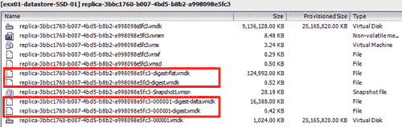
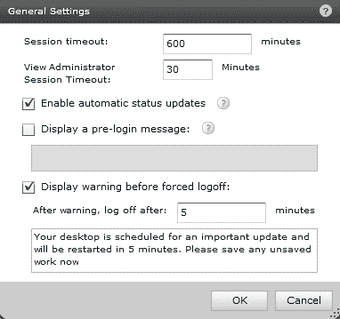

# 第十二章 VMware View 5.1

在本书发布时，VMware View 5.0 正在被 VMware View 5.1 版本取代，尽管是一个.1 版本，但 VMware View 团队添加了大量功能，改善了 VMware View 的性能、可扩展性和用户体验。

本章将新功能分为以下五个主要领域：

+   平台

+   用户体验与客户端

+   管理与管理

+   个人信息管理

+   安全性

# 平台功能

VMware View 5.1 中的平台功能增强旨在减少存储需求的剧烈变化。由于本书的很大一部分内容专门用于简化和优化存储需求，因此 VMware View 5.1 的改进备受欢迎。

## 基于内容的读取缓存（也称为视图存储加速器）

**基于内容的读取缓存（CBRC）**功能是 VMware vSphere 5 的原生功能，并由 VMware View 管理。CBRC 有助于解决一些典型的 VDI 性能瓶颈，并帮助降低 VDI 的整体存储成本。

CBRC 是一个基于 RAM 的缓存解决方案，位于给定的 ESXi 主机上，帮助减少对存储子系统发出的读取 I/O 次数。通过减少对存储子系统发出的读取 I/O 次数，可以实现存储子系统的可扩展性和整体性能的提升。CBRC 对客户操作系统（vDesktop）完全透明。

VMware 宣布，在与 CBRC 的测试中，启动风暴的减少大约如下：

+   峰值 IOPS 减少 80%

+   平均 IOPS 减少 45%

+   峰值吞吐量减少 65%

+   平均吞吐量减少 25%

这些是存储子系统的重大节省，应在 VMware View 设计过程中仔细考虑。需要注意的是，CBRC 仅用于读取 I/O。

缓存有两个组件，具体如下：

+   **内存缓存：** 由管理员配置，具有固定的最大大小为 2 GB，默认的内存预留为 400 MB

+   **动态缓存：** 它根据需求加载块，并根据 VMDK 上各个块的访问模式管理缓存

每个主机上的 VMDK 磁盘在磁盘上维护一个摘要/元数据表。元数据保存关于 VMDK 上各种块的信息。可以将其想象成一个哈希表，每个哈希条目指向一个特定的块。

将前两个组件组合起来，如果对 VMDK 上某个特定块有读取请求，则计算一个哈希值，并检查内存缓存中是否存在该块。如果不存在，则访问哈希表并将相应的块加载到内存缓存中。如果该块已经在内存缓存中，则将其返回给用户。

CBRC 占用的额外内存在内存消耗方面被视为**回归**。由于在稳定状态的工作负载下，CBRC 的内存需求并不高，vSphere 会对内存消耗进行表征并加以减少。

CBRC 将使没有智能阵列和缓存管理的 VDI 环境受益。然而，对于具有读取或读写缓存管理的阵列，CBRC 也将有助于减少存储传输中的 I/O 延迟。由于读取的 I/O 从主机内存中提供，因此无需通过网络检索数据块。此外，数据块的检索时间为微秒级，而非毫秒级。

上面的图示突出了 ESXi 主机直接访问其内存的情况，CBRC 就存储在内存中。如果数据必须从典型的存储阵列中检索，请求必须通过任何路径才能完成。CBRC 提供的 I/O 性能提升在终端用户使用桌面时会明显感受到。然而，应该注意的是，在稳定状态的工作负载下，大多数 I/O 操作是写入操作，而非读取操作。

视图存储加速器允许主机对操作系统磁盘和用户持久磁盘进行缓存，适用于链接克隆桌面；管理员还可以指定缓存元数据应多久重新生成一次。

### CBRC 存储大小

启用视图存储加速器时（操作系统磁盘或操作系统和持久磁盘），会为每个 VMDK 创建一个摘要文件，以存储关于 VMDK 块的哈希信息。

每个摘要文件的预计大小大约为：

+   当哈希碰撞检测关闭时（默认值），每 1 GB 的 VMDK 大小约为 5 MB。

+   当哈希碰撞检测开启时，每 1 GB 的 VMDK 大小约为 12 MB。

上述截图显示了给定数据存储中 CBRC 摘要文件的存在。

在 VMware vCenter 的任务窗格中，也会显示虚拟磁盘摘要的创建过程。

创建大型副本磁盘的摘要文件可能需要相当长的时间和 IOPS，因此建议在生产时间内不要运行该操作、创建新的桌面池或重新组成现有的桌面池。

举个例子，一个 25 GB 的 Windows 虚拟机副本将为摘要文件消耗大约 125 MB 的存储空间。对于快照（增量）或持久磁盘，摘要文件也会为快照创建。如果克隆 VMDK，摘要文件也会被复制。

由于基于 Windows 的桌面之间会有大量相同的块，假设在使用 CBRC 时，可以通过完全桌面克隆实现性能提升。然而，截至目前，CBRC 不支持完全桌面克隆。

对于 5 GB 的持久磁盘，摘要文件大约为 24 MB。

### 主机内存大小

CBRC 使用 RAM 缓存来管理缓存的磁盘块。每个 VMDK 的摘要文件也会被加载到内存中。

在内存过度分配的环境下不应启用 CBRC。如果主机内存已被过度分配并且启用了 CBRC，内存压力将增加，因为 CBRC 也会使用内存作为缓存。在这种情况下，主机可能会经历增加的交换操作，整体性能也可能受到影响。在这种情形下，启用 CBRC 可能会导致性能更差。

以下截图展示了在主机上启用 512 MB 缓存的 CBRC 时的图示：

由于 CBRC 在其架构中消耗主机内存，因此可以通过减少虚拟机密度来缓解主机磁盘交换和性能下降的问题。更理想的做法是适当配置主机，包含支持 CBRC 功能所需的额外 RAM。

为每个创建的 VMDK 摘要文件，将额外消耗大约 24 MB 的 RAM，除了已定义的 CBRC 缓存。例如，如果只有一个系统磁盘进行哈希计算，且主机缓存为 500 MB，则 500 MB + 24 MB = 总共将使用 524 MB 内存。

需要记住的是，也可以为系统盘和持久磁盘创建摘要。

另一个例子是，如果有 64 个虚拟机在使用，则会有 64 个持久磁盘，再加上 1 个副本磁盘。在这种情况下，我们将有 65 个 VMDK 需要进行哈希计算。假设主机缓存使用了 2 GB RAM（最大大小），那么 2048 MB +（65 * 24 MB）= 总共将使用 3.5 GB 的内存。

### 管理 CBRC

在 VMware View 中，CBRC 位于 **vCenter Server** 配置的 **Host Caching** 标签下。可以启用并定义分配给主机的总 RAM 缓存大小。每个主机的缓存大小可能不同，但建议在 vSphere 集群中保持一致性。

在创建桌面池的过程中，管理员可以定义该池应使用 CBRC，选择要为其创建摘要文件的磁盘类型，以及摘要文件应该多频繁地重新生成。

以下选项通过 `/config/CBRCFilter/intOpts` 显示，并可通过 VMware vSphere Client 高级配置进行查看。VMware View 内置有管理以下选项的功能，建议不要手动修改这些项目：

+   `/config/CBRC/intOpts/DCacheMemReserved:` CBRC 数据缓存所消耗的内存（以 MB 为单位）。

+   `/config/CBRC/intOpts/DCacheSize:` CBRC 数据缓存的大小（以 MB 为单位）。如果**CBRC.Enable**设置为**1**，则此值不能更改。

+   `/config/CBRC/intOpts/DigestJournalBootInterval:` 为避免干扰启动过程，Digest Journal 临时禁用的时间间隔（以分钟为单位）。

+   `/config/CBRC/intOpts/Enable:` 启用基于内容的读取缓存（CBRC）。

需要注意的是，在某些条件下，不支持视图存储加速器，包括：

+   使用视图组合器阵列集成 API，这是 View 5.1 的技术预览功能

+   用于启用本地模式功能的桌面

+   当启用 VMware View 副本分层时。

## 视图组合器阵列集成

**视图组合器阵列集成（VCAI）**是 VMware View 5.1 中的一项技术预览功能，允许管理员在 VMware View 和 View Composer 的正常管理工作流程中利用存储本地快照功能。

VCAI 通过**vSphere vStorage 阵列集成 API（VAAI）**与**网络附加存储（NAS）**合作伙伴的本地克隆能力集成。VCAI 加速了在自动化池中链接克隆虚拟桌面的配置，帮助减轻 CPU 消耗和网络带宽压力。

建议阅读*VMware 终端用户计算博客*，网址为[`blogs.vmware.com/euc/2012/05/view-composer-array-integration-tech-preview.html.`](http://blogs.vmware.com/euc/2012/05/view-composer-array-integration-tech-preview.html.)

## 支持在 NAS 上的集群中最多 32 个（从 8 个增加到 32 个）主机

直到 VMware View 5.1，任何支持 VMware View 部署的 vSphere 集群仅允许最多 8 个主机的集群。此限制的原因是 VMFS 限制了可以同时对单个文件（副本磁盘）执行 I/O 操作的主机数量。

这在谈到 NFS 导出时从未成为大问题；然而，这一限制是硬编码在 View Composer 中的，这个工具负责创建链接克隆。

在 VMware View 5.1 中，这一限制已被移除，View Composer 将支持最多 32 个主机的集群，前提是底层存储文件系统和协议为 NFS。这一更改彻底修改了许多基于 NFS 集群的 VMware View 部署架构。由于这是书中的一个后期补充，其对 NFS 支持的主机数（从 8 个增加到 32 个）将通过未来的博客文章或附录进行详细说明。

## 独立视图组合器服务器

VMware View Composer 是负责创建链接克隆的软件下载程序，现在可以安装在除了 vCenter Server 之外的其他服务器上。此举旨在推动高度可扩展的 VMware View 架构。

上述截图展示了可以配置独立视图组合器服务器的配置选项卡。对于需要保护 VMware vCenter Server 和 VMware View Composer Server 的弹性和性能的大型环境，这是理想的配置。

## 可自定义一次性磁盘驱动器字母

VMware View 5.1 增加了指定临时磁盘驱动器字母的功能。过去，临时磁盘会使用桌面上第一个可用的驱动器字母。VMware View 仍然可以通过将**驱动器字母**选项设置为**自动**模式来自动选择驱动器字母，如下图所示：

上图显示了临时磁盘驱动器字母的配置选项卡。

# 用户体验和客户端功能

VMware View 5.1 进行了大量改进，直接影响到用户体验。VMware View 和 Teradici PCoIP 在每次发布中都在不断演进。比较 VMware View 4.x 和 VMware View 5.1 的最终用户体验，显示出了非常显著的改进。

VMware View 5.1 在多个用户体验和客户端方面进行了增强，包括本地模式和 USB 重定向。

VMware View 本地模式的增强功能如下：

+   多显示器支持

+   磁盘 I/O 性能改进及减少重复数据删除 I/O 成本

+   支持通过 TCP 的 DNS NAT

+   本地模式磁盘一致性验证

+   支持虚拟硬件版本 8

+   改进的 NAT、DNS 解析性能、链路状态传播

+   一键发送*Ctrl* + *Alt* + *Delete*键盘快捷键

+   自动化支持销售点操作

+   数据完整性和安全性强化

VMware 还在 VMware View 5.1 中重新设计了 Windows 客户端的 USB 堆栈。USB 的增强功能如下：

+   更广泛的设备支持

+   新的过滤机制，用于通过组策略更好地管理客户端上的设备

+   支持 USB View 客户端的多平台

+   新的过滤机制，用于更好地管理代理上的设备，允许阻止不需要的设备以及通过其他方式转发的设备（例如键盘/智能卡），可通过组策略进行配置

+   设备驱动程序不再需要在客户端机器上安装

PCoIP 也有少量的增强功能。这些增强包括减少客户端上解码 PCoIP 帧的 CPU 使用率，从而最终改善协议性能。

# 管理和操作

虽然 VMware View 被证明相对易于管理和操作，但仍然存在一些需要改进的领域，包括一些基本的 UI 功能，例如右键。在 VMware View 5.1 中，UI 和管理方面有了若干改进。

## 用户界面增强和本地化

VMware View 5.1 中的用户界面焕然一新，外观更为简洁且响应更快。VMware View 还支持五种不同的外语本地化（法语、德语、日语、韩语和简体中文）。

在用户界面中新增了右键功能，帮助简化管理桌面池、权限和桌面的过程。

## 支持预创建的 Active Directory 计算机账户

利用预创建的 Active Directory 计算机对象是一个很好的补充，适用于那些由于安全规范需要创建自己的 Active Directory 计算机账户的组织，或者因为现有的自动化流程要求在用户加入组织时确保创建 Active Directory 对象。

上面的截图展示了配置标签，用于允许使用预先存在的 Active Directory 计算机账户。

## VMware vCenter 和 View Composer 高级设置

VMware View 用户界面现在允许管理员指定最大并发的配置和维护操作数。此前，用户界面仅提供电源和 vCenter 并发操作的配置选项。

建议在生产环境中不要更改默认设置，因为这可能会影响用户体验；这是因为在进行大量配置或维护任务的环境下，可能会产生显著的 IOPS，从而影响到所有当前用户的使用体验。

上面的截图展示了配置标签，用于指定操作最大值。

## 电话回家

这是一个在安装时可选择的选项，用于收集匿名的 VMware View 使用统计信息。所有数据都会被匿名处理且无法追踪，电话回家将收集有关版本、使用的功能、系统架构选择以及部署规模的信息。

VMware 旨在利用这些信息提供更好的支持并增强最受欢迎的功能。此外，VMware 认为此数据收集将有助于更好地调整 View 产品的研发优先级，以便与现场客户的使用需求匹配。

上面的截图展示了配置标签，用于启用电话回家支持（参与**匿名用户体验改进计划**）。

# 配置文件管理

在 VMware View 5.1 中，用户配置文件管理也得到了增强。尽管许多组织将继续使用像 Liquidware Labs ProfileUnity 这样的第三方解决方案，VMware View 中的本地配置文件管理正逐步发展为更为可接受的解决方案。View 5.1 对配置文件管理的增强包括：

+   允许物理机器的虚拟配置文件管理

+   一次性从 Windows XP 升级到 Windows 7 的迁移功能

VMware View 配置文件管理现在提供对物理机器的配置文件支持，帮助用户从物理桌面过渡到 VMware View 桌面。如本书前面提到的，从 vDesktop 中提取用户配置文件（通常在非持久性解决方案中使用）可以更容易地将用户从物理桌面迁移到 vDesktop。

在物理到虚拟的迁移过程中，管理员可以首先在物理桌面上安装 View Persona Management，当用户使用启用了 Persona 管理的虚拟桌面时，用户数据和设置会自动同步。

VMware 还支持一次性从 Windows XP 迁移到 Windows 7。

# 安全

安全性是 VMware View 5.1 中的一个重要主题，包括安全加固和修复。安全性是许多组织采用 VDI 的主要驱动力。产品在安全领域的持续改进突显了 VMware 对高度安全环境的承诺。View 5.1 的发布包括以下安全增强功能：

+   支持多种双因素身份验证与 RADIUS 支持，包括 RSA SecurID、VASCO DIGIPASS、SMS Passcode、SafeNet 等供应商。

+   **VMware View 管理员会话超时：** 会话超时选项一直存在，但现在可以由管理员进行配置。

+   **SSL 证书安全增强：** VMware View 5.1 现在会在使用自签名证书时发出警告。管理员必须验证自签名证书的使用。VMware 建议使用受信任的**证书颁发机构（CA）**服务。

上面的截图展示了启用 VMware View 管理员**会话超时**的配置选项。

上面的截图展示了使用自签名证书时生成的错误。

# 摘要

VMware 通过收购、内部研发、客户反馈、合作伙伴支持（如 Teradici）以及社区参与，持续推动 View 产品的发展。由于本书在 View 5.1 发布时已经完成并处于最终出版阶段，作者认为概述新内容非常重要。欲了解更多信息，请参阅博客[`myvirtualcloud.net/`](http://myvirtualcloud.net/)和[`www.thinkvirt.com/`](http://www.thinkvirt.com/)。
