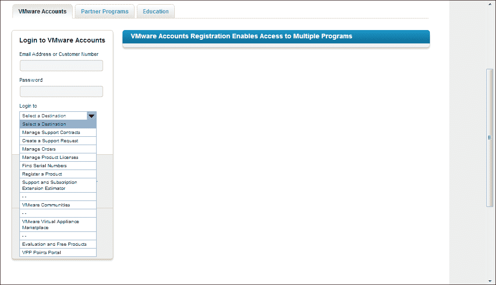
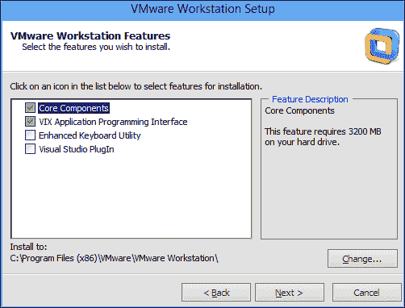
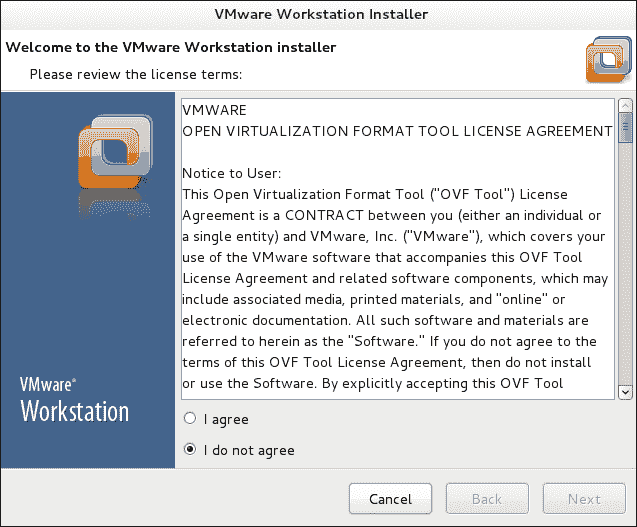
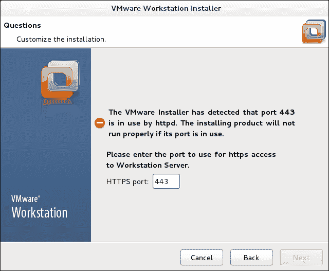
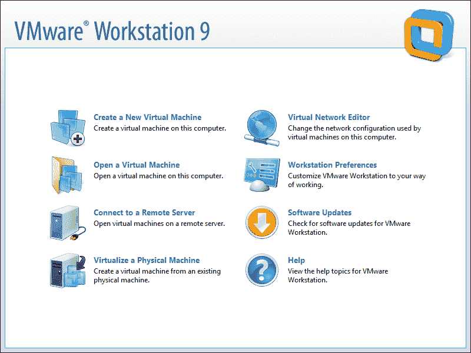
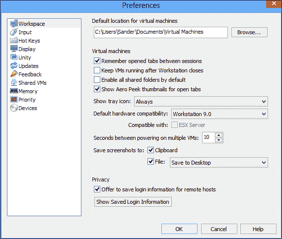

# 第一章：安装 VMware Workstation

在本章中，你将学习如何安装 VMware Workstation。本章不仅仅是通过点击“下一步”、“下一步”和“完成”来执行一个向导，你还将学习如何明智地配置运行 VMware Workstation 的计算机，并在 Windows 或 Linux 上进行高级安装。

# 配置主机计算机

在开始安装 VMware Workstation 之前，你应该先照顾好你想要使用 VMware Workstation 的主机计算机。当然，任何符合最低要求的计算机都可以运行，但如果你选择了合适的配置，你将能从 VMware Workstation 的安装中获得更多的收益。在这一部分，我们将简要介绍如何为你的计算机选择最合适的配置。

## CPU 和 CPU 核心

每一个你安装的虚拟机都会像一台独立的计算机一样运行，你计算机中的 CPU 核心总数将作为你分配给虚拟机的最大 CPU 数量。然而，如果你想从虚拟机中获得最佳性能，最好不要配置超过计算机 CPU 核心总数的虚拟 CPU 数量。这意味着，如果你总共有四个核心，理想情况下，你不应同时运行超过三个每个虚拟机分配一个核心的虚拟机。当虚拟 CPU 的数量超出计算机中的 CPU 总数时，CPU 必须共享，这对性能不利。

没有正式的 CPU 核心数量，因此，如果你预算有限，你可以在只有一个核心的计算机上运行 VMware Workstation。然而，为了获得最佳性能，不推荐这样做。

### 提示

**Linux cgroups**

如果你在 Linux 上运行 VMware Workstation，你可以使用 cgroups。通过 cgroups，你可以定义资源组，确保每个虚拟机始终拥有专用的系统资源；这是一种有效且高效的方式来最优化使用硬件。

## 内存

如果计算机的物理内存不足，它将开始使用交换文件。使用 VMware Workstation 时，你希望避免计算机始终处于交换状态。为了确保这种情况永远不会发生，你计算机中的总内存必须大于所有虚拟机使用的总内存，并为主机操作系统预留 2 GB 的内存以确保流畅运行。这意味着，用于 VMware Workstation 的典型计算机至少应有 4 GB 的内存，最好更多。但如果你的预算有限，并且需要创建不需要太多内存的虚拟机，你可以在 1 GB 内存的情况下运行 VMware Workstation。

## 磁盘空间

主机系统配置中一个非常重要的部分是可用的磁盘空间。通常，每个虚拟机需要几 GB 的可用磁盘空间；因此，最小配置至少需要 10GB 的可用磁盘空间，而在一台用于运行多个虚拟机的专用测试机上，你可能需要数百 GB 的空闲磁盘空间。

如果你在寻找良好的性能，仅仅拥有足够的磁盘空间是不够的。这是因为你不希望虚拟机磁盘文件出现碎片化。为了避免碎片化，建议你使用一台将专门用于存储 VMDK 文件的独立磁盘的机器。这样做的好处是，你可以避免碎片化，并且拥有一块专门用于操作系统的磁盘，另外一块磁盘专门用于处理虚拟机的 I/O 请求。

# 获取 VMware Workstation

要获取 VMware Workstation，你通常会从 [www.vmware.com](http://www.vmware.com) 下载它。在 VMware 网站上，你可以选择下载试用版或购买 VMware Workstation。下载了 VMware 安装文件和注册代码后，你就可以开始安装。你还可以在 VMware 网站上创建一个帐户，方便你访问所有以前购买的产品。在本节中，你将学习如何购买自己的 VMware Workstation 副本，以及如何从你的 VMware 帐户中访问已购买的产品。

## 购买 VMware Workstation

以下步骤描述了如何获取 VMware Workstation：

### 提示

**支持**

有一版受支持的 VMware Workstation，但只有在购买 10 个或更多许可证时才可获得。如果你打算在商业环境中使用 VMware Workstation，并且希望轻松获得帮助，建议购买受支持的版本。VMware 提供基本支持，工作时间为周一至周五每天 12 小时，或者提供全天候支持，7 天 24 小时。如果支持对你很重要，我建议购买生产支持。价格差异很小，而这小小的差异将为你提供 24/7 的支持。

1.  启动浏览器并访问 [www.vmware.com](http://www.vmware.com)。点击**VMware 商店**按钮，并导航到**桌面产品** | **VMware Workstation 9**。

1.  如果你从未购买过 VMware Workstation，请选择**立即购买**。如果你拥有一个较新的版本，点击**升级**以支付折扣价格。

1.  输入你想购买的 VMware Workstation 许可证数量，然后点击**添加到购物车**。你的购物车将会更新。

1.  在选择了你要购买的内容后，点击**安全结账**以支付 VMware 许可证费用。这样会带你到一个窗口，你可以选择用现有的 VMware 帐户登录，或者创建一个新的 VMware 帐户并输入你的账单信息。

1.  点击**继续**完成交易。现在，你将能够访问你自己的 VMware Workstation 版本。

## 设置你的 VMware 账户

在购买 VMware Workstation 后，你可以访问你的账户，从 VMware 网站稍后下载它。你也可以随时从这里下载软件并获取相关的许可证密钥。

要访问你在 [www.vmware.com](http://www.vmware.com) 的账户，点击**我的账户**，并使用购买 VMware Workstation 时创建的电子邮件地址和密码登录。你还将看到一个下拉列表（请参阅以下截图），你可以从中选择你要查找的信息。例如，选择**登录以查找序列号**，以从 VMware 网站获取你的序列号。登录后，你会看到一份你已购买的所有产品列表，以及一个下载你版本的 VMware Workstation 的链接。

### 提示

**下载 VMware Workstation**

一旦你购买了 VMware Workstation，下载它的最简单方法是访问 VMware 网站并选择**产品与下载**链接。从这里，你可以选择**VMware Workstation**并轻松下载软件。

# 在 Windows 上安装 VMware Workstation

在本节中，我假设你已经做好了开始安装 VMware Workstation 的所有适当准备工作。这意味着你已经安装了 Windows 主机操作系统，并购买了 VMware Workstation，准备开始安装。请按照以下步骤操作：

1.  登录 VMware 网站并选择**产品与下载**。从那里选择**下载 VMware Workstation for Windows**，并点击**手动下载**链接。接受许可协议后，下载将开始。

1.  下载安装文件后，双击它以运行。当 Windows 安全策略询问是否允许安装程序执行时，允许它执行。你将看到**VMware Workstation 安装向导**的第一个屏幕。点击**下一步**开始安装。

1.  安装程序现在给你提供了在典型安装和自定义安装之间选择的选项。典型安装不需要太多解释，因此在本书中，我将解释自定义安装程序提供的选项。

1.  你现在会看到一份可以安装的不同程序组件列表。你至少应该安装核心组件，因为它们包含启动 VMware Workstation 所需的所有内容。如果你想开发自己的工具来管理和监控 VMware Workstation 的虚拟机，选择**VIX 应用程序编程接口**（这通常只有在你是开发者时才有意义）。**增强型键盘实用程序**在你需要从具有不同键盘布局的计算机轻松访问虚拟机时非常有用。

    使用**Visual Studio 插件**可以轻松调试 VMware Workstation 生成的错误信息。

    

    选择您希望安装的选项

1.  使用 VMware Workstation，您可以通过 Workstation Server 为您的虚拟机提供访问权限。此服务器默认通过安全的 HTTP 端口`443`提供对共享虚拟机的访问。在以下截图中，您将标明虚拟机存储位置以及 Workstation Server 组件将监听的端口。如果您想更改这两个设置，可以在此处进行调整。

1.  在下一个窗口中，安装程序询问您是否希望在启动时检查产品更新。如果选择此选项，系统会在有新版本时通知您。接下来，您将看到一个选项，询问您是否希望将匿名系统数据和使用统计信息发送给 VMware。此选项默认为*开启*，如果您不希望与 VMware 共享使用信息，可以在此处取消选择。接下来，您可以选择是否希望在桌面和开始菜单的**所有程序**选项中创建 VMware Workstation 的快捷方式。

1.  在指定了这些基本选项之后，点击**继续**以启动安装过程。由于大约有 3GB 的文件需要复制到计算机，因此这将需要一些时间来完成。

1.  一旦所有文件都复制到您的计算机，系统会提示您输入许可证密钥。此时您不必输入，但在创建第一个虚拟机之前，您必须输入许可证密钥，因此现在就可以输入。

    在创建第一个虚拟机之前，您需要输入许可证密钥

1.  安装完成。点击**完成**关闭安装向导。

# 在 Linux 上安装 VMware Workstation

在 Windows 工作站上安装 VMware Workstation 并不难；只需运行安装文件并更改一些默认参数即可正常工作。而在 Linux 上安装 VMware 则稍显复杂，因为您需要在 shell 环境中运行一些命令。

### 提示

**64 位还是 32 位？**

如果您在 Linux 上使用 VMware，应该安装 64 位版本的 Linux。与 32 位版本的 Linux 相比，64 位 Linux 版本在硬件资源（尤其是内存）的处理上更为高效。因此，为了获得最佳性能，请确保使用 64 位 Linux 版本。

1.  打开一个 shell 窗口，使用`su -`命令，并输入 root 用户的密码。

1.  下载安装文件后，您可以在下载该文件的用户账户的`Downloads`文件夹中找到它。通常情况下，这个文件夹位于`/home/<username>/Downloads`。使用`cd`命令进入该目录。

1.  下载的文件名类似于`VMware-Workstation-Full-<version>.bundle`。使用命令 bash `VMware-Workstation-Full-<version>.bundle`来启动**VMware Workstation 安装程序**。这将启动图形化安装程序。选择**我同意**以表示你同意许可协议条款，然后点击**下一步**继续。

    在 Linux 上，你也可以通过图形化安装程序安装 VMware Workstation。

1.  安装程序现在会打开几个窗口，要求输入通用设置。在第一个窗口中，你将选择是否希望在启动时检查产品更新，接下来你将选择是否愿意通过发送匿名使用数据来帮助 VMware。

1.  由于 Linux 默认是多用户操作系统，在下一个窗口中你可以输入已用于连接 VMware Workstation 服务器的用户帐户名称。通常，root 用户帐户是唯一具有足够权限执行此操作的帐户；但是，如果你的 Linux 计算机上有其他具有足够权限的帐户，请在此输入该帐户的名称，然后点击**下一步**继续。

1.  现在你需要输入共享虚拟机存储路径的名称。请注意，这个路径不常见；它们位于`/var/lib/vmware/Shared VMs`。这个路径完全符合 Linux 标准，但通常不是你查找这些共享文件的地方。

1.  在下一个窗口中，你将指明 VMware Workstation 服务器提供服务的端口。默认使用端口`443`，但如果该端口已被 Web 服务器使用，你需要选择其他端口。通常，只要端口号在非特权端口范围内即可，这意味着它需要大于端口`1024`。例如，`1443`就可以。

    如果 Apache 服务器已经占用了 443 端口，你需要选择另一个端口。

1.  此时，安装程序已经获取了所需的所有数据。点击**安装**以启动安装过程。

# 第一次启动 VMware Workstation

安装完成后，你可以首次启动 VMware Workstation。但在你实际开始创建第一个虚拟机之前，还有一些步骤需要完成。首先，你需要接受许可协议。一旦完成，你将看到 VMware Workstation 仪表盘，其中总结了在 VMware Workstation 中执行的所有常见任务。在以下截图中，你可以看到仪表盘的样子。在下一章中，你将学习如何继续并创建你的第一个虚拟机。

VMware Workstation 仪表盘

在你开始创建第一个虚拟机之前，有一些 VMware Workstation 设置你可能想要更改。要访问这些设置，你可以点击**工作站偏好设置**，或者打开**编辑**菜单并选择**偏好设置**。

**偏好设置**选项允许你为不同的功能设置偏好；其中一些设置不言自明。在本节中，你将只阅读到最有趣的设置。你会在**工作区**选项下找到一个重要的功能——**默认硬件兼容性**。这个选项通常会设置为最新版本的 VMware Workstation。然而，如果你计划频繁与较早版本的用户交换虚拟机，你可能需要将其更改为早期版本。另一个你会在这里找到的重要选项是 ESX Server 兼容性。如果你计划将虚拟机上传到 ESX Server，请确保选中**与 ESX Server 兼容**选项。没有选中此选项，你将无法将虚拟机上传到 ESX 环境。

在工作区偏好设置窗口中，你将定义创建的虚拟机的兼容性

要定义你可以用于常用虚拟机操作的特殊快捷键组合，可以使用**热键**选项卡。例如，在这个选项卡中，你可以定义哪些键用来释放虚拟机控制权并返回主机环境。默认情况下，*Ctrl* + *Alt* 键用于此目的。在某些操作系统中，这个组合键已经有了不同的意义；例如，在 Linux 中，你用它来打开不同的虚拟控制台。如果你想保留这个功能，你可以定义另一个热键组合。

配置 VMware Workstation 主机的一个重要部分是为虚拟机分配的内存量。一方面，你需要确保剩余足够的内存来保持主机操作系统的顺利运行；另一方面，你也要确保有足够的内存来满足所有虚拟机的需求。如果主机操作系统没有足够的内存，它将开始进行交换；如果虚拟机没有足够的内存，虚拟机内存将被交换，这两者都会影响计算机性能。

此外，在**内存**选项下，您可以指定如何使用交换空间。为了获得良好的性能，最佳选项是完全禁止使用交换空间。要做到这一点，请选择**将所有虚拟内存适应保留的主机 RAM**，但这意味着您可能无法在主机计算机上运行所有需要的虚拟机。默认选项是**允许一些虚拟机内存被交换**。这提供了性能和可以在计算机上运行的虚拟机数量之间的最佳折衷。如果您希望能够在主机计算机的可用硬件上运行尽可能多的虚拟机，请选择**允许大多数虚拟机内存被交换**；但是请准备好，如果计划在计算机上运行多个虚拟机，则性能可能会受到影响。

在内存选项卡上，您可以指定主机操作系统如何管理虚拟机的系统内存

在**优先级**选项卡上，您需要指定如果虚拟机处于活动状态，则应该给予额外的优先级。默认情况下，即使虚拟机处于活动状态，也不会有额外的优先级。如果您希望在使用虚拟机时稍微加快其速度，请确保在**输入获取**选项上选择**高**。为了确保主机在未使用虚拟机时能够平稳运行，请确保**输入未获取**选项显示为**低**。

另一个与性能相关的选项指定如何处理快照。默认选项将在后台运行快照过程，无论您是在进行快照还是恢复快照。但是，将快照过程作为后台作业运行可以确保只有在虚拟机关闭时才应用更改。如果您希望直接应用更改，则需要确保快照程序作为前台作业运行。然而，由于快照过程既涉及大量 I/O 操作又涉及大量 CPU 使用，这将减慢计算机上的其他进程速度。

在优先级选项下，您可以稍微优化虚拟机的性能

# 概要

在本章中，您已经学习了如何在 Linux 和 Windows 上安装 VMware Workstation。您还了解了一些最有用的通用程序选项，可以进行设置。

在下一章中，您将学习如何创建虚拟机。
