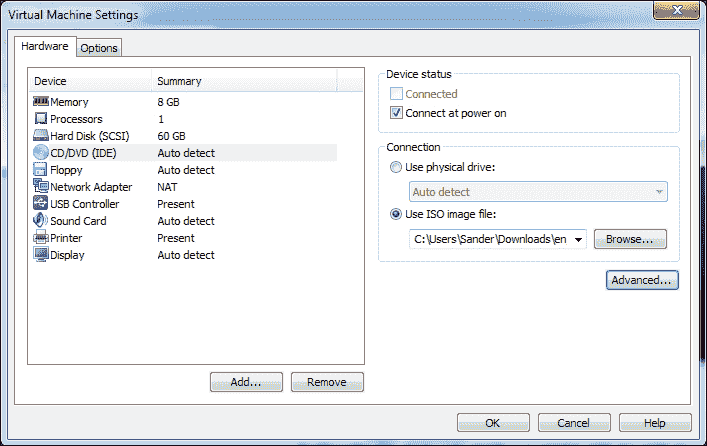

# 第二章 安装虚拟机

在本章中，你将阅读如何安装虚拟机。由于安装一个基础虚拟机可能非常简单，我们将重点讲解高级配置选项。

# 开始之前

在开始实际安装虚拟机之前，你应设置虚拟机磁盘文件的默认存储位置。如果你不这样做，它们将存储在使用 VMware Workstation 的用户的主目录中。这样也没问题，但如果你正在设置一个将使用多个虚拟机的环境，你可能希望将所有虚拟机磁盘文件存储在专用硬盘上。要做到这一点，导航到**编辑** | **首选项**，并确保选择了**工作区**选项，如下图所示：


现在浏览到你希望存储虚拟机文件的磁盘和文件夹。这个默认位置将应用于你从现在开始创建的所有虚拟机。

# 开始安装

要开始安装虚拟机，你需要导航到**文件** | **新建虚拟机**。这将启动**新建虚拟机向导**。向导提供了两种不同的选项：如果你希望尽快让虚拟机启动并运行，可以选择**典型**，如果你希望对虚拟机的选项有最大控制，可以选择**自定义**。在本程序中，你将阅读如何安装自定义虚拟机。


在选择自定义安装类型后，你需要指定虚拟机的硬件兼容性。默认情况下，虚拟机将安装为 VMware Workstation 9 虚拟机类型，如果你只是打算在 VMware Workstation 9 上使用它，这样设置是可以的。然而，这种虚拟机类型无法在 VMware Workstation 的早期版本上运行。VMware Workstation 9 使用了一种新数据格式，该格式无法在任何早期版本的 VMware Workstation 上使用。因此，你可以选择你希望虚拟机支持的最低版本的 VMware Workstation。

请注意，你无需做任何与 VMware ESX 兼容性的设置——这是一个企业级虚拟化平台。与 VMware Workstation 6.x 或更高版本兼容的虚拟机会自动适配 ESX Server。如果你选择的兼容版本低于 VMware Workstation 6.x，你需要选择 ESX Server 5.x 或 ESX Server 4.x，以确保它能在 ESX 上运行。

在选择硬件兼容性版本时，你还可以看到支持哪些功能。选择 VMware Workstation 的较早版本时，你会立即看到哪些硬件功能不受支持。例如，如果选择 VMware Workstation 4.x，你会发现许多硬件功能不可用，且可用的硬件也受到限制，只有 3.5 GB 的内存和一个 CPU。


在指定硬件兼容性后，你可以选择要使用的安装介质。你可以从 ISO 镜像文件或物理磁盘中启动安装。两者都将启动简易安装。在这种安装类型中，你将指定最少的安装选项；这意味着有许多选项不会在安装程序中显示。虽然如果你只想尽快完成安装，这种方式很有用，但对于高级用户来说，这种安装通常并不适合。为了完全控制安装过程，建议选择**稍后安装操作系统**。

在下一个窗口中，你可以指定要安装的操作系统。选择操作系统会自动设置虚拟机中所需的一些硬件设置。支持多种不同的操作系统；唯一的要求是它们需要使用相同的 CPU 架构。也就是说，你可以在 VMware Workstation 中安装任何基于 Intel 的操作系统，但无法安装为不同硬件架构编写的操作系统，比如 IBM System z。


在指定操作系统后，你需要选择要存储虚拟机磁盘文件的位置。即使你已经选择了虚拟机文件的默认位置，你仍然可以为每个虚拟机选择一个不同的目录。

## 内存和 CPU

在下一个窗口中，你将选择虚拟机中可用的虚拟 CPU 数量和 CPU 核心数量。虽然超出计算机硬件可用的 CPU 数量可能看起来很诱人，但这并不是一个好主意。为了获得最佳性能，虚拟机中一个 CPU 和一个核心的配置表现最佳。如果你确实需要多个 CPU 或 CPU 核心，切勿超过主机中物理可用的 CPU 和核心数量。如果超过了这个数量，你会注意到虚拟机的性能会大大下降。

下一个设置相当简单：您需要选择将由虚拟机使用的内存量。该软件允许您使用超出计算机物理内存安装量的内存。请避免这样做，因为虚拟机会占用主机上的所有内存，导致您无法高效使用计算机。

## 网络

在指定要使用的内存量后，您将选择如何处理网络设置。您有四个选项：

+   **使用桥接网络**：如果您希望虚拟机可以直接在本地网络中使用，请选择此选项。要使用此选项，虚拟机需要一个专用的 IP 地址。

+   **使用网络地址转换（NAT）**：这是默认的网络选项。虚拟机可以访问网络上的其他计算机，但它本身不可被访问，因为此访问被 NAT 防火墙阻止。

+   **使用主机专用网络**：如果您想设置一个测试网络，在该网络中计算机不需要访问外部网络中的任何内容，请选择此选项。

在第三章中，*使用虚拟机*，您将更详细地学习如何设置虚拟网络。如果不确定该如何操作，请选择**使用网络地址转换（NAT）**并继续，如下截图所示：


选择网络

## 磁盘选项

接下来，您将指定虚拟机要使用的**SCSI 控制器**类型。默认情况下，这将是一个 SAS 控制器，它提供最佳性能，但如果您知道您的虚拟机不支持该控制器类型，您可以选择常规的**LSI Logic**控制器。


选择 SCSI 磁盘控制器

现在，您将指定要使用的磁盘类型。默认情况下，VMware 会在您之前指定的文件位置创建一个磁盘映像文件。然而，您也可以选择现有的磁盘文件或直接安装到物理磁盘上。使用 VMware 磁盘文件是最灵活的选项，因为您可以轻松地将磁盘复制或移动到另一个使用 VMware 的计算机并在其上导入。为了获得最佳性能，您可以使用物理磁盘。这样做的优点是 VMware 不需要通过文件系统层访问物理磁盘上的文件，从而使速度更快。然而，这也使得您的设置不那么灵活，因为物理磁盘不容易调整大小。

### 提示

如果您想将物理磁盘用作虚拟机的存储后端，建议使用 Linux 主机操作系统。在 Linux 上，您可以使用 LVM，这是一个灵活的磁盘存储管理方式。在 LVM 中，调整磁盘大小变得非常简单，这一点可以在 VMware 中看到。

使用现有磁盘的选项并不是用来创建新虚拟机的，而是用来导入在其他计算机上创建的现有虚拟机。在第六章，*远程访问虚拟机*中，你将学习如何导入虚拟机。

在选择你想使用的磁盘类型后，你还需要选择磁盘类型。你可以选择 SCSI 或 IDE。为了获得最佳性能，建议使用 SCSI 类型磁盘。只有当你需要使用像 MS-DOS 这样的老旧操作系统时，选择 IDE 磁盘才是有意义的。

接下来，你需要指定如何分配磁盘空间。VMware Workstation 默认使用精简配置。这意味着你需要指定磁盘可以使用的最大空间，但并不会立即分配所有磁盘空间。如果你希望以最小的可用磁盘空间来设置虚拟机，这是一个不错的选择。但是，如果你追求最佳性能，这样做就不太合适了。为了获得最大性能，最好选择**立即分配所有磁盘空间**。这样会在虚拟机安装之前创建虚拟磁盘——请注意，这可能需要相当长的时间。

你也可以指定是否使用单个磁盘文件或多个磁盘文件。默认情况下，VMware Workstation 使用多个磁盘文件；这样可以更方便地将文件复制到其他地方。这样做的一个重要原因是有些文件系统不支持大文件。但是为了获得最佳性能，最好只使用一个磁盘文件。


在指定如何创建磁盘文件后，你需要指明磁盘文件的名称。默认情况下，磁盘文件的名称与虚拟机的名称相同。该文件使用默认的扩展名`.vmdk`。

到此为止，你已经指定了 VMware 启动虚拟机安装所需的所有信息。你现在会看到一个概览窗口，从中你可以自定义硬件。完成后，点击**完成**关闭安装窗口。这将定义 VMware 虚拟机。如果你选择稍后安装，配置将写入磁盘，然后你可以启动安装。

# 安装 Windows 8 虚拟机

在上一节中，你阅读了如何为你要安装的虚拟机指定硬件设置。基于这些设置，你现在可以安装虚拟机。在本节中，你将了解如何安装 Windows 8 虚拟机。

在之前的操作中，你已经了解了如何为你要创建的虚拟机定义硬件设置。硬件选项定义好后，虚拟机会被添加到 VMware 仪表板中。在你开始实际安装之前，首先需要定义你想要使用的安装磁盘。为此，请从 VMware 仪表板中选择**虚拟机**，然后点击**编辑虚拟机设置**。


点击编辑虚拟机设置以指定安装介质

点击**编辑虚拟机设置**后，在**硬件**标签页中选择**CD/DVD (IDE)**。如果你想从 ISO 文件安装，点击**使用 ISO 映像文件**，然后浏览到你想用来启动安装的文件。



选择你要用于安装的 ISO 文件

现在点击**确定**按钮保存设置，并点击**播放**按钮启动虚拟机。你会看到虚拟机开始启动，虚拟机启动窗口会显示在 VMware Workstation 控制台内的一个窗口中。如果安装程序窗口不适配，你可以最大化这个窗口。最简单的方法是使用安装窗口顶部的按钮。将鼠标悬停在按钮上，你将看到每个按钮的描述；你需要进入全屏模式以便从全屏环境中方便操作。要退出全屏显示，按下*Ctrl* + *Alt* 键。接下来，将鼠标移到屏幕的上方以显示按钮栏。你会看到全屏按钮当前处于激活状态，再次点击它即可取消全屏。

安装过程本身与普通 Windows 安装方式相同。完成所有必要的步骤以完成安装。请注意，你需要一个有效的注册密钥才能安装 Windows 8。如果你只是为了测试目的设置 Windows 8 虚拟机，你可以从[www.microsoft.com](http://www.microsoft.com)申请评估密钥。即使只是为了测试，你也需要在[www.microsoft.com](http://www.microsoft.com)注册虚拟机；如果没有注册，是无法完成安装过程的。

# 安装 Linux 虚拟机

安装 Windows 虚拟机非常简单，因为 Windows 与 VMware 集成得非常好。安装 Linux 虚拟机稍微复杂一些，因为你需要在 Linux 操作系统中安装 VMware 工具。在接下来的操作中，你将学习如何处理 Linux 虚拟机上与 VMware 相关的安装部分。

Linux 虚拟机的安装过程与 Windows 虚拟机的安装非常相似。在 Linux 中，选择**稍后安装操作系统**选项尤为重要，以避免使用简单安装。这是因为 Linux 有许多可以根据用户需求修改的选项，而如果使用简单安装，所有设置都是默认值。

一些 Linux 发行版的图形显示可能无法正常显示。为了解决这个问题，请停止安装并导航到**虚拟机设置** | **硬件**。然后，导航到**显示** | **指定显示器设置**，并手动设置你想要使用的显示分辨率。现在你可以重新启动安装。


安装程序加载完成后，按正常方式继续安装。在选择你想要安装的软件时，请确保安装内核源包以及 GCC 编译器，并获取所有相关工具。这将大大简化 VMware Tools 的安装。一旦完成，点击安装窗口底部的**我完成了安装**。

安装 Linux 虚拟机的难点在于如何将 VMware Tools 安装到虚拟机中。VMware Tools 确保图形、网络和磁盘的适当驱动程序已安装。使用 VMware Tools 确实能大大提升虚拟机的性能，但在 Linux 中安装这些工具有点困难。困难之处在于，要安装 VMware Tools，你需要在虚拟机中挂载 VMware Tools 镜像的 ISO 文件。VMware Tools 安装文件会从镜像文件复制到虚拟机中的磁盘，但为了做到这一点，你通常需要同时访问大多数 Linux 发行版中的安装光盘。

### 提示

**软件仓库**

要安装 VMware Tools，必须从安装源复制额外的软件，也就是你 Linux 发行版所使用的仓库。如果你的 Linux 虚拟机已连接到互联网，你将使用在线仓库，因此唯一的条件是需要有活动的互联网连接。如果你的 Linux 发行版没有连接互联网，你需要将安装文件本地化。最简单的方式是将安装镜像复制到虚拟机，并将其配置为仓库。请查阅你所使用发行版的文档，因为具体的操作步骤会因发行版不同而有所不同。

要安装 VMware Tools，你首先需要断开安装光盘。操作方法是点击屏幕右下角的 CD 图标，然后点击**断开连接**（见下图）。


在安装 VMware Tools 之前，请断开安装光盘

断开安装盘后，在 VMware Workstation 中打开虚拟机菜单并选择**安装 VMware 工具**。这将把 VMware 工具镜像挂载到客户操作系统中。现在在 Linux 虚拟机中打开根 shell，并输入 `mount` 命令查看 VMware 工具镜像挂载到了哪里。例如，在现代的 Fedora 系统中，它会被挂载到 `/run/media/user`。使用 `cd` 命令进入该目录中的 CD-ROM 挂载点。

### 提示

**手动挂载工具镜像**

如果你找不到 VMware 工具镜像挂载的地方，可以手动挂载。为此，打开一个 root 终端，使用命令 `mount /dev/sr0 /mnt`。

一旦你访问了 VMware 工具镜像挂载的目录，使用 `cp` 命令将安装文件复制到 `/tmp` 目录。例如，使用 `cp VMware[Tab] /tmp` 将工具文件复制过去。接下来，输入以下命令提取工具文件：

```
cd /tmp
tar zvf VMware[Tab]

```

现在你会有一个 `/tmp/vmware-tools-distrib` 目录，其中包含 VMware 工具的安装文件。使用 `cd` 进入该目录，然后输入 `./vmware-install.pl` 命令开始工具安装。这将启动交互式安装程序。按 *Enter* 键接受所有问题的默认答案。如果遇到错误信息，请按照安装程序的指示解决问题。安装完成后，激活新安装的 VMware 工具最简单的方法是重新启动你的 Linux 虚拟机。

# 总结

在本章中，你已经阅读了如何安装虚拟机。本章从解释虚拟机使用的虚拟硬件开始，接着介绍了如何安装 Windows 虚拟机和 Linux 虚拟机。在下一章，你将阅读虚拟机使用的基础知识。
