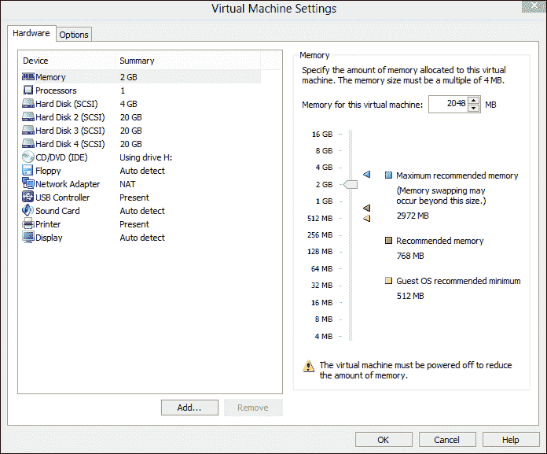

# 第三章：虚拟机操作

在很多方面，操作虚拟机就像操作物理机一样。某些方面也有重要的差异。在本章中，你将了解这些差异，这些差异有时会让操作虚拟机变得有些挑战性。在本章中，你还将学习如何应对在虚拟环境中工作时遇到的各种特殊情况。

# 执行常见任务

即使是最常见的任务，在虚拟机中也可能会有所不同。首先是虚拟机窗口本身。一旦进入该窗口，鼠标光标将被捕获。这意味着你需要使用一个特殊技巧才能返回宿主操作系统。常见的方法是同时按下*Ctrl* + *Alt*。但是如果在虚拟操作系统中，*Ctrl* + *Alt* 键序列有特定含义呢？如果是这种情况，你需要定义适用于虚拟环境的快捷键。为此，请按照以下步骤操作：

1.  在**编辑**菜单中，选择**偏好设置**选项。

1.  在屏幕左侧的栏中，选择**快捷键**。

1.  你现在将看到以下截图中显示的界面。默认情况下，*Ctrl* + *Alt* 键被用作虚拟机快捷键，并且将这些快捷键分配给特定的操作。

1.  点击你想重新定义的快捷键。例如，如果你想将*Shift* + **Win** 设置为默认快捷键，点击这些按钮：

    分配你想使用的快捷键

### 注意

别忘了取消选择你不再想使用的快捷键；你可能不想同时按下*Ctrl* + *Shift* + *Alt* + **Win** 这些键组合！

现在你已经分配了符合你需求的快捷键，你可以用它们来执行一些最常见的操作：

+   使用快捷键释放当前机器的控制权

+   使用快捷键 + *Enter* 进入或退出全屏模式

+   使用快捷键 + 左箭头或右箭头切换到上一个或下一个虚拟机

另一个常见的任务是关于**更新**的内容。你也可以通过**偏好设置**菜单访问此功能。默认情况下，VMware Workstation 会在启动时检查更新，并自动更新你正在使用的软件组件。这是完全没问题的，也没有理由改变这一设置。

一个非常有用的更新选项是默认未启用的 VMware 工具更新。默认情况下，虚拟机中安装的 VMware 工具从不更新。如果你想让虚拟机的性能达到最佳，自动更新 VMware 工具是有意义的。你应该意识到，使用最新版本的 VMware 工具能够确保最佳的性能，尤其是在 I/O 驱动程序方面。为此，选择**Preferences**选项卡中的**Updates**，并勾选**自动更新虚拟机中的 VMware 工具**。

# 使用硬件

每台虚拟机都有分配的硬件。在创建虚拟机时，你已经选择了要使用的硬件。在安装了操作系统的虚拟机上，你还需要经常修改硬件设置。在某些情况下，可能需要分配新的虚拟硬件，但像从 CD-ROM 启动这样的常见任务也需要执行一些特定操作。

## 从 CD-ROM 启动虚拟机

有多种方式启动虚拟机。你可以使用物理 CD-ROM 或 DVD 光盘，或者作为替代方案，你可以从 ISO 文件启动。使用 ISO 文件非常有用，因为你无需确保物理光盘存在，便可以执行你想进行的所有操作。

要告诉虚拟机从哪里启动，请进入**BIOS**并更改启动顺序。要进入来宾操作系统的**BIOS**设置，请导航到**VM** | **Power** | **Power On to BIOS**。

### 注意

为了延长启动延迟，你可以将以下内容添加到虚拟机的 VMX 文件中：`bios.bootDelay = 1000`。这将为你提供 3 秒钟的时间干扰启动过程。

从 CD-ROM 启动虚拟机可能是一个真正的挑战。这是因为你只有很短的时间按下正确的键从光盘启动虚拟机，而且你还需要确保连接到正确的虚拟 CD-ROM。在接下来的步骤中，你可以阅读如何操作：

1.  重启你的虚拟机。

1.  当你看到虚拟机**BIOS**正在加载时，立即点击虚拟机窗口并按下*Esc*键。这将显示**BIOS**菜单（参见以下截图）：

    虚拟机的 BIOS 启动菜单

1.  还不要在虚拟机**BIOS**中选择 CD-ROM，而是打开**VM**菜单，导航到**Removable Devices** | **CD/DVD**，并点击**Settings**。这将打开虚拟机的硬件设置窗口，并选中**CD/DVD**。确保你已经选择了包含你想使用的 CD-ROM 光盘的正确物理驱动器，或者选择一个 ISO 镜像文件。

    选择你想要使用的 CD-ROM 光盘

1.  点击**OK**以保存所选的光盘。

1.  返回到虚拟机的**BIOS 引导菜单**并选择**CD-ROM 驱动器**。虚拟机将从 CD-ROM 磁盘启动。

## 修改虚拟硬件

当您创建虚拟机时，您也选择了要使用的硬件。使用虚拟机的一个好处是，之后如果需要，您可以轻松地更改硬件设置。要访问当前的硬件设置，右键点击**虚拟机**并选择**设置**选项。从这里，您可以查看当前选择的所有硬件，并更改硬件分配。如果安装了 VMware 工具，某些设置甚至可以直接应用到虚拟机中，无需重启。



修改虚拟机的硬件设置

在添加虚拟硬件时，在大多数情况下，您可以非常具体地指定所添加硬件的属性。在以下操作中，您将了解如何添加磁盘并配置一些高级磁盘属性。特别是当设置需要镜像生产环境的测试环境时，指定如 SCSI ID 或磁盘类型等属性可能非常重要。

1.  右键点击您想要添加新磁盘的虚拟机，然后打开**设置**菜单项。在这个示例中，我将向一台 Linux 虚拟机添加磁盘。

1.  点击**添加**，然后在**硬件类型**窗口中选择**硬盘**。

1.  选择**创建新虚拟磁盘**并点击**下一步**。

1.  此时，您可以指定是否希望磁盘为独立磁盘。这是一个与快照相关的重要选择；独立磁盘不受快照的影响（在本书的第八章中详细讨论了*克隆与快照*）。当您对磁盘进行快照时，磁盘需要短暂停止。对于一些服务（如数据库），即便是短暂的停止也可能不希望发生。在这种情况下，将磁盘配置为独立磁盘是有意义的，但请注意，您将无法对该磁盘创建快照。

1.  创建独立磁盘时，您需要指定如何处理更改。默认行为是直接将其写入磁盘。另一种选择是将更改设置为非持久性，这意味着如果您关闭虚拟机，这些更改将会丢失。

1.  在指定了要使用的磁盘类型后，您需要配置磁盘容量。配置中的一个重要部分是是否要现在就分配所有磁盘空间。默认情况下，使用精简配置，这意味着磁盘空间仅在实际需要时分配。精简配置意味着宿主操作系统上的可用磁盘空间被尽可能高效地使用，但会有性能损失。如果宿主计算机上的可用磁盘空间不重要，而性能更为重要，您最好选择**立即分配所有磁盘空间**选项。通过此选项，您可以确保所有磁盘空间都已保留，这将为您的虚拟机提供最佳性能。您还需要指定是否希望将磁盘创建为单个文件或多个文件。使用多个文件可以更容易地将虚拟机迁移到另一台计算机，特别是在该计算机上使用 `FAT32` 文件系统时，因为它对单个文件的最大大小有限制。然而，在使用多个文件时，您在处理大磁盘时会付出性能代价。

1.  在指定磁盘文件的名称后，文件会被创建并写入磁盘。创建后，您可以点击**高级**按钮来指定其一些属性。在某些情况下，磁盘呈现给虚拟机的顺序可能非常重要。您可以通过选择**SCSI** ID 来指定此顺序。如果您希望磁盘作为虚拟操作系统中的第一个磁盘（确保它是可启动设备），请确保将其配置为`SCSI 0:0`并点击**确定**。

    ### 提示

    更改磁盘呈现顺序可能会导致虚拟机无法再启动。在选择此选项之前，请确保您知道自己在做什么。

1.  点击**确定**后，新的硬件设置将写入虚拟机。不过，这并不会立即激活新硬件。在 Linux 上，添加 SCSI 磁盘后，您可以指示 Linux 重新读取磁盘，这将使新设备立即可用。在以 root 用户身份添加新磁盘后，使用以下命令使新磁盘在不重启虚拟机的情况下立即可用：

    ```
    echo "- - -" > /sys/class/scsi_host/host0/scan

    ```

# 使用共享文件夹

VMware Workstation 中一个非常有用的功能是共享文件夹。使用共享文件夹可以轻松地在宿主操作系统和 VMware Workstation 之间共享文件。通过共享文件夹，您可以在虚拟机中访问宿主计算机上的共享文件夹。

要使用共享文件夹，您需要在虚拟机中启用它们。启用后，您可以从虚拟机的操作系统中访问它们。在以下步骤中，您可以了解它是如何工作的：

1.  使用共享文件夹从虚拟机开始，确保您要使用它的虚拟机已经启动。

1.  一旦虚拟机启动，从**虚拟机（VM）**菜单中选择**设置**，然后点击**选项**标签。在此选项卡中，选择**共享文件夹**项。

    启用共享文件夹

1.  要启用共享文件夹，您可以选择**始终启用**或**直到下次关机或挂起时启用**。如果您只是想轻松交换文件，后一种方法最为有效。如果您希望共享文件夹中的文件始终可访问，请选择**始终启用**。如果您为 Windows 客户机启用了共享文件夹，您可以指示希望在 Windows 客户机中将共享文件夹显示为网络驱动器。

1.  在指定如何使用共享文件夹后，点击**添加**以启动**共享文件夹**向导。在向导的第一步中，您需要选择主机计算机上的路径。使用**浏览**按钮选择合适的路径并为其命名。

1.  接下来，您需要指定如何共享此文件夹。点击**启用此共享**以获得完全的读/写权限，或者如果只想允许读取文件，可以选择**只读**。然后点击**确定**。共享文件夹现在将在虚拟机中可用。

1.  要从 Linux 虚拟机访问共享文件夹，请转到`/mnt/hgfs`目录。默认情况下，共享文件夹挂载在此处。在 Windows 虚拟机中，您可以映射网络驱动器来访问共享文件夹。

# 设置虚拟机选项

您刚刚使用了虚拟机选项项来启用共享文件夹。您可以从此选项卡中选择其他一些设置。本节将讨论一些最有趣的选项。

## 自动快照

在使用虚拟机时，您可以自动创建快照。快照就像是虚拟机当前状态的照片，让您能够轻松回到该特定状态。作为虚拟机的额外保护，您可以在关机时自动创建快照。然而，如果您不知道自己在做什么，使用快照可能是危险的；它们会占用磁盘空间，使用快照可能导致可用磁盘空间不足。此外，如果虚拟机存在快照，性能也会下降。

要启用自动快照功能，请访问**快照**菜单选项，并在关机时选择以下选项：

+   **仅关机**

+   **恢复到快照**

+   **拍摄新快照**

+   **询问我**

请注意，**恢复到快照**选项是一个潜在的危险选项；它会将您的虚拟机重置为最后创建快照时的状态，您将丢失自那时以来所做的所有更改。

您在虚拟机的**选项**菜单中可以找到的**AutoProtect**功能与快照相关。您可以使用此功能根据指定的参数自动创建快照。这是一个实用的功能，可以让您始终恢复到虚拟机的最近状态。


使用 AutoProtect 时，您可以确保始终可以恢复到虚拟机的最近状态。

## 时间同步

在虚拟化环境中，时间管理可能会成为问题。这是因为时间是基于 CPU 时钟周期的，而在 VMware Workstation 虚拟环境中，虚拟机并不像普通计算机那样使用 CPU 时钟周期。因此，如果不采取适当措施，您可能会看到巨大的时间漂移。另一方面，时间同步至关重要，因为许多服务依赖于准确的时间。

在 VMware Tools 菜单中，您还会找到一个有趣的选项。该选项指定是否要使用时间同步。默认情况下，虚拟机不会与主机同步时间。由于虚拟机的固有特性，这可能导致虚拟机的时间与真实时间有显著差异。为了避免此类问题，最好让虚拟机与主机同步时间，并在主机上配置 NTP 时间同步，以确保主机使用可靠的时间。

## VNC 连接

要访问虚拟机，您可以在虚拟机本身内配置远程访问。不过，如果您正在寻找一种适用于所有虚拟机的标准远程访问方法，无论使用的操作系统是什么，VNC 连接是一个有趣的选择。使用 VNC，您可以从 VMware Workstation 主机共享对整个虚拟机屏幕的访问权限。这种方法的好处是，您可以访问所有虚拟机，无论虚拟机内部运行的是哪种操作系统。然而，使用 VNC 也有一个不便之处：VNC 连接中发送的数据默认不加密。这意味着您应该仅在完全信任的网络连接上的虚拟机中使用它。

要启用对虚拟机的 VNC 访问，您需要在每台虚拟机（VM）上选择启用 VNC 连接选项，然后为每个虚拟机指定一个 VNC 端口。每个 VNC 连接都会使用自己的端口，因此可能会有一个 VNC 进程在您的主机上监听多个端口，这种情况是正常的。为每个 VNC 会话设置密码也是一个很好的做法。如果不使用密码，任何人都可以直接连接到虚拟机上的活动会话，这对安全构成了巨大的威胁！

在为虚拟机设置 VNC 后，你需要确保远程计算机上有 VNC 客户端。有许多免费的 VNC 客户端可供选择，你可以在[www.realvnc.com](http://www.realvnc.com)等网站上找到一个。

# 保护虚拟机

使用 VNC 意味着你将削弱虚拟机的安全性，但你也可以选择添加额外的保护。在每个虚拟机的**选项**标签下，你可以找到相关选项（导航到**VM** | **设置** | **选项**）。相关选项的名称是**访问控制**，你可以使用它来设置不同种类的保护。

首先，你可以对虚拟机进行加密。这个过程相当于对整个硬盘进行加密，如果使用此选项，虚拟机的磁盘文件在没有输入正确密码的情况下将无法访问。如果你希望确保在无法确定是否可以信任运行虚拟机的主机环境中仍能信任虚拟机，建议使用此选项。要启用虚拟机加密，必须首先关闭虚拟机，然后才能开始加密过程。请注意，具体的加密过程可能会根据你应用的硬盘大小而需要较长时间才能完成。

在加密虚拟机后，你可以选择移除加密或更改加密密码。要执行此操作，首先确保虚拟机已经关闭；现在，在**访问控制**下，你将看到**更改密码**选项和**移除加密**选项。


如果你想防止未经授权的访问虚拟机，请使用加密。

使用**加密**时，仅虚拟机的内容会被加密。用户仍然可以更改虚拟机的配置。如果你想阻止这种操作，应同时使用限制功能。在选择**启用限制**后，每个想更改虚拟机配置的用户都必须先输入**限制密码**。

作为相关选项，你还可以强制要求在移动虚拟机后必须使用加密密码。这是一种确保密码安全的好方法；如果密码在多个位置使用，它的强度就会减弱。同样，在**访问控制**选项卡中，你可以找到一个选项，禁止 USB 钥匙连接到虚拟机。通过应用这些选项，你将能够为虚拟机增加合理的安全性。

# 总结

在本章中，你已经学习了如何使用虚拟机。我们讨论了不同的任务，从连接虚拟硬件到更改与虚拟机安全性和远程访问相关的设置。在下一章中，你将了解幕后发生了什么，并将更详细地讨论虚拟机在主机操作系统中的配置。
