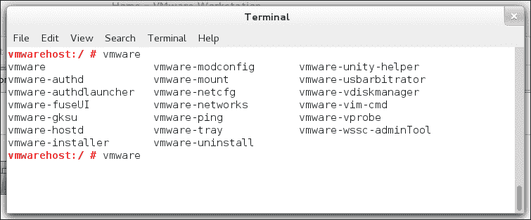

# 第四章：VMware Workstation 背后的秘密

在前几章中，你已经学习了如何安装和使用 VMware Workstation。在本章中，你将深入了解 VMware 主机计算机发生了什么，虚拟机创建期间都做了哪些操作。你将查看已创建的配置文件以及相关的磁盘文件。你还将学习在将 VMware 磁盘文件移动到其他计算机时需要做什么。此外，我们还将讨论在 VMware Workstation 环境中可以使用的不同存储类型。

# 理解 VMware Workstation 文件

你将手动更改大部分虚拟机使用的配置参数。然而，在某些情况下，理解虚拟机背后使用的文件是非常有用的。以下是一些不同类型的文件：

+   VMware Workstation 程序文件

+   VMware Workstation 虚拟机定义文件

+   VMware Workstation 磁盘文件

在接下来的章节中，将讨论这些不同的文件。

## VMware Workstation 程序文件和服务

在 VMware Workstation 安装后，一些程序文件将被复制到你的计算机上。此外，主机计算机会运行一些服务，以便你使用 VMware Workstation 及其相关服务，如网络服务。本节提供了最重要的程序文件和服务的概述。

### Windows 主机上的程序文件

大多数情况下，你不会对在 Windows 主机的 `directory \Program Files (x86)\VMware\VMware Workstation` 目录下找到的 VMware Workstation 程序文件做太多操作。在这个目录中，你将找到组成 VMware Workstation 的不同二进制文件以及在安装 VMware Tools 时用于虚拟机的 ISO 文件。

此目录中还安装了一些辅助程序，具体包括以下内容：

+   `vmware`：这是 VMware Workstation 的二进制文件。你将启动这个程序来访问 VMware Workstation。

+   `vmplayer`：这是 VMware Workstation 的免费“轻量版”。你将错过一些高级功能，但它允许你创建并运行虚拟机。

+   `vmnetconfig`：这是用于在 VMware 中创建网络的工具。你将在本书的第五章，*VMware Workstation 网络*中阅读更多关于此的内容。

### Linux 主机上的程序文件

如果你在 Linux 上使用 VMware Workstation，你可以使用更多的工具。要查看所有这些工具的概览，可以打开一个 Linux 根用户 shell 提示符并输入 `vmware[Tab][Tab]`。这将显示所有可用的 VMware 工具。



显示 Linux 上的 VMware 管理工具

以下是所有有用的 VMware 命令行工具列表，并简要说明了你可以用这些命令做什么：

+   `vmware-hostd`：这个命令与在 Linux 机器上运行的 VMware 服务进行交互。使用该命令可以自动启动所有应该自动启动的虚拟机（`-a`），或自动升级所有旧版虚拟机。

+   `vmware-mount`：这是一个非常有用的命令，帮助你挂载虚拟磁盘镜像文件，并直接从虚拟磁盘中获取信息。如果由于某种原因你无法启动相关的虚拟机，这个命令会非常有帮助。

+   `vmware-networks`：这个命令用于从命令行管理 VMware 网络。在第五章中，*网络 VMware Workstation*详细介绍了网络内容，你可以进一步了解如何使用这个命令。

+   `vmware-usbarbitrator`：这个命令帮助你分析 USB 密钥在 VMware 环境中的管理方式。使用这个命令可以排查那些无法在虚拟机中工作的 USB 密钥。特别有用的是（`-info`）选项，它会显示关于附加到主机和虚拟机上的 USB 密钥的日志信息。

+   `vmware-vdiskmanaager`：这个命令行工具允许你在虚拟机外部管理 VMware 虚拟磁盘。在本章后续部分，你可以阅读如何使用该命令来操作虚拟磁盘属性。

### VMware 服务

安装 VMware Workstation 后，主机计算机还会运行几个 VMware 服务。所有服务的概览和简短描述如下：

+   **VMware-hostd 服务**：这是 VMware Workstation 的服务。它允许 VMware Workstation 在你的计算机上运行，并使你能够建立远程连接到 VMware Workstation 实例。

+   **VMware 授权服务**：这个服务帮助虚拟机获得访问主机操作系统的适当权限。如果该服务没有运行，虚拟机在启动时会报错。如果服务正在运行，则没有问题。

+   **VMware NAT 服务**：这个服务用于 VMware 网络中，使虚拟机能够通过 NAT 进行访问。如果你使用带有 NAT 的虚拟网络，请确保该服务正在运行。

+   **VMware USB 仲裁服务**：USB 设备不能同时在虚拟机和主机操作系统中使用。这就是 VMware USB 仲裁服务的作用；它确保 USB 设备要么在虚拟机中可用，要么在主机中可用，但不能同时在两者中使用。

+   **VMware VMnet DHCP 服务**：这个服务在虚拟网络上运行 DHCP。如果你的虚拟机配置为从 DHCP 服务获取 IP 地址，请确保该服务正在运行。

# 使用 VMware Workstation 文件

在虚拟机安装完成后，不同的文件会被复制到主机计算机中。在 Linux 中，这些文件默认存储在创建文件的用户的主目录下创建的`vmware`文件夹中。在 Windows 中，`Documents`文件夹下会创建一个名为`Virtual Machines`的文件夹。该文件夹包含完整的虚拟机配置。

虚拟机的主要配置文件在`.vmx`文件中。与之关联的是`.vmxf`文件，其中列出了使用的虚拟硬件版本。然后是`.log`文件，包含与虚拟机相关的日志信息，作为虚拟机文件的最后一部分，还有`.vmdk`文件，它们作为虚拟机中的虚拟磁盘使用。还会有关联文件，这些文件用于表示虚拟机的当前状态，虽然它们不如其他文件重要。

然而，一个可能相关的文件类型是`.lck`文件。这个锁文件表示虚拟机正在使用中。在某些情况下，虚拟机关闭后，锁文件可能没有正确移除。如果出现这种情况（通常表现为机器拒绝启动，并抱怨`.lck`文件），你可以删除`.lck`文件，以重新启用虚拟机的启动。

## VMware Workstation 虚拟机定义文件

对于每个你创建的虚拟机，都会生成一个`.vmx`文件。虚拟机的设置存储在这个文件中，在某些情况下，你需要修改`.vmx`文件中的设置，因为它们在图形管理界面中不可用。在以下的代码清单中，你可以看到在 Linux 主机上创建的虚拟机的`.vmx`文件（为了更好的可读性，部分行已被删除）：

```
vmwarehost:/home/user/vmware/OpenSUSE 64-bit # cat OpenSUSE\ 64-bit.vmx
#!/usr/bin/vmware
.encoding = "UTF-8"
config.version = "8"
virtualHW.version = "9"
vcpu.hotadd = "TRUE"
scsi0.present = "TRUE"
scsi0.virtualDev = "lsilogic"
memsize = "768"
mem.hotadd = "TRUE"
scsi0:0.present = "TRUE"
scsi0:0.fileName = "OpenSUSE 64-bit.vmdk"
ide0:0.present = "TRUE"
ide0:0.fileName = "auto detect"
ide0:0.deviceType = "cdrom-raw"
ethernet0.present = "TRUE"
ethernet0.connectionType = "nat"
ethernet0.virtualDev = "e1000"
ethernet0.wakeOnPcktRcv = "FALSE"
ethernet0.addressType = "generated"
usb.present = "TRUE"
ehci.present = "TRUE"
ehci.pciSlotNumber = "35"
sound.present = "TRUE"
sound.startConnected = "FALSE"
sound.fileName = "-1"
sound.autodetect = "TRUE"
usb.vbluetooth.startConnected = "TRUE"
displayName = "OpenSUSE 64-bit"
guestOS = "opensuse-64"
nvram = "OpenSUSE 64-bit.nvram"
scsi0.pciSlotNumber = "16"
ethernet0.generatedAddress = "00:0c:29:f6:5e:ae"
ethernet0.pciSlotNumber = "33"
ethernet0.generatedAddressOffset = "0"
tools.remindInstall = "FALSE"
vmotion.checkpointFBSize = "134217728"
softPowerOff = "FALSE"
usb:0.deviceType = "hid"
usb:0.port = "0"
usb:0.parent = "-1"
usb:1.speed = "2"
usb:1.deviceType = "hub"
usb:1.port = "1"
usb:1.parent = "-1"
vmx.onpoweronkeys = "1"
floppy0.autodetect = "TRUE"
vmx.onpoweron0.key = "ide0:0.present"
vmx.onpoweron0.value = "FALSE"
ide0:0.autodetect = "TRUE"
ide1:0.autodetect = "TRUE"
vmwarehost:/home/user/vmware/OpenSUSE 64-bit #
```

如你所见，虚拟机的整个配置都在`.vmx`文件中指定。你还可以看到，它包含了一些从 VMware 图形管理界面中不容易访问的硬件设置。只要确保使用正确的语法，你可以通过编辑器更改该文件中的设置。

你可能想要修改`.vmx`文件内容的一个例子是在将虚拟机复制到另一台主机后。如果这样做，另一台主机将使用相同的 MAC 地址。要更改 MAC 地址，只需在编辑器中打开`.vmx`文件，选择`ethernet0.generatedAddress`参数的值。这样做时，要确保虚拟机没有在运行中，否则当你关闭虚拟机时，设置将被覆盖。

## VMware Workstation 磁盘文件

在 VMware Workstation 中，默认情况下，文件用于表示虚拟机中的磁盘。你可以在虚拟机目录中找到这些文件，并通过`.vmdk`扩展名轻松识别它们。

默认情况下，创建虚拟机时会创建多个磁盘文件。对于使用大磁盘的虚拟机，你可能会发现有几十个磁盘文件。这是为了确保虚拟机文件可以在任何文件系统上使用，即使是像 FAT32 这样磁盘大小受限的文件系统。正如之前讨论的那样，如果你事先知道虚拟机永远不会在有限的文件系统上使用，那么为每个虚拟机创建一个大磁盘文件会更好。

当加载使用多个虚拟机磁盘文件的虚拟机的磁盘时，首先会读取不包含数字的`.vmdk`文件（如`s0001.vmdk`）。该文件包含了虚拟机使用的所有其他`.vmdk`文件的列表，以及一些其他的元数据。以下代码列出了主`.vmdk`文件的部分内容：

```
vmwarehost:/home/user/vmware/OpenSUSE 64-bit # cat OpenSUSE\ 64-bit.vmdk
# Disk DescriptorFile
version=1
encoding="UTF-8"
CID=bb3b482f
parentCID=ffffffff
isNativeSnapshot="no"
createType="twoGbMaxExtentSparse"

# Extent description
RW 4192256 SPARSE "OpenSUSE 64-bit-s001.vmdk"
RW 4192256 SPARSE "OpenSUSE 64-bit-s002.vmdk"
RW 4192256 SPARSE "OpenSUSE 64-bit-s003.vmdk"
RW 4192256 SPARSE "OpenSUSE 64-bit-s004.vmdk"
RW 4192256 SPARSE "OpenSUSE 64-bit-s005.vmdk"
RW 4192256 SPARSE "OpenSUSE 64-bit-s006.vmdk"
RW 4192256 SPARSE "OpenSUSE 64-bit-s007.vmdk"
RW 4192256 SPARSE "OpenSUSE 64-bit-s008.vmdk"
RW 4192256 SPARSE "OpenSUSE 64-bit-s009.vmdk"
RW 4192256 SPARSE "OpenSUSE 64-bit-s010.vmdk"
RW 20480 SPARSE "OpenSUSE 64-bit-s011.vmdk"

# The Disk Data Base
#DDB

ddb.toolsVersion = "9282"
ddb.adapterType = "lsilogic"
ddb.geometry.sectors = "63"
ddb.geometry.heads = "255"
ddb.geometry.cylinders = "2610"
ddb.uuid = "60 00 C2 97 7d 00 44 2b-53 6d e1 38 f2 fd fc 4b"
ddb.longContentID = "454b171cf307254b174a0264bb3b482f"
ddb.virtualHWVersion = "9"
vmwarehost:/home/user/vmware/OpenSUSE 64-bit #
```

如你所见，磁盘几何信息也包含在主`.vmdk`文件中；这使得任何能够理解 VMDK 文件的工具都能读取磁盘文件的内容并访问其数据。这在迁移场景中非常有用，特别是在你想将 VMware 创建的虚拟机导入到其他虚拟化平台时。

# 配置高级存储

在 VMware Workstation 虚拟机中，你有很多选项可以操作虚拟机磁盘。以下部分将讨论一些最常见的高级场景，包括在虚拟机中使用原始设备作为磁盘、从 Linux 主机操作系统挂载虚拟机磁盘文件以及更改虚拟磁盘的一些属性。

## 使用设备作为虚拟机磁盘

当创建虚拟机时，虚拟机会默认使用虚拟机磁盘文件。在某些情况下，使用原始设备而非虚拟机磁盘文件可能更为合适，尤其是在性能较为重要时。由于 VMware Workstation 总是使用主机操作系统上的文件系统，因此会造成一些延迟。直接在原始设备上写入时，可以避免这个延迟。但使用原始设备意味着在安装之前需要准备好该设备。

如果你使用的是 Windows 作为主机操作系统，这意味着你需要在安装主机操作系统后准备好硬盘，使其有可用的未分配磁盘空间。或者，你可以将一块新的专用磁盘连接到主机计算机，并将其用作虚拟机中的磁盘。

如果你使用的是 Linux 作为主机操作系统，你可以使用逻辑卷（LVM）。在基于 LVM 的 Linux 系统上，为每个虚拟机创建一个 LVM 逻辑卷相对容易。有关如何创建 LVM 逻辑卷的建议，请参考 Linux 文档；LVM 的深入讨论超出了本书的范围。

在开始使用原始设备作为虚拟机磁盘文件存储后端之前，你应该意识到你将失去一些灵活性。除非你使用 SAN 或 NAS，否则原始设备始终与承载该设备的物理计算机关联。这意味着，将安装在物理设备上的虚拟机迁移到另一台主机计算机上会变得困难。

## 挂载虚拟磁盘文件

由于 Linux 操作系统的灵活性，一些工具仅在 Linux 主机上可用。`vmware-mount`命令就是其中之一。使用`vmware-mount`可以挂载 VMware 磁盘中的单个分区，无论磁盘是存储在`.vmdk`文件中还是原始设备上。由于 Linux 操作系统支持许多文件系统（包括 Windows 文件系统），你将能够使用`vmware-mount`挂载几乎任何内容。

### 提示

永远不要使用`vmware-mount`访问正在使用中的虚拟机磁盘。如果这样做，你可能会导致虚拟机磁盘文件无法访问。因此，请确保在执行以下操作前关闭虚拟机。

以下过程描述了挂载 VMware 磁盘文件中分区的方法：

1.  首先，你需要找出磁盘中存在的分区。要找出这一点，请使用`vmware-mount -p your-vmdkfile.vmdk`。以下代码示例展示了结果可能的样子。如你所见，你将对主 VMDK 文件使用`vmware-mount`，如下面所示：

    ```
    vmwarehost:/home/user/vmware/OpenSUSE 64-bit # ls *vmdk
    OpenSUSE 64-bit-s001.vmdk  …s005.vmdk  OpenSUSE 64-bit-s009.vmdk
    OpenSUSE 64-bit-s002.vmdk  …s006.vmdk  OpenSUSE 64-bit-s010.vmdk
    OpenSUSE 64-bit-s003.vmdk  …s007.vmdk  OpenSUSE 64-bit-s011.vmdk
    OpenSUSE 64-bit-s004.vmdk  …s008.vmdk  OpenSUSE 64-bit.vmdk
    vmwarehost:/home/user/vmware/OpenSUSE 64-bit # vmware-mount -p OpenSUSE\ 64-bit.vmdk
    Nr      Start       Size Type Id Sytem
    -- ---------- ---------- ---- -- ------------------------
     1       2048    2263040 BIOS 82 Linux swap
     2    2265088   39677952 BIOS 83 Linux
    vmwarehost:/home/user/vmware/OpenSUSE 64-bit #
    ```

1.  在前面的代码示例中，你可以看到虚拟磁盘中存在两个分区。注意分区号，因为你需要它来挂载该分区。如同之前的代码所示，只有分区号为 2 的分区包含 Linux 文件系统；这是应该挂载的分区。挂载分区意味着你需要在 Linux 主机的文件系统中使其可访问。在 Linux 中，这意味着你需要将其连接到一个目录。为此，你需要向`vmware-mount`提供一些参数：磁盘文件的路径、分区号以及 Linux 主机文件系统中的挂载点。例如，这可以是一个命令，如`vmware-mount OpenSUSE\ 64-bit.vmdk 2 /mnt`。

1.  在 Linux 主机上挂载分区后，你可以通过挂载点访问其文件，并对文件进行所需的更改。

1.  在完成挂载磁盘文件后，你也应该卸载它。最简单的方法是使用`-k`选项与`vmware-mount`命令，后跟磁盘 ID，例如`vmware-mount -k /OpenSUSE\ 64-bit.vmdk`。请注意，只有在挂载目录中没有打开的文件时，这种方法才会有效。如果你收到“目标忙碌”的警告，你也可以在 VMDK 磁盘文件上使用`vmware-mount -K`，这将强制卸载磁盘文件。

你还可以从图形菜单挂载虚拟磁盘。选择虚拟机并导航到**设置** | **硬盘** | **实用工具** | **挂载**，在图形界面中你可以挂载磁盘。

## 管理 VMware 虚拟磁盘

VMware Workstation 提供的另一个离线磁盘操作工具是`vmware-vdiskmanager`。你可以使用这个选项执行不同的任务，包括调整磁盘大小、磁盘碎片整理，或检查磁盘错误。

除了使用`vmware-vdiskmanager`，你还可以使用图形界面中的选项，通过选择虚拟机并导航到**设置** | **硬盘** | **实用工具**来操作。在图形环境中，你将找到碎片整理、扩展和压缩工具来执行上述任务。

在使用`vmware-vdiskmanager`时，最好通过`-t n`选项告诉 VMware 使用的是哪种类型的磁盘。以下磁盘类型可以进行管理：

+   `0`：一个单一的可增长磁盘

+   `1`：一个由多个 2GB 磁盘文件组成的可增长磁盘

+   `2`：一个预分配的磁盘文件

+   `3`：一个预分配的磁盘文件，分为多个 2GB 的文件

+   `4`：一个预分配的 ESX 类型磁盘文件

+   `5`：一个压缩磁盘文件

+   `6`：一个瘦配置的虚拟磁盘，用于 ESX 3.x 及以后的版本

如果你不知道需要哪种磁盘类型，可能需要的是`0`类型，它是 VMware Workstation 使用的默认类型。

一个不错的命令是`vmware-vdiskmanager -e`；它检查磁盘是否存在不一致。你应该在对虚拟磁盘文件执行任何操作之前使用此命令；以下命令将检查一个常规的 VMware Workstation 磁盘文件：

```
vmware-vdiskmanager -e -t 0 mydisk.vmdk

```

如果虚拟磁盘是本地磁盘，你有时也需要对其进行碎片整理。为此，请使用`-d`选项，如下命令所示：

```
vmware-vdiskmanager -d -t 0 mydisk.vmdk

```

另一个有用的命令是用来扩展虚拟磁盘的，这样你就可以在虚拟操作系统中获得更多可用的磁盘空间。请注意，在主机级别扩展磁盘不会扩展虚拟机中的文件系统，因此你还需要应用特定于虚拟机文件系统的指令来扩展该级别的磁盘。要扩展虚拟磁盘，你需要使用`-x`选项，以下命令将预分配的磁盘文件扩展到 40GB：

```
vmware-vdiskmanager -x 40G -t 2 mydisk.vmdk

```

`vmware-vdiskmanager`还有一些其他选项可用；`vmware-vdiskmanager`类型可以帮助你查看所有选项的完整列表。

# 总结

在本章中，你了解了 VMware Workstation 在主机操作系统中的组织方式。你学习了使用的服务和创建的配置文件，还了解了一些与虚拟磁盘管理相关的有用任务。在下一章，你将学习如何在 VMware Workstation 上设置虚拟网络。
