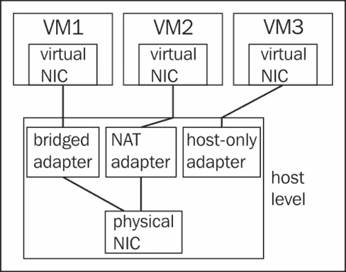
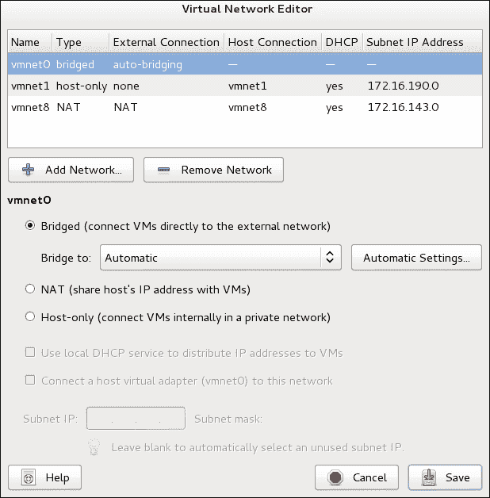
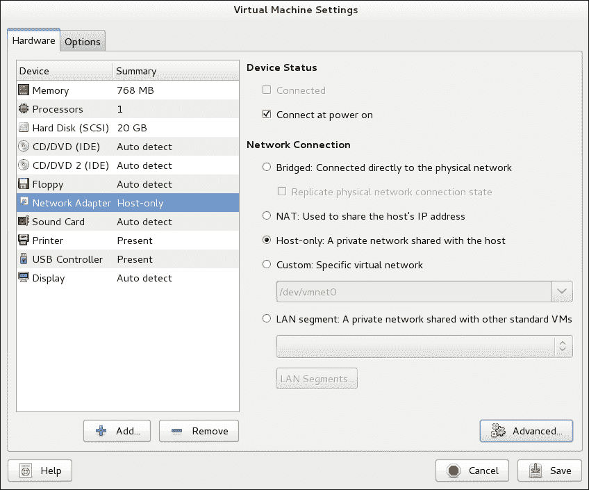
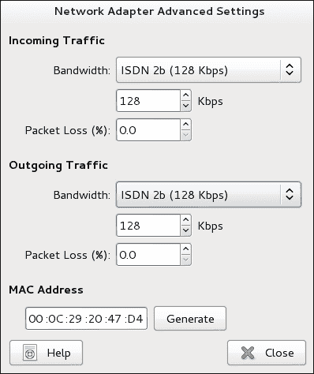
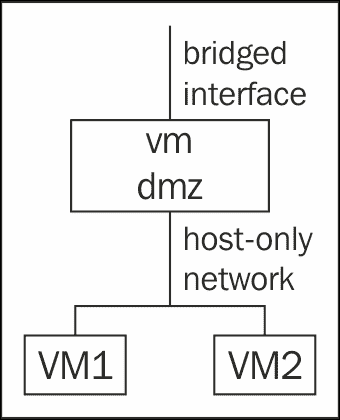

# 第五章 VMware Workstation 网络配置

如果你只是想轻松安装虚拟机，你不需要担心 VMware Workstation 的网络配置；你创建的每个虚拟机都能连接到网络上的其他计算机。如果你想设置一个测试环境，网络配置就变得非常重要。在某些情况下，你需要将虚拟机置于隔离网络中，而在其他情况下，你可能需要在虚拟机中使用多个网络接口。本章将向你介绍如何设置 VMware Workstation 网络的不同场景。

# 使用不同的网络模式

如果你正在将 VMware Workstation 环境配置为测试环境，你需要配置适当的网络。在某些情况下，你希望虚拟机能够像正常机器一样直接连接到物理网络。在其他情况下，你可能没有可用的 IP 地址来直接连接每个虚拟机到物理网络。而在其他情况下，你可能需要设置一个完全隔离的 VMware 网络。在接下来的部分中，你将学习如何在 VMware Workstation 中实现这些不同的场景。为了应对这些不同的网络配置需求，VMware Workstation 提供了以下网络选项：

+   桥接模式

+   NAT

+   主机仅限

+   自定义

你可以在选定的虚拟机的网络设置中找到这些选项，也可以在**网络首选项**菜单中找到它们。此外，还有一个选项，**局域网段**，允许你在局域网（LAN）中定义特定的网络段。对于带宽管理等高级功能，你可以在**网络设置**中使用**高级**选项。

在配置虚拟网络时需要注意的一个重要点是，每个虚拟网络都需要在主机级别表示为一个网络接口。这个主机级网络接口允许虚拟机与外部网络、其他虚拟机通信，并且在需要的情况下，还可以与主机本身的 IP 栈进行通信。下图展示了该配置的示意图：



虚拟网络示意图概述

## 使用桥接网络

如果你希望虚拟机直接连接到网络，你需要使用桥接网络。在桥接网络中，每个虚拟机都有自己的 IP 地址，并且该 IP 地址应该符合物理网络中的 IP 地址规划。这是因为在桥接模式下，你需要能够从网络中的每个节点直接访问每个节点，无论是物理主机还是虚拟主机。

在桥接网络中，VMware 在主机级别创建的网络适配器不会进行任何过滤。它只是以桥接模式工作，这意味着它通过多个虚拟接口同时安排流量通过一个物理接口发送。设置虚拟机为桥接模式时，你需要确保虚拟机的 IP 地址与物理网络中正在使用的 IP 地址相匹配。

桥接网络选项的特别方法是复制物理网络连接。你可以在所选虚拟机的网络设置中找到此选项。使用此选项时，虚拟机会复制网络适配器的精确状态。

## 使用 NAT 网络

默认的网络模式是 NAT（网络地址转换）。在 NAT 模式下，虚拟机使用的是与物理网络中的 IP 子网不同的 IP 地址。VMware 网络适配器充当 NAT 网络适配器。这意味着它会转换所有从虚拟主机发送出去的数据包，并将其 IP 地址替换为 NAT 网络适配器的 IP 地址。同时，NAT 网络适配器会跟踪所有未完成的连接，以便当虚拟主机的回应到达时，NAT 网络适配器能够将 IP 地址转换回虚拟主机的 IP 地址。

使用 NAT 网络是设置 VMware 网络的最简单方法，因此，该模式被作为默认模式使用。然而，它的缺点是虚拟机无法直接从外部访问。与此同时，这一缺点也是一种优势，因为它保护虚拟机免受安全风险的威胁。然而，由于 NAT 转换，虚拟机可以访问外部网络，并且它们可以接收对发送出去的数据包的回应。

## 使用主机专用网络

如果你想为演示目的设置一个测试网络，主机专用网络是一个有用的选择。这种网络类型创建了一个独立的网络，它不会通过自己的专用 IP 地址路由到外部网络。在创建主机专用网络时，你可以让主机参与其中，这在你希望网络完全隔离并且因此能够最大程度地便于迁移时非常有用。

主机专用网络的另一个优势是它始终有效，即使物理网络适配器没有连接。特别是在 Linux 上，如果物理网络适配器断开连接，你可能会面临整个桥接或 NAT 网络瘫痪的风险。如果使用主机专用网络，这种情况永远不会发生。

# 配置虚拟网络

要在 VMware Workstation 中配置网络，您将使用**虚拟网络编辑器**。您可以在 VMware Workstation 的**编辑**菜单中找到此工具（请参见以下截图）。默认情况下，它显示始终创建的三种网络：一个名为 `vmnet0` 的桥接网络，一个位于 `vmnet1` 的仅主机网络，以及一个位于 `vmnet8` 的 NAT 网络。对于每种网络类型，您都可以设置一些特定的属性。



指定虚拟网络属性

## 设置桥接网络属性

使用桥接网络时，您需要指定要将虚拟机桥接到的网络接口。特别是在您使用笔记本电脑并且既有 LAN 网络接口又有 Wi-Fi 接口时，这一点尤其重要。默认设置为**自动**，意味着 VMware Workstation 会尝试将虚拟机桥接到它检测到的可用网络接口。这并不总是工作良好，因此您可以指定虚拟机始终桥接到相同的网络接口，或者排除某些接口不进行自动桥接。

如果您希望选择一个特定的网络接口将虚拟机桥接到该接口，您可以从默认显示为**自动**的下拉列表中选择此接口。或者，点击**自动设置**取消选择不想用于自动桥接的接口。

对于桥接网络，无需指定一个自动分配 IP 地址的 DHCP（动态主机配置协议）服务器的属性。桥接网络上的虚拟机将能够与物理网络上的 DHCP 服务器进行通信。

## 设置仅主机网络属性

使用仅主机网络时，您可以设置一个 DHCP 服务。此服务配置为将一系列 IP 地址分配给配置为自动向 DHCP 服务器请求 IP 地址的虚拟机。默认情况下，主机仅网络已配置了一个 DHCP 服务器，并自动分配了一个 IP 地址范围。如果需要，您可以更改这些设置。

对于某些仅主机网络，您可能只希望使用固定 IP 地址。如果是这种情况，您可以关闭该网络的本地 DHCP 服务器。您需要注意设置的仅主机子网的 IP 地址。默认情况下，VMware Workstation 会为您分配一个 IP 地址，但这可能不符合您的内部网络需求，因此请确保更改该 IP 地址以符合您的内部网络要求。

另一个与仅主机网络相关的选项是将主机虚拟适配器连接到此网络。默认情况下，主机网络适配器是仅主机网络的一部分。在某些情况下，您无需包括主机适配器，如果您的环境就是这种情况，请在此关闭主机网络适配器。

## 设置 NAT 网络属性

分配给 NAT 网络接口的属性类似于仅主机网络配置。关键在于你需要决定是否在接口上运行 DHCP 服务，并且你还可以选择使用的子网 IP。如果不确定，完全可以让 VMware 为你决定，它会确保分配一个未使用的 IP 子网，这样你就能将虚拟机连接到外部网络，而无需额外配置。

要在 VMware Workstation 中使用网络，你会在主机上看到不同的新网络接口。每个接口都会被分配到 VMware 中相应的网络。在 Linux 主机上，你可以使用命令 `ip addr show` 来列出所有接口及其关联的配置。

```
vmwarehost:~ # ip addr show
1: lo: <LOOPBACK,UP,LOWER_UP> mtu 16436 qdisc noqueue state UNKNOWN
 link/loopback 00:00:00:00:00:00 brd 00:00:00:00:00:00
 inet 127.0.0.1/8 scope host lo
 inet6 ::1/128 scope host
 valid_lft forever preferred_lft forever
2: eth0: <BROADCAST,MULTICAST,UP,LOWER_UP> mtu 1500 qdisc mq state UP qlen 1000
 link/ether b8:ac:6f:c9:37:8f brd ff:ff:ff:ff:ff:ff
 inet 192.168.1.125/24 brd 192.168.1.255 scope global eth0
 inet6 fe80::baac:6fff:fec9:378f/64 scope link
 valid_lft forever preferred_lft forever
3: wlan0: <NO-CARRIER,BROADCAST,MULTICAST,UP> mtu 1500 qdisc mq state DOWN qlen 1000
 link/ether a0:88:b4:20:e9:f4 brd ff:ff:ff:ff:ff:ff
4: vmnet1: <BROADCAST,MULTICAST,UP,LOWER_UP> mtu 1500 qdisc pfifo_fast state UNKNOWN qlen 1000
 link/ether 00:50:56:c0:00:01 brd ff:ff:ff:ff:ff:ff
 inet 172.16.190.1/24 brd 172.16.190.255 scope global vmnet1
 inet6 fe80::250:56ff:fec0:1/64 scope link
 valid_lft forever preferred_lft forever
5: vmnet8: <BROADCAST,MULTICAST,UP,LOWER_UP> mtu 1500 qdisc pfifo_fast state UNKNOWN qlen 1000
 link/ether 00:50:56:c0:00:08 brd ff:ff:ff:ff:ff:ff
 inet 172.16.143.1/24 brd 172.16.143.255 scope global vmnet8
 inet6 fe80::250:56ff:fec0:8/64 scope link
 valid_lft forever preferred_lft forever

```

使用此命令来排查网络配置问题。

### 提示

**接口关闭**

当在 Linux 主机上物理网络接口关闭时，所有 VMware 网络接口也有可能随之关闭。如果你需要在 VMware Workstation 中设置一个仅需要虚拟机之间连接且不需要外部连接的测试网络，可以使用仅主机网络（host-only networking）。这种类型的网络无论外部网络接口的实际状态如何，都能始终正常工作。

## 创建你自己的虚拟网络

默认情况下，VMware Workstation 会为你提供三个虚拟网络，一个用于仅主机（host-only），一个用于桥接（bridged），一个用于 NAT 网络。有时你还需要添加其他网络。例如，如果你想为虚拟机配置两个网络接口，以便创建一个网络绑定配置，让两个网络接口提供冗余网络环境，在这种情况下，你需要设置额外的网络。

要添加额外的 NAT 或仅主机网络，没有特定要求。如果你想添加一个额外的桥接网络，必须确保有一个尚未被 VMware 桥接网络适配器使用的网络接口：每张网卡只能有一个桥接网络适配器。

以下步骤展示了如何操作：

1.  从 VMware Workstation 中，打开 **编辑** 菜单并选择虚拟网络编辑器。点击 **添加网络** 以添加一个新网络。

1.  选择 **网络名称**。默认情况下，**vmnet0**、**vmnet1** 和 **vmnet8** 已在使用，因此请选择一个尚未使用的号码。同时指定你是否要创建桥接、NAT 或仅主机网络。如果你是为虚拟机创建此网络以配置双网络接口，确保选择与之匹配的网络类型。创建你自己的虚拟网络

    创建一个新的 VMware 网络

1.  添加新接口后，点击 **保存** 以将配置写入磁盘。新的接口现在已准备好使用。

# 在虚拟机上使用高级网络属性

在虚拟机中，你可以指定如何使用网络连接。在本节中，你将学习如何操作网络适配器的高级属性，还将学习如何为一台虚拟机添加多个网卡。

## 设置虚拟机的高级网络属性

要为虚拟机的网卡指定高级设置，首先选择虚拟机的属性。接着，选择你虚拟机当前使用的**网络适配器**。这将显示所有当前的配置参数。在此界面中，你可以看到当前配置的网络连接类型，如果需要，还可以在此更改默认类型。

你会注意到，除了三种默认类型外，还有两种额外的类型可用：**自定义**和**局域网段**。你可以使用自定义网络类型来配置虚拟机使用你自己创建的网络连接。要选择该网络连接，请确保选择了相应的**vmnet**编号。另一个提供的选项是**局域网段**。这是虚拟机团队的遗留功能，该功能从 VMware Workstation 5.5 版本一直提供到 7.x 版本，但现在已经不存在了。不要配置此选项，在 VMware Workstation 9 中它已经没有用了。



选择虚拟机网络连接

对于虚拟机中的每个网络适配器，你还可以设置一些高级属性。这些属性与虚拟机网络接口的带宽和可接受的丢包率相关。你可以通过点击**高级**按钮来访问这些属性。



网络适配器高级属性

为了高效地与网络中的其他计算机和设备通信，指定网络卡上的可用带宽是有意义的。默认情况下，**带宽**设置为**无限制**，如果你使用的是快速的千兆网络，这没有问题。然而，如果你的网络速度较慢，那么将**带宽**设置为你的连接速度是有意义的。这有助于建立与显著较慢或较快机器的连接。要指定正在使用的带宽，你可以从下拉列表中选择合适的**带宽**，或手动指定以千比特每秒（kbps）为单位的**带宽**。

另一个你可能需要设置的属性是**丢包率**。一些操作系统在 VMware Workstation 中安装为虚拟机时，会显示操作系统中虚拟网卡的丢包情况。如果你使用的是 Linux 虚拟机，可以查看通过 `ifconfig` 命令显示的错误和丢包统计信息：

```
linuxguest:~ # ifconfig eth0
eth0      Link encap:Ethernet  HWaddr B8:AC:6F:C9:37:8F
 inet addr:192.168.1.125  Bcast:192.168.1.255  Mask:255.255.255.0
 inet6 addr: fe80::baac:6fff:fec9:378f/64 Scope:Link
 UP BROADCAST RUNNING MULTICAST  MTU:1500  Metric:1
 RX packets:23626 errors:8 dropped:56 overruns:0 frame:0
 TX packets:5815 errors:4 dropped:381 overruns:0 carrier:0
 collisions:0 txqueuelen:1000
 RX bytes:13922479 (13.2 Mb)  TX bytes:482931 (471.6 Kb)
 Interrupt:18

```

如果你看到大量的错误包或丢包情况，最好将虚拟机网络卡的**丢包**设置为大致丢失包的百分比。如果 VMware Workstation 知道预期会丢包，它可以帮助通知客户操作系统这一点。如果在客户操作系统中安装了 VMware Tools，错误将得到更好的处理。

你可以在虚拟机中的网络适配器上设置的最后一个属性是**MAC 地址**。默认情况下，使用随机生成的 MAC 地址作为每个网络卡的唯一标识符。如果你需要固定一个特定的 MAC 地址，你可以在此进行设置。

## 在虚拟机中使用多个网络卡

如果在你的虚拟配置中，你想测试安装一个服务器，你可能希望为其配置多个网络卡，以便实验一些高级服务器功能，如 DMZ 配置或网络绑定。在你能够在客户机操作系统中配置网络卡之前，你需要将网络卡呈现给虚拟机。这并不难做到，但在开始之前，明确你需要什么是非常重要的：

+   如果你需要使用高级安全设置进行测试，例如，将虚拟机配置为 DMZ 中的主机，虚拟机应该有一个网络接口连接到外部网络，最好使用桥接网络卡。另一个网络卡应连接到仅主机网络，与表示内部网络的其他虚拟机共享。

+   如果你想测试绑定配置，其中不同的网络卡连接在一起，必须确保你希望在绑定中连接的两个网络接口处于相同类型的网络中。如果你想在桥接配置中绑定接口，每个虚拟网络卡需要一个物理设备。

    虚拟 DMZ 概述

在之前讨论的配置中，绑定配置无疑是最复杂的一种。这是因为绑定从来不是孤立的；如果你想在虚拟机中设置绑定，至少需要在虚拟网络中设置另一个节点来进行绑定。你还可以在虚拟机与主机操作系统之间设置绑定。要做到这一点，请按照主机操作系统的指示设置绑定设备。VMware Workstation 不提供虚拟交换机配置的高级选项，因此你不能在 VMware Workstation 中定义绑定。

如果你使用 VMware Workstation 创建一个测试环境，并希望将其导入到 vSphere 中，你应该了解 VMware Workstation 的限制。如前所述，VMware Workstation 不提供任何虚拟交换机配置选项，因此你需要在虚拟机导入到 vSphere 后再进行这些功能的测试。

# 总结

网络设置是 VMware Workstation 中搭建测试环境的一个重要部分。在本章中，你已学习了如何设置虚拟网络测试环境，使用桥接、仅主机和 NAT 网络接口。你还学习了如何在已创建的虚拟机上设置虚拟网卡的高级功能。在下一章中，你将学习如何远程访问 VMware Workstation 及其运行的虚拟机。
