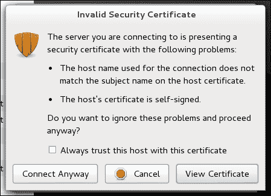
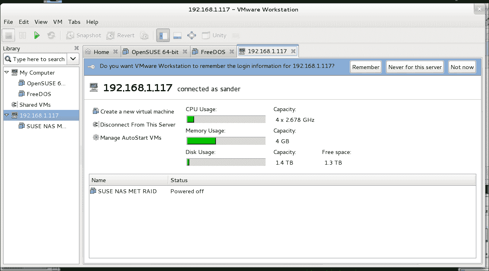
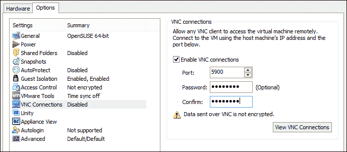
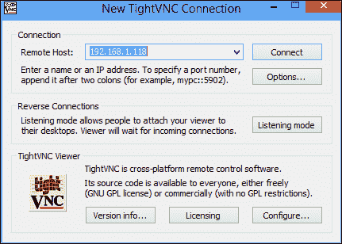
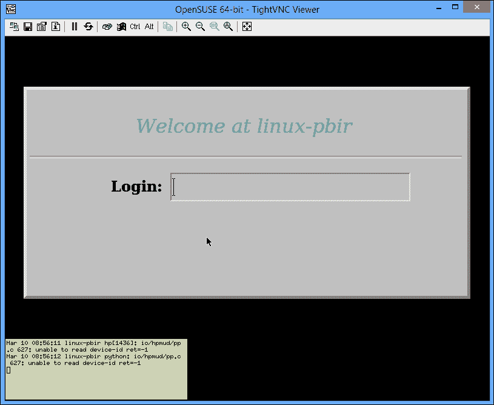

# 第六章。远程访问虚拟机

在设置一个严谨的测试环境时，使机器可以远程访问可能会非常有用。即使你在自己的计算机上使用 VMware Workstation，也有多种方式可以实现这一目标。在本章中，你将学习如何使用 VNC、VMware Web 服务以及在各个机器上启用 VNC 来远程访问虚拟机。

如果你运行的是一个包含多个虚拟机的大型测试环境，启用远程访问会非常有用。通常来说，有三种不同的方法来实现这一点：

+   第一种方法是使用 VMware Web 服务。这种方法可以让你以简便的方式启用对你托管的所有虚拟机的访问。

+   第二种方法是在各个虚拟机上启用 VNC 远程访问。

+   第三种方法是使用外部解决方案，如 TeamViewer，这样可以远程访问主机计算机以及运行在其上的所有内容。如果主机计算机只运行 VMware，这个方法非常有效。

# 使用 VMware Web 服务设置共享机器

VMware Web 服务是一种轻松方便的方式，可以与其他用户共享机器。要使用这个解决方案，你需要设置共享机器，但最好创建一个专用的用户账户来共享虚拟机，这样可以防止远程用户访问你计算机上的文件。然而，请注意，没有管理员权限的普通用户账户将无法访问其他用户的虚拟机。管理员用户至少可以浏览其他用户创建的虚拟机。为 VMware Workstation 设置一个专用账户，并从该账户共享所有虚拟机要容易得多。这避免了你必须给其他用户过多访问权限的问题。

## 共享虚拟机和用户账户

要使用 VMware 共享虚拟机，你需要在存放共享虚拟机的计算机上拥有一个用户账户。这意味着，在设置共享虚拟机之前，你必须创建这些用户账户——除非你希望远程用户使用你自己的用户名和密码连接。

### 创建 Windows 用户账户

如果你在使用 Active Directory 的企业环境中工作，所有用户账户可能已经可用。如果你在 Windows 8 计算机上运行 VMware Workstation，你需要自行设置一个用户账户。为此，启动 PC 设置应用程序并点击**用户**。在这里，选择**添加用户**并按照向导的提示完成所有创建用户所需的步骤。你不需要授予用户管理员权限，只需创建用户账户并分配一个密码。

### 创建 Linux 用户账户

要创建一个 Linux 用户账户，请打开终端窗口，并确保您具有 root 权限。要提升权限到 root 级别，请使用 `sudo so` 命令并输入 root 密码。接下来，键入 `useradd -m username`。这会将新用户账户添加到您的计算机中。要为该用户设置密码，仍以 root 身份，输入 `passwd` 命令并两次输入新密码。

## 共享虚拟机

启用共享虚拟机最简单的方式可能是使用 VMware 集成功能。这样，您可以在主机的操作系统上运行一个 web 服务，从而访问该主机上的所有虚拟机。启用 VMware Workstation Server 从您想要提供访问的虚拟机开始。您首先需要共享该虚拟机，然后可以设置工作站的服务器属性。以下过程描述了这一操作的步骤：

1.  右键点击您想要共享的虚拟机。选择 **管理** 菜单，然后点击 **共享**。

1.  要为选定的虚拟机启用共享，您需要将其放置在共享虚拟机的目录中。您可以通过移动虚拟机，或者制作虚拟机的完整克隆来实现。如果选择后者，您基本上会制作虚拟机的完整副本，这意味着克隆的虚拟机将成为独立的机器。如果您选择移动虚拟机，那只是物理位置的移动。您在 VMware Workstation 界面中不会感知到它的变化；这只是一个保护措施。与克隆虚拟机相比，移动虚拟机的好处是，您将继续使用同一台虚拟机。共享虚拟机

    要共享虚拟机，必须使其支持远程访问。

1.  共享之后，您将在 VMware Workstation 中看到一个名为 **共享虚拟机** 的新文件夹。您还会注意到，虚拟机仍然可以从 `我的电脑` 文件夹访问。

## 访问共享的虚拟机

从远程计算机访问共享的虚拟机并不困难。以下过程描述了您如何操作：

1.  要从另一台运行 VMware Workstation 9 的计算机访问共享的虚拟机，您可以从 **文件** 菜单中选择 **连接到服务器** 选项。输入共享虚拟机的计算机名称或 IP 地址，并输入用户名和密码以访问共享的虚拟机。

1.  在此时，您可能会看到安全证书警告。此警告通常是因为远程虚拟机未在公司网络中注册，这没问题；只需忽略警告并点击**无论如何连接**。为了防止此警告再次出现，您可以选择**始终信任此主机的此证书**选项。

1.  在成功通过身份验证连接到远程计算机后，远程计算机将被添加到您的 VMware Workstation 视图中，包括所有正在运行的共享虚拟机。如果您计划频繁使用共享虚拟机，建议在弹出的对话框中点击**记住**，这样下次启动 VMware Workstation 时，您将看到这些虚拟机（前提是远程计算机可用）。

    访问远程共享虚拟机

# 使用 VNC 进行远程虚拟机访问

在上一节中，您已经学会了如何在 VMware 中创建共享虚拟机。如果您想与其他也在使用 VMware 的用户共享虚拟机，这个选项很有用。另一方面，如果您要从不运行 VMware 的远程计算机访问共享虚拟机，这种方法将不起作用，您需要其他解决方案。**VNC**可能是一个不错的选择。

VNC 是一种通用协议，您可以在任何操作系统上使用它来提供远程访问。它适用于物理计算机和虚拟机。要为虚拟机启用 VNC 访问，您可以按照特定操作系统的设置程序进行操作。或者，您还可以使用 VMware Workstation 的虚拟机选项来启用 VNC 访问。在本节中，您将学习如何使用 VNC 配置 VMware Workstation。

在开始配置虚拟机上的 VNC 之前，您应考虑其他选择。如果您想连接到远程图形桌面，VNC 是一个不错的选择，但如果您想访问仅运行在控制台模式下的虚拟机，则不需要它。在这种情况下，请使用 SSH 或任何其他基于控制台的虚拟机访问方法。这些方法设置更简单，也更安全。

## 在虚拟机上启用 VNC 访问

要启用虚拟机的 VNC 访问，你需要打开虚拟机的属性。首先，选择虚拟机并导航到**VM** | **设置**。接下来，打开**选项**标签页。在该标签页中，点击**VNC 连接**。当前状态应该设置为**禁用**。点击**启用**以为虚拟机打开 VNC 访问，并选择你要使用的端口。每台虚拟机都需要一个专用的端口分配。对于你第一次通过 VNC 共享的虚拟机，默认端口 5900 就足够了。不过，所有后续的虚拟机需要分配专用端口，因此第二台虚拟机请选择端口 5901，第三台选择端口 5902，以此类推。为了增加一些额外的保护，你还可以设置一个密码。接下来，点击**确定**以保存设置。

启用虚拟机的 VNC 访问

## 使用 VNC 远程连接虚拟机

要建立与通过 VNC 共享的虚拟机的远程连接，你需要一个 VNC Viewer。你可以在[www.tightvnc.com/download.php](http://www.tightvnc.com/download.php)下载免费的 VNC Viewer。下载后，运行安装程序。无需进行复杂操作，只需选择默认设置。安装程序会提供一个 VNC Viewer 和一个 VNC 服务。你可以使用 VNC 服务来提供远程访问计算机的桌面。虽然连接远程计算机上的单个虚拟机时不需要这个服务，但请确保为服务设置密码，以防止未经授权的使用。

安装完成后，你需要 TightVNC Viewer 来访问启用了 VNC 的虚拟机。在远程主机框中，输入承载 VNC 共享虚拟机的计算机的 IP 地址。接下来，输入端口分配。对于你想连接的第一台虚拟机，可以使用默认端口 5900；如果你想连接其他虚拟机，则需要将端口添加到 IP 地址中，如`192.168.1.117:5901`，然后点击**连接**。如果你为 VNC 访问设置了密码，现在请输入密码并点击**确定**。你现在应该能够连接到虚拟机。

连接到启用了 VNC 的虚拟机

一旦你与启用了 VNC 的虚拟机建立了远程连接，你可能需要使用某些特定的按钮或键序列。在 VNC Viewer 窗口的顶部，你将看到一个按钮栏。在这个栏中，你可以找到一些常用的功能键，它们可以在虚拟机内使用。这些包括在虚拟机和主机操作系统中都有特殊功能的所有键，例如*Ctrl*、*Alt*和*Ctrl + Alt + Del*。如果你需要在虚拟机内使用这些键，可以使用这些按钮。

完成 VNC 会话工作后，你可以直接关闭 VNC Viewer 窗口。由于远程计算机在其他地方运行，唯一需要做的就是断开会话。

# 通过防火墙使用 TeamViewer 进行远程访问

迄今为止讨论的解决方案是由 VMware Workstation 提供的，只要你不在 NAT 路由器后面，它们就能正常工作。NAT 路由器通常保护内部网络上的机器，这意味着外部的人无法访问它们。如果你想与外部网络的用户共享虚拟机或其内容，TeamViewer 提供了一个不错的解决方案。

TeamViewer（[www.teamviewer.com](http://www.teamviewer.com)）由一个你在需要提供访问权限的计算机上运行的代理和一个客户端程序组成。只要是用于个人用途，两个组件都可以免费使用。在 VMware 环境中，你可以在虚拟机和主机操作系统中都运行 TeamViewer 代理。

## 安装 TeamViewer 代理

使用 TeamViewer 最灵活的方式是将 TeamViewer 代理安装在主机计算机上。这意味着远程用户将完全访问整个主机，从而可以启动 VMware Workstation 并在 VMware Workstation 内运行虚拟机。如果这种方案对你来说有些不安全，你还可以将 TeamViewer 代理安装在一个或多个虚拟机中，以提供对这些特定虚拟机的访问。以下过程描述了它是如何工作的：

1.  访问 [www.teamviewer.com/en/download](http://www.teamviewer.com/en/download) 下载 TeamViewer 主机版。

1.  运行安装向导并按照所有提示操作。安装完成后，TeamViewer 主机程序将显示一个用户 ID。将此 ID 提供给需要远程访问你的主机或虚拟机的任何人。

## 使用 TeamViewer 客户端

在需要访问虚拟机的远程客户端上，你需要安装 TeamViewer 完整版。你可以从 [www.teamviewer.com](http://www.teamviewer.com) 免费下载此版本。将 TeamViewer 完整版安装到你的计算机上，并接受安装向导推荐的默认值。

安装完成后，TeamViewer 会显示一个选项来访问远程计算机。要使用此选项，你需要输入由 TeamViewer 主机代理提供的远程会话 ID。输入它并点击 **连接**，合作伙伴将建立会话。现在你将完全访问远程机器。

# 从平板电脑和移动设备访问 VMware Workstation

与 VMware ESXi 不同，iPad、Android 或 Windows 上并没有用于轻松远程访问 VMware Workstation 的应用程序。不过，这并不意味着您没有其他选择；平板电脑上有 VNC 客户端，同时也有 TeamViewer 客户端，允许您远程访问 VMware Workstation 虚拟机或主机。因此，从平板电脑访问 VMware Workstation 虚拟机与从常规计算机访问虚拟机没有太大区别。只需安装 VNC 客户端或 TeamViewer 客户端，并按照本章前面描述的步骤操作即可。

# 摘要

在本章中，您已经学习了如何共享虚拟机并启用远程访问。您了解到，有许多方法可以远程访问虚拟机，包括 VNC Viewer、TeamViewer 和 VMware Workstation 共享虚拟机功能。

在下一章中，您将学习如何转换和导入虚拟机。
