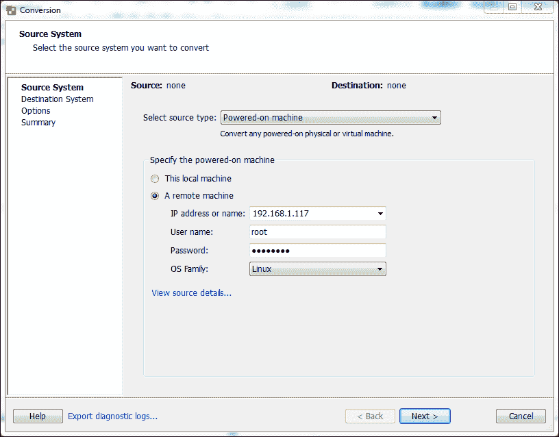
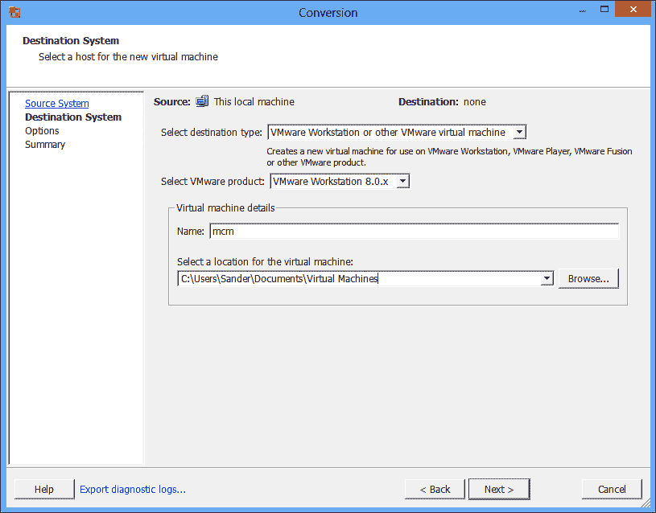
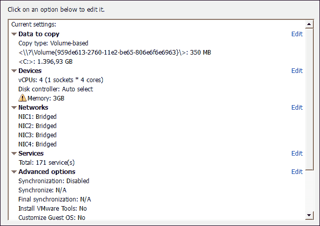
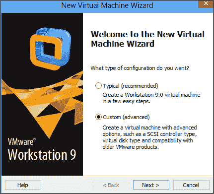
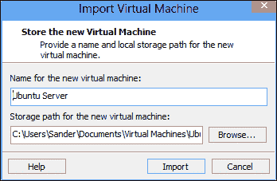
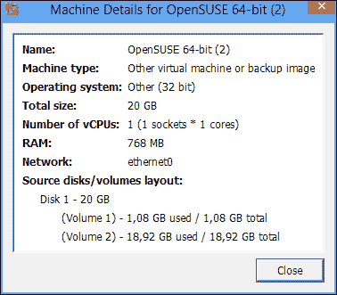
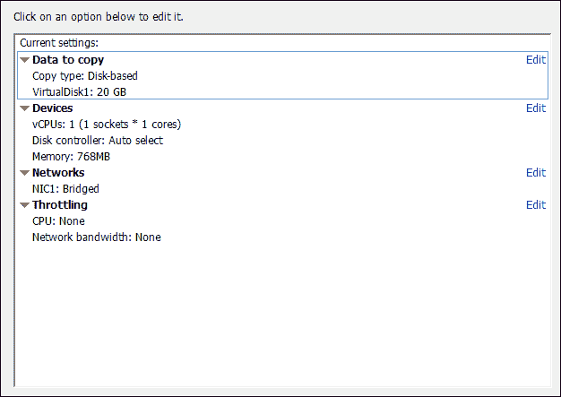

# 第七章 转换虚拟机

使用虚拟化的主要优势之一是迁移机器的便捷性。在 VMware Workstation 中，您可以同时使用物理到虚拟（P2V）迁移以及虚拟到虚拟迁移，这使得您能够导入在其他地方创建的虚拟机。在本章中，您将学习如何使用这两种技术。

# 将物理机器转换为 VMware Workstation

要将物理机器转换为虚拟机，您需要 vCenter Converter Standalone。此产品是免费的，您可以从 VMware Workstation 9 或任何更高版本轻松安装它。然而，您需要注意一些限制，例如：

+   VMware Converter Standalone 仅在 Windows 上运行，因此无法将运行在 Linux 计算机上的虚拟机转换。

+   VMware Converter Standalone 在 VMware Workstation 环境中不支持远程转换。

+   要转换虚拟机，您需要在该虚拟机上安装 VMware Converter Standalone，并应用以下部分所描述的过程。

## 使用 VMware Converter 虚拟化物理 Windows 机器

要使用 VMware Converter Standalone 将运行 Windows 的物理机器转换为虚拟机，您首先需要下载并安装 VMware Converter Standalone 工具。您可以在 [www.vmware.com](http://www.vmware.com) 免费下载。

在开始进行 Windows 计算机的 P2V 转换之前，您需要关闭**用户账户控制**。以下过程描述了如何操作：

1.  打开 Windows 控制面板，选择**用户账户** | **更改用户账户控制设置**（或在 Windows 8 上选择**用户账户控制**设置应用）。

1.  将滑块移动到**从不通知**并点击**确定**。

1.  现在，您需要在 Windows 安全策略中启用**以管理员批准模式运行所有管理员**选项。为此，请按下 Windows 键 + *R* 打开**运行**窗口，并输入`secpol.msc`。

1.  选择**本地策略** | **安全策略**。

1.  选择**用户账户控制**：**以管理员批准模式运行所有管理员**并启用此选项。

1.  重启您的计算机。

    安装完成后，您可以使用**虚拟化物理机器**选项将物理机器转换为虚拟机。以下过程描述了如何从安装在您想要转换的物理计算机上的独立工具执行 P2V 虚拟化。请注意，您在 VMware Workstation **文件**菜单中找到的**虚拟化物理机器**选项无法使用。

    

    **虚拟化物理机器**选项无法使用

1.  从计算机桌面，选择**VMware vCenter Converter Stand-alone 客户端**。

1.  由于你也可以使用此工具连接到在 vCenter 环境中运行的其他计算机上的 VMware 服务器，因此你需要先选择要使用的服务器。选择连接到本地服务器还是远程服务器。选择**连接到本地服务器**选项：

    若要将虚拟机转换为 VMware Workstation，请选择连接到本地服务器

1.  在现在打开的窗口中，点击**转换机器**按钮。为了执行物理到虚拟的转换，接下来选择**已开机的机器**并选择**此本地机器**——这是在 VMware Workstation 环境中唯一可用的选项。

    连接到目标机器

1.  选择本地机器后，你需要选择目标类型。即你想将物理机器转换成的类型。确保选择 VMware Workstation 或其他 VMware 虚拟机类型作为目标类型，然后从下拉列表中选择**VMware Workstation 8.0.x**。这适用于 VMware Workstation 8.0 及更高版本。同时，选择虚拟机的名称以及你想存储虚拟机文件的位置。请注意，你将把虚拟机文件存储在本地机器上，也就是运行 VMware vCenter Converter 的机器上。

    指定目标文件格式

1.  在接下来的窗口中，你将看到一个选项窗口，你可以在其中指定物理机器的硬件在虚拟机中的表示方式。你可能会看到一些警告，指示某些选项所需的资源不足。为了确保 P2V 转换能够顺利进行，请调整物理机器的所有硬件选项，以确保这些设置在虚拟机中也能正常工作。确保至少查看以下选项：

    +   **内存：默认情况下**：虚拟机将拥有与物理机器相同的内存。你可能需要减少内存。

    +   **转换后**：转换完成后，你可能希望在虚拟机上自动安装 VMware 工具。

    

    在开始实际转换之前，确保硬件设置匹配

1.  在更改所有硬件设置后，点击**下一步**。此时会显示所有选择的参数汇总。在这个汇总窗口中，点击**完成**以开始转换。请注意，根据物理机器的大小，完成这个过程可能需要较长时间。你将看到转换任务被添加到 vCenter Converter 工具中，并显示预计完成同步过程的时间。你可以从 VMware vCenter Converter Standalone 控制台窗口监控转换过程，确保没有任何错误发生。

一旦转换过程成功完成，虚拟机的 VMDK 文件将被复制到运行 VMware Workstation 的计算机的硬盘上。下一步是将虚拟机磁盘文件导入到 VMware Workstation 计算机中。你可以在本章后面的部分了解如何操作。

## 执行将运行 Linux 的计算机从物理机转为虚拟机的操作。

尽管早期版本的 VMware 支持在 Linux 虚拟机上执行 P2V，但当前版本已不再支持。因此，你需要依赖其他解决方案来对 Linux 虚拟机进行 P2V。最简单的方式是使用纯 Linux 解决方案来更新虚拟机：你将通过 Linux 启动盘启动 Linux 机器，将所有物理磁盘转换为虚拟磁盘镜像，然后根据以下章节的说明将磁盘镜像导入到 VMware 中。

### 提示

以下步骤描述了如何在只有一块硬盘的系统上执行 Linux P2V。虽然也可以在有多块硬盘的系统上进行 P2V，但这要复杂得多，并且在此不再进一步解释。如果你理解这个步骤，你可以使用它来创建多个磁盘文件，并将这些磁盘文件导入到 VMware 中。

要执行以下步骤，你需要一个 Linux 启动盘。建议使用 Knoppix；你可以从[www.knoppix.org](http://www.knoppix.org)下载免费的 Knoppix ISO 镜像。这个 Linux 启动盘用于获取物理磁盘的镜像。接下来，你还需要一个外部硬盘来存储你将要写入的镜像。在开始之前，请确保外部硬盘有足够的可用空间；你需要在其中创建一个文件，其大小和物理机器的整个硬盘大小一样。

1.  启动你想从 Knoppix DVD 转换的物理机器。

1.  在 Knoppix 中，你将自动登录。打开一个控制台窗口并输入`sudo su`命令，这将赋予你 Linux 操作系统中的管理员（root）权限。

1.  使用`cat /proc/partitions`命令。该命令会显示当前在 Linux 操作系统上安装的磁盘和分区。你应该能看到一个名为`/dev/sda`的设备，以及一些可以识别为`/dev/sda1`、`/dev/sda2`等的分区（具体取决于计算机的安装方式）。

1.  将外部 USB 磁盘连接到计算机，并再次使用命令`cat /proc/partitions`。你会注意到一个磁盘已经被添加。这个磁盘就是外部硬盘。很可能磁盘的名称是`/dev/sdb`，并且它有一个分区，名称是`/dev/sdb1`。（如果被转换的计算机只有一个磁盘，这是很可能的。）

1.  使用命令`mount /dev/sdb1 /mnt`。这将使外部硬盘在`/mnt`目录下可访问。

1.  使用以下命令开始克隆过程：`dd if=/dev/sda of=/mnt/mydisk.img bs=1M`。每 50GB 大约需要 1 小时，根据计算机和外部磁盘的速度，这个过程可能会更长。所以最好不要等它完成。

1.  一旦过程完成，使用`umount /mnt`来卸载外部磁盘。现在你已经存储了磁盘映像文件，并可以在 VMware 中导入它。

# 执行 V2V 转换和虚拟机导入

在前面的部分中，你已经学习了如何将物理计算机转换为虚拟机。偶尔，你还需要将虚拟机文件导入到 VMware Workstation。这可能是因为你已经将 VMDK 文件从另一台计算机复制到你的 VMware Workstation 计算机，但你也可能需要这种方法来导入在其他虚拟化平台上创建的虚拟机文件。在本部分中，你将学习如何执行这两项任务。

## 将原始映像文件导入到 VMware Workstation

将原始磁盘文件转换为 VMDK 最简单的方法是使用`vmware-vdiskmanager`工具。你可以在 Linux 和 Windows 版本的 VMware 中使用此工具。以下过程演示了如何将原始磁盘文件转换为 VMDK：

1.  将包含你创建的原始磁盘文件的介质连接到计算机，并确保它可以通过驱动器字母（Windows）或文件系统挂载（Linux）访问。

1.  使用以下命令开始转换：

    ```
    vmware-vdiskmanager -r inputfile.img -t 1 outputfile.vmdk

    ```

1.  等待转换完成后，再继续进行下一部分。

## 将 VMDK 文件导入到 VMware Workstation

一旦你将源磁盘文件转换为 VMDK 格式，就可以基于 VMDK 文件创建一个新的虚拟机。这个过程或多或少与创建新虚拟机的过程相同。关键在于你开始创建一个新虚拟机，并告诉安装向导使用现有的 VMDK 文件。以下步骤演示了它的工作原理：

1.  启动 VMware Workstation，导航到**文件** | **新建虚拟机**。

1.  在被问及你想使用哪种配置时，选择**自定义**。

    在被问及你想使用哪种配置时，选择自定义

1.  当**新虚拟机向导**窗口打开时，选择**稍后安装操作系统**。

1.  指定 VMDK 文件中的客人操作系统，并自定义所有您希望使用的硬件，直到安装程序询问您想使用哪种磁盘类型为止。

1.  当询问您想使用哪个磁盘时，选择**使用现有虚拟磁盘**：

    要在 VMware Workstation 中导入 VMDK，您需要使用现有的虚拟磁盘

1.  现在，您将看到一个界面，您可以在其中浏览现有的磁盘文件。点击**浏览**按钮，并导航到磁盘文件存储的位置。如果虚拟机由多个 VMDK 文件组成，确保从列表中选择第一个 VMDK 文件。

    如果 VMDK 由多个文件组成，选择这些文件中的第一个

1.  现在，您可以通过点击**完成**来完成虚拟机创建过程。这将为您创建虚拟磁盘文件。

## 使用 OVF 将其他磁盘文件格式导入到 VMware Workstation 中

有许多磁盘文件格式可以被不同的虚拟化产品使用，其中包括以下几种：

+   **OVF**：这是**开放虚拟化格式**的缩写；它是一个通用的虚拟机磁盘文件，许多虚拟化解决方案都支持它

+   **VDI**：这是 Virtual Box 的本地磁盘格式

+   **VMDK**：这是 VMware 本地磁盘格式

+   **VHD**：这是主要用于微软环境中的虚拟硬盘格式

+   **HDD**：这是并行硬盘格式

+   **QED**：这是 QEMU 增强磁盘

+   **QCOW**：这是 QEMU 的写时复制格式

在 VMware Workstation 中，对所有这些不同的磁盘文件类型的支持并不多。然而，其他一些虚拟化解决方案提供了合理到良好的支持，可以将虚拟机导出为 VMware 可以读取的文件格式。在接下来的步骤中，您可以学习如何从 Virtual Box 导出虚拟机，以便在 VMware Workstation 中导入。

1.  在 Virtual Box 中，确保您要导出的虚拟机已关闭。

1.  在**文件**菜单中，选择**导出设备**。

1.  选择您要导出的虚拟机，然后点击**下一步**。

1.  确保虚拟机导出为`.ova`扩展名的文件。这是一个存档文件，可以包含多个 OVF 文件。指定要导出的文件名后，点击**下一步**。

1.  点击**导出**以开始导出虚拟机。

一旦您将虚拟机导出为适当的目标格式，您需要将其导入到 VMware Workstation 中。为此，在 VMware Workstation 中，点击**文件**菜单并选择**打开**。现在，浏览到您保存 OVA 文件的位置并打开它。此时将打开“导入虚拟机”对话框。在此对话框中，您可以为虚拟机输入名称和目标存储路径。提供名称和路径后，点击**导入**：



导入 OVF 文件

在首次尝试导入虚拟机时，它会失败。这是因为虚拟机文件默认情况下不符合虚拟硬件兼容性检查。如果您现在点击**重试**，导入过程将重新开始，您将成功导入虚拟机。

一旦虚拟机被导入，确保从虚拟机中卸载虚拟盒工具，并安装 VMware 工具。您刚刚导入的虚拟机现在可以使用了。

## 使用 VMware vCenter Converter 导入第三方虚拟机

除了前面章节讨论的方法外，VMware vCenter Converter 还可以帮助导入一些来自外部程序的虚拟机类型。支持不同的文件类型，如 Microsoft Virtual PC、Microsoft Hyper-V 虚拟机和并行虚拟化产品。您可以在 VMware Converter 转换窗口的第一个界面中，从**选择源类型**下拉列表中选择具体的机器类型。指定虚拟机文件的源后，您只需浏览到虚拟机文件。**浏览**窗口提供对所有受支持虚拟机文件的访问；如果您的虚拟机文件默认未列出，则不受支持。

在 VMware vCenter Converter 中启动 V2V 转换项目之前，您还可以检查虚拟机文件的内容。点击**查看源详情**，以查看所选虚拟机的**机器详情**窗口：



验证虚拟机内容

在验证虚拟机内容后，您将通过转换向导继续选择 VMware Workstation 作为目标类型，并提供虚拟机文件的名称和位置。在实际转换过程开始之前，您将看到虚拟机的属性。点击**编辑**以调整虚拟机的内容，以满足您的需求，并开始转换过程。



在开始转换之前，您可以更改虚拟机的属性。

# 总结

虚拟机转换有很多种方法，但没有“通用解决方案”。在执行物理到虚拟（P2V）或虚拟到虚拟（V2V）转换之前，您需要仔细检查所需的转换类型是否被支持。如果不支持，您可以查看日志文件以了解问题的原因。幸运的是，在 VMware 内外，几乎所有的转换都被支持。在本章中，您已经阅读了如何将 Windows 和 Linux 系统从 P2V 和 V2V 转换到 VMware。
