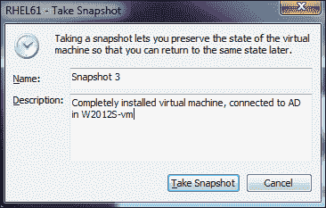
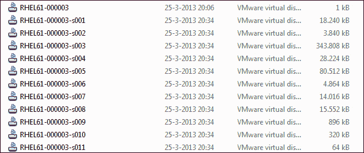
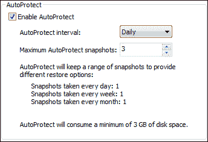
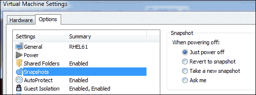
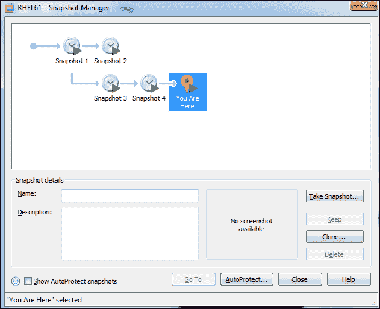
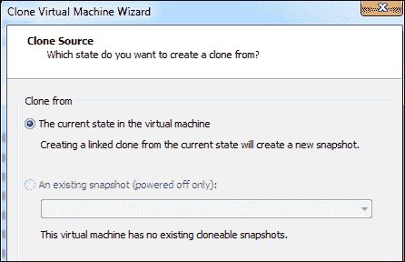
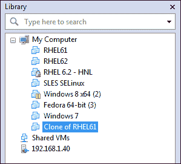
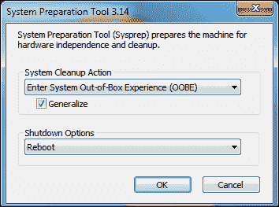
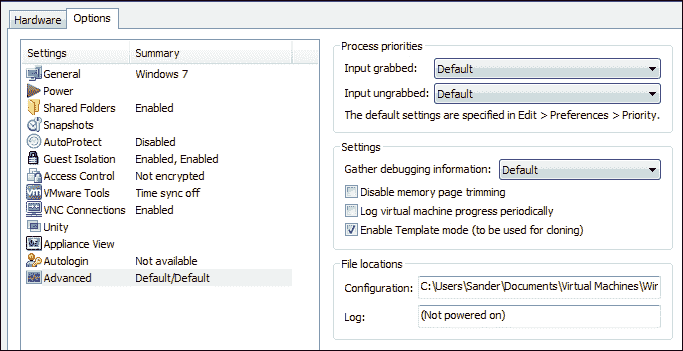
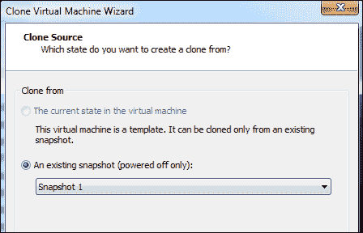

# 第八章 克隆与快照

在测试环境中，通常需要快速部署虚拟机，并且能够轻松恢复到先前的状态。VMware Workstation 提供了执行这些任务所需的所有工具。在本章中，你将学习如何使用克隆和快照工具来完成这些操作。

# 理解何时使用哪些工具

**快照**是虚拟机某一状态的照片。由于虚拟机通常需要很多工作才能达到所需的状态，因此在达到这个状态时拍摄一张快照是一个好主意。如果后续某个阶段出现问题，快照可以让你轻松恢复到虚拟机的先前状态。因此，使用快照的基本概念是使恢复到先前状态变得更容易。

**克隆**是虚拟机的副本。如果需要多个虚拟机，且每台虚拟机的配置大致相同，使用克隆非常方便。通过克隆虚拟机，你会复制机器的实际状态。创建克隆之后，你只需修改需要在该虚拟机上保持唯一的属性。

从某些方面来看，克隆和快照是密切相关的。这是因为你可以创建虚拟机快照的克隆，也可以克隆虚拟机的当前状态，这实际上会创建虚拟机的快照。要理解这一点，你需要理解联动克隆和完整克隆之间的区别。

在**联动克隆**中，只有修改内容会被存储。这意味着如果虚拟机的原始状态发生变化（例如，虚拟机文件损坏），联动克隆也会受到影响。然而，这种方式在磁盘空间的使用上非常高效。由于只有修改内容被存储在联动克隆中，因此对磁盘空间的要求最低。创建联动克隆的过程也非常快速。

**完整克隆**就像是虚拟机的完整副本。创建完整克隆的过程要长得多，因为需要复制整个虚拟机磁盘。它还需要更多的磁盘空间，但好处是完整克隆会创建一个独立的虚拟机。因此，如果你需要最大的灵活性，最好使用完整克隆。在接下来的章节中，你将学习如何使用快照和克隆。

# 使用快照

在本节中，你将学习如何创建虚拟机的快照。你还将学习如何使用快照管理器来管理使用不同快照的设置。

## 创建快照

要创建快照，你无需对虚拟机进行任何操作。无论虚拟机当前的实际状态如何，都可以创建快照，因此即使虚拟机当前处于活动状态或不活动状态，也不影响。如果虚拟机已开机，快照中还会包含虚拟机内存的当前状态。这是一个非常有用的功能，因为它可以让你返回到创建快照时虚拟机的确切状态。

要创建虚拟机的快照，首先选择虚拟机。然后，在虚拟机菜单中，导航至**快照** | **创建快照**。此时会弹出一个小对话框，允许你输入快照的简短描述。你应始终输入一些描述，因为现在也许很清楚这个快照是做什么的，但几个月后再次查看虚拟机时，你可能就不再记得它的用途了。而且，为快照提供清晰的描述，也会使你在快照管理器中更容易找到正确的快照。

为了方便日后识别快照，输入清晰的描述，说明它的用途

一旦快照过程开始，它将需要一段时间才能完成。如果已激活，你将在虚拟机窗口的左下方看到进度条。理论上，你可以继续在虚拟机中工作；但实际上，你会注意到它变得比较慢，甚至有时非常无响应。最好等一会儿，给快照过程几分钟的时间来完成。

快照的实际文件会被创建在虚拟机的 VMDK 文件所在的目录中。每个 VMDK 文件都会有一个对应的快照文件。你会注意到快照文件较小，因为它仅包含自上次创建快照以来所做的修改；或者，如果这是你第一次创建快照，它将包含与原始虚拟机的差异。

每个 VMDK 文件都会创建一个对应的快照文件

## 恢复快照

创建快照的目标是使你在任何时候都可以轻松地恢复到虚拟机的上一个状态。最简单的方法是使用**恢复到快照状态**选项，该选项可以在**虚拟机** | **快照**中找到。这个选项可以让你轻松恢复到虚拟机上最后创建的快照。恢复到之前的快照将会重置虚拟机到其先前的状态，你可以确定自那以后所做的所有更改都会丢失。此外，在恢复到快照之前的状态时，你将无法使用虚拟机，因此会失去连接。恢复到先前状态的一个更复杂的方法是使用快照管理器。

## 使用自动保护快照

一种特殊类型的快照是**自动保护快照**。这是一种每天自动创建的快照。如果您希望使用自动保护快照，必须为每个您希望使用它的虚拟机启用它。此操作不会自动进行，因为您需要磁盘空间来存储自动保护快照。使用自动保护每个虚拟机至少需要 3 GB 的存储空间。

要启用自动保护，请按照以下步骤操作：

1.  选择您希望启用自动保护的虚拟机。

1.  从虚拟机菜单中，打开**设置**项并点击**选项**标签页。

1.  在**选项**标签页中，选择**启用自动保护**并指定您希望如何使用它。 

    使用自动保护，您将启用一种自动备份计划。

使用自动保护快照时，重要的是要意识到，自动保护并不仅仅每天创建一个快照并保持几天。默认情况下，自动保护每天创建一个快照，并保持三种不同的自动保护快照：一个允许您回溯一天，一个允许您回溯一周，另一个允许您回溯一个月。您也可以让自动保护创建超过三个备份，但需要确保有足够的磁盘空间来存储所有这些快照。

## 快照与关机

使用自动保护快照有助于为虚拟机创建自动备份解决方案。创建自动快照的另一种方法是使用虚拟机关机时创建快照的选项。在**虚拟机设置**窗口的**选项**标签页中，您可以找到**快照**选项。此选项允许您使用以下功能：

+   **仅关闭**：此选项不会做任何操作，仅仅关闭虚拟机。

+   **创建新快照**：如果您希望每次关闭虚拟机时自动创建一个快照，请使用此选项。

+   **恢复到快照**：如果您不希望保留虚拟机上所做的任何修改，请使用此选项。此选项在教育环境中非常有用，您希望每次上课时虚拟机都以干净的状态启动。

+   **问我**：此选项会询问用户是否需要创建快照，或是否需要恢复到虚拟机的上一个状态。 

    在关闭虚拟机时，您可以自动恢复到之前的快照或创建一个新的快照。

## 使用快照管理器

快照管理器允许您以最灵活的方式操作快照。您可以使用它恢复到任何虚拟机状态，从那里开始，并构建一个完全不同的配置，以便您可以基于特定的快照状态创建两个开发分支，并决定哪个解决方案最适合您。

你可以通过打开你想要管理的虚拟机，并导航至**虚拟机** | **快照** | **快照管理器**来找到快照管理器。现在你会看到快照管理器，里面列出了为该虚拟机创建的所有快照。

快照管理器允许你恢复虚拟机的任何状态。

从快照管理器中操作快照其实并不难。你只需选择你想要开始的快照并恢复它（无论是否已有基于该快照创建的其他快照）。恢复后，你可以继续从所选快照的状态中工作。

默认情况下，在快照管理器中你看不到自动保护快照。即使快照管理器显示了一个选项，可以同时显示自动保护的快照，这样做可能并不是一个好主意。你通常会使用快照管理器中的快照来按系统中快照的明确定义路径进行回退。而在自动保护中，并没有明确的计划，更重要的是，快照会被自动删除。因此，你应该确保永远不要基于自动保护的快照创建新快照。

# 创建克隆

快照是虚拟机处于某一特定状态时的快照。使用快照时，仍然只有一台虚拟机可以轻松恢复到某个特定状态。克隆与快照的主要区别在于，克隆是一个独立于原始虚拟机的新虚拟机。即使快照和克隆之间存在某种关系（例如，你可以基于一个快照创建一个克隆），克隆基本上是一个新虚拟机。这意味着一旦你创建了虚拟机的克隆，你甚至可以开始为该虚拟机创建新的快照。

在创建克隆时，你确实需要认真考虑你打算如何使用它们。如果你只是为了方便自己使用，链接克隆是最佳解决方案。它创建非常快速，占用最少的磁盘空间，同时仍然提供完整的功能。然而，主要的区别在于，你永远无法将其复制为独立的虚拟机到其他计算机。如果你需要这么做，你将需要一个完整克隆。

创建克隆有不同的方法。无论你使用哪种方法，你都必须确保在进行克隆之前关闭虚拟机。这个要求的存在是因为在克隆过程中虚拟机文件不能被修改。最重要的原因是，VMware Workstation 通常运行在 Linux 主机或 Windows 平台上，这些平台的文件系统不允许不同进程同时修改虚拟机文件。如果你希望能够在不先关闭虚拟机的情况下克隆虚拟机，你需要在 VMware ESXi 环境中使用 VMFS 文件系统。

创建克隆的最直接方法是使用虚拟机菜单中的**管理**选项。在该菜单中，选择**克隆**选项以启动克隆向导。克隆向导的第一步会询问你要从哪个状态创建克隆。这可以是虚拟机的实际状态，也可以是快照（如果已创建）。如果没有合适的快照，向导会显示错误，提示无法基于选定的虚拟机创建快照克隆。

选择克隆的基础

在选择你要创建克隆的目标后，你需要选择是创建链接克隆还是完整克隆。你必须明白，完整克隆是虚拟机的完整副本，因此你需要确保宿主计算机有与虚拟机使用的磁盘空间相同的可用磁盘空间。所以，如果虚拟机使用了 60GB 的磁盘空间，你的宿主计算机也需要至少 60GB 的可用磁盘空间！

在确认你有足够的空闲磁盘空间后，可以开始克隆过程。在向导的最后一步，指定你想要分配给克隆的名称以及克隆必须存储在宿主操作系统中的位置。创建后，克隆将作为一个新的虚拟机出现在 VMware 控制台中，并且应该被视为新的虚拟机。

克隆后的虚拟机会作为一个全新的虚拟机出现在 VMware Workstation 库中

另一种创建克隆的方法是使用快照管理器。其优点是，使用快照管理器，你可以轻松选择一个你想要克隆的快照。只需选择你想使用的快照状态，然后点击**克隆**按钮。

## 克隆前的虚拟机准备

如果你正在创建 Linux 虚拟机的克隆，过程相对简单。你只需要启动克隆过程；完成后，有一些项目需要更改。你可以逐一更改这些项目。通常，在 Linux 虚拟机上，你需要确保更改以下内容，以为克隆虚拟机创建一个新的身份：

+   主机名

+   IP 地址

+   `/etc/hosts` 中该主机的条目

更改这些设置后，您需要重新启动虚拟机，以确保它能够识别新的身份。

在 Windows 上更改虚拟机的身份更为复杂。其主要原因是 Windows 授权与 Windows 虚拟机的身份绑定。为了确保您购买的 Windows 授权符合要求，您需要生成一个新的身份并为其输入新的授权码。实现这一目标的最通用方式是使用**Sysprep**；它将 Windows 重置为第一次启动时的状态。在以下部分，您将了解如何在 Windows 上使用 Sysprep 创建 Windows 虚拟机的模板。

## 在 Windows 上使用 Sysprep 创建模板

在 Windows 上，这一过程要复杂得多，因为 Windows 机器的身份不仅仅存储在几个配置文件中，它遍布整个 Windows 虚拟机。这就是为什么 Microsoft 创建了 Sysprep 工具的原因，它允许您创建虚拟机的基础镜像。通常，您可以在任何 Windows 安装中找到这个工具，路径是 `c:\Windows\System32\sysprep`。

通常情况下，您不希望在已安装了大量软件的虚拟机上运行 Sysprep。Sysprep 的目的是创建一个新的虚拟机模板；这可以让您更容易地基于 Sysprep 模板部署新的虚拟机。

在安装了基本配置的 Windows 虚拟机后，启动 Sysprep 工具，并确保选择**进入系统开箱体验（OOBE）**选项。这将使您的 Windows 安装进入一种模式，在该模式下所有个性化信息都会被删除，Windows 将表现得像是第一次启动一样。还要确保选择**关闭**作为关机模式（您希望在 Sysprep 操作完成后虚拟机关闭）并选择**通用化**选项。

### 提示

确保选择**关闭**作为默认关机模式。默认情况下，选中的是**重启**。使用这种模式，您可以重启虚拟机，重启后会自动开始重新配置。但这不是您需要的，因为 Sysprep 虚拟机的目的是删除其中的所有特定配置。

在克隆 Windows 之前，您应该运行 Sysprep 工具

一旦虚拟机完成 Sysprep 操作，打开虚拟机的**设置**窗口，点击 VM 菜单中的**选项**标签，在该标签中点击**高级**。在此处，导航至**设置** | **启用模板**并点击**确定**。

在已进行 Sysprep 操作的虚拟机上，您应该启用模板模式

设置模板模式后，你首先需要创建虚拟机的快照。完成后，你可以克隆虚拟机。在克隆向导中，确保选择基于快照创建克隆的选项——你会发现这实际上是唯一可用的选项，因为虚拟机已经处于模板模式。

在模板模式下，你只能克隆快照，不能克隆当前状态。

在接下来的过程里，你可以选择任何你想要使用的选项——它们对克隆过程的完成并不真正重要。当你重新启动虚拟机时，它将像 Windows 实例在新计算机上启动一样启动。这意味着你需要首先输入许可证信息，然后提供配置虚拟机所需的所有其他详细信息。

# 虚拟环境中的备份

本章中，你学习了如何使用快照和克隆。由于这些功能，你不再需要传统意义上的备份（即计划备份程序将文件从文件系统复制到离线介质）。如果你启用了如自动保护快照这样的功能，那么每天都会自动创建备份。然而，在认为使用克隆和备份等功能可以让你完全安全之前，还是有一些事情需要考虑。最重要的考虑事项如下：

+   无论你的克隆和快照策略有多么完美，只要它们和原始虚拟机文件存放在同一个磁盘上，你几乎无法认为这些虚拟机得到了完全的保护。在一个好的备份方案中，文件需要被复制到另一种介质中，如果可能的话，甚至是另一个站点。

+   克隆只是虚拟机的一个副本。克隆创建的时间越久，它就越难以作为虚拟机的有效备份。克隆对于简化虚拟机的操作非常有用，但你不应该将其视为备份。

+   自动保护快照是最接近真实备份的功能。它至少可以保护你免受虚拟机内部错误的影响。但仍然，你需要访问原始虚拟机文件。

# 总结

在本章中，你学习了如何在一个多功能测试环境中操作快照和克隆。利用这些技术，可以轻松部署新的虚拟机并保存虚拟机的当前状态。你还了解了如何在克隆后更改虚拟机的身份，以及在 Windows 中如何处理克隆过程，因为虚拟机的实际状态与您为 Windows 获得的许可证紧密相关。

在本书的下一章，也是最后一章，你将学习如何使用 VMware Workstation 作为工具，在云环境中与他人共享虚拟机。
