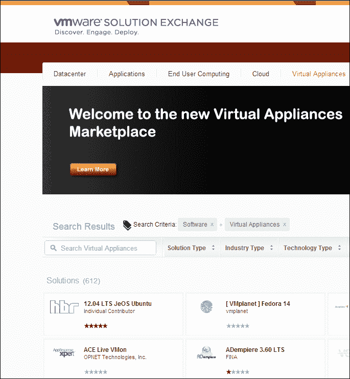

# 第九章 共享虚拟机

在测试环境中，虚拟机是与他人共享测试结果的便捷方式。VMware Workstation 提供了许多共享选项。你可以将虚拟机上传到 vSphere，或通过 VMware Marketplace 将其发布到云端。你还可以与使用 VMware Player 的其他用户共享虚拟机。为了让用户明确他们可以对虚拟机做什么，你还可以制作虚拟机中测试结果的屏幕录像，向他人解释你所做的事情。本章将教你如何使用这些技巧。

# 将虚拟机上传到 vSphere 和云端

VMware Workstation 被许多人用来在隔离的环境中创建和测试虚拟机，然后再将其上传到生产环境。VMware Workstation 通过直接将虚拟机上传到 vSphere 和 ESXi，简化了这一过程。使用此功能时，是否处于没有管理主机的 vSphere 环境，还是有 vCenter Server 管理的主机都不重要，两个环境都受支持。

## 使虚拟机准备好以便使用 vSphere

即使 VMware Workstation 和 vSphere 来自同一供应商，二者之间仍然存在一些显著差异。最重要的差异与网络有关，因此在开始将虚拟机上传到 vSphere 之前，制定关于网络架构的计划是有意义的。

vSphere 提供的网络选项与 VMware Workstation 中的网络有很大的不同。这些差异可能显得非常显著，以至于看起来似乎无法在 VMware Workstation 环境中复制你想要在 vSphere 中使用的网络状态。然而，根据你所关注的网络类型，实际上还是有一些选择。

vSphere 中有一个在 VMware Workstation 中没有的最重要的网络功能，那就是**虚拟交换机**。VMware Workstation 不允许你连接虚拟交换机，而虚拟交换机上可以指定高级网络设置。而且，通常在 vSphere 环境中，你会看到管理网络和生产网络之间的区别，但在 VMware Workstation 中则没有这样的区分。尽管如此，缺少这些功能是有其原因的。

在 vSphere 环境中，ESXi 服务器通常至少配有八个网络卡，在某些情况下，甚至更多。VMware Workstation 被开发用于桌面计算机，而典型的桌面计算机通常只有一个网络卡，或者如果是带有以太网卡和 WiFi 网络卡的笔记本电脑，则有两个网络卡。即使存在这一限制，VMware Workstation 依然提供了许多功能。即使物理主机只有一个网络卡，你也可以轻松创建多个网络卡的虚拟机。这使你能够设置一个环境，在该环境中，虚拟计算机将流量从连接主机的物理网络路由到仅主机网络，从而模拟使用 DMZ 的设置。

这种拓扑镜像正是你可以在 VMware Workstation 中以非常实用的方式实现的。所以，如果你在寻找一种解决方案，可以让你玩转高级 vSwitch 功能，包括 VLAN 标签，VMware Workstation 并不适合作为预生产测试环境。如果你在寻找一种易于理解并允许你构建测试网络拓扑的解决方案，VMware Workstation 是完美的选择。

为了镜像网络拓扑，VMware Workstation 提供了三种不同类型的网络适配器，这些适配器都可以通过虚拟网络编辑器创建。默认情况下，已经创建了三种网络，作为管理员，你可以最多添加 10 个虚拟网络。这意味着即使主机只有一个网络适配器，你也可以在任何虚拟机中拥有多达 10 个不同的网络适配器！

在虚拟网络编辑器中，有两种网络类型允许与外部网络进行直接连接。这两种类型分别是**NAT**和**桥接网络类型**。最开放的方法是为虚拟机提供一个桥接网络适配器。使用此方法，虚拟机直接连接到外部网络。这意味着，举例来说，它将从物理网络中的 DHCP 服务器获取 IP 地址，并且这也意味着你需要确保外部网络上的资源是可用的。例如，如果你在连接主机与互联网的网络接口上使用网络桥接，互联网提供商必须愿意分配额外的 IP 地址。这个限制意味着在所有场景下桥接网络接口都不能使用。

另外，您还可以使用 NAT 类型的网络接口。如果您不管理外部网络，并且没有配置可以直接将虚拟机连接到外部网络的选项，建议使用此类型。使用 NAT 有一个缺点，即在使用 NAT 时，您无法从外部网络访问虚拟机上的服务。不过，NAT 也常用于企业 vSphere 实现中，以为内部网络上的服务增加额外的保护层，这些服务不应从外部访问。因此，NAT 可能会成为您网络配置中的一个有益补充。

第三种网络类型是**仅主机**。这意味着在主机上，虚拟网卡与物理网卡没有任何连接，因此主机仅网络卡不能从主机以外的任何计算机访问。这听起来像是一个限制，但仅主机网络确实提供了一些实际的好处。例如，您可以配置一个具有公共网络接口的虚拟机，通过使用 NAT 或桥接模式连接到外部网络，而在该虚拟路由主机的另一侧，创建一个或多个仅主机网络，反映内部公司网络，甚至是 DMZ 网络。要使其工作，您需要在该虚拟机上配置路由过程，让它执行通常由（虚拟化的）路由器在您的基础设施中完成的工作。

## 上传虚拟机到 vSphere

一旦确保 vSphere 中所需的功能可以在 VMware Workstation 中准备好，便可以开始上传虚拟机。VMware Workstation 支持将虚拟机上传到单个 ESXi 主机，也支持连接到由 vCenter Server 管理的 vSphere 环境。要上传到 ESXi 主机，请输入要连接的主机的名称或 IP 地址；要上传到 vCenter Server，请输入管理 vSphere 环境的 vCenter Server 的 IP 地址或名称。

要从 VMware Workstation 菜单开始上传，请导航至**文件** | **连接到服务器**，并输入连接到 vSphere 服务器所需的 IP 地址、管理员用户名和密码。您现在将看到当前 vSphere 环境的概览，显示当前使用情况、资源可用性以及哪些虚拟机正在实际使用。

ESXi 服务器当前使用概览

要将虚拟机复制到 vSphere 环境中，请在 VM 菜单中选择 **管理** 选项，然后从中选择 **上传**。这将打开一个新窗口，您可以在其中选择刚刚连接的 vSphere 环境。点击 **下一步** 后，在下拉列表中选择要将虚拟机复制到的特定 ESXi 服务器。同时，在点击 **完成** 之前，请确保指定要使用的数据存储位置。

选择复制虚拟机的目标位置

一旦虚拟机被复制，您就可以在 vSphere 环境中开始使用它了。

# 与 VMware Player 共享虚拟机

VMware Player 是一款免费的 VMware 产品，允许用户创建虚拟机并导入他人创建的虚拟机。它通常是您希望提供给需要使用您已创建虚拟机的其他用户的产品。VMware Player 用户也可以创建虚拟机，但该解决方案缺乏通常为高级用户所青睐的高级功能，例如创建快照的选项。VMware Player 作为一款免费且独立的产品提供，您可以在 [www.vmware.com](http://www.vmware.com) 上获取它，但它也作为 VMware Workstation 的一部分进行安装。

## 准备将虚拟机迁移到 VMware Player

在与 VMware Player 用户共享虚拟机之前，最好先测试虚拟机是否能在 VMware Player 环境中按您的预期工作。只需在安装了 VMware Workstation 的计算机上启动 VMware Player，然后点击 **打开虚拟机**。接着，浏览到虚拟机的 VMX 文件所在位置并点击 **打开**。虚拟机现在已添加到 VMware Player 界面中。

在 VMware Player 中打开现有虚拟机

从 VMware Player，您可以轻松使用虚拟机及其所有功能。不过，您会注意到，先进的 VMware Workstation 功能缺失了。缺失的一个重要功能是创建快照或处理快照的选项。这意味着在与 VMware Player 用户共享虚拟机之前，您需要决定要使用虚拟机的哪个状态；该用户将无法轻松切换到虚拟机的其他状态。

与 VMware Workstation 相比，VMware Player 缺少许多功能

将虚拟机提供给 VMware Player 用户使用非常简单。选择存储虚拟机文件（包括 VMX 和 VMDK）的目录，将其复制到 VMware Player 用户的计算机上。一旦这些文件存储在该计算机上，VMware Player 用户只需导入虚拟机即可。

## 第一次启动复制的虚拟机

复制虚拟机并首次启动后，可能会遇到一些问题。首先，根据虚拟机首次复制时的状态，VMware Player 可能会提示虚拟机似乎正在使用中。解决这个问题很简单；只需点击**获取所有权**。这样，你的本地 VMware Player 将获得该虚拟机的所有权，并可以随意操作它。此时你可以启动虚拟机。

在 VMware Player 中首次启动虚拟机时，系统会询问虚拟机是已被复制还是移动。这是为了避免在环境中使用重复的 MAC 地址。如果你选择**我移动了它**，则会保留虚拟机中正在使用的 MAC 地址。当你选择**我复制了它**时，将生成一个新的 MAC 地址，以避免与其他使用相同 MAC 地址的虚拟机发生冲突。在后一种情况下，你可能会遇到无法从新复制的虚拟机访问网络的问题。

第一次启动复制的虚拟机

如果你无法从刚复制过来的虚拟机访问网络，最好的解决方案是关闭虚拟机，移除当前的网络卡并添加一张新的网络卡。这将迫使操作系统创建一个新的网络卡，并在其上配置所有必要的内容，从而使你能够通过复制的虚拟机连接到网络。

# 使用 VMware 应用设备

除了自己创建所有虚拟机外，你还可以使用虚拟设备。虚拟设备是一种现成可用的虚拟机，你可以从 VMware Marketplace 的 [solutionexchange.vmware.com](http://solutionexchange.vmware.com) 下载。

从 VMware Marketplace 下载虚拟设备

在 VMware Marketplace 上找到的每个虚拟设备上，都有一个**立即试用**按钮。点击该按钮可以访问下载页面，下载压缩的虚拟机文件。下载这些文件后，你可以将它们复制到`Virtual Machines`文件夹中，并像处理其他刚复制的虚拟机一样，在 VMware Workstation 或 VMware Player 中打开它们。

如果您希望您的虚拟机对广泛的公众可用，可以申请虚拟应用程序合作伙伴关系。获得该合作伙伴关系后（该合作伙伴关系不是免费的），您可以根据 VMware 的规格构建一个应用程序并将其上传到市场。这样，任何人都可以下载并在他们的 VMware 环境中安装它。

# 制作屏幕录像

如果您真的希望在与他人共享虚拟机时能够清楚地说明该做什么，您可能会喜欢在每个虚拟机的 VM 菜单中找到的 **捕获电影** 功能。该功能允许您捕捉虚拟机上的所有操作。特别是当配合语音解说您所做的事情时，**捕获电影** 功能非常有用。

在开始捕获电影之前，启用声音是个好主意。这样，您可以使用计算机上的麦克风来解释您正在做什么。默认情况下，VMware Workstation 电影没有启用声音。

要添加声音，您需要更改 `config.ini` 文件的内容。如果您使用的是 Windows 主机，可以在 `C:\ProgramData\VMware\VMware Workstation` 中找到此文件。在该文件中，添加 `mks.movie.config.high.recordSound="TRUE"` 这一行，然后重启 VMware Workstation。

### 提示

`config.ini` 文件位于 `C:` 盘的隐藏目录 `ProgramData` 中。确保启用 Windows 资源管理器显示隐藏文件，然后再尝试访问该文件。要保存对该文件的更改，您需要管理员权限。选择记事本并右键单击，选择 **以管理员身份运行**。现在您可以打开文件并添加上述内容。

在开始在 VMware 中捕获电影之前，您需要注意一个重要的限制：它只在图形模式下工作。这意味着，如果您想在显示文本桌面的 Linux 环境中捕获电影，您只会看到桌面的初始屏幕，而不会看到任何修改。这是一个已知问题，至今尚未修复。因此，如果您想在 VMware Workstation 中捕获屏幕电影，请以图形模式启动您的 Linux 机器。

在开始捕获之前，将虚拟机设置到您希望开始捕获的确切状态。然后导航到 **VM** | **捕获电影**，选择您想创建的文件的名称和位置。完成后，执行您希望被记录的所有操作。

完成后，再次进入 VM 菜单并点击 **停止捕获电影**。此时，屏幕录像将停止并保存到磁盘。

在捕获录像时，虚拟机窗口的右下角会显示一个录制按钮。

在分享你创建的屏幕录制视频之前，最好先优化一下视频。没有人愿意看一个制作粗糙的视频，特别是当演示者对自己所做的事情不确定，且频频出错的时候。所以，投资一些优秀的视频编辑软件，剪掉那些效果不好的部分，甚至可以加上一些画中画效果，让视频看起来更具吸引力。完成这些之后，你就可以准备好与其他用户分享视频，帮助他们理解你在虚拟机中实现的功能。

# 总结

在本章中，你学习了在创建虚拟机后可以做些什么。你可以将它们上传到不同的位置，比如 vSphere、VMware Player 用户，甚至是 VMware Marketplace，其他用户可以在该平台下载你的虚拟机。此外，你还学会了如何创建屏幕录制视频，向虚拟机的用户解释如何使用你所嵌入的功能。
