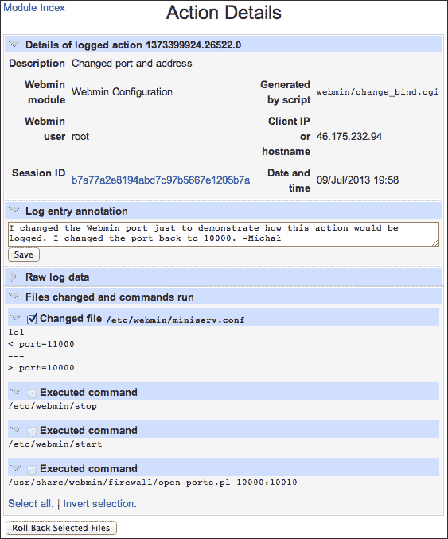
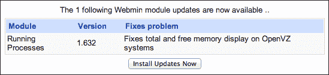

# 第一章：设置系统

本章我们将涵盖以下主题：

+   在基于 Debian 的系统上安装 Webmin

+   在基于 RPM 的系统上安装 Webmin

+   在另一系统上安装 Webmin

+   连接到 Webmin

+   安装额外的 Webmin 模块

+   监控 Webmin 的操作

+   控制系统启动时哪些服务被启动

+   检查已安装的软件包

+   安装软件包

+   将已安装的包更新到最新版本

+   启用 Webmin 发送电子邮件

+   获取新版本软件包发布时的电子邮件通知

+   阅读已安装软件的文档

# 介绍

Webmin 是一个开源的基于 Web 的系统配置工具，主要使用 Perl 编写。由于其基于 Web 的特性，Webmin 可以让你从任何运行浏览器的计算机上远程控制你的系统。它允许你控制系统配置的多个方面，例如管理用户、安装额外软件、配置服务、控制访问权限和监控系统活动。

本章将专注于安装 Webmin，并展示如何使用它来执行与安装、升级和运行系统上其他软件相关的任务。

# 在基于 Debian 的系统上安装 Webmin

在基于 Debian 的系统上安装 Webmin（如 Ubuntu 或 Linux Mint）非常简单，因为我们可以依赖出色的包管理系统 **高级包管理工具** (**APT**) 。APT 会自动解析并安装依赖关系，同时确保在进行系统更新时，Webmin 会自动更新。

## 如何操作...

要安装 Webmin，执行以下步骤：

1.  Webmin 并不是标准的 Debian 软件包仓库的一部分，因此你的第一步是将 Webmin 仓库的 URL 添加到你的包源文件中。用文本编辑器打开 `/etc/apt/sources.list` 文件，并添加以下内容：

    ```
    deb http://download.webmin.com/download/repository sarge contrib
    deb http://webmin.mirror.somersettechsolutions.co.uk/repository sarge contrib
    ```

    ### 提示

    在大多数系统中，`vi` 文本编辑器是默认安装的，但如果你之前没有使用过它，可能会有些困难。如果你想使用一个更易上手的编辑器，可以尝试 nano。你可以通过以下命令安装它：

    ```
    $ sudo apt-get install nano

    ```

    安装完成后，你可以使用 `nano` 编辑 `sources.list` 文件，方法是执行以下命令：

    ```
    $ sudo nano /etc/apt/sources.list

    ```

1.  我们还需要将 Webmin 仓库的 GPG 密钥添加到 APT 用来验证软件包的密钥列表中。这可以通过执行以下命令来完成：

    ```
    $  wget -qO - http://www.webmin.com/jcameron-key.asc | sudo apt-key add -

    ```

1.  你现在可以刷新 APT 缓存，使其包括 Webmin 仓库的内容。可以通过以下命令来实现：

    ```
    $ sudo apt-get update

    ```

1.  在处理完这些前提条件后，你可以通过以下命令安装 Webmin：

    ```
    $ sudo apt-get install webmin

    ```

## 它是如何工作的...

Webmin 提供了一个在线软件源，包含与 Debian 系统兼容的 DEB 安装包。我们需要将该软件源的地址提供给系统，以便它能够利用该资源。可用的软件源列表保存在 `/etc/apt/sources.list` 文件以及存储在 `/etc/apt/source.list.d/` 目录下的其他 `*.list` 文件中。

每个软件包都有加密签名，以确保即使有人入侵了软件源并上传伪装成 Webmin 的软件包，我们也不会意外地安装它。我们通过 `wget` 下载了验证此签名所需的公钥，并使用 `apt-key add` 命令将其添加到受信任的密钥列表中。

**GNU 隐私保护**（**GPG**）是一个开源的替代 **Pretty Good Privacy**（**PGP**），它是一个提供加密和身份验证功能的加密软件套件。每个 Webmin 软件包都包含 GPG 加密签名，该签名只能使用 Webmin 作者 Jamie Cameron 保密的私钥生成。一个对应的公钥是公开的，可以用来验证该签名是否是使用该私钥生成的。如果软件包代码在签名后被修改，即便是一个位的变化，签名也将不再匹配。这确保了在 Webmin 从作者传输到你的系统的过程中没有人篡改它。APT 会自动检查签名，我们只需要提供 Webmin 的公钥。

### 提示

如果你想更加小心，可以检查你导入的公钥是否确实属于 Jamie Cameron。运行以下命令并验证其输出中是否包含相同的密钥指纹：

```
$ sudo apt-key fingerprint
/etc/apt/trusted.gpg
--------------------
pub   1024D/11F63C51 2002-02-28
 Key fingerprint = 1719 003A CE3E 5A41 E2DE  70DF D97A 3AE9 11F6 3C51
uid                  Jamie Cameron <jcameron@webmin.com>

```

通过更新 APT 缓存，我们确保系统能够识别新软件源中的软件包。然后，我们可以安装 Webmin。APT 不仅会解决依赖关系并安装 Webmin 软件包，还会安装它所需的其他组件，包括 Perl 编程语言等。

## 还有更多...

Webmin 还提供了一个 `.deb`（Debian 软件包）文件，可以手动下载并安装。如果因为某些原因你想以这种方式安装，需要按照以下步骤操作：

1.  访问 Webmin 的下载页面 [`www.webmin.com/download.html`](http://www.webmin.com/download.html)，并复制当前 Debian 包的地址。该软件包的文件名为 `webmin_NNN_all.deb`，其中 `NNN` 表示当前的版本号。

1.  使用 `wget` 下载该软件包：

    ```
    $ wget http://prdownloads.sourceforge.net/webadmin/webmin_NNN_all.deb

    ```

1.  首先，使用以下命令安装 Webmin 所依赖的所有软件包：

    ```
    $ sudo apt-get install perl libapt-pkg-perl libnet-ssleay-perl openssl libauthen-pam-perl libpam-runtime libio-pty-perl apt-show-versions python

    ```

1.  然后，运行以下命令从软件包文件中安装 Webmin：

    ```
    $ sudo dpkg --install webmin_NNN_all.deb

    ```

    ### 提示

    系统可能会提示某个 Webmin 所依赖的包缺失。例如，你可能会看到如下错误信息：

    ```
    dpkg: dependency problems prevent configuration of webmin:
     webmin depends on PACKAGE-NAME; however:
     Package PACKAGE-NAME is not installed.

    ```

    如果看到此错误，应该在安装 Webmin 之前先安装 `PACKAGE-NAME` 所指定的包。

## 另见

有关在基于 Debian 的系统上安装 Webmin 以及 APT 包管理的一般信息，可以在以下 Webmin 和 Debian 网站上找到：

+   [`www.webmin.com/deb.html`](http://www.webmin.com/deb.html)

+   [`doxfer.webmin.com/Webmin`](http://doxfer.webmin.com/Webmin)

+   [`wiki.debian.org/Apt`](https://wiki.debian.org/Apt)

# 在基于 RPM 的系统上安装 Webmin

在基于 RPM 的系统上安装 Webmin，例如 RHEL、Fedora、CentOS 或 openSUSE，与在基于 Debian 的系统上安装一样简单。在这里，我们将依赖同样出色的包管理系统——**Red Hat Package Manager**（**RPM**）和`yum`工具。`Yum`可以自动解析和安装依赖项，并确保在进行系统更新时，Webmin 也会自动更新。

在基于 SUSE 的系统上，您也可以使用`yum`工具，但它默认并未安装。在这些系统上，使用`zypper`命令行工具或 YaST 界面可能更为方便。在本食谱中，我们将提供`zypper`作为`yum`命令的替代方法，供 SUSE 系统使用。

## 如何操作...

安装 Webmin，请按照以下步骤操作：

1.  虽然 Webmin 在多个系统中都有提供，但其包通常不会保持最新。我们将通过创建描述仓库的文件，将 Webmin 的仓库添加到系统中。创建路径为`/etc/yum.repos.d/webmin.repo`的文件，并向其中添加以下内容：

    ```
    [Webmin]
    name=Webmin Distribution Neutral
    #baseurl=http://download.webmin.com/download/yum
    mirrorlist=http://download.webmin.com/download/yum/mirrorlist
    enabled=1

    ```

    ### 提示

    在大多数系统上，vi 文本编辑器默认已安装，但如果您之前没有使用过它，可能会有点难度。如果您想使用一个易于操作的编辑器，可以尝试 nano。您可以通过执行以下命令来安装它：

    ```
    $ sudo yum install nano

    ```

    安装后，您可以使用 nano 编辑`webmin.repo`文件，通过以下命令进行编辑：

    ```
    $ sudo nano /etc/yum.repos.d/webmin.repo

    ```

    ### 注意

    在基于 SUSE 的系统上，您无需手动编辑仓库文件。您可以通过执行以下命令来添加 Webmin 的仓库：

    ```
    $ sudo zypper addrepo -f http://download.webmin.com/download/yum "Webmin Distribution Neutral"

    ```

1.  我们还需要将 Webmin 仓库所使用的 GPG 密钥添加到 RPM 用于认证包的密钥列表中。可以通过执行以下命令完成此操作：

    ```
    $ wget http://www.webmin.com/jcameron-key.asc
    $ sudo rpm --import jcameron-key.asc
    $ rm jcameron-key.asc

    ```

1.  现在，您可以刷新`yum`缓存以包括 Webmin 的仓库。可以通过以下命令完成此操作：

    ```
    $ sudo yum makecache

    ```

    ### 注意

    在基于 SUSE 的系统上，执行以下命令：

    ```
    $ sudo zypper refresh

    ```

1.  完成这些准备工作后，您可以使用以下命令安装 Webmin：

    ```
    $ sudo yum install webmin

    ```

    ### 注意

    在基于 SUSE 的系统上，执行以下命令：

    ```
    $ sudo zypper install webmin

    ```

## 它是如何工作的...

使用`yum`安装 Webmin 的原理与在 Debian 系统上使用`apt-get`安装 Webmin 完全相同。请参考前一章节中的*它是如何工作的...*部分。

## 还有更多...

Webmin 也提供了一个可以手动下载并安装的 RPM 包。如果因为某些原因您希望通过这种方式安装，您需要按照以下步骤操作：

1.  访问 Webmin 的下载页面，网址为 [`www.webmin.com/download.html`](http://www.webmin.com/download.html)，并复制当前 RPM 包的地址。包文件将命名为 `webmin-NNN.noarch.rpm`，其中 `NNN` 表示当前版本号。

1.  使用 `wget` 下载包：

    ```
    $ wget http://prdownloads.sourceforge.net/webadmin/webmin-NNN.noarch.rpm

    ```

1.  然后，运行以下命令从包中安装 Webmin：

    ```
    $ sudo yum localinstall webmin-NNN.noarch.rpm

    ```

### 注意

在基于 SUSE 的系统上，执行以下命令：

```
$ sudo yast --install webmin-NNN.noarch.rpm

```

## 参见

关于在基于 RPM 的系统上安装 Webmin 的更多信息，请参阅以下 Webmin 网站和维基：

+   [`www.webmin.com/rpm.html`](http://www.webmin.com/rpm.html)

+   [`doxfer.webmin.com/Webmin`](http://doxfer.webmin.com/Webmin)

# 在另一台系统上安装 Webmin

即使您的系统不使用 Debian 或 RPM 包管理器，您的发行版仍可能提供 Webmin 包。例如，Arch Linux 和 Gentoo 提供 Webmin 包，而 FreeBSD 提供 Webmin 包和端口。

如果您的系统没有提供 Webmin 包，您可以使用本文档中概述的步骤在类 Unix 系统上（如 Linux、BSD 和 OS X）安装 Webmin。

### 注意

可以在 Webmin 的网站上找到支持的操作系统的完整列表：

[`www.webmin.com/support.html`](http://www.webmin.com/support.html)

## 准备工作

在安装 Webmin 之前，请确保您的系统上已安装 Perl 版本 5。您可以使用以下命令验证这一点：

```
$ perl --version

```

为了启用连接的 SSL 加密，您应安装 Perl 模块 Net::SSLeay。您可以使用以下命令验证是否已安装。如果未安装 Net::SSLeay，则会报错。如果已安装，该命令将不会生成任何输出。

```
$ perl -e "use Net::SSLeay"

```

## 如何操作...

执行以下步骤安装 Webmin：

1.  访问 Webmin 的下载页面，网址为 [`www.webmin.com/download.html`](http://www.webmin.com/download.html)。

1.  复制到最新版本的 Unix tar/gzip 格式包的链接。链接将类似于以下内容，只是 `NNN` 需要替换为当前版本号：[`prdownloads.sourceforge.net/webadmin/webmin-NNN.tar.gz`](http://prdownloads.sourceforge.net/webadmin/webmin-NNN.tar.gz)。

1.  使用 `wget` 下载包：

    ```
    $ wget http://prdownloads.sourceforge.net/webadmin/webmin-NNN.tar.gz

    ```

1.  使用以下命令解压缩存档：

    ```
    $ tar -xzf webmin-NNN.tar.gz

    ```

1.  进入提取的目录，并通过以下命令启动交互式安装脚本：

    ```
    $ cd webmin.NNN
    $ sudo ./setup.sh /usr/local/webmin

    ```

1.  将会询问您一系列问题。对于以下问题，您可以按 Enter 接受默认建议的答案。在下面的提示行中，默认值以括号形式提供：

    ```
    Config file directory [/etc/webmin]: 
    Log file directory [/var/webmin]: 
    Full path to perl (default /usr/bin/perl): 
    Web server port (default 10000): 

    ```

1.  Webmin 将尝试检测您操作系统的名称和版本。确保此信息正确；否则，Webmin 可能无法正常工作。检测到的系统版本将显示在类似以下行中：

    ```
    ***************************************
    Operating system name:    Mac OS X
    Operating system version: 10.9
    ***************************************

    ```

1.  在以下提示处为第一个 Webmin 管理员用户选择用户名和密码：

    ```
    Login name (default admin): 
    Login password: 
    Password again: 

    ```

1.  对以下问题回答 yes (`y`)：

    ```
    Use SSL (y/n): y
    Start Webmin at boot time (y/n): y

    ```

1.  安装完成后，你可以删除 `webmin-NNN.tar.gz` 压缩包以及用于安装的解压后的 `webmin-NNN` 文件夹。

## 它是如何工作的...

Webmin 安装脚本能够在大多数类 Unix 操作系统上安装它。

在启动安装脚本时，我们指定了希望将 Webmin 的程序文件安装在 `/usr/local/webmin` 路径下。如果你想将它安装到其他位置，可以使用不同的路径。

Webmin 在安装过程中会询问你一系列问题。例如，它会询问你将配置文件存储在哪里（默认存储在 `/etc/webmin/`）和日志文件存储在哪里（默认存储在 `/var/webmin/`）。这些位置可以更改，但默认值在大多数系统中都能正常工作。

你还需要指定第一个 Webmin 用户的用户名和密码。这个用户将通过 Webmin 完全控制你的系统，并能够添加更多的用户账户。

## 另请参见

你可以在 Webmin 的官网上找到更多关于安装的信息：[`www.webmin.com/tgz.html`](http://www.webmin.com/tgz.html)

寻找适合你系统的 Webmin 软件包。以下是一些链接：

+   **Arch Linux**: [`www.archlinux.org/packages/?name=webmin`](https://www.archlinux.org/packages/?name=webmin)

+   **FreeBSD**: [`www.freshports.org/sysutils/webmin/`](https://www.freshports.org/sysutils/webmin/)

+   **Gentoo**: [`packages.gentoo.org/package/app-admin/webmin`](http://packages.gentoo.org/package/app-admin/webmin)

# 连接到 Webmin

启动 Webmin 所需的唯一客户端软件是一个网页浏览器。你可以使用服务器的 IP 地址或域名连接到 Webmin。Webmin 允许你更改它用于连接的 IP 地址、端口或域名。

## 准备工作

第一步是检查你服务器的 IP 地址。你可以通过运行 `/sbin/ifconfig` 命令来查看。它会提供很多关于系统中配置的网络接口的信息，包括每个接口下的 **inet addr** 标题下的 IP 地址。你的系统上至少会有两个网络接口。其中一个会被称为 **lo** 或 **lo0**，这是仅用于同一机器之间连接的本地回环接口，IP 地址是 127.0.0.1。另一个接口很可能被称为 **eth0** 或 **en0**，这是你机器的主要网络适配器。如果要从其他计算机连接，请注意这个 IP 地址。你还可以为这个 IP 设置 DNS 记录，然后使用域名连接。

## 如何操作...

你可以通过执行以下步骤连接到 Webmin：

1.  打开你的网页浏览器，输入以下地址，但将 `webmin.host` 替换为你服务器的 IP 地址或域名：`https://webmin.host:10000`。

    ### 提示

    如果你的浏览器报告无法建立与服务器的连接，那么可能是你在服务器上运行了防火墙，阻止了进入的连接。在大多数 Linux 系统中，默认的防火墙叫做 `iptables`，你可以通过执行以下命令来允许所有进入的 TCP 流量通过 10000 端口：

    ```
    $ sudo iptables -I INPUT -p tcp --dport 10000 -j ACCEPT

    ```

1.  不幸的是，在成功连接后，你首先会看到一个警告，内容大致是：**此站点的安全证书无效！** 你可以忽略这个警告，继续访问 Webmin。有关更多信息，请查看本食谱中的 *它是如何工作的...* 部分。

    ### 提示

    如果你收到一个错误，提示建立安全连接失败，请尝试使用常规 HTTP 连接到 `http://webmin.host:10000`。

在下一个界面，你将被要求提供一个具有管理员权限的用户的登录名和密码。这个用户几乎总是 root 用户，或者是通过 `sudo` 授予了所有权限的用户。输入用户名和密码，然后点击按钮进行登录。

登录后，Webmin 会向你展示一个主屏幕，显示系统概览，类似于以下截图：


这个欢迎界面展示了 Webmin 的主界面。在左侧，我们看到一个侧边栏，里面包含了一个层次化的菜单，列出了所有已安装的模块，并按类别进行组织。右侧则展示了当前激活模块的界面（在这种情况下，是**系统信息**）。

## 它是如何工作的...

Webmin 在你的服务器上运行一个 Web 服务器，端口号为 10000。由于浏览器默认连接到 80 端口（或者在使用 HTTPS 时是 443 端口），我们需要在 URL 中指定端口号。

如果你的系统中安装了 Perl 模块 Net::SSLeay，那么所有连接到 Webmin 的连接都会加密，以防止窃听或中间人攻击。为了建立加密连接，我们指示浏览器使用 HTTPS 协议进行连接。如果你尝试通过常规的 HTTP 连接，Webmin 会提供一个页面，将你重定向到加密连接，类似于以下截图：


当我们建立加密连接时看到的错误信息是因为我们用来加密通信的证书是 Webmin 自己生成的，并未被商业的、受信任的证书颁发机构签署。这不需要担心。自签名证书有一个重要的优点：它是免费的，而且提供与商业证书相同的加密效果。

## 还有更多...

Webmin 默认使用 10000 端口来托管其 Web 服务器，并会接受来自任何网络接口的连接。如果需要，你可以修改这些选项。

### 更改 Webmin 的监听端口

通过从菜单选择以下选项，导航到 **端口与地址** 配置模块：**Webmin** | **Webmin 配置**。然后，点击 **端口与地址** 图标，你将看到以下屏幕。在此屏幕中，你可以通过在 **监听端口** | **特定端口** 中指定端口来更改 Webmin 监听连接的端口。暂时将 **绑定到 IP 地址** 字段的值保持为 **任何地址**。请参阅以下截图：


将端口更改为 `10001` 或任何你喜欢的未使用端口号，然后点击 **保存**。

### 提示

你可以通过执行`netstat`命令获取已使用端口的列表。服务器上的守护进程使用某些端口监听传入连接，这些端口不能用于 Webmin。在 Linux 上，你可以使用以下命令来获取监听端口的列表：

```
$ netstat -ltn

```

在基于 BSD 的系统上，使用以下命令：

```
$ netstat -nap tcp | grep LISTEN

```

Webmin 将更改其端口并将你重定向到新的地址。

### 指定 Webmin 监听的 IP 地址

你可以使用 **端口与地址** 屏幕来选择 Webmin 监听的 IP 地址。如果你的机器上安装了多个网络接口（例如，一个用于访问互联网，一个用于本地网络），这将很有用。你还可以使用此选项选择回环接口，只允许来自同一台机器的连接或通过 SSH 隧道的连接（参见第三章中的 *通过 SSH 隧道安全连接到 Webmin*）。要仅限本地流量连接，请选择 **绑定到 IP 地址** | **仅限地址...**，并输入 127.0.0.1，如下图所示：


# 安装额外的 Webmin 模块

Webmin 具有模块化架构，可以通过安装附加模块来扩展它。大多数稳定的 Webmin 模块已捆绑在 Webmin 中，因此在大多数情况下你实际上不需要安装它们。已安装但未启用的模块位于菜单的 **未使用模块** 部分。它们通常会在你安装它们依赖的软件时自动激活。例如，你可能会在该部分看到 **MySQL 数据库服务器** 模块。当你在系统上安装 MySQL 或其他受支持的软件时，Webmin 会检测到它并将相应的模块移到菜单中的相应位置。

安装附加软件后，你可能需要点击菜单底部的 **刷新模块** 链接，并重新加载浏览器才能使此更新生效。

## 准备工作

如果你发现了一个不错的第三方模块，而它没有与 Webmin 一起捆绑，你可以按照此方法安装它。请注意：Webmin 模块将拥有对系统的特权访问权限；你绝不应该安装来自你不完全信任的来源的模块。

## 如何操作...

要安装额外的 Webmin 模块，请执行以下步骤：

1.  复制 Webmin 模块位置的 URL。它将在一个扩展名为`.wbm`或`.wbm.gz`的文件中。

1.  通过前往**Webmin** | **Webmin 配置** | **Webmin 模块**，导航到**安装**标签。你将看到以下屏幕：

1.  选择从**ftp 或 http URL 安装**选项，并将模块的 URL 粘贴到提供的文本框中。

1.  在安装模块之前，你可以选择哪些用户将被允许使用它。选择**授予所有 Webmin 用户访问权限**。

1.  点击**安装模块**。接下来的页面将显示安装进度、模块在磁盘上的安装位置、它将在菜单中出现的部分，以及一个指向模块屏幕的链接。

1.  重新加载 Webmin 以查看新模块出现在菜单中。

## 它是如何工作的...

Webmin 将下载并解压模块归档文件，并在`/usr/share/webmin/`目录中创建一个新的模块文件夹。当你重新加载 Webmin 时，它会扫描模块目录，发现新模块并将其添加到菜单中。

每个 Webmin 模块可以对所有用户或特定用户组可用。这个选择可以在模块安装过程中做出，也可以在**Webmin** | **Webmin 用户设置**中稍后进行。有关用户和访问控制的更多信息，请参见第二章，*用户管理*。

## 还有更多...

Webmin 还可以从两个仓库下载模块文件：一个是托管在`webmin.com`的标准模块仓库，另一个是可能托管在互联网上任何地方的第三方模块仓库。

### 从仓库安装模块

为了从某个仓库安装模块，请执行以下步骤：

1.  导航到**Webmin** | **Webmin 配置** | **Webmin 模块** | **安装**。

1.  点击**www.webmin.com**行尾的省略号（**...**）按钮，或**第三方模块来自**。

1.  选择你想要安装的模块，并按照之前描述的方式进行安装。

Webmin 将自动从仓库的 URL 下载文件。

### 卸载模块

如果你想卸载一个模块，请导航到**Webmin** | **Webmin 配置** | **Webmin 模块** | **删除**，选择你想要删除的模块，然后点击**删除所选模块**。在接下来的页面中，你将被要求确认操作，模块将被删除。

## 另见

+   你可以在 Webmin 网站上搜索第三方模块的数据库，网址为[`www.webmin.com/third.html`](http://www.webmin.com/third.html)

# 监控 Webmin 的操作

Webmin 的一个有用功能是它会记录其执行的每个操作。有时候可以参考此历史记录，以检查用户通过 Webmin 界面如何更改系统配置。

## 准备工作

为了充分利用 Webmin 的日志记录功能，应启用通过 Webmin 进行的文件更改的监视。这样可以稍后回滚更改。

要启用此功能，请转到**Webmin** | **Webmin Configuration** | **Logging**，并设置对这两个问题的答案为**是**：**记录每个操作对文件的更改？**和**在执行操作前记录所有修改的文件，以便回滚？**

## 如何做到……

要监视 Webmin 正在执行的操作，请执行以下步骤：

1.  要访问 Webmin 的日志，请转到**Webmin** | **Webmin Actions Log**。

1.  选择过滤器将搜索范围缩小到仅显示今天通过 Webmin 执行的日志条目，然后单击**搜索**。您将看到一个表格，列出了今天通过 Webmin 执行的所有操作。

1.  单击其中一个操作，以查看操作的完整描述。此屏幕将告知您何时由哪个用户执行了操作，从哪个 IP 登录，并使用了哪个 Webmin 脚本。

1.  通过向**日志条目注释**字段写入文本并单击**保存**，您将遇到类似于以下内容：

1.  通过单击标记为**Session ID**的链接，查看此用户会话中执行的所有操作。注释的操作将在列表中可见，并带有星号标记。

## 它的工作原理……

Webmin 会将用户执行的所有操作记录在日志文件`/var/webmin/webmin.log`中。用户注释存储在`/var/webmin/annotations`目录中。如果启用了文件更改的监视，每个更改都记录在`/var/webmin/diffs`目录中。请注意，这些目录在繁忙系统上随时间可能会变得相当大。

**Webmin 操作日志**界面允许您搜索这些日志文件，显示它们，并用它们来撤消文件更改。

## 还有更多……

如果按照本文档的*准备工作*部分启用了文件更改监视，您可以使用 Webmin 撤消这些更改。

### 回滚文件更改

作为练习，转到**Webmin** | **Webmin Configuration** | **User Interface**，并将页面背景设置为带有 RGB 十六进制值`C9DFFF`的浅蓝色。返回**Webmin** | **Webmin Actions Log**，然后找到您的操作并查看其详细信息。在**更改的文件和执行的命令**部分，您将看到记录了对文件`/etc/webmin/config`的更改，如下面的屏幕截图所示：


选中文件更改旁边的复选框，然后单击**回滚所选文件**按钮。确认回滚并返回**操作详情**页面。注意背景颜色恢复为白色。

## 另请参阅

+   若想了解更多监控系统的方式，请查看第五章，*监控你的系统*

# 控制在启动时哪些系统服务被启动

在启动过程中，操作系统应该加载所有将在后台运行的服务。这包括数据库服务器、Web 服务器、像 Webmin 这样的工具和其他系统进程。服务器发行版默认非常精简，因此它们只会启动少数几个关键服务。Webmin 允许你通过**启动和关闭**模块控制哪些脚本被执行。

## 如何操作...

执行以下步骤以检查哪些系统服务在启动时被启动：

1.  导航到**系统** | **启动和关闭**。

1.  选择一个服务暂时禁用。如果你的系统有`avahi`守护进程或`rsync`服务，这些可以暂时禁用一分钟而不会造成问题。参考下图：

1.  在这些服务旁边勾选复选框，然后点击**立即禁用并在启动时禁用**按钮。你将看到一个屏幕，通知你该服务已经停止，并且从下次启动时不再启动。

1.  返回**启动和关闭**界面，重新选择相同的服务，然后点击**立即启动并在启动时启动**按钮，恢复你之前的更改。

## 它是如何工作的...

当你的操作系统启动时，它首先加载系统内核，然后启动一个名为**init**（初始化的缩写）的进程，执行各种初始化脚本以启动系统服务。在 Linux 下，这些脚本存储在一个目录中（`/etc/init.d`），并通过在一个特殊目录中创建指向它们的符号链接来激活，这个特殊目录会在启动时执行所有脚本。Webmin 允许你通过创建或删除这些符号链接，或执行其他特定于系统的激活功能，来控制哪些初始化脚本被执行。

前面提到的初始化系统通常被称为**SysV 风格的 init**。它以历史悠久的 UNIX 系统 V 命名，UNIX 系统 V 启发了所有现代 Unix 类操作系统，包括 Linux 和 BSD。许多发行版正在逐步转向更现代的替代方案，如 Upstart 和 Systemd。关于这些系统与 SysV-init 的区别细节超出了本书的范围，但 Webmin 尝试为它们提供一个通用的接口。本食谱中的截图可能会根据你所使用的初始化系统有所不同。

## 还有更多...

Webmin 还允许你轻松创建自己的初始化脚本，并验证启动的服务是否真的在运行。

### 创建自定义初始化脚本

大多数服务器包在安装时会附带自己的初始化脚本，并在你的初始化系统中激活它们。如果你安装的包没有附带脚本，你可以使用 Webmin 为你创建一个简单的初始化脚本。

进入**系统** | **启动和关机**，点击**创建新的启动和关机操作**链接。

### 注意

根据你使用的初始化系统，这个链接也可能被命名为`创建新操作`、`创建新的 Upstart 服务`、`创建新的 systemd 服务`等。

系统会要求你指定启动项的名称和描述，以及两个命令：一个用于启动服务，一个用于关闭服务。填写完毕后，点击**创建**，Webmin 将自动为你创建一个基本的初始化脚本。


### 检查活动进程

即使服务在启动时成功启动，也可能会崩溃。要检查哪些服务实际上正在运行，请进入**系统** | **正在运行的进程**。在这里，你将看到一个按进程启动顺序排列的进程树。你还可以按所有者或进程所使用的 CPU 或内存量对进程进行排序。参考以下截图：


点击 Webmin 某个进程的进程 ID，以获取更多关于它的信息，包括该进程仍然保持打开的文件或网络连接。

# 检查已安装的软件包

Webmin 提供了一个简便的界面，让你能够查看系统的包管理系统。你可以使用它来检查已安装的软件包，并查看每个软件包所安装的文件。

## 如何操作...

要检查已安装的软件包，请执行以下步骤：

1.  进入**系统** | **软件包**。参考以下截图：

1.  通过在**搜索软件包**表单中输入软件包的名称或部分描述来搜索你感兴趣的软件包。例如，输入`webmin`并点击**搜索软件包**。你还可以通过点击**软件包树**按钮浏览软件包列表。

1.  如果一个软件包已安装，它将出现在软件包列表中。点击软件包的名称以查看**软件包详情**页面。

## 它是如何工作的...

Webmin 能够确定操作系统使用的是哪个软件包管理系统，并提供一个统一的界面来执行常见任务，如检查、安装和卸载软件包。在后台，Webmin 会为你执行适当的命令（如`apt-get`、`yum`、`rpm`、`yast`等），并以网页形式显示结果。

## 还有更多…

除了仅仅查看已安装的软件包，通常还需要检查哪些文件是由某个软件包安装的。你也可能对某个特定的磁盘文件感兴趣，并希望检查是哪个软件包安装了它。Webmin 让你可以轻松获取这些信息。

### 查看通过软件包安装的文件

要查看从某个软件包安装的文件，请执行以下步骤：

1.  进入**系统** | **软件包**，输入软件包的名称（例如，webmin），然后点击**搜索软件包**。

1.  在软件包列表中，点击软件包名称以查看其详细信息。

1.  要查看此软件包安装了哪些文件，请点击 **列出文件** 按钮。

### 识别哪个软件包安装了某个文件

要确定是哪个软件包安装了某个文件，请执行以下步骤：

1.  转到 **系统** | **软件包**。

1.  在 **识别文件** 部分，输入文件名或命令，或点击省略号 (**...**) 按钮以浏览您的磁盘。

1.  点击 **搜索** 按钮。

如果文件被包管理系统识别，您将看到一个包含文件信息的屏幕，其中包括安装该文件的软件包的名称：


# 安装软件包

Webmin 能够利用您的操作系统包管理来安装额外的软件。如果您使用的是基于 Debian 的系统，例如 Ubuntu，您可以从 `.deb` 文件或 APT 仓库安装软件包。如果您使用的是基于 RPM 的系统，例如 CentOS 或 openSUSE，您可以从 `.rpm` 文件或 `yum` 仓库安装软件包。

## 准备就绪

许多 Web 应用程序依赖于一个名为 ImageMagick 的图像处理库。许多用于创建、编辑、组合或转换位图图像（如 PNG 和 JPEG）的程序都使用此库。在本教程中，我们将安装 ImageMagick，但相同的过程可以应用于您发行版仓库中可用的任何其他软件。

## 操作方法...

按照以下步骤使用 Webmin 安装软件包：

1.  转到 **系统** | **软件包**。

1.  选择 **从仓库安装** 单选按钮。请注意，您实际上不会看到 **仓库** 这个词，而是适合您系统的仓库名称（APT、YUM、Ports 等）。

1.  点击 **搜索仓库**，然后输入软件包名称 `imagemagick`，点击 **查找匹配的软件包** 执行搜索。

1.  您将看到与您的搜索匹配的软件包列表，包括 `imagemagick`——您要安装的软件包。点击软件包名称来选择它。

1.  您将返回到 **软件包** 屏幕，现在您可以点击 **安装** 按钮。

Webmin 将下载并安装 ImageMagick 及其一长串依赖项。在结果屏幕上，您可以看到所有已安装软件包的详细信息。

### 小贴士

如果您正在安装的软件包提供了 Webmin 可以管理的组件（如 Apache、MySQL、PostgreSQL 和 Postfix），您需要执行两个额外步骤。点击 Webmin 主菜单中的 **刷新模块** 链接，然后刷新整个浏览器。这将确保 Webmin 识别新安装的软件并更新其菜单。

## 工作原理...

Webmin 会判断你的操作系统使用的是哪个包管理系统。它执行适当的命令，搜索可用的软件库，以查找与你的查询匹配的软件包，并与其依赖项一起安装。相同的任务可以通过命令行完成，但 Webmin 会抽象出与你的打包系统特定的命令语法，这样你可以在不同的操作系统中使用相同的界面。

## 还有更多...

Webmin 还允许你从你可能拥有的软件包文件中安装软件。为了做到这一点，请按照此步骤操作，但选择**从上传的文件**单选按钮，并上传你的文件，而不是搜索软件库。如果你的软件包文件太大，无法通过浏览器上传，你可以通过其 URL 来安装。

请注意，这种方法要求你在安装软件包之前手动安装其依赖项。

# 将已安装的软件包更新到最新版本

开源社区不断发布他们管理的软件的更新。保持这些升级最新非常重要，因为它们通常包含修复在你的软件中发现的安全漏洞。

## 如何操作...

要更新已安装的软件包，请执行以下步骤：

1.  导航到**系统** | **软件包更新**。你将看到所有可在软件库中找到更新版本的包列表。请参考以下截图：

1.  在更新之前，你可以点击**刷新可用的软件包**按钮，以确保你获得最新的更新信息。

1.  确保所有带有可用更新的软件包旁边的复选框都被选中，然后点击**更新选中的软件包**。

1.  下一屏将显示所有将要更新的包的列表，以及可能的新依赖包。点击**安装**来执行更新。

1.  下一屏将显示更新的进度。在导航到其他屏幕之前，请确保页面已完全加载。

1.  当你返回到软件包更新屏幕时，你现在应该看到消息**未找到可更新的软件包**，这表明所有的软件包都是最新的。

## 它是如何工作的...

Webmin 判断你的操作系统使用的是哪个包管理系统，并查询软件包库以获取有关最新可用版本的信息。你可以通过点击**刷新可用的软件包**来触发此软件包缓存更新。当你选择执行更新时，Webmin 执行适当的包管理命令来安装最新版本。

## 还有更多...

Webmin 还会通知你是否有其自身模块的更新可用。此通知将出现在**系统信息**页面，这是你登录时显示的第一页。如果你看到此通知，请点击**立即安装更新**来安装模块更新，如下截图所示：



# 启用 Webmin 发送电子邮件

Webmin 是一个很好的工具，可以监控您的服务器状态。当需要您关注的事件发生时，您可以设置它发送电子邮件通知您。

## 准备工作

Webmin 需要访问邮件服务器才能发送电子邮件。在第十二章中，我们将介绍如何设置邮件服务器。然而，如果您不打算自己设置邮件服务器，或者在设置之前想要开始监控您的系统，您可以使用外部电子邮件服务。

Webmin 可以通过 SMTP 发送电子邮件，但不支持 TLS/SSL 加密。您需要一个支持通过 SMTP 连接且不加密的提供商账户。

## 如何操作...

执行以下步骤以启用 Webmin 发送电子邮件：

1.  如果您想通过外部 SMTP 账户发送电子邮件，请导航到**Webmin** | **Webmin 配置** | **发送电子邮件**，并将**使用 SMTP 发送电子邮件**选项设置为**通过 SMTP 发送到远程邮件服务器**。

1.  提供 SMTP 服务器的地址，将**SMTP 服务器身份验证**设置为**以登录方式**，并提供您账户的用户名和密码。

1.  将**Webmin 发送电子邮件的发件人地址**选项设置为一个授权的电子邮件地址。

1.  点击**保存**以保存设置。

1.  返回到**Webmin** | **Webmin 配置** | **发送电子邮件**，并使用**发送测试消息**表单来测试您的配置。

## 它是如何工作的...

Webmin 能够通过未加密的 SMTP 与远程服务器通信，因此您的邮件将实际从那里发送。请注意，包括您的密码在内的配置会以明文形式保存在服务器的`/etc/webmin/mailboxes/config`文件中。该文件对所有拥有管理员权限的用户可见，他们可以读取您的电子邮件密码。

## 另见

+   查看第十二章，*设置电子邮件服务器*，了解如何设置您自己的邮件服务器。

# 获取新版本软件包的电子邮件通知

如果您有多个服务器在运行，并且安装了不同的软件，定期手动检查软件更新可能变得繁琐。Webmin 允许您安排自动检查更新，并在有新版本软件包发布时向您发送电子邮件。

## 准备工作

确保 Webmin 已设置为发送电子邮件。有关更多信息，请参考本章的*启用 Webmin 发送电子邮件*部分。

## 如何操作...

要在新版本的软件包发布时收到电子邮件通知，请执行以下步骤：

1.  导航到**系统** | **软件包更新**并启用**计划检查选项**。

1.  将**按计划检查更新？**设置为每天检查更新，并提供一个电子邮件地址，若有更新可用，报告将发送至该地址。请参考以下截图：

## 它是如何工作的...

**cron** 是一个系统工具，在后台作为守护进程运行，并启动计划在特定时间执行的任务。当启用**计划检查选项**时，Webmin 会在系统的`cron`表中添加一项条目，执行其更新验证脚本。然后，`cron`守护进程将每天（根据设置，可能是每小时或每周）执行一次该脚本。如果 Webmin 发现有可用更新，它会通过电子邮件通知你。

## 还有更多…

你可以设置 Webmin 在更新可用时自动安装这些更新。但这可能并不像看起来那样是个好主意，因为每次更新都有可能导致系统出现问题。通常这种情况不会发生，但最好由人工监控更新过程，并在更新应用后验证系统是否一切正常。

# 阅读已安装软件的文档

你在系统上安装的大多数软件包都会附带文档。Webmin 提供了一个简单的工具，用于在这些手册中进行搜索。

## 如何操作…

要查看已安装软件的文档，请执行以下步骤：

1.  转到**系统** | **系统文档**，并在搜索框中输入`wget`作为搜索词。

1.  将**匹配**选项设置为**名称和内容**。

1.  勾选**手册页面**和**软件包文档**旁边的复选框，然后点击**搜索**。

Webmin 将搜索所有可用的文档，并显示包含`wget`的所有手册页面和软件包说明。

## 它是如何工作的…

附带的软件包文档通常包括程序的手册页面和打包信息。`man`页面包含关于如何使用已安装软件的说明。它们以特殊格式存储（通常在`/usr/share/man`、`/usr/local/man`或类似位置），并使用`man`命令显示。另一方面，软件包信息可能包括有关如何准备该软件包、如何使用它等内容。软件包文档通常以文本或 HTML 文件形式存储在`/usr/share/doc`中。

Webmin 会扫描可用的手册页面、软件包文档文件和 Perl 模块文档，查找包含你搜索词的内容，并以网页形式显示所有结果，方便查看。

## 还有更多…

Webmin 提供了另一个重要的搜索表单，位于侧边栏菜单的模块类别列表下。这允许你对 Webmin 本身进行详细搜索，扫描其文档以及用户界面的各个元素。例如，如果你使用这个表单搜索`发送测试邮件`这一短语，Webmin 将显示一个结果列表，并提供一个指向**发送电子邮件**模块的链接，允许你发送测试邮件。
