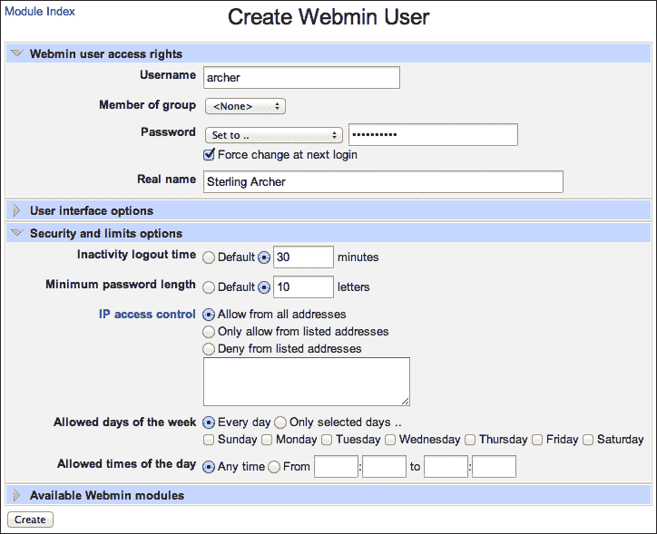
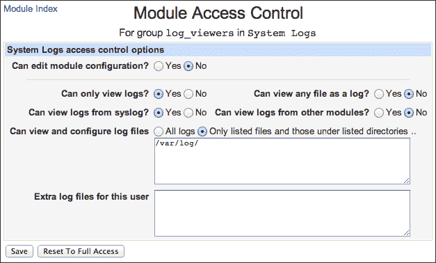
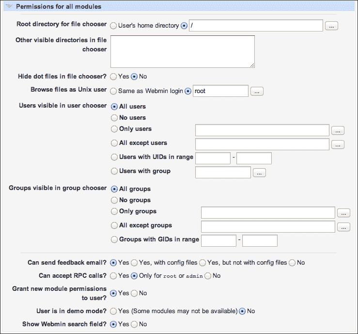
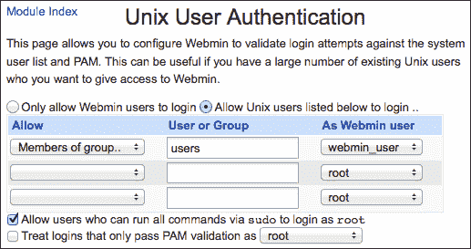
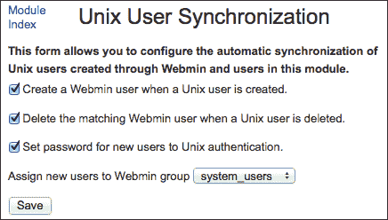
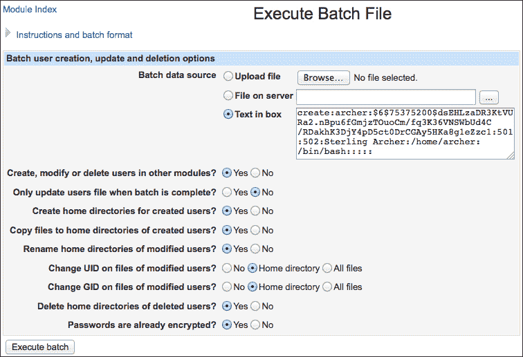

# 第二章 用户管理

在本章中，我们将覆盖：

+   创建 Webmin 用户

+   创建一个具有特定模块和选项访问权限的 Webmin 组

+   允许用户使用系统凭证登录 Webmin

+   基于系统账户创建 Webmin 用户

+   控制当前谁在使用 Webmin

+   创建系统用户账户

+   修改用户的 UID 和其他信息

+   临时禁用用户账户

+   创建和编辑系统组

+   更改用户密码

+   导出用户并将其导入到另一个系统

+   安装 Usermin

# 介绍

Webmin 的用户管理功能非常强大。你可以使用 Webmin 管理系统上的用户和组，决定哪些用户可以访问 Webmin，以及他们可以看到哪些模块。你还可以创建专门的 Webmin-only 用户，这些用户在系统中没有常规账户，但仍然可以访问选定的 Webmin 模块。

如果你是系统的主要管理员，你可以设置 Webmin，让其他管理员仅修改系统配置中的特定部分。例如，你可以允许子管理员配置 Apache 网络服务器，但不能更改其他设置。这个工作流程非常常见，实际上，Webmin 的一个兄弟产品 Usermin 被开发出来，允许非管理员通过类似 Webmin 的环境访问数据库、配置虚拟主机、设置 `cron` 任务以及查看本地邮件。

### 注意

Webmin 区分两种类型的用户：

+   **Unix 用户**（**系统用户**）是你系统的标准用户。通常他们可以通过控制台或 SSH 登录到系统。

+   **Webmin 用户**是专门为 Webmin 创建的账户。这类用户可以登录 Webmin，但可能无法登录系统的其他部分。

任何系统用户都可以被赋予 Webmin 用户的身份。你也可以配置 Webmin，在每次添加或删除系统用户时自动添加或删除 Webmin 账户。由你决定最适合你情况的方式——将 Webmin 用户账户与系统账户分开，还是保持它们的同步。

另一个需要记住的重要概念是 **Webmin 组**。类似于系统组，这是具有特定权限的用户组。你可以决定哪些模块对 Webmin 组的所有成员开放。通常，如果你有多个具有相同权限的用户，应该将他们分配到一个组中，然后将模块权限分配给该组，而不是单独分配给每个用户。这样将使以后的管理变得更容易。

# 创建 Webmin 用户

为某人授予 Webmin 访问权限的最简单方法是为其创建一个 Webmin 用户账户。你可以控制用户允许从哪些 IP 地址登录，甚至可以设置在一周中的哪些时段允许访问。在创建账户时，你可以指定该用户将访问哪些模块，或者他/她将属于哪个组。

在本教程中，我们将创建一个只允许访问单一模块的新用户。

## 准备工作

我们将创建一个仅用于一次的密码的新用户账户，用户在首次登录后必须更改此密码。为了使用该一次性密码，我们需要在 Webmin 中启用一个功能。执行以下步骤来设置密码过期策略：

1.  进入**Webmin** | **Webmin 配置** | **认证**。

1.  设置**密码过期策略**选项为**提示用户输入新密码（密码已过期）**。

1.  Webmin 的服务器进程将会重启；请等待几秒钟后再继续操作。

## 如何操作...

执行以下步骤以创建新的 Webmin 用户：

1.  导航到**Webmin** | **Webmin 用户**界面，然后点击**创建一个新的 Webmin 用户**。

1.  在用户创建界面，指定用户名、密码和用户的真实姓名。你可以为密码设置任意长的随机字符串，因为我们预期用户在首次登录后更改密码。请将密码记录下来，以便我们之后使用。

    ### 提示

    **强密码**是由从大字母表中随机选取的大量字符组成的长字符串。如果你使用所有字母数字字符（a-z, A-Z 和 0–9），那么每个字符大约会为密码强度增加 6 位熵。这意味着，对于一个 128 位密码，你需要一个 22 字符的字符串，对于 256 位强度，你需要 43 个字符，依此类推。你可以使用一个简单的 Perl 一行代码生成伪随机密码，如下所示：

    ```
    $ perl -le'@chars=(a..z,A..Z,0..9,_);$p.=$chars[rand(@chars)] while($i++<22);print $p'
    ```

    如果你希望使用由量子机械白噪声生成的真正随机密码，请访问 GRC 的超高安全密码页面：

    [`www.grc.com/passwords.htm`](https://www.grc.com/passwords.htm)

1.  勾选**下一次登录时强制更改密码**选项：

1.  在**安全性和限制选项**部分，将**不活动注销时间**设置为`30`分钟，并将**最低密码长度**设置为`10`个字符。

1.  在**可用 Webmin 模块**部分，勾选**服务器**部分中的**读取用户邮件**模块。

1.  点击**创建**按钮以创建账户。

## 工作原理...

Webmin 保持自己的用户账户数据库，与系统用户列表分开。账户列表默认保存在`miniserv.users`文件中，路径为`/etc/webmin/`。有关每个账户可以访问哪些模块的信息则存储在`webmin.acl`文件中，路径为`/etc/webmin/`（**acl**代表**访问控制列表**）。

当用户尝试登录 Webmin 时，它会检查这些文件以确定提供的登录信息是否正确，账户是否活动以及用户可以访问哪些模块。基于这些信息，Webmin 登录用户并为其创建一个界面。

## 还有更多...

Webmin 提供额外的功能，使账户管理更加简单。例如，如果您需要创建一些类似的账户，您可以创建一个账户然后克隆它。如果您想预览 Webmin 对特定用户的界面显示，您可以切换到该用户的账户而无需知道他们的密码。

### 克隆一个 Webmin 用户

要克隆已存在的用户账户，请转到**Webmin** | **Webmin Users**，然后点击您想要克隆的用户的用户名。在**编辑 Webmin 用户**屏幕的底部，您会找到一个标有**Clone**的按钮。如果您点击它，将进入一个账户创建页面，选项会根据您克隆的用户的设置预填。

### 切换到用户

如果您想检查 Webmin 为特定用户提供哪些选项，可以转到**Webmin** | **Webmin Users**，点击用户名，然后点击屏幕底部的**Switch to User**按钮。测试完成后，如果此用户无法访问**Webmin Users**模块，则需要注销然后重新登录为自己。

## 另请参见

+   在下一个食谱中，*创建一个具有对特定模块和选项的访问权限的 Webmin 组*，我们将详细介绍如何授予用户对特定模块选项的访问权限。

# 创建一个具有对特定模块和选项的访问权限的 Webmin 组

Webmin 用户应该组织成组。如果您有多个希望拥有相同特权的用户，创建一个组是正确的方式。Webmin 提供非常精细的权限，您可以授予每个组。您可以设置以下三种类型的权限：

+   指定哪些 Webmin 模块对一个组可用

+   设置适用于所有模块的全局权限

+   设置模块级别的访问控制设置，指定每个模块的哪些选项可用

    ### 小贴士

    一个个人账户的权限可以配置为相同粒度。

## 如何做到...

在此食谱中，我们将创建一个仅限于查看`/var/log`目录中日志文件的 Webmin 组：

1.  要创建一个新的 Webmin 组，请导航到**Webmin** | **Webmin Users**，然后点击**Create a new Webmin group**。

1.  将新组命名为`log_viewers`，并提供一个组描述。

1.  在**可用的 Webmin 模块**部分，仅选择**System Logs**，然后点击**Create**。

1.  组创建完成后，我们可以指定更详细的权限。返回**Webmin** | **Webmin Users**，然后在**Webmin 组**部分点击新组的名称。

1.  您将注意到**可用 Webmin 模块**部分中模块的名称现在是链接。点击**系统日志**链接以打开此模块的访问控制配置。

1.  设置权限，如以下截图所示，以仅授予对来自`/var/log`的日志的只读访问权限，没有其他模块权限：

    ### 注意

    注意，完全访问此模块允许用户查看任何文件作为日志。这可能会使用户未经授权地访问系统中的其他文件。

    ### 提示

    您可以通过点击**重置为完全访问**按钮来重置模块权限为完全访问。

让我们验证新组权限是否按预期工作：

1.  根据*创建 Webmin 用户*的步骤为测试创建一个新用户。

1.  在**组成员**列表中选择`log_viewers`，将其分配给他/她。

1.  转到这位新用户的**编辑 Webmin 用户**界面，并点击**切换到用户**按钮。

您将会像新用户一样看到 Webmin，并且您的访问仅限于**系统日志**模块，您只能查看来自`/var/log`的日志。

## 工作原理...

默认情况下，Webmin 将现有组的信息存储在`/etc/webmin/webmin.groups`文件中。有关特定模块权限的信息存储在**访问控制列表**（**ACL**）文件中。每个模块在`/etc/webmin`中都有自己的目录，包含每个组和用户的单独 ACL 文件。例如，名为`module_name`的模块的 ACL 文件组和名为`group_name`的组将存储在`/etc/webmin/module_name/group_name.gacl`。名为`user_name`的用户的类似文件将存储在`/etc/webmin/module_name/user_name.acl`中。每当用户访问模块时，Webmin 都会检查这些文件，并确定要向他们提供哪些选项。

### 注意

每个 ACL 文件的确切结构特定于其各自的模块；当升级 Webmin 到新版本时，这些文件也可能会发生变化。手动编辑这些文件需要熟悉模块的内部代码，因此最好通过 Webmin 的界面来编辑权限。

## 更多信息...

除了特定模块的访问权限外，Webmin 还允许您指定全局权限，这些权限修改了所有模块的行为。

### 所有模块的权限

要为组设置 Webmin 全局权限，请转到**Webmin** | **Webmin 用户**，点击组名，并打开**所有模块的权限**部分。

在这里，您可以设置当模块要求用户选择文件时在 Webmin 文件选择器中可见的文件，哪些用户和组将在其选择器小部件中可见，以及其他全局选项：



## 参见

+   你可以为每个希望分配到某个组的用户创建 Webmin 账户，也可以设置 Webmin 为所有系统组的成员自动创建账户，并将他们分配到一个 Webmin 组。有关更多信息，请参阅配方，*基于现有系统用户账户创建 Webmin 用户*。

# 允许用户使用系统凭证登录 Webmin

Webmin 的默认设置不允许普通系统用户登录 Webmin，但至少在安装后允许一个用户登录。根据你的 Webmin 包中的设置，可能会有以下几种情况：

+   root 用户

+   具有`sudo`权限的用户（特别是那些拥有`ALL=(ALL) ALL`规则的用户）

+   手动安装 Webmin 时创建的用户

在本配方中，我们将允许所有 Unix 组的用户以有限权限登录 Webmin。

## 准备工作

我们需要首先创建一个标准的 Webmin 账户，所有我们授予访问权限的系统用户将共享此账户。请参考配方，*创建 Webmin 用户*，按照说明创建一个名为`webmin_user`的 Webmin 账户，并为其分配特定权限。

## 如何操作...

按照以下步骤，允许系统组的成员登录 Webmin：

1.  导航到**Webmin** | **Webmin 用户** | **配置 Unix 用户认证**界面。

1.  选择**允许下列 Unix 用户登录**单选按钮。

1.  选择选项，允许**组成员**的用户以您为此目的创建的 Webmin 用户身份登录。

1.  如果你的标准用户名为`webmin_user`，你的界面将类似于以下截图：

1.  点击**保存**按钮以保存您的设置。

从现在开始，所有属于`users`组的 Unix 用户都可以登录 Webmin，并拥有与您选择的 Webmin 用户相同的权限。

## 工作原理...

如果我们使用前述配置，Webmin 将会根据你系统中配置的**可插拔认证模块**（**PAM**）服务来验证登录凭证。在其基本设置中，PAM 会根据存储在标准系统文件（`/etc/passwd` 和 `/etc/shadow`）中的凭证进行验证。

### 注意

如果系统上的 PAM 配置有所不同，登录信息可能会通过外部服务（如 LDAP、NIS、Kerberos、Active Directory）进行验证，或者在 SQL 数据库中查找。默认情况下，Webmin 使用系统的通用配置（`system-auth` 或 `common-auth`），但也可以使用它自己的单独设置。

Webmin 还会检查认证用户所属的系统组。如果这些组中有任何一个列在 Webmin 的配置中，或者该用户账户单独列出为允许登录，用户将以关联的 Webmin 账户登录。

## 还有更多…

为了允许通过`sudo`具有无限制访问权限的用户以`root`身份登录 Webmin，请按以下步骤操作：

1.  导航到**Webmin** | **Webmin 用户** | **配置 Unix 用户认证**。

1.  勾选**允许可以通过 sudo 执行所有命令的用户以 root 身份登录**复选框。

1.  点击**保存**。

# 基于系统账户创建 Webmin 用户

在之前的食谱中，我们讨论了创建 Webmin 用户并允许系统用户以选定的 Webmin 账户登录。您也可以选择让 Webmin 账户和系统账户之间有一个更直接的一对一对应关系。您可以通过为已存在的选定用户创建 Webmin 账户，并为未来添加的用户设置账户同步来实现这一点。

## 准备工作

在本食谱中，我们将为每个系统用户创建一个 Webmin 账户。所有新的 Webmin 账户将被分配到一个 Webmin 组。在开始之前，请按照食谱设置 Webmin 组，*创建一个具有特定模块和选项访问权限的 Webmin 组*。

## 如何操作...

我们的第一步是为现有的系统用户创建 Webmin 账户：

1.  导航到**Webmin** | **Webmin 用户** | **将 Unix 用户转换为 Webmin 用户**。

1.  选择您希望添加到 Webmin 的用户。

1.  选择要分配给他们的 Webmin 组。

1.  点击**立即转换**。

所有选定用户的 Webmin 账户现在应该已经创建。您可以在**Webmin 用户**屏幕上查看它们。

第二步是指示 Webmin 自动为所有新创建的系统用户创建账户：

1.  导航到**Webmin** | **Webmin 用户** | **配置 Unix 用户同步**。

1.  勾选复选框，在系统账户创建和删除时创建和删除 Webmin 账户。

1.  同时，选择**将新用户的密码设置为 Unix 认证**选项：

1.  选择您希望新用户添加到的 Webmin 组，并点击**保存**。

从现在起，每个新创建的系统账户将与自动创建的 Webmin 账户关联。

### 注意

请注意，Webmin 不会同步通过命令行创建的账户或通过直接编辑系统配置文件创建的账户。只有通过 Webmin 创建的系统账户才会接收关联的 Webmin 账户。

## 它是如何工作的...

Webmin 会检查您的系统配置文件（`/etc/passwd` 和 `/etc/group`），找到系统用户列表，并根据您的选择创建相应的 Webmin 账户。

### 注意

实际上，Webmin 并不直接读取 `passwd` 文件，而是使用如 `getpwent` 这样的系统调用来检查系统的密码数据库。这意味着账户信息也可以从数据库或外部服务（如 NIS 或 LDAP）读取。

如果您设置了用户同步，Webmin 会在其用户创建功能中添加一个额外的步骤，自动为每个新系统用户设置一个新的 Webmin 账户。

# 控制当前谁在使用 Webmin

Webmin 会记录所有用户执行的操作。您可以查看当前打开的用户会话列表，检查在会话期间执行了哪些操作，或者关闭会话，强制用户注销。

## 如何操作...

执行以下步骤检查当前登录到 Webmin 的用户：

1.  导航到**Webmin** | **Webmin 用户**。

1.  点击**查看登录会话**图标。

1.  要查看用户在本次会话中执行的操作，请点击任何会话旁边的**查看日志**链接。

你可以关闭任何会话，除了你自己的会话，并强制用户重新登录。要执行此操作，请点击**会话 ID**列中的链接。下次该用户点击链接或提交表单时，系统将要求其重新登录。

## 它是如何工作的...

每当用户登录时，Webmin 会为其创建一个会话。一个会话由一个特定的 ID 和与该会话所有者及其是否处于活动状态相关的信息组成。

会话 ID 会通过安全 cookie 传递给用户的浏览器，借此 Webmin 能识别来自同一用户的后续请求。该标识符存储在 Webmin 的日志文件中，用于将用户在登录和注销期间执行的操作分组。你可以在 Webmin 的日志中搜索与任何会话相关的操作。

如果你选择结束会话，Webmin 会从活动会话列表中删除该会话的标识符。当用户再次向 Webmin 发出请求时，cookie 中传递的会话标识符将不再被识别，用户需要重新登录，从而创建一个新会话。

# 创建系统用户账户

在 Unix 中创建用户账户是一个多步骤的过程：你需要将用户数据添加到系统配置文件中，创建主目录，将模板文件复制到该目录，并将这些文件的所有权设置为新用户。Webmin 为你自动化了这个过程。

### 提示

此外，如果你设置了同步，Webmin 还会为新用户创建一个 Webmin 账户。有关账户同步的更多信息，请参考食谱 *基于现有系统账户创建 Webmin 用户*。

## 准备工作

我们将创建一个新用户账户，并为其设置一次性密码，用户在第一次登录后需要更改密码。为了允许用户通过 Webmin 更改密码，请前往**Webmin** | **Webmin 配置** | **身份验证**，并将**密码过期策略**选项设置为**提示用户在密码过期时输入新密码**。

## 如何操作...

执行以下步骤创建一个系统用户账户：

1.  导航到**系统** | **用户和组**，然后点击**创建新用户**。

1.  提供基本账户信息：**用户名**和**真实姓名**。

1.  将**用户 ID**和**主目录**设置为**自动**。

1.  将用户的默认 shell 设置为 `/bin/bash`。

1.  对于**密码**，选择**普通密码**，并在文本框中输入一个长的随机字符串。保存这个字符串。在**密码选项**中，回答**是**，以启用**下次登录时强制更改密码**。

    ### 提示

    查看食谱 *创建 Webmin 用户*，其中包含有关生成强密码的说明。

1.  在**组成员资格**中将主组保留为系统默认设置。

1.  在**创建时**部分的问题中，回答**是**，以创建用户主目录并复制模板文件。

1.  同样，回答**是**，以确定是否在**其他模块中创建用户**。

1.  点击**创建**。

1.  将新的用户名和密码发送给用户。用户将在首次登录后被要求更改密码。

## 工作原理...

这里发生了许多操作，我们一步步来看。

我们要求 Webmin 为我们指定的真实姓名的用户创建一个帐户。用户将能够使用我们提供的用户名登录。我们告诉 Webmin 自动生成**用户 ID**和**主目录**。UID 将是比 500 或 1000 更高的第一个可用整数，具体取决于系统。主目录将放置在`/home/`下，并以用户名命名。

我们将用户的 Shell 设置为`/bin/bash`，这是大多数现代 Linux 发行版的默认用户 Shell。如果您的用户更喜欢使用其他 Shell，如`ksh`、`zsh`或`fish`，可以在安装该 Shell 的包后在此处进行设置。

### 提示

如果您希望防止用户登录系统控制台（或通过 SSH 和 FTP 登录），可以将 Shell 设置为`/bin/false`。这将阻止 Shell 访问，但允许用户使用其他不需要 Unix 用户身份验证的系统服务，如电子邮件或 Webmin。

接下来，我们为用户创建了一个一次性密码。无论用户通过控制台还是 Webmin 登录，首次登录后都将强制要求用户更改密码。

在创建帐户时，我们需要将用户分配到一个主组中。在一些系统中，默认组会被命名为`users`；而其他系统则会为新用户创建一个私有组，名称与用户相同。作为系统管理员，您可以根据需要决定如何使用这些组。

因为我们回答了**是**，设置主目录的问题，Webmin 为我们处理了这个问题，并为新用户创建了目录及所需的所有文件。

最后，通过回答**是**，以确定是否在其他模块中创建用户帐户，我们告诉 Webmin 将新帐户的信息提供给 Webmin 的其他部分。这样，新用户将在其他模块的配置设置中可用（例如，文件共享）。

# 修改用户的 UID 和其他信息

修改现有用户的基本信息通常很简单。这个规则的例外是更改用户的 UID。如果用户在两个不同的 Unix 系统上有账户，且两个系统都必须识别为同一个人时，可能需要进行 UID 更改。一个典型的例子是通过 NFS 共享文件，正如我们将在第六章中讨论的那样，*管理系统中的文件*。

更改 UID 需要更新该用户所有文件的所有权。这可能会非常繁琐，但 Webmin 会为我们完成这项工作。

## 如何操作...

按照以下步骤修改用户的 UID：

1.  导航至**系统** | **用户和组**，然后点击你要编辑的账户的用户名链接。

1.  在下一个页面，你将能够编辑所有基本的用户信息，包括用户名、ID、主目录位置、选择的默认 Shell 程序、主组和次组等。

1.  将**用户 ID**更改为不同的值。

1.  在**保存时**部分，回答**所有文件**来响应**是否更改文件中的用户 ID？**的问题。

1.  如果你确定用户只在自己的主目录中拥有文件，你可以限制更新为**主目录**。

    ### 注意

    限制文件更新到用户的主目录会加快速度，但任何属于用户但位于其他目录中的文件将会成为孤儿文件。如果稍后创建了一个新用户，并且使用了剩余的 UID，那么这些文件可能会意外地归新用户所有。只有在你确信用户不拥有任何位于主目录外的文件时，才选择这个选项。

1.  点击**保存**。

    ### 提示

    你可以使用相同的方法来更改用户主组的 GID。

## 它是如何工作的...

Webmin 会用你提供的信息更新用户的系统数据。然后，它会扫描磁盘，查找属于该用户的文件，并更新文件所有者的 UID。

# 暂时禁用用户账户

如果一个人不再使用你的系统，通常最好不要删除他们的账户，而是禁用它。也许你需要保留数据以便进行取证，或者该用户将来可能需要再次访问系统，或者该用户是你系统上某些文件的所有者，而你不想删除这些文件或让它们变成孤儿文件。

## 如何操作...

通过 Webmin 禁用用户账户非常简单。执行以下步骤即可：

1.  导航至**系统** | **用户和组**，然后点击你要编辑的账户的用户名链接。

1.  在下一个页面，勾选标有**暂时禁用登录**的框。

1.  点击**保存**。

    ### 提示

    你可以通过相同的步骤重新启用账户。只需取消勾选**暂时禁用登录**框，然后点击**保存**。

## 它是如何工作的...

要禁用用户账户，Webmin 会更新`/etc/shadow`文件，该文件存储哈希过的用户密码。所选用户的密码哈希会被一个感叹号（`!`）前置，这会使哈希失效并使密码无法使用，从而用户将无法再登录。去除感叹号将重新启用账户。

# 创建和编辑系统组

通过 Webmin 创建和编辑系统组非常简单，只需按照所列的步骤操作即可。

## 如何操作...

我们首先通过以下步骤来创建一个组：

1.  导航至**系统** | **用户和组**，然后点击**本地组**标签。

1.  点击**创建新组**。

1.  在下一个页面，你将被要求指定基本的组信息。将**组名**设置为选择的名称，并将**组 ID**保持为**自动**。忽略密码字段。

1.  现在，您可以通过将用户从左侧列移动到右侧列，向组中添加您选择的任何用户。

1.  点击**创建**以完成并创建该组。

现在，您可以通过执行以下步骤来编辑该组：

1.  返回**系统** | **用户和组**，并点击**本地组**标签。

1.  点击**组名**列中的组链接。

1.  系统将带您到一个类似于创建组时使用的表单界面，唯一的区别是，如果您现在更改组的 ID，您可以告诉 Webmin 使用新 ID 更新系统中的文件。

1.  点击**保存**按钮以保存更改。

## 它是如何工作的...

根据您使用的操作系统，Webmin 将直接修改存储组信息的系统文件(`/etc/group`, `/etc/gshadow`)，或使用专用工具更新组信息（例如 OS X 上的`dscl`—目录服务命令行工具）。

当您更改组的 GID 时，Webmin 还会扫描您的文件系统，并更新该组拥有的所有文件的 GID。

# 更改用户密码

当用户忘记密码时，他/她会联系您作为系统管理员并请求密码提示。出于安全原因，密码仅以加密哈希的形式存储在您的系统中，而不是明文。因此，您无法向用户发送密码，但可以重置密码并将新密码发送给用户。在这种情况下，最佳做法是将新密码设置为仅能使用一次，允许用户登录，但要求他/她立即将其更改为自己选择的密码。

在本教程中，我们将描述如何将用户的密码重置为一次性密码。

## 准备工作

为了在 Webmin 中使用一次性密码，我们需要启用此功能。请转到**Webmin** | **Webmin 配置** | **身份验证**，并将**密码过期策略**选项设置为**提示用户输入新密码以更改已过期的密码**。

## 如何操作...

执行以下步骤以更改用户密码：

1.  导航至**系统** | **用户和组**，并点击您要更改密码的帐户的用户名链接。

1.  在**密码**部分，选择**普通密码**，并输入一长串随机字符。请记下这串字符，因为稍后我们会将其作为一次性登录密码发送给用户。

    ### 提示

    查看教程*创建 Webmin 用户*，了解如何生成强密码的相关说明。

1.  在**密码选项**部分，对**下次登录强制更改密码？**问题选择**是**。

1.  点击**保存**以提交更改。

1.  将新的一次性密码发送给用户。

## 它是如何工作的...

Webmin 会修改系统的密码文件(`/etc/shadow`)，使用我们提供的新字符串更新用户存储的密码哈希。

您的系统还会记录密码上次更改的时间。Webmin 会将此设置更改为 0（等同于 1970 年 1 月 1 日）。这会导致系统在用户下次登录时要求更改密码。Webmin 也会尊重此设置，并在用户登录 Webmin 时要求其更改密码。请注意*准备工作*部分中描述的步骤。

# 将用户导出并导入到另一台系统

当您为组织设置另一台服务器时，可能需要在新系统上重新创建多个用户账户。Webmin 的用户管理模块可以将现有用户账户的数据导出到一个特殊的**批处理文件**，然后您可以将该文件导入到任何运行 Webmin 的其他系统中。这样可以快速且轻松地重新创建多个账户。

## 如何操作...

在本教程中，我们将从一台系统（源系统）导出选定的用户，并将它们导入到第二台系统（目标系统）中。

我们首先按照以下步骤导出用户：

1.  在源系统上，导航到**系统** | **用户和组**，然后点击标记为**导出到批处理文件**的链接。

1.  将**批处理文件格式**设置为**标准的 passwd 和 shadow 文件**。

    ### 提示

    请注意，您应使用与目标操作系统兼容的导出格式。如果您导出到 Linux 系统，请使用**标准**格式；但如果是导出到 BSD、Mac OS 或 AIX 系统，则应使用这些系统特定的格式。导入大量账户之前，务必先在少量用户账户上进行测试。

1.  将**批处理文件目标**设置为**在浏览器中显示**。

1.  将**要导出的用户**设置为**仅用户**，然后点击行末的省略号（**...**）。

1.  将弹出一个新的用户选择窗口，您可以在其中选择要导出的账户名称。

1.  通过点击屏幕左侧用户名，选择账户。如果您选错了账户，可以通过点击右侧**已选用户**中列出的账户名来移除它。选择完成后，点击**确定**。

1.  回到**导出批处理文件**界面，点击**立即导出**。

1.  结果批处理文件将作为文本显示在您的浏览器中；您可以将其复制到剪贴板或保存为本地文件。

现在，您可以将账户导入到另一台机器中。

1.  在目标系统上，导航到**系统** | **用户和组**，然后点击标记为**运行批处理文件**的链接。

1.  将**批处理数据源**设置为**文本框中的文本**，并将导出的批处理文件内容粘贴到提供的文本区域中。

1.  对以下问题回答**是**：

    +   **在其他模块中创建、修改或删除用户？**

    +   **为创建的用户创建主目录？**

    +   **将文件复制到创建的用户的主目录？**

    +   **密码已经加密？**

1.  您的屏幕应类似于以下截图：

1.  点击**执行批处理**以导入账户。

## 它是如何工作的...

Webmin 使用一个简单而强大的文件格式来描述其对用户和组的操作。此文件中的每一行描述一个单独的操作，操作可以是 `create`、`modify` 或 `delete`。每行中的字段由冒号字符（`:`）分隔，类似于 Unix 用户文件（`/etc/passwd`）的格式。第一字段是操作名称，第二字段包含我们希望执行操作的用户或组的名称，后续字段包含附加数据。

以下是 Webmin 批处理文件格式的简要说明：

### Webmin 用户操作的批处理文件格式

Webmin 的批处理指令以文本形式编写，每行描述一个操作。以下标准格式用于 Linux 系统用户的操作：

```
create:username:passwd:uid:gid:realname:homedir:shell:min:max:warn:inactive:expire
modify:oldusername:newusername:passwd:uid:gid:realname:homedir:shell:min:max:warn:inactive:expire
delete:username
```

Webmin 批处理指令中使用的字段类似于标准 Unix 系统文件中存储的字段。以下是 Webmin 批处理指令中使用的各个字段：

+   `username`：这是我们希望执行操作的账户的用户名（例如，`archer`）。

+   `oldusername` 和 `newusername`：这两个字段用于**修改**操作。用户名字段使用两次，以防我们想要更改其值。第一次是当前的用户名，第二次是我们希望更改成的值。如果不想更改用户名，可以将 `newusername` 留空。

+   `passwd`：这是可能已加密为哈希值或以明文提供的密码（例如，`myVeryLongPassword123456789`）。如果此字段只包含一个 `x` 字符，则表示账户已被锁定。

+   `uid`：这是用户的 ID，表示为一个数字（例如，`500`）。如果此字段为空，Webmin 将自动分配一个 ID。

+   `gid`：这是用户主组的 ID（例如，`500`）。如果在 `create` 操作中此字段为空，Webmin 将自动创建一个与用户同名的新组。

+   `realname`：这是用户的真实姓名（例如，`Sterling Archer`）。

+   `homedir`：这是用户的主目录（例如，`/home/archer`）。

+   `shell`：这是用户的默认 shell 程序（例如，`/bin/bash`）。

+   `min`：这是系统允许用户更改密码的最短天数。你可以将此值设置为 `0`，以取消此限制。

+   `max`：这是系统强制用户更改密码的最长天数。将其设置为 `0` 以取消此功能。

+   `warn`：这是密码过期前的天数，在此期间用户将被警告即将到来的密码更改。

+   `inactive`：这是密码过期后的天数，在此期间用户仍可以登录并更改密码。超过此时间后，用户将无法登录。

+   `expire`：这是密码过期的日期，以自 1970 年 1 月 1 日以来的天数表示。

    ### 提示

    如果你正在执行 `modify` 操作，你可以保持所有字段为空，除了你想要更改的字段。

### Webmin 的批处理文件格式用于对组进行操作

以下格式用于对系统组的操作：

```
create:groupname:passwd:gid:member,member,...
modify:oldgroupname:newgroupname:passwd:gid:member,member,...
delete:groupname
```

以下字段被使用：

+   `groupname`：这是我们想要操作的组的名称（例如，`users`）。

+   `oldgroupname` 和 `newgroupname`：这些字段用于**修改**操作。组名字段使用两次，以防我们想要更改其值。第一次是组的当前名称，第二次是我们希望设置的新值。

+   `passwd`：组密码并不常用。它们可能用于限制用户将自己添加到组中的权限。将此字段设置为星号或感叹号（`*` 或 `!`）来禁用此功能。

+   `gid`：这是组的 ID（例如，`100`）。如果此字段为空，Webmin 将自动将其设置为下一个可用的值。

+   `member`：这是应该成为此组成员的用户账号的用户名（例如，`archer`）。

## 还有更多…

Webmin 的批处理文件格式可以用来对系统用户和组进行操作。此功能不仅限于系统之间导出和导入数据，批处理文件还可以快速修改或删除多个账户。

### 导出和导入系统组

为了将一个系统的系统组列表导出到另一个系统，你可以按照以下步骤操作，但在你导航到**系统** | **用户和组**时，执行导入和导出之前，切换到**本地组**选项卡。

### 批量更新用户账户

假设你发现自己处于需要更改所有系统用户账户的情况。假设我们决定将所有账户的默认 shell 程序更改为 `zsh`。为此，你应该为每个用户准备一个批处理文件，其中 `username` 被每个账户的用户名替代：

```
modify:username:::::::/bin/zsh:::::
```

接下来，导航到**系统** | **用户和组**；点击标记为**运行批处理文件**的链接，提供你的批处理文件并执行它。这将更新所有用户账户的默认 shell 程序。

相同的方法也可以用于更新任何标准账户字段的值。

### 批量删除用户账户

如果你需要删除大量用户，可以为每个用户创建一个批处理文件，其中`username`由每个用户的名称替代：

```
delete:username
```

我们按照之前描述的方式运行文件。

### 提示

你可以使用相同的方法删除多个组；只需使用组名代替用户名，并在执行批处理文件之前切换到**本地组**选项卡。

## 参见

+   你可以在 Webmin 的 wiki 上找到更多关于使用 Webmin 批处理格式的信息：[`doxfer.webmin.com/Usermin/Introduction`](http://doxfer.webmin.com/Usermin/Introduction)。

# 安装 Usermin

如果你希望通过类似 Webmin 的界面向系统用户提供基本功能，可以使用 Webmin 的伴侣产品——Usermin。这个环境与 Webmin 一样易于使用，并提供一些不需要管理员权限的功能：

+   阅读邮件

+   设置邮件转发和自动回复

+   设置定时邮件

+   更改密码

+   执行系统命令

+   在浏览器中打开 SSH 会话

+   配置 Apache 虚拟主机

+   配置 MySQL 或 PostgreSQL 数据库

+   设置 CRON 作业或定时命令执行

## 如何操作…

安装 Usermin 非常简单，使用方式也类似 Webmin。主要区别在于你连接到不同的端口；Usermin 的默认端口是 20000。

让我们从安装 Usermin 开始：

1.  如果你是通过 Webmin 的仓库安装的，请按照第一章中的*安装软件包*步骤，安装名为`usermin`的包。

    ### 小提示

    如果你是从包文件而非仓库安装的 Webmin，请前往**未使用模块** | **Usermin 配置**，点击标有**安装 Usermin 包**的按钮。

1.  安装包后，在 Webmin 的侧边栏菜单中点击**刷新模块**并重新加载 Webmin。

安装后，Usermin 会自动启用。Usermin 的使用方式与 Webmin 相似。Usermin 的默认端口是 20000，因此你可以通过 Web 浏览器连接到它，使用以下地址；只需将`webmin.host`替换为服务器的 IP 地址或域名：

```
https://webmin.host:20000
```

你现在可以以任何系统用户身份登录，探索 Usermin 的功能。

Usermin 的配置是通过 Webmin 完成的，配置选项位于**Webmin** | **Usermin 配置**模块中。请注意，这个界面与 Webmin 的主设置界面类似。配置选项相似，但仅限于 Usermin 的功能。

首先，让我们决定哪些用户可以访问 Usermin：

1.  前往**Webmin** | **Usermin 配置** | **允许的用户和组**。

1.  在**Usermin 登录访问控制**部分，选择**仅允许列出的用户**。

1.  你现在可以提供一个用户列表，指定哪些用户可以访问 Usermin。如果你希望将一个组的所有成员添加到列表中，请在组名之前加上`@`符号，即`@groupname`。

其次，让我们决定哪些 Usermin 模块可以使用：

1.  前往**Webmin** | **Usermin 配置** | **可用模块**。

1.  勾选你希望用户可以使用的模块旁边的框。如果你不确定某个模块的功能，最好先不勾选它，直到你确定需要它为止。

1.  为了配置每个模块的特定选项，请前往**Webmin** | **Usermin 配置** | **Usermin 模块配置**。

1.  点击模块名称并设置其选项。

1.  你将能够设置模块的全局选项（**全局模块配置**标签）和默认值，用户可以在(**默认用户首选项**标签)中进行覆盖。

## 它是如何工作的...

Usermin 是 Webmin 的附加包，默认安装在目录`/usr/share/usermin`中。它的功能与 Webmin 相似，但专注于提供无需 root 权限的基本功能访问。

## 另请参见

由于 Usermin 的功能类似于 Webmin，你可以参考本书中的其他章节，了解其使用和配置，特别是以下章节：

+   第一章, *设置你的系统*

+   第八章, *运行 Apache Web 服务器*

+   第九章, *运行 MySQL 数据库服务器*

+   第十章, *运行 PostgreSQL 数据库服务器*

你可以在以下网址找到有关 Usermin 的更多信息：[`doxfer.webmin.com/Usermin/Introduction`](http://doxfer.webmin.com/Usermin/Introduction)
