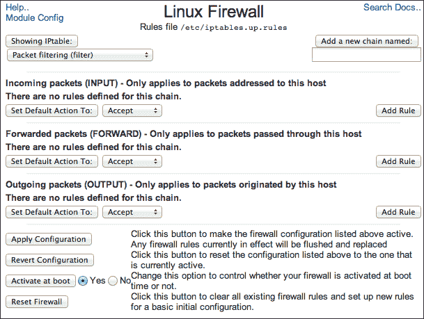

# 第三章：保护你的系统

在本章中，我们将涵盖以下主题：

+   设置 Linux 防火墙

+   允许通过防火墙访问某项服务

+   通过端口扫描验证防火墙

+   关闭不必要的服务

+   验证密码强度

+   禁用 SSH 上的 root 登录

+   限制 Webmin 访问特定的 IP 地址

+   通过 SSH 隧道安全地连接到 Webmin

+   自动关闭不活动的 Webmin 会话

# 介绍

有些人说，唯一安全的机器就是关闭的那一台。这可能是真的，但那台机器并不太有用。如果你想让你的服务器更具功能性，你必须将其打开，并且很可能会暴露给互联网上好奇的目光。

在线计算机安全是一个足够庞大的话题，值得专门撰写一本书。事实上，有一整排这样的书籍可以随时获取。在本章中，我们将学习一些基本技巧，这些技巧将帮助你在将服务器上线之前保护你的服务器。如果你的服务器暴露在互联网上，跟进进行更深入的安全研究，并且每天监控你的机器的运行状况是一个好主意。因为这是一本关于 Webmin 的书，所以我们只讨论 Webmin 可以帮助的领域。

本章分为三个部分：

+   我们将首先列出一个系统管理员应当牢记的安全问题基础检查清单。如果 Webmin 可以帮助你解决这些问题，我们会在本书中指引相应的配方。

+   本章的前六个配方涵盖与一般系统安全相关的主题。

+   剩余的配方将涉及如何保护 Webmin 本身。

## 服务器安全检查清单

有一些基本的安全预防措施，你应当在任何暴露于互联网的计算机系统上采取。这份清单并不全面；可能还有其他你想要做的事情，但这是一个很好的起点，你不应忽视这些领域。

### 保持系统更新

软件从来不完美，错误每天都会被发现。这些错误有的只是令人不便，但有些则可能被恶意人士利用，入侵你的机器。保持系统更新，及时安装安全补丁，是在线系统维护中的关键部分。有关如何保持更新的信息，请参考第一章中的*更新已安装的包到最新版本*和*当新版本的包发布时通过电子邮件提醒*配方。

### 关闭不必要的服务

如果你的 FTP 服务器软件存在安全漏洞，但该服务未在运行，那么这个漏洞的危险性就不会太大。关闭所有不必要的服务以减少系统的暴露面是个好主意。有关此主题的更多信息，请参考本章中的*关闭不必要的服务*和*通过端口扫描验证防火墙*配方。

### 为你的系统构建防火墙

你可以使用包过滤软件来限制对你系统的访问。你可以决定是否只允许来自互联网上特定区域的人连接，哪些端口应该接受连接，或者某些服务是否仅在本地可用。有关更多信息，请参阅本章中的*设置 Linux 防火墙*和*通过防火墙允许访问服务*配方。

### 执行备份

如果发生故障，保持所有重要数据的备份非常重要，最好是存储在另一个系统中，且位置不同。有关更多信息，请参阅第七章，*备份你的系统*。

### 监视你的系统

如果服务器出现问题，确保你是第一个知道的人很重要。密切关注系统日志，并设置系统自动发送包含日志更新的电子邮件。如果有人入侵你的系统，他们可能会篡改日志。因此，将日志保存在一个单独的专用日志服务器上是个好主意。有关更多信息，请查看第五章，*监视你的系统*。

### 验证密码强度

无论你的安全措施有多严格，如果你将 root 密码设置为 `root` 或 `admin`，你的服务器肯定会被黑客入侵。同样，你应定期验证用户密码的强度。请参阅本章中的*验证密码强度*配方。实际上，完全禁用 root 通过 SSH 登录是个好主意。有关此内容，请查看*禁用 root 通过 SSH 登录*配方。

### 验证系统安全性并设置入侵检测和防御软件

以下内容超出了本书的范围。然而，如果你希望确保服务器尽可能安全，你应当实现以下流程：

+   定期进行安全审计（使用像 Nessus 这样的工具）。

+   设置入侵检测和防御系统（OSSEC、Bro 网络安全监视器或 Snort）。

+   扫描病毒和恶意软件（ClamAV 和 Linux Malware Detect）。

+   检查 rootkit（chkrootkit 和 rkhunter）。

    ### 注意

    以下系统的更多信息可以在它们的网页上找到：

    **Nessus**: [`www.tenable.com/products/Nessus`](http://www.tenable.com/products/Nessus)。

    **OSSEC**: [`www.ossec.net`](http://www.ossec.net)。

    **Bro**: [`www.bro.org`](http://www.bro.org)。

    **Snort**: [`www.snort.org`](http://www.snort.org)。

    **ClamAV**: [`www.clamav.net`](http://www.clamav.net)。

    **Linux Malware Detect**: [`www.rfxn.com/projects/linux-malware-detect/`](https://www.rfxn.com/projects/linux-malware-detect/)。

    **chkrootkit**: [`www.chkrootkit.org`](http://www.chkrootkit.org)。

    **rkhunter**: [`rkhunter.sourceforge.net`](http://rkhunter.sourceforge.net)。

    ### 提示

    Backtrack 是一个 Linux 发行版，预装了大量的安全工具。它是进行安全测试和审计服务器的一个良好起点。更多信息可以在线查看[`www.backtrack-linux.org`](http://www.backtrack-linux.org)。

# 设置 Linux 防火墙

Linux 系统内置了防火墙软件。这个数据包过滤框架被称为**netfilter**（自 Linux 2.4 版本起）。它通过一个名为`iptables`的工具来控制，该工具指示内核如何处理传入和传出的网络数据包。

在这个教程中，我们将从一个空的`iptables`配置（防火墙禁用）开始，并配置它丢弃任何传入的网络包，除非是我们明确允许的。在设置防火墙之前，我们应该回顾一些与网络通信和`iptables`组织相关的基本概念。

以下是一些基本的数据包过滤概念：

+   **数据包**：互联网是一个分组交换网络。这意味着所有的通信都是通过将内容拆分成称为数据包的小块来实现的，这些数据包从一个计算机传递到网络中的另一个计算机。

+   **IP 地址**：互联网上的机器地址由数值 IP 地址指定，例如`93.184.216.119`（IPv4）或`2606:2800:220:6d:26bf:1447:1097:aa7`（IPv6）。

+   **端口号**：大多数常见应用程序使用 TCP 或 UDP 传输协议，这些协议需要一个特定的端口号来区分同一台计算机上运行的不同服务。

+   **数据包头**：每个经过网络的数据包都包含一个头部，指明它来自哪里以及将去向何方。这使得互联网上的路由器能够将数据包引导到正确的方向，或者向发送方发送错误信息。

+   **数据包过滤**：防火墙软件能够检查数据包头部，并决定是否允许某个特定的数据包继续传输，或者应该丢弃它。

## 一些 iptables 术语

`iptables`工具能够对数据包执行一组相当复杂的操作。用于决定数据包命运的规则被分为几个层次的组织，具体如下：

+   **表**：这是最高级别的组织方式。`iptables`工具允许你过滤网络数据包（使用`filter`表），设置网络地址转换系统（使用`nat`表），或修改数据包（使用`mangle`表）。我们将重点关注数据包过滤功能（`filter`），以创建一个防火墙。

+   **链**：每个表包含多个规则链，这些链会在特定情况下应用。`filter`表中内置的链分别是`INPUT`（应用于进入系统的数据包）、`OUTPUT`（应用于系统产生的数据包）和`FORWARD`（应用于进入系统但目标为其他系统的数据包）。在本教程中，我们将重点关注传入流量和`INPUT`链。

+   **规则**：任何通过防火墙的数据包都会与相应链中的规则进行比较。规则可以根据特定的源或目标 IP 地址、端口号进行匹配，也可以根据特定的网络接口、协议或连接状态进行匹配。规则按特定顺序尝试，第一个匹配数据包的规则将决定数据包是被接受还是丢弃。

+   **默认策略**：如果数据包没有匹配任何规则，其处理方式将由链的默认策略决定。

## 准备工作

在本教程中，我们将从头开始设置防火墙配置，并重置系统可能自带的任何配置。这并非必要，如果您知道`iptables`的工作原理，您可以基于系统默认的防火墙配置进行修改。在这种情况下，您可以跳到教程*通过防火墙允许访问某服务*部分。

Webmin 还提供了一系列预定义的配置，您可以用来初始化防火墙。这些配置在启用防火墙后或通过导航到**网络** | **Linux 防火墙**并点击**重置防火墙**时可用。Webmin 的预定义防火墙配置选项如以下截图所示：


以下表格描述了 Webmin 预定义的防火墙配置的作用：

| 选项 | 描述 |
| --- | --- |
| **允许所有流量** | 这是一个没有任何规则的配置，默认情况下允许所有流量通过。 |
| **阻止所有外部接口的传入连接** | 这将防止网络连接到您的服务器，仅允许已建立的连接和基本的 DNS 和 ICMP 数据包通过。 |
| **阻止所有除 SSH 和 IDENT 外的外部接口连接** | 这与*阻止所有外部接口的传入连接*相同，但允许传入的 SSH 连接，且不幸的是，允许**身份识别协议**（**IDENT**）的请求。建议不要允许后者。 |
| **阻止所有除 SSH、IDENT、ping 和高端口之外的接口连接** | 这与*阻止所有除 SSH 和 IDENT 外的外部接口连接*相同，但还允许服务器响应 ping 命令，并允许访问 1024 到 65535 范围内的大多数端口。这些高端口可能会被非 root 用户启动的进程用来接受连接。在开放的互联网环境中不应使用此配置。 |
| **阻止所有，除了用于虚拟主机的端口，在接口** | 这允许对大多数常用服务的传入连接，例如 SSH、HTTP、邮件、FTP 和 DNS。这也允许连接到 Webmin、Usermin，以及不幸的是 IDENT。 |
| **在外部接口上进行网络地址转换** | 这将在 POSTROUTING 链上设置伪装规则。这允许您的服务器作为网络网关为您网络中的其他计算机提供服务。 |

## 如何操作...

执行以下步骤以设置防火墙：

1.  检查系统是否已经设置了`iptables`防火墙。您可以通过导航到**网络** | **Linux 防火墙**来完成此操作。

1.  如果您的防火墙已经设置好，您将在过滤表的链中看到一系列规则。通过点击**重置防火墙**来创建一个新的防火墙配置。

1.  选择**允许所有流量**选项，勾选**开机时启用防火墙**框，并点击**设置防火墙**。

1.  确保 Webmin 显示的是**数据包过滤（filter）**表，并且尚未设置任何规则。您的屏幕应类似于以下截图：

1.  现在，我们将创建一组基本规则，以确保您的防火墙能够正常工作。第一条规则将允许属于已建立连接的传入数据包。通过点击**添加规则**，将第一条规则添加到**传入数据包**部分的`INPUT`链中。

    设置以下选项：

    +   将**操作**设置为**接受**

    +   对于**连接状态**，选择**等于**，并勾选**已建立（ESTABLISHED）**和**相关（RELATED）**

    然后，点击**创建**按钮。

1.  第二条规则将允许传入的网络诊断（ICMP）数据包（`ping`、`traceroute`等）。再次点击**添加规则**，并在点击**创建**之前设置以下选项：

    +   将**操作**设置为**接受**

    +   对于**网络协议**，选择**等于**，并选择**ICMP**

1.  第三条规则将允许来自我们自己的机器通过本地环回接口的任何连接。按照前面的步骤创建该规则：

    +   将**操作**设置为**接受**

    +   对于**传入接口**，选择**等于**，并选择**lo**

1.  前述规则足以使您的网络接口在大多数情况下正常工作。我们现在可以添加一些特定于我们需求的规则。让我们创建一个规则，允许传入的 SSH 连接。按照以下选项创建规则：

    +   将**操作**设置为**接受**

    +   对于**网络协议**，选择**等于**，并选择**TCP**

    +   对于**目标 TCP 或 UDP 端口**，选择**等于**，并将**端口**设置为`22`

    +   对于**连接状态**，选择**等于**，并选择**新建（NEW）**

1.  我们的最终规则将允许传入的 Webmin 连接。创建一个与 SSH 相同的规则。不过，选择端口 10000，而不是 22。

    ### 提示

    Webmin 还使用 UDP 端口 10000 来发现网络中运行 Webmin 的其他服务器。如果您计划使用 Webmin 的集群功能，您还应该为端口 10000 和**网络协议** **UDP**添加规则。

1.  最后，我们将链的默认策略设置为丢弃不符合任何规则的数据包。选择默认操作为**丢弃**，然后点击**设置默认操作为**按钮。

    ### 注意

    您可以选择*丢弃*或*拒绝*数据包。当数据包被丢弃时，您的服务器不会响应，而当它们被拒绝时，则会发送一个友好的*端口关闭*响应。

1.  在此阶段，您的防火墙配置应类似于以下截图。请确认您没有犯任何错误。

    允许传入 SSH 和 Webmin 连接的防火墙配置，但会丢弃所有其他连接。

1.  要激活您的新防火墙，请点击**应用配置**按钮。

    ### 提示

    使用网络工具（如 Webmin）修改防火墙配置有点棘手；如果您犯了错误，可能会导致自己被锁定。紧急情况下，您可以通过系统控制台登录并发出以下命令，临时禁用防火墙：

    ```
    $ sudo iptables -F INPUT
    $ sudo iptables -P INPUT ACCEPT

    ```

    第一个命令会清除（删除）`INPUT`链中的所有规则，第二个命令将其默认策略设置为`ACCEPT`传入数据包。这些更改是临时的，系统重启后默认配置将被重置。

## 它是如何工作的...

Webmin 在这里真的帮了大忙，特别是如果您的系统没有默认的防火墙配置。Webmin 会发出一长串命令来创建一个空的但有效的`iptables`配置。然后，它将此配置保存到文件中，并允许我们向其中添加规则。当我们要求 Webmin 在启动时启用防火墙时，它还会将适当的命令添加到系统的网络配置脚本中。

## 还有更多...

`iptables`能为您做的事情远不止这些。例如，将 Webmin 访问仅限于您自己和一些管理员同事是一个好主意。互联网上的其他人甚至不需要知道您正在运行 Webmin。为了实现这一点，您可以限制访问为一组 IP 地址或互联网子网。

返回您为 Webmin 访问创建的规则，并添加另一个条件。将源地址或网络设置为您正在连接的机器的 IP。如果您希望授权整个网络段的访问，还需在斜杠字符（/）后指定子网掩码。例如，如果您希望将访问限制为来自 10.10.10.0 到 10.10.10.255 之间 IP 的请求，可以使用以下地址和掩码：`10.10.10.0/255.255.255.0`

### 提示

在这个食谱中，我们只设置了过滤进入网络流量的规则。防火墙还可以控制从服务器到互联网的流量。对于可能被用户安装的恶意软件侵害的机器，最好阻止其向外的连接。

## 另见

+   你可以通过扫描端口来验证防火墙是否按预期工作。有关更多信息，请参考*通过端口扫描验证防火墙*的食谱。

+   如果你有兴趣了解`iptables`的更多功能，可以查看其文档：[`www.netfilter.org/documentation/`](http://www.netfilter.org/documentation/)。

+   有关 Webmin 防火墙模块功能的更多信息，请查看它的 Wiki 页面：[`doxfer.com/Webmin/LinuxFirewall`](http://doxfer.com/Webmin/LinuxFirewall)。

# 通过防火墙允许访问服务

一旦防火墙设置完毕，所有未经授权的流量进入你的服务器时都会被丢弃。如果你决定向服务器添加一个服务，你需要添加另一条防火墙规则来允许流量进入并访问该服务。否则，外部用户将无法访问该服务。事实上，他们甚至无法看到该服务正在运行，连接将会超时。

## 准备工作

确保你的防火墙已经设置好。有关更多信息，请参考*设置 Linux 防火墙*的食谱。确保你知道服务所使用的端口号和协议。常见的端口号，如 Web 服务器的 80 和 443，以及 FTP 的 20 和 21，可以在`/etc/services`文件中找到。默认情况下，Usermin 使用端口 20000。

## 如何操作...

访问服务通过防火墙的步骤：

1.  进入**网络** | **Linux 防火墙**。

1.  点击**添加规则**按钮，在**进入的数据包（INPUT）**部分。

1.  设置以下选项：

    +   将**执行的操作**设置为**接受**

    +   对于**网络协议**，选择**等于**并选择**TCP**（如果你的服务需要 UDP，则选择**UDP**）

    +   对于**目标 TCP 或 UDP 端口**，选择**等于**并设置**端口号**为所需的端口号

    +   对于**连接状态**，选择**等于**并选择**NEW**

1.  点击**创建**。

    ### 提示

    `iptables`规则是按特定顺序应用的。这些规则按 Webmin 中的显示顺序从上到下排列。如果一个接受或丢弃的规则匹配一个数据包，那么在此规则下方的其他规则将不再生效。当你设置一个规则来接受某种类型的数据包时，请确保它位于更一般的规则之前，以免该数据包被丢弃或拒绝。使用灰色的向上箭头将规则向上移动。

1.  点击**应用配置**按钮以激活更改。

## 它是如何工作的...

我们创建了一条新的防火墙规则，允许数据包进入，前提是它们使用我们指定的协议（TCP 或 UDP）、我们选择的端口号，并且它们是启动连接的数据包（NEW 状态）。

Webmin 将我们的规则添加到`iptables`配置文件中，并加载新的防火墙配置。从此以后，指定端口的数据包将被允许安全地进入你的系统。

## 还有更多内容...

你可能希望在系统上运行仅对同一台机器可访问的服务。你的 Web 应用程序的数据库服务器可能就是这样一个例子。如果你希望仅本地允许访问某个服务，你可以创建一个防火墙规则，允许只有通过本地回环接口发来的请求。

### 创建仅在内部网络可访问的服务

为了创建一个仅限本地的服务，请按照本食谱中描述的相同步骤操作，但在规则中添加另一个条件。在**Incoming interface**下，选择**Equals**并选择**lo**（本地回环接口的名称）。

### 注意

我们的默认防火墙配置（在*设置 Linux 防火墙*食谱中描述）允许所有本地发起的请求进入。你可以通过删除该规则并仅允许本地访问特定服务来禁用此行为。

## 参见

+   有关`iptables`防火墙工作原理的更多信息，请参阅本章中的*设置 Linux 防火墙*食谱。

# 通过端口扫描验证你的防火墙

在配置好防火墙后，你可能希望检查是否无意中留下了不必要的开放端口。一个很好的方法是从另一台机器发起扫描，告诉你在服务器上发现了哪些开放端口。只有与你希望公开访问的服务相关联的端口应该被发现。

## 准备工作

我们将在本食谱中使用两台机器。一台是扫描机器，另一台是我们要扫描的服务器。

Nmap 是一个非常优秀且广泛可用的端口扫描工具。首先，我们在扫描机器上安装它。你可以通过大多数 Linux 发行版的仓库、BSD 的端口或 OS X 上的 Homebrew 来安装它。你也可以从[`nmap.org/download.html`](http://nmap.org/download.html)下载 Windows 版安装程序。

## 操作步骤...

执行以下步骤通过端口扫描验证你的防火墙：

1.  在你的扫描机器上，打开终端窗口并输入以下命令（这里，`webmin.host`是你希望扫描的服务器的 IP 地址或域名）：

    ```
    $ nmap -sT webmin.host

    ```

    你应该会看到以下输出：

    ```
    Starting Nmap 6.25 ( http://nmap.org ) at 2013-08-13 21:42 CEST
    Nmap scan report for 37.139.1.192
    Host is up (0.039s latency).
    Not shown: 998 filtered ports
    PORT      STATE SERVICE
    22/tcp    open  ssh
    10000/tcp open  snet-sensor-mgmt

    Nmap done: 1 IP address (1 host up) scanned in 17.65 seconds

    ```

1.  输出列出了在你的服务器上发现的开放端口。其中，你会发现端口 22 用于 SSH 连接，端口 10000 用于 Webmin。如果在扫描中发现了意外的端口，你可能需要返回防火墙配置并关闭它们。

    ### 小贴士

    一些 ISP 可能会在扫描数据包到达你正在测试的服务器之前将其阻塞。例如，发往端口 25 的数据包通常会被阻塞，以对抗垃圾邮件。

    你可以通过在暂时禁用服务器防火墙的情况下对其进行扫描，来验证你执行的扫描是否有效。当服务器没有活动的防火墙时，你的远程扫描结果应类似于在服务器本身上执行以下命令的结果。这个`netstat`命令列出了服务器上开放的端口。

    ```
    $ netstat –ltn

    ```

    查看本章中的*关闭不必要的服务*食谱，了解更多关于使用`netstat`的信息。

## 工作原理...

使用默认选项时，Nmap 扫描将向指定机器的 1,000 个最常用端口发送 SYN 数据包（初始连接握手的第一部分）。如果机器在某个端口上接受连接，它将返回 SYN/ACK 数据包，确认它已准备好建立连接。通过这一点，Nmap 可以确定端口是开放的。

对于那些防火墙设置为丢弃的端口，连接将被标记为`filtered`，因为它们完全没有返回任何信息。对于防火墙设置为拒绝的端口，将返回端口不可达消息，并在扫描中标记为`closed`。

## 还有更多...

Nmap 有各种选项。它可以用来扫描整个网络，扫描某台计算机的每个端口，或者执行一个不需要扫描计算机管理员权限的扫描。

### 使用 Nmap 进行主机发现

如果你想了解网络段上哪些计算机是活动的，可以输入以下命令，指定你希望扫描的 IP 地址范围：

```
$ nmap -sn 10.10.10.0-255

```

### 扫描所有端口

默认情况下，Nmap 扫描仅扫描 1,000 个最常用的端口。如果你想更彻底地扫描每一个端口，可以使用以下命令（带有`-p-`参数）。请注意，这种扫描可能需要几分钟。

```
$ sudo nmap -sT -p- webmin.host

```

### 在没有管理员权限的情况下进行扫描

Nmap 的标准端口扫描技术需要扫描计算机的管理员权限，因为它使用原始套接字来仅执行连接的第一部分（发送 SYN 数据包）。如果你没有管理员权限，可以执行另一种类型的扫描，通过发出以下命令（带有`-sP`参数）来启动一个正常的连接：

```
$ nmap -sP webmin.host

```

## 另请参阅

+   如需更多信息，请查看 Nmap 参考指南，网址为[`nmap.org/book/man.html`](http://nmap.org/book/man.html)

# 关闭不必要的服务

避免潜在安全问题的最佳方法是禁用你没有在主动使用的服务。这个食谱将列出识别有开放网络端口并禁用的运行中系统服务的步骤。

## 如何操作...

让我们从识别在你的系统上打开网络端口的进程开始。这可以通过以下步骤完成：

1.  导航到**其他** | **命令行**。

1.  输入命令`netstat -tulpen`并点击**执行命令**。

你将看到一个列出具有活动网络连接的服务器进程的列表。

在 `Local Address` 列中，你会看到类似 `0.0.0.0:22` 的条目。这意味着某个进程正在监听端口 22。`PID/Program name` 列将告诉你哪个进程负责打开这个端口。

如果你识别出某个不再使用的进程，并且知道它对系统并非必需，你可以根据以下步骤禁用它：

1.  导航至 **系统** | **启动与关闭**。

1.  找到与该进程相关的启动项，并勾选其名称旁边的框。

1.  点击 **立即禁用并在启动时禁用** 按钮。

1.  返回 **其他** | **命令行外壳**。

1.  再次执行 `netstat -tulpen` 命令，并检查该进程是否不再出现在列表中。

## 工作原理...

`netstat` 命令允许你显示有关网络连接的信息。`-tulpen` 作为助记符（*tulpen* 在德语中意味着郁金香）用于列出所有正在监听连接的开放端口的服务器。各个参数的功能如下：

+   `-t` 列出 TCP 连接。

+   `-u` 列出 UDP 连接。

+   `-l` 仅列出正在监听的连接（服务器）。

+   `-p` 将显示进程 ID 和程序名称。

+   `-e` 会显示扩展信息。

+   `-n` 会将数据显示为数字，而不是解析为名称。

# 验证密码的强度。

如果你允许管理员用户通过用户名和密码登录到系统，那么系统的安全性仅取决于这些用户使用的密码。定期尝试破解系统上的所有密码是个好主意。如果发现某些密码容易猜测或通过暴力破解能轻松破解，你应要求用户更改密码。

## 正在准备中。

对于这个操作，我们将使用名为 John the Ripper 的密码破解程序。首先安装名为 `john` 的软件包。更多细节请参考 第一章，*设置你的系统*，中的 *安装软件包* 部分。

## 如何操作...

John the Ripper 尝试通过暴力破解密码，这意味着它会尝试所有单词和字符组合。如果系统上的某个用户设置了强密码（长且复杂），John 将无法在合理时间内破解它。你应让破解程序运行几天，然后判断剩余的密码是否足够强大。

### 注意

John the Ripper 尝试成为一个良好的系统公民，仅使用那些本来会被闲置的 CPU 周期。尽管如此，它仍然可能降低系统的响应速度。因此，如果你的系统负载很重或者其速度至关重要，你可以选择在另一台机器上进行密码破解。

执行以下步骤以识别弱密码：

1.  进入 **系统** | **计划任务**，并创建一个新的命令，设置在 5 分钟后以 root 权限执行，命令路径为 `/root` 目录，命令内容为 `john /etc/shadow`。有关更多信息，请参阅 第四章中的 *设置未来执行的命令* 章节，*控制系统* 部分。

1.  几个小时后，你可以查看已破解的密码数量。进入 **其他** | **命令行** 并执行以下命令：

    ```
     john -show /etc/shadow

    ```

1.  此命令会显示所有已破解的密码及其信息，并显示 John the Ripper 仍在尝试破解的密码数量。你可以随时返回第二步检查破解进度。

1.  你应该重置那些密码已被破解的用户的密码，并通知他们相关情况。有关详细信息，请参阅 第二章中的 *更改用户密码* 章节，*用户管理* 部分。

如果经过几天后仍有一些密码未被破解，你可以认为这些密码足够强大，并通过以下步骤停止 John the Ripper：

1.  进入 **系统** | **正在运行的进程**。

1.  点击 **CPU** 选项以 **显示** 按照处理器使用情况排序的进程。

1.  在列表的顶部，你将看到 `john`。点击它的 PID。

1.  在 **进程信息** 屏幕上，点击 **终止** 按钮来停止此次破解会话。

    ### 提示

    你可以通过执行以下命令来恢复已停止的破解会话：

    ```
    john –restore

    ```

    使用与第一步相同的程序将其调度到后台执行。

1.  当你决定结束密码破解时，应该删除由 John the Ripper 创建的文件。这些文件将存储在 `/root/.john` 目录中。特别重要的是要删除 `john.pot` 文件，因为它包含所有被破解的密码，并且所有具有管理员权限的用户都可以读取该文件。

## 它是如何工作的……

你将系统用户的密码哈希值提供给 John the Ripper。`john` 程序首先确定你的系统使用了哪些哈希技术和盐值。然后，它会对字典文件中的每个单词应用相同的哈希算法。如果它生成的哈希值与某个用户的密码哈希值相同，则该单词就是密码——密码破解成功。尝试完字典文件中的所有单词后，John the Ripper 会尝试所有可能的字母组合。这个过程需要较长时间，并且会消耗大量的 CPU 资源。如果你发现 John 花费了很长时间（超过几天）来破解密码，你可以判断密码已经足够强大，决定停止。

# 禁用 root 用户通过 SSH 登录

允许 root 用户通过 SSH 登录是一个潜在的安全漏洞。攻击者可能通过尝试每一个 root 用户的密码来入侵系统。建议禁止 root 用户通过 SSH 登录，并以其他拥有 `sudo` 权限的用户身份登录，进行管理任务。

## 如何实现...

执行以下步骤以禁用 root 登录：

1.  进入 **服务器** | **SSH 服务器** | **认证**。

1.  对 **允许 root 用户登录吗？** 问题回答 **否**。

1.  点击 **保存**。

1.  返回到 **SSH 服务器** 模块屏幕，点击 **应用更改**。

## 它是如何工作的...

Webmin 通过设置 `PermitRootLogin` 为 `no` 来更新 SSH 配置文件（`/etc/ssh/sshd_config`）。从此，SSH 将视每个输入的 root 用户密码为错误。

# 限制 Webmin 访问特定的 IP 地址

防火墙是你防御的第一道防线，但在运行 Webmin 的互联网服务器上，你应采取额外的预防措施。Webmin 允许你限制特定 IP 地址和网络的访问。以这种方式保护 Webmin 是个好主意，否则攻击者可以尝试猜测你的密码并控制你的系统。

在本食谱中，我们将配置 Webmin 仅接受来自你 IP 地址的连接。

## 准备工作

在开始之前，你应该确定当前用于连接 Webmin 的 IP 地址。为此，登录 Webmin 并进入 **Webmin** | **Webmin 用户** | **查看登录会话**。你的活动登录会话将以粗体显示，并且你的地址将列在 **IP 地址** 列中。

## 如何实现...

限制 Webmin 访问，请执行以下步骤：

1.  进入 **Webmin** | **Webmin 配置** | **IP 访问控制**。

1.  将 **允许的 IP 地址** 设置为 **仅允许来自列出的地址**。

1.  在下面的文本框中输入你的 IP 地址。

1.  点击 **保存**。Webmin 会保存更改并重新启动。

从此以后，你将能够从指定的 IP 地址连接。但尝试从其他计算机连接 Webmin 的用户将收到 **HTTP 403 错误（访问被拒绝）**。

## 它是如何工作的...

Webmin 在其服务器配置文件中存储有关哪些主机被允许连接的信息（默认是 `/etc/webmin/miniserv.conf`）。允许主机访问的行以关键字 `allow` 开头，并指定用空格分隔的 IP 地址和范围列表。例如，它可能看起来像下面这样：

```
allow=93.184.216.119 192.0.2.0/24

```

每当客户端尝试连接时，Webmin 会检查此配置，决定是否允许传入的连接。

## 还有更多...

Webmin 的 IP 访问控制模块非常灵活，允许你以多种方式指定 IP 地址集。

### 允许来自多个 IP 地址的访问

允许从多个位置访问 Webmin 的最简单方法是将多个 IP 地址添加到**IP 访问控制**模块的文本框中。你可以根据需要添加任意数量的 IP 地址，只需将每个 IP 地址放在单独的一行上。

### 允许来自动态分配 IP 的访问

许多互联网服务提供商动态分配 IP 地址。这种地址可能在未来某个时候发生变化，这可能会导致你无法连接到 Webmin。如果你正在使用动态 IP 地址，可以考虑注册动态 DNS 服务。动态 DNS 服务将为你提供一个主机名，能够自动更新以匹配你的变化 IP。保持此信息最新需要在你的计算机或网络路由器上设置一个守护进程。

### 注意

有很多动态 DNS 提供商，其中一些还提供基本的免费服务。你可以查看以下提供商，或搜索“动态 DNS 提供商”：

**DynamicDNS**: [`dyn.com`](http://dyn.com)。

**NoIP**: [`noip.com`](http://noip.com)。

**FreeDNS**: [`freedns.afraid.org`](http://freedns.afraid.org)。

要让 Webmin 允许你的动态分配 IP 地址访问，请转到**IP 访问控制**模块并输入你的动态 DNS 提供商提供的主机名。

### 允许来自 IP 范围的访问

如果所有 Webmin 用户使用的是同一个互联网服务提供商，他们很可能在使用共享网络。如果你知道该子网共享的 IP 地址范围，你可以使用子网地址/掩码或地址/掩码位格式来指定这个范围：

```
192.0.2.0/24
192.0.2.0/255.255.255.0

```

### 注意

上述两行是等价的，都指定了`192.0.2.0`到`192.0.2.255`之间的所有 IP 地址。在指定 IP 范围时不要过于宽泛。使用你的互联网服务提供商所使用的所有公共 IP 范围并不是一个好主意，因为潜在的攻击者可能已经控制了同一服务商连接到互联网的某台计算机。

### 允许来自本地网络的访问

如果你的服务器可以通过本地网络访问，你可以让 Webmin 允许来自局域网内的所有连接。为了实现这一点，请按照本食谱中的步骤操作，但还需勾选**将本地网络包括在列表中**的框。

# 通过 SSH 隧道安全地连接到 Webmin

如果你的服务器已连接到互联网，并且你使用 SSH 进行连接，可以通过禁止 Webmin 接受任何远程连接来确保服务器安全。然后，你可以通过 SSH 隧道连接到 Webmin。这将降低你机器的潜在攻击面，并保护你免受 Webmin 本身可能存在的安全漏洞。任何攻击者都必须破解你的 SSH 账户或以其他方式获得本地系统访问权限，才能连接到 Webmin。

## 准备工作

在开始之前，你应该按照本章中的*限制 Webmin 访问特定 IP*的步骤，并将 IP 地址`127.0.0.1`添加到允许连接到 Webmin 的主机列表中。

在这个食谱中，我们将使用大多数系统上都可以找到的 SSH 命令行版本，但它在 Windows 上不可用。请查看本食谱中的*还有更多内容...*部分，了解针对 Windows 的具体说明。

## 如何操作...

执行以下步骤以安全连接到 Webmin：

1.  在客户端机器上，打开终端窗口并发出以下命令。然而，将`username`替换为你的用户名，将`webmin.host`替换为你服务器的 IP 地址或主机名：

    ```
    $ ssh -L 15000:localhost:10000 username@webmin.host

    ```

1.  输入你的 SSH 用户名和密码以建立连接。

1.  在客户端机器上，打开浏览器并导航到 URL `https://localhost:15000`。

现在你应该能够通过 SSH 隧道使用 Webmin 了。

## 它是如何工作的...

你可以通过发出以下命令来打开 SSH 隧道：

```
$ ssh -L client_port:remote_host:remote_port username@ssh_host

```

SSH 隧道连接的机器如下图所示：


当你打开一个隧道时，SSH 客户端会在它运行的机器上打开一个网络端口（`client_port`）。这个端口现在将接受连接，所有进入的数据包将被 SSH 客户端程序拦截。SSH 客户端会对其进行加密，并使用 SSH 协议将其发送到 SSH 服务器机器。SSH 服务器会解密数据包并将其转发到远程机器（`remote_host:remote_port`）。远程机器发送的响应也会被加密，并通过隧道反向传输。

我们用来连接 Webmin 的隧道更简单，因为只涉及两台机器。当地机器同时是 SSH 客户端机器，而远程机器同时是 SSH 服务器。

当我们发出命令时

`$ ssh -L 15000:localhost:10000 username@webmin.host`，

我们正在本地计算机上打开端口 15000，而`webmin.host`上的 SSH 服务器将转发所有数据包到其自身机器的 Webmin 端口（`localhost:10000`）。实际上，通过连接到我们自己计算机的端口 15000，我们就能像直接连接到那台机器一样访问远程 Webmin 界面。

## 还有更多内容...

在这个食谱中，我们将介绍另外两件事：允许其他机器访问 SSH 隧道以及使用 Putty 在 Windows 上创建 SSH 隧道。

### 与其他机器共享 SSH 隧道

默认情况下，SSH 客户端只允许隧道连接来自同一机器的连接。你可以使用`-g`选项覆盖这一设置：

```
$ ssh -g -L 15000:localhost:10000 username@webmin.host

```

这个命令将允许所有能够通过端口 15000 连接到 SSH 客户端机器的计算机访问远程机器上的 Webmin。

### 使用 Putty 在 Windows 上创建隧道

如果你正在运行 Windows，可以从[`www.chiark.greenend.org.uk/~sgtatham/putty/`](http://www.chiark.greenend.org.uk/~sgtatham/putty/)下载 Putty SSH 客户端。

1.  为了在 Windows 上创建 SSH 隧道，启动 Putty。

1.  在**会话**部分，在**主机名（或 IP 地址）**字段中输入 Webmin 主机的主机名或 IP 地址，如下图所示：

1.  打开配置部分，依次导航到**连接** | **SSH** | **隧道**。

1.  将端口`15000`指定为**源端口**。

1.  将`localhost:10000`指定为**目标**。

1.  选择标记为**本地**的单选按钮，如下图所示：

1.  点击**添加**。

1.  点击**打开**以建立连接。

1.  输入您的 SSH 用户名和密码。

1.  在客户端计算机上，打开浏览器并导航到`https://localhost:15000`。

现在，您应该能够通过 SSH 隧道使用 Webmin。

## 另请参见

一旦能够建立到 Webmin 的隧道连接，您就不再需要为其提供远程访问权限。您可以从防火墙配置中删除 Webmin 的条目，并指示 Webmin 仅在本地 IP 127.0.0.1 上监听连接。

+   请参阅本章的*设置 Linux 防火墙*方法。

+   请参阅第一章中的*指定 Webmin 监听的 IP 地址*部分，*系统设置*。

# 自动关闭不活跃的 Webmin 会话。

默认情况下，Webmin 的登录会话不会设置过期时间。这会造成潜在的安全风险。如果用户在登录 Webmin 后离开计算机而未进行操作，攻击者可能利用这种情况对系统进行破坏或禁用其安全性。幸运的是，通过更改 Webmin 设置，可以轻松解决这一问题。

## 如何操作...

执行以下步骤以自动关闭不活跃的 Webmin 会话：

1.  导航到**Webmin** | **Webmin 配置** | **认证**。

1.  勾选标记为**自动注销**的复选框，并设置在 10 分钟不活动后自动注销。

1.  点击**保存**。

## 它是如何工作的...

Webmin 将身份验证选项存储在其服务器配置文件中（默认是`/etc/webmin/miniserv.conf`）。定义用户在不活动时间后将自动注销的行以`logouttime`关键字开头，并指定以分钟为单位的时间。例如，它可能看起来像这样：

```
logouttime=10

```

每当客户端尝试连接时，Webmin 会检查会话数据库，查看该用户上次连接的时间。Webmin 会参考其配置，确定经过的时间是否未超过允许的时间。如果用户在允许的不活跃时间过后还想执行某个操作，系统会要求用户重新登录。
