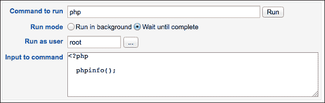

# 第四章：控制您的系统

本章将涵盖以下主题：

+   在服务器上执行命令

+   以其他用户身份执行命令

+   设置未来执行的命令

+   使用 cron 定期调度命令执行

+   为经常执行的命令创建一个面板

+   创建一个面板，用于执行经常使用的数据库命令

+   在浏览器中运行终端模拟器

# 介绍

Webmin 允许您仅使用浏览器远程控制系统。无论您是需要执行单个命令，还是需要完整的终端访问，Webmin 都提供了每个任务的便捷工具。为了让您的生活更轻松，Webmin 还允许您为每个执行多次的任务设置控制面板。对于需要反复执行的命令，Webmin 为您提供了一个易于使用的界面来创建 cron 任务。

# 在服务器上执行命令

在使用 Webmin 的服务器上执行命令的最简单方法是**命令外壳**模块。在这个例子中，我们将执行一个列出我们机器上所有网络服务的命令。

## 如何操作...

执行以下步骤来执行`netstat`命令：

1.  导航到**其他** | **命令外壳**。

1.  在文本框中输入命令。要列出您系统上所有活动的网络服务器，请使用`netstat –tl`命令。

1.  点击**执行**按钮。

您将看到一个页面，显示命令的输出。在屏幕底部，您将看到一个表单，允许您执行另一个命令。您可以通过点击**清除历史记录**按钮来清除命令输出：


## 它是如何工作的...

Webmin 默认以 root 用户身份执行您输入的每个命令，并将每个命令保存到当前登录用户的历史文件中。Webmin 还会跟踪您使用`cd`命令进入的目录，但其他环境变量将在命令执行之间不被保留。

## 还有更多...

有时，您可能需要执行相互依赖的多个命令。在 Webmin 的基本命令外壳中，您可以通过将多个命令合并为一个执行来实现这一点。

### 执行一系列命令

执行一系列命令的最基本方法是使用分号（`;`）字符分隔命令。按照以下步骤操作：

1.  导航到**其他** | **命令外壳**。

1.  输入以下两个命令（用分号分隔）：

    ```
    export MESSAGE="Hello from Webmin!" ; echo $MESSAGE

    ```

1.  点击**执行**按钮。

第一个命令（`export`）会在执行命令的环境中设置一个变量。第二个命令（`echo`）将该变量的值发送到标准输出。因此，您应该能看到该消息显示在屏幕上。如果您分别执行这些命令，环境变量将在执行之间不被保留。

### 有条件地执行命令

如果你希望执行一系列命令，其中第二个命令只有在第一个命令成功完成时才执行，可以使用逻辑与操作符(`&&`)将它们连接。这样，只有第一个命令成功完成（返回退出代码值为`0`）时，第二个命令才会被执行。请按以下步骤操作：

1.  导航至**其他** | **命令行**。

1.  输入以下两个命令（用`&&`分隔）：

    ```
    /bin/true && echo "Last command exited cleanly"

    ```

1.  点击**执行**按钮。

你应该会在屏幕上看到消息，**上一个命令已成功退出**。

如果上一个命令返回的退出代码表示发生错误，则该消息不会显示。通过执行以下命令亲自试试吧：

```
/bin/false && echo "Last command exited cleanly"

```

你不会看到任何输出，因为第二个命令并没有被执行。

这种方法对`make && make install`等命令特别有用，这些命令在软件的编译和安装过程中使用，其中第二个命令只有在第一个命令成功时才应执行。

### 执行历史命令

因为 Webmin 会保留你执行的所有命令历史记录，你可以从列表中选择以前的命令重新执行，而无需重新输入它们。

执行第一个命令后，你将看到之前的命令列表出现在命令文本框下方：


要执行历史命令，请从列表中选择它并点击**执行上一个命令**。你也可以通过点击**编辑之前的命令**按钮来更改命令。如果你希望清除命令历史记录，请点击**清除命令**按钮。

# 作为其他用户执行命令

有时，执行其他用户身份下的命令是非常有用的。例如，某些服务的管理命令默认只能由与该服务相关联的系统用户访问。你也可能希望测试某个用户账户是否配置正确，并以其他用户身份执行命令，检查它是否按预期工作。

## 准备中

在本教程中，我们将通过发出`createdb`命令来创建一个新的 PostgreSQL 数据库，数据库名为`testdb`，该命令可由`postgres`用户使用。如果你还没有安装 PostgreSQL，可以参考第十章，*运行 PostgreSQL 数据库服务器*，获取有关安装和运行该数据库系统的信息。

## 操作步骤...

要以其他用户身份执行命令，我们将使用**运行进程**模块：

1.  导航至**系统** | **运行进程**。

1.  在**显示**行中选择**运行..**。

1.  在**要运行的命令**文本框中输入`createdb testdb`。

1.  选择**等待完成**作为**运行模式**。

1.  在**以用户身份运行**文本框中输入`postgres`。

1.  点击**运行**按钮。

页面会将你重定向到显示命令输出信息的页面。如果命令执行时没有输出，你将被告知没有生成任何输出。

## 它是如何工作的...

Webmin 通过系统调用执行你传递给它的命令。它收集所有命令的输出并显示在下一个屏幕上。由于 Webmin 进程本身是以`root`身份运行的，因此它在执行命令时可以模拟任何用户。

## 还有更多内容...

Webmin 为在此模块中执行命令提供了更多选项。

### 将输入传递给命令

如果你愿意，可以在**输入到命令**文本区域中输入命令的输入数据。提供的数据将通过**标准输入**（**STDIN**）传递给由你的第一个命令执行的程序：

1.  导航到**系统** | **运行中的进程**。

1.  在**显示**行中选择**运行..**。

1.  在**要运行的命令**文本框中输入`sort`。

1.  选择**等待直到完成**作为**运行模式**。

1.  在**输入到命令**文本区域中输入单词列表，每个单词占一行。

1.  点击**运行**按钮。

输出屏幕将显示你提供的单词的排序列表。

此功能对于执行用脚本语言编写的短小程序也很有用：



### 在后台运行任务

如果任务需要较长时间才能完成，你可以在后台执行它。此选项不会向你展示命令的输出，但你可以安全地断开 Webmin 连接，而不会中断命令的执行。

# 设置一个将在未来执行的命令

有时安排命令在未来某个时间点执行是有用的。例如，你可能想要在夜间（当系统不忙时）更新或同步数据库，或从备份中恢复文件。你也许不想等到合适的时机，而是希望你的系统在特定的时刻自动执行命令。Webmin 为你提供了访问系统命令调度功能的权限，并且让你能够轻松设置和移除计划任务。

## 准备工作

对于这个例子，我假设你已经在服务器上安装了 MediaWiki（运行 Wikipedia 的软件），并且你想安排在每周日凌晨 2:30 执行其`checkUsernames`脚本。

在开始之前，你应该注意以下事项：

+   你希望执行的维护脚本的名称（在本例中，我假设它被称为`checkUsernames.php`）

+   脚本应该执行的目录（在本例中是`/var/www/mediawiki/maintenance`）

+   执行脚本的解释器（`php`）

    ### 提示

    我们假设你的系统已安装 PHP 命令行包，并且`php`二进制文件已经放置在二进制搜索路径中。默认的搜索路径通常包括`/bin`、`/sbin`、`/usr/bin`和`/usr/local/bin`等位置。如果你要执行的二进制文件不在这些默认搜索路径中，你应该使用二进制文件的绝对路径，即以`/`开头的路径，例如`/usr/bin/php`。

+   应执行脚本的用户（`root`）

## 如何操作...

要设置将被执行的命令，请执行以下步骤：

1.  导航到 **系统** | **已调度命令**。

1.  在 **以用户身份运行** 文本框中输入将执行脚本的用户名称（`root`）。

1.  在提供的字段中输入所需的未来日期和时间。设置为下周日的凌晨 2:30。

1.  在 **运行目录** 文本框中，输入应执行脚本的目录名称（`/var/www/mediawiki/maintenance`）。

1.  在 **要执行的命令** 字段中输入你希望执行的命令，通常包括脚本解释器的名称和脚本的名称。在我们的示例中，应该是 `php checkUsernames.php`。

1.  对 **完成后发送电子邮件？** 问题回答 **是**。

1.  点击 **创建** 按钮。

在接下来的屏幕上，你将看到当前已调度命令的列表。请参阅以下截图：


## 工作原理...

Webmin 使用系统的命令调度功能（在 Unix 系统中称为 `at`），允许用户将命令的执行推迟到指定的未来时间。

我们在本配方中所做的步骤也可以通过命令行执行，方法是输入以下命令：

```
$ su root
# cd /var/www/mediawiki/maintenance
# echo 'php checkUsernames.php' | at -m 02:30 8.9.2013

```

`at` 命令将通过标准输入传递的命令封装到脚本文件中，这些脚本文件存储在一个目录中（通常是 `/var/spool/at` 或 `/var/spool/cron/atjobs/`）。`atd` 守护进程会等待指定的执行时间，并在合适的时刻执行这些脚本。

Webmin 还允许你列出和删除已调度的任务。查看本配方的 *更多...* 部分。任务列出可以通过命令行使用 `atq` 命令进行，删除特定任务可以使用 `atrm` 命令，并传入任务编号作为参数。

## 更多...

要查看系统上调度执行的命令列表，请返回到 **系统** | **已调度命令**。请参阅以下截图：


要取消这些命令中的任何一个，请勾选其 ID 旁边的框并点击 **取消选定的命令** 按钮。

## 另见

+   如果你希望重复执行相同的命令，请查看下一个配方，*使用 cron 定期调度命令执行*。

# 使用 cron 定期调度命令执行

许多任务需要定期重复执行。这些任务包括诸如备份重要文件、检查软件更新、删除旧的临时文件以及检查日志中是否有异常消息以警告管理员等日常工作。

你的应用程序可能还有一些其他任务，也需要定期运行，Webmin 提供了一个比命令行 `crontab` 工具更直观的界面来创建和管理 cron 作业。

## 准备工作

在本教程中，我假设你有一个由 Drupal 提供支持的网站，网址为 `http://example.com/`。Drupal 有一系列需要定期执行的任务（更新缓存、检查更新等）。为了触发这些任务，我们将设置一个 cron 任务，它会定期访问以下网址：`http://example.com/cron.php?cron_key=XYZ`。

## 如何操作……

要将命令添加到 cron 调度中，请按照以下步骤操作：

1.  导航到**系统** | **已安排的 Cron 任务**。

1.  点击标记为**创建一个新的计划 cron 任务**的链接。

1.  在标记为**作为执行 cron 任务的用户**的文本框中指定你的用户名。

1.  对**是否启用？**问题回答**是**。

1.  在**命令**文本框中指定以下命令：

    ```
    curl -s 'http://example.com/cron.php?cron_key=XYZ'

    ```

    ### 注意

    `curl` 是一个广泛可用的命令，用于通过各种网络协议使用 URL 语法传输数据。我们使用上述命令连接到并从我们的 web 服务器下载网页。Drupal 使用这种策略来触发维护任务。传递给 `curl` 的 `-s` 参数可以防止其输出进度条或错误信息。

1.  给任务添加一个**描述**，例如，`Drupal periodic tasks for Example.com`。

1.  现在，指定你希望任务执行的频率。我们需要指定任务执行时的具体分钟数：在**分钟**下，选择**选定的…**并随机选择一个分钟数，例如 `19`。我们希望任务每天运行两次。因此，在**小时**下，选择**选定的…**并选择 `0` 和 `12`。我们希望任务每天执行，因此在**日期**、**月份**和**星期几**下选择**全部**。

1.  点击**保存**按钮。

## 它是如何工作的……

Webmin 将在我们选择的用户的 `crontab`（`cron` 表格）文件中添加我们指定的任务。这些文件通常存储在 `/var/spool/cron/crontabs` 目录下。

时间是以分钟、小时、日期、月份和星期几为单位进行指定的。计划的命令将在与这些设置完全匹配的时间执行。例如，如果我们指定时间为 19 分钟，0 点和 12 点，且选择所有日期、月份和星期几，那么命令将会在每天的 0:19 和 12:19 执行。`cron` 守护进程会等到适当的时间，然后执行计划的命令。

### 提示

你不应该让所有任务在整点时开始，因为这样可能会导致不必要的系统负载峰值。任务应当分散在每个小时内。如果你还没有安排很多任务，可以随便选一个时间。如果你的 cron 做了很多工作，可能需要检查一下在任务最少的时候进行调度。

## 还有更多……

Webmin 的界面让我们对 cron 任务有更多的控制权。

### 临时禁用 cron 任务

如果我们想要暂时禁用一个 cron 任务，可以编辑 `crontab` 并通过在任务行前添加哈希符号（`#`）来注释掉该行。Webmin 通过提供图形化界面来简化这一操作。

1.  导航到**系统** | **已安排的 Cron 任务**。

1.  点击你想要禁用的命令。

1.  选择**否**作为**是否激活？**问题的答案。

1.  点击**保存**按钮。

### 克隆一个 Cron 任务

如果你想创建一个类似已存在 Cron 任务的任务，请使用 Webmin 的克隆功能。

1.  转到**系统** | **已调度的 Cron 任务**。

1.  点击你想要复制的命令。

1.  点击**克隆任务**按钮。

1.  一个预填充的任务创建屏幕将会打开。根据需要修改任务设置。

1.  点击**创建**按钮。

### 指定哪些用户可以使用 cron 调度任务

出于安全原因，你可能希望限制哪些用户能够调度 Cron 任务。你可以选择允许所有用户访问，选择特定有访问权限的用户，或者选择拒绝访问的用户。

### 注意

如果你允许某些用户创建 Cron 任务，所有其他用户将无法创建。反之，如果你拒绝某些用户创建 Cron 任务，你实际上是授予了其他用户这一权限。

1.  转到**系统** | **已调度的 Cron 任务**。

1.  点击标记为**控制用户访问 Cron 任务**的链接。

1.  选择**仅允许列出的用户**复选框。

1.  点击同一行中的省略号（**…**），然后使用用户选择器选择哪些用户被允许创建 Cron 任务。

# 创建一个面板，用于执行你经常运行的命令

有些命令你会反复执行。在这种情况下，你可能希望使用 Webmin 的**自定义命令**模块来创建一个方便的控制面板，点击按钮即可执行命令。

### 提示

使用此功能，你还可以允许某些用户以其他用户身份运行命令。这也是创建脚本的替代方案，并且可以用来存储长命令或复杂命令的语法。

## 准备工作

在本教程中，我们将创建一个自定义按钮，使用 `drush` 命令清除 Drupal 网站的缓存。你可能会想使用其他命令，因此在开始之前请记下它的语法和你希望执行命令的目录。

## 如何操作...

要创建自定义命令按钮，请按照以下步骤操作：

1.  转到**其他** | **自定义命令**。

1.  点击标记为**创建新自定义命令**的链接。

1.  提供命令的简短**描述**，例如：`清除缓存`。

1.  在**HTML 描述**字段中提供更长的描述，例如：`清除 Example.com 的 Drupal 缓存`。

1.  在**命令**文本框中输入命令。在我们的示例中，命令是`drush cache-clear all`。

1.  在**运行目录**字段中指定命令将要执行的目录。在我们的示例中，我们将指定 Drupal 网站安装目录：`/var/www/drupal`。

1.  在**作为用户运行**字段中指定具有执行命令权限的用户名。

1.  点击**保存**按钮。

你将被带回到**自定义命令**模块，此时会出现一个新的命令按钮。点击按钮执行你的命令。你可以随时返回到**其他** | **自定义命令**，通过点击此按钮运行你的命令。

## 它是如何工作的...

Webmin 将自定义命令配置存储在`/etc/webmin/custom`目录下。每当你访问**自定义命令**模块时，Webmin 会读取这些配置文件，并动态地为你构建一个管理面板。当你按下与命令相关联的按钮时，Webmin 会为你执行该命令。

## 还有更多...

Webmin 的自定义命令功能还有很多其他选项。

### 克隆命令

如果你想创建一个类似于已存在的自定义命令的命令，可以使用 Webmin 的克隆功能。

1.  导航到**系统** | **自定义命令**。

1.  点击你希望复制的命令下方的**编辑命令**链接。

1.  点击**克隆**按钮。

1.  将会打开一个新的命令界面。根据需要修改设置。

1.  点击**创建**按钮。

### 指定命令参数

如果你的命令需要参数，你可以构建一个更复杂的用户界面，要求你指定这些参数的值。

在我们的示例中，我们设置了一个控制面板条目来执行以下命令：

```
drush cache-clear all

```

最后的参数（`all`）指定应清除哪些缓存。此参数的其他可能值包括：`theme-registry`、`menu`、`css-js`等。让我们扩展我们的控制面板，以便在执行时要求用户提供此参数：

1.  导航到**其他** | **自定义命令**。

1.  点击我们在本示例中创建的命令下方的**编辑命令**链接。

1.  将命令更改为`drush cache-clear $cacheType`。`$cacheType`将是我们参数值的占位符。

1.  现在，让我们将参数添加到命令表单并指定其显示方式。指定`cacheType`为**参数名称**，添加**描述**，指定**类型**为**菜单..**，并键入以下命令：

    ```
    printf "all\ntheme-registry\nmenu\ncss-js" |

    ```

    ### 注意

    不要忘记在末尾添加管道符号（`|`），否则菜单将无法正确显示。

    命令行将可能的参数值输出为单独的行。请查看以下截图：

    

1.  点击**保存**按钮。

    ### 提示

    在此示例中，我们使用`printf`命令指定了可能的参数值，并通过换行符（`\n`）将每个值分隔开来。

    另一种指定可能参数值的方法是将它们保存到文件中（每行一个值），并在文本框中指定该文件的路径名。

实际上，你已经创建了一个自定义命令表单，允许你在执行之前指定参数值。请参考以下截图：


### 使命令在 Usermin 中可用

您可能决定通过 Usermin 将您的自定义控制面板命令提供给非管理员用户。这非常简单。请按照以下步骤操作：

1.  导航至**其他** | **自定义命令**。

1.  点击您希望在 Usermin 中提供的命令下方的**编辑命令**链接。

1.  对**在 Usermin 中可用？**问题回答**是**。

1.  现在，登录到 Usermin 并导航至**其他** | **自定义命令**，以查看可用的命令。

## 另见

+   Webmin 的在线帮助提供了有关创建自定义命令的更多技巧和建议。点击每个 Webmin 界面上的**帮助..**链接以访问这些信息。

+   有关设置 Usermin 的更多信息，请参阅第二章，*用户管理*中的食谱，*安装 Usermin*。

# 创建一个包含您经常执行的数据库命令的面板

在上一个食谱中，我们创建了一个易于使用的控制面板，允许您通过点击按钮来执行自定义命令。Webmin 允许您通过添加自定义命令来扩展此功能，这些命令可在 MySQL 和 PostgreSQL 数据库上执行 SQL 查询。

## 准备工作

为了按照本食谱操作，您需要安装并设置 MySQL 或 PostgreSQL 数据库。有关如何操作的详细信息，请参考第九章，*运行 MySQL 数据库服务器*，以及第十章，*运行 PostgreSQL 数据库服务器*。

在本食谱中，我假设您正在运行一个使用名为`django`的数据库并将其缓存存储在名为`cache`的数据库表中的 Web 应用程序。我们将创建一个自定义命令，用于清空（截断）`cache`表。您的情况可能会有所不同。因此，在开始之前，请记下以下几点：

+   您想要运行查询的数据库名称

+   您想要执行的 SQL 命令的语法

+   具有适当权限的数据库用户的名称和密码

+   数据库服务器的位置（如果与本地主机不同）

+   您正在连接的数据库类型（MySQL 或 PostgreSQL）

## 如何操作...

为了创建一个自定义的数据库命令按钮，请按照以下步骤操作：

1.  导航至**其他** | **自定义命令**。

1.  点击标记为**创建新 SQL 命令**的链接。

1.  提供命令的简短**描述**，例如：`清除缓存`。

1.  在**HTML 描述**字段中提供更长的描述，例如：`为 Example.com 清除 Django DB 缓存`。

1.  选择您使用的数据库的**类型**：MySQL 或 PostgreSQL。

1.  输入**数据库名称**；在我们的例子中，它是`django`。

1.  输入将要执行的 SQL 命令，在我们的例子中，它将是：

    ```
    TRUNCATE TABLE cache;

    ```

1.  输入具有适当权限以执行 SQL 命令的数据库用户的用户名和密码。

1.  如果数据库托管在不同于本地主机的服务器上，请指定该服务器，或者选择**将此服务器作为数据库服务器主机**。

1.  点击 **创建** 按钮。

## 它是如何工作的...

Webmin 将自定义命令配置存储在 `/etc/webmin/custom` 目录中。每当您访问 **自定义命令** 模块时，Webmin 会读取这些配置文件，并动态为您构建一个管理面板。当您点击与命令相关的按钮时，Webmin 会连接到数据库服务器并为您执行 SQL 命令。

## 另请参见

+   还有更多选项可供设置自定义命令。有关更多信息和示例，请参考前面的操作步骤，*创建一个您经常执行的命令面板*。

+   Webmin 的在线帮助提供了有关创建自定义命令的更多提示和技巧。点击每个 Webmin 屏幕上的**帮助..**链接以访问这些信息。

# 在浏览器中运行终端模拟器

尽管 Webmin 提供了广泛的选项来控制您的系统，但有时您会遇到需要更直接访问系统的情况。在这种情况下，您应当配备一个功能齐全的终端模拟器和 SSH 客户端。如果您需要通过终端在服务器上执行快速操作，但没有访问到工具，Webmin 允许您在浏览器中打开一个简单的终端模拟器。

## 如何操作...

要在浏览器中运行服务器终端，请按照以下步骤操作：

1.  导航到 **其他** | **文本登录**。

1.  使用具有 SSH 访问权限的用户的用户名和密码登录系统。

1.  执行您的命令行任务。

1.  输入 `exit` 并按 *Enter* 键以关闭您的终端会话。

## 它是如何工作的...

Webmin 使用一个名为 Ajaxterm 的组件，通过 SSH 连接到您的系统，将您的命令传递给服务器，并在网页浏览器中显示终端输出。

欲了解更多信息，请访问 Ajaxterm 网站 [`github.com/antonylesuisse/qweb`](https://github.com/antonylesuisse/qweb)。

## 还有更多...

另有一个组件允许您通过 Webmin 访问计算机的终端。您可以通过导航到 **其他** | **SSH 登录** 找到它。该组件具有类似的功能，但它要求在浏览器中运行 Java，出于安全原因，不建议使用。
