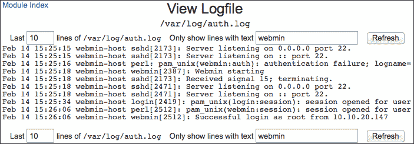
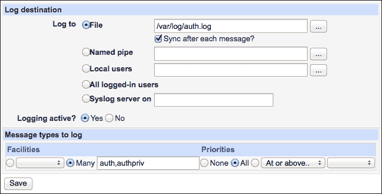
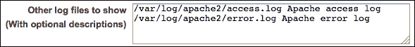
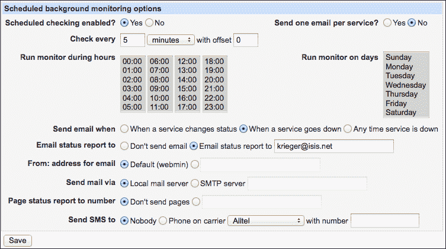

# 第五章：系统监控

在本章中，我们将涵盖以下主题：

+   查看并搜索系统日志文件

+   将 Syslog 消息保存到文件

+   将其他日志文件添加到 Webmin

+   配置日志文件轮转

+   列出最近的登录记录

+   当服务停止运行时接收电子邮件

+   自动重启停止运行的服务

+   监控远程服务器

# 介绍

当你的服务器运行时，它会记录它执行的所有操作。每当一个服务启动或停止，定时任务运行，邮件消息发送，尤其是当某个操作产生了意外结果或错误时，都会创建一个日志条目。

日志消息帮助你解决服务器上的问题。如果某些功能无法正常工作，通常会在某处找到日志消息，解释发生了什么以及问题所在。日志消息还允许你检测到异常情况，例如有人试图入侵你的服务器。定期查看系统日志非常重要。

每条日志消息都有其有效期。几周或几个月后，旧的日志消息可以被删除，以防止日志文件增长过大，占满磁盘空间。

在本章中，我们将演示如何使用 Webmin 作为一个方便的工具来查看系统日志文件，如何帮助你进行日志轮转以保持档案并删除旧条目。我们还将演示如何使用 Webmin 监控系统，通过定期测试来发现问题，甚至尝试自动修复一些问题。

# 查看并搜索系统日志文件

你可以配置 Webmin 的系统日志模块，使其成为系统日志信息的单一来源。在本步骤中，我们将演示如何通过 Webmin 的界面轻松快速地查看和扫描日志文件。在接下来的两个步骤中，我们将展示如何将其他日志文件添加到此模块，以创建一个全面的系统活动概览。

## 准备工作

在这个步骤中，我们将检查位于`/var/log/`的`auth.log`文件，该文件记录了与身份验证和授权相关的消息。大多数 Debian 家族的系统默认都会有此文件，但如果你使用的是其他系统，可能找不到它。你可以按照步骤“*将 Syslog 消息保存到文件*”来将此文件添加到你的系统中。

当然，你可以按照相同的步骤查看系统日志模块中列出的任何其他文件。

## 操作步骤...

按照以下步骤查看日志消息：

1.  进入**系统** | **系统日志**。你将看到通过 Webmin 提供的可用日志文件列表。

1.  点击`/var/log/auth.log`文件行中的**查看...**链接。

1.  默认情况下，Webmin 会显示该日志文件的最后 20 条消息（行）。要查看更多行，请在**文件的最后[ ]行**字段中输入`40`，然后点击**刷新**按钮。

1.  `auth.log` 文件将显示用户登录的信息。我们可以通过过滤器显示仅与 Webmin 相关的消息。在字段中输入 `webmin`，选择 **Only show lines with text**，然后点击 **Refresh**: 

1.  现在，你可以测试新消息是否出现在日志中。使用另一个浏览器登录 Webmin，然后返回并再次点击 **Refresh**，以查看与登录尝试相关的新消息出现在日志中。

## 工作原理…

在后台，Webmin 使用 `tail` 命令显示系统日志的最后几行。如果你想在终端实现类似的视图，可以使用以下命令：

```
$ sudo tail -n 40 /var/log/auth.log

```

如果你想过滤日志，只显示包含单词 `webmin` 的行，可以将 `tail` 命令与 `grep` 组合使用，如下所示：

```
$ sudo grep webmin /var/log/auth.log | tail -n 40

```

## 还有更多…

在系统上调试问题时，通常需要在执行任务时查看日志文件消息的实时出现，任务结束时可能会有错误。Webmin 可以自动刷新日志显示，以便显示新的消息。

### 配置系统日志自动刷新

按照以下步骤配置系统日志自动刷新：

1.  导航到 **System** | **System Logs**。

1.  点击左上角的 **Module Config** 链接。

1.  将 **Seconds between log view refreshes** 设置为 `10`，然后点击 **Save**。

现在，当你显示日志时，它会每 10 秒自动刷新一次视图，包括所有过滤条件。你可以在进行调试任务时保持这个窗口打开，并实时查看日志中输出的消息。

### 提示

根据你的浏览器，Webmin 的自动刷新功能可能会被安全机制禁用，该机制会检查每个传入的 HTTP 请求是否有正确的引用来源头。你可以通过以下步骤禁用此机制：

+   导航到 **Webmin** | **Webmin Configuration** | **Trusted Referrers**。

+   对于 **Referrer checking enabled?** 提示，选择 **No**。

+   点击 **Save**。

你还可以使用 `tail` 命令的 `-f` 选项跟踪文件输出的变化，如下所示：

```
$ sudo tail -f /var/log/auth.log

```

## 另见

+   在这个方案中，我们讨论了如何查看和过滤日志文件。在接下来的两个方案中：*将 Syslog 消息保存到文件* 和 *将其他日志文件添加到 Webmin*，我们将演示如何将其他日志消息添加到此界面。

# 将 Syslog 消息保存到文件

Unix 和相关系统的标准日志协议叫做 Syslog。大多数现代 Linux 发行版使用如 **Rsyslog** 或 **Syslog-NG** 的实现，它们执行相同的任务：

+   允许系统上的软件发送 Syslog 消息

+   按类型和优先级分隔传入的消息，并将它们保存到不同的文件中

大多数系统工具将日志消息发送到 Syslog，但其他服务器软件（如 Apache、MySQL 或 PostgreSQL）默认情况下会将消息直接保存到磁盘上的文件中。

Webmin 允许您控制 Syslog，并决定哪些消息保存到哪些文件。为了理解 Syslog 如何区分消息，我们需要解释两个概念：**设施**和**优先级**。

每条发送到 Syslog 的消息都有一个设施级别和优先级级别。根据这些属性，您可以决定丢弃哪些消息，保留哪些消息以及保存到哪里。

一个设施级别描述了该消息的类型。由于程序通常使用相同的设施发送所有消息，因此它通常指定发送消息的程序类型。以下表格列出了不同的设施级别：

| Facility | 相关的消息 |
| --- | --- |
| `auth` 和 `authpriv` | 与用户授权或安全性相关的消息。这些可能包含敏感信息（尤其是`authpr` `iv`），应仅对受信任的系统用户可访问。 |
| `cron` | 与计划命令执行相关的消息。 |
| `daemon` | 后台进程（系统守护进程）输出的消息。 |
| `ftp` | 与 FTP 服务器相关的消息。 |
| `kern` | 系统内核生成的消息。 |
| `local0` 到 `local7` | 您可以配置本地程序使用这些设施将日志消息发送到 Syslog。 |
| `lpr` | 与打印相关的消息。 |
| `mail` | 与邮件服务器相关的消息。 |
| `mark` | 一个特殊设施，定期生成时间戳。 |
| `news` | 废弃。 |
| `syslog` | 与 Syslog 本身相关的消息。 |
| `user` | 与用户进程相关的消息。如果在发送消息时未指定其他设施，则默认为此设施。 |
| `uucp` | 废弃。 |
| `*` | 上述所有。 |

优先级（严重性）级别描述了日志消息的重要性。您可以使用此描述来指定哪些消息丢弃，哪些消息保留。优先级级别有一个特定的顺序，您可以选择例如记录所有优先级为`warning`及以上的消息。以下表格列出了从最高到最低的优先级级别：

| 优先级 | 描述 |
| --- | --- |
| `emerg` | 紧急—系统不稳定。这是最高优先级级别。 |
| `alert` | 警报—必须立即采取行动。 |
| `crit` | 严重—系统处于严重状态。需要采取行动。 |
| `err` | 错误—发生了错误，需要修复。 |
| `warning` | 警告—某些功能没有按预期工作。请检查配置。 |
| `notice` | 通知—系统执行了一个重要操作。 |
| `info` | 信息—关于系统正常功能的信息性消息。 |
| `debug` | 调试—主要用于设置服务和调试问题的详细消息。 |

## 正在准备中

在这个食谱中，我们将使用 Webmin 指示 Syslog 守护进程将所有与用户授权相关的日志消息保存到`/var/log/`中的`auth.log`文件。如果你使用的是基于 Debian 的系统，系统中可能已经存在这个文件。在这种情况下，你可以将这些消息保存到名为`auth2.log`的第二个文件中进行练习，稍后再删除配置。

## 如何做...

按照以下步骤将 Syslog 消息保存到文件：

1.  转到**系统** | **系统日志**。

1.  点击**添加新系统日志**链接。

1.  选择**日志到文件**，并指定`/var/log/auth.log`作为文件名。

1.  验证**日志活动？**是否设置为**是**。

1.  在**设施**下，选择**多个**，并输入与认证相关的两个设施名称（用逗号分隔）：`auth,authpriv`。

1.  在**优先级**下，选择**所有**：

1.  点击**保存**按钮。

1.  点击**应用更改**按钮，位于**系统日志**模块屏幕的底部。

    ### 提示

    在某些系统中，**应用更改**按钮可能不可见或没有效果。在这种情况下，你需要手动重启 Syslog 服务。

    如果你的系统使用 Rsyslog，你可以使用以下命令重启它：

    ```
    $ sudo service rsyslog restart
    ```

    请参考第四章中*通过 Webmin 执行命令*的食谱，了解如何通过 Webmin 执行命令。

如食谱中所述，你现在可以查看`/var/log/auth.log`文件，*查看和搜索系统日志文件*。

## 它是如何工作的...

根据你的选择，Webmin 会更新你的 Syslog 配置文件并重启服务。你的 Syslog 守护进程会读取新的配置；如有必要，创建一个新的输出文件来保存日志消息，并将选定的消息发送到该文件。

## 还有更多...

在更改 Syslog 配置后，你可能希望检查日志消息是否正确路由到预定目标。你可以通过执行 logger 命令将日志消息发送到 Syslog。该命令的语法如下：

```
logger -p facility.priority "The message text"

```

例如，如果你想发送一条优先级为`info`、设施为`auth`的消息`Hello Syslog`，请使用以下命令：

```
$ logger -p auth.info "Hello Syslog"

```

检查`auth.log`文件，查看你的日志条目。

# 将其他日志文件添加到 Webmin

不使用 Syslog 的服务器守护进程直接将其日志消息保存到磁盘上的文件中。Webmin 允许你以本章第一个食谱所描述的方式查看、搜索和监视所有日志文件。为了方便引用，你可以将常用的日志文件添加到系统日志模块的列表中。

## 准备工作

你需要调试问题的日志消息就在那里，你只需要知道在哪里查找。在将它们添加到 Webmin 之前，你需要找到日志文件的完整路径。

在 Linux 系统中，日志通常存储在`/var/log`目录中。以下表格列出了常用服务的日志消息默认位置：

| 守护进程 | 默认日志文件位置 |
| --- | --- |
| Apache 2 | 消息可能会输出到：`/var/log/apache2/access.log`、`/var/log/apache2/error.log`，等等。 |
| MySQL | 消息可能会输出到：`/var/log/mysql/mysql.log`，或者通过`daemon`设施发送到 Syslog。 |
| PostgreSQL | 消息可能会输出到：`/var/log/pgsql_log`，或者通过`local0`设施发送到 Syslog。 |
| PHP | PHP 没有指定默认的日志位置。如果 PHP 作为 Apache 模块运行，消息可能会出现在 Apache 日志中。检查你的`php.ini`文件，看看是否启用了日志记录。 |
| Webmin | 消息可能会输出到：`/var/webmin/webmin.log`以及`/var/webmin`中的其他文件。 |

因为每个系统发行版可能会以稍微不同的方式配置你的服务，所以如果你无法在默认位置找到日志文件，请检查服务的配置文件以确定其日志位置。

在此操作中，我们将 Apache 的访问日志（`/var/log/apache2/access.log`）和错误日志（`/var/log/apache2/error.log`）添加到 Webmin 的系统日志模块中。

## 如何操作...

要通过 Webmin 监控额外的日志文件，按照以下步骤操作：

1.  导航到**系统** | **系统日志**。

1.  点击左上角的**模块配置**链接。

1.  在**其他要显示的日志文件**字段中，添加每个日志文件的路径及其描述，每个条目占一行，如下所示：

    ```
    /var/log/apache2/access.log Apache access log
    /var/log/apache2/error.log Apache error log
    ```

    

1.  点击**保存**按钮。

你添加的文件将出现在系统日志列表中。

## 它是如何工作的...

额外的文件定义存储在配置文件（`/etc/webmin/syslog/config`）中。每次 Webmin 准备系统日志模块页面时，它都会检查此文件并将文件添加到其列表中。

## 还有更多...

你还可以使用 Webmin 临时查看日志文件，而无需将其永久添加到系统日志中。操作步骤如下：

1.  导航到**系统** | **系统日志**。

1.  在**查看日志文件**字段中输入日志文件的路径。你也可以点击省略号（**…**）按钮，使用文件选择器。

1.  点击**查看**按钮。

# 配置日志文件轮转

日志消息对于调试问题、分析系统使用模式以及检查是否有人试图入侵服务器非常有用。然而，每条消息只有在一段时间内有用，旧日志可以被删除以释放磁盘空间。

日志轮转是一种策略，确保最新的日志消息始终可用，而较旧的消息存储在单独的文件中，这些文件可以压缩以节省空间。几周或几个月后，根据日志类型，最旧的消息可以被删除。

Webmin 允许你控制`logrotate`工具，该工具会为你自动执行日志文件的轮换。你安装的大多数软件包会自带`logrotate`配置文件，这些文件会被放置在`/etc/logrotate.d`目录中。将配置文件放在此目录中可以确保这些文件会纳入日志轮换控制。Webmin 提供了一个图形界面，帮助你轻松创建和修改这些文件。

## 准备工作

在创建日志轮换任务之前，请确保你的系统已安装`logrotate`软件包。更多信息请参阅第一章中的*安装软件包*部分，标题为*配置你的系统*。

在本食谱中，我们将为名为`custom.log`的日志文件创建一个`logrotate`配置，该日志文件包含一个名为`customd`的守护进程的日志输出。我们将安排每周轮换该日志文件，保留四周的历史日志，并压缩所有除最新日志归档之外的日志。我们还将指示 Webmin 在日志轮换后重启守护进程，以便它开始写入新的日志文件。

在创建`logrotate`配置时，你需要提供日志文件路径以及重启日志守护进程的命令语法。一些软件具有特殊命令，用于通知守护进程日志已被轮换，这样就不需要完全重启。请参阅守护进程文档以查找相关命令。

## 如何操作...

按照以下步骤创建`logrotate`配置：

1.  导航到**系统** | **日志文件轮换**。

1.  点击标记为**添加一个新的日志文件以进行轮换**的链接。

1.  在**日志文件路径**字段中，输入你想要轮换的文件的完整路径。你可以在单独的行中指定多个文件，或通过指定目录路径并跟随星号来包含整个目录的内容。在我们的例子中，我们要轮换一个文件，因此应输入：`/var/log/custom.log`。

1.  将**轮换计划**设置为**每周**。

1.  将**保留的旧日志数量**设置为**4**。

1.  对于**压缩旧日志文件？**问题，选择**是**。

1.  对于**延迟压缩直到下一个周期？**问题，选择**是**。这将确保最新的日志归档文件不会被压缩，从而使其更容易查看，但会占用一些磁盘空间。

1.  对于**轮换后重新创建日志文件？**问题，选择**是**。如果你留空**模式**、**所有者**和**组**字段，`logrotate`将以与原日志文件相同的所有权和权限创建该文件。

1.  在**轮换后运行的命令**字段中，输入重启服务的命令，该服务会写入日志文件。在我们编造的示例中，这个命令是：`service customd restart`。

1.  点击**创建**按钮。

## 如何工作...

Webmin 会在`/etc/logrotate.d`目录中创建一个`logrotate`配置文件，将你指定的日志文件放入轮换控制之下。

## 还有更多内容...

Webmin 的界面还有许多其他功能可以控制`logrotate`。

### 按需旋转日志文件

日志文件的旋转由计划的 cron 命令触发，每天运行一次。如果你希望更早地旋转日志文件，可以随时手动触发旋转：

1.  导航到**系统** | **日志文件旋转**。

1.  点击标记为**强制旋转日志**的按钮。

### 编辑默认选项

Webmin 允许你设置默认选项，这些选项适用于所有日志旋转例程，除非被覆盖。请执行以下步骤进行设置：

1.  导航到**系统** | **日志文件旋转**。

1.  点击标记为**编辑全局选项**的按钮。

### 旋转日志时通过电子邮件发送日志文件

`logrotate`可以设置为在旋转日志时发送日志文件的副本给你：

1.  导航到**系统** | **日志文件旋转**。

1.  点击旋转文件下的文件名链接。这将允许你编辑现有的日志旋转配置。

1.  对**在删除前通过电子邮件发送日志文件？**选择**是**并指定一个电子邮件地址。

你可以指定是否希望在旋转日志时通过电子邮件发送最新创建的日志文件归档，或者即将被删除的最旧归档。

# 列出最近的登录记录

每当用户登录或注销时，关于该事件的信息会被记录在交互式登录会话的日志中。你可以使用 Webmin 查看此日志。

## 如何操作...

按以下步骤列出最近的登录记录：

1.  导航到**系统** | **用户与组**。

1.  使用屏幕底部的表单。选择标记为**仅用户**的单选按钮，并输入你感兴趣的用户的用户名。你也可以选择**全部**列出所有用户的登录记录。

1.  点击标记为**显示按用户登录**的按钮。

你将看到从上次日志旋转以来所选用户的登录列表。

## 它是如何工作的...

Webmin 检查名为`wtmp`的标准 Unix 文件，通常存储在`/var/log/wtmp`中，记录了系统上所有的登录和注销历史。这个文件是二进制格式的，因此不能使用标准的文本日志解析工具查看。如果你想在命令行查看登录历史，可以使用`last`命令，例如，`last root`会显示 root 用户的登录记录。

你还可以使用其他相关命令，如下所示：

+   `lastlog`命令显示所有用户的列表，以及他们上次登录的时间

+   `sudo lastb`命令显示失败的登录尝试信息

+   `who`命令显示当前登录的用户列表。

## 还有更多...

Webmin 还允许你查看当前登录的用户：

1.  导航到**系统** | **用户与组**。

1.  点击标记为**显示登录用户**的按钮。

# 当服务停止运行时接收电子邮件

你将服务器设置为执行特定服务：运行网站、托管数据库或交换电子邮件。如果该服务停止工作，你的访客、客户或同事会抱怨，因此如果出现问题，你应该是第一个知道的人。

Webmin 提供了一个强大的监控系统，可以定期检查服务器的状态，并在发现异常时向你发送电子邮件。

## 准备就绪

Webmin 的监控服务将使用你的本地电子邮件服务器发送电子邮件提醒。有关如何设置电子邮件服务器，请参见第十二章，*设置电子邮件服务器*。

在你可以使用 Webmin 的监控功能之前，你需要激活它。按照以下步骤操作：

1.  转到**其他** | **系统和服务器状态**。

1.  点击标记为**计划监控**的按钮。

1.  对**是否启用计划检查？**问题回答**是**。

1.  将**当服务停止时发送电子邮件**设置为**当服务停止时**，以便在监控器测试失败时接收单一消息。如果你更喜欢收到垃圾邮件，可以选择在**任何服务停止时**都接收电子邮件。

1.  选择**发送电子邮件状态报告至**选项，并提供你的电子邮件地址：

1.  点击**保存**按钮。

当监控器有报告时，你应当收到电子邮件提醒。你应该设置一个测试监控器，故意让它失败，以检查这些电子邮件是否能够发送到你。

在本教程中，我们将设置一个监控器，检查 Apache web 服务器是否正在运行。有关如何设置 Apache 的信息，请参见第八章，*运行 Apache Web 服务器*。

## 如何操作...

按照以下步骤，当服务器上的服务停止运行时，接收电子邮件提醒：

1.  我们将使用一个监控器，检查由给定命令启动的服务是否仍在运行。首先要检查的是启动服务的命令名称。我们可以通过转到**系统** | **运行中的进程**模块来实现。在 Debian 上，Apache 的命令是：`/usr/sbin/apache2 -k start`。字符串`apache2`是唯一的，只出现在与该服务器相关的进程中，因此我们将设置我们的测试，在运行进程的表格中扫描此字符串。如果没有找到匹配的进程，我们的测试将失败。记下 Apache 正在运行的进程数。在我的配置中，与 Web 服务器相关的进程有六个。

1.  转到**其他** | **系统和服务器状态**。

1.  从下拉列表中选择**检查进程**作为监控类型，然后点击**添加监控器类型：**按钮。

1.  将`Apache 进程`指定为描述。

1.  对**是否按计划检查？**问题回答**是**，并选择何时通知你，例如**是，并报告状态变化**。

1.  在**通知方法**部分勾选标有**电子邮件**的框。

1.  在**检查命令**文本框中，输入一个正则表达式，匹配启动 Apache 的命令的名称。字符串`apache2`可以工作，但如果你想更精确，可以使用 Perl 正则表达式。

1.  在步骤 1 中输入数字到标记为**监控认为进程正在运行所必须存在的进程数**的字段中。在我们的配置中，Apache 运行了六个进程，因此我们会指定这个数字。如果这些进程中的任何一个失败，我们将收到通知。

1.  点击**创建**按钮。

如果 Apache 的任何进程停止运行，你现在应该会收到一封电子邮件。为了测试监控，可以停止 Apache 五分钟，然后检查是否收到邮件报告。

## 它是如何工作的...

当你激活 Webmin 的监控功能时，它会创建一个定时任务，按计划运行监控脚本。每个监控测试可以返回成功或失败状态。如果测试返回失败状态，Webmin 将向在定时监控配置中指定的邮箱发送警报邮件。

## 还有更多内容...

Webmin 的监控功能非常丰富，我们将在本节以及后续的专门实例中介绍其各个方面。

### 检查监控历史记录

Webmin 会保留所有监控的状态历史记录，允许你查看某个监控通过和失败的时间：

1.  导航至**其他** | **系统与服务器状态**。

1.  点击选择的监控名称，例如，**Apache Webserver**监控。

1.  展开屏幕底部的**状态历史**部分。

    ### 提示

    如果你的监控刚开始运行，可能暂时没有历史数据可供检查。完成几个监控周期后再回来查看。如果历史记录完全没有显示，说明你的监控设置可能不正确。

### 使用预定义的监控

在这个实例中，我们创建了一个自定义监控，用于检查 Apache 进程是否在运行。事实上，Webmin 有不少预定义的监控类型，无需配置，只需要激活即可。例如，要使用 Apache 的预定义监控，按照以下步骤操作：

1.  导航至**其他** | **系统与服务器状态**。

1.  从下拉列表中选择**Apache Webserver**作为监控类型，然后点击**添加该类型监控：**按钮。

1.  根据需要自定义报告设置。

1.  点击**创建**按钮。

### 监控系统负载

除了检查特定软件是否在运行外，Webmin 还可以监控其他系统资源。例如，当系统的 CPU 使用率过高时，你可以收到通知。这可能表明服务器流量很大，但也可能是某个进程陷入无限循环，需要被终止，或者是正在进行的拒绝服务攻击。按照以下步骤监控系统负载：

1.  导航至**其他** | **系统与服务器状态**。

1.  从下拉列表中选择**负载平均值**作为监控类型，然后点击**添加该类型监控：**按钮。

1.  根据需要自定义报告设置。

1.  为了避免获取到短时间的正常活动信息，请将**负载平均值检查时长**选择为 15 分钟。

1.  一般来说，**最大负载平均值**应为机器的 CPU 核心数。

    ### 提示

    如果您只有一个 CPU，过去 15 分钟的负载平均值大于 1 则表示系统超载。在一台双核机器上，负载低于 2 表示系统没有超载。不同的操作系统以略微不同的方式计算此值，因此您可能需要在正常操作时使用`uptime`命令测试您的服务器，以检查什么样的负载平均值是系统的正常值。

    您可以在 Wikipedia 上找到更多关于系统负载的信息：[`en.wikipedia.org/wiki/Load_(computing)`](http://en.wikipedia.org/wiki/Load_(computing))。

1.  点击**创建**按钮。

### 监控磁盘空间

如果服务器的磁盘空间完全用完，它将会停滞不前。为了避免这种情况，您应该监控系统并在文件空间使用率达到高值（如 90%）时做出反应。按照以下步骤监控磁盘空间：

1.  转到**其他** | **系统和服务器状态**。

1.  从下拉列表中选择**磁盘空间**作为监控类型，然后点击**添加监控类型：**按钮。

1.  从**检查的文件系统**下拉菜单中选择根文件系统（`/`）。

1.  选择选项**总百分比**，并将其设置为 90%。

1.  点击**创建**按钮。

## 另见

+   除了在系统监控测试失败时向您发送电子邮件，Webmin 还可以尝试自动响应。请参阅下一个食谱，*自动重启停止运行的服务*，了解更多信息。

+   关于 Webmin 监控功能的更多信息可以在其 wiki 中找到：[`doxfer.webmin.com/Webmin/SystemAndServerStatus`](http://doxfer.webmin.com/Webmin/SystemAndServerStatus)。

# 自动重启停止运行的服务

Webmin 的监控功能可以在检测到系统问题时发出警报，但它也可以通过执行命令自动响应已检测到的问题。例如，如果某个服务停止运行，您可以尝试自动重启它。

## 准备工作

本食谱是前一个食谱，*接收服务停止运行时的电子邮件*的扩展。在开始此食谱之前，请确保您已经完成了前一个食谱中的设置步骤。

在本食谱中，我们将告诉 Webmin 监控 Apache，并在它停止运行时自动重启。

## 如何操作...

按照以下步骤自动重启停止运行的服务：

1.  转到**其他** | **系统和服务器状态**。

1.  点击**Apache Web 服务器**监控的链接。

1.  在**要运行的命令**部分，在**如果监视器停止运行，运行命令**文本框中输入启动 Apache 的命令。在大多数 Linux 发行版中，命令是`service apache2 start`。

1.  点击**保存**按钮。

## 它是如何工作的...

Webmin 会创建一个 cron 任务，定期运行其监控工具。如果监控从成功变为失败，Webmin 会执行您预设的命令。这些命令可以用来重启已停止的服务，从而自动响应并纠正系统状态。

这是一个适用于 Web 服务器、邮件服务器或应用服务器等服务的好策略。但对于像数据库这样的服务，可能不是最好的选择，因为在重新启动时，它可能需要您介入来修复诸如数据库表损坏等问题。

# 监控远程服务器

您可以使用 Webmin 的监控功能，定期检查不运行 Webmin 的远程服务器的状态。由于我们对远程服务器的访问权限有限，我们只能测试它的外部可见状态。尽管如此，这仍然是一个非常有用的工具，它可以告诉我们其他服务器是否正在运行，并在特定端口上提供网络服务。如果远程服务器上的某个服务停止，Webmin 会通过电子邮件通知我们。

## 准备工作

这是 *服务停止时接收电子邮件* 的教程扩展版。在开始这个步骤之前，请确保按照该教程中的设置步骤进行操作。

在本教程中，我们将让 Webmin 定期检查远程 Web 服务器是否正在运行，并返回预期的 HTML 页面。

## 如何操作...

按照以下步骤监控远程服务器：

1.  导航至 **其他** | **系统和服务器状态**。

1.  从下拉列表中选择 **远程 HTTP 服务** 作为监控类型，并点击 **添加监控类型：** 按钮。

1.  在 **请求的 URL** 字段中，输入您期望在远程服务器上找到的网页 URL，例如：`http://example.com/index.php`。

1.  将 **HTTP 请求方法** 设置为 **GET**。

1.  在 **页面必须匹配正则表达式** 字段中，输入包含您期望 Web 服务器响应的 HTML 代码片段的字符串。这可以是页面标题或远程网站上其他不经常变化的文本。

    ### 注意

    例如，如果我们监控 [`en.wikipedia.org/wiki/Main_Page`](https://en.wikipedia.org/wiki/Main_Page)，我们可以检查字符串 `Wikipedia, the free encyclopedia`，这是我们期望在正确生成的页面标题中出现的内容。

1.  点击 **创建** 按钮。

## 它是如何工作的...

Webmin 会创建一个 cron 任务，定期运行其监控工具。远程 HTTP 服务监控器尝试与配置为在给定 URL 下响应的 Web 服务器建立连接。如果连接建立成功，Webmin 会请求指定的网页并扫描它以查找我们的正则表达式。

如果监控无法建立连接，或者返回的网页与我们的正则表达式不匹配，测试将失败；监控会改变其状态并发送电子邮件警报信息。

## 还有更多...

Webmin 能够监控远程 Web 服务器，但也可以用来远程监控其他服务。

### 检查远程服务器是否运行

你正在运行的远程服务器可能是一个防火墙或其他网络基础设施，未暴露任何网络服务。即使是这样安全的服务器，仍然应该对 ICMP ping 回显请求作出响应。Webmin 可以向远程服务器发送 ping 数据包，以确定它是否可通过网络访问。请执行以下步骤检查远程服务器是否在线：

1.  进入 **其他** | **系统与服务器状态**。

1.  从下拉列表中选择 **远程 Ping** 作为监视类型，并点击 **添加类型监视器：** 按钮。

1.  在 **要 ping 的主机** 字段中，输入远程服务器的 IP 地址或域名。

1.  点击 **创建** 按钮。

### 检查远程服务器是否运行网络服务

如果你知道远程服务器应该监听的端口号，你可以使用 Webmin 测试几乎任何网络服务。Webmin 将向远程服务器的特定端口发送 TCP 连接请求。如果远程服务器响应，Webmin 会立即关闭连接。如果服务器未响应，将发送警报信息。

1.  进入 **其他** | **系统与服务器状态**。

1.  从下拉列表中选择 **远程 TCP 服务** 作为监视类型，并点击 **添加类型监视器：** 按钮。

1.  在 **要连接的主机** 字段中，输入远程服务器的 IP 地址或域名。

1.  在 **连接端口** 字段中指定服务端口。

1.  点击 **创建** 按钮。
