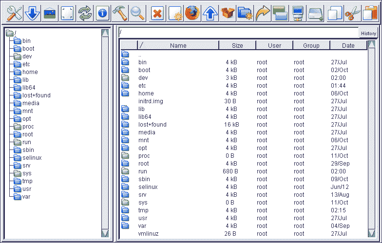
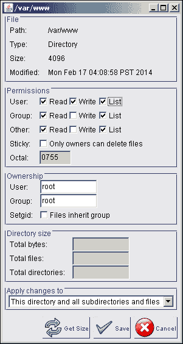
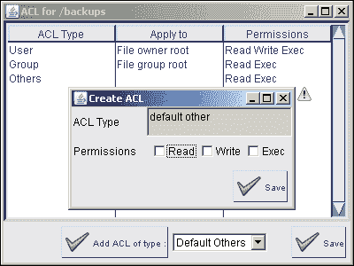
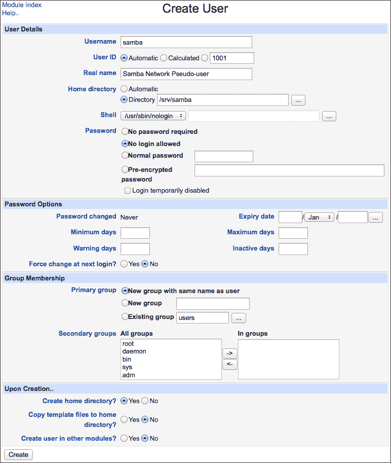
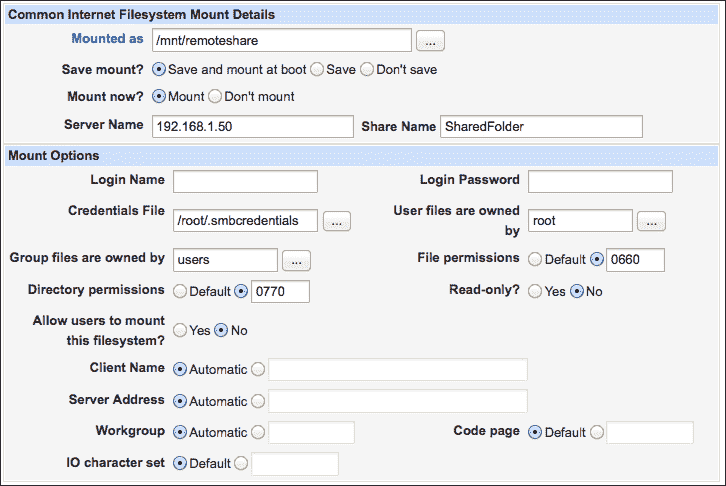
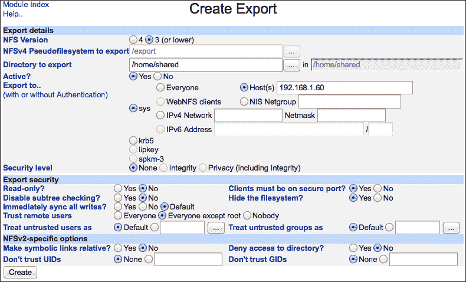
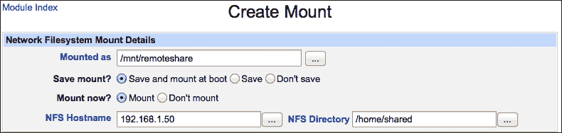
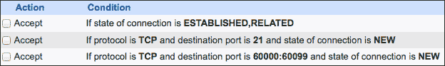

# 第六章：管理系统中的文件

在本章中，我们将涵盖：

+   从服务器下载文件

+   上传文件到服务器

+   管理服务器上的文件和目录

+   更改文件的所有权和权限

+   设置 Windows 的网络共享文件夹

+   挂载 Windows 共享文件夹

+   设置 NFS 共享卷

+   挂载远程 NFS 卷

+   通过 SFTP 授予用户对服务器的访问权限

+   通过 FTP 授予用户对服务器的访问权限

# 介绍

Webmin 提供了将文件传输到服务器及从服务器传输文件的功能，并且还提供了一个完整的文件管理器，可以在浏览器中作为 Java 小应用运行。在本章中，我们将介绍如何使用这些功能通过 Webmin 管理服务器上的文件，而无需额外的工具。

本章的后半部分将展示如何使用 Webmin 通过**Windows 网络**（**CIFS**）、**网络文件系统**（**NFS**）和**文件传输协议**（**FTP**）设置本地网络上的文件共享。如果您想通过互联网访问您的文件，最佳的解决方案是使用**安全文件传输协议**（**SFTP**）功能，本章也涵盖了这一部分内容。

本章中的两个示例*挂载 Windows 共享文件夹*和*挂载远程 NFS 卷*展示了如何通过 Webmin 设置 CIFS 或 NFS 客户端，并使远程文件资源在您的系统上可用。

# 从服务器下载文件

您经常会遇到需要查看文件内容或从服务器下载文件的情况。Webmin 的**上传和下载**模块使这些任务变得非常简单。

在此示例中，我们将检查系统的主机名数据库文件，查看您是否定义了任何本地主机名条目，这些条目会覆盖通过 DNS 解析的域名。这个文件大多数系统存储在`/etc/hosts`中。

## 如何操作...

按照以下步骤从服务器下载文件：

1.  转到**其他** | **上传和下载**。

1.  选择**从服务器下载**标签。

1.  点击**文件下载**行中的省略号（**…**）按钮。

1.  在文件浏览器中选择位于`/etc`目录下的`hosts`文件。

1.  对于问题**是否在浏览器中显示（如果可能）？**请选择**是**。

1.  点击**下载**。

`hosts`文件将在浏览器中显示。如果您希望将文件下载到磁盘，只需在第 5 步选择**否**。

## 如何运作...

Webmin 从您选择的系统磁盘中访问文件。如果文件包含文本，它会直接在浏览器中显示。如果您选择下载文件，Webmin 将向响应中添加 HTTP 头（如`Content-Disposition: Attachment`），迫使浏览器显示保存对话框，允许您将文件保存到磁盘，而不是在浏览器中显示。

## 另见

+   如果您想下载整个目录及其内容，请查看本章稍后的*下载目录及其内容*部分，在*管理服务器上的文件和目录*食谱中可以找到相关信息。

# 将文件上传到服务器

Webmin 的图形界面使您能够轻松地将文件从本地计算机上传到服务器。Webmin 还允许您直接从 Web URL 将文件传输到服务器，而无需先下载到本地计算机。

## 准备好

在本食谱中，我们将上传一个默认的欢迎信息，由 Apache Web 服务器提供服务。有关设置 Apache 的信息，请参考第八章，*运行 Apache Web 服务器*。

如果您希望执行相同的任务，首先在本地系统中准备一个简单的 HTML 文件，并将其保存为`index.html`。您当然也可以按照相同的步骤上传其他任何文件到服务器上的任何位置。

## 如何操作...

按照以下步骤将文件上传到服务器：

1.  转到**其他** | **上传和下载**。

1.  选择**上传到服务器**选项卡。

1.  在**要上传的文件**部分点击四个按钮之一，从本地磁盘选择您的文件。如果需要，可以使用其他按钮选择额外的文件。

1.  点击**文件或目录上传到**字段右侧的省略号（**…**）按钮，使用文件浏览器选择要上传文件的目录。选择`/var/www`作为 Apache 提供文件的默认根目录。

1.  设置将拥有磁盘中文件的用户，或者将**由用户拥有**字段保持为`root`。如何操作...

1.  点击**上传**按钮。

上传进度窗口将弹出，告知您上传状态。上传完成后，Webmin 将显示一个屏幕，告知您上传到服务器的数据量。

## 它是如何工作的...

Webmin 使用 HTTP 协议将文件传输到您的服务器。上传的文件将属于选择的用户作为拥有者。此功能无需额外工具即可完成上传少量文件到服务器等简单任务。

## 还有更多...

Webmin 还允许您直接从 Web URL 将文件传输到服务器，无需先下载到本地计算机。

### 从 Web 直接下载文件到服务器

假设您想在欢迎网页上使用 jQuery。如果您知道它的 URL，可以直接将库下载到服务器上。对于 jQuery，您可以从[`code.jquery.com/jquery-1.10.0.min.js`](http://code.jquery.com/jquery-1.10.0.min.js)下载。

1.  转到**其他** | **上传和下载**。

1.  选择**从 Web 下载**选项卡。

1.  将所需的 URL 粘贴到**要下载的 URL**文本字段中。

1.  单击**下载到文件或目录**字段右侧的省略号（**…**）按钮，并使用文件浏览器选择您希望上传文件的目录。选择`/var/www`作为默认的根目录，Apache 将在该目录中提供文件。

1.  设置将拥有文件的用户，或者将**由用户拥有**字段保持为`root`。

1.  将**下载模式**设置为**立即，显示进度**。

1.  单击**下载 URLs**按钮。

下载进度屏幕将显示，告知您下载的状态。

### 在后台从网页下载文件

如果您希望从较慢的服务器下载大文件，Webmin 允许您安排下载在后台执行。

为了实现这一点，按照*从网页直接下载文件到服务器*部分中的步骤操作，但将**下载模式**字段设置为**后台进行**。您可以将下载时间设置为当前时间或稍后时间。如果您已配置 Webmin 发送邮件，如第一章中所述，*设置您的系统*，您可以指示 Webmin 在传输完成时通知您。

# 在服务器上管理文件和目录

Webmin 提供了一个简单但功能强大的文件管理器，您可以直接在浏览器中访问它。

## 准备工作

Webmin 的文件管理器作为 Java 小程序运行。为了使用它，您需要在本地计算机上安装 Java 并启用其在浏览器中的使用。您不需要在服务器上安装 Java。

## 如何操作...

在本节中，我们将讨论文件管理器的基本功能，例如在服务器上复制和移动文件。



Webmin 的文件管理器

### 复制或移动文件或目录

执行以下步骤以创建或移动文件或目录：

1.  导航至**其他** | **文件管理器**。

1.  浏览文件系统，找到包含您希望操作的文件或目录的目录，并单击文件进行选择。

1.  单击工具栏中的**复制**按钮以复制文件，或单击**剪切**按钮以移动文件。

1.  浏览文件系统，找到目标目录。

1.  单击**粘贴**按钮。

文件将从源目录传输到目标目录。如果目标目录已经包含同名文件，则会弹出对话框，您可以指定备用名称或选择相同名称以覆盖目标文件。

### 重命名文件或目录

执行以下步骤以重命名文件或目录：

1.  导航至**其他** | **文件管理器**。

1.  浏览文件系统，找到包含您希望重命名的文件或目录的目录，然后单击文件名以选择它。

1.  单击**重命名**按钮，并在弹出对话框中提供新文件名。

1.  单击弹出对话框中的**重命名**按钮。

### 删除文件或目录

执行以下步骤以删除文件或目录：

1.  导航至**其他** | **文件管理器**。

1.  浏览文件系统，找到包含你想删除的文件或目录的目录，并点击文件名进行选择。

1.  点击**删除**按钮。

1.  在弹出对话框中点击**删除**按钮确认删除。

### 编辑服务器上的文件

执行以下步骤编辑服务器上的文件：

1.  导航到**其他** | **文件管理器**。

1.  浏览文件系统，找到包含你希望编辑的文件的目录，并点击文件名进行选择。

1.  点击**编辑**按钮。

1.  在弹出对话框中编辑文件内容。

1.  在弹出对话框中点击**保存并关闭**按钮以完成编辑。

### 在服务器上创建目录

执行以下步骤在服务器上创建目录：

1.  导航到**其他** | **文件管理器**。

1.  浏览文件系统，找到你希望创建子目录的目录。

1.  找到带有目录图标的**新建**按钮并点击它。

1.  在弹出窗口中，通过将新目录的名称附加到路径上，提供新目录的完整路径。

1.  点击弹出对话框中的**创建**按钮。

### 在服务器上创建新文件

执行以下步骤在服务器上创建新文件：

1.  导航到**其他** | **文件管理器**。

1.  浏览文件系统，找到你希望创建新文件的目录。

1.  找到带有空白文件图标的**新建**按钮并点击它。

1.  在弹出窗口中的**文件名**字段中，通过将新文件的名称附加到提供的路径中，提供新文件的完整路径。

1.  你可以选择在大文本框中输入内容来为文件添加初始内容。

1.  在弹出对话框中点击**保存并关闭**按钮以创建新文件。

### 在服务器上创建符号链接

在许多情况下，创建指向其他位置的文件或目录的符号链接非常有用。对于大多数实际用途，符号链接的行为就像它们所链接的对象，但它们只是指向原始位置的指针。这意味着你可以通过多个文件系统路径访问同一个目录或文件。执行以下步骤在服务器上创建符号链接：

1.  导航到**其他** | **文件管理器**。

1.  浏览文件系统，找到你希望创建新符号链接的目录。

1.  找到带有箭头图标的**新建**按钮，表示链接。

1.  在**链接来源**字段中，输入你希望创建链接的完整路径。

1.  在**链接到**字段中，输入你要创建链接的文件或目录的完整路径。

1.  点击**创建**按钮以创建链接。

### 提示

符号链接可以引用绝对路径（以根目录 `/` 开头），也可以引用相对路径。在相对路径中，两个点表示链接所在目录的父目录。例如，如果我们在目录 `A` 中有 `file` 文件，并且想在兄弟目录 `B` 中创建链接，我们可以将链接指向 `../A/file`。这样，我们可以将 `A` 和 `B` 两个目录一起移动到另一个位置，而符号链接仍然指向相同的文件。

### 下载目录及其内容

Webmin 的文件管理器允许你下载整个目录及其内容，作为一个压缩档案文件，具体步骤如下：

1.  导航到 **其他** | **文件管理器**。

1.  浏览文件系统到你想下载的目录的父目录。

1.  单击目录的名称以选择它。

1.  单击工具栏中的**保存**按钮。

1.  在弹出的对话框中，点击**TAR.GZ**按钮，将目录下载为一个由 GZIP 压缩的磁带档案文件。

    ### 注意

    磁带档案（TAR）文件格式能够保留你下载文件的大多数元数据，如所有权、权限和扩展文件属性（尽管无法保留 SELinux 上下文或 POSIX ACLs）。

    你也可以选择以 ZIP 格式下载文件，这在某些系统上可能更容易提取，但文件的元数据将丢失。

1.  将文件保存到本地计算机。

### 从压缩档案中提取文件

如果你的服务器上有 ZIP、TAR 或 GZIP 格式的压缩档案，Webmin 的文件管理器允许你通过以下步骤提取其内容：

1.  导航到 **其他** | **文件管理器**。

1.  浏览文件系统到包含归档文件的目录。

1.  单击归档文件的名称以选择它。

1.  单击工具栏中的**提取**按钮。

1.  在弹出对话框中点击**是**。

### 注意

请注意，如果你的目录中已包含与归档中文件同名的文件，这些文件将被覆盖，而不会进一步提示确认。

## 它是如何工作的……

Webmin 的文件管理器在你本地计算机的 Java 虚拟机中运行。Java 小程序嵌入在 Webmin 的网页中，可以通过浏览器访问。每当你在文件管理器中执行一个操作时，Java 小程序会向你的服务器发送一个请求，包含应执行的操作指令。

### 注意

文件管理请求通过 HTTP 协议发送。如果你在 Webmin 中启用了 HTTPS 支持，指令将通过 SSL 加密。

Webmin 在服务器上执行这些指令，并将它们的效果信息及其他显示所需的信息发送回文件管理器窗口的下一屏幕。

## 参见

+   有关 Webmin 文件管理器功能的更多信息，请参考本章中的*更改文件所有权和权限*一节。

# 更改文件所有权和权限

Webmin 的文件管理器允许您操作标准的 POSIX 文件所有权和权限。该功能的用户界面易于使用且功能强大，允许您递归修改文件，但能够区分文件和目录。

在类 UNIX 系统中，每个文件系统节点（文件、目录等）都由一个用户和一个组拥有。系统还会为每个节点存储权限信息，包括文件所有者、组和其他用户的权限。标准权限如下表所示：

| 二进制表示法 | 八进制表示法 | 权限名称 | 描述 |
| --- | --- | --- | --- |
| `000` | `0` | 无 | 没有任何权限。 |
| `001` | `1` | 执行 | 执行程序文件或遍历目录。在大多数情况下，也需要读权限。 |
| `010` | `2` | 写 | 写入文件或在目录中创建文件条目。 |
| `100` | `4` | 读取 | 读取文件内容或列出目录内容。 |
| `011` | `3` | 写和执行 | 以上提到的权限组合。 |
| `101` | `5` | 读和执行 |
| `110` | `6` | 读写 |
| `111` | `7` | 读、写和执行 |

八进制表示法通常使用，因为它是最简洁的。例如，常用的文件权限表示为`644`，其中`6`（读写位）表示文件所有者的权限，`4`（读位）表示文件所属组和所有其他用户的权限。我们可以将权限设置为`640`，以禁止任何不属于我们组的用户访问。

另一方面，目录的标准权限表示为`755`，它与`644`类似，但为所有权限添加了执行位，允许所有人进入目录。

### 注意

设置第三种权限时要小心，因为此权限适用于所有可以访问您系统的用户。

如果您从另一个系统复制目录到您的服务器，目录的所有权和权限信息可能会丢失或设置不当。在本教程中，我们将递归地编辑目录，改变目录及其内容的所有者和权限。我们会将所有文件的权限设置为`644`，并将所有子目录的权限设置为`755`。

## 准备工作

在本教程中，我们将使用 Webmin 的文件管理器，它作为一个 Java 小程序运行。为了使用它，您需要在本地计算机上安装 Java 并启用浏览器中的 Java 功能。您不需要在服务器上安装 Java。

## 如何操作...

让我们开始吧。按照以下步骤更改文件的所有权和权限：

1.  导航到**其他** | **文件管理器**。

1.  浏览文件系统，找到包含您要操作的文件或目录的目录，并点击目录名称以选择它。

1.  首先，我们将为目录及其所有内容设置权限`755`。

    1.  点击工具栏中的**信息**按钮。

    1.  在**用户**、**组**和**其他**的所有类型下，勾选**读取**和**列出**复选框。

    1.  仅为 **用户**（所有者）勾选 **写入** 权限，确保 **组** 和 **其他** 没有勾选 **写入** 权限。

    1.  将 **应用更改到** 选项设置为 **此目录及所有子目录和文件**。

    1.  点击 **保存** 按钮。

1.  接下来，我们将只对目录及其子目录中的文件设置权限 `644`。

    1.  点击工具栏中的 **信息** 按钮。

    1.  取消勾选所有类型的 **列出** 权限：**用户**、**组** 和 **其他**。

    1.  将 **应用更改到：** 选项设置为 **此目录及其子目录下的文件**。

    1.  点击 **保存** 按钮。

## 它是如何工作的...

Webmin 的文件管理器在本地计算机的 Java 虚拟机上运行。Java 小程序嵌入在 Webmin 的网页中，可以通过浏览器访问。每当你在文件管理器中执行一个操作时，Java 小程序会向服务器发送一个 HTTP 请求，指示应该执行哪些操作。Webmin 会在服务器上执行这些操作，并将它们的效果以及显示在文件管理器窗口下一屏所需的其他信息一并返回。

## 还有更多...

Webmin 的文件管理器有许多与文件权限相关的其他选项。

### 启用可执行文件的 setuid 位

通常，当用户从文件中执行程序时，该程序会以该用户的权限运行。在特殊情况下，当一个可执行文件被标记为 `setuid`（执行时设置用户 ID）位时，执行的程序将以可执行文件的所有者权限运行，而不是运行程序的用户权限。这在用户必须向通常没有访问权限的文件写入数据时非常有用。例如，当用户更新自己的密码时，他们会修改 `/etc` 目录下的 `shadow` 文件，普通用户没有权限访问该文件。按照以下步骤为文件设置 setuid 位：

1.  进入 **其他** | **文件管理器**。

1.  浏览文件系统，找到包含你希望操作的文件的目录，并点击文件名进行选择。

1.  点击工具栏中的 **信息** 按钮。

1.  在 **所有权** 下勾选标记为 **Setuid** 的复选框。

1.  点击 **保存** 按钮。

### 为目录设置 sticky 位

`sticky` 位是现代 UNIX 类系统中目录的一个有用特性。如果一个目录设置了 `sticky` 位，那么目录中的文件只能由各自的拥有者或 root 用户编辑或删除，不管其他文件权限如何。这一特性通常应用于 `/tmp` 目录，在这个目录中，所有用户都可以创建文件，但只能删除或重命名自己拥有的文件。

Webmin 的文件管理器允许你通过以下步骤在目录上设置 `sticky` 位：

1.  进入 **其他** | **文件管理器**。

1.  浏览文件系统到包含您要操作的目录的目录，然后点击目录名称进行选择。

1.  点击工具栏中的**信息**按钮。

1.  在**权限**下勾选标有**粘滞**的复选框。

1.  点击**保存**按钮。

### 更改目录上的 ACL

如果您的系统支持文件系统**访问控制列表**（**ACL**），您可以使用它们为文件和目录指定额外的权限。例如，您可以选择设置默认权限，这些权限将应用于目录中创建的所有新文件。如果您有一个 Webmin 用于存放备份文件的目录，您可以选择默认情况下使备份对其他用户不可访问。

您可以通过以下步骤使用 Webmin 操作 ACL：

1.  导航到**其他** | **文件管理器**。

1.  浏览文件系统到包含您要操作的目录的目录，然后点击目录名称进行选择。

1.  点击工具栏中的**ACL**按钮。

1.  从下拉菜单中选择**默认其他**，然后点击**添加类型的 ACL**按钮。

1.  取消勾选**读取**、**写入**和**执行**的所有框。

1.  在**创建 ACL**窗口中点击**保存**按钮，然后在主 ACL 窗口中点击**保存**按钮。

# 为 Windows 设置网络共享文件夹

在局域网上运行的服务器可以作为共享文件的存储库非常有用。如果您本地网络中的其他计算机运行的是 Microsoft Windows，设置网络文件服务器的最佳选择是 Windows 标准的**公共互联网文件系统**（**CIFS**）协议。Webmin 可以通过安装并帮助您配置 Samba 包实用工具来协助您设置这种类型的网络共享。

### 提示

不建议在公开的互联网环境中使用 Windows 文件共享。外部计算机经常扫描 Windows 文件共享协议的漏洞，如果在安全补丁发布并应用之前，某个漏洞被广泛利用，您可能会成为攻击的受害者。

确保您的防火墙阻止**用户数据报协议**（**UDP**）端口 137、138 和 139，以及 TCP 端口 137、139 和 445 的外部网络流量。这些端口用于 Windows 文件共享，应仅允许本地网络中的受信任计算机访问。

如果您需要通过互联网提供网络资产，使用本章后面将介绍的 SFTP 或 FTP 协议会是一个更好的选择。

## 准备工作

为了在您的服务器上设置 Windows 文件共享，您需要从您的发行版仓库安装 Samba 包。如果 Samba 已经安装，您将在 Webmin 主菜单的**服务器**部分找到**Samba Windows 文件共享**模块；否则，您会在**未使用的模块**部分找到它。

在大多数系统中，Webmin 能够自动下载 Samba 包及其依赖项。请导航到**未使用的模块** | **Samba Windows 文件共享**并点击链接下载并安装该软件包。或者，你也可以按照第一章中*安装软件包*的步骤，安装名为`samba`的软件包。

### 注意

在本书发布时，Webmin 支持的是 Samba 3 系列，而不是更新的 Samba 4。

安装完成后，按照第三章中*通过防火墙允许访问服务*的步骤，解锁 TCP 端口 137、139 和 445 以及 UDP 端口 137-139。


请按照第一章中*控制启动时哪些系统服务被启动*的步骤，确保`nmb`、`smb`和`winbind`服务被启动并设置为开机自动启动。

最后，我们可以设置服务器在网络中的可见性。请导航到**服务器** | **Samba Windows 文件共享** | **Windows 网络**，将**工作组**设置为`WORKGROUP`或你的组织中使用的其他名称。将**服务器描述**设置为你希望服务器在网络中显示的名称。你可以将描述字段设置为`%h`，这会导致 Samba 使用服务器的默认主机名。

## 如何操作...

在这个步骤中，我们将创建一个共享的网络文件夹，供 Windows 用户使用。Linux 和 OS X 也能够访问 CIFS 服务器，因此这种类型的网络附加存储将广泛可用于你的本地网络。

### 创建 UNIX 伪用户

我们将创建一个可以供多个用户访问的共享网络文件夹。这个共享资源必须存储在我们服务器的磁盘上，并且必须属于一个 UNIX 用户。为了简化文件所有权和权限的管理，我们将创建一个名为`samba`的特殊伪用户。这个用户不与任何一个人关联，并且该账户无法登录到我们的系统。该用户将仅拥有共享目录中的所有文件，目录将创建在`/srv/samba`。请按照第二章中*创建系统用户账户*的步骤来创建一个伪用户。使用以下设置：

+   **用户名**: `samba`

+   **真实姓名**: `Samba 网络伪用户`

+   **主目录**: `/srv/samba`

+   **Shell**: **/usr/sbin/nologin**

    ### 注意

    `nologin`二进制文件可能位于其他路径下，如`/sbin/nologin`。你也可以使用`/bin/false`，该命令不会返回礼貌的提示信息，但同样会阻止用户登录。

+   **密码**: **不允许登录**

+   **主组**: **与用户同名的新组**

+   **将模板文件复制到主目录？**: **否**

+   **是否在其他模块中创建用户?**：**否**

这些设置显示在以下截图中：



### 创建 Samba 共享网络文件夹

下一步是创建实际的共享网络资源。Webmin 使这部分变得非常简单。按照以下步骤创建共享网络文件夹：

1.  导航到**服务器** | **Samba Windows 文件共享**。

1.  点击**创建新的文件共享**链接。

1.  将**共享名称**设置为`SharedFolder`或更合适的描述。

1.  将**共享目录**设置为`/srv/samba`。

1.  由于我们在设置伪用户账户时已经创建了目录，因此对于**是否自动创建目录?**，选择**否**。

1.  将**可用**和**可浏览**都设置为**是**。

1.  点击**创建**按钮。

### 创建 Samba 用户账户

Samba 存储着独立于系统用户列表的用户列表。Webmin 允许你通过执行以下步骤轻松地为系统用户创建 Samba 用户账户：

1.  导航到**服务器** | **Samba Windows 文件共享**。

1.  在**Samba 用户**部分点击**转换用户**。

1.  将**转换 Unix 用户**设置为**仅列出的用户或 UID 范围**，然后使用省略号按钮（**...**）打开用户选择弹出窗口，选择一个你希望授予 Samba 访问权限的用户。

1.  将**为新创建的用户设置密码为**设置为**使用此密码**，并为该用户输入密码。

1.  点击**转换用户**按钮。

### 提示

用户可以通过 Usermin 更改其密码。有关设置 Usermin 的信息，请参见第二章中的*安装 Usermin*配方，*用户管理*部分。

如果用户在 Samba 服务器上的用户名和密码与其 Windows 上的用户名和密码匹配，他们应该能够透明地进行身份验证，在访问共享文件夹时无需重新输入密码。

### 授予 Samba 用户访问共享文件夹的权限

过程的最后一步是授予 Samba 用户访问我们创建的共享文件夹的权限。我们还将告知 Samba，应将所有传入文件的 UNIX 所有权设置为在前一部分中创建的伪用户`samba`。按照以下步骤授予 Samba 用户访问共享文件夹的权限：

1.  导航到**服务器** | **Samba Windows 文件共享**。

1.  点击我们刚创建的共享的名称。

1.  在**编辑文件共享**屏幕上，点击**安全性与访问控制**图标。

1.  将**可写?**设置为**是**。

1.  将**可读/写用户**设置为应该具有写入权限的用户列表。使用省略号（**...**）按钮打开有用的用户选择弹出窗口。

1.  点击**保存**按钮。

1.  返回到**编辑文件共享**屏幕，点击**文件权限**图标。

1.  将**强制 UNIX 用户**和**强制 UNIX 组**设置为`samba`。

1.  点击**保存**按钮。

### 注意

如果你正在运行**Security Enhanced Linux**（**SELinux**），你可能会遇到一个问题，即用户能够访问共享文件，但无法列出、读取或写入文件。这是因为 SELinux 阻止了它认为未经授权的对底层目录的访问。你可以通过禁用 SELinux 或为`/srv/samba`配置 SELinux 安全上下文来解决此问题。有关更多信息，请查看此链接：[`fedoraproject.org/wiki/SELinux/samba`](http://fedoraproject.org/wiki/SELinux/samba)。

稍等片刻，你应该能够从网络上的其他计算机访问你的共享文件。在 Windows 网络`WORKGROUP`中查找你的服务器，或在 OS X 的**Shared**侧边栏中查找。

## 它是如何工作的……

Samba 的配置存储在`/etc/smb.conf`或`/etc/samba/smb.conf`中，具体取决于操作系统。Webmin 的图形界面使你能够编辑存储在此文件及相关文件中的选项，从而修改 Samba 的配置，无需学习该文件复杂的语法。Samba 会自动频繁重新读取其配置，因此在进行大多数常见配置更改后，通常不需要重新启动`smb`及相关守护进程。

## 还有更多……

你可以做很多与 Samba 相关的操作，但这里没有足够的空间来涵盖所有内容。我们不得不省略的话题包括：在你的网络上共享服务器连接的打印机、使用微软的 Active Directory 服务进行用户身份验证、设置访问控制列表以维护 Windows 和 UNIX 系统上的文件所有权等。

在本节的其余部分，我们将介绍 Webmin 可以帮助您完成的其他一些功能。

### 共享主目录

在许多系统中，Samba 会自动创建主目录共享。这允许用户通过网络访问存储在其主目录中的文件。如果这是一个你不打算启用的功能，你可以暂时禁用它或永久删除该共享配置。以下是使主目录不可用的步骤：

1.  导航到**Servers** | **Samba Windows File Sharing**。

1.  点击**SharedFolder**。

1.  设置**Available?**为**No**。

1.  点击**Save**按钮。

### 检查谁已连接并断开会话

如果你想查看谁通过 Samba 连接到你的服务器并断开连接，请执行以下步骤：

1.  导航到**Servers** | **Samba Windows File Sharing**。

1.  点击**View all connections**链接。

1.  标记与您想要断开连接的会话相关的进程 ID。

1.  点击**Disconnect Selected Users**按钮。

### 注意

断开一个正在打开文件的用户可能会导致他们 Windows 机器上的程序停止运行。断开用户时请小心。

### 调试 Samba

如果你在使用 Samba 时遇到问题，应该检查其日志文件中的错误信息。Samba 的日志消息存储在`/var/log/samba`目录中。你会在这里找到多个文件，因为服务器会为每个连接的客户端保存单独的文件。默认情况下，Samba 的日志记录非常安静，因为记录每个操作会严重降低服务的性能。如果你遇到问题，可能希望临时增加 Samba 日志的详细程度；完成后记得将其恢复到默认值。按照以下步骤来更改 Samba 的日志详细度：

1.  转到**服务器** | **Samba Windows 文件共享** | **其他选项**。

1.  将**调试级别**设置为更高的值。初始值设为**1**，如果日志文件中仍未找到有用的信息，可以进一步提高该值。

1.  点击**保存**按钮。

1.  在**Samba Windows 文件共享**屏幕上，点击**重启 Samba 服务器**按钮。这将输出有关服务器启动时记录消息的信息，这些消息可能包含有用的诊断信息。

# 挂载 Windows 共享文件夹

网络附加存储卷使用 CIFS 协议是相当常见的。允许设置此类共享的工具已经内置在流行的操作系统中，如 Microsoft Windows 和 OS X。许多 NAS 设备也使用此协议，通常运行 Linux 的 Samba 包的某个版本。在桌面环境中挂载 CIFS 共享是相当简单的，但如果你希望服务器始终能够访问 CIFS 卷该怎么办呢？Webmin 可以帮助你设置一个自动挂载的网络文件系统，在系统启动时连接到远程 CIFS 服务器。

## 准备工作

在你的系统能够访问 CIFS 网络卷之前，你需要安装一个附加的包，通常名为`cifs-utils`。有关如何使用 Webmin 安装软件包的信息，请参见第一章中的*安装软件包*。

## 如何操作...

按照以下步骤将 Windows 共享文件夹挂载到你的文件系统中：

1.  由于我们需要以明文形式存储 CIFS 用户凭据（用户名和密码），因此我们需要先创建一个受保护的隐藏文件。在服务器上创建一个路径为`/root/.smbcredentials`的文件，并在其中写入以下内容，将`cifsusername`和`cifspassword`替换为具有访问 CIFS 共享文件夹权限的用户的用户名和密码。将文件的所有者设置为`root`，并将权限设置为`600`。

    ```
    username=cifsusername
    password=cifspassword
    ```

    ### 提示

    你可以使用 Webmin 的文件管理器来创建文件并编辑其权限。有关如何管理服务器上的文件和目录，请参阅本章中的*管理文件和目录*。

1.  转到**系统** | **磁盘和网络文件系统**。

1.  从**类型**下拉菜单中选择**通用互联网文件系统（cifs）**。

1.  点击**添加挂载**按钮。

1.  将**挂载为**设置为类似`/mnt/remoteshare`的本地路径。

1.  将**保存挂载？**设置为**保存并在启动时挂载**。

1.  将**服务器名称**设置为远程 CIFS 服务器的 IP 地址或完全限定域名。

1.  将**共享名称**设置为远程共享的名称。如果你使用本章节中的食谱创建了共享，名称将是`SharedFolder`。

1.  将**凭据文件**设置为`/root/.smbcredentials`。

1.  将**用户文件所有者**设置为`root`。

1.  将**组文件所有者**设置为`users`。

    ### 提示

    你可以指定另一个用户或为 Samba 创建一个特殊的伪用户，如本章节中的*设置 Windows 共享文件夹*食谱所描述。

1.  将**文件权限**设置为`0660`。

1.  将**目录权限**设置为`0770`。

1.  点击**创建**按钮。



## 如何操作...

`/etc/fstab`目录包含有关系统在启动时挂载的所有文件系统的信息。这包括本地磁盘和远程网络卷。在创建永久 CIFS 挂载时，Webmin 会在你的文件中创建一行额外的内容。此行将具有以下格式：

```
\\192.168.1.50\sharedfolder	/mnt/remoteshare    cifscredentials=/root/.smbcredentials,nounix,uid=0,gid=100,dir_mode=0770,file_mode=0660     0      0
```

上述行包含以下信息：

+   `192.168.1.50`：这是 CIFS 服务器的 IP 地址或域名。

+   `sharedfolder`：这是 CIFS 共享的名称。

+   `/mnt/remoteshare`：这是共享将挂载的本地文件路径。

+   `/root/.smbcredentials`：这是存储 CIFS 用户名和密码的文件路径。

+   `uid=0`：这指定了共享文件由`root`用户拥有。

+   `gid=100`：这指定了共享文件由`users`组拥有，通常会允许你系统上的所有用户访问这些文件。

+   `file_mode=0660`和`dir_mode=0770`：这些指定了所有共享文件的权限——读取、写入和列出——适用于`users`组的所有成员。

## 还有更多...

如果你只希望挂载一次 CIFS 共享，而不将其设置为服务器文件系统的永久组件，可以简化此食谱。

按照本食谱中的*如何操作...*部分中的步骤进行操作，但不要创建凭据文件，而是将用户名和密码放入**登录名**和**登录密码**字段中。同时将**保存挂载**设置为**不保存**。

这相当于执行以下命令：

```
$ sudo mount -t cifs //192.168.1.50/sharedfolder/mnt/remoteshare-o username=cifsusername,password=cifspassword,file_mode=0660,dir_mode=0770,nounix,uid=0,gid=100

```

# 设置 NFS 共享卷

**网络文件系统**（**NFS**）是一种分布式文件系统协议，旨在允许系统通过网络共享文件资源。NFS 服务器可以导出其文件系统的一部分，然后远程客户端系统可以将导出的目录挂载为其本地文件系统的一部分。Webmin 可以帮助你使用 NFS 导出目录进行共享。

### 注意

NFS v3 保留 UNIX 权限和文件所有权，但检查谁是谁的工作由客户端系统完成。这意味着，如果 NFS 服务器上的某个用户的 `uid` 值为 `500`，那么该用户在 NFS 客户端系统上的 `uid` 也应该相同。否则，他的文件可能会被分配给其他用户，或者根本没有用户。这是设置 NFS 服务器和客户端时需要考虑的重要安全因素。确保两台系统具有相同的用户账户。

## 准备工作

NFS 服务器可能在安装时已经内置在您的系统中。如果是这样，Webmin 应该会识别它并启用 NFS 导出模块。如果您在菜单的**网络**部分看到该模块，说明 NFS 服务器已经安装；否则，我们需要手动安装它。

根据您的系统，NFS 服务器可能会打包为 `nfs-kernel-server` 或 `nfs-utils`。在您的仓库中找到合适的包并安装。有关更多信息，请参考第一章中的*安装软件包*部分，*配置您的系统*。

转到**系统** | **启动与关闭**，并验证 `rpcbind` 服务是否在我们的系统上运行。如果没有，请选择它并点击**立即启动并开机启动**按钮。

### 提示

在防火墙保护的系统上运行 NFS 服务器有些棘手。NFS 服务器的各个组件的端口号是动态分配的，可能会随时间变化。您可以通过编辑配置文件强制系统为 NFS 相关服务分配静态端口号。这些文件的位置和语法取决于您的系统发行版和版本。请搜索 `nfs iptables` 以及您的操作系统名称，查找适合您系统的操作说明。

如果您的系统运行在一个受防火墙保护的安全内部网络中，且防火墙位于另一台机器上，您也可以考虑禁用 NFS 服务器上的防火墙。

## 如何操作...

在本食谱中，我们将导出 `/home/shared` 并使其可供远程系统的用户使用，目标 IP 地址为 `192.168.1.60`。我们将使用更简单且广泛支持的 NFS 版本 3。按照以下步骤设置 NFS 共享卷：

1.  转到**网络** | **NFS 导出**。

1.  点击**添加新的导出**链接。

1.  将**NFS 版本**设置为**3**。

    ### 注意

    在设置第一个 NFS 导出时，您可能看不到版本选择屏幕。不要担心，版本 3 是默认设置。

1.  将**要导出的目录**设置为`/home/shared`。

1.  将**导出**设置为**主机(s)**，并指定目标主机的 IP 地址或域名，例如 `192.168.1.60`。

1.  将**只读?**设置为**否**。

1.  将**信任远程用户**设置为**除了 root 之外的所有人**，如下图所示：

    ### 提示

    默认情况下，`root` 用户帐户在 NFS 中会被“压缩”。这意味着来自客户端系统的 `root` 在服务器上显示为用户 `nobody`。你可以通过使用**信任远程用户：所有人**选项来更改这种行为（该选项在导出上设置 `no_root_squash` 标志）。这涉及到严重的安全问题，只有在绝对必要时才能执行，因为你必须信任所有允许挂载该共享的远程机器上的 root 访问用户。

1.  点击**创建**按钮。

1.  返回到**NFS 导出**屏幕，点击**应用更改**按钮。

## 它是如何工作的…

NFS 导出列在 `/etc/exports` 中。当创建一个导出时，Webmin 会在这个文件中添加一行，而 NFS 服务器会读取这个文件。例如，我们创建的导出将通过这个简单的条目来表示：

```
/home/shared	192.168.1.60 (rw)
```

该行中的第一个字段表示将被导出的目录（`/home/shared`），后面是可以访问该导出的机器的 IP 地址或域名，以及选项。在这个简单的例子中，唯一的选项是 `rw`，表示该导出可以以读写模式挂载。

## 更多内容...

如果你想检查当前由 NFS 服务器提供的导出内容，可以执行以下命令：

```
$ sudo exportfs

```

### 授予多个客户端访问权限

如果你希望将 NFS 导出提供给多台机器，你可以使用通配符来指定主机。例如，要将导出提供给 `intra.mydomain.com` 域中的所有服务器，你可以将**主机**设置为 `*.intra.mydomain.com`。

如果你希望指定子网，可以改为使用**IPv4 网络**和**子网掩码**字段。例如，要让你的导出对所有 IP 地址在 192.168.1.0-192.168.1.255 范围内的机器可用，你可以将**IPv4 网络**设置为 `192.168.1.0`，**子网掩码**设置为 `24`。

## 另见

+   请参阅本章中的*挂载远程 NFS 卷*教程，了解如何在客户端机器上使用导出的文件夹。

# 挂载远程 NFS 卷

如果你的服务器有访问通过 NFS 导出的远程卷，Webmin 可以帮助你将该卷挂载为文件系统的一部分。

## 准备中

NFS 客户端支持可能会默认安装在你的系统上，或者随着 NFS 服务器软件一起安装。请验证名为 `nfs-utils` 或 `nfs-common`（取决于你的系统）的软件包是否已安装，或者在需要时安装它。有关更多信息，请参阅第一章中的*检查已安装的软件包*和*安装软件包*教程，*设置你的系统*部分。

## 如何操作...

在这个教程中，我们将挂载由 IP 为 192.168.1.50 的远程 NFS 服务器导出的 `/home/shared` 目录到本地挂载点 `/mnt/remoteshare`。执行以下步骤来挂载远程 NFS 卷：

1.  导航到**网络** | **NFS 导出**。

1.  从**类型**下拉菜单中选择**网络文件系统（nfs）**。

1.  点击**添加挂载**按钮。

1.  将**挂载为**设置为`/mnt/remoteshare`。

1.  将**NFS 主机名**设置为`192.168.1.50`。

1.  将**NFS 目录**设置为`/home/shared`。

    ### 提示

    在此阶段，点击**NFS 目录**字段旁的省略号（**…**）按钮是个好主意。应该会出现一个可用导出目录的列表。如果没有出现，可能是网络连接存在问题，或者 NFS 服务器没有正确地将目录导出到我们的客户端系统。

1.  将**等待网络接口启动?**设置为**是**。

1.  将**在后台重试挂载?**设置为**是**。

1.  将**允许用户中断?**设置为**是**，如下图所示：

1.  点击**创建**按钮。

## 它是如何工作的...

在启动时，系统会根据`/etc/fstab`文件中的描述来挂载文件系统。当创建永久挂载点时，Webmin 会在该文件中添加一行，表示对应的 NFS 导出。

这是此操作创建的条目：

```
192.168.1.50:/home/shared     /mnt/remoteshare    nfs     _netdev,intr,bg     0      0
```

前面的条目包含以下字段：

+   `192.168.1.50:/home/shared`指定了远程服务器的地址和导出目录的路径，中间用冒号分隔。

+   `/mnt/remoteshare`指定了本地挂载点的位置。

+   `nfs`指定该条目代表一个 NFS 导出。

+   `_netdev,intr,bg`字段指定了挂载选项，这是我们在创建共享时选择的。例如，`_netdev`选项告诉系统等待网络可用后再进行挂载。

+   最后的两个字段设置为`0`，表示此文件系统在备份或磁盘检查时不应被考虑。

## 还有更多...

你不需要在`/etc/fstab`中做条目来临时挂载 NFS 卷。你可以通过 Webmin 完成这项操作；只需将**保存**选项设置为**不保存**。这相当于执行以下命令：

```
$ sudo mount -t nfs -o intr,bg 192.168.1.50:/home/shared /mnt/remoteshare
```

### 挂载 NFS v4 导出

Webmin 还可以挂载 NFS 版本 4 导出的共享。在这个版本的 NFS 中，导出的组织方式略有不同。目录不会逐个导出，而是作为整个伪文件系统的一部分导出。你需要在挂载点挂载整个文件系统，导出的目录会成为挂载点的子目录。

使用 Webmin 创建 NFS v4 挂载点的区别有两点。你应该从**类型**下拉菜单中选择**网络文件系统 v4（nfs4）**，并将**NFS 目录**设置为`/`，因为整个导出文件系统将挂载在一个位置。

## 参见

+   查看本章中的*设置 NFS 共享卷*教程，了解如何在服务器上设置 NFS 导出。

# 通过 SFTP 向用户提供访问你的服务器的权限

用户可能需要通过互联网传输文件到和从您的服务器。您可以通过简单且安全的方式启用此功能，使用 **SSH 文件传输协议** (**SFTP**)。设置此功能不需要安装除了您可能已经运行的 SSH 服务器外的任何其他软件，以便远程控制您的服务器。所有具有 SSH 访问权限的用户也可以使用 SFTP 客户端程序（如 Filezilla）访问您的服务器。

在此配方中，我们将为用户设置一个帐户，该用户将能够将文件传输到您的服务器，但不具有访问系统命令行 shell 的能力。

## 准备就绪

如果尚未在系统上安装 SSH 服务器，请按照 第一章 中的 *Installing software packages* 配方，*Setting Up Your System*，安装 `openssh-server` 包。

安装后，按照 第三章 中的 *Allowing access to a service through the firewall* 配方，*Securing Your System*，来解除 TCP 端口 22 的阻塞。

## 如何做…

为了启用用户的 SFTP-only 访问，我们需要将用户的 shell 设置为 `sftp-server` 程序。让我们首先找到您系统上此程序的位置：

1.  导航到 **Servers** | **SSH Server** | **Edit Config Files**。

1.  确保从下拉菜单中选择了 `sshd_config`（服务器配置）文件，而不是 `ssh_config` 文件（默认客户端配置）。

1.  找到以 `Subsystem sftp` 开头的行。在我的 Debian 系统上，这一行如下所示：

    ```
    Subsystem sftp /usr/lib/openssh/sftp-server
    ```

这意味着 SFTP 服务器二进制文件位于 `/usr/lib/openssh/sftp-server`。

下一步是将 SFTP 服务器二进制文件的路径添加到 `/etc/shells` 文件中列出的可用用户 shell 列表中。您可以执行以下命令作为用户 `root`：

```
echo '/usr/lib/openssh/sftp-server' >> /etc/shells

```

按照以下步骤授予用户对服务器的 SFTP 访问权限，而不允许他们登录：

1.  导航到 **System** | **Users and Groups**。

1.  单击要赋予 SFTP 访问权限但不允许其以其他方式登录的用户的名称。

1.  将用户的 **Shell** 更改为 `sftp-server`，应该在可用 shell 的下拉列表中。

用户现在可以通过 SFTP 访问您的服务器。该用户将无法登录到系统的命令行 shell。

### 注意

使用设为` sftp-server` 的 shell 的用户可以根据 Unix 权限访问您服务器的整个文件系统。如果您希望用户访问其他系统上的文件，可以授予用户对其他目录的读写权限。

要创建额外的仅 SFTP 用户，请按照 第二章 中的 *Creating a system user account* 配方，*User Management*，但确保将其 **Shell** 设置为 `sftp-server`。

### 提示

当用户通过 SFTP 连接到服务器时，他们首先看到的目录列表将是他们的主目录。请记住，你可以将用户的主目录设置为文件系统中的任何位置。你还可以通过在他们的主目录中创建指向系统上他们应该最容易访问位置的符号链接，来简化用户的操作。

## 它是如何工作的……

用户的 shell 程序是系统在用户登录时启动的第一个程序。如果这个 shell 是 `sftp-server`，那么用户只能与这个程序进行交互。它是传输文件所必需的，但不会允许用户在系统上执行其他操作或启动其他程序。

用户帐户的定义存储在 `/etc/passwd` 中。当我们创建帐户或更改用户的 shell 程序设置时，Webmin 会编辑此文件。

## 另见

+   有关设置专用 FTP 服务的信息，请查看本章中的 *通过 FTP 向用户提供访问权限* 配方。

# 通过 FTP 向用户提供访问权限

**文件传输协议** (**FTP**) 是互联网上最流行的数据交换协议之一。FTP 服务器允许用户进行身份验证并将文件上传到你的机器。此类访问不需要授予用户在服务器上的其他权限，并且你可以限制通过 FTP 访问用户的主目录。

### 注意

请注意，FTP 是一种非常不安全的协议，因为用户名和密码在没有加密的情况下交换，除非你启用 TLS。如果你的服务器运行在不可信的网络中，建议使用 SFTP。

## 如何操作……

允许用户通过 FTP 访问系统的第一步是安装 FTP 服务器守护进程。我们将使用稳定且功能丰富的 ProFTPd 服务器，Webmin 对它的支持很好。按照以下步骤设置 FTP 服务器：

1.  导航到 **未使用的模块** | **ProFTPD 服务器**。

1.  点击链接；这会指示 Webmin 自动下载并安装软件包。

    ### 提示

    在此阶段，如果在系统分发版的包仓库中找不到 ProFTPD 软件包，你可能会遇到问题。大多数发行版包含 ProFTPD 软件包，但你可能需要启用额外的仓库。

    例如，如果你正在运行来自 RedHat 家族的 Linux 发行版（如 RHEL、CentOS、Fedora 等），你应该通过执行以下命令来添加 **企业 Linux 额外软件包** (**EPEL**) 仓库：

    ```
    $ sudo rpm -Uvh http://download.fedoraproject.org/pub/epel/6/x86_64/epel-release-6-8.noarch.rpm

    ```

    在 32 位（i386）系统上，将 `x86_64` 替换为 `i386`。

    在撰写本书时，EPEL 索引的最新版本是 6.8；请检查 EPEL 网站上当前的最新版本，并根据需要修改命令中的 URL。更多信息可以在 [`fedoraproject.org/wiki/EPEL`](http://fedoraproject.org/wiki/EPEL) 找到。

1.  刷新页面以更新 Webmin 的界面。

1.  导航到**系统** | **启动和关机**，勾选`proftpd`旁边的框，并点击**立即启动并设置为开机启动**按钮。

如果服务器未启动，请运行以下命令检查配置：

```
$ sudo proftpd --configtest

```

你可能会看到类似以下的警告：

```
warning: unable to determine IP address of 'server-name'

```

这意味着服务器无法基于其主机名来确定自己的 IP 地址。修复这一问题的最简单方法是按照以下步骤操作：

1.  导航到**网络** | **网络配置** | **主机地址**。

1.  点击**添加新主机地址**链接。

1.  将**IP 地址**指定为`127.0.0.1`，将**主机名**指定为`server-name`。只需将`server-name`替换为你的服务器主机名。

1.  点击**创建**按钮。

    ### 注意

    这将向`/etc/hosts`文件中添加以下行：

    ```
    127.0.0.1   server-name

    ```

### 打开防火墙中的 FTP 访问

如果客户端从防火墙后连接到服务器，应该使用被动模式来建立 FTP 连接。按照以下步骤告诉 ProFTPd 应使用哪个端口范围进行被动连接，并在防火墙中打开这些端口以及端口`21`。

1.  导航到**服务器** | **ProFTPD 服务器** | **网络选项**。

1.  将**PASV 端口范围**设置为 IANA 推荐的动态端口号范围。例如，设置为`60000`至`60099`之间。此范围的大小决定了有多少客户端可以以被动模式同时连接到你的服务器。

1.  点击**保存**按钮。

1.  返回到**ProFTPd 服务器**模块页面，点击**应用更改**按钮。

1.  请参照第三章中*通过防火墙允许访问服务*的操作步骤，*保护系统*，并允许在端口`21`以及上面设置的端口范围`60000`-`60099`上接收 TCP 连接，如下图所示：



此时，你的 FTP 服务器应该已经启动并运行。尝试使用 FTP 客户端从另一台计算机连接到服务器。尝试以除 root 之外的任何普通用户身份登录。

### 提示

如果你使用的是 SELinux，可能无法登录到 FTP 服务器，并且在 ProFTPd 日志中可能会看到奇怪的`Permission denied`错误消息。如果是这种情况，你需要设置一个 SELinux 标志，允许 FTP 访问。你可以通过执行以下命令之一来实现：

若要仅允许 FTP 访问用户的主目录，请使用以下配置：

```
$ sudo setsebool ftp_home_dir on

```

若要允许 FTP 访问整个文件系统，请使用以下配置：

```
$ sudo setsebool allow_ftpd_full_access on

```

## 它是如何工作的……

Webmin 能够使用你的系统的包管理系统下载并安装 ProFTPd 软件包。该软件包附带一个启动脚本，通过该脚本我们启动了服务器并将其设置为在系统启动时自动启动。

### 被动模式和主动模式 FTP 连接

文件传输协议使用两条同时连接在服务器和客户端之间交换数据。一条连接用于发送指令（命令通道），另一条用于传输文件（数据通道）。命令通道始终由客户端打开，客户端通过专门用于 FTP 的端口（通常是端口号 21）与服务器建立连接。然而，数据通道可以通过两种不同的方式打开：

+   **主动模式（非被动）**：服务器主动打开数据连接到客户端。这种方法并不常见，因为客户端通常隐藏在多个防火墙和 NAT 后面，这使得连接变得不可能。

+   **被动模式**：在这里，服务器向客户端发送一个端口号，然后被动地等待客户端连接到该端口。端口号是从短暂端口号范围中动态分配的。**互联网号码分配局**（**IANA**）建议使用 49152 到 65535 之间的数字作为动态端口号。

### 全局配置和虚拟服务器

ProFTPd 服务可以运行多个虚拟服务器，并为每个服务器提供不同的配置。每个虚拟服务器都运行在不同的 IP 地址上，因此，如果你的服务器通过不同的接口连接到网络或多个网络，你可以在每个 IP 上设置一个具有不同配置的 FTP 服务器。特定于服务器的设置可以通过 Webmin 的**虚拟服务器**部分访问。它将包含至少一个配置——**默认服务器**。**全局配置**部分中的设置适用于所有服务器，但每个虚拟服务器可以选择是否使用默认的全局值，或者覆盖它。在大多数情况下，你的服务器将仅运行一个虚拟服务器。在这种情况下，存储在**全局配置**或**默认服务器**部分的设置没有实际区别。你应当记住这一点，因为如果你在**全局配置**中更改了设置，而该更改似乎没有效果，可能是因为在**默认服务器**配置中被覆盖了。

## 还有更多...

ProFTPd 服务器非常灵活。这里列出一些你可能希望设置的常见选项。

### 限制用户访问主目录

如果你希望用户仅能通过 FTP 访问其主目录中的文件，请执行以下步骤：

1.  导航到**服务器** | **ProFTPD 服务器**。

1.  在**虚拟服务器**部分点击**默认服务器**。

1.  点击**文件和目录**。

1.  在**限制用户到目录**部分，选择**主目录**。

1.  点击**保存**按钮。

### 拒绝某些用户的 FTP 访问

如果你希望拒绝某些用户通过 FTP 访问，请执行以下步骤：

1.  导航到**服务器** | **ProFTPD 服务器** | **拒绝的 FTP 用户**。

1.  你将看到一份被拒绝通过 FTP 访问的系统用户列表。将你希望阻止通过 FTP 访问服务器的用户的用户名添加到列表末尾（每行一个用户名）。

1.  点击 **保存** 按钮。

### 仅限 FTP 用户

你可以允许用户通过 FTP 访问你的服务器，但通过执行以下步骤防止他们通过其他方式登录到你的服务器：

1.  转到 **系统** | **用户和组**。

1.  点击你想要限制登录的用户的用户名。

1.  将用户的 **Shell** 设置为 `/usr/sbin/nologin`。

    ### 注意

    `nologin` 可执行文件可能位于系统的其他路径下，例如 `/sbin/nologin`。

1.  点击 **保存** 按钮。

## 另见

+   你可以在不安装额外 FTP 服务器的情况下启用服务器上的文件共享，而是依赖 SSH 服务器。有关更多信息，请查看本章中的*通过 SFTP 让用户访问你的服务器*这一部分。
