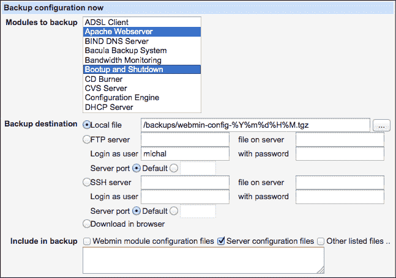
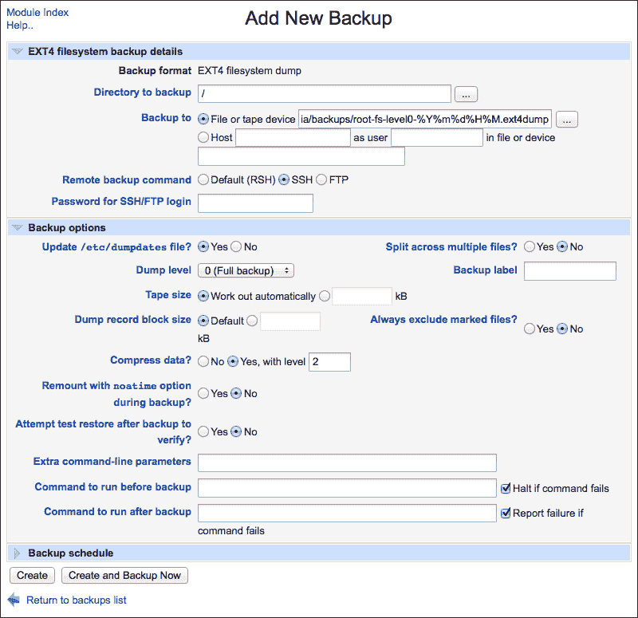
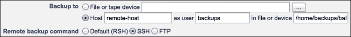
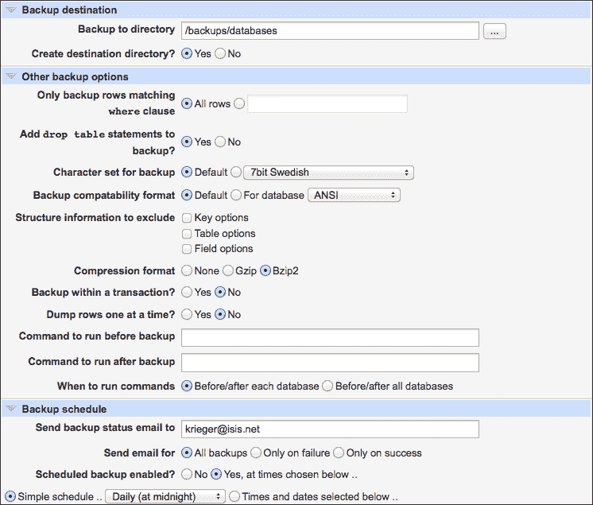

# 第七章 备份系统

在本章中，我们将讨论以下主题：

+   备份配置文件

+   从备份恢复配置文件

+   自动备份配置文件

+   创建选定目录的备份

+   创建整个挂载点的备份

+   备份到远程主机

+   设置自动备份

+   备份数据库

# 引言

存储在服务器上的数据通常比存储数据的服务器硬件更为重要和有价值。保持服务器的安全性和数据的安全是系统管理员的首要任务之一。尽管我们希望避免硬件故障或恶意安全攻击等问题，但我们需要为解决这些问题的后果做好准备。定期备份数据对于从意外灾难中恢复至关重要。你还应该定期测试所创建的备份，确保它们在需要时能够恢复数据。

在本章中，我们将提供一些示例，演示 Webmin 如何帮助你备份以下内容：

+   服务器上的数据文件，例如应用程序的源代码和用户输入或上传的数据。请参阅*创建选定目录的备份*。

+   存储在数据库中的信息。请参阅*备份数据库*。

+   配置设置。请参阅*备份配置文件*。

+   整个服务器文件系统。请参阅*创建整个挂载点的备份*。

在设计备份策略时，请牢记以下事项：

+   **完整备份或增量备份**：服务器或目录的完整备份会存储该位置的所有文件。此类备份可能非常大，即使是压缩后，创建备份也可能需要很长时间。另一方面，增量备份只会存储自上次备份以来已更改的文件。这会占用更少的空间，并且可以迅速完成。然而，增量备份恢复起来稍微有些困难，因为你必须先恢复上一个完整备份，然后再从增量备份中添加自上次完整备份以来创建的文件。

+   **在线或离线备份**：在线备份可以被服务器或其他计算机轻松访问，而离线备份则存储在磁带或断开连接的磁盘上，通常放在架子上。没有人工干预，无法访问它。在线备份更方便，但如果恶意攻击者接管了你的系统，他/她可以将其删除。最好也保留离线备份副本。

+   **本地或异地备份**：将备份保存在与服务器同一建筑物中，在火灾或其他灾难发生时无法保护数据。你可能希望将额外的备份存放在另一个远程位置。

一个完美的备份策略应该存储每日（甚至每小时）的增量备份，并定期（每周或每月）进行完整备份，最好是以离线和异地形式保存。你保留的备份数量将决定你能追溯多长时间来恢复丢失或损坏的文件。

### 提示

备份可能包含敏感数据，如密码或其他机密信息。请确保安全存储备份，可能考虑加密存储在异地的文件。

在本章中，我们将演示如何创建备份，但你需要确保备份文件存储在安全位置并定期进行测试。

# 备份配置文件

你花费了大量时间来设置系统并优化其配置，以获得最佳的性能和功能。删除配置文件或甚至做出不最优的更改可能会带来严重后果，尤其是在生产环境中。在进行更改之前，你应先备份配置文件，并保持备份文件，以便在需要时恢复到先前的配置。Webmin 提供了一个帮助你做到这一点的功能。

## 准备工作

在本教程中，我们将创建包含当前日期的备份文件名。我们需要启用此功能。因此，在开始备份过程之前，进入**Webmin** | **备份配置文件** | **模块配置**，并对**是否进行备份目标的 strftime 替代？**的问题回答**是**。

## 如何操作...

执行以下步骤以备份配置文件：

1.  在根目录下创建一个用于存储本地备份的目录，例如`/backups`。

    ### 提示

    确保你的备份目录存储在一个有足够磁盘空间的分区上，以免意外填满整个磁盘。将`/backups`放在单独的分区或`/var/backups`目录中可能是一个好主意。

    你还应该保护备份位置免受窥探。你可以使用权限和 ACL 来实现这一点，具体操作可以参考第六章中*更改文件所有权和权限*部分的*更改目录的 ACL*一节，*管理系统文件*。

1.  进入**Webmin** | **备份配置文件**。

1.  选择**立即备份**选项卡。

1.  从**要备份的模块**列表中，选择你打算操作的模块，例如**Webmin 配置**。

    ### 提示

    你可以备份多个模块，甚至所有模块，以获取更完整的备份。

1.  将**备份目标**设置为**本地文件**，并为文件名指定以下路径：`/backups/webmin-config-%Y%m%d%H%M.tgz`。

1.  将**包含在备份中**设置为**服务器配置文件**：

1.  点击**立即备份**按钮。

Webmin 配置文件将以文件形式备份到`/backups`目录中。文件名将包含备份的日期和时间。

## 它是如何工作的...

Webmin 知道哪些配置文件被它帮助配置的服务使用。当你备份某个模块的配置文件时，Webmin 会将这些文件压缩成一个 `TAR` 文件并存储在你指定的位置。

由于我们激活了 `strftime` 替换，前面带有百分号（`%`）的模式将被日期组件替换。例如，`%Y` 将被年份数字替换，`%m` 被月份数字替换。完整的可用标记列表可以通过点击**是否对备份目标执行 strftime 替换？**链接在**模块配置**界面中找到。

### 提示

Webmin 仅备份它所知道的文件。如果你想对服务器上的所有配置文件进行完整备份，你应该考虑备份整个`/etc`目录。更多信息请参考本章中的*创建指定目录的备份*章节。

## 还有更多...

Webmin 允许你使用 FTP 或 SFTP（SSH）协议将文件备份到远程服务器。操作步骤与前面部分列出的一样，唯一不同的是需要将**备份目的地**选项更改为**FTP 服务器**或**SSH 服务器**。为了将文件传输到远程服务器，你还需要指定远程服务器的 IP 地址或域名，以及远程服务器上的用户名和密码。你还可以选择将备份文件下载到你用来连接 Webmin 的计算机上，选择**在浏览器中下载**作为目的地选项。

## 另见

+   本章还有其他两个与 Webmin 配置文件备份相关的章节。请参阅本章中的*从备份恢复配置文件*和*自动备份配置文件*章节。

# 从备份恢复配置文件

如果你使用 Webmin 创建配置文件的备份，当你在备份后修改了设置并遇到问题时，可以使用这些备份文件恢复系统设置。

## 如何操作...

恢复配置备份，请按照以下步骤操作：

1.  转到**Webmin** | **备份配置文件**。

1.  选择**立即恢复**选项卡。

1.  在**要恢复的模块**列表中，选择与您要恢复其配置的软件相关的模块，例如**Webmin 配置**。

1.  将**从**设置为**本地文件**，点击省略号（**…**）按钮打开文件选择器，选择备份文件。

    ### 提示

    你还可以选择一个位于远程 FTP 或 SSH 服务器上的文件，或从你用来连接 Webmin 的计算机上传文件。

1.  将**应用配置？**设置为**是**。

1.  将**仅显示将恢复的内容？**设置为**否**。

1.  点击**立即恢复**按钮。

## 工作原理...

Webmin 在备份档案内保持每个模块使用的文件的索引。当您选择一个或多个模块进行恢复时，Webmin 将用备份的配置文件替换它们的活动配置文件。如果有必要，Webmin 将重新启动使用恢复的配置文件的服务。

## 还有更多...

在恢复实际备份之前，最好先检查从备份中恢复的文件，而不实际做出任何更改。为此，请按照前面的步骤操作，但将**仅显示将要恢复的内容？**选项设置为**是**。

如果需要，您还可以检查存储在备份中的配置文件的内容。毕竟，备份只是一个压缩的`TAR`档案，所以您可以解压文件并查看它们。请查看第六章的*管理服务器上的文件和目录*示例，了解如何在不离开 Webmin 的情况下进行此操作。

## 另请参见

+   本章节中还有两个与 Webmin 备份配置设置文件相关的示例。请查看本章节中的*备份配置文件*和*自动备份配置文件*示例。

# 自动备份配置文件

Webmin 允许您设置一个定时计划，自动创建系统配置文件的备份。您可以使用此选项来保留系统配置更改的滚动存档。

## 准备工作

在这个示例中，我们将创建包含当前日期的备份文件名。我们需要启用此功能，因此在开始之前，请导航到**Webmin** | **备份配置文件** | **模块配置**，并对问题**是否进行备份目标的 strftime 替换？**回答**是**。

## 如何操作...

执行以下步骤以自动备份配置文件：

1.  在根目录下创建一个目录来存储本地备份，例如`/backups`。

    ### 提示

    确保备份目录存储在具有足够磁盘空间的分区上，以避免意外填满整个磁盘。将`/backups`放在单独的分区上或放置在`/var/backups`中可能是一个好主意。

    您还应该保护备份位置免受窥探。您可以使用权限和 ACL 来做到这一点，正如在第六章的*更改目录的 ACL*部分中所解释的那样，*管理系统上的文件*。

1.  导航到**Webmin** | **备份配置文件**。

1.  选择**定时备份**选项卡。

1.  点击**添加一个新的定时备份**链接。

1.  在**要备份的模块**列表中选择所有模块。

1.  将**备份目标**设置为**本地文件**，并为文件名指定以下内容：`/backups/system-config-%Y%m%d%H%M.tgz`。

1.  将**备份中包含的内容**设置为**服务器配置文件**。

1.  打开**备份计划**部分。

1.  在**电子邮件结果发送到地址**字段中提供你的电子邮件地址。

1.  将**何时发送电子邮件**设置为**始终**。

    ### 提示

    在收到几封确认备份正常工作的电子邮件后，你可以回来将此选项切换为**仅当发生错误时**。

1.  将**启用定期备份？**设置为**是**，选择**简单计划**，然后从下拉菜单中选择**每天（午夜时分）**。

1.  点击**创建**按钮。

系统配置文件将每天午夜备份到`/backups`目录中的一个文件。该文件名将包含备份的日期和时间。

## 工作原理...

Webmin 创建了一个**cron**作业，该作业在每个午夜运行。该任务会创建一个压缩的 `TAR` 归档，包含 Webmin 所知道的所有配置文件。如果在创建备份归档时发生错误，将会发送电子邮件到提供的地址。

## 另见

+   查看本章的*从备份恢复配置文件*部分，以了解在出现问题时如何恢复设置。

# 创建选定目录的备份

Webmin 允许你轻松地将目录内容备份到一个`TAR`（磁带归档）文件中。备份任务会被保存，因此你将来可以通过单击一次来重新执行备份。

### 注意

`TAR` 文件格式保留了有关每个文件的所有权和权限设置的信息。然而，它并不存储文件的扩展属性。如果你正在使用扩展属性并且使用的是 `ext` 文件系统，应该使用 `dump` 命令。有关使用 `dump` 命令进行备份的更多信息，请参阅本章的*创建整个挂载点的备份*。

## 准备工作

在本教程中，我们将创建包含当前日期的备份文件名。我们需要启用此功能。所以，在开始之前，请导航到**系统** | **文件系统备份** | **模块配置**并对问题**是否执行备份目标的 strftime 替换？**回答**是**。

## 如何操作...

1.  在根目录下创建一个目录来存储备份，例如`/backups`。

1.  导航到**系统** | **文件系统备份**。

1.  在文本框中输入你希望备份的目录路径，例如`/var/www`。

1.  选择**TAR 格式**选项。

1.  点击**添加一个新的目录备份**按钮。

1.  将**备份到**设置为**文件或磁带设备**，并在文本框中输入目标备份文件名，例如 `/backups/www-%Y%m%d%H%M.tgz`。

1.  打开**备份选项**部分。

1.  将**压缩归档？**设置为**是，使用 gzip**。

1.  点击**立即创建并备份**按钮。

目录的备份将以压缩的`TAR`归档形式创建，并保存到指定的目标位置。文件名将包括创建的日期和时间。

## 工作原理...

Webmin 会在指定的备份位置创建所选目录的 Gzip 压缩 `TAR` 归档。这大致等同于在命令行中运行以下命令：

```
$ tar -czf /backups/backup-destination.tgz /backup/source/directory

```

在创建备份之前，Webmin 还会执行 `sync` 命令，刷新文件系统缓冲区，将未写入的更改提交到磁盘。

## 还有更多...

当需要从备份中恢复文件时，您有多种选择。您可以先将文件恢复到一个单独的目录，然后再将它们移动到原始位置。您还可以直接将文件从归档恢复到原始位置。

### 从备份归档中恢复文件

以下步骤会将文件提取到临时位置，您需要将它们移动到最终位置：

1.  创建一个临时目录（`/tmp/restore`），我们将在其中存储恢复的文件，然后再将它们放回原来的位置。

1.  导航到**系统** | **文件系统备份**。

1.  如果系统提示选择恢复的文件系统类型，请选择**TAR**。

1.  点击**恢复文件系统备份**按钮。

1.  将**从文件或设备恢复**设置为**文件或磁带设备**，然后使用文件选择器（**...**按钮）找到您想要恢复的备份归档。

1.  将**恢复到目录**设置为`/tmp/restore`。

1.  将**仅显示备份中的文件？**设置为**否**。

1.  如果您的备份归档是使用 Gzip 压缩的，请将**解压归档？**设置为**是，使用 gzip**。

1.  点击**立即恢复备份**按钮。

1.  将您想要恢复的文件从`/tmp/restore`目录移动到原始位置。

1.  删除`/tmp/restore`目录。

    ### 提示

    若要将文件自动放回原位置，请将根目录（`/`）作为**恢复到目录**。请注意，选择此选项会将备份中的文件放回原处，但不会删除自备份以来创建的文件。如果您只想恢复自备份以来已删除的文件，可以使用**不覆盖文件？**选项。

## 另见

+   请参阅本章中的*创建整个挂载点的备份*、*备份到远程主机*和*设置自动备份*的相关内容，了解更多关于系统文件备份的信息。

# 创建整个挂载点的备份

Webmin 允许您设置使用 UNIX `dump` 命令的备份任务，以归档整个 `ext` 文件系统的挂载点。与使用 `TAR` 创建归档相比，这种策略有许多优势。首先，文件系统中包含的所有信息都得以保留，包括扩展文件属性、ACL、特殊文件等。

其次，`dump` 允许您创建增量存档，仅包含自上次备份以来更改的文件。`dump` 命令使用级别概念区分完整和部分备份。级别 0 备份将存档所有文件（完整备份），而级别 1 将仅存档自上次级别 0 备份以来更改的文件。级别 2 备份将存档自上次级别 1 备份以来更改的所有文件，依此类推。共有 10 个级别可供选择，您不需要使用连续级别编号。一个可能的 `dump` 策略是每月执行一次级别 0 备份，每周执行一次级别 3 备份，每天执行一次级别 6 备份。这意味着每日备份相对较小且速度快，因为它们仅跟踪本周内的更改。

如果您使用 `dump` 的增量备份策略，您将需要从每个级别的存档中恢复备份。例如，如果您遵循上一段描述的 0-3-6 策略，则应从最近的级别 0 开始恢复文件，然后是最近的级别 3，最后是最近的级别 6 存档。

### 提示

`dump` 命令旨在将备份存档写入磁带驱动器。Webmin 将能够帮助您将文件写入磁带设备；在创建备份任务时，只需指定设备名称而不是目标文件名。

## 准备工作

在开始之前，请在系统上安装 `dump` 包，或检查其是否已安装。有关更多信息，请参阅 第一章 中的 *安装软件包* 配方，*设置您的系统*。

您还应准备备份目的地，该目的地位于除您计划备份的文件系统之外的其他文件系统上。这可以是外部驱动器、网络文件系统或磁带设备。在本示例中，假设您正在备份到作为 `/media/backups` 挂载的外部磁盘。

## 如何做...

1.  导航到 **系统** | **文件系统备份**。

1.  在文本字段中，输入要备份的挂载点，例如 `/`。

1.  单击 **添加新目录备份** 按钮。

1.  将 **Backup to** 设置为 **文件或磁带设备** 并在文本字段中输入目标备份文件名，例如 `/media/backups/root-fs-level0-%Y%m%d%H%M.ext4dump`。

    ### 注意

    不需要文件扩展名，但将来快速检查备份存档中包含的文件系统类型可能会有用。根据您的系统更改 `ext4` 为 `ext3` 或 `ext2`。

1.  打开 **备份选项** 部分。

1.  将 **Update /etc/dumpdates file?** 设置为 **是**。

1.  将 **Dump level** 设置为 **0 (完整备份)**。

1.  将 **Compress data?** 设置为 **是，级别为** 并输入 `2`。

1.  单击 **创建并立即备份** 按钮:

将整个文件系统的挂载点备份为压缩的 `dump` 存档到指定的目的地。文件名将包括创建的日期和时间。

## 工作原理...

Webmin 使用`dump`命令创建一个备份档案，其中包含指定源目录挂载的文件系统中的所有文件。文件系统中包含的所有元数据也被存储在档案中。备份通过`bzip`算法进行压缩，以减小档案的大小。

## 还有更多...

为了创建一个增量备份，使其更快完成并使用更少的磁盘空间，请创建一个非 0 级别的`dump`备份。

### 创建增量备份档案

另一级别的`dump`档案将只包含自上次进行较低级别备份以来修改过的文件。按照前面章节中的相同步骤创建增量备份，但将**Dump 级别**参数更改为其他值，并确保文件名（或磁带标签）反映此档案包含该级别的备份。请记住，您需要所有级别的最新备份档案，包括 0 级备份，才能恢复所有备份的文件。

### 从备份档案恢复数据

要从`dump`档案恢复备份，请按照以下步骤操作：

1.  导航到**系统** | **文件系统备份**。

1.  如果系统提示选择恢复的文件系统类型，请选择您备份的文件系统类型，例如**EXT4**。

1.  点击**恢复文件系统备份**按钮。

1.  将**从文件或设备恢复**设置为**文件或磁带设备**，并使用文件选择器（**...**按钮）来查找您要恢复的备份档案。

1.  将**恢复到目录**设置为已备份的挂载点位置，例如根挂载点的`/`、`/home/`等。

    ### 提示

    您不必输入原始路径作为恢复目标。您可以输入另一个路径，将备份提取到不同的位置。

1.  将**恢复的文件**设置为**备份中的所有文件**。

1.  将**仅显示备份中的文件？**设置为**否**。

1.  点击**立即恢复备份**按钮。

    ### 提示

    通过选择**仅显示备份中的文件？**选项，您可以查看备份档案中包含的文件。

    如果您只想恢复少数文件或目录，请将**恢复的文件**设置为**列出的文件**，并输入以空格分隔的路径列表。

## 另见

+   查看本章中的*备份到远程主机*和*设置自动备份*章节，以获取有关如何备份系统文件的更多信息。

# 备份到远程主机

将备份档案存储在本机的本地硬盘上，并不能保护您免受硬件故障或恶意攻击。当机器出现故障时，备份也会丢失。因此，备份应存储在另一台远程服务器上。

最简单的备份远程主机的方式是使用网络文件共享协议，如 NFS 或 CIFS。首先，在远程服务器上创建一个网络卷，然后将该卷挂载到本地服务器上。现在，你可以像访问本地存储的文件一样，轻松地备份远程系统上的文件。查看第六章，*管理系统文件*，获取使用 NFS 或 CIFS 设置网络文件共享的说明。

如果你只有 SSH 访问权限，或者希望备份到远程磁带设备，可以按照此处所列的步骤进行操作。我们将演示 Webmin 如何帮助你通过 SSH 设置`tar`或`dump`来进行远程备份。

## 准备工作

我们服务器的`root`用户需要通过 SSH 访问远程服务器，而无需输入密码。SSH 将使用密钥而非密码；因此，我们需要指示远程服务器接受该密钥。

首先找到我们服务器`root`用户的公钥。默认情况下，密钥存储在名为`/root/.ssh/id_rsa.pub`的文件中。

如果此文件不存在，你可能需要为服务器的`root`用户创建一个 SSH 公钥和私钥对。可以通过在终端中输入以下命令来完成，但需要将`root@my_server`替换为你服务器`root`用户的电子邮件地址：

```
# ssh-keygen -P "" -f "/root/.ssh/id_rsa"-t rsa -C "root@my_server"

```

下一步是指示远程服务器接受使用此密钥的 SSH 连接。假设我们要以名为`backups`的用户身份登录远程服务器。我们需要将本地服务器`/root/.ssh/id_rsa.pub`文件的内容追加到远程服务器上用户主目录中的`/home/backups/.ssh/authorized_keys`文件末尾。

### 注意

通过在用户主目录中名为`~/.ssh/authorized_keys`的文件中放置任何密钥所建立的连接，将被视为合法的、授权的连接。

完成此操作后，我们服务器的`root`用户应该能够通过 SSH 以`backups`用户身份登录到远程服务器，而无需提供密码。

最后一步是确保远程主机上安装了`rmt`命令，并注意`rmt`二进制文件的路径。你可以通过以`root`用户身份运行命令`which rmt`来检查。如果命令未找到，请在远程主机上安装`rmt`或`tar`软件包。

## 如何操作...

你可以将 Webmin 中创建的任何文件系统备份任务转换为远程备份。首先，按照本章中*创建指定目录的备份*或*创建整个挂载点的备份*的步骤创建一个备份任务。然后执行以下步骤进行远程备份：

1.  导航到**系统** | **文件系统备份**。

1.  单击**要备份的目录**列中的链接，以修改你想要的备份。

1.  将 **备份到** 选项切换为 **主机**，并输入远程主机的 IP 地址或域名，后跟用户名和远程服务器上备份文件的路径。

1.  将 **远程备份命令** 设置为 **SSH**：

1.  打开 **备份选项** 部分。

1.  如果您正在修改一个 `TAR` 备份任务，将 **远程系统中的 rmt 路径** 设置为 `rmt` 二进制文件在远程服务器上的路径。

1.  点击 **保存并立即备份** 按钮。

备份任务将会运行，并且一个包含备份的归档文件将在远程服务器上指定的位置创建。

## 它是如何工作的...

`tar` 和 `dump` 命令的现代版本能够使用 SSH 协议，将备份归档通过互联网安全地传输到远程备份服务器。Webmin 会帮助您设置运行 `tar` 或 `dump` 通过 SSH 所需的稍微复杂的选项。

# 设置自动备份

备份应定期执行。您可以使用 cron 来自动化此过程，并在指定的时间运行备份任务。Webmin 的备份功能使这变得非常简单。

## 如何操作...

您可以将 Webmin 中创建的任何文件系统备份任务转换为自动备份。首先按照本章中 *创建选定目录的备份* 或 *创建整个挂载点的备份* 配方中的描述创建一个备份任务。然后执行以下步骤来设置自动备份：

1.  导航至 **系统** | **文件系统备份**。

1.  点击 **要备份的目录** 列中的链接，以修改您想要的备份。

1.  打开 **备份计划** 部分。

1.  设置 **计划备份启用？** 为 **启用，按以下所选时间**。

    ### 提示

    如果您有一系列希望一起运行的备份任务，Webmin 允许您安排在一个备份完成后，运行下一个备份任务。

1.  选择 **简单计划** 和 **每周（星期天）**。

    ### 提示

    如果需要，可以选择更复杂的计划，标记任务将在每月的哪几分钟、几小时和哪几天执行。

1.  将 **电子邮件计划输出** 设置为您的电子邮件地址。

1.  点击 **保存** 按钮。

## 它是如何工作的...

Webmin 会在系统 `root` 用户的 cron 表中添加一个条目，启动备份任务。每当 cron 在预定时间运行时，备份任务将会启动。当备份任务完成时，您应该会收到一条关于任务成功或失败的消息。

# 备份数据库

Webmin 可以帮助您设置一个计划，自动备份托管在系统上的所有数据库。Webmin 会将数据库作为 SQL 文件转储到本地文件系统的目录中，或本地挂载的远程网络卷中。

### 提示

您可以将数据库的备份保存到本地目录，并将该目录的备份传输到远程服务器。您还可以指示 Webmin 运行一个命令，在将本地备份传输到远程位置后删除旧的本地备份。

## 如何操作...

1.  根据你使用的数据库系统，在 Webmin 主菜单的**服务器**部分点击**MySQL 数据库服务器**或**PostgreSQL 数据库服务器**链接。

1.  点击**备份数据库**按钮。

1.  在**备份到目录**字段中，输入一个目录，备份将保存在该目录下，例如`/backups/databases`。

1.  将**是否创建目标目录？**设置为**是**。Webmin 将创建一个具有适当所有者和权限的目录，以便数据库系统将输出写入其中。

1.  在**备份计划**部分，将**启用定时备份？**设置为**是，在下面选择的时间**。

1.  在**将备份状态邮件发送到**字段中，输入你的电子邮件地址。

1.  将**发送电子邮件通知**设置为**所有备份**。

    ### 提示

    在你收到几封电子邮件确认备份按预期工作后，你可以回来将此选项切换为**仅在发生错误时**。

1.  选择**简单计划**并选择**每日（午夜时）**。

    ### 提示

    选择一个更复杂的计划—如果需要的话—通过标记任务执行时的分钟、小时和日期。

    

1.  点击**保存**按钮。

    ### 提示

    你可以点击**立即备份**按钮，立即将数据库保存为 SQL 文件。

## 它是如何工作的...

Webmin 访问你的数据库系统，并为服务器上的每个数据库创建一个 SQL 转储文件。数据库文件将存储在指定目录的磁盘中。当你为自动备份设置计划时，Webmin 会将一项任务添加到`root`用户的 cron 表中，以在指定的时间创建备份。当备份任务完成时，Webmin 会将电子邮件发送到指定的地址，但我们将其设置为仅在发生问题时发送电子邮件，以避免不必要的垃圾邮件。

## 另见

+   请查看第九章，*运行 MySQL 数据库服务器*，以及第十章，*运行 PostgreSQL 数据库服务器*，了解更多关于使用 Webmin 帮助下运行数据库服务器的信息。
