# 第八章：运行 Apache Web 服务器

在本章中，我们将涵盖以下几点内容：

+   在您的系统上安装 Apache

+   重启 Apache

+   启用 Apache 模块

+   创建一个静态 HTML 网站

+   创建虚拟主机

+   为目录、文件和位置设置选项

+   创建一个受密码保护的网站

+   显示目录中文件的列表

+   重定向传入的请求

+   设置带有 SSL 的加密网站

+   记录传入请求和错误

+   使用 Webalizer 分析日志文件

# 介绍

对大多数人来说，Web 就是互联网。自从 1990 年代以来，万维网已成为几乎每个人日常生活的一部分。网站为我们提供信息；社交媒体让我们与他人沟通；在线零售让我们可以在全球购物。**超文本传输协议**（**HTTP**）是使互联网所有这些杀手级功能成为可能的基础。

现代 Web 浏览器能够做的不仅仅是显示超文本。由于包含了 JavaScript 运行时，Web 已经成为最广泛使用的计算平台。程序员如果想覆盖尽可能多的用户群体，就无需为每个操作系统创建一个版本的应用程序。相反，他们可以创建一个 Web 应用程序，能够在每个支持浏览器的设备上运行。

这种安排对系统管理员来说也是一个福音，因为他们可以选择将许多服务以 Web 应用程序的形式实现，而不必担心在许多客户端计算机上安装支持的软件。等到升级时，更新一个服务器比更新每个客户端系统要高效得多。

有很多 Web 服务器可以选择，但 Apache 无疑是最受欢迎的解决方案，Webmin 对它的支持也非常好。另一个目前正在获得流行的开源 Web 服务器是 Nginx，但 Webmin 对它的支持目前非常有限。

在本章中，我们将讨论与设置 Apache、配置 Apache 以提供静态网站以及分析日志文件相关的主题。在第十一章，*运行 Web 应用程序*中，我们将讨论与运行动态网站和 Web 应用程序相关的内容。

# 在您的系统上安装 Apache

一些操作系统默认包含 Apache Web 服务器。其他系统则在其软件库中提供 Apache 包，您可以快速安装带有默认配置的 Apache。

## 准备工作

首先检查 Apache 是否已经安装在您的系统上。如果已经安装，Webmin 应该能够识别它，并将 **Apache Webserver** 模块放入其菜单中的 **服务器** 部分。

## 如何操作...

按照以下步骤在您的系统上设置 Apache：

1.  按照第一章中*安装软件包*的步骤，找到并安装 Apache Web 服务器包。你应该使用可用的 Apache 2 包。

    ### 注意

    根据你的系统，Apache 版本 2 包可能被命名为`apache2`或仅为`httpd`。

1.  如果你使用的是`iptables`防火墙，按照第三章中*通过防火墙允许访问服务*的步骤，允许通过端口`80`的传入连接，如果你计划使用 HTTPS，还需要通过端口`443`。

1.  导航到**服务器** | **Apache Web 服务器**，点击**启动 Apache**链接来启动 Web 服务器（如果安装过程中没有自动启动）。

1.  为了验证 Apache 是否正常工作，使用浏览器访问 URL `http://your.server`，其中 `your.server` 是你安装 Apache 的机器的域名或 IP 地址。

Apache 测试页面应该会问候你。它可能会简单地显示**它工作了！**或者提供更多关于如何在你的操作系统上运行 Apache 的信息。

## 它是如何工作的...

操作系统的包维护者为你的系统提供了一个工作的 Apache 默认配置。安装该包并启动 HTTP 服务器守护进程应该足以为进一步自定义提供一个功能正常的起点。

HTTP 服务器默认监听 80 和 443 端口。当你用浏览器访问 Web 服务器时，它会在发出标准的 `http://` 请求时尝试连接到 80 端口，或者在发出安全的 `https://` 请求时连接到 443 端口。你应该确保这些端口上的连接不会被系统防火墙丢弃。

可以配置 Apache 监听其他端口的连接，但此时每次连接都必须在 URL 字段中输入端口号。这类似于连接到 Webmin，它运行在非标准的 HTTP 端口 10000 上。

## 还有更多...

我们不希望每次服务器重启时都手动启动 Apache，因此我们应该激活软件包中包含的`init`脚本，让服务自动启动。我们还应该监控服务器，并在 HTTP 服务不可用时提醒我们。

### 设置 Apache 在系统启动时启动

按照以下步骤在系统启动时启动 Apache：

1.  导航到**系统** | **启动和关机**。

1.  选择 Apache Web 服务器的 init 脚本旁边的复选框（它可能会被命名为`apache2`、`httpd`或类似名称）。

1.  点击**开机启动**按钮。

### 监控 Apache 是否正常运行

如果 HTTP 服务器崩溃，用户将无法连接到你的网站或使用你的 Web 应用程序。如果发生这种情况，你应该尽快收到通知，以便采取适当的措施重启并修复服务器。

第五章，*监控你的系统*，详细介绍了与监控服务器状态相关的话题。特别查看一下 *接收服务停止时的电子邮件通知* 和 *自动重启停止运行的服务* 这两个配方。同时，从第二台机器监控你的服务器也是一个好主意，这样即使整个服务器不可用，你也能收到故障通知。更多信息，请查看配方 *监控远程服务器*。

## 另见

+   Apache 拥有模块化架构，安装并激活额外组件可以扩展其功能。查看本章中的配方 *启用 Apache 模块* 以获取更多信息。

# 重启 Apache

每次你修改 Apache Web 服务器的配置，或者通过额外的模块（如 `mod_wsgi`）修改与 Apache 一起运行的运行时环境（如 PHP）或 Web 应用时，都需要重启服务器守护进程。

## 操作方法...

使用 Webmin 重启 Apache 非常简单：

1.  导航到 **服务器** | **Apache Web 服务器**

1.  点击 **应用更改** 链接来重启服务器。

## 工作原理...

在 Webmin 的 Apache Web 服务器模块中点击 **应用更改** 会让 Apache 优雅地重启。这会使 Apache 完成所有请求的处理，但停止接受新的连接。当 Apache 完成发送最后一个响应后，它会重启并恢复接受连接。从用户的角度来看，这会导致一些请求完成的时间变长，但重启过程应该是透明的。重启后，Apache 会按照新的配置文件工作。

你也可以使用以下命令以类似的方式重启 Apache：

```
$ sudo apachectl graceful

```

## 还有更多...

通过 Webmin 修改 Apache 配置，可以避免语法错误的烦恼。然而，有时你需要手动进行自定义配置修改。这样做时，你应该在重启服务器之前检查配置语法，因为语法错误会导致 Apache 在重启后无法正常启动。

### 验证 Apache 配置语法

为了检查配置文件是否没有错误（否则 Apache 无法启动），请执行以下命令：

```
$ sudo apachectl configtest

```

如果一切正常，命令将返回 `Syntax OK` 的消息。

# 启用 Apache 模块

Apache HTTP 服务器采用模块化架构。可以通过添加额外的模块来扩展服务器功能。虽然这些模块可以编译进服务器本身，但在大多数系统中，它们是作为共享库单独安装的。Apache 的配置文件决定了服务器启动时加载哪些模块。

Webmin 提供了一个简单的表单来启用和禁用 Apache 模块。在这个配方中，我们将激活 `mod_rewrite` 模块。

## 操作方法...

按照以下步骤启用 Apache 模块：

1.  转到 **服务器** | **Apache Webserver** | **全局配置** | **配置 Apache 模块**。

1.  选中 `rewrite` 模块的复选框。

1.  点击 **启用所选模块** 按钮。

## 它是如何工作的……

Webmin 会向 Apache 的配置中添加一行，加载选定的模块。在 Apache 1 版本中，加载模块的指令是 `AddModule`，而在版本 2 中是 `LoadModule`。

在某些系统中，Apache2 实际上并不将 `LoadModule` 行存储在主配置文件（`/etc/apache2/httpd.conf`）中，而是将每个模块存储在 `/etc/apache2/mods-available/` 目录中的单独文件中。这些模块通过在 `/etc/apache2/mods-enabled` 目录中创建符号链接来激活，所有这些文件在服务器启动时会包含在配置中。在使用这种配置方式时，系统提供了特别的脚本来处理根据需要创建或删除这些符号链接。实际上，我们可以通过执行以下命令并重启 Apache 来启用 `rewrite` 模块：

```
$ sudo a2enmod rewrite

```

可以通过以下命令禁用该模块：

```
$ sudo a2dismod rewrite

```

## 还有更多……

Apache HTTP 服务器软件包包括大多数常用模块，但可以作为软件包安装或从源代码编译安装其他模块。

### 从软件包安装额外的模块

如果你想包含一个额外的 Apache 模块，而这个模块并没有随服务器捆绑一起，你可以在系统软件包仓库中搜索它。带有 Apache 模块的包名可能因发行版而异。例如，如果你想安装 `mod_wsgi` 模块，你可以在名为 `libapache2-mod-wsgi`、`apache2-mod-wsgi` 或仅为 `mod_wsgi` 的包中找到它，具体取决于你的系统。按照 第一章 中 *安装软件包* 的步骤，安装该软件包。

# 创建静态 HTML 网站

Apache 服务器可以执行的最简单任务是提供静态网站。当浏览器向此类网站发送 HTTP 请求时，Apache 会处理传入的 URL，将路径映射到磁盘上的文件，并将该文件的内容返回给浏览器。如果文件包含 HTML 代码，浏览器将渲染网页。

一个 Apache 实例可以为多个网站提供服务，但在本教程中，我们将仅配置一个网站作为 Apache 的默认站点。如果这是你唯一的配置，它将在无论传入请求关联的 IP 地址或域名是什么的情况下使用。

在本教程中，我们将配置 Apache 作为单站点服务器。它将从目录 `/var/www/default` 响应传入的请求，并提供静态文件。

如果你希望在不同的域名下提供不同的网站，你需要为每个域名创建虚拟主机配置。这个主题在 *创建虚拟主机* 的教程中进行了介绍。

## 如何操作……

我们将指示 Apache 监听所有传入的请求，并在端口 80 上创建一个单站点服务器，具体如下：

1.  导航到**服务器** | **Apache Web 服务器**。在**全局配置选项卡**中，选择**网络和地址**。

1.  将**监听地址和端口**设置为**所有**地址上的**端口**`80`。

1.  清除**名称虚拟服务器的地址**字段。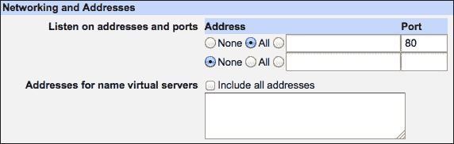

    现在我们可以设置服务器的根文档目录，文件将从该目录提供服务。

1.  创建一个目录来存放静态网站的 HTML 文件：`/var/www/default`。

1.  通过创建一个名为`/var/www/default/index.html`的文件，并包含以下内容来创建一个基本的 HTML 页面：

    ```
    <!DOCTYPE html>
    <html>
      <body>
        <h1>Hello World!</h1>
      </body>
    </html>
    ```

1.  导航到默认 Apache 服务器的配置部分：**服务器** | **Apache Web 服务器** | **现有虚拟主机**。

1.  点击默认虚拟主机的图标。在大多数情况下，这个配置将被称为**默认服务器**，但是如果您的安装附带了一个**虚拟服务器**配置，并且设置为处理任何地址并自动调整所有服务器名称，如下图所示，请使用这个配置：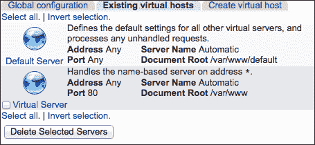

1.  点击**文档选项**，并将**文档根目录**设置为`/var/www/default`。

1.  点击**保存**按钮。

1.  点击**应用更改**链接。

1.  在浏览器中输入服务器的 IP 地址或域名：`http://your.server`。您应该会看到我们刚刚创建的`index.html`文件中的**Hello World!**。

现在您可以将整个静态网站上传到`/var/www/default`目录并在您的服务器上托管它。

## 它是如何工作的……

Apache 配置分为三个主要部分：全局设置、默认服务器设置和虚拟主机设置。如果请求的主机名或 IP 地址与已配置虚拟 Web 服务器的名称或地址匹配，则使用虚拟主机设置。如果没有找到匹配的虚拟主机配置，请求将传递到默认主机。

在我们的配置中，我们没有指定虚拟主机，因此默认主机将处理每个传入的请求。我们将默认主机配置为从`/var/www/default`目录提供文件，这相当于在主 Apache 配置文件中设置`DocumentRoot`指令。

## 另见

+   Apache 是一个功能非常丰富的 web 服务器，因此有许多选项可以设置，Webmin 可以帮助您完成其中的许多操作。浏览本章中的所有其他示例，了解如何自定义您的服务器。

# 创建虚拟主机

一个 Apache 服务器可以同时托管多个网站。如果您的服务器有多个网络接口，每个网站可以托管在单独的 IP 地址上，但更常见的做法是所有网站共享相同的 IP 地址，并通过与网站关联的域名来区分。

### 注意

单个 Web 服务器通过同一个 IP 地址托管多个不同域名的网站，这是 HTTP 协议的一个特点。当你在地址栏输入`http://example.com`时，浏览器会查找与`example.com`域名关联的服务器 IP 地址，并打开与该 IP 的端口 80 的连接。Web 主机的名称（`example.com`）作为请求的`Host:`头部信息传递。

单个 Apache 实例可以支持多个配置。服务器会检查每个传入请求的 IP 地址和`Host:`头部信息，并根据这些信息决定使用哪个配置。如果你有与`example.com`关联的特殊配置（虚拟主机），Apache 会将其应用于所有发往`http://example.com`的请求。如果没有该地址的配置，则会使用默认的服务器配置。

## 准备工作

在这个教程中，我们将为域名`example.com`创建一个虚拟服务器配置。

你可以通过与域名提供商设置 DNS 条目来配置一个域名指向你的服务器。如果你的域名还没有指向你的服务器，你可以在测试过程中通过在客户端计算机的`/etc/hosts`文件中添加条目来模拟这一过程。你将从该计算机连接并测试你的服务器。

### 提示

如果你使用的是 Windows 机器进行测试，你需要在目录`%SystemRoot%\system32\drivers\etc`中找到`hosts`文件。

维基百科提供了不同系统中`hosts`文件的位置：[`en.wikipedia.org/wiki/Hosts_%28file%29#Location_in_the_file_system`](http://en.wikipedia.org/wiki/Hosts_%28file%29#Location_in_the_file_system)。

`hosts`文件条目包含服务器的 IP 地址和你希望指向该 IP 的主机名，两者由空格分隔，例如：

```
198.51.100.1    example.com
```

## 如何操作...

执行以下步骤来创建虚拟主机：

1.  创建一个目录，用于存放静态站点的 HTML 文件 `/var/www/example.com`。

1.  创建一个基础的 HTML 页面，方法是创建一个名为`/var/www/example.com/index.html`的文件，内容如下：

    ```
    <!DOCTYPE html>
    <html>
      <body>
        <h1>Welcome to Example.com</h1>
      </body>
    </html>
    ```

1.  进入**Servers** | **Apache Webserver**。

1.  选择**Create virtual host**标签。

1.  将**Document Root**设置为`/var/www/example.com`。

1.  将**Server Name**设置为`example.com`。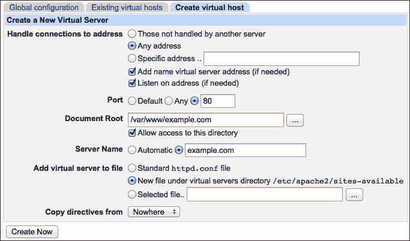

1.  点击**Create Now**按钮。

1.  点击**Apply Changes**链接。

现在，你应该能够通过浏览器访问新站点，网址为`http://example.com`。

## 工作原理...

Webmin 通过在 Apache 配置文件中添加以下部分来创建虚拟服务器：

```
<VirtualHost *:80>
ServerName example.com
DocumentRoot "/var/www/example.com"
</VirtualHost>
```

上述指令指定服务器应监听`80`端口上的连接，如果遇到任何指向`Host: example.com`的请求，它应该使用这个配置来服务这些请求。在这个`VirtualHost`部分中的唯一另一行指示 HTML 文件应该从哪个目录提供。这个虚拟主机的其他选项将被添加到这个`VirtualHost`部分，以进一步自定义虚拟服务器的配置。

## 还有更多...

Apache 虚拟主机具有高度可定制性。你可以通过导航到**服务器** | **Apache Web 服务器** | **现有虚拟主机**，然后点击带有**Server Name example.com**的服务器旁边的图标，找到新创建的虚拟服务器的配置界面。

### 创建基于 IP 的虚拟主机

如果你的机器配备了多个网络接口，Apache 也可以在不同的 IP 地址上创建独立的虚拟主机。这个过程与之前描述的步骤非常相似，但你应该设置**处理** **连接到地址**为**特定地址**，并提供虚拟主机的 IP 地址，而不是指定**Server Name**：

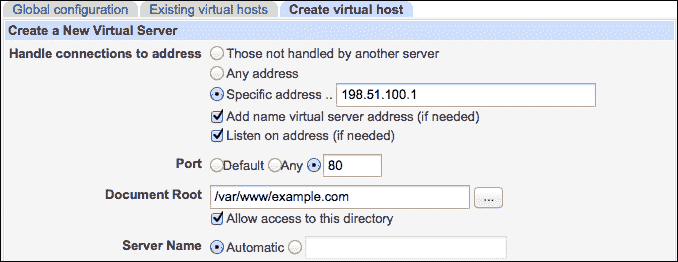

## 另见

+   你可以创建一个虚拟主机，使用加密的 HTTPS 协议，而不是标准的 HTTP。有关详细信息，请查看示例*设置带 SSL 的加密网站*。

# 设置目录、文件和位置的选项

Apache 允许你在目录或文件级别上自定义设置。这意味着，匹配你服务器上特定路径的请求将与对网站其他部分的请求处理方式不同。

每个目录的选项可以通过 Apache 的配置文件中的`<Directory>`指令来设置。以这种方式设置的选项将应用于所选目录及其所有子目录。对子目录设置的`<Directory>`选项将覆盖更高层级目录的设置。

本地设置也可以通过将它们放置在一个特殊文件中（默认情况下称为`.htaccess`）来指定，该文件位于一个目录中。必须在目录上设置`AllowOverride`选项，才能使`.htaccess`文件生效。

在这个例子中，我们将创建一个特定目录的配置，这允许在该目录及其子目录中使用`.htaccess`文件。

## 准备工作

我们将在**默认服务器**配置中设置特定的选项，针对目录`/var/www/default`。在开始之前，请注意你想要设置配置指令的目录的完整路径，并确认哪个虚拟主机提供该目录中的文件（如果不是默认虚拟服务器）。

## 如何操作...

执行以下步骤以设置目录、文件和位置的选项：

1.  导航到**服务器** | **Apache Web 服务器** | **现有虚拟主机**。

1.  选择你想要自定义的虚拟主机，例如**默认服务器**。

1.  在**创建每目录、文件或位置选项**部分，将**类型**设置为**目录**。

1.  选择**精确匹配**并将**路径**设置为`/var/www/default`。

    ### 提示

    你还可以输入通配符路径，如`/var/www/default/site*`。以这种方式设置的选项将应用于所有匹配的目录。

    如果你需要更大的灵活性，可以选择**匹配正则表达式**选项，并使用正则表达式指定路径。

    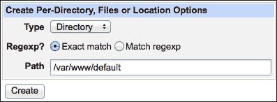

1.  点击**创建**按钮。

1.  你将被带到**虚拟服务器选项**界面，在**每目录选项**部分会有一个新的条目。点击标有**目录 /var/www/default**的图标。

1.  在目录配置界面中，点击标有**文档选项**的图标。

1.  在**选项文件可以覆盖**部分，选择**选择下面的...**并勾选所有框。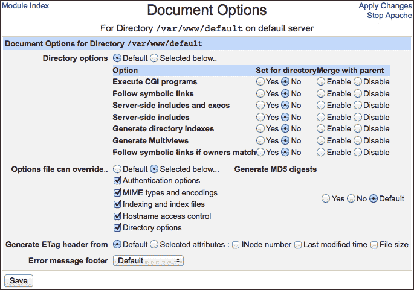

1.  点击**保存**按钮。

1.  点击**应用更改**链接。

## 它是如何工作的...

当我们选择设置每目录选项时，Webmin 会为我们创建一个`<Directory>`指令并填充所选选项。在我们展示的示例中，我们选择允许所有设置被本地`.htaccess`文件覆盖。这样就创建了以下配置部分：

```
<Directory "/var/www/default">
AllowOverride All
</Directory>
```

如果我们选择编辑默认服务器，`<Directory>`指令将被创建在主 Apache 配置文件中。这些设置将始终应用于该目录，无论是使用哪个虚拟主机访问它。如果你想创建每目录设置，只有在选择的虚拟服务器中应用，你可以在**现有虚拟主机**标签中选择该服务器。通过这种方式创建的设置将保存在特定的`<VirtualHost>`部分内。

## 还有更多内容...

Webmin 允许你通过**每目录选项**用户界面设置大多数本地选项，这些选项适用于你所使用的 Apache 版本。四处浏览，熟悉这个部分，你就能在需要时快速调整设置。

Apache 允许你通过匹配目录的文件系统路径设置本地选项，但你也可以匹配请求文件或 URL 地址的名称。

### 设置匹配模式文件名的选项

Apache 允许你对与特定模式匹配的文件设置特定选项。例如，允许外部用户读取`.htaccess`和其他本地 Apache 配置文件的内容并不是一个好主意。你可以通过以下步骤来防止访问所有这些文件（统一匹配正则表达式`^\.ht`）：

1.  导航到**服务器** | **Apache Web 服务器** | **现有虚拟主机**。

1.  选择**默认服务器**选项。

1.  在**创建每目录、文件或位置选项**部分，将**类型**设置为**文件**。

1.  选择**匹配正则表达式**，并将**路径**设置为正则表达式`^\.ht`。

1.  点击**创建**按钮。

1.  点击标有**文件正则表达式 ^\.ht**的图标。

1.  点击标有**访问控制**的图标。

1.  在**限制访问**部分，将唯一的操作设置为**拒绝所有请求**。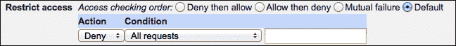

1.  点击**保存**按钮。

1.  点击**应用更改**链接。

### 为特定 URL 设置选项

您可能希望将自定义设置应用于特定的 URL，这些 URL 不一定匹配某个特定的底层文件系统路径或文件名。在这种情况下，可以使用 Apache 的`<Location>`指令，Webmin 将协助您进行配置。

以动态生成的`/server-status`页面为例，该页面在启用`mod_status`模块时为您提供服务器概况。您的磁盘中没有名为`server-status`的路径，但您仍然可以通过创建基于位置的配置来控制对该 URL 的请求。

您可能希望服务器信息仅对有限的用户组可用。我们可以将对该 URL 的访问限制为仅来自`127.0.0.1`的本地主机 IP 请求：

1.  导航至**服务器** | **Apache Web 服务器** | **现有虚拟主机**。

1.  选择**默认服务器**选项。

1.  在**创建每个目录、文件或位置选项**部分，将**类型**设置为**位置**。

1.  选择**精确匹配**，并将**路径**设置为`/server-status`。

1.  点击**创建**按钮。

1.  点击标有**位置/server-status**的图标。

1.  点击标有**访问控制**的图标。

1.  在**限制访问**部分，将**访问检查顺序**设置为**先允许再拒绝**。

1.  将唯一的操作设置为**允许来自 IP 的请求..**，并指定`127.0.0.1`。

1.  点击**保存**按钮，然后再次进入**访问控制**。

    ### 注意

    Webmin 始终在列表中提供一个空条目。当您再次进入该部分时，您将能够添加第二个访问限制。

1.  在**限制访问**部分，添加第二个操作**拒绝所有请求**。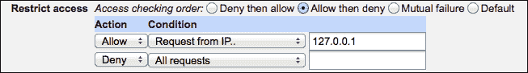

1.  点击**保存**按钮。

1.  点击**应用更改**链接。

### 更改匹配的路径或模式

如果您已经创建了一组本地设置，但需要更改它们应用的路径，请按照以下步骤操作：

1.  导航至**服务器** | **Apache Web 服务器** | **现有虚拟主机**。

1.  点击您希望自定义的虚拟主机图标。

1.  在**每个目录选项**中，点击您希望重新定位的本地设置图标。

1.  修改**应用于**部分的匹配模式。

### 使用`.htaccess`文件设置选项

使用`.htaccess`文件是一种便捷的方式，可以让没有服务器管理权限的用户在目录级别自定义 Apache 服务器的本地设置。只要用户能够修改设置文件，他们就可以调整服务器，而无需管理员的支持。通过`.htaccess`文件进行的设置更改不需要重新启动服务器。

### 注意

你应该注意到，使用 `.htaccess` 文件会降低 Apache 的性能，因为服务器在每次请求时都必须在请求的目录中查找设置文件（并且可能还会查找更高级目录中的 `.htaccess` 文件）。

以下是创建 `.htaccess` 选项文件的步骤：

1.  导航到 **服务器** | **Apache Webserver** | **全局配置** | **每目录选项文件**。

1.  输入你想为其写 `.htaccess` 文件的目录路径，例如 `/var/www/example.com`，然后点击 **创建选项文件** 按钮。

你将进入一个屏幕，允许你通过 `.htaccess` 文件修改本地设置。

# 创建受密码保护的网站

HTTP 协议提供了一种基本的用户身份验证功能。当请求发送到受保护的网站或网站中的受保护区域时，浏览器会提示用户输入用户名和密码。如果提供的值与授权用户匹配，则授予对该网站的访问权限。

### 注意

基本的 HTTP 身份验证方法在 Apache 上设置非常简单，特别是在 Webmin 的帮助下。此功能的主要缺点是其安全性较差，且不太具备自定义性。如果你打算在开放的互联网中使用这种身份验证方法，确保它与加密的 HTTPS 协议结合使用。

## 准备工作

在开始之前，确保在你的 Apache 配置中启用了 `auth_basic` 模块。有关更多信息，请查看配方 *启用 Apache 模块*。

## 如何操作...

执行以下步骤以创建一个受密码保护的网站

1.  导航到 **服务器** | **Apache Webserver** | **现有虚拟主机**。

1.  选择你希望用密码保护的虚拟服务器。

1.  如果你已经有了要保护的目录的设置部分，可以跳到第 7 步。

1.  在 **创建每目录、文件或位置选项** 部分，将 **类型** 设置为 **目录**。

1.  选择 **精确匹配**，并将 **路径** 设置为你网站的根文档，例如 `/var/www/example.com`。

    ### 提示

    你可以通过为子目录创建每目录设置来用密码保护你网站的某个子部分。

1.  点击 **创建** 按钮。

1.  在 **每目录选项** 部分，点击目录配置部分的链接。

1.  点击标有 **访问控制** 的图标。

1.  在 **认证领域名称** 部分，指定一个描述，当用户提示输入密码时将显示该描述，例如 `请输入您的 ISIS 密码`。

1.  将 **认证类型** 设置为 **基本**。

1.  将 **通过登录限制访问** 设置为 **所有有效用户**。

1.  将 **Basic login user file types** 设置为 **文本文件**。

1.  将 **用户文本文件** 设置为 `/etc/apache2/htpasswd` 或 `/etc/httpd/htpasswd`，具体取决于你的 Apache 配置目录的位置。

    ### 提示

    密码文件永远不应通过 Web 服务器访问。你应该将其保存在文档根目录之外。如果你需要将其保存在文档根目录中，按照*为匹配模式的文件设置选项*部分的步骤限制对它的访问。

    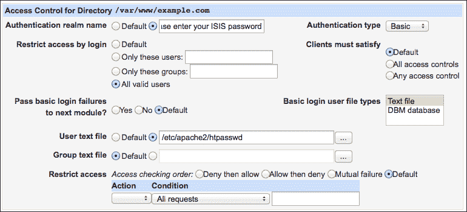

1.  点击**保存**按钮，然后通过点击**应用更改**链接来重启 Apache。

### 创建用户账户

执行以下步骤创建用户账户：

1.  再次输入**访问控制**以配置该目录。

1.  点击标记为**编辑用户**的新链接，位于**用户文本文件**一行中。

1.  点击**添加新用户**链接。

1.  明文指定用户名和密码。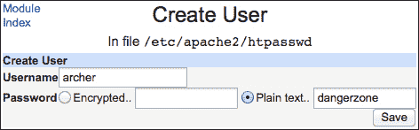

1.  点击**保存**按钮。

## 它是如何工作的...

Webmin 通过在 Apache 配置中创建`<Directory>`指令，并为`auth_basic`模块添加相应的指令，来创建一个受密码保护的网站。例如，前面提到的指令将把以下部分添加到 Apache 配置中：

```
<Directory "/var/www/example.com">
AuthName "Please enter your ISIS password"
AuthType Basic
require valid-user
AuthBasicProvider file
AuthUserFile /etc/apache2/htpasswd
</Directory>
```

Webmin 还帮助你创建有效的用户名和密码对，这些将被视为有效用户。此信息存储在由`AuthUserFile`指令指定的文件中。

## 还有更多...

Apache 密码与系统的用户账户信息分开存储。如果你希望这些账户保持同步，Webmin 可以通过为你执行该任务来大大帮助你。

### 保持 Apache 和系统账户同步

执行以下步骤以保持 Apache 和系统账户同步：

1.  导航到**服务器** | **Apache Web 服务器** | **现有虚拟主机**。

1.  选择受密码保护的虚拟服务器。

1.  在**每目录选项**部分，点击链接进入受密码保护的目录配置部分。

1.  点击标记为**访问控制**的图标。

1.  点击标记为**编辑用户**的新链接，位于**用户文本文件**一行中。

1.  勾选标记为**当 Unix 用户被添加时添加用户**、**当 Unix 用户被更改时更改用户**和**当 Unix 用户被删除时删除用户**的复选框。

1.  点击**保存**按钮。

## 另见

+   如果你想在互联网上使用 HTTP 基本认证，请确保将其与 SSL 连接加密结合使用。详情请参阅*设置加密网站与 SSL*部分。

+   同时确保`htpasswd`文件无法通过 Web 服务器访问。有关防止访问其位置的方法，请参考*为目录、文件和位置设置选项*部分。

# 显示目录中文件的列表

Web 服务器是一个很好的可下载文件存储库。这种文件分发方式在很大程度上取代了匿名 FTP，因为它为用户提供了更无缝的体验。如果您希望为用户提供具有自动生成索引的文件目录访问权限，Apache 是完成此任务的合适工具。

### 注意

在大多数情况下，列出网站目录中的文件并不必要，有时甚至可能暴露敏感信息给潜在的攻击者。仅在有意义的地方使用目录列表。

## 准备工作

在此步骤中，我们将展示目录`/var/www/example.com/downloads`的文件列表，该目录由虚拟主机`example.com`通过 URL`http://example.com/downloads`提供服务。请注意文件路径、虚拟主机名称和您实际使用的 URL，并进行适当替换。

## 如何操作...

执行以下步骤以显示目录中文件的列表：

1.  创建目录`/var/www/example.com/downloads`，并在其中放置一些可供下载的文件。

1.  导航到**服务器** | **Apache Webserver** | **现有虚拟主机**。

1.  选择将提供文件服务的虚拟主机，例如**服务器名称 example.com**。

1.  在**创建每目录、文件或位置选项**部分，将**类型**设置为**目录**。

1.  选择**精确匹配**，并将**路径**设置为您的站点根文档，例如`/var/www/example.com/downloads`。

1.  点击**创建**按钮。

1.  在**每目录选项**部分，点击标有**目录 /var/www/example.com/downloads**的链接。

1.  点击标有**文档选项**的链接。

1.  将**目录选项**设置为**如下所选**。

1.  将**生成目录索引**设置为**是**。

1.  点击**保存**按钮。

1.  点击标有**目录索引**的按钮。

1.  将**目录索引选项**设置为**如下所选**。

1.  勾选标有**显示精美目录索引**的复选框。

1.  使用此表单设置目录列表的显示偏好。

1.  点击**保存**按钮。

1.  点击**应用更改**链接。

现在，您应该能够看到 URL`http://example.com/downloads`下的文件列表。

## 它是如何工作的...

Webmin 通过在您的 Apache 配置中创建`<Directory>`指令来生成目录列表配置。例如，上述步骤会将以下部分添加到虚拟主机配置中：

```
<Directory "/var/www/example.com/downloads">
Options Indexes
IndexOptions FancyIndexing
</Directory>
```

## 还有更多...

默认情况下，Apache 的目录列表页面包含一个包含目录路径的头部和一个包含有关服务器和 Apache 信息的底部。您可以通过将名为`HEADER.html`和`README.html`的文件放置在目录中来自定义头部和底部的内容。在这些文件中放置的任何 HTML 代码都会显示在文件列表页面上。如果您希望防止 Apache 列出这些文件，请转到**目录索引**选项屏幕，并在**要在目录索引中忽略的文件**字段中输入它们的名称（每行一个文件名）。

## 另请参见

+   欲了解更多关于 Apache 目录索引选项的信息，请查阅此手册页面：[`httpd.apache.org/docs/current/mod/mod_autoindex.html`](http://httpd.apache.org/docs/current/mod/mod_autoindex.html)。

# 重定向传入请求

您可以使用 Apache 的 HTTP 重定向将传入请求转发到另一个地址。如果您的网页地址发生变化，或者您希望创建一个易于记忆的 URL 地址，该地址会重定向到特定页面的更长地址，这将非常有用。

假设我们曾经在[`oldsite.com/articles/`](http://oldsite.com/articles/)托管了许多文章，而我们决定将网站迁移到另一个域名，现在相同的文章将托管在`http://example.com/info/`。

我们可以在旧站点上配置 Apache，将所有传入请求重定向到新域。

## 准备就绪

在开始之前，请确保在 Apache 配置中启用了`alias`模块。有关更多信息，请查看配方*启用 Apache 模块*。

## 如何操作…

在您的旧服务器上，按照以下步骤将请求重定向到新域：

1.  导航到**服务器** | **Apache Web 服务器** | **现有虚拟主机**。

1.  选择将执行重定向的虚拟主机，例如**默认服务器**。

1.  点击标有**别名和重定向**的图标。

1.  填写**正则表达式 URL 重定向**表单，输入以下数据：

    +   **From**: `/articles/(.*)`

    +   **状态**: `301`

    +   **To**: `http://example.com/info/$1`

    ### 注意

    **From**字段中由`(.*)`标记的正则表达式组捕获任何在`/articles/`之后的字符串，并将捕获的内容放置在**To**字段的`$1`占位符中。

    HTTP 重定向状态`301`表示资源已被永久移动。如果重定向是临时的，通常使用状态`302`。

1.  点击**保存**按钮。

1.  点击**应用更改**链接。

## 它是如何工作的…

Webmin 通过在您的虚拟主机配置文件中添加`RedirectMatch`指令来创建重定向。前面示例中的步骤将创建以下指令：

```
RedirectMatch 301 /articles/(.*) "http://example.com/info/$1"
```

如果我们不使用正则表达式，一个更简单的`Redirect`指令就足够了，例如：

```
Redirect 301 /articles/ "http://example.com/info/"
```

## 还有更多…

一个名为`mod_alias`的 Apache 模块提供了`Redirect`指令。这些指令允许您在地址之间创建简单的转发。另一个名为`mod_rewrite`的模块提供了一种更加复杂的重定向机制，可以根据 URL 的每一部分、文件系统测试、服务器和环境变量、HTTP 头、时间戳等重定向传入请求。不幸的是，`mod_rewrite`指令的语法可能非常独特和复杂，因此手动编辑其配置文件仍然是最好的选择。

更多信息可以在 Apache 官网找到：[`httpd.apache.org/docs/current/rewrite/`](http://httpd.apache.org/docs/current/rewrite/)。

### 创建文件系统别名

如果你想从服务器的文档根目录之外的目录提供文件，或者希望从多个位置提供同一目录的文件，可以使用本地别名而不是重定向。重定向会将用户转发到另一个 URL，而别名对用户透明，它从相同的 URL 提供不同的内容。

例如，我们可以将站点的图片存储在目录`/var/www/resources/images`中，但使用别名从 URL`/images/`提供它们。最终用户不会察觉文件是直接提供的还是通过别名提供的。

按照以下步骤，从以`/images/`开头的 URL 提供位于`/var/www/resources/images`的文件：

1.  导航到**服务器** | **Apache Webserver** | **现有虚拟主机**。

1.  选择执行重定向的虚拟主机，例如**默认服务器**。

1.  点击标记为**别名和重定向**的图标。

1.  填写**文档目录别名**表单，内容如下：

    +   **从**: `/images/`

    +   **到**: `/var/www/resources/images`

### 提示

在你能从另一个文件系统位置提供文件之前，可能需要创建一个特定目录的 Apache 配置，这样服务器才能将这些文件公开。有关更多信息，请查看配方*为目录、文件和位置设置选项*。

# 设置加密网站与 SSL

HTTP 协议是以明文形式通过互联网传输的。这意味着通信可能被网站的最终用户和服务器管理员以外的人截获和读取。在大多数情况下，交换的信息是公开的，这种安全漏洞是可以接受的。在其他需要交换密码或其他机密信息的情况下，不应使用简单的 HTTP。幸运的是，感谢 HTTPS 协议，它通过增加加密层，保障了网络通信的安全。

### 注意

HTTPS 使用的 SSL 加密是在实际 HTTP 会话开始之前添加的。这意味着基于名称的虚拟服务器，通常在 HTTP 头中指定，不能与 HTTPS 一起使用。实际上，这意味着每个 SSL 保护的网站必须通过一个专用的 IP 地址提供。

如果你只打算在服务器上创建一个 HTTPS 网站，那就没问题。但如果你计划创建更多的安全网站，你需要为每个站点为服务器添加一个独立的网络接口，并为每个站点分配独立的 IP 地址。

如果你的服务器只有一个 IP 地址，并且你必须提供多个 HTTPS 站点，你可以使用一种名为**服务器名称指示**（**SNI**）的技术。有关更多信息，请查看这个维基百科页面：[`en.wikipedia.org/wiki/Server_Name_Indication`](http://en.wikipedia.org/wiki/Server_Name_Indication)。

## 准备工作

在开始之前，请确保`ssl`模块已在 Apache 配置中启用。有关更多信息，请查看配方*启用 Apache 模块*。

下一步将是获取密钥和证书，这些将用于签署和加密 HTTPS 通信。您可以选择创建自己的自签名证书，或从商业证书机构购买签名证书。您可以快速且免费地生成自签名证书，但访问浏览器将向用户报告您的网站无法完全信任，因为没有外部认证机构认证用于加密通信的证书。第三方也可能伪造自签名证书，因此无法保证别人不会冒充您。

商业证书稍微难以获得，每年需要支付几美元，但您的用户将能够信任他们连接到您的网站，并且不会看到警告，而是在浏览器地址栏中看到一个漂亮的彩色锁定图标。

创建 SSL 证书的过程需要在您的系统上安装`openssl`软件包。如果您需要安装它，请查看第一章中的*安装软件包*部分，*设置您的系统*。密钥和证书不一定要在服务器上生成；您可以在任何具有`openssl`命令的机器上生成它们。

### 生成私钥

SSL 建立在非对称加密的基础上，使用两把密钥：一把是公开的，另一把是私密的（或称为私钥）。公开密钥用于加密消息或验证其签名，而私钥用于解密消息并创建签名。私钥应该仅为其所有者所知，并保存在受保护的文件中。

使用此命令生成强大的 RSA 私钥，并将其保存到文件`key.pem`中：

```
$ openssl genrsa -out key.pem 2048

```

拥有您的私钥的人可以冒充您，即使您购买了签名证书。更改密钥文件的权限，使只有 root 用户可以读取它，并确保它不会落入不正确的手中。使用以下命令更改权限：

```
$ chmod 400 key.pem

```

### 创建自签名证书

您可以使用以下命令创建自签名证书。该证书将保存到文件`cert.pem`中，并由您的私钥（来自`key.pem`）签名，且有效期为 365 天：

```
$ openssl req -new -key key.pem -x509 -nodes -days 365 -out cert.pem

```

在生成证书时，您将被要求回答一系列问题，包括国家名称、州或省、城市、组织、组织单位和电子邮件地址。如果您想留空任何字段，请输入一个点（`.`）并按*Enter*键。您还需要为证书提供一个**常用名称**，在本例中，它将是您网站的完整域名（例如，`www.example.com`）。请记住，证书中的常用名称必须与您的域名完全匹配，因此为`www.example.com`生成的证书无法在`example.com`上使用，反之亦然。

### 提示

如果你需要一个可以在多个域名上使用的证书，你可以准备一个**通配符**证书，或者一个在**Subject Alt Name**字段中指定多个域名的证书。

### 获取商业签名的证书

为了获得商业签名的证书，你需要生成一个由私钥签名的**证书签名请求**（**CSR**）文件。你将这个文件发送给商业证书颁发机构，该机构会验证你的身份，处理支付，并将签名证书返回给你。

你可以使用以下命令根据你的私钥（`key.pem`）生成 CSR 文件（`csr.pem`）：

```
$ openssl req -new -key key.pem -out csr.pem

```

你将被问到与生成自签名证书时相同的一系列问题。确保准确指定这些信息；如果这些数据与提供给证书颁发机构的信息不一致，可能会导致认证过程出现问题。

### 检查证书数据

一旦你拥有了证书（`cert.pem`），可以通过以下命令查看其中包含的信息：

```
$ openssl x509 -noout -text -in cert.pem

```

## 如何操作...

按照以下步骤设置由 Apache 运行的 SSL 保护的 HTTPS 网站：

1.  准备以下内容：

    +   私钥文件（`key.pem`）

    +   证书文件（`cert.pem`）

    +   将与 SSL 一起使用的 IP 地址（例如，`198.51.100.1`）

    +   证书中指定的域名作为通用名称（例如，`www.example.com`）

    +   包含网站文件的目录路径（例如，`/var/www/www.example.com`）

    +   系统中 Apache 配置目录的路径（例如，`/etc/apache2`）

1.  将 `key.pem` 和 `cert.pem` 文件复制到 Apache 配置目录。

    ### 注意

    在任何情况下，这些文件都不应该出现在公开可用的文档目录中。请将它们保存在仅根用户可访问的安全位置。

1.  确保 `key.pem` 文件的权限设置如下，具有严格限制：

    ```
    $ sudo chmod 400 key.pem

    ```

1.  导航到**服务器** | **Apache Webserver** | **创建虚拟主机**，并根据以下设置准备一个虚拟服务器。更多信息请参考“创建虚拟主机”教程：

    +   处理到特定地址的连接：`198.51.100.1`

    +   **端口**：`443`

    +   **文档根目录**：`/var/www/www.example.com`

    +   **服务器名称**：`www.example.com`

    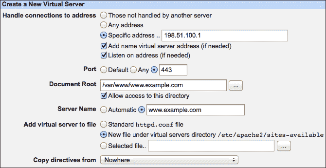

1.  导航到新创建的虚拟服务器的选项屏幕，然后点击**SSL 选项**图标。

1.  设置**启用 SSL？**为**是**。

1.  设置**证书/私钥文件**为 `/etc/apache2/cert.pem`。

1.  设置**私钥文件**为 `/etc/apache2/key.pem`。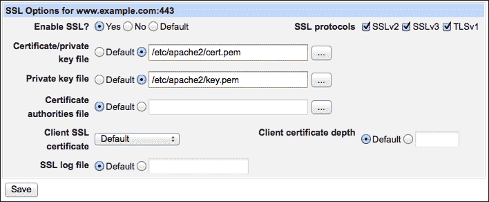

1.  点击**保存**按钮。

1.  点击**应用更改**链接。

现在，你可以使用浏览器连接到你网站的 HTTPS 地址 `https://www.example.com`。

## 如何工作...

Webmin 通过将以下指令添加到 Apache 虚拟主机的配置中来启用 SSL：

```
SSLEngine on
SSLCertificateFile /etc/apache2/cert.pem
SSLCertificateKeyFile /etc/apache2/key.pem
```

这种基本配置使得使用 HTTPS 协议与服务器通信成为可能。当浏览器发起 HTTPS 连接时，请求会发送到服务器的 443 端口。在 HTTP 对话开始之前，进行 SSL 握手，所有随后的通信都将加密。

## 还有更多...

如果您准备了一个监听 HTTPS 请求的虚拟服务器，使用 443 端口，客户端将无法通过标准的 HTTP 请求连接到此服务器的 80 端口。您可能想为同一域准备一个第二个虚拟主机，将所有传入流量重定向到以`https://`开头的 URL。有关更多信息，请查看*重定向传入请求*的做法。

# 记录传入的请求和错误

托管网站的服务器会引起很多关注。它被用户访问，被索引搜索机器人扫描，并且被潜在的攻击者审视，以查看是否能够突破。您的 Web 服务器应该记录所有这些流量的信息，您应该定期查看这些日志，以确保一切正常运行。

默认情况下，Apache 保留两种类型的日志文件：访问日志，包含有关每个传入请求的信息；错误日志，包含关于遇到问题的信息。您可以配置 Apache 保持单一的日志文件对，但在大多数情况下，为每个虚拟服务器保留单独的访问日志和错误日志更为有用。

## 准备就绪

Apache 的日志功能高度可定制，您可以设置服务器以多种不同方式输出日志条目。一些格式已经被公认为标准，目前，推荐的日志标准被昵称为*合并日志格式*。它记录了许多信息，其中包括：

+   远程 IP 或主机名（`%h`）

+   如果请求经过身份验证，远程用户（`%u`）

+   时间（`%t`）

+   请求的第一行，包含所使用的 HTTP 方法和请求路径（`%r`）

+   HTTP 响应状态：200 表示成功，404 表示未找到，等等（`%>s`）

+   响应大小（以字节为单位）（`%O`）

+   发起此请求的页面（`%{Referer}i`）

+   标识请求浏览器类型和版本的用户代理字符串（`%{User-Agent}i`）

所有这些字段形成了合并日志格式，表示为：

```
%h %l %u %t "%r" %>s %O "%{Referer}i" "%{User-Agent}i"
```

您应该确保在服务器配置中启用了昵称为“combined”的格式。如果没有，您可以按照以下方式将其添加：

1.  导航到默认 Apache 服务器的配置部分，路径为**服务器** | **Apache Web 服务器** | **现有虚拟主机** | **默认服务器**。

1.  点击**日志文件**。

1.  确保列表中包含名为`combined`的日志格式。如果缺少此格式，请添加一条条目，使用昵称`combined`和以下格式字符串：

    ```
    %h %l %u %t "%r" %>s %O "%{Referer}i" "%{User-Agent}i"
    ```

1.  将**默认日志**格式设置为`combined`。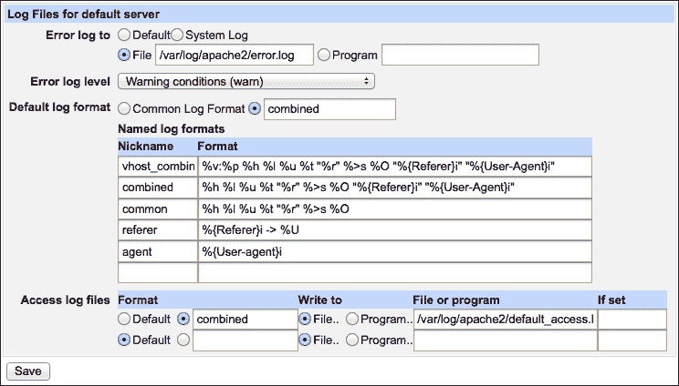

1.  点击**保存**按钮。

1.  点击**应用更改**链接。

您可以在 Apache 文档中找到更多关于日志格式的信息：

[`httpd.apache.org/docs/current/mod/mod_log_config.html`](http://httpd.apache.org/docs/current/mod/mod_log_config.html)

## 操作步骤...

在这个教程中，我们将为服务于域名`example.com`的虚拟主机设置日志记录。我们将指导 Apache 将访问日志条目保存在`/var/log/apache2/example.com-access.log`中，错误日志保存在`/var/log/apache2/example.com-error.log`中。如果您的系统使用`/var/log/httpd`或其他目录来存储 Apache 日志，请相应地修改路径。按照以下步骤记录传入请求和错误日志：

1.  导航至**服务器** | **Apache Web 服务器** | **现有虚拟主机**。

1.  点击您想要设置日志选项的主机图标。

1.  点击**日志文件**。

1.  将**错误日志设置为**设置为**文件**，并输入日志文件路径：`/var/log/apache2/example.com-error.log`。

1.  将**错误日志级别**设置为**警告条件（warn）**。

1.  将**默认日志格式**设置为`combined`。

1.  在**访问日志文件**下，将**格式**设置为**默认**，并将**写入文件路径**设置为`/var/log/apache2/example.com-access.log`。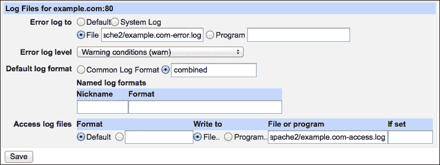

1.  点击**保存**按钮。

1.  点击**应用更改**链接。

## 工作原理...

Webmin 通过在`<VirtualHost>`部分添加以下指令来配置虚拟服务器的日志记录：

```
ErrorLog /var/log/apache2/example.com-error.log
LogLevel warn
LogFormat "combined"
TransferLog /var/log/apache2/example.com-access.log
```

这些指令告诉 Apache 在哪里保存该主机的访问日志和错误日志，访问日志使用什么格式（`LogFormat`），以及错误报告的详细程度（`LogLevel`）。

## 另见

+   Apache 日志文件在流量高的站点上增长非常快。请查看第五章中的教程*配置日志文件轮换*，了解如何使用`logrotate`来处理增长的日志文件。

+   Webmin 可以为您显示收集到的日志文件消息；请查看本章节中*添加其他日志文件到 Webmin*的教程，位于第五章，*监控您的系统*。

+   一个叫做 Webalizer 的程序可以帮助你分析 Apache 日志文件。查看本章节中的教程*使用 Webalizer 分析日志文件*，了解更多信息。

# 使用 Webalizer 分析日志文件

Web 服务器的日志文件包含了大量有用的信息，但它们太长且冗余，不容易阅读。为了全面了解网站的状态，您需要一个工具来分析其访问日志文件的内容。一个这样的工具叫做**Webalizer**；它易于安装并且与 Webmin 集成良好。Webalizer 解析日志文件并生成 HTML 格式的图形报告，将日志文件转化为清晰的图表和表格。

## 准备工作

请按照第一章中*安装软件包*的教程，安装`webalizer`软件包。

## 操作步骤...

记下你想要分析的 Apache 访问日志文件的位置。在这个例子中，我们将为托管在`example.com`上的网站准备 Webalizer 报告，访问日志文件存储在`/var/log/apache2/example.com-access.log`。执行以下步骤以使用 Webalizer 分析日志文件：

1.  创建一个目录来存储这个网站的 Webalizer 报告。比如，`/var/stats/example.com`可能是一个合适的位置。

1.  转到**服务器** | **Webalizer 日志文件分析**。

1.  点击**添加新的日志文件进行分析**链接。

1.  将**基础日志文件路径**设置为`/var/log/apache2/example.com-access.log`。

    ### 提示

    即使你使用`logrotate`旋转日志，Webalizer 也会读取整个日志文件家族，包括压缩的备份日志归档文件。

1.  将**写入报告的目录**设置为你创建的报告目录`/var/stats/example.com`。

1.  将**以用户身份运行 webalizer**设置为`root`。

1.  将**是否始终重新处理日志文件？** 设置为**否**。

1.  将**报告生成后是否清除日志文件？** 设置为**否**。

1.  将**报告选项**设置为**使用全局选项**。

1.  将**计划报告生成**设置为**启用，并选择下方的时间**。

1.  使用**简单计划**，设置为**每日（午夜时分）**。

1.  点击**创建**按钮。

新的 Webalizer 分析条目将出现在列表中。如果你不想等到第二天，可以立即生成报告：

1.  点击新创建的日志分析条目。

1.  点击**生成报告**按钮，然后在下一屏幕点击**查看已完成的报告**链接。

从现在起，你可以随时进入**服务器** | **Webalizer 日志文件分析**，点击屏幕右侧的链接查看每日更新的 Webalizer 报告。

## 运行原理...

Webmin 会创建一个 cron 任务，每晚午夜执行`webalizer`二进制文件。Webalizer 解析指定的日志文件并生成一个图形报告，报告以 HTML 页面的形式展示。当你查看报告时，Webmin 会在浏览器中显示 Webalizer 生成的 HTML 页面。

## 还有更多内容...

你可以自定义 Webalizer 生成报告的某些方面。你可以通过进入**服务器** | **Webalizer 日志文件分析**页面，并点击**编辑全局选项**按钮来全局编辑设置。

你还可以通过以下步骤为报告设置自定义选项：

1.  转到**服务器** | **Webalizer 日志文件分析**。

1.  点击你想要自定义报告的日志文件名称。

1.  将**报告选项**设置为**自定义选项**。

1.  点击**保存**按钮。

1.  返回列出 Webalizer 报告的屏幕，再次点击日志文件名称。

1.  点击屏幕底部的新**编辑选项**按钮。

1.  自定义报告设置，然后点击**保存**按钮。
