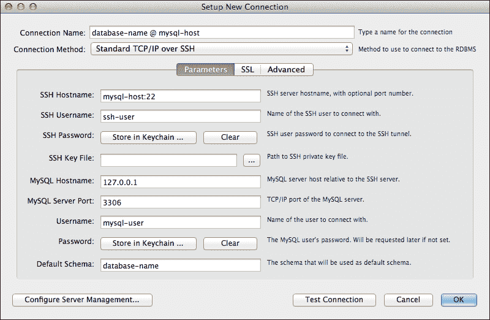
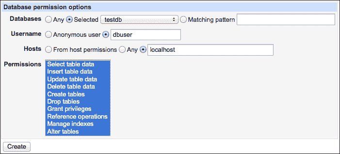
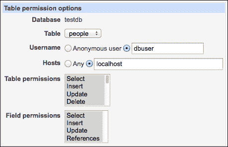
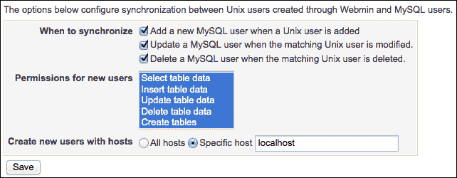
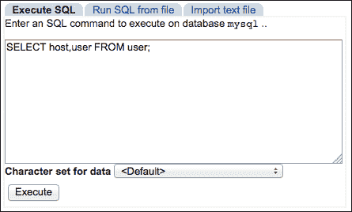
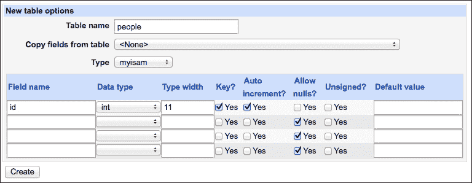
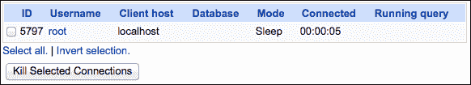

# 第九章：运行 MySQL 数据库服务器

在本章中，我们将涵盖以下主题：

+   安装 MySQL 数据库服务器

+   允许通过网络访问 MySQL

+   通过 SSH 隧道访问 MySQL 服务器

+   创建新数据库

+   创建用户并授予数据库权限

+   创建数据库备份

+   执行自定义 SQL 命令

+   从备份中恢复数据库

+   编辑数据库结构

+   编辑数据库中的记录

+   检查谁在使用你的数据库服务器

+   安装 phpMyAdmin

# 介绍

MySQL 是一个强大的开源数据库管理系统。MySQL 服务器易于设置并且扩展性很好。这个数据库系统为一些世界上最大的网站提供支持，包括 Facebook、Twitter 和 Wikipedia。

MySQL 采用分布式客户端-服务器架构。单个服务器可以同时为多个客户端程序提供数据库服务。运行在与服务器相同机器上的客户端通常通过 Unix 套接字连接。客户端也可以运行在不同的机器上，通过网络连接到数据库服务器。MySQL 使用 TCP 连接，服务器的默认监听端口是 3306。

### 注意

Unix 域套接字是用于进程间通信的通道。不同程序在同一台机器上运行时，可以读写套接字中的信息，从而实现程序之间的通信。Unix 套接字作为文件系统的节点表示，因此你可以通过列出创建套接字的目录内容来找到它。

MySQL 的权限系统非常细粒度。每个客户端的访问权限可以被限制在部分数据库上，并且在每个数据库上允许执行不同的 SQL 命令。

数据库服务器维护一份客户端账户列表，这些账户与系统用户账户是分开的。每个客户端账户不仅由用户名和密码定义，还由用户连接的主机定义。由于这个解决方案，复杂的权限定义成为可能。例如，相同的用户名和密码可以在本地用于执行管理任务，但在远程仅允许查看服务器状态。

默认的 MySQL 安装会创建一个名为 `root` 的超级管理员账户以及一个匿名账户，允许无需身份验证即可连接到数据库服务器。在生产环境中，确保为 `root` 账户设置强密码，并禁用匿名账户非常重要。

### 注意

除了用户名和密码外，MySQL 还可能要求客户端提供证书以提高安全性。

Webmin 对 MySQL 的支持非常出色，允许您执行与数据库服务器运行相关的大多数任务。在本章中，我们将演示 Webmin 如何帮助您安装 MySQL，设置通过网络访问服务器，管理用户帐户，创建数据库，编辑数据库的结构和数据。我们还将演示如何自动备份数据库并恢复备份文件。如果您发现需要一个更先进的基于网页的管理工具，我们将演示如何在服务器上设置 phpMyAdmin。

# 安装 MySQL 数据库服务器

几乎所有附带开源软件包管理解决方案的操作系统都提供 MySQL 软件包以供安装。在本节中，我们将从软件包安装 MySQL，并在您的系统上进行设置。服务器包还会自动安装 MySQL 的命令行客户端包。

## 如何操作...

按照以下步骤在您的服务器上设置 MySQL：

1.  按照第一章中*安装软件包*一节的步骤，*设置您的系统*，查找并安装 MySQL 数据库服务器包。

    ### 注

    大多数发行版在其软件包存储库中提供多个版本的 MySQL。在一些系统中，您会找到一个名为 `mysql-server` 的元包，它安装最新版本。在其他系统中，您会找到版本号在名称中的包，例如 `mysql-server-5.5` 或 `mysql55-server`，用于安装 5.5.x 版本。除非有理由使用旧版本，否则请选择最新版本的软件包。

1.  转到 **系统** | **启动和关闭**。

1.  选择 MySQL 数据库服务器的启动脚本旁边的复选框（它的名称可能是 `mysql`、`mysqld`、`mysql-server` 或类似的名称）。

1.  点击 **立即启动并开机自启** 按钮。

1.  点击 Webmin 主菜单底部的**刷新模块**链接，然后重新加载浏览器以更新菜单。

1.  转到 **服务器** | **MySQL 数据库服务器**。

Webmin 应该能够连接到您的 MySQL 服务器。此时，您将看到一个数据库列表，其中应该包括默认的数据库，如 `information_schema` 和 `mysql`。

### 提示

如果您看到**警告：Perl 模块 DBI 和 DBD::mysql 未安装在您的系统上**，请点击链接并按照 Webmin 的说明安装缺失的 Perl 模块。

默认的 MySQL 设置适用于开发或测试服务器。然而，如果您打算在生产环境或共享服务器上使用数据库，请继续阅读本节的*更多内容*部分。

## 它是如何工作的...

Webmin 帮助您从发行版的存储库中找到并安装 `mysql-server` 包。该包包含一个启动脚本，我们已启用该脚本，以便在您的机器启动时启动数据库服务器。

默认的 MySQL 安装包含许多便利的功能，如匿名用户帐户或可以不提供密码即可作为 root 登录的能力。这些默认选项使得启动 MySQL 变得更加简单。但是，它们不应该在生产环境中使用，因为它们构成重大安全风险。

## 还有更多...

执行以下步骤，使 MySQL 在生产环境中更安全。

### 使 MySQL 准备好进行生产使用

按照以下步骤为你的 MySQL 服务器提供基本安全性：

1.  使用终端仿真器（例如通过 SSH）连接到你的服务器。

    ### 提示

    你也可以使用 Webmin 的 **Text Login** 模块。

1.  输入以下命令：`mysql_secure_installation`。

1.  通过按 *Y* 然后 *Enter* 确认所有问题，除非你知道你想要其他推荐设置以外。

`mysql_secure_installation` 脚本执行以下任务：

+   为数据库 `root` 用户设置密码

+   删除数据库的匿名访问；从现在开始，MySQL 将仅允许授权用户访问

+   禁止 `root` 用户远程登录，因为这个用户通常只应该从同一台计算机访问数据库

+   删除 `test` 数据库。

## 参见

+   如果你想让其他计算机访问你的数据库，查看本章节的 *允许通过网络访问 MySQL* 部分。

# 允许通过网络访问 MySQL

访问 MySQL 数据库的程序（称为客户端）可能在与服务器相同的计算机上运行。在这种情况下，客户端和服务器将通过 Unix 域套接字进行最有效的通信，这是通过文件系统访问的进程间通信通道，类似于文件或目录。套接字的访问受文件系统权限控制。

其他客户端程序可能仅能通过 TCP 网络套接字进行通信。这些客户端可以使用回环接口和 IP 地址 127.0.0.1 连接到本地服务器。在这种情况下，MySQL 服务器必须编译为支持网络并配置为在回环接口上监听连接。

但是，如果客户端程序位于服务器以外的机器上，则它们之间的通信必须通过使用 TCP 协议的网络进行。为了使这种通信成为可能，你需要在防火墙中开放一个例外，并指示 MySQL 在物理网络接口上监听传入的网络连接。

### 提示

你也可以通过 SSH 隧道传输 MySQL 流量，这可能是更安全的解决方案。查看 *通过 SSH 隧道远程访问数据库服务器* 部分以获取更多信息。

## 准备就绪

如果你计划使数据库服务器通过网络可用，你应该采取措施来确保其安全。查看本章节的 *使 MySQL 准备好进行生产使用* 部分以获取更多信息。

在开始之前，请按照第三章中*通过防火墙允许访问服务*一节的步骤，允许通过防火墙将传入的 TCP 流量导入端口 `3306`，如下图所示：


## 如何操作...

本配方的步骤将分为以下四个部分：

+   首先，我们将指示 MySQL 在标准 MySQL 端口（`3306`）上监听传入的网络连接

+   然后，我们将创建一个名为 `dbuser` 的数据库用户

+   我们将授予对名为 `testdb` 的数据库的访问权限

+   最后，我们将通过从第二台客户端机器连接到我们的服务器来测试设置

### 指示 MySQL 服务器监听网络连接

为了使 MySQL 接受传入的网络连接，请执行以下步骤：

1.  转到**服务器** | **MySQL 数据库服务器** | **MySQL 服务器配置**。

1.  将**MySQL 服务器监听地址**设置为**任何**。

1.  点击**保存并重新启动 MySQL**按钮。

### 创建新用户

为了创建一个新用户，请执行以下步骤：

1.  转到**服务器** | **MySQL 数据库服务器** | **用户权限**。

1.  点击**创建新用户**链接。

1.  将**用户名**设置为 `dbuser`，**密码**设置为强密码，**主机**设置为**任何**。

1.  点击**创建**按钮。

### 授予用户访问数据库的权限

为了授予用户访问数据库的权限，请执行以下步骤：

1.  转到**服务器** | **MySQL 数据库服务器** | **数据库权限**。

1.  点击**创建新数据库权限**链接。

1.  在**数据库**行中，选择**已选**并选择您的 `testdb` 数据库。

1.  将**用户名**设置为创建的用户的名称，即 `dbuser`。

1.  将**主机**设置为**任何**，以允许用户从任何地方连接。

    ### 提示

    为了增加安全性，您应该指定一个用户可以连接的 IP 地址或域名。您可以使用 `%` 作为地址的一部分来指定通配符。例如，`192.168.0.%` 表示整个 `192.168.0.1/24` 子网，而 `%.example.com` 包括域名下的所有主机。

1.  在**权限**列表中选择所有权限。

1.  点击**创建**按钮。

### 测试连接

尝试从网络中的第二台机器连接到数据库服务器。如果另一台机器上安装了 MySQL 命令行客户端，您可以通过在终端输入以下命令来测试连接，但请将`mysql-host`替换为 MySQL 服务器的 IP 或域名：

```
$ mysql -u dbuser -p -h mysql-host -D testdb

```

如果连接成功，您将看到以下欢迎消息，其中包括服务器的 MySQL 版本：

```
Welcome to the MySQL monitor.  Commands end with ; or \g.
Your MySQL connection id is 58
Server version: 5.5.31-0+wheezy1 (Debian)
mysql> exit
Bye

```

当您到达 `mysql>` 提示符时，可以开始执行 SQL 命令。输入 `exit` 并按 *Enter* 断开连接。

## 如何操作...

为了允许 MySQL 服务器接受传入的网络连接，Webmin 会编辑您服务器的配置文件（通常位于 `/etc/my.cnf`、`/var/db/mysql/my.cnf` 或 `/etc/mysql/my.cnf`）。

服务器配置中有两行指定了服务器将接受哪些连接。例如，如果我们只希望接受本地连接，这些行可以写成如下：

```
socket=/var/lib/mysql/mysql.sock
bind-address=127.0.0.1

```

第一行指示 MySQL 创建一个本地 Unix 套接字，用于与同一机器上的其他程序通信，而第二行则指示它在本地回环接口（`127.0.0.1`）上监听传入连接。为了使服务器在所有接口上都能监听传入的网络连接，Webmin 只需删除 `bind-address` 这一行。

我们通过在同一网络下的另一台计算机上发出以下命令来测试连接：

```
$ mysql -u dbuser -p -h mysql-host -D testdb

```

该命令启动 MySQL 命令行客户端。指定的选项如下：

+   `-u`：此选项指定尝试连接到服务器的用户

+   `-p`：此选项指示我们希望系统提示输入密码

+   `-h`：此选项指定我们尝试连接的主机

+   `-D`：此选项指定我们连接后要使用的数据库

为了创建数据库用户并授予他们权限，Webmin 直接在 MySQL 的内部配置数据库中操作数据。如果你想手动执行相同的操作，可以使用命令行客户端连接到 MySQL 服务器，并发出以下命令。

首先，以 `root` 用户连接到本地数据库服务器：

```
$ mysql -u root -p

```

接下来，发出以下 MySQL 命令：

```
mysql> CREATE USER 'dbuser'@'%' IDENTIFIED BY 'strongpassword';
mysql> GRANT ALL PRIVILEGES ON testdb.* TO 'dbuser'@'%';
mysql> FLUSH PRIVILEGES;

```

第一条命令创建了一个名为 `dbuser` 的用户，而第二条命令为该用户提供对 `testdb` 数据库的完全访问权限。最后一条命令强制 MySQL 服务器重新加载关于用户和权限的信息，以便新用户可以连接。

### 提示

MySQL 命令行客户端会将所有输入的命令历史保存在一个文件中。如果我们执行之前列出的命令，历史文件将包含我们新创建用户的密码。为了避免这种情况，我们可以在连接到服务器之前，通过发出以下命令指示 MySQL 在此会话期间不保存历史记录：

```
$ export MYSQL_HISTFILE=/dev/null
```

## 还有更多内容...

本食谱允许用户远程访问单一数据库。出于安全原因，主管理账户（`root`）不应允许从其他计算机连接到你的服务器。如果你仍希望允许对数据库服务器进行一些远程管理（如创建数据库、用户等），可以按照以下步骤进行操作。

### 远程管理数据库

按照以下步骤创建一个账户，用于远程管理：

1.  导航至 **服务器** | **MySQL 数据库服务器** | **用户权限**。

1.  点击 **创建新用户** 链接。

1.  设置 **用户名** 为一个管理账户名。尽量选择一个比 `admin` 更难猜测的用户名。

1.  设置 **密码** 为一个非常强的密码。

1.  设置 **主机** 为你的管理用户将要连接的 IP 地址范围。

1.  从 **权限** 列表中，仔细选择你确定需要远程访问的权限。

    ### 注意

    关于每个权限的详细信息，可以在 MySQL 文档中的 *MySQL 提供的权限* 部分找到，链接如下：

    [`dev.mysql.com/doc/refman/5.6/en/privileges-provided.html`](http://dev.mysql.com/doc/refman/5.6/en/privileges-provided.html)

1.  点击 **创建** 按钮。

    现在你应该能够从远程客户端计算机连接到服务器（`mysql-host`）。连接时无需指定数据库名称：

    ```
    $ mysql -u administrative_user -p -h mysql-host

    ```

## 另见

为了使远程访问和管理你的 MySQL 数据库更加安全，你可以通过 SSH 隧道来传输连接。

+   查看本章中的 *通过 SSH 隧道访问 MySQL 服务器* 食谱以获取说明。

# 通过 SSH 隧道访问 MySQL 服务器

如果你的服务器托管了一个网站，并且在同一台机器上运行数据库系统，那么禁用 MySQL 的远程网络访问会更安全。另一方面，你可能仍然希望远程管理你的数据库，你可以通过 SSH 连接隧道化 MySQL 流量来实现。

### 注意

数据库系统的一个最重要方面是它查找并返回你请求的数据的速度。通过 SSH 隧道传输流量会为此通信增加显著的开销。这个解决方案非常适合间歇性的管理任务，但通常不适合作为直接连接数据库系统的替代方案。

## 准备工作

你想要连接的服务器必须同时运行 MySQL 服务器和 SSH 服务器。远程客户端机器必须安装 SSH 客户端和 MySQL 客户端软件。记下服务器的 IP 地址或域名（`mysql-host`）、SSH 用户名（`ssh-user`）、MySQL 用户（`mysql-user`）和数据库名称（`database-name`）。在这个步骤中需要替换为相应的值。

## 如何操作...

为了创建 MySQL 的 SSH 隧道，请按照以下步骤操作：

1.  在客户端机器上执行以下命令：

    ```
    $ ssh -L 15000:localhost:3306 ssh-user@mysql-host

    ```

    这会在客户端机器上的端口 `15000` 和服务器的端口 `3306` 之间创建一个隧道。现在你可以通过将 MySQL 连接到客户端计算机的本地端口 `15000` 来访问远程数据库。

1.  在客户端系统上执行以下命令以测试连接：

    ```
    $ mysql -u mysql-user -p  -D database-name -h 127.0.0.1 -P 15000

    ```

## 它是如何工作的...

SSH 客户端充当你机器上运行的 MySQL 客户端与远程服务器之间的通信中介。它会打开端口 `15000` 并监听传入连接。所有到达端口 `15000` 的数据包都会被加密并通过 SSH 转发到服务器。在服务器端，SSH 接收数据包，解密后将其发送到端口 `3306`。响应通过相同的通道返回。

有关 SSH 隧道的更多信息，请参见*通过 SSH 隧道安全连接 Webmin*食谱，详见第三章，*安全加固系统*。

## 还有更多...

一些 MySQL 客户端集成了在连接远程数据库时设置 SSH 隧道的功能。

### 在 MySQL Workbench 中创建 SSH 隧道

像 MySQL Workbench 或 Sequel Pro 这样的流行 GUI 客户端，允许你在与数据库连接设置相同的窗口中指定 SSH 连接设置。所有情况下的步骤都类似。在 MySQL Workbench 中，你将按照以下步骤设置连接：

1.  在客户端计算机上运行 MySQL Workbench。

1.  从**数据库**菜单中选择**连接到数据库**。

1.  将**连接方式**设置为**通过 SSH 的标准 TCP/IP**。

1.  将**SSH 主机名**设置为远程服务器的 IP 地址或域名。

1.  将**SSH 用户名**设置为具有 SSH 访问权限的系统用户。

1.  将**MySQL 主机名**设置为 `127.0.0.1`。

1.  将**MySQL 服务器端口**设置为 `3306`。

1.  将**用户名**设置为 MySQL 用户的名称。

1.  点击**测试连接**按钮。参考以下截图：

系统会要求你输入 SSH 用户的密码，然后是 MySQL 用户的密码。如果一切顺利，你将看到一条消息，提示连接参数正确。

## 另见

+   有许多工具可以让你连接和控制你的 MySQL 数据库。Webmin 提供了广泛的工具来执行大多数常见任务，后续章节中会描述这些工具。一个更强大的基于 Web 的 MySQL 专用解决方案是 phpMyAdmin，本章节的*安装 phpMyAdmin*食谱中将进行讨论。

+   你可以从以下网站下载本食谱中提到的 GUI 客户端：

    +   **MySQL Workbench**：[`dev.mysql.com/downloads/tools/workbench`](http://dev.mysql.com/downloads/tools/workbench)。

    +   **Sequel Pro（仅限 OS X）**：[`www.sequelpro.com/download`](http://www.sequelpro.com/download)。

+   有关 SSH 隧道的更多信息，请参见*通过 SSH 隧道安全连接 Webmin*食谱，详见第三章，*安全加固系统*。

# 创建新数据库

通过 Webmin 界面创建新 MySQL 数据库非常快捷和简单。

## 如何操作...

按照以下步骤创建一个新数据库：

1.  导航至**服务器** | **MySQL 数据库服务器**。

1.  点击**创建一个新数据库**链接。

1.  输入**数据库名称**，例如，`new_db`。

1.  将**字符集**设置为**utf8 (UTF-8 Unicode)**。

1.  将**排序规则**设置为**utf8_unicode_ci (UTF-8 Unicode)**。

    ### 注意

    字符集指定了字母字符在数据库中的存储方式，而`utf8`字符集包含了大多数字母表中的所有字母。另一方面，排序规则指定了字母在按字母顺序排序时应该放置的顺序。`utf8_unicode_ci`排序规则旨在成为通用的，但可能会有地区性差异，使得像`utf8_polish_ci`这样的本地排序规则更适合你的情况。

1.  将**初始表**设置为**无**。

1.  点击**创建**按钮。

## 它是如何工作的……

Webmin 会根据你提供的信息，通过连接到 MySQL 服务器并执行以下命令来创建一个新数据库：

```
mysql> CREATE DATABASE `new_db` CHARACTER SET utf8 COLLATE utf8_unicode_ci;

```

## 另见

+   为了使数据库可用，你需要授予用户访问数据库的权限。有关说明，请参阅本章中的*创建用户并授予数据库权限*一节。

+   如果你有初始的数据库结构或内容，可以通过使用 SQL 命令文件将它们上传到服务器。有关更多信息，请查看本章中的*执行自定义 SQL 命令*一节。

+   有关字符集和排序规则的更多信息，可以在 MySQL 手册中的以下链接找到：[`dev.mysql.com/doc/refman/5.7/en/charset-charsets.html`](https://dev.mysql.com/doc/refman/5.7/en/charset-charsets.html)

# 创建用户并授予数据库权限

由于 MySQL 的客户端-服务器架构，服务器可能会接受来自多个客户端的连接。连接的客户端通过用户名和密码向 MySQL 进行身份验证。关于用户账户和权限的信息存储在一个名为`mysql`的内部数据库中。

MySQL 账户与系统账户是分开的，通常这是一件好事，因为它们通常代表在服务器上运行的应用程序，而非实际用户。每个连接到数据库服务器的应用程序应该有自己的用户账户，并且访问权限仅限于该应用程序运行所需的数据库。允许应用程序具有 root 级别的访问权限是不明智的，因为如果应用程序被攻击者入侵，攻击者可能会窃取或损坏系统上的所有数据库。

除了用户名和密码外，MySQL 账户还通过用户允许连接的主机来描述。这意味着`'user'@'localhost'`与`'user'@'remotehost'`是不同的账户，这些账户可能具有不同的访问权限。

不幸的是，这意味着如果一个用户需要从多个主机访问，就必须创建多个账户，或者更糟的是，如果用户的位置在网络中变化。在这种情况下，你可以指定`%`作为主机地址的一部分，作为通配符。例如，`192.168.0.%`将指定整个`192.168.0.1/24`子网，而`%.example.com`将指定一个域内的所有主机。

如果用户的来源位置无法缩小到某个网络或 IP 地址范围，建议使用 SSH 隧道，而不是让数据库服务器对整个互联网开放访问权限。有关更多信息，请参考本章中的*通过 SSH 隧道访问 MySQL 服务器*。

## 准备工作

除非你有特别的理由使用它们，否则应该移除 MySQL 的匿名账户。匿名账户是默认为测试目的创建的，但它们可能会在调试用户权限问题时造成困难。

假设，举个例子，你有一个可以从任何地方访问的用户账户：`'user'@'%'`，但你同时也有一个可以从本地主机访问的匿名账户`@'localhost'`。如果你尝试从本地主机以`user`身份连接，MySQL 将首先检查一个更精确地指定入站连接主机的权限条目（`@'localhost'`比`@'%'`更具体）。这会导致`user`被赋予匿名账户的权限，而不是预期的`'user'@'%'`账户。你可以通过执行以下 MySQL 命令来检查你当前以哪个用户身份连接：

```
mysql> SELECT CURRENT_USER();

```

你将看到如下输出：

```
+----------------+
| CURRENT_USER() |
+----------------+
| @localhost     |
+----------------+

```

输出显示我们被视为匿名用户`@'localhost'`。解决这个问题的方法是为`user`添加一个新的账户`'user'@'localhost'`。然后，当我们重新登录时，我们将看到同一命令的以下输出：

```
+----------------+
| CURRENT_USER() |
+----------------+
| user@localhost |
+----------------+

```

如果你没有特别的需求，最好是完全删除匿名账户，这样更安全也更方便。

## 如何操作...

在本节中，我们将创建一个名为`dbuser`的用户，并允许该用户从本地机器访问`testdb`数据库。用户必须使用强密码进行身份验证。请根据你的实际情况准备好用户名、数据库名和密码。

### 创建用户账户

要创建一个用户账户，请执行以下步骤：

1.  进入**服务器** | **MySQL 数据库服务器** | **用户权限**。

1.  点击**创建新用户**链接。

1.  将**用户名**设置为`dbuser`。

1.  将**密码**设置为强密码。

1.  将**主机**设置为`localhost`。

1.  在**权限**列表中，不要选择任何权限。

    ### 注意

    我们不需要授予该账户任何全局权限，因为该用户的访问权限仅限于特定的数据库。

1.  点击**创建**按钮。

### 授予权限

要授予权限，请执行以下步骤：

1.  进入**服务器** | **MySQL 数据库服务器** | **数据库权限**。

1.  点击**创建新数据库权限**链接。

1.  将**数据库**设置为**已选择**，然后从列表中选择**testdb**。

1.  将**用户名**设置为`dbuser`。

1.  将**主机**设置为`localhost`。

1.  在**权限**列表中，选择所有权限，如下截图所示：

1.  点击**创建**按钮。

创建的账户和权限将允许`dbuser`连接并完全控制`testdb`数据库，当其连接到本地 MySQL 服务器时。

### 提示

当客户端从本地计算机连接时，MySQL 服务器将使用与`localhost`关联的账户，无论连接是通过套接字还是 TCP 建立。然而，如果您创建了一个与`127.0.0.1`关联的账户，它将在通过 TCP 连接时使用，但在通过套接字连接时不会使用。当通过 IPv6 使用 TCP 连接时，还会使用本地计算机的 IPv6 地址`::1`。最好为`localhost`设置账户，以避免这种混淆。

## 工作原理...

Webmin 通过直接操作`mysql`数据库来创建账户并授予权限。具体来说，它向`user`和`db`表添加一行，然后执行`FLUSH PRIVILEGES`命令。

如果您想手动执行相同的操作，您可以使用 MySQL 命令行客户端连接到 MySQL 服务器并发出以下命令。

首先以 root 身份连接到本地数据库服务器：

```
$ mysql -u root -p

```

接下来，发出 MySQL 命令：

```
mysql> CREATE USER 'dbuser'@'localhost' IDENTIFIED BY 'strongpassword';
mysql> GRANT ALL PRIVILEGES ON testdb.* TO 'dbuser'@'localhost';
mysql> FLUSH PRIVILEGES;

```

第一个命令创建了一个名为`dbuser`的用户，第二个命令授予该用户对`testdb`数据库的完全访问权限。最后一个命令强制 MySQL 服务器重新加载关于用户和权限的信息，以便新用户能够连接。

## 还有更多...

Webmin 允许您指定更细粒度的访问权限——可以在数据库表级别，甚至是数据库表中的特定列级别。它还允许您为通过 Webmin 创建的新系统用户自动创建 MySQL 账户。

### 授予特定数据库表的权限

为了授予特定数据库表的权限，请执行以下步骤：

1.  导航到**服务器** | **MySQL 数据库服务器** | **表权限**。

1.  从列表中选择一个数据库并点击**在数据库中添加新权限**按钮。

1.  从列表中选择一个数据库**表**。

1.  将**用户名**设置为之前定义的 MySQL 用户的名称。

1.  将**Host**设置为与用户账户关联的主机名。

1.  从**表权限**和**字段权限**列表中选择您希望授予的权限，如下图所示：

1.  点击**创建**按钮。

### 授予特定数据库表中某一列的权限

要授予特定数据库表中某一列的权限，请执行以下步骤：

1.  导航到**服务器** | **MySQL 数据库服务器** | **字段权限**。

1.  从列表中选择一个数据库和表，并点击**在数据库和表中添加新权限**按钮。

1.  从列表中选择一个数据库表的**字段**。

1.  将**用户名**设置为之前定义的 MySQL 用户的名称。

1.  将**Host**设置为与用户账户关联的主机名。

1.  从**权限**列表中选择您希望授予的权限。

1.  点击**创建**按钮。

### 自动授予新系统用户 MySQL 访问权限

要自动授予所有系统用户 MySQL 访问权限，请执行以下步骤：

1.  导航到**服务器** | **MySQL 数据库服务器** | **用户权限**。

1.  在**何时同步**部分选择所有三个复选框。

1.  在**新用户的权限**列表中选择权限。例如，如果你希望系统的每个用户都是 MySQL 管理员，则选择所有权限。请谨慎使用此选项。

1.  将**创建具有主机的用户**设置为**特定主机**，并输入`localhost`。

1.  点击**保存**按钮。

从现在开始，通过 Webmin 创建的每个新用户账户将自动获得一个与系统密码相同的 MySQL 账户。如果通过 Webmin 更改了密码，则 MySQL 账户将更新；如果通过 Webmin 删除了对应的系统账户，则 MySQL 账户也将被删除。

# 创建数据库备份

Webmin 可以帮助你备份 MySQL 数据库。只需点击几下，你就可以备份任何数据库。Webmin 还可以帮助你设置定时任务，定期自动创建备份。

## 准备工作

在开始之前，创建一个目录来存储本地备份文件。你可以将这些文件保存在根目录`/root/backups`下的`/backups`，或者存放在任何方便的位置。

### 提示

Webmin 创建的备份文件对所有系统用户可读。这可能带来安全风险，因为数据库备份通常包含敏感数据，如散列的用户密码。你应该删除备份目录中除 root 组之外用户的所有权限。你可以通过以下命令来完成：

```
$ sudo chmod o-rwx /backups

```

如果你的文件系统支持访问控制列表，你还可以为该目录中新创建的文件设置默认的掩码，使得这些文件无法被组外的用户读取。你可以通过以下命令设置`/backups`的默认 ACL：

```
$ sudo setfacl -d -m other:- /backups

```

查看第六章中的*更改文件所有权和权限*部分，了解更多信息。

## 操作步骤...

按照以下步骤创建数据库备份：

1.  导航到**服务器** | **MySQL 数据库服务器**。

1.  点击表示你想要备份的数据库的图标。

1.  点击**备份数据库**按钮。

1.  将**备份到文件**设置为路径，例如`/backups/database-name.sql.bz2`。

1.  将**备份的表**设置为**所有表**。

1.  打开**其他备份选项**部分。

1.  将**是否将删除表语句添加到备份？**设置为**是**。

    ### 注意

    这有助于将创建的备份导入现有数据库。具有相同名称的表会在导入备份中的表之前被删除（丢弃）。

1.  将**备份的字符集**设置为**UTF-8 Unicode**。

1.  选择**压缩格式**为**Bzip2**。

    ### 注意

    Bzip2 对于文本类型文件（如 SQL 命令文件）提供了非常好的压缩效果。

1.  点击**立即备份**按钮。

## 工作原理...

Webmin 执行 `mysqldump` 命令，输出一系列创建整个数据库所需的 SQL 命令。然后将数据库“转储”通过 bzip2 压缩算法进行压缩并保存到输出文件中。如果你想在终端中执行相同的备份操作，可以运行类似以下的命令（确保正确设置 `mysqldump` 选项）：

```
$ mysqldump --add-drop-table --routines database-name | bzip2 -c > /backups/database-name.sql.bz2

```

## 还有更多内容...

Webmin 是一个非常强大的备份工具。以下是一些其他易于访问的功能。

### 自动备份所有数据库

Webmin 可以帮助你自动备份服务器托管的部分或所有数据库。这些备份将通过 cron 定期执行。有关调度命令的更多信息，请查看 第四章中的*使用 cron 定期调度命令*。为了自动备份所有数据库，请执行以下步骤：

1.  进入**服务器** | **MySQL 数据库服务器**。

1.  点击**备份数据库**按钮。

1.  将**备份到目录**设置为备份目录的位置，例如`/backups`。

1.  打开**其他备份选项**部分。

1.  将**备份中是否添加删除表语句？**设置为**是**。

1.  将**备份的字符集**设置为**UTF-8 Unicode**。

1.  将**压缩格式**设置为**Bzip2**。

1.  打开**备份计划**部分。

1.  将**发送备份状态邮件到**设置为你的电子邮件地址。

1.  将**启用计划备份？**设置为**是，按以下选定的时间**，设置**简单计划**并选择**每日（午夜时分）**。

    ### 注意

    请注意，许多任务可能会安排在系统的午夜时分启动，如果系统资源有限，你可以选择其他时间。通过标记分钟、小时和月份的日期来选择一个更复杂的计划。

1.  点击**保存**按钮。

### 将数据库表导出为 CSV

Webmin 可以将数据库中的单个表导出为**逗号分隔值**（**CSV**）文件，任何电子表格程序，如 Excel、Calc 或 Gnumeric，都可以打开该文件。要将数据库表导出为 CSV，请执行以下步骤：

1.  进入**服务器** | **MySQL 数据库服务器**。

1.  点击包含该表的数据库的图标。

1.  点击你想要导出的表的图标。

1.  点击**导出到 CSV**按钮。

1.  将**文件格式**设置为**带引号的 CSV**。

1.  将**是否包含列名？**设置为**是**。

1.  将**导出目的地**设置为**在浏览器中显示**。

1.  点击**立即导出**按钮。

## 另请参见

+   你可以通过使用网络文件共享协议（如 NFS 或 CIFS）轻松地将备份文件传输到远程主机。首先在远程服务器上创建一个网络卷，然后将该卷挂载到你的服务器上。接着，你就可以像本地存储文件一样，轻松地将文件备份到远程系统的目录中。请参阅 第六章，*管理系统中的文件*，获取使用 NFS 或 CIFS 设置网络文件共享的说明。

+   另一种将数据库备份副本存储到远程的方式是使用 SSH 协议将备份目录发送到远程服务器。请查看 第七章，*系统备份*，中的 *备份到远程主机*，了解更多信息。

# 执行自定义 SQL 命令

Webmin 提供了一个简洁的界面，用于访问你的 MySQL 数据库服务器，让你能够执行任意 SQL 命令。这是一个非常有用的功能，尤其在你想快速查找数据库中的某些内容或对多个数据行进行批量更新时。

## 如何操作...

按照以下步骤在数据库上执行 SQL 命令：

1.  导航到 **服务器** | **MySQL 数据库服务器**。

1.  点击代表你想要使用的数据库的图标，例如 `mysql`。

1.  点击 **执行 SQL** 按钮。

1.  在文本区域输入 SQL 命令，例如：

    ```
    SELECT host,user FROM user;

    ```

    

1.  点击 **执行** 按钮。

系统会显示通过 `SELECT` 命令返回的数据，并且可以排序。

## 它是如何工作的...

Webmin 会将 SQL 命令传递给数据库服务器。如果命令返回错误，它会在屏幕上显示。如果命令返回数据行，Webmin 会将其转换为 HTML 页面并显示在屏幕上。请注意，Webmin 是以 root 用户身份运行的，因此在执行命令时需要小心。

## 另见

+   Webmin 还可以帮助你执行保存于文件中的完整 SQL 脚本。有关更多信息，请参阅本章中的 *从备份中恢复数据库*。

+   你可以将常用的命令保存在 Webmin 的一个易于使用的控制面板中。有关更多信息，请查看 第四章，*控制你的系统*，中的 *创建包含你常用的数据库命令的面板*。

+   如果你发现需要一个更完整的、基于 Web 的 MySQL 管理工具，可以考虑安装 phpMyAdmin。本章的 *安装 phpMyAdmin* 说明了如何操作。

# 从备份中恢复数据库

数据库可能被存储为包含 SQL 指令的文本文件，这些指令可以重建数据库。如果你有一个 SQL 备份文件，可以使用 Webmin 恢复它。

## 准备工作

大型备份应在执行之前上传到服务器。如果您的备份文件很大，请将其上传到服务器并记录其位置。有关更多信息，请参阅 第六章 *在您的系统上管理文件* 中的 *将文件上传到服务器* 部分。

我们将把备份还原到现有数据库中。如果您还没有创建数据库，请先按照 *创建新数据库* 部分的说明进行操作。

## 怎么做……

按照以下步骤从备份中还原数据库或执行保存在文件中的 SQL 脚本：

1.  转到 **服务器** | **MySQL 数据库服务器**。

1.  单击代表您要还原备份的数据库的图标。

1.  单击 **执行 SQL** 按钮。

1.  选择 **从文件运行 SQL** 选项卡。

1.  如果您已将文件上传到服务器，请选择 **从本地文件** 并在文本框中输入文件的位置。否则，请选择 **从已上传文件** 并从磁盘选择一个文件。

    ### 提示

    Webmin 可以处理使用 gzip 或 bzip2 压缩的 SQL 文件。

1.  单击 **执行** 按钮。

## 怎么工作……

Webmin 将整个 SQL 指令文件传送到 MySQL 服务器。服务器逐行执行文件中存储的每个指令，逐行重建数据库。

如果您想在终端中执行相同的任务，可以使用以下命令：

```
$ mysql database-name < backup-file.sql

```

## 还有更多内容……

Webmin 可以从诸如 Excel、Calc 或 Gnumeric 之类的电子表格程序创建的 CSV 文件中导入单个表到您的数据库中。

按照以下步骤导入 CSV 文件：

1.  转到 **服务器** | **MySQL 数据库服务器**。

1.  单击代表您要还原备份的数据库的图标。

1.  单击 **执行 SQL** 按钮。

1.  选择 **导入文本文件** 选项卡。

1.  如果您已将文件上传到服务器，请选择 **从本地文件** 并在文本框中输入文件的位置。否则，请选择 **从已上传文件** 并从磁盘选择一个文件。

1.  从 **要导入数据的表** 下拉列表中选择一个表。

1.  将 **字符集** 设置为 **utf8 (UTF-8 Unicode)**。

1.  单击 **执行** 按钮。

您将看到一个信息屏幕，描述成功导入多少行或遇到了哪些错误。

# 编辑数据库结构

Webmin 允许您通过易于使用的界面快速修改 MySQL 数据库中表的结构。在本示例中，我们将演示如何执行以下任务列表：

+   在数据库中创建表

+   向数据库表添加列

+   编辑列

+   创建索引

+   删除索引

+   删除列

+   删除数据库中的表

## 准备工作

为了演示目的，我们将使用一个名为 `testdb` 的数据库。您可以按照本章节 *创建新数据库* 部分的步骤通过 Webmin 创建一个带有此名称的数据库。

## 怎么做……

在`testdb`数据库中，我们将创建一个名为`people`的表，并向该表添加一个名为`name`的列。然后，我们将更改该字段的宽度，将其设置为唯一索引，最后从数据库中删除索引、字段和表。

### 在数据库中创建表

为了在数据库中创建表，执行以下步骤：

1.  导航到**服务器** | **MySQL 数据库服务器**。

1.  点击表示`testdb`数据库的图标。

1.  点击**创建新表**按钮。

1.  将`people`指定为**表名**。

1.  将**表类型**设置为**myisam**。

    ### 注意

    表类型选项指定该表使用的存储引擎。这决定了表的可用特性，例如**myisam**允许全文搜索索引，而**innodb**支持事务。您可以在 MySQL 手册中找到有关存储引擎的更多信息：

    [`dev.mysql.com/doc/refman/5.6/en/storage-engines.html`](http://dev.mysql.com/doc/refman/5.6/en/storage-engines.html)

1.  提供将作为此表主键的字段定义。填写以下字段定义：

    +   **字段名**：`id`

    +   **数据类型**：**int**

    +   **类型宽度**：`11`

    +   **键**：**是**

    +   **自动递增**：**是**

    +   **允许空值**：**否**

    

1.  点击**创建**按钮。

### 向数据库表中添加字段

为了向数据库表中添加字段，执行以下步骤：

1.  导航到**服务器** | **MySQL 数据库服务器**。

1.  点击表示`testdb`数据库的图标。

1.  点击表示`people`表的图标。

1.  从类型下拉菜单中选择`varchar`并点击**添加字段类型**按钮。

1.  填写以下字段定义：

    +   **字段名**：`name`

    +   **类型宽度**：`80`

    +   **类型选项**：**不区分大小写**

    +   **允许空值**：**是**

    +   **默认值**：**NULL**

    +   **是主键的一部分吗？**：**否**

1.  点击**创建**按钮。

### 编辑字段

要编辑字段，执行以下步骤：

1.  导航到**服务器** | **MySQL 数据库服务器**。

1.  点击表示`testdb`数据库的图标。

1.  点击表示`people`表的图标。

1.  点击字段`name`的链接。

1.  将**类型宽度**设置为`128`。

1.  点击**保存**按钮。

### 创建索引

为了创建索引，执行以下步骤：

1.  导航到**服务器** | **MySQL 数据库服务器**。

1.  点击表示`testdb`数据库的图标。

1.  点击表示`people`表的图标。

1.  点击**创建索引**按钮。

1.  将**索引名称**设置为`unique_name`。

1.  在**索引中的字段**列表中选择字段`name`。

1.  将**索引类型**设置为**唯一**。

1.  点击**创建**按钮。

### 删除索引

要删除索引，执行以下步骤：

1.  导航到**服务器** | **MySQL 数据库服务器**。

1.  点击表示`testdb`数据库的图标。

1.  点击表示`unique_name`索引的图标。

1.  点击**删除**按钮。

### 删除字段

为了删除字段，执行以下步骤：

1.  转到 **服务器** | **MySQL 数据库服务器**。

1.  点击代表 `testdb` 数据库的图标。

1.  点击代表 `people` 表的图标。

1.  点击 `name` 字段的链接。

1.  点击 **删除** 按钮。

### 从数据库中删除表

要从数据库中删除一张表，请执行以下步骤：

1.  转到 **服务器** | **MySQL 数据库服务器**。

1.  点击代表 `testdb` 数据库的图标。

1.  点击代表 `people` 表的图标。

1.  点击 **删除表** 按钮，并在随后的屏幕上确认。

## 它是如何工作的...

Webmin 为相应的 `CREATE`、`DROP` 和 `ALTER TABLE` SQL 命令准备语法，执行这些命令，并以 `root` 用户身份在 MySQL 服务器上运行它们。

## 另请参见

+   如果你发现需要一个更完整的基于网页的 MySQL 管理工具，可以考虑安装 phpMyAdmin。有关安装 phpMyAdmin 的详细信息，请参考 *安装 phpMyAdmin* 这一教程。

# 编辑数据库中的记录

Webmin 允许你通过简单的界面快速编辑 MySQL 数据库中的数据。在本教程中，我们将演示如何添加、编辑和删除数据库表中的记录。

## 准备工作

在本教程中，我们将使用基于在 *创建新数据库* 和 *编辑数据库结构* 章节中创建的 `testdb` 数据库的示例。

## 如何执行...

我们将向 `testdb` 数据库中的 `people` 表添加一条记录；然后编辑同一条记录，最后删除它，以展示如何在 Webmin 中执行这些操作。

### 向数据库表添加一行

要向数据库表中添加一行，请执行以下步骤：

1.  转到 **服务器** | **MySQL 数据库服务器**。

1.  点击代表 `testdb` 数据库的图标。

1.  点击代表 `people` 表的图标。

1.  点击 **查看数据** 按钮。

1.  点击 **添加行** 按钮。

1.  在文本框中填写一个名字。

1.  点击 **保存** 按钮。

### 编辑一行

要编辑一行，请执行以下步骤：

1.  转到 **服务器** | **MySQL 数据库服务器**。

1.  点击代表 `testdb` 数据库的图标。

1.  点击代表 `people` 表的图标。

1.  点击 **查看数据** 按钮。

1.  勾选你希望编辑的记录旁边的复选框。

1.  点击 **编辑选中的行** 按钮。

1.  修改文本框中的姓名值。

1.  点击 **保存** 按钮。

### 删除一行

要删除一行，请执行以下步骤：

1.  转到 **服务器** | **MySQL 数据库服务器**。

1.  点击代表 `testdb` 数据库的图标。

1.  点击代表 `people` 表的图标。

1.  点击 **查看数据** 按钮。

1.  勾选你希望删除的记录旁边的复选框。

1.  点击 **删除选中的行** 按钮。

## 它是如何工作的...

Webmin 为相应的 `INSERT`、`UPDATE` 和 `DELETE` SQL 命令准备语法，执行这些命令，并以 `root` 用户身份在 MySQL 服务器上运行它们。

## 另请参见

+   如果你发现你需要一个更为完整的基于网页的 MySQL 管理工具，可以考虑安装 phpMyAdmin。具体步骤请参见 *安装 phpMyAdmin* 章节。

# 检查谁在使用你的数据库服务器

在调试网络连接性、审计安全性或仅仅是出于好奇时，你可能需要检查谁连接到你的数据库服务器。在 Webmin 中，这些信息只需几次点击即可获得。

## 操作步骤...

按照以下步骤操作：

1.  导航到 **服务器** | **MySQL 数据库服务器**。

1.  点击 **数据库连接** 图标。

你将看到一个活跃连接的列表，或者看到一条信息，表示除了 Webmin 之外，当前没有其他客户端连接到数据库。参考以下截图：



## 工作原理...

Webmin 会查询你的 MySQL 服务器以获取有关活跃客户端连接的信息。你也可以通过在 MySQL 客户端中运行 SQL 命令 `SHOW PROCESSLIST` 来获得相同的信息：

```
mysql> SHOW PROCESSLIST;

```

你将看到以下输出：

```
+------+------+-----------+------+---------+------------------+
| Id   | User | Host      | db   | Command | Info             |
+------+------+-----------+------+---------+------------------+
| 5797 | root | localhost | NULL | Query   | SHOW PROCESSLIST |
+------+------+-----------+------+---------+------------------+
1 row in set (0.00 sec)

```

## 还有更多...

Webmin 还简化了关闭任何不必要连接的操作。客户端需要重新建立连接，才能继续使用数据库。

按照以下步骤关闭连接：

1.  导航到 **服务器** | **MySQL 数据库服务器**。

1.  点击 **数据库连接** 图标。

1.  在活跃连接描述旁边标记复选框。

1.  点击 **终止选中的连接** 按钮。

# 安装 phpMyAdmin

phpMyAdmin 是一个常用的 MySQL 数据库管理工具。它是一个基于网页的应用程序，像 Webmin 一样，但专门用于所有与 MySQL 服务器管理相关的任务。它易于使用，是数据库用户和管理员的得力工具。

### 注意

系统软件包已配置为在 Apache 上运行 phpMyAdmin。Apache Web 服务器和 PHP 作为软件包依赖项一起安装。如果你尚未使用 Apache 和 PHP，这将为你的数据库服务器暴露一个潜在的攻击入口。请考虑安装 phpMyAdmin 的安全影响，并确保其保持最新。

## 操作步骤...

按照以下步骤在你的系统上设置 phpMyAdmin：

1.  安装名为 `phpmyadmin`（或根据你的系统选择 `phpMyAdmin`）的软件包。有关更多信息，请参见 *安装软件包* 章节，位于 第一章，*设置你的系统*。

    ### 提示

    在某些系统上，你可能需要添加一个额外的仓库来安装该软件包。例如，如果你使用的是 RedHat 系列的 Linux 发行版（如 RHEL、CentOS、Fedora 等），你应该添加 **企业 Linux 的额外软件包**（**EPEL**）仓库。有关设置 EPEL 的信息，可以参见 *通过 FTP 让用户访问你的服务器* 章节，位于 第六章，*管理你系统上的文件*。

1.  由于 phpMyAdmin 运行在 Apache 之上，你应该确保该服务器已安装在你的系统中，并且能够通过浏览器访问。按照 第八章 中的 *在系统上安装 Apache* 配方，启动并运行 Apache。

1.  访问以下 URL，但请将 `webmin-host` 替换为你的服务器的 IP 或域名：[`webmin-host/phpmyadmin`](http://webmin-host/phpmyadmin)。

    ### 提示

    在某些系统上，phpMyAdmin 被配置为仅允许来自本地主机的连接。如果你希望更改此行为，请前往 **服务器** | **Apache Web 服务器** | **默认服务器**，选择 phpMyAdmin 目录的 **每目录选项**，然后更改其 **访问控制** 设置。更多信息请参阅 第八章 中的 *设置目录、文件和位置的选项* 这一配方，*运行 Apache Web 服务器*。

    有关在你的系统发行版中设置 phpMyAdmin 所需的额外步骤的信息，可以在软件包文档文件中找到。请参阅 第一章 中的 *阅读已安装软件的文档* 配方，*设置你的系统*。

1.  现在你可以使用 MySQL 帐户的用户名和密码登录。

    ### 注意

    phpMyAdmin 将以本地计算机连接的方式登录，因此将使用分配给 `localhost` 上帐户的权限。

## 它是如何工作的...

phpMyAdmin 是一个用 PHP 编写的应用程序。phpMyAdmin 的主配置文件名为 `config.inc.php`，通常安装在 `/etc/` 目录下。不同发行版的示例位置列在下面的表格中。应用程序本身的代码以 PHP 脚本文件的形式存储在名为 phpMyAdmin 的目录中。

因为 phpMyAdmin 由 Apache 提供服务，所以安装包包括一个特定应用程序的配置文件，该文件将被 Web 服务器加载。此文件告诉 Apache phpMyAdmin 存储在哪个磁盘位置，以及它的哪些目录应该在 Web 上可用。

| 文件 | 操作系统 / 发行版 | 位置 |
| --- | --- | --- |
| phpMyAdmin 配置文件 | Debian | `/etc/phpmyadmin/config.inc.php` |
| CentOS | `/etc/phpMyAdmin/config.inc.php` |
| OpenSUSE | `/etc/phpMyAdmin/config.inc.php` |
| phpMyAdmin 文件 | Debian | `/usr/share/phpmyadmin` |
| CentOS | `/usr/share/phpMyAdmin` |
| OpenSUSE | `/srv/www/htdocs/phpMyAdmin` |
| phpMyAdmin 的 Apache 配置文件 | Debian | `/etc/phpmyadmin/apache.conf` |
| CentOS | `/etc/httpd/conf.d/phpMyAdmin.conf` |
| OpenSUSE | `/etc/apache2/conf.d/phpMyAdmin.conf` |

无论包维护者如何决定准备它，你都可以通过进入**Servers** | **Apache Webserver** | **Default Server**，并为 phpMyAdmin 目录选择**每目录选项**，来调整 Apache 配置。

## 还有更多内容...

phpMyAdmin 是一个功能非常强大的工具，你可以在其文档中找到关于如何使用它的详细信息：[`docs.phpmyadmin.net/en/latest/`](http://docs.phpmyadmin.net/en/latest/)
