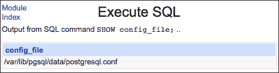
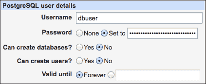
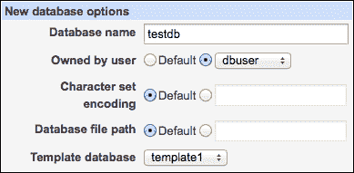
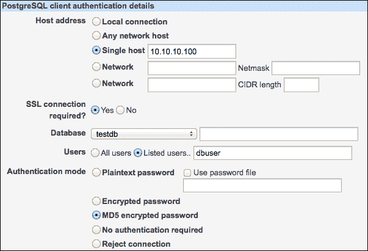
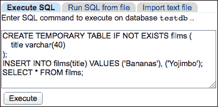
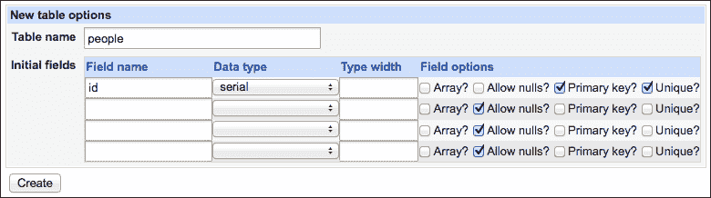

# 第十章：运行 PostgreSQL 数据库服务器

本章将介绍以下内容：

+   安装 PostgreSQL 数据库服务器

+   定位 PostgreSQL 服务器配置文件

+   允许通过网络访问 PostgreSQL

+   通过 SSH 隧道访问 PostgreSQL 服务器

+   创建新数据库

+   创建用户并授予权限

+   创建数据库的备份

+   执行自定义 SQL 命令

+   从备份恢复数据库

+   编辑数据库结构

+   编辑数据库中的记录

+   安装 phpPgAdmin

# 介绍

PostgreSQL 是一个强大的开源关系 **数据库管理系统**（**DBMS**）。它具有强大的类型系统和高级编程功能。这使得它能够存储和处理复杂值，如地理坐标、JSON 对象和数组。

PostgreSQL 使用分布式客户端-服务器架构，这意味着数据库服务器和客户端应用程序可以在不同的机器上运行。如果客户端和服务器在同一系统上运行，它们可以使用 Unix 套接字进行通信；否则，它们通过网络使用 TCP 套接字进行通信。PostgreSQL 服务器默认使用端口号 5432，但如果需要，可以更改此设置。

### 注意

Unix 域套接字是用于进程间通信的通道。运行在同一台机器上的不同程序可以读写套接字信息，从而实现程序之间的通信。Unix 套接字作为文件系统的节点进行表示，因此你可以通过列出创建它的目录的内容来找到一个套接字。

PostgreSQL 数据库管理系统（DBMS）非常流行，大多数操作系统发行版都提供了其易于安装的软件包。每个 PostgreSQL 服务器都托管一个 **集群**，该集群由一组数据库、相关的配置文件和正在运行的进程组成。在某些系统上，集群必须在安装软件包后初始化。初始化会创建集群的目录结构，并用标准数据库填充它。标准数据库 `template1` 扮演着特殊的角色，因为所有新数据库默认都是以它为模板创建的。

PostgreSQL 系统的安装涉及创建一个特殊用户，通常命名为 `postgres`。该用户对你的数据库拥有完全的管理员控制权限，Webmin 将以该用户身份运行大多数数据库命令和脚本。

Webmin 允许你执行与 PostgreSQL 数据库服务器运行相关的许多任务。在本章中，我们将演示如何通过 Webmin 安装 PostgreSQL、设置通过网络访问服务器、管理用户账户、创建数据库并编辑其结构和数据。我们还将演示如何自动备份数据库并恢复备份文件。如果你发现需要一个更高级的基于 Web 的管理工具，我们将演示如何在服务器上设置 phpPgAdmin。

# 安装 PostgreSQL 数据库服务器

大多数带有开源软件包管理解决方案的操作系统都提供 PostgreSQL 软件包以供安装。在本食谱中，我们将从软件包安装 PostgreSQL，并在你的系统上进行设置。安装服务器软件包时，会自动安装 PostgreSQL 命令行客户端软件包。

## 如何操作...

执行以下步骤安装 PostgreSQL 数据库服务器：

1.  按照第一章中*安装软件包*的步骤，*设置你的系统*，查找并安装 PostgreSQL 数据库服务器软件包。

    ### 注意

    在大多数软件包仓库中，PostgreSQL 服务器的软件包简单地命名为`postgresql-server`。如果你的发行版允许你选择不同版本的 PostgreSQL，则软件包名称将包含版本号，例如`postgresql-9.1`或`postgresql93-server`。除非你有理由坚持使用旧版本，否则选择包含最新版本的软件包。

1.  点击 Webmin 主菜单底部的**刷新模块**链接，并重新加载浏览器以更新菜单。

1.  进入**服务器** | **PostgreSQL 数据库服务器**。你应该能看到一个列出已安装数据库的界面，其中应包含`postgresql`和`template1`等默认数据库。

1.  如果你没有看到数据库列表，而是看到一个表示数据库系统尚未初始化的消息，请点击**初始化数据库**按钮。

    ### 提示

    在屏幕底部，如果你看到消息**警告：你的系统上没有安装 Perl 模块 DBI 和 DBD::Pg**，点击链接并按照 Webmin 的说明安装缺失的 Perl 模块。

1.  进入**系统** | **启动与关机**，并验证初始化脚本`postgresql`是否设置为开机启动。如果没有，选中它的复选框，并点击**立即启动并开机启动**按钮。

## 工作原理...

Webmin 帮助你从发行版的仓库中找到并安装`postgresql-server`软件包。该软件包安装数据库服务器、客户端以及一个初始化脚本，用于在系统启动时启动服务器。

在 Postgres 用于管理数据库之前，必须创建一个新的集群。PostgreSQL 集群是由单一服务器管理的一组数据库。创建集群涉及创建一个目录，在其中存储数据库文件，并用一些标准数据库填充它。名为`template1`的标准数据库起着特殊的作用，因为集群中的所有新数据库将通过复制该模板来创建。

如果你的软件包安装脚本没有为你初始化数据库集群，可以通过点击**初始化数据库**按钮请求 Webmin 来完成此操作。这将运行初始化脚本的以下子命令：

```
 /etc/rc.d/init.d/postgresql initdb

```

## 另见

+   如果你想允许其他计算机访问你的数据库，请查看食谱*允许通过网络访问 PostgreSQL*。

# 定位 PostgreSQL 服务器配置文件

PostgreSQL 服务器的主配置文件通常名为`postgresql.conf`，默认情况下存储在数据库集群的数据目录中。不同的系统发行版会将该配置文件移动到数据目录外部并放置在其他位置，例如`/etc/`目录。在本教程中，我们将演示如何查找`postgresql.conf`并修改它以调整服务器配置。Webmin 不会帮助你修改 PostgreSQL 的基本设置，因此你需要手动编辑配置文件。

## 准备工作

确保已经安装并运行了 PostgreSQL 服务器，并且在开始之前你能够通过 Webmin 连接到它。关于此的详细信息，请参考*安装 PostgreSQL 数据库服务器*。

## 如何操作...

按照以下步骤定位系统中 PostgreSQL 的主配置文件：

1.  导航到**服务器** | **PostgreSQL 数据库服务器**。

1.  点击默认数据库的图标，`postgres`。

1.  点击**执行 SQL**按钮。

1.  在提供的文本框中输入以下 SQL 命令：

    ```
    SHOW config_file;
    ```

1.  点击**执行**按钮，你将看到 SQL 命令的输出，其中提供了主服务器配置文件的完整路径，如下图所示：

## 工作原理...

当初始化脚本启动 PostgreSQL 服务器时，它可能会指定数据库集群数据目录的位置或服务器主配置文件的位置（通常叫做`postgresql.conf`）。默认情况下，主配置文件存储在数据目录内部，但软件包维护者通常将其移到不同的位置（例如`/etc/`），以便保持系统配置文件的整洁。SQL 命令`SHOW config_file;`可以用来检查主配置文件的位置。

## 还有更多...

其他配置文件的位置和其他设置的值也可以使用 SQL `SHOW`命令显示。

### 确定其他配置文件和数据文件的位置

使用以下命令检查其他配置文件的位置：

| 设置 | 命令 |
| --- | --- |
| 主配置文件（`postgresql.conf`） | `SHOW config_file;` |
| 数据目录 | `SHOW data_directory;` |
| 基于主机的访问配置文件（`pg_hba.conf`） | `SHOW hba_file;` |
| 身份映射文件（`pg_ident.conf`） | `SHOW ident_file;` |
| Unix 域套接字创建目录 | `SHOW unix_socket_directory;` |

### 检查其他设置的值

你也可以通过发出以下命令来显示所有设置的值：

```
SHOW all;
```

# 允许通过网络访问 PostgreSQL

访问 PostgreSQL 数据库的程序（称为客户端）可能与服务器运行在同一台机器上。在这种情况下，客户端和服务器将通过 Unix 域套接字进行高效通信，Unix 域套接字是一种通过文件系统（如文件或目录）访问的进程间通信通道。对套接字的访问受文件系统权限控制。

其他客户端程序可能只能通过 TCP 网络套接字进行通信。这些客户端可以通过回环接口和`127.0.0.1`的 IP 地址连接到本地服务器。

然而，如果客户端程序位于不同于服务器的机器上，则它们之间的通信必须通过网络使用 TCP 协议进行。对于 PostgreSQL，有多种方式可以设置网络连接。最有效但最不安全的方法是使用客户端与服务器之间的直接未加密连接。这种方法的缺点是未加密的信息可能会在网络传输过程中被窃听或篡改。由于数据库系统通常设计为尽可能高效，因此这种通信方式被广泛使用，但只能在安全的网络内部部署。在本教程中，我们将描述如何启用这种通信方式。

### 提示

为了使 PostgreSQL 服务器的网络访问更加安全，您可以选择使用 SSL 加密传输的信息。这可以防止窃听和中间人攻击，但会暴露 PostgreSQL 服务器的网络端口，可能会受到暴力破解密码和其他攻击的威胁。

如果您确实需要安全性，例如通过互联网访问您的数据库服务器，您可能应该选择第三种方式：通过加密的 SSH 隧道发送 PostgreSQL 流量。这是上述传输方法中效率最低的一种，但它带来的安全问题最少。有关更多信息，请查看教程*通过 SSH 隧道访问 PostgreSQL 服务器*。

## 准备工作

在本教程中，我们将准备您的 PostgreSQL 服务器以接受传入的网络连接。为了测试连接，我们需要访问两台连接到同一网络的计算机：服务器和客户端机器。在开始之前，请记下服务器和客户端的 IP 或域名。

## 如何操作...

本教程中的步骤将分为五个部分：

+   首先，我们将指示 PostgreSQL 在标准端口（`5432`）上监听传入的网络连接。

+   接下来，我们将创建一个名为`dbuser`的数据库用户。

+   然后，我们将创建一个名为`testtdb`的数据库。

+   我们将允许远程访问数据库。

+   最后，我们将通过从辅助客户端机器连接到我们的服务器来测试设置。

执行以下步骤，指示 PostgreSQL 服务器监听网络连接：

1.  按照配方《通过防火墙允许访问服务》中的步骤，在第三章《保护您的系统》中，允许 TCP 流量通过防火墙进入 5432 端口。

1.  查找 PostgreSQL 主服务器配置文件（`postgresql.conf`）的位置。有关详细说明，请参阅配方《定位 PostgreSQL 服务器配置文件》。

1.  在`postgresql.conf`文件中，找到包含`listen_addresses`指令的行。该行可能被注释掉（以`#`字符开头）。将该行更改为以下内容：

    ```
    listen_addresses = '*'
    ```

    ### 提示

    在服务器上编辑文件的最有效方式是使用 Vim 或 Nano 等编辑器在终端会话中进行（例如，通过 SSH）。但是，要对配置文件进行小的更改时，您无需离开 Webmin。请查看第六章《管理系统中的文件》配方中的*在服务器上编辑文件*部分。

1.  在进行配置更改后，我们必须重启服务器。导航到**服务器** | **PostgreSQL 数据库服务器**，点击**停止 PostgreSQL 服务器**按钮，然后点击**启动 PostgreSQL 服务器**按钮。

现在，您的 PostgreSQL 服务器将监听端口 5432 上的传入网络连接。

执行以下步骤以创建新用户：

1.  导航到**服务器** | **PostgreSQL 数据库服务器** | **PostgreSQL 用户**。

1.  点击**创建新用户**链接。

1.  将**用户名**设置为`dbuser`，并在**密码**字段中设置一个强密码。

1.  对**可以创建数据库？**和**可以创建用户？**的问题选择**否**。

1.  将**有效期至**设置为**永久**：

1.  点击**创建**按钮。

执行以下步骤以创建数据库：

1.  导航到**服务器** | **PostgreSQL 数据库服务器**。

1.  点击**创建新数据库**链接。

1.  将**数据库名称**设置为`testdb`。

1.  将**所有者用户**设置为`dbuser`。

1.  将**模板数据库**设置为`template1`：

1.  点击**创建**按钮。

执行以下步骤以授予用户远程访问数据库的权限：

1.  导航到**服务器** | **PostgreSQL 数据库服务器**。

1.  点击**允许的主机**图标。

1.  点击**创建新允许的主机**链接。

1.  将**主机地址**设置为**单一主机**，并输入客户端计算机的 IP 地址（例如，`10.10.10.100`）。

    ### 提示

    如果客户端可以从多个 IP 连接，您可以通过提供网络和子网掩码或 CIDR 长度来指定子网。例如，要允许`10.10.10.*`子网中的所有计算机访问，您可以指定网络为`10.10.10.0`，并选择子网掩码`255.255.255.0`或 CIDR 长度`24`。

1.  将**需要 SSL 连接？**设置为**是**。

    ### 提示

    不使用 SSL 可以减少一些性能开销，但只有在完全信任的网络上才能这样做。

1.  将**数据库**设置为`testdb`。

1.  将**用户**设置为**列出用户**并输入`dbuser`。

1.  将**身份验证模式**设置为**MD5 加密密码**：

1.  点击**创建**按钮。

1.  我们需要重新启动服务器一次，以加载新的访问配置。导航到**服务器** | **PostgreSQL 数据库服务器**，点击**停止 PostgreSQL 服务器**按钮，然后点击**启动 PostgreSQL 服务器**按钮。

    ### 提示

    在繁忙的生产系统中，不必要地重启数据库服务器是一个不好的主意，尽管这是重新加载所有设置的可靠方法。在更改访问设置后，实际上不需要重启服务器。您可以改为发送一个`SIGHUP`信号。该信号指示 Postgres 重新加载其配置。在配备有`pg_ctl`程序的系统上，可以通过发出以下命令来实现：

    ```
    $ sudo pg_ctl reload

    ```

    在具有`pg_ctlcluster`命令的系统上，您需要指定服务器版本和集群名称，例如：

    ```
    $ sudo pg_ctlcluster 9.1 main reload

    ```

为了测试连接，尝试从我们指定的 IP 的客户端机器连接到您的数据库服务器。如果您的另一台机器上安装了 PostgreSQL 命令行客户端，您可以在终端中输入以下命令来测试连接。但请将`postgresql-host`替换为您的 Postgres 服务器的 IP 或域名，如下所示：

```
$ psql -h postgresql-host -U dbuser testdb
testdb=# \q

```

如果连接成功，您应该会看到 PostgreSQL 提示符（`testdb=#`）。输入`\q`并按*Enter*退出。

## 它是如何工作的...

为了启用对 PostgreSQL 数据库服务器的网络访问，我们需要修改两个配置文件。我们手动编辑了主配置文件（`postgresql.conf`），指示服务器监听所有网络接口上的传入网络连接。第二个文件通过 Webmin 的界面进行了编辑，是基于主机的身份验证配置文件（`pg_hba.conf`）。该文件指示服务器允许哪些用户从哪些网络主机连接，并要求他们如何进行身份验证。

Webmin 将以下行添加到`pg_hba.conf`：

```
hostssl testdb dbuser 10.10.10.100 255.255.255.255 md5
```

前一行指示服务器接受来自 IP 地址`10.10.10.100`的`dbuser`用户对`testdb`数据库的 SSL 连接。要求用户提供一个 MD5 加密的密码进行身份验证。

`pg_hba.conf`中的另一行可能如下所示：

```
local    all    postgres    peer
```

这一行指示服务器接受通过 Unix 套接字进行的本地连接。这些连接使用`peer`身份验证方法，它检查运行连接客户端程序的系统账户的用户名。如果系统用户名与 Postgres 账户名匹配，则该连接被视为已通过身份验证。在`peer`身份验证中不会执行密码检查。前一行代码将允许系统账户`postgres`访问`所有`数据库。

## 另见

+   为了使 PostgreSQL 数据库的远程访问和管理更加安全，你可以通过 SSH 隧道化连接。有关说明，请查看配方 *通过 SSH 隧道访问 PostgreSQL 服务器*。

# 通过 SSH 隧道访问 PostgreSQL 服务器

如果你的服务器正在互联网上托管一个网站，并且在同一台机器上运行数据库系统，那么禁用数据库的远程网络访问是更安全的。另一方面，你可能仍然希望远程管理你的数据库。你可以通过将 PostgreSQL 流量通过 SSH 连接进行隧道化来实现这一点。

### 注意

数据库系统的一个重要方面是它能够多快地查找并返回你请求的数据。通过 SSH 隧道传输流量将为这种通信增加显著的开销。这个解决方案非常适合间歇性的管理任务，但不适合作为直接连接到数据库系统的替代方案。

## 准备工作

在通过 SSH 隧道访问 PostgreSQL 服务器之前，你需要确保在 `pg_hba.conf` 文件中存在一个允许的主机条目。该条目应该允许来自回送 IP `127.0.0.1` 的用户使用 MD5 加密的密码进行身份验证。有关更多信息，请查看配方 *允许通过网络访问 PostgreSQL*。在 `pg_hba.conf` 文件中的适当条目如下所示：

```
# IPv4 local connections:
host    all    all    127.0.0.1/32    md5
```

你想连接的服务器必须同时运行 PostgreSQL 服务器和 SSH 服务器。远程客户端机器必须安装 SSH 客户端和 PostgreSQL 客户端软件。请记录下服务器的 IP 地址或域名（`postgresql-host`）、SSH 用户名（`ssh-user`）、PostgreSQL 用户（`postgresql-user`）和数据库名称（`database-name`）。在下面的步骤中用它们替换相应内容。

## 如何执行此操作...

为了创建一个 PostgreSQL 的 SSH 隧道，请按照以下步骤操作：

1.  在客户端机器上执行以下命令：

    ```
    $ ssh -N -L 15000:localhost:5432 ssh-user@postgresql-host

    ```

    这将在客户端机器的 `15000` 端口与服务器的 `5432` 端口之间创建一个隧道。你现在可以通过连接到客户端计算机的本地 `15000` 端口来访问远程数据库。

1.  在客户端系统上执行以下命令以测试连接：

    ```
    $ psql -h 127.0.0.1 -p 15000 -U postgresql-user database-name

    ```

## 它是如何工作的...

SSH 客户端充当你机器上运行的 PostgreSQL 客户端和远程服务器之间通信的中介。它在客户端机器上打开 `15000` 端口，并监听传入连接。所有到达 `15000` 端口的数据包都会被加密，并通过 SSH 转发到服务器。在服务器端，SSH 接收这些数据包，解密后将它们发送到 `5432` 端口。答案会沿相同的通道反向发送回来。

## 另请参阅

+   有许多工具可以让你连接和控制 PostgreSQL 数据库。Webmin 提供了多种工具来执行大多数常见任务，相关配方在本章中有描述。

+   一个更强大的基于 Web 的 PostgreSQL 解决方案是 phpPgAdmin。它在食谱中有所讨论，*安装 phpPgAdmin*。

+   关于 SSH 隧道的更多信息，请参考食谱，*通过 SSH 隧道安全连接到 Webmin*，第三章，*保护您的系统*。

# 创建新数据库

通过 Webmin 界面创建 PostgreSQL 数据库非常快捷简便。

## 如何操作...

按照以下步骤创建数据库：

1.  导航到**服务器** | **PostgreSQL 数据库服务器**。

1.  点击**创建新数据库**链接。

1.  输入**数据库名称**，例如`new_db`。

1.  从**所有者**下拉菜单中选择将拥有数据库管理权限的用户。

1.  将**字符集编码**和**数据库文件路径**保持为**默认**。

1.  将**模板数据库**设置为`template1`。

1.  点击**创建**按钮。

## 工作原理...

Webmin 会根据你提供的信息，通过连接 PostgreSQL 服务器并执行以下命令来创建一个新数据库：

```
CREATE DATABASE new_db WITH OWNER="dbuser" TEMPLATE = template1;

```

Postgres 通过复制所选模板来创建新数据库。数据库`template1`默认安装，用作新创建数据库的默认设置源。如果你希望新数据库具有不同的设置，例如字符集和排序规则，你可以对模板数据库进行这些更改。

创建数据库的另一种方式是以用户`postgres`执行`createdb`命令，例如：

```
postgres@postgresql-host:~$ createdb --owner dbuser new_db

```

## 另见

+   如果你有初始数据库结构或内容，可以通过 SQL 命令文件将它们上传到服务器。有关更多信息，请查看食谱，*执行自定义 SQL 命令*。

# 创建用户并授予权限

通过 Webmin 创建 PostgreSQL 用户非常简单。用户可以被指定为新创建数据库的所有者，并拥有完全访问和管理权限。用户也可以被授予特定数据库表的有限权限。

## 如何操作...

在本食谱中，我们将创建一个名为`dbuser`的新用户，并在名为`testdb`的数据库中的表`dbtable`上授予选定的权限。

按照以下步骤创建用户：

1.  导航到**服务器** | **PostgreSQL 数据库服务器** | **PostgreSQL 用户**。

1.  点击**创建新用户**链接。

1.  将**用户名**设置为`dbuser`，并在**密码**字段中设置强密码。

1.  对**可以创建数据库吗？**和**可以创建用户吗？**问题选择**否**。

1.  将**有效期至**设置为**永久**。

1.  点击**创建**按钮。

按照以下步骤在数据库表上授予用户权限：

1.  导航到**服务器** | **PostgreSQL 数据库服务器**。

1.  点击**已授予权限**图标。

1.  点击要修改权限的数据库对象名称（例如，表名`dbtable`）。

1.  从**用户**下拉菜单中选择用户`dbuser`。

1.  勾选你希望授予的权限旁边的复选框：

1.  点击 **保存** 按钮。

## 它是如何工作的...

Webmin 通过连接到 PostgreSQL 服务器并执行以下命令来创建一个新的数据库用户：

```
CREATE USER 'dbuser' WITH PASSWORD '***' NOCREATEDB NOCREATEUSER;

```

创建数据库用户的另一种方法是以 `postgres` 用户身份执行 `createuser` 命令，例如：

```
postgres@postgresql-host:~$ createuser dbuser
Shall the new role be a superuser? (y/n) n
Shall the new role be allowed to create databases? (y/n) n
Shall the new role be allowed to create more new roles? (y/n) n

```

权限通过 `GRANT` 命令分配给用户，例如：

```
GRANT SELECT,UPDATE,INSERT,DELETE ON "public"."dbtable" to 'dbuser';
```

PostgreSQL 手册提供了以下权限定义：

| 权限 | 定义 |
| --- | --- |
| `SELECT` | 允许从指定表的任何列执行 `SELECT` 操作。 |
| `UPDATE` | 允许对指定表的任何列执行 `UPDATE` 操作。 |
| `INSERT` | 允许在指定表中插入新行。 |
| `DELETE` | 允许从指定表中删除一行。 |
| `RULE` | 允许在表上创建规则。 |
| `REFERENCES` | 要创建外键约束，必须在引用表和被引用表上都拥有此权限。 |
| `TRIGGER` | 允许在指定表上创建触发器。 |

## 还有更多...

PostgreSQL 并不容易授予整个数据库的权限。为了授予名为 `dbuser` 的用户访问 `public` schema 中所有表的权限，可以执行以下命令：

```
GRANT ALL PRIVILEGES ON ALL TABLES IN SCHEMA public TO 'dbuser';
```

### 注意

PostgreSQL 数据库可能会被划分为 **schemas**。每个 schema 包含一组独立于其他 schema 的表，并且可能使用不同的用户权限。默认情况下，每个数据库仅包含一个名为 `public` 的 schema，所有表都分配给它。

插入新对象也需要对序列对象的访问权限，可以按如下方式授予：

```
GRANT ALL PRIVILEGES ON ALL SEQUENCES IN SCHEMA public TO dbuser;

```

不幸的是，当你向数据库添加新表或添加另一个 schema 时，你将不得不重新执行这些命令。另一种选择是通过使用 `ALTER DEFAULT PRIVILEGES` 命令设置对象的默认权限：

```
ALTER DEFAULT PRIVILEGES IN SCHEMA public GRANT ALL PRIVILEGES ON TABLES TO 'dbuser';
ALTER DEFAULT PRIVILEGES IN SCHEMA public GRANT ALL PRIVILEGES ON SEQUENCES TO 'dbuser';

```

## 另见

+   请参阅配方，*执行自定义 SQL 命令*，了解执行命令的相关信息。

+   你可以在 PostgreSQL 手册中找到更多关于授予权限的信息：

    +   [`www.postgresql.org/docs/9.3/static/sql-grant.html`](http://www.postgresql.org/docs/9.3/static/sql-grant.html)

    +   [`www.postgresql.org/docs/9.3/static/sql-alterdefaultprivileges.html`](http://www.postgresql.org/docs/9.3/static/sql-alterdefaultprivileges.html)

# 创建数据库备份

Webmin 可以帮助你备份 PostgreSQL 数据库。只需几次点击，你就可以备份任何数据库。Webmin 还可以帮助你设置 cron 作业，定期自动创建备份。

## 准备工作

在开始之前，创建一个目录来存储本地备份文件。你可以将这些文件保存在根目录的 `/backups`、`/root/backups` 或你觉得方便的任何位置。

备份目录应由`postgres`用户拥有，并且仅限该用户访问。有关更多信息，请查看第六章，*管理文件*，其中包含“更改文件所有权和权限”的相关内容。

要获取有关备份的一般背景信息，请参考第七章，*备份系统*。

## 如何操作...

按照以下步骤创建数据库备份：

1.  转到**服务器** | **PostgreSQL 数据库服务器**。

1.  点击表示您想要备份的数据库的图标。

1.  点击**备份**按钮。

1.  将**备份文件路径**设置为`/backups/database-name.sql`。

1.  将**备份文件格式**设置为**纯 SQL 文本**。

    ### 注意

    备份将作为一系列 SQL 语句以纯文本格式存储。如果您正在导出一个大型数据库，请使用压缩的**自定义归档**格式。

1.  将**要备份的表**设置为**所有表**。

1.  点击**立即备份**按钮。

## 它是如何工作的...

Webmin 执行`pg_dump`命令，输出一系列 SQL 命令，这些命令用于重新创建整个数据库。该命令以具有数据库管理员访问权限的用户身份运行。在大多数系统中，该用户被称为`postgres`。

数据库转储将保存到指定的输出文件中。如果您想在终端中执行相同的备份操作，您可以运行如下命令：

```
postgres@postgresql-host:~$ pg_dump -U postgres -f /backups/database-name.sql database-name

```

## 还有更多...

Webmin 是一个非常强大的备份工具。以下是一些其他容易访问的功能。

### 自动备份所有数据库

Webmin 可以帮助您自动备份服务器托管的部分或所有数据库。这些备份将由 cron 按常规计划执行。

1.  转到**服务器** | **PostgreSQL 数据库服务器**。

1.  点击**备份数据库**按钮。

1.  将**备份到目录**设置为您的备份目录的位置，例如`/backups`。

1.  将**备份文件格式**设置为**自定义归档**。

    ### 注意

    自定义归档格式经过压缩以节省磁盘空间。它也非常灵活，允许在恢复阶段手动选择归档项目。

1.  打开**备份计划**部分。

1.  将**启用定期备份？**设置为**是，在下面选择的时间**；设置**简单计划**并选择**每天（午夜时分）**。

    ### 注意

    请注意，系统中可能有许多任务被安排在午夜启动，因此如果系统资源有限，您可以选择其他时间。通过标记任务要执行的分钟、小时和日期，选择更复杂的计划。

1.  点击**保存**按钮。

### 将数据库表导出为 CSV

Webmin 可以将您数据库的单个表导出为 CSV 文件，该文件可以被 Excel、Calc 或 Gnumeric 等电子表格程序打开：

1.  转到**服务器** | **PostgreSQL 数据库服务器**。

1.  点击数据库的图标，然后点击您想要导出的表的图标。

1.  点击**导出为 CSV**按钮。

1.  将**文件格式**设置为**带引号的 CSV**。

1.  将**在 CSV 中包含列名？**设置为**是**。

1.  将**导出目标**设置为**在浏览器中显示**。

1.  点击**立即导出**按钮。

## 另见

+   你可以使用网络文件共享协议（如 NFS 或 CIFS）轻松地将备份存储到远程主机。首先，你需要在远程服务器上创建一个网络卷，然后将该卷挂载到你的服务器上。然后，你可以像操作本地目录一样，轻松地将数据备份到远程系统的目录中。有关如何使用 NFS 或 CIFS 设置网络文件共享的说明，请查看第六章，*管理系统中的文件*。

+   另一个将数据库备份副本远程存储的方法是通过 SSH 协议将备份目录发送到远程服务器。有关更多信息，请查看第七章，*备份到远程主机*部分。

# 执行自定义 SQL 命令

Webmin 提供了一个简单的界面与您的 Postgres 数据库服务器交互，允许你执行任意 SQL 命令。当你想快速查找数据库中的某些内容或对多行数据执行批量更新时，这是一个非常有用的功能。

## 如何操作...

执行以下步骤以执行自定义 SQL 命令：

1.  导航到**服务器** | **PostgreSQL 数据库服务器**。

1.  点击代表你希望使用的数据库的图标。

1.  点击**执行 SQL**按钮。

1.  在文本框中输入 SQL 命令，例如：

    ```
    CREATE TEMPORARY TABLE IF NOT EXISTS films (
        title varchar(40)
    );
    INSERT INTO films(title) VALUES ('Bananas'), ('Yojimbo');
    SELECT * FROM films;
    ```

    

1.  点击**执行**按钮。

你将看到由`SELECT`命令返回的数据的可排序显示。展示的数据来自第一个命令创建的临时`films`表。临时表在创建它们的客户端断开连接时不会被存储，因此你以后在数据库中看不到这个表。

## 它是如何工作的...

Webmin 仅将 SQL 命令传递给数据库服务器。如果命令返回错误，将在屏幕上显示。如果命令返回数据行，Webmin 会将其转换为 HTML 页面并在屏幕上显示。请注意，Webmin 是以管理员用户（`postgres`）身份运行的，因此在执行命令时要小心。

## 还有更多...

Webmin 还允许你执行保存在文件中的 SQL 脚本。这些脚本可以用于从纯 SQL 文本备份恢复数据库。

### 从文件执行 SQL 脚本

执行以下步骤从文件执行 SQL 脚本：

1.  导航到**服务器** | **PostgreSQL 数据库服务器**。

1.  点击代表你希望使用的数据库的图标。

1.  点击**执行 SQL**按钮。

1.  选择**从文件运行 SQL**选项卡。

1.  如果你已将文件上传到服务器，选择**从本地文件**并在文本框中输入文件的位置。否则，选择**从上传的文件**并从你的磁盘中选择一个文件。

1.  点击**执行**按钮。

## 另见

+   你可以将经常执行的命令保存在 Webmin 中的一个易于使用的控制面板里。有关更多信息，请查看 第四章 *控制你的系统* 中的食谱，*创建一个面板来执行你经常执行的数据库命令*。

+   如果你发现需要一个更全面的 Web 基于 PostgreSQL 的管理工具，可以考虑安装 phpPgAdmin。该过程在 *安装 phpPgAdmin* 食谱中有详细描述。

# 从备份恢复数据库

Postgres 数据库的备份是通过 `pg_dump` 命令创建的，该命令可以输出多种格式。默认情况下，备份会作为普通的 SQL 脚本文件创建，但压缩的自定义 PostgreSQL 格式更加高效。Webmin 帮助你以这两种格式以及 `TAR` 格式创建备份。

恢复数据库的方法将取决于备份时选择的文件格式。如果你选择了普通的 SQL 文本格式，只需运行备份脚本即可恢复数据库。有关更多信息，请查看食谱，*执行自定义 SQL 命令*。

如果你选择了自定义存档或 `TAR` 文件格式，你应该使用本食谱中描述的过程。

## 如何操作……

按照以下步骤从备份恢复数据库：

1.  导航到 **服务器** | **PostgreSQL 数据库服务器**。

1.  点击代表你希望恢复的数据库图标。

1.  点击 **恢复** 按钮。

1.  选择 **从上传的文件恢复**，点击 **浏览**，然后从你的计算机中选择文件。

    ### 提示

    如果备份文件大于几 MB，最好先将文件上传到服务器，然后再执行恢复操作。有关更多信息，请查看 第六章 *管理你的系统上的文件* 中的食谱，*上传文件到服务器*。

1.  将 **只恢复数据，不恢复表？** 设置为 **否**。

1.  将 **恢复前删除表？** 设置为 **是**。

1.  将 **恢复的表** 设置为 **备份文件中的所有表**。

1.  点击 **恢复** 按钮。

## 它是如何工作的……

Webmin 将你的文件上传到服务器，然后执行 `pg_restore` 命令，将备份的内容加载到数据库中。如果你希望在终端中恢复备份，可以运行类似以下的命令：

```
postgres@postgresql-host:~$ pg_restore -c -d database-name backup-file.post

```

命令行选项如下所示：

+   `-c`：此选项会在重新创建数据库对象之前删除它们。

+   `-d`：此选项指定你希望恢复的数据库。

## 还有更多……

Webmin 可以从 CSV 文件中将数据导入到数据库表中，CSV 文件可以通过 Excel、Calc 或 Gnumeric 等电子表格程序创建。

按照以下步骤从格式正确的 CSV 文件中恢复数据库表：

1.  导航到 **服务器** | **PostgreSQL 数据库服务器**。

1.  点击代表你希望导入数据的数据库图标。

1.  点击 **执行 SQL** 按钮。

1.  选择 **导入文本文件** 标签。

1.  如果你将文件上传到服务器，请选择 **从本地文件** 并在文本框中输入文件的位置。否则，选择 **从上传文件** 并从磁盘中选择一个文件。

1.  从 **导入数据的表** 下拉菜单中选择一个表。

1.  将 **首先删除表中的数据** 设置为 **否**。

1.  将 **忽略重复行** 设置为 **是**。

1.  将 **文件格式** 设置为 **带引号的 CVS**。

    ### 提示

    当从你的电子表格程序导出数据时，你必须选择相同的格式。如果遇到问题，尝试其他格式。

1.  点击 **执行** 按钮。

你将看到一个信息屏幕，描述成功导入了多少行或遇到了哪些错误。

# 编辑数据库结构

Webmin 允许你通过一个易于使用的界面快速修改 PostgreSQL 数据库中表的结构。在本节中，我们将演示如何执行以下任务：

+   在数据库中创建一个表

+   向数据库表中添加一个字段

+   创建一个索引

+   删除一个索引

+   删除一个字段

+   删除数据库中的表

## 准备工作

为了演示目的，我们将使用名为 `testdb` 的数据库。你可以通过 Webmin 按照本节中的步骤创建一个同名的数据库，*创建一个新数据库*。

## 如何操作...

在 `testdb` 数据库中，我们将创建一个名为 `people` 的表，并向该表添加一个名为 `name` 的字段。然后，我们将更改字段的名称，添加一个唯一索引，最后从数据库中删除该索引、字段和表。

执行以下步骤以在数据库中创建一个表：

1.  导航到 **服务器** | **PostgreSQL 数据库服务器**。

1.  点击代表 `testdb` 数据库的图标。

1.  点击 **创建表** 按钮。

1.  指定 `people` 为 **表名**。

1.  提供将作为该表主键的字段定义。填写以下字段定义：

    +   在 **字段名称** 中输入 `id`。

    +   在 **数据类型** 中输入 `serial`。

    +   勾选 **主键** 和 **唯一** 复选框。

    +   取消勾选 **数组** 和 **允许空值** 复选框：

    

1.  点击 **创建** 按钮。

执行以下步骤以向数据库表中添加一个字段：

1.  导航到 **服务器** | **PostgreSQL 数据库服务器**。

1.  点击代表 `testdb` 数据库的图标。

1.  点击代表 `people` 表的图标。

1.  从类型下拉菜单中选择 **varchar** 并点击 **添加字段类型** 按钮。

1.  填写以下字段定义：

    +   **字段名称**：`name`

    +   **类型宽度**：`80`

    +   **数组字段**：`否`

1.  点击 **创建** 按钮。

执行以下步骤以创建一个索引：

1.  导航到 **服务器** | **PostgreSQL 数据库服务器**。

1.  点击代表 `testdb` 数据库的图标。

1.  点击代表 `people` 表的图标。

1.  点击 **创建索引** 按钮。

1.  将 **索引名称** 设置为 `unique_name`。

1.  在 **索引中的字段** 列表中选择字段 `name`。

1.  将 **索引类型** 设置为 **唯一**。

1.  点击**创建**按钮。

执行以下步骤以删除一个索引：

1.  导航到**服务器** | **PostgreSQL 数据库服务器**。

1.  点击代表`testdb`数据库的图标。

1.  点击代表`unique_name`索引的图标。

1.  点击**删除**按钮。

执行以下步骤以删除一个字段：

1.  导航到**服务器** | **PostgreSQL 数据库服务器**。

1.  点击代表`testdb`数据库的图标。

1.  点击代表`people`表的图标。

1.  在`name`字段旁边勾选复选框。

1.  点击**删除选定字段**按钮。

执行以下步骤以从数据库中删除一个表：

1.  导航到**服务器** | **PostgreSQL 数据库服务器**。

1.  点击代表`testdb`数据库的图标。

1.  点击代表`people`表的图标。

1.  点击**删除表**按钮，并在随后的屏幕中确认。

## 它是如何工作的...

Webmin 为适当的`CREATE`、`DROP`和`ALTER TABLE` SQL 命令准备语法，并作为`postgres`用户在你的 PostgreSQL 服务器上执行这些命令。

## 另见

+   如果你发现需要一个更完整的基于网页的 PostgreSQL 管理工具，可以考虑安装 phpPgAdmin。安装过程在《安装 phpPgAdmin》一节中有描述。

# 编辑数据库中的记录

Webmin 允许你通过简单的界面快速编辑 PostgreSQL 数据库中的数据。在本食谱中，我们将演示如何在数据库表中添加、编辑和删除记录。

## 准备中

在本食谱中，我们将使用基于`testdb`数据库和在食谱《编辑数据库结构》中创建的`people`表的示例。

## 如何操作...

我们将向`testdb`数据库的`people`表中添加一条记录；我们将编辑相同的记录，最后删除它，展示如何在 Webmin 中执行这些操作。

执行以下步骤以向数据库表中添加一行：

1.  导航到**服务器** | **PostgreSQL 数据库服务器**。

1.  点击代表`testdb`数据库的图标。

1.  点击代表`people`表的图标。

1.  点击**查看数据**按钮。

1.  点击**添加行**按钮。

1.  填写数字`id`并在文本框中输入`name`。

1.  点击**保存**按钮。

执行以下步骤以编辑一行：

1.  导航到**服务器** | **PostgreSQL 数据库服务器**。

1.  点击代表`testdb`数据库的图标。

1.  点击代表`people`表的图标。

1.  点击**查看数据**按钮。

1.  在你想要编辑的记录旁边勾选复选框。

1.  点击**编辑选定行**按钮。

1.  更改文本框中的`name`值。

1.  点击**保存**按钮。

执行以下步骤以删除一行：

1.  导航到**服务器** | **PostgreSQL 数据库服务器**。

1.  点击代表`testdb`数据库的图标。

1.  点击代表`people`表的图标。

1.  点击**查看数据**按钮。

1.  在你想要编辑的记录旁边勾选复选框。

1.  点击**删除选定行**按钮。

## 它是如何工作的...

Webmin 准备了适当的语法，用于执行 `INSERT`、`UPDATE` 和 `DELETE` SQL 命令，并作为 `postgres` 用户在 PostgreSQL 服务器上执行这些命令。

## 另请参见

+   如果您发现需要一个功能更全的、基于 Web 的 PostgreSQL 管理工具，请考虑安装 phpPgAdmin。有关详细信息，请参见《安装 phpPgAdmin》食谱。

# 安装 phpPgAdmin

phpPgAdmin 是一个用于 PostgreSQL 的数据库管理工具。它是一个基于 Web 的应用程序，类似于 Webmin，但专门用于 PostgreSQL 服务器的管理任务。它易于使用，可以成为数据库用户和管理员的有力工具。

### 注意

系统软件包已配置为在 Apache 上运行 phpPgAdmin。Apache Web 服务器和 PHP 被安装为包依赖项。如果您尚未使用 Apache 和 PHP，这可能会暴露数据库服务器的潜在攻击面。在安装 phpPgAdmin 并保持其更新时，请考虑安全性问题。

## 如何操作...

执行以下步骤来安装 phpPgAdmin：

1.  安装名为 `phpPgAdmin`（或 `phppgadmin`，具体取决于您的系统）的软件包。有关更多信息，请参见食谱《安装软件包》中的第一章，*设置系统*。

    ### 提示

    在某些系统中，您可能需要添加额外的仓库来安装该软件包。例如，如果您使用的是来自 RedHat 系列的 Linux 发行版（如 RHEL、CentOS、Fedora 等），则需要添加 **企业 Linux 的附加软件包**（**EPEL**）仓库。有关设置 EPEL 的信息，请参见食谱《通过 FTP 给用户提供访问权限》中的第六章，*管理系统中的文件*。

1.  由于 phpPgAdmin 运行在 Apache 之上，您需要确保该服务器已经安装在您的系统上并且可以通过浏览器访问。请按照食谱《在系统上安装 Apache》中的步骤，从第八章，*运行 Apache Web 服务器*，使 Apache 启动并正常运行。

1.  请访问以下 URL，但将 `webmin-host` 替换为您的服务器的 IP 或域名：`http://webmin-host/phppgadmin` 或 `http://webmin-host/phpPgAdmin`（具体取决于发行版）。

    ### 提示

    在某些系统中，phpPgAdmin 默认仅允许来自本地主机的连接。如果你希望更改此行为，请转到**服务器** | **Apache Web 服务器** | **默认服务器**，选择 phpPgAdmin 目录的**每目录选项**，并更改其**访问控制**设置。更多信息请参见食谱《设置目录、文件和位置的选项》中的第八章，*运行 Apache Web 服务器*。

    有关在系统分发中设置 phpPgAdmin 可能需要的其他步骤的信息可以在软件包文档文件中找到。请参阅第一章的*阅读已安装软件的文档*部分，*设置您的系统*。

1.  您现在可以使用 PostgreSQL 帐户的用户名和密码登录。

根据 phpPgAdmin 配置的方式定义，它将通过 Unix 套接字或 TCP 网络套接字连接到您的 Postgres 服务器。在`config.inc.php`中的以下行决定如何建立连接：

```
$conf['servers'][0]['host'] = 'localhost';
```

如果服务器的主机值设置为`'localhost'`，则通过网络套接字进行连接。如果该值设置为空字符串`''`，则通过 Unix 套接字进行连接。

您的 Postgres 服务器必须设置为处理所选类型的连接并允许用户使用密码进行身份验证。有关更多信息，请参阅*允许通过网络访问 PostgreSQL*部分。

### 提示

如果您运行基于 RedHat 的系统并启用了**安全增强 Linux**（**SELinux**），您可能需要设置以下标志以允许 Apache 连接到数据库：

```
$ sudo setsebool -P httpd_can_network_connect_db 1

```

## 工作原理...

phpPgAdmin 是用 PHP 编写的应用程序。phpPgAdmin 的主配置文件名为`config.inc.php`，通常安装在`/etc/`目录内。不同分发版的示例位置列在以下表格中。应用程序的代码本身以 PHP 脚本文件形式存储在名为`phpPgAdmin`的目录中。

由于 phpPgAdmin 由 Apache 提供支持，安装包包含一个应用程序特定的配置文件，该文件将由 Web 服务器加载。此文件告知 Apache 在磁盘上存储 phpPgAdmin 的位置以及应在 Web 上提供其哪些目录：

| 文件 | 操作系统 / 发行版 | 位置 |
| --- | --- | --- |
| phpPgAdmin 配置 | Debian | `/etc/phppgadmin/config.inc.php` |
| CentOS | `/etc/phpPgAdmin/config.inc.php` |
| OpenSUSE | `/etc/phpPgAdmin/config.inc.php` |
| phpPgAdmin 文件 | Debian | `/usr/share/phppgadmin` |
| CentOS | `/usr/share/phpPgAdmin` |
| OpenSUSE | `/srv/www/htdocs/phpPgAdmin` |
| phpPgAdmin 的 Apache 配置文件 | Debian | `/etc/apache2/conf.d/phppgadmin` |
| CentOS | `/etc/httpd/conf.d/phpPgAdmin.conf` |
| OpenSUSE | `/etc/apache2/conf.d/phpPgAdmin.conf` |

无论包维护者决定如何准备它，您都可以通过转到**服务器** | **Apache Web 服务器** | **默认服务器**并选择 phpPgAdmin 目录的**每目录选项**来调整 phpPgAdmin 的 Apache 配置。
