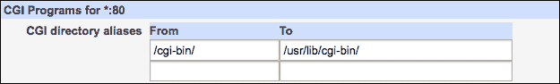

# 第十一章. 运行 Web 应用程序

在本章中，我们将涵盖以下内容：

+   使用 CGI 生成动态页面

+   安装 PHP

+   更改 PHP 配置设置

+   调试时显示 PHP 错误

+   在 PHP 中记录日志

+   在您的服务器上安装 WordPress

+   在您的服务器上安装 Drupal

+   使用 `mod_wsgi` 安装基于 Django 的应用程序

# 介绍

互联网网站大致可以分为两类：静态网站和动态网站。当 Web 服务器托管静态网站时，其角色非常有限。服务器等待传入的请求，将每个请求映射到磁盘上的文件，并将文件的内容作为响应发送。此类网站的所有页面必须提前准备好，并且在访问之间不会自动更改。此类网站的功能看起来可能有限，但它们确实有许多优点。由于服务器不进行任何计算工作，静态网站可以非常快速，并且可以处理大量请求。此类网站也容易被搜索引擎索引。静态网站并不意味着它不能具有互动性。JavaScript 组件允许浏览器为用户提供图形界面，用户可以通过这个界面与我们的网站互动。然而，如果用户提供我们希望存储的信息，我们将需要一个动态组件来处理传入的数据。

在动态网站上，传入的请求不会直接映射到磁盘上的文件；相反，它们会交给程序处理，每个请求都会生成一个响应。处理通常涉及与数据库交互以查找或存储信息；响应是即时生成的，并且每次可能不同。动态网站是现代互联网的一个重要组成部分，而 Apache 是一个可以托管大多数可用动态技术的服务器。

在第八章中，*运行 Apache Web 服务器*，我们展示了 Webmin 如何帮助您设置 Web 服务器来托管静态网站。在本章中，我们将深入探讨与各种动态网站解决方案相关的话题。我们将从 CGI 开始，这是通过使用任何语言编写的程序来提供动态网站的经典方法。为了说明这一点，我们将演示如何设置一个由 Bash 脚本驱动的简单动态网站。接下来，我们将展示如何托管更高效的特定语言技术。本章的大部分内容都集中在 PHP 语言上，但最后的示例演示了如何使用 Apache 模块 `mod_wsgi` 托管用 Python 编写的应用程序。

# 使用 CGI 生成动态页面

自万维网（World Wide Web）最早期以来，使用一种标准方法叫做 **公共网关接口**（**CGI**）生成动态网页是可能的。通过使用 CGI，Apache Web 服务器可以通过执行安装在同一台机器上的任何程序来生成动态内容，只要该程序生成格式正确的 HTTP 响应文本。这种方法的主要优点是其普适性，因为 CGI 脚本可以用任何编程语言编写。在本食谱中，我们将演示如何用 shell 脚本语言 Bash 编写一个简单的 Hello World 脚本，但相同的原理也适用于任何其他编程语言。

CGI 协议的主要缺点是 Web 服务器必须为每个传入请求启动一个新进程。这个解决方案的扩展性较差，因此仅适用于低流量的网站。使用 CGI 的另一个缺点是该协议非常基础，传入请求的解析必须由您的脚本手动完成。

基本 CGI 已被不需要为每个传入请求启动新进程，而是将一个组件加载到内存中，随时准备处理请求的技术所取代。这些解决方案通常是语言特定的，并且可能作为 Apache 模块提供，例如 `mod_perl`、`mod_php` 或 `mod_python`。本章后续的食谱中会描述其中的一些技术。

本食谱中描述的方法仍然适用于小型任务。如果您有一个 Web 服务器并希望返回一个简单的状态页面，但又不想安装像 PHP 这样的技术所带来的开销（和潜在的安全风险），您可以使用这种基本的方法生成动态网页。

### 注意

从 Unix 系统的角度来看，CGI 脚本是常规程序，它们具有与 Web 服务器进程相同的权限，可以访问底层机器。如果 CGI 脚本接受用户输入，应格外小心，验证并清理传入的数据。输入处理中的错误常常会成为安全漏洞，并可能被利用。

## 准备工作

本食谱涉及 Apache Web 服务器的配置。有关安装和配置 Apache 的信息，请参见 第八章，*运行 Apache Web 服务器*。

### 检查 Apache 正在作为哪个用户和组运行

Apache Web 服务器作为一个特殊用户访问您的系统，通常被称为 `apache`、`www-data`、`wwwrun`、`httpd` 或类似的名称。为了完成本食谱，您需要知道该 Apache 用户的用户名和组名。这可以通过 Webmin 轻松检查，步骤如下：

1.  导航到 **服务器** | **Apache Web 服务器** | **全局配置**。

1.  点击 **用户和组** 图标。您将看到以下屏幕：

Apache 用户名将在**以 Unix 用户身份运行**字段中显示，组名将在**以 Unix 组身份运行**字段中显示。前面截图中的这两个值都设置为`www-data`。请记下系统的配置。

## 如何操作...

本教程将分为两部分。首先，我们将创建一个 CGI 脚本，然后配置 Apache 以显示它生成的网页。

按照以下步骤创建一个兼容 CGI 的 Shell 脚本：

1.  创建一个目录来存放你的 Web 可访问 CGI 脚本，例如，在`/usr/lib/cgi-bin`中。

    ### 提示

    将 CGI 脚本存放在`DocumentRoot`目录中并不推荐，因为该目录通常用于提供常规 HTML 页面。不正确的服务器配置可能会暴露脚本的源代码，运行不应执行的脚本，或使目录可写，这将导致严重的安全漏洞。

1.  创建一个名为`/usr/lib/cgi-bin/hello.sh`的 Shell 脚本文件。在该文件中输入以下代码：

    ```
    #!/bin/bash

    echo "Content-type: text/plain"
    echo "" # End of headers, start of response body

    echo "Hello World!"
    echo "The current date is:"
    date

    exit 0
    ```

1.  将脚本的组所有者设置为 Apache 运行时使用的组名。如果 Apache 在你的系统上以`www-data`身份运行，你可以通过执行以下命令来完成：

    ```
    $ sudo chgrp www-data /usr/lib/cgi-bin/hello.sh

    ```

1.  允许该文件的组具有读取和执行权限，所有者具有完全访问权限，其他用户则没有权限。你可以通过执行以下命令来完成：

    ```
    $ sudo chmod 750 /usr/lib/cgi-bin/hello.sh

    ```

    ### 提示

    有关操作文件、改变所有权和权限的更多信息，请参见第六章 *管理系统上的文件*中的*管理服务器上的文件和目录*。

按照以下步骤创建 Apache 配置：

1.  导航到**服务器** | **Apache Web 服务器**。

1.  点击你想要配置的虚拟服务器图标，或者点击**默认服务器**。

1.  点击**CGI 程序**图标。

1.  通过将**从**值设置为`/cgi-bin/`，将**到**值设置为`/usr/lib/cgi-bin/`来创建 CGI 目录别名：

1.  点击**保存**按钮。

1.  在**创建每目录、文件或位置选项**下，选择**目录**，并为路径`/usr/lib/cgi-bin`创建配置。

1.  点击目录图标，`/usr/lib/cgi-bin`。

1.  点击**文档选项**图标。

1.  在**目录选项**下，选择**以下选项**，将**执行 CGI 程序**设置为**是**，并将其他所有选项设置为**否**。

1.  在**选项文件可以覆盖..**下，选择**以下选项**，并保持所有复选框未选中。参考以下截图：

1.  点击**保存**按钮。

1.  点击**访问控制**图标。

1.  在**限制访问**下，选择**先允许后拒绝**，并只设置一条规则，如下所示：**动作**设置为**允许**，**条件**设置为**所有请求**。参考以下截图：

1.  点击**保存**按钮。

    ### 提示

    如果呈现的数据不应公开，您可能希望限制特定客户端 IP 的访问权限。该位置也可以通过密码保护。

1.  点击**应用更改**链接。

要查看结果，请访问网址`http://your-server/cgi-bin/hello.sh`，其中`your-server`是您的 Apache 服务器机器的 IP 地址或域名。

您应该能看到一个网页，显示**Hello World**和当前日期。通过常见网关接口（CGI）由 Apache 执行的您的 Shell 脚本动态生成了这段文本。

## 它是如何工作的...

当浏览器请求一个与`/cgi-bin/hello.sh`路径匹配的网址时，Apache 会将其识别为指向脚本`/usr/lib/cgi-bin/hello.sh`的别名。Apache 准备一个执行环境，其中包括诸如 HTTP 头部和查询字符串等请求参数作为环境变量，并在该环境中执行脚本。请求的主体通过标准输入流传递给脚本。

我们编写的脚本生成了 HTTP 响应，并将其发送回浏览器。响应由两部分组成：头部和响应体。我们只发送一个头部，告知浏览器我们的响应`Content-type`是`text/plain`。这告诉浏览器应该将响应显示为文本，而不是下载为文件。然后，我们发送一个空行来结束头部部分，接着发送响应体，内容是“Hello World!”和当前日期。

我们创建的 Apache 配置告知服务器，所有以`/cgi-bin/`开头的路径请求应被视为`/usr/lib/cgi-bin/`目录下文件的别名。我们还告知 Apache 执行该目录中的脚本，并允许所有客户端访问。这相当于创建了以下配置片段：

```
ScriptAlias /cgi-bin/ /usr/lib/cgi-bin/
<Directory "/usr/lib/cgi-bin">
  AllowOverride None
  Options ExecCGI
  Order allow,deny
  Allow from all
</Directory>
```

所有 CGI 脚本必须是可执行的，且 Apache 用户必须有运行它们的权限才能使用它们。为此，我们将文件交给 Apache 所属的组，并为该组分配了读取和执行权限。通过这种方式分配权限允许 Apache 运行脚本，但不能修改它。如果 Apache 用户能够修改 CGI 脚本，受损的服务器可能会被用作控制服务器的手段。

## 还有更多...

通过 CGI 运行的程序可以输出如前所述的数据，但它们还可以读取传入的头部和提交表单的内容。CGI 协议已标准化，并在*RFC3875*文档中描述，您可以在[`tools.ietf.org/html/rfc3875`](http://tools.ietf.org/html/rfc3875)找到该文档。

### 显示传入请求头部

通过 CGI 协议描述的传入 HTTP 请求头部以及许多其他有用的信息都可以作为环境变量提供给脚本。为了显示它们，您可以使用`printenv`命令，如以下脚本所示：

```
#!/bin/bash
echo "Content-type: text/plain"
echo "" 
printenv
exit 0
```

### 显示传入请求主体

传入的请求体（例如，包含 `HTTP POST` 表单值）会通过标准输入流传递给脚本。为了显示请求体的内容，你可以在脚本中添加以下代码：

```
while read LINE; do
    echo ${LINE}  # perform operations on request body
done
```

## 另请参阅

我们还可以参考以下章节：

+   第八章 中的 *在系统上安装 Apache* 食谱，*运行 Apache 网络服务器*

+   第八章 中的 *创建虚拟主机* 食谱，*运行 Apache 网络服务器*

+   第八章 中的 *为目录、文件和位置设置选项* 食谱，*运行 Apache 网络服务器*

+   本章中的 *安装 PHP* 食谱

+   本章中的 *使用 mod_wsgi 安装基于 Django 的应用程序* 食谱

# 安装 PHP

PHP 目前是 Web 上最流行的编程语言之一。许多最大和最受欢迎的网站都由 PHP 编写的软件提供支持，包括 Facebook、Yahoo!、Wikipedia 和 Wordpress.com。PHP 起初是一组用于设计动态个人主页的简单工具，但它迅速流行起来，并发展成为一种现代的面向对象编程语言。围绕这门语言成长起来的开源社区创建了许多有用的库，并增加了对多平台、数据库等的支持。

PHP 功能强大且易于使用。部署 PHP 应用程序通常只需将源代码文件放置在服务器上的某个目录中。使用 PHP 编程也非常简单——其代码可以直接嵌入到标准 HTML 中。通过抽象 HTTP 协议的细节，PHP 使 Web 编程变得非常简单。例如，表单值可以直接作为数据结构传递给脚本，简单的函数可以读取和写入头信息，内建对 cookies 和用户会话的支持，等等。

PHP 的易用性实际上可能过于出色，它使得许多人能够在不了解其底层协议的情况下进行 Web 开发。如果你找到一个可以在服务器上安装的 PHP 应用程序，请确保阅读其评论，以确保它不会带来严重的安全或稳定性问题。

本食谱将演示如何安装 PHP，然后编写并部署一个简单的 Hello World 脚本。

## 准备工作

本食谱涉及配置 Apache 网络服务器。有关安装和配置 Apache 的信息，请参阅第八章，*运行 Apache 网络服务器*。

## 如何操作...

按照以下步骤安装 PHP 并验证其在系统上的工作状态：

1.  按照 第一章，*设置系统* 中的 *安装软件包* 食谱中的说明，安装适合你系统的 PHP 包。该包可能仅被命名为 `php` 或 `php5`。

1.  进入**服务器** | **Apache Web 服务器** | **全局配置**。

1.  点击**配置 Apache 模块**图标。

1.  勾选`php5`模块旁边的复选框，然后点击**启用选定模块**按钮。

    ### 提示

    **配置 Apache 模块**屏幕可能在你的系统中不存在。如果你是通过包安装 PHP，那么很可能模块已经为你启用了。按照本教程的其余部分进行测试。

1.  进入**服务器** | **Apache Web 服务器**。

1.  点击你希望配置的虚拟服务器的图标，或者点击默认服务器。

1.  点击**文档选项**图标并注意服务器的文档根目录在哪里。

1.  在文档根目录中创建一个名为`hello.php`的文件。

1.  在`hello.php`文件中输入以下代码：

    ```
    <?php
        echo "Hello World!";
    ?>
    ```

要查看结果，访问 URL`http://your-server/hello.php`，其中`your-server`是你的 Apache 服务器机器的 IP 地址或域名。你应该看到一个显示**Hello World!**的网页，这是由 PHP 生成的。

### 提示

如果你看到 PHP 代码而不是 Hello World!，你需要手动启用 PHP 模块。查看*它是如何工作的*部分，了解你需要在 Apache 配置文件中添加的指令，并阅读你包的文档获取相关指导。

## 它是如何工作的……

几乎所有的服务器操作系统发行版都提供从其仓库中安装 PHP 包。安装 PHP 有几种不同的方式，建议安装标准系统包，因为这样可以确保其针对你的 Apache 版本进行了优化，并且会被包维护者保持最新。

安装包不仅将 PHP 可执行文件和文档放在你的磁盘上，还会修改 Apache Web 服务器的配置。引入的更改包括以下内容：

+   一行代码，当 Apache 启动时加载 PHP 解释器模块，如下所示：

    ```
    LoadModule php5_module /path/to/libphp5.so
    ```

+   指示 Apache 将 PHP 文件传递给解释器的行，如下所示：

    ```
    SetHandler application/x-httpd-php
    ```

    或

    ```
    AddHandler php5-script .php
    ```

+   使用`index.php`文件作为目录索引的指令：

    ```
    DirectoryIndex index.html index.php
    ```

## 另见

我们还可以参考以下章节。

+   第八章中的*在系统上安装 Apache*教程，*运行 Apache Web 服务器*

+   第八章中的*创建虚拟主机*教程，*运行 Apache Web 服务器*

+   第八章中的*为目录、文件和位置设置选项*教程，*运行 Apache Web 服务器*

+   本章中的*更改 PHP 配置设置*教程

+   本章中的*查看 PHP 错误日志*教程

# 更改 PHP 配置设置

PHP 解释器允许你指定众多设置的值，这些设置决定了 PHP 应用程序在系统上的行为。这些配置影响错误的记录或显示方式、输入数据的处理方式、分配给解释器的资源以及与 PHP 捆绑的扩展模块的设置。

PHP 的配置文件通常被称为`php.ini`，其位置取决于你的操作系统发行版和 PHP 版本。`php.ini`文件的常见位置包括：`/etc/`、`/etc/php5/apache2/`和`/usr/local/etc/`。`php.ini`文件包含主设置值，但一些设置可能会被 PHP 脚本或 Apache 配置在目录级别覆盖。

在本教程中，我们将演示如何检查当前使用的配置设置的值以及如何修改它们。

## 准备就绪

假设你已经安装了 Apache 和 PHP，请准备一个通过 Web 服务器公开并准备好提供 PHP 脚本的目录。我们将在本教程中将该目录称为`DocumentRoot`目录。

## 如何操作...

本部分将检查当前定义的设置，然后我们将继续修改这些设置。

按照以下步骤检查当前的 PHP 设置：

1.  在你的 Web 服务器的`DocumentRoot`目录中创建一个名为`phpinfo.php`的文件。

1.  在`phpinfo.php`文件中输入以下代码：

    ```
    <?php
        phpinfo();
    ?>
    ```

1.  转到`phpinfo.php`文件的 URL：`http://your-server/phpinfo.php`。

1.  记下**加载的配置文件**的位置。

    ### 注意

    这告诉我们主 PHP 配置文件（`php.ini`）的位置。

1.  记下`memory_limit`值。

    ### 注意

    请注意，有两列。它们指定了该设置的本地值和主值。主值在`php.ini`中指定，但本地值是当前使用的。如果本地值被覆盖，它可能与主值不同。请参见本教程的*更多内容*部分。

按照以下步骤更改主 PHP 设置：

1.  查找全局 PHP 配置文件（`php.ini`）的位置，方法如前所述。

1.  转到**其他** | **PHP 配置**。

1.  点击与全局 PHP 配置文件对应的行中的**管理**。

1.  点击**资源限制**。

1.  将**最大内存分配**更改为`260M`：

1.  点击**保存**。

1.  转到**服务器** | **Apache Webserver**。

1.  点击**应用更改**链接。

1.  再次转到 URL，`http://your-server/phpinfo.php`。

检查`memory_limit`值。其主值现在应该已更改为`260M`。

### 提示

将`phpinfo.php`文件保留在服务器上不是一个好主意，因为它不必要地向公众暴露关于你系统的信息。使用完后请删除该文件。

## 其工作原理...

Apache 每次启动时都会加载全局 PHP 配置（`php.ini`）文件。在此示例中，我们通过 Webmin 修改了该文件，特别是更改了决定 PHP 解释器可以使用多少内存的那一行，修改为以下内容：

```
memory_limit = 260M
```

修改文件后，我们进入 Webmin 界面，通过重启 Apache 来应用配置更改。

## 还有更多...

PHP 设置可以在脚本和 Apache 的每目录配置文件中本地设置。

### 使用 .htaccess 文件修改目录的 PHP 设置

为了通过 `.htaccess` 文件修改 PHP 设置，我们必须指示 Apache 允许对包含我们 PHP 脚本的目录进行本地选项覆盖。查看第八章中的*设置目录、文件和位置的选项*示例，了解更多信息。执行以下步骤：

1.  导航到**服务器** | **Apache Web 服务器**。

1.  点击您希望配置的虚拟服务器的图标或默认服务器。

1.  点击或创建包含您 PHP 脚本的目录的设置。

1.  点击**文档选项**。

1.  在**选项文件可以覆盖**部分，勾选**选中的选项**并选择**目录选项**。

    ### 提示

    这相当于在 Apache 配置中为该目录添加以下行：

    ```
    AllowOverride Options
    ```

1.  点击**保存**按钮。

1.  点击**应用更改**链接。

1.  在相同目录下创建一个名为 `.htaccess` 的文件。

1.  在 `.htaccess` 文件中放置以下指令，将内存限制本地更改为 32MB：

    ```
    php_value memory_limit 32M
    ```

    ### 注意

    `php_value` 指令用于配置接受参数值的设置。布尔参数仅接受开或关的值，使用 `php_flag` 指令进行设置。有关更多信息，请参见 PHP 在线手册：[`php.net/manual/configuration.changes.php`](http://php.net/manual/configuration.changes.php)。

使用 `phpinfo()` 函数验证本地设置的更改，如前所述。

### 在脚本代码中动态修改 PHP 设置

按照此示例准备一个`phpinfo.php`文件，并在其中添加以下代码：

```
<?php
  ini_set('memory_limit', '64M');
  phpinfo();
?>
```

导航到 `phpinfo.php` 文件的 URL，验证本地设置的更改。

## 另请参见

+   查看第八章中的*设置目录、文件和位置的选项*示例，了解更多关于在本地更改 Apache 设置的信息，*运行 Apache Web 服务器*。

# 显示 PHP 错误以进行调试

在编写 PHP 代码或安装下载的应用程序时，你可能会发现自己盯着一块空白的浏览器屏幕，完全没有任何提示为什么它没有按照预期工作。这是由于 PHP 的默认配置，它隐藏了错误信息以防泄露敏感数据。错误信息可能暴露服务器的相关信息，因此在生产环境中这样做是一个好主意，但这也会增加解决问题的难度。在开发过程中，你可以通过以下步骤启用 PHP 的友好错误信息。

## 如何操作...

按照以下步骤执行此食谱：

1.  让我们从编写一个会导致错误的 PHP 脚本开始。该脚本可能包含以下破损的代码：

    ```
    <?php
        echo "Hello World!";
        syntax!error
    ?>
    ```

1.  将脚本保存到服务器上的一个文件中，并导航到该文件在你的 Web 服务器上的公共 URL。如果关闭了错误显示，你应该会看到一块空白屏幕。

1.  导航到**其他** | **PHP 配置**。

1.  点击**管理**，对应于全局 PHP 配置文件的那一行。

1.  点击**错误日志**。

1.  将**显示错误信息？**设置为**是**。

1.  点击**保存**。

1.  导航到**服务器** | **Apache Web 服务器**。

1.  点击**应用更改**链接。

更改设置后，再次导航到你出现问题的脚本的 URL。你现在应该能看到类似这样的错误信息：

**解析错误：语法错误，/var/www/index.php 第 3 行出现意外的 '!'**

## 它是如何工作的...

PHP 的`display_errors`设置决定了解释器是否在屏幕上显示错误信息，或者隐藏这些信息。

在这个食谱中，我们通过启用`display_errors`配置标志来全局启用 PHP 的错误报告。为此，我们将`php.ini`中的`display_errors`行更改为以下内容，并重启了 Apache：

```
display_errors = Off
```

你也可以通过在`.htaccess`文件中添加以下行来为指定的目录本地设置该标志。确保 Apache 允许该目录中的本地覆盖：

```
php_flag display_errors on
```

不要使用`ini_set`函数来开启错误显示，因为某些错误会阻止脚本被解析，导致该设置无法生效。

## 参见

+   本章中的*更改 PHP 配置设置*食谱

+   本章中的*PHP 中的日志记录*食谱

# PHP 中的日志记录

使用 PHP 编写的应用程序在发生错误时会生成日志消息。这些消息可以根据解释器的配置设置保存到日志文件、传递给 syslog，或者被忽略。忽略错误消息是一个不好的做法，因为它会阻止你发现服务器上发生的问题。

另一方面，将每条消息保存到文件中可能会导致日志增长非常迅速，尤其是在高流量网站上。幸运的是，PHP 允许你非常精确地配置哪些错误会被记录。所有 PHP 错误都有一个级别值；最严重的错误标记为`E_ERROR`，较轻的错误标记为`E_WARNING`，再轻的标记为`E_NOTICE`，依此类推。完整的错误级别列表可以在 PHP 手册中的[`php.net/errorfunc.constants.php`](http://php.net/errorfunc.constants.php)找到。

建议在开发过程中记录所有错误，但在生产环境中，应该记录所有错误，除了`E_DEPRECATED`（弃用警告）和`E_STRICT`（代码风格建议）。我们将在本食谱中设置这种日志记录级别。

## 准备工作

为了完成此食谱，我们需要知道 Apache 正在以哪个用户和组运行。你可以在本章的*生成动态页面使用 CGI*食谱中的*准备工作*部分找到获取此信息的说明。

## 如何操作...

按照以下步骤指示 PHP 记录错误消息：

1.  创建一个空文件，用于存储你的 PHP 错误日志，存储位置可以自定义，例如，`/var/log/php_errors.log`。

1.  将文件的所有者更改为 Apache 用户。如果你的 Web 服务器以`www-data`用户运行，你可以通过执行以下命令来完成：

    ```
    $ sudo chown www-data /var/log/php_errors.log

    ```

    ### 注意

    关于操作文件和更改所有权与权限的信息，可以在第六章中的*管理服务器上的文件和目录*食谱中找到，*管理系统中的文件*。

1.  确保所有者（Apache）对文件具有写入权限：

    ```
    $ sudo chmod u+w /var/log/php_errors.log

    ```

1.  导航到**其他** | **PHP 配置**。

1.  点击与全局 PHP 配置文件对应行的**管理**。

1.  点击**错误日志**。

1.  将**显示错误消息？**设置为**是**。

1.  将**是否写入错误消息到日志？**设置为**是**。

1.  将**错误类型表达式**设置为`E_ALL & ~E_DEPRECATED & ~E_STRICT`。

1.  将**错误日志文件**设置为**其他文件**，并在文本框中输入`/var/log/php_errors.log`，如以下截图所示：

1.  点击**保存**。

1.  导航到**服务器** | **Apache Web 服务器**。

1.  点击**应用更改**链接。

从现在开始，你应该能在 PHP 的日志文件中看到错误消息。

## 如何运作...

为了启用 PHP 错误日志记录，我们在`php.ini`文件中设置了以下主值：

```
log_errors = On
error_reporting = E_ALL & ~E_DEPRECATED & ~E_STRICT
error_log = /var/log/php_errors.log
```

上述设置启用了 PHP 的错误日志记录（`log_errors`），并指定了错误应保存到哪个文件（`error_log`）。

`error_reporting`指令指定了哪些消息会被保存，哪些会被忽略。该行接受复杂的语法，其中与符号(`&`)允许您指定不同级别的消息进行记录，波浪符(`~`)则用于取消某一类消息的记录。这使我们能够记录所有级别的错误（`E_ALL`），但不记录弃用警告（`& ~E_DEPRECATED`）或样式建议（`& ~E_STRICT`）。

请参考本章中的*更改 PHP 配置设置*配方，了解更多有关更改 PHP 配置的方法。

## 还有更多...

PHP 还可以将错误消息输出到系统日志（syslog）。如果您希望使用 syslog，请将`error_log`行更改如下：

```
error_log = syslog
```

PHP 错误会输出到名为`user`的 syslog 设施中，不幸的是，目前无法通过 PHP 配置来更改这一点。

### 注意

现代的 syslog 实现（如 rsyslog，syslog-ng）可以基于生成日志的命令过滤消息。

请参考第五章中的*将 syslog 消息保存到文件*配方，*监控您的系统*，了解更多关于 syslog 的信息。

## 另见

有关使用系统日志的更多信息，请查看以下配方：

+   第五章中的*查看和搜索系统日志文件*配方，*监控您的系统*

+   第五章中的*添加其他日志文件到 Webmin*配方，*监控您的系统*

+   第五章中的*配置日志文件轮换*配方，*监控您的系统*

# 在您的服务器上安装 WordPress

WordPress 是一个非常受欢迎的开源博客平台。该软件非常易于使用，且足够灵活，能够满足各种用途，比如运行信息性网站或简单的电子商务商店。WordPress 完全用 PHP 编写，这使得它的安装非常简便。

这个配方整合了前面各章节的内容。我们将展示如何使用本书中提供的配方来设置一个工作中的 Web 服务器，托管一个由 WordPress 博客平台支持的网站。

### 注意

许多操作系统发行版的包存储库中都提供了 WordPress 的软件包。如果您不打算自定义站点或托管多个不同版本的软件，您可以选择安装该软件包。请注意，WordPress 的更新频率可能比您操作系统包存储库中的软件包更高，这可能会导致您使用不安全的版本。如果您选择此路线，请查看包中的文档以获取更多信息。

## 如何操作...

本食谱分为多个部分。我们首先通过安装所需的软件包来准备服务器。如果你已在服务器上安装了这些软件，可以跳过这些步骤。然后，我们将为我们的 WordPress 安装创建一个 MySQL 数据库和用户。最后，我们将创建一个 Apache 虚拟主机并安装 WordPress。

请按照以下步骤准备服务器：

1.  按照第八章中的*在系统上安装 Apache*食谱安装 Apache Web 服务器，*运行 Apache Web 服务器*。

1.  按照第九章中的*安装 MySQL 数据库服务器*食谱安装 MySQL 数据库服务器，*运行 MySQL 数据库服务器*。

1.  按照本章中的*安装 PHP*食谱安装 PHP。

    ### 提示

    为了让 PHP 应用程序能够与 MySQL 通信，你需要安装一个额外的 PHP 模块，这个模块在大多数操作系统发行版中以包的形式提供。你可以通过查看`phpinfo()`函数的输出，检查此模块是否已安装，正如本章中*更改 PHP 配置设置*食谱所描述的那样。如果你找到名为**mysql**的信息部分，那么`php-mysql`模块已安装。

1.  安装名为`php-mysql`、`php5-mysql`或类似名称的系统包。

    ### 注意

    有关安装软件包的更多信息，请参见第一章中的*安装软件包*食谱，*设置系统*。

1.  安装`php-gd`模块，使 PHP 应用程序能够处理常见格式（如 PNG 和 JPEG）的图形图像。安装名为`php-gd`、`php5-gd`或类似名称的系统包。

1.  确保 Apache 的重写模块（`mod_rewrite`）已安装并启用。有关更多信息，请查看第八章中的*启用 Apache 模块*食谱，*运行 Apache Web 服务器*。

### 创建数据库

我们将创建一个名为`wordpress`的数据库和用户。你可能应该使用一个更具信息性的名称，特别是如果你计划使用多个 WordPress 实例的话。请按照以下步骤创建数据库：

1.  创建一个新的 MySQL 数据库和用户，二者均命名为`wordpress`。该用户应使用强密码，并允许从本地机器（`localhost`）连接。

1.  授予从`localhost`连接的`wordpress`用户对`wordpress`数据库的所有权限。

    ### 注意

    关于创建 MySQL 数据库和授予权限的信息，请参见第九章中的*创建新数据库*和*创建用户并授予数据库权限*食谱，*运行 MySQL 数据库服务器*。

    ### 提示

    如果你正在运行带有**安全增强 Linux**（**SELinux**）的系统，你需要通过设置以下标志来允许 Apache 连接到数据库：

    ```
    $ sudo setsebool -P httpd_can_network_connect_db 1

    ```

### 创建虚拟主机并安装 WordPress

为了创建虚拟主机并安装 WordPress，请执行以下步骤：

1.  请参考第八章中的*创建虚拟主机*示例，*运行 Apache Web 服务器*，以便从文档根目录`/var/www/blog.example.com`提供文件，并设置服务器名称为`blog.example.com`。

1.  从以下网址下载最新版本的 WordPress，并将归档文件解压到`/var/www/blog.example.com`目录： [`wordpress.org/latest.tar.gz`](http://wordpress.org/latest.tar.gz)

    ### 注意

    当提取完成后，WordPress 的`index.php`文件应位于以下路径：`/var/www/blog.example.com/index.php`。

1.  在相同的目录中创建一个 `.htaccess` 文件，并输入以下重写规则，以启用 WordPress 的干净 URL：

    ```
    <IfModule mod_rewrite.c>
    RewriteEngine On
    RewriteBase /
    RewriteRule ^index\.php$ - [L]
    RewriteCond %{REQUEST_FILENAME} !-f
    RewriteCond %{REQUEST_FILENAME} !-d
    RewriteRule . /index.php [L]
    </IfModule>
    ```

    ### 提示

    Apache 的虚拟主机或目录配置必须允许 `.htaccess` 文件覆盖选项（`AllowOverride All`）。有关更多信息，请查看第八章中的*为特定目录、文件和位置设置选项*示例，*运行 Apache Web 服务器*。

1.  导航到新 WordPress 网站的 URL：`http://blog.example.com/`。

1.  会出现一个设置屏幕。按照屏幕上的指示输入已创建的数据库名称、用户名和密码，如下图所示：

1.  WordPress 安装会生成一个配置文件的内容，您应将其保存为`/var/www/blog.example.com/wp-config.php`。

现在，您可以导航到 WordPress 网站的 URL，按照屏幕上的说明完成设置并开始使用网站。

## 它是如何工作的……

WordPress 使用了本书中介绍的技术。为了为该应用程序设置我们的服务器，我们需要安装 Apache、MySQL 和 PHP。我们还需要安装一些额外的 PHP 模块，以便 WordPress 与数据库通信并操作图像文件。

每个 WordPress 实例都需要访问数据库。表前缀会添加到每个数据库表的名称中，这样可以让多个 WordPress 实例共享一个数据库。我们将前缀保留为默认值`wp_`。由于我们在运行自己的服务器，我们可以根据需要创建任意数量的数据库；因此，实际上不需要共享数据库。实际上，我们还为这个应用程序创建了一个专用的数据库用户，仅允许访问一个数据库。

我们创建的虚拟主机配置允许我们在一个子域（`blog.example.com`）上运行 WordPress，从而可以自由地在主域或其他子域上运行其他软件。

我们创建的 `.htaccess` 文件旨在允许 WordPress 使用干净的 URL。借助这个功能，页面的 URL 可能是 `http://blog.example.com/hello-world/`，而不是 `http://blog.example.com/?p=1`。

### 注意

有关干净 URL（在 WordPress 中称为永久链接）的更多信息，请参阅其文档：[`codex.wordpress.org/Using_Permalinks`](http://codex.wordpress.org/Using_Permalinks)

我们通过允许 WordPress 为我们创建其主要配置文件（`wp-config.php`）的内容来完成安装。我们需要将数据库连接详细信息输入到一个表单中，WordPress 会自行准备配置文件。除了存储数据库连接详情外，安装程序还生成了伪随机的加密盐字符串，这有助于保持 WordPress 的安全。盐字符串也会存储在配置文件中，应该保持机密并偶尔更换。

### 提示

为了确保 WordPress 配置文件的安全，请确保其权限设置正确。该文件必须对 Apache 可读，但对其他人不可读。请查看本章的*生成动态页面使用 CGI*食谱中的*准备工作*部分，了解 Apache 用户的名称，并参考第六章中的*管理文件和目录*食谱，获取有关设置权限的信息。

同时，确保任何该文件的备份副本都存储在安全的地方。

## 另见

+   有关安装 WordPress 过程的更多信息，请参见其手册：[`codex.wordpress.org/Installing_WordPress`](http://codex.wordpress.org/Installing_WordPress)

# 在你的服务器上安装 Drupal

Drupal 是一个强大的开源**内容管理系统**（**CMS**）。它高度模块化，意味着通过安装额外的插件，可以将其定制为执行几乎任何任务。Drupal 完全用 PHP 编写，这使得它非常容易安装。

本食谱汇集了前面各章的内容。我们将展示如何使用本书中提供的食谱设置一个工作中的 Web 服务器，托管一个由 Drupal CMS 平台驱动的网站。

### 提示

许多操作系统发行版的包管理库中都提供了 Drupal 的安装包。如果你不打算托管多个不同版本的软件，你可以选择安装这个包。但请注意，Drupal 可能会比操作系统库中的包更新得更频繁，这可能会导致使用不安全的软件版本。如果你选择这种方式，请查阅包中的文档以获取更多信息。

## 准备工作

要完成本食谱，我们需要了解 Apache 运行的用户和组。你可以在本章的*生成动态页面使用 CGI*食谱中的*准备工作*部分找到获取此信息的说明。

## 如何操作...

本配方分为多个部分。我们首先通过安装所需的软件包来准备服务器。如果你已经在服务器上安装了所述软件，可以跳过这些步骤。接下来，我们将为 Drupal 安装创建一个 MySQL 数据库和用户。最后，我们将创建一个 Apache 虚拟主机并安装 Drupal。

按照以下步骤准备服务器：

1.  按照第八章中的 *在你的系统上安装 Apache* 配方安装 Apache Web 服务器，*运行 Apache Web 服务器*。

1.  通过遵循第九章中的 *安装 MySQL 数据库服务器* 配方，安装 MySQL 数据库服务器，*运行 MySQL 数据库服务器*。

1.  通过遵循本章中的 *安装 PHP* 配方安装 PHP。

1.  为了让 PHP 应用程序能够与 MySQL 通信，你需要安装一个额外的 PHP 模块，这个模块在大多数操作系统的发行版中都有提供。安装名为 `php-mysql`、`php5-mysql` 或类似名称的系统包。

    ### 注意

    有关安装软件包的更多信息，请参见第一章中的 *安装软件包* 配方，*设置你的系统*。

1.  安装 `php-gd` 模块，允许 PHP 应用程序操作 PNG、JPEG 等常见格式的图形图像。安装名为 `php-gd`、`php5-gd` 或类似名称的系统包。

1.  确保 Apache 的重写模块（`mod_rewrite`）已安装并启用。更多信息请参见第八章中的 *启用 Apache 模块* 配方，*运行 Apache Web 服务器*。

### 创建数据库

我们将创建一个名为 `drupal` 的数据库和用户。你可能需要使用更具描述性的名称，特别是如果你计划使用多个 Drupal 实例时。请按以下步骤操作：

1.  创建一个新的 MySQL 数据库和用户，命名为 `drupal`。用户应使用强密码，并允许从本地机器（`localhost`）连接。

1.  授予 `drupal` 用户从 `localhost` 连接的所有权限，权限作用于 `drupal` 数据库。

    ### 注意

    创建 MySQL 数据库并授予权限的详细信息可以在第九章中的 *创建新数据库* 和 *创建用户并授予数据库权限* 配方中找到，*运行 MySQL 数据库服务器*。

    ### 提示

    如果你正在使用**增强型 Linux 安全**（**SELinux**）的系统，你需要通过设置以下标志来允许 Apache 连接到数据库：

    ```
    $ sudo setsebool -P httpd_can_network_connect_db 1

    ```

### 创建虚拟主机并安装 WordPress

按照以下步骤创建虚拟主机并安装 Drupal：

1.  按照第八章中*创建虚拟主机*的食谱，创建一个从文档根目录`/var/www/cms.example.com`提供文件的网站，并设置服务器名称为`cms.example.com`。

1.  从以下 URL 查找并下载最新版本的 WordPress，并将压缩包提取到`/var/www/cms.example.com`目录： [`drupal.org/download`](https://drupal.org/download)。

    ### 注意

    当解压完成后，Drupal 的`index.php`文件应该具有以下路径：`/var/www/cms.example.com/index.php`。

    ### 提示

    Drupal 捆绑了一个`.htaccess`文件。请确保该文件已正确提取到`/var/www/cms.example.com/.htaccess`。

    Apache 的虚拟主机或目录配置必须允许`.htaccess`文件覆盖选项（`AllowOverride All`）。有关更多信息，请参考第八章中*为特定目录、文件和位置设置选项*的食谱。

1.  创建一个目录（`sites/default/files`），Drupal 将在其中存储上传的文件和临时文件。该目录是相对于 Drupal 根目录的，因此在我们这种情况下，它的完整路径是`/var/www/cms.example.com/sites/default/files`。

1.  将`sites/default/files`目录的所有者更改为 Apache 用户，并确保该所有者对该目录具有读写权限。

    ### 提示

    关于操作文件和更改所有权及权限的信息可以在第六章的*在服务器上管理文件和目录*一节中找到，*在你的系统上管理文件*。

1.  通过复制默认设置文件`sites/default/default.settings.php`，在`sites/default/settings.php`中创建 Drupal 的配置文件。

1.  临时允许所有用户写入`settings.php`文件，通过将其权限更改为`666`。

1.  访问你新 Drupal 站点的 URL：`http://cms.example.com/`。

1.  一个设置屏幕将会出现。请按照屏幕上的指示，输入已创建的数据库、用户名和密码。

1.  当安装程序完成修改你的设置文件时，它将通知你现在应该更改权限，移除对`settings.php`文件的写入访问权限：

现在，你可以导航到你的 Drupal 站点的 URL，按照屏幕上的指示完成设置并开始使用该站点。

## 它是如何工作的...

Drupal 使用了本书中描述的技术。为了为应用程序设置我们的服务器，我们需要安装 Apache、MySQL 和 PHP。我们还需要安装一些额外的 PHP 模块，以便 Drupal 与数据库通信并操作图像文件。

在初步服务器设置完成后，我们创建了一个虚拟主机，使我们能够在子域（`cms.example.com`）上运行 Drupal 网站，从而可以在主域或其他子域上运行其他软件。

在一切准备就绪后，我们将 Drupal 文件复制到域目录，创建了 Drupal 安装所需的文件和文件夹，然后让 Drupal 的安装程序引导我们完成剩下的步骤。Drupal 填充了它的设置文件，包含了连接数据库所需的信息，并初始化了网站。安装完成后，重要的一步是从设置文件中删除写权限。

## 另见

+   有关安装 Drupal 过程的更多信息，请参阅其手册，网址为 [`drupal.org/documentation/install`](https://drupal.org/documentation/install)

# 使用 mod_wsgi 安装基于 Django 的应用程序

Django 是一个多功能的 web 开发框架，使用 Python 编程语言编写。该框架支持快速开发，并鼓励良好的编码实践。使用 Django 编写的应用程序可以通过 `mod_wsgi` 模块托管在 Apache 上。

本教程将演示如何设置服务器来托管 Django 应用程序。其他支持 `mod_wsgi` 的 Python 应用程序也可以通过类似方式进行设置。这包括 MoinMoin、PyBlosxom、Trac 等应用程序，以及 CherryPy、Pylons、TurboGears、Pyramid、web.py、Werkzeug、Web2Py 和 Zope 等框架。

## 如何操作...

按照 第八章，*运行 Apache Web 服务器* 章节中的 *在您的系统上安装 Apache* 教程，安装 Apache Web 服务器。

1.  使用系统包安装 Python 版本 2.7。该包的名称可能是 `python`、`python2.7`、`python-2.7` 或类似的名称。

    ### 提示

    从 1.5 版本开始，Django 支持 Python 3，安装过程与较新版本相同。您只需要将 Python 2.7 替换为 Python 3，并将 `pip` 和 `mod_wsgi` 的软件包替换为 Python 3 版本。

1.  从系统包安装 `pip`——Python 包管理器。该包的名称可能是 `python-pip` 或类似的名称。

    ### 提示

    在某些系统中，您可能需要添加额外的仓库才能安装软件包。例如，如果您使用的是 RedHat 家族的 Linux 发行版（如 RHEL、CentOS、Fedora 等），您应该添加 **企业 Linux 的额外软件包**（**EPEL**）仓库。关于设置 EPEL 的信息可以在 *通过 FTP 给用户访问您的服务器* 章节中的 第六章，*管理您系统上的文件* 章节中找到。

1.  从系统包安装 `mod_wsgi`，这是一个使 Apache 能够托管 Python 应用程序的模块。该包的名称可能是 `mod_wsgi`、`apache2-mod_wsgi`、`libapache2-mod-wsgi` 或类似的名称。

1.  按照第八章中的*启用 Apache 模块*食谱，*运行 Apache Web 服务器*，启用`mod_wsgi`模块（`wsgi`）。

1.  使用`pip`安装 Django，运行以下命令：

    ```
    $ sudo pip install django

    ```

    ### 提示

    你可以修改上述命令来安装特定版本的 Django。例如，要安装 Django 1.6.2，可以使用以下命令：

    ```
    $ sudo pip install django==1.6.2

    ```

1.  在`/srv/webapps/`中创建一个 Web 应用目录。

1.  通过运行以下命令为你的应用创建项目结构。这将在`/srv/webapps/hello`中创建一个目录来存储你的应用。执行以下命令：

    ```
    $ cd /srv/webapps/ && django-admin.py startproject hello 

    ```

    ### 提示

    你可以将 Django 应用上传到另一个目录，而不是在`hello`中启动新项目。记下应用路径，并在后续步骤中将其替换为`/srv/webapps/hello`。

1.  为你的应用程序创建静态文件和媒体文件的目录，例如，`/srv/webapps/hello/static/`和`/srv/webapps/hello/media/`。

1.  在 Webmin 中，导航到**服务器** | **Apache Web 服务器**，然后点击**创建虚拟主机**。你无需指定文档根目录，只需将**服务器名称**设置为`hello.example.com`。

    ### 提示

    更多关于设置虚拟服务器的信息，可以在第八章中的*创建虚拟主机*食谱中找到，*运行 Apache Web 服务器*。此食谱还解释了如何在`/etc/hosts`中设置模拟 DNS 记录，如果你没有其他方式将子域指向服务器。

1.  点击新创建的虚拟服务器的图标。

1.  点击**编辑指令**图标。

1.  在文本区域输入以下配置指令并点击**保存**：

    ```
    ServerName hello.example.com

    WSGIDaemonProcess hello python-path=/srv/webapps/hello/ processes=3 threads=1
    WSGIProcessGroup hello
    WSGIScriptAlias / /srv/webapps/hello/hello/wsgi.py

    Alias /favicon.ico /srv/webapps/hello/static/favicon.ico
    Alias /static/ /srv/webapps/hello/static/
    Alias /media/ /srv/webapps/hello/media/
    ```

    请参考以下截图：

    

1.  点击**应用更改**链接。

现在，当你访问[`hello.example.com`](http://hello.example.com)时，应该能看到由 Apache 提供的 Django 欢迎界面。

### 提示

如果你使用的是 SELinux，可能会遇到问题，因为`/srv/webapps`位置对 Apache 不可访问。可以临时禁用 SELinux，看看是否能解决问题，然后参考以下文档页面，了解如何解决此问题：

[`code.google.com/p/modwsgi/wiki/ApplicationIssues#Secure_Variants_Of_UNIX`](https://code.google.com/p/modwsgi/wiki/ApplicationIssues#Secure_Variants_Of_UNIX)

## 它是如何工作的……

**Web 服务器网关接口**（**WSGI**）是一个低级接口，连接 Web 服务器和用 Python 编写的 Web 应用或框架。Apache 通过一个名为`mod_wsgi`的模块能够提供此类应用服务。

我们创建的配置指示 Apache 创建多个守护进程（`processes=3`），这些进程驻留在内存中，随时准备处理来自 Web 服务器的 HTTP 请求。每个进程中启动的进程数和线程数决定了分配给应用程序的系统资源量，进而决定了它可以同时处理多少个请求。这些参数应根据你的具体需求进行调整。

`python-path` 参数告诉 Python 它可以在哪里找到额外的应用程序模块。我们的应用程序位于 `/srv/webapps/hello/`，这是 Python 在查找模块时不会自动搜索的标准位置；因此，我们需要明确指定它的位置。

`WSGIScriptAlias` 指令指示 Apache 将所有访问域名根 URL (`/`) 的请求交给 Django 处理。`Alias` 指令则告诉 Apache，像 `/static/` 这样的请求应该直接从磁盘提供。你可以结合使用 `Alias` 和 `WSGIScriptAlias` 指令，来指定由应用程序提供服务的域名部分，以及由 Apache 直接提供的部分。

## 另见

+   有关通过 mod_wsgi 提供 Django 服务的更多信息，可以在其手册中找到：[`docs.djangoproject.com/en/dev/howto/deployment/wsgi/modwsgi/`](https://docs.djangoproject.com/en/dev/howto/deployment/wsgi/modwsgi/)。

+   更详细的信息可以在 `mod_wsgi` 文档中找到：[`code.google.com/p/modwsgi/wiki/InstallationInstructions`](https://code.google.com/p/modwsgi/wiki/InstallationInstructions)。
