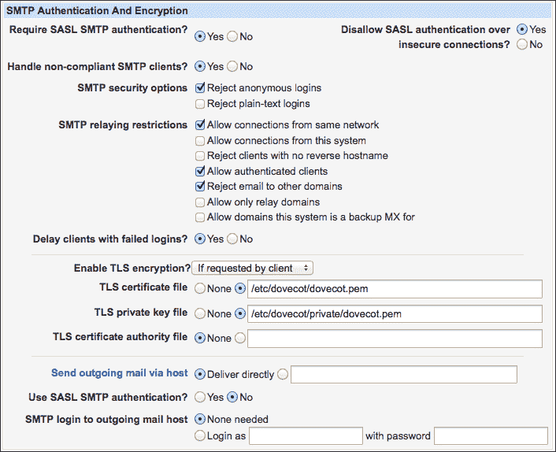
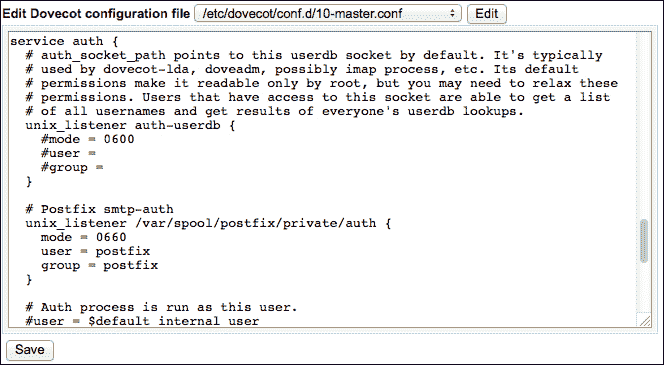
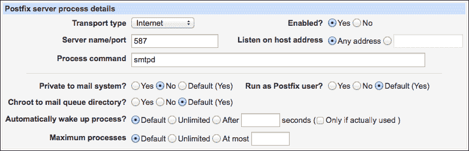
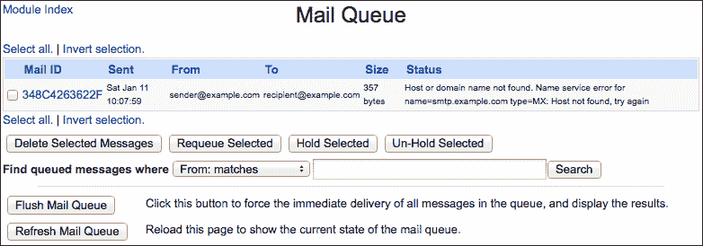
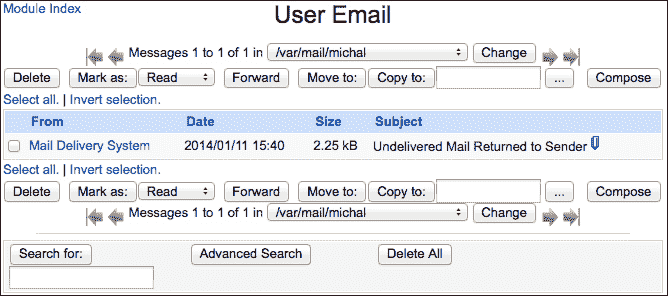
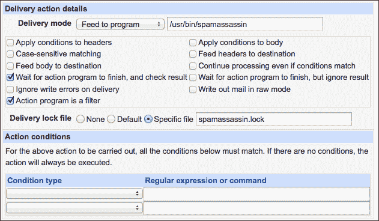
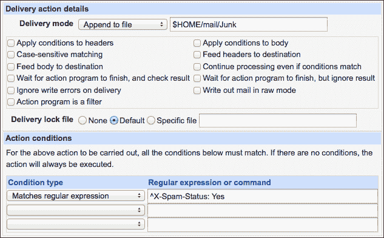

# 第十二章：设置电子邮件服务器

在本章中，我们将涵盖：

+   设置你的服务器来发送和接收电子邮件

+   设置安全的 IMAP 访问邮件箱

+   为用户设置安全的 SMTP 中继

+   控制邮件队列

+   在服务器上读取和发送电子邮件

+   配置电子邮件别名

+   使用 Procmail 和 SpamAssassin 过滤传入邮件

+   调试与电子邮件相关的问题

# 介绍

电子邮件是互联网的标准通信方式。作为一种向世界任何地方即时、免费发送信息的方式，它成为了互联网的第一个杀手级功能，并预示着许多未来的变化。

电子邮件是一种古老的技术，设计于互联网的早期阶段，那个时候互联网还是比较幼稚的。最初，每个邮件服务器都会接受来自任何人的所有消息，并将其转发到任何目的地。电子邮件账户受到密码保护，但这些密码是象征性的——以明文通过未加密的连接发送，而“垃圾邮件”一词当时主要与蒙提·派森的滑稽剧相关。

不幸的是，随着越来越多的人上网，许多恶意用户开始滥用电子邮件系统。电子邮件变成了一种免费的方式，能够发送营销信息并能触及到全球每一个人。这导致了大量不需要的电子邮件信息的爆发，这些邮件通常被称为**垃圾邮件**，在其高峰时，垃圾邮件占据了超过 95% 的电子邮件流量。如今，随着管理员奋力抵抗垃圾邮件潮，问题正慢慢减轻。在配置得当的系统上，垃圾邮件不再像以前那样是个困扰，但没有一种万无一失的解决方案。如果你决定托管自己的邮件服务器，请注意，你将需要投入大量工作才能让一切正常运行。

### 提示

你可能决定让别人托管你的域名的邮件。例如，谷歌为企业提供其 Gmail 服务的商业版——Google Apps for Business。许多公司也提供类似的服务。

因为电子邮件是一个复杂的主题，一章书籍只能帮助你入门。如果你遵循这些步骤，你将会得到一个可用但非常基础的电子邮件系统。如果电子邮件对你的企业很重要，你应该继续阅读更多相关资料。开始这里有一个好处，因为我们将展示 Webmin 在管理邮件服务器中的帮助作用。

在本章中，我们将设置 Postfix，这是一个流行的开源邮件传输代理。它的替代品，如 exim 和 sendmail，也由 Webmin 支持，但这里不作介绍。

# 设置你的服务器来发送和接收电子邮件

为了处理电子邮件，你的服务器需要运行一个叫做**邮件传输代理**（**MTA**）的服务，它能够：

+   接收传入的电子邮件并将其放入用户的本地邮件存储区

+   向其他 MTA 发送电子邮件并交付给远程系统上的用户

MTAs 使用**简单邮件传输协议**（**SMTP**）交换信息。邮件服务器监听 25 号端口，接受来自互联网上任何地方的传入电子邮件。如果邮件发送至有效的本地地址，它应该被投递到目标邮箱。

当我们服务器的用户决定发送电子邮件时，MTA 会拾取该邮件，检查邮件的目的地地址，并将其转发到与目标域名关联的 MTA。

### 注意

MTAs 也可以转发电子邮件——将通过 SMTP 接收的邮件转发到其他目的地。这将在本章后面的*为用户设置安全的 SMTP 转发中继*教程中讨论。

在本教程中，我们将设置 Postfix 邮件传输代理在您的服务器上运行。

## 准备工作

电子邮件地址基于以下结构：`mailbox@fqdn`，其中`mailbox`唯一标识用户或别名，`fqdn`通过完全限定域名（FQDN）唯一标识邮件系统。您需要为服务器分配一个 FQDN 才能使用电子邮件系统。

### 提示

为确保服务器分配了 FQDN，请检查您的域名的 DNS A 记录或 MX（邮件交换）记录是否指向邮件服务器的 IP 地址。DNS MX 记录允许您将邮件托管在除基本 A 记录指定的机器之外的机器上。

在本教程中，我们假设您的服务器的 FQDN 是`mailserver.example.com`，这使得`mailserver`是其主机名，`example.com`是其域名。请用您的实际值替换这些。

## 如何操作...

按照以下步骤在您的服务器上设置 Postfix：

1.  按照第一章《设置系统》中的*安装软件包*教程中的说明，为您的系统安装`postfix`软件包。

    ### 注意

    一个系统在任何时候只能安装一个 MTA。如果您的系统已安装另一个 MTA，您需要卸载它。如果您是通过系统软件包安装的，应该会自动完成此操作。

1.  要接收邮件，您的服务器需要在 TCP 端口 25 上响应传入的 SMTP 连接。按照第三章《保护系统》中的*通过防火墙允许访问服务*教程中的步骤，允许传入的 TCP 流量通过防火墙访问端口`25`。

1.  转到**System** | **Bootup and Shutdown**，勾选`postfix`旁边的框，然后点击**Start Now and On Boot**按钮。

1.  转到**Servers** | **Postfix Mail Server** | **General Options**。

1.  将**What domain to use in outbound mail**设置为**Use domainname**。

1.  将**What domains to receive mail for**设置为**Whole domain**。

1.  将**Internet hostname of this mail system**设置为`mailserver.example.com`。

1.  将**Local internet domain name**设置为**Default**。这将邮件域名设置为主机名去掉第一个组件后的部分。在我们的例子中，这将是`example.com`。

1.  将**接收邮件的网络接口**设置为**全部**。

1.  点击**保存并应用**按钮。

1.  点击**停止 Postfix**，然后点击**启动 Postfix**按钮来重启邮件系统。

现在你的系统应该能够发送和接收电子邮件。按照本章后面的*调试电子邮件相关问题*配方中的步骤，测试服务器发送和接收邮件的能力。

## 它是如何工作的……

在这个配方中，我们在你的系统上安装了流行的开源 MTA，Postfix。为了接收邮件，我们在防火墙中打开了 25 端口，并确保在系统启动时启动该服务。

接下来，我们继续配置邮件系统的基本设置。Postfix 将设置保存在路径`/etc/postfix/main.cf`中的文本文件里。Postfix 的默认配置非常接近工作系统所需的配置，因此我们只需要指定我们将处理的邮件域，并指示 Postfix 监听所有网络接口的连接。

我们修改的每个设置的更多信息可以在 Webmin 中找到。只需点击任何表单字段的标签即可获取详细说明。

## 另见

既然你已经入门了，你应该阅读本章中的所有配方：

+   特别是，请查看*调试电子邮件相关问题*配方

+   要允许用户从你的服务器获取电子邮件，请参考配方，*设置安全的 IMAP 访问邮件盒*

+   要允许用户通过你的系统发送电子邮件，请参考配方，*为用户设置安全的 SMTP 中继*

# 设置安全 IMAP 访问邮件盒

通过你的 MTA 接收到的邮件会被传递到服务器上的一个队列目录。收件人应从这里提取消息并将其存储在自己的邮箱中。如果用户通过 SSH 连接到你的服务器，他们可以使用终端应用程序如`mutt`或`alpine`，并将邮件存储在他们的主目录中。你还可以提供另一种访问方法，如基于 Apache 和 PHP 运行的 Web 邮件应用程序 Roundcube。Webmin 的伴侣产品 Usermin 也为用户提供基本的邮件功能。有关更多信息，请参见第二章中的*安装 Usermin*配方，*用户管理*。

### 提示

你可以在线查找有关这些程序的更多信息，但大多数系统发行版提供了便捷的安装包，使得安装变得非常容易：

Roundcube：[`www.roundcube.net`](http://www.roundcube.net)

Alpine，Pine 的继任者：[`www.washington.edu/alpine/`](https://www.washington.edu/alpine/)

Mutt：[`www.mutt.org`](http://www.mutt.org)

然而，接收电子邮件的标准方法是使用**邮件用户代理**（**MUA**），更常见的名称是电子邮件客户端或电子邮件阅读器。像 Thunderbird、KMail、Evolution、Apple Mail、Outlook 以及许多其他程序，都是桌面用户使用的客户端。这些程序通过 IMAP、POP3 和 SMTP 协议与您的服务器进行通信。

| 协议 | 功能 |
| --- | --- |
| POP3 | 用于通过下载整个邮箱来获取服务器上的邮件。 |
| IMAP | 用于下载新邮件并管理服务器上的邮件。 |
| SMTP | 用于提交邮件以供传递给其他人。 |

在这个教程中，我们将演示如何通过一个名为 Dovecot 的辅助服务器设置对 Postfix 服务器的 IMAP 访问。我们会确保通过 TLS 加密连接来确保访问的安全。在下一个教程中，*为用户设置安全的 SMTP 中继*，我们将演示如何设置 SMTP。

### 注意

POP3 协议正逐渐过时，因此在本教程中，我们将重点介绍 IMAP。如果您需要使用 POP3，按照描述的软件进行启用非常简单。

## 准备工作

在本教程中，我们将基于*设置服务器以发送和接收电子邮件*中描述的基本 Postfix MTA 设置进行扩展。在开始此教程之前，请确保您的 Postfix 正常工作。

我们需要知道您 Postfix 邮件队列目录的位置。请按照以下步骤检查：

1.  进入**服务器** | **Postfix 邮件服务器** | **常规选项**。

1.  记下**邮件队列目录**的值。

## 如何操作...

按照以下步骤设置 Dovecot IMAP 服务：

1.  按照第一章中的*安装软件包*教程中的说明，安装 Dovecot 版本 2。该软件包应命名为 `dovecot`，但在某些（基于 Debian 的）系统上，您可能需要安装一些小的子包，如 `dovecot-common`、`dovecot-imapd`，以及可选的 `dovecot-pop3d`。

1.  您的服务器需要在 TCP 端口 143 和 993 上响应传入的 IMAP 连接。请按照第三章中*通过防火墙允许访问服务*教程中的步骤，允许通过防火墙将传入的 TCP 流量发送到端口 `143` 和 `993`。

1.  进入**系统** | **启动与关机**，勾选`dovecot`旁边的框，然后点击**立即启动并开机启动**按钮。

1.  进入**服务器** | **Dovecot IMAP/POP3 服务器** | **网络与协议**。

1.  在**服务邮件协议**中，选择**IMAP**。

1.  点击**保存**。

1.  进入**服务器** | **Dovecot IMAP/POP3 服务器** | **邮件文件**。

1.  将邮件位置和读取选项设置为**其他 Dovecot**位置，并根据您的 Postfix 邮件队列目录的位置输入一个字符串。例如，如果位置是`/var/spool/postfix`，请输入以下内容：

    ```
    mbox:~/mail:INBOX=/var/spool/postfix/%u
    ```

1.  将**UIDL 格式**设置为**其他**，并在文本框中输入`%08Xu%08Xv`。

1.  点击**保存**。

1.  转到**服务器** | **Dovecot IMAP/POP3 服务器** | **SSL 配置**。

1.  将**是否禁止在非 SSL 模式下使用明文身份验证？**设置为**是**。

1.  点击**保存**。

1.  点击**应用配置**按钮。

用户现在可以通过 IMAP 连接到您的服务器以接收邮件。通过在电子邮件客户端程序中创建一个帐户并使用以下设置测试配置：

+   **IMAP 服务器**：您的邮件服务器的主机名

+   **端口**：`143` 或 `993`

+   **要求 SSL**：**是**

+   **用户名**：您的系统用户名

+   **密码**：您的系统密码

    ### 提示

    如果连接遇到问题，请在服务器的邮件日志中查找调试信息。如果您看到类似`Operation not permitted (egid=500(username), group based on /var/spool/mail/username)`的错误信息，则需要更改邮件存储目录中文件的组权限。您可以通过执行以下命令来完成此操作：

    ```
    $ sudo find /var/spool/mail -type f -execchmod 0600 '{}' \; -print

    ```

    将遇到的错误信息粘贴到搜索引擎中，查找其他问题的解决方法。

## 工作原理...

Dovecot 旨在安全且易于配置。在安装过程中，它会生成一个自签名的 SSL 证书，以加密与客户端的通信。这非常重要，因为没有加密，您的系统用户名和密码会以明文形式通过互联网传输，并且可能会被沿途的每个 ISP 读取。电子邮件客户端会抱怨没有受信任的证书颁发机构签署您的证书。您可以购买一个签名证书，并替换掉 Dovecot 生成的自签名证书，从而摆脱这些错误信息。有关更多信息，请查看*更多内容*部分。

Dovecot 在端口 143 或 993 上监听 IMAP 连接。传统上，端口 143 用于未加密的 IMAP 连接，而端口 993 用于 SSL/TLS 加密连接。Dovecot 允许这两个端口都使用加密；实际上，我们特别指示它拒绝在非 SSL 模式下的身份验证尝试。保持两个端口都开放可以让用户更容易配置他们的电子邮件客户端，因为这些客户端会尝试猜测 IMAP 端口。

## 更多内容...

专业的电子邮件服务使用商业签名的 SSL 证书。要更换您的证书，请按照以下步骤操作：

1.  将您购买的证书、私钥以及证书颁发机构的证书上传到服务器上的一个文件夹。

1.  确保私钥受到保护，并且除了 root 用户外，其他用户无法读取。

1.  转到**服务器** | **Dovecot IMAP/POP3 服务器** | **SSL 配置**。

1.  在标记为**SSL 证书文件**、**SSL 私钥文件**和**SSL CA 证书文件**的文本字段中指定每个上传文件的路径。

1.  如果您的密钥是密码保护的，请在**密钥文件密码**字段中输入密码。

1.  点击**保存**按钮。

## 另见

+   有关处理 SSL 证书的更多信息，请查看第八章中的*设置加密网站与 SSL*步骤，*运行 Apache Web 服务器*。

+   您的用户需要通过 SMTP 协议通过您的服务器发送电子邮件。有关此部分的更多信息，请查看下一个步骤，*为用户设置安全的 SMTP 中继*。

+   与本章中的每个步骤一样，如果遇到问题，请查看本章中的*调试电子邮件相关问题*。

# 为用户设置安全的 SMTP 中继

使用邮件客户端程序的用户希望通过 SMTP 协议通过您的服务器发送邮件。由于我们已经设置了 MTA，您的服务器已支持 SMTP 连接，但仅限于接收发往您域的电子邮件。对于发往非您域的匿名提交邮件，应当拒绝。否则，我们将创建一个所谓的**开放中继**，垃圾邮件发送者将迅速滥用您的服务器。反垃圾邮件过滤器会将您的服务器列入黑名单，其他邮件服务器将停止接受来自您用户的邮件。

为了避免创建一个开放中继，同时允许远程用户向其他域发送邮件，我们需要要求用户认证。我们将允许认证的用户提交发往任何域的邮件，但拒绝匿名提交的外发邮件。

SMTP 协议支持一种名为**简单认证与安全层**（**SASL**）的认证方式，允许用户在提交电子邮件之前指定用户名和密码。

在这个步骤中，我们将使用 Postfix 和 Dovecot 的组合来为 SMTP 服务器设置 SASL 认证。敏感信息不应通过未加密的连接发送，因此我们还将为 SMTP 连接提供一层 TLS 加密。

## 准备工作

这个步骤建立在之前步骤的基础上，即*设置服务器以发送和接收电子邮件*和*设置安全的 IMAP 访问邮件盒*。在开始此步骤之前，确保 Postfix 和 Dovecot 正常工作。

我们需要知道 Postfix 用户名和组名。按照以下步骤检查：

1.  导航至**服务器** | **Postfix 邮件服务器** | **常规选项**。

1.  记下**邮件所有者**的值；这就是 Postfix 用户名。

1.  导航至**系统** | **用户和组**，并检查此用户的主要组。

## 如何操作...

按照以下步骤为您的用户设置安全的 SMTP 中继：

1.  导航至**服务器** | **Postfix 邮件服务器** | **SMTP 认证与加密**。

1.  将**是否要求 SASL SMTP 认证？**设置为**是**。

1.  将**是否禁止通过不安全连接使用 SASL 认证？**设置为**是**。

1.  将**处理不合规的 SMTP 客户端？**设置为**是**。

1.  在**SMTP 安全选项**下，勾选**拒绝匿名登录**复选框。

1.  在**SMTP 中继限制**下，勾选以下标记的复选框：

    +   **允许来自同一网络的连接**

    +   **允许已认证的客户端**

    +   **拒绝发送到其他域的邮件**

1.  将 **启用 TLS 加密？** 设置为 **如果客户端要求**。

1.  您应该使用 Dovecot 服务器所使用的相同 SSL 证书。提供您的 **TLS 证书文件**、**TLS 私钥文件**，以及可选的 **TLS 证书授权文件** 路径：

1.  点击 **保存并应用**。

1.  导航到 **服务器** | **Postfix 邮件服务器** | **编辑配置文件**。

1.  从 **编辑配置文件** 下拉菜单中选择 `main.cf`。

1.  点击 **编辑** 按钮。

1.  滚动到配置文件的底部，并添加以下设置：

    ```
    smtpd_sasl_type = dovecot
    smtpd_sasl_path = private/auth
    ```

1.  点击 **保存**。

1.  导航到 **服务器** | **Dovecot IMAP/POP3** **服务器** | **编辑配置文件**。

1.  从 **编辑配置文件** 下拉菜单中选择 `10-master.conf`。

1.  点击 **编辑** 按钮。

1.  查找 `auth` 服务的配置部分，并取消注释与套接字相关的行。指定 Postfix 用户的用户名和组名。完成后，配置部分应该类似于以下代码：

    ```
    service auth
    {
    ...
      # Postfix smtp-auth
      unix_listener /var/spool/postfix/private/auth
      {
        mode = 0660
        user = postfix
        group = postfix
      }
    ...
    }
    ```

    

1.  点击 **保存**。

1.  点击 **停止 Dovecot 服务器** 按钮，然后点击 **启动 Dovecot 服务器** 按钮以重启守护进程。

用户现在可以通过 SMTP 连接到您的服务器并发送邮件。通过在您的电子邮件客户端程序中创建一个帐户并使用以下设置来测试配置：

+   **SMTP 服务器**：您的邮件服务器的主机名

+   **端口**：`25`

    ### 提示

    有些用户可能在使用 25 端口时遇到问题。请查看 *更多内容...* 部分，了解如何添加备用 SMTP 端口号 587 的设置说明。

+   **要求 SSL**：**是**

+   **用户名**：您的系统用户名

+   **密码**：您的系统密码

    ### 提示

    如果连接有问题，请在服务器的邮件日志中查找调试信息。请参考 *使用 Telnet 测试 SMTP 认证* 部分以及 *调试电子邮件相关问题* 方案中的方法，手动测试您的服务器。将遇到的任何错误信息粘贴到搜索引擎中以寻找解决方案。

## 它是如何工作的...

Dovecot 和 Postgres 一起工作，提供经过身份验证的 SMTP 服务器。Dovecot 提供 SASL 身份验证服务，通过 UNIX 套接字访问。配置文件 `10-master.conf` 告诉 Dovecot 在启动时要启动哪些服务。我们编辑了此文件，指示 Dovecot 启动 SASL 服务（名为 `auth`）。我们指定了套接字的位置（`/var/spool/postfix/private/auth`）以及哪些用户和组可以连接到它（`postfix`）。

我们还编辑了 Postfix 的主配置文件 `main.cf`。我们所做的更改使 Postfix 在中继消息提交时要求通过加密连接进行 SASL 身份验证。我们还告诉 Postfix 使用哪种类型的认证后端（`dovecot`）以及相对于其邮件队列目录的套接字位置（`private/auth`）。

## 更多内容...

一些互联网服务提供商（ISP）会阻止端口 25 上的流量，以防止病毒和蠕虫感染的计算机滥用电子邮件系统。你的服务器可以在备用端口 587 上提供 SMTP 服务。这将允许来自这些 ISP 的用户通过你的服务器发送邮件。

按照以下步骤指示 Postfix 在端口 587 上监听 SMTP 连接：

1.  导航到**服务器** | **Postfix 邮件服务器** | **服务器进程**。

1.  点击**添加新服务器进程**。

1.  将**传输类型**设置为**互联网**。

1.  将**服务器名称/端口**设置为`587`。

1.  将**处理命令**设置为`smtpd`。

1.  将**是否启用？**设置为**是**。

1.  将**监听主机地址**设置为**任何地址**。

1.  将**是否私有于邮件系统？**设置为**否**。

1.  点击**创建**。

1.  导航到**服务器** | **Postfix 邮件服务器** | **服务器进程**。

1.  点击**停止 Postfix**，然后点击**启动 Postfix**以重启服务。

## 另见

要获取关于此设置的更详细信息，请参考 Postfix 和 Dovecot 手册：

+   [`wiki2.dovecot.org/HowTo/PostfixAndDovecotSASL`](http://wiki2.dovecot.org/HowTo/PostfixAndDovecotSASL)

+   [`www.postfix.org/SASL_README.html`](http://www.postfix.org/SASL_README.html)

# 控制邮件队列

你的邮件服务器将要发送的消息被放置在邮件队列中。通常，它们不会在队列中停留太久，因为服务器会在消息发送后立即删除它们。然而，如果由于某种原因消息无法发送，它可能会一直滞留在队列中。

检查邮件队列将为你提供关于邮件系统健康状况的重要信息。Webmin 提供了一个方便的图形用户界面，用于查看和控制队列。

## 准备工作

在本教程中，我们将控制 Postfix MTA 的邮件队列。有关其安装的更多信息，请参考本章中的*设置服务器以发送和接收电子邮件*教程。

## 如何操作...

1.  导航到**服务器** | **Postfix 邮件服务器** | **邮件队列**。

1.  如果当前没有消息排队等待发送，Webmin 会通知你。否则，你将看到类似以下截图的消息列表：

1.  要从队列中删除消息，标记其 ID 旁边的复选框，然后点击**删除选定的消息**。

## 它是如何工作的...

Webmin 通过发出适当的 Postfix 超级用户（`postsuper`）或 Postfix 队列控制（`postqueue`）命令来控制 Postfix 邮件队列。下表列出了 Webmin 允许你执行的命令功能：

| 命令 | 功能 |
| --- | --- |
| 删除消息 | 这会将消息从队列中删除，而不发送它。 |
| 重新排队消息 | 这将把消息移动到一个新的队列文件，并重新启动发送尝试。 |
| 保留消息 | 这会将消息*保持*并且不会尝试发送它。 |
| 解除保留消息 | 这会解除对消息的保留，并尝试发送它。 |
| 刷新队列 | 这会尝试发送所有排队的消息。 |
| 刷新队列 | 这将更新队列信息。 |

# 在服务器上阅读和写邮件

Webmin 提供了一个便捷的界面，允许你以系统中的任何用户身份阅读和写入邮件。这在调试邮件问题时非常有用，例如检查某封邮件是否已经到达了特定的邮箱。当然，记得保持用户隐私。

## 如何操作...

1.  导航至 **服务器** | **读取用户邮件**。

1.  点击你希望访问的用户的邮箱名称。

1.  你将看到一个类似于任何邮件程序的图形界面，允许你阅读用户的电子邮件：

1.  点击 **撰写** 按钮，看到一个写作和发送新邮件的界面。

1.  输入目标地址、邮件主题和正文。

1.  点击 **发送邮件** 按钮。

## 它是如何工作的...

Webmin 提供了一个用 Perl 编写的基本邮件客户端程序。得益于这一功能，Webmin 可以读取和写入用户邮箱中的邮件。

# 配置电子邮件别名

每个电子邮件地址通常与服务器上单个用户的邮箱相关联。然而，在某些情况下，将来邮转发给多个用户或另一个服务器上的地址是有益的。这可以通过使用邮件别名来实现，Postfix 支持这一功能，而 Webmin 使其管理变得容易。

### 提示

有一些别名是每个邮件服务器应该定义的。例如，发送到 `root` 邮箱的邮件应该始终到达一个实际的人。如果你正在运行邮件服务器，你还应该定义名为 `postmaster` 和 `abuse` 的别名，供人们报告邮件相关问题。如果你希望读取自动化邮件传输代理（MTA）回复的邮件，可以为 `mailer-daemon` 定义一个别名。

关于常见邮箱名称的更多信息，可以参考 RFC2142 文档，网址为 [`tools.ietf.org/html/2142.`](http://tools.ietf.org/html/2142.)

Postfix 别名不仅允许你将邮件转发到其他地址，还可以将其内容保存到文件或通过管道发送到其他应用程序。像密码验证代码这类敏感数据通常通过电子邮件发送，因此要注意此类目标地址的安全性。

在这篇教程中，我们演示了使用 Webmin 配置 Postfix 邮件别名是多么简单。

## 如何操作...

配置电子邮件别名的步骤如下：

1.  导航至 **服务器** | **Postfix 邮件服务器** | **邮件别名**。

1.  点击 **创建新别名**。

1.  在 **地址** 字段中，输入本地电子邮件地址，省略域名部分，也就是说，对于 `mailbox@example.com`，只需输入 `mailbox`。

1.  将 **启用?** 设置为 **是**。

1.  将 **别名为** 设置为 **电子邮件地址**，并在提供的文本字段中输入完整的电子邮件地址或本地邮箱名称。

1.  点击 **保存**。

## 它是如何工作的...

每当 Postfix 遇到传入消息时，它会检查目标地址是否包含在已定义的别名中。大多数系统将别名的主列表存储在名为 `/etc/aliases` 的文本文件中。由于该文件可能变得非常庞大，因此不会直接使用其文本格式。相反，它会转换为一个索引二进制文件，从而加快查找速度。每次修改别名文件时，Webmin 会执行一个名为 `postalias` 的命令，它会创建二进制索引。该命令会类似于以下内容，路径根据你的系统进行调整：

```
/usr/sbin/postalias -c /etc/postfix /etc/aliases 

```

Postfix 别名可以执行下表中列出的多种不同功能。Webmin 允许你不仅创建所有这些别名，还可以创建一些可能不被你的 MTA 支持的别名。此表列出了定义别名 `test`（如 `test@example.com`）的不同方式及其可能的功能：

| 别名语法 | 功能 |
| --- | --- |
| `test: user` | 这将消息转发到另一个本地邮箱。 |
| `test: user@remotedomain.com` | 这将消息转发到远程电子邮件地址。 |
| `test: "/path/to/file"` | 这将传入的消息附加到文件中。 |
| `test: "&#124;/usr/local/bin/mailhelper"` | 这将传入的消息传递给一个程序。 |
| `test: user, root, user@remotedomain.com` | 这将消息转发给一组收件人。 |
| `test: :include:/path/to/aliases` | 这将消息转发到 `/path/to/aliases` 中列出的目的地。 |

## 还有更多...

有许多有趣的方法可以使用邮件别名，例如创建一个基本的邮件列表。用户还可以通过在他们的主目录中创建一个特殊文件来影响邮件的转发方式。

### 创建一个简单的邮件列表

你可以通过创建一个地址并将其设置为转发邮件到文本文件中定义的地址来创建一个基本的邮件列表。然后，你可以通过编辑该文件来管理订阅。例如，你可以通过以下步骤创建一个邮件列表 `students@yourdomain.com`：

1.  创建一个文件 `/etc/postfix/list-students.txt``。`

1.  在文件中输入所有列表成员的电子邮件地址，每行一个地址。

1.  导航至**服务器** | **Postfix 邮件服务器** | **邮件别名**。

1.  点击**创建新别名**链接。

1.  在**地址**字段中，输入没有域名的邮件列表地址，例如 `students.` 

1.  将**启用？**设置为**是**。

1.  将**别名设置为**设置为**文件中的地址**，并在提供的文本框中输入 `/etc/postfix/list-students.txt`。

1.  点击**保存**。

    ### 提示

    这种类型的邮件列表提供的只是最基本的功能。用户无法管理他们的邮件偏好或退出。也有多个专门应用于运行全功能邮件列表的程序。你可以看看 Mailman ([`www.list.org`](http://www.list.org)) 和 Sympa ([`www.sympa.org`](http://www.sympa.org))。

### 使用 .forward 文件

用户还可以通过在其主目录中放置名为`.forward`的文件来控制自己的邮件转发偏好。在 Postfix 将邮件投递给用户之前，它会检查该文件是否存在，如果存在，Postfix 会将邮件按照文件中指定的地址进行转发。`.forward`文件中还可以指定其他类型的别名行为。

## 另请参见

+   在[`www.postfix.org/aliases.5.html`](http://www.postfix.org/aliases.5.html)中查找有关 Postfix 别名的更多信息。

# 使用 Procmail 和 SpamAssassin 过滤传入邮件

电子邮件使我们能够向几乎全世界的人发送免费信息。不幸的是，一些人决定滥用这个系统，发送未经请求的大量邮件（垃圾邮件），希望通过广告或欺诈赚取钱财。如此多的人被这一可能性所诱惑，以至于在某一时刻，垃圾邮件占据了超过 95%的电子邮件流量。这会使电子邮件几乎无法使用，但幸运的是，反垃圾邮件过滤器使得这个问题变得更加可控。

垃圾邮件防治是一个庞大而复杂的话题。在本教程中，我们将演示一种基于 Procmail 和 SpamAssassin 程序的有效且基础的技术。如果您的站点处理大量电子邮件，您可能需要更高效的解决方案。

## 如何操作……

本教程分为两部分。首先，我们指导 Postfix MTA 将传入的邮件交给一个叫做 Procmail 的过滤程序处理。接下来，我们创建一个过滤器，通过 SpamAssassin 处理邮件，并将垃圾邮件发送到单独的邮箱。

首先，我们从在 Postfix 中设置 Procmail 过滤器开始：

1.  按照第一章《安装软件包》中的*安装软件包*教程中的说明安装 Procmail。其软件包应简单命名为`procmail`。

1.  通过发出以下命令来确定`procmail`二进制文件的位置：

    ```
    $ which procmail

    ```

    该命令的输出将给出二进制文件的位置，如下所示：

    ```
    /usr/bin/procmail

    ```

1.  进入**服务器** | **Postfix 邮件服务器** | **本地投递**。

1.  在**用于替代邮箱投递的外部命令**文本框中输入以下命令。如果路径不同，请将`/usr/bin/procmail`替换为您的实际位置。

    ```
    /usr/bin/procmail -a "$EXTENSION"

    ```

1.  点击**保存并应用**。

现在，让我们在 Procmail 中设置 SpamAssassin 过滤器：

1.  安装 SpamAssassin，其软件包应简单命名为`spamassassin`。

1.  通过发出以下命令来确定`spamassassin`二进制文件的位置：

    ```
    $ which spamassassin
    /usr/bin/spamassassin

    ```

1.  进入**服务器** | **Procmail 邮件过滤器**。

1.  点击**添加新过滤器操作**链接。

1.  将**投递模式**设置为**传递到程序**，并在文本框中输入`spamassassin`二进制文件的路径。

1.  勾选**动作程序是过滤器**和**等待动作程序完成并检查结果**复选框。

1.  将**投递锁定文件**设置为**特定文件**，并在文本框中输入`spamassassin.lock`。

1.  不设置任何动作条件；我们希望将所有邮件都通过 SpamAssassin 处理：

1.  点击 **Create**。

现在让我们创建第二个过滤器，它将把所有垃圾邮件移动到另一个名为 `Junk` 的文件夹中。

1.  点击 **Add a new filter action** 链接。

1.  将 **Delivery mode** 设置为 **Append to file**，并在文本框中输入 `$HOME/mail/Junk`。

1.  将 **Delivery lock file** 设置为 **Default**。

1.  在 **Condition type** 下，选择 **Matches regular expression**，并输入 `^X-Spam-Status: Yes`：

1.  点击 **Create**。

现在，传入邮件应该传递给 SpamAssassin。检测到的垃圾邮件不应投递到用户的常规邮箱，而应存储在用户主目录下的 `~/mail/Junk` 文件中。

## 工作原理...

这个配置试图通过将传入邮件通过两个程序来过滤垃圾邮件。第一个是 Procmail，一个邮件传递代理（MDA）。Postfix 将邮件交给 MDA 进行投递到邮箱。Procmail 的附加功能是通过一系列可配置的过滤器处理邮件。Procmail 过滤器检查邮件的头部或正文，并根据内容决定如何处理邮件。

### 注意

Procmail 是一种在许多操作系统上默认安装的稳定软件。不幸的是，它已经不再维护，因此未来不会再添加新功能。**maildrop** 程序常被推荐作为 Procmail 的较新替代品，但 Webmin 当前不支持它。更多信息请访问 [`www.courier-mta.org/maildrop/`](http://www.courier-mta.org/maildrop/)。

在我们的示例中，我们设置了两个 Procmail 过滤器。第一个没有条件，这意味着它适用于每封邮件，并将邮件交给另一个程序进行垃圾邮件分析。SpamAssassin 检查邮件的每一部分，查找邮件传递过程中涉及的 MTA 的 DNS 记录，并将其与垃圾邮件黑名单及其他垃圾邮件信息源进行比对。它使用所有这些数据进行统计分析和人工智能分析，最终为每封邮件打分。如果分数较高，这封邮件可能会被认为是垃圾邮件。SpamAssassin 会将其报告写入邮件头，并将其返回给 Procmail。

我们的第二个 Procmail 过滤器检查邮件头，查看 SpamAssassin 是否判定该邮件为垃圾邮件（`X-Spam-Status: Yes`）。这些邮件将不会送达用户的收件箱，而是会被附加到一个名为 Junk（`~/mail/Junk`）的二级收件箱。

### 提示

如果您的系统将处理大量邮件，那么每处理一封邮件就调用 SpamAssassin 可能会造成严重的瓶颈。它可能会显著减慢服务器速度并导致问题。有一种方法可以通过将 SpamAssassin 作为后台守护进程运行来优化其性能。请在其手册中查找相关信息。

## 还有更多...

一旦一切设置好，你应该测试你的反垃圾邮件配置。有一种方法可以触发 SpamAssassin 的高分。只需在一条消息中输入以下字符串，它将被标记为垃圾邮件：

```
XJS*C4JDBQADN1.NSBN3*2IDNEN*GTUBE-STANDARD-ANTI-UBE-TEST-EMAIL*C.34X
```

你可以在 SpamAssassin 的手册中找到更多关于这种技术的信息，称为**未经请求的大宗电子邮件通用测试**（**GTUBE**），网址是：[`spamassassin.apache.org/gtube/`](http://spamassassin.apache.org/gtube/)。

## 另请参见

+   在 SpamAssassin 手册中，你可以找到更多关于我们创建的设置的信息，其中包含一组稍微复杂的 Procmail 过滤器，解决了你可能遇到的一些常见错误，网址是：[`wiki.apache.org/spamassassin/UsedViaProcmail`](http://wiki.apache.org/spamassassin/UsedViaProcmail)。

# 调试与电子邮件相关的问题

通过直接与 SMTP 进行 Telnet 会话，你将能够了解更多关于你的邮件服务器的信息。同时，你应当监视邮件日志文件，查看在进行测试时出现的任何消息。

在这个教程中，我们涵盖了多种用于测试和调试电子邮件系统的技术。我们将演示如何测试你的系统是否能够：

+   通过 SMTP 直接提交邮件来接收电子邮件

+   通过邮件命令发送邮件

+   认证用户

我们还会提到邮件日志的位置、发送电子邮件的各种方式、调试 SMTP 认证及其他相关话题。继续阅读；这个教程应该能为你找到解决问题的方法。

## 准备工作

我们将测试位于`mailserver.example.com`域名的系统的邮件功能。我们的测试将在另一台机器（客户端）上执行。

在开始之前，请确保客户端机器上已安装 Telnet 程序。大多数系统默认安装 Telnet 客户端，其他系统可以通过名为`telnet`的包进行安装。

### 提示

在某些系统上，Netcat（nc）程序可能是使用 Telnet 的更好选择。你可以在它的官方网站上了解更多信息：[`nc110.sourceforge.net`](http://nc110.sourceforge.net)。

## 如何操作...

按照以下步骤，使用 Telnet 将电子邮件消息直接提交到你的服务器：

1.  在客户端机器上，打开终端，输入以下命令启动 Telnet 客户端并连接到`mailserver.example.com`系统的`25`端口：

    ```
    $ telnet mailserver.example.com 25

    ```

    邮件服务器应该会回应其欢迎横幅。

1.  输入`EHLO`命令后，跟上客户端系统的完全合格域名。当你按下*Enter*键时，服务器应该会返回一系列`250`消息：

    ```
    EHLO localhost.localdomain

    ```

    ### 提示

    如果你的客户端系统本身不是邮件服务器，它可能没有完全合格域名（FQDN）。在这种情况下，使用`localhost.localdomain`，但请注意，大多数邮件服务器会拒绝来自错误识别发送者的邮件。如果这给你带来问题，请查找 Postfix 手册中的`XCLIENT`命令。

1.  输入`MAIL FROM`命令以指定发件人的电子邮件地址。服务器应对以下命令作出`250 OK`响应：

    ```
    MAIL FROM: user@localhost.localdomain

    ```

1.  输入`RCPT TO`命令以指定收件人的电子邮件地址。服务器应对以下命令作出`250 OK`响应：

    ```
    RCPT TO: user@example.com

    ```

1.  输入`DATA`命令以开始消息正文。

1.  可选地，输入电子邮件头部。例如，输入`Subject:`头部来指定消息主题，如以下命令所示：

    ```
    Subject: Test

    ```

1.  输入一个空行来结束头部部分并开始消息正文。

1.  输入消息，并通过在单独一行输入一个点（`.`）来结束。服务器应以`250 OK`消息响应，并表明消息已排队等待发送。

1.  输入`QUIT`以结束 SMTP 会话。

完整的 Telnet 会话可能类似于以下命令。你的命令已高亮显示。

```
$ telnet mailserver.example.com 25
Trying 10.10.10.200...
Connected to mailserver.example.com.
Escape character is '^]'.
220 mailserver.example.com ESMTP Postfix (Debian/GNU)
EHLO localhost.localdomain
250-mailserver.example.com
250-PIPELINING
250-SIZE 10240000
250-VRFY
250-ETRN
250-STARTTLS
250-ENHANCEDSTATUSCODES
250-8BITMIME
250 DSN
MAIL FROM: user@localhost.localdomain
250 2.1.0 Ok
RCPT TO: user@example.com
250 2.1.5 Ok
DATA
354 End data with <CR><LF>.<CR><LF>
Subject: Test

This is the message body.
.
250 2.0.0 Ok: queued as DBE6040983
QUIT
221 2.0.0 Bye
Connection closed by foreign host.
```

## 它是如何工作的…

Telnet 客户端允许你与服务器建立一个交互式 TCP 连接。当你成功连接到端口`25`时，SMTP 服务会以代码`220`和欢迎信息进行响应。你可以输入文本命令，按 *Enter* 后会将这些命令发送到服务器。服务器的响应会在线显示，你可以继续发送下一个命令。此技术可用于调试通过 TCP 运行的任何基于文本的协议，如 HTTP、FTP、POP 或 IMAP。

简单邮件传输协议（SMTP）就像它的名字一样简单。发送电子邮件所需的唯一命令是`EHLO`、`MAIL FROM`、`RCPT TO`和`DATA`。

### 注意

`EHLO`命令曾被称为`HELO`。在当前扩展版协议（ESMTP）中，`EHLO`取代了`HELO`。使用`EHLO`表示你准备使用这个协议版本。

有关消息的其他信息通过信封提供，信封由多个头部组成。每个头部都在单独一行中提供，格式为头部名称、冒号和头部内容。此部分以空行结束。

### 注意

有关电子邮件格式的更多信息，请参见 RFC 2822：

[`tools.ietf.org/html/rfc2822`](http://tools.ietf.org/html/rfc2822)

消息正文在发送一个单独的点字符（`.`）的行时结束。这表示消息提交完毕，服务器会以`250 OK`和消息已排队等待发送的信息进行回应，或者显示错误消息。消息已排队并不代表它一定会被送达。电子邮件系统将对其进行病毒扫描，分析其是否为垃圾邮件，并可能决定不发送（退回）该消息。在大多数情况下，如果消息无法送达，发件人会收到一封回复电子邮件通知。如果消息被归类为垃圾邮件，可能不会收到此类通知。

使用 Telnet 分析您的电子邮件服务器正在做什么，是查看其他尝试发送邮件给您时可能遇到的错误的好方法。请注意，并非所有的诊断消息都会以 SMTP 响应的形式显示。如果您看到任何错误，应该密切关注服务器的邮件日志，以获取更多的详细信息。

## 还有更多...

在调试电子邮件系统问题时，您应该使用许多其他工具。以下部分描述了其中的一些工具：

### 分析邮件日志

您的 Postfix 服务器将详细日志发送到 Syslog 的`mail`设施。这些消息通常保存在名为`/var/log/mail.log`、`/var/log/maillog`或类似名称的文件中。有关更多信息，请参阅第五章中关于*查看和搜索系统日志文件*以及*将 Syslog 消息保存到文件*的章节，*监控您的系统*。

每个进入您服务器的消息都会分配一个唯一的 ID，这使您可以通过详细的日志追踪它。例如，从`root@mailserver.example.com`发送到`user@other.example.com`的单个消息，在被您的服务器接收、排队、投递并删除时，可能会留下如下日志记录。请注意，消息标识符`EB0FA2049B`出现在每一条记录中。

```
Jan 11 09:35:27 mailserver postfix/pickup[23061]:EB0FA2049B: uid=0 from=<root@mailserver.example.com>
Jan 11 09:35:27 mailserver postfix/cleanup[23063]:EB0FA2049B: message-id=<1389429314.22675@mailserver.example.com>
Jan 11 09:35:27 mailserver postfix/qmgr[23062]:EB0FA2049B: from=<root@mailserver.example.com>,size=581, nrcpt=1 (queue active)
Jan 11 09:35:33 mailserver postfix/smtp[23065]:EB0FA2049B: to=<user@other.example.com>, relay=other.example.com[10.10.10.200]:25, delay=18,delays=13/0.03/5.1/0.02, dsn=2.0.0,status=sent (250 2.0.0 Ok: queued as 5431B40983)
Jan 11 09:35:33 mailserver postfix/qmgr[23062]:EB0FA2049B: removed
```

### 通过 Webmin 测试消息发送

Webmin 提供了一种方便的方式来测试您的邮件服务器是否能够发送电子邮件消息。只需按照以下步骤操作：

1.  转到**服务器** | **读取用户邮件**。

1.  点击您希望以其身份发送消息的用户名，例如**root**。

1.  点击**撰写**按钮。

1.  使用图形界面输入电子邮件消息、主题和收件人地址。

1.  点击**发送**。

### 从命令行发送邮件

发送电子邮件的一个快捷方式是使用`mail`命令。您可以手动输入消息正文或通过管道将其传递给`mail`命令。例如，要向`user@example.com`发送消息，可以使用以下语法：

```
$ echo "Message body" | mail -s "Subject" user@example.com

```

如果在系统中找不到该命令，您可能需要安装一个名为`mail`或`mailx`的包。

### 使用 Telnet 测试 SMTP 身份验证

您可以通过 Telnet 会话测试服务器的 SMTP 身份验证。唯一需要注意的地方是使用 Base64 编码您的用户名和密码组合。例如，要编码用户名`myusername`和密码`mypassword`，可以使用以下 Perl 命令：

```
$ perl -MMIME::Base64 -e 'printencode_base64("\000myusername\000mypassword");'

```

您应该看到以下输出：

```
AG15dXNlcm5hbWUAbXlwYXNzd29yZA==

```

### 注意

Base64 只是一种编码形式；它不是单向哈希或加密。该算法是完全可逆的，例如，可以使用以下命令：

```
$ perl -MMIME::Base64 -e 'printdecode_base64("AG15dXNlcm5hbWUAbXlwYXNzd29yZA==");
myusernamemypassword

```

一旦您获得了 Base64 编码的用户名和密码，您就可以在 Telnet SMTP 会话的`AUTH`命令中使用它，如下所示：

```
$ telnet mailserver.example.com 25
Trying 10.10.10.200...
Connected to mailserver.example.com.
Escape character is '^]'.
220 mailserver.example.com ESMTP Postfix (Debian/GNU)
EHLO localhost.localdomain
250-mailserver.example.com
250-PIPELINING
250-SIZE 10240000
250-VRFY
250-ETRN
250-STARTTLS
250-ENHANCEDSTATUSCODES
250-8BITMIME
250 DSN
AUTH PLAIN AG15dXNlcm5hbWUAbXlwYXNzd29yZA==
235 2.0.0 Authentication successful
```

如果一切按照计划进行，您应该看到`Authentication successful`消息。

## 另见

+   查阅 Postfix 手册，获取有关配置和调试的更多信息。特别是，查看[`www.postfix.org/DEBUG_README.html`](http://www.postfix.org/DEBUG_README.html)页面，其中介绍了调试内容。

+   其他更高级的 Postfix 调试工具包括`qshape`命令，它将为你提供哪些消息在服务器上卡住的概览，以及`XCLIENT`功能，它允许你假装是另一个系统的用户。更多信息可以在以下手册页中找到：

    +   [`www.postfix.org/qshape.1.html`](http://www.postfix.org/qshape.1.html)

    +   [`www.postfix.org/XCLIENT_README.html`](http://www.postfix.org/XCLIENT_README.html)

+   此外，查看本章中的*控制邮件队列*小节。
